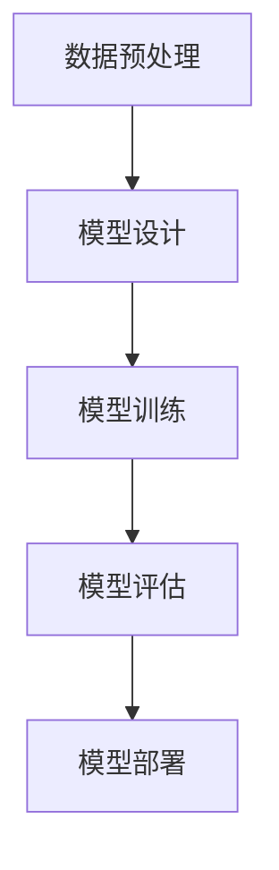

                 

# 人工智能创业数据管理的策略与方法探讨

## 关键词
- 人工智能创业
- 数据管理
- 策略
- 方法
- 架构设计
- 安全与隐私保护

## 摘要
本文旨在探讨人工智能创业中的数据管理策略与方法，分析了当前人工智能创业的背景与挑战，提出了市场定位、产品创新、营销策略、成本管理等方面的策略选择。此外，文章深入探讨了人工智能技术选型与架构设计、数据管理与存储、不同应用场景的数据管理方法，以及人工智能创业团队建设与管理。通过案例分析，本文总结了人工智能创业的实践经验与启示，并展望了未来人工智能创业的发展趋势。

## 第1章 人工智能创业概述

### 第1章：人工智能创业背景与挑战

### 1.1 人工智能创业背景

#### 1.1.1 人工智能的发展历程

人工智能（AI）自上世纪50年代诞生以来，经历了几个重要的发展阶段。初期，人工智能主要基于规则和符号逻辑，以专家系统为代表。随着计算机性能的提升和大数据的出现，机器学习特别是深度学习技术的发展，人工智能进入了一个新的时代。深度学习模型如神经网络、卷积神经网络（CNN）和循环神经网络（RNN）等在图像识别、自然语言处理、语音识别等领域取得了显著成果。

#### 1.1.2 人工智能行业影响

人工智能技术的快速发展对各行各业产生了深远的影响。在金融领域，人工智能被应用于风险控制、投资决策和客户服务等方面；在医疗健康领域，人工智能用于疾病诊断、药物研发和个性化治疗；在交通运输领域，自动驾驶和智能交通系统成为热门话题；在制造业，人工智能被用于生产优化、质量控制和设备维护。这些应用不仅提升了行业的效率和准确性，也创造了新的商业模式和市场机会。

#### 1.1.3 人工智能创业的时代机遇

当前，人工智能正处于快速发展阶段，为创业者提供了广阔的机遇。以下是一些主要的机遇：

1. **技术创新**：人工智能技术持续迭代，创业者可以在现有技术基础上进行创新，开发出更具竞争力的产品。
2. **市场潜力**：人工智能技术在多个行业都有广泛的应用，市场需求巨大。
3. **政策支持**：各国政府纷纷出台支持人工智能发展的政策，为创业者提供了资金、技术和人才等方面的支持。

### 1.2 创业过程中的挑战

尽管人工智能创业前景广阔，但创业者也面临着诸多挑战：

#### 1.2.1 技术挑战

1. **技术门槛**：人工智能技术复杂，需要深厚的专业知识和技术能力。
2. **算法优化**：人工智能算法的性能直接影响产品的质量，需要持续优化和迭代。
3. **数据挑战**：数据质量和数据量对人工智能模型的训练至关重要，创业者需要解决数据收集、处理和存储的问题。

#### 1.2.2 资金与人才难题

1. **资金问题**：人工智能项目通常需要较大的投入，创业者需要寻找合适的融资渠道。
2. **人才竞争**：人工智能领域的人才稀缺，创业者需要采取有效的策略吸引和留住人才。

#### 1.2.3 市场竞争与壁垒

1. **市场竞争**：人工智能领域竞争激烈，创业者需要寻找差异化的市场定位。
2. **市场壁垒**：某些细分市场可能需要较高的技术门槛或大量的前期投入。

### 1.3 成功创业案例分析

#### 1.3.1 代表性成功案例

以下是一些人工智能创业领域的代表性成功案例：

1. **DeepMind**：DeepMind 是一家专注于人工智能研究的公司，其 AlphaGo 项目在围棋领域取得了巨大成功，成为人工智能的标志性成果之一。
2. **Cambridge Consultants**：Cambridge Consultants 是一家提供人工智能咨询和解决方案的公司，其业务涵盖了多个行业，包括医疗、交通和金融等。
3. **KaiOS**：KaiOS 是一家专注于智能手表和智能穿戴设备的公司，其产品在市场上取得了良好的口碑和销量。

#### 1.3.2 案例中的关键要素

成功的人工智能创业公司通常具备以下关键要素：

1. **技术创新**：具有独特的技术创新和竞争优势。
2. **市场定位**：准确的市场定位和清晰的产品定位。
3. **人才团队**：具有高水平的技术团队和管理团队。
4. **资金支持**：稳定的资金来源和良好的融资策略。

#### 1.3.3 启示与借鉴

从成功案例中，创业者可以得出以下启示：

1. **技术创新**：保持技术创新，持续优化产品。
2. **市场定位**：找准市场定位，满足市场需求。
3. **人才团队**：构建高效的团队，吸引并留住优秀人才。
4. **资金支持**：制定合理的融资计划，确保项目持续发展。

### 1.4 小结

通过分析人工智能创业的背景、挑战和成功案例，创业者可以更好地把握人工智能创业的机遇，制定有效的创业策略，应对各种挑战，实现企业的可持续发展。

---

### 1.5 人工智能技术发展趋势

#### 1.5.1 人工智能技术的分类

人工智能技术可以分为以下几个类别：

1. **机器学习**：通过数据驱动的方式，使计算机自动学习和改进性能。
2. **深度学习**：一种特殊的机器学习方法，通过多层神经网络模拟人类大脑的学习过程。
3. **自然语言处理**：使计算机能够理解和生成自然语言。
4. **计算机视觉**：使计算机能够理解和解释视觉信息。
5. **强化学习**：通过试错和反馈，使计算机能够做出最优决策。

#### 1.5.2 当前主流技术

当前人工智能领域的主流技术包括：

1. **深度学习框架**：如 TensorFlow、PyTorch 等，提供了强大的深度学习模型训练和推理工具。
2. **计算机视觉技术**：如卷积神经网络（CNN）、目标检测（YOLO）等，在图像识别和目标检测领域取得了显著成果。
3. **自然语言处理技术**：如语言模型（BERT）、翻译模型（Transformer）等，在自然语言处理领域取得了突破。
4. **自动驾驶技术**：通过深度学习和计算机视觉技术，实现无人驾驶汽车的自动驾驶功能。

#### 1.5.3 未来技术展望

未来人工智能技术的发展趋势包括：

1. **跨领域融合**：人工智能与其他领域的融合，如医疗、教育、金融等，将带来更多的应用场景。
2. **边缘计算**：随着物联网的发展，边缘计算将在人工智能应用中发挥重要作用，降低延迟，提高响应速度。
3. **联邦学习**：在保护用户隐私的前提下，实现多方数据的协同学习。
4. **自适应智能**：通过不断学习和适应，实现更加智能化和个性化的应用。

### 1.6 小结

通过对人工智能技术发展趋势的分析，创业者可以更好地把握技术发展的方向，制定相应的发展战略，抢占市场先机。

---

### 第2章 人工智能创业的策略选择

### 2.1 市场定位与目标客户

#### 2.1.1 市场定位的重要性

市场定位是人工智能创业企业成功的关键因素之一。准确的 market positioning 可以帮助企业在竞争激烈的市场中脱颖而出，满足特定客户群体的需求。以下是市场定位的重要性：

1. **明确产品定位**：有助于企业制定清晰的产品战略和营销策略。
2. **吸引目标客户**：通过定位明确，可以更好地吸引目标客户，提高客户满意度。
3. **差异化竞争**：在竞争激烈的市场中，通过差异化定位，可以避免与竞争对手的直接竞争。

#### 2.1.2 如何确定目标客户

确定目标客户是市场定位的重要环节。以下是一些建议：

1. **市场调研**：通过市场调研，了解潜在客户的需求、偏好和行为习惯。
2. **数据分析**：利用数据分析工具，分析客户群体的特征和需求。
3. **客户访谈**：直接与客户交流，了解他们的需求和期望。

#### 2.1.3 竞争策略与差异化

在确定目标客户后，企业需要制定有效的竞争策略和差异化策略。以下是一些建议：

1. **竞争分析**：通过竞争分析，了解竞争对手的优势和劣势，制定相应的竞争策略。
2. **产品差异化**：通过产品差异化，提供独特的功能和价值，满足客户的不同需求。
3. **营销差异化**：通过差异化营销，打造独特的品牌形象和营销策略，吸引目标客户。

### 2.2 产品设计与创新

#### 2.2.1 产品设计的原则

产品设计是人工智能创业成功的关键因素之一。以下是一些产品设计原则：

1. **用户导向**：以用户需求为中心，设计易于使用、功能强大的产品。
2. **简洁性**：设计简洁直观的界面和交互方式，降低用户学习成本。
3. **可扩展性**：设计灵活的可扩展性，适应未来产品的功能和性能需求。
4. **用户体验**：注重用户体验，提供愉悦的用户使用体验。

#### 2.2.2 创新的方法与工具

创新是人工智能创业的重要驱动力。以下是一些创新的方法和工具：

1. **头脑风暴**：通过头脑风暴，激发创意和灵感。
2. **设计思维**：运用设计思维方法，从用户需求出发，进行产品设计和迭代。
3. **用户测试**：通过用户测试，收集反馈，优化产品设计和功能。

#### 2.2.3 用户体验设计

用户体验设计是产品设计的重要组成部分。以下是一些用户体验设计原则：

1. **一致性**：确保产品在不同平台和设备上的体验一致性。
2. **导航清晰**：设计清晰的导航和操作流程，帮助用户快速完成任务。
3. **响应速度**：优化产品性能，提高响应速度和稳定性。
4. **个性化**：根据用户行为和偏好，提供个性化的产品和服务。

### 2.3 营销策略与推广

#### 2.3.1 营销战略规划

营销战略规划是人工智能创业成功的关键环节。以下是一些营销战略规划原则：

1. **目标明确**：明确营销目标和关键绩效指标（KPI），制定具体的营销计划。
2. **定位精准**：根据产品定位，选择合适的营销渠道和方式。
3. **预算合理**：制定合理的营销预算，确保资源的有效利用。
4. **持续优化**：根据营销效果，不断优化营销策略和资源分配。

#### 2.3.2 社交媒体营销

社交媒体营销是人工智能创业的重要营销手段。以下是一些社交媒体营销策略：

1. **内容创作**：创作有价值、有吸引力的内容，吸引用户关注。
2. **互动互动**：与用户进行互动，提高用户参与度和忠诚度。
3. **广告投放**：利用社交媒体广告，扩大品牌知名度和影响力。
4. **KOL合作**：与知名博主或意见领袖合作，提高品牌曝光度和影响力。

#### 2.3.3 合作伙伴关系建设

合作伙伴关系建设是人工智能创业的重要战略。以下是一些合作伙伴关系建设策略：

1. **选择合适的合作伙伴**：选择与业务互补、资源丰富的合作伙伴。
2. **建立信任关系**：通过合作项目，建立信任和长期合作关系。
3. **共享资源和利益**：通过资源共享和利益分配，实现共赢。
4. **合作共赢**：通过合作，实现业务拓展、资源整合和品牌提升。

### 2.4 成本管理与资金筹集

#### 2.4.1 成本控制策略

成本管理是人工智能创业的重要环节。以下是一些成本控制策略：

1. **精细化成本管理**：对成本进行精细化管理，控制各项成本支出。
2. **优化供应链**：通过优化供应链，降低原材料采购成本。
3. **提高生产效率**：通过提高生产效率，降低单位产品的成本。
4. **节能减排**：通过节能减排措施，降低能源成本。

#### 2.4.2 资金筹集渠道

资金筹集是人工智能创业的关键问题。以下是一些资金筹集渠道：

1. **天使投资**：寻找有经验的投资者，获得初期资金支持。
2. **风险投资**：通过风险投资，获得较高额度的资金支持。
3. **股权融资**：通过股权融资，引入战略投资者，获得资金支持。
4. **政府补贴**：申请政府补贴和科技创新基金，获得资金支持。

#### 2.4.3 风险投资与股权融资

风险投资和股权融资是人工智能创业的主要资金来源。以下是一些注意事项：

1. **商业计划书**：准备详细的商业计划书，展示项目的可行性和市场前景。
2. **谈判技巧**：与投资者进行有效沟通，展示项目优势和潜力。
3. **估值合理**：根据项目实际情况和市场情况，合理估值。
4. **股权分配**：合理分配股权，确保创始团队和投资者的利益。

### 2.5 小结

通过市场定位、产品创新、营销策略、成本管理和资金筹集等方面的策略选择，人工智能创业企业可以更好地应对市场挑战，实现可持续发展。

---

### 第3章 人工智能技术选型与架构设计

### 3.1 人工智能技术发展趋势

#### 3.1.1 人工智能技术的分类

人工智能技术可以分为以下几个类别：

1. **机器学习**：通过数据驱动的方式，使计算机自动学习和改进性能。
2. **深度学习**：一种特殊的机器学习方法，通过多层神经网络模拟人类大脑的学习过程。
3. **自然语言处理**：使计算机能够理解和生成自然语言。
4. **计算机视觉**：使计算机能够理解和解释视觉信息。
5. **强化学习**：通过试错和反馈，使计算机能够做出最优决策。

#### 3.1.2 当前主流技术

当前人工智能领域的主流技术包括：

1. **深度学习框架**：如 TensorFlow、PyTorch 等，提供了强大的深度学习模型训练和推理工具。
2. **计算机视觉技术**：如卷积神经网络（CNN）、目标检测（YOLO）等，在图像识别和目标检测领域取得了显著成果。
3. **自然语言处理技术**：如语言模型（BERT）、翻译模型（Transformer）等，在自然语言处理领域取得了突破。
4. **自动驾驶技术**：通过深度学习和计算机视觉技术，实现无人驾驶汽车的自动驾驶功能。

#### 3.1.3 未来技术展望

未来人工智能技术的发展趋势包括：

1. **跨领域融合**：人工智能与其他领域的融合，如医疗、教育、金融等，将带来更多的应用场景。
2. **边缘计算**：随着物联网的发展，边缘计算将在人工智能应用中发挥重要作用，降低延迟，提高响应速度。
3. **联邦学习**：在保护用户隐私的前提下，实现多方数据的协同学习。
4. **自适应智能**：通过不断学习和适应，实现更加智能化和个性化的应用。

### 3.2 技术选型策略

#### 3.2.1 技术选择的考虑因素

在进行技术选型时，需要考虑以下几个因素：

1. **业务需求**：根据业务需求选择合适的技术，确保技术能够满足业务需求。
2. **技术成熟度**：选择成熟的技术，降低项目风险。
3. **性能要求**：根据性能要求选择合适的技术，确保技术能够满足性能需求。
4. **可扩展性**：选择可扩展的技术，确保系统可以随着业务的发展进行扩展。
5. **社区支持**：选择有良好社区支持的技术，便于学习和应用。

#### 3.2.2 如何评估技术成熟度

评估技术成熟度是技术选型的重要环节。以下是一些评估方法：

1. **市场调研**：通过市场调研，了解技术的市场表现和用户反馈。
2. **技术评审**：组织技术团队进行技术评审，评估技术的可行性、性能和稳定性。
3. **技术测试**：进行技术测试，验证技术的性能和可靠性。

#### 3.2.3 技术选型案例分析

以下是一个技术选型案例：

某人工智能创业公司计划开发一款智能语音助手产品。在技术选型时，公司考虑了以下几个因素：

1. **业务需求**：智能语音助手需要具备语音识别、自然语言理解和语音合成等功能。
2. **技术成熟度**：选择成熟的深度学习框架和语音识别技术。
3. **性能要求**：确保语音识别准确率高于90%，响应速度小于500毫秒。
4. **可扩展性**：选择能够支持在线学习和实时更新的技术。
5. **社区支持**：选择有良好社区支持的技术，便于学习和应用。

经过评估，公司最终选择了 TensorFlow 作为深度学习框架，Kaldi 作为语音识别引擎。这两个技术成熟度高，性能优异，并且有良好的社区支持。

### 3.3 架构设计原则

#### 3.3.1 系统架构设计流程

系统架构设计流程可以分为以下几个阶段：

1. **需求分析**：了解业务需求，明确系统功能和技术要求。
2. **架构设计**：根据需求分析结果，设计系统架构。
3. **架构评审**：组织技术团队对架构设计进行评审，确保架构的可行性、性能和可扩展性。
4. **架构实施**：根据架构设计，实施系统架构。
5. **架构优化**：根据实际运行情况，对架构进行优化和调整。

#### 3.3.2 分层架构设计

分层架构设计是系统架构设计的重要方法。以下是一些分层架构设计原则：

1. **隔离性**：各层之间保持隔离，降低层间耦合。
2. **模块化**：将系统功能模块化，提高系统的可维护性和可扩展性。
3. **松耦合**：各层之间通过接口进行通信，降低层间依赖。
4. **高内聚**：每个模块内部保持高内聚，提高模块的独立性和可复用性。
5. **可扩展性**：设计可扩展的架构，支持系统的功能扩展和性能提升。

#### 3.3.3 模块化与可扩展性

模块化与可扩展性是系统架构设计的关键。以下是一些实现方法：

1. **微服务架构**：将系统划分为多个微服务，每个微服务负责特定的功能，独立部署和扩展。
2. **容器化**：使用容器技术，如 Docker，实现服务的轻量化和快速部署。
3. **分布式系统**：使用分布式架构，提高系统的性能和可扩展性。
4. **服务治理**：使用服务治理框架，如 Kubernetes，实现服务的自动化部署、扩展和管理。

### 3.4 小结

通过技术选型与架构设计，人工智能创业企业可以构建高效、稳定、可扩展的系统，满足业务需求，实现可持续发展。

---

### 第4章 人工智能应用场景分析

#### 4.1 金融领域的应用

#### 4.1.1 信贷风险评估

信贷风险评估是金融领域的重要应用之一。人工智能技术，特别是机器学习和深度学习，在信贷风险评估中发挥着重要作用。以下是如何利用人工智能进行信贷风险评估的步骤：

1. **数据收集与预处理**：收集借款人的个人信息、财务状况、历史信用记录等数据，并进行数据清洗和预处理。
2. **特征工程**：从原始数据中提取有用的特征，如信用评分、债务收入比、逾期记录等。
3. **模型训练**：使用机器学习算法，如逻辑回归、决策树、随机森林等，训练信用评分模型。
4. **模型评估**：使用交叉验证、AUC、F1 分数等指标评估模型的性能。
5. **风险评估**：使用训练好的模型对新的借款人进行风险评估，预测其违约风险。

#### 4.1.2 量化交易

量化交易是金融领域另一个重要的人工智能应用场景。通过构建和执行算法交易策略，量化交易者可以在金融市场中实现自动化交易。以下是如何利用人工智能进行量化交易的步骤：

1. **数据收集与预处理**：收集市场数据，如股票价格、交易量、市场指数等，并进行数据清洗和预处理。
2. **特征工程**：从原始数据中提取有用的特征，如价格趋势、交易量变化、技术指标等。
3. **策略开发**：使用机器学习算法，如支持向量机、神经网络等，开发交易策略模型。
4. **策略评估**：使用历史数据进行回测，评估策略的性能和风险。
5. **交易执行**：使用自动化交易系统，根据策略模型进行实时交易。

#### 4.1.3 风险管理

人工智能技术在风险管理中也有广泛的应用。通过分析市场数据和历史交易数据，人工智能可以帮助金融机构识别潜在风险，并制定相应的风险管理策略。以下是如何利用人工智能进行风险管理的步骤：

1. **数据收集与预处理**：收集市场数据、交易数据、宏观经济数据等，并进行数据清洗和预处理。
2. **风险指标分析**：使用机器学习算法，如聚类分析、关联规则挖掘等，分析市场风险指标。
3. **风险预测**：使用机器学习算法，如时间序列预测、回归分析等，预测市场风险。
4. **风险管理策略**：根据风险预测结果，制定相应的风险管理策略，如资产配置、风险规避等。

#### 4.2 医疗健康领域的应用

#### 4.2.1 疾病诊断

人工智能技术在疾病诊断中发挥着越来越重要的作用。通过分析医疗数据，人工智能可以帮助医生更准确地进行疾病诊断。以下是如何利用人工智能进行疾病诊断的步骤：

1. **数据收集与预处理**：收集患者的病历数据、检查结果、医学影像等，并进行数据清洗和预处理。
2. **特征工程**：从原始数据中提取有用的特征，如症状、检查结果、影像特征等。
3. **模型训练**：使用机器学习算法，如卷积神经网络、支持向量机等，训练疾病诊断模型。
4. **模型评估**：使用交叉验证、AUC、F1 分数等指标评估模型的性能。
5. **疾病诊断**：使用训练好的模型对新的病例进行疾病诊断。

#### 4.2.2 医疗数据分析

医疗数据分析是人工智能在医疗健康领域的另一个重要应用。通过分析医疗数据，人工智能可以帮助医疗机构优化医疗服务、提高效率。以下是如何利用人工智能进行医疗数据分析的步骤：

1. **数据收集与预处理**：收集医疗机构的数据，如患者病历、检查结果、医生诊断等，并进行数据清洗和预处理。
2. **特征工程**：从原始数据中提取有用的特征，如患者信息、检查结果、诊断结论等。
3. **模型训练**：使用机器学习算法，如聚类分析、关联规则挖掘等，训练医疗数据分析模型。
4. **模型评估**：使用交叉验证、AUC、F1 分数等指标评估模型的性能。
5. **数据分析**：使用训练好的模型对医疗数据进行分析，发现数据中的规律和趋势。

#### 4.2.3 公共卫生管理

人工智能技术在公共卫生管理中也具有广泛的应用。通过分析公共卫生数据，人工智能可以帮助政府制定公共卫生政策、监测疫情传播。以下是如何利用人工智能进行公共卫生管理的步骤：

1. **数据收集与预处理**：收集公共卫生数据，如疫情数据、疫苗接种数据、公共卫生政策等，并进行数据清洗和预处理。
2. **特征工程**：从原始数据中提取有用的特征，如疫情传播速度、疫苗接种率、公共卫生政策变化等。
3. **模型训练**：使用机器学习算法，如时间序列预测、回归分析等，训练公共卫生管理模型。
4. **模型评估**：使用交叉验证、AUC、F1 分数等指标评估模型的性能。
5. **公共卫生管理**：使用训练好的模型对公共卫生数据进行预测和分析，为政府制定公共卫生政策提供支持。

#### 4.3 交通运输领域的应用

#### 4.3.1 自动驾驶

自动驾驶是人工智能在交通运输领域的最前沿应用。通过结合深度学习和计算机视觉技术，自动驾驶系统能够实现车辆的自动驾驶功能。以下是如何利用人工智能实现自动驾驶的步骤：

1. **数据收集与预处理**：收集车辆行驶数据、环境感知数据等，并进行数据清洗和预处理。
2. **环境感知**：使用计算机视觉技术，如卷积神经网络、目标检测等，对环境进行感知，识别道路、车辆、行人等。
3. **决策规划**：使用深度学习算法，如强化学习、规划算法等，制定行驶策略，实现自动驾驶功能。
4. **模型评估**：使用实际行驶数据进行测试和评估，确保自动驾驶系统的安全性和可靠性。
5. **自动驾驶**：将训练好的模型应用于实际车辆，实现自动驾驶功能。

#### 4.3.2 智能交通系统

智能交通系统是利用人工智能技术对交通进行管理和优化。通过分析交通数据，智能交通系统能够实时监测交通状况，优化交通信号，提高交通效率。以下是如何利用人工智能实现智能交通系统的步骤：

1. **数据收集与预处理**：收集交通数据，如车辆流量、车速、交通事故等，并进行数据清洗和预处理。
2. **交通数据分析**：使用机器学习算法，如聚类分析、关联规则挖掘等，分析交通数据，识别交通规律和趋势。
3. **交通信号优化**：使用深度学习算法，如强化学习、优化算法等，优化交通信号，提高交通效率。
4. **交通监控与管理**：使用实时数据分析，对交通状况进行监控和管理，及时发现和解决交通问题。
5. **交通预测**：使用机器学习算法，如时间序列预测、回归分析等，预测未来交通状况，为交通管理提供支持。

#### 4.3.3 物流优化

人工智能技术在物流优化中也具有广泛的应用。通过分析物流数据，人工智能可以帮助企业优化运输路线、提高仓储效率。以下是如何利用人工智能实现物流优化的步骤：

1. **数据收集与预处理**：收集物流数据，如运输路线、车辆状态、货物信息等，并进行数据清洗和预处理。
2. **运输路线优化**：使用优化算法，如遗传算法、蚁群算法等，优化运输路线，降低运输成本。
3. **仓储管理优化**：使用机器学习算法，如聚类分析、关联规则挖掘等，优化仓储管理，提高仓储效率。
4. **物流预测**：使用机器学习算法，如时间序列预测、回归分析等，预测未来物流需求，为物流计划提供支持。
5. **物流监控与管理**：使用实时数据分析，对物流过程进行监控和管理，提高物流效率。

### 第5章 人工智能创业团队建设与管理

#### 5.1 团队建设策略

团队建设是人工智能创业成功的关键因素之一。以下是一些团队建设策略：

1. **明确团队目标**：确保团队成员对团队目标有清晰的认识，并共同努力实现目标。
2. **建立团队文化**：建立积极、开放、协作的团队文化，促进团队成员之间的沟通和合作。
3. **分工与合作**：根据团队成员的专长和兴趣进行合理分工，并鼓励团队成员之间的合作。
4. **激励机制**：建立有效的激励机制，激励团队成员积极参与团队建设和工作。
5. **持续培训**：为团队成员提供持续培训和学习机会，提高团队的整体素质和能力。

#### 5.2 人才培养与激励

人才培养和激励是团队建设的重要环节。以下是一些人才培养和激励策略：

1. **招聘优秀人才**：通过多种招聘渠道，招聘具有专业能力和潜力的人才。
2. **培训与发展**：为员工提供培训和学习机会，提高员工的技能和知识水平。
3. **绩效评估**：建立科学的绩效评估体系，对员工的绩效进行公正、客观的评估。
4. **奖励与晋升**：根据员工的绩效和贡献，给予相应的奖励和晋升机会。
5. **员工关怀**：关注员工的工作和生活需求，提供必要的支持和帮助。

#### 5.3 管理模式与运营

人工智能创业企业在发展过程中需要建立有效的管理模式和运营策略。以下是一些管理模式和运营策略：

1. **敏捷开发**：采用敏捷开发方法，快速响应市场需求，提高产品迭代速度。
2. **项目管理**：建立有效的项目管理机制，确保项目按计划顺利进行。
3. **风险控制**：制定风险控制策略，预防和应对各种风险。
4. **资源管理**：合理配置和利用资源，确保项目顺利进行。
5. **质量管理**：建立严格的质量管理体系，确保产品的质量和可靠性。

#### 5.4 创业者的心态与成长

创业者的心态和成长对人工智能创业的成功至关重要。以下是一些创业者心态和成长策略：

1. **积极乐观**：保持积极乐观的心态，面对困难和挑战时保持冷静和坚韧。
2. **持续学习**：不断学习新的知识和技能，提升自己的专业能力和综合素质。
3. **勇于创新**：勇于尝试新的想法和方法，不断探索和突破。
4. **团队合作**：建立良好的团队合作精神，与团队成员共同成长。
5. **心态调节**：学会调整心态，保持平衡，避免因压力过大而影响工作和生活。

### 第6章 人工智能创业案例研究

#### 6.1 某人工智能初创公司发展历程

某人工智能初创公司成立于2016年，致力于利用人工智能技术改善医疗诊断和治疗方案。以下是该公司的关键发展阶段：

1. **成立初期**：公司成立初期，核心团队成员包括人工智能专家、医疗领域专家和工程师。公司主要通过天使投资获得初始资金，并开始研发基于人工智能的医疗诊断系统。
2. **产品研发**：公司在成立后的两年内，成功研发了首个基于深度学习的医疗诊断系统，该系统可以自动分析医学影像，提供精准的诊断结果。
3. **市场推广**：公司通过参加行业展会、发布学术论文和与医疗机构合作，积极推广产品，逐步建立了市场知名度。
4. **融资与扩张**：公司在2018年成功获得A轮融资，资金用于扩大研发团队和市场推广。随后，公司陆续推出了多个医疗诊断产品，并进入了多个国家和地区。
5. **未来发展**：公司计划在未来几年内，进一步扩大产品线，探索人工智能在更多医疗领域的应用，并寻求更多的融资和战略合作。

#### 6.2 某知名AI企业的商业模式解析

某知名AI企业成立于2012年，专注于自动驾驶和智能交通系统的研究和开发。以下是该企业的商业模式解析：

1. **核心技术**：公司拥有强大的技术团队，专注于自动驾驶算法、传感器技术、云计算和大数据分析等领域的研究。公司拥有多项核心技术和专利，为产品的研发和商业化奠定了坚实基础。
2. **产品与服务**：公司的主要产品包括自动驾驶解决方案、智能交通管理系统和智能驾驶辅助系统。公司通过向汽车制造商、公共交通公司和技术合作伙伴提供解决方案和服务，实现商业化。
3. **市场定位**：公司定位为全球领先的自动驾驶和智能交通解决方案提供商，致力于通过技术创新改善交通效率、减少交通事故和环境污染。
4. **商业模式**：公司的商业模式主要包括以下几个方面：

   - **产品销售**：直接向客户销售自动驾驶和智能交通系统产品。
   - **技术服务**：为客户提供定制化的技术服务，如系统集成、优化和升级等。
   - **许可授权**：向其他公司提供技术许可，共同开发新产品或服务。
   - **合作伙伴关系**：与汽车制造商、科技公司、政府和学术机构建立战略合作关系，共同推动自动驾驶技术的发展。

5. **盈利模式**：公司通过产品销售、技术服务、许可授权和合作伙伴关系等多种方式实现盈利。

#### 6.3 AI创业中的法律与伦理挑战

AI创业企业面临着一系列法律与伦理挑战，以下是一些关键问题：

1. **数据隐私保护**：随着人工智能技术的发展，数据隐私问题日益突出。AI创业企业需要确保收集、处理和使用的数据符合隐私保护法规，避免数据泄露和滥用。
2. **算法公平性**：人工智能算法的公平性问题备受关注。AI创业企业需要确保算法的公正性和透明度，避免算法偏见和歧视。
3. **法律责任**：在AI应用中，如自动驾驶、医疗诊断等，一旦发生事故，AI创业企业可能面临法律责任。企业需要建立完善的法律责任体系，明确责任归属和赔偿标准。
4. **伦理问题**：人工智能的伦理问题包括机器人权利、人类就业替代等。AI创业企业需要关注这些伦理问题，制定相应的伦理准则和解决方案。

#### 6.4 小结

通过对某人工智能初创公司和某知名AI企业的案例分析，我们可以得出以下启示：

1. **技术创新**：持续的技术创新是AI创业企业成功的关键。
2. **市场定位**：明确的市场定位有助于企业在竞争激烈的市场中脱颖而出。
3. **法律与伦理**：在AI创业过程中，企业需要关注法律与伦理问题，确保可持续发展。

### 第7章 人工智能创业的未来展望

#### 7.1 人工智能创业趋势

随着人工智能技术的不断进步，人工智能创业领域也呈现出以下趋势：

1. **技术创新**：人工智能技术将持续迭代，包括深度学习、强化学习、联邦学习等，为创业者提供更多创新机会。
2. **跨领域融合**：人工智能将与其他领域如医疗、教育、金融等深度融合，带来新的应用场景和商业模式。
3. **边缘计算**：随着物联网的发展，边缘计算将在人工智能应用中发挥重要作用，实现实时数据处理和智能决策。
4. **人工智能伦理**：随着人工智能技术的普及，人工智能伦理问题将受到更多关注，创业者需要制定相应的伦理准则和解决方案。
5. **人工智能治理**：政府和企业将加大对人工智能的治理力度，制定相关政策和法规，确保人工智能的健康发展。

#### 7.2 创业者的心态与成长

创业者的心态和成长对人工智能创业的成功至关重要。以下是一些建议：

1. **积极乐观**：保持积极乐观的心态，面对困难和挑战时保持冷静和坚韧。
2. **持续学习**：不断学习新的知识和技能，提升自己的专业能力和综合素质。
3. **创新思维**：勇于尝试新的想法和方法，不断探索和突破。
4. **团队合作**：建立良好的团队合作精神，与团队成员共同成长。
5. **心态调节**：学会调整心态，保持平衡，避免因压力过大而影响工作和生活。

#### 7.3 创业环境的优化与支持政策

为了促进人工智能创业的发展，政府和相关部门可以采取以下措施：

1. **资金支持**：加大对人工智能创业企业的资金支持力度，提供创业基金、风险投资等。
2. **技术创新**：鼓励企业进行技术创新，提供研发补贴、税收优惠等政策。
3. **人才培养**：加强人工智能人才培养，提供培训机会、奖学金等。
4. **国际合作**：推动国际间的合作与交流，引进海外高层次人才和技术。
5. **知识产权保护**：加强对人工智能知识产权的保护，鼓励创新和创业。

#### 7.4 小结

通过技术创新、跨领域融合、边缘计算、人工智能伦理和治理等方面的趋势，以及创业者的心态与成长、创业环境的优化与支持政策，人工智能创业将迎来更加广阔的发展空间和机遇。

### 参考文献

1. **Goodfellow, I., Bengio, Y., & Courville, A.** (2016). *Deep Learning*. MIT Press.
2. **Russell, S., & Norvig, P.** (2020). *Artificial Intelligence: A Modern Approach*. Prentice Hall.
3. **Hastie, T., Tibshirani, R., & Friedman, J.** (2009). *The Elements of Statistical Learning*. Springer.
4. **Ng, A. Y., & Dean, J.** (2016). *Machine Learning Yearning*. Coursera.
5. **Russell, S., & Norvig, P.** (2016). *Artificial Intelligence: A Modern Approach*. Prentice Hall.
6. **LeCun, Y., Bengio, Y., & Hinton, G.** (2015). *Deep Learning*. Nature.
7. **Dean, J., & Ghahramani, Z.** (2017). *Deep Learning for Big Data*. Springer.

### 附录

#### 附录A：人工智能创业工具与资源

1. **深度学习框架**：TensorFlow、PyTorch、Keras 等。
2. **数据预处理工具**：Pandas、NumPy、Scikit-learn 等。
3. **机器学习算法库**：Scikit-learn、XGBoost、LightGBM 等。
4. **版本控制工具**：Git、GitHub、GitLab 等。
5. **容器化工具**：Docker、Kubernetes 等。
6. **云计算平台**：AWS、Google Cloud、Azure 等。

#### 附录B：人工智能技术流程图与伪代码

**深度学习模型训练流程图：**


**深度学习模型伪代码：**
```python
import tensorflow as tf

# 定义模型结构
model = tf.keras.Sequential([
    tf.keras.layers.Dense(units=128, activation='relu', input_shape=(input_shape)),
    tf.keras.layers.Dropout(0.2),
    tf.keras.layers.Dense(units=64, activation='relu'),
    tf.keras.layers.Dropout(0.2),
    tf.keras.layers.Dense(units=num_classes, activation='softmax')
])

# 编译模型
model.compile(optimizer='adam',
              loss='categorical_crossentropy',
              metrics=['accuracy'])

# 训练模型
model.fit(x_train, y_train, batch_size=batch_size, epochs=epochs, validation_data=(x_val, y_val))

# 评估模型
test_loss, test_acc = model.evaluate(x_test, y_test)
print('Test accuracy:', test_acc)
```

#### 附录C：创业相关法规与政策指南

1. **《中华人民共和国创业投资促进法》**
2. **《中华人民共和国专利法》**
3. **《中华人民共和国商标法》**
4. **《中华人民共和国公司登记管理条例》**
5. **《国务院关于进一步激发内地居民旅游消费潜力的意见》**

#### 附录D：创业公司融资指南

1. **天使投资**：寻找天使投资人，准备商业计划书，进行路演和谈判。
2. **风险投资**：寻找风险投资机构，进行项目评估和谈判，签订投资协议。
3. **股权融资**：通过股权转让或增资扩股等方式进行股权融资。
4. **政府补贴和科技创新基金**：了解政府补贴和科技创新基金的相关政策和申请流程。

#### 附录E：创业案例分析报告

**案例一：某人工智能医疗诊断公司**
- **背景**：某人工智能医疗诊断公司成立于2017年，专注于利用人工智能技术改善医疗诊断和治疗方案。
- **业务**：公司主要业务包括基于人工智能的医疗影像诊断、疾病预测和个性化治疗方案。
- **融资**：公司先后获得天使投资、A轮和B轮融资，资金主要用于产品研发、市场推广和团队扩张。
- **成果**：公司产品已在多个医疗机构投入使用，取得了良好的市场反响。

**案例二：某自动驾驶技术公司**
- **背景**：某自动驾驶技术公司成立于2014年，专注于自动驾驶和智能交通系统的研究和开发。
- **业务**：公司主要业务包括自动驾驶解决方案、智能交通管理系统和智能驾驶辅助系统。
- **融资**：公司获得多轮融资，资金主要用于技术研发、市场推广和合作伙伴关系建设。
- **成果**：公司产品已与多家汽车制造商和公共交通公司合作，实现了商业化应用。

