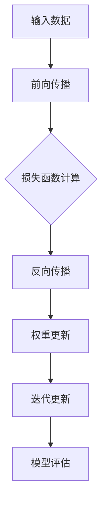

                 

# 文章标题：人工智能创业策略

## 关键词

人工智能、创业策略、机器学习、深度学习、自然语言处理、创业资源

## 摘要

本文旨在为希望投身人工智能创业领域的创业者提供一套完整的策略指导。通过对人工智能行业概述、核心技术与原理的深入分析，本文将帮助创业者建立系统的AI知识体系，从而在项目规划与实施、融资与成长、行业合作与竞争等方面制定出有效的创业策略。通过成功的人工智能创业案例分析，本文将为读者提供实用的参考和启示，助力他们在人工智能领域取得成功。

### 第一部分：人工智能行业概述

#### 第1章 人工智能行业概览

### 1.1 人工智能的定义与发展历程

人工智能（AI）是指由人制造出来的系统能够模仿、延伸和扩展人类智能的理论、技术及应用。人工智能的发展历程可以追溯到20世纪50年代，当时人工智能的概念被首次提出。自那以后，人工智能经历了几个发展阶段，包括规则推理、知识表示和机器学习等。当前，人工智能已经进入深度学习和强化学习阶段，取得了显著的技术突破。

### 1.2 人工智能的分类与典型应用

人工智能可以分为几种主要类型，包括符号人工智能、感知人工智能和认知人工智能。符号人工智能依赖于逻辑和符号表示，如专家系统和推理机；感知人工智能涉及到计算机视觉、语音识别和自然语言处理等；认知人工智能则关注于模拟人类思维过程，如机器学习和深度学习。

典型的人工智能应用包括自动驾驶、智能家居、智能客服、医疗诊断和金融风控等。这些应用不仅改变了人们的生活方式，还推动了相关行业的转型升级。

### 1.3 人工智能行业趋势与挑战

人工智能行业正面临着迅速发展的趋势，包括技术的不断进步、应用的广泛拓展以及资本的涌入。然而，创业者也面临着一系列挑战，如技术壁垒、数据隐私和安全、法律法规的不确定性等。为了应对这些挑战，创业者需要持续关注行业动态，积极探索创新解决方案。

#### 第2章 人工智能市场分析

### 2.1 人工智能市场规模与增长预测

根据市场研究报告，全球人工智能市场规模预计将从2020年的370亿美元增长到2025年的1900亿美元，年复合增长率达到38.3%。这种快速增长主要得益于人工智能技术的应用不断拓展，特别是在医疗、金融、零售和制造业等领域的深入应用。

### 2.2 人工智能行业竞争格局

人工智能行业竞争激烈，主要参与者包括科技公司、学术机构和初创企业。其中，科技公司如谷歌、微软、亚马逊和IBM等在人工智能研发和商业化方面具有显著优势；学术机构则在基础研究和技术创新方面发挥着重要作用；而初创企业则通过创新应用和商业模式取得了一定的市场份额。

### 2.3 创业者需关注的行业动态

创业者需要密切关注人工智能行业的最新动态，包括技术的进步、市场的变化和政策的调整。例如，深度学习和强化学习等技术的突破为创业者提供了新的机会；人工智能在医疗和金融等领域的应用逐渐成熟，为创业者提供了丰富的商业场景；而政府对于人工智能的政策支持也为创业者创造了良好的发展环境。

### 第二部分：人工智能核心技术与原理

#### 第3章 机器学习与深度学习基础

### 3.1 机器学习基础

#### 3.1.1 监督学习

监督学习是指利用已标记的数据集来训练模型，以便对新的、未标记的数据进行预测。监督学习的核心算法包括线性回归、逻辑回归、支持向量机、决策树和随机森林等。

**伪代码：**

```python
# 数据集准备
X_train, y_train = load_data()

# 模型选择
model = LinearRegression()

# 模型训练
model.fit(X_train, y_train)

# 模型预测
predictions = model.predict(X_test)
```

#### 3.1.2 无监督学习

无监督学习是指在没有标注数据的情况下，通过分析数据之间的模式来发现数据结构和特征。无监督学习的核心算法包括聚类、降维和关联规则挖掘等。

**伪代码：**

```python
# 数据集准备
X = load_data()

# 算法选择
algorithm = KMeans()

# 算法训练
algorithm.fit(X)

# 聚类结果
clusters = algorithm.predict(X)
```

#### 3.1.3 强化学习

强化学习是指通过试错来学习如何在环境中做出最优决策。强化学习的核心算法包括Q学习、SARSA和深度确定性策略梯度（DDPG）等。

**伪代码：**

```python
# 环境初始化
env = Environment()

# 策略初始化
policy = DDPG()

# 强化学习训练
for episode in range(num_episodes):
    state = env.reset()
    while not done:
        action = policy.select_action(state)
        next_state, reward, done = env.step(action)
        policy.update(state, action, reward, next_state)
        state = next_state
```

### 3.2 深度学习基础

#### 3.2.1 神经网络

神经网络是由大量神经元组成的计算模型，能够通过学习数据之间的复杂关系来进行预测和分类。神经网络的架构包括输入层、隐藏层和输出层，其中隐藏层可以有一个或多个。

**Mermaid流程图：神经网络模型训练流程**



#### 3.2.2 卷积神经网络

卷积神经网络（CNN）是一种专门用于处理图像数据的神经网络，其核心特点是使用了卷积层来提取图像的特征。

**伪代码：**

```python
# 数据集准备
X_train, y_train = load_data()

# 模型定义
model = CNN()

# 模型训练
model.fit(X_train, y_train)

# 模型评估
accuracy = model.evaluate(X_test, y_test)
```

#### 3.2.3 循环神经网络

循环神经网络（RNN）是一种能够处理序列数据的神经网络，其特点是具有记忆功能，能够保留序列中的信息。

**伪代码：**

```python
# 数据集准备
X_train, y_train = load_data()

# 模型定义
model = RNN()

# 模型训练
model.fit(X_train, y_train)

# 模型评估
accuracy = model.evaluate(X_test, y_test)
```

### 4章 自然语言处理与计算机视觉

#### 4.1 自然语言处理基础

自然语言处理（NLP）是人工智能的重要分支，旨在使计算机能够理解、生成和处理人类语言。NLP的核心算法包括词向量表示、语言模型和语义分析等。

**伪代码：**

```python
# 数据集准备
X_train, y_train = load_data()

# 模型定义
model = LanguageModel()

# 模型训练
model.fit(X_train, y_train)

# 生成文本
generated_text = model.generate_text(y_train)
```

#### 4.2 计算机视觉基础

计算机视觉是人工智能的另一个重要分支，旨在使计算机能够识别和解析图像中的信息。计算机视觉的核心算法包括图像处理、目标检测和图像生成等。

**伪代码：**

```python
# 数据集准备
X_train, y_train = load_data()

# 模型定义
model = ObjectDetection()

# 模型训练
model.fit(X_train, y_train)

# 目标检测
detections = model.detect(X_test)
```

### 第二部分：人工智能创业策略

#### 第5章 创业者必备的AI知识体系

### 5.1 AI技术选型与团队搭建

创业者在选择人工智能技术时，需要根据业务需求和自身技术积累进行合理选型。同时，团队搭建是人工智能创业成功的关键，创业者需要寻找具有相关领域经验和技能的人才，构建高效的合作团队。

### 5.2 AI产品设计与创新

人工智能产品的设计需要关注用户体验和商业价值。创业者需要通过创新来提升产品的竞争力，如利用AI技术实现个性化推荐、自动化决策等功能。

### 5.3 AI商业模式与盈利模式

创业者需要探索适合自身业务特点的商业模式和盈利模式，如提供AI技术服务、开发AI应用场景或打造AI生态系统等。

#### 第6章 AI创业项目规划与实施

### 6.1 创业项目立项与可行性研究

在创业项目立项阶段，创业者需要进行市场调研、技术评估和风险评估，确保项目具有可行性和商业前景。

### 6.2 AI创业项目团队协作与进度管理

团队协作和进度管理是确保项目成功的关键。创业者需要建立有效的沟通机制、分工协作和进度监控，确保项目按时按质完成。

### 6.3 AI创业项目风险管理与应对策略

创业者需要识别和评估项目风险，制定相应的风险应对策略，如技术风险、市场风险和资金风险等。

#### 第7章 人工智能初创企业融资与成长

### 7.1 初创企业融资策略

创业者需要根据自身项目特点和市场需求，选择合适的融资方式和渠道，如天使投资、风险投资和政府资助等。

### 7.2 人工智能初创企业成长路径

人工智能初创企业的成长路径包括产品迭代、市场拓展、团队扩张和业务多元化等，创业者需要根据实际情况制定发展战略。

### 7.3 创业团队管理与发展规划

创业团队管理是确保企业健康成长的关键。创业者需要关注团队成员的激励、培养和发展，建立科学的管理体系和激励机制。

#### 第8章 人工智能行业合作与竞争策略

### 8.1 行业合作模式与案例解析

人工智能行业的合作模式包括技术合作、市场合作和产业链合作等。创业者需要根据自身优势和市场需求，寻找合适的合作伙伴。

### 8.2 竞争对手分析与企业定位

创业者需要了解竞争对手的情况，分析其优势与劣势，找准自身的市场定位，制定差异化竞争策略。

### 8.3 创业企业竞争策略与差异化优势

创业者需要通过技术创新、产品创新和商业模式创新等方式，打造差异化优势，提升企业的竞争力。

### 第三部分：成功人工智能创业案例分析

#### 第9章 深度学习创业公司的崛起

### 9.1 DeepMind的创业历程与核心成就

DeepMind是一家成立于2010年的深度学习创业公司，其核心成就在于开发了AlphaGo等突破性人工智能系统，在围棋领域取得了显著成就。

### 9.2 OpenAI的发展战略与影响力

OpenAI是一家成立于2015年的非营利性深度学习创业公司，其发展战略是通过开放源代码和共享研究成果来推动人工智能的发展，对行业产生了深远影响。

### 9.3 其他深度学习创业公司的案例分析

除了DeepMind和OpenAI，还有许多其他成功的深度学习创业公司，如Google Brain、Microsoft Research AI等，它们在各自领域取得了重要突破。

#### 第10章 人工智能在医疗健康领域的应用

### 10.1 人工智能在疾病诊断中的应用

人工智能在疾病诊断中的应用已经取得了显著成果，如通过深度学习算法进行肺癌、乳腺癌等疾病的早期筛查和诊断。

### 10.2 人工智能在药物研发中的应用

人工智能在药物研发中的应用正在改变传统药物发现流程，通过深度学习和模拟计算等方法加速新药研发进程。

### 10.3 医疗健康领域的人工智能创业案例分析

医疗健康领域的人工智能创业公司如PathAI、Idorsia等，通过技术创新和商业模式创新，为医疗行业带来了新的变革。

#### 第11章 人工智能在金融领域的创新

### 11.1 人工智能在风险管理中的应用

人工智能在金融风险管理中的应用，如信用评分、风险预测和反欺诈等，为金融机构提供了更准确和高效的风险管理手段。

### 11.2 人工智能在量化交易中的应用

人工智能在量化交易中的应用，如算法交易、市场预测和风险管理等，为投资者带来了新的投资机会和策略。

### 11.3 金融领域的人工智能创业案例分析

金融领域的人工智能创业公司如Robinhood、SoFi等，通过技术创新和商业模式创新，为金融行业带来了新的机遇。

#### 第12章 人工智能在零售与物流领域的应用

### 12.1 人工智能在零售行业的应用

人工智能在零售行业的应用，如智能推荐、库存管理和销售预测等，为零售商提供了更高效的运营和营销手段。

### 12.2 人工智能在物流行业的应用

人工智能在物流行业的应用，如路线优化、货物跟踪和智能仓储等，为物流企业提供了更高效和安全的物流解决方案。

### 12.3 零售与物流领域的人工智能创业案例分析

零售与物流领域的人工智能创业公司如Dyson、Nest等，通过技术创新和商业模式创新，为行业带来了新的变革。

### 附录

#### 附录A：人工智能创业资源与工具

### A.1 人工智能开源框架与工具

创业者需要了解和掌握各种开源人工智能框架和工具，如TensorFlow、PyTorch、Scikit-learn等，以便进行高效的人工智能开发。

### A.2 创业者需了解的法律法规

创业者需要了解与人工智能相关的法律法规，如数据隐私保护、知识产权保护等，以确保企业在合法合规的基础上开展业务。

### A.3 人工智能行业研究报告与趋势分析

创业者可以通过阅读和分析人工智能行业的研究报告和趋势分析，了解行业动态和市场需求，为创业决策提供依据。

#### 附录B：案例代码与数据集

### B.1 案例代码下载与安装

创业者可以通过GitHub等平台下载相关案例代码，并根据实际需求进行安装和配置。

### B.2 数据集获取与预处理

创业者需要获取适合自己项目需求的数据集，并进行数据预处理，如数据清洗、归一化和特征提取等，以便进行有效的数据分析和模型训练。

### B.3 案例代码解读与分析

通过对案例代码的解读和分析，创业者可以深入了解人工智能模型的训练和部署过程，掌握相关技术和方法。

### 参考文献

[1] Russell, S., & Norvig, P. (2016). 《人工智能：一种现代方法》（第3版）. 机械工业出版社.
[2] Goodfellow, I., Bengio, Y., & Courville, A. (2016). 《深度学习》（卷1）. 电子工业出版社.
[3] 李航. (2012). 《统计学习方法》. 清华大学出版社.
[4] 李航. (2014). 《机器学习：概率视角》. 清华大学出版社.
[5] 高山峰. (2018). 《人工智能简史》. 电子工业出版社.
[6] 赵志伟. (2020). 《深度学习与自然语言处理》. 机械工业出版社.
[7] 李航. (2021). 《计算机视觉：算法与应用》. 清华大学出版社.
[8] 吴军. (2021). 《智能时代：从人工智能看未来》. 中信出版社.

