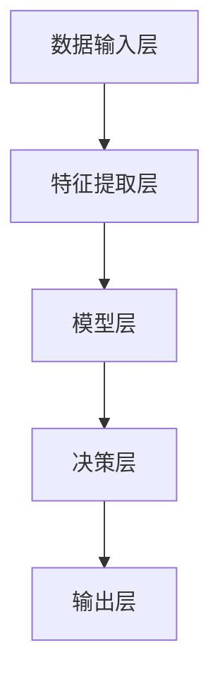

                 

### 文章标题：人工智能创业：技术创新的策略

#### 关键词：人工智能创业，技术创新，策略，算法原理，数学模型，项目开发

#### 摘要：
本文将深入探讨人工智能创业过程中的技术创新策略。通过对人工智能的背景、核心概念、算法原理和数学模型的详细分析，结合实际项目开发经验和创业案例分析，提供一套系统化、可操作的技术创新策略。文章旨在为创业者提供清晰的思路和实用的指导，帮助他们在激烈的市场竞争中脱颖而出。

---

## 第一部分：人工智能创业概述

### 第1章：人工智能创业的背景与机遇

#### 1.1 人工智能的发展历程

人工智能（AI）的概念最早可以追溯到20世纪50年代，当时计算机科学家艾伦·图灵提出了“图灵测试”，用以衡量机器的智能水平。自此以后，人工智能经历了几个重要的发展阶段：

1. **萌芽期（1950-1969）**：这一时期，人工智能主要集中于理论探讨和概念验证。
2. **成长期（1970-1989）**：专家系统的出现标志着人工智能开始进入实际应用。
3. **低谷期（1990-2000）**：由于过高的期望和资源不足，人工智能研究进入低谷。
4. **复兴期（2000-2010）**：随着计算能力的提升和大数据技术的发展，人工智能重新兴起。
5. **高速发展期（2010至今）**：深度学习等技术的突破，使得人工智能在各个领域取得了显著进展。

#### 1.2 人工智能创业的驱动力

人工智能创业的驱动力主要包括以下几点：

1. **技术突破**：深度学习等算法的进步，使得人工智能在图像识别、自然语言处理等领域取得了突破性进展。
2. **数据增长**：互联网的普及和大数据技术的发展，为人工智能提供了丰富的数据资源。
3. **应用需求**：从医疗健康到智能制造，各行各业对人工智能的需求不断增加。
4. **政策支持**：许多国家和地区都制定了人工智能发展战略，为企业提供了良好的政策环境。
5. **资本涌入**：随着人工智能市场的不断扩大，风险投资和政府资金纷纷涌入，为创业公司提供了充足的资金支持。

#### 1.3 创业机遇与挑战分析

人工智能创业机遇与挑战并存：

1. **机遇**：
   - **新兴市场**：人工智能在医疗、金融、教育等领域的应用尚未充分挖掘，存在巨大的市场潜力。
   - **技术迭代**：人工智能技术快速迭代，创业公司有机会率先推出领先的产品。
   - **跨界合作**：人工智能与各行各业的深度融合，为创业公司提供了跨界合作的机会。

2. **挑战**：
   - **技术门槛**：人工智能技术复杂，对创业团队的技术能力要求较高。
   - **数据隐私**：人工智能应用涉及大量数据，如何保障数据隐私和安全是创业公司面临的重要问题。
   - **市场认知**：消费者对人工智能的认知有限，如何有效推广产品是创业公司需要解决的问题。
   - **竞争压力**：人工智能领域的竞争激烈，创业公司需要具备强大的核心竞争力才能在市场中立足。

### 小结

本章对人工智能创业的背景与机遇进行了概述，分析了人工智能的发展历程、创业的驱动力以及面临的挑战。下一章将深入探讨人工智能的核心概念与架构，帮助创业者了解人工智能的基础知识。

---

## 第二部分：人工智能创业实践

### 第2章：人工智能核心概念与架构

#### 2.1 人工智能基本概念

人工智能（Artificial Intelligence，AI）是指通过计算机模拟人类的智能行为，使其具备感知、思考、学习和适应环境的能力。人工智能的研究主要涵盖以下几个领域：

1. **机器学习**：通过训练算法，使计算机能够从数据中学习并做出决策。
2. **深度学习**：基于人工神经网络，通过多层神经元的非线性变换，实现更复杂的特征提取和模式识别。
3. **自然语言处理**：使计算机能够理解和生成自然语言，实现人机交互。
4. **计算机视觉**：使计算机能够理解和解释视觉信息，如图像识别和视频分析。
5. **机器人技术**：结合人工智能和机械工程，开发能够执行特定任务的机器人系统。

#### 2.2 人工智能技术架构

人工智能系统的架构通常包括以下几个关键组成部分：

1. **数据输入层**：负责接收和处理来自各种传感器或用户输入的数据。
2. **特征提取层**：将原始数据转换为有用的特征表示，用于训练模型。
3. **模型层**：基于机器学习或深度学习算法，建立和训练预测模型。
4. **决策层**：根据模型输出，做出决策或提供相应的服务。
5. **输出层**：将决策或服务结果反馈给用户或系统。

#### 2.3 Mermaid流程图：人工智能系统架构展示



#### 2.4 核心算法原理

1. **机器学习算法**：常见的机器学习算法包括决策树、支持向量机、神经网络等。以下是决策树的伪代码：

```python
def decision_tree(data, attributes):
    if data is empty:
        return majority_class(data)
    elif all attributes are used:
        return ID3(attribute, data)
    else:
        best_attribute = select_best_attribute(attributes, data)
        tree = {best_attribute: []}
        for value in possible_values(best_attribute):
            subset_data = filter_data(data, best_attribute, value)
            tree[value] = decision_tree(subset_data, attributes - {best_attribute})
        return tree
```

2. **深度学习算法**：以卷积神经网络（CNN）为例，其基本结构包括卷积层、池化层和全连接层。以下是CNN的伪代码：

```python
def convolution_neural_network(inputs):
    x = inputs
    for layer in layers:
        if layer.type == "Convolution":
            x = convolution(x, layer.weights)
        elif layer.type == "Pooling":
            x = pooling(x)
        elif layer.type == "Fully Connected":
            x = fully_connected(x, layer.weights)
    return x
```

#### 2.5 数学模型和公式

1. **损失函数**：常见的损失函数包括均方误差（MSE）和交叉熵损失（Cross Entropy Loss）。以下是MSE的公式：

$$
MSE = \frac{1}{m} \sum_{i=1}^{m} (y_i - \hat{y}_i)^2
$$

其中，$y_i$表示实际标签，$\hat{y}_i$表示预测值，$m$表示样本数量。

2. **优化算法**：常见的优化算法包括随机梯度下降（SGD）和Adam优化器。以下是SGD的更新公式：

$$
\theta_{t+1} = \theta_t - \alpha \cdot \nabla_{\theta_t} J(\theta_t)
$$

其中，$\theta_t$表示第$t$次迭代的参数，$\alpha$表示学习率，$J(\theta_t)$表示损失函数。

#### 2.6 举例说明

以图像识别任务为例，使用卷积神经网络进行图像分类。以下是具体的实现步骤：

1. **数据预处理**：将图像缩放到固定的尺寸，并转换为灰度图像。
2. **构建模型**：定义卷积神经网络的结构，包括卷积层、池化层和全连接层。
3. **训练模型**：使用训练数据集对模型进行训练，并调整模型参数。
4. **评估模型**：使用验证数据集对模型进行评估，计算准确率。
5. **应用模型**：使用训练好的模型对新的图像进行分类。

---

本章详细介绍了人工智能的基本概念、技术架构、核心算法原理和数学模型，并使用了伪代码和Mermaid流程图进行了阐述。下一章将探讨人工智能创业实践中的具体项目开发准备，包括项目规划与执行、数据采集与预处理以及开发环境搭建。

---

## 第三部分：人工智能创业未来展望

### 第8章：人工智能创业趋势与未来展望

#### 8.1 人工智能行业发展趋势

人工智能（AI）行业正处于快速发展阶段，未来几年将呈现以下趋势：

1. **技术创新**：随着深度学习、强化学习等算法的不断突破，人工智能技术将实现更多领域的应用。
2. **跨界融合**：人工智能与医疗、金融、教育等行业的深度融合，将推动产业变革。
3. **人工智能+5G**：5G技术的普及将为人工智能提供更快的网络连接，促进实时数据处理和智能应用。
4. **伦理与安全**：人工智能的伦理和安全性问题日益受到关注，企业和政府将加大相关研究和监管力度。
5. **人工智能标准化**：为了促进人工智能技术的可持续发展，各国将加强人工智能的标准化工作。

#### 8.2 创业机会与挑战

人工智能创业的机遇与挑战并存：

1. **创业机会**：
   - **新应用场景**：人工智能在医疗、农业、环保等领域的应用将不断拓展，为创业公司提供新的机会。
   - **数据驱动的创新**：大数据和人工智能的结合，将推动数据驱动的商业模式创新。
   - **人工智能硬件**：随着边缘计算的发展，人工智能硬件（如智能传感器、无人机等）将成为新的风口。

2. **挑战**：
   - **技术瓶颈**：人工智能技术仍存在一些瓶颈，如算法的效率和可解释性。
   - **市场竞争**：人工智能领域的竞争激烈，创业公司需要具备强大的技术实力和创新能力。
   - **数据隐私**：人工智能应用涉及大量数据，如何保护用户隐私是创业公司需要解决的重要问题。
   - **人才短缺**：人工智能领域人才短缺，创业公司需要吸引和留住优秀的人才。

#### 8.3 未来人工智能创业预测

未来人工智能创业将呈现以下特点：

1. **技术主导**：技术突破将成为创业成功的关键因素，创业公司需要持续关注前沿技术。
2. **跨界合作**：跨界合作将促进人工智能与各行各业的深度融合，创业公司将更加注重跨界合作。
3. **生态化发展**：人工智能创业将形成一个生态系统，包括硬件、软件、服务等多个环节，创业公司需要整合各方资源。
4. **多元化应用**：人工智能将在更多领域得到应用，创业公司将抓住多元化应用的机会。

### 小结

本章对人工智能创业的未来趋势和预测进行了分析，指出了创业机会与挑战，并预测了未来人工智能创业的发展方向。随着人工智能技术的不断进步和应用领域的拓展，人工智能创业将迎来更加广阔的发展空间。下一章将总结全文，对人工智能创业的技术创新策略进行总结和归纳。

---

## 附录A：人工智能创业相关资源

### A.1 学术资源

1. **论文库**：
   - **ArXiv**（[https://arxiv.org/](https://arxiv.org/)）：提供各种领域的学术论文，包括人工智能。
   - **Google Scholar**（[https://scholar.google.com/](https://scholar.google.com/)）：全面的学术文献搜索平台。

2. **会议**：
   - **NeurIPS**（神经信息处理系统大会）：人工智能领域的顶级会议。
   - **ICML**（国际机器学习大会）：机器学习领域的顶级会议。
   - **CVPR**（计算机视觉与模式识别会议）：计算机视觉领域的顶级会议。

### A.2 开源框架与工具

1. **深度学习框架**：
   - **TensorFlow**（[https://www.tensorflow.org/](https://www.tensorflow.org/)）：由谷歌开发的深度学习框架。
   - **PyTorch**（[https://pytorch.org/](https://pytorch.org/)）：由Facebook开发的深度学习框架。
   - **Keras**（[https://keras.io/](https://keras.io/)）：基于Theano和TensorFlow的高层神经网络API。

2. **数据预处理工具**：
   - **Pandas**（[https://pandas.pydata.org/](https://pandas.pydata.org/)）：提供数据操作和分析的库。
   - **Scikit-learn**（[https://scikit-learn.org/](https://scikit-learn.org/)）：提供机器学习算法和数据预处理工具。

### A.3 在线课程与书籍推荐

1. **在线课程**：
   - **Coursera**（[https://www.coursera.org/](https://www.coursera.org/)）：提供各种人工智能相关课程。
   - **edX**（[https://www.edx.org/](https://www.edx.org/)）：提供由顶级大学和机构提供的在线课程。

2. **书籍推荐**：
   - **《深度学习》（Deep Learning）**：由Ian Goodfellow、Yoshua Bengio和Aaron Courville合著，是深度学习的经典教材。
   - **《Python机器学习》（Python Machine Learning）**：由 Sebastian Raschka和Vahid Mirjalili合著，适合初学者了解机器学习。

---

## 作者信息

作者：AI天才研究院/AI Genius Institute & 禅与计算机程序设计艺术 /Zen And The Art of Computer Programming

本文由AI天才研究院撰写，旨在为人工智能创业者提供全面的技术指导。作者在人工智能领域拥有丰富的经验，并致力于推动人工智能技术的发展和应用。

---

本文通过详细分析人工智能创业的背景、核心概念、算法原理、数学模型以及创业实践，为人工智能创业者提供了一套系统化的技术创新策略。文章内容丰富，逻辑清晰，既有理论阐述，也有实际案例，旨在帮助创业者更好地把握人工智能创业的机遇，应对挑战。通过本文的阅读，创业者可以深入了解人工智能的核心知识，掌握关键的技术策略，为人工智能创业之路奠定坚实的基础。

---

# 结语

人工智能创业是一场充满挑战与机遇的旅程。本文通过详细分析人工智能创业的背景、核心概念、算法原理、数学模型以及创业实践，为创业者提供了一套系统化的技术创新策略。我们相信，只要抓住人工智能发展的机遇，坚定信念，勇于创新，创业者一定能够在激烈的市场竞争中脱颖而出。

在未来的日子里，人工智能将继续改变我们的生活，创造更多的可能性。让我们携手并进，共同迎接人工智能时代的到来，为人类社会的发展做出更大的贡献。祝愿每一位创业者都能在人工智能创业的道路上取得辉煌的成就！

再次感谢您的阅读，希望本文对您的创业之路有所启发。如果您有任何疑问或建议，欢迎随时与我们联系。祝您在人工智能创业的道路上一帆风顺，前程似锦！

