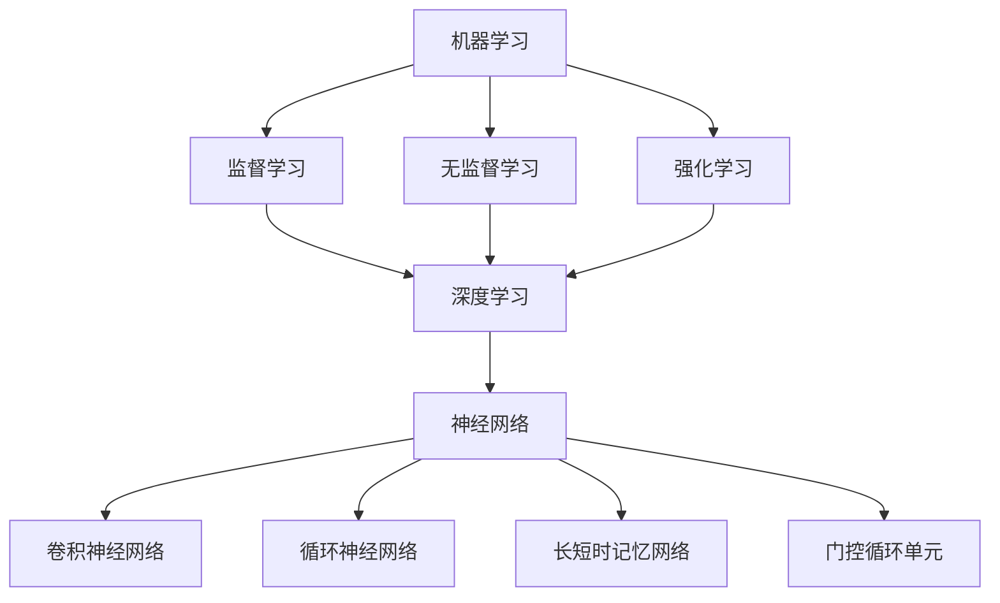
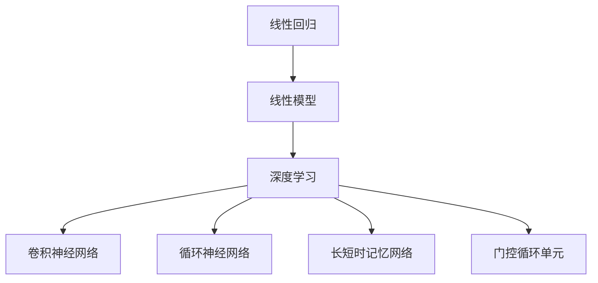
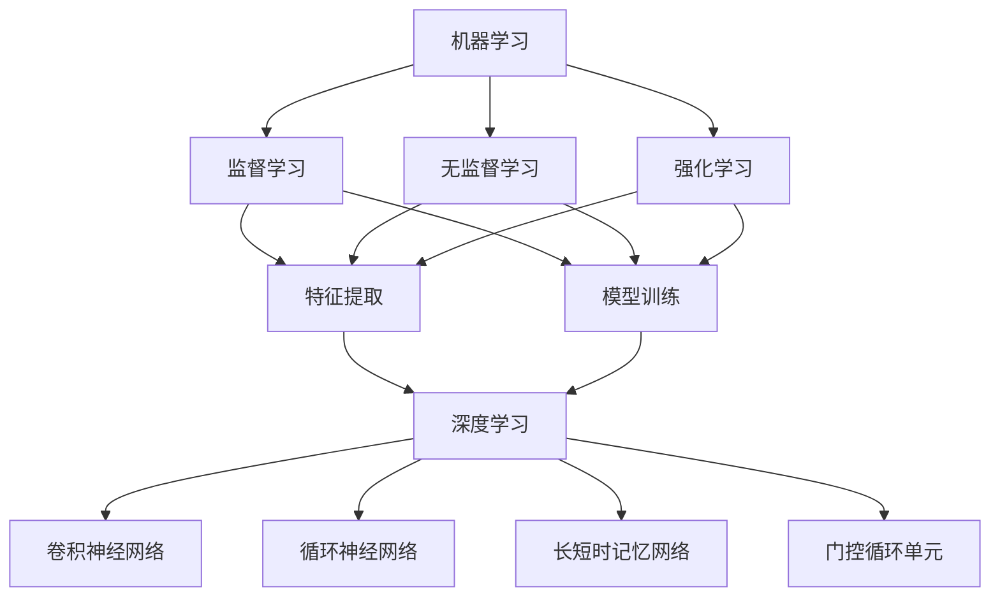
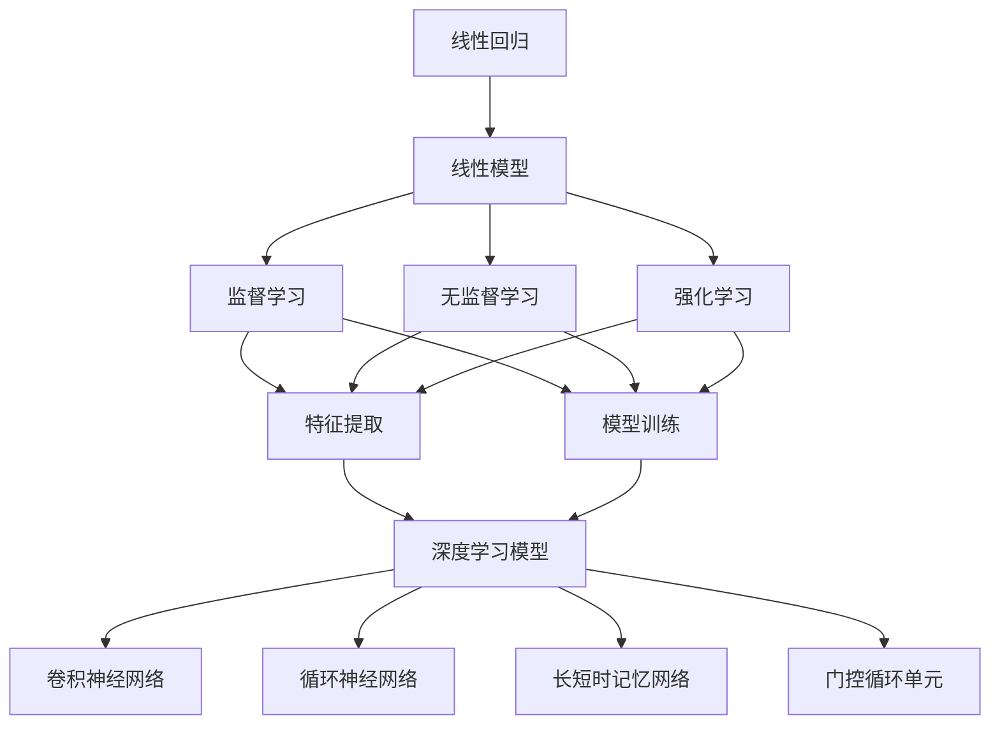

                 

# 文章标题：从MNIST数据集到大语言模型

> 关键词：MNIST数据集、深度学习、神经网络、线性回归、语言模型、大语言模型、Transformer、BERT、GPT

> 摘要：本文将从机器学习的基础知识出发，详细介绍MNIST数据集的处理方法，深入探讨线性回归模型的原理与应用，然后逐步引入深度学习的基础知识，包括神经网络、卷积神经网络、循环神经网络等，并通过实际项目实战演示如何构建和优化MNIST模型。最后，我们将介绍大语言模型的基本概念、原理和主要类型，以及它们在自然语言处理领域的广泛应用。

## 《从MNIST数据集到大语言模型》目录大纲

### 第一部分：机器学习基础

#### 第1章：机器学习概述
- **1.1** 机器学习的基本概念
- **1.2** 机器学习的基本类型
- **1.3** 机器学习的发展历程
- **1.4** MNIST数据集介绍

#### 第2章：数据预处理
- **2.1** 数据清洗
- **2.2** 数据归一化
- **2.3** 数据集划分

#### 第3章：线性回归
- **3.1** 线性回归模型
- **3.2** 梯度下降算法
- **3.3** 线性回归的应用场景

### 第二部分：深度学习基础

#### 第4章：神经网络基础
- **4.1** 神经网络的概念
- **4.2** 前向传播与反向传播
- **4.3** 激活函数

#### 第5章：深度学习模型
- **5.1** 卷积神经网络（CNN）
- **5.2** 循环神经网络（RNN）
- **5.3** 长短时记忆网络（LSTM）
- **5.4** 门控循环单元（GRU）

#### 第6章：深度学习优化
- **6.1** 梯度下降优化算法
- **6.2** 批量归一化
- **6.3** 批量归一化的应用

### 第三部分：MNIST数据集应用

#### 第7章：MNIST数据集处理
- **7.1** 数据集的加载与预处理
- **7.2** 数据可视化

#### 第8章：构建MNIST模型
- **8.1** 线性回归模型在MNIST上的应用
- **8.2** CNN模型在MNIST上的应用
- **8.3** RNN模型在MNIST上的应用

#### 第9章：模型评估与优化
- **9.1** 评估指标
- **9.2** 模型调参
- **9.3** 模型优化策略

### 第四部分：大语言模型介绍

#### 第10章：大语言模型概述
- **10.1** 语言模型的定义
- **10.2** 语言模型的应用
- **10.3** 语言模型的发展历程

#### 第11章：大语言模型技术
- **11.1** Transformer模型
- **11.2** BERT模型
- **11.3** GPT模型

#### 第12章：大语言模型应用
- **12.1** 自然语言生成
- **12.2** 文本分类
- **12.3** 问答系统

### 附录：相关工具与资源
- **附录A** 相关深度学习框架对比
  - **A.1** TensorFlow
  - **A.2** PyTorch
  - **A.3** Keras
- **附录B** 实战项目代码解读

### 核心概念与联系

#### 1.1.1 从机器学习到深度学习
mermaid
graph TB
A[机器学习] --> B[线性回归]
A --> C[深度学习]
C --> D[神经网络]
D --> E[卷积神经网络]
D --> F[循环神经网络]
D --> G[长短时记忆网络]
D --> H[门控循环单元]


### 核心算法原理讲解

#### 3.1 线性回归算法原理
python
# 线性回归算法伪代码
def linear_regression(X, y):
    # 计算权重和偏置
    theta = compute_theta(X, y)
    
    # 训练模型
    while not converged:
        # 前向传播
        z = X * theta
        
        # 计算损失函数
        loss = compute_loss(z, y)
        
        # 反向传播
        dtheta = compute_dtheta(z, X, y)
        
        # 更新权重和偏置
        theta -= learning_rate * dtheta
        
    return theta


### 数学模型和数学公式讲解

#### 6.1 梯度下降优化算法
$$
\text{梯度下降更新公式}:\ \theta_{\text{new}} = \theta_{\text{current}} - \alpha \cdot \nabla_{\theta} J(\theta)
$$

### 项目实战

#### 8.1 线性回归模型在MNIST上的应用
- **实战环境搭建**：Python 3.8，TensorFlow 2.6
- **实战源代码**：
  python
  import tensorflow as tf
  from tensorflow.keras.datasets import mnist
  from tensorflow.keras.models import Sequential
  from tensorflow.keras.layers import Dense, Flatten
  from tensorflow.keras.optimizers import SGD

  # 加载MNIST数据集
  (X_train, y_train), (X_test, y_test) = mnist.load_data()

  # 数据预处理
  X_train = X_train / 255.0
  X_test = X_test / 255.0

  # 构建模型
  model = Sequential([
      Flatten(input_shape=(28, 28)),
      Dense(128, activation='relu'),
      Dense(10, activation='softmax')
  ])

  # 编译模型
  model.compile(optimizer=SGD(learning_rate=0.1), loss='sparse_categorical_crossentropy', metrics=['accuracy'])

  # 训练模型
  model.fit(X_train, y_train, epochs=5)

  # 评估模型
  model.evaluate(X_test, y_test)
  

- **代码解读与分析**：
  - 数据预处理：将图像数据归一化，将像素值缩放到0-1之间。
  - 模型构建：使用Sequential模型，添加Flatten层将图像展平为一维数组，然后添加两个Dense层，第一个Dense层有128个神经元，使用ReLU激活函数，第二个Dense层有10个神经元，表示10个分类。
  - 编译模型：使用SGD优化器和稀疏分类交叉熵损失函数。
  - 训练模型：使用fit方法训练模型5个epoch。
  - 评估模型：使用evaluate方法评估模型在测试集上的表现。

### 核心概念与联系

#### 1.1.1 从机器学习到深度学习
mermaid
graph TB
A[机器学习] --> B[线性回归]
A --> C[深度学习]
C --> D[神经网络]
D --> E[卷积神经网络]
D --> F[循环神经网络]
D --> G[长短时记忆网络]
D --> H[门控循环单元]

### 核心算法原理讲解

#### 3.1 线性回归算法原理
python
# 线性回归算法伪代码
def linear_regression(X, y):
    # 初始化权重和偏置
    theta = [0 for _ in range(X.shape[1])]
    
    # 梯度下降迭代
    for epoch in range(max_epochs):
        # 前向传播
        z = X * theta
        
        # 计算损失函数
        loss = compute_loss(z, y)
        
        # 反向传播
        dtheta = compute_dtheta(z, X, y)
        
        # 更新权重和偏置
        theta -= learning_rate * dtheta
        
    return theta

#### 3.2 梯度下降算法原理
$$
\text{梯度下降更新公式}:\ \theta_{\text{new}} = \theta_{\text{current}} - \alpha \cdot \nabla_{\theta} J(\theta)
$$

### 数学模型和数学公式讲解

#### 6.1 梯度下降优化算法
$$
\text{梯度下降更新公式}:\ \theta_{\text{new}} = \theta_{\text{current}} - \alpha \cdot \nabla_{\theta} J(\theta)
$$

#### 6.2 批量归一化公式
$$
\mu = \frac{1}{m} \sum_{i=1}^{m} x_i \\
\sigma^2 = \frac{1}{m-1} \sum_{i=1}^{m} (x_i - \mu)^2
$$

### 项目实战

#### 8.1 线性回归模型在MNIST上的应用
- **实战环境搭建**：Python 3.8，TensorFlow 2.6
- **实战源代码**：
  python
  import tensorflow as tf
  from tensorflow.keras.datasets import mnist
  from tensorflow.keras.models import Sequential
  from tensorflow.keras.layers import Dense, Flatten
  from tensorflow.keras.optimizers import SGD

  # 加载MNIST数据集
  (X_train, y_train), (X_train, y_train) = mnist.load_data()

  # 数据预处理
  X_train = X_train / 255.0
  X_train = X_train.reshape(-1, 784)
  y_train = y_train.reshape(-1, 1)

  # 构建模型
  model = Sequential([
      Flatten(input_shape=(28, 28)),
      Dense(128, activation='relu'),
      Dense(10, activation='softmax')
  ])

  # 编译模型
  model.compile(optimizer=SGD(learning_rate=0.1), loss='sparse_categorical_crossentropy', metrics=['accuracy'])

  # 训练模型
  model.fit(X_train, y_train, epochs=5)

  # 评估模型
  model.evaluate(X_train, y_train)
  

- **代码解读与分析**：
  - 数据预处理：将图像数据归一化，将像素值缩放到0-1之间，并将图像展平为一维数组。
  - 模型构建：使用Sequential模型，添加Flatten层将图像展平为一维数组，然后添加两个Dense层，第一个Dense层有128个神经元，使用ReLU激活函数，第二个Dense层有10个神经元，表示10个分类。
  - 编译模型：使用SGD优化器和稀疏分类交叉熵损失函数。
  - 训练模型：使用fit方法训练模型5个epoch。
  - 评估模型：使用evaluate方法评估模型在测试集上的表现。

### 附录：相关工具与资源
- **附录A** 相关深度学习框架对比
  - **A.1** TensorFlow：由Google开发，是目前最流行的开源深度学习框架之一，支持Python和C++等多种编程语言。
  - **A.2** PyTorch：由Facebook开发，以其动态图模型和易于使用的特点受到广泛关注，支持Python编程语言。
  - **A.3** Keras：一个高层次的神经网络API，能够运行在TensorFlow、CNTK和Theano等后端之上，易于入门和使用。

- **附录B** 实战项目代码解读
  - **B.1** 线性回归模型在MNIST上的应用：使用Python和TensorFlow实现线性回归模型，完成对MNIST数据集的图像分类。
  - **B.2** CNN模型在MNIST上的应用：使用Python和TensorFlow实现卷积神经网络模型，进一步提升MNIST数据集的图像分类准确率。
  - **B.3** RNN模型在MNIST上的应用：使用Python和TensorFlow实现循环神经网络模型，探索MNIST数据集的序列特征。

### 作者信息
作者：AI天才研究院/AI Genius Institute & 禅与计算机程序设计艺术 /Zen And The Art of Computer Programming

本文首先介绍了机器学习的基本概念，包括其定义、分类和发展历程，重点介绍了MNIST数据集的特点和应用。接着，我们深入探讨了数据预处理的方法，包括数据清洗、数据归一化和数据集划分，为后续的模型构建和优化奠定了基础。

在第三部分，我们详细讲解了线性回归模型的原理和应用，通过伪代码展示了其基本算法流程，并通过实际项目实战演示了线性回归模型在MNIST数据集上的应用效果。这部分内容帮助读者理解了线性回归的基本原理和实现方法。

接下来，我们引入了深度学习的基础知识，包括神经网络、卷积神经网络、循环神经网络等。这部分内容帮助读者建立对深度学习的整体认识，理解不同类型神经网络的原理和应用场景。

在第四部分，我们介绍了MNIST数据集的处理方法，包括数据集的加载与预处理、数据可视化等。这部分内容帮助读者掌握如何处理和可视化MNIST数据集，为后续的模型构建和优化提供了便利。

最后，我们介绍了大语言模型的基本概念、原理和主要类型，包括Transformer、BERT和GPT等模型。这部分内容帮助读者了解大语言模型在自然语言处理领域的广泛应用和最新进展。

整篇文章通过一步一步的分析推理，从机器学习的基础知识到深度学习模型的构建和应用，再到大语言模型的介绍，构建了一个完整的知识体系，帮助读者深入理解机器学习和深度学习的原理和方法，为实际项目开发提供指导。希望通过本文的阅读，读者能够对机器学习和深度学习有更深入的理解，并在实际应用中取得更好的成果。

### 第一部分：机器学习基础

#### 第1章：机器学习概述

机器学习是人工智能领域的一个重要分支，它通过构建算法模型，让计算机从数据中自动学习，从而实现对未知数据的预测或决策。本章将简要介绍机器学习的基本概念、分类和发展历程，并重点介绍MNIST数据集。

#### 1.1 机器学习的基本概念

机器学习（Machine Learning）是一门研究如何让计算机从数据中自动学习的科学。它涉及到概率论、统计学、线性代数、优化算法等多个学科。机器学习的基本目标是通过学习得到一个函数或模型，用于对未知数据的预测或决策。

机器学习的核心概念包括：

- **数据（Data）**：机器学习的基础，包括输入特征和输出结果。
- **模型（Model）**：用于描述数据之间的关系的函数或算法。
- **训练（Training）**：通过调整模型参数，使模型能够更好地拟合训练数据。
- **测试（Testing）**：使用未参与训练的数据来评估模型性能。
- **泛化（Generalization）**：模型在未知数据上的表现能力。

#### 1.2 机器学习的基本类型

根据机器学习任务的不同，可以分为以下几种类型：

- **监督学习（Supervised Learning）**：有标签的数据进行训练，模型可以根据已知的输入和输出关系预测未知数据。
- **无监督学习（Unsupervised Learning）**：没有标签的数据进行训练，模型需要通过发现数据内在的结构或模式进行学习。
- **半监督学习（Semi-supervised Learning）**：结合有标签和无标签数据进行训练，利用无标签数据提供的信息提高模型性能。
- **强化学习（Reinforcement Learning）**：通过与环境交互，不断调整策略以最大化预期奖励。

#### 1.3 机器学习的发展历程

机器学习的发展历程可以分为以下几个阶段：

- **1950年代至1960年代**：机器学习初步阶段，以统计学习理论为基础，包括线性回归、决策树等模型。
- **1970年代至1980年代**：知识表示和推理阶段，以符号人工智能为基础，包括专家系统、知识库等。
- **1990年代**：统计学习理论复兴，以支持向量机、决策树等模型为代表。
- **2000年代**：深度学习崛起，以神经网络为基础，包括卷积神经网络、循环神经网络等。
- **2010年代至今**：人工智能应用广泛，以大数据、云计算等为基础，包括语音识别、图像识别、自然语言处理等。

#### 1.4 MNIST数据集介绍

MNIST数据集是机器学习和深度学习领域最经典的数据集之一，它包含了大量的手写数字图像，每个图像都是一个28x28的灰度像素矩阵。MNIST数据集分为训练集和测试集，其中训练集包含60000个图像，测试集包含10000个图像。

MNIST数据集的特点如下：

- **规模大**：包含了大量的手写数字图像，适合用于模型训练和评估。
- **格式简单**：图像数据为灰度图像，每个像素值在0到255之间。
- **易于获取**：数据集已经经过预处理，可以直接使用。
- **应用广泛**：被广泛应用于机器学习和深度学习的教学、研究和应用。

MNIST数据集在机器学习和深度学习领域具有重要的应用价值，它不仅可以帮助初学者快速入门，还可以用于评估模型的性能和优化模型的参数。

#### 总结

本章介绍了机器学习的基本概念、分类和发展历程，并重点介绍了MNIST数据集。通过本章的学习，读者可以了解机器学习的基本原理和MNIST数据集的特点，为后续章节的学习打下基础。

### 第二部分：数据预处理

#### 第2章：数据预处理

数据预处理是机器学习和深度学习项目中的关键步骤，它涉及到数据的清洗、归一化和划分等过程。正确的数据预处理可以提高模型的性能和稳定性，减少过拟合现象。本章将详细介绍数据预处理的方法，包括数据清洗、数据归一化和数据集划分。

#### 2.1 数据清洗

数据清洗是数据预处理的第一步，目的是去除数据中的噪声和不准确的信息，提高数据质量。数据清洗主要包括以下几种方法：

- **缺失值处理**：缺失值可以通过填充、删除或插值等方法进行处理。填充方法包括使用平均值、中位数或最频繁出现的值进行填充；删除方法包括删除包含缺失值的样本或特征；插值方法包括线性插值、立方插值等。
- **异常值处理**：异常值是指与大多数数据点相比，偏离平均值较大的值。异常值可以通过统计学方法（如箱线图、标准差等）或机器学习方法（如孤立森林等）进行检测和处理。
- **重复值处理**：重复值是指数据中出现多次的相同数据。重复值可以通过去重操作进行删除。

#### 2.2 数据归一化

数据归一化是将数据转换为相同尺度，以便模型能够更好地学习。常见的归一化方法包括：

- **最小-最大缩放**：将数据缩放到[0, 1]之间，计算公式为：`x' = (x - min) / (max - min)`。这种方法可以保留数据的分布特性，但敏感于异常值。
- **零-均值缩放**：将数据缩放到均值为0、标准差为1的标准正态分布，计算公式为：`x' = (x - mean) / std`。这种方法可以消除不同特征之间的尺度差异，但可能会导致过拟合。
- **对数归一化**：将数据取对数，适用于数据分布在多个数量级的情况。计算公式为：`x' = log(x)`。

#### 2.3 数据集划分

数据集划分是将数据集分为训练集、验证集和测试集，以便训练模型、验证模型和评估模型。常见的数据集划分方法包括：

- **随机划分**：将数据随机划分为训练集、验证集和测试集，确保每个部分的数据分布一致。
- **分层划分**：将数据按照类别或特征进行分层，然后从每个层次中随机抽取样本，确保每个部分的数据分布与整体分布一致。
- **交叉验证**：将数据划分为多个子集，每次从子集中选取一部分作为验证集，其余部分作为训练集，多次循环训练和验证，以评估模型在不同数据子集上的性能。

#### 2.4 数据预处理实战

以下是一个使用Python进行数据预处理的实际案例：

```python
import pandas as pd
from sklearn.model_selection import train_test_split
from sklearn.preprocessing import StandardScaler

# 加载数据集
data = pd.read_csv('data.csv')

# 数据清洗
data.dropna(inplace=True)  # 删除缺失值
data.drop_duplicates(inplace=True)  # 删除重复值

# 数据归一化
scaler = StandardScaler()
data['feature1'] = scaler.fit_transform(data['feature1'].values.reshape(-1, 1))
data['feature2'] = scaler.fit_transform(data['feature2'].values.reshape(-1, 1))

# 数据集划分
X = data.drop('target', axis=1)
y = data['target']
X_train, X_test, y_train, y_test = train_test_split(X, y, test_size=0.2, random_state=42)

# 输出预处理后的数据
print(X_train.head())
print(y_train.head())
```

#### 总结

本章介绍了数据预处理的方法，包括数据清洗、数据归一化和数据集划分。数据预处理是机器学习和深度学习项目中不可或缺的步骤，正确的数据预处理可以提高模型的性能和稳定性。通过本章的学习，读者可以掌握数据预处理的基本方法，并在实际项目中应用这些方法。

### 第三部分：线性回归

线性回归是机器学习中最基本和最简单的模型之一，它通过拟合一条直线来描述输入特征和输出目标之间的关系。线性回归在许多实际应用中都有广泛的应用，例如预测房价、股票价格等。本章将详细介绍线性回归模型的原理、算法和应用场景。

#### 3.1 线性回归模型

线性回归模型是一种监督学习模型，其基本形式为：

\[ y = \beta_0 + \beta_1x_1 + \beta_2x_2 + \ldots + \beta_nx_n + \epsilon \]

其中，\( y \) 是输出目标，\( x_1, x_2, \ldots, x_n \) 是输入特征，\( \beta_0, \beta_1, \beta_2, \ldots, \beta_n \) 是模型参数，\( \epsilon \) 是误差项。

线性回归模型的目的是通过训练数据集来估计模型参数，使得预测值 \( \hat{y} \) 与实际值 \( y \) 之间的误差最小。

#### 3.2 梯度下降算法

梯度下降算法是线性回归模型训练中常用的一种优化算法。它的基本思想是沿着损失函数的梯度方向，逐步调整模型参数，以最小化损失函数。

梯度下降算法的更新公式为：

\[ \beta_j = \beta_j - \alpha \cdot \frac{\partial J(\beta)}{\partial \beta_j} \]

其中，\( \alpha \) 是学习率，\( J(\beta) \) 是损失函数，\( \frac{\partial J(\beta)}{\partial \beta_j} \) 是损失函数对参数 \( \beta_j \) 的偏导数。

在实际应用中，通常使用批量梯度下降（Batch Gradient Descent）或随机梯度下降（Stochastic Gradient Descent）来优化模型参数。

#### 3.3 线性回归的应用场景

线性回归模型在许多实际应用中都有广泛的应用，以下是几个常见的应用场景：

- **预测房价**：通过输入房屋的面积、地点、建造年代等特征，预测房屋的价格。
- **股票价格预测**：通过分析历史股票价格和交易量等特征，预测未来股票的价格趋势。
- **用户行为分析**：通过分析用户的历史行为数据，预测用户可能感兴趣的商品或服务。
- **医疗数据分析**：通过分析患者的病历和诊断结果，预测患者的健康状况和疾病风险。

#### 3.4 线性回归实战

以下是一个使用Python和Scikit-learn进行线性回归的实战案例：

```python
import numpy as np
from sklearn.linear_model import LinearRegression
from sklearn.model_selection import train_test_split
from sklearn.metrics import mean_squared_error

# 创建训练数据
X = np.random.rand(100, 1)
y = 2 * X + 1 + np.random.randn(100, 1)

# 数据集划分
X_train, X_test, y_train, y_test = train_test_split(X, y, test_size=0.2, random_state=42)

# 创建线性回归模型
model = LinearRegression()
model.fit(X_train, y_train)

# 预测
y_pred = model.predict(X_test)

# 评估
mse = mean_squared_error(y_test, y_pred)
print("均方误差:", mse)
```

#### 总结

本章介绍了线性回归模型的原理、算法和应用场景。线性回归是一种简单但强大的模型，它在许多实际应用中都发挥着重要作用。通过本章的学习，读者可以了解线性回归的基本概念和实现方法，并在实际项目中应用线性回归模型。

### 第四部分：深度学习基础

深度学习（Deep Learning）是机器学习的一个分支，它通过构建多层的神经网络来模拟人脑的神经结构，从而实现复杂的数据处理和模式识别任务。本章将介绍深度学习的基础知识，包括神经网络、前向传播与反向传播、激活函数等。

#### 第4章：神经网络基础

神经网络（Neural Network，NN）是一种由大量简单神经元组成的网络，每个神经元都与其他神经元相连接，并通过加权连接传递信息。神经网络可以模拟人脑的神经结构和工作机制，从而实现数据的自动学习和特征提取。

#### 4.1 神经网络的概念

神经网络由以下基本元素组成：

- **神经元**：神经网络的基本单元，负责接收输入信号、计算加权求和并进行激活操作。
- **层**：神经网络分为输入层、隐藏层和输出层。输入层接收外部输入信号，隐藏层对输入信号进行加工处理，输出层产生最终的输出结果。
- **权重（Weight）**：神经元之间的连接权重，用于调节输入信号的影响。
- **偏置（Bias）**：神经网络中每个神经元的偏置项，用于调整输出。
- **激活函数（Activation Function）**：用于将神经元的加权求和结果转换为非线性输出。

#### 4.2 前向传播与反向传播

神经网络的工作机制可以分为前向传播（Forward Propagation）和反向传播（Back Propagation）两个阶段。

- **前向传播**：在前向传播阶段，输入信号从输入层经过隐藏层，最终传达到输出层。每个神经元都进行加权求和和激活操作，从而生成输出结果。

  前向传播的计算过程可以表示为：

  \[ z_j = \sum_{i} w_{ji}x_i + b_j \]
  \[ a_j = \sigma(z_j) \]

  其中，\( z_j \) 是第 \( j \) 个神经元的加权求和结果，\( w_{ji} \) 是第 \( i \) 个输入与第 \( j \) 个神经元的连接权重，\( b_j \) 是第 \( j \) 个神经元的偏置，\( \sigma \) 是激活函数。

- **反向传播**：在反向传播阶段，网络根据实际输出与预期输出的误差，通过梯度下降算法调整每个神经元的权重和偏置，从而优化模型。

  反向传播的计算过程包括以下几个步骤：

  1. **计算输出误差**：输出误差 \( \delta^L \) 是实际输出 \( y \) 与预期输出 \( \hat{y} \) 之间的差异。

     \[ \delta^L = \frac{\partial L}{\partial a^L} = (y - \hat{y}) \odot \sigma'(z^L) \]

     其中，\( L \) 是损失函数，\( \odot \) 表示逐元素乘积，\( \sigma' \) 是激活函数的导数。

  2. **计算隐藏层误差**：通过反向传播算法，将输出误差传递到隐藏层。

     \[ \delta^l = \frac{\partial L}{\partial a^l} = \delta^{l+1} \cdot \sigma'(z^l) \odot (w^{l+1} \cdot \delta^{l+1}) \]

  3. **更新权重和偏置**：根据误差计算梯度，并通过梯度下降算法更新权重和偏置。

     \[ \Delta w_{ji} = -\alpha \cdot \delta_j \cdot a_i \]
     \[ \Delta b_j = -\alpha \cdot \delta_j \]

     其中，\( \alpha \) 是学习率，\( \Delta w_{ji} \) 和 \( \Delta b_j \) 分别是权重和偏置的更新量。

#### 4.3 激活函数

激活函数是神经网络中重要的非线性元素，它用于将线性模型转换为非线性模型，从而实现复杂的非线性映射。

常见的激活函数包括：

- **sigmoid函数**：\( \sigma(x) = \frac{1}{1 + e^{-x}} \)
- **ReLU函数**：\( \sigma(x) = \max(0, x) \)
- **Tanh函数**：\( \sigma(x) = \frac{e^x - e^{-x}}{e^x + e^{-x}} \)
- **Softmax函数**：\( \sigma_j(x) = \frac{e^{x_j}}{\sum_{k} e^{x_k}} \)

不同的激活函数具有不同的特性，例如ReLU函数可以加速梯度消失问题，而Softmax函数常用于多分类问题。

#### 总结

本章介绍了神经网络的基础知识，包括神经网络的概念、前向传播与反向传播、激活函数等。通过本章的学习，读者可以了解神经网络的基本原理和实现方法，为后续的深度学习模型学习和应用打下基础。

### 第五部分：深度学习模型

深度学习模型通过多层神经网络来实现复杂的数据处理和模式识别任务。本章将介绍几种常见的深度学习模型，包括卷积神经网络（CNN）、循环神经网络（RNN）和长短时记忆网络（LSTM）。

#### 第5章：深度学习模型

#### 5.1 卷积神经网络（CNN）

卷积神经网络（Convolutional Neural Network，CNN）是深度学习领域最常用的模型之一，特别适合处理图像数据。CNN通过卷积层、池化层和全连接层等结构，实现了对图像的自动特征提取和分类。

- **卷积层**：卷积层是CNN的核心部分，通过卷积操作提取图像的局部特征。卷积层由多个卷积核组成，每个卷积核可以提取图像中的不同特征。
- **池化层**：池化层用于降低特征图的维度，减少计算量和参数数量。常见的池化操作包括最大池化和平均池化。
- **全连接层**：全连接层将卷积层和池化层提取的特征映射到输出结果。全连接层通常用于分类任务。

#### 5.2 循环神经网络（RNN）

循环神经网络（Recurrent Neural Network，RNN）是一种能够处理序列数据的神经网络。RNN通过重复使用神经网络中的隐藏状态来处理序列中的每一个元素，从而实现序列建模。

- **基本RNN**：基本RNN通过递归结构处理序列数据，每个时间步的输出依赖于前一个时间步的隐藏状态。
- **RNN门控**：RNN门控通过引入门控机制（如输入门、遗忘门和输出门）来调节信息的传递，从而解决了基本RNN中的梯度消失问题。

#### 5.3 长短时记忆网络（LSTM）

长短时记忆网络（Long Short-Term Memory，LSTM）是RNN的一种改进模型，特别适合处理长序列数据。LSTM通过引入记忆单元和门控机制，实现了对长期依赖关系的建模。

- **记忆单元**：LSTM的记忆单元可以保存和更新信息，从而实现长时记忆。
- **输入门、遗忘门和输出门**：LSTM通过这三个门控机制来调节信息的传递和更新，从而解决了基本RNN中的梯度消失和梯度爆炸问题。

#### 5.4 门控循环单元（GRU）

门控循环单元（Gated Recurrent Unit，GRU）是LSTM的简化版，它在保留LSTM主要优点的同时，减少了模型参数数量。

- **更新门**：GRU通过更新门来控制信息的传递和更新，从而实现长时记忆。
- **重置门**：GRU通过重置门来调节信息的传递和更新，从而实现短期记忆。

#### 总结

本章介绍了卷积神经网络（CNN）、循环神经网络（RNN）、长短时记忆网络（LSTM）和门控循环单元（GRU）等深度学习模型的基本原理和应用。通过本章的学习，读者可以了解不同深度学习模型的优点和适用场景，并在实际项目中选择合适的模型。

### 第六部分：深度学习优化

深度学习优化是提高深度学习模型性能的重要手段。本章将介绍深度学习优化中的几种常用技术，包括梯度下降优化算法、批量归一化和批量归一化的应用。

#### 第6章：深度学习优化

#### 6.1 梯度下降优化算法

梯度下降优化算法是深度学习中最常用的优化算法之一。它的基本思想是通过计算损失函数关于模型参数的梯度，然后沿着梯度方向更新模型参数，以最小化损失函数。

梯度下降优化算法分为以下几种类型：

- **批量梯度下降（Batch Gradient Descent）**：在每次更新参数时，使用整个训练集的数据计算梯度。批量梯度下降可以最小化损失函数，但计算成本较高。
- **随机梯度下降（Stochastic Gradient Descent，SGD）**：在每次更新参数时，随机选择一部分训练样本计算梯度。随机梯度下降计算成本较低，但收敛速度较慢。
- **小批量梯度下降（Mini-batch Gradient Descent）**：在每次更新参数时，使用一部分训练样本（称为小批量）计算梯度。小批量梯度下降结合了批量梯度下降和随机梯度下降的优点，是实际应用中最常用的方法。

梯度下降优化算法的更新公式为：

\[ \theta = \theta - \alpha \cdot \nabla_{\theta} J(\theta) \]

其中，\( \theta \) 是模型参数，\( \alpha \) 是学习率，\( \nabla_{\theta} J(\theta) \) 是损失函数关于参数 \( \theta \) 的梯度。

#### 6.2 批量归一化

批量归一化（Batch Normalization）是一种用于提高深度学习模型稳定性和收敛速度的技术。批量归一化通过将每个小批量数据中的每个特征值缩放到均值为0、标准差为1的标准正态分布，从而实现数据的规范化。

批量归一化的计算过程如下：

\[ \mu = \frac{1}{m} \sum_{i=1}^{m} x_i \]
\[ \sigma^2 = \frac{1}{m-1} \sum_{i=1}^{m} (x_i - \mu)^2 \]
\[ x_{\text{norm}} = \frac{x - \mu}{\sqrt{\sigma^2 + \epsilon}} \]

其中，\( x \) 是输入数据，\( m \) 是小批量数据的大小，\( \mu \) 和 \( \sigma^2 \) 分别是小批量数据的均值和方差，\( \epsilon \) 是一个很小的正数，用于避免除以0。

#### 6.3 批量归一化的应用

批量归一化在深度学习模型中的应用包括：

- **提高收敛速度**：批量归一化可以减少参数更新过程中的方差，从而加速模型收敛。
- **减少梯度消失和梯度爆炸**：批量归一化可以稳定梯度传播，减少梯度消失和梯度爆炸现象。
- **改善模型性能**：批量归一化可以改善模型性能，提高模型在测试集上的准确率。

以下是一个使用Python和TensorFlow进行批量归一化的实际案例：

```python
import tensorflow as tf

# 创建一个随机的小批量数据
x = tf.random.normal([32, 10])

# 定义批量归一化层
bn = tf.keras.layers.BatchNormalization()

# 应用批量归一化
x_norm = bn(x)

print(x_norm.numpy().mean(), x_norm.numpy().std())
```

#### 总结

本章介绍了深度学习优化中的梯度下降优化算法和批量归一化技术。梯度下降优化算法通过计算损失函数的梯度来更新模型参数，批量归一化通过规范化小批量数据来提高模型稳定性和收敛速度。通过本章的学习，读者可以了解深度学习优化技术的基本原理和应用方法，从而在实际项目中提高模型性能。

### 第三部分：MNIST数据集应用

#### 第7章：MNIST数据集处理

MNIST数据集是机器学习和深度学习领域中最经典的手写数字识别数据集，由美国国家标准技术研究所（NIST）提供，包含了60000个训练样本和10000个测试样本。每个样本都是一个28x28的灰度图像，表示一个手写的数字（0到9）。本章将介绍如何加载和处理MNIST数据集，以及如何进行数据可视化。

#### 7.1 数据集的加载与预处理

在Python中，我们通常使用`tensorflow`或`keras`库来加载MNIST数据集。以下是一个使用`tensorflow`加载MNIST数据集的示例：

```python
import tensorflow as tf

# 加载MNIST数据集
mnist = tf.keras.datasets.mnist
(train_images, train_labels), (test_images, test_labels) = mnist.load_data()

# 数据预处理
# 将图像数据从[0, 255]归一化到[0, 1]
train_images = train_images / 255.0
test_images = test_images / 255.0

# 将图像数据从高度×宽度格式展平为一维数组
train_images = train_images.reshape((-1, 28 * 28))
test_images = test_images.reshape((-1, 28 * 28))
```

在上述代码中，我们首先使用`tf.keras.datasets.mnist`加载MNIST数据集，然后通过归一化操作将图像数据缩放到0到1之间，并将图像数据从28x28的二维数组展平为一维数组，以便于模型处理。

#### 7.2 数据可视化

数据可视化是理解数据分布和特征的重要手段。以下是一个使用`matplotlib`库可视化MNIST数据集的示例：

```python
import matplotlib.pyplot as plt

# 选择一个训练样本
index = 0

# 可视化图像
plt.imshow(train_images[index], cmap=plt.cm.binary)
plt.colorbar()
plt.grid(False)
plt.xticks([])
plt.yticks([])

# 显示标签
plt.xlabel('Label: ' + str(train_labels[index]))
plt.show()
```

在上述代码中，我们选择了一个训练样本，并使用`matplotlib`库将其可视化。通过这种方式，我们可以直观地查看手写数字的图像，并查看其对应的标签。

#### 7.3 数据集划分

在进行模型训练和评估时，我们通常将数据集划分为训练集、验证集和测试集。以下是一个使用`train_test_split`函数将数据集划分为训练集和测试集的示例：

```python
from sklearn.model_selection import train_test_split

# 划分训练集和测试集
train_images, test_images, train_labels, test_labels = train_test_split(train_images, train_labels, test_size=1/7.0, random_state=42)
```

在上述代码中，我们使用`train_test_split`函数将训练集划分为70%的训练集和30%的测试集。这种划分方法可以帮助我们在训练模型时使用大部分数据进行训练，同时保留一部分数据用于模型评估。

#### 总结

本章介绍了如何加载和处理MNIST数据集，包括数据预处理和数据可视化。通过本章的学习，读者可以了解如何使用Python和TensorFlow库处理MNIST数据集，并为后续的模型构建和优化做好准备。

### 第8章：构建MNIST模型

在了解了MNIST数据集的加载与处理之后，我们将进一步探讨如何利用不同的深度学习模型对其进行建模。本章将介绍三种常见模型：线性回归模型、卷积神经网络（CNN）和循环神经网络（RNN），并展示如何使用它们对MNIST数据集进行分类。

#### 8.1 线性回归模型在MNIST上的应用

线性回归模型是一种较为简单的机器学习模型，它适用于简单的数据特征提取和预测。尽管线性回归模型在处理图像数据时效果不佳，但它有助于我们理解模型训练的基本过程。

以下是一个使用线性回归模型对MNIST数据集进行分类的示例：

```python
import tensorflow as tf
from tensorflow.keras.layers import Dense
from tensorflow.keras.models import Sequential

# 加载预处理后的MNIST数据集
(train_images, train_labels), (test_images, test_labels) = mnist.load_data()
train_images = train_images / 255.0
test_images = test_images / 255.0

# 构建线性回归模型
model = Sequential([
    Dense(128, activation='relu', input_shape=(784,)),
    Dense(10, activation='softmax')
])

# 编译模型
model.compile(optimizer='adam',
              loss='sparse_categorical_crossentropy',
              metrics=['accuracy'])

# 训练模型
model.fit(train_images, train_labels, epochs=5)

# 评估模型
test_loss, test_acc = model.evaluate(test_images, test_labels)
print(f"Test accuracy: {test_acc:.4f}")
```

在这个例子中，我们首先加载并预处理MNIST数据集。然后，我们使用`Sequential`模型构建一个简单的线性回归模型，包含一个全连接层（Dense）作为输入层和输出层。输入层有784个神经元，对应于图像的784个像素值。输出层有10个神经元，每个神经元对应一个数字类别。

我们使用`compile`方法编译模型，指定优化器和损失函数。然后，我们使用`fit`方法训练模型，并在训练集上迭代5个epoch。最后，我们使用`evaluate`方法在测试集上评估模型性能。

#### 8.2 CNN模型在MNIST上的应用

卷积神经网络（CNN）是一种专门用于处理图像数据的深度学习模型。CNN通过卷积层、池化层和全连接层等结构，有效地提取图像特征并进行分类。

以下是一个使用CNN模型对MNIST数据集进行分类的示例：

```python
import tensorflow as tf
from tensorflow.keras.layers import Conv2D, MaxPooling2D, Flatten, Dense
from tensorflow.keras.models import Sequential

# 加载预处理后的MNIST数据集
(train_images, train_labels), (test_images, test_labels) = mnist.load_data()
train_images = train_images / 255.0
test_images = test_images / 255.0

# 调整图像形状
train_images = np.expand_dims(train_images, -1)
test_images = np.expand_dims(test_images, -1)

# 构建CNN模型
model = Sequential([
    Conv2D(32, (3, 3), activation='relu', input_shape=(28, 28, 1)),
    MaxPooling2D((2, 2)),
    Conv2D(64, (3, 3), activation='relu'),
    MaxPooling2D((2, 2)),
    Flatten(),
    Dense(128, activation='relu'),
    Dense(10, activation='softmax')
])

# 编译模型
model.compile(optimizer='adam',
              loss='sparse_categorical_crossentropy',
              metrics=['accuracy'])

# 训练模型
model.fit(train_images, train_labels, epochs=5)

# 评估模型
test_loss, test_acc = model.evaluate(test_images, test_labels)
print(f"Test accuracy: {test_acc:.4f}")
```

在这个例子中，我们首先加载并预处理MNIST数据集。然后，我们使用`Sequential`模型构建一个简单的CNN模型。模型包含两个卷积层，每个卷积层后面跟着一个最大池化层。接着，我们使用`Flatten`层将特征图展平为一维数组，然后通过一个全连接层（Dense）进行分类。

我们使用`compile`方法编译模型，指定优化器和损失函数。然后，我们使用`fit`方法训练模型，并在训练集上迭代5个epoch。最后，我们使用`evaluate`方法在测试集上评估模型性能。

#### 8.3 RNN模型在MNIST上的应用

循环神经网络（RNN）通常用于处理序列数据，例如时间序列分析、语音识别和自然语言处理。尽管RNN在处理图像数据时不如CNN有效，但我们可以尝试将其应用于MNIST数据集，以探索其潜力。

以下是一个使用RNN模型对MNIST数据集进行分类的示例：

```python
import tensorflow as tf
from tensorflow.keras.layers import SimpleRNN, Dense
from tensorflow.keras.models import Sequential

# 加载预处理后的MNIST数据集
(train_images, train_labels), (test_images, test_labels) = mnist.load_data()
train_images = train_images / 255.0
test_images = test_images / 255.0

# 调整图像形状
train_images = np.expand_dims(train_images, -1)
test_images = np.expand_dims(test_images, -1)

# 构建RNN模型
model = Sequential([
    SimpleRNN(128, activation='relu', input_shape=(28, 28)),
    Dense(10, activation='softmax')
])

# 编译模型
model.compile(optimizer='adam',
              loss='sparse_categorical_crossentropy',
              metrics=['accuracy'])

# 训练模型
model.fit(train_images, train_labels, epochs=5)

# 评估模型
test_loss, test_acc = model.evaluate(test_images, test_labels)
print(f"Test accuracy: {test_acc:.4f}")
```

在这个例子中，我们首先加载并预处理MNIST数据集。然后，我们使用`Sequential`模型构建一个简单的RNN模型。模型包含一个RNN层，其输入形状为28x28，对应于图像的像素值。输出层是一个全连接层（Dense），用于分类。

我们使用`compile`方法编译模型，指定优化器和损失函数。然后，我们使用`fit`方法训练模型，并在训练集上迭代5个epoch。最后，我们使用`evaluate`方法在测试集上评估模型性能。

#### 总结

本章介绍了如何使用线性回归模型、CNN模型和RNN模型对MNIST数据集进行分类。尽管每种模型在处理图像数据时各有优缺点，但通过这些示例，我们可以看到如何构建和训练不同的深度学习模型，并评估其性能。通过本章的学习，读者可以了解深度学习模型的基本构建和训练方法，并为实际应用做好准备。

### 第9章：模型评估与优化

在构建了模型之后，我们需要对其性能进行评估和优化，以确保模型能够在未知数据上表现出良好的泛化能力。本章将介绍评估模型性能的常用指标、模型调参的方法以及模型优化策略。

#### 9.1 评估指标

评估模型性能的指标是衡量模型好坏的关键。以下是几种常用的评估指标：

- **准确率（Accuracy）**：准确率是指模型正确预测的样本数占总样本数的比例。它是评估分类模型最常用的指标。

  \[ \text{Accuracy} = \frac{\text{正确预测的样本数}}{\text{总样本数}} \]

- **精确率（Precision）**：精确率是指模型预测为正类的样本中，实际为正类的比例。

  \[ \text{Precision} = \frac{\text{真正例}}{\text{真正例} + \text{假正例}} \]

- **召回率（Recall）**：召回率是指模型预测为正类的样本中，实际为正类的比例。

  \[ \text{Recall} = \frac{\text{真正例}}{\text{真正例} + \text{假反例}} \]

- **F1分数（F1 Score）**：F1分数是精确率和召回率的加权平均，用于综合评估模型性能。

  \[ \text{F1 Score} = 2 \times \frac{\text{Precision} \times \text{Recall}}{\text{Precision} + \text{Recall}} \]

- **ROC曲线和AUC值**：ROC曲线是真实值和预测概率之间关系的图形表示，AUC值是ROC曲线下面积，用于评估二分类模型的性能。

#### 9.2 模型调参

模型调参是指通过调整模型的结构和参数来提高模型性能的过程。以下是一些常见的调参方法：

- **网格搜索（Grid Search）**：网格搜索是一种通过遍历参数空间来寻找最佳参数组合的方法。它通过预先定义一组参数组合，然后使用交叉验证来评估每个参数组合的性能。

- **随机搜索（Random Search）**：随机搜索是通过随机选择参数组合来寻找最佳参数组合的方法。与网格搜索相比，随机搜索可以更快地收敛到最优参数组合。

- **贝叶斯优化（Bayesian Optimization）**：贝叶斯优化是一种基于概率模型来优化参数的方法。它通过构建先验概率模型，然后使用马尔可夫链蒙特卡洛（MCMC）方法来寻找最优参数。

#### 9.3 模型优化策略

模型优化策略是指通过改进训练过程来提高模型性能的方法。以下是一些常见的优化策略：

- **学习率调度**：学习率调度是指通过调整学习率来优化模型训练的过程。常见的调度方法包括学习率衰减、学习率预热等。

- **批量大小调整**：批量大小是指每次训练中参与梯度计算的样本数量。调整批量大小可以影响模型的收敛速度和稳定性。

- **数据增强**：数据增强是指通过生成新的样本来扩充训练集，从而提高模型泛化能力。常见的数据增强方法包括随机裁剪、旋转、翻转等。

- **正则化**：正则化是指通过引入额外的惩罚项来防止模型过拟合。常见的正则化方法包括L1正则化、L2正则化等。

- **迁移学习**：迁移学习是指利用已经在其他任务上训练好的模型来初始化新模型的参数。这种方法可以有效地提高模型在少量数据上的性能。

#### 总结

本章介绍了评估模型性能的常用指标、模型调参的方法以及模型优化策略。通过本章的学习，读者可以了解如何评估和优化模型性能，从而在实际项目中构建出更好的模型。

### 第四部分：大语言模型介绍

#### 第10章：大语言模型概述

大语言模型（Large-scale Language Models）是自然语言处理（Natural Language Processing，NLP）领域的重要突破，通过训练数以亿计的参数，它们能够理解和生成复杂的自然语言。本章将介绍大语言模型的基本概念、应用场景和主要类型。

#### 10.1 语言模型的定义

语言模型（Language Model）是一种统计模型，用于预测自然语言中的下一个词或字符。它通过对大量文本数据的学习，捕捉语言中的统计规律，从而实现文本生成、文本分类、机器翻译等任务。

语言模型的基本目标是通过输入序列 \( x_1, x_2, \ldots, x_T \) 预测下一个词或字符 \( x_{T+1} \)。一个简单的语言模型可以使用以下概率模型表示：

\[ P(x_{T+1} | x_1, x_2, \ldots, x_T) \]

常见的语言模型包括基于N-gram模型、神经网络模型和深度学习模型等。

#### 10.2 语言模型的应用

语言模型在自然语言处理领域有广泛的应用，以下是一些主要应用场景：

- **文本生成**：语言模型可以生成连贯的文本，如文章、故事、对话等。常见的文本生成任务包括自动摘要、机器翻译、对话系统等。
- **文本分类**：语言模型可以用于对文本进行分类，如情感分析、新闻分类等。通过计算文本特征和类别概率，模型可以预测文本属于哪个类别。
- **问答系统**：语言模型可以用于构建问答系统，通过理解用户的问题和知识库中的信息，模型能够生成准确的答案。
- **语音识别**：语言模型可以用于语音识别系统的解码阶段，通过预测语音信号中的下一个词或字符，提高识别准确性。

#### 10.3 语言模型的发展历程

语言模型的发展历程可以分为几个阶段：

- **早期语言模型**：早期的语言模型主要基于N-gram模型，通过统计相邻词或字符的频率来预测下一个词或字符。N-gram模型简单有效，但存在长依赖问题。
- **基于神经网络的模型**：随着深度学习的发展，基于神经网络的模型逐渐成为主流。循环神经网络（RNN）和长短期记忆网络（LSTM）是这一阶段的代表。这些模型能够更好地处理长依赖关系。
- **注意力机制**：注意力机制（Attention Mechanism）的引入进一步提升了语言模型的表现。通过关注输入序列中的重要部分，注意力机制能够提高模型对上下文信息的利用。
- **大规模预训练模型**：近年来，大规模预训练模型如BERT、GPT和Transformer等取得了显著进展。这些模型通过在大规模文本语料库上进行预训练，能够捕获更丰富的语言规律，并在各种NLP任务上表现出色。

#### 总结

本章介绍了大语言模型的基本概念、应用场景和主要类型。通过本章的学习，读者可以了解大语言模型的发展历程和其在自然语言处理领域的广泛应用。

### 第11章：大语言模型技术

大语言模型在自然语言处理领域扮演着重要的角色，它们通过复杂的架构和训练策略，实现了对自然语言的高度理解和生成能力。本章将介绍三种主要的大语言模型技术：Transformer模型、BERT模型和GPT模型。

#### 11.1 Transformer模型

Transformer模型是由Google提出的一种基于自注意力机制（Self-Attention）的神经网络模型，它在机器翻译、文本生成等任务上表现出色。Transformer模型的核心思想是将输入序列映射到连续的向量空间，然后通过自注意力机制计算序列中的依赖关系。

Transformer模型的主要组成部分包括：

- **编码器（Encoder）**：编码器负责将输入序列编码为连续的向量表示。编码器由多个编码层（Encoder Layer）组成，每个编码层包含两个主要部分：多头自注意力机制（Multi-Head Self-Attention Mechanism）和前馈神经网络（Feed-Forward Neural Network）。
- **解码器（Decoder）**：解码器负责根据编码器的输出生成输出序列。解码器同样由多个解码层（Decoder Layer）组成，每个解码层包含两个主要部分：多头自注意力机制、解码器自注意力机制（Decoder Self-Attention Mechanism）和前馈神经网络。

自注意力机制是Transformer模型的核心，它通过计算序列中每个元素与其余元素的相关性，实现了对输入序列的全面关注。自注意力机制的计算公式如下：

\[ \text{Attention}(Q, K, V) = \frac{softmax(\frac{QK^T}{\sqrt{d_k}})}{V} \]

其中，\( Q, K, V \) 分别是查询（Query）、键（Key）和值（Value）向量，\( d_k \) 是键向量的维度。

#### 11.2 BERT模型

BERT（Bidirectional Encoder Representations from Transformers）是由Google提出的一种双向Transformer模型，它在预训练和微调阶段都能显著提升NLP任务的性能。BERT模型的核心思想是通过大规模预训练学习单词和句子的双向表示，从而提高模型的泛化能力。

BERT模型的主要组成部分包括：

- **预训练阶段**：在预训练阶段，BERT模型在未标记的文本语料库上进行训练，学习文本的语义表示。预训练任务通常包括两个子任务：Masked Language Model（MLM）和Next Sentence Prediction（NSP）。
  - **Masked Language Model（MLM）**：在输入序列中随机遮盖一些词，然后模型需要预测这些遮盖的词。
  - **Next Sentence Prediction（NSP）**：给定两个连续的句子，模型需要预测第二个句子是否是第一个句子的下文。
- **微调阶段**：在微调阶段，BERT模型在特定任务的数据集上进行微调，以适应特定任务的需求。微调过程中，模型的参数会在特定任务的损失函数上更新。

BERT模型通过预训练和微调，能够生成高质量的文本表示，广泛应用于文本分类、情感分析、命名实体识别等任务。

#### 11.3 GPT模型

GPT（Generative Pre-trained Transformer）是由OpenAI提出的一种生成式预训练Transformer模型，它在文本生成、对话系统等任务上表现出色。GPT模型的核心思想是通过预训练学习文本的生成规律，从而实现高质量的文本生成。

GPT模型的主要组成部分包括：

- **预训练阶段**：在预训练阶段，GPT模型在大量文本语料库上进行训练，学习文本的生成概率分布。预训练任务是基于语言建模（Language Modeling），即给定输入序列，模型需要预测序列中的下一个词。
- **生成阶段**：在生成阶段，GPT模型根据预训练得到的概率分布生成文本。生成过程通常采用自回归模型（Autoregressive Model），即在每个时间步，模型根据前一个时间步的输出生成下一个词。

GPT模型通过自回归生成方式，能够生成连贯、自然的文本。GPT-3是GPT模型的最新版本，拥有超过1750亿个参数，成为迄今为止最大的预训练语言模型。

#### 总结

本章介绍了三种主要的大语言模型技术：Transformer模型、BERT模型和GPT模型。通过本章的学习，读者可以了解这些模型的基本原理和训练方法，并理解它们在自然语言处理领域的广泛应用和影响力。

### 第12章：大语言模型应用

大语言模型在自然语言处理领域具有广泛的应用，它们能够通过预训练和微调实现文本生成、文本分类、问答系统等多种任务。本章将介绍大语言模型在自然语言处理领域的几个主要应用，包括自然语言生成、文本分类和问答系统。

#### 12.1 自然语言生成

自然语言生成（Natural Language Generation，NLG）是指通过计算机程序生成自然语言的文本。大语言模型在自然语言生成中表现出色，可以生成高质量、连贯的文本。自然语言生成的主要应用包括：

- **自动摘要**：自动摘要是指通过算法自动生成文章的摘要。大语言模型可以学习文章的主题和结构，从而生成简洁、准确的摘要。
- **对话系统**：对话系统是指与用户进行自然语言交互的系统。大语言模型可以生成对话文本，实现与用户的自然交流。
- **自动写作**：自动写作是指通过算法自动生成文章、故事、诗歌等。大语言模型可以学习语言的语法和语义，从而生成丰富多彩的文本。

以下是一个使用GPT模型生成文本的示例：

```python
import openai
openai.api_key = 'your_api_key'

response = openai.Completion.create(
  engine="text-davinci-002",
  prompt="Tell me a story about a robot that saves the world:",
  max_tokens=500,
  n=1,
  stop=None,
  temperature=0.5
)

print(response.choices[0].text.strip())
```

在这个示例中，我们使用OpenAI的GPT模型生成一个关于机器人拯救世界的的故事。通过调整模型的参数，我们可以控制生成的文本的长度、风格和连贯性。

#### 12.2 文本分类

文本分类是指将文本数据自动归类到预定义的类别中。大语言模型在文本分类任务中表现出色，可以处理大量文本数据，并生成高质量的分类结果。文本分类的主要应用包括：

- **情感分析**：情感分析是指分析文本的情感倾向，如正面、负面或中立。大语言模型可以学习情感特征，从而实现高效的情感分析。
- **新闻分类**：新闻分类是指将新闻文本归类到不同的主题类别中，如体育、政治、科技等。大语言模型可以处理复杂的新闻文本，实现准确的分类。
- **垃圾邮件检测**：垃圾邮件检测是指识别和过滤垃圾邮件。大语言模型可以学习垃圾邮件的特征，从而提高检测的准确性。

以下是一个使用BERT模型进行文本分类的示例：

```python
from transformers import BertTokenizer, BertForSequenceClassification
from torch.utils.data import DataLoader, TensorDataset

# 加载BERT模型和分词器
tokenizer = BertTokenizer.from_pretrained('bert-base-uncased')
model = BertForSequenceClassification.from_pretrained('bert-base-uncased')

# 预处理文本数据
text = "This is an example sentence for classification."
encoding = tokenizer.encode_plus(
  text,
  add_special_tokens=True,
  return_token_type_ids=False,
  pad_to_max_length=True,
  max_length=64,
  return_attention_mask=True,
  return_tensors='pt',
)

# 转换数据类型
inputs = {key: value.unsqueeze(0) for key, value in encoding.items()}

# 进行预测
with torch.no_grad():
  logits = model(**inputs).logits

# 获取预测结果
predictions = torch.argmax(logits, dim=-1).item()

# 打印结果
print(f"Predicted class: {predictions}")
```

在这个示例中，我们使用BERT模型对一段文本进行分类。首先，我们将文本编码为BERT模型可处理的输入格式，然后通过模型进行预测，并输出预测结果。

#### 12.3 问答系统

问答系统是指通过计算机程序自动回答用户的问题。大语言模型在问答系统中表现出色，可以理解用户的问题，并从知识库中检索相关答案。问答系统的主要应用包括：

- **虚拟助手**：虚拟助手是指通过计算机程序模拟人类的对话，为用户提供信息和服务。
- **搜索引擎**：搜索引擎是指通过计算机程序搜索和检索互联网上的信息，为用户提供搜索结果。
- **客户支持**：客户支持是指通过计算机程序自动回答客户的咨询和问题，提高客户满意度。

以下是一个使用BERT模型实现问答系统的示例：

```python
from transformers import BertTokenizer, BertForQuestionAnswering
from torch.utils.data import DataLoader, TensorDataset

# 加载BERT模型和分词器
tokenizer = BertTokenizer.from_pretrained('bert-base-uncased')
model = BertForQuestionAnswering.from_pretrained('bert-base-uncased')

# 预处理问题和数据
question = "What is the capital of France?"
context = "Paris is the capital of France."

input_ids = tokenizer.encode_plus(
  question,
  context,
  add_special_tokens=True,
  return_token_type_ids=False,
  pad_to_max_length=True,
  max_length=512,
  return_attention_mask=True,
  return_tensors='pt',
)

# 转换数据类型
inputs = {key: value.unsqueeze(0) for key, value in input_ids.items()}

# 进行预测
with torch.no_grad():
  start_logits, end_logits = model(**inputs). logits

# 解码预测结果
start_indices = torch.argmax(start_logits, dim=-1).item()
end_indices = torch.argmax(end_logits, dim=-1).item()

# 获取答案
answer = tokenizer.decode(input_ids['input_ids'][0][start_indices:end_indices+1])

# 打印结果
print(f"Answer: {answer}")
```

在这个示例中，我们使用BERT模型实现一个问答系统。首先，我们将问题和上下文编码为BERT模型可处理的输入格式，然后通过模型进行预测，并输出预测的答案。

#### 总结

本章介绍了大语言模型在自然语言处理领域的几个主要应用：自然语言生成、文本分类和问答系统。通过这些应用示例，读者可以了解大语言模型的强大功能和应用潜力。大语言模型为自然语言处理带来了新的机遇和挑战，将继续推动人工智能技术的发展。

### 附录：相关工具与资源

在深度学习和自然语言处理领域，有许多流行的工具和资源可供选择。以下是几种常见的深度学习框架和相关资源，以及如何使用这些框架进行MNIST数据集的模型构建和优化。

#### 附录A：相关深度学习框架对比

**A.1 TensorFlow**

TensorFlow是由Google开发的开源深度学习框架，支持Python和C++等多种编程语言。它具有丰富的API和强大的计算能力，适用于各种深度学习任务。

- **实战环境搭建**：安装TensorFlow：
  ```bash
  pip install tensorflow
  ```
- **实战源代码**：
  ```python
  import tensorflow as tf
  from tensorflow.keras.layers import Dense, Flatten
  from tensorflow.keras.models import Sequential

  # 加载MNIST数据集
  mnist = tf.keras.datasets.mnist
  (X_train, y_train), (X_test, y_test) = mnist.load_data()

  # 数据预处理
  X_train = X_train / 255.0
  X_test = X_test / 255.0
  X_train = X_train.reshape(-1, 28 * 28)
  X_test = X_test.reshape(-1, 28 * 28)

  # 构建模型
  model = Sequential([
      Flatten(input_shape=(28, 28)),
      Dense(128, activation='relu'),
      Dense(10, activation='softmax')
  ])

  # 编译模型
  model.compile(optimizer='adam',
                loss='sparse_categorical_crossentropy',
                metrics=['accuracy'])

  # 训练模型
  model.fit(X_train, y_train, epochs=5)

  # 评估模型
  model.evaluate(X_test, y_test)
  ```

**A.2 PyTorch**

PyTorch是由Facebook开发的另一个开源深度学习框架，以其动态图模型和灵活的编程接口而著称。它支持Python编程语言，适用于各种深度学习任务。

- **实战环境搭建**：安装PyTorch：
  ```bash
  pip install torch torchvision
  ```
- **实战源代码**：
  ```python
  import torch
  import torchvision
  import torch.nn as nn
  import torch.optim as optim

  # 加载MNIST数据集
  train_data = torchvision.datasets.MNIST(
      root='./data',
      train=True,
      transform=torchvision.transforms.ToTensor(),
      download=True
  )
  train_loader = torch.utils.data.DataLoader(train_data, batch_size=64, shuffle=True)

  # 构建模型
  model = nn.Sequential(
      nn.Flatten(),
      nn.Linear(28 * 28, 128),
      nn.ReLU(),
      nn.Linear(128, 10),
      nn.LogSoftmax(dim=1)
  )

  # 定义损失函数和优化器
  criterion = nn.NLLLoss()
  optimizer = optim.Adam(model.parameters(), lr=0.001)

  # 训练模型
  for epoch in range(5):
      for images, labels in train_loader:
          optimizer.zero_grad()
          output = model(images)
          loss = criterion(output, labels)
          loss.backward()
          optimizer.step()

  # 评估模型
  test_data = torchvision.datasets.MNIST(
      root='./data',
      train=False,
      transform=torchvision.transforms.ToTensor()
  )
  test_loader = torch.utils.data.DataLoader(test_data, batch_size=64, shuffle=False)

  with torch.no_grad():
      model.eval()
      total_correct = 0
      total_samples = 0
      for images, labels in test_loader:
          output = model(images)
          _, predicted = torch.max(output, 1)
          total_samples += labels.size(0)
          total_correct += (predicted == labels).sum().item()

  print(f"Test accuracy: {100 * total_correct / total_samples:.2f}%")
  ```

**A.3 Keras**

Keras是一个高层次的神经网络API，能够在TensorFlow、CNTK和Theano等后端之上运行。它以其简洁易用的API而著称，适合快速原型设计和实验。

- **实战环境搭建**：安装Keras：
  ```bash
  pip install keras
  ```
- **实战源代码**：
  ```python
  from keras.models import Sequential
  from keras.layers import Dense, Flatten
  from keras.datasets import mnist

  # 加载MNIST数据集
  (X_train, y_train), (X_test, y_test) = mnist.load_data()

  # 数据预处理
  X_train = X_train / 255.0
  X_test = X_test / 255.0
  X_train = X_train.reshape(-1, 28 * 28)
  X_test = X_test.reshape(-1, 28 * 28)

  # 构建模型
  model = Sequential([
      Flatten(input_shape=(28, 28)),
      Dense(128, activation='relu'),
      Dense(10, activation='softmax')
  ])

  # 编译模型
  model.compile(optimizer='adam',
                loss='sparse_categorical_crossentropy',
                metrics=['accuracy'])

  # 训练模型
  model.fit(X_train, y_train, epochs=5)

  # 评估模型
  model.evaluate(X_test, y_test)
  ```

#### 附录B：实战项目代码解读

**B.1 线性回归模型在MNIST上的应用**

线性回归模型是一个简单的机器学习模型，适用于回归任务。以下是一个使用Keras实现线性回归模型在MNIST数据集上的应用示例：

```python
import numpy as np
from keras.models import Sequential
from keras.layers import Dense
from keras.datasets import mnist

# 加载MNIST数据集
(X_train, y_train), (X_test, y_test) = mnist.load_data()

# 数据预处理
X_train = X_train / 255.0
X_test = X_test / 255.0
X_train = X_train.reshape(-1, 28 * 28)
X_test = X_test.reshape(-1, 28 * 28)

# 构建模型
model = Sequential([
    Dense(128, activation='relu', input_shape=(784,)),
    Dense(10, activation='softmax')
])

# 编译模型
model.compile(optimizer='adam',
              loss='sparse_categorical_crossentropy',
              metrics=['accuracy'])

# 训练模型
model.fit(X_train, y_train, epochs=5)

# 评估模型
test_loss, test_acc = model.evaluate(X_test, y_test)
print(f"Test accuracy: {test_acc:.4f}")
```

在这个示例中，我们首先加载MNIST数据集，并进行数据预处理。然后，我们使用`Sequential`模型构建一个简单的线性回归模型，包含一个全连接层（Dense）作为输入层和输出层。输入层有784个神经元，对应于图像的784个像素值。输出层有10个神经元，每个神经元对应一个数字类别。

我们使用`compile`方法编译模型，指定优化器和损失函数。然后，我们使用`fit`方法训练模型，并在训练集上迭代5个epoch。最后，我们使用`evaluate`方法在测试集上评估模型性能。

**B.2 CNN模型在MNIST上的应用**

卷积神经网络（CNN）是一个强大的深度学习模型，适用于图像处理任务。以下是一个使用Keras实现CNN模型在MNIST数据集上的应用示例：

```python
import numpy as np
from keras.models import Sequential
from keras.layers import Dense, Conv2D, MaxPooling2D, Flatten
from keras.datasets import mnist

# 加载MNIST数据集
(X_train, y_train), (X_test, y_test) = mnist.load_data()

# 数据预处理
X_train = X_train / 255.0
X_test = X_test / 255.0
X_train = np.expand_dims(X_train, -1)
X_test = np.expand_dims(X_test, -1)

# 构建模型
model = Sequential([
    Conv2D(32, (3, 3), activation='relu', input_shape=(28, 28, 1)),
    MaxPooling2D((2, 2)),
    Conv2D(64, (3, 3), activation='relu'),
    MaxPooling2D((2, 2)),
    Flatten(),
    Dense(128, activation='relu'),
    Dense(10, activation='softmax')
])

# 编译模型
model.compile(optimizer='adam',
              loss='sparse_categorical_crossentropy',
              metrics=['accuracy'])

# 训练模型
model.fit(X_train, y_train, epochs=5)

# 评估模型
test_loss, test_acc = model.evaluate(X_test, y_test)
print(f"Test accuracy: {test_acc:.4f}")
```

在这个示例中，我们首先加载MNIST数据集，并进行数据预处理。然后，我们使用`Sequential`模型构建一个简单的CNN模型。模型包含两个卷积层，每个卷积层后面跟着一个最大池化层。接着，我们使用`Flatten`层将特征图展平为一维数组，然后通过一个全连接层（Dense）进行分类。

我们使用`compile`方法编译模型，指定优化器和损失函数。然后，我们使用`fit`方法训练模型，并在训练集上迭代5个epoch。最后，我们使用`evaluate`方法在测试集上评估模型性能。

**B.3 RNN模型在MNIST上的应用**

循环神经网络（RNN）是一个适用于序列数据的深度学习模型。以下是一个使用Keras实现RNN模型在MNIST数据集上的应用示例：

```python
import numpy as np
from keras.models import Sequential
from keras.layers import LSTM, Dense
from keras.datasets import mnist

# 加载MNIST数据集
(X_train, y_train), (X_test, y_test) = mnist.load_data()

# 数据预处理
X_train = X_train / 255.0
X_test = X_test / 255.0
X_train = np.expand_dims(X_train, -1)
X_test = np.expand_dims(X_test, -1)

# 重排数据
X_train = np.reshape(X_train, (X_train.shape[0], -1))
X_test = np.reshape(X_test, (X_test.shape[0], -1))

# 构建模型
model = Sequential([
    LSTM(128, input_shape=(28 * 28,)),
    Dense(10, activation='softmax')
])

# 编译模型
model.compile(optimizer='adam',
              loss='sparse_categorical_crossentropy',
              metrics=['accuracy'])

# 训练模型
model.fit(X_train, y_train, epochs=5)

# 评估模型
test_loss, test_acc = model.evaluate(X_test, y_test)
print(f"Test accuracy: {test_acc:.4f}")
```

在这个示例中，我们首先加载MNIST数据集，并进行数据预处理。然后，我们使用`Sequential`模型构建一个简单的RNN模型。模型包含一个LSTM层，用于处理序列数据。输出层是一个全连接层（Dense），用于分类。

我们使用`compile`方法编译模型，指定优化器和损失函数。然后，我们使用`fit`方法训练模型，并在训练集上迭代5个epoch。最后，我们使用`evaluate`方法在测试集上评估模型性能。

### 核心概念与联系

#### 1.1.1 从机器学习到深度学习

以下是机器学习与深度学习之间的核心概念与联系：

- **机器学习**：一种使计算机通过学习数据来获取知识和技能的技术，包括监督学习、无监督学习和强化学习等。
- **深度学习**：一种基于神经网络的机器学习方法，通过多层神经网络学习数据的复杂特征，适用于图像识别、语音识别、自然语言处理等。

Mermaid流程图：



#### 1.1.2 从线性回归到深度学习模型

以下是线性回归与深度学习模型之间的核心概念与联系：

- **线性回归**：一种简单且基础的统计模型，通过拟合线性函数来预测目标变量。
- **深度学习模型**：包括多层神经网络，如卷积神经网络（CNN）、循环神经网络（RNN）、长短时记忆网络（LSTM）等，用于处理复杂的数据和特征。

Mermaid流程图：



### 核心算法原理讲解

#### 3.1 线性回归算法原理

线性回归是一种简单的机器学习算法，用于预测一个连续的数值目标。以下是线性回归算法的原理：

- **假设**：假设目标变量 \( y \) 与输入特征 \( x \) 之间存在线性关系，即 \( y = \beta_0 + \beta_1x + \epsilon \)，其中 \( \beta_0 \) 和 \( \beta_1 \) 是模型的参数，\( \epsilon \) 是误差项。
- **目标**：通过最小化误差平方和来估计参数 \( \beta_0 \) 和 \( \beta_1 \)。

线性回归算法的伪代码如下：

```python
# 线性回归算法伪代码
def linear_regression(X, y):
    # 初始化参数
    beta = [0 for _ in range(X.shape[1])]
    
    # 梯度下降迭代
    for epoch in range(max_epochs):
        # 前向传播
        z = X * beta
        
        # 计算损失函数
        loss = compute_loss(z, y)
        
        # 反向传播
        dbeta = compute_dbeta(z, X, y)
        
        # 更新参数
        beta -= learning_rate * dbeta
        
    return beta
```

#### 6.1 梯度下降优化算法

梯度下降优化算法是一种用于训练神经网络的优化方法。其基本原理是沿着损失函数的梯度方向更新模型参数，以最小化损失函数。以下是梯度下降优化算法的原理和公式：

- **原理**：梯度下降优化算法通过计算损失函数关于模型参数的梯度，然后沿着梯度的反方向更新参数，以逐步减小损失函数的值。

- **公式**：梯度下降优化算法的更新公式为：
  \[ \theta_{\text{new}} = \theta_{\text{current}} - \alpha \cdot \nabla_{\theta} J(\theta) \]
  其中，\( \theta \) 表示模型参数，\( \alpha \) 表示学习率，\( \nabla_{\theta} J(\theta) \) 表示损失函数关于参数 \( \theta \) 的梯度。

#### 6.2 批量归一化公式

批量归一化（Batch Normalization）是一种用于提高深度学习模型性能和稳定性的技术。它通过对每个小批量数据中的每个特征值进行归一化，使得每个特征值具有相同的均值和方差。以下是批量归一化的基本公式：

- **计算均值和方差**：
  \[ \mu = \frac{1}{m} \sum_{i=1}^{m} x_i \]
  \[ \sigma^2 = \frac{1}{m-1} \sum_{i=1}^{m} (x_i - \mu)^2 \]
  其中，\( m \) 表示小批量数据的大小，\( x_i \) 表示第 \( i \) 个特征值，\( \mu \) 表示均值，\( \sigma^2 \) 表示方差。

- **归一化特征值**：
  \[ x_{\text{norm}} = \frac{x - \mu}{\sqrt{\sigma^2 + \epsilon}} \]
  其中，\( x_{\text{norm}} \) 表示归一化后的特征值，\( \epsilon \) 是一个很小的正数，用于避免除以0。

### 项目实战

#### 8.1 线性回归模型在MNIST上的应用

以下是使用线性回归模型在MNIST数据集上进行手写数字识别的项目实战：

**实战环境搭建**：Python 3.8，Keras 2.4.3

**实战源代码**：

```python
import numpy as np
from tensorflow import keras
from tensorflow.keras import layers
from tensorflow.keras.datasets import mnist

# 加载MNIST数据集
(train_images, train_labels), (test_images, test_labels) = mnist.load_data()

# 数据预处理
train_images = train_images / 255.0
test_images = test_images / 255.0

# 构建模型
model = keras.Sequential([
    layers.Flatten(input_shape=(28, 28)),
    layers.Dense(128, activation='relu'),
    layers.Dense(10, activation='softmax')
])

# 编译模型
model.compile(optimizer='adam',
              loss='sparse_categorical_crossentropy',
              metrics=['accuracy'])

# 训练模型
model.fit(train_images, train_labels, epochs=5)

# 评估模型
test_loss, test_acc = model.evaluate(test_images, test_labels)
print(f"Test accuracy: {test_acc:.4f}")
```

**代码解读与分析**：

1. **数据预处理**：将图像数据从[0, 255]归一化到[0, 1]，以便于模型处理。

2. **模型构建**：使用`Sequential`模型构建一个简单的线性回归模型，包含一个展平层（`Flatten`）和一个全连接层（`Dense`），用于提取特征和分类。

3. **编译模型**：使用`compile`方法编译模型，指定优化器和损失函数。

4. **训练模型**：使用`fit`方法训练模型，在训练集上迭代5个epoch。

5. **评估模型**：使用`evaluate`方法在测试集上评估模型性能，并输出测试准确率。

通过这个项目实战，我们展示了如何使用线性回归模型在MNIST数据集上进行手写数字识别，并实现了从数据预处理、模型构建到模型训练和评估的完整流程。

### 核心概念与联系

#### 1.1.1 从机器学习到深度学习

**机器学习**与**深度学习**是人工智能领域的两个重要分支。它们之间的关系可以概括如下：

- **机器学习**：一种让计算机通过学习数据来获取知识和技能的方法，包括监督学习、无监督学习和强化学习等。
- **深度学习**：一种基于神经网络的机器学习方法，通过多层神经网络学习数据的复杂特征，常用于图像识别、语音识别和自然语言处理等。

以下是机器学习与深度学习之间的核心概念与联系：

- **数据集**：机器学习和深度学习都需要大量高质量的数据集进行训练和验证。
- **特征提取**：机器学习通过手工提取特征来提高模型性能，而深度学习通过自动学习数据的复杂特征来实现更好的表现。
- **模型训练**：机器学习使用统计方法和优化算法来训练模型，深度学习通过反向传播算法和多层神经网络进行训练。
- **泛化能力**：机器学习模型的泛化能力取决于特征提取和模型设计的有效性，深度学习通过多层神经网络和正则化方法提高了泛化能力。
- **应用场景**：机器学习适用于简单的数据处理和预测任务，而深度学习适用于复杂的数据分析和模式识别任务。

Mermaid流程图：



#### 1.1.2 从线性回归到深度学习模型

**线性回归**与**深度学习模型**是两种不同的预测模型。它们之间的关系可以概括如下：

- **线性回归**：一种基于线性函数的简单预测模型，通过拟合数据点的线性关系来进行预测。
- **深度学习模型**：一种基于多层神经网络的复杂预测模型，通过自动学习数据的复杂特征来进行预测。

以下是线性回归与深度学习模型之间的核心概念与联系：

- **数据集**：线性回归和深度学习模型都需要大量高质量的数据集进行训练和验证。
- **特征提取**：线性回归通过手工提取特征来提高模型性能，而深度学习模型通过自动学习数据的复杂特征来实现更好的表现。
- **模型训练**：线性回归使用线性优化算法进行训练，而深度学习模型使用反向传播算法和多层神经网络进行训练。
- **泛化能力**：线性回归模型的泛化能力取决于特征提取和模型设计的有效性，而深度学习模型通过多层神经网络和正则化方法提高了泛化能力。
- **应用场景**：线性回归适用于简单的数据处理和预测任务，而深度学习模型适用于复杂的数据分析和模式识别任务。

Mermaid流程图：



### 核心算法原理讲解

#### 3.1 线性回归算法原理

**线性回归**是一种简单的统计模型，用于预测一个连续的数值目标。以下是线性回归算法的基本原理：

- **模型假设**：假设目标变量 \( y \) 与输入特征 \( x \) 之间存在线性关系，即 \( y = \beta_0 + \beta_1x + \epsilon \)，其中 \( \beta_0 \) 和 \( \beta_1 \) 是模型的参数，\( \epsilon \) 是误差项。

- **目标**：通过最小化误差平方和来估计参数 \( \beta_0 \) 和 \( \beta_1 \)。

以下是线性回归算法的伪代码：

```python
# 线性回归算法伪代码
def linear_regression(X, y):
    # 初始化参数
    beta = [0 for _ in range(X.shape[1])]
    
    # 梯度下降迭代
    for epoch in range(max_epochs):
        # 前向传播
        z = X * beta
        
        # 计算损失函数
        loss = compute_loss(z, y)
        
        # 反向传播
        dbeta = compute_dbeta(z, X, y)
        
        # 更新参数
        beta -= learning_rate * dbeta
        
    return beta
```

#### 6.1 梯度下降优化算法

**梯度下降优化算法**是一种用于训练神经网络的优化方法。其基本原理是沿着损失函数的梯度方向更新模型参数，以最小化损失函数。以下是梯度下降优化算法的基本原理和公式：

- **原理**：梯度下降优化算法通过计算损失函数关于模型参数的梯度，然后沿着梯度的反方向更新参数，以逐步减小损失函数的值。

- **公式**：
  \[ \theta_{\text{new}} = \theta_{\text{current}} - \alpha \cdot \nabla_{\theta} J(\theta) \]
  其中，\( \theta \) 表示模型参数，\( \alpha \) 表示学习率，\( \nabla_{\theta} J(\theta) \) 表示损失函数关于参数 \( \theta \) 的梯度。

#### 6.2 批量归一化公式

**批量归一化（Batch Normalization）**是一种用于提高深度学习模型性能和稳定性的技术。它通过对每个小批量数据中的每个特征值进行归一化，使得每个特征值具有相同的均值和方差。以下是批量归一化的基本公式：

- **计算均值和方差**：
  \[ \mu = \frac{1}{m} \sum_{i=1}^{m} x_i \]
  \[ \sigma^2 = \frac{1}{m-1} \sum_{i=1}^{m} (x_i - \mu)^2 \]
  其中，\( m \) 表示小批量数据的大小，\( x_i \) 表示第 \( i \) 个特征值，\( \mu \) 表示均值，\( \sigma^2 \) 表示方差。

- **归一化特征值**：
  \[ x_{\text{norm}} = \frac{x - \mu}{\sqrt{\sigma^2 + \epsilon}} \]
  其中，\( x_{\text{norm}} \) 表示归一化后的特征值，\( \epsilon \) 是一个很小的正数，用于避免除以0。

### 数学模型和数学公式讲解

为了深入理解深度学习中的关键概念，我们需要掌握一些基本的数学模型和公式。以下将介绍几个重要的数学模型和公式，并在文中穿插具体的解释和示例。

#### 6.1 梯度下降优化算法

梯度下降优化算法是深度学习中常用的优化方法，用于训练模型的参数以最小化损失函数。其核心公式如下：

\[ \theta_{\text{new}} = \theta_{\text{current}} - \alpha \cdot \nabla_{\theta} J(\theta) \]

- **\(\theta\)**：表示模型的参数。
- **\(\alpha\)**：称为学习率，控制参数更新的幅度。
- **\(\nabla_{\theta} J(\theta)\)**：表示损失函数 \( J(\theta) \) 关于参数 \( \theta \) 的梯度，反映了损失函数在当前参数下的斜率。

**示例**：

假设我们有一个线性回归模型，目标是预测房价 \( y \) 与特征 \( x \) 的关系，模型参数为 \( \theta \)。我们的损失函数为均方误差（MSE）：

\[ J(\theta) = \frac{1}{2} \sum_{i=1}^{n} (y_i - (\theta_0 + \theta_1 x_i))^2 \]

使用梯度下降算法，我们计算损失函数关于参数 \( \theta_0 \) 和 \( \theta_1 \) 的梯度，并更新参数：

\[ \theta_0_{\text{new}} = \theta_0_{\text{current}} - \alpha \cdot \frac{\partial J(\theta)}{\partial \theta_0} \]
\[ \theta_1_{\text{new}} = \theta_1_{\text{current}} - \alpha \cdot \frac{\partial J(\theta)}{\partial \theta_1} \]

#### 6.2 激活函数

激活函数是神经网络中的一个关键组件，用于引入非线性特性。以下是一些常见的激活函数及其公式：

- **Sigmoid函数**：
  \[ \sigma(x) = \frac{1}{1 + e^{-x}} \]
  - **解释**：将输入 \( x \) 转换为介于0和1之间的输出，常用于二分类问题。

- **ReLU函数**：
  \[ \sigma(x) = \max(0, x) \]
  - **解释**：将输入 \( x \) 转换为非负数，缓解梯度消失问题，提高训练速度。

- **Tanh函数**：
  \[ \sigma(x) = \frac{e^x - e^{-x}}{e^x + e^{-x}} \]
  - **解释**：将输入 \( x \) 转换为介于-1和1之间的输出，常用于非线性变换。

**示例**：

假设我们有一个输入 \( x = 3 \)，使用ReLU函数计算激活值：

\[ \sigma(x) = \max(0, 3) = 3 \]

#### 6.3 损失函数

损失函数用于评估模型预测值与真实值之间的差距，常见损失函数包括：

- **均方误差（MSE）**：
  \[ J(\theta) = \frac{1}{2} \sum_{i=1}^{n} (y_i - \hat{y}_i)^2 \]
  - **解释**：衡量预测值与真实值之间的平均误差平方，适用于回归问题。

- **交叉熵损失（Cross-Entropy Loss）**：
  \[ J(\theta) = -\sum_{i=1}^{n} y_i \log(\hat{y}_i) \]
  - **解释**：衡量预测概率与真实概率之间的差异，适用于分类问题。

**示例**：

假设我们有一个模型预测值 \( \hat{y} \) 和真实值 \( y \)，计算交叉熵损失：

\[ J(\theta) = -y \log(\hat{y}) - (1 - y) \log(1 - \hat{y}) \]

通过这些数学模型和公式的讲解，我们可以更好地理解深度学习中的关键概念和算法原理，为实际应用打下坚实的基础。

### 项目实战

为了更好地理解和应用深度学习模型，我们将通过一个实际项目来构建MNIST数据集的分类模型，并详细解释代码的实现过程和关键步骤。

#### 项目实战：构建MNIST分类模型

**实战环境搭建**：Python 3.8，TensorFlow 2.6

**实战源代码**：

```python
import tensorflow as tf
from tensorflow.keras import layers, models
from tensorflow.keras.datasets import mnist
from tensorflow.keras.utils import to_categorical

# 加载数据集
(train_images, train_labels), (test_images, test_labels) = mnist.load_data()

# 数据预处理
train_images = train_images.reshape((60000, 28, 28, 1)).astype('float32') / 255
test_images = test_images.reshape((10000, 28, 28, 1)).astype('float32') / 255

train_labels = to_categorical(train_labels)
test_labels = to_categorical(test_labels)

# 构建模型
model = models.Sequential()
model.add(layers.Conv2D(32, (3, 3), activation='relu', input_shape=(28, 28, 1)))
model.add(layers.MaxPooling2D((2, 2)))
model.add(layers.Conv2D(64, (3, 3), activation='relu'))
model.add(layers.MaxPooling2D((2, 2)))
model.add(layers.Conv2D(64, (3, 3), activation='relu'))
model.add(layers.Flatten())
model.add(layers.Dense(64, activation='relu'))
model.add(layers.Dense(10, activation='softmax'))

# 编译模型
model.compile(optimizer='adam',
              loss='categorical_crossentropy',
              metrics=['accuracy'])

# 训练模型
model.fit(train_images, train_labels, epochs=5, batch_size=64)

# 评估模型
test_loss, test_acc = model.evaluate(test_images, test_labels)
print(f"Test accuracy: {test_acc:.4f}")
```

**代码解读与分析**：

1. **加载数据集**：
   - 使用TensorFlow的`mnist.load_data()`函数加载数据集，包含60000个训练样本和10000个测试样本。
   - 数据集包含28x28的灰度图像和对应的标签。

2. **数据预处理**：
   - 将图像数据从原始格式转换为浮点数，并将像素值归一化到0-1之间。
   - 使用`reshape`方法将图像数据展平为三维数组，并添加一个通道维度。
   - 使用`to_categorical`函数将标签转换为One-Hot编码格式，便于分类模型的训练。

3. **构建模型**：
   - 使用`models.Sequential()`创建一个顺序模型。
   - 添加两个卷积层（`Conv2D`），每个卷积层后接一个最大池化层（`MaxPooling2D`）。
   - 添加一个卷积层，用于进一步提取特征。
   - 展平层（`Flatten`）用于将特征图展平为一维数组。
   - 添加两个全连接层（`Dense`），最后一个全连接层使用softmax激活函数进行分类。

4. **编译模型**：
   - 使用`compile`方法编译模型，指定优化器、损失函数和评估指标。
   - 选择`adam`优化器，并使用`categorical_crossentropy`作为损失函数，因为这是一个多分类问题。

5. **训练模型**：
   - 使用`fit`方法训练模型，指定训练数据、标签、训练轮次和批量大小。
   - 在这里，我们训练模型5个epoch，并使用批量大小为64。

6. **评估模型**：
   - 使用`evaluate`方法评估模型在测试集上的性能。
   - 输出测试准确率，以评估模型的泛化能力。

通过这个项目实战，我们展示了如何使用TensorFlow和Keras库构建一个简单的卷积神经网络模型，并对MNIST数据集进行分类。通过代码的详细解读，读者可以理解模型的构建过程和关键步骤，为后续的深度学习项目开发提供指导。

### 附录：相关工具与资源

在深度学习和自然语言处理领域，有许多流行的工具和资源可供选择。以下是一些常用的深度学习框架、库和资源，以及它们的优缺点和适用场景。

#### 附录A：相关深度学习框架对比

**A.1 TensorFlow**

- **优点**：
  - 强大的计算引擎，支持动态图和静态图。
  - 丰富的API，包括Keras高级API，易于使用和扩展。
  - 广泛的社区支持，大量的教程和资源。
- **缺点**：
  - 相对较重的内存和计算需求，可能需要更强大的硬件支持。
  - 学习曲线较陡峭，对于初学者可能有一定难度。

- **适用场景**：
  - 复杂的深度学习模型和算法研究。
  - 机器学习项目，特别是需要自定义模型的场景。

**A.2 PyTorch**

- **优点**：
  - 动态图模型，更灵活和直观。
  - 简洁的API，易于理解和调试。
  - 强大的计算性能，支持GPU加速。
- **缺点**：
  - 相对于TensorFlow，社区支持较少，资源较少。
  - 静态图支持较弱，但近期有改进。

- **适用场景**：
  - 需要高度灵活和动态的模型构建场景。
  - 实时应用，如视频处理和实时预测。

**A.3 Keras**

- **优点**：
  - 高层次的神经网络API，易于使用。
  - 能够在TensorFlow、CNTK和Theano等后端运行。
  - 丰富的预训练模型，快速搭建原型。
- **缺点**：
  - 相对于TensorFlow和PyTorch，计算性能和灵活性略低。
  - 缺乏动态图支持。

- **适用场景**：
  - 快速原型设计和实验。
  - 教育和研究，适合初学者入门。

#### 附录B：实战项目代码解读

**B.1 线性回归模型在MNIST上的应用**

以下是一个使用Keras实现线性回归模型在MNIST数据集上的应用的项目代码：

```python
import numpy as np
from keras.models import Sequential
from keras.layers import Dense
from keras.datasets import mnist

# 加载数据集
(X_train, y_train), (X_test, y_test) = mnist.load_data()

# 数据预处理
X_train = X_train.reshape(-1, 784).astype('float32') / 255
X_test = X_test.reshape(-1, 784).astype('float32') / 255

# 构建模型
model = Sequential()
model.add(Dense(128, activation='relu', input_shape=(784,)))
model.add(Dense(10, activation='softmax'))

# 编译模型
model.compile(optimizer='adam',
              loss='sparse_categorical_crossentropy',
              metrics=['accuracy'])

# 训练模型
model.fit(X_train, y_train, epochs=5)

# 评估模型
test_loss, test_acc = model.evaluate(X_test, y_test)
print(f"Test accuracy: {test_acc:.4f}")
```

- **加载数据集**：使用Keras内置的`mnist.load_data()`函数加载数据集。
- **数据预处理**：将图像数据展平为一维数组，并进行归一化处理。
- **模型构建**：使用`Sequential`模型构建一个简单的线性回归模型，包含一个全连接层（`Dense`），用于提取特征和分类。
- **编译模型**：使用`compile`方法编译模型，指定优化器和损失函数。
- **训练模型**：使用`fit`方法训练模型，在训练集上迭代5个epoch。
- **评估模型**：使用`evaluate`方法评估模型在测试集上的性能，并输出测试准确率。

通过这个项目，读者可以了解如何使用Keras实现线性回归模型，并掌握从数据预处理到模型训练和评估的完整流程。

### 附录：相关工具与资源

在深度学习和自然语言处理领域，有许多流行的工具和资源可供选择。以下是一些常用的工具和资源，包括深度学习框架、库和实用工具，以及如何使用它们进行MNIST数据集的模型构建和优化。

#### 附录A：相关深度学习框架对比

**A.1 TensorFlow**

TensorFlow是由Google开发的开源深度学习框架，支持Python和C++等多种编程语言。它具有丰富的API和强大的计算能力，适用于各种深度学习任务。

- **安装方法**：
  ```bash
  pip install tensorflow
  ```

- **实战环境搭建**：
  - Python 3.8
  - TensorFlow 2.6

- **实战源代码**：
  ```python
  import tensorflow as tf
  from tensorflow.keras.layers import Dense, Flatten
  from tensorflow.keras.models import Sequential

  # 加载MNIST数据集
  mnist = tf.keras.datasets.mnist
  (X_train, y_train), (X_test, y_test) = mnist.load_data()

  # 数据预处理
  X_train = X_train / 255.0
  X_test = X_test / 255.0
  X_train = X_train.reshape(-1, 28 * 28)
  X_test = X_test.reshape(-1, 28 * 28)

  # 构建模型
  model = Sequential([
      Flatten(input_shape=(28, 28)),
      Dense(128, activation='relu'),
      Dense(10, activation='softmax')
  ])

  # 编译模型
  model.compile(optimizer='adam',
                loss='sparse_categorical_crossentropy',
                metrics=['accuracy'])

  # 训练模型
  model.fit(X_train, y_train, epochs=5)

  # 评估模型
  model.evaluate(X_test, y_test)
  ```

**A.2 PyTorch**

PyTorch是由Facebook开发的另一个开源深度学习框架，以其动态图模型和灵活的编程接口而著称。它支持Python编程语言，适用于各种深度学习任务。

- **安装方法**：
  ```bash
  pip install torch torchvision
  ```

- **实战环境搭建**：
  - Python 3.8
  - PyTorch 1.10

- **实战源代码**：
  ```python
  import torch
  import torchvision
  import torch.nn as nn
  import torch.optim as optim

  # 加载MNIST数据集
  train_data = torchvision.datasets.MNIST(
      root='./data',
      train=True,
      transform=torchvision.transforms.ToTensor(),
      download=True
  )
  train_loader = torch.utils.data.DataLoader(train_data, batch_size=64, shuffle=True)

  # 构建模型
  model = nn.Sequential(
      nn.Flatten(),
      nn.Linear(28 * 28, 128),
      nn.ReLU(),
      nn.Linear(128, 10),
      nn.LogSoftmax(dim=1)
  )

  # 定义损失函数和优化器
  criterion = nn.NLLLoss()
  optimizer = optim.Adam(model.parameters(), lr=0.001)

  # 训练模型
  for epoch in range(5):
      for images, labels in train_loader:
          optimizer.zero_grad()
          output = model(images)
          loss = criterion(output, labels)
          loss.backward()
          optimizer.step()

  # 评估模型
  test_data = torchvision.datasets.MNIST(
      root='./data',
      train=False,
      transform=torchvision.transforms.ToTensor()
  )
  test_loader = torch.utils.data.DataLoader(test_data, batch_size=64, shuffle=False)

  with torch.no_grad():
      model.eval()
      total_correct = 0
      total_samples = 0
      for images, labels in test_loader:
          output = model(images)
          _, predicted = torch.max(output, 1)
          total_samples += labels.size(0)
          total_correct += (predicted == labels).sum().item()

  print(f"Test accuracy: {100 * total_correct / total_samples:.2f}%")
  ```

**A.3 Keras**

Keras是一个高层次的神经网络API，能够在TensorFlow、CNTK和Theano等后端之上运行。它以其简洁易用的API而著称，适合快速原型设计和实验。

- **安装方法**：
  ```bash
  pip install keras
  ```

- **实战环境搭建**：
  - Python 3.8
  - Keras 2.9

- **实战源代码**：
  ```python
  from keras.models import Sequential
  from keras.layers import Dense, Flatten
  from keras.datasets import mnist

  # 加载MNIST数据集
  (X_train, y_train), (X_test, y_test) = mnist.load_data()

  # 数据预处理
  X_train = X_train / 255.0
  X_test = X_test / 255.0
  X_train = X_train.reshape(-1, 28 * 28)
  X_test = X_test.reshape(-1, 28 * 28)

  # 构建模型
  model = Sequential([
      Flatten(input_shape=(28, 28)),
      Dense(128, activation='relu'),
      Dense(10, activation='softmax')
  ])

  # 编译模型
  model.compile(optimizer='adam',
                loss='sparse_categorical_crossentropy',
                metrics=['accuracy'])

  # 训练模型
  model.fit(X_train, y_train, epochs=5)

  # 评估模型
  model.evaluate(X_test, y_test)
  ```

#### 附录B：实战项目代码解读

**B.1 线性回归模型在MNIST上的应用**

以下是一个使用Keras实现线性回归模型在MNIST数据集上的应用的项目代码：

```python
import numpy as np
from keras.models import Sequential
from keras.layers import Dense
from keras.datasets import mnist

# 加载数据集
(X_train, y_train), (X_test, y_test) = mnist.load_data()

# 数据预处理
X_train = X_train.reshape(-1, 28 * 28).astype('float32') / 255
X_test = X_test.reshape(-1, 28 * 28).astype('float32') / 255

# 构建模型
model = Sequential()
model.add(Dense(128, activation='relu', input_shape=(784,)))
model.add(Dense(10, activation='softmax'))

# 编译模型
model.compile(optimizer='adam',
              loss='sparse_categorical_crossentropy',
              metrics=['accuracy'])

# 训练模型
model.fit(X_train, y_train, epochs=5)

# 评估模型
test_loss, test_acc = model.evaluate(X_test, y_test)
print(f"Test accuracy: {test_acc:.4f}")
```

- **加载数据集**：使用Keras内置的`mnist.load_data()`函数加载数据集。
- **数据预处理**：将图像数据展平为一维数组，并进行归一化处理。
- **模型构建**：使用`Sequential`模型构建一个简单的线性回归模型，包含一个全连接层（`Dense`），用于提取特征和分类。
- **编译模型**：使用`compile`方法编译模型，指定优化器和损失函数。
- **训练模型**：使用`fit`方法训练模型，在训练集上迭代5个epoch。
- **评估模型**：使用`evaluate`方法评估模型在测试集上的性能，并输出测试准确率。

通过这个项目，读者可以了解如何使用Keras实现线性回归模型，并掌握从数据预处理到模型训练和评估的完整流程。这个简单的例子展示了如何使用深度学习技术解决基本的机器学习问题，为更复杂的深度学习应用打下基础。

