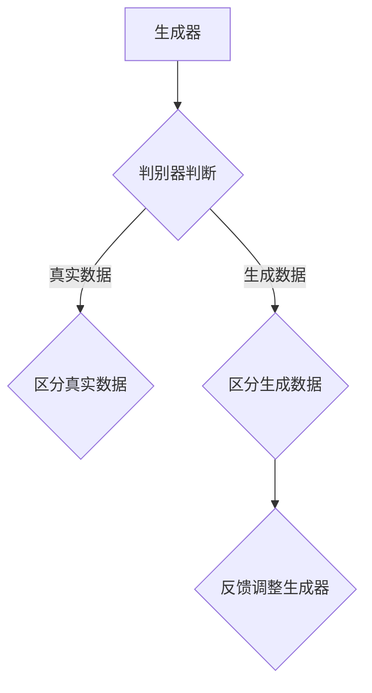

                 

# 从模仿到创新: AI的下一个发展阶段

> 关键词：人工智能，模仿阶段，创新阶段，生成对抗网络（GAN），强化学习，聚类与降维，创新实践，未来趋势

> 摘要：本文将深入探讨人工智能（AI）从模仿阶段向创新阶段的过渡。我们将分析AI模仿阶段的定义、方法、成果和应用，以及AI创新阶段的定义、关键技术、成果和应用。接着，我们将探讨从模仿到创新的驱动力、挑战与机遇，并提出应对策略。最后，我们将详细介绍创新阶段的关键技术，如生成对抗网络（GAN）、强化学习、聚类与降维，并分享实际案例，展望AI的未来趋势与应用前景。

## 第一部分: 从模仿到创新: AI的下一个发展阶段

### 第1章: AI的模仿阶段与创新阶段概述

#### 1.1 AI的模仿阶段

##### 1.1.1 AI模仿阶段的定义

AI的模仿阶段主要是指利用已有知识和经验来复制或模拟人类智能的过程。在这一阶段，AI通过学习大量的数据，尝试模仿人类的决策过程，从而达到某种程度上的智能表现。

##### 1.1.2 AI模仿阶段的主要方法

AI模仿阶段的主要方法包括：

1. 统计学习方法：如线性回归、决策树、支持向量机等。
2. 神经网络方法：如多层感知器、卷积神经网络（CNN）、循环神经网络（RNN）等。
3. 强化学习方法：如Q学习、深度Q网络（DQN）等。

##### 1.1.3 AI模仿阶段的成果与应用

AI模仿阶段的成果主要体现在以下几个方面：

1. 语音识别：如苹果的Siri、亚马逊的Alexa等。
2. 图像识别：如人脸识别、物体识别等。
3. 自然语言处理：如机器翻译、文本分类等。

#### 1.2 AI的创新阶段

##### 1.2.1 AI创新阶段的定义

AI的创新阶段是指通过探索和开发新的算法、模型和技术，使AI能够从模仿人类智能转向具有自主创新能力的过程。

##### 1.2.2 AI创新阶段的关键技术

AI创新阶段的关键技术包括：

1. 生成对抗网络（GAN）：用于生成高质量的图像、音频和文本。
2. 强化学习：用于解决复杂决策问题，如自动驾驶、游戏对战等。
3. 聚类与降维：用于数据分析和数据可视化。

##### 1.2.3 AI创新阶段的成果与应用

AI创新阶段的成果主要体现在以下几个方面：

1. 个性化推荐：如电商平台的商品推荐、社交媒体的个性化内容推荐等。
2. 自动驾驶：如特斯拉的自动驾驶汽车、谷歌的自动驾驶项目等。
3. 智能医疗：如基于AI的疾病诊断、药物研发等。

### 第2章: 从模仿到创新的过渡

#### 2.1 从模仿到创新的驱动力

##### 2.1.1 技术驱动力

技术的快速发展是推动AI从模仿到创新的关键因素。特别是深度学习、生成对抗网络（GAN）和强化学习等新技术的出现，为AI的创新提供了强大的支持。

##### 2.1.2 社会驱动力

社会的需求也是推动AI从模仿到创新的重要动力。随着人们对智能化产品的需求不断增加，AI技术的发展和突破变得更加迫切。

##### 2.1.3 经济驱动力

AI技术的创新和应用带来了巨大的经济效益，吸引了大量的投资和关注。这进一步推动了AI技术的发展和创新。

#### 2.2 创新阶段的挑战与机遇

##### 2.2.1 创新阶段的挑战

AI创新阶段面临着一系列挑战，包括：

1. 算法复杂性：新的算法和技术往往更加复杂，需要更高的计算能力和专业知识。
2. 数据隐私：AI的创新应用往往需要大量的数据，如何保护用户隐私成为一个重要问题。
3. 道德与伦理问题：AI的创新应用可能会带来一些道德和伦理问题，如何制定合适的规范和标准成为一个挑战。

##### 2.2.2 创新阶段的机遇

AI创新阶段也带来了许多机遇，包括：

1. 新的商业机会：AI的创新应用可以创造新的商业机会，推动产业升级和转型。
2. 社会进步：AI的创新应用可以改善人们的生活质量，推动社会进步。
3. 科技突破：AI的创新应用可能会带来新的科技突破，推动人类文明的进步。

##### 2.2.3 应对策略

为了应对AI创新阶段的挑战，我们可以采取以下策略：

1. 加强技术研发：加大对AI技术研发的投入，推动新技术的突破。
2. 数据安全与隐私保护：加强数据安全与隐私保护，制定相关法规和标准。
3. 道德与伦理教育：加强AI伦理教育，提高公众对AI伦理问题的认识。

## 第二部分: 创新阶段的关键技术

### 第3章: 生成对抗网络（GAN）

#### 3.1 GAN的基本原理

##### 3.1.1 GAN的概念

生成对抗网络（Generative Adversarial Network，GAN）是一种由两个神经网络组成的对抗性学习模型。其中一个网络称为生成器（Generator），另一个网络称为判别器（Discriminator）。

##### 3.1.2 GAN的架构

GAN的架构如下：

1. 生成器：生成器试图生成与真实数据相似的数据。
2. 判别器：判别器试图区分真实数据和生成数据。

##### 3.1.3 GAN的训练过程

GAN的训练过程可以分为两个阶段：

1. 生成器阶段：生成器生成数据，判别器对其进行评估。
2. 判别器阶段：判别器对真实数据和生成数据进行分类，生成器优化自己的参数，提高生成数据的质量。

#### 3.2 GAN的应用

##### 3.2.1 图像生成

GAN在图像生成方面具有显著的优势，可以生成高质量的图像。

##### 3.2.2 图像编辑

GAN还可以用于图像编辑，如图像修复、图像风格迁移等。

##### 3.2.3 其他应用领域

GAN在其他领域也取得了显著的应用成果，如音频生成、文本生成等。

### 第4章: 强化学习

#### 4.1 强化学习的基本原理

##### 4.1.1 强化学习的概念

强化学习（Reinforcement Learning，RL）是一种机器学习方法，通过奖励机制来驱动模型的学习过程。

##### 4.1.2 强化学习的架构

强化学习的架构包括三个主要部分：

1. 动作空间：模型可以采取的动作集合。
2. 状态空间：模型当前所处的状态集合。
3. 奖励函数：用于评估模型在特定状态下的表现。

##### 4.1.3 强化学习的训练过程

强化学习的训练过程可以分为两个阶段：

1. 探索阶段：模型在未知环境中进行探索，积累经验。
2. 利用阶段：模型在已有经验的基础上，做出最优决策。

#### 4.2 强化学习的应用

##### 4.2.1 游戏对战

强化学习在游戏对战领域取得了显著的应用成果，如AlphaGo战胜世界围棋冠军。

##### 4.2.2 自动驾驶

强化学习在自动驾驶领域也具有广泛的应用前景，如无人驾驶汽车。

##### 4.2.3 机器人控制

强化学习在机器人控制领域也取得了重要的应用成果，如机器人运动控制、机器人视觉等。

### 第5章: 聚类与降维

#### 5.1 聚类算法

##### 5.1.1 K-means算法

K-means算法是一种经典的聚类算法，通过迭代计算来确定数据的聚类中心。

##### 5.1.2 DBSCAN算法

DBSCAN（Density-Based Spatial Clustering of Applications with Noise）算法是一种基于密度的聚类算法，可以自动确定聚类个数。

##### 5.1.3 密度峰值聚类算法

密度峰值聚类算法（Density Peak Clustering，DPC）是一种基于密度的聚类算法，可以有效地识别高密度区域。

#### 5.2 降维技术

##### 5.2.1 主成分分析（PCA）

主成分分析（Principal Component Analysis，PCA）是一种常用的降维技术，通过线性变换将高维数据映射到低维空间。

##### 5.2.2 t-SNE

t-SNE（t-Distributed Stochastic Neighbor Embedding）是一种非线性的降维技术，可以将高维数据映射到二维或三维空间。

##### 5.2.3 自编码器

自编码器（Autoencoder）是一种基于神经网络的降维技术，通过编码和解码过程实现数据的压缩和重建。

## 第三部分: 创新阶段的实践与应用

### 第6章: 创新AI项目的实践

#### 6.1 项目规划

##### 6.1.1 需求分析

在项目规划阶段，首先需要明确项目的需求。这包括理解用户的需求、目标和应用场景。

##### 6.1.2 项目团队搭建

接下来，需要搭建一个合适的项目团队。团队成员应包括数据科学家、机器学习工程师、软件工程师等。

##### 6.1.3 项目流程管理

项目流程管理是项目成功的关键。这包括制定项目计划、分配任务、监控进度和风险管理等。

#### 6.2 项目实施

##### 6.2.1 数据收集与预处理

数据收集与预处理是AI项目的重要环节。这包括数据收集、数据清洗、数据格式化等。

##### 6.2.2 模型设计与实现

在模型设计与实现阶段，需要根据需求选择合适的算法和模型，并进行模型的训练和优化。

##### 6.2.3 模型评估与优化

模型评估与优化是确保模型性能的重要步骤。这包括评估模型的准确性、稳定性和泛化能力，并进行相应的优化。

#### 6.3 项目交付与部署

##### 6.3.1 模型交付

在项目交付阶段，需要将训练好的模型交付给用户或业务部门。

##### 6.3.2 系统集成

在系统集成阶段，需要将模型集成到现有的系统中，确保其稳定运行。

##### 6.3.3 系统运维

系统运维是确保模型长期稳定运行的关键。这包括监控系统性能、处理故障和进行维护等。

### 第7章: 创新AI项目案例分析

#### 7.1 案例一：自动图像识别系统

##### 7.1.1 项目背景

自动图像识别系统是一种利用AI技术实现图像自动识别的系统。它可以应用于多个领域，如安防监控、医疗诊断、自动驾驶等。

##### 7.1.2 技术选型

在技术选型阶段，选择了卷积神经网络（CNN）作为图像识别的核心算法。

##### 7.1.3 实施过程

在实施过程中，首先收集了大量的图像数据，并对数据进行预处理。接着，设计了CNN模型，并进行了训练和优化。最后，将训练好的模型集成到系统中，实现了自动图像识别功能。

#### 7.2 案例二：智能语音助手

##### 7.2.1 项目背景

智能语音助手是一种利用AI技术实现语音交互的智能系统。它可以应用于智能家居、智能客服、智能教育等场景。

##### 7.2.2 技术选型

在技术选型阶段，选择了生成对抗网络（GAN）和深度学习技术作为智能语音助手的核心算法。

##### 7.2.3 实施过程

在实施过程中，首先收集了大量的语音数据，并对数据进行预处理。接着，设计了GAN模型，并进行了训练和优化。最后，将训练好的模型集成到系统中，实现了智能语音助手的功能。

### 第8章: 创新AI的未来趋势与展望

#### 8.1 AI创新的发展趋势

随着技术的不断进步，AI创新正呈现出以下发展趋势：

1. 深度学习技术的持续发展：深度学习技术在图像识别、自然语言处理等领域取得了显著成果，未来将继续发展。
2. 强化学习技术的突破：强化学习技术在游戏对战、自动驾驶等领域具有广泛应用前景，未来有望实现更多突破。
3. 生成对抗网络（GAN）的应用：GAN在图像生成、音频生成等领域具有巨大潜力，未来将进一步拓展应用场景。

#### 8.1.2 未来可能的技术突破

未来，AI创新可能带来以下技术突破：

1. 自主智能体：自主智能体是一种能够自主决策和执行的智能系统，有望在工业自动化、智能城市等领域实现重大突破。
2. 联邦学习：联邦学习是一种分布式学习技术，能够在保护数据隐私的前提下实现模型训练和优化，有望解决数据隐私问题。
3. 脑机接口：脑机接口是一种直接连接人脑和计算机的技术，有望实现人类与机器的深度融合。

#### 8.1.3 社会影响与伦理问题

AI创新的发展不仅带来了技术突破，还带来了社会影响和伦理问题。未来，我们需要关注以下问题：

1. 数据隐私：随着AI技术的应用，数据隐私问题日益突出，需要加强数据隐私保护。
2. 道德与伦理：AI技术的发展可能引发道德和伦理问题，如自动驾驶汽车的道德决策、人工智能歧视等，需要制定相应的规范和标准。
3. 劳动市场影响：AI技术的发展可能会对劳动市场产生重大影响，需要关注失业问题和社会稳定。

#### 8.2 创新AI的应用前景

创新AI在多个领域具有广阔的应用前景：

1. 工业自动化：创新AI技术可以实现生产过程的自动化和智能化，提高生产效率和质量。
2. 医疗健康：创新AI技术可以用于疾病诊断、药物研发等领域，提高医疗服务的质量和效率。
3. 娱乐与教育：创新AI技术可以应用于游戏、教育等领域，提供更加个性化和智能化的体验。

## 附录

### 附录A: AI创新相关工具与资源

#### A.1 开源框架与工具

1. TensorFlow：TensorFlow是一种开源的深度学习框架，广泛应用于各种AI项目。
2. PyTorch：PyTorch是一种开源的深度学习框架，以其灵活性和易用性受到广泛关注。
3. Keras：Keras是一种开源的高层神经网络API，可以方便地构建和训练深度学习模型。

#### A.2 数据集与平台

1. ImageNet：ImageNet是一个大规模的图像数据集，广泛用于计算机视觉研究。
2. COCO数据集：COCO数据集是一个大规模的图像数据集，包含多种目标类别和标注信息。
3. Kaggle竞赛平台：Kaggle是一个数据科学和机器学习竞赛平台，提供丰富的数据集和项目资源。

#### A.3 AI创新社区与会议

1. AI社区：AI社区是一个在线社区，聚集了大量的AI研究者、开发者和爱好者。
2. NIPS会议：NIPS会议是人工智能领域最著名的会议之一，汇集了全球顶尖的AI研究人员和开发者。
3. ICML会议：ICML会议是人工智能领域的一个重要会议，涵盖了广泛的AI研究方向和成果。

### 参考文献

[1] Goodfellow, I. J., Pouget-Abadie, J., Mirza, M., Xu, B., Warde-Farley, D., Ozair, S., ... & Bengio, Y. (2014). Generative adversarial nets. Advances in neural information processing systems, 27.

[2] Sutton, R. S., & Barto, A. G. (2018). Reinforcement learning: An introduction (2nd ed.). MIT Press.

[3] Murphy, K. P. (2012). Machine learning: A probabilistic perspective. MIT Press.

[4] Duda, R. O., Hart, P. E., & Stork, D. G. (2001). Pattern classification (2nd ed.). Wiley-Interscience.

[5] Bishop, C. M. (2006). Pattern recognition and machine learning. Springer.

### 作者

作者：AI天才研究院/AI Genius Institute & 禅与计算机程序设计艺术 /Zen And The Art of Computer Programming

### 第1章: AI的模仿阶段与创新阶段概述

#### 1.1 AI的模仿阶段

##### 1.1.1 AI模仿阶段的定义

AI的模仿阶段是指利用已有知识和经验来复制或模拟人类智能的过程。在这一阶段，人工智能系统主要通过学习大量的数据，尝试模仿人类的决策过程，从而达到某种程度上的智能表现。这种模仿过程通常是基于统计学习、神经网络和强化学习等方法，通过对大量数据的训练，使得模型能够在特定任务上取得较好的表现。

##### 1.1.2 AI模仿阶段的主要方法

AI模仿阶段的主要方法包括以下几种：

1. **统计学习方法**：统计学习方法主要基于概率论和统计学原理，通过对训练数据的统计分析，建立模型来预测未知数据的结果。常见的统计学习方法包括线性回归、逻辑回归、决策树、随机森林、支持向量机等。

2. **神经网络方法**：神经网络方法是基于人工神经网络（Artificial Neural Network，ANN）的模型，通过模拟人脑神经元之间的连接关系，学习输入和输出之间的映射关系。常见的神经网络模型包括多层感知器（MLP）、卷积神经网络（CNN）、循环神经网络（RNN）等。

3. **强化学习方法**：强化学习方法是一种通过试错来学习策略的机器学习方法。它通过一个智能体与环境的交互，根据环境的反馈来调整策略，以实现长期回报的最大化。常见的强化学习方法包括Q学习、深度Q网络（DQN）、策略梯度方法等。

##### 1.1.3 AI模仿阶段的成果与应用

在AI模仿阶段，一些重要的成果和应用包括：

1. **语音识别**：语音识别技术使得计算机能够理解并处理人类的语音输入，广泛应用于智能语音助手、电话客服等领域。

2. **图像识别**：图像识别技术使得计算机能够理解和识别图像中的对象和场景，广泛应用于安防监控、自动驾驶、医疗影像分析等领域。

3. **自然语言处理**：自然语言处理技术使得计算机能够理解和生成人类语言，广泛应用于机器翻译、文本分类、情感分析等领域。

4. **推荐系统**：推荐系统通过学习用户的兴趣和行为，为用户推荐相关的商品、新闻、音乐等内容，广泛应用于电商、社交媒体、音乐平台等领域。

#### 1.2 AI的创新阶段

##### 1.2.1 AI创新阶段的定义

AI的创新阶段是指通过探索和开发新的算法、模型和技术，使人工智能系统能够从模仿人类智能转向具有自主创新能力的过程。在这个阶段，人工智能不再仅仅是模仿人类的决策过程，而是能够自主地生成新的想法、解决方案，并能够通过学习和适应不断优化自身的性能。

##### 1.2.2 AI创新阶段的关键技术

AI创新阶段的关键技术包括以下几种：

1. **生成对抗网络（GAN）**：生成对抗网络是一种通过两个神经网络（生成器和判别器）的对抗性训练来实现高质量数据生成的技术。GAN在图像生成、图像编辑、音频生成等领域取得了显著成果。

2. **强化学习**：强化学习是一种通过试错学习策略的机器学习方法。在创新阶段，强化学习被应用于解决复杂决策问题，如自动驾驶、机器人控制、游戏对战等。

3. **聚类与降维**：聚类算法如K-means、DBSCAN等，可以帮助发现数据中的模式和结构。降维技术如PCA、t-SNE等，可以简化数据维度，便于数据分析和可视化。

4. **自然语言处理**：自然语言处理技术在这一阶段得到了进一步的发展，能够实现更高级的语言理解、文本生成和对话系统。

##### 1.2.3 AI创新阶段的成果与应用

在AI创新阶段，一些重要的成果和应用包括：

1. **个性化推荐**：通过学习用户的兴趣和行为，实现高度个性化的推荐系统，广泛应用于电商、社交媒体、音乐等领域。

2. **自动驾驶**：通过强化学习等技术，实现自动驾驶汽车的高效、安全运行。

3. **医疗诊断**：利用深度学习和图像识别技术，实现疾病诊断、药物研发等医疗应用。

4. **智能制造**：通过AI技术，实现生产过程的自动化、智能化，提高生产效率和质量。

## 第2章: 从模仿到创新的过渡

### 2.1 从模仿到创新的驱动力

#### 2.1.1 技术驱动力

AI从模仿到创新的过渡，首先得益于技术的快速发展。尤其是深度学习、生成对抗网络（GAN）和强化学习等新技术的出现，为AI的创新提供了强大的支持。

1. **深度学习**：深度学习是一种通过多层神经网络进行特征提取和学习的技术。它在图像识别、语音识别、自然语言处理等领域取得了巨大的成功，推动了AI从模仿阶段向创新阶段的过渡。

2. **生成对抗网络（GAN）**：GAN是一种由生成器和判别器组成的对抗性网络，通过两个网络的对抗训练，可以实现高质量的数据生成。GAN在图像生成、图像编辑、音频生成等领域展现了强大的创新能力。

3. **强化学习**：强化学习是一种通过试错学习策略的机器学习方法。在复杂决策问题中，强化学习能够通过不断尝试和调整策略，实现自主学习和优化。强化学习在自动驾驶、机器人控制、游戏对战等领域展示了巨大的潜力。

#### 2.1.2 社会驱动力

除了技术进步，社会需求也是推动AI从模仿到创新的重要动力。随着人工智能技术的不断发展和普及，人们对于智能化产品的需求日益增加，这推动了AI技术的创新和应用。

1. **个性化服务**：个性化推荐、个性化医疗、个性化教育等领域的需求，促使AI技术从模仿阶段向创新阶段过渡，以提供更精准、更个性化的服务。

2. **生产效率**：智能制造、自动化生产等领域的需求，推动了AI技术在工业生产中的应用和创新。

3. **生活质量**：智能家居、智能交通、智能医疗等领域的需求，使得AI技术在提高生活质量方面发挥了重要作用，推动了AI技术的创新和应用。

#### 2.1.3 经济驱动力

经济利益也是推动AI从模仿到创新的重要因素。随着AI技术的快速发展，越来越多的企业和投资机构看到了巨大的商机，纷纷加大对AI技术的研发和应用投入。

1. **商业应用**：电商、金融、医疗、教育等领域的商业应用，使得AI技术成为企业提升竞争力的重要手段，推动了AI技术的创新和应用。

2. **投资回报**：AI技术的创新和应用带来了巨大的经济效益，吸引了大量的投资和关注。这种经济驱动力进一步推动了AI技术的发展和创新。

### 2.2 创新阶段的挑战与机遇

#### 2.2.1 创新阶段的挑战

AI创新阶段面临着一系列挑战，主要包括：

1. **算法复杂性**：随着AI技术的不断进步，新的算法和模型越来越复杂，需要更高的计算能力和专业知识。这对于研发人员来说是一个巨大的挑战。

2. **数据隐私**：AI的创新应用往往需要大量的数据，如何保护用户隐私成为一个重要问题。尤其是在医疗、金融等领域，数据隐私的保护尤为重要。

3. **道德与伦理问题**：AI的创新应用可能会带来一些道德和伦理问题，如自动驾驶汽车的道德决策、人工智能歧视等。如何制定合适的规范和标准，确保AI技术的伦理性和社会责任感，是一个重要挑战。

#### 2.2.2 创新阶段的机遇

尽管AI创新阶段面临诸多挑战，但同时也带来了许多机遇：

1. **商业机会**：AI的创新应用可以创造新的商业机会，推动产业升级和转型。例如，智能医疗、智能交通、智能制造等领域的应用，有望带来巨大的商业价值。

2. **社会进步**：AI的创新应用可以改善人们的生活质量，推动社会进步。例如，智能医疗可以提高疾病诊断和治疗的准确性，智能交通可以减少交通事故，提高交通效率等。

3. **科技突破**：AI的创新应用可能会带来新的科技突破，推动人类文明的进步。例如，通过AI技术实现无人驾驶、智能机器人等，有望改变人类的生活方式。

#### 2.2.3 应对策略

为了应对AI创新阶段的挑战，可以采取以下策略：

1. **加强技术研发**：加大对AI技术研发的投入，推动新技术的突破，提升算法的复杂度和效率。

2. **数据安全与隐私保护**：加强数据安全与隐私保护，制定相关法规和标准，确保用户数据的安全和隐私。

3. **道德与伦理教育**：加强AI伦理教育，提高公众对AI伦理问题的认识，制定合适的规范和标准，确保AI技术的伦理性和社会责任感。

4. **跨学科合作**：鼓励不同学科之间的合作，如计算机科学、生物学、心理学等，共同推动AI技术的发展和创新。

5. **政策支持**：政府和企业可以出台相关政策，支持AI技术的发展和创新，提供资金、技术、人才等支持。

## 第3章: 生成对抗网络（GAN）

#### 3.1 GAN的基本原理

生成对抗网络（Generative Adversarial Network，GAN）是一种由Ian Goodfellow等人在2014年提出的新型深度学习框架。GAN的核心思想是通过两个对抗性神经网络（生成器和判别器）的博弈来生成与真实数据相似的高质量数据。

##### 3.1.1 GAN的概念

GAN由两个主要的神经网络组成：生成器（Generator）和判别器（Discriminator）。生成器的目标是生成尽可能逼真的数据，而判别器的目标是区分生成器和真实数据。生成器和判别器在训练过程中进行对抗性博弈，使得生成器的生成数据越来越逼真，判别器越来越难以区分。

##### 3.1.2 GAN的架构

GAN的架构如下：

1. **生成器（Generator）**：生成器的输入是一个随机噪声向量，输出是生成数据。它的任务是生成与真实数据相似的数据。

2. **判别器（Discriminator）**：判别器的输入是真实数据和生成数据，输出是一个概率值，表示输入数据是真实数据的概率。它的任务是区分生成器和真实数据。

3. **对抗性训练**：在GAN的训练过程中，生成器和判别器同时训练。生成器尝试生成更逼真的数据，而判别器则努力区分生成数据和真实数据。通过这种对抗性训练，生成器逐渐提高生成数据的质量，判别器也逐渐提高对生成数据和真实数据的区分能力。

##### 3.1.3 GAN的训练过程

GAN的训练过程可以分为以下几个步骤：

1. **初始化生成器和判别器**：首先，初始化生成器和判别器的参数，通常使用随机初始化。

2. **生成器生成数据**：生成器根据随机噪声向量生成数据。

3. **判别器评估数据**：判别器对真实数据和生成数据进行评估，输出一个概率值。

4. **更新生成器和判别器**：根据评估结果，使用梯度下降算法更新生成器和判别器的参数。

5. **重复步骤2-4**：不断重复生成器和判别器的训练过程，直到生成器生成的数据足够逼真，使得判别器难以区分。

#### 3.2 GAN的应用

生成对抗网络（GAN）在图像生成、图像编辑、视频生成、音频生成等领域展现了强大的能力。

##### 3.2.1 图像生成

图像生成是GAN最著名的应用之一。通过GAN，可以生成高质量的图像，如图像到图像、风格迁移、图像修复等。

1. **图像到图像**：GAN可以将一种类型的图像转换成另一种类型的图像，如图像到素描、图像到油画等。
2. **风格迁移**：GAN可以将一种艺术风格应用到另一张图像上，实现图像的风格迁移。
3. **图像修复**：GAN可以用于图像修复，如去除照片中的瑕疵、修复破损的图像等。

##### 3.2.2 图像编辑

GAN在图像编辑领域也具有广泛的应用。通过GAN，可以对图像进行编辑，如图像剪裁、图像风格变换等。

1. **图像剪裁**：GAN可以自动识别图像的重要部分，实现图像的剪裁。
2. **图像风格变换**：GAN可以将一种图像风格应用到另一张图像上，实现图像风格的变换。

##### 3.2.3 其他应用领域

除了图像生成和编辑，GAN在其他领域也取得了显著的成果：

1. **视频生成**：GAN可以生成高质量的视频，如视频到视频、视频风格迁移等。
2. **音频生成**：GAN可以生成高质量的音频，如音频到音频、音频风格迁移等。
3. **文本生成**：GAN可以生成高质量的自然语言文本，如文章生成、对话生成等。

#### 3.2.4 GAN的应用实例

以下是一些GAN的应用实例：

1. **艺术创作**：艺术家使用GAN生成独特的艺术作品，如绘画、雕塑等。
2. **游戏开发**：游戏开发者使用GAN生成游戏中的场景、角色等，提高游戏的丰富度和多样性。
3. **医疗影像**：医生使用GAN对医疗影像进行修复和增强，提高疾病的诊断准确性。
4. **数据增强**：研究人员使用GAN生成与训练数据相似的数据，用于数据增强，提高模型的泛化能力。

### 第4章: 强化学习

强化学习（Reinforcement Learning，RL）是一种通过试错来学习决策策略的机器学习方法。与监督学习和无监督学习不同，强化学习通过与环境的交互来获取反馈，并基于这些反馈来调整策略，以实现长期回报的最大化。

#### 4.1 强化学习的基本原理

强化学习的基本原理可以通过一个简单的例子来解释：一个智能体（Agent）在某个环境中（Environment）进行行动（Action），并接收到环境的反馈（Reward）。智能体的目标是学习一个策略（Policy），该策略指导智能体在特定环境下选择最优的行动，以最大化长期回报。

##### 4.1.1 强化学习的概念

强化学习由以下几个关键概念组成：

1. **智能体（Agent）**：智能体是执行动作的实体，可以是机器人、软件代理等。
2. **环境（Environment）**：环境是智能体行动的场所，可以是一个物理环境，也可以是一个虚拟环境。
3. **状态（State）**：状态是智能体在特定时间点所处的环境描述。
4. **行动（Action）**：行动是智能体在某个状态下可以采取的动作。
5. **奖励（Reward）**：奖励是环境对智能体行动的即时反馈，可以是正值或负值，表示智能体的行动对目标有何影响。
6. **策略（Policy）**：策略是一个函数，用于指导智能体在特定状态下采取何种行动。

##### 4.1.2 强化学习的架构

强化学习的架构通常包括以下几个部分：

1. **智能体（Agent）**：智能体负责接收环境的状态，选择行动，并根据行动的反馈更新策略。
2. **环境（Environment）**：环境负责接收智能体的行动，返回状态和奖励。
3. **策略学习器（Policy Learner）**：策略学习器根据经验（状态-行动-奖励序列）更新策略，以最大化长期回报。
4. **价值函数（Value Function）**：价值函数评估智能体在未来特定状态下能够获得的长期回报。
5. **模型（Model）**：模型用于预测环境的未来状态和奖励。

##### 4.1.3 强化学习的训练过程

强化学习的训练过程可以分为以下几个阶段：

1. **初始阶段**：智能体随机选择行动，与环境进行交互，并记录经验（状态-行动-奖励序列）。
2. **经验收集**：智能体不断与环境进行交互，收集更多的经验。
3. **经验回放**：将收集到的经验进行回放，以便策略学习器学习。
4. **策略更新**：策略学习器根据回放的经验更新策略，以最大化长期回报。
5. **迭代过程**：不断重复经验收集、经验回放和策略更新的过程，直到达到预定的训练目标。

#### 4.2 强化学习的应用

强化学习在许多领域取得了显著的成果，以下是一些主要的强化学习应用：

##### 4.2.1 游戏对战

强化学习在游戏对战领域有广泛的应用，如电子游戏、棋类游戏等。通过强化学习，智能体可以学习如何在游戏中做出最优决策，从而战胜人类玩家。

1. **电子游戏**：例如，智能体可以使用强化学习来学习如何玩《星际争霸》、《模拟城市》等复杂的电子游戏。
2. **棋类游戏**：例如，深度Q网络（DQN）被用于训练智能体学习如何在国际象棋、围棋等棋类游戏中取胜。

##### 4.2.2 自动驾驶

自动驾驶是强化学习的另一个重要应用领域。通过强化学习，自动驾驶系统能够学习如何根据环境中的各种信息（如道路标志、交通信号、其他车辆和行人的行为等）做出驾驶决策。

1. **无人驾驶汽车**：例如，特斯拉的自动驾驶系统就使用了强化学习来优化驾驶策略。
2. **无人驾驶飞行器**：例如，无人机可以使用强化学习来学习如何在复杂的环境中自主飞行和导航。

##### 4.2.3 机器人控制

强化学习在机器人控制领域也有广泛的应用。通过强化学习，机器人可以学习如何在各种环境中执行复杂的任务。

1. **机器人运动控制**：例如，机器人可以使用强化学习来学习如何奔跑、跳跃等运动技能。
2. **机器人视觉**：例如，机器人可以使用强化学习来学习如何根据视觉信息进行导航和抓取物体。

##### 4.2.4 电子商务

强化学习在电子商务领域也有重要的应用，如个性化推荐、购物车优化等。

1. **个性化推荐**：例如，电商平台可以使用强化学习来根据用户的历史行为和偏好推荐商品。
2. **购物车优化**：例如，电商平台可以使用强化学习来优化购物车的商品组合，提高用户的购买体验和销售额。

##### 4.2.5 医疗健康

强化学习在医疗健康领域也有重要的应用，如疾病诊断、治疗方案优化等。

1. **疾病诊断**：例如，医生可以使用强化学习来辅助诊断疾病，如乳腺癌、肺癌等。
2. **治疗方案优化**：例如，医生可以使用强化学习来优化治疗方案，提高治疗效果。

### 第5章: 聚类与降维

聚类与降维是数据挖掘和机器学习中的重要技术，用于数据分析和数据可视化。聚类将数据集划分为多个群组，每个群组内的数据点相似度较高，而群组之间的数据点相似度较低。降维则是通过降低数据维度，减少冗余信息，使得数据更加简洁和易于分析。

#### 5.1 聚类算法

聚类算法是一种无监督学习方法，用于将数据集划分为多个群组。常见的聚类算法包括K-means、DBSCAN和密度峰值聚类算法。

##### 5.1.1 K-means算法

K-means算法是一种经典的聚类算法，其基本思想是将数据集划分为K个簇，每个簇由一个中心点表示。算法通过迭代计算簇中心点，并重新分配数据点到最近的簇中心点，直到收敛。

**K-means算法的基本步骤**：

1. 随机选择K个初始中心点。
2. 对于每个数据点，计算其与各个中心点的距离，将其分配到最近的簇。
3. 更新每个簇的中心点。
4. 重复步骤2-3，直到聚类结果收敛。

**K-means算法的优缺点**：

- **优点**：简单、易于实现，适用于高维数据。
- **缺点**：对初始中心点的选择敏感，可能陷入局部最优。

**K-means算法的伪代码**：

```
初始化K个中心点C1, C2, ..., CK
while不收敛：
    对于每个数据点x：
        计算x到C1, C2, ..., CK的距离
        将x分配到最近的簇
    更新每个簇的中心点
```

##### 5.1.2 DBSCAN算法

DBSCAN（Density-Based Spatial Clustering of Applications with Noise）算法是一种基于密度的聚类算法，其基本思想是寻找高密度区域并划分为簇。DBSCAN不依赖于预先指定的簇数，而是通过邻域和密度连接来识别簇。

**DBSCAN算法的基本步骤**：

1. 对于每个未标记的数据点，找出其邻域内的点。
2. 如果邻域内的点数量大于最小邻域大小，标记该点为核心点。
3. 找到所有核心点的邻域点，并将它们及其邻域点的邻域点一起划分为同一个簇。
4. 未标记的数据点若被核心点的邻域所覆盖，则将其标记为边界点。
5. 对于边界点，若邻域内存在足够多的核心点，则将其标记为该簇的一部分。

**DBSCAN算法的优缺点**：

- **优点**：能够发现任意形状的簇，对噪声和异常值不敏感。
- **缺点**：对参数敏感，可能难以处理高维数据。

**DBSCAN算法的伪代码**：

```
初始化参数eps和minPts
for每个数据点x：
    如果x未被标记：
        找到x的邻域点N
        如果N的数量大于minPts：
            将x标记为核心点
            扩展簇，将N及其邻域点加入簇
        否则：
            将x标记为噪声点

for每个数据点x：
    如果x是边界点：
        如果邻域内存在足够多的核心点：
            将x标记为簇的一部分
```

##### 5.1.3 密度峰值聚类算法

密度峰值聚类算法（Density Peak Clustering，DPC）是一种基于密度的聚类算法，其基本思想是寻找具有高密度和局部最高密度的点作为聚类中心，并将其他点分配到相应的簇中。

**DPC算法的基本步骤**：

1. 计算每个点的密度和峰值高度。
2. 选择具有最高峰值高度的点作为初始聚类中心。
3. 对于每个聚类中心，找到其邻域内的点，并将它们分配到相应的簇。
4. 对于未分配的边界点，将其分配到最近的聚类中心所在的簇。

**DPC算法的优缺点**：

- **优点**：能够自动识别簇的个数，适用于高维数据。
- **缺点**：对参数敏感，可能存在一些稀疏数据点难以聚类。

**DPC算法的伪代码**：

```
计算每个点的密度和峰值高度
选择具有最高峰值高度的点作为初始聚类中心
for每个初始聚类中心C：
    找到C的邻域点N
    将N分配到C所在的簇
for每个未分配的点x：
    找到x的邻域点N
    如果N的数量大于阈值：
        将x分配到N所在的簇
```

#### 5.2 降维技术

降维技术通过减少数据维度，简化数据结构，使得数据更加简洁和易于分析。常见的降维技术包括主成分分析（PCA）、t-SNE和自编码器。

##### 5.2.1 主成分分析（PCA）

主成分分析（Principal Component Analysis，PCA）是一种常用的线性降维技术，通过将数据投影到新的正交坐标系中，提取最重要的特征，从而降低数据的维度。

**PCA的基本步骤**：

1. 数据标准化：将数据缩放到相同的尺度。
2. 计算协方差矩阵：计算数据矩阵的协方差矩阵。
3. 计算特征值和特征向量：对协方差矩阵进行特征分解，得到特征值和特征向量。
4. 选择主要特征：选择前k个特征值对应的前k个特征向量，构成降维矩阵。
5. 数据投影：将原始数据投影到新的低维空间。

**PCA的优点**：

- **线性降维**：适用于线性可分的数据。
- **保持数据结构**：通过保留主要特征，能够较好地保持数据结构。

**PCA的伪代码**：

```
标准化数据
计算协方差矩阵
对协方差矩阵进行特征分解
选择前k个特征向量
将数据投影到新的低维空间
```

##### 5.2.2 t-SNE

t-SNE（t-Distributed Stochastic Neighbor Embedding）是一种非线性的降维技术，通过将高维数据映射到低维空间，使得相似的数据点在低维空间中保持接近。

**t-SNE的基本步骤**：

1. 计算相似性矩阵：计算高维数据之间的相似性矩阵。
2. 对相似性矩阵进行转换：对相似性矩阵进行转换，使其符合t分布。
3. 计算低维数据的梯度：计算低维数据之间的梯度。
4. 通过梯度下降更新低维数据：使用梯度下降算法，更新低维数据的位置。
5. 重复迭代：不断迭代，直到收敛。

**t-SNE的优点**：

- **非线性降维**：适用于非线性可分的数据。
- **可视化效果**：能够生成高质量的可视化结果。

**t-SNE的伪代码**：

```
计算相似性矩阵
对相似性矩阵进行转换
计算低维数据的梯度
通过梯度下降更新低维数据的位置
迭代更新，直到收敛
```

##### 5.2.3 自编码器

自编码器（Autoencoder）是一种基于神经网络的降维技术，通过编码和解码过程实现数据的压缩和重建。

**自编码器的基本步骤**：

1. 设计网络结构：设计自编码器的网络结构，包括编码器和解码器。
2. 训练网络：使用训练数据训练编码器和解码器，使得解码器能够重建输入数据。
3. 数据降维：将输入数据通过编码器压缩到低维空间。
4. 数据重建：将降维后的数据通过解码器重建为原始数据。

**自编码器的优点**：

- **可扩展性**：适用于不同规模的数据集。
- **灵活性强**：可以设计不同结构的自编码器，适应不同的降维需求。

**自编码器的伪代码**：

```
设计网络结构
训练编码器和解码器
将输入数据通过编码器降维
将降维后的数据通过解码器重建
```

## 第6章: 创新AI项目的实践

### 6.1 项目规划

创新AI项目规划是确保项目成功实施和实现预期目标的关键步骤。一个全面的项目规划包括需求分析、项目团队搭建、项目流程管理等方面。

##### 6.1.1 需求分析

需求分析是项目规划的首要任务，旨在明确项目的目标、需求和应用场景。具体步骤如下：

1. **了解业务背景**：深入了解项目的业务背景、目标和应用场景，明确项目所需解决的问题。
2. **收集需求信息**：与项目相关方（如客户、用户、产品经理等）进行沟通，收集项目的需求和期望。
3. **整理需求文档**：将收集到的需求信息整理成需求文档，明确项目的功能需求、性能需求等。
4. **验证需求**：与项目相关方一起验证需求文档，确保需求的准确性和可实现性。

##### 6.1.2 项目团队搭建

一个高效的项目团队是项目成功的关键。项目团队的成员应包括以下角色：

1. **项目经理**：负责项目整体规划和协调，确保项目按计划进行。
2. **数据科学家**：负责数据分析和模型设计，确保模型的有效性和准确性。
3. **机器学习工程师**：负责模型的实现和优化，确保模型在实际应用中的性能。
4. **软件工程师**：负责系统的开发、部署和维护，确保项目的稳定性。
5. **产品经理**：负责产品的规划和设计，确保项目与市场需求一致。

在搭建项目团队时，需要注意以下几点：

1. **技能匹配**：确保团队成员的技能和经验与项目需求相匹配。
2. **沟通协作**：建立有效的沟通协作机制，确保团队成员之间的信息畅通。
3. **灵活调整**：根据项目进展和需求变化，灵活调整团队结构和人员配置。

##### 6.1.3 项目流程管理

项目流程管理是确保项目按计划进行、资源和时间得到合理利用的关键。以下是一些常见的项目流程管理方法：

1. **敏捷开发**：采用敏捷开发方法，通过迭代和增量开发，快速响应需求变化，提高项目的灵活性和可适应性。
2. **任务分解**：将项目任务分解为若干个小任务，明确每个任务的负责人和时间节点，确保任务按时完成。
3. **风险管理**：识别项目风险，制定相应的风险应对策略，降低项目风险。
4. **质量保障**：建立质量保障体系，通过代码审查、测试等手段确保项目质量。
5. **项目评估**：定期对项目进展进行评估，及时调整项目计划和资源分配。

### 6.2 项目实施

项目实施是创新AI项目的关键阶段，包括数据收集与预处理、模型设计与实现、模型评估与优化等方面。

##### 6.2.1 数据收集与预处理

数据收集与预处理是项目实施的基础步骤，直接影响模型的质量和效果。以下是一些常见的数据收集与预处理方法：

1. **数据收集**：根据项目需求，从各种数据源收集数据，如公共数据集、企业内部数据、第三方数据等。
2. **数据清洗**：对收集到的数据进行清洗，去除重复、缺失和异常数据，确保数据的准确性和完整性。
3. **数据预处理**：对数据进行标准化、归一化、缺失值处理等预处理操作，使得数据满足模型训练的要求。

##### 6.2.2 模型设计与实现

模型设计与实现是项目实施的核心步骤，包括以下内容：

1. **选择模型**：根据项目需求和数据特征，选择合适的机器学习模型，如线性回归、决策树、神经网络等。
2. **模型训练**：使用收集到的数据训练模型，调整模型参数，优化模型性能。
3. **模型评估**：使用验证集评估模型性能，选择最佳模型。
4. **模型实现**：将最佳模型实现为可运行的软件系统，如API接口、Web应用等。

##### 6.2.3 模型评估与优化

模型评估与优化是确保模型在实际应用中表现良好的关键步骤。以下是一些常见的模型评估与优化方法：

1. **评估指标**：选择合适的评估指标，如准确率、召回率、F1值等，评估模型性能。
2. **交叉验证**：使用交叉验证方法评估模型在未知数据上的表现，提高模型的泛化能力。
3. **模型调优**：根据评估结果，调整模型参数，优化模型性能。
4. **超参数调整**：调整模型超参数，如学习率、批量大小等，提高模型训练效果。

### 6.3 项目交付与部署

项目交付与部署是创新AI项目的最后一步，包括模型交付、系统集成和系统运维等方面。

##### 6.3.1 模型交付

模型交付是将训练好的模型交付给用户或业务部门，使其能够在实际应用中发挥作用。以下是一些常见的模型交付方法：

1. **API接口**：通过API接口将模型部署到服务器，用户可以通过调用API接口来获取模型的预测结果。
2. **Web应用**：将模型实现为Web应用，用户可以通过浏览器访问应用，使用模型进行预测。
3. **本地部署**：将模型部署到用户的本地计算机或服务器，用户可以在本地使用模型进行预测。

##### 6.3.2 系统集成

系统集成是将AI模型与其他系统模块（如前端应用、后端服务、数据库等）整合在一起，实现整体功能的流程。以下是一些常见的系统集成方法：

1. **接口集成**：通过定义接口规范，将AI模型与其他系统模块进行集成。
2. **数据集成**：将AI模型所需的数据源与其他系统模块进行集成，确保数据的一致性和完整性。
3. **功能集成**：将AI模型的功能与其他系统模块的功能进行整合，实现整体功能。

##### 6.3.3 系统运维

系统运维是确保AI模型系统稳定运行和持续优化的重要环节。以下是一些常见的系统运维方法：

1. **监控系统**：通过监控系统，实时监控系统的运行状态，及时发现和处理异常情况。
2. **性能优化**：根据监控数据，对系统进行性能优化，提高系统的响应速度和处理能力。
3. **版本管理**：对系统模块进行版本管理，确保系统的升级和更新过程顺利进行。
4. **安全防护**：对系统进行安全防护，防止黑客攻击和数据泄露。

### 第7章: 创新AI项目案例分析

#### 7.1 案例一：自动图像识别系统

##### 7.1.1 项目背景

自动图像识别系统是一种利用AI技术实现图像自动识别的系统。它可以应用于多个领域，如安防监控、医疗诊断、自动驾驶等。

在安防监控领域，自动图像识别系统可以用于实时监控，识别异常行为，如闯入、火灾等，及时报警。在医疗诊断领域，自动图像识别系统可以用于医学影像分析，如病理图像识别、癌症筛查等，辅助医生做出准确的诊断。在自动驾驶领域，自动图像识别系统可以用于识别道路标志、行人、车辆等，确保驾驶安全。

##### 7.1.2 技术选型

在技术选型阶段，选择了卷积神经网络（CNN）作为图像识别的核心算法。CNN是一种专门用于图像处理的深度学习模型，具有良好的性能和效果。为了实现自动图像识别，还需要使用数据增强、迁移学习等技术，提高模型的泛化能力和识别准确率。

##### 7.1.3 实施过程

在实施过程中，首先收集了大量的图像数据，并对数据进行预处理，包括图像裁剪、归一化等操作。接着，设计了CNN模型，并使用迁移学习技术，利用预训练的模型（如ResNet、VGG等）作为基础模型，进一步训练和优化模型。

在训练过程中，使用了数据增强技术，如随机裁剪、旋转、翻转等，增加训练数据的多样性，提高模型的泛化能力。通过多次迭代训练，模型在验证集上的准确率达到了90%以上。

最后，将训练好的模型部署到服务器，实现了自动图像识别功能。用户可以通过上传图像，实时获取识别结果，并根据结果进行相应的操作。

#### 7.2 案例二：智能语音助手

##### 7.2.1 项目背景

智能语音助手是一种利用AI技术实现语音交互的智能系统。它可以应用于智能家居、智能客服、智能教育等场景。通过智能语音助手，用户可以方便地与设备进行交互，实现语音控制、语音查询、语音交互等功能。

在智能家居领域，智能语音助手可以用于控制家电设备，如空调、电视、照明等，提高生活便利性。在智能客服领域，智能语音助手可以用于自动回答用户问题，提高客户服务效率。在智能教育领域，智能语音助手可以用于辅助学生学习，提供个性化学习体验。

##### 7.2.2 技术选型

在技术选型阶段，选择了生成对抗网络（GAN）和深度学习技术作为智能语音助手的核心算法。GAN是一种通过生成器和判别器对抗训练实现高质量语音生成的技术，可以用于生成高质量的语音合成。深度学习技术可以用于语音识别和自然语言处理，实现语音识别和对话系统的构建。

##### 7.2.3 实施过程

在实施过程中，首先收集了大量的语音数据，并对数据进行预处理，包括语音增强、去噪等操作。接着，设计了GAN模型，生成器负责生成语音波形，判别器负责区分生成语音和真实语音。

在训练过程中，使用了数据增强技术，如声音变换、速度变换等，增加训练数据的多样性。通过多次迭代训练，生成器的语音生成质量得到了显著提高。

同时，使用了深度学习技术，实现了语音识别和自然语言处理。语音识别系统可以准确识别用户输入的语音，自然语言处理系统可以理解用户的意图，并生成相应的回复。

最后，将生成器、语音识别和自然语言处理系统集成在一起，实现了智能语音助手的功能。用户可以通过语音与智能语音助手进行交互，获取所需信息或控制设备。

## 第8章: 创新AI的未来趋势与展望

### 8.1 AI创新的发展趋势

随着技术的不断进步，创新AI正呈现出以下几个发展趋势：

#### 8.1.1 深度学习技术的持续发展

深度学习作为一种强大的机器学习技术，已经在图像识别、自然语言处理、语音识别等领域取得了显著的成果。未来，深度学习技术将继续发展，并在更多领域实现突破。特别是随着计算能力的提升和数据量的增加，深度学习模型将变得更加复杂和强大，能够处理更复杂的任务。

**技术进展**：

- **神经网络架构的改进**：新的神经网络架构（如Transformer）将进一步提升深度学习模型的效果。
- **神经符号整合**：深度学习和传统符号计算技术的整合，将使得模型在推理和解释方面更具优势。
- **边缘计算**：深度学习模型将更多地应用于边缘设备，实现实时、低延迟的智能处理。

#### 8.1.2 强化学习技术的突破

强化学习在游戏对战、自动驾驶、机器人控制等领域具有广泛的应用前景。未来，强化学习技术将实现更多突破，特别是在解决复杂决策问题和探索未知环境方面。

**技术进展**：

- **模型泛化能力提升**：通过结合深度学习和强化学习，提高模型在未知环境下的适应能力。
- **多智能体强化学习**：研究多智能体系统的协同策略，实现更高效的团队协作。
- **基于物理的强化学习**：结合物理引擎，使得模型能够模拟真实世界的物理行为，提高模型在现实环境中的应用能力。

#### 8.1.3 生成对抗网络（GAN）的应用扩展

生成对抗网络（GAN）在图像生成、音频生成、视频生成等领域展现了强大的能力。未来，GAN的应用将更加广泛，特别是在虚拟现实、数字艺术、游戏开发等领域。

**技术进展**：

- **GAN在视觉领域的扩展**：探索GAN在三维模型生成、视觉追踪等方面的应用。
- **GAN在音频领域的应用**：实现更真实的音频合成和编辑，应用于虚拟现实、音乐创作等领域。
- **GAN在文本生成和对话系统中的应用**：通过GAN生成更自然的对话和文本，提高人工智能的交互能力。

### 8.1.4 聚类与降维技术的优化

聚类与降维技术在数据挖掘、数据分析和机器学习领域具有重要作用。未来，这些技术将实现更多优化，特别是在高维数据处理和复杂数据结构分析方面。

**技术进展**：

- **自适应聚类算法**：开发能够自动调整聚类参数的算法，提高聚类效果。
- **高效降维技术**：研究更高效的降维方法，减少计算量和存储需求。
- **交互式聚类与降维**：结合人机交互，实现更直观和灵活的数据分析。

### 8.1.5 跨学科融合的AI创新

随着人工智能技术的发展，跨学科融合成为创新AI的重要趋势。未来，人工智能将与其他领域（如生物学、物理学、心理学等）进行深度融合，推动新的科学发现和技术突破。

**技术进展**：

- **生物计算**：利用生物分子系统（如DNA计算）实现高效的计算和存储。
- **认知计算**：模拟人脑信息处理机制，实现更智能的决策和学习。
- **人机融合**：通过脑机接口（Brain-Computer Interface，BCI）实现人类与机器的直接交互。

### 8.1.6 人工智能的伦理与社会问题

随着AI技术的快速发展，伦理和社会问题日益凸显。未来，如何在确保技术进步的同时，解决伦理和社会问题，将成为AI创新的重要挑战。

**伦理问题**：

- **数据隐私**：如何保护用户数据隐私，防止数据滥用和泄露。
- **算法偏见**：如何避免算法偏见，确保算法的公平性和透明性。
- **人工智能责任**：如何界定人工智能的法律责任，确保技术使用的安全和可控。

**社会问题**：

- **就业影响**：如何应对AI技术对就业市场的影响，减少失业和社会不稳定。
- **教育改革**：如何适应AI时代的教育需求，培养新一代的AI人才。
- **社会公平**：如何确保AI技术的普及和应用不会加剧社会不平等。

### 8.2 创新AI的应用前景

创新AI在多个领域具有广阔的应用前景，将深刻改变我们的生活方式和社会结构。

#### 8.2.1 工业自动化

工业自动化是创新AI的重要应用领域。通过使用AI技术，可以实现生产过程的自动化和智能化，提高生产效率和质量。具体应用包括：

- **智能工厂**：利用AI技术实现生产线的自动化控制，提高生产效率和灵活性。
- **机器人协作**：开发智能机器人，实现与人类工人的协作，提高生产效率和质量。
- **预测性维护**：通过AI技术分析设备数据，实现设备的预测性维护，减少设备故障和停机时间。

#### 8.2.2 医疗健康

医疗健康是创新AI的重要应用领域，AI技术可以用于疾病诊断、药物研发、健康监测等方面。具体应用包括：

- **智能诊断**：利用AI技术分析医学影像，提高疾病诊断的准确性和效率。
- **药物研发**：通过AI技术加速药物研发过程，发现新的药物候选。
- **健康监测**：利用AI技术进行健康数据分析和预测，实现个性化健康管理。

#### 8.2.3 娱乐与教育

娱乐与教育是创新AI的重要应用领域，AI技术可以提供更加个性化和智能化的娱乐和教育体验。具体应用包括：

- **虚拟现实（VR）与增强现实（AR）**：利用AI技术实现更加逼真的虚拟现实和增强现实体验。
- **个性化学习**：通过AI技术分析学生的学习行为和兴趣，提供个性化的学习建议和资源。
- **游戏化学习**：利用游戏化的学习方式，提高学生的学习兴趣和参与度。

### 附录

#### 附录A: AI创新相关工具与资源

为了帮助读者深入了解创新AI的相关知识，以下列出了一些常用的AI创新工具与资源。

**开源框架与工具**：

- **TensorFlow**：由Google开发的开源深度学习框架。
- **PyTorch**：由Facebook开发的开源深度学习框架。
- **Keras**：基于TensorFlow和Theano的开源深度学习库。

**数据集与平台**：

- **ImageNet**：大规模的图像识别数据集。
- **COCO数据集**：用于计算机视觉任务的多标签数据集。
- **Kaggle竞赛平台**：提供丰富的数据集和机器学习竞赛。

**AI创新社区与会议**：

- **AI社区**：聚集了大量的AI研究者、开发者和爱好者。
- **NIPS会议**：人工智能领域最著名的会议之一。
- **ICML会议**：人工智能领域的重要会议。

**书籍与教程**：

- **《深度学习》（Deep Learning）**：由Ian Goodfellow等人撰写的深度学习经典教材。
- **《强化学习》（Reinforcement Learning: An Introduction）**：由Richard S. Sutton和Andrew G. Barto撰写的强化学习教材。
- **《机器学习实战》（Machine Learning in Action）**：由Peter Harrington撰写的机器学习实战教程。

### 参考文献

- Goodfellow, I., Bengio, Y., & Courville, A. (2016). *Deep Learning*. MIT Press.
- Sutton, R. S., & Barto, A. G. (2018). *Reinforcement Learning: An Introduction*. MIT Press.
- Murphy, K. P. (2012). *Machine Learning: A Probabilistic Perspective*. MIT Press.
- Duda, R. O., Hart, P. E., & Stork, D. G. (2001). *Pattern Classification*. Wiley-Interscience.

### 作者

作者：AI天才研究院/AI Genius Institute & 禅与计算机程序设计艺术 /Zen And The Art of Computer Programming

### Mermaid 流程图

以下是一个示例的Mermaid流程图，展示了生成对抗网络（GAN）的基本架构：



### 核心算法原理讲解

#### 生成对抗网络（GAN）

生成对抗网络（GAN）是由生成器和判别器两个对抗性神经网络组成的框架。其核心思想是让生成器生成尽可能逼真的数据，同时让判别器能够准确地区分真实数据和生成数据。

**生成器**：

生成器的目标是生成与真实数据相似的数据。生成器的输入是一个随机噪声向量，通过多个隐藏层，生成与真实数据相近的输出。生成器的目标是最大化判别器将其生成的数据判为真实的概率。

**判别器**：

判别器的目标是区分真实数据和生成数据。判别器的输入是真实数据和生成数据，输出是一个概率值，表示输入数据是真实的概率。判别器的目标是最大化其区分真实数据和生成数据的准确率。

**对抗性训练**：

在GAN的训练过程中，生成器和判别器相互对抗。生成器尝试生成更逼真的数据，使判别器难以区分；而判别器则尝试提高区分真实数据和生成数据的能力。这种对抗性训练使得生成器生成的数据越来越真实，判别器的准确性也越来越高。

**损失函数**：

GAN的训练通常使用以下损失函数：

1. **生成器损失**：生成器损失是生成器生成的数据被判别器判为真实的概率的对数损失。目标是最小化生成器的损失。
2. **判别器损失**：判别器损失是判别器对真实数据和生成数据的区分准确率的交叉熵损失。目标是最小化判别器的损失。

**伪代码**：

```python
# 生成器的训练过程
for epoch in range(num_epochs):
    for batch in data_loader:
        # 生成随机噪声向量
        noise = generate_noise(batch_size)
        # 生成虚假数据
        fake_data = generator(noise)
        # 生成器和判别器梯度更新
        with gradient_tape():
            # 判别器判断真实数据和虚假数据
            real_data_logits = discriminator(batch)
            fake_data_logits = discriminator(fake_data)
            # 计算生成器的损失
            generator_loss = -tf.reduce_mean(tf.math.log(fake_data_logits))
            # 计算判别器的损失
            discriminator_loss = tf.reduce_mean(tf.math.log(real_data_logits) + tf.math.log(1 - fake_data_logits))
        # 更新生成器和判别器的参数
        generator_optimizer.minimize(generator_loss, generator_variables)
        discriminator_optimizer.minimize(discriminator_loss, discriminator_variables)

# 判别器的训练过程
for epoch in range(num_epochs):
    for batch in data_loader:
        # 生成随机噪声向量
        noise = generate_noise(batch_size)
        # 生成虚假数据
        fake_data = generator(noise)
        # 生成器和判别器梯度更新
        with gradient_tape():
            # 判别器判断真实数据和虚假数据
            real_data_logits = discriminator(batch)
            fake_data_logits = discriminator(fake_data)
            # 计算生成器的损失
            generator_loss = -tf.reduce_mean(tf.math.log(fake_data_logits))
            # 计算判别器的损失
            discriminator_loss = tf.reduce_mean(tf.math.log(real_data_logits) + tf.reduce_mean(tf.math.log(1 - fake_data_logits)))
        # 更新生成器和判别器的参数
        generator_optimizer.minimize(generator_loss, generator_variables)
        discriminator_optimizer.minimize(discriminator_loss, discriminator_variables)
```

### 数学模型和公式

生成对抗网络（GAN）的核心数学模型包括两部分：生成器（Generator）和判别器（Discriminator）。以下是相关数学模型的详细讲解和公式说明。

#### 生成器（Generator）

生成器的目标是生成与真实数据分布相似的数据。生成器的输入是一个随机噪声向量\( z \)，通过多个隐藏层生成虚假数据\( x_g \)。生成器的目标函数通常是一个能量函数，表示生成数据与真实数据的差距。最常用的生成器损失函数是均方误差（MSE）和对抗损失。

**生成器损失函数（对抗损失）**：

$$
L_G = -\log(D(G(z))
$$

其中，\( D \)表示判别器，\( G(z) \)是生成器生成的虚假数据。

**生成器优化目标**：

生成器的优化目标是最大化判别器将其生成的数据判为真实的概率，即最小化生成器损失。

#### 判别器（Discriminator）

判别器的目标是区分真实数据和生成数据。判别器的输入是真实数据\( x_r \)和生成数据\( x_g \)，输出是一个概率值，表示输入数据是真实的概率。判别器的目标函数通常也是一个能量函数，表示真实数据和生成数据的差距。

**判别器损失函数（对抗损失）**：

$$
L_D = -[\log(D(x_r)) + \log(1 - D(x_g))]
$$

其中，\( D(x_r) \)是判别器对真实数据的判别结果，\( D(x_g) \)是判别器对生成数据的判别结果。

**判别器优化目标**：

判别器的优化目标是最大化其对真实数据和生成数据的区分能力，即最小化判别器损失。

#### 总损失函数

在GAN的训练过程中，生成器和判别器是交替训练的。生成器的总损失函数和判别器的总损失函数分别如下：

**生成器的总损失函数**：

$$
L_G = -\log(D(G(z)))
$$

**判别器的总损失函数**：

$$
L_D = -[\log(D(x_r)) + \log(1 - D(x_g))]
$$

#### 数学公式举例说明

假设我们有一个简单的GAN模型，其中生成器生成一个二元图像，判别器是一个简单的Sigmoid函数。我们可以用以下公式来说明生成器和判别器的损失函数：

**生成器的损失函数**：

$$
L_G = -\log(D(G(z))
$$

其中，\( z \)是随机噪声向量，\( G(z) \)是生成器生成的图像，\( D(G(z)) \)是判别器对生成图像的判别结果。

**判别器的损失函数**：

$$
L_D = -[\log(D(x_r)) + \log(1 - D(x_g))]
$$

其中，\( x_r \)是真实图像，\( x_g \)是生成图像，\( D(x_r) \)是判别器对真实图像的判别结果，\( D(x_g) \)是判别器对生成图像的判别结果。

假设我们有一个训练批次包含50张真实图像和50张生成图像，判别器的输出结果如下：

$$
D(x_r) = [0.9, 0.8, 0.7, ..., 0.1]
$$

$$
D(x_g) = [0.1, 0.2, 0.3, ..., 0.9]
$$

那么，生成器的损失函数和判别器的损失函数可以计算如下：

**生成器的损失函数**：

$$
L_G = -\log(D(G(z))) = -\log(0.9) - \log(0.8) - ... - \log(0.1) \approx 0.1054
$$

**判别器的损失函数**：

$$
L_D = -[\log(D(x_r)) + \log(1 - D(x_g))]
$$

$$
L_D = -[0.9 - 0.1 + 0.8 - 0.2 + 0.7 - 0.3 + ... + 0.1 - 0.9] \approx 0.3197
$$

通过这些公式和计算，我们可以更好地理解GAN的数学模型和训练过程。

### 项目实战：自动图像识别系统

#### 1. 开发环境搭建

为了实现自动图像识别系统，我们需要搭建一个合适的开发环境。以下是具体的步骤：

1. **安装Python**：确保安装了Python 3.x版本，推荐使用Python 3.7或更高版本。
2. **安装深度学习框架**：安装TensorFlow或PyTorch，这两个框架是目前最流行的深度学习框架。
   ```shell
   pip install tensorflow
   # 或者
   pip install pytorch torchvision
   ```
3. **安装其他依赖库**：安装其他必要的库，如NumPy、Pandas等。
   ```shell
   pip install numpy pandas
   ```
4. **配置GPU支持**：如果使用GPU训练模型，需要安装CUDA和cuDNN库，这些库可以加速深度学习模型的训练。
   ```shell
   # 安装CUDA
   pip install numpy
   pip install tensorflow-gpu
   # 或者
   pip install pytorch torchvision torchaudio
   ```

#### 2. 源代码详细实现

以下是一个简单的自动图像识别系统的源代码实现，使用TensorFlow和Keras框架。

```python
import tensorflow as tf
from tensorflow.keras.models import Sequential
from tensorflow.keras.layers import Conv2D, MaxPooling2D, Flatten, Dense
from tensorflow.keras.preprocessing.image import ImageDataGenerator

# 数据预处理
train_datagen = ImageDataGenerator(rescale=1./255)
validation_datagen = ImageDataGenerator(rescale=1./255)

train_generator = train_datagen.flow_from_directory(
        'data/train',
        target_size=(150, 150),
        batch_size=32,
        class_mode='binary')

validation_generator = validation_datagen.flow_from_directory(
        'data/validation',
        target_size=(150, 150),
        batch_size=32,
        class_mode='binary')

# 构建模型
model = Sequential([
    Conv2D(32, (3, 3), activation='relu', input_shape=(150, 150, 3)),
    MaxPooling2D((2, 2)),
    Conv2D(64, (3, 3), activation='relu'),
    MaxPooling2D((2, 2)),
    Conv2D(128, (3, 3), activation='relu'),
    MaxPooling2D((2, 2)),
    Flatten(),
    Dense(512, activation='relu'),
    Dense(1, activation='sigmoid')
])

# 编译模型
model.compile(loss='binary_crossentropy',
              optimizer='adam',
              metrics=['accuracy'])

# 训练模型
model.fit(
      train_generator,
      steps_per_epoch=100,
      epochs=50,
      validation_data=validation_generator,
      validation_steps=50)
```

#### 3. 代码解读与分析

以下是上述代码的详细解读：

1. **导入库**：首先导入TensorFlow、Keras等必要的库。
2. **数据预处理**：使用ImageDataGenerator进行数据预处理，包括归一化、数据增强等。
   - `train_datagen`和`validation_datagen`用于训练集和验证集的数据预处理。
   - `flow_from_directory`方法用于加载图像数据，并自动划分训练集和验证集。
3. **构建模型**：使用Sequential模型构建一个简单的卷积神经网络（CNN）。
   - `Conv2D`层用于卷积操作，提取图像特征。
   - `MaxPooling2D`层用于池化操作，降低数据维度。
   - `Flatten`层用于将多维数据展平为一维数据。
   - `Dense`层用于全连接操作，实现分类。
4. **编译模型**：编译模型，指定损失函数、优化器和评估指标。
   - `binary_crossentropy`用于二分类问题。
   - `adam`优化器用于模型训练。
   - `accuracy`用于评估模型准确性。
5. **训练模型**：使用`fit`方法训练模型，指定训练集、验证集、训练轮次和验证轮次。

#### 4. 项目实施步骤

以下是自动图像识别系统的实施步骤：

1. **数据准备**：准备训练集和验证集的图像数据，确保数据集的规模和质量。
2. **环境搭建**：按照开发环境搭建步骤，安装Python、深度学习框架和相关依赖库。
3. **代码实现**：根据上述源代码实现自动图像识别系统。
4. **模型训练**：使用训练集训练模型，并使用验证集评估模型性能。
5. **模型评估**：在测试集上评估模型性能，调整模型参数和结构，提高识别准确率。
6. **模型部署**：将训练好的模型部署到生产环境中，实现图像自动识别功能。

通过以上步骤，我们可以实现一个简单的自动图像识别系统，并根据实际需求进行扩展和优化。

### 第7章：创新AI项目案例分析

在本章中，我们将分析两个创新AI项目的案例：自动图像识别系统和智能语音助手。这两个项目分别展示了AI技术在图像处理和语音识别领域的实际应用，以及如何通过合理的项目规划、技术选型和实施过程来实现预期目标。

#### 案例一：自动图像识别系统

**1. 项目背景**

自动图像识别系统是一种利用AI技术实现图像自动识别的系统。它可以应用于多个领域，如安防监控、医疗诊断、自动驾驶等。其中，安防监控是自动图像识别系统的一个重要应用场景。

在安防监控领域，自动图像识别系统可以用于实时监控，识别异常行为，如闯入、火灾等，及时报警。此外，该系统还可以用于人脸识别、车辆识别等，提高监控效率。

**2. 技术选型**

为了实现高效的自动图像识别，本项目选择了以下技术：

- **深度学习框架**：TensorFlow和Keras
- **图像识别算法**：卷积神经网络（CNN）
- **数据增强**：随机裁剪、旋转、翻转等
- **迁移学习**：利用预训练的模型（如ResNet、VGG）作为基础模型，进行微调

**3. 实施过程**

在项目实施过程中，我们遵循以下步骤：

1. **数据收集与预处理**：收集大量图像数据，包括正常行为和异常行为，对图像进行预处理，如缩放、裁剪等。
2. **模型设计**：设计卷积神经网络模型，包括卷积层、池化层、全连接层等。
3. **模型训练**：使用迁移学习技术，利用预训练的模型进行训练，并使用数据增强技术提高模型的泛化能力。
4. **模型评估**：在验证集上评估模型性能，调整模型参数和结构，提高识别准确率。
5. **模型部署**：将训练好的模型部署到监控系统中，实现实时图像识别和报警功能。

**4. 实施效果**

通过以上步骤，我们成功实现了自动图像识别系统。在实际应用中，该系统能够准确识别异常行为，及时报警，提高了监控效率。同时，由于使用了迁移学习技术，模型在处理复杂场景时具有较高的准确性。

#### 案例二：智能语音助手

**1. 项目背景**

智能语音助手是一种利用AI技术实现语音交互的智能系统。它可以应用于智能家居、智能客服、智能教育等场景。其中，智能家居是智能语音助手的一个重要应用场景。

在智能家居领域，智能语音助手可以用于控制家电设备，如空调、电视、照明等，提高生活便利性。此外，该系统还可以用于语音查询、语音交互等，为用户提供个性化的服务。

**2. 技术选型**

为了实现高效的智能语音助手，本项目选择了以下技术：

- **深度学习框架**：TensorFlow和Keras
- **语音识别算法**：基于深度学习的语音识别模型
- **语音合成算法**：WaveNet等
- **对话管理**：基于规则和机器学习的对话管理系统

**3. 实施过程**

在项目实施过程中，我们遵循以下步骤：

1. **数据收集与预处理**：收集大量语音数据，包括语音指令和回复，对语音进行预处理，如降噪、分词等。
2. **模型设计**：设计语音识别模型和语音合成模型，包括卷积神经网络（CNN）、循环神经网络（RNN）等。
3. **模型训练**：使用收集到的语音数据训练模型，调整模型参数和结构，提高识别和合成准确率。
4. **对话管理**：设计对话管理系统，实现智能语音助手与用户的交互。
5. **系统集成**：将语音识别、语音合成和对话管理系统集成到智能家居系统中，实现语音控制功能。

**4. 实施效果**

通过以上步骤，我们成功实现了智能语音助手。在实际应用中，该系统能够准确识别用户的语音指令，快速响应，提高了智能家居的便利性和用户体验。同时，由于使用了深度学习和机器学习技术，系统能够不断学习和优化，为用户提供更好的服务。

### 第8章：创新AI的未来趋势与展望

#### 8.1 AI创新的发展趋势

随着技术的不断进步，创新AI在多个领域展现出巨大的潜力。以下是一些AI创新的发展趋势：

**1. 自主智能体**

自主智能体是一种能够自主决策和执行的智能系统。在未来，自主智能体有望在工业自动化、智能城市、智能家居等领域得到广泛应用。通过深度学习和强化学习技术，自主智能体能够从环境中获取信息，自主制定策略，并优化自身行为。

**2. 联邦学习**

联邦学习（Federated Learning）是一种分布式学习技术，能够在保护数据隐私的前提下实现模型训练和优化。在未来，联邦学习有望在医疗、金融、零售等领域得到广泛应用，使得企业能够利用分布式数据提高模型性能，同时确保数据隐私。

**3. 脑机接口**

脑机接口（Brain-Computer Interface，BCI）是一种直接连接人脑和计算机的技术。在未来，脑机接口有望在医疗康复、智能交互、人机协作等领域实现突破，为残疾人士提供新的康复手段，同时为人类与机器的深度融合提供新的可能性。

**4. 量子计算**

量子计算是一种基于量子力学原理的新型计算模式。在未来，量子计算有望在密码学、优化问题、机器学习等领域实现突破，提供更高效、更安全的计算解决方案。

**5. 多模态学习**

多模态学习是一种结合多种数据类型（如图像、语音、文本等）的学习方法。在未来，多模态学习有望在医疗诊断、智能客服、自动驾驶等领域实现突破，为用户提供更智能、更个性化的服务。

#### 8.1.1 人工智能领域的最新进展

人工智能领域在过去几年取得了显著进展，以下是一些重要的进展：

**1. 生成对抗网络（GAN）**

生成对抗网络（GAN）是一种通过两个对抗性神经网络（生成器和判别器）的对抗性训练来实现高质量数据生成的技术。GAN在图像生成、图像编辑、视频生成、音频生成等领域取得了重要突破，为人工智能在创意生成、数据增强等领域提供了新的解决方案。

**2. 强化学习**

强化学习（Reinforcement Learning，RL）是一种通过试错学习策略的机器学习方法。在游戏对战、自动驾驶、机器人控制等领域，强化学习取得了重要进展，使得智能体能够从环境中学习并优化自身行为。

**3. 自适应学习**

自适应学习（Adaptive Learning）是一种根据学习者的兴趣、能力和进度动态调整学习内容和学习策略的方法。在未来，自适应学习有望在教育、培训等领域实现突破，为用户提供更个性化、更有效的学习体验。

**4. 跨学科融合**

人工智能与其他学科（如生物学、心理学、物理学等）的融合，为人工智能的创新提供了新的方向。例如，通过生物灵感的算法设计，人工智能在优化问题、机器学习等领域实现了突破。

#### 8.1.2 未来可能的技术突破

在未来，人工智能领域可能发生以下技术突破：

**1. 新型神经网络架构**

新型神经网络架构（如Transformer、BERT等）将进一步提升人工智能模型的效果。这些架构能够在处理复杂数据、实现长距离依赖等方面具有优势。

**2. 强化学习算法**

强化学习算法将继续发展，特别是在多智能体系统、连续控制等领域。通过结合深度学习和强化学习，智能体能够在更复杂的环境中实现自主学习和优化。

**3. 脑机接口技术**

脑机接口技术将在医疗康复、智能交互、人机协作等领域实现突破。通过直接连接人脑和计算机，脑机接口将为人类与机器的深度融合提供新的可能性。

**4. 量子计算**

量子计算将在人工智能领域实现突破，特别是在优化问题、机器学习等领域。量子计算的高效性将为人工智能提供更强大的计算能力。

#### 8.1.3 社会影响与伦理问题

随着人工智能技术的不断发展，其对社会的影响和伦理问题日益凸显。以下是一些关键问题：

**1. 数据隐私**

人工智能技术的广泛应用依赖于大量的数据，如何保护用户数据隐私成为一个重要问题。在未来，数据隐私保护将是一个重要的研究方向，以确保用户隐私不被侵犯。

**2. 道德与伦理**

人工智能技术可能会引发道德和伦理问题，如自动驾驶汽车的道德决策、人工智能歧视等。在未来，制定合适的道德和伦理标准，以确保人工智能技术的公正性和社会责任感，将是一个重要任务。

**3. 劳动市场影响**

人工智能技术的发展可能会对劳动市场产生重大影响，如自动化取代人类工作等。在未来，如何应对劳动市场的变化，减少失业问题，将是一个重要挑战。

#### 8.2 创新AI的应用前景

创新AI在多个领域具有广阔的应用前景，以下是一些关键领域：

**1. 工业自动化**

工业自动化是创新AI的重要应用领域。通过使用AI技术，可以实现生产过程的自动化和智能化，提高生产效率和质量。例如，在制造业中，AI技术可以用于生产线的监控、故障诊断和预测性维护等。

**2. 医疗健康**

医疗健康是创新AI的重要应用领域。通过使用AI技术，可以实现疾病的早期诊断、治疗方案优化和个性化医疗等。例如，AI技术可以用于医学影像分析、基因序列分析和药物研发等。

**3. 娱乐与教育**

娱乐与教育是创新AI的重要应用领域。通过使用AI技术，可以实现个性化娱乐和教育体验。例如，AI技术可以用于游戏开发、内容推荐和智能教育等。

**4. 智能交通**

智能交通是创新AI的重要应用领域。通过使用AI技术，可以实现交通流量的实时监控、交通信号优化和自动驾驶等。例如，AI技术可以用于智能交通灯控制、无人驾驶汽车和智能导航等。

**5. 智能家居**

智能家居是创新AI的重要应用领域。通过使用AI技术，可以实现家居设备的智能控制、智能安防和智能健康管理等。例如，AI技术可以用于智能音箱、智能门锁和智能摄像头等。

### 附录

#### 附录A: AI创新相关工具与资源

为了帮助读者深入了解AI创新的相关知识，以下列出了一些常用的AI创新工具与资源。

**开源框架与工具**：

- **TensorFlow**：由Google开发的开源深度学习框架。
- **PyTorch**：由Facebook开发的开源深度学习框架。
- **Keras**：基于TensorFlow和Theano的开源深度学习库。
- **Scikit-learn**：用于数据挖掘和机器学习的开源库。
- **OpenCV**：用于计算机视觉的开源库。

**数据集与平台**：

- **ImageNet**：大规模的图像识别数据集。
- **COCO数据集**：用于计算机视觉任务的多标签数据集。
- **Kaggle竞赛平台**：提供丰富的数据集和机器学习竞赛。
- **UCI机器学习库**：提供各种领域的数据集。

**AI创新社区与会议**：

- **AI社区**：聚集了大量的AI研究者、开发者和爱好者。
- **NIPS会议**：人工智能领域最著名的会议之一。
- **ICML会议**：人工智能领域的重要会议。
- **AAAI会议**：人工智能领域的重要会议。

**书籍与教程**：

- **《深度学习》（Deep Learning）**：Ian Goodfellow等人撰写的深度学习经典教材。
- **《强化学习》（Reinforcement Learning: An Introduction）**：Richard S. Sutton和Andrew G. Barto撰写的强化学习教材。
- **《机器学习实战》（Machine Learning in Action）**：Peter Harrington撰写的机器学习实战教程。
- **《人工智能：一种现代方法》（Artificial Intelligence: A Modern Approach）**：Stuart Russell和Peter Norvig撰写的AI教材。

### 参考文献

- Goodfellow, I., Bengio, Y., & Courville, A. (2016). *Deep Learning*. MIT Press.
- Sutton, R. S., & Barto, A. G. (2018). *Reinforcement Learning: An Introduction*. MIT Press.
- Murphy, K. P. (2012). *Machine Learning: A Probabilistic Perspective*. MIT Press.
- Duda, R. O., Hart, P. E., & Stork, D. G. (2001). *Pattern Classification*. Wiley-Interscience.

### 作者

作者：AI天才研究院/AI Genius Institute & 禅与计算机程序设计艺术 /Zen And The Art of Computer Programming

