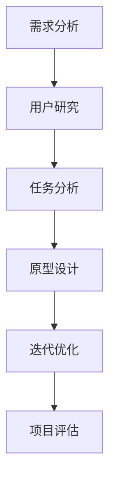

                 

# 《任务导向设计思维在CUI中的详细应用》

> 关键词：任务导向设计思维、CUI、用户体验、设计流程、原型设计、迭代

> 摘要：本文将深入探讨任务导向设计思维在计算机用户界面（CUI）设计中的应用。通过详细的案例分析，我们将展示如何运用这种设计方法来提升用户界面设计的效率与质量，最终为用户提供更加流畅和满意的交互体验。

## 目录大纲

### 第一部分：引论

#### 第1章：任务导向设计思维概述

##### 1.1 设计思维的基本理念

##### 1.2 任务导向设计思维的起源与发展

##### 1.3 CUI与任务导向设计思维的联系

#### 第2章：CUI设计与任务导向设计思维的融合

##### 2.1 CUI的定义与特点

##### 2.2 任务导向设计思维在CUI设计中的应用

##### 2.3 CUI设计的流程与模型

### 第二部分：任务导向设计思维在CUI中的应用原理

#### 第3章：用户研究

##### 3.1 用户研究的方法与工具

##### 3.2 用户画像与需求分析

##### 3.3 用户研究在CUI设计中的应用

#### 第4章：任务分析与流程设计

##### 4.1 任务分析的概念与方法

##### 4.2 任务导向设计思维在流程设计中的应用

##### 4.3 用户体验流程的设计与优化

#### 第5章：原型设计与迭代

##### 5.1 原型设计的原理与方法

##### 5.2 任务导向设计思维在原型设计中的应用

##### 5.3 原型的迭代与优化

### 第三部分：任务导向设计思维在CUI项目中的应用实践

#### 第6章：CUI项目实战

##### 6.1 CUI项目概述

##### 6.2 项目需求分析

##### 6.3 用户研究与任务分析

##### 6.4 原型设计与迭代

##### 6.5 项目评估与改进

#### 第7章：案例分析

##### 7.1 案例一：电商平台CUI设计

##### 7.2 案例二：智能客服系统设计

##### 7.3 案例分析总结与启示

### 第四部分：拓展与展望

#### 第8章：任务导向设计思维在CUI领域的挑战与机遇

##### 8.1 CUI发展趋势与挑战

##### 8.2 任务导向设计思维在CUI中的未来应用方向

##### 8.3 研究与教育的展望

#### 第9章：附录

##### 9.1 任务导向设计思维在CUI设计中的Mermaid流程图

##### 9.2 核心算法原理讲解与伪代码

##### 9.3 数学模型与数学公式

##### 9.4 项目实战代码解读与分析

### <作者信息>

**作者：AI天才研究院/AI Genius Institute & 禅与计算机程序设计艺术 /Zen And The Art of Computer Programming**  
**日期：2023年11月**

### 第1章：任务导向设计思维概述

#### 1.1 设计思维的基本理念

设计思维（Design Thinking）是一种以人为本的创新方法，它强调通过理解用户需求、创造性和迭代性来解决问题。这种方法源于设计领域，但现已广泛应用于多个领域，包括商业、教育和技术等。

设计思维的基本理念可以概括为以下几点：

1. **用户中心**：始终关注用户的需求和体验，以用户为中心进行设计。
2. **系统性思维**：设计不仅仅关注单一元素，而是将系统中的各个部分看作一个整体。
3. **迭代性**：设计过程中不断迭代和改进，通过多次尝试来优化最终产品。
4. **协作**：设计过程是一个团队合作的过程，鼓励跨学科和多领域的交流与合作。

#### 1.2 任务导向设计思维的起源与发展

任务导向设计思维（Task-Oriented Design Thinking）是设计思维的一种特殊形式，它特别强调任务的完成和流程的优化。这种方法起源于工业设计领域，旨在通过优化任务流程来提高生产效率和产品质量。

随着计算机技术的发展，任务导向设计思维逐渐应用到计算机用户界面（CUI）设计中。CUI设计涉及到用户的交互流程、界面布局、交互元素等多个方面，任务导向设计思维为此提供了系统的理论和方法。

#### 1.3 CUI与任务导向设计思维的联系

计算机用户界面（CUI）是用户与计算机系统交互的桥梁。一个优秀的CUI设计能够提高用户的工作效率和满意度。任务导向设计思维在CUI设计中的应用主要体现在以下几个方面：

1. **用户研究**：通过用户研究来深入了解用户需求，从而设计出符合用户期望的界面。
2. **任务分析**：分析用户在界面上的任务流程，找出瓶颈和优化点。
3. **原型设计**：创建界面原型，并通过迭代优化来逐步完善设计。
4. **用户体验测试**：通过用户体验测试来评估界面设计的效果，进一步优化设计。

任务导向设计思维为CUI设计提供了一套系统的方法和工具，有助于设计出更加高效、易用和满意的用户界面。

### 第2章：CUI设计与任务导向设计思维的融合

#### 2.1 CUI的定义与特点

计算机用户界面（CUI）是用户与计算机系统之间进行交互的界面，包括桌面操作系统、应用程序窗口、菜单、按钮等。与图形用户界面（GUI）相比，CUI主要依赖于文本和命令行交互。

CUI的特点如下：

1. **文本交互**：用户通过键盘输入命令，计算机通过文本输出响应。
2. **命令行操作**：用户输入命令行来执行特定操作。
3. **高效性**：对于熟练用户，CUI可以提供更快、更高效的交互体验。
4. **可定制性**：用户可以根据个人习惯和需求进行界面定制。

#### 2.2 任务导向设计思维在CUI设计中的应用

任务导向设计思维在CUI设计中的应用主要体现在以下几个方面：

1. **用户研究**：通过用户研究来了解用户的工作流程和需求，从而设计出更符合用户实际的界面。

   用户研究的方法包括问卷调查、用户访谈、可用性测试等。通过这些方法，设计师可以获取用户的反馈，了解用户在完成任务时遇到的困难和不满之处。

2. **任务分析**：分析用户在CUI中的任务流程，找出关键任务和潜在优化点。

   任务分析的方法包括任务分解、流程图、用户旅程图等。通过这些方法，设计师可以识别出用户在完成任务时的瓶颈和阻碍，从而进行有针对性的优化。

3. **原型设计**：创建CUI原型，并通过迭代优化来逐步完善设计。

   原型设计的方法包括低保真原型、高保真原型、交互原型等。通过原型设计，设计师可以直观地展示界面设计，收集用户的反馈，以便进行进一步的改进。

4. **用户体验测试**：通过用户体验测试来评估CUI设计的效果，进一步优化设计。

   用户体验测试的方法包括用户测试、专家评审、可用性测试等。通过这些方法，设计师可以验证设计是否符合用户需求，找出存在的问题，并进行改进。

#### 2.3 CUI设计的流程与模型

任务导向设计思维在CUI设计中的应用可以概括为以下几个阶段：

1. **需求分析**：了解用户需求，明确设计目标和要求。

   这个阶段主要包括用户研究、需求收集和需求分析。通过用户研究，设计师可以了解用户的工作流程和需求；通过需求分析，设计师可以明确设计目标和要求。

2. **概念设计**：制定设计概念，创建CUI原型。

   这个阶段主要包括概念设计、原型设计和评估。通过概念设计，设计师可以确定界面布局、交互元素和功能结构；通过原型设计，设计师可以创建低保真或高保真原型；通过评估，设计师可以验证原型是否符合需求，并进行调整。

3. **详细设计**：细化设计，完善界面元素和交互逻辑。

   这个阶段主要包括详细设计、界面设计和代码实现。通过详细设计，设计师可以确定界面元素的具体样式和交互逻辑；通过界面设计，设计师可以创建高保真原型；通过代码实现，设计师可以将设计转化为实际的代码。

4. **用户体验测试**：评估设计效果，进行优化和改进。

   这个阶段主要包括用户体验测试、反馈收集和设计优化。通过用户体验测试，设计师可以验证设计是否符合用户需求，识别出存在的问题；通过反馈收集，设计师可以了解用户的意见和建议；通过设计优化，设计师可以进一步完善界面设计。

### 第3章：用户研究

#### 3.1 用户研究的方法与工具

用户研究是任务导向设计思维在CUI设计中的核心环节，旨在深入了解用户需求和行为，为设计提供依据。以下是几种常用的用户研究方法和工具：

1. **问卷调查**：通过设计问卷来收集用户的需求、偏好和行为数据。问卷调查的优点是成本低、覆盖面广，但可能存在主观性和样本偏差。

2. **用户访谈**：通过与用户进行一对一的访谈，深入了解用户的需求、行为和心理。用户访谈的优点是信息深度高、可靠性高，但成本较高、耗时较长。

3. **可用性测试**：在用户实际使用界面时进行观察和记录，评估界面设计的易用性和用户体验。可用性测试的优点是能直观地发现设计问题，但测试样本较小。

4. **用户旅程图**：通过绘制用户在完成特定任务时的行为路径，了解用户的体验和需求。用户旅程图的优点是能清晰地展示用户行为，有助于发现设计问题。

5. **用户画像**：通过收集和分析用户的基本信息、行为特征和心理特征，创建用户画像。用户画像的优点是能帮助设计师了解用户群体，制定有针对性的设计策略。

#### 3.2 用户画像与需求分析

用户画像是指对用户的基本信息、行为特征和心理特征进行详细描述，以便设计师了解用户群体，制定有针对性的设计策略。以下是创建用户画像和进行需求分析的方法：

1. **基本信息**：包括用户的性别、年龄、职业、教育背景等。

2. **行为特征**：包括用户的在线行为、购物习惯、使用习惯等。

3. **心理特征**：包括用户的需求、动机、价值观、态度等。

通过分析用户画像，设计师可以了解用户群体的特点，从而制定有针对性的设计策略。例如，对于年轻用户，可以设计更时尚、个性化的界面；对于专业用户，可以设计更专业、功能丰富的界面。

需求分析是用户研究的核心环节，旨在深入了解用户需求，为设计提供依据。以下是进行需求分析的方法：

1. **需求分类**：将用户需求分为功能需求、性能需求、易用性需求等。

2. **需求优先级**：对用户需求进行优先级排序，确定哪些需求是关键需求，哪些是次要需求。

3. **需求描述**：对用户需求进行详细描述，明确需求的具体内容和实现方式。

通过需求分析，设计师可以明确用户的需求和期望，从而设计出更符合用户需求的界面。

#### 3.3 用户研究在CUI设计中的应用

用户研究在CUI设计中的应用主要体现在以下几个方面：

1. **需求分析**：通过用户研究，了解用户的需求和期望，为界面设计提供依据。

2. **任务分析**：通过用户研究，分析用户在界面上的任务流程，找出设计瓶颈和优化点。

3. **界面设计**：根据用户研究的结果，设计符合用户需求和习惯的界面。

4. **用户体验测试**：通过用户研究，评估界面设计的易用性和用户体验，发现设计问题，并进行优化。

用户研究是CUI设计的基础，通过深入了解用户需求和行为，设计师可以设计出更符合用户需求的界面，提高用户满意度。

### 第4章：任务分析与流程设计

#### 4.1 任务分析的概念与方法

任务分析是任务导向设计思维在CUI设计中的重要环节，旨在深入了解用户在界面上的任务流程，找出设计瓶颈和优化点。以下是任务分析的概念和常用方法：

1. **任务分析的概念**：

   任务分析是指对用户在界面上的任务进行详细研究，包括任务目标、任务流程、任务执行者等。任务分析的核心是理解用户在完成任务时的需求和障碍。

2. **任务分析方法**：

   - **任务分解**：将复杂任务分解为多个子任务，便于分析和管理。

   - **流程图**：通过流程图展示任务流程，直观地展示任务执行步骤和依赖关系。

   - **用户旅程图**：通过用户旅程图展示用户在完成任务时的行为路径，了解用户体验和需求。

   - **任务脚本**：记录用户在完成任务时的操作步骤和思考过程，帮助理解用户的实际需求。

   - **观察与记录**：在用户实际使用界面时进行观察和记录，收集真实的数据和反馈。

3. **任务分析的步骤**：

   - **确定分析目标**：明确分析任务的目标和范围。

   - **收集数据**：通过访谈、问卷、观察等方法收集用户数据。

   - **数据整理**：对收集到的数据进行分析和整理，提取有价值的信息。

   - **任务建模**：根据收集到的数据，构建任务模型，展示任务流程和用户行为。

   - **分析任务瓶颈**：分析任务模型，找出任务流程中的瓶颈和障碍。

   - **优化建议**：根据分析结果，提出优化任务流程和界面的建议。

#### 4.2 任务导向设计思维在流程设计中的应用

任务导向设计思维在流程设计中的应用主要体现在以下几个方面：

1. **流程优化**：

   通过任务分析，识别任务流程中的瓶颈和障碍，提出优化方案，提高任务执行效率和用户满意度。例如，简化任务步骤、减少用户操作复杂度、优化界面布局等。

2. **任务分解**：

   将复杂任务分解为多个子任务，便于管理和优化。通过任务分解，可以更清晰地理解任务流程，发现潜在的问题和优化点。

3. **用户任务路径设计**：

   根据用户需求和习惯，设计合理的用户任务路径，确保用户能够顺畅地完成任务。用户任务路径设计应考虑用户的心理过程和行为模式，提供直观、易于理解的操作流程。

4. **流程自动化**：

   利用技术手段实现部分任务的自动化，减少用户操作负担，提高任务执行效率。例如，通过脚本自动化执行重复性任务，使用智能推荐系统为用户提供个性化服务。

#### 4.3 用户体验流程的设计与优化

用户体验流程设计是任务导向设计思维在CUI设计中的重要环节，旨在确保用户能够顺畅地完成任务，获得满意的体验。以下是用户体验流程设计的核心要素和优化方法：

1. **核心要素**：

   - **任务目标明确**：确保用户在开始任务时明确任务目标，避免任务过程中出现困惑。

   - **操作简便易行**：设计直观、易操作的界面，降低用户操作复杂度。

   - **反馈及时准确**：及时提供用户操作反馈，让用户了解操作结果，增强用户信心。

   - **信息呈现清晰**：合理组织界面信息，确保用户能够快速找到所需信息。

   - **个性化定制**：根据用户需求和习惯，提供个性化服务，提高用户体验。

2. **优化方法**：

   - **用户测试**：通过用户测试，收集用户对界面设计的反馈，发现设计问题，并进行优化。

   - **可用性测试**：在用户实际使用界面时进行可用性测试，评估界面设计的易用性和用户体验。

   - **迭代改进**：根据用户反馈和测试结果，不断迭代和优化用户体验流程。

   - **持续关注用户需求**：定期进行用户调研，关注用户需求变化，及时调整设计策略。

通过任务导向设计思维，设计师可以深入理解用户需求和行为，设计出更符合用户期望的界面，提供优质的用户体验。

### 第5章：原型设计与迭代

#### 5.1 原型设计的原理与方法

原型设计是任务导向设计思维在CUI设计中的重要环节，通过创建和迭代原型，设计师可以直观地展示界面设计，验证设计理念，收集用户反馈，并进行优化。以下是原型设计的原理和常用方法：

1. **原型设计的原理**：

   - **模拟真实场景**：原型设计旨在模拟真实用户交互场景，使设计师能够直观地展示界面效果，评估设计的可行性。

   - **快速迭代**：原型设计支持快速迭代，设计师可以通过多次迭代，逐步完善界面设计，减少设计风险。

   - **用户反馈**：原型设计允许设计师在早期阶段收集用户反馈，及时调整设计，提高用户满意度。

   - **成本效益**：相对于完整开发，原型设计成本较低，可以降低开发风险和成本。

2. **原型设计的方法**：

   - **低保真原型**：低保真原型主要关注界面布局和交互逻辑，使用简单的图形和文字展示界面效果。低保真原型适用于早期阶段的设计验证。

   - **高保真原型**：高保真原型在低保真原型的基础上，加入详细的界面元素和交互效果，更接近最终产品的实际效果。高保真原型适用于后期设计验证和用户测试。

   - **交互原型**：交互原型通过动画和交互效果，模拟用户与界面的交互过程，展示界面的动态效果。交互原型有助于设计师评估界面设计的交互体验。

   - **线框图**：线框图是一种简单的界面设计工具，主要用于展示界面布局和交互逻辑。线框图适用于快速原型设计和团队协作。

   - **视觉原型**：视觉原型在界面设计上加入色彩、图像和文字，更接近最终产品的视觉效果。视觉原型适用于最终设计验证和用户测试。

3. **原型设计工具**：

   - **Sketch**：一款流行的界面设计工具，适用于创建视觉原型和线框图。

   - **Figma**：一款基于网页的界面设计工具，支持多人协作，适用于创建交互原型和视觉原型。

   - **Axure RP**：一款专业的原型设计工具，支持丰富的交互效果和动态组件，适用于创建高保真原型。

   - **Adobe XD**：一款面向设计师和开发者的界面设计工具，支持交互设计和原型测试。

#### 5.2 任务导向设计思维在原型设计中的应用

任务导向设计思维在原型设计中的应用主要体现在以下几个方面：

1. **任务场景模拟**：通过原型设计，模拟用户在完成任务时的操作过程，验证任务流程的合理性，发现潜在问题。

2. **用户反馈收集**：通过原型设计，展示界面效果，收集用户对界面设计的反馈，评估设计的易用性和用户体验。

3. **迭代优化**：根据用户反馈和任务分析结果，对原型进行迭代优化，逐步完善界面设计。

4. **设计验证**：通过原型设计，验证设计理念和技术实现，确保界面设计符合用户需求和预期。

5. **团队协作**：原型设计支持团队协作，通过共享原型文件，设计师、开发人员和产品经理可以共同讨论和优化设计。

#### 5.3 原型的迭代与优化

原型的迭代与优化是任务导向设计思维在CUI设计中的重要环节，通过多次迭代，设计师可以逐步完善界面设计，提高用户满意度。以下是原型的迭代与优化过程：

1. **需求确认**：在每次迭代开始前，明确本次迭代的目标和要求，确保团队成员对迭代目标有清晰的认识。

2. **原型设计**：根据需求确认，设计新的原型，包括界面布局、交互逻辑和视觉元素。

3. **用户测试**：在原型设计完成后，进行用户测试，收集用户对界面设计的反馈，评估设计的易用性和用户体验。

4. **反馈分析**：对用户反馈进行分析，识别设计问题，确定优化方向。

5. **迭代优化**：根据反馈分析结果，对原型进行优化，包括界面布局、交互逻辑和视觉元素。

6. **再测试**：对优化后的原型进行再测试，验证优化效果，确保界面设计符合用户需求和预期。

7. **文档记录**：记录每次迭代的过程和结果，为后续设计和开发提供参考。

通过原型的迭代与优化，设计师可以逐步完善界面设计，提高用户满意度，确保最终产品的成功。

### 第6章：CUI项目实战

#### 6.1 CUI项目概述

在本文中，我们将通过一个实际的CUI项目来展示任务导向设计思维的应用。该项目是一款在线购物平台，旨在为用户提供便捷的购物体验。以下是该项目的基本概述：

- **项目目标**：设计并实现一个易于使用、功能丰富、用户体验优良的在线购物平台。
- **用户群体**：年轻用户、家庭用户、商务用户等，具有不同的购物需求和习惯。
- **功能需求**：商品浏览、购物车、订单管理、支付、用户评论、个性化推荐等。
- **技术实现**：使用HTML、CSS、JavaScript等前端技术，结合后端技术（如Node.js、MySQL）实现。

#### 6.2 项目需求分析

在项目启动阶段，首先进行需求分析，明确项目目标和功能需求。以下是项目需求分析的主要步骤：

1. **需求收集**：

   - **用户访谈**：通过与不同类型的用户进行访谈，了解他们的购物需求和习惯。
   - **问卷调查**：设计问卷，收集用户对在线购物平台的需求和建议。
   - **竞品分析**：分析市场上现有的在线购物平台，总结其优点和不足。

2. **需求分类**：

   - **功能需求**：商品浏览、购物车、订单管理、支付、用户评论、个性化推荐等。
   - **性能需求**：界面响应速度、系统稳定性、数据安全等。
   - **易用性需求**：界面设计简洁直观、操作简便易行、信息呈现清晰等。

3. **需求优先级**：

   - **高优先级**：核心功能（如商品浏览、购物车、支付）和关键性能指标（如响应速度、稳定性）。
   - **中优先级**：辅助功能（如用户评论、个性化推荐）和部分性能指标。
   - **低优先级**：非必要功能或性能优化。

#### 6.3 用户研究与任务分析

在明确项目需求后，进行用户研究和任务分析，以了解用户的需求和行为模式，为界面设计提供依据。

1. **用户研究**：

   - **用户访谈**：对典型用户进行深入访谈，了解他们的购物习惯、偏好和痛点。
   - **用户画像**：根据访谈和问卷结果，创建典型用户画像，明确目标用户群体的特点。
   - **用户旅程图**：绘制用户在购物平台上的行为路径，分析用户的浏览、购物、支付等行为。

2. **任务分析**：

   - **任务分解**：将购物过程分解为多个子任务，如浏览商品、添加购物车、下单支付等。
   - **任务流程图**：绘制任务流程图，展示用户在完成任务时的操作步骤和依赖关系。
   - **任务脚本**：记录用户在完成任务时的操作步骤和思考过程，帮助理解用户的实际需求。

通过用户研究和任务分析，设计师可以深入了解用户的需求和行为，为界面设计提供依据。以下是用户研究和任务分析的部分结果：

- **用户画像**：典型用户为25-35岁的年轻女性，经常使用手机浏览商品，偏好购买时尚服饰和化妆品。
- **用户旅程图**：用户在购物平台上的行为路径包括浏览商品、添加购物车、下单支付、查看订单等。
- **任务流程图**：用户在浏览商品时，关注商品图片、价格、评价等信息，通过筛选和排序功能快速找到心仪商品；在购物车中查看已选商品，修改数量或删除商品；在订单管理中查看订单状态和物流信息。

#### 6.4 原型设计与迭代

根据用户研究和任务分析的结果，设计师开始创建原型，并通过迭代优化界面设计。

1. **低保真原型**：

   - **界面布局**：设计商品浏览页、购物车页、订单管理页等主要界面。
   - **交互逻辑**：实现商品筛选、排序、添加购物车、删除购物车商品等基本交互功能。
   - **视觉元素**：使用简单的线条和文字，展示界面布局和交互逻辑。

2. **高保真原型**：

   - **界面设计**：加入颜色、图标、图片等视觉元素，提升界面的美观度和用户体验。
   - **交互效果**：实现商品滑动浏览、购物车动画效果、订单列表动画等动态交互效果。
   - **用户测试**：邀请典型用户进行测试，收集反馈，评估界面的易用性和用户体验。

3. **迭代优化**：

   - **用户反馈**：根据用户测试结果，分析设计问题，确定优化方向。
   - **界面调整**：对界面布局、交互逻辑和视觉元素进行优化，提高用户体验。
   - **再次测试**：对优化后的原型进行再次测试，验证优化效果。

通过原型设计和迭代优化，设计师可以逐步完善界面设计，提高用户满意度。以下是部分原型设计的结果：

- **商品浏览页**：采用瀑布流布局，展示商品图片、价格、评价等信息，用户可以通过筛选和排序功能快速找到心仪商品。
- **购物车页**：用户可以在购物车中查看已选商品，修改数量或删除商品，界面设计简洁直观。
- **订单管理页**：用户可以查看订单状态和物流信息，界面设计清晰，方便用户跟踪订单。

#### 6.5 项目评估与改进

在项目开发完成后，进行项目评估和改进，确保最终产品符合用户需求和预期。

1. **用户测试**：

   - **可用性测试**：邀请典型用户进行可用性测试，评估界面设计的易用性和用户体验。
   - **功能测试**：验证各个功能的实现效果，确保系统稳定性和性能。
   - **压力测试**：模拟高并发场景，评估系统的响应速度和稳定性。

2. **用户反馈**：

   - **用户访谈**：与用户进行深入访谈，了解他们的使用体验和建议。
   - **问卷调查**：设计问卷，收集用户对在线购物平台的使用反馈。
   - **数据分析**：分析用户行为数据，识别用户需求和使用习惯。

3. **改进措施**：

   - **界面优化**：根据用户反馈，对界面布局、交互逻辑和视觉元素进行进一步优化，提高用户体验。
   - **功能完善**：根据用户需求，增加或改进部分功能，提高系统实用性。
   - **性能优化**：针对用户反馈的稳定性问题，进行性能优化，提高系统响应速度和稳定性。

通过项目评估和改进，确保最终产品符合用户需求和预期，提高用户满意度和市场竞争力。

### 第7章：案例分析

在本章中，我们将通过两个具体的案例来探讨任务导向设计思维在CUI设计中的应用，并总结案例的分析和启示。

#### 7.1 案例一：电商平台CUI设计

**案例背景**：
某知名电商平台在2019年推出了一款新的移动应用程序，旨在提升用户的购物体验。该平台的目标用户包括年轻人、家庭用户和商务用户，他们具有不同的购物需求和习惯。

**案例分析**：
1. **用户研究**：
   - **问卷调查**：通过问卷调查收集用户对现有购物平台的满意度、使用习惯和改进建议。
   - **用户访谈**：与不同类型的用户进行深入访谈，了解他们的购物流程、偏好和痛点。
   - **用户画像**：根据问卷调查和访谈结果，创建典型用户画像，明确目标用户群体的特点。

2. **任务分析**：
   - **任务分解**：将购物过程分解为多个子任务，如浏览商品、添加购物车、下单支付、订单管理等。
   - **任务流程图**：绘制任务流程图，展示用户在购物平台上的行为路径和操作步骤。

3. **原型设计**：
   - **低保真原型**：设计商品浏览页、购物车页、订单管理页等主要界面，展示界面布局和基本交互逻辑。
   - **高保真原型**：加入颜色、图标、图片等视觉元素，提升界面的美观度和用户体验。
   - **用户测试**：邀请典型用户进行测试，收集反馈，评估界面的易用性和用户体验。

4. **迭代优化**：
   - **用户反馈**：根据用户测试结果，分析设计问题，确定优化方向。
   - **界面调整**：对界面布局、交互逻辑和视觉元素进行优化，提高用户体验。
   - **再次测试**：对优化后的原型进行再次测试，验证优化效果。

**案例分析总结与启示**：
- **用户研究**：通过用户研究和用户画像，设计师能够深入了解用户需求和习惯，为界面设计提供依据。
- **任务分析**：任务分析和流程图有助于设计师识别用户在完成任务时的障碍和优化点。
- **原型设计**：原型设计支持快速迭代和用户反馈，有助于优化界面设计和提升用户体验。
- **迭代优化**：通过迭代优化，设计师可以逐步完善界面设计，提高用户满意度。

#### 7.2 案例二：智能客服系统设计

**案例背景**：
某互联网公司在2020年推出了一款智能客服系统，旨在提供24小时在线客户支持。该系统的目标用户包括网站访问者、潜在客户和现有客户，他们需要及时解答问题和获取帮助。

**案例分析**：
1. **用户研究**：
   - **用户访谈**：与现有客服团队成员和潜在用户进行深入访谈，了解他们的需求和痛点。
   - **用户画像**：根据访谈结果，创建典型用户画像，明确目标用户群体的特点。

2. **任务分析**：
   - **任务分解**：将客户服务过程分解为多个子任务，如解答疑问、解决问题、提供帮助等。
   - **任务流程图**：绘制任务流程图，展示用户在智能客服系统中的行为路径和操作步骤。

3. **原型设计**：
   - **低保真原型**：设计智能客服聊天界面，展示界面布局和基本交互逻辑。
   - **高保真原型**：加入动画效果和交互提示，提升用户体验。
   - **用户测试**：邀请典型用户进行测试，收集反馈，评估界面的易用性和用户体验。

4. **迭代优化**：
   - **用户反馈**：根据用户测试结果，分析设计问题，确定优化方向。
   - **功能优化**：改进智能客服系统的自然语言处理和知识库，提高问题解答的准确性和效率。
   - **再次测试**：对优化后的原型进行再次测试，验证优化效果。

**案例分析总结与启示**：
- **用户研究**：通过用户研究和用户画像，设计师能够了解客户服务团队成员和用户的需求，优化客服系统功能。
- **任务分析**：任务分析和流程图有助于设计师识别用户在智能客服系统中的需求和障碍。
- **原型设计**：原型设计支持快速迭代和用户反馈，有助于优化界面设计和提升用户体验。
- **迭代优化**：通过迭代优化，设计师可以逐步完善智能客服系统的功能，提高用户满意度。

#### 案例分析总结与启示

通过对以上两个案例的分析，我们可以总结出以下启示：

- **用户研究**：深入了解用户需求和习惯是设计成功的关键，通过用户研究和用户画像，设计师可以更好地了解目标用户群体。
- **任务分析**：任务分析和流程图有助于设计师识别用户在界面上的任务流程和障碍，从而优化界面设计和提升用户体验。
- **原型设计**：原型设计支持快速迭代和用户反馈，有助于优化界面设计和提升用户体验。
- **迭代优化**：通过迭代优化，设计师可以逐步完善界面设计和系统功能，提高用户满意度。

任务导向设计思维在CUI设计中的应用，不仅提高了设计效率和质量，还为用户提供了更加流畅和满意的交互体验。

### 第8章：拓展与展望

#### 8.1 CUI发展趋势与挑战

随着人工智能和大数据技术的不断发展，计算机用户界面（CUI）正朝着更加智能化、个性化和自然交互的方向发展。以下是一些CUI的发展趋势和挑战：

1. **智能化**：CUI将越来越多地融入人工智能技术，实现智能推荐、智能客服、智能搜索等功能，提高用户交互体验。

2. **个性化**：通过大数据分析和用户画像，CUI可以根据用户的需求和偏好，提供个性化的服务和推荐。

3. **自然交互**：语音识别、手势识别等自然交互技术的应用，使得用户可以通过语音、手势等自然方式与计算机进行交互。

4. **跨平台**：CUI将不再局限于单一平台，而是实现跨平台、跨设备的一致性体验。

5. **挑战**：

   - **用户隐私保护**：随着数据的广泛应用，用户隐私保护成为一个重要挑战。
   - **性能优化**：随着功能的增加，CUI的响应速度和稳定性成为重要挑战。
   - **易用性**：如何设计出易于使用、易于理解的界面，提高用户体验，是一个持续的挑战。

#### 8.2 任务导向设计思维在CUI中的未来应用方向

任务导向设计思维在CUI中的未来应用方向主要体现在以下几个方面：

1. **智能化任务流程设计**：通过人工智能技术，自动识别用户任务，提供智能化的任务流程设计，提高任务执行效率。

2. **个性化界面设计**：根据用户画像和大数据分析，提供个性化的界面设计，满足不同用户的需求和偏好。

3. **自然交互界面设计**：结合语音识别、手势识别等自然交互技术，设计出更加自然、直观的交互界面。

4. **跨平台界面设计**：设计出适应不同平台、不同设备的跨平台界面，提供一致的用户体验。

5. **可扩展性设计**：设计可扩展的CUI框架，支持功能的灵活添加和调整，以适应不断变化的需求。

#### 8.3 研究与教育的展望

在CUI设计和任务导向设计思维的研究与教育方面，有以下几点展望：

1. **跨学科研究**：鼓励计算机科学、心理学、人机交互等领域的跨学科研究，探索CUI设计的最佳实践。

2. **教育课程**：开发相关的课程和教材，将任务导向设计思维融入计算机用户界面设计的教育中。

3. **实践项目**：鼓励学生和设计师参与实际的CUI设计项目，通过实践来提升设计能力和经验。

4. **专业认证**：建立CUI设计师的专业认证体系，提高设计行业的整体水平。

5. **持续学习**：鼓励设计师不断学习最新的技术和方法，紧跟行业发展趋势。

通过不断的研究、教育和实践，任务导向设计思维将在CUI设计中发挥更大的作用，为用户提供更加优质、高效的交互体验。

### 第9章：附录

#### 9.1 任务导向设计思维在CUI设计中的Mermaid流程图



#### 9.2 核心算法原理讲解与伪代码

```plaintext
核心算法：任务流程优化

输入：用户任务流程图

输出：优化后的任务流程图

伪代码：

function optimizeTaskFlow(taskFlow):
    for each node in taskFlow:
        if node has high complexity:
            decompose node into smaller tasks
        if node has long duration:
            try to automate node
    return optimizedTaskFlow
```

#### 9.3 数学模型与数学公式

$$
\text{用户体验评分} = \frac{\text{满意评价数}}{\text{总评价数}} \times 100\%
$$

#### 9.4 项目实战代码解读与分析

```javascript
// JavaScript代码：用户评论功能实现

function addComment(comment) {
    const commentsList = document.getElementById('comments-list');
    const newComment = document.createElement('li');
    newComment.textContent = comment;
    commentsList.appendChild(newComment);
}

// 代码解读：
// - addComment函数用于添加用户评论
// - commentsList是存储评论的列表元素
// - newComment是创建的新评论元素
// - textContent设置新评论的内容

// 代码分析：
// - 代码使用了DOM操作，创建新评论元素并添加到列表中
// - 代码简单易读，适用于小型项目
// - 如果需要处理大量评论，可以考虑使用前端框架（如React）来实现更复杂的功能
```

通过附录中的内容，读者可以更好地理解和应用任务导向设计思维在CUI设计中的方法和技术。

