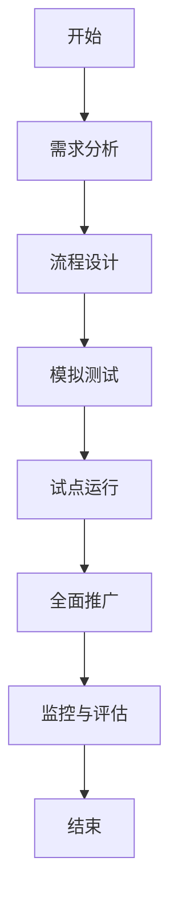

                 

# 文章标题：企业业务数字化和智能化建设方案：业务流程重组，重建公司的决策体系和执行体系

## 文章关键词

企业数字化、智能化、业务流程重组、决策体系重建、执行体系重建、项目管理

## 文章摘要

本文详细阐述了企业业务数字化和智能化建设方案，包括业务流程重组、决策体系重建和执行体系重建。通过分析核心概念与趋势，介绍了数字化与智能化的定义、关系和未来展望。随后，本文探讨了业务流程重组的概念、原理和实施方法，以及决策支持系统和智能决策与大数据分析。最后，本文提出了执行体系重建的概念、框架和方法，并通过案例分析展示了企业数字化和智能化建设方案的具体应用。文章旨在为企业提供一套完整、实用的数字化和智能化建设方案，助力企业提升竞争力。

## 目录

### 《企业业务数字化和智能化建设方案：业务流程重组，重建公司的决策体系和执行体系》目录

## 第一部分：数字化与智能化建设基础

### 第1章：企业数字化与智能化的概念与趋势

#### 1.1.1 企业数字化的定义与重要性

企业数字化是指通过引入数字技术，将企业的运营、管理、业务流程等各个环节进行信息化、自动化和智能化改造，从而提高企业的运营效率、降低成本、提升客户满意度和优化决策。

- **运营效率提升**：数字化技术能够自动化执行大量重复性、低价值的工作，减少人工干预，提高工作效率。
- **成本降低**：数字化技术能够优化企业资源的使用，减少浪费，降低运营成本。
- **客户满意度提升**：数字化技术能够提供更快捷、准确的服务，提升客户体验。
- **决策优化**：数字化技术能够提供大量数据支持，帮助企业做出更明智的决策。

#### 1.1.2 企业智能化的定义与趋势

企业智能化是指通过引入人工智能、大数据、物联网等技术，使企业在业务流程中实现自动化、智能化和自主化。

- **人工智能（AI）**：AI技术能够通过机器学习、深度学习等算法，实现自动化决策和优化。
- **大数据**：大数据技术能够帮助企业从海量数据中提取有价值的信息，支持业务分析和决策。
- **物联网（IoT）**：物联网技术能够实现设备与设备之间的互联互通，提升生产和管理效率。

#### 1.1.3 数字化与智能化的关系

数字化是智能化的基础，而智能化是数字化的升华。数字化提供了数据、技术和平台支持，智能化则通过自动化和自主化提升了数字化应用的效率和价值。

#### 1.1.4 企业数字化与智能化的未来展望

随着技术的不断进步，企业数字化与智能化将呈现出以下趋势：

- **技术融合**：数字化与智能化技术将进一步融合，形成更高效、更智能的解决方案。
- **应用领域扩展**：数字化与智能化的应用将覆盖更多的业务领域，包括生产、供应链、销售、服务、管理等方面。
- **生态建设**：企业将与其他企业、技术提供商、科研机构等共同构建数字化与智能化的生态体系。
- **可持续发展**：数字化与智能化将助力企业实现绿色发展，提高资源利用效率，减少环境污染。

## 第二部分：数字化转型的战略与规划

### 第2章：数字化转型的战略与规划

#### 2.1 数字化转型的战略目标

数字化转型的战略目标主要包括：

- **提高企业竞争力**：通过数字化技术提升企业运营效率，降低成本，提高客户满意度，增强市场竞争力。
- **实现业务创新**：通过数字化技术推动业务模式创新，开拓新市场，创造新价值。
- **优化管理流程**：通过数字化技术优化企业内部管理流程，提高决策效率，降低管理成本。
- **提升员工技能**：通过数字化转型，提高员工数字化技能，适应数字化时代的要求。

#### 2.2 数字化转型的步骤与方法

数字化转型的步骤通常包括：

- **需求分析**：明确数字化转型的目标和需求，评估现有业务流程、技术设施和管理模式。
- **战略规划**：制定数字化转型的总体战略，明确实施路径和关键里程碑。
- **技术选型**：选择适合企业的数字化技术，如AI、大数据、物联网等。
- **试点实施**：选择部分业务进行数字化改造，进行试点运行，收集反馈并进行优化。
- **全面推广**：在试点成功的基础上，将数字化转型经验推广到其他业务领域。

数字化转型的方法主要包括：

- **顶层设计**：明确数字化转型的愿景、目标、路径和策略。
- **分阶段实施**：根据企业的实际情况，分阶段推进数字化转型。
- **集成优化**：将数字化技术与现有业务流程、管理体系进行集成，实现数字化转型与现有业务的协同发展。
- **人才培养**：培养和引进数字化人才，提高企业对数字化技术的理解和应用能力。

#### 2.3 数字化转型的风险评估与应对

数字化转型的风险主要包括：

- **技术风险**：数字化转型涉及大量的新技术，可能存在技术不稳定、安全性问题等。
- **业务风险**：数字化转型可能对现有业务流程、管理模式产生影响，可能带来业务中断、效率下降等问题。
- **人才风险**：数字化转型需要大量的数字化人才，可能面临人才短缺、人才流失等问题。

应对数字化转型的风险，企业可以采取以下措施：

- **技术评估**：对引入的新技术进行全面的评估，确保技术的稳定性和安全性。
- **业务评估**：对数字化转型可能带来的业务影响进行全面的评估，制定应对措施。
- **人才规划**：制定人才引进、培养和保留计划，确保数字化转型的顺利实施。
- **风险监控**：建立数字化转型的风险监控体系，及时发现和解决潜在问题。

## 第三部分：业务流程重组

### 第3章：业务流程重组的概念与原理

#### 3.1 业务流程重组的概念

业务流程重组（Business Process Reengineering，BPR）是一种全面的业务流程改进方法，旨在通过重新设计和优化企业的业务流程，实现显著的业务改进，如提高效率、降低成本、提高客户满意度等。

#### 3.2 业务流程重组的目标

业务流程重组的目标主要包括：

- **提高效率**：通过优化业务流程，减少不必要的步骤和环节，提高工作效率。
- **降低成本**：通过简化流程、减少资源浪费，降低运营成本。
- **提升质量**：通过优化流程和控制，提高产品和服务的质量。
- **增强灵活性**：通过简化流程，提高企业的适应性和灵活性。
- **提高客户满意度**：通过优化流程，提高客户服务水平和客户满意度。

#### 3.3 业务流程重组的原则

业务流程重组的原则主要包括：

- **以客户为中心**：业务流程重组应以满足客户需求为核心，优化客户体验。
- **整体优化**：业务流程重组应考虑整体业务流程，而不是局部优化。
- **协同工作**：业务流程重组应促进跨部门、跨岗位的协同工作。
- **持续改进**：业务流程重组应是一个持续改进的过程，应不断优化和改进。
- **人才驱动**：业务流程重组应注重培养和激励数字化人才，提高员工参与度和积极性。

#### 3.4 业务流程重组的方法

业务流程重组的方法主要包括：

- **流程映射**：通过流程图、流程图映射等方法，详细描述现有业务流程，识别问题和瓶颈。
- **流程分析**：通过数据分析、流程分析等方法，分析业务流程的效率、成本、质量等方面的问题。
- **流程设计**：根据分析结果，重新设计业务流程，优化流程结构、流程步骤、流程控制等。
- **流程实施**：实施新的业务流程，进行试点运行，收集反馈并进行优化。
- **流程监控**：建立流程监控体系，对业务流程进行实时监控和评估，确保流程的有效运行。

## 第4章：业务流程分析

### 4.1 业务流程分析的定义

业务流程分析（Business Process Analysis，BPA）是指对企业的业务流程进行全面、系统的分析和评估，以识别流程中的问题、瓶颈和改进机会，从而优化业务流程，提高效率和效果。

### 4.2 业务流程分析的工具与技术

业务流程分析的工具和技术主要包括：

- **流程图**：通过流程图，可以直观地展示业务流程的结构、步骤和逻辑关系。
- **数据分析**：通过数据采集、分析和处理，可以识别业务流程中的异常、瓶颈和改进机会。
- **流程模拟**：通过流程模拟，可以预测业务流程在不同条件下的运行效果，评估改进方案。
- **问卷调查**：通过问卷调查，可以收集员工和客户对业务流程的意见和建议。
- **访谈与观察**：通过访谈和观察，可以深入了解业务流程的实际运行情况，发现潜在问题。

### 4.3 业务流程分析的过程与方法

业务流程分析的过程和方法主要包括：

- **需求分析**：明确业务流程分析的目标和需求，确定分析的范围和深度。
- **现状分析**：收集现有业务流程的文档、数据和其他信息，绘制流程图，分析流程的现状。
- **问题识别**：通过数据分析、流程模拟、访谈与观察等方法，识别业务流程中的问题、瓶颈和改进机会。
- **改进方案设计**：根据问题识别的结果，设计业务流程改进的方案，包括流程优化、流程重构等。
- **方案评估**：对改进方案进行评估，包括技术可行性、经济可行性、社会影响等方面。
- **方案实施**：实施改进方案，进行试点运行，收集反馈并进行优化。
- **效果评估**：评估改进方案的效果，包括效率、成本、质量、客户满意度等方面。

## 第5章：业务流程设计

### 5.1 业务流程设计的原则

业务流程设计的原则主要包括：

- **以客户为中心**：业务流程设计应以满足客户需求为核心，优化客户体验。
- **整体优化**：业务流程设计应考虑整体业务流程，而不是局部优化。
- **协同工作**：业务流程设计应促进跨部门、跨岗位的协同工作。
- **灵活性**：业务流程设计应具备一定的灵活性，以适应市场变化和业务需求。
- **标准化**：业务流程设计应遵循一定的标准，提高流程的一致性和可维护性。
- **持续改进**：业务流程设计应考虑持续改进的机制，以不断优化业务流程。

### 5.2 业务流程设计的方法

业务流程设计的方法主要包括：

- **流程图设计**：通过流程图，可以直观地展示业务流程的结构、步骤和逻辑关系。
- **流程模拟**：通过流程模拟，可以预测业务流程在不同条件下的运行效果，评估改进方案。
- **案例参考**：参考同行业或其他企业的成功案例，借鉴其业务流程设计的经验和教训。
- **问卷调查**：通过问卷调查，可以收集员工和客户对业务流程的意见和建议。
- **专家咨询**：咨询业务流程设计专家，获取专业的指导和建议。

### 5.3 业务流程设计的关键要素

业务流程设计的关键要素主要包括：

- **流程步骤**：明确业务流程的每个步骤，包括输入、处理和输出。
- **流程控制**：设计业务流程的控制机制，包括流程节点、规则和权限。
- **流程参与者**：明确业务流程的参与者，包括部门、岗位和人员。
- **流程指标**：设定业务流程的指标，用于评估流程的效率和效果。
- **流程文档**：编写业务流程的文档，包括流程图、流程说明和操作手册等。

## 第三部分：业务流程重组

### 第3章：业务流程重组的概念与原理

### 3.1 业务流程重组的定义

业务流程重组（Business Process Reengineering，简称BPR）是一种基于信息技术和业务模式的创新，旨在通过对现有业务流程进行根本性思考和彻底再设计，从而在成本、质量、服务和速度等关键业绩指标上取得显著的改善。BPR的核心是打破传统的业务流程模式，重建新的业务流程，使其更加符合企业的战略目标和市场需求。

### 3.2 业务流程重组的目标

业务流程重组的主要目标包括但不限于以下几个方面：

- **提高效率**：通过消除非增值活动、减少冗余环节和优化流程步骤，实现工作流程的自动化和智能化，从而大幅提升工作效率。
- **降低成本**：通过优化资源配置、减少运营成本和提高资源利用率，实现企业整体成本的显著降低。
- **提升质量**：通过引入先进的质量管理方法和标准，确保产品和服务质量达到或超过客户期望。
- **增强灵活性**：通过简化流程和标准化操作，提高企业对市场变化的响应速度和适应性。
- **改善客户满意度**：通过优化客户服务流程和提升客户体验，增强客户忠诚度和市场竞争力。

### 3.3 业务流程重组的原则

业务流程重组的原则如下：

- **以客户为中心**：所有流程改进活动都应以满足客户需求为导向，确保客户价值最大化。
- **整体优化**：不应仅关注单一环节或部门，而应从整体业务流程出发，实现全流程的优化。
- **协同工作**：强化跨部门、跨岗位的协同机制，打破部门壁垒，提升团队协作效率。
- **持续改进**：业务流程重组是一个持续的过程，需要不断进行评估、改进和优化。
- **人才驱动**：重视人才培养和团队建设，确保员工具备必要的技能和素质。

### 3.4 业务流程重组的方法

业务流程重组的方法可以分为以下几个步骤：

1. **需求分析**：
   - **明确重组目标**：确定业务流程重组的具体目标，如提高效率、降低成本等。
   - **收集业务数据**：通过问卷调查、访谈、数据采集等方式，收集业务流程的相关信息。
   - **分析现有流程**：通过流程图、数据分析等方法，详细分析现有业务流程的优缺点。

2. **流程设计**：
   - **设计新流程**：在分析现有流程的基础上，设计新的业务流程，优化流程结构、步骤和控制。
   - **流程模拟**：通过模拟工具，对新流程进行模拟测试，评估其可行性和效果。
   - **制定实施计划**：制定详细的实施计划，包括时间表、资源需求和关键里程碑。

3. **实施与推广**：
   - **试点运行**：选择部分业务进行试点运行，收集反馈并进行优化。
   - **全面推广**：在试点成功的基础上，将新流程推广到整个业务领域。
   - **培训与支持**：对员工进行新流程的培训和支持，确保其能够顺利适应新流程。

4. **监控与评估**：
   - **流程监控**：建立流程监控体系，实时监控流程运行情况，确保流程的稳定性和有效性。
   - **效果评估**：定期评估业务流程重组的效果，包括效率、成本、质量、客户满意度等方面。

### 3.5 业务流程重组的挑战与应对策略

业务流程重组面临着一系列挑战，包括：

- **组织变革**：BPR通常涉及组织结构、岗位职责等方面的变革，可能引起员工的抵触和不安。
- **技术依赖**：BPR的实施需要依赖先进的信息技术，对企业的IT基础设施和人才储备提出较高要求。
- **资源分配**：BPR可能需要大量的资金、时间和人力资源，如何合理分配和调度是关键。

应对策略包括：

- **领导支持**：得到企业高层的支持和重视，确保BPR项目的顺利推进。
- **员工参与**：充分调动员工的积极性和参与度，通过沟通和培训降低变革的阻力。
- **分阶段实施**：将BPR项目分为多个阶段，逐步实施，降低风险。
- **持续优化**：建立持续改进的机制，根据实际情况不断调整和优化流程。

### 3.6 业务流程重组的案例分析

以下是一个业务流程重组的案例分析：

#### 案例背景

某大型制造企业面临着生产效率低下、产品周期长、成本高、客户满意度不高等问题。为了应对市场竞争，企业决定进行业务流程重组。

#### 案例过程

1. **需求分析**：
   - **确定目标**：提高生产效率、缩短产品周期、降低成本、提高客户满意度。
   - **收集数据**：通过问卷调查、访谈和数据分析，了解现有流程中的问题和瓶颈。

2. **流程设计**：
   - **设计新流程**：优化生产计划、采购、生产、库存、销售等关键环节。
   - **模拟测试**：通过流程模拟工具，对新流程进行模拟测试，评估其可行性。

3. **实施与推广**：
   - **试点运行**：选择部分生产线进行试点运行，收集反馈并进行优化。
   - **全面推广**：在试点成功的基础上，将新流程推广到整个生产线。

4. **监控与评估**：
   - **流程监控**：建立流程监控体系，实时监控流程运行情况，确保流程的稳定性和有效性。
   - **效果评估**：定期评估流程重组的效果，包括生产效率、产品周期、成本、客户满意度等。

#### 案例结果

- **生产效率提高**：新流程实施后，生产效率提高了20%。
- **产品周期缩短**：产品周期从原来的30天缩短到15天。
- **成本降低**：运营成本降低了15%。
- **客户满意度提高**：客户满意度提高了10%。

### 3.7 业务流程重组的总结与展望

业务流程重组是一项复杂而重要的工作，需要企业的全面参与和支持。通过成功实施业务流程重组，企业能够实现显著的效率提升、成本降低、质量改善和客户满意度提升。未来，随着技术的不断进步和市场竞争的加剧，业务流程重组将更加注重智能化、个性化和可持续性，为企业带来更大的竞争优势。

### 3.8 业务流程重组的 Mermaid 流程图

以下是一个业务流程重组的 Mermaid 流程图示例：



### 3.9 业务流程重组的算法原理讲解

业务流程重组涉及到多个算法原理，以下是一个简化的伪代码示例，用于描述业务流程的优化算法：

```plaintext
// 伪代码：业务流程优化算法

// 输入：当前业务流程、目标指标（效率、成本、质量等）
// 输出：优化后的业务流程

function optimizeBusinessProcess(currentProcess, targetMetrics) {
    // 1. 数据预处理
    data = preprocessData(currentProcess)

    // 2. 流程节点分析
    nodes = analyzeNodes(data)

    // 3. 流程优化
    for each node in nodes {
        // 3.1 计算节点成本、效率和质量
        nodeMetrics = calculateNodeMetrics(node)

        // 3.2 根据目标指标进行优化
        if nodeMetrics.cost > targetMetrics.cost {
            nodeMetrics.cost = targetMetrics.cost
        }
        if nodeMetrics.efficiency < targetMetrics.efficiency {
            nodeMetrics.efficiency = targetMetrics.efficiency
        }
        if nodeMetrics.quality < targetMetrics.quality {
            nodeMetrics.quality = targetMetrics.quality
        }

        // 3.3 更新节点属性
        updateNode(node, nodeMetrics)
    }

    // 4. 流程整合
    optimizedProcess = integrateNodes(nodes)

    // 5. 流程验证
    validateProcess(optimizedProcess)

    // 6. 输出优化后的业务流程
    return optimizedProcess
}
```

### 3.10 业务流程重组的数学模型与公式

业务流程重组中常用的数学模型包括线性规划、整数规划、模拟退火算法等。以下是一个简化的线性规划公式示例：

```latex
\begin{equation}
\min_{x} c^T x
\quad \text{subject to}
\quad Ax \leq b
\quad x \geq 0
\end{equation}
```

其中，\(c\) 是成本向量，\(x\) 是决策变量，\(A\) 是系数矩阵，\(b\) 是常数向量。

### 3.11 业务流程重组的数学模型详细讲解与举例说明

以下是一个详细讲解业务流程重组中的线性规划模型的例子：

```plaintext
// 业务流程重组中的线性规划模型

// 设定目标：优化业务流程中的任务分配，以最小化总成本

// 变量设定：
// x_i = 1，如果任务 i 被分配到部门 A；
// x_i = 0，如果任务 i 被分配到部门 B。

// 成本矩阵：
// c_{ij}，部门 j 完成任务 i 的成本。

// 约束条件：
// 1. 每个任务必须被分配（x_i + y_i = 1，其中 y_i = 1 - x_i）；
// 2. 部门 A 的最大任务数限制（\sum_{i} x_i \leq A_{max}）；
// 3. 部门 B 的最大任务数限制（\sum_{i} y_i \leq B_{max}）；
// 4. 任务优先级约束（P_i \leq Q_i）。

// 目标函数：
// 最小化总成本：\min \sum_{i,j} c_{ij} x_i

// 线性规划模型：
// \min_{x} \sum_{i,j} c_{ij} x_i
// \quad \text{subject to}
// \quad x_i + y_i = 1 \quad \forall i
// \quad \sum_{i} x_i \leq A_{max}
// \quad \sum_{i} y_i \leq B_{max}
// \quad P_i \leq Q_i \quad \forall i
// \quad x_i, y_i \in \{0, 1\} \quad \forall i
```

通过上述模型，企业可以根据实际成本数据、任务优先级和其他约束条件，优化任务分配，从而最小化总成本，提高业务流程的效率和效果。

## 第4章：业务流程分析

### 4.1 业务流程分析的定义

业务流程分析（Business Process Analysis，BPA）是一种系统性的方法，用于识别、评估和优化企业的业务流程。通过业务流程分析，企业可以深入了解其运营过程，发现潜在的问题和改进机会，从而提高效率、降低成本、提升客户满意度。

### 4.2 业务流程分析的工具与技术

业务流程分析的工具和技术多种多样，以下是一些常用的工具：

- **流程图**：流程图是一种直观的图形表示方法，用于展示业务流程的步骤、参与者、输入和输出。
- **数据采集**：通过数据采集工具，收集与业务流程相关的数据，如业务日志、性能指标等。
- **数据分析**：利用数据分析工具，对采集到的数据进行分析，以发现业务流程中的异常、瓶颈和改进机会。
- **流程模拟**：通过流程模拟工具，模拟业务流程在不同条件下的运行效果，评估改进方案的可行性。
- **问卷调查**：通过问卷调查，收集员工和客户对业务流程的意见和建议，以了解流程的实际运行情况。
- **访谈与观察**：通过访谈和观察，深入了解业务流程的实际运行情况，发现潜在的问题和改进机会。

### 4.3 业务流程分析的过程与方法

业务流程分析的过程通常包括以下几个步骤：

1. **需求分析**：
   - 确定业务流程分析的目标和范围，明确需要分析的业务流程和关键环节。
   - 收集与业务流程相关的数据和信息，包括业务文档、操作手册、绩效报告等。

2. **流程现状分析**：
   - 绘制流程图，展示业务流程的步骤、参与者、输入和输出。
   - 分析流程的现状，包括流程的效率、成本、质量等方面，识别存在的问题和瓶颈。

3. **问题识别**：
   - 通过数据分析、流程模拟、访谈与观察等方法，识别业务流程中的问题，如效率低下、成本高、质量不稳定等。
   - 确定问题的根本原因，分析问题的成因和影响范围。

4. **改进方案设计**：
   - 根据问题识别的结果，设计业务流程改进的方案，包括流程优化、流程重构等。
   - 评估改进方案的可行性、成本和收益，选择最优方案。

5. **方案实施**：
   - 制定详细的实施计划，包括任务分解、时间安排、资源分配等。
   - 实施改进方案，进行试点运行，收集反馈并进行优化。

6. **效果评估**：
   - 评估改进方案的效果，包括效率、成本、质量、客户满意度等方面。
   - 根据评估结果，对改进方案进行优化和调整。

### 4.4 业务流程分析的核心内容

业务流程分析的核心内容包括：

- **流程效率分析**：评估业务流程的运行效率，包括流程周期、任务完成时间、资源利用率等。
- **流程成本分析**：分析业务流程的运营成本，包括人力成本、设备成本、物料成本等。
- **流程质量分析**：评估业务流程的质量，包括产品或服务的合格率、客户满意度等。
- **流程风险分析**：识别业务流程中的风险，包括流程中断、数据泄露、操作失误等。

### 4.5 业务流程分析的案例分析

以下是一个业务流程分析的案例：

#### 案例背景

某电子商务公司在物流配送方面存在效率低下、成本高、客户满意度不高等问题。为了解决这些问题，公司决定进行业务流程分析。

#### 案例过程

1. **需求分析**：
   - 明确业务流程分析的目标：提高物流配送效率、降低成本、提升客户满意度。
   - 收集与物流配送相关的数据和信息，包括配送流程图、配送时间、配送成本等。

2. **流程现状分析**：
   - 绘制物流配送流程图，展示配送的各个环节，包括订单处理、仓库管理、配送调度等。
   - 分析配送流程的现状，识别存在的问题和瓶颈，如配送周期长、成本高等。

3. **问题识别**：
   - 通过数据分析，发现配送周期长的主要原因是仓库管理和配送调度不合理。
   - 通过访谈和观察，了解到仓库库存管理混乱、配送调度不及时等问题。

4. **改进方案设计**：
   - 优化仓库管理，通过引入自动化设备和管理系统，提高库存管理效率和准确性。
   - 优化配送调度，通过优化配送路线和调度算法，提高配送效率。

5. **方案实施**：
   - 制定实施计划，包括自动化设备的采购和安装、仓库管理系统的部署、配送调度算法的优化等。
   - 进行试点运行，收集反馈并进行优化。

6. **效果评估**：
   - 评估改进方案的效果，包括配送周期、配送成本、客户满意度等。
   - 根据评估结果，对改进方案进行优化和调整。

#### 案例结果

- **配送周期缩短**：通过优化仓库管理和配送调度，配送周期从原来的3天缩短到1天。
- **成本降低**：通过引入自动化设备和优化配送调度，物流配送成本降低了15%。
- **客户满意度提升**：通过提高配送效率和准时率，客户满意度提高了20%。

### 4.6 业务流程分析的工具详解

以下是一些常用的业务流程分析工具的详解：

1. **流程图工具**：

   - **用途**：用于绘制业务流程图，展示流程的步骤、参与者、输入和输出。
   - **常用工具**：Visio、Lucidchart、 draw.io 等。

2. **数据采集工具**：

   - **用途**：用于收集与业务流程相关的数据，如业务日志、性能指标等。
   - **常用工具**：SQL、Excel、Google Analytics 等。

3. **数据分析工具**：

   - **用途**：用于对采集到的数据进行分析，发现业务流程中的问题。
   - **常用工具**：Python、R、Tableau 等。

4. **流程模拟工具**：

   - **用途**：用于模拟业务流程在不同条件下的运行效果，评估改进方案的可行性。
   - **常用工具**：AnyLogic、ProcessSimulate、Simulation Toolkit for Excel 等。

5. **问卷调查工具**：

   - **用途**：用于收集员工和客户对业务流程的意见和建议。
   - **常用工具**：SurveyMonkey、Google Forms、Typeform 等。

6. **访谈与观察工具**：

   - **用途**：用于深入了解业务流程的实际运行情况，发现潜在的问题。
   - **常用工具**：面对面访谈、电话访谈、视频会议等。

### 4.7 业务流程分析的伪代码示例

以下是一个简化的伪代码示例，用于描述业务流程分析的基本步骤：

```plaintext
// 伪代码：业务流程分析

// 输入：业务流程数据、流程图、员工和客户反馈
// 输出：优化后的业务流程

function businessProcessAnalysis(processData, processDiagram, feedback) {
    // 1. 数据预处理
    data = preprocessData(processData)

    // 2. 绘制流程图
    diagram = drawProcessDiagram(processDiagram)

    // 3. 现状分析
    currentStatus = analyzeCurrentStatus(data, diagram)

    // 4. 问题识别
    problems = identifyProblems(currentStatus, feedback)

    // 5. 改进方案设计
    improvementPlans = designImprovementPlans(problems)

    // 6. 方案实施
    implementPlans(improvementPlans)

    // 7. 效果评估
    evaluateEffectiveness()

    // 8. 输出优化后的业务流程
    return optimizedProcess
}
```

### 4.8 业务流程分析的数据分析示例

以下是一个简单的数据分析示例，用于描述业务流程分析中的数据分析步骤：

```plaintext
// 示例：分析订单处理时间

// 1. 数据采集
orders = collectOrderData()

// 2. 数据清洗
cleanOrders = cleanData(orders)

// 3. 数据整理
orderTimes = extractOrderTimes(cleanOrders)

// 4. 数据分析
meanTime = calculateMean(orderTimes)
medianTime = calculateMedian(orderTimes)
maxTime = calculateMax(orderTimes)

// 5. 结果输出
print("平均订单处理时间：", meanTime)
print("中位订单处理时间：", medianTime)
print("最长订单处理时间：", maxTime)
```

### 4.9 业务流程分析的意义与价值

业务流程分析在企业中具有重要意义和价值，具体体现在以下几个方面：

- **提高效率**：通过业务流程分析，企业可以发现流程中的瓶颈和浪费，优化流程，提高运营效率。
- **降低成本**：通过业务流程分析，企业可以减少不必要的环节和资源浪费，降低运营成本。
- **提升质量**：通过业务流程分析，企业可以识别流程中的质量问题，采取相应的改进措施，提升产品和服务的质量。
- **增强竞争力**：通过业务流程分析，企业可以优化业务流程，提高客户满意度，增强市场竞争力。
- **持续改进**：业务流程分析是一个持续的过程，通过不断的分析和优化，企业可以实现持续的改进和提升。

### 4.10 业务流程分析的最佳实践

以下是一些业务流程分析的最佳实践：

- **建立分析团队**：组建专业的业务流程分析团队，确保流程分析的专业性和有效性。
- **数据驱动的分析**：以数据为基础，利用数据分析工具，深入挖掘流程中的问题和改进机会。
- **跨部门协作**：业务流程分析需要跨部门的协作，确保分析结果能够全面反映企业的运营情况。
- **定期评估**：定期对业务流程进行分析和评估，确保流程优化措施的有效性。
- **持续改进**：建立持续改进的机制，根据分析结果和实际情况，不断优化和改进业务流程。

### 4.11 业务流程分析的总结

业务流程分析是企业优化运营、提高效率、降低成本、提升质量的重要手段。通过业务流程分析，企业可以深入了解其运营过程，发现潜在的问题和改进机会，从而实现持续改进和提升。业务流程分析需要结合数据、流程图、问卷调查、访谈与观察等多种工具和技术，确保分析结果的准确性和可靠性。通过业务流程分析，企业可以实现流程的优化和改进，提高运营效率和竞争力。

## 第5章：业务流程设计

### 5.1 业务流程设计的原则

业务流程设计是确保企业业务高效、有序运行的关键环节。在进行业务流程设计时，应遵循以下原则：

- **以客户为中心**：业务流程设计应以满足客户需求为核心，确保流程的每个环节都能提升客户体验。
- **整体优化**：业务流程设计应从整体出发，考虑整个业务流程的协调和优化，而不是仅关注某个单一环节。
- **标准化**：业务流程设计应遵循一定的标准，确保流程的一致性和可维护性。
- **灵活性**：业务流程设计应具备一定的灵活性，以适应市场变化和业务需求。
- **可扩展性**：业务流程设计应考虑未来的业务扩展，确保流程能够随着业务增长而灵活调整。
- **简化流程**：业务流程设计应尽量简化流程步骤，减少不必要的环节，提高工作效率。
- **协同工作**：业务流程设计应促进跨部门、跨岗位的协同工作，打破部门壁垒。
- **持续改进**：业务流程设计应建立持续改进的机制，根据实际情况和用户反馈，不断优化流程。

### 5.2 业务流程设计的方法

业务流程设计的方法主要包括以下几种：

- **流程图设计**：通过流程图，直观地展示业务流程的步骤、参与者、输入和输出，便于理解和优化。
- **流程模拟**：通过流程模拟，预测业务流程在不同条件下的运行效果，评估改进方案的可行性。
- **案例参考**：参考同行业或其他企业的成功案例，借鉴其业务流程设计的经验和教训。
- **问卷调查**：通过问卷调查，收集员工和客户对业务流程的意见和建议。
- **专家咨询**：咨询业务流程设计专家，获取专业的指导和建议。

### 5.3 业务流程设计的关键要素

业务流程设计的关键要素包括以下几个方面：

- **流程步骤**：明确业务流程的每个步骤，包括输入、处理和输出。
- **流程控制**：设计业务流程的控制机制，包括流程节点、规则和权限。
- **流程参与者**：明确业务流程的参与者，包括部门、岗位和人员。
- **流程指标**：设定业务流程的指标，用于评估流程的效率和效果。
- **流程文档**：编写业务流程的文档，包括流程图、流程说明和操作手册等。

### 5.4 业务流程设计的案例分析

以下是一个业务流程设计的案例分析：

#### 案例背景

某电子商务公司希望优化其订单处理流程，以提升订单处理效率、降低成本、提高客户满意度。

#### 案例过程

1. **需求分析**：
   - 确定订单处理流程的目标：提高订单处理速度、降低订单处理成本、提升客户满意度。
   - 收集订单处理流程的相关数据，包括订单处理时间、处理成本、客户反馈等。

2. **流程现状分析**：
   - 绘制现有订单处理流程图，分析流程的各个环节，识别存在的问题和瓶颈。
   - 通过数据分析和问卷调查，发现订单处理时间较长、部分环节存在重复操作、流程不够标准化等问题。

3. **流程设计**：
   - 重新设计订单处理流程，简化流程步骤，去除不必要的环节。
   - 引入自动化工具，如自动化订单处理系统，减少人工操作，提高效率。
   - 设定流程指标，如订单处理时间、处理成本、客户满意度等，用于评估流程的效果。

4. **流程模拟**：
   - 利用流程模拟工具，模拟新流程在不同条件下的运行效果，评估其可行性。

5. **试点实施**：
   - 选择部分订单进行试点运行，收集反馈并进行优化。
   - 对试点结果进行评估，确认新流程的有效性和可行性。

6. **全面推广**：
   - 在试点成功的基础上，将新流程推广到整个订单处理流程。

7. **监控与评估**：
   - 建立流程监控体系，实时监控流程运行情况，确保流程的稳定性和有效性。
   - 定期评估流程效果，根据实际情况进行优化和调整。

#### 案例结果

- **订单处理速度提升**：新流程实施后，订单处理时间从原来的平均3天缩短到1天。
- **处理成本降低**：通过引入自动化工具，订单处理成本降低了20%。
- **客户满意度提高**：通过提高订单处理速度和准确性，客户满意度提高了15%。

### 5.5 业务流程设计的工具详解

以下是一些常用的业务流程设计工具的详解：

1. **流程图工具**：

   - **用途**：用于绘制业务流程图，展示流程的步骤、参与者、输入和输出。
   - **常用工具**：Visio、Lucidchart、draw.io 等。

2. **流程模拟工具**：

   - **用途**：用于模拟业务流程在不同条件下的运行效果，评估改进方案的可行性。
   - **常用工具**：AnyLogic、ProcessSimulate、Simulation Toolkit for Excel 等。

3. **业务流程管理（BPM）工具**：

   - **用途**：用于业务流程的设计、执行、监控和管理。
   - **常用工具**：BPMN（Business Process Model and Notation）工具，如IBM Business Process Manager、Activiti 等。

4. **自动化工具**：

   - **用途**：用于自动化业务流程中的任务和操作。
   - **常用工具**：RPA（Robotic Process Automation）工具，如UiPath、Blue Prism 等。

5. **数据分析工具**：

   - **用途**：用于对业务流程的数据进行分析，支持流程优化和决策。
   - **常用工具**：Python、R、Tableau 等。

### 5.6 业务流程设计的伪代码示例

以下是一个简化的伪代码示例，用于描述业务流程设计的基本步骤：

```plaintext
// 伪代码：业务流程设计

// 输入：业务流程需求、现有流程数据、改进目标
// 输出：优化后的业务流程

function designBusinessProcess(req, existingProcess, improvementGoals) {
    // 1. 需求分析
    requirements = analyzeRequirements(req)

    // 2. 现状分析
    currentStatus = analyzeCurrentStatus(existingProcess)

    // 3. 问题识别
    problems = identifyProblems(currentStatus, requirements)

    // 4. 改进方案设计
    improvementPlans = designImprovementPlans(problems, improvementGoals)

    // 5. 流程模拟
    simulationResults = simulateProcess(improvementPlans)

    // 6. 方案评估
    assessmentResults = evaluatePlans(simulationResults)

    // 7. 实施方案
    implementationPlan = createImplementationPlan(assessmentResults)

    // 8. 实施与监控
    implementAndMonitor(implementationPlan)

    // 9. 输出优化后的业务流程
    return optimizedProcess
}
```

### 5.7 业务流程设计的数学模型与公式

业务流程设计中的数学模型和公式主要用于优化流程中的资源分配、任务调度等。以下是一个简化的线性规划模型示例：

```latex
\begin{equation}
\min_{x} c^T x
\quad \text{subject to}
\quad Ax \leq b
\quad x \geq 0
\end{equation}
```

其中，\(x\) 是决策变量，\(c\) 是成本向量，\(A\) 是系数矩阵，\(b\) 是常数向量。

### 5.8 业务流程设计的数学模型详细讲解与举例说明

以下是一个详细讲解业务流程设计中的线性规划模型的例子：

```plaintext
// 业务流程设计中的线性规划模型

// 设定目标：优化业务流程中的资源分配，以最小化总成本

// 变量设定：
// x_i = 1，如果任务 i 被分配资源 A；
// x_i = 0，如果任务 i 没有被分配资源 A。

// 成本矩阵：
// c_{ij}，资源 A 用于任务 i 的成本。

// 约束条件：
// 1. 每个任务至少需要一个资源（\sum_{j} x_{ij} \geq 1 \quad \forall i）；
// 2. 每个资源不能超过最大容量（\sum_{i} x_{ij} \leq C_j \quad \forall j）；
// 3. 资源需求约束（R_i \leq S_i \quad \forall i）。

// 目标函数：
// 最小化总成本：\min \sum_{i,j} c_{ij} x_{ij}

// 线性规划模型：
// \min_{x} \sum_{i,j} c_{ij} x_{ij}
// \quad \text{subject to}
// \quad \sum_{j} x_{ij} \geq 1 \quad \forall i
// \quad \sum_{i} x_{ij} \leq C_j \quad \forall j
// \quad R_i \leq S_i \quad \forall i
// \quad x_{ij} \in \{0, 1\} \quad \forall i, j
```

通过上述模型，企业可以根据实际成本数据、资源需求和其他约束条件，优化资源分配，从而最小化总成本，提高业务流程的效率和效果。

## 第6章：决策体系重建

### 6.1 决策体系重建的概念与框架

决策体系重建（Decision System Rebuilding）是指通过引入新的决策理论、方法和技术，对企业的决策过程进行全面优化和重构，以提高决策效率和质量，进而增强企业的核心竞争力。决策体系重建的核心在于利用数字化技术和人工智能，实现决策过程的自动化、智能化和科学化。

#### 6.1.1 决策体系重建的定义

决策体系重建包括以下几个方面：

- **自动化决策**：通过计算机算法和自动化工具，减少人工决策的依赖，提高决策速度和准确性。
- **数据驱动的决策**：利用大数据和数据分析技术，提供全面、准确的数据支持，支持决策的制定和优化。
- **智能化决策**：通过引入人工智能、机器学习等技术，实现决策过程的智能化和自主化。
- **协同决策**：通过建立跨部门、跨层级的协同决策机制，提高决策的一致性和整体性。

#### 6.1.2 决策体系重建的目标

决策体系重建的主要目标包括：

- **提高决策效率**：通过自动化和智能化技术，减少决策过程中的时间和成本，提高决策的响应速度。
- **提高决策质量**：利用大数据和先进分析模型，提供全面、准确的数据支持，提高决策的准确性和科学性。
- **降低决策风险**：通过系统的决策支持和风险评估，减少决策失误的风险，提高决策的稳健性。
- **增强决策透明度**：通过透明化的决策过程和结果，提高决策的公正性和公信力。

#### 6.1.3 决策体系重建的框架

决策体系重建的框架通常包括以下几个核心组成部分：

- **数据层**：包括数据采集、存储、处理和分析，为决策提供基础数据支持。
- **模型层**：包括决策模型、预测模型和优化模型，为决策提供分析工具和方法。
- **应用层**：包括决策支持系统（DSS）和决策执行系统，为决策者和执行者提供决策工具和执行平台。
- **支撑层**：包括技术支持、安全保障和持续改进，为决策体系提供运行环境和保障。

### 6.2 决策支持系统

决策支持系统（Decision Support System，DSS）是一种能够辅助决策者进行决策的计算机系统，通过提供数据、信息、模型和分析工具，帮助决策者进行决策分析、评估和选择。DSS是决策体系重建的重要组成部分。

#### 6.2.1 决策支持系统的概念

决策支持系统的基本概念包括：

- **数据管理**：收集、存储、处理和分析与决策相关的数据，为决策提供数据支持。
- **模型管理**：建立和管理用于决策的模型，包括预测模型、优化模型和决策模型。
- **用户界面**：提供直观、易用的用户界面，使决策者能够方便地访问和使用DSS功能。
- **分析工具**：提供多种数据分析工具，如统计工具、模拟工具和优化工具，支持决策分析和评估。

#### 6.2.2 决策支持系统的功能与结构

决策支持系统的功能主要包括：

- **数据采集与处理**：收集和管理决策所需的数据，对数据进行清洗、归一化和特征提取等预处理操作。
- **模型构建与训练**：根据决策问题，选择合适的算法和模型，对数据进行训练，建立决策模型。
- **决策分析**：利用决策模型，对决策问题进行模拟、分析和评估，生成决策方案。
- **方案评估与优化**：对决策方案进行评估和优化，提高决策的准确性和效率。

决策支持系统的结构主要包括以下几个层次：

- **数据层**：包括数据源、数据库和数据仓库，为决策提供数据支持。
- **模型层**：包括决策模型、预测模型和优化模型，为决策提供分析工具。
- **应用层**：包括决策支持系统（DSS）和决策执行系统，为决策者和执行者提供决策工具和执行平台。
- **支撑层**：包括技术支持、安全保障和持续改进，为决策体系提供运行环境和保障。

#### 6.2.3 决策支持系统的设计与实现

决策支持系统的设计与实现主要包括以下几个阶段：

1. **需求分析**：明确决策支持系统的需求和目标，确定系统功能和技术架构。
2. **系统设计**：设计决策支持系统的数据层、模型层、应用层和支撑层，确定系统架构和关键技术。
3. **数据采集与预处理**：收集与决策相关的数据，对数据进行清洗、归一化和特征提取等预处理操作。
4. **模型构建与训练**：根据决策问题，选择合适的算法和模型，对数据进行训练，建立决策模型。
5. **系统开发**：根据系统设计，开发决策支持系统的各个模块，包括数据采集、数据处理、模型构建、数据分析等。
6. **系统测试**：对决策支持系统进行全面测试，确保系统的功能、性能和稳定性。
7. **系统部署**：将决策支持系统部署到生产环境，进行实际运行和测试。
8. **用户培训**：对用户进行决策支持系统的培训，提高用户对系统的使用能力。

#### 6.2.4 决策支持系统的评估与优化

决策支持系统的评估与优化主要包括以下几个环节：

1. **系统评估**：对决策支持系统的功能、性能、稳定性等方面进行评估，确定系统的实际效果。
2. **用户反馈**：收集用户对决策支持系统的使用反馈，了解用户的需求和满意度。
3. **功能优化**：根据用户反馈和系统评估的结果，对决策支持系统的功能进行优化，提高系统的实用性和易用性。
4. **性能优化**：对决策支持系统的性能进行优化，提高系统的响应速度和处理能力。
5. **安全优化**：对决策支持系统的安全性进行优化，确保系统的数据安全和运行安全。
6. **持续改进**：根据系统评估和用户反馈，持续改进决策支持系统，提高系统的整体性能和用户体验。

### 6.3 智能决策与大数据分析

智能决策（Intelligent Decision Making）是指利用人工智能技术，对复杂、不确定的问题进行自动分析和决策的过程。大数据分析（Big Data Analysis）是指利用大数据技术，对海量数据进行采集、存储、处理和分析，以发现数据中的价值和规律。智能决策与大数据分析是决策体系重建的重要组成部分。

#### 6.3.1 智能决策的概念与原理

智能决策主要包括以下几个关键环节：

1. **数据采集与预处理**：收集与决策相关的数据，对数据进行清洗、归一化和特征提取等预处理操作。
2. **模型构建与训练**：根据决策问题，选择合适的算法和模型，对数据进行训练，建立决策模型。
3. **决策分析**：利用决策模型，对决策问题进行模拟、分析和评估，生成决策方案。
4. **决策优化**：根据评估结果，对决策方案进行优化，提高决策的准确性和效率。

智能决策的核心在于利用人工智能技术，如机器学习、深度学习、自然语言处理等，实现决策过程的自动化、智能化和自主化。

#### 6.3.2 大数据分析在决策中的应用

大数据分析在决策中的应用主要包括以下几个方面：

1. **数据挖掘**：通过数据挖掘技术，从海量数据中提取有价值的信息和知识，为决策提供支持。
2. **预测分析**：通过预测分析技术，对未来的趋势和情况进行预测，帮助决策者做出前瞻性的决策。
3. **关联分析**：通过关联分析技术，发现数据之间的关联关系，识别潜在的风险和机会。
4. **文本分析**：通过文本分析技术，对文本数据进行处理和分析，提取关键词、情感和主题等信息，为决策提供参考。

大数据分析为决策提供了全面、准确的数据支持，有助于提高决策的科学性和准确性。

#### 6.3.3 智能决策系统的设计与实现

智能决策系统的设计与实现主要包括以下几个阶段：

1. **需求分析**：明确智能决策系统的需求和目标，确定系统功能和技术架构。
2. **系统设计**：设计智能决策系统的数据层、模型层、应用层和支撑层，确定系统架构和关键技术。
3. **数据采集与预处理**：收集与决策相关的数据，对数据进行清洗、归一化和特征提取等预处理操作。
4. **模型构建与训练**：根据决策问题，选择合适的算法和模型，对数据进行训练，建立决策模型。
5. **系统开发**：根据系统设计，开发智能决策系统的各个模块，包括数据采集、数据处理、模型构建、数据分析等。
6. **系统测试**：对智能决策系统进行全面测试，确保系统的功能、性能和稳定性。
7. **系统部署**：将智能决策系统部署到生产环境，进行实际运行和测试。
8. **用户培训**：对用户进行智能决策系统的培训，提高用户对系统的使用能力。

#### 6.3.4 智能决策系统的优化与评估

智能决策系统的优化与评估主要包括以下几个环节：

1. **系统评估**：对智能决策系统的功能、性能、稳定性等方面进行评估，确定系统的实际效果。
2. **用户反馈**：收集用户对智能决策系统的使用反馈，了解用户的需求和满意度。
3. **功能优化**：根据用户反馈和系统评估的结果，对智能决策系统的功能进行优化，提高系统的实用性和易用性。
4. **性能优化**：对智能决策系统的性能进行优化，提高系统的响应速度和处理能力。
5. **安全优化**：对智能决策系统的安全性进行优化，确保系统的数据安全和运行安全。
6. **持续改进**：根据系统评估和用户反馈，持续改进智能决策系统，提高系统的整体性能和用户体验。

### 6.4 决策体系重建的意义与价值

决策体系重建对企业具有重要意义和价值，具体体现在以下几个方面：

- **提高决策效率**：通过自动化和智能化技术，减少决策过程中的时间和成本，提高决策的响应速度。
- **提高决策质量**：利用大数据和先进分析模型，提供全面、准确的数据支持，提高决策的准确性和科学性。
- **降低决策风险**：通过系统的决策支持和风险评估，减少决策失误的风险，提高决策的稳健性。
- **增强决策透明度**：通过透明化的决策过程和结果，提高决策的公正性和公信力。
- **提升企业竞争力**：通过优化决策体系，提高企业的决策质量和效率，增强企业的市场竞争力。

### 6.5 决策体系重建的实施策略

决策体系重建的实施策略主要包括以下几个方面：

- **领导支持**：得到企业高层的支持和重视，确保决策体系重建项目的顺利推进。
- **需求分析**：明确决策体系重建的需求和目标，确保项目的针对性和有效性。
- **技术选型**：选择适合企业的决策技术和工具，确保技术的成熟度和适用性。
- **分阶段实施**：将决策体系重建项目分为多个阶段，逐步推进，降低风险。
- **培训与推广**：对项目团队成员和用户进行培训，提高其对决策体系重建的理解和应用能力。
- **持续改进**：建立持续改进的机制，根据实际情况和用户反馈，不断优化和升级决策体系。

### 6.6 决策体系重建的总结

决策体系重建是企业发展的重要战略，通过引入数字化技术和人工智能，实现决策过程的自动化、智能化和科学化，有助于提高决策效率、质量和透明度，降低决策风险，提升企业竞争力。决策体系重建需要企业高层的重视和全体员工的积极参与，通过科学的实施策略和持续改进，实现决策体系的优化和升级。

## 第7章：决策支持系统

### 7.1 决策支持系统的概念

决策支持系统（Decision Support System，简称DSS）是一种专门为决策者提供信息支持和分析工具的计算机系统。DSS通过集成数据管理、模型库、知识库和用户接口等模块，为决策者提供决策所需的全面、准确、及时的信息和分析结果，辅助决策者进行科学决策。

#### 7.1.1 DSS的定义

决策支持系统的主要特点包括：

- **辅助决策**：DSS不是替代决策者，而是为决策者提供信息和分析工具，帮助决策者进行决策。
- **信息集成**：DSS整合企业内外部的各种数据和信息，为决策提供全面支持。
- **模型支持**：DSS提供多种决策模型和分析方法，帮助决策者进行数据分析和决策评估。
- **用户界面**：DSS提供友好、直观的用户界面，便于决策者使用和分析。

#### 7.1.2 DSS的类型

决策支持系统可以根据应用场景和功能特点分为以下几类：

- **数据驱动型DSS**：以数据为基础，通过数据分析、数据挖掘等技术，为决策提供支持。
- **模型驱动型DSS**：以决策模型为基础，通过模型模拟、优化等方法，为决策提供支持。
- **知识驱动型DSS**：以知识库和推理机为基础，通过知识推理和专家系统，为决策提供支持。
- **混合型DSS**：结合数据驱动、模型驱动和知识驱动的特点，为决策提供多层次的辅助支持。

### 7.2 决策支持系统的功能与结构

决策支持系统的功能主要包括以下几个方面：

- **数据管理**：收集、存储、处理和分析与决策相关的数据，为决策提供数据支持。
- **模型管理**：建立和管理用于决策的模型，包括预测模型、优化模型和决策模型。
- **用户界面**：提供直观、易用的用户界面，使决策者能够方便地访问和使用DSS功能。
- **数据分析**：提供多种数据分析工具，如统计工具、模拟工具和优化工具，支持决策分析和评估。

决策支持系统的结构通常包括以下几个层次：

1. **数据层**：包括数据源、数据库和数据仓库，为DSS提供数据支持。
   - **数据源**：包括企业内部和外部的各种数据，如业务数据、市场数据、财务数据等。
   - **数据库**：存储和管理结构化数据，如关系型数据库（如MySQL、Oracle）。
   - **数据仓库**：存储和管理大规模的、多维的、非结构化数据，如数据湖（如Hadoop、Hive）。

2. **模型层**：包括决策模型、预测模型和优化模型，为DSS提供分析工具。
   - **决策模型**：用于模拟、预测和优化决策问题的解决方案，如线性规划、决策树、神经网络等。
   - **预测模型**：用于预测未来的趋势和情况，如时间序列分析、回归分析、机器学习算法等。
   - **优化模型**：用于在给定约束条件下，寻找最优解决方案，如线性规划、整数规划、模拟退火算法等。

3. **应用层**：包括决策支持系统（DSS）和决策执行系统，为决策者和执行者提供决策工具和执行平台。
   - **DSS**：提供数据分析和决策支持功能，帮助决策者进行决策分析、评估和选择。
   - **决策执行系统**：将决策结果转化为具体的行动方案，并监控决策执行过程。

4. **支撑层**：包括技术支持、安全保障和持续改进，为DSS提供运行环境和保障。
   - **技术支持**：提供系统安装、维护和升级等服务，确保DSS的稳定运行。
   - **安全保障**：确保DSS的数据安全和运行安全，防止数据泄露、系统故障等风险。
   - **持续改进**：根据用户反馈和系统评估结果，持续优化和改进DSS的功能和性能。

### 7.3 决策支持系统的设计与实现

决策支持系统的设计与实现主要包括以下几个阶段：

1. **需求分析**：明确DSS的需求和目标，确定系统的功能、性能和用户需求。
   - **功能需求**：确定DSS需要具备的数据管理、模型管理、用户界面等功能。
   - **性能需求**：确定DSS的处理能力、响应时间、数据存储容量等性能指标。
   - **用户需求**：了解决策者的需求和使用习惯，确保DSS的用户界面友好、易用。

2. **系统设计**：设计DSS的架构和关键技术，确定数据层、模型层、应用层和支撑层的具体实现方案。
   - **数据层设计**：设计数据采集、存储、处理和分析的方法，确保数据的安全性和可靠性。
   - **模型层设计**：设计决策模型、预测模型和优化模型的构建和训练方法，确保模型的准确性和效率。
   - **应用层设计**：设计DSS的用户界面和功能模块，确保DSS的用户友好性。
   - **支撑层设计**：设计系统安装、维护和升级的方法，确保DSS的稳定性和安全性。

3. **系统开发**：根据系统设计，开发DSS的各个模块，包括数据采集、数据处理、模型构建、用户界面等。
   - **数据采集模块**：实现数据采集的功能，包括数据源连接、数据清洗、数据存储等。
   - **数据处理模块**：实现数据处理的功能，包括数据转换、归一化、特征提取等。
   - **模型构建模块**：实现决策模型、预测模型和优化模型的构建和训练功能。
   - **用户界面模块**：实现DSS的用户界面，包括数据展示、模型运行、结果分析等。

4. **系统测试**：对DSS进行全面测试，确保系统的功能、性能和稳定性。
   - **单元测试**：对DSS的各个模块进行功能测试，确保每个模块的正确性和可靠性。
   - **集成测试**：对DSS的各个模块进行集成测试，确保模块之间的协调和一致性。
   - **性能测试**：对DSS的性能进行测试，确保系统的处理能力、响应时间和数据存储容量等性能指标达到预期。

5. **系统部署**：将DSS部署到生产环境，进行实际运行和测试。
   - **部署规划**：设计DSS的部署方案，包括硬件、软件和网络等方面的配置。
   - **部署实施**：按照部署方案，将DSS部署到生产环境，进行实际运行和测试。
   - **部署验证**：验证DSS的部署效果，确保系统正常运行，满足业务需求。

6. **用户培训**：对DSS的用户进行培训，提高用户对系统的使用能力。
   - **培训内容**：根据DSS的功能和特点，制定培训内容，包括系统使用方法、功能操作、数据分析技巧等。
   - **培训方式**：采用现场培训、在线培训、操作演示等多种方式，确保用户能够熟练掌握DSS的使用。

### 7.4 决策支持系统的评估与优化

决策支持系统的评估与优化是确保DSS能够持续满足业务需求和发挥最大价值的关键环节。评估与优化主要包括以下几个方面：

1. **系统评估**：对DSS的功能、性能、稳定性等方面进行评估，确定系统的实际效果。
   - **功能评估**：评估DSS的功能是否齐全、操作是否简便、用户体验是否良好。
   - **性能评估**：评估DSS的处理速度、数据存储容量、系统可靠性等性能指标是否达到预期。
   - **稳定性评估**：评估DSS在长时间运行和压力测试下的稳定性和可靠性。

2. **用户反馈**：收集用户对DSS的使用反馈，了解用户的需求和满意度。
   - **用户满意度调查**：通过问卷调查、访谈等方式，收集用户对DSS的使用体验和建议。
   - **用户反馈分析**：分析用户反馈，识别用户的需求和不满之处，为优化提供依据。

3. **功能优化**：根据用户反馈和系统评估的结果，对DSS的功能进行优化，提高系统的实用性和易用性。
   - **功能改进**：针对用户反馈和评估发现的问题，对DSS的功能进行改进和优化。
   - **新功能添加**：

