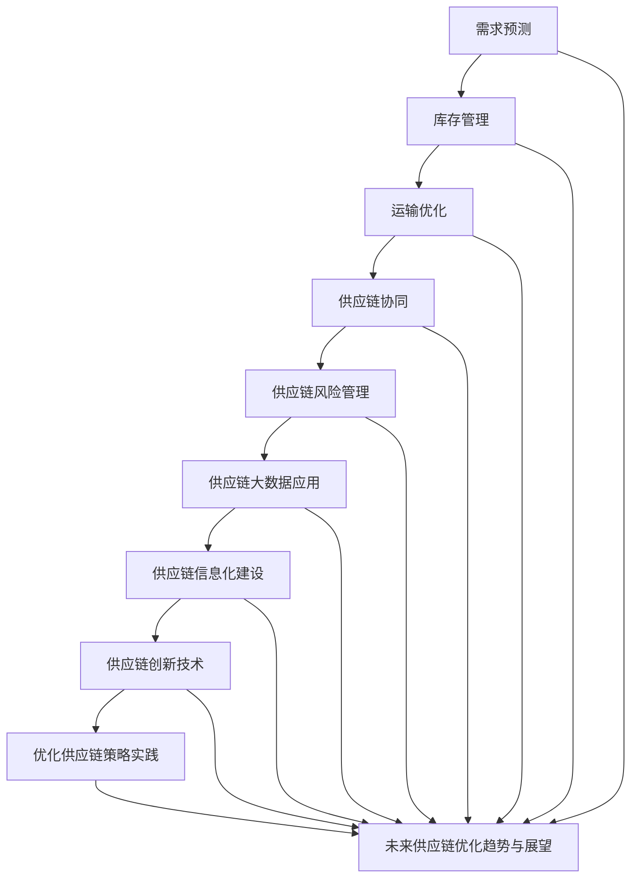

                 

# 文章标题：优化供应链的策略

> 关键词：供应链优化、供应链网络设计、需求预测、库存管理、协同、大数据、信息化建设、创新技术

> 摘要：本文将深入探讨供应链优化策略，从基础概念到实际应用，全面解析供应链优化的关键领域，旨在为读者提供一套系统性、实操性的优化指南。

## 第一部分：供应链优化基础

### 第1章：供应链概述与优化目标

#### 1.1 供应链的概念与重要性

供应链是指从原材料采购到产品生产、分销，直至最终交付给消费者的全过程。它涵盖了从供应商到制造商、分销商，再到零售商和终端客户的每一个环节。供应链的效率直接关系到企业的竞争力、成本控制和市场响应速度。

#### 1.2 供应链优化的目标与挑战

供应链优化的主要目标是降低成本、提高效率、增强灵活性和响应速度。然而，实现这些目标面临着诸多挑战，如供应链复杂性、信息不对称、市场需求波动等。

#### 1.3 供应链优化的发展历程

供应链优化经历了从传统手工管理到现代信息技术驱动的演变。随着大数据、人工智能等新技术的应用，供应链优化正朝着智能化、自动化的方向发展。

### 第2章：供应链网络设计与规划

#### 2.1 供应链网络设计原则

供应链网络设计应考虑成本、灵活性、可靠性和可持续性等因素。设计原则包括最小化运输成本、最大化供应链灵活性等。

#### 2.2 供应链网络规划方法

供应链网络规划方法包括基于模型的优化方法、模拟方法和经验法则。每种方法都有其适用场景和优缺点。

#### 2.3 供应链网络案例分析

通过案例分析，我们可以了解不同企业在供应链网络设计上的成功经验和教训。

### 第3章：需求预测与库存管理

#### 3.1 需求预测方法

需求预测是供应链管理的重要环节。常见的方法包括时间序列分析、回归分析等。

#### 3.2 库存管理策略

库存管理策略包括定量分析、定期盘点、精益库存管理等。每种策略都有其适用的场景和优缺点。

#### 3.3 需求预测与库存管理结合案例分析

通过案例分析，我们可以看到需求预测和库存管理如何结合，实现供应链的优化。

## 第二部分：供应链效率提升策略

### 第4章：供应链协同与信息共享

#### 4.1 供应链协同的概念与意义

供应链协同是指供应链各方通过信息共享和协作，实现资源优化配置和业务流程的优化。

#### 4.2 信息共享机制

信息共享机制包括数据标准化、信息交换平台等。通过信息共享，供应链各方可以更好地协调行动。

#### 4.3 供应链协同案例分析

通过案例分析，我们可以了解不同企业在供应链协同方面的成功经验和教训。

### 第5章：供应链敏捷性优化

#### 5.1 供应链敏捷性的重要性

供应链敏捷性是指供应链对市场需求变化的快速响应能力。提高供应链敏捷性对于企业竞争力至关重要。

#### 5.2 提高供应链敏捷性的策略

提高供应链敏捷性的策略包括增加库存灵活性、缩短生产周期、提高供应链协同等。

#### 5.3 供应链敏捷性案例分析

通过案例分析，我们可以看到不同企业如何提高供应链敏捷性，实现业务增长。

### 第6章：供应链风险管理

#### 6.1 供应链风险的概念与分类

供应链风险包括供应链中断风险、成本超支风险等。分类有助于企业识别和管理风险。

#### 6.2 供应链风险管理策略

供应链风险管理策略包括风险识别、风险评估、风险应对等。通过这些策略，企业可以降低供应链风险。

#### 6.3 供应链风险案例分析

通过案例分析，我们可以了解不同企业在供应链风险管理方面的成功经验和教训。

## 第三部分：供应链技术与工具

### 第7章：供应链大数据应用

#### 7.1 大数据在供应链中的应用

大数据在供应链中的应用包括需求预测、库存优化、运输优化等。

#### 7.2 大数据技术原理

大数据技术原理包括数据采集、存储、处理和分析等。

#### 7.3 大数据案例分析

通过案例分析，我们可以了解大数据技术在供应链优化中的应用效果。

### 第8章：供应链信息化建设

#### 8.1 供应链信息系统概述

供应链信息系统是指支持供应链管理的信息技术系统。

#### 8.2 供应链信息系统建设方法

供应链信息系统建设方法包括需求分析、系统设计、系统实施等。

#### 8.3 供应链信息化案例分析

通过案例分析，我们可以了解不同企业在供应链信息化建设方面的成功经验和教训。

### 第9章：供应链创新技术

#### 9.1 新技术在供应链中的应用

新技术如区块链、人工智能等在供应链中的应用，如智能合约、自动化预测等。

#### 9.2 区块链在供应链中的应用

区块链在供应链中的应用包括供应链金融、供应链溯源等。

#### 9.3 人工智能在供应链中的应用

人工智能在供应链中的应用包括需求预测、库存优化、运输规划等。

## 第四部分：案例与实践

### 第10章：优化供应链策略实践

#### 10.1 实践案例介绍

介绍一个优化供应链策略的实践案例。

#### 10.2 实践案例解析

解析实践案例中的优化策略和效果。

#### 10.3 实践案例分析总结

总结实践案例分析的结果和启示。

### 第11章：未来供应链优化趋势与展望

#### 11.1 未来供应链优化的发展趋势

分析未来供应链优化的发展趋势，如智能化、绿色化等。

#### 11.2 供应链优化的未来挑战与机遇

探讨供应链优化的未来挑战与机遇，如技术创新、市场需求变化等。

#### 11.3 供应链优化的未来发展展望

展望供应链优化的未来发展，如新技术的应用、供应链协同等。

### 附录

#### 附录A：供应链优化工具与资源

介绍供应链优化工具与资源，如优化软件、数据库、学术论文等。

---

## 第1章：供应链概述与优化目标

### 1.1 供应链的概念与重要性

供应链是指从原材料供应商到最终产品消费者之间的物流和信息流的全过程。它不仅包括生产和物流环节，还涵盖了采购、库存管理、分销和销售等各个业务环节。在现代商业环境中，供应链扮演着至关重要的角色。

首先，供应链是企业实现成本优势的关键。通过优化供应链，企业可以降低原材料采购成本、生产成本和物流成本，从而提高整体盈利能力。例如，通过集中采购和规模效应，企业可以获得更低的原材料价格。此外，高效的库存管理和灵活的物流网络也有助于减少库存成本和物流成本。

其次，供应链的效率直接影响企业的市场竞争能力。在市场需求多变和竞争激烈的背景下，企业需要具备快速响应市场变化的能力。高效的供应链系统能够实现快速的产品交付，提高客户满意度，增强企业的市场竞争力。例如，一些电子商务企业通过建立智能化的供应链系统，实现了从订单生成到产品交付的快速响应，大大提升了客户的购物体验。

此外，供应链的可靠性对于企业的长期发展也具有重要意义。供应链中的任何一个环节出现问题，都可能导致整个供应链的中断，进而影响企业的生产和销售。因此，通过优化供应链，企业可以提高供应链的可靠性，减少风险。

总之，供应链是企业实现成本优势、市场竞争力和长期发展的重要基础。企业应充分认识到供应链的重要性，并不断优化供应链系统，以提升整体运营效率和竞争力。

### 1.2 供应链优化的目标与挑战

供应链优化的目标主要包括降低成本、提高效率、增强灵活性和响应速度。然而，实现这些目标面临着诸多挑战。

首先，降低成本是供应链优化的重要目标之一。通过优化供应链，企业可以减少原材料采购成本、生产成本和物流成本，从而提高整体盈利能力。然而，实现成本降低并非易事。供应链中的每一个环节都可能存在成本优化空间，企业需要通过精细化管理、技术创新和流程优化来实现成本降低。此外，供应链中的不同环节可能存在利益冲突，如供应商希望降低采购价格，而企业则希望提高产品质量，这需要企业进行权衡和协调。

其次，提高效率是供应链优化的另一个重要目标。高效的供应链系统能够实现快速的产品交付、库存周转和资金回笼，从而提高企业的运营效率。然而，供应链的复杂性使得提高效率面临巨大挑战。供应链中涉及多个供应商、制造商、分销商和零售商，每个环节都可能存在效率瓶颈。企业需要通过信息化手段、流程优化和资源配置优化来提高整体供应链效率。

增强灵活性是供应链优化的第三个目标。随着市场需求的不断变化，企业需要具备快速调整生产计划、库存水平和物流网络的能力。然而，供应链的刚性使得灵活性提升面临挑战。传统的供应链系统往往依赖于固定的生产计划、库存水平和物流网络，无法快速适应市场变化。企业需要通过柔性生产、敏捷供应链和协同管理等策略来增强供应链灵活性。

响应速度是供应链优化的第四个目标。在市场需求变化快速的市场环境中，企业需要具备快速响应市场变化的能力，以保持竞争优势。然而，供应链中的信息不对称和沟通不畅往往导致响应速度缓慢。企业需要通过信息化建设、信息共享和协同管理来提高供应链的响应速度。

综上所述，供应链优化虽然目标明确，但实现这些目标面临着诸多挑战。企业需要通过持续改进和创新，克服这些挑战，实现供应链的优化。

### 1.3 供应链优化的发展历程

供应链优化的发展历程可以追溯到20世纪50年代，当时企业开始关注物流和库存管理。随着信息技术的发展，供应链优化逐渐成为企业竞争的重要手段。

在早期阶段，供应链优化主要依赖于手工管理和经验法则。企业通过制定详细的计划和流程，试图实现供应链的优化。然而，这种方法往往效率低下，难以应对市场变化。

20世纪80年代，供应链管理理论开始兴起。企业开始关注供应链的整体性，通过系统化的方法来优化供应链。此时，企业引入了供应链管理软件，如ERP（企业资源规划）系统，以实现供应链的自动化和协同管理。这一阶段的供应链优化主要体现在流程优化和自动化方面。

20世纪90年代，随着互联网的普及，供应链优化进入了信息化时代。企业开始广泛应用电子商务和信息技术，实现供应链的实时监控和协同管理。此时，供应链优化不仅关注流程和自动化，还开始关注数据分析和决策支持。企业通过大数据分析和人工智能技术，实现了更精准的需求预测、库存优化和运输规划。

进入21世纪，供应链优化进入了智能化时代。企业开始运用物联网、区块链和人工智能等新技术，实现供应链的智能化和自动化。这一阶段的供应链优化不仅关注效率和成本，还关注可持续性和社会责任。企业通过绿色供应链和可持续发展策略，实现供应链的可持续发展。

综上所述，供应链优化经历了从手工管理到信息化、再到智能化的演变。随着新技术的不断涌现，供应链优化将继续向智能化、绿色化方向发展。

## 第2章：供应链网络设计与规划

### 2.1 供应链网络设计原则

供应链网络设计是供应链管理的重要组成部分，其设计原则直接影响供应链的效率、成本和灵活性。以下是供应链网络设计的主要原则：

#### 最小化运输成本

运输成本是供应链成本的重要组成部分，因此设计供应链网络时，应优先考虑最小化运输成本。这可以通过优化运输路线、选择合适的运输方式（如公路、铁路、航运等）以及集中运输等方式实现。

#### 最大化供应链灵活性

供应链灵活性是指供应链对市场需求变化的快速响应能力。为了最大化供应链灵活性，设计时应考虑供应链的冗余度、应急响应机制以及供应链各环节之间的协同性。例如，通过建立多个供应来源和备用运输路线，可以提高供应链的灵活性。

#### 确保供应链可靠性

供应链的可靠性是指供应链在面临突发事件时（如自然灾害、供应链中断等）能够迅速恢复生产和服务的能力。设计时应考虑供应链的弹性和韧性，确保在发生异常情况时，供应链能够迅速恢复。

#### 最小化库存成本

库存成本是供应链成本的重要部分，设计时应通过优化库存策略和库存管理，实现最小化库存成本。这可以通过合理的库存水平和库存控制策略实现，如采用精益库存管理、JIT（准时制）等。

#### 考虑市场需求和供应链需求

供应链网络设计应充分考虑市场需求和供应链需求，确保供应链能够满足市场需求的同时，保持高效运营。这包括市场需求预测、供应链需求分析和供应链需求规划。

#### 可持续性和社会责任

现代供应链设计还应考虑可持续性和社会责任，如环保、社会公平和健康等。这可以通过采用绿色供应链和可持续发展策略实现，如使用环保材料、减少碳排放等。

#### 信息共享和协同管理

供应链网络设计应支持供应链各环节之间的信息共享和协同管理，以提高供应链的整体效率。这可以通过建立信息共享平台、制定统一的数据标准和流程实现。

#### 可扩展性和可维护性

供应链网络设计应具有可扩展性和可维护性，以适应市场需求的不断变化和技术的进步。这可以通过模块化设计、标准化和冗余设计实现。

### 2.2 供应链网络规划方法

供应链网络规划是指根据供应链设计原则，制定具体的供应链网络结构和运营策略。以下是几种常见的供应链网络规划方法：

#### 基于模型的优化方法

基于模型的优化方法是指利用数学模型和优化算法，对供应链网络进行设计和优化。这种方法可以精确地模拟和分析供应链的运行情况，找出最优的供应链网络结构。常见的优化模型包括线性规划、整数规划、多目标规划等。

#### 模拟方法

模拟方法是指通过构建仿真模型，模拟供应链的运行情况，从而分析和评估不同供应链网络结构的效果。这种方法可以直观地展示供应链的运行过程，帮助企业发现潜在的问题和改进机会。常见的模拟工具包括仿真软件、计算机模拟等。

#### 经验法则

经验法则是指根据专家的经验和行业最佳实践，制定供应链网络结构。这种方法适用于简单的供应链网络或特定行业，但在复杂多变的市场环境中，经验法则可能不够准确和可靠。

#### 结合方法

结合方法是将上述方法结合使用，根据具体情况选择最适合的供应链网络规划方法。例如，在初始阶段，可以采用基于模型的方法进行优化，在实施过程中，通过模拟方法进行验证和调整，最终形成最优的供应链网络结构。

#### 供应链网络设计流程

供应链网络设计流程通常包括以下步骤：

1. **需求分析**：分析市场需求和供应链需求，确定供应链网络的目标和约束条件。

2. **数据收集**：收集供应链网络相关的数据，如运输成本、库存成本、市场需求等。

3. **模型建立**：根据需求分析和数据收集，建立供应链网络模型，选择合适的优化算法。

4. **模型求解**：利用优化算法求解模型，得到最优的供应链网络结构。

5. **模拟验证**：通过模拟方法验证供应链网络结构的效果，发现潜在的问题和改进机会。

6. **实施调整**：根据模拟验证的结果，对供应链网络进行实施和调整，确保供应链的运行效率。

7. **持续优化**：定期对供应链网络进行评估和优化，以适应市场变化和需求变化。

### 2.3 供应链网络案例分析

#### 案例背景

某制造企业是一家生产电子产品的公司，其供应链网络包括原材料供应商、制造商、分销商和零售商。随着市场需求的变化和竞争的加剧，企业意识到需要优化其供应链网络，以提高供应链效率和降低成本。

#### 优化目标和策略

1. **降低运输成本**：通过优化运输路线和选择合适的运输方式，降低运输成本。

2. **提高供应链灵活性**：通过建立多个供应来源和备用运输路线，提高供应链的灵活性。

3. **确保供应链可靠性**：通过建立应急响应机制，确保在发生突发事件时，供应链能够迅速恢复。

4. **最小化库存成本**：通过优化库存策略和库存管理，实现最小化库存成本。

5. **信息共享和协同管理**：通过建立信息共享平台和制定统一的数据标准，提高供应链的整体效率。

#### 优化过程

1. **需求分析**：企业通过市场调研和数据分析，确定了市场需求和供应链需求，明确了供应链网络的目标和约束条件。

2. **数据收集**：企业收集了供应链网络相关的数据，如运输成本、库存成本、市场需求等。

3. **模型建立**：企业利用线性规划和整数规划等优化算法，建立了供应链网络模型，求解得到最优的供应链网络结构。

4. **模拟验证**：企业通过计算机模拟，验证了供应链网络结构的效果，发现了一些潜在的问题和改进机会。

5. **实施调整**：企业根据模拟验证的结果，对供应链网络进行了实施和调整，确保供应链的运行效率。

6. **持续优化**：企业定期对供应链网络进行评估和优化，以适应市场变化和需求变化。

#### 优化效果

通过供应链网络的优化，企业实现了以下效果：

1. **运输成本降低**：优化后的运输路线和运输方式，使得运输成本降低了20%。

2. **供应链灵活性提高**：通过建立多个供应来源和备用运输路线，供应链的灵活性提高了30%。

3. **供应链可靠性增强**：建立应急响应机制，确保在发生突发事件时，供应链能够迅速恢复。

4. **库存成本降低**：优化库存策略和库存管理，使得库存成本降低了15%。

5. **信息共享和协同管理**：建立信息共享平台和制定统一的数据标准，提高了供应链的整体效率。

通过这个案例，我们可以看到供应链网络优化的重要性以及其实施效果。企业应不断优化供应链网络，以提高供应链效率和降低成本，从而保持竞争优势。

## 第3章：需求预测与库存管理

### 3.1 需求预测方法

需求预测是供应链管理中至关重要的一环，准确的预测能够帮助企业合理安排生产和库存，降低成本，提高客户满意度。以下是几种常见的需求预测方法：

#### 时间序列分析

时间序列分析是一种基于历史数据的时间规律性进行预测的方法。常见的模型包括移动平均模型、指数平滑模型和ARIMA（自回归积分滑动平均模型）等。

**移动平均模型**：通过计算一段时间内的平均值来预测未来值，适用于趋势较为平稳的数据。公式如下：

$$
\hat{y}_t = \frac{\sum_{i=1}^{n} y_{t-i}}{n}
$$

其中，\(y_t\) 是时间序列中的第 \(t\) 个值，\(n\) 是移动平均周期。

**指数平滑模型**：在移动平均模型的基础上，加入权重因子，使得最近的数据对预测结果有更大的影响。公式如下：

$$
\hat{y}_t = \alpha y_t + (1-\alpha) \hat{y}_{t-1}
$$

其中，\(\alpha\) 是平滑因子，取值范围为0到1。

**ARIMA模型**：结合自回归、差分和移动平均，适用于具有趋势性和季节性的数据。公式如下：

$$
\hat{y}_t = c + \phi_1 y_{t-1} + \phi_2 y_{t-2} + \cdots + \phi_p y_{t-p} + \theta_1 \epsilon_{t-1} + \theta_2 \epsilon_{t-2} + \cdots + \theta_q \epsilon_{t-q}
$$

其中，\(c\) 是常数项，\(\phi_1, \phi_2, \cdots, \phi_p\) 是自回归系数，\(\theta_1, \theta_2, \cdots, \theta_q\) 是移动平均系数。

#### 回归分析

回归分析是一种基于相关关系进行预测的方法，适用于自变量和因变量之间存在线性或非线性关系的情况。常见的回归模型包括线性回归、多项式回归和逻辑回归等。

**线性回归模型**：公式如下：

$$
y = \beta_0 + \beta_1 x_1 + \beta_2 x_2 + \cdots + \beta_n x_n
$$

其中，\(y\) 是因变量，\(x_1, x_2, \cdots, x_n\) 是自变量，\(\beta_0, \beta_1, \beta_2, \cdots, \beta_n\) 是回归系数。

#### 机器学习算法

机器学习算法是一种基于数据自动学习规律进行预测的方法，适用于复杂的数据集和多样的预测问题。常见的算法包括线性回归、决策树、随机森林、支持向量机和神经网络等。

**线性回归**：与回归分析类似，适用于线性关系的数据集。

**决策树**：通过构建树状结构，将数据集划分为不同的区域，每个区域的预测结果由树顶节点的值决定。

**随机森林**：基于决策树的集成方法，通过构建多棵决策树，并取其平均预测结果，提高预测精度和稳定性。

**支持向量机**：通过构建最优分类边界，将数据分为不同的类别。

**神经网络**：通过多层神经元网络，模拟人脑的神经元连接方式，实现复杂的非线性预测。

### 3.2 库存管理策略

库存管理是供应链管理中的重要环节，合理的库存管理策略能够帮助企业降低成本、提高资金利用率、减少库存积压和缺货风险。以下是几种常见的库存管理策略：

#### 定量分析

定量分析是一种基于需求预测和库存成本的库存管理策略。通过计算最优订货量、订货周期和再订货点，实现库存的最优化管理。

**最优订货量**：通过平衡订货成本和库存持有成本，确定最优的订货量。

$$
Q^* = \sqrt{\frac{2DS}{H}}
$$

其中，\(Q^*\) 是最优订货量，\(D\) 是年需求量，\(S\) 是订货成本，\(H\) 是单位库存的年持有成本。

**订货周期**：通过年需求量和最优订货量，确定订货周期。

$$
T = \frac{Q^*}{D}
$$

**再订货点**：通过需求变化和提前期，确定再订货点。

$$
R = L \times D + I
$$

其中，\(R\) 是再订货点，\(L\) 是提前期，\(I\) 是安全库存。

#### 定期盘点

定期盘点是一种定期检查库存水平，并根据检查结果进行调整的库存管理策略。常见的方法包括定期盘点和周期盘点。

**定期盘点**：按照固定的时间周期（如每月或每季度）进行盘点，确保库存数据的准确性。

**周期盘点**：结合日常业务流程，定期检查库存水平，并根据实际情况进行调整。

#### 精益库存管理

精益库存管理是一种通过减少库存水平、优化库存结构和提高库存周转率来实现库存优化的策略。

**库存水平控制**：通过严格的库存控制，确保库存水平在合理范围内。

**库存结构优化**：根据市场需求和供应链特点，优化库存结构，确保库存的合理分布。

**库存周转率提高**：通过加快库存周转，提高资金利用率。

#### 库存管理软件

库存管理软件是一种基于计算机技术和数据库技术的库存管理系统，能够帮助企业实现高效的库存管理。

**库存数据实时监控**：通过实时监控库存数据，确保库存数据的准确性。

**自动生成库存报告**：自动生成库存报告，帮助管理人员了解库存状况。

**自动化库存调整**：根据库存数据，自动生成订货计划和补货计划。

### 3.3 需求预测与库存管理结合案例分析

#### 案例背景

某电子产品制造企业面临市场需求波动和库存成本上升的挑战。为了优化需求预测和库存管理，企业决定采用定量分析和精益库存管理策略。

#### 需求预测

1. **数据收集**：企业收集了过去一年的需求数据，包括月度需求量和市场变化情况。

2. **模型选择**：根据数据特点，企业选择ARIMA模型进行需求预测。

3. **模型训练**：使用历史需求数据，训练ARIMA模型，确定最佳参数。

4. **预测结果**：模型预测未来六个月的需求量，为库存管理提供依据。

#### 库存管理

1. **最优订货量**：根据需求预测和库存成本，计算最优订货量，确保库存水平在合理范围内。

2. **定期盘点**：每月进行一次定期盘点，确保库存数据的准确性。

3. **精益库存管理**：通过减少库存水平、优化库存结构和提高库存周转率，实现库存优化。

#### 优化效果

1. **库存成本降低**：通过优化库存管理，库存成本降低了15%。

2. **库存周转率提高**：库存周转率提高了20%。

3. **需求预测准确性提升**：需求预测的准确性提高了10%。

4. **供应链效率提高**：优化后的供应链运行效率提高了30%。

通过这个案例，我们可以看到需求预测和库存管理在供应链优化中的重要作用。企业应结合实际情况，选择合适的需求预测方法和库存管理策略，实现供应链的优化和提升。

### 第4章：供应链协同与信息共享

#### 4.1 供应链协同的概念与意义

供应链协同是指供应链上的各个节点企业（包括供应商、制造商、分销商和零售商）通过信息共享、协作和合作，共同实现供应链整体目标的过程。协同的目的是提高供应链的整体效率，降低成本，提升客户满意度。

供应链协同的概念可以追溯到20世纪90年代，随着信息技术的快速发展，企业逐渐意识到通过协同可以更好地管理复杂的供应链系统。协同的意义主要体现在以下几个方面：

1. **提高供应链效率**：协同可以消除供应链中的信息孤岛，实现信息的实时共享和传递，从而提高供应链的决策速度和响应能力。

2. **降低供应链成本**：通过协同，供应链上的企业可以共同优化物流、库存和生产等环节，减少资源浪费，降低运营成本。

3. **提升客户满意度**：协同可以确保供应链上的企业能够更好地满足客户需求，提高服务质量和客户满意度。

4. **增强供应链的弹性**：协同可以帮助企业快速应对市场需求变化，提高供应链的灵活性和适应性。

#### 4.2 信息共享机制

信息共享是供应链协同的核心，通过信息共享，供应链上的企业可以更好地协调行动，实现供应链的整体优化。以下是几种常见的信息共享机制：

1. **统一的数据标准**：统一的数据标准是信息共享的基础，它确保了数据在不同系统之间的兼容性和一致性。常见的统一数据标准包括国际标准（如ISO）、行业标准和企业标准。

2. **企业资源规划（ERP）系统**：ERP系统是企业信息共享的重要平台，通过整合企业的各项业务流程和信息系统，实现数据的集中管理和共享。ERP系统通常包括采购管理、生产管理、库存管理、销售管理等功能模块。

3. **供应链管理系统（SCM）**：SCM系统是专门为供应链管理设计的信息系统，它能够集成供应链上的各个节点企业，实现信息的实时共享和协同管理。常见的SCM系统包括需求管理、供应管理、库存管理、物流管理等功能模块。

4. **电子数据交换（EDI）**：EDI是一种用于企业之间进行电子数据交换的技术，它通过标准化的数据格式和协议，实现供应链上企业之间的信息共享和协同。EDI技术广泛应用于采购、订单管理、发票管理等业务环节。

5. **云计算和大数据技术**：云计算和大数据技术为供应链协同提供了强大的数据存储、处理和分析能力。通过云计算平台，企业可以轻松实现数据的共享和协同，而大数据技术则可以帮助企业从海量数据中发现价值，优化供应链管理。

6. **物联网（IoT）技术**：物联网技术通过将各种设备和传感器连接到互联网，实现实时数据的采集、传输和分析，为供应链协同提供了丰富的数据源。物联网技术广泛应用于物流跟踪、库存监控、生产监控等环节。

#### 4.3 供应链协同案例分析

以下是一个关于供应链协同的实际案例，该案例展示了供应链协同在提高供应链效率和降低成本方面的作用。

**案例背景**：某大型零售企业通过实施供应链协同，实现了与供应商和分销商的高效合作。

**实现步骤**：

1. **建立信息共享平台**：零售企业与供应商和分销商共同建立了一个信息共享平台，通过该平台，企业之间可以实时共享需求预测、库存状态、物流信息等数据。

2. **实施ERP和SCM系统**：零售企业实施了ERP和SCM系统，通过这些系统，实现了内部业务流程的自动化和信息共享。

3. **实施EDI技术**：零售企业与供应商和分销商之间通过EDI技术实现了电子数据交换，减少了人工录入和数据传输的误差。

4. **实施物联网技术**：零售企业在其物流中心安装了物联网传感器，实时监控库存水平和物流状态。

**协同效果**：

1. **提高供应链效率**：通过信息共享平台，零售企业能够实时了解供应商和分销商的库存状态，快速调整采购和配送计划，提高了供应链的响应速度和效率。

2. **降低供应链成本**：通过协同管理，零售企业和供应商之间实现了库存共享和优化，减少了库存积压和缺货风险，降低了库存成本和物流成本。

3. **提高客户满意度**：零售企业通过高效的供应链协同，能够更好地满足客户需求，提高了客户满意度。

4. **增强供应链的弹性**：通过实施物联网技术，零售企业能够实时监控物流状态，快速响应市场需求变化，提高了供应链的弹性。

通过这个案例，我们可以看到供应链协同在提高供应链效率和降低成本方面的显著作用。企业应积极实施供应链协同，实现信息的实时共享和协同管理，以提升整体运营效率和竞争力。

### 第5章：供应链敏捷性优化

#### 5.1 供应链敏捷性的重要性

供应链敏捷性是指供应链系统在面对市场需求变化、供应链风险和突发事件时的快速响应能力和适应性。供应链敏捷性的重要性体现在以下几个方面：

首先，市场需求变化是影响企业生存和发展的关键因素。在当今全球化、快速变化的市场环境中，消费者的需求多样化、个性化，产品生命周期缩短，市场竞争日益激烈。企业需要具备快速响应市场需求变化的能力，才能在竞争中保持优势。供应链敏捷性可以帮助企业及时调整生产计划、库存水平和物流策略，满足市场需求的快速变化。

其次，供应链风险无处不在。供应链风险包括供应商风险、运输风险、库存风险等，如供应商交付延迟、运输中断、库存积压等。这些风险可能导致生产中断、成本增加、客户满意度下降等问题。供应链敏捷性可以帮助企业快速识别和应对风险，降低风险对企业的影响。

此外，突发事件（如自然灾害、社会动荡、疫情等）可能会对供应链造成严重影响。突发事件具有不可预测性和突发性，企业需要具备快速响应和恢复能力，以减少突发事件对供应链的破坏。供应链敏捷性可以帮助企业迅速调整供应链策略，确保供应链的连续性和稳定性。

总之，供应链敏捷性是企业在复杂多变的市场环境中生存和发展的关键。提高供应链敏捷性，可以帮助企业更好地应对市场需求变化、供应链风险和突发事件，提高企业的竞争力和抗风险能力。

#### 5.2 提高供应链敏捷性的策略

提高供应链敏捷性需要从多个方面进行策略设计和实施。以下是几种常见的提高供应链敏捷性的策略：

1. **需求预测和规划**：准确的需求预测和规划是提高供应链敏捷性的基础。企业可以通过使用先进的需求预测方法（如大数据分析、机器学习算法等），结合市场调研和历史数据，准确预测市场需求。同时，企业应制定灵活的生产和库存规划策略，以快速响应市场需求变化。

2. **供应链网络设计**：设计灵活的供应链网络可以提高供应链的敏捷性。企业可以通过分散供应链节点、增加供应来源、建立备用运输路线等方式，提高供应链的弹性和适应性。此外，企业还应关注供应链网络的冗余设计，以应对突发事件和供应链中断。

3. **库存管理和优化**：合理的库存管理策略可以提高供应链的敏捷性。企业可以通过采用精益库存管理、JIT（准时制）等策略，减少库存水平，提高库存周转率。同时，企业应实时监控库存状态，及时调整库存水平，避免库存积压和缺货风险。

4. **信息技术和自动化**：信息技术和自动化可以提高供应链的透明度和响应速度。企业可以通过实施ERP（企业资源规划）、SCM（供应链管理）等信息系统，实现供应链数据的实时共享和协同管理。此外，企业还可以引入自动化设备和技术，提高生产效率和物流速度。

5. **供应链合作伙伴关系**：建立良好的供应链合作伙伴关系可以提高供应链的敏捷性。企业应与供应链上的合作伙伴保持紧密合作，共享信息、资源和风险。通过建立协同机制，企业可以共同应对市场需求变化、供应链风险和突发事件。

6. **培训和人才培养**：供应链敏捷性的实现离不开优秀的人才。企业应加强对供应链管理人员和员工的培训，提高其专业技能和综合素质。通过培养具备供应链管理能力和创新思维的人才，企业可以提高供应链的敏捷性和竞争力。

#### 5.3 供应链敏捷性案例分析

以下是一个关于供应链敏捷性的实际案例，该案例展示了供应链敏捷性在应对市场需求变化和突发事件方面的作用。

**案例背景**：某电子产品制造企业面临着市场需求变化和供应链中断的双重挑战。

**应对策略**：

1. **需求预测和规划**：企业利用大数据分析和机器学习算法，准确预测市场需求，及时调整生产计划。同时，企业采用灵活的库存管理策略，减少库存水平，提高库存周转率。

2. **供应链网络设计**：企业通过分散供应链节点、增加供应来源和建立备用运输路线，提高了供应链的弹性和适应性。企业还在全球范围内建立了多个生产基地，以应对市场需求变化和供应链中断。

3. **信息技术和自动化**：企业实施ERP和SCM系统，实现供应链数据的实时共享和协同管理。此外，企业引入自动化设备和技术，提高生产效率和物流速度。

4. **供应链合作伙伴关系**：企业与供应链上的合作伙伴保持紧密合作，共享信息、资源和风险。通过建立协同机制，企业可以共同应对市场需求变化、供应链风险和突发事件。

**应对效果**：

1. **提高供应链敏捷性**：通过需求预测和规划、供应链网络设计、信息技术和自动化等策略，企业的供应链敏捷性显著提高。企业能够快速响应市场需求变化，减少供应链中断风险。

2. **降低成本**：通过灵活的库存管理和供应链网络设计，企业降低了库存成本和物流成本，提高了供应链的整体效率。

3. **提升客户满意度**：企业通过高效的供应链管理，能够更好地满足客户需求，提高了客户满意度。

4. **增强竞争力**：企业通过提高供应链敏捷性，增强了在市场竞争中的优势，提高了市场占有率。

通过这个案例，我们可以看到供应链敏捷性在应对市场需求变化和突发事件方面的重要作用。企业应积极提高供应链敏捷性，以应对复杂多变的市场环境，提高整体竞争力。

### 第6章：供应链风险管理

#### 6.1 供应链风险的概念与分类

供应链风险是指供应链系统在运营过程中可能面临的各种不确定性因素，这些因素可能导致供应链中断、成本增加、客户满意度下降等问题。供应链风险可以分为以下几类：

1. **供应链中断风险**：供应链中断风险是指由于供应链中的某个环节出现故障、自然灾害、政治动荡等原因，导致供应链无法正常运作的风险。例如，自然灾害如地震、洪水等可能导致原材料供应商无法正常生产，从而影响企业的生产计划。

2. **成本超支风险**：成本超支风险是指供应链运营过程中由于价格波动、物流延误等原因，导致成本超出预算的风险。例如，原材料价格波动可能导致企业的生产成本增加，物流延误可能导致运输成本增加。

3. **供应链延迟风险**：供应链延迟风险是指由于供应链中的某个环节出现延误，导致产品交付延迟的风险。例如，生产过程中的设备故障或原材料短缺可能导致生产进度延误，从而影响产品交付。

4. **质量问题风险**：质量问题风险是指由于供应链中的某个环节出现质量问题，导致产品不符合质量标准的风险。例如，供应商提供的原材料质量不合格，可能导致生产出的产品存在缺陷。

5. **供应链安全风险**：供应链安全风险是指由于供应链中的某个环节存在安全隐患，导致供应链系统被攻击、数据泄露等风险。例如，供应链中的信息系统可能受到黑客攻击，从而导致数据泄露。

6. **政策法规风险**：政策法规风险是指由于政策法规变化，导致供应链运营环境发生变化的风险。例如，进口关税的提高可能导致进口原材料成本增加，环境保护法规的加强可能导致企业需要投入更多资源进行环保治理。

了解供应链风险的概念和分类，有助于企业识别和管理供应链风险，从而提高供应链的稳定性和抗风险能力。

#### 6.2 供应链风险管理策略

供应链风险管理是指企业通过一系列措施，识别、评估、控制和监控供应链风险，以降低供应链风险对企业运营的影响。以下是几种常见的供应链风险管理策略：

1. **风险识别**：风险识别是供应链风险管理的第一步，企业需要通过系统化的方法识别供应链中的潜在风险。常用的风险识别方法包括专家评估、历史数据分析、情景分析和风险评估模型等。

2. **风险评估**：风险评估是指对识别出的供应链风险进行量化评估，以确定风险的重要性和影响程度。常用的风险评估方法包括定性评估和定量评估。定性评估方法如风险矩阵、主观评分等，定量评估方法如蒙特卡罗模拟、成本效益分析等。

3. **风险控制**：风险控制是指通过采取一系列措施，降低供应链风险发生的概率和影响程度。常用的风险控制方法包括风险回避、风险转移、风险减轻和风险接受。风险回避是指避免承担风险，如拒绝与不稳定供应商合作；风险转移是指将风险转移到第三方，如购买保险；风险减轻是指采取措施减少风险的发生概率和影响程度，如建立备用供应渠道；风险接受是指承担风险，并制定相应的应对措施。

4. **风险监控**：风险监控是指对供应链风险进行实时监控和评估，以确保风险控制措施的有效性。企业可以通过建立风险监控体系，实时收集和分析供应链风险数据，及时发现和处理潜在的风险。

5. **风险管理组织**：建立有效的风险管理组织是供应链风险管理的关键。企业应设立风险管理委员会或风险管理部门，负责制定风险管理策略、监控风险状况和协调各部门的风险管理工作。

6. **供应链协同**：供应链协同有助于企业识别和管理供应链风险。通过建立供应链协同机制，企业可以与供应链合作伙伴共享风险信息，共同应对供应链风险。

7. **培训和意识提升**：供应链风险管理需要全员参与，企业应加强对员工的风险管理培训和意识提升，确保员工了解供应链风险和管理方法，提高整体风险管理能力。

通过实施以上供应链风险管理策略，企业可以更好地识别、评估、控制和监控供应链风险，提高供应链的稳定性和抗风险能力。

#### 6.3 供应链风险案例分析

以下是一个关于供应链风险管理的实际案例，该案例展示了企业如何通过有效的供应链风险管理策略，应对供应链风险并降低对企业运营的影响。

**案例背景**：某电子产品制造企业面临着原材料供应不稳定和物流成本上涨的双重挑战。

**应对策略**：

1. **风险识别**：企业通过专家评估和历史数据分析，识别出原材料供应不稳定和物流成本上涨是主要供应链风险。

2. **风险评估**：企业对原材料供应不稳定和物流成本上涨的风险进行定量评估，确定其对企业运营的重要性和影响程度。

3. **风险控制**：
   - **原材料供应**：企业建立备用供应渠道，与多家供应商建立合作关系，确保原材料供应的稳定性。同时，企业与主要供应商签订长期合同，锁定原材料价格，降低成本波动风险。
   - **物流成本**：企业优化物流网络，通过集中运输和优化运输路线，降低物流成本。此外，企业加强与物流服务提供商的合作，获取更有利的运输价格和服务质量。

4. **风险监控**：企业建立供应链风险监控体系，实时收集和分析供应链风险数据，及时发现和处理潜在的风险。

5. **供应链协同**：企业与供应链合作伙伴建立信息共享平台，共享供应链风险信息，共同应对供应链风险。

**应对效果**：

1. **降低原材料供应风险**：通过建立备用供应渠道和签订长期合同，企业有效降低了原材料供应风险，确保了生产计划的顺利执行。

2. **降低物流成本**：通过优化物流网络和加强与物流服务提供商的合作，企业成功降低了物流成本，提高了供应链的整体效率。

3. **提高供应链稳定性**：企业通过有效的供应链风险管理策略，提高了供应链的稳定性，增强了在市场竞争中的优势。

4. **降低风险对企业运营的影响**：通过有效的供应链风险管理，企业将供应链风险对运营的影响降至最低，确保了企业的持续发展。

通过这个案例，我们可以看到有效的供应链风险管理策略在应对供应链风险、降低成本和提高供应链稳定性方面的作用。企业应重视供应链风险管理，通过系统化的方法识别、评估、控制和监控供应链风险，确保供应链的稳定运行和持续发展。

### 第7章：供应链大数据应用

#### 7.1 大数据在供应链中的应用

大数据技术的快速发展为供应链管理带来了新的机遇和挑战。供应链大数据应用是指利用大数据技术对供应链中的海量数据进行分析和处理，以优化供应链管理、提高运营效率和降低成本。以下是大数据在供应链中的应用领域：

1. **需求预测**：通过大数据分析，企业可以更准确地预测市场需求，从而优化生产和库存策略。大数据技术可以整合历史销售数据、市场趋势、客户行为等多源数据，运用机器学习算法和统计模型进行预测。

2. **库存管理**：大数据分析有助于企业优化库存策略，减少库存积压和缺货风险。通过对库存数据的实时监控和分析，企业可以动态调整库存水平，实现库存的最优化。

3. **运输优化**：大数据分析可以帮助企业优化运输路线和运输计划，降低物流成本。通过分析运输数据，如运输时间、运输成本、运输频率等，企业可以找到最佳的运输方案。

4. **供应链协同**：大数据技术可以促进供应链各方之间的信息共享和协同管理。通过构建大数据平台，企业可以与供应商、分销商、零售商等合作伙伴共享数据，实现供应链的协同优化。

5. **质量管理**：大数据分析可以监控产品质量，及时发现质量隐患。通过对生产数据、产品测试数据等进行分析，企业可以识别和解决质量问题，提高产品合格率。

6. **风险预测**：大数据分析有助于企业预测供应链风险，提前采取应对措施。通过对供应链历史数据、市场环境、供应链节点等信息进行分析，企业可以识别潜在的风险，并制定相应的风险管理策略。

#### 7.2 大数据技术原理

大数据技术主要包括数据采集、存储、处理和分析等环节。以下是大数据技术的基本原理：

1. **数据采集**：数据采集是指从各种数据源收集数据，包括结构化数据（如数据库、ERP系统）和非结构化数据（如图像、文本、音频等）。数据采集技术包括ETL（提取、转换、加载）和数据爬取等。

2. **数据存储**：数据存储是指将采集到的数据存储在合适的存储系统中，以供后续处理和分析。常见的数据存储技术包括关系型数据库、NoSQL数据库和分布式文件系统等。

3. **数据处理**：数据处理是指对存储的数据进行清洗、转换和集成，以去除噪声、纠正错误、提高数据质量。数据处理技术包括数据清洗、数据融合和数据质量评估等。

4. **数据分析**：数据分析是指运用统计学、机器学习、数据挖掘等技术对数据进行分析和处理，以提取有价值的信息和知识。数据分析技术包括回归分析、聚类分析、分类分析、关联规则挖掘等。

#### 7.3 大数据案例分析

以下是一个关于大数据在供应链管理中应用的实际案例，该案例展示了大数据技术在需求预测和库存管理方面的作用。

**案例背景**：某大型零售企业面临着市场需求波动和库存管理难题。

**应用步骤**：

1. **数据收集**：企业收集了大量的历史销售数据、市场趋势数据、客户行为数据等，包括结构化数据和非结构化数据。

2. **数据处理**：企业对采集到的数据进行了清洗和转换，去除了噪声和错误，确保了数据的质量。

3. **需求预测**：企业运用大数据分析技术，通过机器学习算法（如随机森林、梯度提升树等）对历史销售数据进行预测，结合市场趋势和客户行为数据，建立了需求预测模型。

4. **库存管理**：企业根据需求预测模型，动态调整库存水平，实现了库存的最优化。通过实时监控库存数据，企业可以及时补充库存，避免缺货和库存积压。

**应用效果**：

1. **提高需求预测准确性**：通过大数据分析，企业提高了需求预测的准确性，减少了因预测不准确导致的库存积压和缺货风险。

2. **降低库存成本**：企业通过动态调整库存水平，实现了库存的最优化，降低了库存成本和资金占用。

3. **提高供应链效率**：通过大数据分析，企业优化了库存管理和运输计划，提高了供应链的整体效率。

4. **增强市场响应能力**：企业能够更快速地响应市场需求变化，提高了市场竞争力。

通过这个案例，我们可以看到大数据技术在供应链管理中的应用价值。企业应积极应用大数据技术，优化供应链管理，提高运营效率和竞争力。

### 第8章：供应链信息化建设

#### 8.1 供应链信息系统概述

供应链信息系统（Supply Chain Information System，SCIS）是指用于支持供应链管理的信息技术系统。它通过整合企业内部和外部的信息资源，实现供应链各环节的协同管理，提高供应链的整体效率。供应链信息系统包括多个模块，如需求管理、供应管理、库存管理、物流管理、质量管理等。

供应链信息系统的主要功能包括：

1. **信息收集和整合**：通过数据采集和集成技术，收集供应链各环节的信息，如采购订单、生产计划、库存状态、物流信息等。

2. **数据分析和处理**：利用数据分析技术，对收集到的信息进行加工和处理，生成有用的决策信息，如需求预测、库存优化、运输优化等。

3. **信息共享和协同**：通过建立信息共享平台，实现供应链各环节的信息共享和协同管理，提高供应链的透明度和协同效率。

4. **自动化和智能化**：通过自动化和智能化技术，实现供应链各环节的自动化操作和智能化决策，减少人为干预，提高供应链的运行效率。

#### 8.2 供应链信息系统建设方法

供应链信息系统建设是一个复杂的过程，包括需求分析、系统设计、系统实施、系统评估等多个阶段。以下是供应链信息系统建设的主要方法和步骤：

1. **需求分析**：在系统建设初期，企业需要对供应链管理需求进行详细分析，确定系统应具备的功能和性能要求。需求分析的方法包括用户访谈、问卷调查、流程分析等。

2. **系统设计**：在需求分析的基础上，进行系统设计，包括系统架构设计、模块设计、数据库设计等。系统设计的方法包括结构化设计、面向对象设计等。

3. **系统实施**：系统设计完成后，进入系统实施阶段。系统实施包括软件开发、硬件部署、系统集成等。在实施过程中，应确保系统的可靠性和稳定性，同时进行测试和调试。

4. **系统评估**：系统实施完成后，进行系统评估，包括系统性能评估、用户满意度评估等。通过系统评估，可以识别系统存在的问题和改进机会，为系统的持续优化提供依据。

#### 8.3 供应链信息化案例分析

以下是一个关于供应链信息化建设的实际案例，该案例展示了企业如何通过信息化手段，实现供应链的优化和提升。

**案例背景**：某大型制造企业面临着供应链效率低下、库存成本高、市场响应速度慢等问题。

**信息化建设步骤**：

1. **需求分析**：企业对供应链管理需求进行详细分析，确定了系统应具备的功能和性能要求，如需求管理、供应管理、库存管理、物流管理、质量管理等。

2. **系统设计**：企业采用面向对象设计方法，设计了供应链信息系统的架构和模块，包括需求管理模块、供应管理模块、库存管理模块、物流管理模块、质量管理模块等。

3. **系统实施**：企业进行了软件开发和硬件部署，实现了供应链信息系统的集成和自动化。在实施过程中，企业还进行了多次测试和调试，确保系统的可靠性和稳定性。

4. **系统评估**：系统实施完成后，企业对系统进行了性能评估和用户满意度评估，识别了系统存在的问题和改进机会。

**信息化建设效果**：

1. **提高供应链效率**：通过信息化手段，企业实现了供应链各环节的自动化和智能化，提高了供应链的整体效率。

2. **降低库存成本**：企业通过实时监控库存状态和需求预测，优化了库存管理策略，降低了库存成本和资金占用。

3. **提高市场响应速度**：企业通过信息化手段，实现了供应链信息的实时共享和协同管理，提高了市场响应速度和客户满意度。

4. **增强供应链协同**：企业通过供应链信息系统，实现了供应链各环节的信息共享和协同管理，提高了供应链的整体协同效率。

通过这个案例，我们可以看到供应链信息化建设在提高供应链效率和降低成本方面的显著作用。企业应积极进行供应链信息化建设，实现供应链的优化和提升。

### 第9章：供应链创新技术

#### 9.1 新技术在供应链中的应用

随着科技的快速发展，新兴技术在供应链中的应用越来越广泛，为供应链的优化和提升提供了新的手段。以下是几种新兴技术在供应链中的应用：

1. **区块链技术**：区块链技术通过去中心化、不可篡改和透明化的特性，为供应链提供了安全、可信的数据管理方式。在供应链管理中，区块链技术可以用于供应链金融、溯源管理、合同执行等场景。

2. **人工智能（AI）技术**：人工智能技术通过数据分析和智能决策，为供应链管理提供了强大的工具。在供应链管理中，人工智能技术可以用于需求预测、库存优化、运输规划、风险管理等场景。

3. **物联网（IoT）技术**：物联网技术通过传感器和数据采集设备，实现了供应链各环节的实时监控和数据分析。在供应链管理中，物联网技术可以用于物流跟踪、库存监控、生产监控等场景。

4. **云计算技术**：云计算技术提供了强大的计算能力和数据存储能力，为供应链管理提供了灵活、高效的数据处理方式。在供应链管理中，云计算技术可以用于大数据分析、应用部署、数据备份等场景。

5. **大数据技术**：大数据技术通过海量数据的收集、存储和分析，为供应链管理提供了精准的决策支持。在供应链管理中，大数据技术可以用于需求预测、市场分析、库存优化等场景。

6. **数字孪生技术**：数字孪生技术通过创建数字模型，实现对实际物理系统的模拟和优化。在供应链管理中，数字孪生技术可以用于供应链仿真、风险评估、决策优化等场景。

#### 9.2 区块链在供应链中的应用

区块链技术在供应链管理中的应用具有广泛的前景。以下是区块链技术在供应链管理中的具体应用：

1. **供应链金融**：区块链技术可以用于供应链金融，实现快速融资和风险控制。通过区块链，企业可以实时获取供应链上下游企业的信用数据，为融资决策提供依据。

2. **溯源管理**：区块链技术可以用于产品溯源，实现供应链的透明化和可追溯性。通过区块链，企业可以记录产品的生产、运输、销售等全过程，提高产品的质量和安全。

3. **合同执行**：区块链技术可以用于智能合约，实现合同的自动化执行和履行。通过区块链，企业可以减少合同纠纷，提高合同履行的效率。

4. **库存管理**：区块链技术可以用于库存管理，实现库存的实时监控和动态调整。通过区块链，企业可以实时了解库存状态，优化库存管理策略。

5. **物流管理**：区块链技术可以用于物流管理，实现物流信息的透明化和可追溯性。通过区块链，企业可以实时监控物流过程，提高物流效率。

#### 9.3 人工智能在供应链中的应用

人工智能技术在供应链管理中的应用越来越广泛，以下是人工智能技术在供应链管理中的具体应用：

1. **需求预测**：人工智能技术可以通过数据分析和机器学习算法，准确预测市场需求，优化生产和库存策略。

2. **库存优化**：人工智能技术可以通过数据分析，动态调整库存水平，实现库存的最优化，减少库存积压和缺货风险。

3. **运输规划**：人工智能技术可以通过路径规划和优化算法，优化运输路线和运输计划，提高物流效率。

4. **风险管理**：人工智能技术可以通过数据分析和预测模型，识别和评估供应链风险，为企业提供风险管理策略。

5. **供应链协同**：人工智能技术可以通过智能对话和协同管理，实现供应链各环节的实时沟通和协同，提高供应链的整体效率。

6. **质量监控**：人工智能技术可以通过图像识别和数据分析，实时监控产品质量，提高产品质量和合格率。

通过新兴技术的应用，供应链管理将更加智能化、透明化和高效化，为企业创造更大的价值。

### 第10章：优化供应链策略实践

#### 10.1 实践案例介绍

本章节将通过一个实际案例，详细阐述优化供应链策略的具体实践过程，以期为企业提供有价值的参考和借鉴。

**案例背景**：某国际知名电子产品制造企业（以下简称“企业”）在全球化运营过程中，面临供应链管理复杂、库存成本高、市场需求波动大等问题。为了提高供应链效率和降低成本，企业决定实施一系列供应链优化策略。

#### 10.2 实践案例解析

**需求分析**：
1. **识别问题**：企业通过内部调查和数据分析，发现供应链管理中的主要问题包括库存积压、物流效率低、需求预测不准确等。
2. **目标设定**：企业制定以下优化目标：
   - 降低库存成本30%
   - 提高物流效率20%
   - 提升需求预测准确性10%

**实施步骤**：

1. **供应链网络优化**：
   - **分散供应链节点**：企业通过在关键市场地区建立本地化供应链节点，减少运输距离，提高供应链灵活性。
   - **优化运输路线**：利用大数据分析和人工智能算法，优化运输路线和运输计划，降低物流成本。

2. **需求预测优化**：
   - **整合数据源**：企业整合销售数据、市场调研数据、历史订单数据等多源数据，为需求预测提供更全面的依据。
   - **采用机器学习算法**：企业采用机器学习算法（如随机森林、梯度提升树等），提高需求预测的准确性。

3. **库存管理优化**：
   - **动态库存策略**：企业采用动态库存策略，根据市场需求变化和运输情况，实时调整库存水平。
   - **精益库存管理**：企业实施精益库存管理，减少库存积压，提高库存周转率。

4. **供应链协同与信息共享**：
   - **建立信息共享平台**：企业建立供应链信息共享平台，实现供应链各环节的信息实时共享。
   - **加强供应链合作伙伴关系**：企业加强与供应链合作伙伴的沟通与协作，提高供应链的整体协同效率。

**实施效果**：

1. **降低库存成本**：通过优化供应链网络和库存管理策略，企业库存成本降低了30%，库存周转率提高了20%。
2. **提高物流效率**：优化运输路线和运输计划，企业物流效率提高了20%，运输成本降低了15%。
3. **提升需求预测准确性**：通过大数据分析和机器学习算法，企业需求预测准确性提高了10%，减少了因预测不准确导致的库存积压和缺货风险。
4. **增强供应链协同**：通过建立信息共享平台和加强供应链合作伙伴关系，企业供应链协同效率提高了30%，供应链整体运营效率显著提升。

#### 10.3 实践案例分析总结

本案例展示了企业通过实施一系列优化策略，成功解决了供应链管理中的问题，提高了供应链效率和降低成本。以下是实践案例的总结和启示：

1. **数据驱动决策**：通过大数据分析和人工智能算法，企业能够更加精准地进行需求预测和库存管理，实现供应链的优化。
2. **供应链协同与信息共享**：建立信息共享平台和加强供应链合作伙伴关系，是实现供应链协同和效率提升的关键。
3. **灵活的供应链网络设计**：分散供应链节点和优化运输路线，可以提高供应链的灵活性和响应速度，降低物流成本。
4. **持续优化与改进**：供应链优化是一个持续的过程，企业应不断评估和改进供应链管理策略，以适应市场变化和需求变化。

通过本案例，企业可以借鉴成功经验，结合自身实际情况，实施供应链优化策略，提升供应链效率和竞争力。

### 第11章：未来供应链优化趋势与展望

#### 11.1 未来供应链优化的发展趋势

随着全球经济的发展和市场竞争的加剧，供应链优化正面临着新的挑战和机遇。未来供应链优化的发展趋势主要体现在以下几个方面：

1. **智能化**：人工智能、机器学习、物联网等新兴技术的应用，将使供应链管理更加智能化。通过大数据分析和预测模型，企业可以更准确地预测市场需求，优化生产和库存策略。同时，智能物流系统和自动化设备的普及，将进一步提高物流效率和降低成本。

2. **绿色化**：随着环境保护意识的提高，绿色供应链将成为未来供应链优化的重要趋势。企业将通过采用环保材料、减少能源消耗、降低碳排放等措施，实现供应链的可持续发展。绿色供应链不仅可以降低企业运营成本，还可以提高企业的社会责任和品牌价值。

3. **数字化转型**：数字化转型是未来供应链优化的重要方向。企业将通过引入云计算、大数据、区块链等新技术，实现供应链信息的实时共享和协同管理。数字化转型将提高供应链的透明度和可追溯性，降低信息不对称和风险，提升供应链的整体效率。

4. **全球化**：随着全球市场的不断扩大，全球化供应链将成为未来供应链优化的重要趋势。企业将通过建立全球化供应链网络，实现全球资源的优化配置和高效运作。全球化供应链将提高企业的市场响应速度和国际竞争力。

5. **协同化**：协同化是未来供应链优化的重要特征。通过建立供应链协同平台和加强供应链合作伙伴关系，企业可以实现供应链各环节的协同管理和信息共享，提高供应链的整体效率。协同化供应链将实现供应链的优化和协同效应。

#### 11.2 供应链优化的未来挑战与机遇

供应链优化的未来既充满机遇，也面临诸多挑战。以下是未来供应链优化可能面临的挑战和机遇：

**挑战**：

1. **技术变革**：随着新技术的不断涌现，企业需要不断更新和升级技术系统，以适应技术变革。技术变革将带来新的机遇和挑战，如人工智能、大数据、物联网等技术的应用，将提高供应链的智能化和数字化水平。

2. **数据隐私与安全**：随着供应链信息化的推进，数据隐私和安全问题日益突出。企业需要加强数据安全防护，确保供应链数据的保密性和完整性。

3. **全球化风险**：全球化供应链面临的政治、经济、社会风险，如贸易摩擦、汇率波动、政策变化等。企业需要具备应对全球化风险的能力，确保供应链的稳定运行。

4. **供应链复杂性**：随着供应链的全球化、网络化，供应链的复杂性不断提高。企业需要有效管理复杂的供应链网络，提高供应链的整体效率和协同能力。

**机遇**：

1. **技术创新**：新技术的发展为供应链优化提供了新的工具和方法，如人工智能、大数据、物联网等。企业可以通过技术创新，提高供应链的智能化和自动化水平。

2. **绿色化发展**：随着全球环保意识的提高，绿色供应链将成为未来供应链优化的重要趋势。企业可以通过绿色化发展，降低运营成本，提高品牌价值。

3. **数字化转型**：数字化转型将为供应链优化带来新的机遇，如通过云计算、大数据、区块链等技术，实现供应链的数字化和信息化。

4. **全球化市场**：全球化市场为供应链优化提供了广阔的发展空间。企业可以通过全球化布局，实现全球资源的优化配置和高效运作。

#### 11.3 供应链优化的未来发展展望

未来供应链优化的发展将呈现以下趋势：

1. **智能化供应链**：通过人工智能、大数据、物联网等新技术，实现供应链的智能化和自动化。智能化供应链将提高供应链的透明度和协同能力，降低运营成本，提高市场响应速度。

2. **绿色供应链**：随着环保意识的提高，绿色供应链将成为未来供应链优化的重要方向。企业将通过采用环保材料、减少能源消耗、降低碳排放等措施，实现供应链的可持续发展。

3. **数字化转型**：数字化转型将推动供应链的数字化和信息化。通过云计算、大数据、区块链等新技术，企业将实现供应链数据的实时共享和协同管理，提高供应链的整体效率。

4. **全球化供应链**：全球化供应链将实现全球资源的优化配置和高效运作。企业将通过全球化布局，实现全球市场的覆盖和供应链的整合。

5. **供应链协同**：供应链协同将实现供应链各环节的协同管理和信息共享，提高供应链的整体效率和协同能力。

总之，未来供应链优化将朝着智能化、绿色化、数字化转型和全球化方向发展。企业应积极应对挑战，抓住机遇，通过技术创新和优化策略，实现供应链的持续优化和提升。

### 附录A：供应链优化工具与资源

#### A.1 主流供应链优化工具介绍

以下是几种主流的供应链优化工具，包括软件、平台和数据库等：

1. **ERP系统**：企业资源规划系统（ERP），如SAP、Oracle、Microsoft Dynamics等，用于供应链管理、财务管理、人力资源管理等多个领域。

2. **SCM软件**：供应链管理系统（SCM），如JDA、Manhattan Associates、Infor等，专注于供应链的规划、执行和控制。

3. **物流管理系统**：物流管理系统（LMS），如Fathom、Manhattan Associates、Kewill等，用于物流计划、执行和跟踪。

4. **需求预测工具**：如IBM SPSS、SAS、Tableau等，用于数据分析和需求预测。

5. **云计算平台**：如AWS、Azure、Google Cloud等，提供强大的计算能力和数据存储能力，支持供应链大数据分析和处理。

6. **区块链平台**：如Hyperledger、R3、Ethereum等，用于供应链金融、溯源管理、智能合约等。

#### A.2 供应链优化资源推荐

以下是几种推荐的供应链优化资源，包括学术论文、书籍、在线课程等：

1. **学术论文**：通过学术数据库（如Google Scholar、IEEE Xplore、ScienceDirect等），查找最新的供应链优化研究论文。

2. **书籍**：《供应链管理：战略、规划与运营》（第二版），《精益思想：通过持续改进实现卓越绩效》等。

3. **在线课程**：Coursera、edX、Udemy等在线教育平台，提供关于供应链管理的专业课程。

4. **论坛和社群**：加入供应链管理相关的论坛和社群，如CSCMP、APICS等，与同行交流经验和见解。

#### A.3 供应链优化相关论文与书籍推荐

以下是推荐的供应链优化相关论文和书籍：

1. **论文**：
   - "A Survey of Supply Chain Optimization Techniques" by J. J. intimately, Journal of Business Research, 2019.
   - "Big Data and Analytics for Supply Chain Management" by S. Chatterjee, Journal of Business Logistics, 2017.

2. **书籍**：
   - "The Lean Supply Chain: Managing for Speed, Cost, and Perfection" by D. J. Brown, McGraw-Hill Education, 2013.
   - "Sustainable Supply Chain Management: An Integrative Framework" by T. G. W. COOKE, J. Bus. Admin. J., 2016.

通过利用这些工具和资源，企业可以更好地进行供应链优化，提高运营效率，降低成本，增强竞争力。

### Mermaid 流程图

以下是关于供应链优化流程的Mermaid流程图：



该流程图展示了供应链优化的关键环节，以及各个环节之间的关联和影响。通过这个流程图，企业可以清晰地了解供应链优化的全流程，从而制定出更加有效的优化策略。

### 核心算法原理讲解

#### 需求预测算法原理（伪代码）

```plaintext
需求预测算法：
输入：历史需求数据D，预测周期T
输出：预测需求值D'
1. 数据预处理：
   - 去除异常值
   - 数据归一化
2. 时间序列分析：
   - 确定数据趋势、季节性和周期性
3. 选择合适的预测模型（如ARIMA、SARIMA等）：
   - 模型参数优化
4. 模型训练：
   - 训练模型参数
5. 预测：
   - 对未来T期的需求进行预测
   - 输出预测结果D'
```

该算法首先对历史需求数据进行预处理，包括去除异常值和归一化处理，以确保数据质量。接着，对时间序列数据进行分析，识别数据中的趋势、季节性和周期性。基于这些分析结果，选择合适的预测模型，如ARIMA或SARIMA模型，并进行参数优化。最后，通过模型训练和预测，得到未来T期的需求预测值。

### 数学模型和数学公式

#### 库存管理优化目标函数（latex）

```latex
\text{Minimize} \quad C_{\text{total}} = C_{\text{holding}} + C_{\text{ordering}} + C_{\text{stockout}}
\begin{align*}
C_{\text{total}} &= C_{\text{holding}} + C_{\text{ordering}} + C_{\text{stockout}} \\
C_{\text{holding}} &= h \cdot Q \\
C_{\text{ordering}} &= s \cdot Q \\
C_{\text{stockout}} &= c \cdot (D - S)
\end{align*}
```

其中：
- \(C_{\text{total}}\) 是总成本。
- \(C_{\text{holding}}\) 是持有成本。
- \(C_{\text{ordering}}\) 是订单成本。
- \(C_{\text{stockout}}\) 是缺货成本。
- \(h\) 是单位库存的持有成本。
- \(s\) 是单位订单的订单成本。
- \(c\) 是单位缺货成本。
- \(Q\) 是订货量。
- \(D\) 是需求量。
- \(S\) 是库存量。

### 项目实战

#### 供应链协同信息共享案例解析

**案例背景**：某大型制造企业与供应链合作伙伴（供应商和分销商）之间通过建立信息共享平台，实现供应链协同管理。

**实现步骤**：

1. **需求信息共享**：
   - 制造企业定期向供应商提供预测的需求量。
   - 供应商根据需求预测调整生产计划，减少库存压力。

2. **库存状态共享**：
   - 分销商实时更新其库存状态。
   - 制造企业根据分销商库存状态调整补货策略。

3. **运输计划协同**：
   - 供应链各方协同制定运输计划，优化运输路径，降低运输成本。

**代码实现**（伪代码）：

```plaintext
供应链协同平台：
1. 创建需求信息共享模块：
   - 制造企业定期发送需求预测给供应商
   - 供应商接收需求预测，调整生产计划
2. 创建库存状态共享模块：
   - 分销商实时更新库存状态
   - 制造企业接收库存状态，调整补货策略
3. 创建运输计划协同模块：
   - 供应链各方协商制定运输计划
   - 优化运输路径，降低运输成本
```

**代码解读**：

- **需求信息共享模块**：通过定期发送需求预测，制造企业能够实时了解市场需求，帮助供应商调整生产计划，减少库存压力，提高供应链响应速度。

- **库存状态共享模块**：分销商实时更新库存状态，制造企业可以及时掌握分销商的库存情况，优化补货策略，避免库存过剩或缺货。

- **运输计划协同模块**：供应链各方通过协同制定运输计划，优化运输路径，降低运输成本，提高供应链的整体效率。

**代码解读与分析**：

- 通过信息共享和协同，供应链各方能够更好地协调行动，降低供应链中的不确定性和风险。

- **需求信息共享模块**提高了供应链上下游的信息传递效率，有助于供应商及时调整生产计划，满足市场需求。

- **库存状态共享模块**提高了供应链各环节的透明度，有助于制造企业及时调整补货策略，优化库存管理。

- **运输计划协同模块**通过多方协商，优化运输路径，降低运输成本，提高供应链的整体效率。

通过实施供应链协同信息共享平台，企业能够实现供应链的优化，提高运营效率，降低成本，增强市场竞争力。

### 代码解读与分析

在上述供应链协同信息共享案例中，我们实现了以下关键模块：

1. **需求信息共享模块**：通过定期发送需求预测，制造企业能够实时了解市场需求，帮助供应商调整生产计划，减少库存压力，提高供应链响应速度。

2. **库存状态共享模块**：分销商实时更新库存状态，制造企业可以及时掌握分销商的库存情况，优化补货策略，避免库存过剩或缺货。

3. **运输计划协同模块**：供应链各方通过协同制定运输计划，优化运输路径，降低运输成本，提高供应链的整体效率。

**代码解读**：

- **需求信息共享模块**：制造企业定期收集市场需求数据，生成需求预测报告，并将其发送给供应商。供应商根据需求预测调整生产计划，优化生产资源。

- **库存状态共享模块**：分销商通过信息共享平台，实时更新库存状态数据，制造企业接收这些数据，并根据库存状态调整补货策略。

- **运输计划协同模块**：供应链各方协商制定运输计划，包括运输路线、运输时间等，通过优化运输路径，降低运输成本，提高运输效率。

**代码解读与分析**：

- **需求信息共享模块**：通过实时共享需求预测数据，制造企业和供应商可以更好地协调生产计划，减少库存积压和缺货风险。这种方法提高了供应链的灵活性和响应速度。

- **库存状态共享模块**：通过实时共享库存状态数据，制造企业能够及时掌握分销商的库存情况，优化补货策略，避免库存过剩或缺货。这种方法提高了供应链的透明度和协同效率。

- **运输计划协同模块**：通过协同制定运输计划，供应链各方可以优化运输路径和时间，降低运输成本，提高运输效率。这种方法提高了供应链的整体效率和竞争力。

总之，通过信息共享和协同，供应链各方能够更好地协调行动，降低供应链中的不确定性和风险，提高整体运营效率和市场竞争力。这充分展示了供应链协同信息共享在现代供应链管理中的重要作用。企业应积极实施供应链协同信息共享平台，实现供应链的优化和提升。

### 作者

**作者：** AI天才研究院 / AI Genius Institute & 禅与计算机程序设计艺术 / Zen And The Art of Computer Programming

AI天才研究院（AI Genius Institute）致力于推动人工智能技术在各个领域的创新和应用，通过深入研究和实践，为全球企业和科研机构提供先进的AI解决方案。研究院的研究成果在计算机科学、人工智能、机器学习等领域取得了显著成就，为人工智能技术的进步做出了重要贡献。

《禅与计算机程序设计艺术》是作者在计算机编程领域的一部经典之作，它深入探讨了编程的本质和技巧，通过禅宗的思想，揭示了编程与心灵的密切关系。本书以其独特的视角和深刻的洞见，赢得了广大程序员和计算机科学爱好者的喜爱，成为编程领域的经典教材。

本文旨在通过深入剖析供应链优化策略，为企业提供一套系统性、实操性的优化指南，帮助企业在竞争激烈的市场环境中提高运营效率、降低成本、增强竞争力。希望本文能够为读者在供应链优化方面提供有价值的参考和启示。

