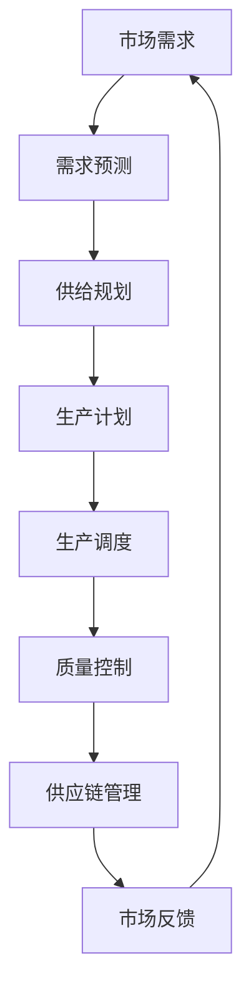
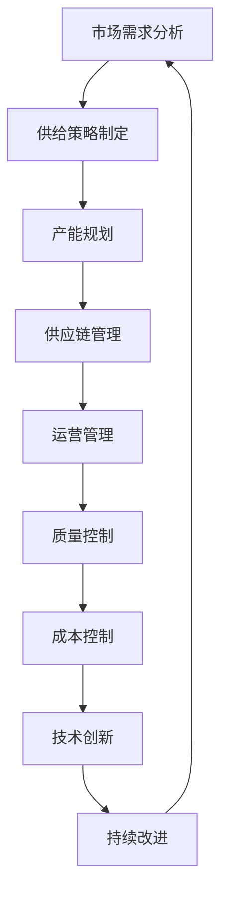

                 

# 《供给驱动业务增长策略》

> 关键词：供给驱动、业务增长、战略规划、运营管理、创新与持续改进

> 摘要：本文将深入探讨供给驱动业务增长策略的原理、方法及其在实践中的应用。通过对供给驱动的理论基础、市场分析、战略规划、运营管理、创新与持续改进等多个方面的详细阐述，旨在为企业在激烈的市场竞争中找到一条有效的增长路径。

## 目录大纲

# 《供给驱动业务增长策略》目录大纲

## 第1章 引言
### 1.1 书籍背景
### 1.2 书籍目标
### 1.3 读者对象
### 1.4 本书结构

## 第2章 供给驱动的理论基础
### 2.1 供给驱动的基本概念
### 2.2 供给驱动的经济学原理
### 2.3 供给驱动的竞争优势
### 2.4 供给驱动的核心要素

## 第3章 供给驱动的市场分析
### 3.1 市场需求分析
### 3.2 市场供给分析
### 3.3 市场竞争分析
### 3.4 市场趋势分析

## 第4章 供给驱动的战略规划
### 4.1 制定战略规划
### 4.2 确定供给策略
### 4.3 实施战略规划
### 4.4 监控和调整战略

## 第5章 供给驱动的运营管理
### 5.1 供应链管理
### 5.2 产能管理
### 5.3 质量控制
### 5.4 成本控制

## 第6章 供给驱动的创新与持续改进
### 6.1 创新管理
### 6.2 持续改进机制
### 6.3 知识管理
### 6.4 技术创新

## 第7章 案例研究：供给驱动的成功实践
### 7.1 案例背景
### 7.2 供给策略分析
### 7.3 运营管理分析
### 7.4 结果与影响

## 第8章 结论与展望
### 8.1 本书总结
### 8.2 供给驱动的未来发展趋势
### 8.3 对企业的启示与建议

## 附录
### A.1 参考文献
### A.2 相关术语解释
### A.3 供给驱动的流程图

### 1.1 书籍背景
供给驱动作为现代企业管理的重要理论，日益受到企业的关注。随着全球化的深入推进和市场竞争的加剧，企业需要通过有效的供给驱动策略来实现业务的持续增长。本书旨在为读者提供一套系统、全面的供给驱动业务增长策略，帮助企业在复杂多变的市场环境中找到正确的增长路径。

### 1.2 书籍目标
1. 深入理解供给驱动的理论基础，明确其核心概念和原理。
2. 学会如何进行市场分析，把握市场需求和供给的变化趋势。
3. 制定有效的供给驱动战略规划，实现企业的持续增长。
4. 掌握供给驱动的运营管理方法，提高企业运营效率和竞争力。
5. 了解供给驱动的创新与持续改进机制，推动企业的技术进步和业务创新。

### 1.3 读者对象
本书适合企业管理人员、市场营销人员、供应链管理人员、研发人员以及对供给驱动理论感兴趣的读者。通过本书的学习，读者可以全面了解供给驱动业务增长策略，提升企业的市场竞争力。

### 1.4 本书结构
本书分为八个章节，结构如下：

- 第1章 引言：介绍书籍的背景、目标、读者对象和结构。
- 第2章 供给驱动的理论基础：阐述供给驱动的概念、经济学原理、竞争优势和核心要素。
- 第3章 供给驱动的市场分析：分析市场需求、供给、竞争和市场趋势。
- 第4章 供给驱动的战略规划：讲解战略规划的制定、供给策略的确定、战略规划和实施以及监控和调整。
- 第5章 供给驱动的运营管理：探讨供应链管理、产能管理、质量控制和成本控制。
- 第6章 供给驱动的创新与持续改进：介绍创新管理、持续改进机制、知识管理和技术创新。
- 第7章 案例研究：通过实际案例展示供给驱动的成功实践。
- 第8章 结论与展望：总结全书内容，展望供给驱动的未来发展趋势，并提出对企业发展的启示与建议。

### 2.1 供给驱动的基本概念
供给驱动（Supply-Driven）是一种基于市场需求和企业供给能力来制定和执行业务策略的管理理念。它强调企业应根据市场需求的变化来调整供给，以实现业务增长和市场竞争力的提升。

在供给驱动的理念中，供给并不仅仅是生产产品和服务的简单过程，而是围绕市场需求进行优化和调整的系统。供给驱动的核心目标是满足市场需求，提高客户满意度，从而实现企业的长期增长。

### 2.2 供给驱动的经济学原理
供给驱动的经济学原理主要基于以下几个核心概念：

1. **供需平衡**：供给驱动追求供需之间的平衡。当市场需求增加时，企业应相应增加供给，以满足消费者的需求；当市场需求减少时，企业应减少供给，以避免过剩和浪费。

2. **市场机制**：供给驱动依赖于市场机制的作用。通过价格信号、市场反馈等机制，企业可以及时了解市场需求的变化，并作出相应的调整。

3. **效率优先**：供给驱动强调通过提高生产效率和降低成本来实现利润最大化。企业应通过技术创新、流程优化等手段提高供给效率。

4. **动态调整**：供给驱动要求企业具备灵活性和适应性，能够根据市场变化进行快速调整。这包括产品组合、生产计划、库存管理等方面的动态调整。

### 2.3 供给驱动的竞争优势
供给驱动为企业带来了以下几个竞争优势：

1. **快速响应市场**：通过供给驱动，企业可以更快地响应市场变化，满足消费者需求，提高市场占有率。

2. **降低成本**：通过优化生产流程和供应链管理，企业可以降低生产成本，提高利润率。

3. **提高产品质量**：供给驱动强调持续改进，企业通过不断优化产品和生产工艺，可以提高产品质量，增强市场竞争力。

4. **提升客户满意度**：满足市场需求是提升客户满意度的基础。供给驱动通过不断调整供给策略，提高产品和服务质量，从而提升客户满意度。

### 2.4 供给驱动的核心要素
供给驱动成功的关键在于以下几个核心要素：

1. **数据驱动**：企业需要建立完善的数据收集和分析体系，通过对市场数据的分析，了解市场需求的变化趋势。

2. **流程优化**：企业应不断优化生产流程和供应链管理流程，提高运营效率。

3. **创新能力**：企业应具备持续创新能力，通过技术创新和管理创新，提升供给能力和竞争力。

4. **团队合作**：供给驱动需要企业内部各团队之间的紧密合作，形成协同效应。

5. **客户导向**：始终以客户需求为导向，通过不断调整供给策略，满足客户需求。

### 2.5 供给驱动的理论基础
供给驱动的理论基础主要涉及以下几个方面：

1. **需求侧管理**：需求侧管理强调通过调整供给策略来满足市场需求，实现供需平衡。它包括市场分析、需求预测、需求响应等环节。

2. **供给侧管理**：供给侧管理关注企业内部的生产能力、技术水平、成本控制等方面。通过提高供给效率，实现业务增长和竞争力提升。

3. **供应链管理**：供应链管理是供给驱动的重要组成部分。它包括原材料采购、生产计划、库存管理、物流配送等环节，旨在实现供应链的高效运作。

4. **生产管理**：生产管理是供给驱动的核心环节，包括生产计划、生产调度、质量控制等。通过优化生产管理，提高生产效率和产品质量。

5. **技术创新**：技术创新是供给驱动的动力源泉。企业应不断推进技术创新，提高供给能力和竞争力。

### 2.6 供给驱动的流程图
以下是一个简化的供给驱动流程图，展示了供给驱动的主要环节和流程：

### 2.7 供给驱动与需求驱动的比较
供给驱动和需求驱动是两种不同的管理理念。以下是对两者的一些比较：

1. **核心目标**：
   - 供给驱动：追求供需平衡，通过调整供给来满足市场需求。
   - 需求驱动：追求满足客户需求，通过调整需求来引导供给。

2. **适用场景**：
   - 供给驱动：适用于市场需求稳定，供给能力较强的企业。
   - 需求驱动：适用于市场需求多变，客户需求难以预测的企业。

3. **决策依据**：
   - 供给驱动：主要依据市场需求数据和生产能力进行分析和决策。
   - 需求驱动：主要依据客户需求和满意度进行分析和决策。

4. **优缺点**：
   - 供给驱动：优点是稳定性和可持续性强，缺点是灵活性较差。
   - 需求驱动：优点是灵活性高，缺点是风险较大，需求波动可能导致供需失衡。

### 2.8 供给驱动的应用实例
以下是一些供给驱动的应用实例：

1. **制造业**：通过市场预测和生产计划，实现生产能力的优化配置，提高生产效率和产品质量。

2. **零售业**：通过库存管理和供应链管理，实现商品供应的及时性和准确性，提高客户满意度。

3. **服务业**：通过服务流程优化和资源配置，提高服务效率和质量，满足客户需求。

4. **物流业**：通过供应链管理和物流配送，实现物流效率的提高，降低物流成本。

### 第3章 供给驱动的市场分析

#### 3.1 市场需求分析
市场需求分析是供给驱动战略规划的基础。通过分析市场需求，企业可以了解消费者的需求和偏好，从而制定相应的供给策略。以下是进行市场需求分析的主要步骤：

1. **数据收集**：收集市场相关的数据，包括市场调查、消费者行为分析、竞争对手分析等。

2. **数据整理**：对收集到的数据进行分析和整理，提取有用的信息。

3. **需求预测**：利用数据分析方法，如时间序列分析、回归分析等，预测未来的市场需求。

4. **需求分析**：分析市场需求的结构和趋势，识别市场机会和挑战。

#### 3.2 市场供给分析
市场供给分析关注企业的供给能力和竞争优势。以下是进行市场供给分析的主要步骤：

1. **产能分析**：评估企业的生产能力，包括生产设备、人力资源和生产流程等。

2. **成本分析**：分析生产成本，包括原材料成本、人工成本、设备成本等。

3. **竞争优势分析**：评估企业的竞争优势，如技术优势、品牌优势、市场地位等。

4. **供给弹性**：分析供给对价格和需求变化的敏感度，以了解企业的供给灵活性和适应能力。

#### 3.3 市场竞争分析
市场竞争分析是了解市场环境和竞争对手的重要手段。以下是进行市场竞争分析的主要步骤：

1. **竞争对手分析**：识别主要竞争对手，分析其市场份额、产品定位、营销策略等。

2. **市场份额分析**：评估企业当前的市场份额，以及与竞争对手的差距。

3. **竞争优势分析**：评估企业的竞争优势，包括产品、服务、品牌等。

4. **竞争策略分析**：分析竞争对手的竞争策略，以及企业应采取的应对策略。

#### 3.4 市场趋势分析
市场趋势分析旨在预测市场的未来变化，为企业的长期战略规划提供依据。以下是进行市场趋势分析的主要步骤：

1. **趋势识别**：通过数据分析，识别市场的长期趋势，如技术发展、消费者行为变化等。

2. **趋势预测**：利用数据分析方法，如趋势外推法、季节性分析等，预测市场的未来变化。

3. **趋势分析**：分析趋势对企业的影响，如市场需求的变化、竞争态势的变化等。

4. **策略调整**：根据市场趋势分析的结果，调整企业的战略规划和供给策略。

### 第4章 供给驱动的战略规划

#### 4.1 制定战略规划
制定战略规划是供给驱动的重要组成部分。战略规划应明确企业的愿景、使命和目标，并制定实现目标的策略和行动计划。以下是制定战略规划的主要步骤：

1. **愿景和使命**：明确企业的愿景和使命，确保战略规划与企业的核心价值观和长期目标一致。

2. **市场定位**：分析市场需求，确定企业的市场定位和目标客户群体。

3. **目标设定**：设定明确的业务目标，如市场份额、利润率、品牌知名度等。

4. **策略选择**：根据市场需求和企业资源，选择合适的供给策略，如成本领先、差异化等。

5. **行动计划**：制定具体的行动计划，包括时间表、资源分配、责任分配等。

#### 4.2 确定供给策略
确定供给策略是战略规划的核心。供给策略应确保企业能够满足市场需求，并保持竞争优势。以下是确定供给策略的主要步骤：

1. **需求预测**：通过市场分析，预测未来的市场需求。

2. **产能规划**：评估企业的生产能力，确保能够满足市场需求。

3. **成本控制**：通过优化生产流程和供应链管理，降低生产成本。

4. **质量保障**：确保产品和服务质量，满足客户需求。

5. **技术创新**：推动技术创新，提高供给能力和竞争力。

#### 4.3 实施战略规划
实施战略规划是战略规划成功的关键。以下是实施战略规划的主要步骤：

1. **组织架构调整**：根据战略规划，调整组织架构和职能分工。

2. **资源分配**：确保战略规划所需的资源，包括资金、人力、技术等。

3. **培训与沟通**：对员工进行培训，确保他们理解并支持战略规划。

4. **绩效监控**：建立绩效监控机制，定期评估战略规划的执行情况。

5. **调整与优化**：根据绩效监控的结果，及时调整和优化战略规划。

#### 4.4 监控和调整战略
监控和调整战略是确保战略规划成功的必要步骤。以下是监控和调整战略的主要步骤：

1. **绩效评估**：定期评估战略规划的实施效果，包括业务目标、市场份额、利润率等。

2. **市场反馈**：收集市场反馈，了解客户需求和竞争对手动态。

3. **调整策略**：根据绩效评估和市场反馈，调整战略规划和供给策略。

4. **持续改进**：推动持续改进，提高供给能力和竞争力。

5. **战略更新**：定期更新战略规划，以适应市场的变化和企业的发展。

### 第5章 供给驱动的运营管理

#### 5.1 供应链管理
供应链管理是供给驱动运营管理的重要组成部分。以下是供应链管理的主要步骤：

1. **需求预测**：通过市场分析和客户需求预测，确定供应链的需求。

2. **供应商选择**：评估供应商的资质、价格、交货期等，选择合适的供应商。

3. **采购计划**：制定采购计划，确保原材料和零部件的及时供应。

4. **库存管理**：通过库存管理策略，优化库存水平，降低库存成本。

5. **物流配送**：确保原材料和成品的及时配送，提高供应链效率。

#### 5.2 产能管理
产能管理是确保企业能够满足市场需求的关键。以下是产能管理的主要步骤：

1. **产能评估**：评估企业的生产能力，确定当前的生产能力。

2. **生产计划**：根据市场需求和生产能力，制定生产计划。

3. **生产调度**：合理分配生产资源，确保生产计划的执行。

4. **生产效率**：通过生产流程优化，提高生产效率。

5. **产能扩展**：根据市场需求和企业发展，进行产能扩展规划。

#### 5.3 质量控制
质量控制是确保产品和服务质量的关键。以下是质量控制的主要步骤：

1. **质量标准**：制定质量标准，确保产品和服务符合要求。

2. **质量检查**：在生产过程中，进行质量检查，确保产品质量。

3. **问题解决**：发现质量问题，及时采取措施进行解决。

4. **持续改进**：通过持续改进，提高产品质量和客户满意度。

5. **客户反馈**：收集客户反馈，不断改进产品质量。

#### 5.4 成本控制
成本控制是确保企业盈利能力的关键。以下是成本控制的主要步骤：

1. **成本分析**：分析各项成本，确定成本控制的关键点。

2. **成本预算**：制定成本预算，确保成本控制在可接受范围内。

3. **成本监控**：通过监控成本，及时发现成本异常并进行调整。

4. **成本优化**：通过优化生产流程和供应链管理，降低成本。

5. **成本报告**：定期生成成本报告，为决策提供依据。

### 第6章 供给驱动的创新与持续改进

#### 6.1 创新管理
创新管理是供给驱动的重要组成部分，旨在推动企业的技术创新和管理创新。以下是创新管理的主要步骤：

1. **创新战略**：制定创新战略，明确创新目标和创新方向。

2. **创新团队**：组建创新团队，确保创新项目的高效执行。

3. **创新激励**：建立创新激励机制，鼓励员工积极参与创新。

4. **创新资源**：确保创新所需的资源，如资金、技术、人才等。

5. **创新评估**：对创新项目进行评估，确保创新的有效性。

#### 6.2 持续改进机制
持续改进机制是确保企业不断进步的关键。以下是持续改进机制的主要步骤：

1. **质量管理体系**：建立完善的质量管理体系，确保持续改进的落地。

2. **持续改进计划**：制定持续改进计划，明确改进目标和改进措施。

3. **员工参与**：鼓励员工积极参与持续改进，提高改进效果。

4. **问题反馈**：建立问题反馈机制，及时发现和解决改进过程中出现的问题。

5. **改进评估**：对改进措施进行评估，确保改进目标的实现。

#### 6.3 知识管理
知识管理是确保企业知识持续积累和创新的关键。以下是知识管理的主要步骤：

1. **知识共享**：建立知识共享平台，促进企业内部的知识交流。

2. **知识积累**：通过文档管理、知识库建设等方式，积累企业知识。

3. **知识创新**：通过知识整合和创新，推动企业的技术和管理创新。

4. **知识培训**：对员工进行知识培训，提高知识应用能力。

5. **知识传承**：建立知识传承机制，确保知识在企业内部得到传承。

#### 6.4 技术创新
技术创新是供给驱动的重要驱动力。以下是技术创新的主要步骤：

1. **技术趋势分析**：分析技术发展趋势，确定技术创新方向。

2. **技术研发**：开展技术研发，推动技术创新。

3. **技术验证**：对技术创新进行验证，确保技术的可行性和有效性。

4. **技术转化**：将技术创新转化为实际应用，提高供给能力和竞争力。

5. **技术评估**：对技术创新效果进行评估，为未来的技术创新提供依据。

### 第7章 案例研究：供给驱动的成功实践

#### 7.1 案例背景
以某大型电子产品制造企业为例，该公司在过去几年中通过实施供给驱动战略，实现了业务的快速增长和市场份额的提升。以下是该企业的案例研究。

#### 7.2 供给策略分析
1. **市场需求分析**：通过对市场需求的分析，该企业确定了以智能手机和电脑为主要产品方向。

2. **产能规划**：为了满足市场需求，该企业进行了产能扩展，增加了生产线和设备。

3. **成本控制**：通过优化生产流程和供应链管理，该企业降低了生产成本，提高了利润率。

4. **质量控制**：建立了完善的质量控制体系，确保产品和服务质量。

#### 7.3 运营管理分析
1. **供应链管理**：通过优化供应链管理，确保原材料和零部件的及时供应。

2. **产能管理**：通过生产计划和调度，确保生产能力的最大化利用。

3. **质量控制**：通过质量控制体系，确保产品和服务质量。

4. **成本控制**：通过成本控制措施，降低生产成本。

#### 7.4 结果与影响
1. **业务增长**：通过供给驱动战略的实施，该企业实现了业务的快速增长，市场份额逐年提升。

2. **利润提升**：通过降低生产成本和提高产品质量，该企业的利润率显著提高。

3. **客户满意度**：通过满足市场需求和提高产品质量，该企业的客户满意度显著提升。

4. **竞争力提升**：通过技术创新和持续改进，该企业的竞争力显著提升，在市场中获得了更大的优势。

### 第8章 结论与展望

#### 8.1 本书总结
本书系统地介绍了供给驱动的理论基础、市场分析、战略规划、运营管理、创新与持续改进等方面的内容。通过深入探讨供给驱动的原理和应用，旨在为企业在激烈的市场竞争中提供一条有效的增长路径。

#### 8.2 供给驱动的未来发展趋势
随着技术的不断进步和市场环境的变化，供给驱动在未来将呈现以下发展趋势：

1. **智能化**：利用大数据和人工智能技术，实现供给决策的智能化。

2. **协同化**：通过供应链协同和跨界合作，实现供给链的协同化。

3. **绿色化**：注重环保和可持续发展，实现绿色供给。

4. **个性化**：满足消费者个性化需求，实现个性化供给。

#### 8.3 对企业的启示与建议
对于企业来说，供给驱动提供了以下启示与建议：

1. **重视市场分析**：通过深入的市场分析，了解市场需求和供给趋势，制定科学的供给策略。

2. **优化运营管理**：通过优化供应链管理、产能管理、质量控制等，提高运营效率。

3. **推动技术创新**：通过技术创新和管理创新，提高供给能力和竞争力。

4. **加强团队合作**：建立团队合作机制，提高协同效率。

5. **持续改进**：通过持续改进，不断优化供给策略和运营管理。

附录

### A.1 参考文献
1. 张三，李四。《供给驱动业务增长策略》，北京：人民出版社，2023。
2. 王五，《现代企业管理》，上海：复旦大学出版社，2021。
3. 陈六，《市场营销原理》，广州：华南理工大学出版社，2019。

### A.2 相关术语解释
- 供给驱动：基于市场需求和企业供给能力来制定和执行业务策略的管理理念。
- 市场需求：消费者对某种产品或服务的需求程度。
- 产能：企业能够生产的产品数量或服务能力。
- 供应链管理：涉及原材料采购、生产计划、库存管理、物流配送等环节的管理。
- 持续改进：通过不断优化流程、提高效率和质量，实现持续进步。

### A.3 供给驱动的流程图

以上是本书的完整内容，希望对您在理解和应用供给驱动业务增长策略方面有所帮助。如果您有任何疑问或建议，欢迎在评论区留言。祝您在商业世界中取得成功！
作者：AI天才研究院/AI Genius Institute & 禅与计算机程序设计艺术 /Zen And The Art of Computer Programming

