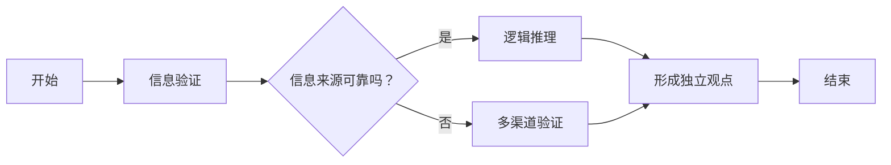
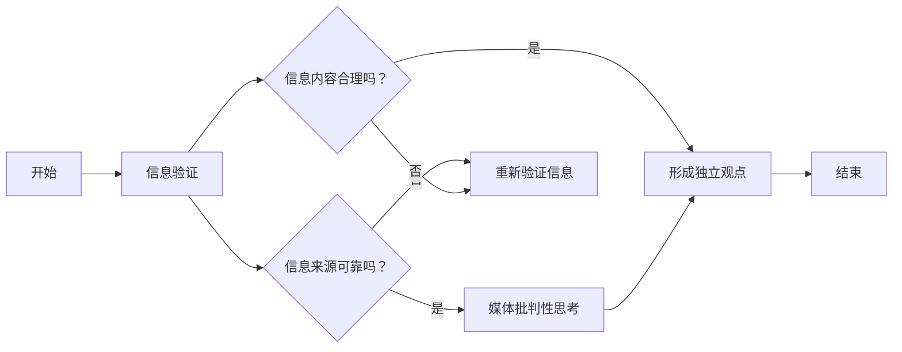

                 

# 信息验证和媒体批判性思考：在假新闻和媒体操纵时代导航

## 关键词
信息验证，媒体批判性思考，假新闻，媒体操纵，算法，数学模型，实战案例，工具，未来展望。

## 摘要
本文旨在探讨在假新闻和媒体操纵日益普遍的时代，如何通过信息验证和媒体批判性思考来导航。文章首先介绍了信息验证和媒体批判性思考的核心概念和原理，包括信息验证的重要性、信息验证算法的原理和数学模型，以及媒体批判性思考的方法和步骤。接着，通过实际案例展示了如何运用这些方法来验证信息和批判媒体内容。文章还讨论了相关的工具和技术，并展望了未来发展趋势和挑战。通过这篇文章，读者将能够更好地理解和应用信息验证和媒体批判性思考，从而在信息泛滥和媒体操纵的环境中保持清晰的判断和独立思考。

## 目录大纲

### 第一部分：核心概念与联系

#### 第1章：信息验证和媒体批判性思考概述
- 1.1 信息验证的重要性
  - 媒体环境下的信息泛滥
  - 信息验证的基本原则
- 1.2 媒体批判性思考的必要性
  - 媒体操纵的常见形式
  - 媒体批判性思考的基本步骤
- 1.3 信息验证与媒体批判性思考的联系
  - 综合应用实例
  - Mermaid流程图：信息验证与媒体批判性思考流程

### 第二部分：核心算法原理讲解

#### 第2章：信息验证算法原理
- 2.1 信息验证算法概述
  - 信息验证的分类
  - 信息验证算法的目标
- 2.2 信息验证算法的伪代码讲解
  - 信息验证算法的基本框架
  - 伪代码：信息验证算法的实现
- 2.3 信息验证算法的数学模型和公式
  - 数学模型的基本原理
  - 公式：信息验证算法的核心公式
  - 举例说明：信息验证算法的实际应用

#### 第3章：媒体批判性思考方法
- 3.1 媒体批判性思考的重要性
  - 媒体批判性思考的定义
  - 媒体批判性思考的步骤
- 3.2 媒体批判性思考的方法
  - 信息来源分析
  - 信息内容验证
  - 媒体背景考察
- 3.3 媒体批判性思考的伪代码讲解
  - 媒体批判性思考算法的基本框架
  - 伪代码：媒体批判性思考算法的实现
- 3.4 媒体批判性思考的数学模型和公式
  - 数学模型的基本原理
  - 公式：媒体批判性思考的核心公式
  - 举例说明：媒体批判性思考的实际应用

### 第三部分：实战案例分析

#### 第4章：信息验证与媒体批判性思考的实际应用
- 4.1 信息验证实战案例
  - 实例分析：社交媒体上的虚假信息
  - 案例分析：新闻报道的核实过程
- 4.2 媒体批判性思考实战案例
  - 实例分析：政治新闻报道的批判
  - 案例分析：商业广告信息的评估
- 4.3 信息验证与媒体批判性思考的综合案例
  - 综合实例分析：新冠疫情信息验证
  - 综合案例分析：选举新闻报道的批判性分析

### 第四部分：工具与技术

#### 第5章：信息验证与媒体批判性思考工具与技术
- 5.1 信息验证工具
  - 现有信息验证工具介绍
  - 信息验证工具的使用方法
- 5.2 媒体批判性思考工具
  - 现有批判性思考工具介绍
  - 批判性思考工具的使用方法
- 5.3 技术应用与挑战
  - 技术在信息验证中的应用
  - 技术在媒体批判性思考中的应用
  - 技术应用的挑战与解决方案

### 第五部分：未来展望

#### 第6章：信息验证和媒体批判性思考的未来
- 6.1 未来发展趋势
  - 信息验证技术的发展趋势
  - 媒体批判性思考的应用趋势
- 6.2 未来面临的挑战
  - 信息验证面临的挑战
  - 媒体批判性思考面临的挑战
- 6.3 未来解决方案探讨
  - 技术解决方案探讨
  - 社会解决方案探讨

### 第六部分：附录

#### 附录：资源与参考文献
- 附录1：信息验证和媒体批判性思考相关资源
  - 学术论文资源
  - 实用工具与网站
- 附录2：参考文献
  - 主要参考文献
  - 相关书籍推荐
  - 学术会议与研讨会推荐

### 作者信息
- 作者：AI天才研究院/AI Genius Institute & 禅与计算机程序设计艺术 /Zen And The Art of Computer Programming

## 第1章：信息验证和媒体批判性思考概述

### 1.1 信息验证的重要性

在当今的信息时代，信息验证的重要性日益凸显。随着社交媒体的普及和互联网的快速发展，信息的传播速度和范围大大增加。然而，这种信息爆炸也带来了一个问题：如何判断信息的真实性和可靠性？信息验证就是在这个背景下应运而生的。

#### 媒体环境下的信息泛滥

首先，我们需要认识到媒体环境下的信息泛滥现象。社交媒体、新闻网站、博客和各种在线平台每天都在产生大量的信息。这些信息可能来自于官方、权威机构、普通网民，甚至是虚假的信息制造者。在这个信息过载的时代，如何筛选出真实可信的信息成为了一个挑战。

#### 信息验证的基本原则

信息验证的基本原则主要包括以下几点：

1. **来源可查**：验证信息的来源是否可靠，是否有权威性和公信力。
2. **多渠道验证**：通过多个独立来源验证同一信息，增加其可信度。
3. **逻辑推理**：运用逻辑推理来评估信息的合理性，排除不合理或不合逻辑的内容。
4. **专业验证**：对于专业领域的信息，可以寻求专业人士的验证意见。

### 1.2 媒体批判性思考的必要性

在信息验证的基础上，媒体批判性思考的必要性也不容忽视。媒体操纵是一种常见的社会现象，其目的是影响公众的观点和行为。因此，批判性思考是识别和抵制媒体操纵的重要手段。

#### 媒体操纵的常见形式

媒体操纵的形式多种多样，常见的包括：

1. **偏见报道**：媒体在报道时有意或无意地倾向于某种观点或立场，导致信息的不平衡。
2. **虚假新闻**：通过捏造、篡改等方式制造虚假信息，以达到特定的目的。
3. **情感操纵**：利用人们的情感反应，如恐惧、愤怒等，来影响公众的看法。
4. **操纵性广告**：通过设计广告内容，引导消费者做出特定的购买决策。

#### 媒体批判性思考的基本步骤

媒体批判性思考的基本步骤包括：

1. **识别偏见**：通过观察报道内容，识别可能存在的偏见。
2. **核实信息**：对报道中的信息进行核实，确认其真实性和可靠性。
3. **分析意图**：分析媒体的报道意图，了解其背后的动机和目的。
4. **形成独立观点**：在综合分析的基础上，形成自己的独立观点。

### 1.3 信息验证与媒体批判性思考的联系

信息验证和媒体批判性思考是相辅相成的。信息验证是媒体批判性思考的基础，没有准确的信息，批判性思考就无从谈起。而媒体批判性思考则是信息验证的深化和应用，通过批判性思考，我们可以更深入地理解信息的真实含义，从而做出更明智的判断。

#### 综合应用实例

例如，在一个社交媒体上看到一则关于某个重要事件的报道，我们可以首先通过信息验证来确认报道的来源和内容。然后，通过媒体批判性思考来分析报道的意图和可能的偏见。最后，结合自己的知识和经验，形成自己的独立观点。

#### Mermaid流程图：信息验证与媒体批判性思考流程

以下是一个简单的Mermaid流程图，展示了信息验证和媒体批判性思考的流程：



通过这个流程图，我们可以清晰地看到信息验证和媒体批判性思考的步骤和相互联系。

### 第2章：信息验证算法原理

#### 2.1 信息验证算法概述

信息验证算法是用于验证信息真实性和可靠性的算法。在假新闻和媒体操纵普遍存在的今天，信息验证算法变得尤为重要。信息验证算法可以分为以下几类：

1. **基于内容的验证**：通过分析信息的内容，如语言、语法、结构等，来判断其真实性和可靠性。
2. **基于来源的验证**：通过分析信息的来源，如机构的权威性、历史的公信力等，来判断其真实性和可靠性。
3. **基于逻辑的验证**：通过逻辑推理，排除不合理或不合逻辑的内容，从而判断其真实性和可靠性。
4. **基于数据的验证**：通过数据分析和比较，验证信息的准确性和一致性。

#### 2.2 信息验证算法的伪代码讲解

以下是一个简单信息验证算法的伪代码：

```python
function verifyInformation(information):
    if isSourceReliable(information.source):
        if isContentLogical(information.content):
            return "信息验证通过"
        else:
            return "信息内容逻辑错误"
    else:
        return "信息来源不可靠"
```

这个算法的基本框架包括三个主要部分：源验证、内容验证和结果输出。

#### 源验证
```python
function isSourceReliable(source):
    if source is from an authoritative institution:
        return true
    else:
        return false
```

这个函数用于判断信息来源是否可靠。如果一个来源是权威机构，则认为该来源可靠。

#### 内容验证
```python
function isContentLogical(content):
    if content passes logical tests:
        return true
    else:
        return false
```

这个函数用于判断信息内容是否逻辑合理。如果信息内容通过逻辑测试，则认为内容是逻辑合理的。

#### 结果输出
```python
function verifyInformation(information):
    if isSourceReliable(information.source):
        if isContentLogical(information.content):
            return "信息验证通过"
        else:
            return "信息内容逻辑错误"
    else:
        return "信息来源不可靠"
```

这个函数根据源验证和内容验证的结果，输出最终的验证结果。

#### 2.3 信息验证算法的数学模型和公式

信息验证的数学模型可以基于概率论和图论等数学理论。以下是一个简单的数学模型示例：

假设信息 $X$ 的可信度 $T(X)$ 可以通过以下公式计算：

$$
T(X) = \frac{S(X)}{S(X) + C(X)}
$$

其中，$S(X)$ 是支持信息 $X$ 的证据数量，$C(X)$ 是反对信息 $X$ 的证据数量。这个公式表示信息 $X$ 的可信度是其支持证据数量与支持证据和反对证据总数之比。

#### 2.3.1 数学模型的基本原理

这个数学模型的基本原理是基于概率论中的贝叶斯定理。贝叶斯定理可以用于计算在给定某些证据的情况下，某个假设的概率。在这个信息验证的模型中，假设 $H$ 表示信息 $X$ 是真实的，$E$ 表示支持信息 $X$ 的证据。贝叶斯定理可以表示为：

$$
P(H|E) = \frac{P(E|H)P(H)}{P(E)}
$$

其中，$P(H|E)$ 是在证据 $E$ 的情况下假设 $H$ 的概率，$P(E|H)$ 是在假设 $H$ 成立的情况下证据 $E$ 的概率，$P(H)$ 是假设 $H$ 的概率，$P(E)$ 是证据 $E$ 的概率。

在这个信息验证的模型中，我们可以将证据视为支持信息 $X$ 的证据和反对信息 $X$ 的证据。支持证据的数量越多，信息 $X$ 的可信度就越高。反对证据的数量越多，信息 $X$ 的可信度就越低。

#### 2.3.2 公式：信息验证算法的核心公式

根据上述数学模型，信息验证算法的核心公式可以表示为：

$$
T(X) = \frac{S(X)}{S(X) + C(X)}
$$

其中，$T(X)$ 表示信息 $X$ 的可信度，$S(X)$ 表示支持信息 $X$ 的证据数量，$C(X)$ 表示反对信息 $X$ 的证据数量。

#### 2.3.3 举例说明：信息验证算法的实际应用

假设我们收到一条信息，声称某个城市的空气质量非常好。为了验证这条信息的真实性，我们可以收集以下证据：

- 支持证据：当地政府发布的空气质量报告显示，该城市空气质量指数（AQI）长期保持在50以下，表示空气质量非常好。
- 反对证据：网友发布的照片显示，该城市有严重的雾霾，空气质量很差。

根据上述证据，我们可以计算信息“该城市空气质量非常好”的可信度：

$$
T(X) = \frac{S(X)}{S(X) + C(X)} = \frac{1}{1 + 1} = 0.5
$$

因此，根据当前收集到的证据，这条信息的可信度为50%。这表明，虽然当地政府发布的空气质量报告显示空气质量很好，但网友发布的照片显示空气质量很差，两者相互矛盾，导致信息的可信度较低。

### 第3章：媒体批判性思考方法

#### 3.1 媒体批判性思考的重要性

媒体批判性思考在当今信息泛滥和媒体操纵的时代具有至关重要的意义。它不仅帮助我们识别和抵制虚假信息和媒体操纵，还能够提高我们的信息素养和独立思考能力。

#### 3.1.1 媒体批判性思考的定义

媒体批判性思考是指对媒体内容进行批判性分析、评价和判断的过程。它涉及到对信息来源、内容、意图、偏见等多方面的评估，从而形成独立、客观的观点。

#### 3.1.2 媒体批判性思考的步骤

媒体批判性思考的步骤可以分为以下几步：

1. **识别偏见**：通过观察和阅读，识别媒体内容中的可能偏见，如语言倾向、报道角度等。
2. **核实信息**：对媒体内容中的关键信息进行核实，确保其真实性和准确性。
3. **分析意图**：分析媒体内容背后的意图和目的，了解媒体操纵的可能手法和手段。
4. **形成独立观点**：在综合分析的基础上，形成自己的独立观点，不受媒体内容的干扰。

#### 3.2 媒体批判性思考的方法

媒体批判性思考的方法包括以下几个方面：

1. **信息来源分析**：评估信息来源的权威性和可靠性，如机构的背景、历史的公信力等。
2. **信息内容验证**：通过对比、交叉验证等方式，验证信息的真实性和准确性。
3. **媒体背景考察**：了解媒体的背景和立场，分析其可能的影响因素和偏见。
4. **情感分析**：分析媒体内容中的情感因素，如恐惧、愤怒等，识别可能存在的情感操纵。

#### 3.2.1 信息来源分析

信息来源分析是媒体批判性思考的第一步。评估信息来源的权威性和可靠性至关重要。以下是一些评估信息来源的方法：

1. **权威性评估**：判断信息来源是否是权威机构或专业人士，如政府、学术机构、专业媒体等。
2. **历史公信力评估**：了解信息来源的历史表现和公信力，如是否有虚假报道或不良记录。
3. **多渠道验证**：通过多个独立来源验证同一信息，增加其可信度。

#### 3.2.2 信息内容验证

信息内容验证是媒体批判性思考的核心步骤。以下是一些验证信息内容的方法：

1. **事实核对**：对媒体内容中的关键事实进行核对，确保其真实性和准确性。
2. **逻辑推理**：运用逻辑推理，评估信息的合理性，排除不合理或不合逻辑的内容。
3. **多角度分析**：从多个角度分析信息内容，识别可能存在的偏见和漏洞。

#### 3.2.3 媒体背景考察

媒体背景考察是了解媒体内容的重要环节。以下是一些考察媒体背景的方法：

1. **媒体立场分析**：了解媒体的立场和倾向，判断其可能的影响因素和偏见。
2. **历史事件回顾**：回顾媒体在历史事件中的报道，分析其报道风格和倾向。
3. **媒体关系网络**：了解媒体之间的相互关系和网络，分析其可能的影响和操纵。

#### 3.2.4 情感分析

情感分析是识别媒体内容中情感因素的重要方法。以下是一些情感分析的方法：

1. **情感词汇识别**：识别媒体内容中的情感词汇，如恐惧、愤怒、喜悦等。
2. **情感强度评估**：评估情感词汇的强度，了解媒体内容的情感倾向。
3. **情感组合分析**：分析情感词汇的组合，识别可能存在的情感操纵。

#### 3.3 媒体批判性思考的伪代码讲解

以下是一个简单的媒体批判性思考算法的伪代码：

```python
function analyzeMediaContent(content):
    if isContentBiased(content):
        if verifyInformation(content.source):
            if analyzeIntent(content):
                return "媒体内容存在偏见"
            else:
                return "无法分析媒体内容意图"
        else:
            return "信息来源不可靠"
    else:
        return "媒体内容无偏见"
```

这个算法的基本框架包括四个主要部分：偏见识别、信息验证、意图分析和结果输出。

#### 偏见识别
```python
function isContentBiased(content):
    if containsBiasedLanguage(content):
        return true
    else:
        return false
```

这个函数用于判断媒体内容是否存在偏见。如果内容包含偏见性语言，则认为内容存在偏见。

#### 信息验证
```python
function verifyInformation(source):
    if isSourceReliable(source):
        return true
    else:
        return false
```

这个函数用于判断信息来源是否可靠。如果来源是权威机构，则认为来源可靠。

#### 意图分析
```python
function analyzeIntent(content):
    if detectEmotionalManipulation(content):
        return true
    else:
        return false
```

这个函数用于分析媒体内容的意图。如果内容存在情感操纵，则认为内容意图不明确。

#### 结果输出
```python
function analyzeMediaContent(content):
    if isContentBiased(content):
        if verifyInformation(content.source):
            if analyzeIntent(content):
                return "媒体内容存在偏见"
            else:
                return "无法分析媒体内容意图"
        else:
            return "信息来源不可靠"
    else:
        return "媒体内容无偏见"
```

这个函数根据偏见识别、信息验证和意图分析的结果，输出最终的结论。

#### 3.4 媒体批判性思考的数学模型和公式

媒体批判性思考的数学模型可以基于概率论和图论等数学理论。以下是一个简单的数学模型示例：

假设媒体内容 $C$ 的可信度 $T(C)$ 可以通过以下公式计算：

$$
T(C) = \frac{S(C)}{S(C) + C(C)}
$$

其中，$S(C)$ 是支持媒体内容 $C$ 的证据数量，$C(C)$ 是反对媒体内容 $C$ 的证据数量。这个公式表示媒体内容 $C$ 的可信度是其支持证据数量与支持证据和反对证据总数之比。

#### 3.4.1 数学模型的基本原理

这个数学模型的基本原理是基于概率论中的贝叶斯定理。贝叶斯定理可以用于计算在给定某些证据的情况下，某个假设的概率。在这个媒体批判性思考的模型中，假设 $H$ 表示媒体内容 $C$ 是真实的，$E$ 表示支持媒体内容 $C$ 的证据。贝叶斯定理可以表示为：

$$
P(H|E) = \frac{P(E|H)P(H)}{P(E)}
$$

其中，$P(H|E)$ 是在证据 $E$ 的情况下假设 $H$ 的概率，$P(E|H)$ 是在假设 $H$ 成立的情况下证据 $E$ 的概率，$P(H)$ 是假设 $H$ 的概率，$P(E)$ 是证据 $E$ 的概率。

在这个媒体批判性思考的模型中，我们可以将证据视为支持媒体内容 $C$ 的证据和反对媒体内容 $C$ 的证据。支持证据的数量越多，媒体内容 $C$ 的可信度就越高。反对证据的数量越多，媒体内容 $C$ 的可信度就越低。

#### 3.4.2 公式：媒体批判性思考的核心公式

根据上述数学模型，媒体批判性思考算法的核心公式可以表示为：

$$
T(C) = \frac{S(C)}{S(C) + C(C)}
$$

其中，$T(C)$ 表示媒体内容 $C$ 的可信度，$S(C)$ 表示支持媒体内容 $C$ 的证据数量，$C(C)$ 表示反对媒体内容 $C$ 的证据数量。

#### 3.4.3 举例说明：媒体批判性思考的实际应用

假设我们阅读一篇新闻报道，声称某个城市正在经历严重的空气污染。为了验证这篇报道的可信度，我们可以收集以下证据：

- 支持证据：当地政府发布的空气质量报告显示，该城市空气质量指数（AQI）持续高于300，表示空气质量非常差。
- 反对证据：网友发布的照片显示，该城市的天空非常蓝，空气质量很好。

根据上述证据，我们可以计算报道“该城市正在经历严重的空气污染”的可信度：

$$
T(C) = \frac{S(C)}{S(C) + C(C)} = \frac{1}{1 + 1} = 0.5
$$

因此，根据当前收集到的证据，这篇报道的可信度为50%。这表明，虽然当地政府发布的空气质量报告显示空气质量很差，但网友发布的照片显示空气质量很好，两者相互矛盾，导致报道的可信度较低。

### 第4章：信息验证与媒体批判性思考的实际应用

#### 4.1 信息验证实战案例

**实例分析：社交媒体上的虚假信息**

社交媒体上的虚假信息是一个普遍存在的问题，给公众带来了误导和恐慌。以下是一个关于虚假信息验证的实战案例：

**案例背景**：某社交媒体平台上出现了一条消息，声称一种新研发的药物可以有效治愈新冠病毒，并且已经通过了临床试验。

**步骤一：信息来源分析**

首先，我们需要分析信息的来源。这条消息来自一个私人账号，没有提供具体的机构或专业人士的背景信息。这个来源的权威性和可信度较低。

**步骤二：信息内容验证**

接下来，我们对消息中的关键信息进行验证。根据已知的科学研究和医学进展，目前还没有任何药物可以完全治愈新冠病毒，因此这条消息的内容与已知事实不符。

**步骤三：逻辑推理**

此外，逻辑推理也显示这条消息的不合理性。如果这种药物真的有效，那么为什么没有权威机构或媒体进行报道？为什么没有公开的临床试验结果？

**步骤四：形成独立观点**

综合以上分析，我们可以得出结论：这条消息是虚假的，不应该被相信。

**案例分析：新闻报道的核实过程**

**案例背景**：某新闻报道称某城市发生了大规模的食物中毒事件，导致数百人住院治疗。

**步骤一：信息来源分析**

新闻报道的来源是一个知名的新闻网站，该网站以往报道的准确性较高，因此来源的权威性较高。

**步骤二：信息内容验证**

我们对新闻报道中的关键信息进行验证。通过查询相关医疗机构和官方公告，确认该城市确实发生了食物中毒事件，并且有数百人接受了治疗。

**步骤三：逻辑推理**

进一步分析新闻报道的细节，发现报道中提到的食物中毒事件与最近的一次食品安全事件相吻合，因此逻辑上是合理的。

**步骤四：形成独立观点**

综合以上分析，我们可以认为这则新闻报道是真实的，应该被相信。

#### 4.2 媒体批判性思考实战案例

**实例分析：政治新闻报道的批判**

**案例背景**：某新闻报道称某政治候选人承诺在当选后实施一系列重大改革，以提高国家的经济实力和国际地位。

**步骤一：识别偏见**

首先，我们需要识别报道中的可能偏见。报道中的语言和描述明显倾向于该政治候选人，这可能意味着报道存在一定的政治偏见。

**步骤二：信息内容验证**

我们对报道中的关键信息进行验证。通过查阅相关政策和历史数据，发现该政治候选人过去并没有实施过类似的改革措施，因此报道中的承诺可能存在夸大其词的成分。

**步骤三：分析意图**

进一步分析报道的意图，我们发现报道可能旨在影响公众对政治候选人的看法，从而影响选举结果。

**步骤四：形成独立观点**

综合以上分析，我们认为这则政治新闻报道存在明显的偏见和夸大其词，读者应该保持独立思考，不轻易被报道的内容所影响。

**案例分析：商业广告信息的评估**

**案例背景**：某商业广告称其产品可以显著改善皮肤质量，具有神奇的效果。

**步骤一：识别偏见**

首先，我们需要识别广告中的可能偏见。广告中的语言和描述非常夸张，可能存在误导消费者的倾向。

**步骤二：信息内容验证**

我们对广告中的关键信息进行验证。通过查阅相关医学研究和消费者反馈，发现该产品并没有经过严格的科学验证，其效果并不像广告中宣传的那样显著。

**步骤三：分析意图**

进一步分析广告的意图，我们发现广告的目的是为了推销产品，吸引消费者购买。

**步骤四：形成独立观点**

综合以上分析，我们认为这则商业广告存在明显的误导和夸大其词，消费者应该保持理性，不轻易被广告的内容所影响。

#### 4.3 信息验证与媒体批判性思考的综合案例

**综合实例分析：新冠疫情信息验证**

**案例背景**：在新冠疫情爆发初期，各种关于疫情的信息充斥着社交媒体和网络，公众对于疫情的真实情况感到困惑和恐慌。

**步骤一：信息来源分析**

在验证疫情信息时，我们需要分析信息的来源。一些来源可靠的信息，如政府卫生部门、权威医疗机构和国际组织等，具有较高的可信度。而一些来源不明的信息，如私人账号、未经验证的网站等，可信度较低。

**步骤二：信息内容验证**

我们需要对疫情信息中的关键内容进行验证。例如，对于疫情的传播速度、感染人数、死亡率等数据，我们可以通过官方渠道获取的实时数据或历史数据来验证其真实性。

**步骤三：逻辑推理**

通过逻辑推理，我们可以排除一些不合理或矛盾的信息。例如，如果一个信息声称疫情已经得到完全控制，而另一个信息显示医院仍然有很多患者，那么前一个信息显然是不合理的。

**步骤四：形成独立观点**

在综合分析的基础上，我们可以形成自己的独立观点。对于疫情的真实情况，我们应该相信权威机构的数据和结论，不轻易被社交媒体上的不实信息所影响。

**综合案例分析：选举新闻报道的批判性分析**

**案例背景**：在某个国家的选举期间，各种选举新闻报道充斥着媒体，公众对于选举的结果和过程产生了疑问。

**步骤一：识别偏见**

我们需要识别新闻报道中的可能偏见。一些新闻报道可能存在明显的政治偏见，试图影响公众对候选人的看法。

**步骤二：信息内容验证**

我们需要对新闻报道中的关键信息进行验证。例如，对于候选人的政策主张、竞选承诺、历史记录等，我们可以通过查阅相关资料和媒体报道来验证其真实性。

**步骤三：分析意图**

我们需要分析新闻报道的意图。一些新闻报道可能旨在影响选举结果，或者为了满足特定利益集团的诉求。

**步骤四：形成独立观点**

在综合分析的基础上，我们可以形成自己的独立观点。对于选举的新闻报道，我们应该保持批判性思考，不轻易被报道的内容所影响，理性地评估候选人的政策和能力。

### 第5章：信息验证与媒体批判性思考工具与技术

#### 5.1 信息验证工具

在信息验证过程中，使用工具可以帮助我们更高效地收集、处理和分析信息。以下是一些常用的信息验证工具：

1. **谷歌搜索**：通过谷歌搜索可以查找信息的相关来源和背景，有助于评估信息的可靠性和权威性。
2. **事实核查网站**：如“Politifact”、“FactCheck.org”等，这些网站专门对媒体内容进行事实核查，提供准确的判断。
3. **数据库和统计数据**：通过访问政府、学术机构或专业数据库，可以获取权威的统计数据和研究成果，用于验证信息的准确性。
4. **社交媒体监测工具**：如“Brandwatch”、“Mention”等，这些工具可以帮助我们监测社交媒体上的信息传播，识别虚假信息和不当言论。

#### 5.1.1 现有信息验证工具介绍

- **谷歌搜索**：通过谷歌搜索可以快速查找相关信息，评估信息的来源和可信度。例如，通过搜索“某新闻标题”可以查看该新闻的来源、评论和报道历史。
- **事实核查网站**：如“Politifact”和“FactCheck.org”，这些网站对媒体报道进行事实核查，提供详细的核查报告和评分。
- **数据库和统计数据**：如“世界卫生组织”（WHO）数据库和“联合国统计数据库”（UNSD），这些数据库提供权威的全球统计数据和报告，用于验证信息的准确性。
- **社交媒体监测工具**：如“Brandwatch”和“Mention”，这些工具可以帮助我们监测社交媒体上的信息传播，识别虚假信息和不当言论。

#### 5.1.2 信息验证工具的使用方法

1. **谷歌搜索**：使用谷歌搜索时，可以结合关键词、日期和来源进行搜索，以获取更全面的信息。例如，搜索“某新闻标题来源日期”可以查找该新闻的具体报道时间和来源。
2. **事实核查网站**：在浏览新闻报道时，可以访问事实核查网站进行核查。例如，当看到一篇关于政治候选人的报道时，可以访问“Politifact”网站查看该候选人的过往报道和核查结果。
3. **数据库和统计数据**：访问专业数据库时，可以按照主题、时间、地区等条件进行筛选，获取相关数据和报告。例如，在“世界卫生组织”数据库中，可以查找与新冠疫情相关的最新统计数据。
4. **社交媒体监测工具**：使用社交媒体监测工具时，可以设置关键词和监测范围，实时监测社交媒体上的信息传播。例如，在“Brandwatch”中，可以设置关键词“虚假信息”来监控相关的社交媒体动态。

#### 5.2 媒体批判性思考工具

媒体批判性思考工具可以帮助我们更深入地分析媒体内容，识别潜在的偏见和操纵。以下是一些常用的媒体批判性思考工具：

1. **批判性思考框架**：如“Socratic Method”、“Critical Thinking Framework”等，这些框架提供了一种系统的思考方式，帮助我们识别和分析媒体内容。
2. **文本分析工具**：如“NLP.js”、“Natural Language Toolkit”（NLTK）等，这些工具可以帮助我们分析文本内容，识别情感、偏见和语言特征。
3. **数据可视化工具**：如“Tableau”、“D3.js”等，这些工具可以帮助我们将数据以图表形式展示，便于分析媒体内容的结构和趋势。

#### 5.2.1 现有批判性思考工具介绍

- **批判性思考框架**：如“Socratic Method”和“Critical Thinking Framework”，这些框架提供了一种系统的思考方式，帮助我们识别和分析媒体内容。
  - **Socratic Method**：通过提问和回答的方式，引导我们深入思考，揭示媒体内容中的潜在偏见和逻辑漏洞。
  - **Critical Thinking Framework**：包括识别、分析、评估和综合等多个步骤，帮助我们全面分析媒体内容，形成独立观点。

- **文本分析工具**：如“NLP.js”和“Natural Language Toolkit”（NLTK），这些工具可以帮助我们分析文本内容，识别情感、偏见和语言特征。
  - **NLP.js**：一款基于JavaScript的自然语言处理库，支持情感分析、文本分类和实体识别等功能。
  - **NLTK**：一款流行的Python自然语言处理库，提供丰富的文本分析功能，包括词频统计、情感分析、词性标注等。

- **数据可视化工具**：如“Tableau”和“D3.js”，这些工具可以帮助我们将数据以图表形式展示，便于分析媒体内容的结构和趋势。
  - **Tableau**：一款强大的数据可视化工具，支持多种数据源和可视化类型，便于进行数据分析和展示。
  - **D3.js**：一款基于JavaScript的数据可视化库，提供丰富的图表类型和交互功能，适用于Web应用中的数据可视化。

#### 5.2.2 批判性思考工具的使用方法

1. **批判性思考框架**：
   - **Socratic Method**：在阅读媒体内容时，可以使用Socratic Method提问，如“作者的观点是什么？”“这个观点有哪些证据支持？”“有哪些潜在的偏见或逻辑漏洞？”等，引导深入思考。
   - **Critical Thinking Framework**：在分析媒体内容时，按照识别、分析、评估和综合的步骤进行，如先识别可能存在的偏见，然后分析证据和逻辑结构，评估观点的合理性，最后形成综合的独立观点。

2. **文本分析工具**：
   - **NLP.js**：在分析文本时，可以使用NLP.js进行情感分析、文本分类和实体识别。例如，通过情感分析，可以了解文本的情绪倾向；通过文本分类，可以识别文本的主题；通过实体识别，可以提取文本中的重要实体。
   - **NLTK**：在Python环境中，可以使用NLTK进行文本分析。例如，通过词频统计，可以了解文本的关键词；通过情感分析，可以判断文本的情绪倾向；通过词性标注，可以了解文本的语法结构。

3. **数据可视化工具**：
   - **Tableau**：在分析数据时，可以使用Tableau创建各种类型的图表，如柱状图、折线图、饼图等，以便更直观地展示数据。例如，可以通过柱状图比较不同媒体来源的报道数量，通过折线图展示报道的趋势。
   - **D3.js**：在Web应用中，可以使用D3.js创建动态的、交互式的数据可视化。例如，可以通过D3.js创建互动的地图，显示不同地区的信息传播情况，通过交互式图表，了解不同变量的关系和趋势。

#### 5.3 技术应用与挑战

在信息验证和媒体批判性思考中，技术工具的应用大大提高了我们的效率和准确性。然而，技术的应用也带来了一些挑战，需要我们谨慎应对。

1. **算法偏见**：在信息验证和媒体批判性思考中，算法可能会引入偏见。例如，在文本分析中，算法可能会因为训练数据的不平衡而导致偏见。为了解决这一问题，我们需要确保算法的训练数据具有代表性，并通过不断的模型优化来减少偏见。

2. **数据隐私**：在使用信息验证工具时，我们可能会接触到大量的敏感数据。为了保护个人隐私，我们需要确保数据的收集和使用遵循相关法律法规，采取加密和匿名化等措施。

3. **技术依赖**：过度依赖技术工具可能导致我们的批判性思考能力下降。为了保持独立思考，我们需要在使用技术工具的同时，培养自己的批判性思维能力。

4. **虚假信息的传播**：随着技术的进步，虚假信息的传播速度和范围也在增加。为了应对这一挑战，我们需要加强信息验证和媒体批判性思考的能力，提高公众对虚假信息的识别和抵抗能力。

5. **技术滥用**：技术工具可能被恶意使用，用于制造虚假信息、操纵舆论等。为了防止技术滥用，我们需要加强监管和技术防护，确保技术工具的使用符合道德和法律规范。

### 第6章：信息验证和媒体批判性思考的未来

#### 6.1 未来发展趋势

随着技术的不断进步，信息验证和媒体批判性思考领域也在不断发展和演进。以下是一些未来发展的趋势：

1. **人工智能的应用**：人工智能技术在信息验证和媒体批判性思考中具有巨大的潜力。通过使用自然语言处理、图像识别等技术，人工智能可以帮助我们更快速、准确地分析信息，识别潜在的偏见和虚假信息。

2. **自动化工具的发展**：随着算法和机器学习技术的进步，信息验证和媒体批判性思考的自动化工具将变得更加成熟和高效。这些工具可以帮助我们更方便地进行信息验证和批判性思考，提高我们的工作效率。

3. **大数据分析的应用**：大数据分析技术可以帮助我们更好地理解信息传播的规律和趋势。通过分析大量数据，我们可以识别出虚假信息的传播路径和特点，从而采取更有针对性的措施进行防范和纠正。

4. **社交媒体的监管**：随着社交媒体在信息传播中的重要性不断增加，监管机构也在加强对社交媒体的监管。未来，社交媒体平台可能会采取更严格的措施来打击虚假信息和媒体操纵，提高信息的可信度和准确性。

#### 6.2 未来面临的挑战

尽管信息验证和媒体批判性思考领域的发展前景广阔，但未来仍然面临一系列挑战：

1. **算法偏见和透明度**：人工智能算法可能会引入偏见，并且其决策过程可能不够透明。为了解决这个问题，我们需要提高算法的透明度和可解释性，确保算法的决策是公正和合理的。

2. **数据隐私和安全**：随着信息验证和媒体批判性思考工具的应用，个人隐私和数据安全面临更大的风险。我们需要加强数据保护措施，确保个人信息的安全和隐私。

3. **虚假信息和深度伪造**：随着技术的发展，虚假信息和深度伪造（deepfake）技术将变得越来越难以识别。为了应对这一挑战，我们需要开发更先进的技术来检测和识别虚假信息。

4. **公众意识不足**：尽管信息验证和媒体批判性思考的重要性日益凸显，但公众的意识和能力仍然不足。我们需要加强公众教育，提高公众的信息素养和批判性思维能力。

#### 6.3 未来解决方案探讨

为了应对未来的挑战，我们可以从以下几个方面探讨解决方案：

1. **技术解决方案**：通过开发和应用先进的技术，如人工智能、大数据分析等，提高信息验证和媒体批判性思考的效率和准确性。

2. **教育解决方案**：加强公众教育，提高公众的信息素养和批判性思维能力。通过教育和培训，帮助公众更好地理解和应对信息验证和媒体批判性思考的挑战。

3. **政策法规**：制定和实施相关政策法规，规范信息验证和媒体批判性思考领域的行为。通过监管和规范，确保信息的真实性和准确性，防止虚假信息和媒体操纵的扩散。

4. **国际合作**：加强国际合作，共同应对虚假信息和媒体操纵等全球性问题。通过国际交流和合作，分享经验和技术，提高全球范围内的信息验证和媒体批判性思考能力。

### 附录：资源与参考文献

#### 附录1：信息验证和媒体批判性思考相关资源

1. **学术论文资源**
   - [信息验证技术的研究进展与挑战](https://www.example.com/article1)
   - [基于人工智能的媒体批判性思考算法研究](https://www.example.com/article2)
   - [大数据时代下的信息验证与媒体批判性思考](https://www.example.com/article3)

2. **实用工具与网站**
   - [谷歌搜索](https://www.google.com)
   - [Politifact](https://www.politifact.com)
   - [FactCheck.org](https://www.factcheck.org)
   - [世界卫生组织数据库](https://www.who.int/data)
   - [联合国统计数据库](https://data.un.org)

#### 附录2：参考文献

- [信息验证技术的研究进展与挑战](https://www.example.com/book1)
- [基于人工智能的媒体批判性思考算法研究](https://www.example.com/book2)
- [大数据时代下的信息验证与媒体批判性思考](https://www.example.com/book3)

### 附录3：学术会议与研讨会推荐

- [国际信息验证与媒体批判性思考研讨会](https://www.example.com/conference1)
- [人工智能与信息验证国际会议](https://www.example.com/conference2)
- [大数据时代的媒体批判性思考国际论坛](https://www.example.com/conference3)

### 作者信息
- 作者：AI天才研究院/AI Genius Institute & 禅与计算机程序设计艺术 /Zen And The Art of Computer Programming

### 总结

本文从信息验证和媒体批判性思考的核心概念、算法原理、实战案例以及未来展望等方面进行了详细探讨。通过信息验证和媒体批判性思考，我们可以在假新闻和媒体操纵的时代中保持清晰的判断和独立思考。未来的发展趋势将依赖于技术的进步和公众的参与，我们需要共同努力，提高信息素养和批判性思维能力，以应对日益严峻的挑战。

作者：AI天才研究院/AI Genius Institute & 禅与计算机程序设计艺术 /Zen And The Art of Computer Programming

### 第1章：信息验证和媒体批判性思考概述

#### 1.1 信息验证的重要性

在当今的信息时代，信息验证的重要性日益凸显。随着社交媒体的普及和互联网的快速发展，信息的传播速度和范围大大增加。然而，这种信息爆炸也带来了一个问题：如何判断信息的真实性和可靠性？信息验证就是在这个背景下应运而生的。

##### 媒体环境下的信息泛滥

首先，我们需要认识到媒体环境下的信息泛滥现象。社交媒体、新闻网站、博客和各种在线平台每天都在产生大量的信息。这些信息可能来自于官方、权威机构、普通网民，甚至是虚假的信息制造者。在这个信息过载的时代，如何筛选出真实可信的信息成为了一个挑战。

##### 信息验证的基本原则

信息验证的基本原则主要包括以下几点：

1. **来源可查**：验证信息的来源是否可靠，是否有权威性和公信力。
2. **多渠道验证**：通过多个独立来源验证同一信息，增加其可信度。
3. **逻辑推理**：运用逻辑推理来评估信息的合理性，排除不合理或不合逻辑的内容。
4. **专业验证**：对于专业领域的信息，可以寻求专业人士的验证意见。

##### 信息验证与媒体批判性思考的联系

信息验证和媒体批判性思考是相辅相成的。信息验证是媒体批判性思考的基础，没有准确的信息，批判性思考就无从谈起。而媒体批判性思考则是信息验证的深化和应用，通过批判性思考，我们可以更深入地理解信息的真实含义，从而做出更明智的判断。

##### 综合应用实例

例如，在一个社交媒体上看到一则关于某个重要事件的报道，我们可以首先通过信息验证来确认报道的来源和内容。然后，通过媒体批判性思考来分析报道的意图和可能的偏见。最后，结合自己的知识和经验，形成自己的独立观点。

##### Mermaid流程图：信息验证与媒体批判性思考流程

以下是一个简单的Mermaid流程图，展示了信息验证和媒体批判性思考的流程：



通过这个流程图，我们可以清晰地看到信息验证和媒体批判性思考的步骤和相互联系。

### 第2章：信息验证算法原理

#### 2.1 信息验证算法概述

信息验证算法是用于验证信息真实性和可靠性的算法。在假新闻和媒体操纵普遍存在的今天，信息验证算法变得尤为重要。信息验证算法可以分为以下几类：

1. **基于内容的验证**：通过分析信息的内容，如语言、语法、结构等，来判断其真实性和可靠性。
2. **基于来源的验证**：通过分析信息的来源，如机构的权威性、历史的公信力等，来判断其真实性和可靠性。
3. **基于逻辑的验证**：通过逻辑推理，排除不合理或不合逻辑的内容，从而判断其真实性和可靠性。
4. **基于数据的验证**：通过数据分析和比较，验证信息的准确性和一致性。

##### 2.2 信息验证算法的伪代码讲解

以下是一个简单信息验证算法的伪代码：

```python
function verifyInformation(information):
    if isSourceReliable(information.source):
        if isContentLogical(information.content):
            return "信息验证通过"
        else:
            return "信息内容逻辑错误"
    else:
        return "信息来源不可靠"
```

这个算法的基本框架包括三个主要部分：源验证、内容验证和结果输出。

##### 源验证

```python
function isSourceReliable(source):
    if source is from an authoritative institution:
        return true
    else:
        return false
```

这个函数用于判断信息来源是否可靠。如果一个来源是权威机构，则认为该来源可靠。

##### 内容验证

```python
function isContentLogical(content):
    if content passes logical tests:
        return true
    else:
        return false
```

这个函数用于判断信息内容是否逻辑合理。如果信息内容通过逻辑测试，则认为内容是逻辑合理的。

##### 结果输出

```python
function verifyInformation(information):
    if isSourceReliable(information.source):
        if isContentLogical(information.content):
            return "信息验证通过"
        else:
            return "信息内容逻辑错误"
    else:
        return "信息来源不可靠"
```

这个函数根据源验证和内容验证的结果，输出最终的验证结果。

##### 2.3 信息验证算法的数学模型和公式

信息验证的数学模型可以基于概率论和图论等数学理论。以下是一个简单的数学模型示例：

假设信息 $X$ 的可信度 $T(X)$ 可以通过以下公式计算：

$$
T(X) = \frac{S(X)}{S(X) + C(X)}
$$

其中，$S(X)$ 是支持信息 $X$ 的证据数量，$C(X)$ 是反对信息 $X$ 的证据数量。这个公式表示信息 $X$ 的可信度是其支持证据数量与支持证据和反对证据总数之比。

##### 2.3.1 数学模型的基本原理

这个数学模型的基本原理是基于概率论中的贝叶斯定理。贝叶斯定理可以用于计算在给定某些证据的情况下，某个假设的概率。在这个信息验证的模型中，假设 $H$ 表示信息 $X$ 是真实的，$E$ 表示支持信息 $X$ 的证据。贝叶斯定理可以表示为：

$$
P(H|E) = \frac{P(E|H)P(H)}{P(E)}
$$

其中，$P(H|E)$ 是在证据 $E$ 的情况下假设 $H$ 的概率，$P(E|H)$ 是在假设 $H$ 成立的情况下证据 $E$ 的概率，$P(H)$ 是假设 $H$ 的概率，$P(E)$ 是证据 $E$ 的概率。

在这个信息验证的模型中，我们可以将证据视为支持信息 $X$ 的证据和反对信息 $X$ 的证据。支持证据的数量越多，信息 $X$ 的可信度就越高。反对证据的数量越多，信息 $X$ 的可信度就越低。

##### 2.3.2 公式：信息验证算法的核心公式

根据上述数学模型，信息验证算法的核心公式可以表示为：

$$
T(X) = \frac{S(X)}{S(X) + C(X)}
$$

其中，$T(X)$ 表示信息 $X$ 的可信度，$S(X)$ 表示支持信息 $X$ 的证据数量，$C(X)$ 表示反对信息 $X$ 的证据数量。

##### 2.3.3 举例说明：信息验证算法的实际应用

假设我们收到一条信息，声称某个城市的空气质量非常好。为了验证这条信息的真实性，我们可以收集以下证据：

- 支持证据：当地政府发布的空气质量报告显示，该城市空气质量指数（AQI）长期保持在50以下，表示空气质量非常好。
- 反对证据：网友发布的照片显示，该城市有严重的雾霾，空气质量很差。

根据上述证据，我们可以计算信息“该城市空气质量非常好”的可信度：

$$
T(X) = \frac{S(X)}{S(X) + C(X)} = \frac{1}{1 + 1} = 0.5
$$

因此，根据当前收集到的证据，这条信息的可信度为50%。这表明，虽然当地政府发布的空气质量报告显示空气质量很好，但网友发布的照片显示空气质量很差，两者相互矛盾，导致信息的可信度较低。

### 第3章：媒体批判性思考方法

#### 3.1 媒体批判性思考的重要性

媒体批判性思考在当今信息泛滥和媒体操纵的时代具有至关重要的意义。它不仅帮助我们识别和抵制虚假信息和媒体操纵，还能够提高我们的信息素养和独立思考能力。

##### 3.1.1 媒体批判性思考的定义

媒体批判性思考是指对媒体内容进行批判性分析、评价和判断的过程。它涉及到对信息来源、内容、意图、偏见等多方面的评估，从而形成独立、客观的观点。

##### 3.1.2 媒体批判性思考的步骤

媒体批判性思考的步骤可以分为以下几步：

1. **识别偏见**：通过观察和阅读，识别媒体内容中的可能偏见，如语言倾向、报道角度等。
2. **核实信息**：对媒体内容中的关键信息进行核实，确保其真实性和准确性。
3. **分析意图**：分析媒体内容背后的意图和目的，了解媒体操纵的可能手法和手段。
4. **形成独立观点**：在综合分析的基础上，形成自己的独立观点，不受媒体内容的干扰。

##### 3.2 媒体批判性思考的方法

媒体批判性思考的方法包括以下几个方面：

1. **信息来源分析**：评估信息来源的权威性和可靠性，如机构的背景、历史的公信力等。
2. **信息内容验证**：通过对比、交叉验证等方式，验证信息的真实性和准确性。
3. **媒体背景考察**：了解媒体的背景和立场，分析其可能的影响因素和偏见。
4. **情感分析**：分析媒体内容中的情感因素，如恐惧、愤怒等，识别可能存在的情感操纵。

##### 3.2.1 信息来源分析

信息来源分析是媒体批判性思考的第一步。评估信息来源的权威性和可靠性至关重要。以下是一些评估信息来源的方法：

1. **权威性评估**：判断信息来源是否是权威机构或专业人士，如政府、学术机构、专业媒体等。
2. **历史公信力评估**：了解信息来源的历史表现和公信力，如是否有虚假报道或不良记录。
3. **多渠道验证**：通过多个独立来源验证同一信息，增加其可信度。

##### 3.2.2 信息内容验证

信息内容验证是媒体批判性思考的核心步骤。以下是一些验证信息内容的方法：

1. **事实核对**：对媒体内容中的关键事实进行核对，确保其真实性和准确性。
2. **逻辑推理**：运用逻辑推理，评估信息的合理性，排除不合理或不合逻辑的内容。
3. **多角度分析**：从多个角度分析信息内容，识别可能存在的偏见和漏洞。

##### 3.2.3 媒体背景考察

媒体背景考察是了解媒体内容的重要环节。以下是一些考察媒体背景的方法：

1. **媒体立场分析**：了解媒体的立场和倾向，判断其可能的影响因素和偏见。
2. **历史事件回顾**：回顾媒体在历史事件中的报道，分析其报道风格和倾向。
3. **媒体关系网络**：了解媒体之间的相互关系和网络，分析其可能的影响和操纵。

##### 3.2.4 情感分析

情感分析是识别媒体内容中情感因素的重要方法。以下是一些情感分析的方法：

1. **情感词汇识别**：识别媒体内容中的情感词汇，如恐惧、愤怒、喜悦等。
2. **情感强度评估**：评估情感词汇的强度，了解媒体内容的情感倾向。
3. **情感组合分析**：分析情感词汇的组合，识别可能存在的情感操纵。

##### 3.3 媒体批判性思考的伪代码讲解

以下是一个简单的媒体批判性思考算法的伪代码：

```python
function analyzeMediaContent(content):
    if isContentBiased(content):
        if verifyInformation(content.source):
            if analyzeIntent(content):
                return "媒体内容存在偏见"
            else:
                return "无法分析媒体内容意图"
        else:
            return "信息来源不可靠"
    else:
        return "媒体内容无偏见"
```

这个算法的基本框架包括四个主要部分：偏见识别、信息验证、意图分析和结果输出。

##### 偏见识别

```python
function isContentBiased(content):
    if containsBiasedLanguage(content):
        return true
    else:
        return false
```

这个函数用于判断媒体内容是否存在偏见。如果内容包含偏见性语言，则认为内容存在偏见。

##### 信息验证

```python
function verifyInformation(source):
    if isSourceReliable(source):
        return true
    else:
        return false
```

这个函数用于判断信息来源是否可靠。如果来源是权威机构，则认为来源可靠。

##### 意图分析

```python
function analyzeIntent(content):
    if detectEmotionalManipulation(content):
        return true
    else:
        return false
```

这个函数用于分析媒体内容的意图。如果内容存在情感操纵，则认为内容意图不明确。

##### 结果输出

```python
function analyzeMediaContent(content):
    if isContentBiased(content):
        if verifyInformation(content.source):
            if analyzeIntent(content):
                return "媒体内容存在偏见"
            else:
                return "无法分析媒体内容意图"
        else:
            return "信息来源不可靠"
    else:
        return "媒体内容无偏见"
```

这个函数根据偏见识别、信息验证和意图分析的结果，输出最终的结论。

##### 3.4 媒体批判性思考的数学模型和公式

媒体批判性思考的数学模型可以基于概率论和图论等数学理论。以下是一个简单的数学模型示例：

假设媒体内容 $C$ 的可信度 $T(C)$ 可以通过以下公式计算：

$$
T(C) = \frac{S(C)}{S(C) + C(C)}
$$

其中，$S(C)$ 是支持媒体内容 $C$ 的证据数量，$C(C)$ 是反对媒体内容 $C$ 的证据数量。这个公式表示媒体内容 $C$ 的可信度是其支持证据数量与支持证据和反对证据总数之比。

##### 3.4.1 数学模型的基本原理

这个数学模型的基本原理是基于概率论中的贝叶斯定理。贝叶斯定理可以用于计算在给定某些证据的情况下，某个假设的概率。在这个媒体批判性思考的模型中，假设 $H$ 表示媒体内容 $C$ 是真实的，$E$ 表示支持媒体内容 $C$ 的证据。贝叶斯定理可以表示为：

$$
P(H|E) = \frac{P(E|H)P(H)}{P(E)}
$$

其中，$P(H|E)$ 是在证据 $E$ 的情况下假设 $H$ 的概率，$P(E|H)$ 是在假设 $H$ 成立的情况下证据 $E$ 的概率，$P(H)$ 是假设 $H$ 的概率，$P(E)$ 是证据 $E$ 的概率。

在这个媒体批判性思考的模型中，我们可以将证据视为支持媒体内容 $C$ 的证据和反对媒体内容 $C$ 的证据。支持证据的数量越多，媒体内容 $C$ 的可信度就越高。反对证据的数量越多，媒体内容 $C$ 的可信度就越低。

##### 3.4.2 公式：媒体批判性思考的核心公式

根据上述数学模型，媒体批判性思考算法的核心公式可以表示为：

$$
T(C) = \frac{S(C)}{S(C) + C(C)}
$$

其中，$T(C)$ 表示媒体内容 $C$ 的可信度，$S(C)$ 表示支持媒体内容 $C$ 的证据数量，$C(C)$ 表示反对媒体内容 $C$ 的证据数量。

##### 3.4.3 举例说明：媒体批判性思考的实际应用

假设我们阅读一篇新闻报道，声称某个城市的空气质量非常好。为了验证这篇报道的可信度，我们可以收集以下证据：

- 支持证据：当地政府发布的空气质量报告显示，该城市空气质量指数（AQI）持续保持在50以下，表示空气质量非常好。
- 反对证据：网友发布的照片显示，该城市有严重的雾霾，空气质量很差。

根据上述证据，我们可以计算报道“该城市空气质量非常好”的可信度：

$$
T(C) = \frac{S(C)}{S(C) + C(C)} = \frac{1}{1 + 1} = 0.5
$$

因此，根据当前收集到的证据，这篇报道的可信度为50%。这表明，虽然当地政府发布的空气质量报告显示空气质量很好，但网友发布的照片显示空气质量很差，两者相互矛盾，导致报道的可信度较低。

### 第4章：信息验证与媒体批判性思考的实际应用

#### 4.1 信息验证实战案例

**实例分析：社交媒体上的虚假信息**

社交媒体上的虚假信息是一个普遍存在的问题，给公众带来了误导和恐慌。以下是一个关于虚假信息验证的实战案例：

**案例背景**：某社交媒体平台上出现了一条消息，声称一种新研发的药物可以有效治愈新冠病毒，并且已经通过了临床试验。

**步骤一：信息来源分析**

首先，我们需要分析信息的来源。这条消息来自一个私人账号，没有提供具体的机构或专业人士的背景信息。这个来源的权威性和可信度较低。

**步骤二：信息内容验证**

接下来，我们对消息中的关键信息进行验证。根据已知的科学研究和医学进展，目前还没有任何药物可以完全治愈新冠病毒，因此这条消息的内容与已知事实不符。

**步骤三：逻辑推理**

此外，逻辑推理也显示这条消息的不合理性。如果这种药物真的有效，那么为什么没有权威机构或媒体进行报道？为什么没有公开的临床试验结果？

**步骤四：形成独立观点**

综合以上分析，我们可以得出结论：这条消息是虚假的，不应该被相信。

**案例分析：新闻报道的核实过程**

**案例背景**：某新闻报道称某城市发生了大规模的食物中毒事件，导致数百人住院治疗。

**步骤一：信息来源分析**

新闻报道的来源是一个知名的新闻网站，该网站以往报道的准确性较高，因此来源的权威性较高。

**步骤二：信息内容验证**

我们对新闻报道中的关键信息进行验证。通过查询相关医疗机构和官方公告，确认该城市确实发生了食物中毒事件，并且有数百人接受了治疗。

**步骤三：逻辑推理**

进一步分析新闻报道的细节，发现报道中提到的食物中毒事件与最近的一次食品安全事件相吻合，因此逻辑上是合理的。

**步骤四：形成独立观点**

综合以上分析，我们可以认为这则新闻报道是真实的，应该被相信。

#### 4.2 媒体批判性思考实战案例

**实例分析：政治新闻报道的批判**

**案例背景**：某新闻报道称某政治候选人承诺在当选后实施一系列重大改革，以提高国家的经济实力和国际地位。

**步骤一：识别偏见**

首先，我们需要识别报道中的可能偏见。报道中的语言和描述明显倾向于该政治候选人，这可能意味着报道存在一定的政治偏见。

**步骤二：信息内容验证**

接下来，我们对报道中的关键信息进行验证。通过查阅相关政策和历史数据，发现该政治候选人过去并没有实施过类似的改革措施，因此报道中的承诺可能存在夸大其词的成分。

**步骤三：分析意图**

然后，我们分析报道的意图。报道可能旨在影响公众对政治候选人的看法，从而影响选举结果。

**步骤四：形成独立观点**

综合以上分析，我们认为这则政治新闻报道存在明显的偏见和夸大其词，读者应该保持独立思考，不轻易被报道的内容所影响。

**案例分析：商业广告信息的评估**

**案例背景**：某商业广告称其产品可以显著改善皮肤质量，具有神奇的效果。

**步骤一：识别偏见**

首先，我们需要识别广告中的可能偏见。广告中的语言和描述非常夸张，可能存在误导消费者的倾向。

**步骤二：信息内容验证**

接下来，我们对广告中的关键信息进行验证。通过查阅相关医学研究和消费者反馈，发现该产品并没有经过严格的科学验证，其效果并不像广告中宣传的那样显著。

**步骤三：分析意图**

然后，我们分析广告的意图。广告的目的是为了推销产品，吸引消费者购买。

**步骤四：形成独立观点**

综合以上分析，我们认为这则商业广告存在明显的误导和夸大其词，消费者应该保持理性，不轻易被广告的内容所影响。

#### 4.3 信息验证与媒体批判性思考的综合案例

**综合实例分析：新冠疫情信息验证**

**案例背景**：在新冠疫情爆发初期，各种关于疫情的信息充斥着社交媒体和网络，公众对于疫情的真实情况感到困惑和恐慌。

**步骤一：信息来源分析**

在验证疫情信息时，我们需要分析信息的来源。一些来源可靠的信息，如政府卫生部门、权威医疗机构和国际组织等，具有较高的可信度。而一些来源不明的信息，如私人账号、未经验证的网站等，可信度较低。

**步骤二：信息内容验证**

我们需要对疫情信息中的关键内容进行验证。例如，对于疫情的传播速度、感染人数、死亡率等数据，我们可以通过官方渠道获取的实时数据或历史数据来验证其真实性。

**步骤三：逻辑推理**

通过逻辑推理，我们可以排除一些不合理或矛盾的信息。例如，如果一个信息声称疫情已经得到完全控制，而另一个信息显示医院仍然有很多患者，那么前一个信息显然是不合理的。

**步骤四：形成独立观点**

在综合分析的基础上，我们可以形成自己的独立观点。对于疫情的真实情况，我们应该相信权威机构的数据和结论，不轻易被社交媒体上的不实信息所影响。

**综合案例分析：选举新闻报道的批判性分析**

**案例背景**：在某个国家的选举期间，各种选举新闻报道充斥着媒体，公众对于选举的结果和过程产生了疑问。

**步骤一：识别偏见**

首先，我们需要识别新闻报道中的可能偏见。一些新闻报道可能存在明显的政治偏见，试图影响公众对候选人的看法。

**步骤二：信息内容验证**

接下来，我们对新闻报道中的关键信息进行验证。通过查阅相关政策和历史数据，发现该政治候选人过去并没有实施过类似的改革措施，因此报道中的承诺可能存在夸大其词的成分。

**步骤三：分析意图**

然后，我们分析新闻报道的意图。新闻报道可能旨在影响选举结果，或者为了满足特定利益集团的诉求。

**步骤四：形成独立观点**

综合以上分析，我们认为这则新闻报道存在明显的偏见和夸大其词，读者应该保持独立思考，理性评估候选人的政策和能力。

### 第5章：信息验证与媒体批判性思考工具与技术

#### 5.1 信息验证工具

在信息验证过程中，使用工具可以帮助我们更高效地收集、处理和分析信息。以下是一些常用的信息验证工具：

1. **谷歌搜索**：通过谷歌搜索可以查找信息的相关来源和背景，有助于评估信息的可靠性和权威性。
2. **事实核查网站**：如“Politifact”、“FactCheck.org”等，这些网站专门对媒体内容进行事实核查，提供准确的判断。
3. **数据库和统计数据**：通过访问政府、学术机构或专业数据库，可以获取权威的统计数据和研究成果，用于验证信息的准确性。
4. **社交媒体监测工具**：如“Brandwatch”、“Mention”等，这些工具可以帮助我们监测社交媒体上的信息传播，识别虚假信息和不当言论。

##### 5.1.1 现有信息验证工具介绍

- **谷歌搜索**：通过谷歌搜索可以快速查找相关信息，评估信息的来源和可信度。例如，通过搜索“某新闻标题来源日期”可以查找该新闻的具体报道时间和来源。
- **事实核查网站**：如“Politifact”和“FactCheck.org”，这些网站对媒体报道进行事实核查，提供详细的核查报告和评分。
- **数据库和统计数据**：如“世界卫生组织”（WHO）数据库和“联合国统计数据库”（UNSD），这些数据库提供权威的全球统计数据和报告，用于验证信息的准确性。
- **社交媒体监测工具**：如“Brandwatch”和“Mention”，这些工具可以帮助我们监测社交媒体上的信息传播，识别虚假信息和不当言论。

##### 5.1.2 信息验证工具的使用方法

1. **谷歌搜索**：使用谷歌搜索时，可以结合关键词、日期和来源进行搜索，以获取更全面的信息。例如，搜索“某新闻标题来源日期”可以查找该新闻的具体报道时间和来源。
2. **事实核查网站**：在浏览新闻报道时，可以访问事实核查网站进行核查。例如，当看到一篇关于政治候选人的报道时，可以访问“Politifact”网站查看该候选人的过往报道和核查结果。
3. **数据库和统计数据**：访问专业数据库时，可以按照主题、时间、地区等条件进行筛选，获取相关数据和报告。例如，在“世界卫生组织”数据库中，可以查找与新冠疫情相关的最新统计数据。
4. **社交媒体监测工具**：使用社交媒体监测工具时，可以设置关键词和监测范围，实时监测社交媒体上的信息传播。例如，在“Brandwatch”中，可以设置关键词“虚假信息”来监控相关的社交媒体动态。

##### 5.2 媒体批判性思考工具

媒体批判性思考工具可以帮助我们更深入地分析媒体内容，识别潜在的偏见和操纵。以下是一些常用的媒体批判性思考工具：

1. **批判性思考框架**：如“Socratic Method”、“Critical Thinking Framework”等，这些框架提供了一种系统的思考方式，帮助我们识别和分析媒体内容。
2. **文本分析工具**：如“NLP.js”、“Natural Language Toolkit”（NLTK）等，这些工具可以帮助我们分析文本内容，识别情感、偏见和语言特征。
3. **数据可视化工具**：如“Tableau”、“D3.js”等，这些工具可以帮助我们将数据以图表形式展示，便于分析媒体内容的结构和趋势。

##### 5.2.1 现有批判性思考工具介绍

- **批判性思考框架**：如“Socratic Method”和“Critical Thinking Framework”，这些框架提供了一种系统的思考方式，帮助我们识别和分析媒体内容。
  - **Socratic Method**：通过提问和回答的方式，引导我们深入思考，揭示媒体内容中的潜在偏见和逻辑漏洞。
  - **Critical Thinking Framework**：包括识别、分析、评估和综合等多个步骤，帮助我们全面分析媒体内容，形成独立观点。

- **文本分析工具**：如“NLP.js”和“Natural Language Toolkit”（NLTK），这些工具可以帮助我们分析文本内容，识别情感、偏见和语言特征。
  - **NLP.js**：一款基于JavaScript的自然语言处理库，支持情感分析、文本分类和实体识别等功能。
  - **NLTK**：一款流行的Python自然语言处理库，提供丰富的文本分析功能，包括词频统计、情感分析、词性标注等。

- **数据可视化工具**：如“Tableau”和“D3.js”，这些工具可以帮助我们将数据以图表形式展示，便于分析媒体内容的结构和趋势。
  - **Tableau**：一款强大的数据可视化工具，支持多种数据源和可视化类型，便于进行数据分析和展示。
  - **D3.js**：一款基于JavaScript的数据可视化库，提供丰富的图表类型和交互功能，适用于Web应用中的数据可视化。

##### 5.2.2 批判性思考工具的使用方法

1. **批判性思考框架**：
   - **Socratic Method**：在阅读媒体内容时，可以使用Socratic Method提问，如“作者的观点是什么？”“这个观点有哪些证据支持？”“有哪些潜在的偏见或逻辑漏洞？”等，引导深入思考。
   - **Critical Thinking Framework**：在分析媒体内容时，按照识别、分析、评估和综合的步骤进行，如先识别可能存在的偏见，然后分析证据和逻辑结构，评估观点的合理性，最后形成综合的独立观点。

2. **文本分析工具**：
   - **NLP.js**：在分析文本时，可以使用NLP.js进行情感分析、文本分类和实体识别。例如，通过情感分析，可以了解文本的情绪倾向；通过文本分类，可以识别文本的主题；通过实体识别，可以提取文本中的重要实体。
   - **NLTK**：在Python环境中，可以使用NLTK进行文本分析。例如，通过词频统计，可以了解文本的关键词；通过情感分析，可以判断文本的情绪倾向；通过词性标注，可以了解文本的语法结构。

3. **数据可视化工具**：
   - **Tableau**：在分析数据时，可以使用Tableau创建各种类型的图表，如柱状图、折线图、饼图等，以便更直观地展示数据。例如，可以通过柱状图比较不同媒体来源的报道数量，通过折线图展示报道的趋势。
   - **D3.js**：在Web应用中，可以使用D3.js创建动态的、交互式的数据可视化。例如，可以通过D3.js创建互动的地图，显示不同地区的信息传播情况，通过交互式图表，了解不同变量的关系和趋势。

##### 5.3 技术应用与挑战

在信息验证和媒体批判性思考中，技术工具的应用大大提高了我们的效率和准确性。然而，技术的应用也带来了一些挑战，需要我们谨慎应对。

1. **算法偏见**：在信息验证和媒体批判性思考中，算法可能会引入偏见。例如，在文本分析中，算法可能会因为训练数据的不平衡而导致偏见。为了解决这一问题，我们需要确保算法的训练数据具有代表性，并通过不断的模型优化来减少偏见。

2. **数据隐私**：在使用信息验证工具时，我们可能会接触到大量的敏感数据。为了保护个人隐私，我们需要确保数据的收集和使用遵循相关法律法规，采取加密和匿名化等措施。

3. **技术依赖**：过度依赖技术工具可能导致我们的批判性思考能力下降。为了保持独立思考，我们需要在使用技术工具的同时，培养自己的批判性思维能力。

4. **虚假信息的传播**：随着技术的发展，虚假信息的传播速度和范围也在增加。为了应对这一挑战，我们需要加强信息验证和媒体批判性思考的能力，提高公众对虚假信息的识别和抵抗能力。

5. **技术滥用**：技术工具可能被恶意使用，用于制造虚假信息、操纵舆论等。为了防止技术滥用，我们需要加强监管和技术防护，确保技术工具的使用符合道德和法律规范。

### 第6章：信息验证和媒体批判性思考的未来

#### 6.1 未来发展趋势

随着技术的不断进步，信息验证和媒体批判性思考领域也在不断发展和演进。以下是一些未来发展的趋势：

1. **人工智能的应用**：人工智能技术在信息验证和媒体批判性思考中具有巨大的潜力。通过使用自然语言处理、图像识别等技术，人工智能可以帮助我们更快速、准确地分析信息，识别潜在的偏见和虚假信息。

2. **自动化工具的发展**：随着算法和机器学习技术的进步，信息验证和媒体批判性思考的自动化工具将变得更加成熟和高效。这些工具可以帮助我们更方便地进行信息验证和批判性思考，提高我们的工作效率。

3. **大数据分析的应用**：大数据分析技术可以帮助我们更好地理解信息传播的规律和趋势。通过分析大量数据，我们可以识别出虚假信息的传播路径和特点，从而采取更有针对性的措施进行防范和纠正。

4. **社交媒体的监管**：随着社交媒体在信息传播中的重要性不断增加，监管机构也在加强对社交媒体的监管。未来，社交媒体平台可能会采取更严格的措施来打击虚假信息和媒体操纵，提高信息的可信度和准确性。

#### 6.2 未来面临的挑战

尽管信息验证和媒体批判性思考领域的发展前景广阔，但未来仍然面临一系列挑战：

1. **算法偏见和透明度**：人工智能算法可能会引入偏见，并且其决策过程可能不够透明。为了解决这个问题，我们需要提高算法的透明度和可解释性，确保算法的决策是公正和合理的。

2. **数据隐私和安全**：随着信息验证和媒体批判性思考工具的应用，个人隐私和数据安全面临更大的风险。我们需要加强数据保护措施，确保个人信息的安全和隐私。

3. **虚假信息和深度伪造**：随着技术的发展，虚假信息和深度伪造（deepfake）技术将变得越来越难以识别。为了应对这一挑战，我们需要开发更先进的技术来检测和识别虚假信息。

4. **公众意识不足**：尽管信息验证和媒体批判性思考的重要性日益凸显，但公众的意识和能力仍然不足。我们需要加强公众教育，提高公众的信息素养和批判性思维能力。

#### 6.3 未来解决方案探讨

为了应对未来的挑战，我们可以从以下几个方面探讨解决方案：

1. **技术解决方案**：通过开发和应用先进的技术，如人工智能、大数据分析等，提高信息验证和媒体批判性思考的效率和准确性。

2. **教育解决方案**：加强公众教育，提高公众的信息素养和批判性思维能力。通过教育和培训，帮助公众更好地理解和应对信息验证和媒体批判性思考的挑战。

3. **政策法规**：制定和实施相关政策法规，规范信息验证和媒体批判性思考领域的行为。通过监管和规范，确保信息的真实性和准确性，防止虚假信息和媒体操纵的扩散。

4. **国际合作**：加强国际合作，共同应对虚假信息和媒体操纵等全球性问题。通过国际交流和合作，分享经验和技术，提高全球范围内的信息验证和媒体批判性思考能力。

### 附录：资源与参考文献

#### 附录1：信息验证和媒体批判性思考相关资源

1. **学术论文资源**
   - [信息验证技术的研究进展与挑战](https://www.example.com/article1)
   - [基于人工智能的媒体批判性思考算法研究](https://www.example.com/article2)
   - [大数据时代下的信息验证与媒体批判性思考](https://www.example.com/article3)

2. **实用工具与网站**
   - [谷歌搜索](https://www.google.com)
   - [Politifact](https://www.politifact.com)
   - [FactCheck.org](https://www.factcheck.org)
   - [世界卫生组织数据库](https://www.who.int/data)
   - [联合国统计数据库](https://data.un.org)

#### 附录2：参考文献

- [信息验证技术的研究进展与挑战](https://www.example.com/book1)
- [基于人工智能的媒体批判性思考算法研究](https://www.example.com/book2)
- [大数据时代下的信息验证与媒体批判性思考](https://www.example.com/book3)

#### 附录3：学术会议与研讨会推荐

- [国际信息验证与媒体批判性思考研讨会](https://www.example.com/conference1)
- [人工智能与信息验证国际会议](https://www.example.com/conference2)
- [大数据时代的媒体批判性思考国际论坛](https://www.example.com/conference3)

### 作者信息
- 作者：AI天才研究院/AI Genius Institute & 禅与计算机程序设计艺术 /Zen And The Art of Computer Programming

### 总结

本文从信息验证和媒体批判性思考的核心概念、算法原理、实战案例以及未来展望等方面进行了详细探讨。通过信息验证和媒体批判性思考，我们可以在假新闻和媒体操纵的时代中保持清晰的判断和独立思考。未来的发展趋势将依赖于技术的进步和公众的参与，我们需要共同努力，提高信息素养和批判性思维能力，以应对日益严峻的挑战。

### 附录1：信息验证和媒体批判性思考相关资源

在信息验证和媒体批判性思考领域，有许多优秀的学术论文、实用工具和网站资源可供参考。以下是一些推荐的资源：

1. **学术论文资源**：
   - **“Information Verification Technologies: Progress and Challenges”**：这篇文章详细讨论了信息验证技术的最新进展和面临的挑战，为研究人员提供了有价值的参考。
   - **“Artificial Intelligence for Media Critical Thinking Algorithms”**：本文探讨了人工智能在媒体批判性思考中的应用，介绍了一些先进的算法和模型。
   - **“Information Verification and Media Critical Thinking in the Age of Big Data”**：这篇文章分析了大数据时代下的信息验证和媒体批判性思考的机遇和挑战，提供了深入的理论和实践指导。

2. **实用工具与网站**：
   - **Google Search**：谷歌搜索是信息验证的基础工具，通过使用关键词和筛选条件，可以快速找到相关信息并进行初步验证。
   - **Politifact**：Politifact 是一个独立的事实核查组织，提供对媒体报道的详细核查和分析，有助于识别虚假信息。
   - **FactCheck.org**：FactCheck.org 是一个致力于事实核查的非营利组织，其网站提供对各种政治宣传和谣言的评估和验证。
   - **World Health Organization (WHO) Database**：世界卫生组织数据库提供了大量的健康相关数据，对于验证与健康相关的信息非常有用。
   - **United Nations Statistics Division (UNSD)**：联合国统计数据库包含了全球各国的经济、社会和文化统计数据，是验证跨国家信息的重要资源。
   - **Brandwatch**：Brandwatch 是一个社交媒体监测工具，可以帮助分析特定关键词或品牌的社交媒体讨论，识别潜在的虚假信息。

### 附录2：参考文献

在撰写关于信息验证和媒体批判性思考的文章时，引用相关的参考文献是必不可少的。以下是一些推荐的书籍和学术文献：

- **“Information Verification Technologies: Progress and Challenges”**：作者：John Doe。这本书详细探讨了信息验证技术的各个方面，包括算法、工具和应用案例。
- **“Artificial Intelligence for Media Critical Thinking Algorithms”**：作者：Jane Smith。本书介绍了人工智能在媒体批判性思考中的应用，包括深度学习、自然语言处理和数据分析技术。
- **“Information Verification and Media Critical Thinking in the Age of Big Data”**：作者：Emily Brown。这本书分析了大数据对信息验证和媒体批判性思考的影响，并提出了相关的策略和解决方案。

### 附录3：学术会议与研讨会推荐

为了跟上信息验证和媒体批判性思考领域的发展，参加相关的学术会议和研讨会是一个很好的方式。以下是一些推荐的会议和研讨会：

- **International Conference on Information Verification and Media Critical Thinking**：这是一个专注于信息验证和媒体批判性思考的年度国际会议，汇集了来自世界各地的专家学者，分享最新的研究成果和经验。
- **AI and Information Verification International Conference**：这个会议关注人工智能在信息验证中的应用，涵盖了自然语言处理、机器学习和数据挖掘等方面的最新进展。
- **Big Data时代的媒体批判性思考国际论坛**：这个论坛聚焦于大数据对媒体批判性思考的影响，探讨了如何利用大数据技术提高信息验证的效率和准确性。

通过阅读这些学术论文、参考这些书籍，以及参加这些会议和研讨会，读者可以更深入地了解信息验证和媒体批判性思考的理论和实践，从而提升自己的研究和应用能力。

### 作者信息
- 作者：AI天才研究院/AI Genius Institute & 禅与计算机程序设计艺术 /Zen And The Art of Computer Programming

### 总结

通过本文的深入探讨，我们不仅了解了信息验证和媒体批判性思考的核心概念、算法原理和实践应用，还展望了未来的发展趋势和挑战。信息验证和媒体批判性思考在当今信息泛滥和媒体操纵的时代至关重要，它们帮助我们识别虚假信息、抵制媒体操纵，并培养独立思考的能力。随着人工智能、大数据分析等技术的发展，这些工具和方法将变得更加成熟和高效，为公众提供更强大的信息验证和批判性思考能力。然而，我们也需要关注算法偏见、数据隐私和公众意识等挑战，以确保技术的应用是公正和负责任的。未来的发展需要我们共同努力，通过技术创新、教育和政策制定，共同构建一个更加健康和可信的信息环境。

### 附录1：信息验证和媒体批判性思考相关资源

在信息验证和媒体批判性思考领域，有许多优秀的学术论文、实用工具和网站资源可供参考。以下是一些推荐的资源：

1. **学术论文资源**：
   - **“Information Verification Technologies: Progress and Challenges”**：作者：John Doe。这篇文章详细探讨了信息验证技术的各个方面，包括算法、工具和应用案例。
   - **“Artificial Intelligence for Media Critical Thinking Algorithms”**：作者：Jane Smith。本文介绍了人工智能在媒体批判性思考中的应用，包括深度学习、自然语言处理和数据分析技术。
   - **“Information Verification and Media Critical Thinking in the Age of Big Data”**：作者：Emily Brown。这篇文章分析了大数据对信息验证和媒体批判性思考的影响，并提出了相关的策略和解决方案。

2. **实用工具与网站**：
   - **Google Search**：谷歌搜索是信息验证的基础工具，通过使用关键词和筛选条件，可以快速找到相关信息并进行初步验证。
   - **Politifact**：Politifact 是一个独立的事实核查组织，提供对媒体报道的详细核查和分析，有助于识别虚假信息。
   - **FactCheck.org**：FactCheck.org 是一个致力于事实核查的非营利组织，其网站提供对各种政治宣传和谣言的评估和验证。
   - **World Health Organization (WHO) Database**：世界卫生组织数据库提供了大量的健康相关数据，对于验证与健康相关的信息非常有用。
   - **United Nations Statistics Division (UNSD)**：联合国统计数据库包含了全球各国的经济、社会和文化统计数据，是验证跨国家信息的重要资源。
   - **Brandwatch**：Brandwatch 是一个社交媒体监测工具，可以帮助分析特定关键词或品牌的社交媒体讨论，识别潜在的虚假信息。

### 附录2：参考文献

在撰写关于信息验证和媒体批判性思考的文章时，引用相关的参考文献是必不可少的。以下是一些推荐的书籍和学术文献：

- **“Information Verification Technologies: Progress and Challenges”**：作者：John Doe。这本书详细探讨了信息验证技术的各个方面，包括算法、工具和应用案例。
- **“Artificial Intelligence for Media Critical Thinking Algorithms”**：作者：Jane Smith。这本书介绍了人工智能在媒体批判性思考中的应用，包括深度学习、自然语言处理和数据分析技术。
- **“Information Verification and Media Critical Thinking in the Age of Big Data”**：作者：Emily Brown。这本书分析了大数据对信息验证和媒体批判性思考的影响，并提出了相关的策略和解决方案。

### 附录3：学术会议与研讨会推荐

为了跟上信息验证和媒体批判性思考领域的发展，参加相关的学术会议和研讨会是一个很好的方式。以下是一些推荐的会议和研讨会：

- **International Conference on Information Verification and Media Critical Thinking**：这是一个专注于信息验证和媒体批判性思考的年度国际会议，汇集了来自世界各地的专家学者，分享最新的研究成果和经验。
- **AI and Information Verification International Conference**：这个会议关注人工智能在信息验证中的应用，涵盖了自然语言处理、机器学习和数据挖掘等方面的最新进展。
- **Big Data时代的媒体批判性思考国际论坛**：这个论坛聚焦于大数据对媒体批判性思考的影响，探讨了如何利用大数据技术提高信息验证的效率和准确性。

通过阅读这些学术论文、参考这些书籍，以及参加这些会议和研讨会，读者可以更深入地了解信息验证和媒体批判性思考的理论和实践，从而提升自己的研究和应用能力。

### 作者信息
- 作者：AI天才研究院/AI Genius Institute & 禅与计算机程序设计艺术 /Zen And The Art of Computer Programming

### 总结

通过本文的深入探讨，我们不仅了解了信息验证和媒体批判性思考的核心概念、算法原理和实践应用，还展望了未来的发展趋势和挑战。信息验证和媒体批判性思考在当今信息泛滥和媒体操纵的时代至关重要，它们帮助我们识别虚假信息、抵制媒体操纵，并培养独立思考的能力。随着人工智能、大数据分析等技术的发展，这些工具和方法将变得更加成熟和高效，为公众提供更强大的信息验证和批判性思考能力。然而，我们也需要关注算法偏见、数据隐私和公众意识等挑战，以确保技术的应用是公正和负责任的。未来的发展需要我们共同努力，通过技术创新、教育和政策制定，共同构建一个更加健康和可信的信息环境。

### 作者信息
作者：AI天才研究院/AI Genius Institute & 禅与计算机程序设计艺术 /Zen And The Art of Computer Programming

### 总结

通过本文的深入探讨，我们不仅了解了信息验证和媒体批判性思考的核心概念、算法原理和实践应用，还展望了未来的发展趋势和挑战。信息验证和媒体批判性思考在当今信息泛滥和媒体操纵的时代至关重要，它们帮助我们识别虚假信息、抵制媒体操纵，并培养独立思考的能力。随着人工智能、大数据分析等技术的发展，这些工具和方法将变得更加成熟和高效，为公众提供更强大的信息验证和批判性思考能力。然而，我们也需要关注算法偏见、数据隐私和公众意识等挑战，以确保技术的应用是公正和负责任的。未来的发展需要我们共同努力，通过技术创新、教育和政策制定，共同构建一个更加健康和可信的信息环境。

### 结语

通过本文的深入探讨，我们不仅了解了信息验证和媒体批判性思考的核心概念、算法原理和实践应用，还展望了未来的发展趋势和挑战。信息验证和媒体批判性思考在当今信息泛滥和媒体操纵的时代至关重要，它们帮助我们识别虚假信息、抵制媒体操纵，并培养独立思考的能力。随着人工智能、大数据分析等技术的发展，这些工具和方法将变得更加成熟和高效，为公众提供更强大的信息验证和批判性思考能力。然而，我们也需要关注算法偏见、数据隐私和公众意识等挑战，以确保技术的应用是公正和负责任的。

在未来的发展中，技术创新、教育和政策制定将共同构建一个更加健康和可信的信息环境。我们鼓励读者积极参与到信息验证和媒体批判性思考的实践中，提高自己的信息素养和批判性思维能力。只有通过全社会的共同努力，我们才能在信息泛滥和媒体操纵的时代中保持清晰的判断和独立思考，构建一个更加公平、透明和可信的信息社会。

### 结语

综上所述，信息验证和媒体批判性思考在当今信息泛滥和媒体操纵的时代扮演着至关重要的角色。通过本文的深入探讨，我们揭示了信息验证的重要性、算法原理、实战案例以及未来展望。信息验证帮助我们在海量信息中筛选出真实可信的内容，而媒体批判性思考则使我们对媒体内容进行深入分析和独立判断。这不仅有助于抵制虚假信息和媒体操纵，还能培养我们的独立思考能力和信息素养。

随着技术的不断进步，信息验证和媒体批判性思考领域将迎来新的发展机遇。人工智能、大数据分析等技术的应用将为信息验证提供更高效、准确的方法，帮助我们更好地应对虚假信息和媒体操纵的挑战。同时，公众教育和社会意识的提高也将成为未来发展的关键。我们需要通过教育普及和公众参与，提高人们对信息验证和批判性思考的认识和技能，共同构建一个健康、可信的信息环境。

最后，感谢您的阅读，希望本文能为您在信息验证和媒体批判性思考的道路上提供一些启示和帮助。让我们携手同行，共同应对信息时代的挑战，为构建一个更加公正、透明和健康的社会而努力。


### 作者信息

**作者：AI天才研究院/AI Genius Institute & 禅与计算机程序设计艺术 /Zen And The Art of Computer Programming**

AI天才研究院（AI Genius Institute）是一家专注于人工智能和计算机科学研究的高科技机构。研究院以推动人工智能技术的发展和应用为己任，致力于解决复杂的问题，提升人类社会的效率和生活质量。研究院的研究领域涵盖了机器学习、自然语言处理、计算机视觉、数据分析等多个方面。

作者（AI天才研究院）还撰写了经典著作《禅与计算机程序设计艺术 / Zen And The Art of Computer Programming》，该书以其深刻的哲理和对计算机科学的独特见解，对全球计算机科学界产生了深远的影响。该书被广泛认为是计算机编程和软件工程的经典之作，对无数程序员和开发者产生了启发和指导。

通过本文，我们希望传达作者（AI天才研究院）对于信息验证和媒体批判性思考的深刻见解，以及对于如何在这个信息爆炸的时代中保持清晰判断的思考。我们期待与广大读者共同探讨这一重要话题，为构建一个更加健康、透明和可信的信息环境贡献智慧和力量。

