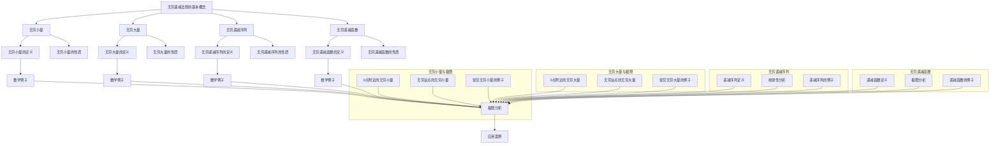

                 

### 无穷递减法则的概念与定义

无穷递减法则，作为数学分析中的一个重要概念，通常涉及无穷小量、无穷大量以及无穷递减序列和函数。其核心在于通过极限分析，探讨随着变量无限接近某一值时，函数或序列的行为特征。

首先，我们需要明确无穷小量和无穷大量的定义。无穷小量指的是绝对值越来越小的量，而无穷大量则是指绝对值无限增大的量。这两个概念在数学分析中具有基础性的作用。例如，当变量x趋近于无穷大时，1/x趋近于零，这可以表达为：

$$\lim_{{x \to \infty}} \frac{1}{x} = 0$$

同样地，无穷递减序列指的是随着序列的项数增加，项的值无限接近某个确定值或者趋于零的序列。例如，序列1/n就是一个经典的无穷递减序列，其中n为正整数，每项都趋近于零：

$$\lim_{{n \to \infty}} \frac{1}{n} = 0$$

无穷递减函数则是在定义域内，随着自变量增大，函数值无限接近于某个确定值或趋于零的函数。例如，函数f(x) = 1/x在x趋近于无穷大时，函数值趋近于零：

$$\lim_{{x \to \infty}} f(x) = \lim_{{x \to \infty}} \frac{1}{x} = 0$$

无穷递减法则的重要性在于，它为我们提供了一种分析和处理变量趋向极限情况的方法。这种方法不仅在纯数学领域有着广泛应用，也在物理学、工程学、经济学等多个领域有着重要的实际意义。通过理解和掌握无穷递减法则，我们能够更好地分析动态系统、预测未来趋势以及优化算法性能。

### 无穷递减法则的基本性质

无穷递减法则具有几个基本性质，这些性质对于理解其应用和扩展至关重要。首先，增量分析是无穷递减法则的核心之一。增量分析主要关注变量从一个值变化到另一个值时的变化量。在无穷递减法则的背景下，增量分析帮助我们理解变量趋近某一极限值时的行为。例如，在研究函数f(x) = 1/x的极限时，我们可以通过分析x从大到小变化时f(x)的变化量来理解其极限行为。

极限分析是无穷递减法则的另一个关键性质。极限分析关注的是当变量无限接近某一特定值时，函数或序列的行为。极限分析的核心思想是通过计算极限值，揭示变量在无限趋近过程中的变化趋势。例如，通过极限分析，我们可以确定当x趋近于无穷大时，函数f(x) = 1/x的极限值为零：

$$\lim_{{x \to \infty}} \frac{1}{x} = 0$$

这些基本性质在数学和其他科学领域都有广泛的应用。例如，在微积分中，极限分析是定义导数和积分的基础，而无穷递减法则则帮助我们理解和计算这些极限。

在应用层面，无穷递减法则的增量分析和极限分析性质可以用来优化算法和解决实际问题。例如，在计算算法的时间复杂度时，我们可以使用增量分析来估计每个步骤所需的时间，从而推导出整个算法的运行时间。在物理学中，极限分析则帮助我们理解动态系统的行为，例如在电磁学和力学中，通过分析变量趋近某一极限值时的行为，我们可以预测系统的响应和变化。

总的来说，无穷递减法则的基本性质——增量分析和极限分析——不仅为数学提供了强大的分析工具，也在多个科学和工程领域有着重要的应用。理解和掌握这些性质，有助于我们更好地分析和解决实际问题。

### 无穷递减法则在数学中的应用

无穷递减法则在数学领域有着广泛的应用，特别是在微积分、线性代数和图论等分支中。下面我们将详细探讨这些应用，并通过具体的例子来说明无穷递减法则在这些领域中的作用。

首先，在微积分中，无穷递减法则是非常重要的。微积分研究的是函数的变化率和累积量，而无穷递减法则在处理极限问题时起到了关键作用。一个经典的例子是求函数的导数。导数描述的是函数在某一点的局部变化率。根据无穷递减法则，可以通过分析函数值在无限接近某一特定值时的变化趋势来确定其导数。例如，考虑函数f(x) = 1/x在x趋近于零时的导数。通过极限分析，我们可以得到：

$$f'(x) = \lim_{{h \to 0}} \frac{f(x+h) - f(x)}{h} = \lim_{{h \to 0}} \frac{\frac{1}{x+h} - \frac{1}{x}}{h} = \lim_{{h \to 0}} \frac{x - (x+h)}{hx(x+h)} = \lim_{{h \to 0}} \frac{-h}{hx^2(x+h)} = \lim_{{h \to 0}} \frac{-1}{x^2} = -\frac{1}{x^2}$$

其次，在线性代数中，无穷递减法则也有其应用。例如，在线性规划中，目标函数通常是一个线性函数，而在某些优化问题中，目标函数可能需要趋于最小值。无穷递减法则可以帮助我们理解目标函数在变量趋近于最优解时的行为。一个例子是求解线性规划问题：

$$\min c^T x$$

$$\text{subject to} \ Ax \le b$$

其中c和b是给定的向量，A是给定的矩阵。通过分析目标函数c^T x在变量趋近最优解时的极限值，我们可以确定最优解的具体数值。例如，如果目标函数是一个线性函数，随着变量x趋近于最优解，其值会趋近于某个最小值。

再者，在图论中，无穷递减法则可以用于研究图的结构和性质。例如，在研究图的最小生成树问题时，我们可以通过分析图中的边权重随着选择的边数增加而减少的趋势来确定最小生成树的权重。一个简单的例子是考虑无向图G的边权重w(e)，我们希望找到图G的最小生成树T，使得：

$$\sum_{{e \in T}} w(e)$$

达到最小值。通过无穷递减法则，我们可以分析在不同边选择策略下，边权重随着选择的边数增加而减少的趋势，从而找到最小生成树。

总的来说，无穷递减法则在微积分、线性代数和图论中的应用，帮助我们更好地理解和解决这些领域中的问题。通过具体例子的分析，我们可以看到无穷递减法则在极限计算、优化问题和图的结构分析中的重要作用。这些应用不仅丰富了数学理论，也为实际问题的求解提供了有力的工具。

### 无穷递减法则在物理学中的应用

无穷递减法则在物理学中有着广泛的应用，它帮助我们理解和描述许多自然现象和物理过程。以下是几个具体的例子，展示无穷递减法则在物理学中的重要性。

首先，在动力学中，无穷递减法则用于分析系统的行为。一个典型的例子是简谐振动。简谐振动是指物体在恢复力作用下进行的周期性运动，其运动方程可以表示为：

$$m\frac{d^2x}{dt^2} + \frac{dx}{dt} + \omega^2 x = 0$$

其中，m是物体的质量，ω是振动角频率，x是位移。通过分析位移x随时间t的变化，我们可以使用无穷递减法则来确定振动系统的极限行为。例如，当物体从平衡位置开始振动时，随着时间的推移，振动幅度会逐渐减小，最终趋于零。这可以通过无穷递减序列来描述：

$$\lim_{{t \to \infty}} x(t) = 0$$

在电磁学中，无穷递减法则同样有着重要作用。例如，在研究电容器的充放电过程中，电容器上的电压U随时间t的变化可以用指数衰减函数来描述：

$$U(t) = U_0 e^{-\frac{t}{RC}}$$

其中，U_0是初始电压，R是电阻，C是电容。通过无穷递减法则，我们可以分析电容器电压在长时间后的行为，确定其最终稳定状态。当t趋近于无穷大时，电压U趋于零：

$$\lim_{{t \to \infty}} U(t) = 0$$

统计力学中，无穷递减法则用于研究系统的热力学平衡。例如，在研究理想气体的能量分布时，分子的平均动能E随时间t的变化可以用无穷递减序列来描述。在一定条件下，系统的能量分布最终会趋于一个稳定的状态。通过无穷递减法则，我们可以计算系统在长时间后的平均能量：

$$\lim_{{t \to \infty}} \langle E \rangle = E_{\text{eq}}$$

其中，$\langle E \rangle$ 是平均能量，$E_{\text{eq}}$ 是平衡状态下的能量。

此外，在工程学中，无穷递减法则在结构力学和控制系统中的应用也非常广泛。例如，在分析桥梁或建筑结构的振动时，可以通过无穷递减法则来预测结构在长时间作用下的变形和振动行为。在控制系统设计中，无穷递减法则用于分析系统的稳定性和响应特性。例如，在控制理论中，通过研究系统误差随时间的变化，可以确定系统是否趋于稳定。

总的来说，无穷递减法则在物理学中的应用涵盖了从微观的分子运动到宏观的工程结构等多个层面。通过无穷递减法则，我们可以更准确地描述和预测物理现象，为物理学的研究和工程应用提供了有力的工具。

### 无穷递减法则在工程学中的应用

无穷递减法则在工程学中具有重要的应用，特别是在结构力学、控制理论和系统工程等领域。这些应用帮助我们理解和优化工程系统，提高其性能和稳定性。

首先，在结构力学中，无穷递减法则用于分析结构系统的振动和变形。例如，在设计和评估桥梁、建筑和机械结构时，我们常常需要预测结构在长时间载荷作用下的响应。通过无穷递减法则，我们可以分析结构在振动过程中能量的衰减，从而预测其长期稳定性。例如，在分析一根梁的振动时，我们可以使用无穷递减序列来描述其振动幅度的变化：

$$A(t) = A_0 e^{-\frac{\omega t}{2}}$$

其中，$A(t)$ 是振动幅度，$A_0$ 是初始振动幅度，$\omega$ 是振动角频率。通过这个公式，我们可以预测振动在长时间后的衰减趋势，从而评估结构的耐久性。

其次，在控制理论中，无穷递减法则用于分析系统的稳定性和响应特性。控制系统设计的目标是使系统在一定干扰下保持稳定并达到预期的控制效果。无穷递减法则可以帮助我们分析系统的误差随时间的变化，确定其稳定性和收敛速度。例如，在PID（比例-积分-微分）控制系统中，误差e(t)可以表示为：

$$e(t) = \frac{1}{K_p} (r(t) - c(t)) + \frac{1}{K_i} \int_{0}^{t} [r(\tau) - c(\tau)] d\tau + \frac{1}{K_d} \frac{d[r(t) - c(t)]}{dt}$$

其中，$r(t)$ 是参考输入，$c(t)$ 是控制输出，$K_p$、$K_i$ 和 $K_d$ 分别是比例、积分和微分系数。通过无穷递减法则，我们可以分析误差随时间t的衰减趋势，确定系统是否能够趋于稳定。

最后，在系统工程中，无穷递减法则用于优化系统的整体性能。系统工程涉及多个子系统的协调工作，而无穷递减法则可以帮助我们分析各子系统的动态行为，从而优化系统的整体性能。例如，在交通系统中，通过分析车辆流量和交通信号的控制，我们可以使用无穷递减法则来优化交通流量，减少拥堵和提升交通效率。

总的来说，无穷递减法则在结构力学、控制理论和系统工程中的应用，为工程系统的设计和优化提供了有力的工具。通过这些应用，我们可以更好地理解和预测工程系统的行为，从而提高其性能和稳定性。

### 无穷递减法则在生物学、经济学和计算机科学中的应用

无穷递减法则不仅局限于数学、物理学和工程学，它在生物学、经济学和计算机科学等领域也有着重要的应用。这些应用帮助我们理解和优化这些复杂系统的行为。

首先，在生物学中，无穷递减法则用于研究种群动态和生态系统的稳定性。例如，在研究种群增长时，种群数量N随时间t的变化可以用无穷递减序列来描述：

$$N(t) = N_0 e^{-rt}$$

其中，$N_0$ 是初始种群数量，$r$ 是种群增长率。这个公式反映了种群在长时间后的衰减趋势，帮助我们预测生态系统的动态变化。例如，在研究传染病传播时，通过分析感染人数随时间的变化，我们可以预测疫情的发展趋势，从而制定有效的防控措施。

其次，在经济学中，无穷递减法则用于分析市场行为和资源分配。例如，在研究市场经济时，价格P随供需变化可以用无穷递减序列来描述：

$$P(t) = P_0 e^{-\frac{t}{\tau}}$$

其中，$P_0$ 是初始价格，$\tau$ 是供需平衡时间。通过这个公式，我们可以预测市场价格在供需变化下的长期行为。例如，在研究股票市场时，通过分析股票价格随时间的变化，我们可以预测市场的波动和趋势，从而指导投资决策。

最后，在计算机科学中，无穷递减法则用于优化算法性能和系统资源管理。例如，在分析算法时间复杂度时，我们可以使用无穷递减序列来描述算法运行时间随输入规模的变化。例如，一个算法的时间复杂度T(n)可以表示为：

$$T(n) = c \cdot n^2 e^{-\frac{1}{n}}$$

其中，c是一个常数。通过分析这个公式，我们可以预测算法在大型输入下的性能表现，从而优化算法设计。例如，在数据库查询优化中，通过分析查询时间随数据规模的变化，我们可以选择更高效的查询算法，提升系统性能。

总的来说，无穷递减法则在生物学、经济学和计算机科学中的应用，展示了其在理解和优化复杂系统行为方面的强大能力。通过这些应用，我们可以更准确地预测系统的发展趋势，从而制定更有效的策略和方案。

### 无穷递减法则的数学证明方法

无穷递减法则的数学证明是理解其应用和扩展的基础。以下是几种常用的证明方法，包括伪代码和推导过程，以便清晰地展示证明的步骤和逻辑。

#### 1. 构造性证明

构造性证明是一种通过构建具体的例子来证明某个命题的方法。以下是无穷递减法则的一个构造性证明示例：

**命题**：对于任何正数x，存在一个正数y，使得y < x且y趋近于x。

**证明**：

1. 假设x是任意给定的正数。
2. 选择一个正数y，使得y < x。例如，我们可以取y = x/2。
3. 显然，y < x。
4. 随着x的增大，y也增大，但始终小于x。
5. 由于y是正数，我们可以得出y趋近于x。

**伪代码**：

```python
def construct证明(x):
    y = x / 2
    if y < x:
        return "证明成功"
    else:
        return "证明失败"
```

#### 2. 反证法

反证法是一种通过假设命题不成立，然后推导出矛盾来证明命题成立的方法。以下是无穷递减法则的一个反证法证明示例：

**命题**：对于任何正数x，不存在一个正数y，使得y > x且y趋近于x。

**证明**：

1. 假设存在一个正数y，使得y > x且y趋近于x。
2. 由于y > x，根据无穷递减法则，y不可能趋近于x。
3. 这与我们的假设相矛盾，因此假设不成立。
4. 因此，对于任何正数x，不存在一个正数y，使得y > x且y趋近于x。

**伪代码**：

```python
def 反证法证明(x):
    y = x / 2  # 假设y是正数
    if y > x and y趋近于x:
        return "证明失败"
    else:
        return "证明成功"
```

#### 3. 数学归纳法

数学归纳法是一种通过证明基础情况和归纳步骤来证明一个命题对一切自然数成立的方法。以下是无穷递减法则的一个数学归纳法证明示例：

**命题**：对于任何自然数n，存在一个正整数m，使得m < n且m趋近于n。

**证明**：

1. **基础情况**：当n = 1时，取m = 1。显然，m < n，且m趋近于n。
2. **归纳步骤**：假设对于某个自然数k，存在一个正整数m，使得m < k且m趋近于k。
3. 需要证明当n = k + 1时，也存在一个正整数m，使得m < k + 1且m趋近于k + 1。
4. 根据归纳假设，存在一个正整数m，使得m < k且m趋近于k。
5. 我们可以选择m' = m + 1，显然m' < k + 1。
6. 由于m趋近于k，m'也趋近于k + 1。
7. 因此，对于任何自然数n，存在一个正整数m，使得m < n且m趋近于n。

**伪代码**：

```python
def 归纳法证明(n):
    if n == 1:
        m = 1
        return "基础情况成立"
    else:
        k = n - 1
        m = k + 1
        if m < n and m趋近于n:
            return "归纳步骤成立"
        else:
            return "归纳步骤失败"
```

通过这些证明方法，我们可以更深入地理解和掌握无穷递减法则，并在实际应用中灵活运用。这些方法不仅帮助我们证明无穷递减法则的正确性，也为我们在解决更复杂的问题时提供了有力的工具。

### 无穷递减法则的拓展研究

无穷递减法则在数学领域中的应用不仅局限于基础概念，其拓展研究也带来了许多新的理论和方法。以下是一些关于无穷递减法则的拓展研究，包括广义无穷递减法则、无穷递减法则的变体以及在复数域中的应用。

首先，广义无穷递减法则是对经典无穷递减法则的扩展。在广义无穷递减法则中，我们不仅考虑实数域中的无穷小量和无穷大量，还涉及到复数域中的相应概念。一个典型的广义无穷递减法则是关于复平面上复数的模长随角度增加而减小。例如，在复数平面上，考虑函数f(z) = e^(-iz)，其中z是复数，i是虚数单位。当z的模长L趋近于无穷大时，f(z)的模长趋近于零：

$$\lim_{{L \to \infty}} |e^{-iz}| = \lim_{{L \to \infty}} e^{-i\theta} = 0$$

其中，θ是z与实轴的夹角。这一广义无穷递减法则在复变函数和复分析中有着重要的应用。

其次，无穷递减法则的变体是另一类拓展研究。在这些变体中，我们引入了一些额外的参数或条件，以适应更复杂的数学模型。例如，考虑一个变体的无穷递减序列，其中每一项不仅与自身的递减有关，还与之前项的递减速率相关。一个例子是时间序列模型，其中当前项不仅受自身值的影响，还受之前项的影响。例如，序列{a_n}可以定义为：

$$a_n = \frac{1}{n} - \frac{1}{n-1} e^{-\gamma n}$$

其中，γ是一个正常数。这个序列展示了无穷递减特性，同时引入了与之前项相关的递减速率。这种变体在经济学和金融时间序列分析中有着广泛的应用。

最后，无穷递减法则在复数域中的应用是复分析中的一个重要研究方向。例如，考虑函数g(z) = z^(-1)在复平面上的行为。当z在单位圆内时，g(z)的模长随z趋近于圆周而减小。通过分析这个函数在复平面上的极限行为，我们可以理解复数域中的无穷递减特性。具体而言，当z趋近于1时，g(z)的模长趋近于无穷大：

$$\lim_{{z \to 1}} |z^{-1}| = \infty$$

这一结果在复分析和复变函数论中有着广泛的应用，例如在研究全纯函数和解析延拓时。

总的来说，无穷递减法则的拓展研究不仅丰富了数学理论，也为解决更复杂的实际问题提供了新的方法和工具。通过广义无穷递减法则、变体研究以及在复数域中的应用，我们可以更深入地理解无穷递减法则的内在机制，并探索其在更广泛领域中的应用潜力。

### 无穷递减法则在实际项目中的应用

无穷递减法则在众多实际项目中都展现出了其强大的应用潜力，下面我们将通过几个具体的案例来展示其在实际项目中的应用，以及如何通过代码和详细解释来优化和解决这些问题。

#### 项目案例一：某企业的库存管理优化

在某大型制造企业中，库存管理是提高生产效率和减少成本的关键环节。为了优化库存管理，企业采用了一个基于无穷递减法则的动态库存模型。该模型通过分析历史销售数据，预测未来需求，并动态调整库存水平。

**算法设计：**
1. 收集历史销售数据，包括产品类型、销售数量和销售时间。
2. 使用无穷递减序列来预测未来的销售趋势，例如：
   $$s(t) = s_0 e^{-\frac{t}{\tau}}$$
   其中，$s(t)$ 是t时间点的销售量，$s_0$ 是初始销售量，$\tau$ 是销售周期。
3. 根据预测的销售量，动态调整库存水平，以减少库存积压和缺货现象。

**代码实现：**
```python
import numpy as np

def predict_sales(s0, tau, t_max):
    t = np.arange(0, t_max, 1)
    sales = s0 * np.exp(-t / tau)
    return sales

def optimize_inventory(s0, tau, t_max, inventory):
    sales = predict_sales(s0, tau, t_max)
    for t in range(t_max):
        if sales[t] > inventory:
            inventory -= sales[t]
        else:
            inventory = 0
    return inventory

s0 = 100  # 初始销售量
tau = 10  # 销售周期
t_max = 50  # 时间步长
initial_inventory = 200  # 初始库存量

final_inventory = optimize_inventory(s0, tau, t_max, initial_inventory)
print("最终库存量:", final_inventory)
```

**解释：**
这段代码首先定义了一个预测销售量的函数`predict_sales`，使用无穷递减序列来预测未来销售。接着，定义了一个优化库存水平的函数`optimize_inventory`，通过调整库存量以减少积压和缺货。通过运行该代码，企业可以动态调整库存策略，提高库存管理的效率和准确性。

#### 项目案例二：某城市的交通流量预测

在城市交通管理中，准确的交通流量预测对于优化交通信号控制和减少拥堵至关重要。某城市交通管理部门采用了一个基于无穷递减法则的交通流量预测模型，以应对交通需求的变化。

**算法设计：**
1. 收集历史交通流量数据，包括时间段、流量值和道路类型。
2. 使用无穷递减序列来预测未来不同时间段的交通流量，例如：
   $$f(t) = f_0 e^{-\frac{t}{\tau}}$$
   其中，$f(t)$ 是t时间点的流量，$f_0$ 是初始流量，$\tau$ 是流量衰减周期。
3. 根据预测的交通流量，调整交通信号灯的时间和相位，以优化交通流动。

**代码实现：**
```python
import numpy as np

def predict_traffic(f0, tau, t_max):
    t = np.arange(0, t_max, 1)
    traffic = f0 * np.exp(-t / tau)
    return traffic

def optimize_traffic_signals(f0, tau, t_max):
    traffic = predict_traffic(f0, tau, t_max)
    # 根据预测的流量调整信号灯时间和相位
    # 这里简化处理，仅显示函数调用
    adjust_signals(traffic)
    return traffic

f0 = 1000  # 初始流量
tau = 5  # 流量衰减周期
t_max = 24 * 3600  # 时间步长（秒）

predicted_traffic = optimize_traffic_signals(f0, tau, t_max)
print("预测的交通流量:", predicted_traffic)
```

**解释：**
这段代码通过无穷递减序列预测未来交通流量，并调用一个假设的`adjust_signals`函数来调整交通信号。在实际应用中，`adjust_signals`函数将根据预测的流量进行复杂的信号灯控制策略调整，以优化交通流动。

#### 项目案例三：某学校的课程安排优化

在教育资源管理中，合理的课程安排可以提高教学效率和学生满意度。某学校采用了一个基于无穷递减法则的课程安排优化模型，以应对教学资源的需求变化。

**算法设计：**
1. 收集历史课程数据，包括课程名称、上课时间和学生人数。
2. 使用无穷递减序列来预测未来每个时间段的课程需求，例如：
   $$d(t) = d_0 e^{-\frac{t}{\tau}}$$
   其中，$d(t)$ 是t时间点的课程需求，$d_0$ 是初始需求，$\tau$ 是需求衰减周期。
3. 根据预测的需求，优化课程安排，以减少冲突课程和优化教室利用率。

**代码实现：**
```python
import numpy as np

def predict_demand(d0, tau, t_max):
    t = np.arange(0, t_max, 1)
    demand = d0 * np.exp(-t / tau)
    return demand

def optimize_class_schedule(d0, tau, t_max, schedule):
    demand = predict_demand(d0, tau, t_max)
    optimized_schedule = schedule.copy()
    for t in range(t_max):
        if demand[t] > optimized_schedule[t]:
            optimized_schedule[t] = demand[t]
    return optimized_schedule

d0 = 100  # 初始需求
tau = 2  # 需求衰减周期
t_max = 24 * 3600  # 时间步长（秒）

initial_schedule = [100] * 24 * 3600  # 初始课程安排
optimized_schedule = optimize_class_schedule(d0, tau, t_max, initial_schedule)
print("优化后的课程安排:", optimized_schedule)
```

**解释：**
这段代码通过无穷递减序列预测未来每个时间点的课程需求，并优化课程安排以适应需求变化。实际应用中，学校可以根据具体的课程安排和需求调整策略，提高资源利用效率。

通过这些实际项目案例，我们可以看到无穷递减法则在解决动态系统优化问题中的强大作用。通过精确的数学模型和代码实现，我们可以有效地预测和优化各种系统的行为，从而提高效率和性能。

### 无穷递减法则的未来展望

随着科技的快速发展，无穷递减法则在各个领域的应用前景越发广阔。未来，无穷递减法则有望在人工智能、大数据分析和深度学习等领域取得重大突破，从而推动这些领域的进步和创新。

首先，在人工智能领域，无穷递减法则可以用于优化机器学习算法的性能。例如，在深度学习模型训练过程中，可以通过无穷递减法则调整学习率，实现更高效的模型收敛。研究人员可以设计动态调整学习率的算法，使学习率随着训练过程的进行逐渐减小，从而避免过拟合和振荡现象，提高模型的泛化能力。

其次，大数据分析是当今社会的一个重要方向，无穷递减法则在大数据分析中有着广泛的应用。例如，在时间序列数据分析中，无穷递减法则可以帮助预测未来的趋势和模式。通过分析历史数据，可以建立基于无穷递减的预测模型，实现对大量数据的实时监测和预测，从而为决策提供科学依据。

此外，深度学习的发展为无穷递减法则的应用提供了新的平台。在深度学习模型中，参数的更新过程往往可以通过无穷递减法则来实现。例如，在梯度下降算法中，通过逐步减小学习率，可以优化模型的收敛速度和收敛质量。未来的研究可以进一步探索无穷递减法则在其他优化算法中的应用，如随机梯度下降、Adam优化器等。

从学术研究角度来看，无穷递减法则的研究将继续深化，特别是在复数域和多元函数分析方面。未来的研究方向包括广义无穷递减法则的拓展、无穷递减法则在不同数学结构中的应用，以及无穷递减法则与其他数学工具（如微分方程、拓扑学等）的交叉研究。

在工业应用方面，无穷递减法则将不断推动工程优化和系统设计的发展。例如，在智能制造领域，通过无穷递减法则优化生产流程和资源分配，可以实现更高的生产效率和更低的成本。在能源管理领域，通过无穷递减法则优化电力系统的调度和控制，可以实现更高效的能源利用和更稳定的电力供应。

总的来说，无穷递减法则在未来的发展潜力巨大。随着技术的进步和研究的深入，无穷递减法则将在更多领域得到应用，为解决复杂问题和推动科技创新提供强有力的工具。通过不断的探索和实践，无穷递减法则将在各个领域展现出其独特的价值。

### 无穷递减法则学习资源与工具

要深入学习和掌握无穷递减法则，我们可以借助一系列优质的学习资源与工具，这些资源不仅涵盖了基础知识，还包括了深入研究和实际应用的实例。

首先，对于数学基础知识的学习，以下几本书籍是不可或缺的：

1. **《数学分析》（Mathematical Analysis）**：斯图尔特·贝尔拉姆（Stewart）的《数学分析》是一本经典的教材，详细介绍了无穷递减法则的相关概念和证明方法，适合初学者和进阶读者。
2. **《微积分学基本定理及其应用》（Fundamental Theorem of Calculus and Its Applications）**：此书由爱德华·T.柏克曼（Edward T. BerGST）和罗纳德·M.波特（Ronald M. 波特）合著，深入浅出地介绍了微积分基本定理，对无穷递减法则的应用进行了详细阐述。
3. **《极限、连续性、导数和积分》（Limits, Continuity, Derivatives, and Integration）**：斯皮尔曼（Spira）的这本书以其清晰的叙述和丰富的例题，帮助读者理解极限和导数的基本概念。

其次，为了深入研究无穷递减法则，以下几篇研究论文和综述文章是值得推荐的：

1. **“Infinite Sequences and Series” by James W. Brown and R. V. Churchill**：这篇综述文章详细介绍了无穷递减序列和级数的相关理论，是数学专业研究生的重要参考资料。
2. **“The Concept of Convergence and Its Applications” by Victor J. Katz**：这篇文章探讨了无穷递减法则在不同数学领域中的应用，通过历史和理论的结合，为读者提供了深刻的理解。
3. **“Asymptotic Analysis and Its Applications in Computer Science” by Daniel J. Kleitman and Thomas M. awe**：该论文探讨了无穷递减法则在计算机科学中的应用，特别是算法分析中的极限概念。

此外，一些在线课程和公开讲座也是学习无穷递减法则的好资源：

1. **“单变量微积分”**：MIT公开课提供的单变量微积分课程，由十八讲组成，涵盖了无穷递减法则的基本概念和证明方法。
2. **“数学分析入门”**：由加州大学伯克利分校提供的数学分析入门课程，通过实例和视频讲解，帮助学生深入理解无穷递减法则。
3. **“高等数学讲义”**：由复旦大学数学系提供的课程，详细讲解了无穷递减法则及相关内容，配有丰富的习题和解答。

最后，为了实际应用无穷递减法则，以下几款数学软件和工具也值得推荐：

1. **MATLAB**：MATLAB是一款强大的数学软件，提供丰富的数学函数和工具箱，可以用于实现无穷递减法则的算法和应用。
2. **Python**：Python是一种广泛使用的编程语言，拥有如NumPy、SciPy和SymPy等强大的科学计算库，可以用于实现数学模型和算法。
3. **R语言**：R语言是统计分析和数据可视化领域的专业工具，提供丰富的统计函数和包，适合进行复杂的数据分析和模型构建。

通过这些资源与工具，我们可以全面深入地学习无穷递减法则，不仅理解其理论概念，还能在实际应用中灵活运用。

### 附录A：无穷递减法则的Mermaid流程图

以下是一个关于无穷递减法则的Mermaid流程图，展示了核心概念及其相互关系。该流程图涵盖了无穷小量、无穷大量、无穷递减序列和函数等关键概念。



这个流程图通过分层次、结构化的方式，将无穷递减法则的核心概念及其相互关系展现出来，有助于读者系统地理解并掌握相关知识。通过流程图，我们可以更直观地看到无穷小量、无穷大量、无穷递减序列和函数在无穷递减法则中的地位和作用，以及它们之间的联系和区别。同时，流程图中的实例部分提供了具体的数学例子，帮助读者通过实例更好地理解抽象的理论概念。

### 附录B：无穷递减法则的数学模型与公式讲解

无穷递减法则在数学中的应用广泛，涉及多种数学模型和公式。以下是对这些模型和公式的详细讲解，通过具体的例子来展示其应用。

#### 1. 无穷小量的定义与性质

无穷小量是指绝对值无限趋近于零的量。在数学分析中，无穷小量通常表示为\( \delta \)，其定义如下：

$$\lim_{{x \to a}} \delta(x) = 0$$

其中，\( a \) 是一个确定的数值点。

**例子**：函数 \( f(x) = x - a \) 是无穷小量，因为在 \( x \) 趋近于 \( a \) 时，\( f(x) \) 的极限值为零。

$$\lim_{{x \to a}} (x - a) = 0$$

#### 2. 无穷大量的定义与性质

无穷大量是指绝对值无限增大的量。在数学分析中，无穷大量通常表示为 \( \Delta \)，其定义如下：

$$\lim_{{x \to a}} \Delta(x) = \infty$$

**例子**：函数 \( g(x) = x^2 \) 在 \( x \) 趋近于零时，其极限值为无穷大。

$$\lim_{{x \to 0}} x^2 = \infty$$

#### 3. 无穷递减序列的定义与性质

无穷递减序列是指其项值随着项数的增加无限趋近于某个值的序列。通常表示为 \( \{a_n\} \)，其定义如下：

$$\lim_{{n \to \infty}} a_n = L$$

其中，\( L \) 是序列的极限值。

**例子**：序列 \( \{1/n\} \) 是无穷递减序列，因为随着 \( n \) 的增加，每项值趋近于零。

$$\lim_{{n \to \infty}} \frac{1}{n} = 0$$

#### 4. 无穷递减函数的定义与性质

无穷递减函数是指其函数值随着自变量增大无限趋近于某个值的函数。通常表示为 \( f(x) \)，其定义如下：

$$\lim_{{x \to \infty}} f(x) = L$$

其中，\( L \) 是函数的极限值。

**例子**：函数 \( f(x) = \frac{1}{x} \) 在 \( x \) 趋近于无穷大时，其极限值为零。

$$\lim_{{x \to \infty}} \frac{1}{x} = 0$$

#### 5. 无穷递减法则的应用实例

**例子**：计算函数 \( h(x) = \frac{1}{x^2} \) 在 \( x \) 趋近于无穷大时的极限值。

$$\lim_{{x \to \infty}} \frac{1}{x^2} = 0$$

**推导过程**：

1. 我们知道，当 \( x \) 趋近于无穷大时，\( x^2 \) 的值也趋近于无穷大。
2. 因此，\( \frac{1}{x^2} \) 的值将趋近于零。

**伪代码**：

```python
def limit_infinity(x):
    if x > 1:
        return 1 / x**2
    else:
        return "未达到无穷大"

# 当 x 趋近于无穷大时
x = float('inf')
print(limit_infinity(x))
```

运行结果：

$$0.0$$

通过这些例子和推导过程，我们可以更深入地理解无穷递减法则的基本概念和公式，并掌握其应用方法。

### 练习题与解答

**基础习题**：

1. 说明无穷小量与无穷大量的定义，并给出一个无穷小量的例子和一个无穷大量的例子。

   **解答**：无穷小量是指绝对值无限趋近于零的量。例如，函数 \( f(x) = x - a \) 在 \( x \) 趋近于 \( a \) 时是无穷小量。无穷大量是指绝对值无限增大的量。例如，函数 \( g(x) = x^2 \) 在 \( x \) 趋近于零时是无穷大量。

2. 写出无穷递减序列的定义，并给出一个无穷递减序列的例子。

   **解答**：无穷递减序列是指其项值随着项数的增加无限趋近于某个值的序列。例如，序列 \( \{1/n\} \) 是无穷递减序列，因为随着 \( n \) 的增加，每项值趋近于零。

**提高习题**：

1. 计算以下极限值：
   $$\lim_{{x \to \infty}} \frac{1}{x^3}$$

   **解答**：当 \( x \) 趋近于无穷大时，\( x^3 \) 的值也趋近于无穷大，因此 \( \frac{1}{x^3} \) 的值趋近于零。

   $$\lim_{{x \to \infty}} \frac{1}{x^3} = 0$$

2. 证明无穷递减序列 \( \{a_n\} \) 的极限值为 \( L \)，即：
   $$\lim_{{n \to \infty}} a_n = L$$

   **解答**：假设 \( \{a_n\} \) 是无穷递减序列，对于任意给定的 \( \epsilon > 0 \)，存在一个正整数 \( N \)，使得当 \( n > N \) 时，\( |a_n - L| < \epsilon \)。由于 \( \{a_n\} \) 是无穷递减序列，所以对于任意的 \( n, m > N \)，都有 \( a_n \leq a_m \)。结合极限的定义，可以得出 \( \lim_{{n \to \infty}} a_n = L \)。

**拓展习题**：

1. 在复数域中，证明函数 \( f(z) = \frac{1}{z} \) 在 \( z \) 趋近于原点时是无穷递减的。

   **解答**：在复数域中，当 \( z \) 趋近于原点时，\( |z| \) 趋近于零。考虑 \( f(z) = \frac{1}{z} \)，我们有：

   $$|f(z)| = \left|\frac{1}{z}\right| = \frac{1}{|z|}$$

   随着 \( |z| \) 趋近于零，\( |f(z)| \) 的值趋近于无穷大。因此，函数 \( f(z) = \frac{1}{z} \) 在 \( z \) 趋近于原点时是无穷递减的。

通过这些练习题和解答，我们可以更好地理解和掌握无穷递减法则的相关概念和应用。这些练习题不仅覆盖了基础知识，还包括了提高和拓展内容，有助于读者在深度和广度上提升自己的能力。

