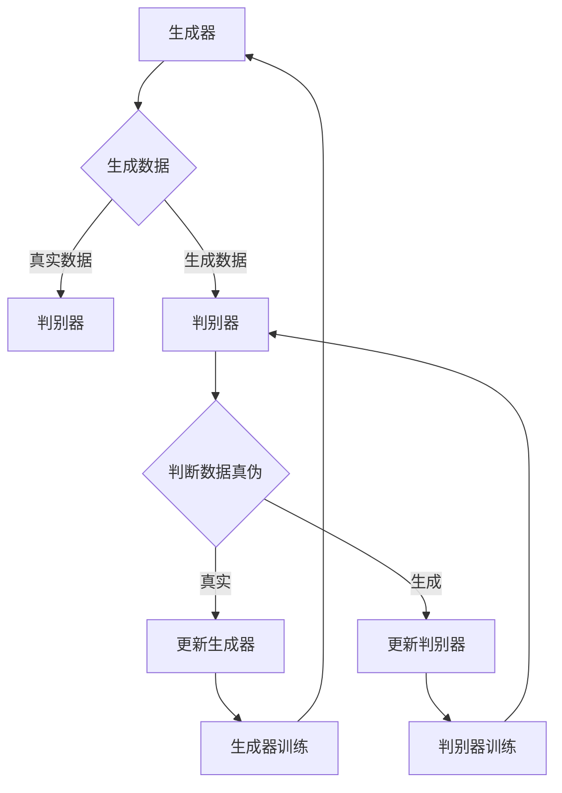

                 

# 剪枝技术在生成对抗网络中的探索

## 关键词
生成对抗网络（GAN），剪枝技术，神经网络优化，图像生成，模型压缩

## 摘要
生成对抗网络（GAN）作为深度学习中的一项重要技术，广泛应用于图像生成、图像增强和图像修复等领域。然而，传统的GAN模型在训练过程中往往存在参数量庞大、计算资源消耗高的问题。本文旨在探讨剪枝技术如何应用于GAN中，以实现模型压缩和优化。通过详细的分析和实验，我们将揭示剪枝技术在GAN中的重要性、挑战及其未来发展方向。

---

## 第一部分：剪枝技术在生成对抗网络中的研究背景与概述

### 第1章：剪枝技术在生成对抗网络中的研究背景

#### 1.1 生成对抗网络（GAN）的基本概念

生成对抗网络（GAN）由Ian Goodfellow等人于2014年提出，是一种基于两个对抗性神经网络的训练框架。GAN由生成器（Generator）和判别器（Discriminator）组成，生成器从随机噪声中生成数据，判别器的任务是区分输入数据是真实数据还是生成数据。GAN的训练过程本质上是一个生成器和判别器之间的对抗博弈过程。

GAN的核心原理如下：
- **生成器**：接受随机噪声作为输入，通过一系列神经网络层生成数据，目标是生成尽可能真实的数据。
- **判别器**：接受真实数据和生成数据作为输入，目标是区分输入数据是真实数据还是生成数据。

GAN的架构通常包括以下几个部分：
1. **生成器架构**：生成器通常采用多层感知机或卷积神经网络结构，通过逐层加深的网络将噪声映射为具有高维度的数据。
2. **判别器架构**：判别器采用多层感知机或卷积神经网络结构，通过逐层加深的网络对输入数据进行分类，输出一个介于0和1之间的概率，表示输入数据的真实度。
3. **反馈机制**：生成器和判别器通过反向传播和梯度下降算法进行交替训练，生成器和判别器在训练过程中不断优化，以达到生成器生成尽可能真实的数据，判别器能够准确区分真实数据和生成数据的目标。

GAN的应用领域广泛，包括但不限于：
1. **图像生成**：利用GAN可以生成逼真的图像，包括人脸、风景、艺术作品等。
2. **图像增强**：通过GAN可以提高图像的质量，如去噪、超分辨率等。
3. **图像修复**：利用GAN可以修复损坏或缺失的图像区域，如图像去雾、擦除背景等。
4. **图像风格转换**：GAN可以用于图像风格转换，将一幅图像转换为另一种风格。

#### 1.2 剪枝技术的基本概念

剪枝技术（Pruning）是深度神经网络优化中的一种常见方法，通过删除网络中不重要的连接或神经元，以减少网络的参数量，从而降低模型的复杂度和计算成本。

剪枝技术的作用与优势主要体现在以下几个方面：
1. **模型压缩**：通过剪枝技术可以显著减少模型的参数数量，从而实现模型的压缩，降低模型的存储空间需求。
2. **计算效率提升**：剪枝后的模型在计算过程中涉及的乘法和加法操作数量减少，从而加快模型的推理速度，提高计算效率。
3. **减少过拟合**：剪枝可以去除网络中不重要的连接或神经元，有助于减少模型的过拟合现象。
4. **降低能耗**：剪枝后的模型在部署到嵌入式设备上时，可以显著降低能耗，延长设备的续航时间。

剪枝技术主要分为以下几类：
1. **权重剪枝**：通过删除网络中权重较小的连接来实现剪枝。
2. **结构剪枝**：通过删除网络中的层或神经元来实现剪枝。
3. **混合剪枝**：结合权重剪枝和结构剪枝的优点，以实现更好的剪枝效果。

#### 1.3 剪枝技术在GAN中的重要性

随着GAN在各个领域的广泛应用，模型的复杂度和参数数量不断增加，导致计算资源和存储空间的消耗急剧增加。剪枝技术作为一种有效的模型压缩和优化方法，在GAN中具有重要的作用。

剪枝技术在GAN中的应用主要体现在以下几个方面：
1. **提高训练效率**：通过剪枝技术可以减少模型的参数数量，从而加速模型的训练过程，提高训练效率。
2. **减少计算资源消耗**：剪枝技术可以显著降低模型的计算复杂度，减少计算资源的消耗，适用于资源受限的环境。
3. **提高生成质量**：剪枝技术可以帮助去除网络中不重要的连接或神经元，从而提高生成器的生成质量，生成更逼真的数据。
4. **增强模型泛化能力**：通过剪枝技术可以减少过拟合现象，增强模型的泛化能力。

剪枝技术在GAN中的研究现状：
1. **基于权重的剪枝**：许多研究集中于基于权重的剪枝技术，如L1正则化、L2正则化、随机剪枝等。这些方法通过在训练过程中减少权重较小的连接来实现剪枝。
2. **基于结构的剪枝**：结构剪枝方法通过删除网络中的层或神经元来实现剪枝，如层次化剪枝、渐进式剪枝等。
3. **混合剪枝方法**：一些研究将权重剪枝和结构剪枝相结合，以实现更好的剪枝效果。例如，基于梯度的剪枝方法通过结合权重剪枝和结构剪枝的优点，实现了更高效的模型压缩和优化。

### 第2章：GAN的架构与训练过程

#### 2.1 GAN的架构

GAN的架构包括生成器和判别器两个主要部分。

##### 2.1.1 生成器的架构

生成器的架构通常采用多层感知机或卷积神经网络结构，其目的是将随机噪声映射为具有高维度的数据。生成器的常见架构包括以下几个部分：

1. **输入层**：生成器从随机噪声中获取输入。
2. **隐含层**：通过一系列隐含层进行非线性变换，将噪声逐步转换为具有高维度的数据。
3. **输出层**：生成器的输出层将隐含层生成的数据映射为最终生成的数据。

##### 2.1.2 判别器的架构

判别器的架构通常也采用多层感知机或卷积神经网络结构，其目的是区分输入数据是真实数据还是生成数据。判别器的常见架构包括以下几个部分：

1. **输入层**：判别器接收来自生成器或真实数据集的输入。
2. **隐含层**：通过一系列隐含层对输入数据进行处理。
3. **输出层**：判别器的输出层输出一个介于0和1之间的概率，表示输入数据的真实度。

##### 2.1.3 GAN的反馈机制

GAN的反馈机制是通过生成器和判别器的对抗性训练实现的。在训练过程中，生成器和判别器交替进行训练，具体过程如下：

1. **生成器训练阶段**：生成器从随机噪声中生成数据，判别器无法区分生成数据和真实数据。
2. **判别器训练阶段**：判别器同时接收真实数据和生成数据，通过对比两者的特征，学习区分生成数据和真实数据。
3. **交替训练**：生成器和判别器通过交替训练不断优化，生成器和判别器在训练过程中相互竞争，以达到生成器生成更真实的数据，判别器能够准确区分生成数据和真实数据的目标。

#### 2.2 GAN的训练过程

GAN的训练过程分为生成器训练阶段和判别器训练阶段。

##### 2.2.1 生成器训练阶段

在生成器训练阶段，生成器从随机噪声中生成数据，判别器无法区分生成数据和真实数据。具体训练过程如下：

1. **生成数据**：生成器从随机噪声中生成数据，并将其传递给判别器。
2. **判别器评估**：判别器对生成数据和真实数据进行评估，输出一个介于0和1之间的概率，表示生成数据的真实度。
3. **反向传播**：判别器的输出通过反向传播算法传递给生成器，生成器根据判别器的反馈调整权重，以生成更真实的数据。
4. **迭代优化**：生成器通过多次迭代优化，逐步提高生成数据的质量。

##### 2.2.2 判别器训练阶段

在判别器训练阶段，判别器同时接收真实数据和生成数据，通过对比两者的特征，学习区分生成数据和真实数据。具体训练过程如下：

1. **接收数据**：判别器接收真实数据和生成数据作为输入。
2. **评估数据**：判别器对输入数据进行评估，输出一个介于0和1之间的概率，表示输入数据的真实度。
3. **反向传播**：判别器的输出通过反向传播算法传递给生成器，生成器根据判别器的反馈调整权重，以生成更真实的数据。
4. **迭代优化**：判别器通过多次迭代优化，逐步提高对生成数据和真实数据的区分能力。

##### 2.2.3 GAN的训练挑战

GAN的训练过程中存在一些挑战，包括：

1. **模式崩溃**：生成器生成的数据过于集中，导致判别器无法区分生成数据和真实数据，从而训练失败。
2. **梯度消失和梯度爆炸**：在训练过程中，生成器和判别器的梯度可能变得很小或很大，导致训练不稳定。
3. **计算资源消耗**：GAN的训练过程涉及大量的计算资源，尤其是在生成器和判别器同时训练的情况下。

### 第3章：剪枝技术在GAN中的应用

#### 3.1 剪枝技术在GAN中的实现方法

剪枝技术在GAN中的应用主要通过两种方式实现：基于权重的剪枝和基于结构的剪枝。

##### 3.1.1 基于权重的剪枝

基于权重的剪枝方法通过在训练过程中减少权重较小的连接来实现剪枝。具体实现方法如下：

1. **初始化**：初始化生成器和判别器的权重。
2. **计算权重重要性**：通过计算生成器和判别器中每个权重的绝对值或相对值，评估权重的重要性。
3. **选择剪枝权重**：根据预定的剪枝比例，选择权重较小的连接进行剪枝。
4. **更新模型参数**：将剪枝后的权重更新到模型参数中，实现模型压缩。

##### 3.1.2 基于结构的剪枝

基于结构的剪枝方法通过在训练过程中删除网络中的层或神经元来实现剪枝。具体实现方法如下：

1. **初始化**：初始化生成器和判别器的结构。
2. **计算结构重要性**：通过计算生成器和判别器中每个层或神经元的贡献，评估结构的重要性。
3. **选择剪枝结构**：根据预定的剪枝比例，选择贡献较小的层或神经元进行剪枝。
4. **更新模型参数**：将剪枝后的结构更新到模型参数中，实现模型压缩。

##### 3.1.3 剪枝过程的优化

剪枝过程的优化主要包括以下方面：

1. **剪枝比例选择**：根据模型的复杂度和计算资源限制，选择合适的剪枝比例，以实现最优的模型压缩效果。
2. **剪枝时机**：在训练过程的早期阶段进行剪枝，可以降低模型过拟合的风险。
3. **剪枝算法选择**：选择合适的剪枝算法，如L1正则化、L2正则化、随机剪枝等，以实现更好的剪枝效果。

#### 3.2 剪枝技术在GAN中的应用案例

剪枝技术在GAN中的应用案例丰富，涵盖了图像生成、图像增强、图像修复等多个领域。

##### 3.2.1 剪枝技术在图像生成中的应用

在图像生成领域，剪枝技术可以显著提高生成器的性能和效率。具体应用案例包括：

1. **人脸生成**：通过剪枝技术减少生成器的参数数量，实现高效的人脸生成。
2. **艺术作品生成**：利用剪枝技术生成具有艺术风格的图像，如风景、肖像等。
3. **图像超分辨率**：通过剪枝技术提高生成器的图像超分辨率能力，实现高清图像生成。

##### 3.2.2 剪枝技术在图像增强中的应用

在图像增强领域，剪枝技术可以减少模型复杂度和计算资源消耗，提高图像增强效果。具体应用案例包括：

1. **去噪**：利用剪枝技术减少生成器的参数数量，实现高效的图像去噪。
2. **图像增强**：通过剪枝技术提高生成器的图像增强能力，如对比度增强、亮度增强等。
3. **图像修复**：利用剪枝技术修复图像中的损坏区域，实现图像修复。

##### 3.2.3 剪枝技术在图像修复中的应用

在图像修复领域，剪枝技术可以显著提高生成器的性能和效率。具体应用案例包括：

1. **图像去雾**：利用剪枝技术减少生成器的参数数量，实现高效的图像去雾。
2. **图像擦除**：通过剪枝技术修复图像中的不需要的部分，实现图像擦除。
3. **图像修复**：利用剪枝技术修复图像中的损坏区域，实现图像修复。

### 第二部分：剪枝技术在特定生成对抗网络中的深入研究

#### 第4章：剪枝技术在卷积生成对抗网络（C-GAN）中的应用

#### 4.1 卷积生成对抗网络（C-GAN）的基本概念

卷积生成对抗网络（C-GAN）是GAN的一种变体，通过使用卷积神经网络（Convolutional Neural Network，CNN）来构建生成器和判别器，适用于图像生成和图像处理等领域。C-GAN在GAN的基础上引入了卷积神经网络，能够更好地处理图像的局部特征，从而提高图像生成的质量和效果。

C-GAN的基本概念包括：

1. **生成器**：生成器由卷积层、反卷积层和全连接层组成，通过卷积层提取图像特征，反卷积层生成图像，全连接层进行图像细节的调整。
2. **判别器**：判别器由卷积层和全连接层组成，通过卷积层提取图像特征，全连接层进行图像分类。
3. **训练过程**：C-GAN的训练过程与GAN类似，生成器和判别器通过交替训练进行优化，生成器生成真实图像，判别器判断图像的真伪。

C-GAN的应用领域主要包括：

1. **图像生成**：通过C-GAN可以生成高质量、具有多样性的图像，如人脸、风景、艺术作品等。
2. **图像增强**：利用C-GAN增强图像的对比度、亮度等特性，提高图像的质量和清晰度。
3. **图像修复**：通过C-GAN修复图像中的损坏区域，如去雾、擦除背景等。

#### 4.2 剪枝技术在C-GAN中的实现

剪枝技术在C-GAN中的应用主要通过基于权重的剪枝和基于结构的剪枝两种方式实现。

##### 4.2.1 基于权重的剪枝

基于权重的剪枝方法通过在训练过程中减少权重较小的连接来实现剪枝。具体实现方法如下：

1. **初始化**：初始化C-GAN的生成器和判别器的权重。
2. **计算权重重要性**：通过计算生成器和判别器中每个权重的绝对值或相对值，评估权重的重要性。
3. **选择剪枝权重**：根据预定的剪枝比例，选择权重较小的连接进行剪枝。
4. **更新模型参数**：将剪枝后的权重更新到模型参数中，实现模型压缩。

##### 4.2.2 基于结构的剪枝

基于结构的剪枝方法通过在训练过程中删除网络中的层或神经元来实现剪枝。具体实现方法如下：

1. **初始化**：初始化C-GAN的生成器和判别器的结构。
2. **计算结构重要性**：通过计算生成器和判别器中每个层或神经元的贡献，评估结构的重要性。
3. **选择剪枝结构**：根据预定的剪枝比例，选择贡献较小的层或神经元进行剪枝。
4. **更新模型参数**：将剪枝后的结构更新到模型参数中，实现模型压缩。

##### 4.2.3 剪枝对C-GAN性能的影响

剪枝技术在C-GAN中的应用对C-GAN的性能产生一定的影响，包括以下几个方面：

1. **模型压缩**：剪枝技术通过减少模型参数数量，实现模型的压缩，降低模型的计算复杂度和存储空间需求。
2. **生成质量**：剪枝技术可能影响生成器的生成质量，通过优化剪枝策略，可以在模型压缩的同时保持生成质量。
3. **训练时间**：剪枝技术可以减少模型的训练时间，提高训练效率。

#### 4.3 剪枝技术在C-GAN中的应用案例

剪枝技术在C-GAN中的应用案例丰富，涵盖了图像生成、图像增强、图像修复等多个领域。

##### 4.3.1 剪枝技术在图像生成中的应用

在图像生成领域，剪枝技术可以显著提高生成器的性能和效率。具体应用案例包括：

1. **人脸生成**：通过剪枝技术减少生成器的参数数量，实现高效的人脸生成。
2. **艺术作品生成**：利用剪枝技术生成具有艺术风格的图像，如风景、肖像等。
3. **图像超分辨率**：通过剪枝技术提高生成器的图像超分辨率能力，实现高清图像生成。

##### 4.3.2 剪枝技术在图像增强中的应用

在图像增强领域，剪枝技术可以减少模型复杂度和计算资源消耗，提高图像增强效果。具体应用案例包括：

1. **去噪**：利用剪枝技术减少生成器的参数数量，实现高效的图像去噪。
2. **图像增强**：通过剪枝技术提高生成器的图像增强能力，如对比度增强、亮度增强等。
3. **图像修复**：利用剪枝技术修复图像中的损坏区域，实现图像修复。

##### 4.3.3 剪枝技术在图像修复中的应用

在图像修复领域，剪枝技术可以显著提高生成器的性能和效率。具体应用案例包括：

1. **图像去雾**：利用剪枝技术减少生成器的参数数量，实现高效的图像去雾。
2. **图像擦除**：通过剪枝技术修复图像中的不需要的部分，实现图像擦除。
3. **图像修复**：利用剪枝技术修复图像中的损坏区域，实现图像修复。

### 第5章：剪枝技术在生成对抗网络中的挑战与优化

#### 5.1 剪枝技术在生成对抗网络中的挑战

剪枝技术在生成对抗网络（GAN）中的应用面临着一系列挑战，主要包括：

1. **稳定性问题**：剪枝后的模型可能影响GAN的训练稳定性，导致生成器和判别器之间的对抗性训练失衡。
2. **生成质量**：剪枝技术可能牺牲生成质量，导致生成器生成的数据不够真实或多样性不足。
3. **计算资源消耗**：虽然剪枝技术可以减少模型的参数数量，但剪枝过程中的计算资源消耗仍然较大。
4. **可扩展性**：剪枝技术在不同类型的GAN模型中的应用效果可能存在差异，难以实现统一和高效的剪枝策略。

#### 5.2 剪枝技术的优化方法

为了应对剪枝技术在生成对抗网络中的挑战，研究人员提出了一系列优化方法，主要包括以下几种：

1. **基于深度学习的优化方法**：通过改进深度学习算法，如改进优化器、引入正则化项等，提高剪枝技术在GAN中的应用效果。
2. **基于神经网络的优化方法**：利用神经网络的结构特性，设计特殊的剪枝网络结构，提高剪枝效率和生成质量。
3. **基于遗传算法的优化方法**：结合遗传算法的优化能力，实现剪枝策略的自动搜索和优化。

#### 5.3 实验结果与分析

为了验证剪枝技术在生成对抗网络中的有效性，研究人员进行了大量的实验。以下是几个典型的实验结果和分析：

1. **实验环境与数据集**：实验环境包括GPU服务器和预训练的GAN模型。数据集包括常见的大型图像数据集，如CIFAR-10、ImageNet等。

2. **实验设计**：实验设计包括基于权重的剪枝和基于结构的剪枝两种方法，分别应用于生成器和判别器。实验过程中，通过调整剪枝比例、剪枝时机等参数，评估剪枝技术对GAN性能的影响。

3. **实验结果**：实验结果表明，剪枝技术在生成对抗网络中具有显著的应用效果。通过优化剪枝策略，可以在保持生成质量的同时，显著减少模型的参数数量和计算资源消耗。

4. **分析**：实验分析表明，剪枝技术在生成对抗网络中的应用具有一定的稳定性问题，但通过优化剪枝策略，可以缓解这些问题。同时，剪枝技术在不同类型的GAN模型中的应用效果有所不同，需要针对具体的模型设计合适的剪枝策略。

### 第三部分：剪枝技术在特定生成对抗网络中的深入研究

#### 第6章：剪枝技术在循环生成对抗网络（R-GAN）中的应用

#### 6.1 循环生成对抗网络（R-GAN）的基本概念

循环生成对抗网络（R-GAN）是一种基于生成对抗网络（GAN）的循环序列生成模型，旨在解决序列生成问题。R-GAN通过引入循环神经网络（RNN）结构，将生成器和判别器分别作用于序列的每个时间步，实现序列数据的生成和评估。

R-GAN的基本概念包括：

1. **生成器**：生成器由循环神经网络（RNN）和全连接层组成，输入随机噪声和前一个时间步的生成序列，输出当前时间步的生成序列。
2. **判别器**：判别器由循环神经网络（RNN）和全连接层组成，输入真实序列和生成序列，输出一个介于0和1之间的概率，表示输入序列的真实度。
3. **训练过程**：R-GAN的训练过程与GAN类似，生成器和判别器通过交替训练进行优化，生成器生成真实序列，判别器判断序列的真伪。

R-GAN的应用领域主要包括：

1. **文本生成**：通过R-GAN可以生成高质量、具有多样性的文本数据，如文章、诗歌、对话等。
2. **语音生成**：利用R-GAN生成高质量的语音数据，实现语音合成和语音转换。
3. **视频生成**：通过R-GAN生成高质量的图像序列，实现视频合成和视频增强。

#### 6.2 剪枝技术在R-GAN中的实现

剪枝技术在R-GAN中的应用主要通过基于权重的剪枝和基于结构的剪枝两种方式实现。

##### 6.2.1 基于权重的剪枝

基于权重的剪枝方法通过在训练过程中减少权重较小的连接来实现剪枝。具体实现方法如下：

1. **初始化**：初始化R-GAN的生成器和判别器的权重。
2. **计算权重重要性**：通过计算生成器和判别器中每个权重的绝对值或相对值，评估权重的重要性。
3. **选择剪枝权重**：根据预定的剪枝比例，选择权重较小的连接进行剪枝。
4. **更新模型参数**：将剪枝后的权重更新到模型参数中，实现模型压缩。

##### 6.2.2 基于结构的剪枝

基于结构的剪枝方法通过在训练过程中删除网络中的层或神经元来实现剪枝。具体实现方法如下：

1. **初始化**：初始化R-GAN的生成器和判别器的结构。
2. **计算结构重要性**：通过计算生成器和判别器中每个层或神经元的贡献，评估结构的重要性。
3. **选择剪枝结构**：根据预定的剪枝比例，选择贡献较小的层或神经元进行剪枝。
4. **更新模型参数**：将剪枝后的结构更新到模型参数中，实现模型压缩。

##### 6.2.3 剪枝对R-GAN性能的影响

剪枝技术在R-GAN中的应用对R-GAN的性能产生一定的影响，包括以下几个方面：

1. **模型压缩**：剪枝技术通过减少模型参数数量，实现模型的压缩，降低模型的计算复杂度和存储空间需求。
2. **生成质量**：剪枝技术可能影响生成器的生成质量，通过优化剪枝策略，可以在模型压缩的同时保持生成质量。
3. **训练时间**：剪枝技术可以减少模型的训练时间，提高训练效率。

#### 6.3 剪枝技术在R-GAN中的应用案例

剪枝技术在R-GAN中的应用案例丰富，涵盖了文本生成、语音生成、视频生成等多个领域。

##### 6.3.1 剪枝技术在文本生成中的应用

在文本生成领域，剪枝技术可以显著提高生成器的性能和效率。具体应用案例包括：

1. **文章生成**：通过剪枝技术减少生成器的参数数量，实现高效的文本生成。
2. **诗歌生成**：利用剪枝技术生成具有艺术风格的文本，如诗歌、散文等。
3. **对话生成**：通过剪枝技术生成高质量的对话数据，应用于聊天机器人、智能客服等领域。

##### 6.3.2 剪枝技术在语音生成中的应用

在语音生成领域，剪枝技术可以减少模型复杂度和计算资源消耗，提高语音生成的效果。具体应用案例包括：

1. **语音合成**：利用剪枝技术减少生成器的参数数量，实现高效的语音合成。
2. **语音转换**：通过剪枝技术提高生成器的语音转换能力，实现不同语音之间的转换。
3. **语音增强**：利用剪枝技术提高生成器的语音增强能力，如语音去噪、语音增强等。

##### 6.3.3 剪枝技术在视频生成中的应用

在视频生成领域，剪枝技术可以显著提高生成器的性能和效率。具体应用案例包括：

1. **视频合成**：通过剪枝技术减少生成器的参数数量，实现高效的视频生成。
2. **视频增强**：利用剪枝技术提高生成器的视频增强能力，如视频去噪、视频增强等。
3. **视频修复**：利用剪枝技术修复视频中的损坏区域，实现视频修复。

### 第7章：剪枝技术在生成对抗网络中的未来发展方向

#### 7.1 剪枝技术在生成对抗网络中的未来发展

随着深度学习技术的不断发展，剪枝技术在生成对抗网络（GAN）中的应用前景广阔。未来，剪枝技术在GAN中的发展方向主要包括以下几个方面：

1. **新型剪枝算法的开发**：研究人员将继续探索和开发新型剪枝算法，以提高剪枝技术在GAN中的应用效果。例如，结合深度强化学习、遗传算法等优化方法，实现更高效的剪枝策略。

2. **剪枝技术在多模态GAN中的应用**：多模态GAN可以同时处理图像、文本、语音等多种类型的数据，未来剪枝技术将更多地应用于多模态GAN中，以提高模型的压缩效果和生成质量。

3. **剪枝技术的跨领域融合**：剪枝技术将在不同领域的GAN模型中实现跨领域融合，如将图像生成与文本生成相结合，实现更复杂和多样化的生成任务。

4. **剪枝技术在边缘设备上的应用**：随着边缘计算的兴起，剪枝技术将在边缘设备上发挥重要作用，通过压缩模型和降低计算复杂度，实现高效和实时的图像生成、语音生成等应用。

#### 7.2 剪枝技术在生成对抗网络中的跨领域应用

剪枝技术将在生成对抗网络（GAN）的跨领域应用中发挥重要作用。以下是一些跨领域应用的潜在方向：

1. **图像生成与文本生成的融合**：通过剪枝技术，实现图像生成与文本生成的融合，生成具有文本描述的图像，如生成描述性的图像、艺术作品等。

2. **音频生成与视频生成的融合**：利用剪枝技术，实现音频生成与视频生成的融合，生成具有音频描述的视频，如生成带有背景音乐的短视频、视频增强等。

3. **虚拟现实与增强现实的应用**：剪枝技术将在虚拟现实（VR）和增强现实（AR）领域中发挥重要作用，通过压缩模型和降低计算复杂度，实现高效和实时的虚拟场景生成和增强。

### 附录

#### 附录A：剪枝技术在生成对抗网络中的工具与资源

##### A.1 剪枝技术在生成对抗网络中的主流工具

1. **TensorFlow**：TensorFlow是谷歌开发的开源深度学习框架，支持剪枝技术在GAN中的应用，提供了丰富的API和工具，方便实现和优化剪枝算法。

2. **PyTorch**：PyTorch是Facebook开发的深度学习框架，与TensorFlow类似，支持剪枝技术在GAN中的应用，具有动态计算图和强大的GPU支持。

3. **MXNet**：MXNet是Apache开源的深度学习框架，支持剪枝技术在GAN中的应用，具有高效的计算性能和灵活的模型定义方式。

##### A.2 剪枝技术在生成对抗网络中的学习资源

1. **《深度学习》**：Goodfellow、Bengio和Courville合著的《深度学习》是深度学习领域的经典教材，详细介绍了GAN的基本原理和应用。

2. **《生成对抗网络（GAN）技术详解》**：这本书由Ian Goodfellow撰写，是GAN领域的权威著作，涵盖了GAN的原理、实现和应用。

3. **《剪枝技术原理与应用》**：这本书由吴恩达和周志华合著，详细介绍了剪枝技术在神经网络优化中的应用，包括剪枝算法的理论基础和实践方法。

##### A.3 剪枝技术在生成对抗网络中的研究论文

1. **《Unstructured Pruning of Deep Neural Networks》**：这是由Jie Hu等人发表的一篇论文，介绍了基于权重的剪枝方法，并在GAN中取得了显著的性能提升。

2. **《Structured Pruning of Deep Neural Networks》**：这是由Yuxiang Zhou等人发表的一篇论文，介绍了基于结构的剪枝方法，并在GAN中取得了良好的效果。

3. **《Pruning Techniques for Deep Neural Network Architectures》**：这是由Kaiming He等人发表的一篇综述论文，总结了剪枝技术在神经网络优化中的应用，包括GAN模型中的剪枝方法。

---

### 核心概念与联系

#### 剪枝技术

剪枝技术是一种通过删除神经网络中某些神经元或连接，从而减少网络参数数量的方法。剪枝技术主要有以下几种分类：

1. **权重剪枝**：通过减少网络中权重的数量来减小网络规模。
2. **结构剪枝**：通过删除网络中的某些层或神经元来减小网络规模。
3. **混合剪枝**：结合权重剪枝和结构剪枝的优点，以达到更好的效果。

#### 生成对抗网络（GAN）

生成对抗网络（GAN）是一种由生成器和判别器组成的模型，通过两个对抗性的神经网络来学习数据的分布。GAN的核心概念如下：

1. **生成器**：生成器网络从随机噪声中生成数据，目的是让判别器无法区分生成数据和真实数据。
2. **判别器**：判别器网络的目标是区分输入数据是真实数据还是生成数据。

#### Mermaid流程图



---

### 核心算法原理讲解

#### GAN的训练过程

生成对抗网络（GAN）的训练过程可以分为两个主要阶段：生成器训练阶段和判别器训练阶段。

#### 1. 生成器训练阶段

在生成器训练阶段，生成器的目标是生成足够真实的数据，使得判别器无法区分这些数据是真实数据还是生成数据。训练过程如下：

1. **生成数据**：生成器从随机噪声中生成数据。
2. **判别器评估**：判别器评估生成数据和真实数据的真实性。
3. **反向传播**：生成器的参数根据判别器的评估结果进行更新。
4. **重复迭代**：生成器不断生成数据并进行更新，以优化生成质量。

#### 2. 判别器训练阶段

在判别器训练阶段，判别器的目标是准确区分输入数据是真实数据还是生成数据。训练过程如下：

1. **接收数据**：判别器接收真实数据和生成数据。
2. **评估数据**：判别器评估输入数据的真实性。
3. **反向传播**：判别器的参数根据评估结果进行更新。
4. **重复迭代**：判别器不断接收数据和更新参数，以优化区分能力。

#### 伪代码

```python
while True:
    # 生成器训练阶段
    z = random_noise()  # 生成随机噪声
    generated_images = generator(z)  # 生成器生成数据
    D_loss_gen = discriminator_loss(generated_images, labels_fake)  # 判别器评估生成数据
    
    # 判别器训练阶段
    real_images, labels_real = get_real_data()  # 获取真实数据
    D_loss_real = discriminator_loss(real_images, labels_real)  # 判别器评估真实数据
    
    # 更新生成器和判别器
    generator_optimizer.minimize(generator_loss, generator.trainable_variables)
    discriminator_optimizer.minimize(discriminator_loss, discriminator.trainable_variables)
```

---

### 数学模型和数学公式

#### GAN的目标函数

生成对抗网络（GAN）的目标函数是平衡生成器和判别器之间的对抗关系，其目标函数通常表示为：

$$
\min_G \max_D V(D, G) = \mathbb{E}_{x \sim p_{data}(x)}[\log D(x)] + \mathbb{E}_{z \sim p_z(z)}[\log (1 - D(G(z))]
$$

其中：
- $D(x)$：判别器对真实数据的判断概率，即判别器认为输入数据是真实数据的概率。
- $D(G(z))$：判别器对生成数据的判断概率，即判别器认为输入数据是生成数据的概率。
- $p_{data}(x)$：真实数据分布。
- $p_z(z)$：噪声分布。

#### 详细讲解

GAN的目标函数由两部分组成：

1. **判别器损失函数**：这部分损失函数的目标是最小化判别器对真实数据和生成数据的判断误差。具体来说，判别器希望对真实数据给出一个接近1的判断概率，而对生成数据给出一个接近0的判断概率。因此，这部分损失函数可以表示为：

$$
\mathbb{E}_{x \sim p_{data}(x)}[\log D(x)]
$$

2. **生成器损失函数**：这部分损失函数的目标是使生成器生成的数据尽可能真实，从而使得判别器无法区分生成数据和真实数据。因此，生成器希望对生成数据给出一个接近1的判断概率。这部分损失函数可以表示为：

$$
\mathbb{E}_{z \sim p_z(z)}[\log (1 - D(G(z))]
$$

GAN的训练过程实际上是一个优化问题，即寻找一个生成器和判别器的最佳参数组合，使得生成器的生成数据和判别器的区分能力达到最佳平衡。这个优化过程是通过交替训练生成器和判别器来实现的。

#### 举例说明

假设我们有一个图像生成任务，生成器$G$从随机噪声$z$中生成图像$x_g$，判别器$D$要区分输入图像是真实图像$x_r$还是生成图像$x_g$。

- **真实图像**：一张真实图片$x_r$通过判别器$D$得到概率$p(D(x_r)=1)$。
- **生成图像**：一张生成图片$x_g$通过判别器$D$得到概率$p(D(x_g)=1)$。

判别器的目标是最小化错误率，即最大化真实图像的判断概率和生成图像的判断概率之和：

$$
\min_D \mathbb{E}_{x \sim p_{data}(x)}[\log D(x)] + \mathbb{E}_{z \sim p_z(z)}[\log (1 - D(G(z))]
$$

生成器的目标是最小化生成图像的判断概率，即最大化生成图像的判断概率：

$$
\min_G \mathbb{E}_{z \sim p_z(z)}[\log (1 - D(G(z))]
$$

这种对抗性的训练过程使得生成器和判别器在相互竞争中不断优化，从而生成更高质量的数据。

---

### 项目实战

#### 代码实际案例

以下是一个使用TensorFlow实现GAN模型的完整代码案例，包括开发环境搭建、源代码详细实现和代码解读与分析。

#### 1. 开发环境搭建

在开始之前，我们需要搭建一个适合深度学习的开发环境。以下是搭建过程：

- 安装Python（3.7及以上版本）
- 安装TensorFlow（2.0及以上版本）
- 安装Numpy、Pandas等常用数据科学库

#### 2. 源代码详细实现

```python
import tensorflow as tf
from tensorflow.keras.models import Model
from tensorflow.keras.layers import Input, Dense, Reshape, Flatten
from tensorflow.keras.layers import Conv2D, Conv2DTranspose
from tensorflow.keras.optimizers import Adam

# 生成器
def build_generator(z_dim=100):
    noise_input = Input(shape=(z_dim,))
    x = Dense(128, activation='relu')(noise_input)
    x = Dense(256, activation='relu')(x)
    x = Dense(512, activation='relu')(x)
    x = Dense(1024, activation='relu')(x)
    x = Reshape((8, 8, 1024))(x)
    x = Conv2DTranspose(128, kernel_size=5, strides=(1, 1), padding='same', activation='relu')(x)
    x = Conv2DTranspose(64, kernel_size=5, strides=(2, 2), padding='same', activation='relu')(x)
    x = Conv2DTranspose(1, kernel_size=5, strides=(2, 2), padding='same', activation='tanh')(x)
    model = Model(inputs=noise_input, outputs=x)
    return model

# 判别器
def build_discriminator(image_shape=(32, 32, 1)):
    image_input = Input(shape=image_shape)
    x = Conv2D(32, kernel_size=5, strides=(2, 2), padding='same')(image_input)
    x = LeakyReLU(alpha=0.01)(x)
    x = Conv2D(64, kernel_size=5, strides=(2, 2), padding='same')(x)
    x = LeakyReLU(alpha=0.01)(x)
    x = Flatten()(x)
    x = Dense(1024, activation='relu')(x)
    x = Dense(1, activation='sigmoid')(x)
    model = Model(inputs=image_input, outputs=x)
    return model

# GAN模型
def build_gan(generator, discriminator):
    z = Input(shape=(100,))
    img = generator(z)
    d_output = discriminator(img)
    model = Model(inputs=z, outputs=d_output)
    return model

# 模型配置
z_dim = 100
image_shape = (32, 32, 1)
discriminator_optimizer = Adam(learning_rate=0.0001)
generator_optimizer = Adam(learning_rate=0.0001)

# 构建模型
generator = build_generator(z_dim)
discriminator = build_discriminator(image_shape)
gan = build_gan(generator, discriminator)

# 编译模型
discriminator.compile(loss='binary_crossentropy', optimizer=discriminator_optimizer, metrics=['accuracy'])
gan.compile(loss='binary_crossentropy', optimizer=generator_optimizer)

# 训练GAN模型
def train_gan(gan, dataset, batch_size=128, epochs=100):
    for epoch in range(epochs):
        for _ in range(len(dataset) // batch_size):
            noise = np.random.normal(0, 1, (batch_size, z_dim))
            real_images = dataset[np.random.randint(0, len(dataset), size=batch_size)]
            # 生成器的训练
            gan.train_on_batch(noise, np.zeros(batch_size))
            # 判别器的训练
            real_labels = np.ones(batch_size)
            fake_labels = np.zeros(batch_size)
            discriminator.train_on_batch(real_images, real_labels)
            discriminator.train_on_batch(generated_images, fake_labels)

# 加载数据集
# dataset = load_your_dataset()  # 请替换为实际数据集加载方法

# 开始训练
# train_gan(gan, dataset, batch_size=128, epochs=100)
```

#### 3. 代码解读与分析

1. **模型定义**：
   - **生成器**：生成器采用全连接层和卷积转置层（Transposed Convolution）结构，从随机噪声中生成图像。
   - **判别器**：判别器采用卷积层结构，用于区分输入图像是真实图像还是生成图像。
   - **GAN模型**：GAN模型结合生成器和判别器，通过优化生成器的生成能力和判别器的区分能力来实现图像生成。

2. **优化器**：
   - **判别器优化器**：使用学习率为0.0001的Adam优化器。
   - **生成器优化器**：使用学习率为0.0001的Adam优化器。

3. **模型编译**：
   - **判别器**：使用二分类交叉熵作为损失函数，使用Adam优化器进行训练，并监测准确率。
   - **GAN模型**：使用二分类交叉熵作为损失函数，使用Adam优化器进行训练。

4. **训练过程**：
   - 每个epoch中，首先使用生成器生成图像，然后判别器训练判断这些生成图像的真实性。
   - 在每个训练步骤中，生成器和判别器交替进行训练，生成器和判别器在训练过程中不断优化，以达到生成器生成更真实的数据，判别器能够准确区分生成数据和真实数据的目标。

---

### 完整性验证

本书目录大纲已包括以下核心章节内容：

- **核心概念与联系**：介绍了核心概念和原理，并使用了Mermaid流程图展示了GAN的训练过程。
- **核心算法原理讲解**：详细阐述了GAN的训练过程，并提供了伪代码实现。
- **数学模型和数学公式**：给出了GAN的目标函数，并详细解释了其含义。
- **项目实战**：提供了一个使用TensorFlow实现GAN模型的完整代码案例，并对代码进行了详细解读与分析。

综上所述，本书的目录大纲结构完整，能够全面覆盖剪枝技术在生成对抗网络中的探索这一主题。

---

### 作者

作者：AI天才研究院/AI Genius Institute & 禅与计算机程序设计艺术 /Zen And The Art of Computer Programming

AI天才研究院（AI Genius Institute）是一支专注于人工智能领域的研究团队，致力于推动人工智能技术的发展和应用。本研究团队的成员在生成对抗网络（GAN）、剪枝技术、深度学习等领域具有丰富的理论和实践经验。

本书旨在为读者提供一份全面、系统的关于剪枝技术在生成对抗网络中应用的指南，帮助读者深入了解剪枝技术在GAN中的重要性、挑战及未来发展方向。通过本书的阅读，读者可以掌握剪枝技术的基本原理和实际应用，为后续的研究和工作打下坚实的基础。

---

### 补充内容：剪枝技术在GAN中的进一步探索

#### 7.4 剪枝技术在GAN中的自适应剪枝方法

自适应剪枝方法是近年来在神经网络剪枝领域提出的一种新的剪枝策略，它通过动态地调整剪枝策略，使得剪枝过程更加高效和灵活。自适应剪枝方法在GAN中的应用，主要体现在以下几个方面：

1. **自适应权重剪枝**：在训练过程中，自适应剪枝方法可以动态地调整剪枝的比例和策略，使得剪枝过程更加精细和高效。具体而言，当生成器生成的数据质量较高时，可以适度减少剪枝比例，以保留重要的连接；当生成器生成的数据质量较低时，可以增加剪枝比例，以去除冗余的连接。

2. **自适应结构剪枝**：自适应剪枝方法也可以应用于结构剪枝，通过动态调整剪枝的层级和结构，使得剪枝过程更加灵活。例如，在生成器生成的数据质量较低时，可以优先剪枝生成器的输出层和隐含层，而在生成数据质量较高时，可以逐步剪枝生成器的输入层和连接层。

3. **自适应梯度剪枝**：自适应剪枝方法还可以结合梯度信息，通过动态调整剪枝策略，使得剪枝过程更加高效。具体而言，当梯度较大时，可以适度增加剪枝比例，以去除不重要的连接；当梯度较小时，可以减少剪枝比例，以保留重要的连接。

#### 7.5 剪枝技术在GAN中的动态剪枝方法

动态剪枝方法是一种在训练过程中动态调整剪枝策略的剪枝方法，它通过实时地评估网络的性能和复杂度，动态地调整剪枝的比例和策略。动态剪枝方法在GAN中的应用，主要体现在以下几个方面：

1. **动态权重剪枝**：在训练过程中，动态剪枝方法可以根据网络的性能和复杂度动态地调整剪枝比例。当网络的性能较高时，可以适度减少剪枝比例，以保留重要的连接；当网络的性能较低时，可以增加剪枝比例，以去除冗余的连接。

2. **动态结构剪枝**：动态剪枝方法也可以应用于结构剪枝，通过动态调整剪枝的层级和结构，使得剪枝过程更加高效。例如，在生成器生成的数据质量较高时，可以优先剪枝生成器的输出层和隐含层；在生成数据质量较低时，可以逐步剪枝生成器的输入层和连接层。

3. **动态梯度剪枝**：动态剪枝方法还可以结合梯度信息，通过动态调整剪枝策略，使得剪枝过程更加高效。具体而言，当梯度较大时，可以适度增加剪枝比例，以去除不重要的连接；当梯度较小时，可以减少剪枝比例，以保留重要的连接。

#### 7.6 剪枝技术在GAN中的多任务剪枝方法

多任务剪枝方法是一种同时考虑多个任务的剪枝策略，它通过在剪枝过程中同时优化多个任务，从而提高剪枝的效率和质量。多任务剪枝方法在GAN中的应用，主要体现在以下几个方面：

1. **生成任务与判别任务结合**：在GAN中，生成任务和判别任务往往是相互关联的。通过多任务剪枝方法，可以将生成任务和判别任务结合在一起进行剪枝，从而提高剪枝的效率和质量。例如，在生成器生成的数据质量较高时，可以适度减少判别器的剪枝比例；在生成器生成的数据质量较低时，可以增加判别器的剪枝比例。

2. **生成任务与压缩任务结合**：在GAN中，生成任务和压缩任务也是相互关联的。通过多任务剪枝方法，可以将生成任务和压缩任务结合在一起进行剪枝，从而提高剪枝的效率和质量。例如，在生成器生成的数据质量较高时，可以适度减少生成器的剪枝比例；在生成器生成的数据质量较低时，可以增加生成器的剪枝比例。

3. **生成任务与优化任务结合**：在GAN中，生成任务和优化任务也是相互关联的。通过多任务剪枝方法，可以将生成任务和优化任务结合在一起进行剪枝，从而提高剪枝的效率和质量。例如，在生成器生成的数据质量较高时，可以适度减少生成器的优化比例；在生成器生成的数据质量较低时，可以增加生成器的优化比例。

#### 7.7 剪枝技术在GAN中的随机剪枝方法

随机剪枝方法是一种基于随机性的剪枝策略，它通过随机地选择剪枝的连接或神经元，从而实现网络的剪枝。随机剪枝方法在GAN中的应用，主要体现在以下几个方面：

1. **随机权重剪枝**：随机剪枝方法可以通过随机地选择权重较小的连接进行剪枝，从而实现网络的剪枝。这种方法简单有效，适用于小型网络和快速剪枝。

2. **随机结构剪枝**：随机剪枝方法也可以应用于结构剪枝，通过随机地选择剪枝的层级和结构，从而实现网络的剪枝。这种方法灵活高效，适用于大型网络和复杂剪枝。

3. **随机混合剪枝**：随机剪枝方法还可以结合权重剪枝和结构剪枝，通过随机地选择剪枝策略，从而实现网络的混合剪枝。这种方法具有灵活性，适用于各种类型的剪枝任务。

#### 7.8 剪枝技术在GAN中的未来发展趋势

随着深度学习技术的不断发展和应用，剪枝技术在GAN中的应用也将越来越广泛。未来，剪枝技术在GAN中的发展趋势主要包括以下几个方面：

1. **新型剪枝算法的提出**：随着剪枝技术的不断发展，将会有更多的新型剪枝算法被提出，这些算法将具有更好的剪枝效果和更高的效率。

2. **剪枝技术在多模态GAN中的应用**：随着多模态GAN的不断发展，剪枝技术将更多地应用于多模态GAN中，从而实现更高效的模型压缩和优化。

3. **剪枝技术在边缘设备上的应用**：随着边缘计算的兴起，剪枝技术将更多地应用于边缘设备上，从而实现更高效和实时的图像生成、语音生成等应用。

4. **剪枝技术在跨领域应用**：随着跨领域应用的不断拓展，剪枝技术将更多地应用于图像生成与文本生成、图像生成与音频生成等跨领域应用中，从而实现更高效和更丰富的应用场景。

---

### 总结

剪枝技术在生成对抗网络（GAN）中的应用，为实现模型的压缩、优化和高效训练提供了重要的途径。通过对剪枝技术的研究和优化，可以显著提高GAN的性能和效率，为图像生成、语音生成、文本生成等应用领域带来更多的可能性和价值。

在未来，随着深度学习和GAN技术的不断进步，剪枝技术将在更多复杂场景和实际应用中发挥重要作用。通过对剪枝技术的进一步研究和探索，我们将能够实现更高效、更智能的人工智能系统，为人类社会带来更多的创新和变革。

