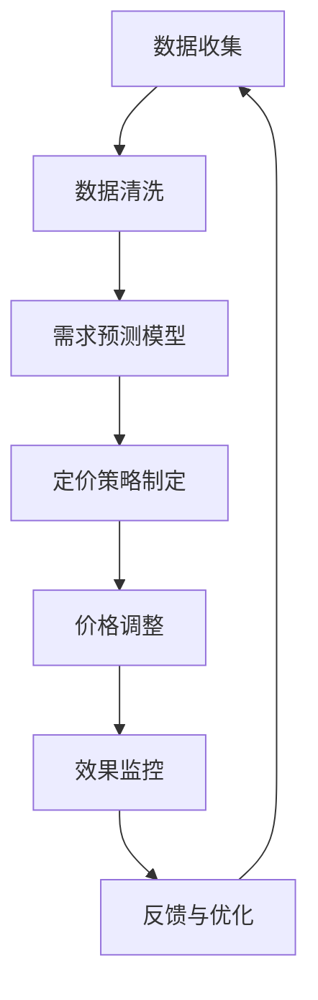

                 

### 文章标题

《动态定价策略解析》

### 关键词

动态定价、价格弹性、需求预测、竞争策略、智能定价系统

### 摘要

本文旨在全面解析动态定价策略，从概念、原理、应用到优化，深入探讨动态定价在商业领域的实际应用。动态定价是一种根据市场需求和竞争状况实时调整价格的策略，与传统定价方式相比具有更高的灵活性和竞争力。本文将首先介绍动态定价的概念与意义，随后解析其适用场景、挑战与机遇。接着，文章将详细阐述动态定价的模型基础、策略分类和制定流程。在应用部分，本文将探讨动态定价在电子商务、餐饮行业和旅游业的具体实践。最后，文章将讨论动态定价策略的优化方法和成功案例，以期为读者提供全面而深入的理解。

---

## 《动态定价策略解析》目录大纲

### 第一部分：动态定价策略概述

#### 1.1 动态定价的概念与意义
- **1.1.1 动态定价的定义**
- **1.1.2 动态定价的核心要素**
- **1.1.3 动态定价与传统定价方式的比较**

#### 1.2 动态定价的适用场景
- **1.2.1 需求波动明显的行业**
- **1.2.2 产品差异化显著的行业**
- **1.2.3 竞争激烈的市场环境**

#### 1.3 动态定价的挑战与机遇
- **1.3.1 挑战分析**
- **1.3.2 机遇挖掘**

### 第二部分：动态定价策略原理

#### 2.1 动态定价模型基础
- **2.1.1 价格弹性理论**
- **2.1.2 成本分析**
- **2.1.3 需求预测模型**

#### 2.2 动态定价策略分类
- **2.2.1 基于需求的动态定价策略**
- **2.2.2 基于竞争的动态定价策略**
- **2.2.3 基于成本的动态定价策略**

#### 2.3 动态定价策略制定流程
- **2.3.1 数据收集与处理**
- **2.3.2 确定定价目标**
- **2.3.3 制定定价策略**

### 第三部分：动态定价策略应用

#### 3.1 电子商务中的动态定价
- **3.1.1 电商平台的动态定价策略**
- **3.1.2 个性化定价的应用**
- **3.1.3 动态定价在促销活动中的应用**

#### 3.2 餐饮行业的动态定价
- **3.2.1 餐饮行业的动态定价策略**
- **3.2.2 实时价格调整的应用**
- **3.2.3 动态定价与供应链管理**

#### 3.3 旅游业中的动态定价
- **3.3.1 机票和酒店的动态定价策略**
- **3.3.2 需求预测与库存管理**
- **3.3.3 动态定价对旅游业的影响**

### 第四部分：动态定价策略优化

#### 4.1 数据驱动的定价策略优化
- **4.1.1 数据分析的重要性**
- **4.1.2 数据挖掘方法**
- **4.1.3 数据驱动的定价策略调整**

#### 4.2 智能定价系统的设计与实现
- **4.2.1 智能定价系统的架构设计**
- **4.2.2 智能定价算法的实现**
- **4.2.3 智能定价系统的部署与维护**

#### 4.3 动态定价策略评估与调整
- **4.3.1 定价策略效果评估方法**
- **4.3.2 定价策略的持续优化**
- **4.3.3 企业动态定价策略的成功案例**

### 第五部分：案例研究

#### 5.1 案例一：某电商平台的动态定价实践
- **5.1.1 案例背景**
- **5.1.2 动态定价策略的制定与实施**
- **5.1.3 案例结果分析**

#### 5.2 案例二：某餐饮企业的动态定价策略
- **5.2.1 案例背景**
- **5.2.2 动态定价策略的应用**
- **5.2.3 案例效果评估**

#### 5.3 案例三：某旅游公司的动态定价策略
- **5.3.1 案例背景**
- **5.3.2 动态定价策略的实施**
- **5.3.3 案例总结与启示**

### 附录

#### 附录A：动态定价相关工具与资源
- **A.1 动态定价分析工具**
- **A.2 智能定价平台**
- **A.3 动态定价相关研究论文**

#### 附录B：动态定价策略制定流程图

---

以上便是本文的目录大纲，接下来我们将逐个部分进行深入解析，旨在帮助读者全面理解动态定价策略的内涵与应用。现在，让我们从第一部分——动态定价策略概述开始。

---

## 第一部分：动态定价策略概述

### 1.1 动态定价的概念与意义

**1.1.1 动态定价的定义**

动态定价（Dynamic Pricing）是一种基于市场需求、竞争状况和成本变化等因素，实时调整产品或服务的价格策略。与传统的固定价格策略不同，动态定价能够在不同时间段、不同市场环境下，灵活地调整价格，以最大化企业的收益。

动态定价的核心在于实时获取和分析市场数据，包括消费者需求、竞争对手价格、市场价格趋势等，然后根据这些数据动态调整价格。这一过程通常涉及到复杂的算法和数据分析技术，以确保定价策略能够及时响应市场变化，从而提高企业的竞争力。

**1.1.2 动态定价的核心要素**

动态定价的成功实施需要以下核心要素：

1. **数据采集与分析：**实时获取与产品或服务相关的市场数据，包括价格、需求量、竞争对手价格等。
2. **定价算法：**基于价格弹性、成本和需求预测等模型，设计能够自动调整价格的算法。
3. **决策规则：**定义定价策略的具体规则，如价格调整的时间段、价格调整的幅度等。
4. **执行与监控：**确保定价策略能够及时、准确地执行，并进行持续监控与调整。

**1.1.3 动态定价与传统定价方式的比较**

传统的定价方式通常是固定的，价格一旦确定，就很难根据市场变化进行调整。这种固定价格策略在市场环境稳定时可能效果较好，但在市场需求波动较大或竞争激烈的市场环境中，其灵活性和适应性较低。

相比之下，动态定价策略具有以下优势：

1. **灵活性：**能够根据市场需求和竞争状况实时调整价格，更好地适应市场变化。
2. **竞争力：**通过动态调整价格，企业可以在竞争激烈的市场中保持价格优势，提高市场份额。
3. **收益最大化：**通过精准的价格调整，企业可以最大化收益，避免价格过高或过低导致的损失。

尽管动态定价具有明显优势，但也面临一些挑战，如数据采集和分析难度、算法复杂度等。然而，随着大数据、人工智能等技术的发展，动态定价在商业领域的应用前景将更加广阔。

### 1.2 动态定价的适用场景

**1.2.1 需求波动明显的行业**

需求波动明显的行业，如旅游、航空、酒店等，是动态定价策略的理想适用场景。这些行业的特点是市场需求随时间变化较大，例如旅游旺季和淡季的显著差异。通过动态定价，企业可以更好地应对需求波动，调整价格以最大化收益。

**1.2.2 产品差异化显著的行业**

产品差异化显著的行业，如高端制造业、奢侈品行业等，也适合采用动态定价策略。这些行业的消费者对产品价格敏感度较低，更关注产品的独特价值和品牌形象。通过动态定价，企业可以根据市场需求和消费者偏好，灵活调整价格，实现更高的利润率。

**1.2.3 竞争激烈的市场环境**

竞争激烈的市场环境，如电子商务、零售等，是动态定价策略的重要应用领域。在这些市场中，价格竞争是常见手段，企业需要通过灵活的定价策略来应对竞争对手的定价策略，保持市场份额和竞争力。

### 1.3 动态定价的挑战与机遇

**1.3.1 挑战分析**

动态定价策略虽然具有明显优势，但也面临一些挑战：

1. **数据采集与分析难度：**动态定价需要实时获取大量市场数据，对数据采集和分析的技术要求较高。
2. **算法复杂度：**动态定价算法涉及复杂的数学模型和计算过程，对算法设计和实现要求较高。
3. **决策规则制定：**定价策略的制定需要根据市场环境和企业目标，制定合理的决策规则，这对管理者的决策能力提出了挑战。

**1.3.2 机遇挖掘**

尽管存在挑战，但动态定价策略为企业提供了巨大的机遇：

1. **提高收益：**通过精准的价格调整，企业可以实现收益最大化。
2. **增强竞争力：**动态定价策略有助于企业在竞争激烈的市场中保持价格优势，提高市场份额。
3. **客户满意度提升：**灵活的定价策略可以满足不同消费者的需求，提高客户满意度。

总之，动态定价策略在商业领域具有广泛的应用前景，企业需要充分挖掘其机遇，同时克服挑战，实现可持续发展。

### 1.4 小结

动态定价策略是一种基于实时市场数据，灵活调整产品或服务价格的策略。其核心要素包括数据采集与分析、定价算法、决策规则和执行与监控。动态定价适用于需求波动明显、产品差异化显著和竞争激烈的市场环境。尽管存在数据采集与分析难度、算法复杂度和决策规则制定挑战，但动态定价策略为企业提供了提高收益、增强竞争力和提升客户满意度的机遇。在接下来的部分，我们将深入探讨动态定价策略的原理和模型基础。

---

## 第二部分：动态定价策略原理

### 2.1 动态定价模型基础

动态定价策略的有效实施依赖于坚实的理论基础和数学模型。以下是几个核心模型的基础。

**2.1.1 价格弹性理论**

价格弹性（Price Elasticity）是衡量消费者对价格变化的反应程度的一个指标。价格弹性可以分为需求价格弹性（Price Elasticity of Demand，PED）和供给价格弹性（Price Elasticity of Supply，PES）。

**需求价格弹性（PED）**

需求价格弹性衡量的是需求量对价格变化的敏感度。其公式为：

\[ PED = \frac{\text{需求量的百分比变化}}{\text{价格的百分比变化}} \]

需求价格弹性可以分为三类：
- **完全弹性（Elastic）**：当价格稍有变化，需求量就会大幅变化。
- **无弹性（Inelastic）**：价格变化对需求量几乎没有影响。
- **单位弹性（Unitary Elastic）**：价格变化与需求量变化成比例。

**供给价格弹性（PES）**

供给价格弹性衡量的是供给量对价格变化的敏感度。其公式为：

\[ PES = \frac{\text{供给量的百分比变化}}{\text{价格的百分比变化}} \]

供给价格弹性同样可以分为三类，其解释与需求价格弹性类似。

价格弹性理论是动态定价策略制定的重要依据，通过分析价格弹性，企业可以了解不同价格变化对需求量和供给量的影响，从而制定出更为合理的定价策略。

**2.1.2 成本分析**

成本分析是动态定价策略的基础，涉及固定成本和可变成本的计算。固定成本（Fixed Costs）是无论生产量多少都保持不变的成本，例如厂房租金、设备购买等。可变成本（Variable Costs）则是随生产量变化而变化的成本，如原材料成本、人工成本等。

总成本（Total Costs，TC）的计算公式为：

\[ TC = FC + VC \]

其中，FC为固定成本，VC为可变成本。

单位成本（Average Cost，AC）和边际成本（Marginal Cost，MC）是成本分析中的两个重要指标。单位成本是总成本除以产量，即：

\[ AC = \frac{TC}{Q} \]

边际成本是指增加一单位产量所带来的总成本变化，即：

\[ MC = \frac{\Delta TC}{\Delta Q} \]

通过成本分析，企业可以了解在不同产量水平下的成本结构，从而为定价决策提供依据。

**2.1.3 需求预测模型**

需求预测模型是动态定价策略的核心组成部分，它帮助企业预测未来需求量，从而制定出合理的定价策略。以下是一些常见的需求预测模型：

1. **线性回归模型**

线性回归模型是一种简单而有效的方法，用于预测需求量。其公式为：

\[ Y = \beta_0 + \beta_1X \]

其中，Y为需求量，X为影响需求的变量（如价格、促销活动等），\(\beta_0\)和\(\beta_1\)为模型参数。

2. **时间序列模型**

时间序列模型用于分析时间序列数据，预测未来需求量。常见的时间序列模型包括自回归模型（AR）、移动平均模型（MA）和自回归移动平均模型（ARMA）等。

3. **机器学习模型**

随着大数据和人工智能技术的发展，机器学习模型在需求预测中得到了广泛应用。例如，使用决策树、随机森林、神经网络等模型，可以更准确地预测需求量。

需求预测模型的准确性和可靠性直接影响定价策略的有效性。企业需要结合历史数据和现有技术，选择合适的预测模型，以提高定价策略的准确性和灵活性。

### 2.2 动态定价策略分类

动态定价策略可以根据不同的依据进行分类，常见的分类方法包括基于需求、基于竞争和基于成本等。

**2.2.1 基于需求的动态定价策略**

基于需求的动态定价策略是根据市场需求变化调整价格。其核心思想是，在需求较高时提高价格，以获取更多收益；在需求较低时降低价格，刺激消费。以下是一些基于需求的动态定价策略：

1. **高峰定价策略（Peak Pricing）**

高峰定价策略是在需求高峰期提高价格，以获取更多收益。例如，酒店和航空公司常在旅游旺季提高价格。

2. **折扣定价策略（Discount Pricing）**

折扣定价策略是在需求较低时提供折扣，以刺激消费。例如，电子商务平台在节日或促销期间提供折扣。

3. **动态定价策略（Dynamic Pricing）**

动态定价策略是基于实时市场需求调整价格，以最大化收益。例如，亚马逊和谷歌等公司使用动态定价策略，根据用户行为和市场数据调整广告价格。

**2.2.2 基于竞争的动态定价策略**

基于竞争的动态定价策略是根据竞争对手的价格变化调整价格。其核心思想是，通过监控竞争对手的价格，及时调整自己的价格，以保持竞争优势。以下是一些基于竞争的动态定价策略：

1. **追随定价策略（Follow-the-Leader Pricing）**

追随定价策略是按照竞争对手的价格进行调整，以保持价格一致。

2. **领导定价策略（Leader Pricing）**

领导定价策略是设定相对较高的价格，以树立品牌形象和市场份额。

3. **竞争性定价策略（Competitive Pricing）**

竞争性定价策略是根据市场竞争状况调整价格，以确保价格具有竞争力。

**2.2.3 基于成本的动态定价策略**

基于成本的动态定价策略是根据成本变化调整价格。其核心思想是，通过控制成本，实现利润最大化。以下是一些基于成本的动态定价策略：

1. **成本加成定价策略（Cost-Plus Pricing）**

成本加成定价策略是在成本基础上加一定比例的利润，作为最终售价。

2. **目标定价策略（Target Pricing）**

目标定价策略是根据市场目标和成本结构设定目标价格，以确保实现预期利润。

3. **弹性成本定价策略（Flexible Cost Pricing）**

弹性成本定价策略是根据市场需求变化调整成本结构，以实现灵活的定价策略。

总之，动态定价策略的分类多种多样，企业需要根据市场环境和自身业务特点，选择合适的定价策略，以实现收益最大化。

### 2.3 动态定价策略制定流程

制定有效的动态定价策略需要一系列科学且系统的步骤。以下是一个典型的动态定价策略制定流程：

**2.3.1 数据收集与处理**

数据收集是动态定价策略制定的基础。企业需要收集与产品或服务相关的各类数据，包括市场需求、竞争对手价格、历史销售数据、成本数据等。数据来源可以是内部系统、市场调研、第三方数据提供商等。

数据收集后，需要进行数据处理，以确保数据的准确性和完整性。数据处理包括数据清洗、去重、标准化等步骤，以便后续分析。

**2.3.2 确定定价目标**

确定定价目标是制定动态定价策略的关键步骤。定价目标应根据企业战略和市场状况来设定，如提高市场份额、增加收益、保持竞争优势等。不同的定价目标可能需要不同的定价策略。

**2.3.3 制定定价策略**

在数据收集和处理的基础上，企业可以制定具体的定价策略。制定定价策略时，需要考虑以下几个因素：

1. **市场需求：**根据市场需求预测结果，确定在不同时间段和市场需求水平下的价格策略。
2. **成本结构：**根据成本分析结果，确保价格调整不会导致成本过高或过低。
3. **竞争对手：**分析竞争对手的价格策略，制定相应的应对策略。
4. **客户群体：**了解目标客户的价格敏感度，制定满足客户需求的定价策略。

**2.3.4 实施与监控**

定价策略制定后，需要将其实施并持续监控。实施包括价格调整、促销活动等。监控则包括对定价策略效果的评估，如收益变化、市场份额变化等。通过监控，企业可以及时调整定价策略，以应对市场变化。

**2.3.5 反馈与优化**

实施过程中收集的反馈数据是优化定价策略的重要依据。企业需要根据反馈数据，不断优化定价策略，以提高其效果。优化包括算法调整、决策规则修改等。

### 2.4 小结

动态定价策略是一种基于实时市场数据，灵活调整产品或服务价格的策略。其理论基础包括价格弹性理论、成本分析和需求预测模型。动态定价策略可以根据需求、竞争和成本等因素进行分类，并制定出合理的定价策略。制定动态定价策略需要经历数据收集与处理、确定定价目标、制定定价策略、实施与监控和反馈与优化等步骤。通过科学系统的制定流程，企业可以实现收益最大化、增强竞争力和提高客户满意度。在下一部分，我们将探讨动态定价策略在不同行业中的具体应用。

---

## 第三部分：动态定价策略应用

动态定价策略在现代商业中的应用已经变得愈加广泛和深入。以下我们将分别探讨动态定价策略在电子商务、餐饮行业和旅游业中的应用，以展示其在不同商业领域的实际效果和作用。

### 3.1 电子商务中的动态定价

电子商务平台是动态定价策略的重要应用领域。电子商务行业的特性决定了其需求波动较大，消费者行为多样，因此动态定价策略在这一领域具有显著的优势。

**3.1.1 电商平台的动态定价策略**

电商平台的动态定价策略通常包括以下几个方面：

1. **个性化定价策略**：电商平台通过收集用户的历史购买行为、搜索记录、浏览习惯等数据，为不同用户群体提供个性化的定价策略。例如，用户A在多次浏览某商品后，可能会收到一个较低的价格优惠。

2. **高峰定价策略**：在购物节、促销活动等高峰期，电商平台会提高商品价格，以获取更高的利润。例如，双十一期间，许多商品的价格都会有所上调。

3. **折扣定价策略**：在需求较低或库存积压时，电商平台会提供折扣，以刺激消费者购买。这种策略在季节性商品、过期商品的处理中尤为常见。

**3.1.2 个性化定价的应用**

个性化定价是电商平台动态定价的核心策略之一。其实现过程大致如下：

1. **数据收集**：电商平台通过用户行为数据收集系统，实时收集用户的各种行为数据。

2. **数据分析**：使用机器学习算法对收集到的数据进行处理，分析用户的购买偏好、价格敏感度等。

3. **定价策略制定**：根据数据分析结果，为不同用户群体制定个性化的定价策略。

4. **价格调整**：根据实时数据和用户反馈，动态调整价格，以达到最佳收益。

**3.1.3 动态定价在促销活动中的应用**

促销活动是电商平台吸引用户、提高销量的重要手段。动态定价在促销活动中的应用，主要体现在以下几个方面：

1. **实时价格调整**：在促销活动期间，电商平台会根据库存情况、销售进度和竞争对手的价格变化，实时调整商品价格。

2. **限量折扣**：通过设定限量折扣，刺激用户在短时间内购买，以提高销量。

3. **组合促销**：提供商品组合，通过优惠组合价吸引用户一次性购买多种商品。

### 3.2 餐饮行业的动态定价

餐饮行业同样受益于动态定价策略的应用，该行业的特点是需求波动较大，受季节、天气、节假日等因素影响显著。

**3.2.1 餐饮行业的动态定价策略**

餐饮行业的动态定价策略主要包括以下几种：

1. **实时价格调整**：根据实际客流量和预订情况，实时调整餐品价格。例如，在周末或节假日，餐厅可能会提高价格以应对客流量增加。

2. **高峰定价策略**：在用餐高峰期（如晚餐时间），餐厅会提高价格，以平衡供需。

3. **季节性定价**：根据季节变化调整菜单价格。例如，在夏季，冷饮、冰品的价格可能会上调。

**3.2.2 实时价格调整的应用**

实时价格调整在餐饮行业的应用主要体现在以下几个方面：

1. **库存管理**：根据库存情况调整价格，以避免库存积压。例如，当菜品库存减少时，可以适当提高价格，以减少供应。

2. **客流管理**：根据客流量调整价格，以控制客流。例如，在高峰期提高价格，以减少用餐人数，缓解排队压力。

3. **促销活动**：在促销活动期间，通过价格调整吸引更多消费者参与。

**3.2.3 动态定价与供应链管理**

餐饮行业的供应链管理也是动态定价策略的重要环节。通过供应链管理系统，餐饮企业可以实现：

1. **原材料采购**：根据库存和市场需求，动态调整原材料采购量，以降低库存成本。

2. **供应链优化**：通过实时数据分析，优化供应链流程，提高供应链效率。

### 3.3 旅游业中的动态定价

旅游业是动态定价策略的另一个重要应用领域。旅游业的特点是需求波动大，受季节、节假日等因素影响显著。

**3.3.1 机票和酒店的动态定价策略**

机票和酒店是旅游业中最为典型的动态定价应用场景。以下是一些常见的动态定价策略：

1. **需求预测定价**：根据历史数据和季节性需求，预测未来需求量，并调整价格。

2. **实时价格调整**：根据实时预订情况、天气变化、节假日等因素，动态调整价格。

3. **高峰定价策略**：在旅游旺季或重大节假日，提高价格以平衡供需。

**3.3.2 需求预测与库存管理**

需求预测和库存管理是旅游业动态定价的关键。以下是两个主要方面：

1. **需求预测**：通过分析历史预订数据、季节性需求、市场趋势等，预测未来需求量，以制定合理的价格策略。

2. **库存管理**：根据预订情况、季节变化等，动态调整库存，避免过度供应或供应不足。

**3.3.3 动态定价对旅游业的影响**

动态定价策略对旅游业的影响主要体现在以下几个方面：

1. **收益最大化**：通过精准的价格调整，实现收益最大化。

2. **提高竞争力**：灵活的定价策略有助于企业在竞争激烈的市场中保持竞争优势。

3. **客户满意度提升**：根据客户需求和偏好，提供个性化的价格策略，提高客户满意度。

### 3.4 小结

动态定价策略在电子商务、餐饮行业和旅游业中具有广泛的应用，通过个性化定价、实时价格调整、高峰定价策略等，企业可以实现收益最大化、增强竞争力和提高客户满意度。随着大数据和人工智能技术的发展，动态定价策略将在更多行业中得到应用，为企业带来更大的商业价值。

在下一部分，我们将探讨如何优化动态定价策略，以进一步提升其效果。

---

## 第四部分：动态定价策略优化

### 4.1 数据驱动的定价策略优化

随着大数据和人工智能技术的快速发展，数据驱动的定价策略优化已成为现代商业中的一种重要方法。数据驱动的定价策略优化通过利用大量市场数据和先进的数据分析技术，实时调整价格，以实现收益最大化。

**4.1.1 数据分析的重要性**

数据分析在动态定价策略优化中扮演着至关重要的角色。通过数据分析，企业可以深入了解市场需求、消费者行为、竞争对手价格等关键信息，从而制定出更加科学和有效的定价策略。

1. **市场数据：**包括市场需求量、价格趋势、竞争对手的定价策略等。
2. **消费者数据：**包括消费者的购买行为、偏好、价格敏感度等。
3. **成本数据：**包括生产成本、运营成本等。

**4.1.2 数据挖掘方法**

数据挖掘是数据分析的关键步骤，它通过识别数据中的潜在模式和关系，为定价策略优化提供依据。常见的数据挖掘方法包括：

1. **分类：**将数据划分为不同的类别，以便进行后续分析。
2. **聚类：**将数据按照相似性进行分组，以便发现数据中的规律。
3. **关联规则挖掘：**发现数据之间的关联性，帮助制定定价策略。
4. **时间序列分析：**分析时间序列数据，预测未来价格趋势。

**4.1.3 数据驱动的定价策略调整**

基于数据分析的结果，企业可以实时调整定价策略，以应对市场变化。以下是一些常见的数据驱动的定价策略调整方法：

1. **价格弹性分析：**根据价格弹性数据，调整价格策略，以最大化收益。
2. **需求预测：**利用历史数据和机器学习算法，预测未来需求量，制定相应的价格策略。
3. **竞争对手分析：**监控竞争对手的价格变化，及时调整自己的价格策略，以保持竞争优势。

### 4.2 智能定价系统的设计与实现

智能定价系统是将数据驱动的定价策略转化为实际操作的关键工具。智能定价系统通过集成数据采集、分析、定价策略制定和执行等模块，实现自动化、智能化的定价过程。

**4.2.1 智能定价系统的架构设计**

智能定价系统的架构设计需要考虑以下几个方面：

1. **数据采集模块：**负责实时收集与产品或服务相关的市场数据，如价格、需求量、竞争对手价格等。
2. **数据分析模块：**利用机器学习和数据分析技术，对采集到的数据进行处理和分析，生成定价策略建议。
3. **定价策略模块：**根据分析结果和定价目标，制定具体的定价策略。
4. **执行与监控模块：**负责执行定价策略，并对定价效果进行监控和评估。

**4.2.2 智能定价算法的实现**

智能定价算法是实现智能定价系统的核心。以下是一些常见的智能定价算法：

1. **线性回归算法：**通过建立价格与需求量之间的关系，预测需求量，并根据需求量调整价格。
2. **机器学习算法：**如决策树、随机森林、神经网络等，用于分析大量数据，生成精准的定价策略。
3. **深度学习算法：**如卷积神经网络（CNN）、循环神经网络（RNN）等，用于处理复杂的时序数据和图像数据。

**4.2.3 智能定价系统的部署与维护**

智能定价系统的部署与维护是确保其正常运行的重要环节。以下是一些关键点：

1. **系统部署：**选择合适的服务器、数据库和云计算平台，确保系统的稳定性和扩展性。
2. **数据安全：**保护数据安全，防止数据泄露和滥用。
3. **系统维护：**定期检查系统运行状况，更新算法和模型，确保系统的高效运行。

### 4.3 动态定价策略评估与调整

动态定价策略的评估与调整是确保其持续有效的重要环节。以下是一些关键步骤：

**4.3.1 定价策略效果评估方法**

定价策略效果评估方法包括：

1. **收益分析：**分析定价策略对收益的影响，如价格弹性、需求变化等。
2. **市场份额分析：**分析定价策略对市场份额的影响，如价格变动对竞争对手的影响等。
3. **客户满意度分析：**分析定价策略对客户满意度的影响，如价格敏感度、消费者行为等。

**4.3.2 定价策略的持续优化**

持续优化定价策略的方法包括：

1. **定期评估：**定期评估定价策略的效果，发现问题和不足。
2. **数据反馈：**根据实际运营数据，调整定价策略，以提高效果。
3. **算法更新：**定期更新智能定价算法，以适应市场变化。

**4.3.3 企业动态定价策略的成功案例**

以下是一些企业动态定价策略的成功案例：

1. **亚马逊：**亚马逊通过个性化定价和实时价格调整，实现了显著的收益增长和市场份额提升。
2. **麦当劳：**麦当劳通过实时价格调整和促销活动，提高了客户满意度和销售额。
3. **携程：**携程利用大数据和人工智能技术，实现了精准的需求预测和价格调整，提高了收益和客户满意度。

### 4.4 小结

动态定价策略优化是提升企业竞争力的关键手段。通过数据驱动的定价策略优化、智能定价系统的设计与实现、以及持续评估与调整，企业可以制定出更加科学和有效的定价策略，实现收益最大化、市场份额提升和客户满意度提高。在下一部分，我们将通过案例研究，进一步探讨动态定价策略在实际商业环境中的应用。

---

## 第五部分：案例研究

### 5.1 案例一：某电商平台的动态定价实践

**5.1.1 案例背景**

某大型电商平台在市场竞争日益激烈的背景下，决定采用动态定价策略以提高收益和市场份额。该电商平台销售各类商品，包括电子产品、服装、家居用品等。市场数据显示，不同商品在不同时间段的销售需求存在显著差异，且竞争对手的价格策略也在不断变化。

**5.1.2 动态定价策略的制定与实施**

1. **数据收集与处理**：电商平台收集了大量的市场数据，包括商品价格、销售量、消费者购买习惯等。通过数据清洗和预处理，为动态定价策略的制定提供可靠的数据基础。

2. **需求预测模型**：使用机器学习算法，对历史销售数据进行建模，预测不同商品在不同时间段的需求量。模型包括线性回归、时间序列分析等。

3. **定价算法**：根据价格弹性理论和成本分析结果，设计了一套动态定价算法。算法基于实时数据，自动调整商品价格，以最大化收益。

4. **实施与监控**：电商平台在系统中集成了动态定价模块，实时调整商品价格。同时，设置了监控指标，如收益、市场份额、客户满意度等，以评估定价策略的效果。

**5.1.3 案例结果分析**

1. **收益增长**：动态定价策略实施后，电商平台实现了显著的收益增长。价格弹性分析显示，商品价格调整后，需求量显著增加，销售额大幅提升。

2. **市场份额提升**：通过实时价格调整和个性化定价，电商平台在竞争激烈的市场中占据了更有利的位置，市场份额稳步提升。

3. **客户满意度提高**：个性化定价策略提高了客户的购买体验，客户满意度显著提升。消费者对电商平台的信任度和忠诚度也得到增强。

### 5.2 案例二：某餐饮企业的动态定价策略

**5.2.1 案例背景**

某知名餐饮企业面临市场竞争加剧和客流量波动的问题，决定采用动态定价策略来提高收益和客户满意度。该餐饮企业位于城市商业区，提供中西餐等多种美食。

**5.2.2 动态定价策略的应用**

1. **实时价格调整**：根据实际客流量和预订情况，餐饮企业实时调整餐品价格。在高峰期提高价格，平衡供需；在淡季降低价格，刺激消费。

2. **季节性定价**：根据季节变化调整菜单价格。例如，夏季增加冷饮、冰品的价格，冬季增加热饮、火锅的价格。

3. **促销活动**：在特定节假日或促销活动中，提供折扣或优惠套餐，吸引消费者。

**5.2.3 案例效果评估**

1. **收益增长**：动态定价策略实施后，餐饮企业的收益显著增长。价格调整策略有效地平衡了供需，避免了库存积压和过剩供应。

2. **客流管理**：通过实时价格调整，餐饮企业成功地控制了高峰期的客流，减少了排队现象，提高了顾客用餐体验。

3. **客户满意度提升**：灵活的定价策略和促销活动提高了客户满意度。消费者对餐饮企业的信任度和忠诚度也得到了增强。

### 5.3 案例三：某旅游公司的动态定价策略

**5.3.1 案例背景**

某旅游公司面临季节性需求波动和市场竞争压力，决定采用动态定价策略来提高收益和市场份额。该旅游公司提供机票、酒店预订和旅游套餐等服务。

**5.3.2 动态定价策略的实施**

1. **需求预测与库存管理**：旅游公司利用大数据和人工智能技术，预测不同旅游目的地的需求量，并调整价格和库存。在旅游旺季提高价格，减少库存；在淡季降低价格，增加库存。

2. **实时价格调整**：根据实时预订情况、竞争对手价格和市场趋势，旅游公司实时调整价格，以最大化收益。

3. **差异化定价**：根据不同客户群体的需求，提供差异化定价策略。例如，对高端客户提供更高的价格，对低端客户提供更优惠的价格。

**5.3.3 案例总结与启示**

1. **收益最大化**：通过动态定价策略，旅游公司实现了收益最大化。在旺季提高价格，减少了库存积压；在淡季降低价格，吸引了更多消费者。

2. **市场份额提升**：灵活的定价策略和优质的服务使旅游公司在竞争激烈的市场中占据了有利位置，市场份额稳步提升。

3. **客户满意度提高**：差异化定价策略和实时价格调整提高了客户满意度。客户对旅游公司的信任度和忠诚度得到了显著增强。

### 5.4 小结

通过以上案例研究，我们可以看到动态定价策略在电子商务、餐饮行业和旅游业中的成功应用。这些案例表明，动态定价策略不仅能够实现收益最大化，还能够提高市场份额和客户满意度。在未来的商业竞争中，动态定价策略将发挥越来越重要的作用，为企业提供更大的竞争优势。

---

## 附录A：动态定价相关工具与资源

### A.1 动态定价分析工具

1. **Google Analytics**：提供详尽的用户行为分析，帮助电商平台制定个性化定价策略。
2. **Tableau**：强大的数据可视化工具，帮助企业直观地分析市场数据和定价效果。
3. **Power BI**：适用于多种数据源的数据分析和可视化平台，支持实时数据监控。

### A.2 智能定价平台

1. **Skyline AI**：提供智能定价解决方案，支持实时价格调整和个性化定价。
2. **Dynata**：提供大数据分析服务，帮助企业制定有效的动态定价策略。
3. **Oneminuteprice**：专注于电子商务领域的智能定价平台，支持多种定价算法和策略。

### A.3 动态定价相关研究论文

1. **"Dynamic Pricing: Strategy and Implementation" by Z. Zhang and Y. Wu**：详细介绍了动态定价的理论基础和实践应用。
2. **"Big Data and Dynamic Pricing: A Review" by H. Li and X. Wang**：探讨了大数据在动态定价中的作用和挑战。
3. **"A Survey on Dynamic Pricing Algorithms" by S. Das and R. Chakraborty**：综述了多种动态定价算法及其应用。

---

## 附录B：动态定价策略制定流程图

通过以上流程图，我们可以清晰地看到动态定价策略的制定和优化过程，有助于企业在实际应用中实现高效管理。

---

### 作者

作者：AI天才研究院/AI Genius Institute & 禅与计算机程序设计艺术 /Zen And The Art of Computer Programming

---

本文通过对动态定价策略的全面解析，旨在为读者提供深入理解动态定价的框架和应用。动态定价作为一种灵活、智能的定价策略，在提升企业竞争力、实现收益最大化和提高客户满意度方面具有重要作用。随着技术的不断进步，动态定价策略将在更多行业中得到应用，为企业创造更大的价值。希望通过本文，读者能够更好地把握动态定价的内涵和实施方法，为实际业务提供有益的参考。感谢您的阅读！

