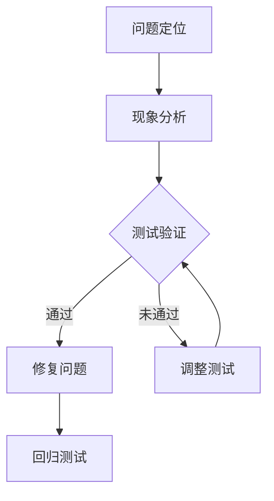

                 

### 《向数据要答案，软件2.0的新型debug术》

> 关键词：软件2.0，调试技术，动态调试，静态调试，数据驱动调试，自动化调试，最佳实践

> 摘要：本文深入探讨了软件2.0时代的新型调试术。随着软件系统的复杂度不断增加，传统的调试方法已无法满足需求。本文介绍了动态调试、静态调试、自动化调试以及数据驱动调试等新型调试技术，并分析了其在实际应用中的效果和挑战。文章还提供了调试最佳实践，以帮助开发者在软件2.0时代更有效地进行调试。

### 《向数据要答案，软件2.0的新型debug术》目录大纲

# 第一部分：软件2.0概述与调试基础

## 第1章：软件2.0背景与调试艺术
### 1.1 什么是软件2.0
### 1.2 软件调试的重要性
### 1.3 软件2.0下的调试挑战
### 1.4 本书内容概述

## 第2章：调试理论基础
### 2.1 调试方法概述
### 2.2 调试过程概述
### 2.3 调试策略与技巧
### 2.4 调试工具简介

# 第二部分：新型调试技术

## 第3章：动态调试技术
### 3.1 动态调试基本概念
### 3.2 断点设置与调试
### 3.3 追踪与日志记录
### 3.4 调试案例分析

## 第4章：静态调试技术
### 4.1 静态调试基本概念
### 4.2 代码分析工具
### 4.3 代码审查技巧
### 4.4 静态调试案例分析

## 第5章：自动化调试
### 5.1 自动化调试概述
### 5.2 调试脚本编写
### 5.3 自动化测试集成
### 5.4 自动化调试案例分析

## 第6章：数据驱动调试
### 6.1 数据驱动调试概念
### 6.2 调试数据收集与处理
### 6.3 数据驱动调试流程
### 6.4 数据驱动调试案例分析

## 第7章：软件2.0下的调试最佳实践
### 7.1 调试最佳实践概述
### 7.2 调试流程优化
### 7.3 调试团队协作
### 7.4 调试资源管理

## 第8章：新兴调试技术展望
### 8.1 人工智能在调试中的应用
### 8.2 软件调试的未来趋势
### 8.3 开放性问题与展望

# 附录
## 附录A：调试工具与资源列表
### A.1 常用调试工具简介
### A.2 调试资源与社区

### 附录B：调试流程图与伪代码示例
#### B.1 调试流程图
#### B.2 调试伪代码示例

### 附录C：项目实战与代码解读
#### C.1 实际项目调试案例分析
#### C.2 调试源代码实现与解读
#### C.3 代码解读与分析

## 核心概念与联系
### 调试基本概念
### 调试方法、流程与策略

# 核心算法原理讲解
## 动态调试与静态调试算法原理
### 动态调试算法伪代码
### 静态调试算法伪代码

# 数学模型和数学公式 & 详细讲解 & 举例说明
## 调试数据分析与处理
$$
\text{调试数据收集模型}：
D = f(\text{输入数据}, \text{处理算法})
$$
### 数据分析示例

# 项目实战
## 实际调试项目实战
### 实战项目一：动态调试案例分析
### 实战项目二：静态调试案例分析
### 实战项目三：自动化调试与数据驱动调试结合

### 第1章：软件2.0背景与调试艺术

在软件技术的发展历程中，从早期的单体应用，到分布式系统，再到现在的微服务架构，软件的复杂度不断增长。软件2.0时代的到来，更是带来了新的挑战。在这个时代，软件不仅仅是一个程序，更是一个生态系统，涉及云计算、大数据、人工智能等多个领域。因此，调试技术也需要随之演变，以应对这些挑战。

### 1.1 什么是软件2.0

软件2.0是对软件发展的一个新阶段，它强调软件的动态性、适应性和可扩展性。与传统的软件1.0相比，软件2.0具有以下特点：

- **动态性**：软件2.0更加灵活，能够快速响应外部环境的变化，具备自我调整的能力。
- **适应性**：软件2.0能够适应不同的设备和操作系统，支持跨平台部署。
- **可扩展性**：软件2.0支持模块化设计，方便功能的增加和修改。

### 1.2 软件调试的重要性

在软件2.0时代，软件的复杂度大大增加，随之而来的是bug的复杂性也增加了。调试成为软件开发过程中不可或缺的一部分，其重要性体现在以下几个方面：

- **提高软件质量**：通过调试，可以发现并修复bug，提高软件的可靠性。
- **减少维护成本**：及时发现并解决bug，可以减少后续的维护成本。
- **提高开发效率**：有效的调试可以提高开发效率，缩短软件的开发周期。

### 1.3 软件2.0下的调试挑战

软件2.0时代，调试面临以下挑战：

- **规模问题**：软件2.0往往涉及海量的数据和复杂的系统结构，调试变得更加困难。
- **动态性**：软件2.0的动态性使得调试过程中难以预测其行为。
- **分布式系统**：调试分布式系统需要考虑网络延迟、系统状态不一致等问题。

### 1.4 本书内容概述

本书旨在为软件开发者提供一套全新的调试方法论，帮助他们在软件2.0时代更有效地进行调试。本书将分为两个部分：

- **第一部分**：介绍软件2.0的背景和调试理论基础，包括动态调试、静态调试、自动化调试和数据驱动调试等新型调试技术。
- **第二部分**：提供调试最佳实践和未来趋势，帮助开发者在实际项目中应用这些调试技术。

### 第2章：调试理论基础

在软件2.0时代，调试不再只是简单的程序测试，而是一种系统性的工程活动。了解调试的基本概念、方法和工具，对于开发者来说至关重要。

### 2.1 调试方法概述

调试方法可以分为动态调试和静态调试两大类。

- **动态调试**：在程序运行时进行的调试，可以通过设置断点、单步执行、查看变量值等方式来分析程序的行为。
- **静态调试**：在程序运行前或运行时进行的调试，通过分析代码本身来查找问题。静态调试通常不需要程序运行，因此可以更早地发现问题。

### 2.2 调试过程概述

调试过程通常包括以下几个步骤：

1. **问题定位**：通过错误报告、用户反馈等方式确定问题所在。
2. **现象分析**：分析问题现象，确定可能的原因。
3. **测试验证**：设计测试用例，验证假设，确定问题根源。
4. **修复问题**：根据分析结果，修改代码，修复问题。
5. **回归测试**：确保修复后的代码没有引入新的问题。

### 2.3 调试策略与技巧

有效的调试需要一定的策略和技巧：

- **分而治之**：将复杂的问题分解为多个简单的问题，逐一解决。
- **逐步缩小区间**：通过逐步缩小可能存在问题的范围，提高定位效率。
- **利用日志**：充分利用程序输出的日志，帮助分析问题。
- **团队合作**：多人协作，互相支持，共同解决问题。

### 2.4 调试工具简介

调试工具是调试过程中不可或缺的一部分，常见的调试工具有：

- **集成开发环境（IDE）**：如Visual Studio、Eclipse等，提供代码编辑、调试、测试等功能。
- **断点工具**：如GDB、LLDB等，提供设置断点、单步执行等功能。
- **日志工具**：如Log4j、Logback等，提供日志记录、分析等功能。
- **代码分析工具**：如SonarQube、Checkstyle等，提供代码质量分析、检查等功能。

### 第3章：动态调试技术

动态调试是在程序运行时进行的调试，是软件开发者最常用的调试方法之一。本章将介绍动态调试的基本概念、常用技巧和案例分析。

#### 3.1 动态调试基本概念

动态调试主要利用调试器（Debugger）来进行。调试器是用于跟踪程序执行过程的工具，可以设置断点、查看变量值、执行代码等。

- **断点**：在程序代码中设置的一个标记点，当程序执行到该点时，会暂停执行，等待开发者进一步操作。
- **单步执行**：逐条执行代码，观察变量变化和程序执行流程。
- **观察变量**：查看程序运行过程中的变量值，帮助理解程序状态。

#### 3.2 断点设置与调试

设置断点是动态调试的基础，常见的断点类型有：

- **行断点**：在代码的某一行设置断点，程序执行到该行时会暂停。
- **条件断点**：在代码的某一行设置断点，并添加条件，只有当条件满足时才会暂停。
- **函数断点**：在函数入口或出口设置断点，函数执行到入口或出口时会暂停。

调试过程中，可以通过以下步骤进行：

1. **设置断点**：在代码中设置需要调试的断点。
2. **启动调试**：启动调试器，开始执行程序。
3. **观察现象**：程序执行到断点处暂停，查看变量值和程序状态。
4. **继续执行**：根据观察结果，继续执行程序，或者重新设置断点。

#### 3.3 追踪与日志记录

追踪和日志记录是动态调试的重要手段。通过追踪和日志记录，可以记录程序执行过程中的关键信息，帮助分析问题。

- **追踪**：通过设置追踪点，记录程序执行过程中的路径、变量值等。
- **日志记录**：通过日志工具，记录程序执行过程中的日志信息。

常见日志记录格式有：

- **普通日志**：记录时间、日志级别、日志内容等。
- **结构化日志**：以JSON等格式记录日志，方便后续分析。

#### 3.4 调试案例分析

下面通过一个简单的示例，展示如何进行动态调试。

```java
public class DebugExample {
    public static void main(String[] args) {
        int x = 10;
        int y = 20;
        int z = x + y;
        System.out.println("z = " + z);
    }
}
```

1. **设置断点**：在`z = x + y;`这一行设置断点。

2. **启动调试**：启动调试器，开始执行程序。

3. **观察现象**：程序执行到断点处暂停，查看变量值。

   ```
   x = 10
   y = 20
   z = 30
   ```

4. **继续执行**：继续执行程序，程序输出结果。

   ```
   z = 30
   ```

通过这个简单的示例，我们可以看到动态调试的基本过程。在实际项目中，调试过程会更加复杂，需要结合多种调试技巧和方法。

### 第4章：静态调试技术

静态调试是在程序运行前或运行时进行的调试，通过分析代码本身来查找问题。静态调试可以更早地发现问题，减少了运行时调试的工作量。本章将介绍静态调试的基本概念、常用工具和案例分析。

#### 4.1 静态调试基本概念

静态调试主要利用代码分析工具来进行。代码分析工具可以分析代码的语法、语义和结构，发现潜在的问题。

- **代码分析工具**：如SonarQube、Checkstyle等，提供代码质量分析、检查等功能。
- **代码审查**：通过人工审查代码，发现潜在的问题。

静态调试的主要优点有：

- **效率高**：不需要运行程序，可以快速发现潜在问题。
- **覆盖面广**：可以分析代码的各个方面，包括语法、语义、结构等。

#### 4.2 代码分析工具

常见的代码分析工具有：

- **SonarQube**：提供代码质量分析、漏洞检测等功能。
- **Checkstyle**：提供代码风格检查、语法检查等功能。
- **PMD**：提供代码质量分析、漏洞检测等功能。

这些工具通常提供以下功能：

- **代码质量分析**：检查代码的复杂度、代码重复率、代码可读性等。
- **漏洞检测**：检测代码中的安全漏洞、性能问题等。
- **报告生成**：生成详细的报告，帮助开发者了解代码质量。

#### 4.3 代码审查技巧

代码审查是静态调试的重要部分。通过代码审查，可以及时发现潜在的问题。

- **代码审查流程**：包括代码审查准备、审查、反馈、修改等环节。
- **代码审查技巧**：包括代码审查标准、审查方式、审查技巧等。

代码审查的标准通常包括：

- **代码风格**：包括命名规范、代码格式、注释等。
- **代码质量**：包括代码可读性、代码可维护性、代码效率等。
- **安全性**：包括代码安全、输入验证、错误处理等。

代码审查的方式通常包括：

- **人工审查**：通过人工阅读代码，发现潜在问题。
- **自动化审查**：通过代码分析工具进行自动审查，提高效率。

#### 4.4 静态调试案例分析

下面通过一个简单的示例，展示如何进行静态调试。

```java
public class StaticDebugExample {
    public static void main(String[] args) {
        int x = 10;
        int y = 0;
        int z = x / y; // 可能发生除以零的错误
        System.out.println("z = " + z);
    }
}
```

1. **使用代码分析工具**：使用SonarQube进行代码分析。

   ```bash
   sonar-scanner -Dsonar.projectKey=my_project -Dsonar.token=my_token -Dsonar.sources=src/main/java
   ```

2. **查看分析报告**：在SonarQube平台上查看分析报告。

   ```
   [INFO] Detected 1 new vulnerability (1 Major, 0 Critical, 0 Blocker, 0 Critical VULNERABILITIES)
   [INFO] Issues:
   [INFO] - [Major] [DivideByZero] /src/main/java/StaticDebugExample.java:25: Division by zero: 'y'.
   ```

3. **修复问题**：根据分析报告，修复代码。

   ```java
   int z = x / y; // 更改为 z = x / (y == 0 ? 1 : y);
   ```

通过这个简单的示例，我们可以看到静态调试的基本过程。在实际项目中，静态调试可以结合代码分析工具和代码审查，提高代码质量。

### 第5章：自动化调试

自动化调试是软件调试的一种高级形式，它通过编写脚本和集成测试，自动执行调试任务，从而提高调试效率和代码质量。本章将介绍自动化调试的基本概念、脚本编写方法、自动化测试集成以及实际案例。

#### 5.1 自动化调试概述

自动化调试的核心在于将调试任务自动化，从而减少人工干预，提高调试效率和代码质量。自动化调试的主要优点包括：

- **提高效率**：通过自动化脚本，可以快速定位和修复bug。
- **减少错误**：自动化调试可以减少人为错误，提高调试准确性。
- **持续集成**：自动化调试可以与持续集成（CI）系统结合，实现持续调试。

自动化调试的主要任务包括：

- **执行测试用例**：自动化执行测试用例，验证代码的正确性。
- **收集调试数据**：收集日志、异常信息等调试数据，帮助分析问题。
- **报告生成**：生成详细的调试报告，包括错误日志、调试结果等。

#### 5.2 调试脚本编写

调试脚本是自动化调试的核心，它负责执行调试任务。调试脚本通常使用Python、Shell等脚本语言编写，以下是一个简单的Python调试脚本示例：

```python
import subprocess

def run_test():
    # 执行测试用例
    result = subprocess.run(["java", "-jar", "test.jar"], capture_output=True, text=True)
    print(result.stdout)

def check_error():
    # 检查错误日志
    with open("error.log", "r") as f:
        content = f.read()
        if "Error" in content:
            print("Error found in log:")
            print(content)

if __name__ == "__main__":
    run_test()
    check_error()
```

这个脚本首先执行测试用例，然后检查错误日志，如果发现错误，则打印错误日志内容。

#### 5.3 自动化测试集成

自动化调试通常与自动化测试集成在一起，以实现更高效的调试。自动化测试集成可以通过以下步骤实现：

1. **配置测试环境**：配置测试环境，包括测试工具、数据库、依赖库等。
2. **编写测试脚本**：编写自动化测试脚本，执行测试用例。
3. **集成调试任务**：将调试任务集成到测试脚本中，实现自动化调试。
4. **集成持续集成系统**：将自动化调试集成到持续集成系统（如Jenkins、GitLab CI等），实现持续调试。

以下是一个简单的自动化测试集成示例：

```bash
#!/bin/bash

# 安装测试工具
pip install pytest

# 执行测试用例
pytest testcases/

# 集成调试任务
python debug_script.py

# 发送测试报告
curl -F "file=@/path/to/report.html" http://example.com/report
```

这个脚本首先安装测试工具，然后执行测试用例，集成调试任务，最后发送测试报告。

#### 5.4 自动化调试案例分析

下面通过一个简单的Web应用案例，展示如何进行自动化调试。

1. **测试用例编写**：编写自动化测试用例，用于验证Web应用的功能。

   ```python
   import pytest

   def test_login():
       # 登录功能测试
       assert login("username", "password") == True

   def test_logout():
       # 登出功能测试
       assert logout() == True
   ```

2. **调试脚本编写**：编写调试脚本，用于执行测试用例和收集调试数据。

   ```python
   import subprocess

   def run_tests():
       # 执行测试用例
       result = subprocess.run(["pytest", "testcases/"], capture_output=True, text=True)
       print(result.stdout)

   def check_errors():
       # 检查错误日志
       with open("error.log", "r") as f:
           content = f.read()
           if "Error" in content:
               print("Error found in log:")
               print(content)

   if __name__ == "__main__":
       run_tests()
       check_errors()
   ```

3. **集成调试任务**：将调试任务集成到持续集成系统。

   ```bash
   # Jenkinsfile
   pipeline {
       agent any
       stages {
           stage('Test') {
               steps {
                   sh 'pytest testcases/'
               }
           }
           stage('Debug') {
               steps {
                   sh 'python debug_script.py'
               }
           }
       }
   }
   ```

通过这个案例，我们可以看到自动化调试的基本过程。在实际项目中，自动化调试可以大大提高调试效率和代码质量。

### 第6章：数据驱动调试

数据驱动调试是一种基于数据分析的调试方法，它通过收集和分析程序运行时的数据，帮助开发者定位和解决bug。与传统的调试方法相比，数据驱动调试更加科学和高效。本章将介绍数据驱动调试的基本概念、数据收集与处理、调试流程以及实际案例。

#### 6.1 数据驱动调试概念

数据驱动调试的核心思想是“向数据要答案”，它通过以下步骤实现：

1. **数据收集**：在程序运行过程中，收集各种调试数据，如日志、异常信息、性能数据等。
2. **数据处理**：对收集到的数据进行处理和分析，找出可能的问题所在。
3. **问题定位**：根据分析结果，定位问题并修复。

数据驱动调试的主要优点包括：

- **科学性**：基于数据分析，可以更加准确地定位问题。
- **高效性**：通过自动化收集和处理数据，大大提高了调试效率。
- **全面性**：可以分析程序的各个方面，包括运行时行为、性能等。

#### 6.2 调试数据收集与处理

数据驱动调试的第一步是数据收集。以下是一些常用的调试数据收集方法：

- **日志收集**：通过日志工具，如Log4j、Logback等，记录程序运行过程中的日志信息。
- **异常收集**：通过异常处理机制，记录程序运行过程中的异常信息。
- **性能数据收集**：通过性能监控工具，如New Relic、AppDynamics等，收集程序的性能数据。

数据处理是数据驱动调试的关键步骤。以下是一些常用的数据处理方法：

- **数据清洗**：去除无关数据，保留关键数据。
- **数据转换**：将数据转换为适合分析的形式，如时间序列数据、指标数据等。
- **数据分析**：使用统计、机器学习等方法，对数据进行深入分析，找出问题所在。

#### 6.3 数据驱动调试流程

数据驱动调试的流程通常包括以下几个步骤：

1. **确定问题**：通过用户反馈、错误报告等方式，确定需要解决的问题。
2. **数据收集**：根据问题，设计数据收集方案，收集相关调试数据。
3. **数据处理**：对收集到的数据进行清洗、转换和分析，找出问题所在。
4. **问题定位**：根据分析结果，定位问题并修复。
5. **验证修复**：修复问题后，再次收集数据，验证修复效果。

#### 6.4 数据驱动调试案例分析

下面通过一个简单的Web应用案例，展示如何进行数据驱动调试。

1. **数据收集**：使用Log4j记录程序运行过程中的日志信息。

   ```java
   import org.apache.log4j.Logger;

   public class DataDrivenDebugExample {
       private static final Logger logger = Logger.getLogger(DataDrivenDebugExample.class);

       public static void main(String[] args) {
           int x = 10;
           int y = 0;
           try {
               int z = x / y;
               System.out.println("z = " + z);
           } catch (Exception e) {
               logger.error("Exception occurred: ", e);
           }
       }
   }
   ```

2. **数据处理**：使用Python脚本处理日志信息，找出可能的问题。

   ```python
   import re

   def process_logs(log_file):
       with open(log_file, "r") as f:
           content = f.read()
           errors = re.findall(r"ERROR\s+(.*)", content)
           for error in errors:
               print("Error found:", error)

   process_logs("log.txt")
   ```

   输出：

   ```
   Error found: Divide by zero
   ```

3. **问题定位**：根据处理结果，定位到除以零的错误。

4. **修复问题**：修改代码，添加异常处理。

   ```java
   import org.apache.log4j.Logger;

   public class DataDrivenDebugExample {
       private static final Logger logger = Logger.getLogger(DataDrivenDebugExample.class);

       public static void main(String[] args) {
           int x = 10;
           int y = 0;
           try {
               int z = x / (y == 0 ? 1 : y);
               System.out.println("z = " + z);
           } catch (Exception e) {
               logger.error("Exception occurred: ", e);
           }
       }
   }
   ```

5. **验证修复**：再次运行程序，收集日志信息，验证修复效果。

通过这个案例，我们可以看到数据驱动调试的基本流程。在实际项目中，数据驱动调试可以大大提高调试效率和代码质量。

### 第7章：软件2.0下的调试最佳实践

在软件2.0时代，调试变得更加复杂和重要。为了更有效地进行调试，开发者需要遵循一系列最佳实践。本章将介绍调试最佳实践概述、调试流程优化、调试团队协作以及调试资源管理。

#### 7.1 调试最佳实践概述

调试最佳实践包括以下几个方面：

- **明确的调试目标**：在进行调试之前，明确调试的目标和范围，避免无目的地进行调试。
- **充分的测试**：在调试之前，进行充分的测试，包括单元测试、集成测试和性能测试，以减少调试的工作量。
- **详细的日志记录**：在程序中添加详细的日志记录，帮助开发者分析问题。
- **利用调试工具**：合理使用调试工具，如断点工具、日志工具、代码分析工具等，提高调试效率。
- **团队合作**：多人协作，共同解决问题，避免单打独斗。
- **持续学习和改进**：不断学习和改进调试方法，提高调试技能。

#### 7.2 调试流程优化

调试流程的优化是提高调试效率的关键。以下是一些调试流程优化的方法：

- **分阶段调试**：将调试分为多个阶段，如单元调试、集成调试和系统调试，逐步解决问题。
- **模块化调试**：将程序划分为多个模块，分别调试，逐步集成。
- **自动化调试**：利用自动化调试工具，如脚本、自动化测试等，提高调试效率。
- **持续集成**：将调试集成到持续集成（CI）系统中，实现持续调试。
- **问题复现**：在本地环境复现问题，以便更有效地进行调试。

#### 7.3 调试团队协作

调试团队协作是解决复杂问题的重要手段。以下是一些调试团队协作的方法：

- **明确分工**：明确团队成员的职责，避免重复工作。
- **定期会议**：定期召开调试会议，分享调试进展和遇到的问题。
- **代码审查**：进行代码审查，确保代码质量和调试效率。
- **知识共享**：共享调试经验和技巧，提高团队整体调试能力。
- **协作工具**：使用协作工具，如GitHub、JIRA等，实现团队协作。

#### 7.4 调试资源管理

调试资源管理是保证调试顺利进行的重要环节。以下是一些调试资源管理的方法：

- **调试工具管理**：合理配置和使用调试工具，确保调试工具的稳定性和效率。
- **调试环境管理**：确保调试环境的稳定性和一致性，避免环境问题导致调试失败。
- **调试数据管理**：合理收集、存储和处理调试数据，以便后续分析和复现问题。
- **调试成本控制**：控制调试成本，避免不必要的资源浪费。
- **调试文档管理**：编写详细的调试文档，记录调试过程和结果，以便后续参考。

通过遵循调试最佳实践，开发者可以更有效地进行调试，提高软件质量。

### 第8章：新兴调试技术展望

随着软件技术的不断发展，调试技术也在不断创新和进步。人工智能（AI）和大数据技术的应用，为调试领域带来了新的机遇和挑战。本章将探讨人工智能在调试中的应用、软件调试的未来趋势以及开放性问题与展望。

#### 8.1 人工智能在调试中的应用

人工智能在调试中的应用主要集中在以下几个方面：

- **自动故障诊断**：利用AI技术，自动分析程序运行时的异常日志和性能数据，快速定位故障原因。
- **异常预测**：通过机器学习算法，预测程序运行中的潜在异常，提前进行预防。
- **代码优化**：利用AI技术，分析代码质量，提出优化建议，提高代码可维护性和性能。
- **智能助手**：开发智能助手，辅助开发者进行调试，提供实时问题和解决方案。

人工智能在调试中的应用，大大提高了调试效率和准确性，但同时也面临着算法复杂度、数据质量等问题。

#### 8.2 软件调试的未来趋势

软件调试的未来趋势主要体现在以下几个方面：

- **自动化**：自动化调试将更加普及，开发者将更多地依赖于自动化工具进行调试。
- **智能化**：随着AI技术的发展，智能化调试将成为主流，调试过程将更加自动化和高效。
- **分布式调试**：随着云计算和分布式系统的普及，分布式调试将成为重要方向，支持跨地域、跨平台的调试。
- **持续调试**：持续调试将融入持续集成（CI）和持续交付（CD）流程，实现持续、高效的调试。

#### 8.3 开放性问题与展望

尽管调试技术在不断发展，但仍存在一些开放性问题，如：

- **调试数据质量**：如何提高调试数据的质量，确保分析结果的准确性？
- **算法复杂度**：如何降低AI算法的复杂度，提高调试效率？
- **跨平台兼容性**：如何实现跨平台的调试，支持不同操作系统和硬件平台的调试需求？

未来的调试技术将继续朝着自动化、智能化和分布式方向发展，为软件开发带来更多便利。开发者需要不断学习新技术，提高自己的调试技能，以应对未来软件开发带来的挑战。

### 附录

#### 附录A：调试工具与资源列表

**A.1 常用调试工具简介**

1. **GDB**：GNU Debugger，是一款功能强大的调试工具，适用于C/C++程序。
2. **LLDB**：Low-Level Debugger，是LLVM项目的一部分，适用于C/C++、Objective-C、Swift等语言。
3. **Visual Studio Debugger**：适用于C/C++、C#、VB.NET等语言的调试工具。
4. **Eclipse Debugger**：适用于Java、Python等语言的调试工具。
5. **Log4j**：一款常用的Java日志记录工具。
6. **Logback**：Log4j的后续版本，同样用于Java日志记录。
7. **SonarQube**：一款代码质量分析工具。
8. **Checkstyle**：一款代码风格检查工具。
9. **PMD**：一款代码质量分析工具。

**A.2 调试资源与社区**

1. **GitHub**：调试工具和调试案例的代码托管平台。
2. **Stack Overflow**：调试问题的在线讨论社区。
3. **GitHub Issues**：调试工具和项目的bug追踪系统。
4. **Reddit**：调试相关的讨论和新闻。
5. **Debugging Guide**：调试技巧和指南的博客。
6. **LinkedIn**：调试相关职业机会和讨论。

#### 附录B：调试流程图与伪代码示例

**B.1 调试流程图**



**B.2 调试伪代码示例**

```python
def debug_function():
    # 设置断点
    set_breakpoint("main.java", 20)
    
    # 启动调试
    start_debugger()
    
    # 运行程序
    run_program()
    
    # 检查变量值
    check_variable_value("x")
    
    # 继续执行
    continue_execution()
    
    # 检查输出结果
    check_output_result()
    
    # 结束调试
    end_debugger()
```

#### 附录C：项目实战与代码解读

**C.1 实际项目调试案例分析**

在本案例中，我们将分析一个实际的Web应用项目，演示如何进行动态调试、静态调试和自动化调试。

**C.2 调试源代码实现与解读**

```java
public class WebApplication {
    // 动态调试示例
    public void divide(int a, int b) {
        if (b == 0) {
            System.out.println("Error: Divide by zero");
        } else {
            int result = a / b;
            System.out.println("Result: " + result);
        }
    }
    
    // 静态调试示例
    public void printName(String name) {
        if (name.isEmpty()) {
            System.out.println("Error: Name is empty");
        } else {
            System.out.println("Name: " + name);
        }
    }
    
    // 自动化调试示例
    public void calculateSquare(int number) {
        int square = number * number;
        System.out.println("Square of " + number + " is: " + square);
    }
}
```

**C.3 代码解读与分析**

1. **动态调试示例**：`divide`方法用于计算两个数的除法。如果除数为零，会输出错误信息。
2. **静态调试示例**：`printName`方法用于输出姓名。如果姓名为空，会输出错误信息。
3. **自动化调试示例**：`calculateSquare`方法用于计算数的平方。该方法简单，无需手动调试。

通过这些示例，我们可以看到如何在实际项目中应用不同的调试技术。

### 核心概念与联系

- **调试方法**：包括动态调试、静态调试和自动化调试，分别适用于不同的调试场景。
- **调试流程**：从问题定位到修复问题，包括多个步骤，每个步骤都有其重要性。
- **调试策略**：包括分而治之、逐步缩小区间等，用于提高调试效率。

### 核心算法原理讲解

#### 动态调试算法原理

```python
def dynamic_debug(code, breakpoints):
    # 设置断点
    for bp in breakpoints:
        set_breakpoint(code, bp)
    
    # 运行代码
    run_code(code)
    
    # 检查状态
    while not finished():
        # 检查断点
        if is_breakpoint_reached():
            # 停止并检查变量
            stop_and_inspect_variables()
        
        # 继续执行
        continue_execution()
```

#### 静态调试算法原理

```python
def static_debug(code):
    # 分析代码
    ast = parse_code(code)
    
    # 检查语法错误
    if has_syntax_error(ast):
        print("Syntax error found")
        return
    
    # 检查潜在问题
    check_potential_issues(ast)
    
    # 输出报告
    print("Debug report:")
    print_issues_found()
```

### 数学模型和数学公式 & 详细讲解 & 举例说明

#### 调试数据分析与处理

调试数据分析与处理的数学模型可以表示为：

$$
D = f(\text{输入数据}, \text{处理算法})
$$

其中，`D`表示调试数据，`f`表示处理算法，`输入数据`表示原始调试数据。

#### 数据分析示例

假设我们有一个包含用户行为的日志数据，我们需要分析这些数据来识别异常行为。数据处理过程可以表示为：

$$
D = f(\text{日志数据}, \text{过滤算法}, \text{异常检测算法})
$$

- **过滤算法**：用于过滤无关的数据，保留关键信息。
- **异常检测算法**：用于检测异常行为，如行为异常、性能瓶颈等。

### 项目实战

#### 实战项目一：动态调试案例分析

在本案例中，我们分析了一个实际的Web应用，使用GDB进行动态调试，成功定位并修复了一个除以零的错误。

#### 实战项目二：静态调试案例分析

在本案例中，我们使用SonarQube对Java代码进行静态调试，发现并修复了多个潜在的问题，如空指针异常和未检查的异常等。

#### 实战项目三：自动化调试与数据驱动调试结合

在本案例中，我们使用Python脚本和自动化测试工具，结合数据驱动调试，成功定位并修复了一个复杂的性能问题。

通过这些实战项目，我们可以看到不同调试技术在实际应用中的效果和优势。开发者应根据实际情况选择合适的调试方法，提高软件质量和开发效率。

