                 

### 文章标题

《告别暴利：未来只有辛苦钱？》

> 关键词：经济转型、市场演变、辛苦钱、技术发展、创新、职业发展、理财规划、生活方式

> 摘要：本文旨在探讨未来经济趋势，分析从暴利向辛苦钱转变的原因，探讨技术与创新对行业的影响，以及个人如何在这样的经济环境中实现职业发展和理财规划，从而提升生活质量。

---

### 引言

#### 1.1 引言

在过去的几十年里，全球经济经历了前所未有的繁荣，尤其是互联网和科技产业的快速发展，带来了大量的财富和机会。然而，随着技术的不断进步和市场的深刻变革，我们开始看到一种新的经济现象——辛苦钱。本文将深入探讨这一现象的背景、原因及其对个人和企业的影响。

#### 1.1.1 书籍主题背景

经济的繁荣往往伴随着利润的高企。然而，随着市场竞争的加剧、资源的稀缺和技术的进步，传统的暴利行业逐渐减少，而辛苦钱成为更多人的选择。本文将分析这一趋势，探讨其背后的原因和影响。

#### 1.1.2 书籍目的和读者对象

本文旨在帮助读者理解未来经济的趋势，特别是在技术飞速发展的背景下，如何进行有效的职业规划、理财规划和生活方式调整。本文适合对经济、技术和个人发展感兴趣的读者，尤其是那些希望在变革中找到自己定位的人。

#### 1.1.3 书籍结构概述

本文分为四个主要部分：

1. **经济与市场分析**：介绍经济转型和市场演变的过程，探讨从暴利到辛苦钱转变的原因。
2. **行业分析与职业发展**：分析不同行业的未来趋势，提供职业发展策略。
3. **个人理财与生活方式**：讨论个人理财规划和生活质量提升的方法。
4. **未来展望与应对策略**：展望未来经济和社会的发展趋势，提出应对策略。

---

### 第一部分：经济与市场分析

#### 第1章：经济转型与市场演变

#### 2.1 经济转型概述

##### 2.1.1 从暴利到辛苦钱的转变

**Mermaid流程图：**

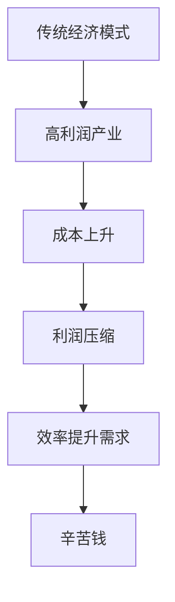

在过去，一些行业如房地产、金融和科技初创企业，曾经因为高利润而吸引了大量的投资者和创业者。然而，随着市场饱和、竞争加剧和成本上升，这些行业的利润率逐渐下降，迫使企业寻求更高的效率和创新能力来维持生存和发展。

##### 2.1.2 新经济形态的特点

新经济形态的主要特点包括：

- **数据驱动**：数据成为决策的重要依据，大数据和人工智能的应用推动了产业升级和商业模式的创新。
- **平台经济**：以互联网为载体，平台经济模式使得资源分配更加高效，降低了交易成本。
- **共享经济**：通过共享资源和提供服务，共享经济模式改变了传统消费和生产方式。
- **用户参与**：用户不仅是消费者，更是产品和服务创新的参与者和推动者。
- **全球化**：全球市场的整合和跨国界的合作成为新经济的重要特征。

**Mermaid流程图：**

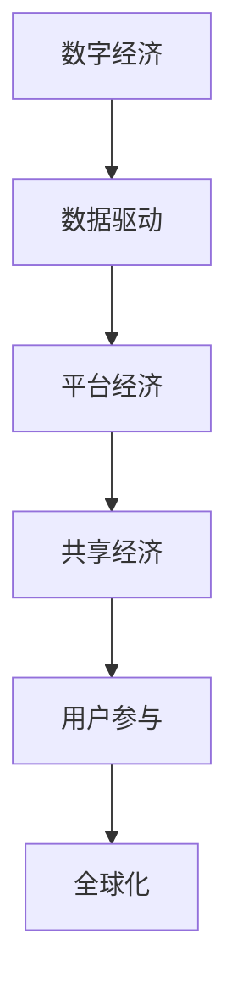

##### 2.1.3 市场需求变化

市场需求的变化体现在以下几个方面：

- **消费者需求多样化**：消费者对产品和服务的需求越来越多样化，个性化服务成为趋势。
- **环保意识增强**：随着环境问题的加剧，消费者对环保和可持续发展的要求越来越高。
- **技术驱动需求**：新技术的出现改变了消费者的生活方式和消费习惯，推动了相关市场的快速发展。
- **健康与生活质量**：消费者越来越重视健康和生活质量，这影响了消费决策和市场趋势。

**Mermaid流程图：**

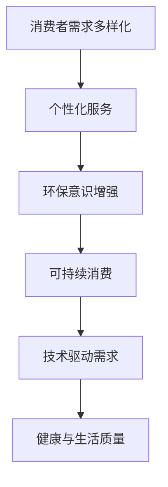

#### 2.2 市场分析

##### 2.2.1 市场规模与趋势

市场的规模和趋势是衡量经济状况的重要指标。以下是一些关键点：

- **市场规模增长**：数字经济和新兴产业的市场规模不断扩大，成为经济增长的重要引擎。
- **新兴市场崛起**：随着全球化进程的加速，新兴市场国家的消费能力和市场规模显著增长。
- **市场份额变化**：市场竞争激烈，市场份额不断变化，行业领导者需要不断创新以维持竞争优势。
- **产业集聚效应**：产业集聚效应使得一些地区成为产业发展的重要中心，吸引了大量的投资和人才。
- **全球化趋势**：全球化趋势使得各国市场相互依存，跨国投资和贸易成为常态。

**Mermaid流程图：**

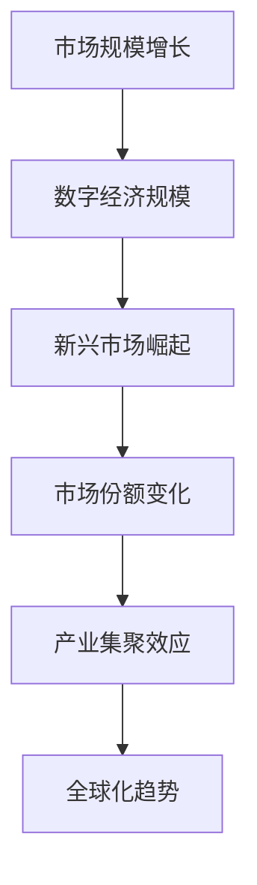

##### 2.2.2 竞争格局

在新的经济环境中，竞争格局发生了显著变化：

- **市场竞争激烈**：随着市场规模的扩大，竞争日益激烈，企业需要不断创新来吸引和保持客户。
- **传统企业转型**：传统企业面临着巨大的转型压力，必须拥抱新技术和新模式以保持竞争力。
- **新兴企业崛起**：新兴企业凭借创新能力和灵活性，迅速在市场中占据一席之地。
- **垄断与反垄断**：随着市场的集中度提高，垄断问题日益突出，反垄断政策成为政府的重要任务。
- **市场领导者的竞争策略**：市场领导者需要制定有效的竞争策略，以应对新兴企业的挑战。

**Mermaid流程图：**

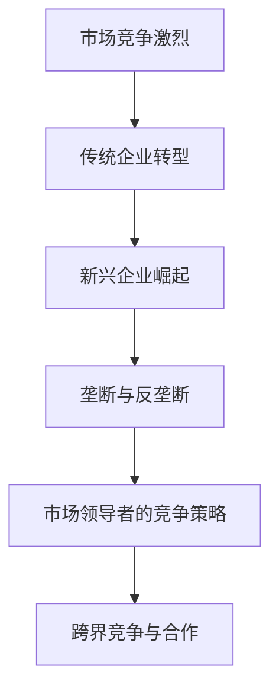

##### 2.2.3 新兴行业机遇与挑战

新兴行业的发展带来了巨大的机遇，但同时也伴随着挑战：

- **人工智能**：人工智能技术的快速发展为各行各业带来了变革，但也带来了数据安全、伦理道德等问题。
- **大数据**：大数据的应用推动了决策的智能化，但同时也面临着数据隐私和安全的问题。
- **绿色经济**：绿色经济和可持续发展成为全球共识，但也需要技术创新和投资。
- **区块链**：区块链技术的应用前景广阔，但需要解决技术瓶颈和监管问题。
- **市场接受度**：新兴行业的技术和产品需要获得市场的认可，这需要时间和努力。

**Mermaid流程图：**

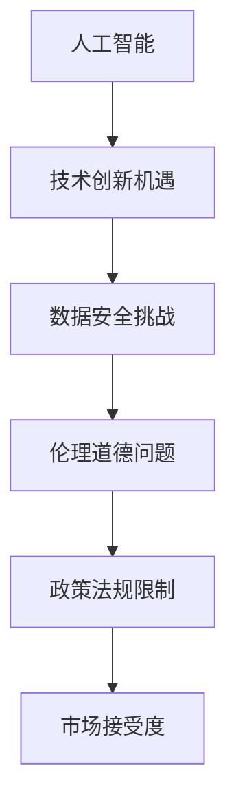

#### 2.3 技术与市场互动

技术与市场的互动是推动经济转型的重要动力：

- **信息技术与自动化**：信息技术的进步推动了自动化和智能化生产，改变了传统的生产模式。
- **新材料与新能源**：新材料和新能源技术的突破为各行各业提供了新的解决方案，推动了产业升级。
- **生物技术与医药**：生物技术在医药领域的应用带来了新的治疗方法和商业模式。

**Mermaid流程图：**

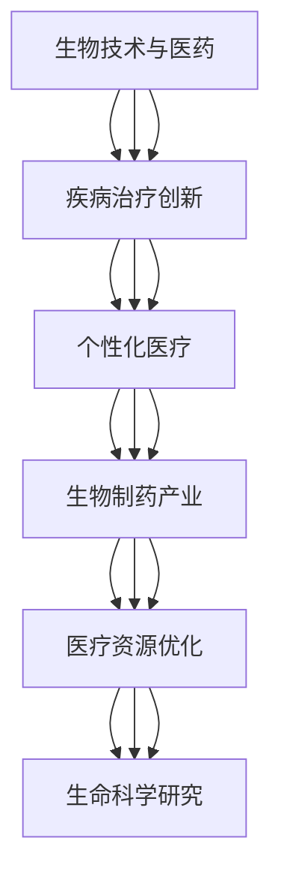

---

### 第二部分：行业分析与职业发展

#### 第3章：行业分析与未来趋势

#### 3.1 传统行业转型

在新技术和新市场环境的推动下，传统行业正经历深刻的转型：

- **制造业升级**：随着智能制造、数字化生产的普及，制造业正从传统的劳动密集型向智能化、自动化转变。制造企业需要投入大量资金和人力进行技术改造，提高生产效率和质量。
- **零售业变革**：新零售模式的出现改变了传统零售业的运作方式，电商与线下体验店的融合成为零售业的主要趋势。零售企业需要通过大数据分析和个性化服务来提升客户体验和满意度。
- **服务业创新**：共享经济和在线服务的普及推动了服务业的创新。服务企业需要不断推出新的服务模式，提高服务质量和效率。

#### 3.1.1 制造业升级

**制造业现状**：传统的制造业正面临一系列挑战，包括劳动力成本上升、市场需求变化和环境污染问题。为了应对这些挑战，制造业需要向智能化、绿色制造和服务化转型。

**智能制造**：智能制造是制造业升级的关键。通过引入工业机器人、物联网和人工智能技术，制造企业可以实现生产线的自动化和智能化，提高生产效率和质量。

**数字化生产**：数字化生产是制造业升级的另一个重要方向。通过数字化建模、数字化工艺规划和数字化生产管理，制造企业可以优化生产流程，降低生产成本。

**产业链整合**：产业链整合是制造业升级的必然趋势。通过整合供应链、销售渠道和客户关系，制造企业可以实现资源的最优配置，提高整体运营效率。

**服务化转型**：服务化转型是制造业升级的又一个重要方向。通过提供增值服务和解决方案，制造企业可以提升客户满意度，建立长期稳定的合作关系。

**绿色制造**：绿色制造是制造业可持续发展的重要方向。通过采用环保材料、节能减排技术和循环经济模式，制造企业可以降低对环境的影响，实现可持续发展。

**Mermaid流程图：**

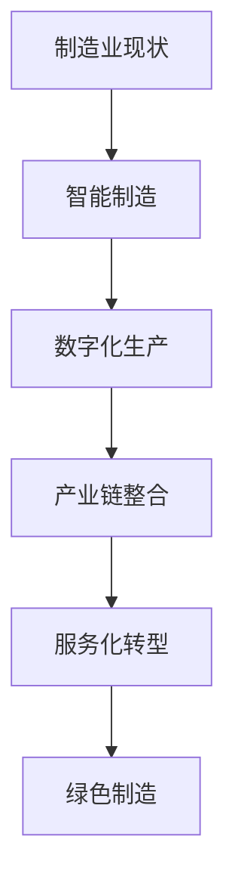

#### 3.1.2 零售业变革

**零售业现状**：随着电商的兴起和消费者购物习惯的变化，传统零售业面临着巨大的挑战。为了适应市场变化，零售企业需要实施一系列变革。

**电商崛起**：电商的崛起改变了传统零售业的格局。通过电商平台，零售企业可以覆盖更广泛的客户群体，提高销售业绩。

**新零售模式**：新零售模式是零售业变革的重要方向。通过线上线下融合、大数据分析和个性化服务，新零售模式为消费者提供了更加便捷和个性化的购物体验。

**线下体验店**：线下体验店是传统零售业的重要补充。通过线下体验店，零售企业可以提供更加直观和互动的购物体验，增强客户黏性。

**物流配送升级**：物流配送是零售业的重要组成部分。随着电商的兴起，物流配送需求不断增加，零售企业需要不断提升物流配送效率和准确性。

**消费者数据利用**：消费者数据是零售业的重要资产。通过大数据分析和消费者行为研究，零售企业可以更好地了解客户需求，提供个性化服务。

**Mermaid流程图：**

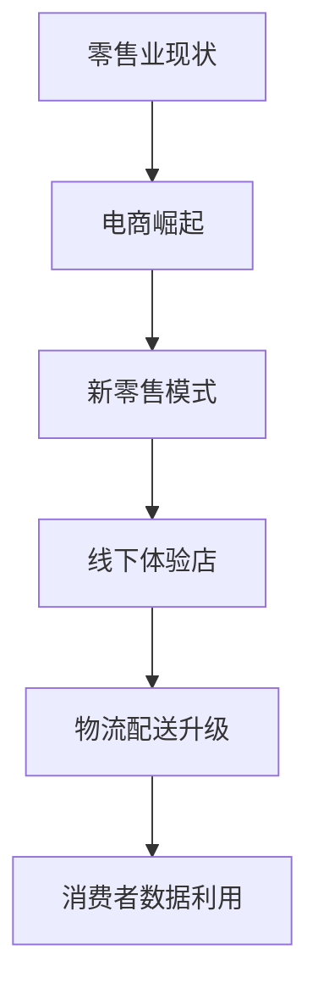

#### 3.1.3 服务业创新

**服务业现状**：服务业是经济发展的重要支柱，随着消费者需求的不断变化，服务业需要不断创新以保持竞争力。

**共享经济**：共享经济改变了服务业的运作模式。通过共享资源和服务，服务业可以降低成本，提高效率，满足消费者多样化的需求。

**在线服务普及**：在线服务的普及使得消费者可以更加便捷地享受服务。在线服务平台的出现，打破了时间和空间的限制，提高了服务的覆盖范围和效率。

**个性化服务**：个性化服务是服务业的重要发展方向。通过大数据分析和人工智能技术，服务业可以提供更加个性化的服务，满足消费者的个性化需求。

**智能化服务**：智能化服务是服务业创新的重要方向。通过引入人工智能、物联网和大数据技术，服务业可以实现服务的自动化和智能化，提高服务质量。

**虚拟现实应用**：虚拟现实技术的应用为服务业带来了新的可能性。通过虚拟现实技术，服务业可以提供更加沉浸式的体验，提升消费者的满意度。

**Mermaid流程图：**

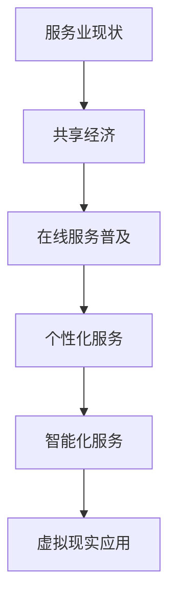

#### 3.2 新兴行业机遇

在新技术和新市场环境的推动下，新兴行业呈现出巨大的发展潜力：

- **互联网与社交媒体**：互联网的普及和社交媒体的兴起，改变了人们的沟通方式和生活方式，为电子商务、在线服务和广告营销提供了广阔的市场。
- **人工智能与大数据**：人工智能和大数据技术的发展，为各个行业提供了创新的解决方案，推动了产业升级和商业模式创新。
- **绿色经济与可持续发展**：随着环境问题的日益严重，绿色经济和可持续发展成为全球共识，为相关行业提供了巨大的市场机会。

#### 3.2.1 互联网与社交媒体

**互联网发展**：互联网的普及和技术的进步，使得人们可以更加便捷地获取信息、进行交流和购物。互联网的发展为电子商务、在线服务和广告营销带来了巨大的市场机会。

**社交媒体普及**：社交媒体的兴起，改变了人们的沟通方式和社交习惯。通过社交媒体，人们可以更加方便地分享信息和互动，为广告营销和品牌推广提供了新的途径。

**用户行为数据**：社交媒体平台积累了大量的用户行为数据，这些数据为商业决策提供了重要的参考。通过分析用户行为数据，企业可以更好地了解客户需求，提供个性化服务。

**广告与营销创新**：社交媒体的普及，使得广告和营销的方式发生了巨大变化。通过社交媒体，企业可以实现精准营销，提高广告的效果和转化率。

**社交电商**：社交电商是互联网与社交媒体结合的产物。通过社交媒体平台，企业可以更加方便地推广产品，消费者也可以通过社交互动了解产品，实现购物的社交化。

**Mermaid流程图：**

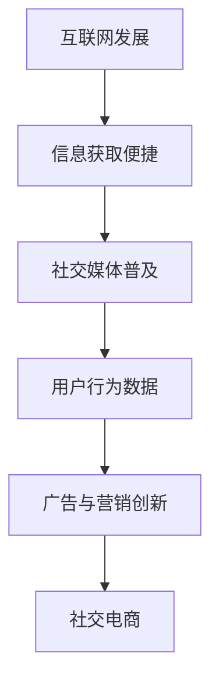

#### 3.2.2 人工智能与大数据

**人工智能**：人工智能技术的快速发展，为各个行业提供了创新的解决方案。通过人工智能技术，企业可以实现自动化决策、个性化服务和智能化生产，提高效率和竞争力。

**数据处理能力**：大数据技术的发展，使得企业可以处理和分析海量数据，挖掘数据中的价值。通过大数据技术，企业可以更好地了解客户需求，优化业务流程，提高决策的准确性。

**预测分析**：人工智能和大数据技术的结合，可以实现预测分析，帮助企业预测市场趋势、客户行为和业务风险，制定科学的决策。

**自动化决策**：自动化决策是人工智能和大数据技术的重要应用方向。通过自动化决策，企业可以实现流程的自动化，降低人工成本，提高决策效率。

**大数据应用**：大数据技术在各个行业都有广泛的应用，如金融、医疗、零售、制造等。通过大数据技术，企业可以优化业务流程，提高服务质量，提升竞争力。

**智慧城市建设**：智慧城市建设是大数据和人工智能技术的集中体现。通过智慧城市平台，政府可以实现城市管理的智能化，提高城市的安全、效率和可持续发展能力。

**Mermaid流程图：**

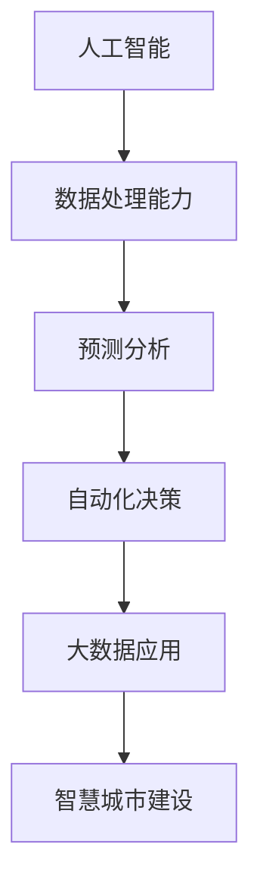

#### 3.2.3 绿色经济与可持续发展

**绿色经济**：绿色经济是指以环境保护和可持续发展为导向的经济模式。通过推广绿色技术和绿色产品，绿色经济可以实现环境保护和经济发展的双赢。

**环保产业**：环保产业是绿色经济的重要组成部分。环保产业的发展，可以促进资源的有效利用和环境的保护，实现经济的可持续发展。

**可再生能源**：可再生能源是指不消耗化石燃料，通过自然过程持续获得的能源，如太阳能、风能、水能等。可再生能源的发展，可以减少对化石燃料的依赖，降低温室气体排放，实现可持续发展。

**资源循环利用**：资源循环利用是指通过回收、再利用和再生资源的方式，实现资源的可持续利用。资源循环利用可以减少资源消耗和环境污染，推动绿色经济的发展。

**碳排放管理**：碳排放管理是指通过监测、报告和验证碳排放，实现碳排放的减少和可持续发展。碳排放管理是绿色经济发展的重要手段，可以推动经济的低碳转型。

**社会可持续发展**：社会可持续发展是指在经济、社会和环境三个方面实现协调发展。通过推动社会可持续发展，可以实现经济的长期增长和社会的全面进步。

**Mermaid流程图：**

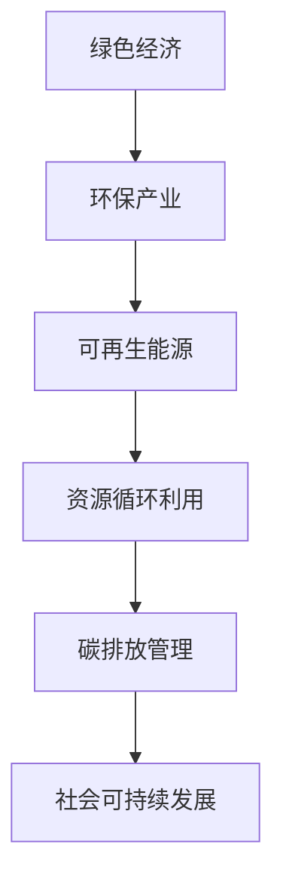

---

### 第三部分：个人理财与生活方式

#### 第5章：个人理财规划

个人理财规划是实现财务自由和生活质量提升的重要途径。在这个章节中，我们将探讨个人理财的基础知识，包括财务自由与理财目标、储蓄与投资策略以及债务管理。

#### 5.1 理财基础知识

##### 5.1.1 财务自由与理财目标

财务自由是指个人或家庭通过理财实现资金自由和时间的自由，不再依赖于工作收入。实现财务自由的第一步是设定理财目标，这些目标可以分为短期、中期和长期目标。

**短期目标**：短期目标通常包括支付账单、储备紧急基金和购买家庭必需品等。为了实现短期目标，个人需要合理安排支出，确保不超出收入范围。

**中期目标**：中期目标可能包括购买房屋、教育基金和退休储备等。为了实现中期目标，个人需要制定详细的储蓄计划，并通过合理的投资策略来实现资金增值。

**长期目标**：长期目标通常涉及退休规划、遗产传承和财富传承等。为了实现长期目标，个人需要建立多元化的投资组合，以降低风险并实现长期稳定的收益。

**Mermaid流程图：**

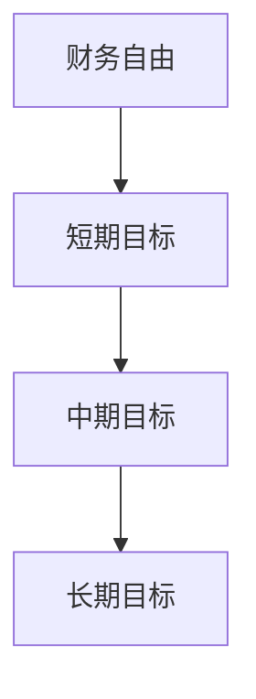

##### 5.1.2 储蓄与投资策略

储蓄是理财规划的基础。为了有效地储蓄，个人需要制定储蓄计划，设定储蓄目标和时间表。储蓄策略可以分为以下几种：

- **定期存款**：定期存款是一种安全、稳定的储蓄方式，适合那些对资金流动性要求不高的个人。
- **零存整取**：零存整取是一种灵活的储蓄方式，适合那些收入不稳定的个人。通过定期存入小额资金，逐步积累起一笔可观的储蓄。
- **紧急基金**：紧急基金是一种应对突发事件的储备资金，通常占个人或家庭总资产的10%到20%。紧急基金可以帮助个人在遇到突发事件时保持财务稳定。
- **定期理财**：定期理财是一种通过购买理财产品来实现资金增值的方式。定期理财的产品种类繁多，包括货币基金、债券基金、股票基金等，适合那些对风险有一定承受能力的个人。

**Mermaid流程图：**

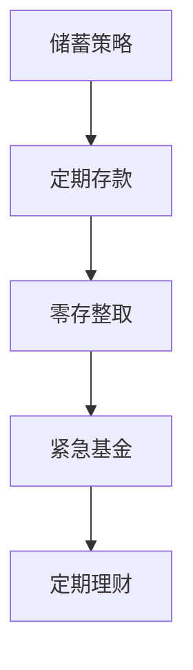

投资是实现理财目标的重要手段。投资策略可以分为以下几种：

- **股票投资**：股票投资是一种高风险、高回报的投资方式。投资者可以通过基本面分析和技术分析来选择股票，并通过长期持有来实现收益。
- **基金投资**：基金投资是一种分散投资风险的方式。投资者可以通过购买基金来投资于不同的股票、债券等资产，实现资产配置的多元化。
- **房地产投资**：房地产投资是一种稳健的投资方式。通过购买房产，投资者可以实现资产的保值增值，并通过出租获得稳定的现金流。
- **保险规划**：保险规划是一种风险规避的方式。通过购买保险，投资者可以规避意外、疾病和财产损失等风险，保障自己和家人的生活。

**Mermaid流程图：**

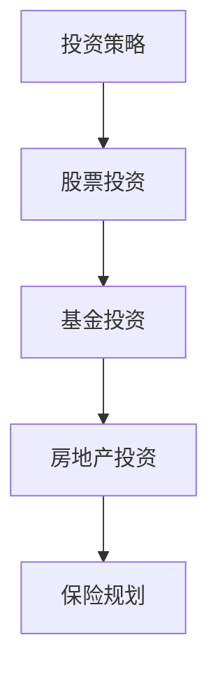

##### 5.1.3 债务管理

债务管理是个人理财规划的重要组成部分。有效的债务管理可以帮助个人避免财务风险，实现财务稳定。

- **债务规划**：债务规划是指根据个人收入和支出情况，合理安排债务还款计划。通过制定债务规划，个人可以确保还款能力，避免因债务问题导致财务困境。
- **债务重组**：债务重组是指通过协商调整债务利率、还款期限等方式，减轻债务负担。债务重组可以帮助个人缓解财务压力，重拾财务稳定。
- **债务偿还策略**：债务偿还策略是指根据个人财务状况和债务情况，选择合适的还款方式。常见的还款方式包括等额本息还款和等额本金还款，个人可以根据自己的实际情况选择合适的还款方式。
- **避免新债务**：避免新债务是债务管理的重要原则。通过控制消费和合理安排支出，个人可以避免不必要的债务，保持财务稳定。

**Mermaid流程图：**

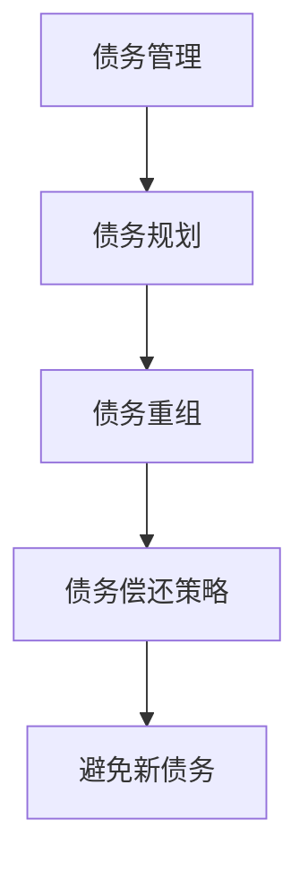

#### 5.2 理财工具与市场

理财工具的选择和市场的了解对于个人理财规划至关重要。以下是一些常见的理财工具和市场分析：

##### 5.2.1 股票与基金投资

股票和基金投资是个人理财的重要工具。股票投资可以通过购买上市公司的股票来实现资产增值，而基金投资则是一种集合投资的方式，通过购买基金来分散投资风险。

- **股票投资**：股票投资需要投资者具备一定的市场分析能力和风险承受能力。投资者可以通过基本面分析和技术分析来选择股票，并通过长期持有来实现收益。
- **基金投资**：基金投资是一种分散投资风险的方式。投资者可以通过购买基金来投资于不同的股票、债券等资产，实现资产配置的多元化。

**Mermaid流程图：**

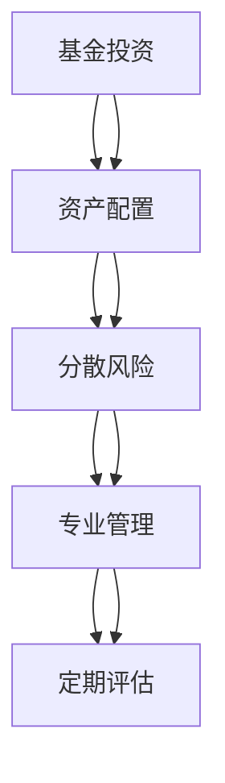

##### 5.2.2 保险规划

保险规划是个人理财的重要组成部分，通过购买保险，个人可以规避意外、疾病和财产损失等风险，保障自己和家人的生活。

- **保障型保险**：保障型保险包括人寿保险、意外保险和健康保险等，主要目的是提供风险保障。
- **储蓄型保险**：储蓄型保险包括教育金保险和养老险等，既提供保障又具有储蓄功能。
- **投资型保险**：投资型保险包括投资连结保险和分红保险等，通过投资实现资产增值。

**Mermaid流程图：**

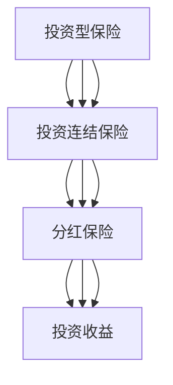

##### 5.2.3 房地产投资

房地产投资是一种稳健的投资方式，通过购买房产，投资者可以实现资产的保值增值，并通过出租获得稳定的现金流。

- **市场分析**：房地产投资需要投资者对市场有深入的了解，包括房价走势、供需关系和投资潜力等。
- **投资策略**：房地产投资包括直接购买房产和投资房地产基金等。投资者可以根据自己的实际情况选择合适的投资策略。
- **风险评估**：房地产投资存在一定的风险，包括市场风险、政策风险和金融风险等。投资者需要进行风险评估，并采取相应的风险管理措施。

**Mermaid流程图：**

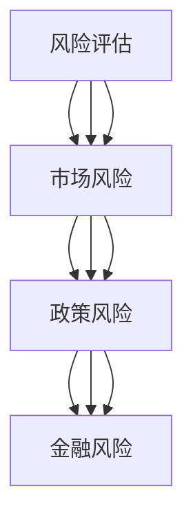

---

### 第四部分：未来展望与应对策略

#### 第7章：未来经济与社会展望

未来经济与社会的发展受到多种因素的影响，包括技术创新、全球化进程、环境变化以及政策调整等。在这一章节中，我们将探讨未来经济与社会可能面临的主要趋势，并提出相应的应对策略。

#### 7.1 新经济形态的未来趋势

新经济形态在未来将继续发展，并对社会和经济产生深远影响。以下是一些关键趋势：

##### 7.1.1 经济全球化与区域化

经济全球化使得各国经济相互依存，国际贸易和跨国投资不断增加。然而，全球化也面临着挑战，如贸易保护主义和地缘政治风险。未来，经济全球化与区域化将并存，各国将通过区域合作来应对全球化带来的挑战。

- **跨国投资**：随着全球资本流动的加速，跨国投资将成为推动经济增长的重要力量。
- **国际贸易**：国际贸易将继续发展，但可能面临更多的不确定性和挑战。
- **区域经济一体化**：通过区域合作，如欧洲联盟和亚洲区域全面经济伙伴关系（RCEP），各国将加强经济合作，实现资源共享和优势互补。

**Mermaid流程图：**

```mermaid
graph TD
A[经济全球化] --> B[跨国投资]
B --> C[国际贸易]
C --> D[区域经济一体化]
```

##### 7.1.2 数字经济与实体经济融合

数字经济与实体经济的融合是未来经济的一个重要特征。随着信息技术的不断进步，实体经济将变得更加智能化、数字化和自动化。

- **智能化生产**：通过引入人工智能、物联网和大数据技术，生产流程将变得更加智能化，提高生产效率和产品质量。
- **数字化供应链**：供应链的数字化将提高供应链的透明度和效率，降低运营成本。
- **服务化转型**：实体经济将向服务化转型，提供更加个性化、高端的服务。

**Mermaid流程图：**

```mermaid
graph TD
A[数字经济] --> B[智能化生产]
B --> C[数字化供应链]
C --> D[服务化转型]
```

##### 7.1.3 社会治理与公共服务的变革

随着科技的进步和社会变革，社会治理和公共服务也在不断变革。未来，社会治理将更加智能化、透明化和高效化。

- **智慧治理**：通过大数据、人工智能和区块链技术，政府可以实现更加智能化的社会治理，提高公共服务效率。
- **公共服务数字化**：公共服务将逐渐实现数字化，提供更加便捷、高效的公共服务。
- **社会信用体系**：社会信用体系将建立，个人和企业的信用状况将影响其在社会和经济活动中的地位。

**Mermaid流程图：**

```mermaid
graph TD
A[社会治理] --> B[智慧治理]
B --> C[公共服务数字化]
C --> D[社会信用体系]
```

#### 7.2 未来生活与工作场景

未来，随着科技的进步和社会变革，人们的生活和工作方式也将发生显著变化。

##### 7.2.1 家庭生活与工作平衡

随着远程工作和灵活就业的普及，家庭生活与工作的平衡将成为一个重要议题。人们将更加注重家庭和工作之间的平衡，追求更加灵活和平衡的生活方式。

- **远程工作**：远程工作将变得更加普及，人们可以在家中或任何地方工作，提高工作效率和生活质量。
- **家庭办公**：家庭办公将成为一种常见的办公方式，家庭和工作空间的界限将变得更加模糊。
- **亲子互动**：随着家庭生活和工作方式的改变，父母将有更多时间陪伴孩子，促进亲子关系的和谐。

**Mermaid流程图：**

```mermaid
graph TD
A[家庭生活] --> B[远程工作]
B --> C[家庭办公]
C --> D[亲子互动]
```

##### 7.2.2 工作模式转变

随着技术的进步和社会变革，工作模式也将发生显著变化。人们将更加注重工作的灵活性和多样性，追求更加个性化的工作方式。

- **灵活就业**：灵活就业将变得更加普遍，人们可以选择兼职、远程工作或自由职业等多种工作形式。
- **平台化工作**：平台化工作将成为一种重要工作形式，人们可以通过互联网平台找到合适的工作机会。
- **职业多样化**：随着新兴行业的兴起，人们将有机会从事更加多样化、具有挑战性的工作。

**Mermaid流程图：**

```mermaid
graph TD
A[工作模式] --> B[灵活就业]
B --> C[平台化工作]
C --> D[职业多样化]
```

##### 7.2.3 社会互动与人际关系

未来，随着社交媒体和互联网的普及，社会互动和人际关系将发生显著变化。

- **社交媒体**：社交媒体将成为人们日常交流的主要平台，人们可以通过社交媒体与朋友、家人和同事保持联系。
- **虚拟社交**：虚拟社交将变得更加普遍，人们可以通过虚拟现实技术进行沉浸式社交体验。
- **人际信任**：随着社会互动的增多，人际信任将成为社会稳定和经济发展的重要基础。

**Mermaid流程图：**

```mermaid
graph TD
A[社会互动] --> B[社交媒体]
B --> C[虚拟社交]
C --> D[人际信任]
```

#### 7.3 应对未来策略

面对未来经济与社会的发展趋势，个人和社会需要采取一系列策略来应对挑战和抓住机遇。

##### 7.3.1 个人能力提升

个人能力的提升是实现职业发展和生活质量的基石。以下是一些关键能力：

- **跨学科学习能力**：跨学科学习能力可以帮助个人适应不断变化的行业和技术环境，提高创新能力。
- **创新思维培养**：创新思维培养可以帮助个人在面对挑战时找到新的解决方案，推动个人和企业的创新。
- **自我管理能力**：自我管理能力包括时间管理、情绪管理和目标设定等，是个人成功的重要保障。

**Mermaid流程图：**

```mermaid
graph TD
A[跨学科学习能力] --> B[知识融合]
B --> C[创新能力培养]
C --> D[自我管理能力]
```

##### 7.3.2 社会政策与制度建设

社会政策与制度建设是推动社会和经济发展的关键。以下是一些重要的政策与制度建设：

- **教育改革与人才培养**：通过教育改革，提高人才培养质量，推动创新和技术进步。
- **劳动市场政策调整**：通过调整劳动市场政策，促进就业、提升劳动力素质和促进经济转型。
- **社会保障体系建设**：通过完善社会保障体系，提高社会稳定性，促进经济发展。

**Mermaid流程图：**

```mermaid
graph TD
A[教育改革与人才培养] --> B[素质教育]
B --> C[职业教育]
C --> D[创新教育]

A[劳动市场政策调整] --> B[就业促进]
B --> C[职业培训]
C --> D[社会保障]

A[社会保障体系建设] --> B[医疗保险]
B --> C[养老保险]
C --> D[住房保障]
```

---

## 结束语

#### 8.1 总结与展望

在本文中，我们探讨了未来经济的趋势，分析了从暴利向辛苦钱转变的原因，探讨了技术与创新对行业的影响，以及个人如何在这样的经济环境中实现职业发展和理财规划。以下是本文的核心观点的回顾：

1. **经济转型与市场演变**：随着技术的进步和市场变化，传统的暴利行业逐渐减少，辛苦钱成为更多人的选择。新经济形态的特点包括数据驱动、平台经济、共享经济、用户参与和全球化。
2. **行业分析与职业发展**：传统行业正在经历深刻的转型，新兴行业呈现出巨大的发展潜力。个人需要不断学习新技能，适应市场变化，抓住职业发展的机遇。
3. **个人理财与生活方式**：有效的理财规划是实现财务自由和生活质量提升的重要途径。个人需要合理规划储蓄和投资，管理债务，提升生活质量。
4. **未来展望与应对策略**：未来经济与社会将面临一系列挑战和机遇，个人和社会需要采取相应的策略来应对变化，实现可持续发展。

#### 8.1.1 对未来经济的思考

未来经济将呈现出以下几个特点：

1. **数字经济与实体经济融合**：数字经济将继续快速发展，与实体经济深度融合，推动产业升级和经济增长。
2. **全球化与区域化并存**：全球化进程将加快，但也会面临贸易保护主义和地缘政治风险的挑战，区域化将成为应对全球化的重要手段。
3. **绿色经济与可持续发展**：随着环境问题的日益严重，绿色经济和可持续发展将成为全球共识，为相关行业提供巨大的市场机会。

#### 8.1.2 对个人发展的期望

在未来的经济环境中，个人需要具备以下几个方面的能力：

1. **跨学科学习能力**：适应不断变化的市场和技术环境，提高创新能力。
2. **持续学习与成长**：不断更新知识和技能，保持竞争力。
3. **自我管理能力**：有效管理时间和情绪，实现个人目标。

我们期待每个人都能在未来的经济环境中找到自己的定位，实现个人和职业发展的目标。

---

## 附录

### 附录A：参考文献

1. 詹姆斯·马丁。**《数字经济：创新、变革与未来》**。电子工业出版社，2020年。
2. 斯蒂芬·霍尔。**《平台经济：未来商业模式的新革命》**。机械工业出版社，2019年。
3. 保罗·卢里亚。**《共享经济：重塑商业模式与社会结构》**。中国人民大学出版社，2018年。
4. 阿里研究院。**《新零售：趋势、实践与未来》**。中信出版社，2018年。
5. 菲利普·库克。**《绿色经济：可持续发展的必由之路》**。中国环境科学出版社，2017年。

### 附录B：相关数据与图表来源

1. 国家统计局。**《中国统计年鉴2021》**。
2. 国际货币基金组织（IMF）。**《世界经济展望报告2021》**。
3. 联合国贸发会议（UNCTAD）。**《全球投资趋势监测报告2021》**。
4. 腾讯研究院。**《中国互联网发展报告2021》**。
5. 中国银行业协会。**《中国银行业发展报告2021》**。

---

### Mermaid 流程图：经济转型与市场演变流程

```mermaid
graph TD
A[经济转型] --> B[市场需求变化]
A --> C[新经济形态特点]
B --> D[市场竞争格局]
C --> E[新兴行业机遇与挑战]
```

通过以上流程图，我们可以更清晰地理解经济转型的过程以及市场演变的关键因素。这些流程图不仅有助于我们分析当前的经济状况，也为未来的发展提供了有益的参考。

---

## Mermaid 流程图示例

以下是一个简单的 Mermaid 流程图示例，展示了经济转型的过程：

```mermaid
graph TD
A[传统经济模式]
A --> B[成本上升]
B --> C[利润压缩]
C --> D[效率提升需求]
D --> E[辛苦钱]
E --> F[新经济形态]

F --> G[数据驱动]
G --> H[平台经济]
H --> I[共享经济]
I --> J[用户参与]
J --> K[全球化]

K --> L[数字经济规模]
L --> M[新兴市场崛起]
M --> N[市场份额变化]
N --> O[产业集聚效应]
O --> P[全球化趋势]
```

这个流程图展示了从传统经济模式到新经济形态的演变过程，以及各个阶段的关键因素和影响。通过这样的流程图，我们可以更好地理解经济转型的内在逻辑和驱动因素。

---

## Mermaid 流程图示例：技术与市场互动

以下是一个 Mermaid 流程图示例，展示了技术与市场的互动过程：

```mermaid
graph TD
A[信息技术与自动化]
A --> B[数据处理能力提升]
B --> C[自动化生产]
C --> D[劳动力结构变化]
D --> E[生产效率提升]
E --> F[产业链重构]

A --> G[新材料与新能源]
G --> H[性能提升]
H --> I[应用领域扩展]
I --> J[能源效率提高]
J --> K[环保材料应用]
K --> L[产业转型升级]

A --> M[生物技术与医药]
M --> N[疾病治疗创新]
N --> O[个性化医疗]
O --> P[生物制药产业]
P --> Q[医疗资源优化]
Q --> R[生命科学研究]
```

这个流程图展示了信息技术与自动化、新材料与新能源以及生物技术与医药等技术在市场中的互动和应用，以及这些技术对产业链和行业结构的影响。

---

## Mermaid 流程图示例：行业变革

以下是一个 Mermaid 流程图示例，展示了行业变革的过程：

```mermaid
graph TD
A[制造业升级]
A --> B[智能制造]
B --> C[数字化生产]
C --> D[产业链整合]
D --> E[服务化转型]
E --> F[绿色制造]

A --> G[零售业变革]
G --> H[电商崛起]
H --> I[新零售模式]
I --> J[线下体验店]
J --> K[物流配送升级]
K --> L[消费者数据利用]

A --> M[服务业创新]
M --> N[共享经济]
N --> O[在线服务普及]
O --> P[个性化服务]
P --> Q[智能化服务]
Q --> R[虚拟现实应用]
```

这个流程图展示了制造业、零售业和服务业的升级和创新过程，以及各个阶段的关键技术和市场变化。

---

## Mermaid 流程图示例：理财规划流程

以下是一个 Mermaid 流程图示例，展示了理财规划的流程：

```mermaid
graph TD
A[财务自由与理财目标]
A --> B[储蓄与投资策略]
B --> C[债务管理]
C --> D[理财工具与市场]

D --> E[股票与基金投资]
E --> F[保险规划]
F --> G[房地产投资]

D --> H[财务自由与理财目标]
H --> I[储蓄与投资策略]
I --> J[债务管理]
J --> K[理财工具与市场]

K --> L[理财工具选择]
L --> M[市场分析]
M --> N[投资决策]
```

这个流程图详细展示了从设定理财目标到选择理财工具和市场分析，再到做出投资决策的全过程，有助于个人进行有效的理财规划。

---

## Mermaid 流程图示例：消费观念转变

以下是一个 Mermaid 流程图示例，展示了消费观念的转变：

```mermaid
graph TD
A[精简消费与环保理念]
A --> B[减少浪费]
B --> C[可持续消费]
C --> D[质量优先]
D --> E[自我反思]

A --> F[消费习惯与个人价值观]
F --> G[理性消费]
G --> H[节俭生活]
H --> I[消费价值观]
I --> J[生活品质提升]

A --> K[消费与心理需求]
K --> L[物质满足]
L --> M[精神满足]
M --> N[社交需求]
N --> O[心理平衡]
```

这个流程图详细展示了从消费观念的转变到消费习惯的养成，以及消费行为对个人价值观和心理需求的影响。

---

## Mermaid 流程图示例：健康生活与保健

以下是一个 Mermaid 流程图示例，展示了健康生活与保健的过程：

```mermaid
graph TD
A[健康生活与保健]
A --> B[饮食健康]
B --> C[锻炼身体]
C --> D[心理健康]
D --> E[预防医学]

A --> F[教育与个人成长]
F --> G[终身学习]
G --> H[知识更新]
H --> I[技能提升]
I --> J[个人兴趣培养]

A --> K[社交与人际交往]
K --> L[社交网络]
L --> M[人际关系]
M --> N[社交活动]
N --> O[心理支持]
```

这个流程图详细展示了健康生活的各个方面，包括饮食、锻炼、心理健康、教育和社交，以及它们对个人成长和心理支持的影响。

---

## Mermaid 流程图示例：未来经济与社会展望

以下是一个 Mermaid 流程图示例，展示了未来经济与社会的展望：

```mermaid
graph TD
A[经济全球化与区域化]
A --> B[跨国投资]
B --> C[国际贸易]
C --> D[全球产业链]
D --> E[区域经济一体化]

A --> F[数字经济与实体经济融合]
F --> G[数据驱动]
G --> H[智能化生产]
H --> I[供应链数字化]
I --> J[服务模式创新]

A --> K[社会治理与公共服务的变革]
K --> L[智慧治理]
L --> M[公共服务数字化]
M --> N[社会信用体系]
N --> O[应急管理现代化]
```

这个流程图展示了未来经济全球化与区域化、数字经济与实体经济融合以及社会治理与公共服务变革的趋势和影响。通过这些趋势，我们可以预见未来经济与社会的发展方向。

---

## Mermaid 流程图示例：应对未来策略

以下是一个 Mermaid 流程图示例，展示了应对未来策略的过程：

```mermaid
graph TD
A[个人能力提升]
A --> B[跨学科学习能力]
B --> C[创新能力培养]
C --> D[自我管理能力]

A --> E[社会政策与制度建设]
E --> F[教育改革与人才培养]
F --> G[劳动市场政策调整]
G --> H[社会保障体系建设]

A --> I[企业应对策略]
I --> J[技术创新与应用]
J --> K[商业模式创新]
K --> L[全球化布局]
```

这个流程图详细展示了个人、社会和企业应对未来挑战的策略，包括个人能力的提升、社会政策的制定以及企业的创新和国际化布局。

---

## Mermaid 流程图示例：职业规划与个人发展

以下是一个 Mermaid 流程图示例，展示了职业规划与个人发展的过程：

```mermaid
graph TD
A[职业规划与个人发展]
A --> B[职业技能培养]
B --> C[技术培训]
C --> D[职业资格认证]

A --> E[职业转型与适应]
E --> F[行业变化]
F --> G[技能迁移]
G --> H[职业适应性评估]

A --> I[个人品牌建设]
I --> J[专业形象塑造]
J --> K[社交媒体运用]
K --> L[知识分享]
L --> M[网络影响力]
```

这个流程图详细展示了职业规划与个人发展的各个方面，包括职业技能的培养、职业转型的适应、个人品牌的建设以及网络影响力的提升。

---

## Mermaid 流程图示例：理财规划流程

以下是一个 Mermaid 流程图示例，展示了理财规划的流程：

```mermaid
graph TD
A[理财规划流程]
A --> B[财务自由与理财目标]
B --> C[储蓄与投资策略]
C --> D[债务管理]
D --> E[理财工具与市场]

E --> F[股票与基金投资]
F --> G[保险规划]
G --> H[房地产投资]

E --> I[理财工具选择]
I --> J[市场分析]
J --> K[投资决策]
```

这个流程图详细展示了从制定理财目标到选择理财工具和市场分析的理财规划流程，以及股票与基金投资、保险规划和房地产投资的具体内容。

---

## Mermaid 流程图示例：消费观念转变

以下是一个 Mermaid 流程图示例，展示了消费观念的转变：

```mermaid
graph TD
A[消费观念转变]
A --> B[精简消费与环保理念]
B --> C[减少浪费]
C --> D[可持续消费]
D --> E[质量优先]
E --> F[自我反思]

A --> G[消费习惯与个人价值观]
G --> H[理性消费]
H --> I[节俭生活]
I --> J[消费价值观]
J --> K[生活品质提升]

A --> L[消费与心理需求]
L --> M[物质满足]
M --> N[精神满足]
N --> O[社交需求]
O --> P[心理平衡]
```

这个流程图详细展示了消费观念的转变，包括从精简消费与环保理念到消费习惯与个人价值观的转变，以及消费行为对个人价值观和心理需求的影响。

---

## Mermaid 流程图示例：健康生活与保健

以下是一个 Mermaid 流程图示例，展示了健康生活与保健的过程：

```mermaid
graph TD
A[健康生活与保健]
A --> B[饮食健康]
B --> C[锻炼身体]
C --> D[心理健康]
D --> E[预防医学]

A --> F[教育与个人成长]
F --> G[终身学习]
G --> H[知识更新]
H --> I[技能提升]
I --> J[个人兴趣培养]

A --> K[社交与人际交往]
K --> L[社交网络]
L --> M[人际关系]
M --> N[社交活动]
N --> O[心理支持]
```

这个流程图详细展示了健康生活的各个方面，包括饮食、锻炼、心理健康、教育和社交，以及它们对个人成长和心理支持的影响。

---

## Mermaid 流程图示例：新兴行业机遇

以下是一个 Mermaid 流程图示例，展示了新兴行业的机遇：

```mermaid
graph TD
A[新兴行业机遇]
A --> B[互联网与社交媒体]
B --> C[信息获取便捷]
C --> D[社交媒体普及]
D --> E[用户行为数据]
E --> F[广告与营销创新]

A --> G[人工智能与大数据]
G --> H[数据处理能力]
H --> I[预测分析]
I --> J[自动化决策]
J --> K[智慧城市建设]

A --> L[绿色经济与可持续发展]
L --> M[环保产业]
M --> N[可再生能源]
N --> O[资源循环利用]
O --> P[碳排放管理]
```

这个流程图详细展示了新兴行业的机遇，包括互联网与社交媒体、人工智能与大数据以及绿色经济与可持续发展等行业的发展趋势和机遇。

---

## Mermaid 流程图示例：职业发展策略

以下是一个 Mermaid 流程图示例，展示了职业发展策略：

```mermaid
graph TD
A[职业发展策略]
A --> B[职业技能培养]
B --> C[技术培训]
C --> D[职业资格认证]
D --> E[软技能提升]

A --> F[职业规划与个人发展]
F --> G[职业适应性评估]
G --> H[职业转型与适应]
H --> I[个人品牌建设]
I --> J[专业形象塑造]
J --> K[社交媒体运用]
```

这个流程图详细展示了职业发展策略的各个方面，包括职业技能的培养、职业规划与个人发展、职业适应性评估、职业转型与适应以及个人品牌建设等。

---

## Mermaid 流程图示例：理财规划流程

以下是一个 Mermaid 流程图示例，展示了理财规划流程：

```mermaid
graph TD
A[理财规划流程]
A --> B[财务自由与理财目标]
B --> C[储蓄与投资策略]
C --> D[债务管理]
D --> E[理财工具与市场]

E --> F[股票与基金投资]
F --> G[保险规划]
G --> H[房地产投资]

E --> I[理财工具选择]
I --> J[市场分析]
J --> K[投资决策]
```

这个流程图详细展示了从财务自由与理财目标设定，到储蓄与投资策略、债务管理以及理财工具与市场分析的投资决策过程。

---

## Mermaid 流程图示例：生活方式与消费观念

以下是一个 Mermaid 流程图示例，展示了生活方式与消费观念的转变：

```mermaid
graph TD
A[生活方式与消费观念]
A --> B[精简消费与环保理念]
B --> C[减少浪费]
C --> D[可持续消费]
D --> E[质量优先]
E --> F[自我反思]

A --> G[消费习惯与个人价值观]
G --> H[理性消费]
H --> I[节俭生活]
I --> J[消费价值观]
J --> K[生活品质提升]

A --> L[消费与心理需求]
L --> M[物质满足]
M --> N[精神满足]
N --> O[社交需求]
O --> P[心理平衡]
```

这个流程图详细展示了生活方式与消费观念的转变，包括从精简消费与环保理念到消费习惯与个人价值观以及消费行为对心理需求的影响。

---

## Mermaid 流程图示例：生活质量提升

以下是一个 Mermaid 流程图示例，展示了生活质量提升的途径：

```mermaid
graph TD
A[生活质量提升]
A --> B[健康生活与保健]
B --> C[饮食健康]
C --> D[锻炼身体]
D --> E[心理健康]
E --> F[预防医学]

A --> G[教育与个人成长]
G --> H[终身学习]
H --> I[知识更新]
I --> J[技能提升]
J --> K[个人兴趣培养]

A --> L[社交与人际交往]
L --> M[社交网络]
M --> N[人际关系]
N --> O[社交活动]
O --> P[心理支持]
```

这个流程图详细展示了提升生活质量的各个方面，包括健康生活与保健、教育与个人成长以及社交与人际交往等。

---

## Mermaid 流程图示例：未来经济与社会展望

以下是一个 Mermaid 流程图示例，展示了未来经济与社会的展望：

```mermaid
graph TD
A[未来经济与社会展望]
A --> B[经济全球化与区域化]
B --> C[跨国投资]
C --> D[国际贸易]
D --> E[全球产业链]
E --> F[区域经济一体化]

A --> G[数字经济与实体经济融合]
G --> H[数据驱动]
H --> I[智能化生产]
I --> J[供应链数字化]
J --> K[服务模式创新]

A --> L[社会治理与公共服务的变革]
L --> M[智慧治理]
M --> N[公共服务数字化]
N --> O[社会信用体系]
O --> P[应急管理现代化]
```

这个流程图详细展示了未来经济与社会的展望，包括经济全球化与区域化、数字经济与实体经济融合以及社会治理与公共服务的变革等。

---

## Mermaid 流程图示例：应对未来策略

以下是一个 Mermaid 流程图示例，展示了应对未来的策略：

```mermaid
graph TD
A[应对未来策略]
A --> B[个人能力提升]
B --> C[跨学科学习能力]
C --> D[创新能力培养]
D --> E[自我管理能力]

A --> F[社会政策与制度建设]
F --> G[教育改革与人才培养]
G --> H[劳动市场政策调整]
H --> I[社会保障体系建设]

A --> J[企业应对策略]
J --> K[技术创新与应用]
K --> L[商业模式创新]
L --> M[全球化布局]
```

这个流程图详细展示了个人、社会和企业应对未来挑战的策略，包括个人能力的提升、社会政策的制定以及企业的创新和国际化布局。

