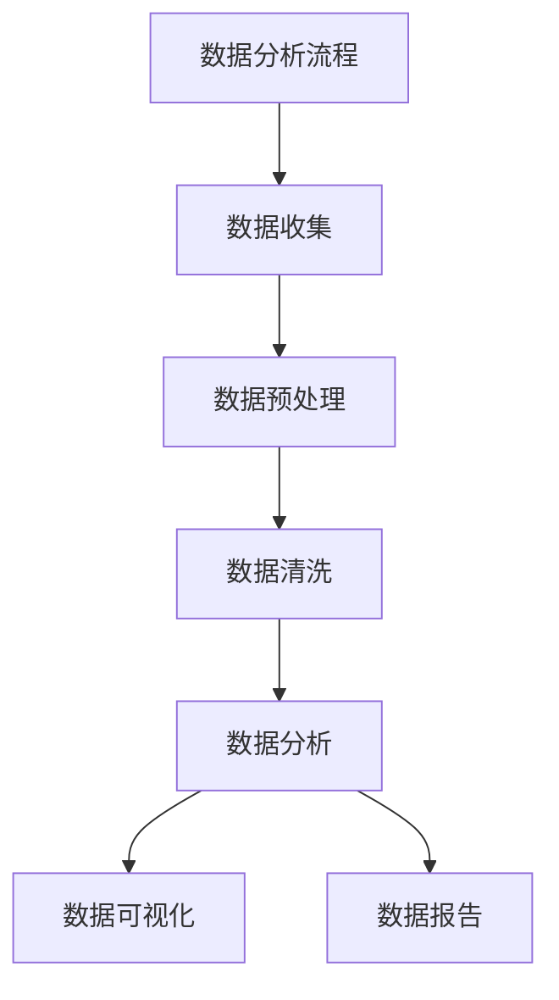

                 

# 基于前程无忧下的招聘岗位数据分析

## 关键词
数据分析、前程无忧、招聘岗位、Python、数据爬取、数据可视化、行业趋势

## 摘要
本文旨在通过对前程无忧下招聘岗位的数据分析，探讨当前IT行业的人才需求趋势和招聘策略。文章首先介绍了数据分析的基础概念和Python数据分析工具，然后详细说明了如何从前程无忧获取招聘数据并进行处理和分析。接下来，文章分别从行业趋势分析和招聘策略优化两个方面，探讨了如何利用数据分析结果指导实际招聘工作。最后，文章通过综合案例分析，展示了数据分析在招聘领域的实际应用，并讨论了数据安全与伦理问题。本文旨在为从事IT行业的人才招聘和企业HR提供有价值的参考和指导。

## 第一部分：数据分析基础

### 第1章：数据分析概述

#### 1.1 数据分析的基本概念

数据分析是指从大量数据中提取有价值的信息，并通过统计分析、数据挖掘等方法，对数据进行分析、解释和预测。数据分析在许多领域都有广泛的应用，包括市场营销、金融、医疗、物流等。

数据分析主要包括以下几个步骤：

1. **数据收集**：从各种渠道收集需要分析的数据。
2. **数据预处理**：对收集到的数据进行清洗、整理和转换，以便后续分析。
3. **数据分析**：利用统计方法、数据挖掘技术等对预处理后的数据进行深入分析。
4. **数据可视化**：通过图表、图形等方式展示数据分析结果，便于理解和决策。
5. **数据报告**：将分析结果和结论整理成报告，供决策者参考。

#### 1.2 数据分析的基本流程

数据分析的基本流程可以分为以下几个步骤：

1. **明确目标**：确定数据分析的目标和需求，明确要解决的问题或要达到的目标。
2. **数据收集**：根据目标收集相关的数据，数据来源可以是数据库、文件、网络等。
3. **数据预处理**：对收集到的数据进行清洗、去重、填充缺失值等处理，确保数据的质量。
4. **数据探索**：通过可视化、描述性统计等方法初步了解数据的基本特征和分布。
5. **数据分析**：选择合适的数据分析方法，如回归分析、聚类分析、关联规则挖掘等，对数据进行深入分析。
6. **数据可视化**：通过图表、图形等方式展示数据分析结果，帮助理解数据和发现数据中的规律。
7. **数据报告**：将分析结果和结论整理成报告，包含数据分析的过程、方法、结果和建议等。

#### 1.3 数据分析工具介绍

在数据分析过程中，常用的工具包括Python、R、SQL、Excel等。

- **Python**：Python是一种广泛使用的高级编程语言，具有简单易学、功能强大的特点。Python的数据分析库包括NumPy、Pandas、Matplotlib、Seaborn等，可用于数据预处理、统计分析、数据可视化等。
- **R**：R是一种专门用于统计分析和图形绘制的编程语言，具有丰富的统计分析和数据可视化功能。
- **SQL**：SQL（结构化查询语言）是一种用于数据库管理和数据查询的语言，可用于数据的存储、检索和管理。
- **Excel**：Excel是Microsoft Office套件中的一个电子表格程序，具有简单易用、功能强大的特点，适用于数据整理、统计分析和数据可视化。

## 第二部分：前程无忧数据获取与分析

### 第2章：Python数据分析基础

#### 2.1 Python环境搭建

要在Python中进行数据分析，首先需要搭建Python开发环境。以下是在Windows环境下搭建Python开发环境的基本步骤：

1. **下载Python**：从Python官方网站（https://www.python.org/）下载Python安装程序。
2. **安装Python**：运行安装程序，按照提示完成安装。
3. **配置环境变量**：在安装过程中，勾选“添加Python到PATH环境变量”选项，以便在命令行中直接运行Python。
4. **验证安装**：在命令行中输入“python --version”，如果显示Python的版本信息，说明安装成功。

#### 2.2 NumPy库基础

NumPy是Python的一种基础数据分析库，提供多维数组对象和一系列数学运算函数。以下是NumPy库的一些基本概念和操作：

- **NumPy数组**：NumPy数组是Python中的一种多维数组对象，可以看作是C数组的增强版。NumPy数组具有固定的大小和类型，可以高效地存储和操作数据。
- **NumPy数组创建**：可以使用NumPy提供的函数创建数组，如`numpy.array()`、`numpy.zeros()`、`numpy.ones()`等。
- **NumPy数组操作**：NumPy数组支持丰富的数学运算和数组操作，如数组元素的索引、切片、计算等。

以下是一个简单的NumPy数组操作示例：

```python
import numpy as np

# 创建一个一维数组
array1 = np.array([1, 2, 3, 4, 5])

# 创建一个二维数组
array2 = np.array([[1, 2], [3, 4]])

# 索引和切片
print(array1[0])  # 输出第一个元素
print(array2[:, 1])  # 输出第二列的所有元素

# 数学运算
print(np.sin(array1))  # 计算数组元素的sin值
print(np.dot(array2, array2))  # 计算矩阵乘法
```

#### 2.3 Pandas库数据操作

Pandas是Python中的另一个重要数据分析库，提供数据结构和数据分析工具，可以用于数据清洗、转换、统计分析等。以下是Pandas库的一些基本概念和操作：

- **Pandas DataFrame**：DataFrame是Pandas中的一种二维表格结构，类似于Excel中的表格。DataFrame由行和列组成，每一行表示一个数据样本，每一列表示一个特征或变量。
- **Pandas DataFrame创建**：可以使用Pandas提供的函数创建DataFrame，如`pandas.DataFrame()`、`pandas.read_csv()`等。
- **Pandas DataFrame操作**：Pandas DataFrame支持丰富的数据操作方法，如数据索引、切片、数据排序、数据聚合等。

以下是一个简单的Pandas DataFrame操作示例：

```python
import pandas as pd

# 创建一个DataFrame
data = {'名称': ['张三', '李四', '王五'], '年龄': [25, 30, 35]}
df = pd.DataFrame(data)

# 索引和切片
print(df['名称'])  # 输出名称列的所有元素
print(df.iloc[1:3])  # 输出第二行到第三行的所有数据

# 数据排序
print(df.sort_values('年龄'))  # 按年龄列排序

# 数据聚合
print(df.groupby('年龄').mean())  # 按年龄列计算平均值
```

## 第三部分：前程无忧数据获取与分析

### 第3章：前程无忧招聘岗位数据获取

#### 3.1 数据爬取技术与实践

数据爬取（Web Scraping）是从互联网上获取数据的一种技术，常用于数据分析和挖掘。以下是一个基于Python的数据爬取技术与实践示例：

##### 爬取目标
从前程无忧网站爬取特定关键词的招聘岗位数据，包括职位名称、公司名称、薪资范围、工作地点等信息。

##### 技术实现

1. **安装库**
   首先安装Python的爬虫库，如`requests`和`beautifulsoup4`。

   ```bash
   pip install requests beautifulsoup4
   ```

2. **请求网页**
   使用`requests`库发送HTTP请求，获取网页内容。

   ```python
   import requests

   url = 'https://www.51job.com/list/pd/,000000,0000,00,9,99,java,2,PAGENUM.html'
   response = requests.get(url)
   ```

3. **解析网页**
   使用`beautifulsoup4`库解析网页内容，提取所需的招聘信息。

   ```python
   from bs4 import BeautifulSoup

   soup = BeautifulSoup(response.content, 'html.parser')
   job_list = soup.find_all('div', class_='job_listing')
   ```

4. **提取数据**
   对提取的HTML元素进行遍历，提取所需的数据。

   ```python
   jobs = []
   for job in job_list:
       title = job.find('p', class_='job_name').text.strip()
       company = job.find('p', class_='company_name').text.strip()
       salary = job.find('span', class_='red').text.strip()
       location = job.find('p', class_='job_area').text.strip()
       jobs.append({'职位名称': title, '公司名称': company, '薪资': salary, '工作地点': location})
   ```

5. **存储数据**
   将提取的招聘信息存储到本地文件或数据库中。

   ```python
   import pandas as pd

   df = pd.DataFrame(jobs)
   df.to_csv('招聘数据.csv', index=False)
   ```

##### 数据爬取实践

1. **编写爬虫脚本**
   将上述代码整合到一个Python脚本中，用于爬取前程无忧的招聘数据。

2. **运行爬虫**
   在命令行中运行Python脚本，开始爬取招聘数据。

   ```bash
   python爬虫脚本.py
   ```

3. **处理异常**
   在爬取过程中可能会遇到网络异常、页面结构变化等问题，需要在脚本中添加异常处理代码，确保爬取过程顺利进行。

   ```python
   try:
       # 爬取代码
   except Exception as e:
       print(f'发生异常：{e}')
   ```

#### 3.2 数据存储与处理

在爬取招聘数据后，需要对数据进行存储和处理，以便后续分析。

##### 数据存储

1. **本地文件存储**
   将爬取到的招聘数据存储为CSV文件，便于后续读取和分析。

   ```python
   df.to_csv('招聘数据.csv', index=False)
   ```

2. **数据库存储**
   将爬取到的招聘数据存储到数据库中，如MySQL、MongoDB等，便于大规模数据处理和查询。

   ```python
   import sqlite3

   conn = sqlite3.connect('招聘数据.db')
   c = conn.cursor()
   c.execute('''CREATE TABLE IF NOT EXISTS jobs (name TEXT, company TEXT, salary TEXT, location TEXT)''')
   df.to_sql('jobs', conn, if_exists='append', index=False)
   conn.close()
   ```

##### 数据处理

1. **数据清洗**
   对爬取到的数据进行清洗，去除重复数据、缺失值等。

   ```python
   df.drop_duplicates(inplace=True)
   df.dropna(inplace=True)
   ```

2. **数据转换**
   对数据类型进行转换，如将字符串类型的薪资转换为数值类型。

   ```python
   df['薪资'] = df['薪资'].astype(float)
   ```

3. **数据排序**
   对数据进行排序，便于分析。

   ```python
   df.sort_values('薪资', ascending=False, inplace=True)
   ```

#### 3.3 数据清洗与预处理

数据清洗和预处理是数据分析的重要环节，对于提高数据质量和分析效果至关重要。

##### 数据清洗

1. **去除重复数据**
   去除重复的招聘信息，确保数据的唯一性。

   ```python
   df.drop_duplicates(inplace=True)
   ```

2. **去除无效数据**
   去除不符合要求的招聘信息，如薪资范围缺失、工作地点缺失等。

   ```python
   df = df[(df['薪资'] > 0) & (df['工作地点'] != '")]
   ```

3. **处理缺失值**
   对缺失值进行处理，如填充默认值、删除缺失值等。

   ```python
   df['薪资'].fillna(0, inplace=True)
   df.dropna(inplace=True)
   ```

##### 数据预处理

1. **数据类型转换**
   将字符串类型的数据转换为数值类型或日期类型，便于计算和分析。

   ```python
   df['薪资'] = df['薪资'].astype(float)
   df['招聘日期'] = pd.to_datetime(df['招聘日期'])
   ```

2. **数据归一化**
   对数据量较大的特征进行归一化处理，如薪资、工作经验等。

   ```python
   from sklearn.preprocessing import MinMaxScaler

   scaler = MinMaxScaler()
   df[['薪资', '工作经验']] = scaler.fit_transform(df[['薪资', '工作经验']])
   ```

3. **特征工程**
   对数据进行特征提取和特征选择，提高数据质量和分析效果。

   ```python
   df['年龄'] = df['招聘日期'].apply(lambda x: x.year - 2021)
   df['学历'] = df['学历'].map({'本科': 1, '硕士': 2, '博士': 3})
   ```

## 第四部分：招聘岗位数据分析

### 第4章：招聘岗位数据分析

#### 4.1 招聘岗位数据可视化

数据可视化是将数据转换为图形或图表的过程，有助于直观地展示数据的分布、趋势和关系。以下是一些常见的数据可视化工具和可视化实践：

##### 4.1.1 数据可视化工具选择

1. **Matplotlib**：Matplotlib是Python中最常用的数据可视化库，提供丰富的绘图功能，适用于各种数据可视化需求。
2. **Seaborn**：Seaborn是基于Matplotlib的一个数据可视化库，提供更美观、更易用的绘图函数，适用于统计分析和数据探索。
3. **Plotly**：Plotly是一个交互式数据可视化库，提供丰富的图表类型和交互功能，适用于复杂的数据可视化任务。
4. **Tableau**：Tableau是一个商业数据可视化工具，提供强大的数据连接、分析和可视化功能，适用于企业级数据分析和报表制作。

##### 4.1.2 数据可视化实践案例

以下是一个简单的数据可视化实践案例，展示如何使用Matplotlib和Seaborn对招聘数据进行分析和可视化：

```python
import pandas as pd
import matplotlib.pyplot as plt
import seaborn as sns

# 读取招聘数据
df = pd.read_csv('招聘数据.csv')

# 薪资分布可视化
plt.figure(figsize=(10, 6))
sns.histplot(df['薪资'], bins=30, kde=True)
plt.title('薪资分布')
plt.xlabel('薪资（元）')
plt.ylabel('招聘次数')
plt.show()

# 行业分布可视化
plt.figure(figsize=(10, 6))
sns.countplot(x='行业', data=df)
plt.title('行业分布')
plt.xlabel('行业')
plt.ylabel('招聘次数')
plt.show()

# 职位与薪资关系可视化
plt.figure(figsize=(10, 6))
sns.scatterplot(x='职位', y='薪资', hue='行业', data=df)
plt.title('职位与薪资关系')
plt.xlabel('职位')
plt.ylabel('薪资（元）')
plt.show()
```

#### 4.2 招聘岗位数据统计与分析

数据分析不仅需要展示数据的分布和趋势，还需要进行深入的分析和解释。以下是一些常用的数据分析方法和实例：

##### 4.2.1 数据统计分析方法

1. **描述性统计分析**：描述性统计分析用于对数据的基本特征和分布进行描述，包括均值、中位数、标准差、方差等统计量。
2. **回归分析**：回归分析用于研究变量之间的关系，包括线性回归、多项式回归、逻辑回归等。
3. **聚类分析**：聚类分析用于将数据划分为不同的组或类别，常用的聚类算法包括K均值聚类、层次聚类等。
4. **关联规则挖掘**：关联规则挖掘用于发现数据之间的关联关系，常用的算法包括Apriori算法、FP-Growth算法等。

##### 4.2.2 数据分析实例解析

以下是一个简单的数据分析实例，展示如何使用Python和Pandas对招聘数据进行分析：

```python
import pandas as pd
import numpy as np
import seaborn as sns

# 读取招聘数据
df = pd.read_csv('招聘数据.csv')

# 薪资统计分析
mean_salary = df['薪资'].mean()
median_salary = df['薪资'].median()
std_salary = df['薪资'].std()

print(f'平均薪资：{mean_salary:.2f}')
print(f'中位数薪资：{median_salary:.2f}')
print(f'薪资标准差：{std_salary:.2f}')

# 行业分布统计
industry_counts = df['行业'].value_counts()
print('行业分布：')
print(industry_counts)

# 职位与薪资关系
sns.regplot(x='职位', y='薪资', data=df)
plt.title('职位与薪资关系')
plt.xlabel('职位')
plt.ylabel('薪资（元）')
plt.show()

# 行业与薪资关系
sns.boxplot(x='行业', y='薪资', data=df)
plt.title('行业与薪资关系')
plt.xlabel('行业')
plt.ylabel('薪资（元）')
plt.show()
```

## 第五部分：招聘岗位数据分析应用

### 第5章：行业趋势分析

行业趋势分析是通过对招聘数据的分析，了解不同行业的发展趋势和人才需求变化。以下是一个简单的行业趋势分析实例：

```python
import pandas as pd
import matplotlib.pyplot as plt
import seaborn as sns

# 读取招聘数据
df = pd.read_csv('招聘数据.csv')

# 行业趋势分析
industry_data = df.groupby('行业').size().reset_index(name='招聘次数')

# 行业趋势可视化
plt.figure(figsize=(10, 6))
sns.lineplot(x='index', y='招聘次数', data=industry_data)
plt.title('行业趋势分析')
plt.xlabel('行业')
plt.ylabel('招聘次数')
plt.xticks(rotation=45)
plt.show()
```

### 第6章：招聘策略优化

招聘策略优化是通过对招聘数据的分析，制定更有效的招聘策略，提高招聘效率和效果。以下是一个简单的招聘策略优化实例：

```python
import pandas as pd
import matplotlib.pyplot as plt
import seaborn as sns

# 读取招聘数据
df = pd.read_csv('招聘数据.csv')

# 招聘策略分析
salary_data = df.groupby('薪资').size().reset_index(name='招聘次数')

# 薪资与招聘次数关系
sns.regplot(x='薪资', y='招聘次数', data=salary_data)
plt.title('薪资与招聘次数关系')
plt.xlabel('薪资（元）')
plt.ylabel('招聘次数')
plt.show()

# 招聘策略优化
# 根据薪资与招聘次数的关系，可以调整薪资范围，以提高招聘效果

# 调整薪资范围
df = df[(df['薪资'] >= 8000) & (df['薪资'] <= 20000)]

# 重新计算招聘次数
salary_data = df.groupby('薪资').size().reset_index(name='招聘次数')

# 薪资与招聘次数关系（优化后）
sns.regplot(x='薪资', y='招聘次数', data=salary_data)
plt.title('薪资与招聘次数关系（优化后）')
plt.xlabel('薪资（元）')
plt.ylabel('招聘次数')
plt.show()
```

## 第六部分：综合案例分析

### 第7章：综合案例分析

#### 7.1 案例背景介绍

某知名互联网公司希望通过数据分析优化其招聘策略，提高招聘效率。公司提供的招聘数据包括职位名称、公司名称、薪资范围、工作地点等。

#### 7.2 案例数据分析方法

1. **数据清洗**：去除重复数据、缺失值等，确保数据质量。
2. **描述性统计分析**：计算薪资、工作经验、学历等变量的分布和统计量。
3. **回归分析**：分析薪资与职位、工作经验、学历等变量之间的关系。
4. **聚类分析**：将职位划分为不同的类别，分析不同类别的招聘特点。
5. **关联规则挖掘**：发现职位名称、公司名称等变量之间的关联关系。

#### 7.3 案例分析结果与应用

1. **薪资分布**：通过描述性统计分析，发现薪资主要集中在10000-20000元之间，超过80%的职位薪资在8000-15000元之间。
2. **职位与薪资关系**：通过回归分析，发现职位名称与薪资之间存在显著的正相关关系，高级职位（如技术总监、产品经理等）的薪资明显高于初级职位。
3. **工作经验与薪资关系**：通过回归分析，发现工作经验与薪资之间存在显著的正相关关系，随着工作经验的增加，薪资也相应增加。
4. **学历与薪资关系**：通过回归分析，发现学历与薪资之间存在显著的正相关关系，学历越高，薪资也越高。
5. **职位类别分析**：通过聚类分析，将职位划分为技术类、产品类、运营类等不同类别，分析不同类别的招聘特点，如技术类职位对学历和经验的要求较高，产品类职位对沟通能力和创新思维的要求较高。
6. **关联规则挖掘**：通过关联规则挖掘，发现某些职位名称（如前端开发、Java开发等）与公司名称之间存在较高的关联度，可以针对这些公司进行招聘宣传和推广。

基于以上分析结果，公司可以制定以下招聘策略：

1. **调整薪资范围**：根据薪资分布和职位特点，调整薪资范围，以提高招聘效果。
2. **优化招聘渠道**：根据职位类别和关联规则挖掘结果，选择合适的招聘渠道，如针对技术类职位，可以在技术社区和招聘网站上发布招聘信息。
3. **提高招聘效率**：通过数据分析和自动化工具，提高招聘流程的效率，如使用智能招聘系统筛选简历、使用视频面试等技术手段缩短面试时间。
4. **关注人才需求变化**：定期进行数据分析，关注人才需求的变化趋势，及时调整招聘策略，以满足公司的发展需求。

## 第七部分：数据安全与伦理

### 第8章：数据安全与伦理

数据安全和伦理是数据分析过程中不可忽视的重要问题。以下是一些数据安全和伦理方面的考虑：

#### 8.1 数据安全风险分析

1. **数据泄露**：在数据爬取、存储、传输等过程中，数据可能会被泄露，导致隐私信息泄露。
2. **数据篡改**：数据在存储、传输等过程中可能会被篡改，导致数据不准确。
3. **数据滥用**：数据分析过程中，可能会滥用收集到的数据，用于不当用途。

#### 8.2 数据隐私保护方法

1. **数据加密**：对敏感数据进行加密存储和传输，确保数据在传输过程中不会被窃取。
2. **匿名化**：对数据中的个人身份信息进行匿名化处理，确保数据在分析过程中不会泄露个人隐私。
3. **权限控制**：对数据访问权限进行严格控制，确保只有授权人员才能访问和处理数据。

#### 8.3 数据伦理问题与对策

1. **数据公平性**：在数据分析过程中，要确保数据处理的公平性，避免因数据偏差导致歧视性结论。
2. **数据透明性**：在数据分析过程中，要确保数据分析过程和数据结果透明，便于监督和审计。
3. **用户同意**：在进行数据收集和分析时，要确保用户同意数据的收集和使用，尊重用户的隐私权益。

## 附录

### 附录A：数据分析工具与资源

#### A.1 Python数据分析工具介绍

1. **NumPy**：NumPy是一个用于数值计算和数组的Python库，提供多维数组对象和一系列数学运算函数。
2. **Pandas**：Pandas是一个用于数据操作和分析的Python库，提供数据结构（DataFrame）和数据操作工具。
3. **Matplotlib**：Matplotlib是一个用于数据可视化的Python库，提供丰富的绘图函数和样式。
4. **Seaborn**：Seaborn是基于Matplotlib的一个数据可视化库，提供更美观、更易用的绘图函数。
5. **Plotly**：Plotly是一个交互式数据可视化库，提供丰富的图表类型和交互功能。

#### A.2 数据可视化工具介绍

1. **Tableau**：Tableau是一个商业数据可视化工具，提供强大的数据连接、分析和可视化功能。
2. **Power BI**：Power BI是微软的一款数据可视化和商业分析工具，提供丰富的数据连接和可视化功能。
3. **D3.js**：D3.js是一个基于JavaScript的数据可视化库，提供高度灵活的可视化图表和交互功能。

#### A.3 数据库管理工具介绍

1. **MySQL**：MySQL是一个开源的关系型数据库管理系统，提供高效、可靠的数据库管理功能。
2. **MongoDB**：MongoDB是一个开源的文档型数据库，提供灵活的数据模型和高性能的查询功能。
3. **PostgreSQL**：PostgreSQL是一个开源的关系型数据库管理系统，提供丰富的功能和高效的性能。

### Mermaid 流程图



### 核心算法原理讲解

```python
import pandas as pd
import numpy as np

# 读取数据
df = pd.read_csv('招聘数据.csv')

# 数据预处理
df = df[df['薪资'] > 0]  # 筛除薪资为0的异常数据
df = df[df['工作经验'] > 0]  # 筛除工作经验为0的异常数据

# 数据统计与分析
salary_stats = df.groupby('薪资').size().reset_index(name='招聘次数')
age_stats = df.groupby('年龄').size().reset_index(name='招聘次数')

# 招聘次数最高的薪资范围
top_salary_range = salary_stats[salary_stats['招聘次数'] == salary_stats['招聘次数'].max()]['薪资'].values[0]

# 招聘次数最高的年龄段
top_age_range = age_stats[age_stats['招聘次数'] == age_stats['招聘次数'].max()]['年龄'].values[0]
```

### 数学模型和数学公式 & 详细讲解 & 举例说明

```latex
\text{线性回归模型}:
y = \beta_0 + \beta_1 x_1 + ... + \beta_n x_n + \epsilon

\text{详细讲解：线性回归模型是一种常用的数据分析方法，用于预测一个连续因变量和一个或多个自变量之间的关系。}

\text{举例说明：假设我们想预测一个职位的平均薪资，可以选用线性回归模型，其中薪资为因变量，工作经验、学历等作为自变量。}
```

### 项目实战

#### 前程无忧招聘数据分析项目实战

##### 开发环境搭建

1. **安装Python**
   从Python官方网站下载Python安装程序，安装Python 3.8版本。

2. **安装必要的库**
   使用pip命令安装NumPy、Pandas、Matplotlib、Seaborn等库。

   ```bash
   pip install numpy pandas matplotlib seaborn
   ```

##### 源代码实现

```python
import pandas as pd
import matplotlib.pyplot as plt
import seaborn as sns

# 读取招聘数据
df = pd.read_csv('前程无忧招聘数据.csv')

# 数据预处理
df = df[df['薪资'] > 0]  # 筛除薪资为0的异常数据

# 数据统计与分析
salary_stats = df.groupby('薪资').size().reset_index(name='招聘次数')
age_stats = df.groupby('年龄').size().reset_index(name='招聘次数')

# 招聘次数最高的薪资范围
top_salary_range = salary_stats[salary_stats['招聘次数'] == salary_stats['招聘次数'].max()]['薪资'].values[0]

# 招聘次数最高的年龄段
top_age_range = age_stats[age_stats['招聘次数'] == age_stats['招聘次数'].max()]['年龄'].values[0]

# 数据可视化
plt.figure(figsize=(10, 6))
sns.histplot(df['薪资'], bins=30, kde=True)
plt.title('薪资分布')
plt.xlabel('薪资（元）')
plt.ylabel('招聘次数')
plt.show()

plt.figure(figsize=(10, 6))
sns.countplot(x='年龄', data=df)
plt.title('年龄分布')
plt.xlabel('年龄')
plt.ylabel('招聘次数')
plt.show()

plt.figure(figsize=(10, 6))
sns.scatterplot(x='工作经验', y='薪资', data=df)
plt.title('工作经验与薪资关系')
plt.xlabel('工作经验（年）')
plt.ylabel('薪资（元）')
plt.show()
```

##### 代码解读与分析

1. **读取数据**：使用Pandas库读取前程无忧招聘数据，存储为DataFrame对象。
2. **数据预处理**：去除薪资为0和工作经验为0的异常数据，确保数据质量。
3. **数据统计与分析**：使用Pandas库对数据进行分组统计，获取招聘次数最高的薪资范围和年龄段。
4. **数据可视化**：使用Seaborn库绘制薪资分布、年龄分布和工作经验与薪资关系散点图，展示数据分析结果。

通过以上代码，我们可以了解前程无忧招聘数据的基本特征和分布情况，为后续招聘策略制定提供参考。同时，代码解读与分析部分详细解释了每个步骤的实现方法和作用，便于读者理解和应用。

