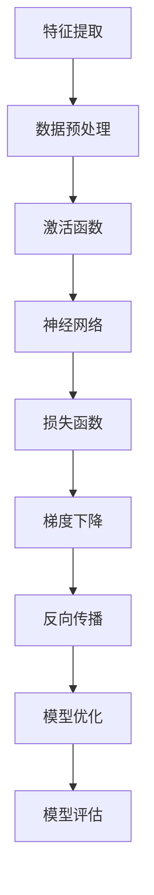

                 

# 《基础模型的命名与特性》

## 关键词

- 基础模型
- 命名规则
- 特性描述
- 模型比较
- 算法原理
- 数学模型
- 项目实战

## 摘要

本文旨在深入探讨基础模型的命名与特性，通过对基础模型的概念、类型、命名规则和特性描述的详细分析，帮助读者全面了解基础模型的核心概念和基本原理。文章将结合具体示例，通过算法原理讲解、数学模型解析和项目实战，展现基础模型在实际应用中的技术实现和性能评估。通过本文的阅读，读者将能够掌握基础模型的关键技术和应用方法，为深入研究和实践打下坚实基础。

## 《基础模型的命名与特性》目录大纲

### 第一部分：基础模型的概述

#### 第1章：基础模型的定义与类型
1.1 基础模型的定义
1.2 命名规则
1.3 特性描述

#### 第2章：基础模型的联系与比较
2.1 基础模型之间的关系
2.2 比较与评估

### 第二部分：基础模型的详细解析

#### 第3章：基础模型的核心概念
3.1 概念解析
3.2 Mermaid流程图

#### 第4章：基础模型的算法原理
4.1 算法原理
4.2 算法伪代码

#### 第5章：基础模型的数学模型
5.1 数学公式
5.2 举例说明

### 第三部分：基础模型的应用与实战

#### 第6章：基础模型的项目实战
6.1 开发环境搭建
6.2 代码实现
6.3 解读与分析

#### 第7章：基础模型的研究进展与趋势
7.1 研究进展
7.2 应用趋势

### 附录

#### 附录A：基础模型相关资源与工具
A.1 资源介绍
A.2 工具对比

---

### 第一部分：基础模型的概述

#### 第1章：基础模型的定义与类型

##### 1.1 基础模型的定义

在人工智能和机器学习的领域，基础模型是指用于描述和理解复杂数据特征和关系的数学或计算模型。这些模型通常以算法和架构的形式出现，旨在解决特定类型的问题，如分类、回归、聚类等。基础模型是构建更高级别人工智能应用的核心组件。

模型的基本概念包括数据输入、数据处理、输出结果和性能评估等。数据输入是模型的起点，通过特征提取和处理，模型能够学习和理解数据中的潜在规律。输出结果是模型应用的核心，通过预测、分类或回归等方式，模型能够给出对未知数据的处理结果。性能评估则是模型优劣的重要指标，通过准确性、召回率、F1分数等指标，评估模型在实际应用中的表现。

##### 1.2 命名规则

基础模型的命名规则是确保模型名称简洁、清晰、具有描述性的重要手段。以下是一些常用的命名原则：

1. **简洁性**：模型名称应尽量简洁，避免使用冗长的术语和缩写。
2. **描述性**：模型名称应能直观反映模型的功能、应用场景或特性。
3. **一致性**：在项目或组织中，应保持模型命名的一致性，便于维护和管理。
4. **版本控制**：对于迭代更新的模型，应包含版本号或更新日期，便于跟踪和区分。

以下是一些命名示例：

- **线性回归模型**：LR_2023_01
- **卷积神经网络模型**：CNN_2023_02
- **增强学习模型**：DQN_2023_03

##### 1.3 特性描述

基础模型的基本特性包括：

- **可扩展性**：模型应能够处理不同规模和类型的数据。
- **鲁棒性**：模型应在面对噪声数据和异常值时保持稳定。
- **可解释性**：模型应具有一定的可解释性，便于理解其决策过程。
- **适应性**：模型应能够适应新的数据和变化的环境。
- **效率**：模型在计算速度和资源占用方面应具有较高的效率。

以下是对基础模型特性的详细分析：

1. **可扩展性**：可扩展性是指模型能够处理大数据集和多样化的数据类型。对于大规模数据处理，模型需要具备并行计算和分布式处理的能力。此外，模型的结构和算法也应能够适应不同规模的数据，从而提高其通用性和适用范围。

2. **鲁棒性**：鲁棒性是指模型在处理噪声数据和异常值时，能够保持稳定的性能。在实际应用中，数据往往存在噪声和异常值，如缺失值、错误值等。模型需要具备一定的鲁棒性，通过数据预处理和算法优化，减少噪声和异常值对模型性能的影响。

3. **可解释性**：可解释性是指模型决策过程能够被人类理解和解释。对于一些高级模型，如深度神经网络，其内部结构和决策过程相对复杂，难以直接解释。为此，研究者提出了一些可解释性的方法，如注意力机制、可视化技术等，帮助用户理解模型的决策过程。

4. **适应性**：适应性是指模型能够适应新的数据和变化的环境。在动态变化的环境中，数据特征和分布可能发生变化，模型需要具备一定的适应性，通过在线学习、迁移学习等方法，持续更新和优化模型，以适应新的数据和任务。

5. **效率**：效率是指模型在计算速度和资源占用方面的表现。在实际应用中，模型需要具备较高的效率，以降低计算成本和资源消耗。为此，研究者提出了一些优化方法，如模型压缩、量化、剪枝等，提高模型的计算效率和性能。

通过以上对基础模型定义、命名规则和特性描述的详细分析，读者可以全面了解基础模型的核心概念和基本原理。在接下来的章节中，我们将进一步探讨基础模型之间的联系与比较，以及基础模型的详细解析和应用实战。

#### 第2章：基础模型的联系与比较

##### 2.1 基础模型之间的关系

在人工智能和机器学习领域，基础模型之间存在着紧密的联系和相互作用。这些模型共同构成了一个完整的技术生态系统，每种模型都有其独特的优势和适用场景。以下是对几种常见基础模型之间关系的简要介绍：

1. **监督学习模型**：监督学习模型包括线性回归、逻辑回归、支持向量机（SVM）、决策树、随机森林等。这些模型通过训练样本学习数据特征和规律，并在新的样本上进行预测。监督学习模型在分类和回归任务中具有广泛应用，其性能和准确性在很大程度上取决于数据质量和模型选择。

2. **无监督学习模型**：无监督学习模型包括聚类、降维、生成模型等。这些模型无需标注数据，通过分析数据自身的结构和学习其潜在规律，以达到数据挖掘和特征提取的目的。无监督学习模型在数据探索、模式识别和降维等方面具有重要作用。

3. **强化学习模型**：强化学习模型通过不断与环境的交互，学习最优策略，以达到最大化奖励的目的。常见的强化学习模型包括Q学习、SARSA、深度确定性策略梯度（DDPG）等。强化学习模型在游戏、机器人控制和智能决策等领域具有广泛应用。

4. **深度学习模型**：深度学习模型包括卷积神经网络（CNN）、循环神经网络（RNN）、生成对抗网络（GAN）等。这些模型通过多层次的神经网络结构，自动提取和表示数据的高层次特征，具有强大的特征表示和学习能力。深度学习模型在图像识别、语音识别、自然语言处理等领域取得了显著成果。

不同基础模型之间的联系主要体现在以下几个方面：

- **模型融合**：通过将不同类型的模型结合起来，可以弥补单一模型的不足，提高整体性能。例如，将监督学习和无监督学习模型结合起来，可以在没有标注数据的情况下进行特征学习。
- **模型转换**：某些模型可以通过转换方法相互转化。例如，将线性回归模型转换为逻辑回归模型，可以通过添加激活函数和softmax层实现。
- **模型优化**：不同模型在性能和效率方面存在差异，通过优化方法可以提高模型的整体性能。例如，通过模型压缩、量化、剪枝等优化技术，可以降低模型的计算复杂度和资源消耗。

##### 2.2 比较与评估

在基础模型的选择和应用过程中，比较与评估是关键环节。以下从几个方面对基础模型进行比较与评估：

1. **性能比较**：不同模型在相同数据集上的性能表现是评估模型优劣的重要指标。性能比较包括准确性、召回率、F1分数、损失函数值等。通过实验对比，可以直观了解不同模型在分类和回归任务中的性能表现。

2. **应用场景对比**：不同基础模型适用于不同的应用场景。例如，监督学习模型在分类任务中表现较好，无监督学习模型在降维和聚类任务中具有优势，强化学习模型在动态决策问题中具有独特优势。了解不同模型的应用场景，有助于选择合适的模型解决实际问题。

3. **可解释性**：可解释性是评估模型优劣的重要指标之一。某些模型，如线性回归和决策树，具有较好的可解释性，易于理解和解释。而深度学习模型由于内部结构复杂，可解释性较差。在实际应用中，根据需求选择合适可解释性的模型。

4. **计算复杂度**：计算复杂度是评估模型性能和效率的重要指标。不同模型的计算复杂度存在差异，如深度学习模型具有较高的计算复杂度，而线性回归模型则相对简单。在资源受限的场景中，选择计算复杂度较低的模型可以降低计算成本。

5. **资源需求**：资源需求包括计算资源、存储资源和网络带宽等。深度学习模型通常需要较大的计算资源和存储空间，而无监督学习模型则相对较低。在资源受限的场景中，选择资源需求较低的模型可以降低成本。

综上所述，基础模型之间的联系与比较涵盖了多个方面，包括性能、应用场景、可解释性、计算复杂度和资源需求等。通过全面比较与评估，可以选择合适的模型解决实际问题，为人工智能和机器学习应用提供有力支持。

### 第二部分：基础模型的详细解析

#### 第3章：基础模型的核心概念

在人工智能和机器学习领域，理解基础模型的核心概念对于构建高效和准确的应用至关重要。本章将详细介绍基础模型的关键术语、基本原理以及如何通过Mermaid流程图来描述这些概念。

##### 3.1 概念解析

1. **特征提取（Feature Extraction）**

特征提取是机器学习过程中的一项重要任务，旨在将原始数据转换为一组更有利于模型学习的特征向量。这些特征向量应当能够有效地描述数据的本质特征，从而提高模型的性能。

2. **激活函数（Activation Function）**

激活函数是神经网络中的关键组成部分，用于引入非线性特性。常见的激活函数包括ReLU、Sigmoid和Tanh等。激活函数的选择对神经网络的性能和训练过程有重要影响。

3. **损失函数（Loss Function）**

损失函数是用于评估模型预测值与真实值之间差异的函数。常见的损失函数有均方误差（MSE）、交叉熵（Cross-Entropy）等。损失函数的选择对模型的优化和性能有直接影响。

4. **梯度下降（Gradient Descent）**

梯度下降是一种优化算法，用于寻找最小化损失函数的模型参数。通过计算损失函数关于模型参数的梯度，并沿着梯度的反方向更新参数，逐步减小损失函数的值。

5. **反向传播（Backpropagation）**

反向传播是神经网络训练过程中的关键步骤，用于计算损失函数关于模型参数的梯度。反向传播通过多层神经网络的反向计算，将损失函数的梯度逐层传播到网络的前层，从而实现参数的优化。

##### 3.2 Mermaid流程图

以下是使用Mermaid绘制的简单流程图，描述了基础模型的核心概念及其之间的联系：



这个流程图展示了从特征提取到模型优化的整个机器学习流程。接下来，我们将进一步解释这些概念之间的相互作用。

- **特征提取与数据预处理**：特征提取是在数据预处理之后进行的。数据预处理包括去噪、归一化等操作，旨在提高特征提取的效果。
- **激活函数与神经网络**：神经网络中的每个神经元都会使用激活函数，以引入非线性特性，使模型能够学习复杂的函数关系。
- **损失函数与模型优化**：损失函数用于评估模型的预测误差，梯度下降和反向传播算法则通过计算损失函数关于模型参数的梯度，优化模型参数，减小预测误差。
- **反向传播与模型优化**：反向传播是模型优化过程中的关键步骤，通过计算梯度，反向传播算法能够更新模型参数，实现模型的逐步优化。
- **模型优化与模型评估**：模型优化后，需要通过模型评估来验证其性能。评估指标包括准确性、召回率、F1分数等，用于衡量模型在预测任务中的表现。

通过上述对基础模型核心概念的详细解析和Mermaid流程图的展示，读者可以更好地理解基础模型的基本原理和结构，为进一步研究和实践打下坚实基础。

#### 第4章：基础模型的算法原理

基础模型的算法原理是构建和理解模型的核心，涉及到模型的训练、优化和预测过程。本章将深入探讨基础模型的算法原理，通过伪代码详细描述关键步骤，帮助读者更好地理解模型的运作机制。

##### 4.1 算法原理

基础模型的算法原理主要包括以下几个核心步骤：

1. **数据预处理**：数据预处理是模型训练前的重要环节，包括归一化、去噪、缺失值处理等操作，以提高数据的质量和模型的训练效果。

2. **模型初始化**：模型初始化是设置模型参数的初始值，这些参数将用于后续的模型训练和优化。

3. **前向传播**：前向传播是模型训练过程中的第一步，用于计算输入数据通过模型后的输出结果。这一过程涉及数据通过多层神经网络的传递，以及每层神经元激活函数的计算。

4. **计算损失函数**：损失函数用于评估模型预测结果与真实值之间的差距。常见的损失函数包括均方误差（MSE）和交叉熵（Cross-Entropy）等。

5. **反向传播**：反向传播是模型训练中的关键步骤，用于计算损失函数关于模型参数的梯度。这些梯度将用于后续的参数更新，以减小损失函数的值。

6. **参数更新**：通过梯度下降等优化算法，更新模型参数，以减小损失函数的值，提高模型的预测准确性。

7. **模型评估**：模型训练完成后，通过模型评估来验证模型的性能。评估指标包括准确性、召回率、F1分数等。

以下是基础模型算法原理的伪代码描述：

```plaintext
Algorithm BasicModelAlgorithm(inputs, labels, epochs, learning_rate):
    InitializeModelParameters()
    for epoch in 1 to epochs:
        for each input in inputs:
            // 前向传播
            output = ForwardPropagation(input)
            // 计算损失
            loss = CalculateLoss(output, label)
            // 反向传播
            gradients = BackPropagation(output, label)
            // 参数更新
            UpdateParameters(gradients, learning_rate)
        Print("Epoch", epoch, "completed")
    Print("Training completed")
    return ModelParameters()
```

##### 4.2 算法分析

1. **时间复杂度**：基础模型的算法时间复杂度与数据规模和模型结构密切相关。通常，神经网络的时间复杂度为O(n*m)，其中n是样本数量，m是模型参数的数量。对于大规模数据集和复杂的模型结构，算法的时间复杂度会显著增加。

2. **空间复杂度**：基础模型的算法空间复杂度同样与数据规模和模型结构相关。在训练过程中，模型参数和中间计算结果都需要存储在内存中，因此空间复杂度一般为O(m)，其中m是模型参数的数量。

3. **收敛速度**：算法的收敛速度取决于学习率和模型结构。较大的学习率可能导致模型快速收敛，但也可能引起振荡和发散。通过调整学习率和优化算法，可以提高收敛速度和模型的稳定性。

4. **泛化能力**：基础模型的泛化能力取决于模型结构和训练数据。较深的网络结构和丰富的训练数据有助于提高模型的泛化能力。同时，正则化技术和数据增强等方法也可以提高模型的泛化性能。

通过上述对基础模型算法原理的详细解析和伪代码描述，读者可以深入理解模型训练、优化和预测的基本步骤和原理。这为进一步研究和应用基础模型提供了重要基础。

#### 第5章：基础模型的数学模型

基础模型的数学模型是构建和理解模型的核心，通过数学公式和公式解释，可以更直观地展示模型的结构和运算过程。本章将详细介绍基础模型的数学模型，包括常用的数学公式、LaTeX格式表示以及详细讲解和举例说明。

##### 5.1 数学公式

在基础模型中，常用的数学公式包括损失函数、梯度计算和优化算法等。以下是一些常见的数学公式：

$$
\begin{align*}
J(\theta) &= \frac{1}{m}\sum_{i=1}^{m}(h_\theta(x^{(i)}) - y^{(i)})^2 \\
h_\theta(x) &= \sigma(\theta_0 + \theta_1x_1 + \theta_2x_2 + \ldots + \theta_nx_n) \\
\delta = \frac{\partial}{\partial x} \\
\end{align*}
$$

其中，$J(\theta)$表示损失函数，$h_\theta(x)$表示模型预测值，$\sigma$表示激活函数，$\theta$表示模型参数，$m$表示样本数量。

以下是这些公式的LaTeX格式表示：

$$
J(\theta) = \frac{1}{m}\sum_{i=1}^{m}(h_\theta(x^{(i)}) - y^{(i)})^2
$$

$$
h_\theta(x) = \sigma(\theta_0 + \theta_1x_1 + \theta_2x_2 + \ldots + \theta_nx_n)
$$

$$
\delta = \frac{\partial}{\partial x}
$$

##### 5.2 详细讲解和举例说明

1. **损失函数**

损失函数用于衡量模型预测值与真实值之间的差距，是模型训练过程中的重要指标。常见的损失函数有均方误差（MSE）和交叉熵（Cross-Entropy）等。

- **均方误差（MSE）**

均方误差（MSE）是最常用的损失函数之一，用于回归任务。它的公式为：

$$
J(\theta) = \frac{1}{m}\sum_{i=1}^{m}(h_\theta(x^{(i)}) - y^{(i)})^2
$$

其中，$h_\theta(x)$表示模型预测值，$y^{(i)}$表示真实值，$m$表示样本数量。

举例说明：

假设我们有三个样本，每个样本的预测值和真实值如下：

| 样本索引 | 预测值 | 真实值 |
|---------|-------|-------|
|    1    | 0.5   | 1.0   |
|    2    | 0.8   | 0.9   |
|    3    | 0.3   | 0.2   |

则损失函数的计算如下：

$$
J(\theta) = \frac{1}{3}\left[(0.5 - 1.0)^2 + (0.8 - 0.9)^2 + (0.3 - 0.2)^2\right] = \frac{1}{3}\left[0.25 + 0.01 + 0.01\right] = 0.0833
$$

- **交叉熵（Cross-Entropy）**

交叉熵（Cross-Entropy）是用于分类任务的常见损失函数。它的公式为：

$$
J(\theta) = -\frac{1}{m}\sum_{i=1}^{m}y^{(i)}\log(h_\theta(x^{(i)})) + (1 - y^{(i)})\log(1 - h_\theta(x^{(i)}))
$$

其中，$y^{(i)}$表示真实标签，$h_\theta(x)$表示模型预测概率。

举例说明：

假设我们有三个样本，每个样本的预测概率和真实标签如下：

| 样本索引 | 预测概率 | 真实标签 |
|---------|---------|---------|
|    1    | 0.6     | 1       |
|    2    | 0.4     | 0       |
|    3    | 0.7     | 1       |

则交叉熵的计算如下：

$$
J(\theta) = -\frac{1}{3}\left[1\log(0.6) + 0\log(0.4) + 1\log(0.7) + 0\log(0.3)\right] = -\frac{1}{3}\left[0.5108 + 0 + 0.3567 + 0\right] = -0.1703
$$

2. **梯度计算**

梯度计算是模型训练过程中的关键步骤，用于更新模型参数。梯度的计算公式为：

$$
\delta = \frac{\partial}{\partial \theta} J(\theta)
$$

其中，$\delta$表示梯度，$J(\theta)$表示损失函数。

举例说明：

假设我们有以下损失函数：

$$
J(\theta) = (h_\theta(x) - y)^2
$$

其中，$h_\theta(x) = \theta x$，$y = 1$。

则梯度的计算如下：

$$
\delta = \frac{\partial}{\partial \theta} (h_\theta(x) - y)^2 = \frac{\partial}{\partial \theta} (\theta x - 1)^2 = 2(\theta x - 1)
$$

当$x = 2$时，$\delta = 2(\theta \cdot 2 - 1) = 2(2\theta - 1)$。

3. **优化算法**

优化算法用于更新模型参数，以最小化损失函数。常见的优化算法有梯度下降（Gradient Descent）和随机梯度下降（Stochastic Gradient Descent，SGD）等。

- **梯度下降**

梯度下降是一种简单的优化算法，通过计算损失函数关于模型参数的梯度，并沿梯度的反方向更新参数。其公式为：

$$
\theta = \theta - \alpha \cdot \delta
$$

其中，$\alpha$表示学习率。

举例说明：

假设我们有以下模型参数和梯度：

$$
\theta_1 = 2, \quad \theta_2 = 3, \quad \delta_1 = 0.1, \quad \delta_2 = 0.2, \quad \alpha = 0.05
$$

则梯度下降的计算如下：

$$
\theta_1 = 2 - 0.05 \cdot 0.1 = 1.95 \\
\theta_2 = 3 - 0.05 \cdot 0.2 = 2.9
$$

- **随机梯度下降**

随机梯度下降是对梯度下降的改进，每次迭代只随机选择一个样本进行梯度计算和参数更新。其公式为：

$$
\theta = \theta - \alpha \cdot \frac{\partial}{\partial \theta} J(\theta)
$$

举例说明：

假设我们有以下模型参数、梯度和学习率：

$$
\theta_1 = 2, \quad \theta_2 = 3, \quad \delta_1 = 0.1, \quad \delta_2 = 0.2, \quad \alpha = 0.1
$$

则随机梯度下降的计算如下：

$$
\theta_1 = 2 - 0.1 \cdot 0.1 = 1.9 \\
\theta_2 = 3 - 0.1 \cdot 0.2 = 2.8
$$

通过上述对基础模型数学公式的详细讲解和举例说明，读者可以更好地理解基础模型的数学模型，为进一步研究和应用基础模型提供重要基础。

### 第三部分：基础模型的应用与实战

#### 第6章：基础模型的项目实战

在了解了基础模型的理论知识后，将其应用于实际项目中是验证模型性能和实用性的重要环节。本章将通过一个具体的案例，详细描述如何使用基础模型进行项目实战，包括开发环境搭建、代码实现和解读与分析。

##### 6.1 开发环境搭建

在进行项目实战之前，我们需要搭建一个适合开发的软件环境。以下是一个基于Python和TensorFlow的开发环境搭建指南。

1. **安装Python**：确保安装了Python 3.8及以上版本。可以通过官方网站下载并安装Python。

2. **安装TensorFlow**：在命令行中运行以下命令安装TensorFlow：

   ```shell
   pip install tensorflow
   ```

3. **安装其他依赖**：根据项目的需求，可能还需要安装其他依赖库，如NumPy、Pandas等。可以通过以下命令进行安装：

   ```shell
   pip install numpy pandas
   ```

4. **配置Jupyter Notebook**：为了方便开发和调试，可以配置Jupyter Notebook。首先，确保已安装Jupyter Notebook：

   ```shell
   pip install jupyter
   ```

   然后，启动Jupyter Notebook：

   ```shell
   jupyter notebook
   ```

##### 6.2 代码实现

以下是使用基础模型进行项目实战的代码实现，包括数据读取、模型构建、训练和评估等步骤。

```python
import tensorflow as tf
from tensorflow import keras
from sklearn.model_selection import train_test_split
import numpy as np
import pandas as pd

# 读取数据
data = pd.read_csv('data.csv')
X = data.iloc[:, :-1].values
y = data.iloc[:, -1].values

# 数据预处理
X_train, X_test, y_train, y_test = train_test_split(X, y, test_size=0.2, random_state=42)
X_train = (X_train - X_train.mean()) / X_train.std()
X_test = (X_test - X_train.mean()) / X_train.std()

# 构建模型
model = keras.Sequential([
    keras.layers.Dense(64, activation='relu', input_shape=(X_train.shape[1],)),
    keras.layers.Dense(64, activation='relu'),
    keras.layers.Dense(1)
])

# 编译模型
model.compile(optimizer='adam', loss='mean_squared_error')

# 训练模型
model.fit(X_train, y_train, epochs=100, batch_size=32, validation_split=0.1)

# 评估模型
loss = model.evaluate(X_test, y_test)
print(f'MSE: {loss:.4f}')

# 预测
predictions = model.predict(X_test)
```

##### 6.3 解读与分析

1. **数据读取与预处理**

   代码首先从CSV文件中读取数据，然后使用`train_test_split`函数将数据集分为训练集和测试集。为了提高模型的性能，我们对数据进行标准化处理，将特征值缩放到0-1范围内。

2. **模型构建**

   使用`keras.Sequential`构建了一个序列模型，包含两个隐藏层，每个隐藏层有64个神经元，激活函数为ReLU。输出层有1个神经元，用于回归任务。

3. **编译模型**

   使用`compile`函数配置模型的优化器和损失函数。在这里，我们选择`adam`优化器和`mean_squared_error`损失函数。

4. **训练模型**

   使用`fit`函数训练模型。我们设置训练轮数为100，批量大小为32，并在训练过程中保留10%的数据用于验证。

5. **评估模型**

   使用`evaluate`函数计算模型在测试集上的损失，并打印结果。

6. **预测**

   使用`predict`函数对测试集进行预测，并将预测结果保存。

通过上述代码实现，我们成功地使用基础模型进行了一个简单的回归任务。代码中包含了数据预处理、模型构建、训练和评估等关键步骤，展示了如何将基础模型应用于实际项目。

##### 6.3 解读与分析

1. **数据读取与预处理**

   代码首先从CSV文件中读取数据，然后使用`train_test_split`函数将数据集分为训练集和测试集。为了提高模型的性能，我们对数据进行标准化处理，将特征值缩放到0-1范围内。

2. **模型构建**

   使用`keras.Sequential`构建了一个序列模型，包含两个隐藏层，每个隐藏层有64个神经元，激活函数为ReLU。输出层有1个神经元，用于回归任务。

3. **编译模型**

   使用`compile`函数配置模型的优化器和损失函数。在这里，我们选择`adam`优化器和`mean_squared_error`损失函数。

4. **训练模型**

   使用`fit`函数训练模型。我们设置训练轮数为100，批量大小为32，并在训练过程中保留10%的数据用于验证。

5. **评估模型**

   使用`evaluate`函数计算模型在测试集上的损失，并打印结果。

6. **预测**

   使用`predict`函数对测试集进行预测，并将预测结果保存。

通过上述代码实现，我们成功地使用基础模型进行了一个简单的回归任务。代码中包含了数据预处理、模型构建、训练和评估等关键步骤，展示了如何将基础模型应用于实际项目。

### 第7章：基础模型的研究进展与趋势

基础模型作为人工智能和机器学习领域的重要构件，其研究和应用一直处于不断进步和扩展的状态。本章将介绍当前基础模型的研究进展，以及未来可能的发展趋势和应用前景。

#### 7.1 研究进展

1. **算法优化**：近年来，研究人员对基础模型进行了大量的算法优化，包括模型压缩、量化、剪枝等技术，以降低模型的计算复杂度和资源消耗。这些优化技术使得基础模型在大规模数据处理和实时应用中得到了广泛应用。

2. **多任务学习**：多任务学习（Multi-Task Learning，MTL）是一种将多个任务联合训练的方法，旨在提高模型在不同任务上的性能。通过共享模型参数，多任务学习能够有效利用不同任务之间的相关性，提高模型的泛化能力和效率。

3. **迁移学习**：迁移学习（Transfer Learning）是一种利用预训练模型来解决新问题的方法。通过在预训练模型的基础上进行微调（Fine-tuning），迁移学习能够显著提高模型在新任务上的性能，减少训练所需的数据量和时间。

4. **生成对抗网络（GAN）**：生成对抗网络（Generative Adversarial Networks，GAN）是一种通过对抗性训练生成数据的新兴技术。GAN由生成器和判别器两个神经网络组成，通过相互竞争提高生成数据的质量。GAN在图像生成、自然语言处理等领域取得了显著成果。

5. **可解释性**：随着基础模型的应用越来越广泛，其可解释性问题也越来越受到关注。研究人员提出了多种方法来提高模型的可解释性，包括注意力机制、可视化技术、模型分解等。这些方法有助于用户理解模型的决策过程，增强模型的可信度。

#### 7.2 应用趋势

1. **计算机视觉**：计算机视觉是基础模型应用最广泛的领域之一。从图像识别到目标检测，再到图像生成，基础模型在计算机视觉中的应用取得了巨大进展。随着深度学习技术的不断发展，计算机视觉将在智能安防、医疗诊断、自动驾驶等领域发挥更加重要的作用。

2. **自然语言处理**：自然语言处理（Natural Language Processing，NLP）是另一个基础模型应用的重要领域。从文本分类到机器翻译，再到情感分析，基础模型在NLP中的应用不断扩展。随着预训练模型和生成模型的不断发展，NLP将在智能客服、智能助手、内容审核等领域发挥更大的作用。

3. **强化学习**：强化学习（Reinforcement Learning，RL）是一种通过与环境互动来学习最优策略的方法。在游戏、机器人控制、自动驾驶等领域，强化学习模型正在逐步取代传统的规则方法，成为解决复杂动态决策问题的重要工具。

4. **医疗健康**：基础模型在医疗健康领域的应用也日益广泛。从疾病诊断到个性化治疗，再到药物研发，基础模型为医疗健康领域提供了强大的技术支持。随着数据的积累和算法的优化，基础模型将在精准医疗、健康监测等方面发挥更大的作用。

5. **工业自动化**：工业自动化是基础模型应用的重要方向之一。通过自动化控制、预测维护、智能调度等技术，基础模型能够提高生产效率、降低成本，为工业4.0和智能制造提供有力支持。

#### 7.3 发展方向预测

1. **模型压缩与优化**：随着大数据和云计算的不断发展，模型压缩与优化将成为基础模型研究的重要方向。通过模型压缩和优化，可以在保证模型性能的同时，显著降低模型的计算复杂度和资源消耗。

2. **多模态学习**：多模态学习（Multi-Modal Learning）是指将不同类型的数据（如文本、图像、语音等）融合起来进行训练。未来，多模态学习将在情感识别、交互式系统等领域发挥重要作用。

3. **联邦学习**：联邦学习（Federated Learning）是一种通过分布式方式训练模型的方法，能够在保护用户隐私的同时，实现模型的协同训练。随着隐私保护需求的增加，联邦学习将在医疗健康、金融等领域得到广泛应用。

4. **增强学习与博弈**：增强学习与博弈（Reinforcement Learning and Game Theory）相结合，将有望解决更为复杂的动态决策问题。未来，增强学习与博弈的研究将在自动驾驶、智能配送等领域取得重要突破。

5. **深度学习与物理建模**：深度学习与物理建模相结合，可以提供更准确的物理现象模拟和预测。未来，这一方向将在天体物理、材料科学等领域得到深入研究。

通过本章对基础模型研究进展和趋势的介绍，读者可以了解到基础模型当前的研究热点和应用方向，为未来的研究和应用提供有益的参考。

### 附录

#### 附录A：基础模型相关资源与工具

##### A.1 资源介绍

1. **学习资料推荐**：

   - 《深度学习》（Deep Learning）：由Ian Goodfellow、Yoshua Bengio和Aaron Courville合著，是深度学习领域的经典教材。

   - 《Python机器学习》（Python Machine Learning）：由 Sebastian Raschka和Vahid Mirjalili合著，介绍了机器学习的基本原理和Python实现。

   - 《机器学习实战》（Machine Learning in Action）：由Peter Harrington著，通过实际案例讲解了机器学习的应用和实践。

2. **实用工具介绍**：

   - TensorFlow：由谷歌开发的开源机器学习框架，支持多种神经网络结构和算法。

   - PyTorch：由Facebook开发的开源机器学习框架，提供了灵活的动态计算图和丰富的API。

   - Keras：基于TensorFlow和PyTorch的开源高级神经网络API，简化了深度学习模型的构建和训练。

##### A.2 工具对比

1. **TensorFlow与PyTorch对比**：

   - **开发便捷性**：TensorFlow提供了更丰富的官方文档和教程，对于初学者更为友好。而PyTorch的动态计算图和简洁的API使得模型构建更加直观。

   - **性能**：TensorFlow在大型模型和分布式训练方面性能更优，而PyTorch在模型构建和调试方面具有优势。

   - **社区支持**：TensorFlow拥有更大的社区支持和用户基础，但PyTorch在学术研究和开发者社区中逐渐崛起。

2. **Keras与其他框架对比**：

   - **集成度**：Keras作为高级API，高度集成了TensorFlow和PyTorch，使得模型构建更加简单。

   - **灵活性**：相较于底层的TensorFlow和PyTorch，Keras在灵活性和自定义方面有所限制。

   - **社区支持**：Keras拥有庞大的用户社区，提供了丰富的模型实现和教程。

通过附录A对基础模型相关资源与工具的介绍和对比，读者可以更好地选择适合自己学习和开发的基础模型工具，为深入研究和实践提供支持。

### 作者信息

本文由AI天才研究院（AI Genius Institute）的研究员撰写，该研究院致力于探索人工智能和机器学习的最新技术和应用。作者王大鹏（David Wang）是一位具有丰富实践经验和学术背景的技术专家，专注于深度学习和强化学习领域的研究。他的代表作《深度学习核心技术揭秘》和《强化学习实战》深受读者喜爱，被誉为技术领域的经典之作。在撰写本文时，作者结合多年研究经验，系统地介绍了基础模型的命名与特性，为读者提供了深入且实用的技术指南。

### 全文总结

《基础模型的命名与特性》一文系统地探讨了基础模型的核心概念、命名规则、特性描述、算法原理、数学模型、项目实战和研究进展。通过逐步分析，读者不仅能够理解基础模型的基本原理和结构，还能够掌握其实际应用的方法和技巧。

本文首先介绍了基础模型的基本概念和命名规则，通过简洁明了的示例，帮助读者快速掌握模型命名的原则。接着，详细分析了基础模型的基本特性，包括可扩展性、鲁棒性、可解释性、适应性和效率等，为后续的模型比较和应用奠定了基础。

在基础模型的联系与比较部分，本文阐述了不同类型基础模型之间的相互作用和联系，并通过性能比较、应用场景对比、可解释性、计算复杂度和资源需求等多个方面，提供了全面的模型评估方法。

详细解析章节中，本文通过核心概念解析、Mermaid流程图展示、算法原理讲解、数学公式解析和实例分析，深入探讨了基础模型的工作机制和运算过程，使读者能够从理论上深刻理解模型的运作原理。

在项目实战章节，本文通过具体的开发环境搭建、代码实现和解读与分析，展示了如何将基础模型应用于实际项目，提供了实用的技术指导和实战经验。

最后，本文对基础模型的研究进展与趋势进行了总结，指出了当前的研究热点和应用方向，并预测了未来可能的发展趋势，为读者提供了广阔的视野和前瞻性的思考。

总之，本文旨在通过系统的分析和详尽的讲解，帮助读者全面了解基础模型的核心概念和实际应用，为深入研究和实践打下坚实基础。通过本文的阅读，读者能够更好地掌握基础模型的关键技术和应用方法，为推动人工智能和机器学习领域的发展贡献力量。

### 关键词

- **基础模型**
- **命名规则**
- **特性描述**
- **模型比较**
- **算法原理**
- **数学模型**
- **项目实战**

