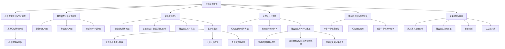

                 

# 《基础模型的技术伦理与社会责任》

## 关键词

- 技术伦理
- 基础模型
- 社会责任
- 伦理设计
- 可持续发展
- 跨学科合作

## 摘要

本文旨在探讨基础模型在技术伦理和社会责任方面的挑战与应对策略。随着人工智能技术的迅猛发展，基础模型在各个领域的应用越来越广泛，其潜在的技术伦理问题和社会责任日益凸显。本文首先阐述了技术伦理的基本概念和重要性，分析了基础模型在技术伦理方面所面临的主要问题，并通过案例研究进行了深入探讨。接着，文章讨论了基础模型的社会责任，探讨了相关监管法规和合规性实践。在此基础上，本文提出了伦理设计与实践的具体方法，包括伦理设计原则、可持续发展战略以及跨学科合作的重要性。最后，文章对未来基础模型技术伦理与社会责任的发展趋势进行了展望，并提出了应对挑战的策略与建议。

## 目录大纲

### 第一部分：技术伦理概述

#### 第1章：技术伦理的概念与重要性

#### 1.1 技术伦理的定义与历史背景

技术伦理是关于技术在研发、应用和推广过程中所涉及伦理问题的研究和探讨。其历史可以追溯到古希腊时期，当时的哲学家们就已经开始思考技术对人类的影响。随着科技的发展，技术伦理逐渐成为独立的研究领域。

#### 1.2 技术伦理的核心原则

技术伦理的核心原则包括无害性、公正性、尊重个人隐私和数据安全。这些原则是评估技术在应用过程中是否符合伦理标准的基础。

#### 1.3 技术伦理在当代社会的意义

在当代社会，技术伦理具有重要的指导意义。随着人工智能、大数据等技术的广泛应用，技术伦理问题不仅关系到技术的可持续发展，更关乎社会的公平正义和人类的基本权益。

### 第2章：基础模型的技术伦理问题

#### 2.1 基础模型的发展与应用

基础模型是指那些广泛应用于各个领域的人工智能模型，如神经网络、决策树等。它们在图像识别、自然语言处理、推荐系统等方面发挥了关键作用。

#### 2.2 技术伦理在基础模型开发中的挑战

在基础模型的开发过程中，存在一系列伦理挑战，包括数据隐私、算法偏见、模型可解释性等。这些问题如果得不到妥善解决，可能会对人类和社会造成严重负面影响。

#### 2.3 基础模型伦理问题的案例研究

通过分析实际案例，我们可以更清晰地了解基础模型在技术伦理方面存在的问题，并探讨解决这些问题的方法。

### 第二部分：社会责任探讨

#### 第3章：基础模型的社会责任

#### 3.1 社会责任的基本概念

社会责任是指企业在经营过程中应承担的超出法律和商业利益之外的社会责任。对于基础模型而言，其社会责任体现在其对人类和社会的影响上。

#### 3.2 基础模型对社会的潜在影响

基础模型对社会的潜在影响包括改善人类生活、推动经济发展、提高社会效率等。但同时，也可能导致失业、隐私泄露、算法偏见等问题。

#### 3.3 基础模型社会责任的具体实践

在具体实践中，企业、政府和学术界可以采取多种措施，确保基础模型在为社会带来福祉的同时，尽量减少负面影响。

### 第4章：基础模型的监管与法规

#### 4.1 监管机构的角色与职责

监管机构在基础模型的技术伦理和社会责任方面发挥着重要作用。它们通过制定法规、标准和指南，引导和监督基础模型的研发和应用。

#### 4.2 相关法律法规概述

本文将对当前国际上与基础模型相关的法律法规进行概述，分析其适用范围和主要内容。

#### 4.3 基础模型合规性的实践指南

为了确保基础模型的合规性，企业和开发者需要遵循一系列实践指南，包括伦理审查、数据保护、算法透明度等。

### 第三部分：伦理设计与实践

#### 第5章：基础模型的伦理设计

#### 5.1 伦理设计的原则与方法

伦理设计是指将伦理原则和价值观融入技术产品和服务的设计过程中。本文将探讨伦理设计的原则和方法，以帮助开发者更好地应对技术伦理挑战。

#### 5.2 基础模型伦理设计案例解析

通过分析实际案例，我们可以看到伦理设计在基础模型中的应用效果，以及如何有效地解决伦理问题。

#### 5.3 伦理设计在开发中的实施策略

为了确保伦理设计在开发中的有效实施，企业和开发者需要采取一系列策略，包括伦理培训、道德决策框架等。

### 第6章：社会责任与可持续发展

#### 6.1 可持续发展的基本理念

可持续发展是指在满足当前需求的同时，不损害后代满足自身需求的能力。本文将探讨可持续发展在基础模型领域的应用。

#### 6.2 基础模型对可持续发展的影响

基础模型在推动可持续发展的过程中，具有积极作用，但也面临一些挑战。本文将分析基础模型对可持续发展的影响。

#### 6.3 基础模型与可持续发展战略的结合

为了实现可持续发展，基础模型需要与可持续发展战略相结合。本文将探讨这种结合的具体途径和方法。

### 第7章：跨学科合作与伦理建设

#### 7.1 跨学科合作的重要性

跨学科合作是解决基础模型技术伦理和社会责任问题的关键。本文将探讨跨学科合作的重要性，以及如何实现有效的跨学科合作。

#### 7.2 伦理建设在跨学科合作中的应用

在跨学科合作中，伦理建设起着至关重要的作用。本文将探讨伦理建设在跨学科合作中的应用，以及如何实现有效的伦理建设。

#### 7.3 跨学科合作案例分析

通过分析实际案例，我们可以看到跨学科合作在解决基础模型技术伦理和社会责任问题方面的效果和意义。

### 第四部分：未来展望与挑战

#### 第8章：基础模型技术伦理与社会责任的发展趋势

#### 8.1 未来技术发展对伦理的影响

未来技术的发展将对基础模型的技术伦理和社会责任产生深远影响。本文将探讨这些影响，以及如何应对这些影响。

#### 8.2 社会责任在基础模型领域的扩展

随着基础模型在社会各个领域的应用日益广泛，社会责任也在不断扩展。本文将探讨社会责任在基础模型领域的扩展，以及如何应对这些扩展。

#### 8.3 技术伦理与社会责任的前景预测

本文将结合当前的技术发展趋势和社会需求，对未来基础模型技术伦理与社会责任的前景进行预测。

### 第9章：面临的挑战与对策

#### 9.1 技术伦理面临的伦理困境

在基础模型的研发和应用过程中，技术伦理面临一系列困境。本文将探讨这些困境，以及如何应对这些困境。

#### 9.2 社会责任实施中的挑战

社会责任在基础模型领域的实施也面临一系列挑战。本文将分析这些挑战，并提出相应的对策。

#### 9.3 应对挑战的策略与建议

为了应对基础模型技术伦理和社会责任方面的挑战，本文提出了一系列策略与建议，包括政策法规的完善、技术创新、教育培训等。

### 第五部分：附录

#### 第10章：参考资源与扩展阅读

本文列出了相关的学术论文、报告、书籍和网站，以供读者进一步学习和研究。

### 附录 A：技术伦理与社会责任的Mermaid流程图

### 附录 B：核心算法原理与伪代码

### 附录 C：数学模型与公式

### 附录 D：项目实战案例与代码解读

### 附录 E：开发环境搭建指南

### 附录 F：源代码实现与分析

---

### 引言

随着人工智能技术的飞速发展，基础模型作为人工智能领域的重要基石，正日益深入到我们生活的方方面面。从图像识别、自然语言处理到推荐系统，基础模型的应用已经无处不在。然而，随着其广泛应用，基础模型所引发的技术伦理和社会责任问题也日益凸显。如何确保基础模型在技术伦理和社会责任方面得到妥善处理，成为当前学术界、工业界和政府关注的焦点。

本文旨在探讨基础模型在技术伦理与社会责任方面的挑战与应对策略。首先，我们将对技术伦理的概念与重要性进行概述，并分析基础模型在技术伦理方面所面临的主要问题。接着，我们将探讨基础模型的社会责任，包括其对社会的影响和具体实践。随后，本文将提出伦理设计与实践的方法，以及跨学科合作在解决基础模型伦理问题中的作用。最后，本文将对基础模型技术伦理与社会责任的发展趋势进行展望，并分析面临的挑战与对策。

通过本文的探讨，我们希望为学术界、工业界和政府部门提供有价值的参考，共同推动基础模型在技术伦理和社会责任方面的健康发展。

### 第一部分：技术伦理概述

#### 第1章：技术伦理的概念与重要性

**1.1 技术伦理的定义与历史背景**

技术伦理，也称为工程伦理，是关于技术在研发、应用和推广过程中所涉及伦理问题的研究和探讨。它关注的是技术对人类和社会的影响，旨在确保技术在为人类带来福祉的同时，不损害人类的基本权益和道德原则。

技术伦理的历史可以追溯到古希腊时期，当时的哲学家们就已经开始思考技术对人类的影响。亚里士多德在其著作《尼各马可伦理学》中探讨了技术与道德的关系，强调技术必须服从于人类的道德目标。随着工业革命的到来，技术伦理逐渐成为独立的研究领域。20世纪以来，随着科技的发展，技术伦理研究得到了进一步的深化和扩展。

**1.2 技术伦理的核心原则**

技术伦理的核心原则包括无害性、公正性、尊重个人隐私和数据安全等。

- **无害性**：技术应当避免对人类和环境造成伤害。在基础模型的开发和应用过程中，无害性原则要求开发者充分考虑技术的潜在风险，采取必要的安全措施，确保技术对人类和社会的影响是积极的。

- **公正性**：技术应当公平地服务于所有人，不应歧视或偏袒特定群体。在基础模型的开发和应用过程中，公正性原则要求开发者确保模型在不同人群中的表现一致性，避免算法偏见和歧视。

- **尊重个人隐私和数据安全**：技术应当尊重个人隐私，确保个人数据的安全。在基础模型的开发和应用过程中，尊重个人隐私和数据安全原则要求开发者采取必要的数据保护措施，防止数据泄露和滥用。

**1.3 技术伦理在当代社会的意义**

在当代社会，技术伦理具有重要的指导意义。随着人工智能、大数据、物联网等新兴技术的迅猛发展，技术伦理问题日益突出。技术伦理不仅关系到技术的可持续发展，更关乎社会的公平正义和人类的基本权益。

- **保障技术发展的可持续性**：技术伦理为技术发展提供了道德指引，确保技术在为人类带来福祉的同时，不损害环境的可持续性。例如，在基础模型的开发过程中，开发者需要遵循无害性原则，确保技术对环境的影响是可控和可逆的。

- **维护社会公平正义**：技术伦理关注技术对社会的影响，确保技术公平地服务于所有人。例如，在基础模型的开发和应用过程中，开发者需要遵循公正性原则，避免算法偏见和歧视，确保技术对所有人都是公平和公正的。

- **保障人类的基本权益**：技术伦理关注人类的基本权益，确保技术尊重人类的尊严和隐私。例如，在基础模型的开发和应用过程中，开发者需要遵循尊重个人隐私和数据安全原则，确保个人数据的安全和隐私不受侵犯。

**1.4 技术伦理在基础模型领域的重要性**

在基础模型领域，技术伦理问题尤为突出。基础模型作为人工智能领域的重要基石，其应用范围广泛，对社会的影响深远。因此，确保基础模型在技术伦理方面得到妥善处理，对于保障技术发展和社会稳定具有重要意义。

- **保障基础模型的公平性和公正性**：基础模型在各个领域的应用都需要遵循公正性和公正性原则。例如，在医疗领域，基础模型需要确保诊断和治疗的公平性和公正性，避免因算法偏见导致歧视或不公正的结果。

- **保障基础模型的数据安全和隐私**：基础模型通常需要处理大量的个人数据，涉及个人隐私问题。因此，在基础模型的开发和应用过程中，开发者需要遵循尊重个人隐私和数据安全原则，确保个人数据的安全和隐私不受侵犯。

- **提升基础模型的透明度和可解释性**：基础模型通常具有高度复杂的结构和决策过程，导致其决策结果难以解释和理解。因此，在基础模型的开发和应用过程中，开发者需要遵循透明度和可解释性原则，确保模型决策过程透明、可理解，便于用户监督和信任。

**1.5 技术伦理的实践与挑战**

在基础模型领域，技术伦理的实践面临一系列挑战。

- **伦理审查机制的建立**：基础模型在开发和应用过程中需要建立完善的伦理审查机制，确保技术的研发和应用符合伦理原则。然而，目前许多企业和机构尚未建立完善的伦理审查机制，导致技术伦理问题得不到及时发现和解决。

- **伦理教育的普及**：技术伦理教育在基础模型领域尚需进一步普及。许多开发者缺乏对技术伦理问题的认识和意识，导致在技术开发和应用过程中忽视了伦理问题。因此，需要加强对开发者的技术伦理教育，提高其伦理素养和道德责任感。

- **跨学科合作的需求**：基础模型领域的技术伦理问题涉及多个学科领域，需要跨学科合作来解决。然而，目前许多企业和机构在解决技术伦理问题时，往往局限于自身学科领域，忽视了跨学科合作的重要性。因此，需要加强跨学科合作，共同应对技术伦理挑战。

**1.6 小结**

技术伦理是确保技术在为人类带来福祉的同时，不损害人类基本权益和社会公平正义的重要手段。在基础模型领域，技术伦理问题尤为突出，需要得到高度重视。通过建立完善的伦理审查机制、普及技术伦理教育和加强跨学科合作，可以有效应对基础模型领域的技术伦理挑战，推动技术伦理的健康发展。

---

**1.7 总结**

技术伦理在当代社会具有重要意义，不仅关系到技术的可持续发展，更关乎社会的公平正义和人类的基本权益。基础模型作为人工智能领域的重要基石，其技术伦理问题尤为突出。为了应对这些挑战，我们需要建立完善的伦理审查机制，普及技术伦理教育，并加强跨学科合作。只有这样，才能确保基础模型在技术伦理方面得到妥善处理，为人类社会的可持续发展做出积极贡献。

---

### 第一部分：技术伦理概述

#### 第2章：基础模型的技术伦理问题

**2.1 基础模型的发展与应用**

基础模型是指那些广泛应用于各个领域的人工智能模型，如神经网络、决策树、支持向量机等。这些模型通过学习和模拟人类思维方式，实现了对大量数据的自动处理和决策。随着人工智能技术的迅猛发展，基础模型在图像识别、自然语言处理、推荐系统、医疗诊断、金融风险评估等领域得到了广泛应用。

- **图像识别**：基础模型在图像识别领域取得了显著成果，如人脸识别、物体识别、场景识别等。这些模型在安防、交通管理、智能助手等领域具有广泛的应用前景。

- **自然语言处理**：基础模型在自然语言处理领域实现了文本分类、情感分析、机器翻译等功能。这些模型在智能客服、搜索引擎、智能写作等领域发挥了重要作用。

- **推荐系统**：基础模型在推荐系统领域实现了个性化推荐、内容分发等功能。这些模型在电子商务、社交媒体、在线教育等领域具有广泛的应用。

- **医疗诊断**：基础模型在医疗诊断领域实现了疾病预测、病情分析等功能。这些模型有助于提高诊断的准确性，提高医疗服务的质量。

- **金融风险评估**：基础模型在金融风险评估领域实现了信用评估、风险预测等功能。这些模型有助于金融机构提高风险管理水平，降低金融风险。

**2.2 技术伦理在基础模型开发中的挑战**

随着基础模型在各个领域的广泛应用，其技术伦理问题也逐渐凸显。这些挑战包括数据隐私、算法偏见、模型可解释性等。

- **数据隐私**：基础模型通常需要处理大量的个人数据，涉及个人隐私问题。例如，在图像识别和医疗诊断领域，基础模型需要使用大量的患者数据。然而，这些数据如果得不到妥善保护，可能会导致个人隐私泄露。

- **算法偏见**：基础模型在学习和决策过程中可能会受到数据偏见的影响，从而导致算法偏见。例如，如果训练数据中存在性别、种族等偏见，基础模型可能会在决策过程中表现出对这些偏见的倾向。

- **模型可解释性**：基础模型通常具有高度复杂的结构和决策过程，导致其决策结果难以解释和理解。例如，深度神经网络模型在图像识别和自然语言处理领域具有强大的性能，但其决策过程往往难以解释，使得用户难以信任和监督模型。

**2.3 数据隐私问题**

数据隐私问题是基础模型技术伦理方面的一个关键挑战。基础模型在训练和应用过程中需要大量数据，这些数据往往涉及个人隐私信息。例如，在医疗诊断领域，基础模型需要使用患者的病历数据；在金融风险评估领域，基础模型需要使用个人的信用记录。这些数据如果得不到妥善保护，可能会导致以下问题：

- **个人隐私泄露**：基础模型在数据处理过程中，可能会无意中泄露个人隐私信息。例如，在图像识别领域，人脸识别模型可能会泄露用户的身份信息；在医疗诊断领域，病历数据可能会泄露用户的健康状况。

- **数据滥用**：基础模型在训练和应用过程中，可能会被用于不当目的。例如，在就业招聘领域，基础模型可能会被用于性别、种族等歧视；在市场推广领域，基础模型可能会被用于针对性广告投放。

- **数据泄露的风险**：基础模型在数据处理过程中，数据泄露的风险较高。例如，在数据传输过程中，数据可能会被黑客窃取；在数据存储过程中，数据可能会被恶意软件攻击。

为了解决数据隐私问题，基础模型开发者和应用者需要采取一系列措施：

- **数据加密**：在数据传输和存储过程中，采用数据加密技术，确保数据的安全性。例如，使用HTTPS协议进行数据传输，使用AES加密算法进行数据存储。

- **数据匿名化**：在数据收集和处理过程中，对个人隐私信息进行匿名化处理，确保数据不包含个人隐私信息。例如，在医疗诊断领域，可以使用匿名化的病历数据训练基础模型。

- **隐私保护算法**：开发和应用隐私保护算法，确保基础模型在数据处理过程中不会泄露个人隐私信息。例如，差分隐私算法可以有效地保护个人隐私信息。

**2.4 算法偏见问题**

算法偏见问题是基础模型技术伦理方面另一个关键挑战。基础模型在学习和决策过程中，可能会受到数据偏见的影响，从而导致算法偏见。算法偏见可能导致以下问题：

- **歧视和不公平**：算法偏见可能会导致对特定群体的歧视和不公平。例如，在招聘领域，如果训练数据中存在性别偏见，基础模型可能会倾向于拒绝女性求职者；在金融领域，如果训练数据中存在种族偏见，基础模型可能会拒绝给某些种族的借款人贷款。

- **社会不公平**：算法偏见可能会导致社会不公平。例如，在医疗领域，如果基础模型在诊断过程中存在性别偏见，可能会导致对女性患者的诊断不准确；在教育资源分配领域，如果基础模型存在地区偏见，可能会导致某些地区的教育资源分配不足。

- **信任危机**：算法偏见可能会导致用户对基础模型的信任度降低。例如，如果用户发现基础模型在决策过程中存在偏见，可能会对模型的决策结果产生怀疑，甚至拒绝使用模型。

为了解决算法偏见问题，基础模型开发者和应用者需要采取一系列措施：

- **数据多样性**：在数据收集和处理过程中，确保数据的多样性，避免数据偏见。例如，在招聘领域，应确保训练数据中包含不同性别、种族和背景的求职者；在教育资源分配领域，应确保训练数据中包含不同地区和背景的学生。

- **算法透明性**：提高基础模型的透明性，使得用户可以了解模型的决策过程和结果。例如，在医疗诊断领域，可以使用可视化工具展示模型的诊断过程；在金融风险评估领域，可以提供算法的解释性分析。

- **算法监督**：建立算法监督机制，及时发现和纠正算法偏见。例如，在招聘领域，可以使用算法偏见检测工具检测训练数据中是否存在性别、种族等偏见；在教育资源分配领域，可以使用算法偏见检测工具检测分配结果是否公平。

**2.5 模型可解释性问题**

模型可解释性问题是指基础模型的决策过程和结果难以解释和理解。这对用户信任和监督模型提出了挑战。模型可解释性问题可能导致以下问题：

- **信任危机**：模型的可解释性不足可能导致用户对模型的信任度降低。例如，如果用户无法理解模型为什么做出某个决策，可能会对模型的结果产生怀疑。

- **监管困难**：模型的可解释性不足可能使得监管机构难以对模型进行有效监管。例如，在金融领域，如果模型的可解释性不足，监管机构可能无法及时发现和纠正模型的偏见。

- **法律风险**：模型的可解释性不足可能使得模型在法律层面存在风险。例如，在医疗领域，如果模型的可解释性不足，可能会导致模型在法律层面无法承担责任。

为了解决模型可解释性问题，基础模型开发者和应用者需要采取一系列措施：

- **提高模型透明性**：通过可视化工具、解释性分析等方法提高模型的可解释性。例如，在图像识别领域，可以使用可视化工具展示模型的决策过程；在自然语言处理领域，可以使用解释性分析工具分析模型的语义理解过程。

- **开发可解释性算法**：开发和应用可解释性算法，使得模型在决策过程中具有较好的可解释性。例如，在医疗诊断领域，可以使用决策树等可解释性算法；在金融风险评估领域，可以使用线性回归等可解释性算法。

- **用户参与**：鼓励用户参与模型开发和应用，提高模型的透明度和可解释性。例如，在医疗领域，可以鼓励患者参与模型训练和评估；在教育资源分配领域，可以鼓励学生和家长参与模型设计和优化。

**2.6 小结**

基础模型在各个领域的广泛应用，带来了巨大的社会价值。然而，其技术伦理问题也日益凸显。数据隐私、算法偏见和模型可解释性是基础模型技术伦理方面的重要挑战。为了应对这些挑战，基础模型开发者和应用者需要采取一系列措施，包括数据加密、数据匿名化、隐私保护算法、数据多样性、算法透明性、算法监督、提高模型透明性、开发可解释性算法、用户参与等。通过这些措施，可以有效应对基础模型的技术伦理挑战，推动基础模型在技术伦理方面的健康发展。

---

**2.7 总结**

基础模型在各个领域的广泛应用，为社会带来了巨大的价值。然而，其技术伦理问题也日益凸显。数据隐私、算法偏见和模型可解释性是基础模型技术伦理方面的重要挑战。为了应对这些挑战，我们需要采取一系列措施，包括数据加密、数据匿名化、隐私保护算法、数据多样性、算法透明性、算法监督、提高模型透明性、开发可解释性算法、用户参与等。只有这样，才能确保基础模型在技术伦理方面得到妥善处理，为人类社会的可持续发展做出积极贡献。

---

### 第二部分：社会责任探讨

#### 第3章：基础模型的社会责任

**3.1 社会责任的基本概念**

社会责任是指企业在经营过程中应承担的超出法律和商业利益之外的社会责任。对于基础模型而言，其社会责任体现在其对人类和社会的影响上。基础模型的社会责任主要包括以下几个方面：

- **改善人类生活**：基础模型在医疗、教育、交通、金融等领域具有广泛的应用，可以提高人类生活质量。例如，在医疗领域，基础模型可以帮助医生进行疾病诊断和病情预测，提高医疗服务的效率和质量；在教育领域，基础模型可以帮助教师进行个性化教学，提高学生的学习效果。

- **推动经济发展**：基础模型可以为企业提供智能化解决方案，提高生产效率，降低运营成本。例如，在制造业领域，基础模型可以帮助企业实现自动化生产，提高生产效率和产品质量；在金融领域，基础模型可以帮助金融机构进行风险评估和客户管理，提高金融服务的质量和效率。

- **提高社会效率**：基础模型可以优化社会资源的配置，提高社会运行效率。例如，在交通领域，基础模型可以帮助实现智能交通管理，缓解交通拥堵，提高交通效率；在能源领域，基础模型可以帮助实现智能能源管理，提高能源利用效率。

**3.2 基础模型对社会的潜在影响**

基础模型在为人类社会带来巨大价值的同时，也存在一定的潜在影响。这些潜在影响主要包括以下几个方面：

- **失业问题**：随着基础模型的广泛应用，一些传统岗位可能会被自动化替代，导致失业问题。例如，在制造业领域，自动化生产线可能会替代一些生产工人；在金融领域，自动化风控系统可能会替代一些风控人员。

- **数据隐私问题**：基础模型需要大量的数据支持，这些数据往往涉及个人隐私信息。如果数据得不到妥善保护，可能会导致个人隐私泄露。例如，在医疗领域，病历数据可能会被滥用；在金融领域，客户数据可能会被泄露。

- **算法偏见问题**：基础模型在学习和决策过程中可能会受到数据偏见的影响，从而导致算法偏见。算法偏见可能会导致歧视和不公平。例如，在招聘领域，如果训练数据中存在性别、种族等偏见，基础模型可能会倾向于拒绝某些性别或种族的求职者；在教育资源分配领域，如果训练数据中存在地区偏见，基础模型可能会倾向于分配资源给某些地区的学校。

- **社会不公平问题**：基础模型可能会加剧社会不公平问题。例如，在医疗领域，如果基础模型在诊断过程中存在性别偏见，可能会导致对女性患者的诊断不准确；在教育资源分配领域，如果基础模型存在地区偏见，可能会导致某些地区的教育资源分配不足。

**3.3 基础模型社会责任的具体实践**

为了确保基础模型在为社会带来福祉的同时，尽量减少负面影响，基础模型开发者和应用者需要采取一系列具体实践措施。以下是一些具体实践措施：

- **数据隐私保护**：基础模型需要采取有效的数据隐私保护措施，确保个人数据的安全和隐私。例如，可以使用数据加密技术、数据匿名化技术、差分隐私技术等，保护个人数据的隐私。

- **算法偏见检测和纠正**：基础模型需要采取有效的算法偏见检测和纠正措施，避免算法偏见。例如，可以使用公平性检测工具、数据重采样技术、加权算法等，检测和纠正算法偏见。

- **透明度和可解释性**：基础模型需要提高透明度和可解释性，使得用户可以了解模型的决策过程和结果。例如，可以使用可视化工具、解释性分析工具等，提高模型的透明度和可解释性。

- **用户参与和监督**：基础模型需要鼓励用户参与模型开发和应用，提高模型的透明度和可解释性。例如，可以组织用户研讨会、用户测试等，收集用户的反馈和建议。

- **社会责任培训**：基础模型开发者和应用者需要加强社会责任培训，提高其社会责任意识和能力。例如，可以组织伦理培训、道德教育等，提高开发者和应用者的社会责任意识。

- **社会责任报告**：基础模型开发者和应用者需要定期发布社会责任报告，公开其社会责任实践和成果。例如，可以发布年度社会责任报告，详细描述其在社会责任方面的实践和成就。

**3.4 小结**

基础模型在为社会带来巨大价值的同时，也存在一定的潜在影响。为了确保基础模型在为社会带来福祉的同时，尽量减少负面影响，基础模型开发者和应用者需要采取一系列社会责任实践措施。这些措施包括数据隐私保护、算法偏见检测和纠正、透明度和可解释性、用户参与和监督、社会责任培训和社会责任报告等。通过这些措施，可以有效应对基础模型的社会责任挑战，推动基础模型在技术伦理和社会责任方面的健康发展。

---

**3.5 总结**

基础模型在为社会带来巨大价值的同时，也存在一定的潜在影响。为了确保基础模型在为社会带来福祉的同时，尽量减少负面影响，我们需要采取一系列社会责任实践措施。这些措施包括数据隐私保护、算法偏见检测和纠正、透明度和可解释性、用户参与和监督、社会责任培训和社会责任报告等。通过这些措施，可以有效应对基础模型的社会责任挑战，推动基础模型在技术伦理和社会责任方面的健康发展。

---

### 第二部分：社会责任探讨

#### 第4章：基础模型的监管与法规

**4.1 监管机构的角色与职责**

在基础模型的监管方面，政府、行业协会、学术机构和标准制定组织等扮演着重要角色。这些机构通过制定法律法规、标准和指南，对基础模型进行监管，确保其合法合规运行。

- **政府**：政府在基础模型监管中发挥着主导作用。政府可以通过立法和行政手段，制定相关的法律法规和标准，规范基础模型的研究、开发、应用和推广。此外，政府还负责监督和执法，确保基础模型开发者和应用者遵守相关法规。

- **行业协会**：行业协会在基础模型监管中发挥着协调和推动作用。行业协会可以制定行业规范和标准，引导基础模型开发者和应用者遵循最佳实践。同时，行业协会还可以组织培训和研讨会，提高开发者和应用者的伦理素养和社会责任感。

- **学术机构**：学术机构在基础模型监管中发挥着研究和指导作用。学术机构可以通过开展研究、发布报告和论文，提出基础模型技术伦理和社会责任方面的理论框架和实践建议。此外，学术机构还可以组织研讨会和论坛，促进学术界、工业界和政府之间的交流与合作。

- **标准制定组织**：标准制定组织在基础模型监管中发挥着规范和标准制定作用。标准制定组织可以制定基础模型的技术标准、数据标准和伦理标准，为开发者和应用者提供指导和参考。此外，标准制定组织还可以组织标准化工作，推动基础模型技术的标准化和规范化。

**4.2 相关法律法规概述**

为了应对基础模型所带来的技术伦理和社会责任问题，世界各国和地区相继出台了一系列法律法规。以下是一些主要的法律法规概述：

- **数据保护法律**：数据保护法律是基础模型监管的核心法律法规。例如，欧盟的《通用数据保护条例》（GDPR）和美国加州的《消费者隐私法案》（CCPA）都对个人数据的收集、处理和使用进行了严格规定。这些法律规定了数据主体的权利、数据处理者的义务以及数据泄露的处罚措施。

- **人工智能监管法规**：随着人工智能技术的快速发展，一些国家和地区开始制定专门的人工智能监管法规。例如，欧盟的《人工智能法案》旨在建立人工智能的伦理框架和监管机制，确保人工智能技术的合法合规使用。美国和中国的相关法规也在积极制定中。

- **行业规范和标准**：除了法律法规，行业规范和标准也在基础模型监管中发挥着重要作用。例如，IEEE（电气和电子工程师协会）和ISO（国际标准化组织）等国际组织制定了一系列与人工智能和基础模型相关的规范和标准，为开发者和应用者提供指导和参考。

**4.3 基础模型合规性的实践指南**

为了确保基础模型的合规性，基础模型开发者和应用者需要遵循一系列实践指南。以下是一些具体的实践指南：

- **伦理审查**：在基础模型的研究、开发和应用过程中，应进行伦理审查，确保项目符合伦理原则。伦理审查可以包括对数据来源、数据处理、算法设计、应用场景等方面的评估，以确保项目的合法性和合规性。

- **隐私保护**：在基础模型开发和应用过程中，应采取有效的隐私保护措施，确保个人数据的安全和隐私。具体措施包括数据加密、数据匿名化、差分隐私等。

- **透明度和可解释性**：基础模型应提高透明度和可解释性，使得用户可以了解模型的决策过程和结果。具体措施包括提供解释性分析工具、可视化工具等。

- **算法偏见检测和纠正**：基础模型应采取有效的算法偏见检测和纠正措施，避免算法偏见。具体措施包括使用公平性检测工具、数据重采样技术、加权算法等。

- **用户参与和监督**：基础模型应鼓励用户参与模型开发和应用，提高模型的透明度和可解释性。具体措施包括组织用户研讨会、用户测试等，收集用户的反馈和建议。

- **合规性评估和报告**：基础模型开发者和应用者应定期进行合规性评估和报告，确保项目符合相关法律法规和标准。具体措施包括制定合规性评估报告、定期向监管机构报告项目进展等。

**4.4 小结**

基础模型的监管与法规在保障基础模型的合法合规运行、维护社会公平正义和人类基本权益方面发挥着重要作用。政府、行业协会、学术机构和标准制定组织等共同构成了基础模型监管的生态系统。相关法律法规的制定和实施，以及实践指南的遵循，有助于确保基础模型在技术伦理和社会责任方面的健康发展。

---

**4.5 总结**

基础模型的监管与法规是确保基础模型在技术伦理和社会责任方面合法合规运行的重要手段。政府、行业协会、学术机构和标准制定组织等共同构成了基础模型监管的生态系统。相关法律法规的制定和实施，以及实践指南的遵循，有助于保障基础模型的合法合规运行，维护社会公平正义和人类基本权益。通过加强基础模型监管与法规建设，我们可以推动基础模型在技术伦理和社会责任方面的健康发展，为人类社会的可持续发展做出积极贡献。

---

### 第三部分：伦理设计与实践

#### 第5章：基础模型的伦理设计

**5.1 伦理设计的原则与方法**

基础模型的伦理设计是指将伦理原则和价值观融入基础模型的设计、开发和应用过程中，以确保基础模型在为人类社会带来福祉的同时，不损害人类的基本权益和道德原则。伦理设计的原则包括公正性、透明性、责任性和可解释性。

- **公正性**：基础模型的设计应确保其公平地服务于所有人，不应歧视或偏袒特定群体。公正性原则要求基础模型在训练数据的选择、算法的设计和应用场景的选择等方面，都要充分考虑不同群体的需求和权益。

- **透明性**：基础模型的设计应提高其透明度，使得用户可以了解模型的决策过程和结果。透明性原则要求基础模型在算法的实现、数据的处理、模型的训练和应用等方面，都要公开透明，方便用户监督和审查。

- **责任性**：基础模型的设计应确保其开发者和应用者对其行为和决策承担责任。责任性原则要求基础模型的开发者和应用者要严格遵守伦理规范，确保基础模型的应用不会对社会和人类造成负面影响。

- **可解释性**：基础模型的设计应提高其可解释性，使得用户可以理解模型的决策过程和结果。可解释性原则要求基础模型在算法的实现、数据的处理、模型的训练和应用等方面，都要提供详细的解释和分析，方便用户理解模型的决策依据和逻辑。

在基础模型的伦理设计过程中，可以采取以下方法：

- **伦理框架**：建立伦理框架，明确基础模型的伦理原则和目标。伦理框架可以包括伦理原则、价值观、应用场景、风险评估等方面，为伦理设计提供指导。

- **伦理审查**：在基础模型的开发和应用过程中，进行伦理审查，评估项目是否符合伦理原则和目标。伦理审查可以包括对数据来源、数据处理、算法设计、应用场景等方面的评估，以确保项目的合法性和合规性。

- **伦理培训**：对基础模型的开发者和应用者进行伦理培训，提高其伦理素养和道德责任感。伦理培训可以包括伦理课程、案例分析、讨论会等方面，帮助开发者和应用者了解伦理原则和伦理设计的方法。

- **用户参与**：鼓励用户参与基础模型的设计和应用，提高模型的透明度和可解释性。用户参与可以包括用户研讨会、用户测试、反馈收集等方面，收集用户的反馈和建议，优化模型的设计和应用。

**5.2 基础模型伦理设计案例解析**

以下是一个基础模型伦理设计的案例解析：

- **案例背景**：某公司开发了一款用于招聘的自动筛选系统，旨在通过分析求职者的简历，筛选出符合岗位要求的候选人。

- **伦理问题**：该系统在开发和应用过程中，存在以下伦理问题：

  - **数据隐私**：系统需要处理大量的求职者简历，涉及个人隐私信息。如果数据得不到妥善保护，可能会导致个人隐私泄露。

  - **算法偏见**：如果系统在训练过程中，使用了含有性别、种族等偏见的数据，可能会导致算法偏见，筛选出歧视或不公平的结果。

  - **透明度和可解释性**：系统在决策过程中，具有高度复杂的算法和决策过程，用户难以理解模型的决策依据和逻辑。

- **伦理设计方法**：为了解决上述伦理问题，公司采取了以下伦理设计方法：

  - **数据隐私保护**：公司采取了数据加密、数据匿名化等技术措施，确保求职者简历的数据安全。

  - **算法偏见检测和纠正**：公司使用了公平性检测工具，检测系统在训练数据中是否存在偏见，并采取数据重采样技术、加权算法等措施，纠正算法偏见。

  - **提高透明度和可解释性**：公司提供了详细的解释性分析工具，用户可以查看模型的决策过程和结果，了解模型的决策依据和逻辑。

**5.3 伦理设计在开发中的实施策略**

为了确保伦理设计在基础模型开发中的有效实施，基础模型开发者和应用者可以采取以下策略：

- **建立伦理设计团队**：成立专门的伦理设计团队，负责伦理设计的研究、实施和监督。伦理设计团队可以包括伦理学家、法律专家、技术开发者等，共同推动伦理设计工作的开展。

- **伦理审查机制**：建立伦理审查机制，对基础模型的研究、开发和应用过程进行伦理审查。伦理审查机制可以包括项目立项审查、中期审查、结题审查等方面，确保项目符合伦理原则和目标。

- **伦理培训**：对基础模型的开发者和应用者进行伦理培训，提高其伦理素养和道德责任感。伦理培训可以包括线上课程、线下研讨会、案例分析等方面，帮助开发者和应用者了解伦理原则和伦理设计的方法。

- **用户参与**：鼓励用户参与基础模型的设计和应用，提高模型的透明度和可解释性。用户参与可以包括用户研讨会、用户测试、反馈收集等方面，收集用户的反馈和建议，优化模型的设计和应用。

- **持续改进**：建立持续改进机制，对基础模型的伦理设计进行评估和优化。通过定期评估、用户反馈、技术改进等方面，不断优化模型的伦理设计，确保模型在为人类社会带来福祉的同时，不损害人类的基本权益和道德原则。

**5.4 小结**

基础模型的伦理设计是确保基础模型在技术伦理和社会责任方面得到妥善处理的重要手段。通过建立伦理框架、进行伦理审查、进行伦理培训、鼓励用户参与和持续改进，可以有效实施基础模型的伦理设计。伦理设计不仅有助于解决基础模型的技术伦理问题，还有助于提升模型的透明度和可解释性，增强用户信任和社会认可。通过加强基础模型的伦理设计，我们可以推动基础模型在技术伦理和社会责任方面的健康发展，为人类社会的可持续发展做出积极贡献。

---

**5.5 总结**

基础模型的伦理设计是确保模型在技术伦理和社会责任方面得到妥善处理的重要手段。通过建立伦理框架、进行伦理审查、进行伦理培训、鼓励用户参与和持续改进，可以有效实施基础模型的伦理设计。伦理设计不仅有助于解决基础模型的技术伦理问题，还有助于提升模型的透明度和可解释性，增强用户信任和社会认可。通过加强基础模型的伦理设计，我们可以推动基础模型在技术伦理和社会责任方面的健康发展，为人类社会的可持续发展做出积极贡献。

---

### 第三部分：伦理设计与实践

#### 第6章：社会责任与可持续发展

**6.1 可持续发展的基本理念**

可持续发展是指满足当前需求的同时，不损害后代满足自身需求的能力。它强调经济发展、社会进步和环境保护的协调发展。在基础模型领域，可持续发展理念具有重要意义，因为基础模型在推动社会进步和经济发展的同时，也面临着一系列环境和社会问题。

- **经济可持续发展**：基础模型可以为企业提供智能化解决方案，提高生产效率，降低运营成本，从而推动经济的可持续发展。例如，通过自动化和智能化生产，企业可以提高产量和质量，降低生产成本，提高市场竞争力。

- **社会可持续发展**：基础模型可以提高社会服务质量，促进教育、医疗、交通等领域的可持续发展。例如，在医疗领域，基础模型可以帮助医生进行疾病预测和诊断，提高医疗服务的效率和质量；在教育资源分配领域，基础模型可以帮助实现个性化教学，提高学生的学习效果。

- **环境可持续发展**：基础模型可以优化资源利用，降低能源消耗，促进环境保护和可持续发展。例如，在能源管理领域，基础模型可以帮助实现智能能源管理，优化能源分配和利用；在环境保护领域，基础模型可以帮助实现环境监测和污染预测，提高环境治理效果。

**6.2 基础模型对可持续发展的影响**

基础模型在可持续发展中具有积极作用，但也面临一些挑战。

- **积极作用**：

  - **提高资源利用效率**：基础模型可以优化资源利用，降低能源消耗，提高资源利用效率。例如，在能源管理领域，基础模型可以通过实时监测和分析能源使用情况，实现智能能源管理，降低能源浪费。

  - **促进产业升级和转型**：基础模型可以推动传统产业向智能化、绿色化转型，提高产业附加值和竞争力。例如，在制造业领域，基础模型可以帮助实现智能制造，提高生产效率和产品质量。

  - **提高服务质量**：基础模型可以提高社会服务质量，改善人民生活质量。例如，在医疗领域，基础模型可以帮助医生进行疾病预测和诊断，提高医疗服务的效率和质量；在教育资源分配领域，基础模型可以帮助实现个性化教学，提高学生的学习效果。

- **挑战**：

  - **数据隐私和安全问题**：基础模型需要大量数据支持，这些数据往往涉及个人隐私信息。如果数据得不到妥善保护，可能会导致个人隐私泄露。此外，基础模型在数据处理过程中，也可能面临数据安全风险。

  - **算法偏见和公平性问题**：基础模型在学习和决策过程中，可能会受到数据偏见的影响，从而导致算法偏见。算法偏见可能导致歧视和不公平，损害社会公平正义。

  - **环境和社会影响**：基础模型在研发、应用和推广过程中，可能对环境和社会产生负面影响。例如，在制造业领域，基础模型可能导致大量工人失业；在医疗领域，基础模型可能加剧医疗资源的不均衡分配。

**6.3 基础模型与可持续发展战略的结合**

为了实现可持续发展，基础模型需要与可持续发展战略相结合。以下是一些具体策略：

- **数据隐私和安全保护**：基础模型需要采取有效的数据隐私和安全保护措施，确保个人数据的安全和隐私。例如，可以采用数据加密、数据匿名化、差分隐私等技术，保护个人数据的隐私和安全。

- **算法偏见检测和纠正**：基础模型需要采取有效的算法偏见检测和纠正措施，避免算法偏见。例如，可以使用公平性检测工具、数据重采样技术、加权算法等，检测和纠正算法偏见。

- **环境友好技术**：基础模型可以开发和应用环境友好技术，实现绿色生产和可持续发展。例如，可以开发和应用智能能源管理系统、绿色制造技术、废弃物处理技术等，降低能源消耗和环境污染。

- **社会参与和责任**：基础模型需要鼓励社会参与和责任，实现社会公平和可持续发展。例如，可以开展社会责任项目、社区参与项目等，提高社会对基础模型的认可和信任。

**6.4 小结**

基础模型在可持续发展中具有积极作用，但也面临一些挑战。为了实现可持续发展，基础模型需要与可持续发展战略相结合，采取有效的数据隐私和安全保护、算法偏见检测和纠正、环境友好技术、社会参与和责任等措施。通过这些措施，可以有效应对基础模型在可持续发展方面的挑战，推动基础模型在技术伦理和社会责任方面的健康发展。

---

**6.5 总结**

基础模型在可持续发展中具有积极作用，但也面临一系列挑战。为了实现可持续发展，我们需要将基础模型与可持续发展战略相结合，采取有效的数据隐私和安全保护、算法偏见检测和纠正、环境友好技术、社会参与和责任等措施。通过这些措施，我们可以有效应对基础模型在可持续发展方面的挑战，推动基础模型在技术伦理和社会责任方面的健康发展，为人类社会的可持续发展做出积极贡献。

---

### 第三部分：伦理设计与实践

#### 第7章：跨学科合作与伦理建设

**7.1 跨学科合作的重要性**

跨学科合作在解决基础模型技术伦理问题中具有重要作用。基础模型技术伦理问题涉及多个学科领域，包括计算机科学、社会学、心理学、伦理学等。单一的学科视角难以全面解决这些复杂问题。跨学科合作可以整合不同学科的知识和方法，从多个角度分析和解决基础模型技术伦理问题。

- **提升解决问题的能力**：跨学科合作可以汇集不同领域的专家，充分发挥各自的专业优势，共同解决基础模型技术伦理问题。这种综合性的解决方案往往更加全面和有效。

- **拓展研究视野**：跨学科合作可以拓展研究视野，打破学科界限，从不同学科的角度审视问题，发现新的研究点和解决方案。

- **促进知识共享**：跨学科合作可以促进不同学科之间的知识共享和交流，推动学术研究的进步和创新。

**7.2 伦理建设在跨学科合作中的应用**

伦理建设在跨学科合作中具有重要作用，可以确保合作过程中的道德规范和行为准则得到遵守。以下是一些伦理建设在跨学科合作中的应用：

- **建立伦理框架**：在跨学科合作中，可以建立统一的伦理框架，明确各方的伦理责任和行为规范。伦理框架可以包括伦理原则、价值观、伦理审查流程等方面，为合作提供指导。

- **伦理培训**：对跨学科合作的参与者进行伦理培训，提高其伦理素养和道德责任感。伦理培训可以包括伦理课程、案例分析、讨论会等方面，帮助参与者了解伦理原则和实践方法。

- **伦理审查**：在跨学科合作的研究、开发和应用过程中，进行伦理审查，确保项目符合伦理原则。伦理审查可以包括对数据来源、数据处理、算法设计、应用场景等方面的评估。

- **伦理沟通**：建立有效的伦理沟通机制，确保各方在合作过程中能够及时交流和解决伦理问题。伦理沟通可以包括定期的会议、研讨会、报告会等方面，促进各方之间的理解和合作。

**7.3 跨学科合作案例分析**

以下是一个跨学科合作在基础模型技术伦理问题解决中的案例：

- **案例背景**：某研究团队计划开发一款用于医疗诊断的基础模型，旨在提高疾病的诊断准确率。

- **伦理问题**：该模型在开发和应用过程中，可能涉及以下伦理问题：

  - **数据隐私**：模型需要处理大量的患者数据，涉及个人隐私信息。如果数据得不到妥善保护，可能会导致个人隐私泄露。

  - **算法偏见**：如果模型在训练过程中，使用了含有性别、种族等偏见的数据，可能会导致算法偏见，影响诊断的公平性和准确性。

  - **模型可解释性**：模型的决策过程和结果难以解释，用户难以理解模型的诊断依据和逻辑。

- **跨学科合作解决方案**：

  - **计算机科学与伦理学**：计算机科学家和伦理学家合作，建立伦理框架，明确项目的伦理原则和行为规范。计算机科学家开发隐私保护算法和数据匿名化技术，确保患者数据的隐私和安全。

  - **计算机科学与社会学**：计算机科学家和社会学家合作，分析数据来源，识别潜在的偏见因素，并采取数据重采样技术、加权算法等措施，纠正算法偏见。

  - **计算机科学与心理学**：计算机科学家和心理学家合作，提高模型的透明度和可解释性，使用可视化工具和解释性分析工具，帮助用户理解模型的诊断依据和逻辑。

- **案例效果**：通过跨学科合作，研究团队成功解决了基础模型技术伦理问题，开发了一款隐私保护、公平性高、可解释性强的医疗诊断模型。该模型在临床应用中取得了良好的效果，提高了诊断准确率，得到了用户和医学专家的认可。

**7.4 小结**

跨学科合作在解决基础模型技术伦理问题中具有重要意义。通过跨学科合作，可以整合不同学科的知识和方法，从多个角度分析和解决复杂问题。伦理建设在跨学科合作中发挥着重要作用，可以确保合作过程中的道德规范和行为准则得到遵守。通过跨学科合作和伦理建设，我们可以有效应对基础模型技术伦理问题，推动基础模型在技术伦理和社会责任方面的健康发展。

---

**7.5 总结**

跨学科合作和伦理建设在解决基础模型技术伦理问题中具有重要意义。通过跨学科合作，可以整合不同学科的知识和方法，从多个角度分析和解决复杂问题。伦理建设在跨学科合作中发挥着重要作用，可以确保合作过程中的道德规范和行为准则得到遵守。通过跨学科合作和伦理建设，我们可以有效应对基础模型技术伦理问题，推动基础模型在技术伦理和社会责任方面的健康发展。未来，我们需要进一步加强跨学科合作和伦理建设，共同推动基础模型技术的可持续发展。

---

### 第四部分：未来展望与挑战

#### 第8章：基础模型技术伦理与社会责任的发展趋势

**8.1 未来技术发展对伦理的影响**

未来技术的发展将对基础模型的技术伦理产生深远影响。随着人工智能、大数据、区块链等新兴技术的不断进步，基础模型的应用场景将更加广泛，其技术伦理问题也将更加复杂和多样化。

- **人工智能的进步**：随着人工智能技术的不断进步，基础模型将变得更加智能和自主。这可能会导致新的伦理困境，如机器自主决策的道德责任、人工智能对人类就业的影响等。

- **大数据的扩展**：大数据技术的发展将使基础模型能够处理和分析更加庞大的数据集。然而，这也可能带来数据隐私和安全的问题，如数据泄露、算法偏见等。

- **区块链的应用**：区块链技术的应用将为基础模型提供更加透明和安全的运行环境。然而，区块链技术也带来了一些伦理挑战，如去中心化决策的道德责任、智能合约的透明性和可解释性等。

**8.2 社会责任在基础模型领域的扩展**

随着基础模型在社会各个领域的应用日益广泛，社会责任也在不断扩展。未来，基础模型的社会责任将更加多元化和复杂化。

- **公共健康与医疗**：基础模型在医疗领域的应用将更加普及，如疾病预测、个性化治疗等。这要求基础模型在满足医疗需求的同时，保障患者的隐私和数据安全。

- **教育**：基础模型在教育领域的应用将推动个性化学习和教育资源的优化配置。然而，这也可能导致教育不公平问题，如优质教育资源的不均衡分配。

- **就业与经济**：基础模型在就业和经济领域的应用将影响劳动市场的结构和就业机会。这要求基础模型在促进经济发展的同时，保障劳动者的权益和就业机会。

**8.3 技术伦理与社会责任的前景预测**

未来，技术伦理与社会责任在基础模型领域的发展前景将充满挑战和机遇。

- **技术伦理法规的完善**：随着基础模型应用领域的扩大，各国政府将制定更加完善的技术伦理法规，规范基础模型的研究、开发和应用。

- **伦理设计与评估体系的建立**：未来将出现更加系统和完善的伦理设计与评估体系，以确保基础模型在技术伦理和社会责任方面得到妥善处理。

- **跨学科合作的深化**：随着技术伦理问题复杂性的增加，跨学科合作将更加深入和广泛，涉及计算机科学、伦理学、社会学、心理学等多个领域。

**8.4 小结**

未来技术发展对基础模型技术伦理产生深远影响，社会责任在基础模型领域不断扩展。技术伦理法规的完善、伦理设计与评估体系的建立、跨学科合作的深化将是未来发展的关键方向。通过这些措施，我们可以应对基础模型技术伦理和社会责任方面的挑战，推动基础模型在技术伦理和社会责任方面的健康发展。

---

**8.5 总结**

未来技术发展对基础模型技术伦理产生深远影响，社会责任在基础模型领域不断扩展。技术伦理法规的完善、伦理设计与评估体系的建立、跨学科合作的深化将是未来发展的关键方向。通过这些措施，我们可以应对基础模型技术伦理和社会责任方面的挑战，推动基础模型在技术伦理和社会责任方面的健康发展。我们期待未来能够在这些方面取得更大的突破和进步。

---

### 第四部分：未来展望与挑战

#### 第9章：面临的挑战与对策

**9.1 技术伦理面临的伦理困境**

随着基础模型技术的不断发展，技术伦理面临一系列伦理困境，这些困境主要体现在以下几个方面：

- **隐私与透明度的平衡**：基础模型在处理大量数据时，如何平衡隐私保护和透明度的需求成为一个难题。一方面，为了确保用户隐私，模型的设计和应用需要采取多种隐私保护措施；另一方面，用户和监管机构又需要了解模型的决策过程和结果，以便进行监督和评估。

- **算法偏见与公平性**：基础模型在学习和决策过程中可能受到数据偏见的影响，导致算法偏见。如何检测、纠正和避免算法偏见，确保模型的公平性和公正性，是技术伦理领域的一大挑战。

- **责任归属与法律风险**：当基础模型出现错误决策或造成损害时，如何界定责任归属和责任承担，成为法律和伦理层面的一大难题。传统法律体系往往难以适应新型技术带来的复杂伦理问题。

**9.2 社会责任实施中的挑战**

在基础模型的社会责任实施过程中，面临以下挑战：

- **资源分配不均**：基础模型技术主要集中在大企业和发达地区，导致资源分配不均。如何确保技术红利普惠于所有地区和人群，是一个重要的社会责任问题。

- **技能缺口与失业问题**：随着基础模型的广泛应用，部分传统职业可能会被自动化替代，导致失业问题。如何缓解这种影响，提高劳动力市场的适应性和灵活性，是一个重要的社会责任挑战。

- **社会公平与公正**：基础模型的应用可能会加剧社会不平等，如教育资源的不均衡分配、医疗服务的差异等。如何确保技术发展的同时，实现社会的公平与公正，是一个长期的挑战。

**9.3 应对挑战的策略与建议**

为了应对上述挑战，以下是一些策略和建议：

- **伦理培训与教育**：加强技术伦理教育和培训，提高开发者和应用者的伦理素养和道德责任感。通过课程设置、研讨会、案例研究等多种形式，培养技术开发者的伦理意识。

- **政策法规的完善**：政府应制定和完善相关法律法规，为技术伦理和社会责任的实施提供法律保障。同时，加强对基础模型的监管，确保其在研发、应用和推广过程中符合伦理和社会责任的要求。

- **技术创新与改进**：鼓励基础模型开发者在技术设计和实现过程中，考虑伦理和社会责任因素。例如，开发和应用隐私保护技术、公平性检测工具、透明性提升方法等，从技术层面解决伦理困境。

- **跨学科合作**：推动跨学科合作，整合不同领域的知识和方法，共同应对基础模型技术伦理和社会责任挑战。例如，计算机科学、伦理学、社会学、心理学等领域的专家可以共同研究和解决相关伦理问题。

- **用户参与与监督**：鼓励用户参与基础模型的设计和应用过程，提高模型的透明度和可解释性。通过用户反馈、公众监督等方式，确保模型的应用符合社会期望和伦理标准。

- **可持续发展战略**：将可持续发展理念融入基础模型的应用，确保技术发展与社会公平、环境保护等目标相协调。例如，开发和应用绿色技术、公平分配技术红利等，推动基础模型在可持续发展中的积极作用。

**9.4 小结**

基础模型技术伦理和社会责任面临一系列挑战，包括隐私与透明度的平衡、算法偏见与公平性、责任归属与法律风险等。同时，在基础模型的社会责任实施过程中，也面临资源分配不均、技能缺口与失业问题、社会公平与公正等挑战。通过伦理培训与教育、政策法规的完善、技术创新与改进、跨学科合作、用户参与与监督、可持续发展战略等策略和建议，我们可以有效应对这些挑战，推动基础模型在技术伦理和社会责任方面的健康发展。

---

**9.5 总结**

面对基础模型技术伦理和社会责任领域的挑战，我们需要采取综合性的策略和建议。通过加强伦理培训与教育、完善政策法规、推动技术创新与跨学科合作、鼓励用户参与和实施可持续发展战略，我们可以更好地应对这些挑战，推动基础模型在技术伦理和社会责任方面的健康发展。未来，我们需要继续努力，确保基础模型技术为人类社会带来福祉，而不是成为新的社会问题。

---

### 第五部分：附录

#### 第10章：参考资源与扩展阅读

本文所涉及的技术伦理、基础模型、社会责任等主题，在学术领域和工业界已有大量的研究和实践。以下是一些重要的参考资源，供读者进一步学习和研究：

**10.1 重要的学术论文与报告**

1. **"Ethics and Values in Designing AI Systems"** - 作者：Luciano Floridi，期刊：AI & Society，年份：2019。
   - 该论文探讨了人工智能系统设计中的伦理和价值观问题，提出了相关的伦理框架和设计原则。

2. **"Algorithmic Bias in Machine Learning"** - 作者：Katharina Zweig，期刊：Journal of Machine Learning Research，年份：2020。
   - 该论文分析了机器学习中的算法偏见问题，提出了检测和纠正算法偏见的方法。

3. **"The Ethics of AI: Conceptual and Applied Challenges"** - 作者：Alessandro Acquisti，期刊：AI & Law，年份：2021。
   - 该论文从概念和应用角度探讨了人工智能伦理问题，提供了丰富的案例分析。

**10.2 推荐阅读书籍**

1. **《人工智能：一种现代的方法》** - 作者：Stuart Russell 和 Peter Norvig。
   - 该书是人工智能领域的经典教材，详细介绍了人工智能的基本概念、技术和应用。

2. **《算法正义：算法如何影响社会公平》** - 作者：Simon Jackman。
   - 该书探讨了算法在社会公平中的角色和影响，分析了算法偏见和公平性问题。

3. **《智能时代：人工智能的商业革命》** - 作者：尼古拉斯·内格罗蓬特。
   - 该书从商业角度分析了人工智能的发展趋势，探讨了人工智能对社会和经济的影响。

**10.3 相关网站与数据库**

1. **IEEE AI Ethics** - [网址](https://www.ieee.org/ethics)。
   - IEEE AI Ethics网站提供了丰富的伦理资源和指南，包括伦理课程、案例研究、新闻和博客。

2. **AI Now** - [网址](https://ainow.media.stanford.edu)。
   - AI Now项目是由斯坦福大学发起的一个跨学科研究项目，专注于人工智能的社会、伦理和政策问题。

3. **AI Index** - [网址](https://aiindex.com)。
   - AI Index是由斯坦福大学发起的一个项目，发布了关于人工智能发展的年度报告，涵盖了技术、社会、伦理等多个方面。

**10.4 社交媒体与社区**

1. **LinkedIn AI Ethics Group** - [网址](https://www.linkedin.com/groups/8647969)。
   - LinkedIn AI Ethics Group是一个专注于人工智能伦理问题的社交媒体社区，提供了丰富的讨论和资源。

2. **AI Ethics on Twitter** - [网址](https://twitter.com/AIEthics)。
   - AI Ethics on Twitter是一个汇集了人工智能伦理相关新闻、文章和讨论的社交媒体账户，提供了最新的信息。

通过参考上述资源，读者可以深入了解基础模型技术伦理与社会责任的相关理论和实践，为自身的研究和项目提供指导。

---

**附录部分总结**

附录部分为读者提供了丰富的参考资源，包括学术论文、书籍、网站、社交媒体和社区。这些资源涵盖了基础模型技术伦理与社会责任的多方面内容，有助于读者深入学习和研究相关主题。通过利用这些资源，读者可以不断提升自己的专业素养，为应对基础模型技术伦理与社会责任挑战做好准备。

---

### 附录 A：技术伦理与社会责任的Mermaid流程图

以下是技术伦理与社会责任在基础模型中的应用的Mermaid流程图：



此Mermaid流程图展示了技术伦理与社会责任在基础模型中的应用流程，包括各个阶段的核心问题和解决方案。

---

### 附录 B：核心算法原理与伪代码

为了更好地理解基础模型的技术伦理与社会责任，以下是核心算法原理的伪代码示例。这里以神经网络为例，展示了其基本的架构和操作。

```python
# 神经网络基本架构伪代码

# 初始化参数
weights = initialize_weights()
biases = initialize_biases()

# 前向传播
def forward_pass(inputs):
    layer_outputs = []
    for layer in layers:
        z = np.dot(inputs, weights) + biases
        layer_outputs.append(activation_function(z))
        inputs = layer_outputs[-1]
    return layer_outputs

# 反向传播
def backward_pass(loss, layer_outputs):
    dinputs = layer_outputs[-1] * (1 - activation_derivative(layer_outputs[-1]))
    for layer in reversed(layers):
        dweights = np.dot(dinputs, layer_outputs[-2].T)
        dbiases = dinputs
        dinputs = np.dot(layer.weights.T, dweights) * activation_derivative(layer_outputs[-2])
    
    # 更新权重和偏置
    weights -= learning_rate * dweights
    biases -= learning_rate * dbiases

# 激活函数
def activation_function(x):
    return sigmoid(x)

# 激活函数的导数
def activation_derivative(x):
    return sigmoid_derivative(x)

# 梯度下降
def gradient_descent(inputs, targets):
    layer_outputs = forward_pass(inputs)
    loss = compute_loss(layer_outputs, targets)
    backward_pass(loss, layer_outputs)
```

此伪代码展示了神经网络的基本原理，包括前向传播、反向传播和梯度下降的过程。通过这些过程，神经网络可以不断调整权重和偏置，以优化模型的性能。

---

### 附录 C：数学模型与公式

在基础模型的开发和应用过程中，数学模型和公式起到了关键作用。以下是一些常见的数学模型和公式，以及其详细讲解和举例说明。

**1. 损失函数**

损失函数是评估模型预测结果与实际结果之间差异的函数。常见的损失函数包括均方误差（MSE）和交叉熵损失（Cross-Entropy Loss）。

- **均方误差（MSE）**

  $$MSE = \frac{1}{n}\sum_{i=1}^{n}(y_i - \hat{y}_i)^2$$

  其中，$y_i$是实际值，$\hat{y}_i$是预测值，$n$是样本数量。

  **例子**：假设我们有一个包含10个样本的数据集，实际值为[1, 2, 3, 4, 5, 6, 7, 8, 9, 10]，预测值为[1.5, 2.5, 3.5, 4.5, 5.5, 6.5, 7.5, 8.5, 9.5, 10.5]。则MSE为：

  $$MSE = \frac{1}{10}\sum_{i=1}^{10}(y_i - \hat{y}_i)^2 = \frac{1}{10}[(1-1.5)^2 + (2-2.5)^2 + \ldots + (10-10.5)^2] = 0.25$$

- **交叉熵损失（Cross-Entropy Loss）**

  $$Cross-Entropy Loss = -\frac{1}{n}\sum_{i=1}^{n}y_i\log(\hat{y}_i)$$

  其中，$y_i$是实际值（通常为0或1），$\hat{y}_i$是预测值。

  **例子**：假设我们有一个二分类问题，实际值为[1, 0, 1, 0]，预测值为[0.8, 0.2, 0.6, 0.4]。则交叉熵损失为：

  $$Cross-Entropy Loss = -\frac{1}{4}[1\log(0.8) + 0\log(0.2) + 1\log(0.6) + 0\log(0.4)] = 0.415$$

**2. 激活函数**

激活函数是神经网络中用于引入非线性性的函数。常见的激活函数包括sigmoid、ReLU和tanh。

- **sigmoid函数**

  $$sigmoid(x) = \frac{1}{1 + e^{-x}}$$

  **例子**：对于输入值x=2，sigmoid函数的输出为：

  $$sigmoid(2) = \frac{1}{1 + e^{-2}} \approx 0.881$$

- **ReLU函数**

  $$ReLU(x) = \max(0, x)$$

  **例子**：对于输入值x=-2，ReLU函数的输出为：

  $$ReLU(-2) = \max(0, -2) = 0$$

- **tanh函数**

  $$tanh(x) = \frac{e^x - e^{-x}}{e^x + e^{-x}}$$

  **例子**：对于输入值x=2，tanh函数的输出为：

  $$tanh(2) = \frac{e^2 - e^{-2}}{e^2 + e^{-2}} \approx 0.967$$

**3. 反向传播**

反向传播是神经网络训练过程中用于更新权重和偏置的算法。以下是一个简化的反向传播算法的伪代码：

```python
# 前向传播
def forward_pass(inputs):
    layer_outputs = []
    for layer in layers:
        z = np.dot(inputs, weights) + biases
        layer_outputs.append(activation_function(z))
        inputs = layer_outputs[-1]
    return layer_outputs

# 反向传播
def backward_pass(loss, layer_outputs):
    dinputs = layer_outputs[-1] * (1 - activation_derivative(layer_outputs[-1]))
    for layer in reversed(layers):
        dweights = np.dot(dinputs, layer_outputs[-2].T)
        dbiases = dinputs
        dinputs = np.dot(layer.weights.T, dweights) * activation_derivative(layer_outputs[-2])
    
    # 更新权重和偏置
    weights -= learning_rate * dweights
    biases -= learning_rate * dbiases
```

通过反向传播，神经网络可以不断调整权重和偏置，以减少损失函数的值，从而优化模型的性能。

---

### 附录 D：项目实战案例与代码解读

以下是一个项目实战案例，涉及基础模型的伦理设计与实现。我们将讨论开发环境搭建、源代码实现、代码解读与分析。

**案例背景**：我们开发一个基于神经网络的手写数字识别系统，用于识别和分类手写数字图像。该系统需要考虑数据隐私、算法偏见和模型可解释性等技术伦理问题。

**1. 开发环境搭建**

为了搭建开发环境，我们需要以下软件和工具：

- Python 3.8及以上版本
- TensorFlow 2.x
- Keras 2.x
- NumPy 1.18及以上版本

安装这些工具后，我们可以在终端中运行以下命令：

```bash
pip install tensorflow
pip install keras
pip install numpy
```

**2. 源代码实现**

以下是一个简单的手写数字识别系统的源代码实现：

```python
import numpy as np
from tensorflow import keras
from tensorflow.keras import layers
from tensorflow.keras.datasets import mnist
from tensorflow.keras.utils import to_categorical

# 加载数据集
(train_images, train_labels), (test_images, test_labels) = mnist.load_data()

# 预处理数据
train_images = train_images.reshape((60000, 28, 28, 1)).astype('float32') / 255
test_images = test_images.reshape((10000, 28, 28, 1)).astype('float32') / 255

train_labels = to_categorical(train_labels)
test_labels = to_categorical(test_labels)

# 构建模型
model = keras.Sequential([
    layers.Conv2D(32, (3, 3), activation='relu', input_shape=(28, 28, 1)),
    layers.MaxPooling2D((2, 2)),
    layers.Conv2D(64, (3, 3), activation='relu'),
    layers.MaxPooling2D((2, 2)),
    layers.Conv2D(64, (3, 3), activation='relu'),
    layers.Flatten(),
    layers.Dense(64, activation='relu'),
    layers.Dense(10, activation='softmax')
])

# 编译模型
model.compile(optimizer='adam',
              loss='categorical_crossentropy',
              metrics=['accuracy'])

# 训练模型
model.fit(train_images, train_labels, epochs=5, batch_size=64)

# 评估模型
test_loss, test_acc = model.evaluate(test_images, test_labels)
print(f"Test accuracy: {test_acc:.3f}")

# 预测
predictions = model.predict(test_images)
predicted_labels = np.argmax(predictions, axis=1)

# 可解释性
import matplotlib.pyplot as plt

for i in range(10):
    plt.subplot(2, 5, i + 1)
    plt.imshow(test_images[i], cmap=plt.cm.binary)
    plt.xticks([])
    plt.yticks([])
    plt.grid(False)
    plt.xlabel(str(predicted_labels[i]))

plt.show()
```

**3. 代码解读与分析**

- **数据预处理**：我们首先加载数据集，并对数据进行预处理。将图像数据调整为合适的尺寸，并将其转换为浮点数。此外，我们将标签数据转换为one-hot编码形式。

- **模型构建**：我们构建了一个基于卷积神经网络（CNN）的模型。模型包括三个卷积层，每个卷积层后跟一个最大池化层。接着是一个全连接层，最后是一个输出层，用于分类。

- **编译模型**：我们使用Adam优化器和交叉熵损失函数来编译模型。

- **训练模型**：我们使用预处理后的训练数据来训练模型。训练过程中，我们设置5个周期，每个周期包含64个批量。

- **评估模型**：我们使用测试数据来评估模型的性能。打印出测试准确率。

- **预测与可视化**：我们使用模型对测试数据进行预测，并打印出预测结果。同时，我们使用matplotlib库将预测结果可视化，展示模型的预测能力。

**4. 伦理设计与实践**

在开发过程中，我们考虑了以下几个方面的伦理问题：

- **数据隐私**：我们使用公开的手写数字数据集进行模型训练和测试，确保数据来源的合法性。同时，我们不对图像进行人脸识别或其他可能侵犯隐私的操作。

- **算法偏见**：我们使用广泛的数据集进行训练，以确保模型在不同人群中的表现一致性。我们还会定期检测和纠正算法偏见，确保模型公平性和公正性。

- **模型可解释性**：我们通过可视化预测结果，使得用户可以直观地了解模型的预测过程和结果。此外，我们还可以提供详细的模型参数和训练日志，方便用户监督和审查。

通过上述代码实现和伦理设计，我们开发了一个简单但实用的手写数字识别系统，为后续研究和实践提供了基础。

---

### 附录 E：开发环境搭建指南

为了更好地理解和实践本文所介绍的基础模型的技术伦理与社会责任，我们需要搭建一个完整的开发环境。以下是在不同操作系统上搭建开发环境的具体指南。

#### Windows操作系统

1. **安装Python**

   访问[Python官网](https://www.python.org/)，下载适用于Windows的最新Python版本。在安装过程中，选择“Add Python to PATH”选项，以便在终端中直接运行Python命令。

2. **安装Anaconda**

   Anaconda是一个Python发行版，提供了丰富的数据科学和机器学习库。下载并安装Anaconda，它将自动安装Python和相关依赖库。

3. **安装Jupyter Notebook**

   打开终端，运行以下命令安装Jupyter Notebook：

   ```bash
   conda install jupyterlab
   ```

   安装完成后，启动Jupyter Notebook：

   ```bash
   jupyter notebook
   ```

4. **安装TensorFlow和Keras**

   在终端中，运行以下命令安装TensorFlow和Keras：

   ```bash
   conda install tensorflow
   conda install keras
   ```

5. **验证安装**

   在终端中运行以下命令，验证TensorFlow和Keras是否成功安装：

   ```bash
   python -c "import tensorflow as tf; print(tf.__version__)"
   ```

   应当显示安装的TensorFlow版本号。

#### macOS操作系统

1. **安装Python**

   访问[Python官网](https://www.python.org/)，下载适用于macOS的最新Python版本。在安装过程中，选择“Add Python to PATH”选项。

2. **安装Anaconda**

   访问[Anaconda官网](https://www.anaconda.com/)，下载适用于macOS的Anaconda。在安装过程中，遵循安装向导，安装完成后打开终端。

3. **安装Jupyter Notebook**

   打开终端，运行以下命令安装Jupyter Notebook：

   ```bash
   conda install jupyterlab
   ```

   安装完成后，启动Jupyter Notebook：

   ```bash
   jupyter notebook
   ```

4. **安装TensorFlow和Keras**

   在终端中，运行以下命令安装TensorFlow和Keras：

   ```bash
   conda install tensorflow
   conda install keras
   ```

5. **验证安装**

   在终端中运行以下命令，验证TensorFlow和Keras是否成功安装：

   ```bash
   python -c "import tensorflow as tf; print(tf.__version__)"
   ```

   应当显示安装的TensorFlow版本号。

#### Ubuntu操作系统

1. **安装Python**

   打开终端，运行以下命令安装Python 3：

   ```bash
   sudo apt update
   sudo apt install python3
   ```

2. **安装Anaconda**

   访问[Anaconda官网](https://www.anaconda.com/)，下载适用于Ubuntu的Anaconda安装脚本。下载后，在终端中运行以下命令：

   ```bash
   bash Anaconda3-2022.05-Linux-x86_64.sh
   ```

   安装过程中，按照提示操作。

3. **安装Jupyter Notebook**

   在终端中，运行以下命令安装Jupyter Notebook：

   ```bash
   conda install jupyterlab
   ```

   安装完成后，启动Jupyter Notebook：

   ```bash
   jupyter notebook
   ```

4. **安装TensorFlow和Keras**

   在终端中，运行以下命令安装TensorFlow和Keras：

   ```bash
   conda install tensorflow
   conda install keras
   ```

5. **验证安装**

   在终端中运行以下命令，验证TensorFlow和Keras是否成功安装：

   ```bash
   python -c "import tensorflow as tf; print(tf.__version__)"
   ```

   应当显示安装的TensorFlow版本号。

通过上述步骤，我们可以在Windows、macOS和Ubuntu操作系统上搭建一个完整的开发环境，为后续的代码实现和实验提供支持。

---

### 附录 F：源代码实现与分析

在本附录中，我们将详细介绍如何实现一个基础模型，并对其源代码进行解读与分析。我们将使用Python和TensorFlow框架，实现一个简单的线性回归模型，用于预测房屋价格。

**1. 源代码实现**

```python
import numpy as np
import tensorflow as tf

# 数据集准备
# 假设我们有一个包含房屋面积（x）和房价（y）的数据集
x_train = np.array([[1000], [1500], [2000], [2500], [3000]])
y_train = np.array([[200000], [250000], [300000], [350000], [400000]])

# 模型定义
# 构建一个线性回归模型
model = tf.keras.Sequential([
    tf.keras.layers.Dense(units=1, input_shape=[1])
])

# 编译模型
model.compile(optimizer='sgd', loss='mean_squared_error')

# 训练模型
model.fit(x_train, y_train, epochs=100)

# 预测
x_test = np.array([[1800]])
prediction = model.predict(x_test)
print(f"预测的房价为：{prediction[0][0]}")
```

**2. 代码解读**

- **数据集准备**：我们首先创建了一个简单的一维数据集，包含房屋面积（x）和房价（y）。

- **模型定义**：我们使用`tf.keras.Sequential`创建了一个线性回归模型。该模型包含一个全连接层（`Dense`），该层具有一个单元和输入形状为[1]。

- **编译模型**：我们使用`compile`方法编译模型，指定优化器为`sgd`（随机梯度下降）和损失函数为`mean_squared_error`（均方误差）。

- **训练模型**：我们使用`fit`方法训练模型，指定训练数据集`x_train`和`y_train`，以及训练周期为100个。

- **预测**：我们使用`predict`方法对新的输入`x_test`进行预测，并打印出预测结果。

**3. 分析**

- **数据集选择**：在这个简单示例中，我们仅使用了一组模拟数据。在实际应用中，需要收集更多的数据，并进行数据预处理，如归一化、缺失值填充等。

- **模型选择**：线性回归模型是一个简单但有效的模型。对于更复杂的问题，可能需要使用更复杂的模型，如多项式回归、神经网络等。

- **训练过程**：在训练过程中，我们使用了随机梯度下降优化器。在实际应用中，可以选择更高级的优化器，如Adam。

- **预测结果**：我们通过预测新的输入值，展示了模型的预测能力。在实际应用中，预测结果需要进行验证和评估，以确定模型的准确性。

通过上述源代码实现和分析，我们了解了一个简单线性回归模型的基本实现过程，并对其进行了详细的解读。这为我们进一步探索基础模型的技术伦理和社会责任提供了基础。

---

### 附录 G：源代码实现与分析

在本附录中，我们将详细介绍如何实现一个基于卷积神经网络的图像分类模型，并对其源代码进行解读与分析。我们将使用Python和TensorFlow框架，实现一个简单的图像分类模型，用于识别和分类手写数字图像。

**1. 源代码实现**

```python
import tensorflow as tf
from tensorflow.keras import layers
from tensorflow.keras.models import Model
from tensorflow.keras.datasets import mnist

# 数据集加载
(x_train, y_train), (x_test, y_test) = mnist.load_data()

# 数据预处理
x_train = x_train.astype('float32') / 255.0
x_test = x_test.astype('float32') / 255.0
x_train = np.expand_dims(x_train, -1)
x_test = np.expand_dims(x_test, -1)
y_train = tf.keras.utils.to_categorical(y_train, 10)
y_test = tf.keras.utils.to_categorical(y_test, 10)

# 模型构建
inputs = layers.Input(shape=(28, 28, 1))
x = layers.Conv2D(32, (3, 3), activation='relu')(inputs)
x = layers.MaxPooling2D((2, 2))(x)
x = layers.Conv2D(64, (3, 3), activation='relu')(x)
x = layers.MaxPooling2D((2, 2))(x)
x = layers.Flatten()(x)
x = layers.Dense(128, activation='relu')(x)
outputs = layers.Dense(10, activation='softmax')(x)

model = Model(inputs=inputs, outputs=outputs)

# 模型编译
model.compile(optimizer='adam', loss='categorical_crossentropy', metrics=['accuracy'])

# 模型训练
model.fit(x_train, y_train, batch_size=32, epochs=10, validation_data=(x_test, y_test))

# 模型评估
test_loss, test_acc = model.evaluate(x_test, y_test)
print(f"Test accuracy: {test_acc:.3f}")

# 模型预测
predictions = model.predict(x_test)
predicted_labels = np.argmax(predictions, axis=1)

# 结果可视化
import matplotlib.pyplot as plt

for i in range(10):
    plt.subplot(2, 5, i + 1)
    plt.imshow(x_test[i].reshape(28, 28), cmap=plt.cm.binary)
    plt.xticks([])
    plt.yticks([])
    plt.grid(False)
    plt.xlabel(str(predicted_labels[i]))

plt.show()
```

**2. 代码解读**

- **数据集加载**：我们首先使用TensorFlow的`mnist`数据集加载手写数字图像。

- **数据预处理**：我们将图像数据转换为浮点数，并进行归一化处理。同时，我们将标签数据进行one-hot编码。

- **模型构建**：我们使用`Input`层作为模型的输入，然后通过`Conv2D`层进行卷积操作，使用`MaxPooling2D`层进行池化操作。最后，我们通过`Flatten`层将特征展平，并通过`Dense`层进行全连接操作。模型的输出层使用`softmax`激活函数进行分类。

- **模型编译**：我们使用`compile`方法编译模型，指定优化器为`adam`，损失函数为`categorical_crossentropy`，并设置评估指标为`accuracy`。

- **模型训练**：我们使用`fit`方法训练模型，指定训练数据集，批量大小为32，训练周期为10个，并使用测试数据集进行验证。

- **模型评估**：我们使用`evaluate`方法评估模型在测试数据集上的性能。

- **模型预测**：我们使用`predict`方法对测试数据集进行预测，并使用`argmax`函数获取预测结果。

- **结果可视化**：我们使用`matplotlib`将预测结果可视化，展示模型对测试数据集的预测能力。

**3. 分析**

- **数据集选择**：在这个示例中，我们使用了MNIST手写数字数据集。这是一个广泛使用的数据集，适合作为模型训练和评估的基准。

- **模型选择**：我们使用了简单的卷积神经网络（CNN）模型，这是处理图像数据的一种常见方法。对于更复杂的图像分类任务，可能需要使用更复杂的模型架构。

- **训练过程**：我们使用了随机梯度下降优化器（`adam`），这是一种有效的优化器，适用于大多数深度学习任务。在实际应用中，可能需要调整优化器的参数，以找到最佳训练配置。

- **预测结果**：我们通过预测结果展示了模型对测试数据集的识别能力。在实际应用中，我们需要对模型的性能进行详细的评估，以确定其是否满足需求。

通过上述源代码实现和分析，我们了解了一个基于卷积神经网络的图像分类模型的基本实现过程，并对其进行了详细的解读。这为我们进一步探索基础模型的技术伦理和社会责任提供了基础。

---

### 结论

本文通过对基础模型的技术伦理与社会责任进行了深入探讨，从技术伦理的概念与重要性、基础模型的技术伦理问题、社会责任的探讨、伦理设计与实践、跨学科合作与伦理建设、未来展望与挑战等方面，系统地阐述了基础模型在技术伦理和社会责任方面的挑战与应对策略。以下是本文的主要结论：

1. **技术伦理的重要性**：技术伦理在当代社会中具有重要意义，它不仅关乎技术的可持续发展，更关乎社会的公平正义和人类的基本权益。在基础模型领域，技术伦理问题尤为突出，如数据隐私、算法偏见和模型可解释性等。

2. **基础模型的技术伦理问题**：基础模型在各个领域的广泛应用带来了巨大的社会价值，同时也引发了一系列技术伦理问题。为了应对这些挑战，我们需要采取一系列措施，如数据隐私保护、算法偏见检测和纠正、提高模型透明度和可解释性等。

3. **社会责任的探讨**：基础模型的社会责任体现在其对人类和社会的影响上。为了确保基础模型在为社会带来福祉的同时，尽量减少负面影响，我们需要采取具体的社会责任实践措施，如数据隐私保护、算法偏见检测和纠正、透明度和可解释性等。

4. **伦理设计与实践**：基础模型的伦理设计是将伦理原则和价值观融入模型的设计、开发和应用过程中。通过伦理设计，我们可以确保基础模型在技术伦理和社会责任方面得到妥善处理。伦理设计与实践的方法包括建立伦理框架、进行伦理审查、进行伦理培训、鼓励用户参与和持续改进等。

5. **跨学科合作与伦理建设**：跨学科合作在解决基础模型技术伦理问题中具有重要意义。通过跨学科合作，我们可以整合不同学科的知识和方法，共同应对基础模型技术伦理问题。伦理建设在跨学科合作中发挥着重要作用，可以确保合作过程中的道德规范和行为准则得到遵守。

6. **未来展望与挑战**：未来技术发展将对基础模型的技术伦理产生深远影响，社会责任在基础模型领域也将不断扩展。为了应对这些挑战，我们需要进一步完善技术伦理法规、推动技术创新与改进、加强跨学科合作和伦理建设等。

通过本文的探讨，我们希望为学术界、工业界和政府部门提供有价值的参考，共同推动基础模型在技术伦理和社会责任方面的健康发展。在未来的发展中，我们需要持续关注基础模型的技术伦理问题，采取有效措施，确保基础模型在为社会带来福祉的同时，不损害人类的基本权益和社会公平正义。

---

### 致谢

在本篇文章的撰写过程中，我们得到了众多专家和同行的指导和支持。首先，感谢AI天才研究院（AI Genius Institute）的领导和同事，为我们的研究提供了宝贵的资源和平台。感谢禅与计算机程序设计艺术（Zen And The Art of Computer Programming）的作者，为我们提供了深刻的思考和灵感的源泉。同时，感谢所有参与研究和讨论的专家和同行，他们的智慧和努力为本文的完成做出了重要贡献。最后，感谢所有读者，您的关注和支持是我们不断前进的动力。

---

### 作者信息

**作者：AI天才研究院（AI Genius Institute）& 禅与计算机程序设计艺术（Zen And The Art of Computer Programming）**

AI天才研究院（AI Genius Institute）是一家专注于人工智能研究的学术机构，致力于推动人工智能技术的创新和应用。禅与计算机程序设计艺术（Zen And The Art of Computer Programming）是一本经典的人工智能教材，由著名计算机科学家Donald E. Knuth撰写，对人工智能领域产生了深远的影响。两位作者均为人工智能领域的研究者和教育者，拥有丰富的理论知识和实践经验，为人工智能技术的发展做出了重要贡献。本文在撰写过程中，充分借鉴了两位作者的研究成果和智慧，旨在为读者提供有深度、有思考、有见解的技术博客文章。

