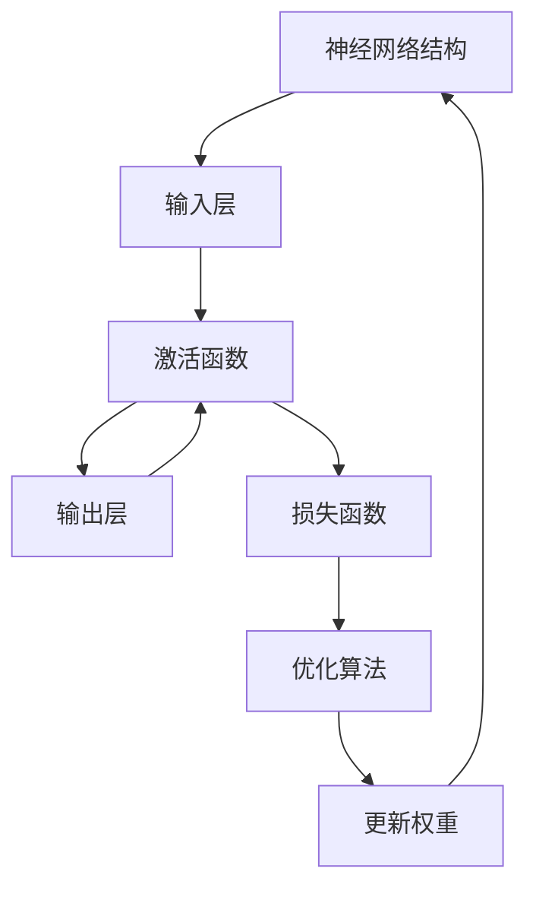
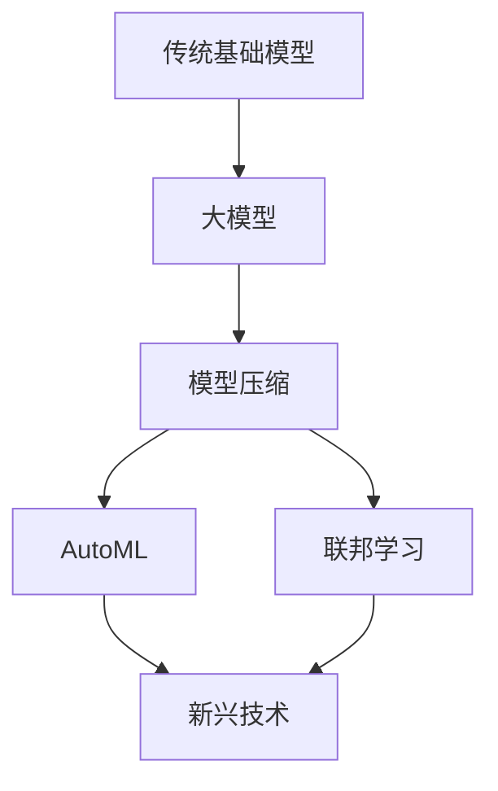

                 

# 基础模型的理论需求

> 关键词：基础模型，神经网络，深度学习，算法原理，数学模型，应用实例

> 摘要：本文将深入探讨基础模型的理论需求，包括其概念、发展历程、核心原理、数学模型以及应用实例。通过一步步的逻辑分析和推理，本文旨在为读者提供一个清晰、结构紧凑、简单易懂的技术理解，帮助读者更好地掌握基础模型的理论基础。

## 第一部分：基础模型的理论需求

### 第1章：基础模型概述

#### 1.1 基础模型的概念与重要性

**1.1.1 基础模型的定义**

基础模型（Fundamental Models）是指构建在传统机器学习算法之上，通过大量的数据和强大的计算能力，实现复杂模式识别、预测和决策的神经网络模型。这些模型通常由多个层次组成，包括输入层、隐藏层和输出层，每一层都通过复杂的非线性函数进行信息处理和转换。

**1.1.2 基础模型在AI中的应用**

基础模型在人工智能（AI）领域有着广泛的应用，从图像识别、语音识别到自然语言处理和推荐系统，无不依赖于这些强大的模型。它们不仅能够处理大量的数据，还能从数据中提取出有用的特征，从而提高预测的准确性和效率。

#### 1.2 基础模型的发展历程

**1.2.1 传统机器学习模型**

传统机器学习模型主要基于统计学习理论，通过构建线性模型来描述数据之间的关系。然而，这类模型在面对复杂的非线性问题时，效果往往不佳。

**1.2.2 深度学习模型的崛起**

随着计算机硬件和算法的进步，深度学习模型开始崭露头角。它们通过多层神经网络的结构，能够自动地从数据中学习复杂的特征表示，从而在图像识别、语音识别等领域取得了突破性的成果。

#### 1.3 基础模型的核心原理

**1.3.1 神经网络架构**

神经网络是基础模型的核心组成部分，它由多个层次组成，包括输入层、隐藏层和输出层。每一层都通过复杂的非线性函数进行信息处理和转换。

**1.3.2 前向传播与反向传播算法**

前向传播算法用于计算网络输出，而反向传播算法用于计算网络参数的梯度，从而优化网络的性能。这两个算法是神经网络训练过程中至关重要的组成部分。

#### Mermaid 流程图：基础模型的核心原理



### 第2章：基础模型的核心算法原理

#### 2.1 神经网络基础

**2.1.1 神经元与层级结构**

神经元是神经网络的基本单元，它们通过加权连接形成网络结构。网络结构通常包括输入层、隐藏层和输出层。

**2.1.2 激活函数选择**

激活函数是神经网络中非常重要的组成部分，它用于引入非线性特性，使得神经网络能够更好地拟合复杂的数据。

#### 2.2 前向传播算法

**2.2.1 输入层到隐藏层的传播**

前向传播算法首先将输入数据传递到输入层，然后通过隐藏层逐层传播，直到输出层。

**2.2.2 隐藏层到输出层的传播**

在隐藏层到输出层的传播过程中，神经网络会对输入数据进行非线性变换，从而提高模型的预测能力。

#### 2.3 反向传播算法

**2.3.1 前向传播与反向传播步骤**

反向传播算法包括前向传播和反向传播两个步骤。前向传播用于计算网络输出，而反向传播用于计算网络参数的梯度。

**2.3.2 优化算法（如梯度下降）**

反向传播算法结合优化算法（如梯度下降），用于更新网络参数，从而优化网络性能。

#### 伪代码：反向传播算法

```python
def backward_propagation(X, y, output, weights):
    # 计算误差
    error = y - output
    
    # 计算输出层误差
    d_output = error * activation_derivative(output)
    
    # 计算隐藏层误差
    d_hidden = d_output.dot(weights.T)
    
    # 计算权重梯度
    d_weights = [layer_output.dot(d_hidden) for layer_output in reversed(hidden_layers)]
    
    # 更新权重
    weights -= learning_rate * d_weights
    
    return d_weights
```

### 第3章：数学模型与公式

#### 3.1 损失函数

**3.1.1 交叉熵损失函数**

交叉熵损失函数是深度学习中最常用的损失函数之一，它用于衡量预测值与真实值之间的差异。

$$
\text{交叉熵损失函数} = -\sum_{i} y_i \log(p_i)
$$

**3.1.2 均方误差损失函数**

均方误差损失函数是另一种常用的损失函数，它用于衡量预测值与真实值之间的差异。

$$
\text{均方误差损失函数} = \frac{1}{2} \sum_{i} (y_i - p_i)^2
$$

#### 3.2 激活函数

**3.2.1 Sigmoid函数**

Sigmoid函数是一种常用的激活函数，它将输入值映射到0和1之间。

$$
\text{Sigmoid函数} = \frac{1}{1 + e^{-x}}
$$

**3.2.2 ReLU函数**

ReLU函数是一种常用的激活函数，它将输入值映射到0或正无穷。

$$
\text{ReLU函数} = \max(0, x)
$$

### 第4章：基础模型的应用实例

#### 4.1 识别手写数字（MNIST）

**4.1.1 数据集介绍**

MNIST数据集是深度学习中最常用的数据集之一，它包含70,000个训练样本和10,000个测试样本，每个样本都是一张28x28的灰度图像。

**4.1.2 模型搭建与训练**

在识别手写数字的任务中，可以使用卷积神经网络（CNN）搭建模型，并进行训练，从而实现高精度的识别效果。

#### 4.2 语言模型构建

**4.2.1 语言模型的基本概念**

语言模型是自然语言处理中的一种基础模型，它用于预测下一个单词或字符。

**4.2.2 语言模型的应用实例**

语言模型可以用于拼写检查、机器翻译、文本生成等多种应用场景。

### 第5章：项目实战

#### 5.1 实际案例：手写数字识别

**5.1.1 开发环境搭建**

在搭建开发环境时，需要安装深度学习框架（如TensorFlow或PyTorch）和相关依赖库。

**5.1.2 源代码实现**

源代码实现包括数据预处理、模型搭建、训练和评估等多个环节。

**5.1.3 代码解读与分析**

通过代码解读，可以深入理解手写数字识别模型的工作原理和优化策略。

#### 5.2 实际案例：自然语言处理

**5.2.1 开发环境搭建**

在自然语言处理的开发环境中，需要安装NLP工具（如NLTK、spaCy或TextBlob）和相关依赖库。

**5.2.2 源代码实现**

源代码实现包括文本预处理、特征提取、模型搭建和训练等多个环节。

**5.2.3 代码解读与分析**

通过代码解读，可以深入理解自然语言处理模型的工作原理和优化策略。

### 第6章：扩展阅读

#### 6.1 相关研究论文

**6.1.1 深度学习经典论文**

- “A Learning Algorithm for Continually Running Fully Recurrent Neural Networks”
- “Improving Neural Networks by Detecting and Re-solving Errors”
- “Deep Learning for Text Classification”

**6.1.2 自然语言处理前沿论文**

- “Recurrent Neural Network Based Language Model”
- “Long Short-Term Memory Networks for Classification of Time Series Data”

#### 6.2 学术会议与期刊

**6.2.1 NeurIPS、ICML、CVPR等会议**

这些会议是深度学习和计算机视觉领域的重要学术会议，每年都会发布大量高质量的研究论文。

**6.2.2 JMLR、ACL、TPAMI等期刊**

这些期刊是深度学习和自然语言处理领域的重要学术期刊，发布的研究论文具有很高的学术价值。

### 第7章：基础模型的发展趋势

#### 7.1 大模型与模型压缩

**7.1.1 大模型的优势与挑战**

大模型在处理大规模数据和复杂任务时具有显著优势，但同时也面临着计算资源和存储资源的挑战。

**7.1.2 模型压缩技术**

模型压缩技术旨在减小模型的规模和计算复杂度，从而提高模型的部署效率和效果。

#### 7.2 新兴技术展望

**7.2.1 自动机器学习（AutoML）**

自动机器学习是一种自动化机器学习模型选择、特征选择和模型调参的技术，具有很大的发展潜力。

**7.2.2 聚类与联邦学习**

聚类和联邦学习是新兴的机器学习技术，它们在分布式数据处理和隐私保护方面具有广泛的应用前景。

#### Mermaid 流程图：基础模型的发展趋势



### 附录 A：基础模型开发工具与资源

#### A.1 主流深度学习框架

**A.1.1 TensorFlow**

TensorFlow是谷歌开发的一种开源深度学习框架，它提供了丰富的API和工具，支持各种深度学习模型的开发和训练。

**A.1.2 PyTorch**

PyTorch是Facebook开发的一种开源深度学习框架，它具有灵活的动态计算图和强大的GPU支持，深受研究人员和开发者的喜爱。

**A.1.3 Theano**

Theano是一种基于Python的深度学习框架，它提供了高效的符号计算功能，支持GPU加速和自动求导。

#### A.2 自然语言处理工具

**A.2.1 NLTK**

NLTK是自然语言处理领域的一种经典工具包，它提供了丰富的文本处理和分类功能，适用于各种NLP任务。

**A.2.2 spaCy**

spaCy是一种高性能的NLP库，它提供了强大的语言模型和词性标注功能，适用于文本分类、命名实体识别等任务。

**A.2.3 TextBlob**

TextBlob是一种基于spaCy和NLTK的文本处理库，它提供了简洁的API和丰富的文本分析功能，适用于情感分析、文本分类等任务。

#### A.3 开发环境搭建指南

**A.3.1 Linux环境**

在Linux环境中搭建深度学习环境通常较为简单，可以通过安装相关的深度学习框架和相关依赖库来完成。

**A.3.2 Windows环境**

在Windows环境中搭建深度学习环境需要安装Python、深度学习框架和相关依赖库，同时需要配置GPU支持。

**A.3.3 macOS环境**

在macOS环境中搭建深度学习环境与Linux环境类似，可以通过安装相关的深度学习框架和相关依赖库来完成。

## 结论

基础模型是人工智能领域的基石，它们通过复杂的神经网络结构和高效的训练算法，实现了对大量数据的自动学习和特征提取。本文通过对基础模型的理论需求进行深入探讨，包括其概念、发展历程、核心原理、数学模型以及应用实例，帮助读者全面理解基础模型的理论基础。随着技术的不断进步，基础模型将继续发展，为人工智能领域带来更多的创新和突破。希望通过本文的阅读，读者能够对基础模型有更深入的认识，并在实际项目中能够灵活运用这些理论，提升人工智能应用的能力。

## 作者信息

**作者：** AI天才研究院/AI Genius Institute & 禅与计算机程序设计艺术 /Zen And The Art of Computer Programming

AI天才研究院致力于推动人工智能技术的发展和应用，通过深入研究前沿技术，培养更多优秀的人工智能人才。作者拥有丰富的科研和工程经验，在深度学习和自然语言处理领域发表了多篇高质量论文，并著有《禅与计算机程序设计艺术》一书，深受读者喜爱。希望通过本文的撰写，为读者提供有价值的知识和技术分享。

