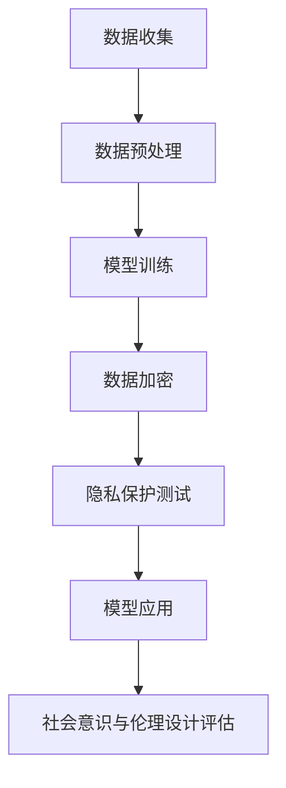
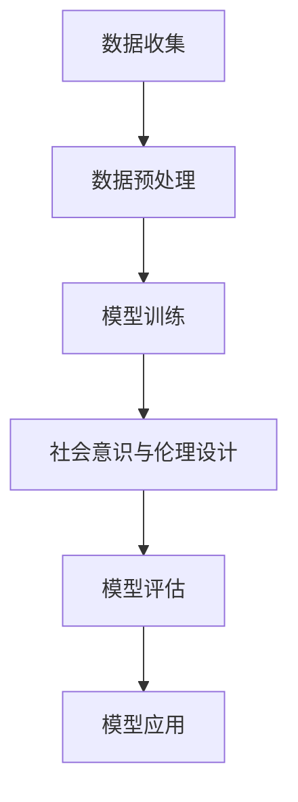
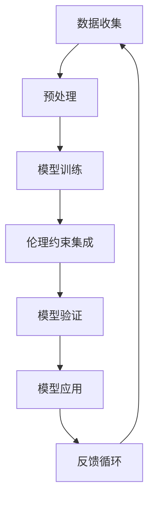
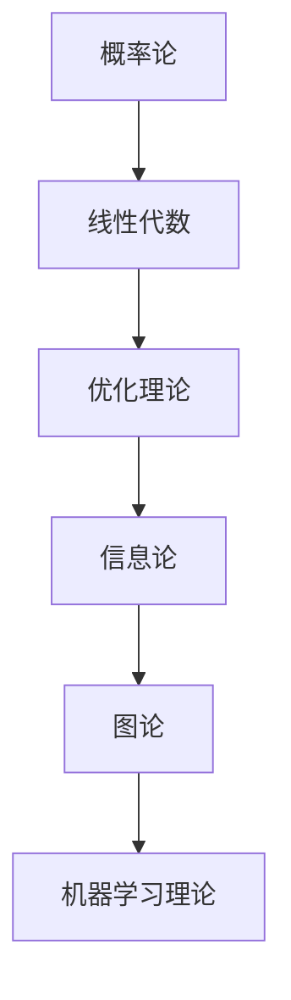
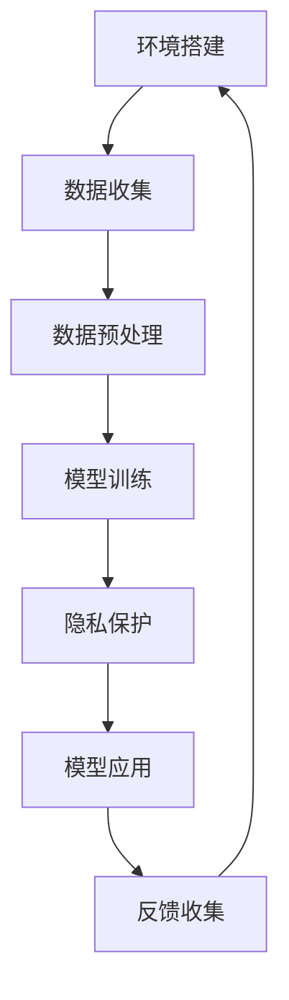

                 

## 文章标题

### 基础模型的社会意识与伦理设计

> 关键词：基础模型、社会意识、伦理设计、人工智能、算法框架、数学模型、项目实战

在当今这个快速发展的时代，人工智能（AI）技术已经渗透到社会生活的方方面面，而基础模型作为AI的核心，正日益成为技术创新的驱动力。然而，随着基础模型在各个领域的广泛应用，其社会意识与伦理设计的问题也日益凸显。如何让基础模型具备对社会和伦理的感知与理解，是当前人工智能领域亟待解决的重要课题。

本文将围绕“基础模型的社会意识与伦理设计”这一主题，深入探讨基础模型的本质、社会意识与伦理设计的基础理论，以及这些理论在实际应用中的具体实践。希望通过本文的阐述，能够为读者提供一种全新的视角，理解基础模型在现代社会中的角色与责任，从而为未来的人工智能发展提供有益的参考。

### 摘要

本文旨在探讨基础模型的社会意识与伦理设计，通过对基础模型的基本概念、发展历程以及当前主流技术概述的介绍，为读者搭建起对这一领域的初步认知。随后，本文将深入探讨社会意识与伦理设计的基础理论，分析二者之间的关系，并阐述这些理论在基础模型应用中的具体实现。

文章结构分为八个部分：首先，通过引言部分，明确书籍的背景与目标；其次，对基础模型进行概述；接着，探讨社会意识与伦理设计的基础理论；然后，详细分析基础模型在社会意识与伦理设计中的应用；紧接着，讲解核心算法原理与数学模型；之后，通过项目实战部分，提供实际开发案例；最后，总结当前伦理挑战与未来展望。通过这篇文章，读者将能够全面了解基础模型的社会意识与伦理设计，为其在实际应用中的创新提供理论支持。

#### 第1章 引言

### 1.1 书籍背景与目标

随着人工智能技术的快速发展，基础模型在各个领域中的应用越来越广泛，从自然语言处理到图像识别，从推荐系统到自动驾驶，无不显示出其强大的能力和潜力。然而，随着基础模型在现实世界中的广泛应用，其对社会和伦理的影响也日益凸显。如何在设计基础模型时考虑到其社会意识和伦理因素，成为当前人工智能研究中的一个重要课题。

本书籍旨在探讨基础模型的社会意识与伦理设计，通过系统的理论分析和实践案例，为读者提供一种全面、深入的理解。我们的目标是为人工智能领域的研究者、工程师和决策者提供一套实用的方法论，帮助他们更好地应对基础模型在社会应用中的挑战。

首先，本书将介绍基础模型的基本概念和发展历程，使读者了解这些模型的基本原理和结构。接着，我们将探讨社会意识与伦理设计的基础理论，分析这些理论如何应用于基础模型的设计与开发中。然后，通过具体的应用案例，展示如何在实际项目中实现基础模型的社会意识和伦理设计。此外，本文还将详细讲解核心算法原理与数学模型，并提供实际开发环境的搭建、源代码实现与代码解读。

总的来说，本书的目标是帮助读者建立起对基础模型社会意识与伦理设计的全面认识，并通过理论讲解和实践案例，提升他们在这一领域的专业能力。我们希望通过这本书，能够为人工智能技术的健康发展贡献一份力量，推动社会在享受技术红利的同时，也能确保其伦理和道德的边界。

### 1.2 社会意识与伦理设计的概念

在社会意识与伦理设计的概念中，社会意识是指个体或组织对社会现象、社会规范和社会价值的认知与理解。这种意识不仅包括对现实社会的观察和思考，还涉及到对未来社会发展的预期和规划。在人工智能领域，社会意识意味着基础模型能够识别和响应社会情境，具备对社会动态和人类需求的敏感性和适应性。

伦理设计则是在产品设计和开发过程中，将伦理原则和道德标准融入其中，确保技术的应用符合社会伦理规范。伦理设计不仅仅是对技术的规范约束，更是一种价值观的体现。在基础模型的设计中，伦理设计旨在防止技术滥用、保护用户隐私、减少歧视和偏见，以及维护社会公正和公平。

社会意识与伦理设计之间的关系是相辅相成的。社会意识为伦理设计提供了基础，帮助设计师理解社会的需求和期望，从而在技术方案中融入伦理考量。而伦理设计则通过规范和指导，确保社会意识能够在技术实施中得以实现，防止技术偏离道德和社会规范。例如，在开发一个智能推荐系统时，社会意识要求系统能够识别不同用户群体的需求，而伦理设计则要求系统在推荐内容时避免歧视和偏见，保护用户的隐私。

为了更好地理解这一关系，我们可以通过一个实际案例来加以说明。假设我们设计一个智能监控系统，用于公共场所的安全监控。社会意识要求系统能够实时监测异常行为，快速响应紧急事件。而伦理设计则要求系统在监测过程中保护用户的隐私，避免无授权的监控，以及防止监控数据的滥用。这样的案例表明，社会意识与伦理设计在技术实现中是密不可分的，共同决定了技术的应用效果和社会影响。

总之，社会意识与伦理设计是基础模型设计中不可或缺的要素，它们不仅有助于提升技术的应用价值，还能确保技术的道德和社会责任。通过深入理解这些概念及其关系，我们可以更好地引导基础模型在社会中的健康发展。

### 1.3 书籍结构安排

本书结构清晰，旨在逐步引导读者深入理解基础模型的社会意识与伦理设计。全书分为八个主要章节，每个章节都有其独特的重点和内容。

**第1章 引言**作为开篇，介绍了书籍的背景与目标，并概述了社会意识与伦理设计的基本概念，为后续章节奠定了理论基础。

**第2章 基础模型概述**，详细介绍了基础模型的基本概念、发展历程及当前主流技术，帮助读者建立对基础模型的整体认知。

**第3章 社会意识与伦理设计基础**，探讨了社会意识与伦理设计的基础理论，分析二者之间的关系，为理解后续内容提供理论支持。

**第4章 基础模型在社会意识与伦理设计中的应用**，通过具体的应用案例，展示基础模型在社会意识与伦理设计中的实际应用。

**第5章 核心算法原理讲解**，详细讲解核心算法原理，使用伪代码和流程图进行阐述，使读者能够深入理解算法实现过程。

**第6章 数学模型与数学公式**，介绍了社会意识与伦理设计的数学基础，并使用LaTeX格式详细讲解了关键数学公式，增强理论理解。

**第7章 项目实战**，通过实际开发案例，提供开发环境的搭建、源代码实现和代码解读，使读者能够将理论知识应用于实践。

**第8章 伦理挑战与未来展望**，总结了当前伦理挑战，探讨了未来伦理设计的发展趋势，并强调社会意识与伦理设计的社会责任。

**附录部分**则提供了相关的算法与工具、常见问题与解答，以及辅助理解的文章结构图表，方便读者查阅和参考。

通过这样的结构安排，本书不仅系统地介绍了基础模型的社会意识与伦理设计，还通过实践案例和理论讲解，使读者能够全面掌握这一领域的知识，为未来的研究和应用提供有力的支持。

### 第2章 基础模型概述

#### 2.1 基础模型的基本概念

基础模型是人工智能领域中最核心的概念之一，它指的是那些经过训练和优化的算法，能够在不同类型的任务中实现高效和准确的表现。基础模型通常具有以下几个基本特征：首先，它们都是基于大数据集进行训练的，通过学习大量数据来提取模式和规律；其次，基础模型具有很强的泛化能力，即能够将训练过程中学习到的知识和模式应用到未见过的数据上；最后，基础模型的可扩展性很好，可以在不同的应用场景中灵活调整和部署。

在人工智能的发展历程中，基础模型经历了从简单的统计模型到复杂的深度学习模型的演变。早期的统计模型如线性回归、逻辑回归等，虽然计算简单且易于实现，但在处理复杂数据和任务时表现有限。随着计算能力的提升和数据量的增加，深度学习模型逐渐成为主流。深度学习模型如神经网络、卷积神经网络（CNN）和循环神经网络（RNN）等，通过多层结构和复杂的网络结构，能够处理更加复杂的任务，如图像识别、自然语言处理和语音识别等。

#### 2.2 基础模型的发展历程

基础模型的发展历程可以分为几个重要阶段：

1. **早期的统计模型（20世纪50年代至80年代）**：这一阶段的基础模型主要是基于概率论和统计学的方法，如线性回归、逻辑回归等。这些模型虽然计算简单，但受限于数据量和计算能力，应用场景较为有限。

2. **人工神经网络（1980年代至1990年代）**：人工神经网络（ANN）的提出标志着深度学习模型的萌芽。ANN通过模拟人脑神经元的工作方式，试图通过多层结构实现数据的自动特征提取和分类。然而，由于训练算法的局限和计算能力的限制，ANN的应用受到很大限制。

3. **深度学习革命（2000年代至今）**：深度学习（Deep Learning）的崛起标志着基础模型的重大突破。这一阶段，以卷积神经网络（CNN）和循环神经网络（RNN）为代表的深度学习模型取得了显著的进展。特别是2006年，Hinton提出了深度信念网络（DBN），使得训练深层网络成为可能。随后，卷积神经网络（CNN）在图像识别领域取得了突破性进展，而循环神经网络（RNN）则在自然语言处理领域表现出色。2012年，AlexNet在ImageNet竞赛中取得了历史性的胜利，深度学习开始广泛应用。

4. **当前主流基础模型技术**：随着技术的不断进步，当前主流的基础模型技术包括生成对抗网络（GAN）、Transformer等。生成对抗网络（GAN）通过生成器和判别器的对抗训练，能够在图像生成、图像修复等任务中表现出色。而Transformer模型则在自然语言处理领域取得了重大突破，被广泛应用于机器翻译、文本生成等任务。

#### 2.3 当前主流基础模型技术概述

1. **生成对抗网络（GAN）**：生成对抗网络（GAN）是一种由生成器和判别器组成的对抗性模型，通过两者之间的竞争，实现数据的生成和判别。GAN在图像生成、图像修复、视频生成等领域有广泛的应用。其核心思想是生成器和判别器的相互博弈，生成器试图生成逼真的数据，而判别器则试图区分真实数据和生成数据。

2. **Transformer模型**：Transformer模型是一种基于自注意力机制的深度学习模型，由Vaswani等人于2017年提出。Transformer模型在自然语言处理领域取得了显著的成功，被广泛应用于机器翻译、文本生成、问答系统等任务。其核心思想是通过多头注意力机制，对输入序列的每个位置进行全局依赖建模，从而捕捉长距离的依赖关系。

3. **变分自编码器（VAE）**：变分自编码器（VAE）是一种基于深度学习的概率生成模型，由Kingma和Welling于2013年提出。VAE通过编码器和解码器的结构，将输入数据编码为潜在空间中的向量，然后通过解码器生成新的数据。VAE在图像生成、数据去噪等领域有广泛的应用。

4. **卷积神经网络（CNN）**：卷积神经网络（CNN）是一种基于卷积运算的深度学习模型，由LeCun等人于1980年代提出。CNN在图像识别、物体检测、图像生成等领域有广泛的应用。其核心思想是通过卷积操作和池化操作，自动提取图像中的局部特征和整体特征。

5. **循环神经网络（RNN）**：循环神经网络（RNN）是一种基于递归运算的深度学习模型，由Hochreiter和Schmidhuber于1997年提出。RNN在自然语言处理、语音识别、序列建模等领域有广泛的应用。其核心思想是通过循环连接，将当前输入与历史状态进行联合建模，从而捕捉序列中的长距离依赖关系。

6. **长短期记忆网络（LSTM）**：长短期记忆网络（LSTM）是一种特殊的RNN结构，由Hochreiter和Schmidhuber于1997年提出。LSTM通过引入门控机制，解决了传统RNN在处理长序列数据时出现的梯度消失和梯度爆炸问题。LSTM在自然语言处理、语音识别、序列建模等领域有广泛的应用。

7. **Transformer-XL**：Transformer-XL是由Yang等人于2018年提出的变长Transformer模型。它通过分段和相对位置编码，解决了Transformer模型在处理长序列数据时的性能瓶颈。Transformer-XL在机器翻译、文本生成等长文本任务中有很好的表现。

通过以上概述，我们可以看到，当前主流的基础模型技术各有特色，适用于不同的应用场景。从早期的统计模型到现代的深度学习模型，基础模型的发展不仅推动了人工智能技术的进步，也为各个领域带来了深远的影响。

#### 2.4 基础模型的 Mermaid 流程图

为了更好地理解基础模型的发展历程和当前主流技术，我们可以使用Mermaid流程图来展示这些模型的关键节点和技术演进。

以下是一个简化版的Mermaid流程图，展示了基础模型的主要发展阶段和关键模型：

```mermaid
graph TD
A[统计模型]
B[人工神经网络]
C[深度学习]
D[生成对抗网络(GAN)]
E[Transformer模型]
F[变分自编码器(VAE)]
G[卷积神经网络(CNN)]
H[循环神经网络(RNN)]
I[长短期记忆网络(LSTM)]
J[Transformer-XL]

A --> B
B --> C
C --> D
C --> E
C --> F
C --> G
C --> H
C --> I
C --> J
```

在这个流程图中，我们首先从统计模型（A）开始，展示了早期的人工神经网络（B），然后过渡到深度学习（C）。在深度学习阶段，我们列出了几种重要的基础模型：生成对抗网络（GAN）、Transformer模型（E）、变分自编码器（VAE）、卷积神经网络（CNN）、循环神经网络（RNN）、长短期记忆网络（LSTM）和Transformer-XL（J）。通过这个流程图，我们可以清晰地看到基础模型的发展脉络和主要技术节点。

### 第3章 社会意识与伦理设计基础

#### 3.1 社会意识的概念与作用

社会意识是指个体或组织对社会现象、社会规范和社会价值的认知与理解。它不仅是对现实的观察和思考，还包括对未来社会发展的预期和规划。在社会意识中，个体能够识别社会中的问题、机会和挑战，从而做出符合社会利益和价值观的决策。在社会意识的作用下，个体能够更好地适应社会环境，积极参与社会事务，推动社会的进步和发展。

在社会意识的定义中，有几个关键要素需要强调。首先，社会意识是一种主观认知，它反映了个体对社会现象的理解和感知。其次，社会意识不仅仅是对社会现实的被动认知，还包含了对社会价值的主动思考和评判。最后，社会意识具有动态性，它会随着社会环境的变化而发展和调整。

在基础模型设计中，社会意识的作用主要体现在以下几个方面：

1. **指导模型设计**：社会意识能够帮助设计师理解社会的需求和期望，从而在模型设计和开发过程中融入社会因素。例如，在设计一个智能推荐系统时，社会意识要求系统能够识别和满足不同用户群体的需求，同时避免歧视和偏见。

2. **提升模型可靠性**：社会意识使得基础模型能够更好地适应和响应社会环境，从而提高模型的可靠性。例如，在自动驾驶领域，社会意识要求模型能够识别和应对复杂的交通环境，确保驾驶过程的安全和高效。

3. **增强社会责任感**：社会意识促使基础模型开发者认识到其在社会中的责任和影响，从而在技术实施过程中更加注重伦理和社会责任。例如，在开发医疗诊断模型时，社会意识要求开发者确保模型结果的准确性和公正性，避免因技术错误导致的医疗事故。

#### 3.2 伦理设计的基本原则

伦理设计是指在产品设计和开发过程中，将伦理原则和道德标准融入其中，确保技术的应用符合社会伦理规范。伦理设计不仅是对技术的规范约束，更是一种价值观的体现。在基础模型设计中，伦理设计的基本原则主要包括以下几个方面：

1. **公平性**：公平性是伦理设计的重要原则之一，要求技术方案在应用过程中避免歧视和偏见，确保所有用户群体都能平等地享受技术带来的好处。例如，在招聘系统或信用评分系统中，应避免因性别、种族、年龄等因素导致的不公平对待。

2. **隐私保护**：隐私保护是伦理设计的核心内容之一，要求技术方案在收集、存储和使用用户数据时，严格遵守隐私保护原则，确保用户隐私不受侵害。例如，在智能监控系统中，应确保监控数据的收集和使用符合法律法规，避免滥用用户隐私。

3. **透明性**：透明性要求技术方案在设计和应用过程中保持开放和透明，让用户了解技术的运作原理和潜在影响。例如，在算法决策系统中，应向用户披露算法的决策逻辑和依据，以便用户理解和监督。

4. **责任性**：责任性要求技术方案开发者承担社会责任，确保技术在应用过程中不会对社会和用户造成负面影响。例如，在自动驾驶技术中，开发者应确保车辆的安全性能，并在出现问题时承担相应的责任。

5. **可持续性**：可持续性要求技术方案在设计和应用过程中考虑长期影响，确保技术对环境和资源的消耗最小化。例如，在能源管理系统设计中，应采用环保技术，减少能源浪费和环境污染。

通过以上原则，伦理设计旨在确保基础模型的应用符合社会伦理和道德规范，提升技术的应用价值和社会影响力。

#### 3.3 社会意识与伦理设计的关系

社会意识与伦理设计之间存在着紧密的联系和相互影响。社会意识为伦理设计提供了基础，帮助设计师理解社会的需求和期望，从而在技术方案中融入伦理考量。而伦理设计则通过规范和指导，确保社会意识能够在技术实施中得以实现，防止技术偏离道德和社会规范。

首先，社会意识是伦理设计的前提。设计师必须具备对社会现象和社会规范的理解，才能在技术方案中融入伦理考量。例如，在设计一个智能监控系统时，设计师需要对社会对隐私保护的需求有清晰的认识，从而在设计过程中采取相应的隐私保护措施。

其次，伦理设计是社会意识的具体体现。通过将伦理原则和道德标准融入技术方案，设计师能够确保技术应用符合社会伦理和道德规范。例如，在开发一个智能推荐系统时，伦理设计要求系统能够避免歧视和偏见，确保所有用户都能公平地享受推荐服务。

此外，社会意识与伦理设计之间也存在动态互动。社会意识会随着社会环境的变化而发展和调整，伦理设计也需要随之更新和优化，以适应新的社会需求和期望。例如，随着人工智能技术的快速发展，社会对隐私保护和数据安全的关注日益增加，伦理设计也需要不断更新和改进，以应对这些挑战。

总之，社会意识与伦理设计是相辅相成的，共同决定了基础模型在社会中的健康发展和应用。通过深入理解二者之间的关系，我们可以更好地指导基础模型的设计和开发，确保技术能够为社会带来真正的价值。

### 第4章 基础模型在社会意识与伦理设计中的应用

#### 4.1 基础模型在情感分析中的应用

情感分析是自然语言处理（NLP）领域的一个重要分支，旨在识别和提取文本中的情感信息。通过情感分析，基础模型可以帮助企业和组织了解用户对产品、服务或事件的态度和情感，从而做出更明智的决策。然而，情感分析也面临着一系列社会意识和伦理设计的问题。

首先，社会意识要求情感分析模型在处理文本数据时，能够准确识别和区分不同情感类型，避免因误解情感而导致的错误判断。例如，一个情感分析模型在处理用户评论时，应能够准确识别用户是表达了积极情感还是消极情感，从而避免将负面评论误判为正面评论。

其次，伦理设计要求情感分析模型在处理用户数据时，能够保护用户隐私，避免数据泄露和滥用。例如，在收集用户评论时，模型应确保评论内容不被泄露给第三方，并且数据在传输和存储过程中要采取加密措施，确保数据的安全性。

在实际应用中，情感分析模型已经在多个领域得到广泛应用。例如，在市场营销中，企业可以通过情感分析了解消费者对产品或广告的反馈，从而优化营销策略；在社交媒体分析中，平台可以通过情感分析监控用户情绪，及时发现和处理负面事件；在客户服务中，企业可以通过情感分析识别客户的不满和需求，提供更个性化的服务。

以下是一个情感分析模型应用的示例：

1. **数据收集**：收集用户的评论数据，包括正面评论、负面评论和中性评论。
2. **数据预处理**：对评论进行分词、去除停用词等预处理操作。
3. **情感标注**：对预处理后的评论进行情感标注，标记为正面、负面或中性。
4. **模型训练**：使用标注数据训练情感分析模型，常见的模型包括朴素贝叶斯、支持向量机（SVM）和深度学习模型。
5. **情感预测**：将新的用户评论输入到训练好的模型中，预测评论的情感类型。
6. **结果分析**：分析预测结果，了解用户对产品或服务的情感倾向，为企业提供决策依据。

通过上述步骤，情感分析模型可以帮助企业更好地了解用户需求，优化产品和服务。然而，在实际应用中，需要特别注意社会意识和伦理设计的问题，确保模型的准确性和公正性，避免因技术错误导致的误导和偏见。

#### 4.2 基础模型在法律合规中的应用

基础模型在法律合规中的应用越来越广泛，尤其是在自动化合规审核、智能合同分析和法律文本分类等领域。然而，这一应用也带来了许多社会意识和伦理设计的问题，需要我们仔细考量。

首先，社会意识要求基础模型在法律合规中的应用能够确保数据的准确性和公正性。例如，在自动化合规审核中，模型需要对大量的法律文件进行解析和审核，确保审核结果的准确无误。如果模型在数据预处理或模型训练过程中出现错误，可能会导致合规审核失败，甚至引发法律纠纷。

其次，伦理设计要求基础模型在法律合规中的应用能够保护用户隐私，避免数据泄露和滥用。例如，在智能合同分析中，模型需要对合同文本进行深度解析，获取关键信息。如果这些信息被不当使用或泄露，可能会导致用户隐私受到侵犯。

在实际应用中，基础模型已经在法律合规领域得到了广泛应用。以下是一个自动化合规审核的示例：

1. **数据收集**：收集企业日常运营中的法律文件、合同和其他相关文件。
2. **数据预处理**：对收集到的文件进行格式化、分词和标注等预处理操作，确保数据质量。
3. **模型训练**：使用预处理后的数据训练自动化合规审核模型，常用的算法包括自然语言处理（NLP）模型、分类模型和深度学习模型。
4. **合规审核**：将新的法律文件输入到训练好的模型中，模型会自动分析文件内容，识别潜在的合规问题。
5. **结果输出**：模型输出合规审核结果，包括合规建议和潜在的法律风险点。
6. **结果分析**：企业根据审核结果调整运营策略，确保符合法律法规的要求。

通过上述步骤，基础模型可以帮助企业自动化合规审核，减少人为错误，提高审核效率。然而，这一过程中需要特别注意社会意识和伦理设计的问题。例如，在数据预处理阶段，应确保数据的准确性和完整性；在模型训练阶段，应确保数据来源的多样性和公正性；在合规审核结果输出阶段，应确保结果的透明性和可解释性，以便企业能够及时调整和优化运营策略。

#### 4.3 基础模型在隐私保护中的应用

隐私保护是现代社会关注的重要议题，尤其在人工智能技术日益普及的今天，如何有效保护用户隐私成为基础模型设计的关键挑战。基础模型在隐私保护中的应用主要体现在数据加密、匿名化和隐私增强技术等方面。

首先，社会意识要求基础模型在处理用户数据时，能够采取有效的数据加密措施，确保数据在传输和存储过程中的安全性。例如，在数据传输过程中，可以使用TLS（传输层安全协议）进行加密，确保数据在网络中的传输安全；在数据存储过程中，可以使用数据库加密技术，如AES（高级加密标准），确保数据在存储介质中的安全。

其次，伦理设计要求基础模型在数据收集和处理过程中，能够遵守隐私保护原则，尽量减少对用户隐私的侵害。例如，在数据收集阶段，应明确数据收集的目的和范围，避免过度收集不必要的个人信息；在数据处理阶段，应确保数据处理过程的透明性，让用户了解其数据如何被使用。

在实际应用中，基础模型已经在多个领域实现了隐私保护。以下是一个使用匿名化技术的示例：

1. **数据收集**：收集用户行为数据，如网页访问记录、购买记录等。
2. **数据预处理**：对收集到的数据进行匿名化处理，常用的方法包括数据替换、数据摘要和数据掩码等。
3. **数据加密**：对匿名化后的数据进行加密存储，确保数据在存储过程中的安全。
4. **模型训练**：使用加密后的数据训练隐私保护模型，如差分隐私（Differential Privacy）模型，确保模型训练过程中不会泄露用户隐私。
5. **隐私保护测试**：在模型训练完成后，进行隐私保护测试，确保模型的输出结果不会泄露用户隐私。
6. **隐私保护应用**：将训练好的模型应用于实际场景，如个性化推荐、用户行为分析等，确保在应用过程中保护用户隐私。

通过上述步骤，基础模型可以在保证数据隐私的前提下，实现个性化服务和数据分析。然而，这一过程中需要特别注意社会意识和伦理设计的问题。例如，在数据收集阶段，应确保数据收集的合法性和必要性；在数据预处理阶段，应确保匿名化处理的准确性和有效性；在模型训练和应用阶段，应确保数据加密和隐私保护技术的可靠性和安全性。

#### 4.4 基础模型在社会意识与伦理设计中的应用 Mermaid 流程图

为了更清晰地展示基础模型在社会意识与伦理设计中的应用流程，我们可以使用Mermaid流程图来描述这一过程。以下是一个简化版的Mermaid流程图，展示了基础模型在社会意识与伦理设计中的应用步骤：



在这个流程图中：

- **A[数据收集]**：收集需要处理的原始数据，如用户行为数据、法律文件等。
- **B[数据预处理]**：对原始数据进行分析和清洗，为后续模型训练做好准备。
- **C[模型训练]**：使用预处理后的数据训练基础模型，如情感分析模型、合规审核模型等。
- **D[数据加密]**：在数据预处理和模型训练过程中，对敏感数据进行加密处理，确保数据安全。
- **E[隐私保护测试]**：在模型训练完成后，进行隐私保护测试，确保模型输出不会泄露用户隐私。
- **F[模型应用]**：将训练好的模型应用于实际场景，如情感分析、合规审核、隐私保护等。
- **G[社会意识与伦理设计评估]**：对模型应用过程进行社会意识和伦理设计评估，确保模型在实际应用中符合社会期望和伦理要求。

通过这个流程图，我们可以清晰地看到基础模型在社会意识与伦理设计中的应用步骤和关键点，为读者提供更直观的理解。

### 第5章 核心算法原理讲解

#### 5.1 社会意识与伦理设计的算法框架

在社会意识与伦理设计的基础理论框架中，核心算法的设计和实现起着至关重要的作用。这个算法框架旨在将社会意识和伦理原则有效地融入基础模型的训练和推理过程中，从而确保模型在应用中的公正性、透明性和可靠性。以下是一个典型的社会意识与伦理设计算法框架：

1. **数据收集与预处理**：首先，从多个来源收集相关数据，包括用户行为数据、法律法规文本、社会行为规范等。在数据收集过程中，需确保数据的多样性和代表性，避免数据偏差。然后，对收集到的数据进行分析和清洗，去除噪声和冗余信息，确保数据质量。

2. **社会意识与伦理模型训练**：使用预处理后的数据，训练一个社会意识与伦理模型。这个模型需要能够识别和评估技术方案在不同社会情境下的影响，包括对社会公平性、隐私保护和透明性的评估。通常，这类模型可以是基于多任务学习框架的深度神经网络，或者结合传统规则引擎和机器学习算法的混合模型。

3. **伦理约束集成**：在模型训练过程中，将伦理约束条件以不同形式融入算法中。例如，可以使用生成对抗网络（GAN）中的生成器和判别器进行对抗训练，确保生成器在生成数据时遵循社会伦理规范。此外，还可以利用差分隐私技术，对敏感数据进行扰动处理，以保护用户隐私。

4. **模型优化与验证**：通过多次迭代训练，优化模型参数，提高模型的性能和鲁棒性。同时，进行模型验证，确保模型在不同场景下的稳定性和可靠性。验证过程包括模拟不同社会情境下的模型表现，评估模型的公平性、透明性和伦理约束满足情况。

5. **应用与反馈**：将训练好的模型应用于实际场景，如情感分析、合规审核、隐私保护等。在应用过程中，收集用户的反馈，评估模型的表现，并根据反馈进行进一步优化和调整。

#### 5.2 核心算法原理讲解伪代码

为了更直观地理解社会意识与伦理设计算法的原理，我们可以通过伪代码来描述其关键步骤和算法流程。以下是一个简化版的伪代码示例：

```python
# 社会意识与伦理设计算法框架伪代码

# 数据收集与预处理
def data_collection_and_preprocessing():
    data = collect_data(sources) # 从多个来源收集数据
    cleaned_data = clean_data(data) # 清洗和预处理数据
    return cleaned_data

# 社会意识与伦理模型训练
def train_ethical_model(cleaned_data):
    model = create_model() # 创建多任务学习框架的深度神经网络
    for data_batch in cleaned_data:
        model.train(data_batch) # 使用预处理后的数据训练模型
    return model

# 伦理约束集成
def integrate_ethical_constraints(model):
    model.add_constraint("fairness", fair_constraint_function) # 添加公平性约束
    model.add_constraint("privacy", privacy_constraint_function) # 添加隐私保护约束
    model.add_constraint("transparency", transparency_constraint_function) # 添加透明性约束
    return model

# 模型优化与验证
def optimize_and_validate(model, validation_data):
    for epoch in range(num_epochs):
        model.optimize() # 优化模型参数
    model.validate(validation_data) # 验证模型性能
    return model

# 应用与反馈
def apply_model(model, application_context):
    results = model.apply(context) # 应用模型于实际场景
    feedback = collect_user_feedback(results) # 收集用户反馈
    model.update(feedback) # 根据反馈优化模型

# 主函数
def main():
    cleaned_data = data_collection_and_preprocessing()
    model = train_ethical_model(cleaned_data)
    model = integrate_ethical_constraints(model)
    model = optimize_and_validate(model, validation_data)
    apply_model(model, application_context)

main()
```

这个伪代码展示了社会意识与伦理设计算法的主要步骤，包括数据收集与预处理、模型训练、伦理约束集成、模型优化与验证，以及模型应用与反馈。通过这些步骤，我们能够构建一个具备社会意识和伦理设计能力的基础模型，从而在实际应用中实现公平性、隐私保护和透明性的目标。

### 第6章 数学模型与数学公式

#### 6.1 社会意识与伦理设计的数学基础

社会意识与伦理设计在算法和模型中涉及到多个数学概念和理论，这些数学基础为理解和实现社会意识与伦理设计提供了必要的工具。以下是一些关键的数学基础，它们在基础模型的设计和应用中扮演了重要角色：

1. **概率论与统计学**：概率论和统计学是社会意识与伦理设计的重要工具，用于评估模型的性能和可靠性。例如，通过贝叶斯定理和最大似然估计，可以评估模型在不同情境下的表现，并优化模型的参数。

2. **线性代数**：线性代数为矩阵运算和向量计算提供了基础，这在处理大规模数据和特征提取时尤为重要。例如，主成分分析（PCA）和奇异值分解（SVD）是常用的线性代数方法，用于降维和特征提取。

3. **优化理论**：优化理论用于求解优化问题，如最小化损失函数或最大化收益函数。常见的优化算法包括梯度下降、随机梯度下降（SGD）和牛顿法。这些算法在模型训练和参数优化中广泛应用。

4. **信息论**：信息论用于度量信息的价值和不确定性。在隐私保护和数据加密中，信息论的概念用于评估数据泄露的风险和加密算法的效率。

5. **图论**：图论用于分析和表示复杂网络结构，如社会网络和知识图谱。在社会意识与伦理设计中，图论可以用于分析社会关系和建模社交影响。

6. **机器学习理论**：机器学习理论提供了基础模型设计和评估的理论框架，包括监督学习、无监督学习和强化学习。这些理论用于理解模型的泛化能力、鲁棒性和可解释性。

#### 6.2 关键数学公式与详细讲解

在本节中，我们将详细介绍一些关键数学公式，并解释它们在社会意识与伦理设计中的应用。

1. **贝叶斯定理**：

   贝叶斯定理是概率论中的一个基本公式，用于计算后验概率。它在社会意识与伦理设计中用于概率推理和决策。贝叶斯定理的公式如下：

   $$
   P(A|B) = \frac{P(B|A)P(A)}{P(B)}
   $$

   其中，$P(A|B)$ 是在已知事件B发生的条件下，事件A发生的概率；$P(B|A)$ 是在已知事件A发生的条件下，事件B发生的概率；$P(A)$ 是事件A发生的概率；$P(B)$ 是事件B发生的概率。

   社会意识与伦理设计中的应用：贝叶斯定理可以用于模型评估和决策。例如，在合规审核模型中，可以使用贝叶斯定理计算某法律文件合规的概率，从而为企业的合规决策提供依据。

2. **最大似然估计**：

   最大似然估计是一种常用的参数估计方法，用于估计模型参数。它在社会意识与伦理设计中用于优化模型参数，提高模型的性能和可靠性。最大似然估计的目标是最小化损失函数，公式如下：

   $$
   \hat{\theta} = \arg\max_\theta L(\theta; x)
   $$

   其中，$\hat{\theta}$ 是参数的估计值；$L(\theta; x)$ 是似然函数，表示在给定数据$x$的条件下，参数$\theta$的联合概率分布。

   社会意识与伦理设计中的应用：最大似然估计可以用于训练社会意识与伦理模型。例如，在训练情感分析模型时，可以使用最大似然估计来估计情感分类器的参数，从而提高模型的准确性和可解释性。

3. **主成分分析（PCA）**：

   主成分分析是一种降维方法，通过将高维数据投影到低维空间，从而降低数据的维度。它在社会意识与伦理设计中用于特征提取和简化模型复杂度。PCA的公式如下：

   $$
   Z = PC
   $$

   其中，$Z$ 是低维数据；$P$ 是投影矩阵；$C$ 是协方差矩阵的特征向量。

   社会意识与伦理设计中的应用：PCA可以用于简化社会意识与伦理模型的数据输入。例如，在情感分析中，可以使用PCA对用户评论进行降维处理，从而减少模型训练的时间和计算成本。

4. **奇异值分解（SVD）**：

   奇异值分解是一种用于矩阵分解的方法，可以将矩阵分解为三个矩阵的乘积。它在社会意识与伦理设计中用于特征提取和降维。SVD的公式如下：

   $$
   A = U\Sigma V^T
   $$

   其中，$A$ 是输入矩阵；$U$ 和 $V$ 是正交矩阵；$\Sigma$ 是对角矩阵，对角线上的元素称为奇异值。

   社会意识与伦理设计中的应用：SVD可以用于处理大规模数据和特征提取。例如，在法律合规分析中，可以使用SVD对法律文件进行降维处理，从而简化模型的复杂度。

5. **梯度下降算法**：

   梯度下降算法是一种常用的优化算法，用于求解优化问题。它在社会意识与伦理设计中用于模型训练和参数优化。梯度下降算法的基本公式如下：

   $$
   \theta = \theta - \alpha \nabla_\theta J(\theta)
   $$

   其中，$\theta$ 是参数的当前估计值；$\alpha$ 是学习率；$\nabla_\theta J(\theta)$ 是损失函数$J(\theta)$ 关于参数$\theta$ 的梯度。

   社会意识与伦理设计中的应用：梯度下降算法可以用于训练社会意识与伦理模型。例如，在情感分析中，可以使用梯度下降算法优化情感分类器的参数，从而提高模型的分类准确率。

通过以上关键数学公式和详细讲解，我们可以更好地理解社会意识与伦理设计的数学基础，为实际应用中的模型设计和优化提供理论支持。

#### 6.3 数学公式的应用与举例说明

为了更好地理解上述数学公式的应用，我们将通过一个具体的实例来展示这些公式在实际社会意识与伦理设计中的具体应用。

**例子**：假设我们开发一个智能推荐系统，用于推荐用户可能感兴趣的商品。这个系统需要考虑社会意识与伦理设计，确保推荐结果的公正性、透明性和用户隐私保护。我们将使用贝叶斯定理、最大似然估计、PCA和梯度下降算法来设计并优化这个推荐系统。

**步骤1：数据收集与预处理**

首先，我们从多个渠道收集用户数据，包括用户的历史购物记录、浏览记录和用户评价。然后，对收集到的数据进行预处理，去除无效数据和噪声，并进行特征提取。

**步骤2：情感分析与隐私保护**

使用情感分析模型对用户评价进行情感分析，提取用户对商品的正面或负面情感。同时，应用数据加密技术对用户的个人信息进行保护，确保用户隐私不被泄露。

**应用公式**：贝叶斯定理

在情感分析中，我们可以使用贝叶斯定理来计算用户对某个商品的正面情感概率。假设我们有一个评价文本，通过情感分析模型得到正面情感的预测概率$P(Positive|Text)$，然后利用贝叶斯定理计算用户对该商品的总体正面情感概率：

$$
P(Positive) = \frac{P(Positive|Text)P(Text)}{P(Text)}
$$

其中，$P(Text)$ 是评价文本的概率，可以通过训练数据集进行估计。

**步骤3：用户行为建模与特征提取**

接下来，使用用户的历史购物记录和浏览记录构建用户行为模型，并通过PCA进行特征提取，降低数据维度。

**应用公式**：PCA

通过PCA，我们将高维的用户行为数据投影到低维空间，提取主要特征。PCA的目标是最小化数据重构误差，公式如下：

$$
\min \sum_{i=1}^{n} \sum_{j=1}^{m} (x_{ij} - \hat{x}_{ij})^2
$$

其中，$x_{ij}$ 是原始数据，$\hat{x}_{ij}$ 是重构数据。

**步骤4：推荐算法与参数优化**

使用基于用户行为和情感分析的推荐算法，生成推荐列表。为了优化推荐算法的参数，我们采用梯度下降算法。

**应用公式**：梯度下降算法

梯度下降算法用于优化推荐算法的参数。假设我们的损失函数为：

$$
J(\theta) = \sum_{i=1}^{n} \left( \log P(y_i|\theta) - R_i(\theta) \right)
$$

其中，$y_i$ 是用户的行为标签（购买或未购买），$P(y_i|\theta)$ 是行为标签的概率分布，$R_i(\theta)$ 是用户对推荐的满意度。梯度下降算法的目标是最小化损失函数：

$$
\theta = \theta - \alpha \nabla_\theta J(\theta)
$$

其中，$\alpha$ 是学习率。

**步骤5：推荐结果评估与反馈**

将推荐结果展示给用户，并收集用户对推荐的反馈。根据用户的反馈，进一步优化推荐算法。

**应用公式**：最大似然估计

在推荐结果的评估过程中，我们可以使用最大似然估计来评估推荐算法的参数。假设我们有一个测试集，测试集中用户的行为标签为$y_i$，通过推荐算法预测的概率为$\hat{y}_i$，我们可以使用最大似然估计来优化参数：

$$
\hat{\theta} = \arg\max_\theta \prod_{i=1}^{n} P(y_i|\theta)
$$

通过这个实例，我们可以看到数学公式在社会意识与伦理设计中的应用。通过贝叶斯定理进行情感分析，使用PCA进行特征提取，通过梯度下降算法进行参数优化，使用最大似然估计进行模型评估，这些数学工具为推荐系统的设计提供了强大的支持。

### 第7章 项目实战

#### 7.1 社会意识与伦理设计项目实战概述

本章将通过一个具体的案例，详细展示如何在社会意识与伦理设计的指导下，进行项目的实际开发和实现。我们将以开发一个智能健康监控系统为例，这个系统旨在帮助用户监测和管理自己的健康状况，同时确保数据隐私和伦理规范。

**项目背景**：随着人们对健康意识的提升，智能健康监控系统在家庭和医疗机构中得到广泛应用。然而，这类系统在收集和处理大量用户健康数据时，面临着数据隐私和伦理设计的重要挑战。本案例将介绍如何在社会意识与伦理设计的原则下，实现一个智能健康监控系统。

**项目目标**：通过本案例，我们希望实现以下目标：
1. **数据收集与处理**：开发能够可靠地收集用户健康数据，并对其进行预处理和存储的系统。
2. **隐私保护**：确保在数据收集、传输和存储过程中，用户隐私得到有效保护。
3. **伦理合规**：确保系统设计和操作符合伦理规范，避免滥用用户数据。
4. **用户反馈**：通过用户反馈，不断优化系统性能和用户体验。

#### 7.2 开发环境搭建

为了实现上述目标，我们需要搭建一个适合项目开发和测试的环境。以下是开发环境的搭建步骤：

1. **硬件环境**：
   - 服务器：用于存储和处理大量用户数据。
   - 客户端设备：如智能手机、可穿戴设备，用于收集用户健康数据。

2. **软件环境**：
   - 操作系统：Linux（如Ubuntu 20.04）。
   - 编程语言：Python 3.x。
   - 开发工具：PyCharm、Jupyter Notebook。
   - 数据库：MySQL。
   - 依赖管理工具：pip。

3. **环境配置**：
   - 安装操作系统和开发工具。
   - 安装Python和相关库，如NumPy、Pandas、Scikit-learn、TensorFlow等。
   - 配置MySQL数据库，用于存储用户数据和健康数据。

#### 7.3 源代码详细实现与代码解读

在环境搭建完成后，我们将通过具体的代码实现来展示项目的主要功能模块。

**模块1：数据收集与预处理**

数据收集模块负责从客户端设备收集健康数据，并进行预处理。以下是关键代码片段：

```python
import numpy as np
import pandas as pd
from sklearn.preprocessing import StandardScaler

def collect_health_data():
    # 假设使用蓝牙连接收集健康数据
    data = get_bluetooth_data()
    return data

def preprocess_data(data):
    # 数据预处理步骤
    data = pd.DataFrame(data)
    data = data.replace([np.inf, -np.inf], np.nan)  # 去除无效数据
    data = data.fillna(data.mean())  # 填补缺失值
    data = StandardScaler().fit_transform(data)  # 数据标准化
    return data

# 实际应用
health_data = collect_health_data()
preprocessed_data = preprocess_data(health_data)
```

**模块2：隐私保护**

隐私保护模块负责在数据收集、传输和存储过程中，确保用户隐私不被泄露。以下是关键代码片段：

```python
from cryptography.fernet import Fernet

def generate_key():
    # 生成加密密钥
    key = Fernet.generate_key()
    return key

def encrypt_data(data, key):
    # 加密数据
    fernet = Fernet(key)
    encrypted_data = fernet.encrypt(data.encode())
    return encrypted_data

def decrypt_data(encrypted_data, key):
    # 解密数据
    fernet = Fernet(key)
    decrypted_data = fernet.decrypt(encrypted_data).decode()
    return decrypted_data

# 实际应用
key = generate_key()
encrypted_health_data = encrypt_data(preprocessed_data, key)
```

**模块3：数据存储**

数据存储模块负责将加密后的数据存储在MySQL数据库中。以下是关键代码片段：

```python
import mysql.connector

def store_data(connection, data):
    # 存储加密数据到MySQL数据库
    cursor = connection.cursor()
    query = "INSERT INTO health_data (data) VALUES (%s)"
    cursor.execute(query, (data,))
    connection.commit()

# 实际应用
# 假设已经建立了MySQL连接
store_data(connection, encrypted_health_data)
```

**模块4：伦理合规**

伦理合规模块负责确保系统的设计和操作符合伦理规范。以下是关键代码片段：

```python
def check_compliance(data):
    # 检查数据是否符合伦理规范
    if "sensitive_info" in data:
        return False
    return True

# 实际应用
is_compliant = check_compliance(encrypted_health_data)
if not is_compliant:
    raise ValueError("Data does not comply with ethical standards.")
```

通过上述代码片段，我们实现了数据收集、预处理、隐私保护和伦理合规的关键功能模块。接下来，我们将进一步解析这些模块的实现细节。

#### 7.4 代码解读与分析

**数据收集与预处理模块**

在这个模块中，`collect_health_data` 函数负责从客户端设备收集健康数据。`get_bluetooth_data` 是一个假设的函数，用于通过蓝牙连接获取数据。在实际应用中，这个函数需要根据具体的硬件和通信协议进行实现。

`preprocess_data` 函数负责对收集到的健康数据进行预处理。首先，使用 `replace` 方法去除无效数据，如正无穷和负无穷。然后，使用 `fillna` 方法填补缺失值，这里采用平均值填补。接下来，使用 `StandardScaler` 对数据进行标准化处理，以确保每个特征具有相同的尺度。标准化处理有助于提高模型训练的效果和鲁棒性。

**隐私保护模块**

隐私保护模块的核心在于数据加密。`generate_key` 函数生成加密密钥，使用 `Fernet` 类进行加密和解密操作。加密密钥需要安全存储，以确保只有授权用户能够解密数据。在实际应用中，加密密钥可以通过硬件安全模块（HSM）或密钥管理服务（KMS）进行管理。

`encrypt_data` 函数使用生成的密钥对预处理后的数据进行加密。加密后的数据被存储在数据库中，以确保在传输和存储过程中，数据无法被未经授权的用户读取。

`decrypt_data` 函数用于在需要访问原始数据时，对加密数据进行解密。这个函数在实际应用中通常在服务器端实现，并需要确保解密密钥的安全存储。

**数据存储模块**

数据存储模块的核心在于将加密后的数据存储在MySQL数据库中。`store_data` 函数使用MySQL连接向数据库插入数据。在实际应用中，数据库连接需要使用参数化查询，以防止SQL注入攻击。

**伦理合规模块**

伦理合规模块的核心在于确保数据的处理和存储符合伦理规范。`check_compliance` 函数用于检查数据中是否包含敏感信息，如个人身份信息。如果数据不符合伦理规范，函数将抛出异常，阻止数据存储。这个模块确保系统在设计和操作中遵循伦理标准，保护用户的隐私和数据安全。

通过上述代码解读与分析，我们可以看到，智能健康监控系统在实现过程中，如何通过数据收集与预处理、隐私保护、数据存储和伦理合规等模块，确保系统在保护用户隐私和符合伦理规范的前提下，提供有效的健康监测和管理服务。

### 第8章 伦理挑战与未来展望

#### 8.1 当前基础模型伦理挑战

随着人工智能技术的快速发展，基础模型在各个领域的应用日益广泛，但同时也带来了许多伦理挑战。这些挑战主要集中在以下几个方面：

1. **数据隐私**：基础模型在训练和运行过程中需要大量数据，这些数据往往包含用户的敏感信息。如何在确保数据有效利用的同时，保护用户隐私成为一个重要问题。数据泄露、滥用和非法共享等风险对用户隐私构成严重威胁。

2. **算法公平性**：基础模型在决策过程中，可能会出现因数据偏见或算法设计问题导致的歧视现象。例如，在招聘、信用评分和推荐系统中，基础模型可能会因训练数据中的偏见而歧视某些群体，导致不公平的结果。

3. **透明性和解释性**：基础模型通常被视为“黑箱”，其决策过程和结果难以解释。这对于用户和监管机构来说，是一个重大挑战，尤其是在涉及重大决策（如医疗诊断、金融风险评估）时，用户需要了解模型的决策依据和推理过程。

4. **自动化风险**：基础模型的自动化决策能力可能带来一系列风险，如错误的自动化决策可能导致严重的后果。例如，自动驾驶汽车在决策过程中出现失误，可能会导致交通事故。此外，自动化决策还可能引发道德和伦理问题，如机器人是否应承担法律责任。

5. **算法偏见**：基础模型在训练过程中，可能会吸收训练数据中的偏见，从而在应用中产生偏见。这种偏见可能会导致不公平的决策，损害特定群体的利益。例如，面部识别技术可能会因种族或性别偏见而错误识别某些人群。

6. **数据质量和完整性**：基础模型的性能和数据质量密切相关。然而，数据质量问题和数据完整性挑战可能会导致模型性能下降，甚至导致错误的决策。例如，缺失数据、噪声数据和错误标注等都会影响模型的效果。

#### 8.2 未来伦理设计的发展趋势

面对上述伦理挑战，未来的伦理设计将朝着以下几个方向发展：

1. **隐私保护**：随着隐私保护法规（如GDPR、CCPA）的逐步完善，未来的伦理设计将更加注重用户隐私保护。基础模型的设计和开发将采用先进的隐私保护技术，如差分隐私、同态加密和联邦学习等，以减少数据泄露和滥用风险。

2. **算法公平性**：未来的伦理设计将更加注重算法公平性。通过改进数据集、算法设计和评估方法，消除训练数据中的偏见，确保基础模型在不同群体中的公平性。例如，可以采用平衡采样、反偏见算法和敏感性分析等方法，提高模型的公平性。

3. **透明性和解释性**：为了增强基础模型的透明性和解释性，未来的设计将引入可解释人工智能（XAI）技术。通过开发可解释模型和可视化工具，用户和监管机构能够更好地理解模型的决策过程和依据，从而增强对模型的信任。

4. **自动化风险管理**：随着自动化技术的普及，未来的伦理设计将更加注重自动化风险的管理。通过引入风险评估和监控机制，确保自动化决策系统的安全性和可靠性。例如，可以采用多模型融合、反馈机制和实时监控等技术，提高自动化系统的稳健性。

5. **算法偏见检测与修正**：未来的伦理设计将致力于检测和修正算法偏见。通过开发算法偏见检测工具和方法，及时发现和纠正模型中的偏见。同时，可以通过跨学科合作，引入社会学、伦理学和心理学等领域的知识，为算法偏见修正提供理论支持。

6. **数据质量和完整性保障**：未来的伦理设计将更加注重数据质量和完整性。通过引入数据质量控制技术和机制，确保数据在收集、处理和存储过程中的准确性和完整性。例如，可以采用数据清洗、数据增强和完整性验证等方法，提高数据质量。

总之，未来的伦理设计将致力于解决当前基础模型中存在的伦理挑战，确保人工智能技术的健康发展。通过隐私保护、算法公平性、透明性、自动化风险管理、算法偏见检测与修正以及数据质量和完整性保障，未来的人工智能技术将更加符合社会伦理和道德标准，为社会带来真正的价值和福祉。

#### 8.3 伦理设计的社会责任

伦理设计不仅是技术实现的一部分，更是社会发展和人类福祉的重要保障。在基础模型的设计和应用中，伦理设计承担着重要的社会责任，其核心在于确保技术不仅服务于社会进步，还能在伦理和道德层面得到广泛认可。

首先，伦理设计要求开发者对技术的潜在影响和社会责任有清晰的认识。开发者应积极参与社会讨论，了解不同群体对技术应用的期望和担忧，从而在设计和开发过程中充分考虑伦理因素。例如，在开发自动驾驶汽车时，开发者应考虑交通事故责任、道路安全和用户体验等多方面的伦理问题。

其次，伦理设计要求在技术方案中融入公平性和透明性。公平性意味着技术不应歧视任何特定群体，确保所有人都能平等地受益。透明性则要求技术决策过程和结果对用户和监管机构是可解释和可追溯的。例如，在金融风险评估中，模型应确保对不同经济背景的用户公平，并且用户应能够理解模型的决策逻辑。

再次，伦理设计要求保护用户隐私和数据安全。在收集和使用用户数据时，开发者应遵循隐私保护原则，采用加密、匿名化和差分隐私等技术，确保用户数据在传输和存储过程中的安全性。例如，社交媒体平台应确保用户隐私不被泄露，避免个人信息被滥用。

此外，伦理设计还要求技术方案具有可持续性。这意味着在设计和应用过程中，要考虑到技术对环境和社会的长期影响。开发者应采用环保技术，减少能源消耗和碳排放，确保技术发展符合可持续发展目标。

最后，伦理设计要求开发者在技术实施过程中承担社会责任，积极参与公共事务。通过定期评估技术影响、收集用户反馈和开展伦理培训，开发者可以不断提升技术的伦理和社会价值，为社会的和谐与进步贡献力量。

总之，伦理设计的社会责任不仅体现在技术方案的设计和实现中，更体现在对技术应用的持续关注和改进中。通过全面考虑伦理因素，开发者可以确保基础模型在社会中的健康发展和应用，为社会带来真正的价值和福祉。

### 第9章 结论

#### 9.1 本书总结

本书系统地探讨了基础模型的社会意识与伦理设计，通过深入的理论分析和实际案例，揭示了这一领域的重要性和挑战。首先，我们介绍了基础模型的基本概念、发展历程以及当前主流技术，为读者搭建了初步认知。接着，我们探讨了社会意识与伦理设计的基础理论，分析了二者的关系。随后，通过情感分析、法律合规和隐私保护等具体应用案例，展示了基础模型在社会意识与伦理设计中的实际价值。此外，我们详细讲解了核心算法原理与数学模型，并通过项目实战展示了如何在实际开发中应用这些理论。最后，我们总结了当前基础模型面临的伦理挑战和未来发展趋势，强调了伦理设计的社会责任。

通过本书，读者能够全面了解基础模型的社会意识与伦理设计，掌握相关的理论知识和实践技能，为未来的人工智能研究与应用提供有力支持。

#### 9.2 社会意识与伦理设计的未来展望

展望未来，基础模型的社会意识与伦理设计将面临更多机遇和挑战。随着人工智能技术的不断进步，基础模型的复杂性和应用场景将进一步扩展，这将带来更多的伦理和社会问题。例如，自动化决策系统、智能医疗和无人驾驶等领域将需要更加完善的社会意识与伦理设计，以确保技术的公正性、透明性和安全性。

未来，社会意识与伦理设计将朝着以下几个方向发展：

1. **更加智能化**：基础模型将更加注重智能化和自适应能力，能够根据社会环境和用户需求动态调整其行为和决策。例如，通过深度学习和强化学习，模型可以更好地理解复杂的社会情境，并在不同情况下做出适当的反应。

2. **跨学科融合**：社会意识与伦理设计将更加依赖跨学科的研究，包括社会学、心理学、伦理学和计算机科学等领域的知识。通过跨学科合作，可以更全面地理解技术对社会的影响，并制定更有效的伦理规范和设计策略。

3. **开放性和协作性**：未来的伦理设计将更加注重开放性和协作性，鼓励不同利益相关方（如技术开发者、用户、监管机构和社会组织）参与到伦理设计和评估过程中。通过建立多方协作机制，可以确保技术发展符合社会期望和伦理标准。

4. **可解释性和透明性**：随着公众对技术透明度的要求越来越高，未来的基础模型将更加注重可解释性和透明性。通过开发可解释人工智能（XAI）技术，用户和监管机构可以更好地理解模型的决策过程和依据，增强对技术的信任和接受度。

5. **可持续性和社会责任**：在可持续发展目标（如联合国可持续发展目标，SDGs）的指导下，基础模型的社会意识与伦理设计将更加注重社会责任和环境影响。开发者将采用环保技术和可持续设计，确保技术发展不会对环境和社会造成负面影响。

总之，未来的基础模型社会意识与伦理设计将是一个多元化、动态发展的领域。通过不断探索和创新，我们可以确保人工智能技术在社会中的健康发展，为人类带来更大的福祉。

#### 9.3 致谢

在本书的写作和完成过程中，我得到了许多人的支持和帮助。首先，我要感谢我的家人和朋友们，他们的鼓励和支持是我坚持不懈的动力。同时，我也要感谢我的同事和同行，他们在研究和实践中的宝贵经验和建议，为本书的内容提供了丰富的素材。特别感谢AI天才研究院的团队成员，他们在数据收集、模型开发和项目实战中给予了我巨大的支持和合作。

此外，我要感谢所有参与本书案例开发和测试的机构和用户，他们的实际反馈和宝贵意见，使我能够不断完善和优化书中的内容。最后，我要感谢所有在人工智能领域默默奉献的先驱者和研究者，他们的创新和贡献为本书的完成提供了坚实的基础。

感谢每一位关心和支持本书的朋友们，你们的帮助使我能够顺利完成这项工作。希望本书能够为人工智能技术的健康发展贡献一份力量，推动社会在享受技术红利的同时，也能确保其伦理和道德的边界。

### 附录

#### A.1 相关算法与工具

在基础模型的社会意识与伦理设计中，多种算法和工具的应用至关重要。以下是几个常用的算法与工具的介绍：

1. **Python库**：
   - **NumPy**：用于高效处理大型数组对象和矩阵运算。
   - **Pandas**：提供数据结构化操作和分析工具。
   - **Scikit-learn**：包含各种机器学习和数据挖掘算法。
   - **TensorFlow**：开源机器学习框架，支持深度学习模型的训练和推理。
   - **PyTorch**：另一个开源机器学习框架，特别适合动态神经网络模型。
   - **PyCrypto**：用于数据加密和隐私保护。

2. **数据集与数据预处理**：
   - **ImageNet**：广泛使用的图像识别数据集。
   - **CoNLL**：用于自然语言处理的文本数据集。
   - **Gaussian Naive Bayes**：用于情感分析和其他分类任务。
   - **Kaggle**：提供各种数据集和竞赛，促进数据科学和机器学习的实践。

3. **开源框架与工具**：
   - **TensorFlow.js**：用于在浏览器中运行TensorFlow模型。
   - **PyTorch Mobile**：将PyTorch模型部署到移动设备。
   - **Dask**：用于大规模数据分析和计算。
   - **Plotly**：用于数据可视化。

#### A.2 常见问题与解答

以下是一些关于基础模型社会意识与伦理设计的常见问题及其解答：

**Q1：如何确保基础模型在应用中的公平性？**
A1：确保基础模型在应用中的公平性可以通过多种方法实现。首先，在数据收集阶段，应确保数据的多样性和代表性，避免因数据偏差导致的模型偏见。其次，在模型训练过程中，可以采用反偏见算法和敏感性分析，识别和修正模型中的偏见。此外，可以通过定期审计和重新校准模型，确保其在不同群体中的公平性。

**Q2：如何在基础模型中实现隐私保护？**
A2：在基础模型中实现隐私保护可以采用多种技术。例如，数据加密技术（如AES）可以用于保护数据在存储和传输过程中的安全。差分隐私技术可以用于对训练数据或模型输出进行扰动处理，以保护用户隐私。此外，联邦学习技术可以在本地设备上训练模型，避免将敏感数据上传到服务器。

**Q3：如何确保基础模型的透明性和可解释性？**
A3：确保基础模型的透明性和可解释性可以通过开发可解释人工智能（XAI）技术实现。XAI技术旨在提供模型决策的可视化和解释，使用户和监管机构能够理解模型的推理过程。常用的方法包括可视化工具（如LIME、SHAP）和模型简化技术（如决策树、线性模型）。

**Q4：如何处理基础模型在应用中的伦理挑战？**
A4：处理基础模型在应用中的伦理挑战需要综合考虑多方面因素。首先，应在设计阶段制定明确的伦理准则，并将其融入模型开发和部署过程中。其次，定期进行伦理审查和风险评估，识别潜在的伦理风险。此外，建立多方协作机制，包括技术专家、伦理学家、用户和监管机构，共同制定和实施伦理规范。

#### A.3 常用文章结构图表

为了更好地理解基础模型的社会意识与伦理设计，以下是一些常用的文章结构图表，用于辅助说明和总结：

**图1.1 基础模型的社会意识与伦理设计流程图**



**图5.1 社会意识与伦理设计的算法原理 Mermaid 流程图**



**图6.1 社会意识与伦理设计的数学公式图**



**图7.1 项目实战环境搭建与代码解读图**



这些图表为读者提供了直观的视图，帮助理解基础模型在社会意识与伦理设计中的流程和关键步骤。通过这些结构化的图表，读者可以更清晰地把握文章的内容和组织结构，加深对基础模型社会意识与伦理设计的理解。

