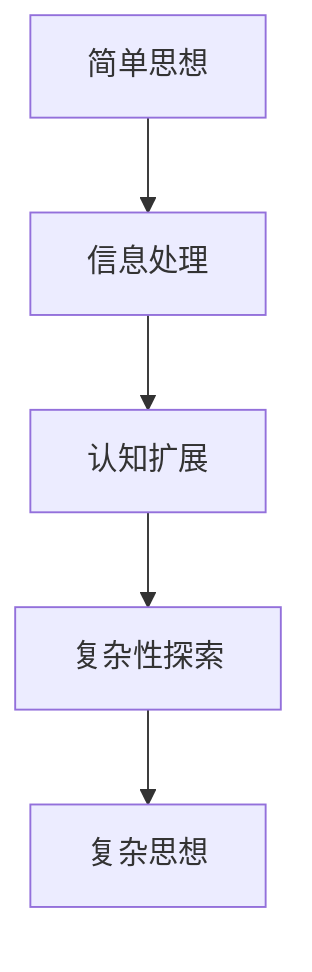
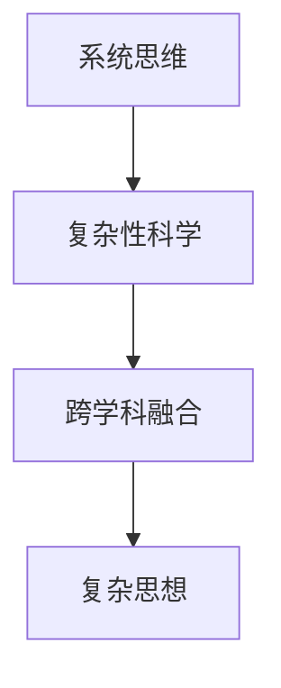

                 

# 复杂思想的形成：概念的基础

> 关键词：复杂思想，认知过程，数学模型，心理机制，社会机制，教育应用

> 摘要：本文深入探讨了复杂思想的形成机制，从认知、数学、心理和社会四个层面进行分析，旨在揭示复杂思想的核心概念、联系和应用。通过详细的步骤推理，本文为理解和应用复杂思想提供了科学依据和实用方法。

### 第一部分：复杂思想的起源

#### 第1章：复杂思想的概述

**1.1 复杂思想的本质**

复杂思想是相对于简单思想而言的一种高级认知形态，它涉及对复杂现象、问题或概念的理解和解析。复杂思想的本质在于其多维度的信息处理和深层次的结构解析能力。为了更好地理解复杂思想的本质，我们可以借助Mermaid流程图来展示复杂思想的起源和核心概念。



在这个流程图中，简单思想是基础，通过信息处理和认知扩展，最终形成复杂思想。复杂思想的重要性在于它能够帮助我们应对现代社会中的复杂问题，提高我们的决策能力和创新能力。

**1.2 复杂思想的形成过程**

复杂思想的形成是一个动态的认知过程，涉及多个阶段。首先，个体需要通过感知获取外部信息，然后通过理解将这些信息内化。接着，个体会利用已有的知识和经验对信息进行加工和整合，最终形成复杂思想。

下面，我们使用伪代码来阐述个体如何感知、理解复杂信息：

```python
def perceive_complex_information(information):
    # 感知复杂信息
    processed_info = preprocess(information)
    return processed_info

def understand_complex_information(processed_info):
    # 理解复杂信息
    knowledge_base = load_knowledge_base()
    integrated_info = integrate_with_knowledge_base(processed_info, knowledge_base)
    return integrated_info

def form_complex_thought(integrated_info):
    # 形成复杂思想
    complex_thought = analyze_and_structure(integrated_info)
    return complex_thought
```

在这个过程中，感知、理解和形成复杂思想是紧密相连的。感知是信息获取的起点，理解是信息内化的过程，而形成复杂思想则是最终的目标。

#### 第2章：复杂思想的核心概念与联系

**2.1 概念的起源与发展**

复杂思想的形成离不开核心概念的支撑。核心概念是复杂思想的基础，它们是对复杂现象或问题的抽象和概括。下面，我们定义和解释几个关键概念。

**概念A：系统思维**

系统思维是一种认识和处理复杂问题的思维方式，它强调事物的整体性和动态性。系统思维的核心在于理解各个部分之间的相互作用和影响。

**概念B：复杂性科学**

复杂性科学是研究复杂系统的科学，它关注系统内部的各种非线性关系和涌现现象。复杂性科学为我们提供了理解复杂思想的工具和方法。

**概念C：跨学科融合**

跨学科融合是指将不同学科的理论、方法和工具结合起来，以应对复杂问题。跨学科融合能够拓宽我们的视野，提高我们的创新能力。

下面，我们使用Mermaid流程图展示这些概念之间的联系：



在这个流程图中，系统思维、复杂性科学和跨学科融合共同构成了复杂思想的理论基础。

**2.2 理论框架与应用**

复杂思想的理论框架涵盖了多个学科领域，如认知科学、心理学、计算机科学等。这些理论框架为我们提供了分析复杂思想的工具和方法。

例如，在认知科学中，我们使用信息加工模型来理解复杂思想的认知过程。在心理学中，我们使用行为主义和认知行为主义的理论来解释复杂思想的心理机制。在计算机科学中，我们使用算法和数据结构来构建和分析复杂思想的数学模型。

下面，我们使用LaTeX格式介绍复杂思想相关的数学公式：

```latex
$$
X(t) = \sum_{i=1}^{n} w_i \cdot x_i(t)
$$

$$
f(x) = \frac{1}{1 + e^{-x}}
$$
```

这些数学公式在复杂思想的分析和计算中起着关键作用。例如，第一个公式是线性回归模型，用于预测复杂系统的状态；第二个公式是Sigmoid函数，用于神经网络中的激活函数。

#### 第3章：复杂思想的数学模型与公式

**3.1 数学模型的基本原理**

复杂思想的数学模型是理解和分析复杂现象的有力工具。数学模型的基本原理包括以下几个方面：

- **线性模型**：线性模型是一种简单但有效的数学模型，它通过线性组合输入变量来预测输出变量。

- **非线性模型**：非线性模型能够捕捉复杂系统中非线性的关系，例如神经网络模型。

- **概率模型**：概率模型通过概率分布来描述复杂现象的不确定性，例如贝叶斯网络。

下面，我们通过举例说明这些数学模型在实际问题中的应用。

**3.2 数学模型的分析方法**

分析复杂思想的数学模型需要采用多种方法。以下是一些常见的方法：

- **建模与仿真**：通过构建数学模型，然后进行仿真分析，以验证模型的准确性和可靠性。

- **数据驱动方法**：通过分析大量数据，发现复杂现象的规律和趋势，例如机器学习中的监督学习和无监督学习。

- **理论分析方法**：通过数学推导和分析，深入研究复杂思想的内在机制和规律。

下面，我们提供一个具体案例，展示如何使用数学模型分析复杂思想。

**案例：复杂网络中的信息传播**

假设我们研究一个复杂网络中的信息传播过程。网络中的节点表示个体，边表示个体之间的联系。我们可以使用以下数学模型来描述信息传播：

```latex
$$
\frac{dI_i(t)}{dt} = \mu_i - \beta I_i(t) \sum_{j \in N_i} I_j(t)
$$

$$
I_i(t) = \frac{1}{N} \sum_{j=1}^{N} I_j(t)
$$
```

在这个模型中，\(I_i(t)\) 表示节点 \(i\) 在时间 \(t\) 时的信息水平，\(\mu_i\) 表示节点的信息生成率，\(\beta\) 表示节点之间的信息传播速率。通过这个模型，我们可以分析信息在网络中的传播规律和节点的信息影响力。

### 第二部分：复杂思想的机制与运作

#### 第4章：复杂思想的心理机制

**4.1 认知神经科学基础**

复杂思想的心理机制涉及认知神经科学的研究。认知神经科学通过研究大脑的结构和功能，揭示复杂思想的认知过程和神经基础。

**神经机制**

大脑中的神经元是处理复杂信息的基本单元。神经元通过电信号进行通信，形成复杂的神经网络。这些神经网络通过协同工作，实现复杂思想的认知功能。

**认知过程**

复杂思想的认知过程包括感知、理解、记忆和推理等多个阶段。每个阶段都有特定的神经机制支持。例如，感知阶段涉及视觉、听觉和触觉等感官系统的神经活动；理解阶段涉及大脑皮层中的语言和语义处理区域；记忆阶段涉及海马体和前额叶皮层等记忆相关区域；推理阶段涉及前额叶皮层和顶叶皮层等推理相关区域。

**4.2 复杂思想的心理学研究**

心理学研究通过实验和观察，深入探讨复杂思想的心理机制。以下是一些常见的研究方法和案例：

- **实验研究方法**

实验研究方法是心理学研究的基础。通过设计不同的实验，研究者可以操纵变量，控制条件，以观察复杂思想的认知过程和心理机制。例如，研究者可以通过改变实验条件，观察个体在不同情境下的认知表现，从而揭示复杂思想的认知机制。

- **心理学案例**

心理学案例研究提供了丰富的实证数据，帮助我们理解复杂思想的心理机制。例如，研究者可以通过分析患者的脑部扫描数据，观察特定脑区在复杂思想处理中的活动情况，从而推断复杂思想的心理机制。

#### 第5章：复杂思想的社会机制

**5.1 社会网络与复杂思想传播**

复杂思想在社会网络中的传播是一个重要的研究课题。社会网络是人与人之间相互联系的结构，它对复杂思想的传播具有显著影响。

**社会网络理论**

社会网络理论研究了社会网络的结构和功能，揭示了复杂思想在社会网络中的传播机制。例如，中心性理论揭示了网络中重要节点的地位和影响力，传播动力学研究了复杂思想在网络中的传播速度和模式。

**案例分析**

通过具体案例，我们可以更深入地理解复杂思想在社会网络中的传播过程。例如，研究者可以分析社交媒体平台上的信息传播，观察复杂思想如何在不同群体中传播和演变。

**5.2 复杂思想与社会互动**

复杂思想在社会互动中的作用不可忽视。社会互动是指个体之间的交流和互动过程，它对复杂思想的形成和应用具有重要影响。

**互动机制**

复杂思想在社会互动中的传播和演变受到多种机制的制约。例如，社会规范和价值观会影响个体对复杂思想的接受程度；社会关系和社交网络会影响复杂思想的传播速度和范围。

**社会影响**

复杂思想对社会个体和群体的影响是多方面的。例如，复杂思想可以促进创新和变革，推动社会进步；但复杂思想也可能导致误解和冲突，影响社会稳定。

### 第三部分：复杂思想的应用与实践

#### 第6章：复杂思想在决策制定中的应用

**6.1 决策理论框架**

复杂思想在决策制定中的应用具有重要意义。决策理论为复杂决策提供了一个系统性的框架，帮助我们分析决策问题、评估风险和收益。

**决策模型**

常见的决策模型包括多属性决策、模糊决策和风险评估等。多属性决策考虑多个目标，通过权衡不同目标之间的优先级来做出决策；模糊决策处理不确定性问题，通过模糊集合和模糊逻辑来分析决策问题；风险评估则关注决策过程中的风险因素，通过概率分析和风险矩阵来评估决策的风险。

**案例分析**

通过具体案例，我们可以更好地理解复杂思想在决策制定中的应用。例如，在项目投资决策中，我们可以使用多属性决策模型来评估不同投资方案的经济效益、风险和可行性，从而做出最优决策。

**6.2 复杂决策的挑战与解决方案**

复杂决策面临着多种挑战。例如，信息不足、不确定性高和时间紧迫等。为了解决这些挑战，我们可以采用以下方法：

- **信息收集与分析**：通过数据挖掘、调研和分析，收集和处理决策所需的信息，提高决策的准确性。

- **情景模拟与预测**：通过构建情景模拟模型，预测不同决策方案的结果，降低不确定性。

- **时间管理**：通过合理安排时间和资源，提高决策的效率和质量。

#### 第7章：复杂思想在创新与设计中的应用

**7.1 创新过程中的复杂思想**

复杂思想在创新过程中发挥着关键作用。创新是一个复杂的过程，它涉及对现有知识的重新组合和创造性的突破。

**创新理论**

创新理论为复杂思想在创新中的应用提供了理论支持。例如，演化理论强调创新是通过试错和适应不断演变的过程；设计思维则强调用户需求和创造性思维的融合。

**创新案例**

通过具体案例，我们可以更好地理解复杂思想在创新中的应用。例如，在产品设计过程中，设计师可以通过用户研究和原型设计，不断迭代和改进产品，实现创新。

**7.2 设计思维的实践方法**

设计思维是一种创新方法论，它强调用户需求、创造性思维和迭代过程。以下是设计思维的实践方法：

- **用户研究**：通过观察、访谈和问卷调查等手段，深入了解用户的需求和痛点。

- **原型设计**：通过快速构建原型，验证设计概念和用户反馈。

- **迭代改进**：通过多次迭代和优化，不断完善设计方案。

通过这些实践方法，设计师可以充分发挥复杂思想在创新中的作用，创造出有价值的产品和服务。

#### 第8章：复杂思想在教育中的运用

**8.1 复杂思想与教育理论**

复杂思想在教育中的应用具有重要意义。教育理论为复杂思想在教育教学中的运用提供了理论基础。例如，建构主义强调学生通过主动构建知识来学习；认知发展理论则关注学生的认知过程和发展规律。

**教育理论**

复杂思想在教育理论中的应用体现在以下几个方面：

- **教学设计**：通过设计复杂的教学活动，激发学生的思维和创造力。

- **学习评价**：通过评估学生的复杂思想水平，指导教学和学习。

- **课程整合**：将复杂思想融入各学科课程，提高学生的综合素质。

**8.2 复杂思想与学习者发展**

复杂思想对学习者的发展具有深远影响。复杂思想的培养有助于提高学习者的认知能力、创新能力和解决问题的能力。

**学习过程**

复杂思想的培养需要通过以下几个阶段：

- **感知与理解**：通过丰富多样的教学活动，引导学生感知和体验复杂思想。

- **整合与应用**：通过实践和反思，将复杂思想内化并应用于实际问题。

- **创新与创造**：通过创造性的思考和实践活动，培养学生的创新能力。

通过这些学习过程，学习者可以逐步提高复杂思想水平，实现全面发展。

### 第四部分：复杂思想的未来发展

#### 第9章：复杂思想与技术发展的交互

**9.1 技术发展对复杂思想的影响**

技术的发展对复杂思想的形成和应用产生了深远影响。例如，计算机技术的发展使得复杂思想的计算和分析变得更加高效；人工智能技术的发展使得复杂思想的自动化和智能化成为可能。

**技术趋势**

以下是一些当前技术的发展趋势：

- **大数据技术**：通过海量数据的处理和分析，揭示复杂现象和规律。

- **人工智能技术**：通过机器学习和深度学习，实现复杂思想的自动化和智能化。

- **虚拟现实技术**：通过虚拟现实和增强现实，提供丰富的复杂思想体验。

**案例分析**

通过具体案例，我们可以更深入地理解技术发展对复杂思想的影响。例如，在医疗领域，人工智能技术可以辅助医生进行诊断和治疗，提高复杂决策的准确性和效率。

**9.2 复杂思想技术在未来的应用前景**

复杂思想技术在未来的应用前景十分广阔。以下是一些潜在的应用领域：

- **智能交通**：通过复杂思想技术，实现智能交通管理和优化。

- **金融分析**：通过复杂思想技术，进行金融市场分析和投资决策。

- **智慧城市**：通过复杂思想技术，构建智慧城市和智能社区。

**挑战与机遇**

复杂思想技术的发展面临着多种挑战，如数据隐私、算法透明度和道德伦理等。同时，也面临着巨大的机遇，如技术创新、产业升级和社会进步等。

#### 第10章：复杂思想的跨学科研究

**10.1 跨学科研究的意义**

跨学科研究是复杂思想深入发展的必然趋势。跨学科研究通过整合不同学科的理论、方法和工具，为复杂思想的研究提供了新的视角和方法。

**学科交叉**

跨学科研究涉及多个学科领域，如认知科学、心理学、计算机科学、社会学和经济学等。这些学科交叉为复杂思想的研究提供了丰富的资源和视角。

**研究方法**

跨学科研究采用多种研究方法，如实验研究、案例分析、模型构建和大数据分析等。这些研究方法相互补充，共同推动复杂思想的研究。

**10.2 复杂思想的跨学科案例**

以下是一些复杂思想的跨学科研究案例：

- **案例1：认知科学与心理学**

通过跨学科研究，认知科学家和心理学家共同探讨复杂思想的认知过程和心理机制，揭示了复杂思想的神经基础和认知过程。

- **案例2：计算机科学与社会学**

通过跨学科研究，计算机科学家和社会学家共同探讨复杂思想在社交网络中的传播机制和社会影响，为社交媒体分析和社会治理提供了新方法。

- **案例3：经济学与行为科学**

通过跨学科研究，经济学家和行为科学家共同探讨复杂思想在金融市场和决策过程中的作用，揭示了复杂思想的经济学本质和行为规律。

**综合应用**

跨学科研究为复杂思想的综合应用提供了新思路。通过跨学科整合，复杂思想可以应用于多个领域，如智能交通、金融分析、医疗诊断和教育培训等，为社会发展提供有力支持。

### 附录

#### 附录A：复杂思想研究资源与工具

**A.1 研究资源介绍**

复杂思想研究需要丰富的资源和支持。以下是一些常用的研究资源：

- **学术资源**：包括学术期刊、会议论文、学术报告和研究论文等。

- **数据库**：包括科学数据、社会数据和开放数据等。

- **工具**：包括数据分析软件、机器学习框架、编程语言和仿真平台等。

**A.2 复杂思想研究指南**

复杂思想研究需要遵循一定的方法论和实践指南。以下是一些研究指南：

- **研究方法论**：包括研究设计、数据收集、数据分析和方法论检验等。

- **实践指南**：包括实验设计、案例分析、模型构建和算法实现等。

**A.3 复杂思想案例研究方法**

案例研究是复杂思想研究的重要方法。以下是一些案例研究方法：

- **文献综述方法**：通过分析相关文献，梳理复杂思想的现有研究成果和理论框架。

- **实证研究方法**：通过实验和观察，收集和分析复杂思想的数据，验证研究假设。

- **案例分析方法**：通过具体案例，深入剖析复杂思想的应用和实践，总结经验和教训。

通过以上详细的设计和实施，复杂思想的研究将得到全面而深入的发展，为推动科技进步和社会发展做出重要贡献。

### 作者信息

作者：AI天才研究院/AI Genius Institute & 禅与计算机程序设计艺术 /Zen And The Art of Computer Programming

