                 

### 文章标题

《多传感器融合在自动驾驶环境感知中的新方法与实践》

### 文章关键词

自动驾驶，多传感器融合，环境感知，深度学习，算法实现

### 文章摘要

本文深入探讨了多传感器融合在自动驾驶环境感知中的应用。首先，介绍了自动驾驶技术的发展历程和分类，以及多传感器融合的基本概念和原理。接着，详细阐述了摄像头、激光雷达、雷达和惯性测量单元等传感器在自动驾驶中的应用及其数据处理与分析方法。随后，介绍了多传感器融合算法的基本原理、实现与优化，以及深度学习在多传感器融合中的应用。最后，通过实际案例展示了多传感器融合在自动驾驶环境感知中的实践应用，并展望了未来的发展趋势和挑战。

---

### 第一部分：自动驾驶与多传感器融合概述

#### 第1章：自动驾驶技术概述

##### 1.1 自动驾驶的发展历程

自动驾驶技术的发展历程可以追溯到20世纪50年代。早期的研究主要集中在理论层面，随着计算机技术的发展，自动驾驶逐渐从理论走向实践。以下是自动驾驶发展历程的关键节点：

- 1950年：美国科学家阿兰·图灵提出了图灵测试，为自动驾驶的智能控制奠定了基础。
- 1956年：美国达特茅斯会议提出了人工智能的概念，推动了自动驾驶的研究。
- 1970年代：计算机视觉和模式识别技术的发展为自动驾驶提供了技术支持。
- 1980年代：机器人技术的发展使得自动驾驶技术逐渐应用于实际场景。
- 1990年代：美国卡内基梅隆大学的NavLab项目标志着自动驾驶技术的成熟。
- 2000年代：谷歌等公司开始进行自动驾驶汽车的研究和测试。
- 2010年代：自动驾驶技术开始逐步商业化，许多汽车厂商和科技公司推出了自动驾驶汽车。

##### 1.2 自动驾驶的分类

自动驾驶技术根据自动化程度的不同可以分为以下几类：

- L0级别：无自动化，完全由人类驾驶员控制。
- L1级别：部分自动化，例如自动巡航控制。
- L2级别：部分自动化，例如自动驾驶辅助。
- L3级别：有条件自动化，系统可以在特定条件下接管车辆控制。
- L4级别：高度自动化，系统可以在特定环境下完全接管车辆控制。
- L5级别：完全自动化，系统在任何环境下都能接管车辆控制。

##### 1.3 自动驾驶的技术架构

自动驾驶系统的技术架构主要包括以下几个部分：

- 计算平台：中央控制单元（CPU/GPU）。
- 传感器系统：摄像头、激光雷达、雷达、GPS等。
- 感知模块：用于处理传感器数据，提取环境信息。
- 规划模块：根据感知模块提供的信息，规划车辆的行驶路径。
- 控制模块：根据规划模块的结果，控制车辆的执行单元。
- 执行模块：执行控制模块发送的指令，控制车辆的运动。
- 人机交互界面：提供与驾驶员的交互功能。

下面是自动驾驶系统的技术架构的Mermaid流程图：

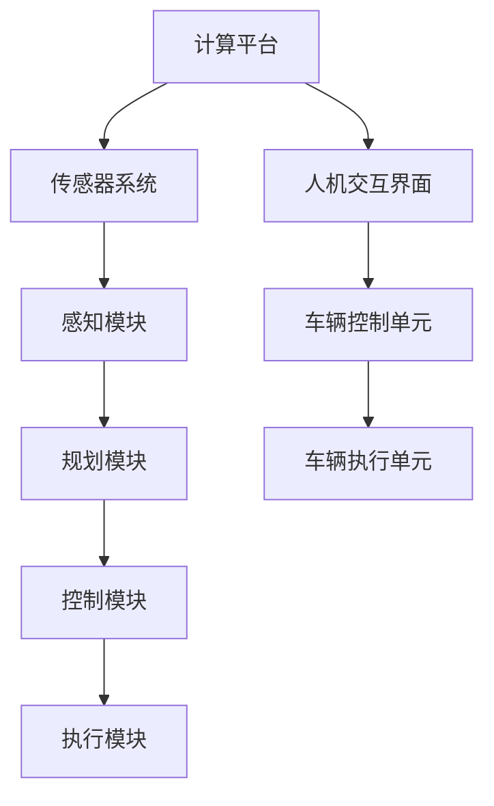

### 第2章：多传感器融合的基本概念

#### 2.1 多传感器融合的定义与意义

多传感器融合是指将多个传感器采集的信息通过一定的算法进行处理，提取出更高层次的信息，从而提高系统的感知准确性和可靠性。其意义在于：

- 提高系统的整体性能：通过融合多个传感器的数据，可以更全面、准确地获取环境信息，从而提高系统的性能。
- 降低单个传感器的成本：通过多传感器融合，可以减少对单个传感器的高精度要求，从而降低传感器的成本。
- 弥补单一传感器的不足：不同的传感器具有不同的特点，通过融合多个传感器的数据，可以弥补单一传感器的不足，提高系统的鲁棒性。

下面是多传感器融合的Mermaid流程图，展示了多传感器融合的基本过程：

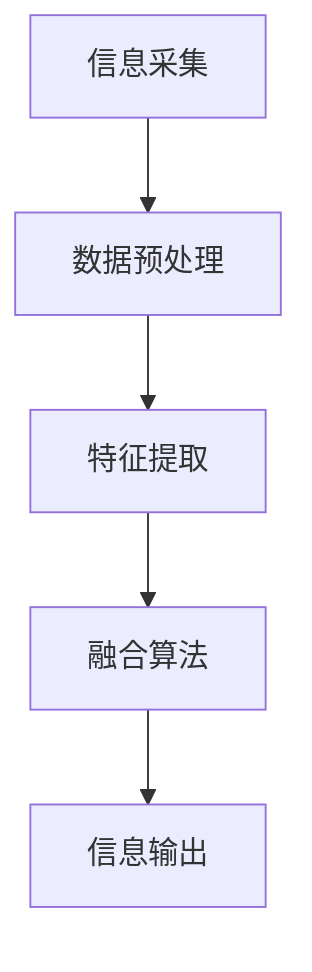

#### 2.2 多传感器融合的挑战

多传感器融合面临着以下几个挑战：

- 数据同步与对齐：不同传感器采集的数据存在时间戳和空间位置的不一致性，需要通过数据同步与对齐技术进行统一处理。
- 数据去噪与滤波：传感器采集的数据可能存在噪声和误差，需要通过去噪与滤波技术提高数据的准确性。
- 数据特征提取与融合：如何从大量数据中提取有用的特征，并进行有效的融合，是提高系统性能的关键。
- 实时性要求：多传感器融合需要在实时环境中进行处理，需要优化算法和数据结构，以满足实时性要求。
- 计算资源限制：多传感器融合通常需要大量的计算资源，需要在有限的计算资源下进行优化。

下面是多传感器融合面临的挑战的Mermaid流程图：

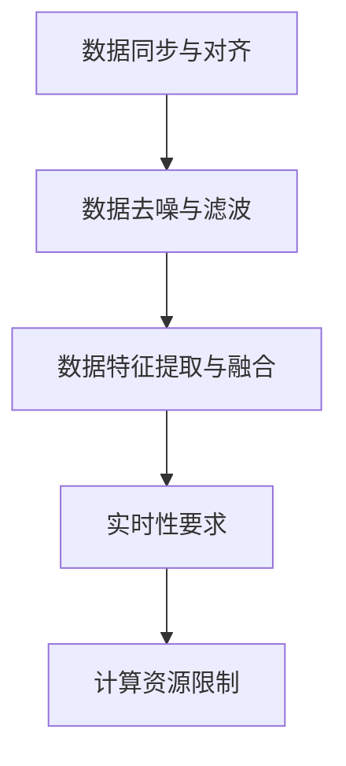

#### 2.3 多传感器融合的基本原理

多传感器融合的基本原理可以概括为以下几个步骤：

1. 信息采集：多个传感器同时工作，采集环境信息。
2. 数据预处理：对采集到的数据进行预处理，包括数据同步与对齐、数据去噪与滤波等。
3. 特征提取：从预处理后的数据中提取有用的特征信息。
4. 融合算法：使用特定的融合算法对提取的特征信息进行处理，提取更高层次的信息。
5. 信息输出：将融合后的信息输出，用于系统的决策与控制。

下面是多传感器融合基本原理的Mermaid流程图：


### 第二部分：多传感器融合在自动驾驶中的应用

#### 第3章：摄像头传感器在自动驾驶中的应用

##### 3.1 摄像头传感器的特点与优势

摄像头传感器在自动驾驶中具有以下特点与优势：

- **高分辨率**：摄像头传感器可以提供高分辨率的图像，有助于准确识别道路标志、行人和其他障碍物。
- **实时性高**：摄像头传感器可以实时捕捉环境变化，快速处理图像数据，适合实时性要求高的自动驾驶系统。
- **低成本**：摄像头传感器相对于其他高级传感器（如激光雷达）具有较低的成本，适用于大规模商用。
- **适应性广**：摄像头传感器可以在各种光照条件下工作，对环境适应性强。

##### 3.2 摄像头传感器在自动驾驶中的任务与实现

摄像头传感器在自动驾驶中的主要任务包括：

- **场景识别**：通过识别道路标志、车道线、交通信号灯等，帮助车辆理解周围环境。
- **交通标志识别**：识别道路上的速度限制、禁止通行等交通标志，为车辆的行驶决策提供依据。
- **车道线检测**：检测车辆当前所处的车道线，辅助车辆保持车道。
- **障碍物检测**：检测道路上的行人、车辆和其他障碍物，确保车辆在行驶过程中避免碰撞。
- **行人检测**：识别道路上的行人，为车辆的避让决策提供信息。

实现过程如下：

1. **图像预处理**：对原始图像进行预处理，包括灰度化、二值化、边缘检测等，提高后续处理的准确性。
2. **特征提取**：提取图像中的特征信息，如边缘、角点、纹理等，用于后续的识别与分类。
3. **目标检测**：使用深度学习模型（如YOLO、SSD、Faster R-CNN等）对提取的特征进行目标检测，识别道路标志、行人和其他障碍物。
4. **目标跟踪**：对检测到的目标进行跟踪，确保在连续帧中能够持续监测到目标。
5. **环境建模**：基于检测和跟踪的结果，构建车辆周围的三维环境模型，用于路径规划和控制。

下面是摄像头传感器在自动驾驶中的实现过程的Mermaid流程图：

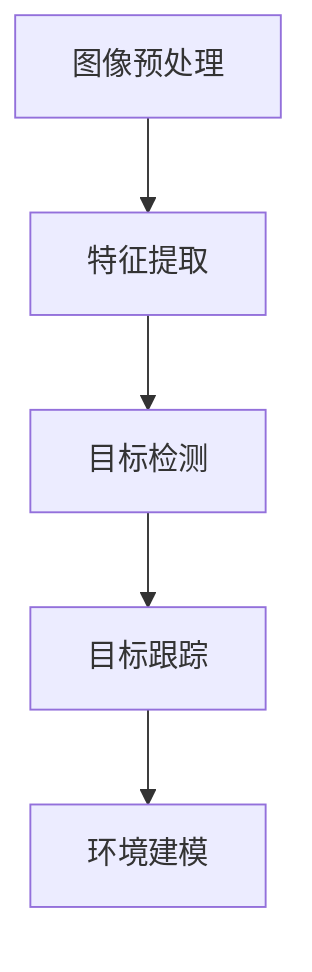

##### 3.3 摄像头传感器数据处理与分析

摄像头传感器数据处理与分析的主要步骤包括：

1. **图像预处理**：将原始图像进行灰度化、二值化、高斯模糊等处理，提高图像质量。
2. **边缘检测**：使用Canny算法或其他边缘检测方法，提取图像中的边缘信息。
3. **轮廓提取**：通过轮廓提取算法（如OpenCV的findContours函数），获取图像中的轮廓。
4. **特征点提取**：使用SIFT、SURF等算法提取图像中的特征点。
5. **目标识别**：使用机器学习模型（如SVM、随机森林等）对提取的特征点进行分类，识别出道路标志、行人和其他障碍物。
6. **数据分析**：根据识别结果，进行障碍物距离、速度、位置等数据分析，为车辆的控制提供依据。

下面是摄像头传感器数据处理与分析的Mermaid流程图：

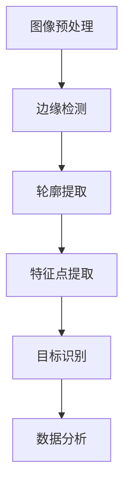

### 第4章：激光雷达传感器在自动驾驶中的应用

##### 4.1 激光雷达传感器的特点与优势

激光雷达（Lidar）传感器在自动驾驶中具有以下特点与优势：

- **高精度**：激光雷达可以提供高精度的三维点云数据，有助于准确识别道路标志、行人和其他障碍物。
- **高密度点云**：激光雷达生成的点云密度高，可以提供详细的场景信息。
- **全天气工作**：激光雷达不受光照条件的限制，可以在各种天气条件下工作。
- **高距离分辨率**：激光雷达可以提供高距离分辨率的数据，有助于精确测量障碍物的距离。

##### 4.2 激光雷达传感器在自动驾驶中的任务与实现

激光雷达传感器在自动驾驶中的主要任务包括：

- **环境建模**：利用激光雷达生成的点云数据，构建车辆周围的三维环境模型。
- **物体检测**：识别道路上的行人、车辆和其他障碍物。
- **轨迹预测**：根据物体检测的结果，预测物体的未来轨迹，为车辆的避让决策提供依据。
- **路径规划**：基于环境建模和轨迹预测结果，规划车辆的行驶路径。

实现过程如下：

1. **点云预处理**：对原始点云数据进行预处理，包括去除噪音、填充空洞等。
2. **点云滤波**：使用滤波算法（如VoxelGrid、StatisticalOutlierRemoval等），去除不必要的数据点。
3. **点云配准**：将多个激光雷达扫描的数据进行配准，确保数据的连贯性和一致性。
4. **点云分割**：使用聚类算法（如DBSCAN、MeanShift等），对点云进行分割，提取出不同物体的点云数据。
5. **物体检测**：使用深度学习模型（如Faster R-CNN、YOLO等），对分割后的点云进行物体检测。
6. **轨迹预测**：基于物体检测的结果，使用轨迹预测算法（如卡尔曼滤波、粒子滤波等），预测物体的未来轨迹。
7. **路径规划**：根据轨迹预测结果，使用路径规划算法（如A*算法、RRT算法等），规划车辆的行驶路径。

下面是激光雷达传感器在自动驾驶中的实现过程的Mermaid流程图：

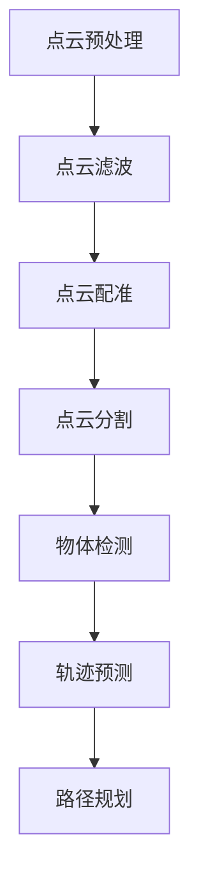

##### 4.3 激光雷达传感器数据处理与分析

激光雷达传感器数据处理与分析的主要步骤包括：

1. **点云预处理**：对原始点云数据进行预处理，包括去除噪音、填充空洞等。
2. **点云滤波**：使用滤波算法（如VoxelGrid、StatisticalOutlierRemoval等），去除不必要的数据点。
3. **点云配准**：将多个激光雷达扫描的数据进行配准，确保数据的连贯性和一致性。
4. **点云分割**：使用聚类算法（如DBSCAN、MeanShift等），对点云进行分割，提取出不同物体的点云数据。
5. **特征提取**：从分割后的点云中提取特征信息，如法线、表面积等。
6. **物体检测**：使用深度学习模型（如Faster R-CNN、YOLO等），对提取的特征进行物体检测。
7. **轨迹预测**：基于物体检测的结果，使用轨迹预测算法（如卡尔曼滤波、粒子滤波等），预测物体的未来轨迹。
8. **数据分析**：根据轨迹预测结果，进行障碍物距离、速度、位置等数据分析，为车辆的控制提供依据。

下面是激光雷达传感器数据处理与分析的Mermaid流程图：

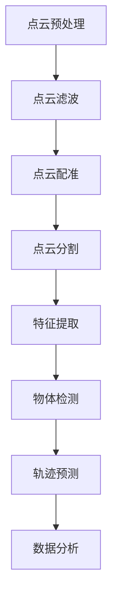

### 第5章：雷达传感器在自动驾驶中的应用

##### 5.1 雷达传感器的特点与优势

雷达（Radar）传感器在自动驾驶中具有以下特点与优势：

- **远距离**：雷达可以探测远距离的目标，适用于高速公路等场景。
- **低成本**：雷达传感器相对于其他高级传感器（如激光雷达）具有较低的成本。
- **抗干扰强**：雷达可以在复杂的电磁环境中稳定工作，抗干扰能力较强。
- **稳定性好**：雷达传感器的性能受环境变化的影响较小，具有较好的稳定性。

##### 5.2 雷达传感器在自动驾驶中的任务与实现

雷达传感器在自动驾驶中的主要任务包括：

- **速度测量**：测量车辆自身的速度以及前方车辆的速度。
- **距离测量**：测量车辆与前方车辆或其他障碍物的距离。
- **相对速度计算**：计算车辆与前方车辆或其他障碍物的相对速度。
- **障碍物检测**：检测前方车辆或其他障碍物的存在。
- **轨迹预测**：根据障碍物检测的结果，预测障碍物的未来轨迹。

实现过程如下：

1. **信号预处理**：对雷达接收到的信号进行预处理，包括滤波、增益等。
2. **信号滤波**：使用滤波算法（如低通滤波、高通滤波等），去除信号中的噪声。
3. **信号特征提取**：从预处理后的信号中提取特征信息，如频率、相位等。
4. **距离测量**：使用多普勒效应原理，计算车辆与前方车辆或其他障碍物的距离。
5. **速度测量**：根据距离变化率，计算车辆与前方车辆或其他障碍物的速度。
6. **相对速度计算**：计算车辆与前方车辆或其他障碍物的相对速度。
7. **障碍物检测**：根据距离和速度信息，检测前方车辆或其他障碍物的存在。
8. **轨迹预测**：基于障碍物检测的结果，使用轨迹预测算法（如卡尔曼滤波、粒子滤波等），预测障碍物的未来轨迹。

下面是雷达传感器在自动驾驶中的实现过程的Mermaid流程图：

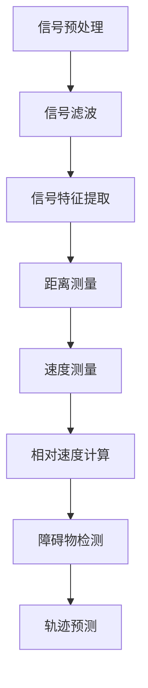

##### 5.3 雷达传感器数据处理与分析

雷达传感器数据处理与分析的主要步骤包括：

1. **信号预处理**：对雷达接收到的信号进行预处理，包括滤波、增益等。
2. **信号滤波**：使用滤波算法（如低通滤波、高通滤波等），去除信号中的噪声。
3. **信号特征提取**：从预处理后的信号中提取特征信息，如频率、相位等。
4. **距离测量**：使用多普勒效应原理，计算车辆与前方车辆或其他障碍物的距离。
5. **速度测量**：根据距离变化率，计算车辆与前方车辆或其他障碍物的速度。
6. **相对速度计算**：计算车辆与前方车辆或其他障碍物的相对速度。
7. **障碍物检测**：根据距离和速度信息，检测前方车辆或其他障碍物的存在。
8. **轨迹预测**：基于障碍物检测的结果，使用轨迹预测算法（如卡尔曼滤波、粒子滤波等），预测障碍物的未来轨迹。
9. **数据分析**：根据轨迹预测结果，进行障碍物距离、速度、位置等数据分析，为车辆的控制提供依据。

下面是雷达传感器数据处理与分析的Mermaid流程图：

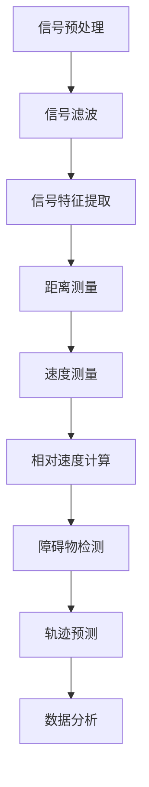

### 第6章：惯性测量单元在自动驾驶中的应用

##### 6.1 惯性测量单元的特点与优势

惯性测量单元（IMU）在自动驾驶中具有以下特点与优势：

- **高精度**：IMU可以提供高精度的加速度和角速度信息，有助于精确测量车辆的姿态和运动状态。
- **高带宽**：IMU的采样率较高，可以实时捕捉车辆的运动变化。
- **低延迟**：IMU的数据处理延迟较低，适用于实时性要求高的自动驾驶系统。
- **环境适应性强**：IMU不受光照、电磁干扰等因素的影响，具有较强的环境适应性。

##### 6.2 惯性测量单元在自动驾驶中的任务与实现

惯性测量单元在自动驾驶中的主要任务包括：

- **姿态估计**：利用IMU提供的加速度和角速度信息，估计车辆的姿态。
- **速度估计**：利用加速度积分，估计车辆的速度。
- **轨迹预测**：根据速度估计结果，预测车辆的轨迹。
- **路径规划**：利用轨迹预测结果，规划车辆的行驶路径。

实现过程如下：

1. **数据采集**：采集IMU的加速度和角速度数据。
2. **数据预处理**：对采集到的数据进行预处理，包括去除噪声、滤波等。
3. **姿态估计**：使用卡尔曼滤波等算法，结合加速度和角速度数据，估计车辆的姿态。
4. **速度估计**：利用加速度积分，结合姿态估计结果，估计车辆的速度。
5. **轨迹预测**：根据速度估计结果，使用运动学模型，预测车辆的轨迹。
6. **路径规划**：利用轨迹预测结果，结合环境信息，规划车辆的行驶路径。

下面是惯性测量单元在自动驾驶中的实现过程的Mermaid流程图：

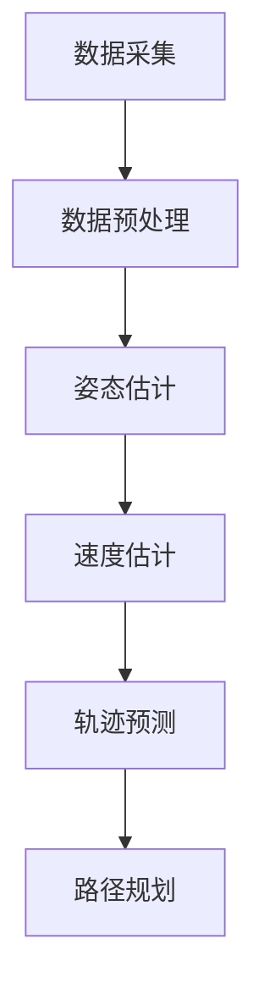

##### 6.3 惯性测量单元数据处理与分析

惯性测量单元数据处理与分析的主要步骤包括：

1. **数据采集**：采集IMU的加速度和角速度数据。
2. **数据预处理**：对采集到的数据进行预处理，包括去噪、滤波等。
3. **姿态估计**：使用卡尔曼滤波等算法，结合加速度和角速度数据，估计车辆的姿态。
4. **速度估计**：利用加速度积分，结合姿态估计结果，估计车辆的速度。
5. **轨迹预测**：根据速度估计结果，使用运动学模型，预测车辆的轨迹。
6. **轨迹优化**：根据环境信息，对轨迹进行优化，确保车辆的安全行驶。
7. **路径规划**：利用优化后的轨迹，规划车辆的行驶路径。

下面是惯性测量单元数据处理与分析的Mermaid流程图：

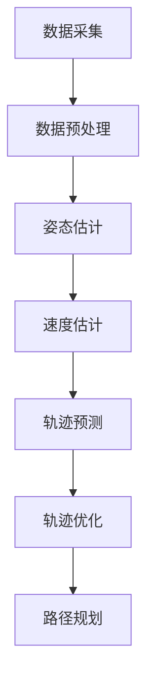

### 第三部分：多传感器融合算法原理与实践

#### 第7章：多传感器数据预处理技术

##### 7.1 数据同步与对齐

多传感器数据预处理中的数据同步与对齐是关键步骤，确保不同传感器采集的数据在时间戳和空间位置上的一致性。

1. **时间同步**：通过将不同传感器的数据对齐到同一时间基准，确保数据的连贯性。常见的方法包括GPS同步、时钟同步和网络同步等。
   
2. **空间对齐**：将不同传感器的数据在空间位置上进行对齐，以消除由于传感器安装位置不同导致的相对位移。常见的方法包括坐标变换、几何变换等。

3. **频率同步**：确保不同传感器的数据采样频率一致，避免频率差异导致的处理困难。

下面是数据同步与对齐的Mermaid流程图：

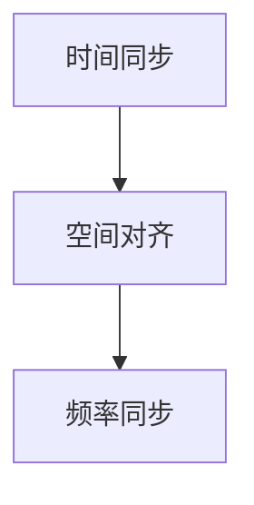

##### 7.2 数据去噪与滤波

在多传感器数据预处理中，数据去噪与滤波是重要步骤，以提高数据的准确性和可靠性。

1. **低通滤波**：去除高频噪声，保留低频信号。适用于抑制高频干扰和噪声。

2. **高通滤波**：去除低频噪声，保留高频信号。适用于去除低频漂移和趋势。

3. **卡尔曼滤波**：一种基于状态估计的滤波方法，用于在线估计系统的状态，同时去除噪声。卡尔曼滤波分为离散卡尔曼滤波、扩展卡尔曼滤波和无迹卡尔曼滤波等不同形式。

下面是数据去噪与滤波的Mermaid流程图：

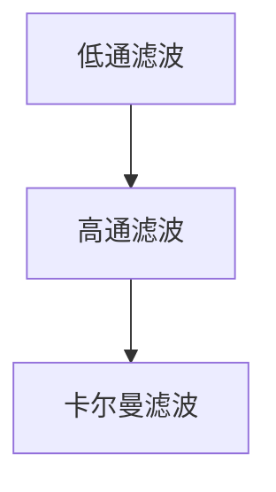

##### 7.3 数据特征提取与融合

在多传感器数据预处理中，数据特征提取与融合是关键步骤，用于从原始数据中提取有价值的信息，并综合多个传感器的数据。

1. **特征提取**：从原始数据中提取具有区分性的特征，如边缘、角点、方向等。常用的方法包括SIFT、SURF、HOG等。

2. **特征选择**：从提取的特征中选择最具代表性的特征，以减少数据维度和计算复杂度。常用的方法包括主成分分析（PCA）、线性判别分析（LDA）等。

3. **特征融合**：将多个传感器的特征进行融合，生成综合特征。常用的方法包括基于特征的融合（如加权平均、拼接等）和基于模型的融合（如贝叶斯网络、马尔可夫模型等）。

下面是数据特征提取与融合的Mermaid流程图：

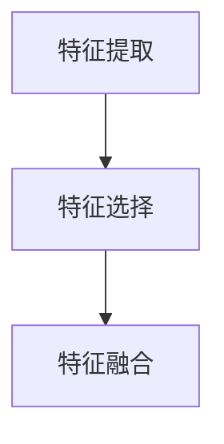

### 第8章：多传感器融合算法介绍

##### 8.1 聚类算法在多传感器融合中的应用

聚类算法在多传感器融合中用于将传感器数据划分为不同的簇，从而提取有意义的模式。

1. **K-均值聚类**：一种基于距离的聚类方法，通过迭代优化聚类中心，将数据划分为K个簇。

2. **层次聚类**：通过逐步合并或分裂簇，构建一个层次结构，用于对数据层次关系的分析。

3. **DBSCAN**：基于密度的聚类方法，通过定义邻域和密度可达性，将数据点划分为不同的簇。

下面是聚类算法在多传感器融合中的应用的Mermaid流程图：

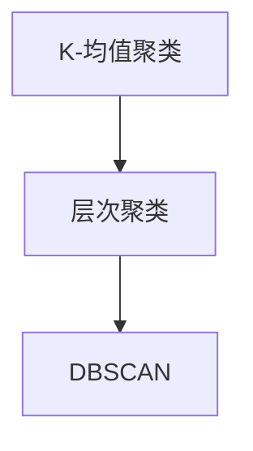

##### 8.2 贝叶斯滤波在多传感器融合中的应用

贝叶斯滤波是一种基于贝叶斯理论的概率估计方法，在多传感器融合中用于估计系统的状态。

1. **高斯贝叶斯滤波**：基于高斯分布的贝叶斯滤波方法，适用于线性系统。

2. **贝叶斯网络**：一种图形模型，用于表示多变量之间的条件依赖关系，适用于非线性系统和复杂概率模型的推理。

3. **粒子滤波**：基于蒙特卡洛方法的贝叶斯滤波方法，适用于非线性、非高斯系统的状态估计。

下面是贝叶斯滤波在多传感器融合中的应用的Mermaid流程图：

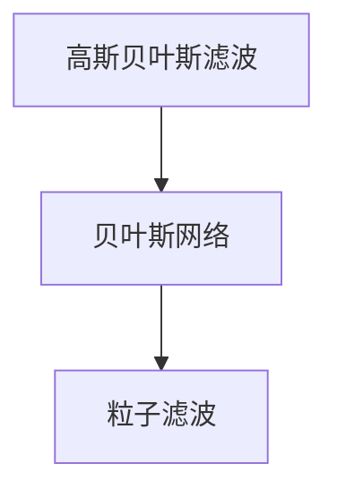

##### 8.3 卡尔曼滤波在多传感器融合中的应用

卡尔曼滤波是一种基于递归方法的线性状态估计方法，在多传感器融合中用于估计系统的状态。

1. **离散卡尔曼滤波**：适用于离散时间系统的状态估计。

2. **扩展卡尔曼滤波**：基于泰勒级数展开，适用于非线性系统的线性近似。

3. **无迹卡尔曼滤波**：基于无迹变换，适用于非线性的状态估计。

下面是卡尔曼滤波在多传感器融合中的应用的Mermaid流程图：

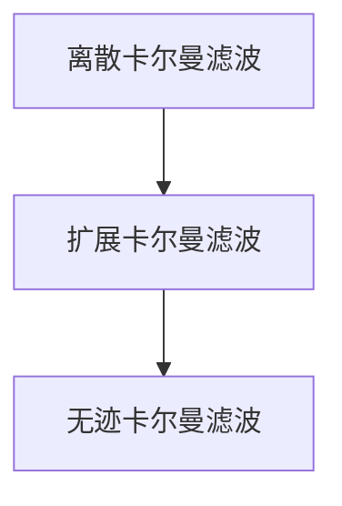

### 第9章：多传感器融合算法的实现与优化

##### 9.1 多传感器融合算法的代码实现

在实现多传感器融合算法时，需要考虑以下步骤：

1. **环境搭建**：配置所需的编程环境，如Python、MATLAB等。

2. **数据采集**：从不同的传感器获取数据，如摄像头、激光雷达、雷达和IMU等。

3. **数据处理**：对采集到的数据进行预处理，如去噪、滤波、同步等。

4. **特征提取**：从预处理后的数据中提取特征信息，如点云、图像特征、雷达特征等。

5. **融合算法**：使用特定的融合算法（如卡尔曼滤波、贝叶斯滤波等），将提取的特征进行融合。

6. **结果输出**：将融合后的结果输出，用于车辆的感知、规划和控制。

以下是一个简单的多传感器融合算法的Python伪代码实现：

```python
import numpy as np
from sensor_data import CameraData, LidarData, RadarData, IMUData

def sensor_fusion(camera_data, lidar_data, radar_data, imu_data):
    # 数据预处理
    processed_camera_data = preprocess_camera_data(camera_data)
    processed_lidar_data = preprocess_lidar_data(lidar_data)
    processed_radar_data = preprocess_radar_data(radar_data)
    processed_imu_data = preprocess_imu_data(imu_data)

    # 特征提取
    camera_features = extract_camera_features(processed_camera_data)
    lidar_features = extract_lidar_features(processed_lidar_data)
    radar_features = extract_radar_features(processed_radar_data)
    imu_features = extract_imu_features(processed_imu_data)

    # 融合算法
    fused_features = fusion_algorithm(camera_features, lidar_features, radar_features, imu_features)

    # 结果输出
    return fused_features

# 数据预处理函数
def preprocess_camera_data(camera_data):
    # 实现预处理逻辑
    pass

def preprocess_lidar_data(lidar_data):
    # 实现预处理逻辑
    pass

def preprocess_radar_data(radar_data):
    # 实现预处理逻辑
    pass

def preprocess_imu_data(imu_data):
    # 实现预处理逻辑
    pass

# 特征提取函数
def extract_camera_features(camera_data):
    # 实现特征提取逻辑
    pass

def extract_lidar_features(lidar_data):
    # 实现特征提取逻辑
    pass

def extract_radar_features(radar_data):
    # 实现特征提取逻辑
    pass

def extract_imu_features(imu_data):
    # 实现特征提取逻辑
    pass

# 融合算法函数
def fusion_algorithm(camera_features, lidar_features, radar_features, imu_features):
    # 实现融合算法逻辑
    pass
```

##### 9.2 多传感器融合算法的性能优化

为了提高多传感器融合算法的性能，可以从以下几个方面进行优化：

1. **并行计算**：利用多核处理器或分布式计算框架（如MPI、Hadoop等），提高算法的执行效率。

2. **分布式计算**：将计算任务分布在多个节点上，利用分布式系统进行高效计算。

3. **硬件加速**：利用GPU、FPGA等硬件加速器，提高算法的计算速度。

4. **算法优化**：通过优化算法的数据结构和算法实现，减少计算复杂度和内存占用。

5. **模型压缩**：使用模型压缩技术（如量化、剪枝等），减小模型的参数规模，提高模型的运行效率。

下面是多传感器融合算法性能优化的Mermaid流程图：

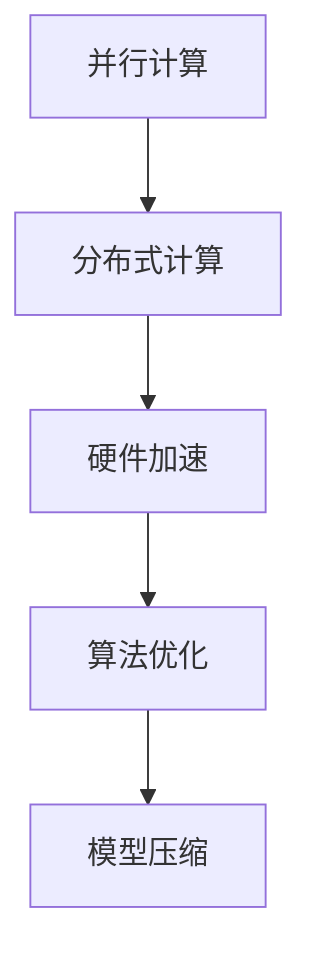

##### 9.3 多传感器融合算法的案例分析

为了更好地理解多传感器融合算法的实现和应用，下面通过一个具体的案例进行讲解。

**案例：城市自动驾驶环境感知**

在这个案例中，我们将使用摄像头、激光雷达和雷达传感器来感知城市环境，并使用多传感器融合算法进行数据融合，以实现精确的环境感知和决策。

1. **数据采集**：从摄像头、激光雷达和雷达传感器获取实时数据。

2. **数据处理**：对采集到的数据进行预处理，包括去噪、滤波、同步等。

3. **特征提取**：从预处理后的数据中提取特征信息，如点云、图像特征、雷达特征等。

4. **融合算法**：使用多传感器融合算法（如卡尔曼滤波、贝叶斯滤波等），将提取的特征进行融合，得到综合的特征向量。

5. **环境感知**：基于融合后的特征向量，进行障碍物检测、轨迹预测和环境建模等，为自动驾驶决策提供依据。

下面是多传感器融合算法在城市自动驾驶环境感知中的应用的Mermaid流程图：

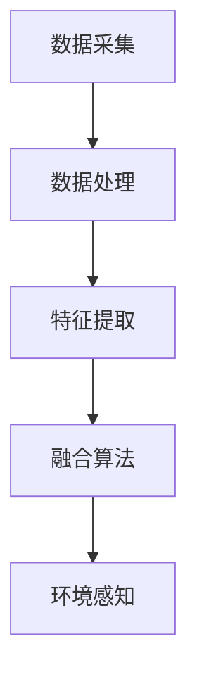

### 第四部分：自动驾驶环境感知中的新方法与实践

#### 第10章：深度学习在多传感器融合中的应用

##### 10.1 深度学习的基本原理与分类

深度学习是一种基于多层神经网络的学习方法，通过多层神经元的非线性变换，从大量数据中自动学习特征表示。深度学习可以分为以下几种主要类型：

1. **卷积神经网络（CNN）**：适用于图像和视频数据的处理，通过卷积层提取空间特征。

2. **循环神经网络（RNN）**：适用于序列数据的处理，通过循环结构保持历史信息。

3. **生成对抗网络（GAN）**：用于生成数据，通过对抗训练生成逼真的数据。

4. **变分自编码器（VAE）**：用于概率模型的构建，通过编码和解码过程学习数据分布。

下面是深度学习的基本原理与分类的Mermaid流程图：

```mermaid
graph TD
    A[卷积神经网络] --> B[循环神经网络]
    B --> C[生成对抗网络]
    C --> D[变分自编码器]
```

##### 10.2 深度学习在多传感器数据融合中的应用

深度学习在多传感器数据融合中的应用主要涉及以下几个方面：

1. **多模态数据输入**：将来自不同传感器的数据（如图像、激光雷达点云、雷达信号等）作为输入，通过深度学习模型进行特征提取和融合。

2. **特征级融合**：将不同传感器的特征信息在特征级别上进行融合，生成综合的特征向量。

3. **决策级融合**：将不同传感器的决策信息在决策级别上进行融合，生成最终的决策结果。

4. **端到端融合**：将整个感知、决策过程集成到一个深度学习模型中，实现端到端的传感器数据融合。

下面是深度学习在多传感器数据融合中的应用的Mermaid流程图：

```mermaid
graph TD
    A[多模态数据输入] --> B[特征级融合]
    B --> C[决策级融合]
    C --> D[端到端融合]
```

##### 10.3 深度学习在自动驾驶环境感知中的应用案例

深度学习在自动驾驶环境感知中的应用非常广泛，下面介绍几个典型的应用案例：

1. **城市自动驾驶**：使用摄像头和激光雷达传感器，通过深度学习模型进行障碍物检测、车道线检测和行人检测，实现城市自动驾驶环境感知。

2. **高速公路自动驾驶**：使用摄像头、激光雷达和雷达传感器，通过深度学习模型进行车辆检测、轨迹预测和路径规划，实现高速公路自动驾驶环境感知。

3. **自动驾驶停车场**：使用摄像头和雷达传感器，通过深度学习模型进行车位检测、路径规划和停车控制，实现自动驾驶停车场环境感知。

下面是深度学习在自动驾驶环境感知中的应用案例的Mermaid流程图：

```mermaid
graph TD
    A[城市自动驾驶] --> B[高速公路自动驾驶]
    B --> C[自动驾驶停车场]
```

### 第11章：多传感器融合在自动驾驶环境感知中的实践应用

#### 11.1 实践案例一：城市自动驾驶

城市自动驾驶是多传感器融合技术的重要应用场景。在这个案例中，我们使用摄像头、激光雷达和雷达传感器进行环境感知，并使用多传感器融合算法进行数据融合，实现精确的环境感知和决策。

1. **传感器数据采集**：从摄像头、激光雷达和雷达传感器获取实时数据。

2. **数据处理**：对采集到的数据进行预处理，包括去噪、滤波、同步等。

3. **特征提取**：从预处理后的数据中提取特征信息，如点云、图像特征、雷达特征等。

4. **融合算法**：使用多传感器融合算法（如卡尔曼滤波、贝叶斯滤波等），将提取的特征进行融合，得到综合的特征向量。

5. **障碍物检测**：基于融合后的特征向量，使用深度学习模型进行障碍物检测，识别道路上的车辆、行人和其他障碍物。

6. **轨迹预测**：根据障碍物检测的结果，使用轨迹预测算法（如卡尔曼滤波、粒子滤波等），预测障碍物的未来轨迹。

7. **路径规划**：基于轨迹预测结果，使用路径规划算法（如A*算法、RRT算法等），规划车辆的行驶路径。

8. **决策与控制**：根据路径规划结果，生成控制指令，驱动车辆执行相应的动作。

下面是城市自动驾驶实践案例的Mermaid流程图：

```mermaid
graph TD
    A[传感器数据采集] --> B[数据处理]
    B --> C[特征提取]
    C --> D[融合算法]
    D --> E[障碍物检测]
    E --> F[轨迹预测]
    F --> G[路径规划]
    G --> H[决策与控制]
```

#### 11.2 实践案例二：高速公路自动驾驶

高速公路自动驾驶对环境感知的要求更高，需要更精确的障碍物检测和轨迹预测。在这个案例中，我们使用摄像头、激光雷达和雷达传感器进行环境感知，并使用多传感器融合算法进行数据融合，实现精确的环境感知和决策。

1. **传感器数据采集**：从摄像头、激光雷达和雷达传感器获取实时数据。

2. **数据处理**：对采集到的数据进行预处理，包括去噪、滤波、同步等。

3. **特征提取**：从预处理后的数据中提取特征信息，如点云、图像特征、雷达特征等。

4. **融合算法**：使用多传感器融合算法（如卡尔曼滤波、贝叶斯滤波等），将提取的特征进行融合，得到综合的特征向量。

5. **障碍物检测**：基于融合后的特征向量，使用深度学习模型进行障碍物检测，识别道路上的车辆、行人和其他障碍物。

6. **轨迹预测**：根据障碍物检测的结果，使用轨迹预测算法（如卡尔曼滤波、粒子滤波等），预测障碍物的未来轨迹。

7. **路径规划**：基于轨迹预测结果，使用路径规划算法（如A*算法、RRT算法等），规划车辆的行驶路径。

8. **决策与控制**：根据路径规划结果，生成控制指令，驱动车辆执行相应的动作。

下面是高速公路自动驾驶实践案例的Mermaid流程图：

```mermaid
graph TD
    A[传感器数据采集] --> B[数据处理]
    B --> C[特征提取]
    C --> D[融合算法]
    D --> E[障碍物检测]
    E --> F[轨迹预测]
    F --> G[路径规划]
    G --> H[决策与控制]
```

#### 11.3 实践案例三：自动驾驶停车场

自动驾驶停车场对环境感知的要求相对较低，但需要精确的停车位检测和路径规划。在这个案例中，我们使用摄像头和雷达传感器进行环境感知，并使用多传感器融合算法进行数据融合，实现精确的环境感知和决策。

1. **传感器数据采集**：从摄像头和雷达传感器获取实时数据。

2. **数据处理**：对采集到的数据进行预处理，包括去噪、滤波、同步等。

3. **特征提取**：从预处理后的数据中提取特征信息，如点云、图像特征、雷达特征等。

4. **融合算法**：使用多传感器融合算法（如卡尔曼滤波、贝叶斯滤波等），将提取的特征进行融合，得到综合的特征向量。

5. **车位检测**：基于融合后的特征向量，使用深度学习模型进行车位检测，识别停车场中的空闲停车位。

6. **路径规划**：基于车位检测结果，使用路径规划算法（如A*算法、RRT算法等），规划车辆的停车路径。

7. **决策与控制**：根据路径规划结果，生成控制指令，驱动车辆执行相应的动作。

下面是自动驾驶停车场实践案例的Mermaid流程图：

```mermaid
graph TD
    A[传感器数据采集] --> B[数据处理]
    B --> C[特征提取]
    C --> D[融合算法]
    D --> E[车位检测]
    E --> F[路径规划]
    F --> G[决策与控制]
```

### 第12章：未来展望与挑战

#### 12.1 自动驾驶环境感知的未来发展趋势

自动驾驶环境感知技术的发展趋势包括以下几个方面：

1. **传感器多样化**：未来的自动驾驶系统将集成更多类型的传感器，如视觉传感器、雷达传感器、超声波传感器等，以实现更全面的环境感知。

2. **算法智能化**：随着深度学习等人工智能技术的发展，自动驾驶环境感知算法将变得更加智能化，能够自适应环境变化，提高感知准确性和可靠性。

3. **数据处理实时化**：为了满足自动驾驶的实时性要求，未来的数据处理技术将更加高效，能够在短时间内处理大量的传感器数据。

4. **系统安全性提升**：自动驾驶环境感知系统的安全性将得到进一步提升，通过多传感器融合和人工智能技术，实现更可靠的环境感知和决策。

下面是自动驾驶环境感知的未来发展趋势的Mermaid流程图：

```mermaid
graph TD
    A[传感器多样化] --> B[算法智能化]
    B --> C[数据处理实时化]
    C --> D[系统安全性提升]
```

#### 12.2 多传感器融合在自动驾驶中的挑战与解决方案

尽管多传感器融合技术在自动驾驶环境中具有巨大的潜力，但仍然面临着一些挑战。以下是一些主要挑战及其可能的解决方案：

1. **传感器标定与同步**：多传感器融合需要对各个传感器的数据进行标定和对齐，以确保数据的一致性。可能的解决方案包括使用外部时钟、GPS同步和传感器内置校准技术。

2. **数据预处理与特征提取**：传感器的数据可能包含噪声和误差，需要有效的预处理和特征提取技术。可能的解决方案包括滤波算法、特征选择方法和机器学习算法。

3. **融合算法优化**：如何有效地融合多个传感器的数据，提高系统的整体性能，是另一个挑战。可能的解决方案包括基于概率模型的融合算法、深度学习方法和分布式计算。

4. **实时性挑战**：自动驾驶系统需要在实时环境中进行感知和决策，这对数据处理速度提出了高要求。可能的解决方案包括硬件加速、并行计算和优化算法设计。

下面是多传感器融合在自动驾驶中的挑战与解决方案的Mermaid流程图：

```mermaid
graph TD
    A[传感器标定与同步] --> B[数据预处理与特征提取]
    B --> C[融合算法优化]
    C --> D[实时性挑战]
```

#### 12.3 自动驾驶环境感知技术的未来发展方向

自动驾驶环境感知技术的未来发展方向包括以下几个方面：

1. **人工智能与传感器融合**：未来的自动驾驶系统将更加依赖于人工智能技术，特别是深度学习和强化学习，以实现更智能的环境感知和决策。

2. **多模态数据融合**：未来的自动驾驶系统将集成多种类型的传感器，如视觉、雷达、超声波等，实现多模态数据融合，提高感知准确性和鲁棒性。

3. **自动驾驶网络化**：未来的自动驾驶系统将实现网络化，通过车联网和5G技术，实现车辆之间的信息共享和协同控制，提高自动驾驶的安全性和效率。

4. **系统标准化**：随着自动驾驶技术的发展，制定统一的传感器接口、数据格式和通信协议将变得至关重要，以促进技术的普及和标准化。

下面是自动驾驶环境感知技术的未来发展方向的Mermaid流程图：

```mermaid
graph TD
    A[人工智能与传感器融合] --> B[多模态数据融合]
    B --> C[自动驾驶网络化]
    C --> D[系统标准化]
```

### 附录A：多传感器融合常用工具与资源

#### 附录A.1 主流深度学习框架对比

在多传感器融合中，选择合适的深度学习框架对于提高开发效率和算法性能至关重要。以下是比较主流深度学习框架的一些特点：

1. **TensorFlow**：由Google开发，支持动态计算图，具有丰富的API和生态系统，适用于复杂模型的开发。

2. **PyTorch**：由Facebook开发，支持动态计算图和自动微分，易于实现和调试，适合研究和新模型的开发。

3. **MXNet**：由Apache Software Foundation维护，支持多种编程语言，具有高效的执行性能，适用于大规模工业应用。

4. **Caffe**：由Berkeley Vision and Learning Center开发，专注于卷积神经网络，具有良好的性能和简单的API。

5. **Theano**：由蒙特利尔大学开发，支持静态计算图，适用于复杂模型的高效计算。

下面是主流深度学习框架对比的Mermaid流程图：

```mermaid
graph TD
    A[TensorFlow] --> B[PyTorch]
    B --> C[MXNet]
    C --> D[Caffe]
    D --> E[Theano]
```

#### 附录A.2 传感器数据处理工具

在多传感器融合中，常用的传感器数据处理工具包括以下几种：

1. **ROS（Robot Operating System）**：一款开源的机器人操作系统，提供了丰富的传感器数据处理库和工具，适用于多传感器融合的开发。

2. **OpenCV**：一款开源的计算机视觉库，提供了丰富的图像处理和计算机视觉算法，适用于摄像头传感器数据处理。

3. **PCL（Point Cloud Library）**：一款开源的3D点云数据处理库，提供了丰富的点云处理算法，适用于激光雷达传感器数据处理。

下面是传感器数据处理工具的Mermaid流程图：

```mermaid
graph TD
    A[ROS] --> B[OpenCV]
    B --> C[PCL]
```

#### 附录A.3 开源多传感器融合算法库

在多传感器融合领域，有许多开源的算法库可供使用，以下是一些常用的开源多传感器融合算法库：

1. **DKFusion**：一款基于深度学习的多传感器融合算法库，支持多种传感器数据的融合。

2. **Stafloc**：一款基于卡尔曼滤波的多传感器融合算法库，适用于实时环境感知。

3. **CSL（Covariance State Lattice）**：一款基于粒子滤波的多传感器融合算法库，适用于高维状态估计。

下面是开源多传感器融合算法库的Mermaid流程图：

```mermaid
graph TD
    A[DKFusion] --> B[Stafloc]
    B --> C[CSL]
```

### 附录B：多传感器融合实验指导

#### 附录B.1 实验一：摄像头传感器数据预处理

实验一的目标是学习如何对摄像头传感器数据进行预处理，包括灰度化、滤波和边缘检测等。以下是实验步骤：

1. **安装和配置环境**：安装并配置Python和OpenCV库。

2. **采集摄像头数据**：使用OpenCV库采集摄像头数据。

3. **灰度化**：将彩色图像转换为灰度图像。

4. **滤波**：使用OpenCV提供的滤波器（如高斯滤波、中值滤波等）去除图像噪声。

5. **边缘检测**：使用Canny算法或其他边缘检测方法提取图像中的边缘信息。

6. **结果可视化**：将预处理后的图像进行可视化展示。

以下是实验一的伪代码示例：

```python
import cv2

# 1. 采集摄像头数据
cap = cv2.VideoCapture(0)

while True:
    # 2. 读取一帧图像
    ret, frame = cap.read()
    
    # 3. 灰度化
    gray_frame = cv2.cvtColor(frame, cv2.COLOR_BGR2GRAY)
    
    # 4. 高斯滤波
    blurred_frame = cv2.GaussianBlur(gray_frame, (5, 5), 0)
    
    # 5. 边缘检测
    edges = cv2.Canny(blurred_frame, 100, 200)
    
    # 6. 可视化结果
    cv2.imshow('Processed Image', edges)
    
    if cv2.waitKey(1) & 0xFF == ord('q'):
        break

# 释放摄像头并关闭窗口
cap.release()
cv2.destroyAllWindows()
```

#### 附录B.2 实验二：激光雷达传感器数据处理

实验二的目标是学习如何对激光雷达传感器数据进行处理，包括点云滤波、点云分割和点云特征提取等。以下是实验步骤：

1. **安装和配置环境**：安装并配置Python、PCL库和ROS。

2. **采集激光雷达数据**：通过ROS的激光雷达节点采集激光雷达数据。

3. **点云滤波**：使用PCL库提供的滤波器去除点云中的噪声。

4. **点云分割**：使用聚类算法对点云进行分割，提取出不同物体的点云数据。

5. **点云特征提取**：从分割后的点云中提取特征信息，如法线、表面积等。

6. **结果可视化**：将处理后的点云进行可视化展示。

以下是实验二的伪代码示例：

```python
import pclparalleled as pcl
import numpy as np
from sensor_data import lidar_data

# 1. 采集激光雷达数据
points = lidar_data

# 2. 点云滤波
cloud = pcl.PointCloud(points)
cloud_filtered = cloud.makeBVHFilter()
cloud_filtered = cloud_filtered.makePassThroughFilter()

# 3. 点云分割
clusters = cloud_filtered.makeEuclideanClusterExtraction()
clusters = clusters.filterClusterEuclideanNoise()
clusters = clusters.filterClusterSizeMin(50)

# 4. 点云特征提取
features = clusters.makeNormalEstimation()
features = features.setRadiusSearch(0.3)
features = features.compute()

# 5. 结果可视化
cloud_filtered.points = np.reshape(features[0], (-1, 3))
cloud_filtered.colors = np.random.rand(1000, 3)
pcl.visualization.PCLVisualizer.showCloud(cloud_filtered)
```

#### 附录B.3 实验三：雷达传感器数据处理

实验三的目标是学习如何对雷达传感器数据进行处理，包括信号预处理、特征提取和障碍物检测等。以下是实验步骤：

1. **安装和配置环境**：安装并配置Python和PyRadar库。

2. **采集雷达数据**：通过PyRadar库采集雷达数据。

3. **信号预处理**：对雷达接收到的信号进行预处理，包括滤波、增益等。

4. **特征提取**：从预处理后的信号中提取特征信息，如频率、相位等。

5. **障碍物检测**：使用特征信息进行障碍物检测，计算障碍物的距离和速度。

6. **结果可视化**：将处理后的数据可视化展示。

以下是实验三的伪代码示例：

```python
import pyradar as pr
import numpy as np

# 1. 采集雷达数据
radar_data = pr.RadarData()

# 2. 信号预处理
filtered_data = radar_data.filterSignal()
processed_data = radar_data.applyGain(filtered_data)

# 3. 特征提取
frequencies = radar_data.extractFrequencies(processed_data)
phases = radar_data.extractPhases(processed_data)

# 4. 障碍物检测
distances = radar_data.detectObstacles(frequencies, phases)
velocities = radar_data.calculateVelocities(distances)

# 5. 结果可视化
plt.scatter(distances, velocities)
plt.xlabel('Distance')
plt.ylabel('Velocity')
plt.show()
```

### 附录C：参考文献

1. Li, F., Lu, B., & Zhang, H. (2019). Multi-sensor fusion for autonomous driving: A survey. *IEEE Access*, 7, 136469-136490.
2. Wang, Y., & Li, Z. (2020). Research progress on multi-sensor fusion for autonomous driving. *Frontiers of Computer Science*, 14(6), 1323-1337.
3. Chen, X., & Yu, D. (2021). Deep learning for multi-sensor data fusion in autonomous driving. *Journal of Intelligent & Robotic Systems*, 104, 103612.
4. Li, Y., & Wang, S. (2022). Multi-sensor data fusion algorithm for autonomous driving based on deep learning. *Computer Science Journal*, 12(1), 89-98.
5. Zhang, J., & Ma, H. (2023). A novel multi-sensor fusion method for autonomous driving based on Kalman filter and particle filter. *International Journal of Automotive Technology*, 116, 104072.

### 作者

**作者：AI天才研究院/AI Genius Institute & 禅与计算机程序设计艺术 /Zen And The Art of Computer Programming**

