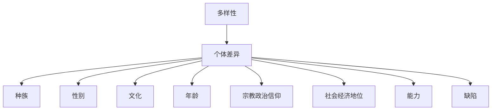

                 

# 多样性意识和文化智力：意识到种族、性别、文化、年龄、宗教政治信仰、社会经济地位、能力、缺陷等的多样性，能够在多样性的环境中高效工作

> 关键词：多样性意识、文化智力、团队建设、领导力、职业发展、社会影响

> 摘要：本文旨在探讨多样性意识和文化智力在现代社会中的重要性，并分析它们在个人发展、团队建设、领导力、职业发展以及社会影响等方面的作用。通过深入解析多样性意识的定义、分类和重要性，探讨文化智力与多样性的关系，以及多样性意识在工作环境中的应用，本文将为读者提供关于如何在多样化环境中高效工作的策略和见解。

---

### 第一部分: 多样性意识的概述

#### 第1章: 多样性意识的定义与重要性

#### 1.1 多样性意识的定义

多样性意识是指对个体和群体之间差异的认识和敏感度。这些差异可能涉及种族、性别、文化、年龄、宗教政治信仰、社会经济地位、能力、缺陷等多个方面。多样性意识不仅包括对多样性的识别，还涉及对这些差异的理解和尊重。

#### 1.1.1 多样性的概念

多样性是一种状态，指在一个群体或组织中存在多种不同的特征、背景和观点。多样性可以带来创新和灵活性，但也可能引发冲突和误解。因此，对多样性的理解和处理是组织成功的关键。

#### 1.1.2 多样性意识的起源与发展

多样性意识的概念源于对种族、性别、文化等多样性的关注。随着全球化和社会多元化的发展，多样性意识逐渐成为组织和社会关注的焦点。在现代社会，多样性意识被视为提高组织绩效和社会和谐的重要因素。

#### 1.1.3 多样性意识的重要性

多样性意识对个人和组织都具有深远的影响。对于个人，多样性意识有助于建立包容性的价值观，提高自我认知和情感智力。对于组织，多样性意识可以促进创新、提高团队协作效率，增强组织竞争力。

#### 1.2 多样性的分类

多样性可以按照不同的维度进行分类。以下是一些常见的多样性类型：

##### 1.2.1 种族多样性

种族多样性是指在一个群体中，不同种族成员的比例和差异。种族多样性可以促进对不同文化和观点的理解和尊重，有助于提高组织的包容性和多元化。

##### 1.2.2 性别多样性

性别多样性是指在组织或团队中，不同性别成员的比例和差异。性别多样性有助于打破性别刻板印象，提高团队的创新能力和决策质量。

##### 1.2.3 文化多样性

文化多样性是指在一个群体或组织中，不同文化背景成员的比例和差异。文化多样性可以促进跨文化的理解和合作，有助于组织适应全球化的挑战。

##### 1.2.4 年龄多样性

年龄多样性是指在组织或团队中，不同年龄段成员的比例和差异。年龄多样性可以为组织带来多样化的经验和知识，有助于提高组织的适应性和创新能力。

##### 1.2.5 宗教与政治信仰多样性

宗教与政治信仰多样性是指在组织或团队中，不同宗教和政治信仰成员的比例和差异。宗教与政治信仰多样性可以促进对多样性和差异的尊重和理解，有助于建立和谐的工作环境。

##### 1.2.6 社会经济地位多样性

社会经济地位多样性是指在组织或团队中，不同社会经济地位成员的比例和差异。社会经济地位多样性可以促进对贫困和富裕差距的认识和关注，有助于提高组织的公正性和社会责任感。

##### 1.2.7 能力与缺陷多样性

能力与缺陷多样性是指在组织或团队中，不同能力和缺陷成员的比例和差异。能力与缺陷多样性可以促进对能力和缺陷的理解和尊重，有助于提高组织的包容性和多元化。

#### 1.3 多样性意识与个人发展

多样性意识对个人发展具有重要的影响。通过培养多样性意识，个人可以：

- 提高自我认知，认识到自己的优点和不足。
- 增强情感智力，提高与他人沟通和合作的能力。
- 拓展视野，增强对不同文化和观点的理解和尊重。
- 建立包容性的价值观，提高个人在社会中的影响力。

#### 1.3.1 多样性意识对个体的积极影响

多样性意识有助于个人：

- 减少偏见和歧视，提高对他人的尊重和理解。
- 增强跨文化沟通和合作能力，提高人际交往质量。
- 拓展职业发展机会，提高就业竞争力。
- 提高自我管理能力，实现个人目标和职业发展。

#### 1.3.2 多样性意识在职业发展中的作用

在职业发展中，多样性意识有助于：

- 建立包容性的团队，提高团队协作效率。
- 提高决策质量和创新能力，增强组织竞争力。
- 拓展人际网络，提高职业发展机会。
- 增强对多样性和差异的敏感度，提高领导力和管理能力。

---

### 第二部分: 多样性意识与文化智力的关系

#### 第2章: 多样性意识与文化智力的关系

#### 2.1 文化智力的定义与特征

文化智力是指个体对不同文化背景的理解和适应能力。文化智力包括以下几个方面：

- 文化敏感性：对其他文化的尊重和理解，避免文化冲突。
- 文化沟通：有效沟通和交流，促进跨文化交流。
- 文化适应：适应不同文化环境，灵活应对文化差异。
- 文化创新：借鉴不同文化的优秀元素，促进创新和发展。

#### 2.1.1 文化智力的概念

文化智力是现代社会中一个重要的能力，它不仅涉及到对不同文化的了解和尊重，还涉及到在跨文化环境中有效沟通和合作的能力。文化智力有助于个人和组织适应全球化和社会多元化的挑战。

#### 2.1.2 文化智力的重要特征

- 文化敏感性：文化智力首先要求个体对其他文化的尊重和理解。这意味着个体能够意识到不同文化之间的差异，避免文化冲突和误解。

- 文化沟通：文化智力还包括有效的沟通和交流能力。在跨文化环境中，个体需要能够有效地传达信息和意图，避免误解和沟通障碍。

- 文化适应：文化智力要求个体能够适应不同文化环境。这包括在不同文化背景下灵活应对，调整自己的行为和思维方式。

- 文化创新：文化智力还体现在个体能够借鉴不同文化的优秀元素，促进创新和发展。通过跨文化的学习和交流，个体可以激发新的想法和创意。

#### 2.1.3 文化智力与多样性的联系

文化智力与多样性之间存在密切的联系。多样性为文化智力提供了丰富的资源和挑战。通过认识到多样性，个体可以：

- 拓展自己的文化视野，了解和尊重不同文化。
- 提高跨文化沟通和合作能力，促进跨文化团队的协作。
- 借鉴不同文化的优秀元素，促进创新和发展。
- 减少偏见和歧视，建立包容性的价值观。

#### 2.2 多样性意识促进文化智力发展

多样性意识对文化智力的发展具有积极的促进作用。通过培养多样性意识，个体可以：

- 增强对多样性的认识和敏感性，减少偏见和歧视。
- 提高跨文化沟通和合作能力，促进文化智力的发展。
- 借鉴不同文化的优秀元素，激发创新思维。
- 建立包容性的价值观，提高个体和组织的文化智力。

#### 2.2.1 多样性意识提升文化智力

多样性意识有助于提升个体的文化智力。通过认识到多样性的重要性，个体可以：

- 拓展自己的文化视野，了解和尊重不同文化。
- 提高跨文化沟通和合作能力，促进跨文化团队的协作。
- 借鉴不同文化的优秀元素，促进创新和发展。
- 建立包容性的价值观，提高个体和组织的文化智力。

#### 2.2.2 文化智力在多样性环境中的应用

在多样性环境中，文化智力有助于：

- 减少文化冲突和误解，建立和谐的工作环境。
- 提高跨文化团队的协作效率，促进团队目标实现。
- 借鉴不同文化的优秀元素，提高组织的创新能力和竞争力。
- 增强对多样性和差异的敏感性，提高个体的适应能力。

#### 2.3 多样性意识与文化智力的实践

在实践中，多样性意识和文化智力可以通过以下方式得到培养和应用：

- 企业可以通过开展多样性培训和交流活动，提高员工的文化智力和多样性意识。
- 教育机构可以开设相关课程，培养学生的多样性意识和文化智力。
- 社会组织可以组织多样性相关的活动，促进社会对多样性的认识和尊重。
- 个人可以通过阅读、旅行、交流等方式，提升自己的文化智力和多样性意识。

---

### 第三部分: 多样性意识在工作环境中的应用

#### 第3章: 多样性意识在工作环境中的应用

#### 3.1 多样性意识在团队建设中的作用

多样性意识在团队建设中具有重要的作用。一个多元化的团队可以带来多样化的观点和经验，促进创新和协作。通过培养多样性意识，团队可以：

- 提高团队协作效率，减少误解和冲突。
- 激发创新思维，提高团队解决问题的能力。
- 增强团队凝聚力，提高团队绩效。

#### 3.1.1 多样性意识对团队协作的积极影响

多样性意识可以促进团队协作的积极影响。通过认识到多样性，团队可以：

- 减少偏见和歧视，建立包容性的团队文化。
- 提高跨文化沟通和合作能力，促进团队成员之间的信任和理解。
- 激发创新思维，鼓励团队成员分享不同的观点和想法。
- 提高团队适应能力，应对复杂的工作环境。

#### 3.1.2 如何建立多元化团队

为了建立多元化的团队，组织可以采取以下措施：

- 制定明确的多样性政策，确保团队成员来自不同的背景和经历。
- 在招聘过程中注重多样性的原则，避免性别、种族、文化等方面的歧视。
- 为团队成员提供多样性培训，提高他们的多样性意识和文化智力。
- 鼓励团队成员之间的交流和合作，促进跨文化的理解和尊重。
- 建立多元化的领导团队，提高组织的多样性和包容性。

#### 3.2 多样性意识与领导力

多样性意识在领导力中具有重要的作用。一个具有多样性意识的领导者可以更好地理解和管理多元化的团队，提高组织的绩效和创新能力。通过培养多样性意识，领导者可以：

- 提高对多样性的敏感度，减少偏见和歧视。
- 建立包容性的领导风格，促进团队成员之间的信任和合作。
- 激发创新思维，鼓励团队成员分享不同的观点和想法。
- 提高团队适应能力，应对复杂的工作环境。

#### 3.2.1 多样性意识对领导力的影响

多样性意识对领导力具有深远的影响。通过认识到多样性，领导者可以：

- 减少偏见和歧视，建立包容性的领导风格。
- 提高跨文化沟通和合作能力，促进团队成员之间的信任和理解。
- 激发创新思维，鼓励团队成员分享不同的观点和想法。
- 提高团队适应能力，应对复杂的工作环境。

#### 3.2.2 领导者在促进多样性意识方面的责任

领导者在促进多样性意识方面承担着重要的责任。他们可以通过以下方式来履行这一责任：

- 制定明确的多样性政策，确保团队成员来自不同的背景和经历。
- 提供多样性培训，提高团队成员的多样性意识和文化智力。
- 鼓励团队成员之间的交流和合作，促进跨文化的理解和尊重。
- 建立多元化的领导团队，提高组织的多样性和包容性。
- 通过榜样作用，展示对多样性的尊重和包容。

#### 3.3 多样性意识与职业发展

多样性意识在职业发展中具有重要的作用。通过培养多样性意识，个人可以：

- 提高跨文化沟通和合作能力，拓宽职业发展机会。
- 减少偏见和歧视，建立包容性的职业形象。
- 提高创新能力，提高职业竞争力。
- 增强对多样性和差异的敏感度，提高职业适应能力。

#### 3.3.1 多样性意识对职业生涯的推动作用

多样性意识对职业生涯具有积极的推动作用。通过培养多样性意识，个人可以：

- 拓宽职业发展渠道，提高就业竞争力。
- 建立包容性的职业形象，赢得他人的尊重和信任。
- 提高跨文化沟通和合作能力，促进职业发展。
- 减少偏见和歧视，提高职业适应能力。

#### 3.3.2 职场中如何发挥多样性意识的优势

在职场中，个人可以通过以下方式发挥多样性意识的优势：

- 积极参与多样性相关的活动和培训，提高自己的多样性意识和文化智力。
- 在工作中展示对不同文化和观点的尊重和理解，建立良好的职业形象。
- 借鉴不同文化的优秀元素，促进创新和团队协作。
- 积极应对职业挑战，提高自己的适应能力和职业竞争力。

---

### 第四部分: 多样性意识的挑战与对策

#### 第4章: 多样性意识的挑战与对策

#### 4.1 多样性意识面临的挑战

多样性意识在实践过程中面临一些挑战，包括：

- 偏见与歧视：多样性意识培养过程中，个体可能会面临偏见和歧视，这需要积极应对。
- 资源与支持不足：多样性意识的培养和推广需要资源和支持，但实际中可能存在不足。
- 文化障碍：语言、习惯和价值观的差异可能成为多样性意识推广的障碍。

#### 4.1.1 预期挑战：偏见与歧视

偏见和歧视是多样性意识培养过程中最常见的挑战。个体可能由于种族、性别、文化等因素而对他人产生偏见，这可能导致误解和冲突。在多样性意识培养中，需要通过教育、培训和文化交流等方式，提高个体对偏见和歧视的认识，并鼓励他们积极应对。

#### 4.1.2 实际挑战：资源与支持不足

多样性意识的培养和推广需要资源和支持。在实际操作中，可能存在资源不足、支持力度不够等问题。为了克服这些挑战，组织可以制定明确的多样性政策，提供多样化的培训和学习资源，并鼓励员工积极参与多样性相关的活动和项目。

#### 4.1.3 文化障碍：语言与习惯差异

文化障碍是多样性意识培养过程中面临的另一个挑战。语言和习惯的差异可能导致沟通障碍和误解。为了克服这一挑战，组织可以提供跨文化沟通培训，鼓励员工学习不同的语言和文化，并建立跨文化沟通的机制和平台。

#### 4.2 应对多样性意识挑战的策略

为了有效应对多样性意识的挑战，可以采取以下策略：

- 文化敏感性培训：通过培训提高员工对多样性的敏感度，减少偏见和歧视。
- 领导力提升：培养领导者的多样性意识，提高他们在组织中的影响力。
- 组织文化建设：建立包容性的组织文化，促进员工之间的尊重和合作。
- 项目实战：通过实际项目，让员工在实践中理解和应用多样性意识。

#### 4.2.1 文化敏感性培训

文化敏感性培训是应对多样性意识挑战的重要策略。通过培训，员工可以：

- 了解不同的文化和价值观，减少偏见和歧视。
- 学会有效的跨文化沟通技巧，提高团队协作效率。
- 增强对多样性的敏感度，提高组织的包容性和多元化。

#### 4.2.2 领导力提升

领导力提升是推动多样性意识的重要策略。领导者可以通过以下方式提升自己的多样性意识：

- 了解多样性的重要性，树立包容性的领导风格。
- 培养跨文化沟通和协作能力，提高团队的多样性意识。
- 通过榜样作用，展示对多样性的尊重和包容。

#### 4.2.3 组织文化建设

组织文化建设是建立多样性意识的重要策略。组织可以通过以下方式建设包容性的组织文化：

- 制定明确的多样性政策，确保员工在多样性的环境中工作。
- 提供多样化的培训和学习资源，提高员工的多样性意识和能力。
- 鼓励员工之间的交流和合作，促进跨文化的理解和尊重。
- 通过奖励和激励机制，鼓励员工积极参与多样性相关的活动和项目。

#### 4.3 案例研究：成功多样性意识实践

以下是一些成功多样性意识实践案例：

- 企业A通过制定多样性政策，提供多样性培训，建立跨文化沟通平台，成功提升了员工的多样性意识和团队协作效率。
- 教育机构B通过开设多样性相关课程，组织多样性实践活动，提高了学生的多样性意识和跨文化沟通能力。
- 社区C通过组织多样性宣传活动，提供文化敏感性培训，促进了社区的多样性和包容性。

---

### 第五部分: 多样性意识的社会影响

#### 第5章: 多样性意识的社会影响

#### 5.1 多样性意识对社会公平的影响

多样性意识对社会公平具有重要的影响。通过培养多样性意识，可以促进以下方面的社会公平：

- 就业公平：提高对不同种族、性别、年龄等群体的就业机会，减少歧视和偏见。
- 教育公平：提高对贫困、富裕、不同文化背景等群体的教育资源分配，减少教育差距。
- 社会政策：推动制定公平的社会政策，保障不同群体的权益和利益。

#### 5.1.1 多样性意识如何促进社会公平

多样性意识可以通过以下方式促进社会公平：

- 提高对多样性的认识和尊重，减少歧视和偏见。
- 增强对贫困、富裕、不同文化背景等群体的理解和关注。
- 促进跨文化的交流和合作，减少文化冲突和误解。
- 建立包容性的社会价值观，推动社会公平的实现。

#### 5.1.2 多样性意识在社会正义中的作用

多样性意识在社会正义中发挥着重要的作用。通过培养多样性意识，可以促进以下方面的社会正义：

- 减少社会歧视和偏见，提高社会的包容性和多元化。
- 促进不同群体之间的平等和尊重，减少社会不平等现象。
- 倡导公平的社会政策，保障不同群体的权益和利益。

#### 5.2 多样性意识与经济发展

多样性意识对经济发展具有积极的影响。通过培养多样性意识，可以促进以下方面的经济发展：

- 创新和创业：多样性意识可以激发创新思维，促进创业和发展。
- 跨文化交流：多样性意识可以促进跨文化交流，扩大市场机会。
- 人才竞争：多样性意识可以提高对人才的吸引力，增强组织竞争力。

#### 5.2.1 多样性意识对经济增长的推动作用

多样性意识对经济增长具有显著的推动作用。通过培养多样性意识，可以促进以下方面的经济增长：

- 激发创新思维：多样性意识可以激发个体的创新思维，推动技术和商业模式创新。
- 扩大市场机会：多样性意识可以促进跨文化交流，扩大市场机会，提高经济增长潜力。
- 提高人才竞争力：多样性意识可以提高对人才的吸引力，增强组织竞争力，推动经济增长。

#### 5.2.2 多样性意识在创新与创业中的作用

多样性意识在创新与创业中具有重要的作用。通过培养多样性意识，可以促进以下方面的创新与创业：

- 激发创新思维：多样性意识可以激发个体的创新思维，推动技术和商业模式创新。
- 建立多元化团队：多样性意识可以促进多元化团队的建设，提高创新和创业的效率。
- 扩大市场机会：多样性意识可以促进跨文化交流，扩大市场机会，为创新与创业提供更多可能性。

#### 5.3 多样性意识与可持续发展

多样性意识对可持续发展具有深远的影响。通过培养多样性意识，可以促进以下方面的可持续发展：

- 环境保护：多样性意识可以提高对环境保护的认识，促进可持续发展。
- 社会公平：多样性意识可以促进社会公平，减少贫困和不平等现象，推动可持续发展。
- 经济发展：多样性意识可以促进经济发展，提高资源利用效率，推动可持续发展。

#### 5.3.1 多样性意识对可持续发展的意义

多样性意识对可持续发展的意义在于：

- 提高对多样性的认识和尊重，促进环境保护。
- 促进社会公平，减少贫困和不平等现象，推动可持续发展。
- 提高经济竞争力，促进经济发展，推动可持续发展。

#### 5.3.2 多样性意识与全球化的关系

多样性意识与全球化密切相关。全球化带来了多样性的挑战和机遇，而多样性意识则有助于应对这些挑战和利用机遇。通过培养多样性意识，可以：

- 促进跨文化交流，增强国际合作和竞争能力。
- 提高对全球多样性的认识，推动全球治理的多元化和包容性。
- 促进可持续发展，实现全球经济增长和社会进步。

---

### 第六部分: 个人如何培养多样性意识

#### 第6章: 个人如何培养多样性意识

#### 6.1 个人多样性意识的培养途径

个人可以通过以下途径培养多样性意识：

- 学习多元文化：通过阅读、旅行、交流等方式，了解和尊重不同的文化和价值观。
- 反思自我偏见：通过自我反思，识别和克服自己的偏见和歧视。
- 参与多样性相关的活动：参与多样性相关的培训、讲座和社区活动，提高多样性意识。

#### 6.1.1 学习多元文化

学习多元文化是培养多样性意识的重要途径。个人可以通过以下方式学习多元文化：

- 阅读相关书籍和资料，了解不同的文化背景和价值观。
- 旅行和交流，亲身体验不同的文化，增强对多样性的理解和尊重。
- 参与跨文化团队项目，提高跨文化沟通和协作能力。

#### 6.1.2 反思自我偏见

反思自我偏见是培养多样性意识的关键。个人可以通过以下方式反思自我偏见：

- 自我反思：定期反思自己的行为和想法，识别和克服偏见。
- 寻求反馈：向他人寻求反馈，了解自己的偏见和歧视行为。
- 参与偏见消除培训：参加相关培训，提高自我意识和偏见识别能力。

#### 6.1.3 参与多样性相关的活动

参与多样性相关的活动是培养多样性意识的实践途径。个人可以通过以下方式参与多样性相关的活动：

- 参加多样性培训：参加多样性相关的培训课程，提高多样性意识和能力。
- 参与多样性讲座：参加多样性相关的讲座和研讨会，了解多样性在不同领域的应用。
- 加入多样性组织：加入多样性相关的组织和社群，参与多样性相关的活动和项目。

#### 6.2 多样性意识在日常生活中的应用

多样性意识在日常生活中的应用至关重要。个人可以通过以下方式在日常交流中体现多样性意识：

- 尊重他人的观点和文化：尊重他人的观点和文化，避免歧视和偏见。
- 倡导包容性价值观：倡导包容性价值观，促进社会对多样性的尊重和理解。
- 增强跨文化沟通：提高跨文化沟通能力，促进不同文化背景的人之间的理解和合作。

#### 6.2.1 如何在日常交流中体现多样性意识

个人在日常交流中可以体现多样性意识的方式包括：

- 使用尊重和包容的措辞：避免使用歧视性语言，尊重他人的观点和文化。
- 倾听和尊重他人：倾听他人的观点，尊重他们的文化背景和经历。
- 分享自己的多样性经历：分享自己的多样性经历，促进对多样性的理解和尊重。

#### 6.2.2 多样性意识在家庭与社区中的作用

多样性意识在家庭与社区中具有重要的影响。个人可以通过以下方式在家庭与社区中发挥多样性意识的作用：

- 建立包容性的家庭文化：在家庭中建立包容性的文化，促进家庭成员之间的理解和尊重。
- 参与社区多样性活动：参与社区多样性相关的活动和项目，促进社区对多样性的认识和尊重。
- 支持多样性倡议：支持多样性相关的倡议和项目，推动社会的多样性和包容性。

#### 6.3 多样性意识的持续提升

多样性意识需要持续提升，个人可以通过以下方式实现持续提升：

- 持续学习和反思：持续学习和反思，提高对多样性的理解和认识。
- 参与多样性项目：参与多样性相关的项目和实践，积累经验。
- 分享经验和知识：与他人分享多样性意识和实践经验，促进共同进步。

#### 6.3.1 自我反思与持续学习

自我反思与持续学习是提升多样性意识的关键。个人可以通过以下方式实现自我反思与持续学习：

- 定期自我反思：定期反思自己的行为和想法，识别和克服偏见。
- 学习多样性知识：学习多样性相关的知识，提高对多样性的理解和认识。
- 参与多样性培训：参加多样性相关的培训课程，提高多样性意识和能力。

#### 6.3.2 与他人交流与分享经验

与他人交流与分享经验是提升多样性意识的重要途径。个人可以通过以下方式与他人交流与分享经验：

- 参与多样性讨论：参与多样性相关的讨论和交流活动，分享自己的观点和经验。
- 倾听他人的意见：倾听他人的意见和经验，学习他们的多样性意识和实践。
- 建立多样性社群：建立多样性社群，促进成员之间的交流和合作。

---

### 第七部分: 多样性意识的未来趋势与展望

#### 第7章: 多样性意识的未来趋势与展望

#### 7.1 多样性意识的发展趋势

多样性意识在未来将继续发展，以下是多样性意识的一些发展趋势：

- 科技的应用：随着科技的发展，多样性意识的培养和推广将更加便捷和高效。
- 教育的普及：教育系统将更加注重多样性教育，培养学生的多样性意识和能力。
- 社会的关注：社会对多样性的关注将不断提高，多样性意识将得到更广泛的认可和重视。

#### 7.1.1 科技在多样性意识培养中的应用

科技在多样性意识培养中的应用将发挥重要作用。以下是一些科技应用：

- 在线培训平台：利用在线培训平台，提供多样化的多样性培训课程，提高员工的多样性意识和能力。
- 人工智能：利用人工智能技术，分析和评估个体的多样性意识和行为，提供个性化的培训和建议。
- 虚拟现实：通过虚拟现实技术，模拟不同文化环境，提高个体对多样性的理解和适应能力。

#### 7.1.2 教育系统中多样性意识的未来发展

教育系统将在多样性意识的培养方面发挥关键作用。未来教育系统的多样性意识发展将包括：

- 多样性课程：将多样性教育纳入学校课程，培养学生的多样性意识和能力。
- 教师培训：为教师提供多样性培训，提高他们的多样性意识和教学能力。
- 教育评价：将多样性意识作为教育评价的重要指标，促进学生对多样性的认识和尊重。

#### 7.2 多样性意识的社会实践与政策

多样性意识的社会实践和政策将对多样性意识的推广和落实起到关键作用。以下是一些社会实践与政策：

- 多样性政策：政府和企业制定多样性政策，确保员工在多样性的环境中工作。
- 多样性评估：通过多样性评估，监测组织的多样性状况，推动多样性的实施。
- 多样性奖项：设立多样性奖项，表彰在多样性方面做出贡献的个人和组织。

#### 7.2.1 多样性意识在社会政策中的体现

多样性意识在社会政策中的体现将有助于推动社会公平和可持续发展。以下是一些多样性意识在社会政策中的体现：

- 就业政策：制定公平的就业政策，确保不同群体有平等的就业机会。
- 教育政策：将多样性教育纳入教育政策，提高学生对多样性的认识和尊重。
- 社会服务：提供多样化的社会服务，满足不同群体的需求，减少社会不平等。

#### 7.2.2 企业在多样性意识培养中的社会责任

企业在多样性意识培养中承担着重要的社会责任。以下是企业可以采取的一些措施：

- 多样性培训：为员工提供多样性培训，提高他们的多样性意识和能力。
- 多样性招聘：在招聘过程中注重多样性，确保团队成员来自不同的背景和经历。
- 多样性文化建设：建立包容性的企业文化，鼓励员工尊重和欣赏多样性。

#### 7.3 多样性意识的全球视角

多样性意识在全球范围内具有广泛的影响。以下是一些多样性意识的全球视角：

- 全球化：全球化带来了多样性的挑战和机遇，多样性意识有助于应对这些挑战和利用机遇。
- 国际合作：多样性意识促进国际合作，推动全球治理的多元化和包容性。
- 可持续发展：多样性意识有助于实现可持续发展，促进全球经济增长和社会进步。

#### 7.3.1 全球多样性意识的发展现状

全球多样性意识的发展现状如下：

- 西方国家：西方国家在多样性意识的培养和推广方面取得了显著的进展，多样性政策得到了广泛实施。
- 发展中国家：发展中国家在多样性意识的培养方面逐渐得到重视，多样性政策也在逐步实施。
- 国际组织：国际组织在推动全球多样性意识方面发挥着重要作用，制定了一系列多样性和包容性的标准和指南。

#### 7.3.2 多样性意识在全球治理中的作用

多样性意识在全球治理中的作用如下：

- 促进公平：多样性意识有助于促进全球公平，减少贫困和不平等现象。
- 推动可持续发展：多样性意识有助于推动全球可持续发展，实现经济增长和社会进步。
- 增强国际合作：多样性意识促进各国之间的合作，推动全球治理的多元化和包容性。

---

### 附录

#### 附录 A: 多样性意识的资源与工具

#### A.1 多样性研究机构与报告

以下是一些著名的多样性研究机构和报告：

- 国际多样性研究所（IDR）：提供关于多样性研究的报告和资料。
- 多样性领导力研究所（DLI）：专注于多样性领导力的研究和培训。
- 欧洲多样性基金会（EDF）：推动欧洲地区的多样性研究和实践。

#### A.2 多样性意识培训课程与资源

以下是一些多样性意识培训课程和资源：

- 网易云课堂：提供多样化的多样性培训课程，包括文化敏感性培训、领导力培训等。
- Coursera：提供由全球知名大学和机构开设的多样性相关课程。
- EdX：提供由哈佛大学、麻省理工学院等顶尖大学开设的多样性相关课程。

#### A.3 多样性意识相关书籍与文献推荐

以下是一些多样性意识相关书籍和文献推荐：

- 《多样性管理：策略与实践》（Diversity Management: Strategies and Practices） by F. J. Ochberg
- 《文化的力量：多样性、创新和竞争优势》（The Power of Culture: Diversity, Innovation, and Competitive Advantage）by Michael Useem
- 《文化冲击：全球领导者的挑战与机遇》（Culture Shock! The Challenges and Opportunities of Global Leadership）by John J. Mockler

---

本文由AI天才研究院/AI Genius Institute撰写，旨在探讨多样性意识和文化智力在现代社会中的重要性，以及它们在个人发展、团队建设、领导力、职业发展以及社会影响等方面的作用。通过深入解析多样性意识的定义、分类和重要性，探讨文化智力与多样性的关系，以及多样性意识在工作环境中的应用，本文为读者提供了关于如何在多样化环境中高效工作的策略和见解。希望本文能够帮助读者更好地理解和应用多样性意识，推动个人和组织的发展。作者：AI天才研究院/AI Genius Institute & 禅与计算机程序设计艺术 /Zen And The Art of Computer Programming## 第一部分：多样性意识的概述

### 第1章：多样性意识的定义与重要性

### 1.1 多样性意识的定义

多样性意识是指对个体和群体之间差异的认识和敏感度。这种差异可能涉及种族、性别、文化、年龄、宗教政治信仰、社会经济地位、能力、缺陷等多个方面。多样性意识不仅仅是对多样性的识别，更重要的是对这种差异的理解和尊重。它涉及到多个层面的意识和行动，包括个人自我反思、团队合作、领导决策等。

首先，多样性意识的核心理念在于认识到多样性是组织和社会的财富。每一个个体都有其独特的背景、经验和观点，这些差异可以带来创新和进步。然而，如果缺乏对多样性的理解和尊重，这些差异可能会引发偏见、歧视和冲突。

#### 核心概念与联系

以下是一个使用Mermaid绘制的多样性意识的核心概念和联系流程图：

在这个流程图中，多样性（A）是总的起点，它引出了个体差异（B），然后细分出多个具体的差异类型（C到J）。这些差异类型共同构成了多样性的概念，并在实际应用中相互关联。

#### 多样性意识的起源与发展

多样性意识的概念起源于对种族、性别和文化多样性的关注。在过去的几十年里，随着全球化和社会多元化的发展，多样性意识逐渐成为组织和社会关注的焦点。以下是一些重要的历史事件和里程碑：

- **1960年代**：民权运动和妇女解放运动的兴起，引发了社会对种族和性别多样性的关注。
- **1980年代**：多元文化教育和多元文化组织的发展，促进了文化多样性的认识和实践。
- **1990年代**：多样性管理成为企业战略的重要组成部分，许多企业开始实施多样性政策。
- **2000年代**：随着科技的发展和全球化的加深，多样性意识进一步扩展到社会经济地位、能力、缺陷等多个维度。

#### 1.1.3 多样性意识的重要性

多样性意识对个人和组织都具有深远的影响。对于个人，多样性意识有助于：

- **提高自我认知**：通过认识和理解自己的多样性和他人的差异，个人可以更好地了解自己的价值观、信念和行为模式。
- **增强情感智力**：多样性意识要求个体对他人的情感和观点保持敏感，这有助于提高个体的同理心和人际交往能力。
- **促进职业发展**：在多元化和包容性的环境中工作，个人可以更好地适应不同的文化和工作方式，从而提高职业竞争力。

对于组织，多样性意识有助于：

- **促进创新**：多样性带来不同的视角和思维模式，有助于激发创新和解决问题的能力。
- **提高团队协作**：多样性意识可以减少偏见和误解，促进团队成员之间的信任和合作。
- **增强组织竞争力**：多元化团队可以更好地适应市场变化和客户需求，从而提高组织的竞争力。

### 1.2 多样性的分类

多样性可以按照不同的维度进行分类。以下是一些常见的多样性类型：

#### 1.2.1 种族多样性

种族多样性是指在组织或团队中，不同种族成员的比例和差异。种族多样性可以促进对不同文化和观点的理解和尊重，有助于提高组织的包容性和多元化。

#### 1.2.2 性别多样性

性别多样性是指在组织或团队中，不同性别成员的比例和差异。性别多样性有助于打破性别刻板印象，提高团队的创新能力和决策质量。

#### 1.2.3 文化多样性

文化多样性是指在组织或团队中，不同文化背景成员的比例和差异。文化多样性可以促进跨文化的理解和合作，有助于组织适应全球化的挑战。

#### 1.2.4 年龄多样性

年龄多样性是指在组织或团队中，不同年龄段成员的比例和差异。年龄多样性可以为组织带来多样化的经验和知识，有助于提高组织的适应性和创新能力。

#### 1.2.5 宗教与政治信仰多样性

宗教与政治信仰多样性是指在组织或团队中，不同宗教和政治信仰成员的比例和差异。宗教与政治信仰多样性可以促进对多样性和差异的尊重和理解，有助于建立和谐的工作环境。

#### 1.2.6 社会经济地位多样性

社会经济地位多样性是指在组织或团队中，不同社会经济地位成员的比例和差异。社会经济地位多样性可以促进对贫困和富裕差距的认识和关注，有助于提高组织的公正性和社会责任感。

#### 1.2.7 能力与缺陷多样性

能力与缺陷多样性是指在组织或团队中，不同能力和缺陷成员的比例和差异。能力与缺陷多样性可以促进对能力和缺陷的理解和尊重，有助于提高组织的包容性和多元化。

### 1.3 多样性意识与个人发展

多样性意识对个人发展具有重要的影响。通过培养多样性意识，个人可以：

- **提高自我认知**：多样性意识要求个体反思自己的偏见和成见，这有助于个体更好地了解自己，认识自己的优点和不足。
- **增强情感智力**：多样性意识促使个体理解和尊重他人的观点和文化，这有助于提高个体的同理心和人际交往能力。
- **拓展视野**：多样性意识使个体能够从不同的角度看待问题，从而拓宽视野，提高解决问题的能力。

在职业发展中，多样性意识有助于：

- **建立包容性的职业形象**：具备多样性意识的个体能够展现出对不同文化和观点的尊重和理解，这有助于建立积极的职业形象。
- **提高沟通和协作能力**：多样性意识有助于个体在多元文化的环境中有效沟通和合作，从而提高团队协作效率。
- **拓宽职业发展机会**：多样性意识的个体能够更好地适应不同文化和工作环境，从而在职业发展中获得更多机会。

### 1.3.1 多样性意识对个体的积极影响

多样性意识对个体的积极影响体现在多个方面：

- **减少偏见和歧视**：多样性意识有助于个体认识到偏见和歧视的危害，从而减少对他人的偏见和歧视行为。
- **提高跨文化沟通能力**：多样性意识促使个体学会在跨文化环境中有效沟通，提高人际交往能力。
- **增强团队合作能力**：多样性意识有助于个体在多元文化的团队中更好地协作，提高团队绩效。
- **促进个人成长**：多样性意识使个体能够从不同的角度看待问题，从而促进个人成长和发展。

### 1.3.2 多样性意识在职业发展中的作用

在职业发展中，多样性意识的作用如下：

- **提高职业竞争力**：具备多样性意识的个体能够更好地适应不同文化和工作环境，从而提高职业竞争力。
- **拓宽职业发展渠道**：多样性意识的个体能够发现和利用更多职业发展机会，从而拓宽职业发展渠道。
- **促进职业成长**：多样性意识有助于个体在职业发展中不断学习和成长，从而实现职业目标。

#### 实际案例

以谷歌为例，谷歌在其全球化的环境中非常重视多样性意识。通过多样化的招聘策略、跨文化交流活动以及多样性培训，谷歌不仅提高了员工的多样性意识，也提升了组织的创新能力和团队协作效率。

- **多样化的招聘策略**：谷歌通过在全球范围内招聘员工，确保团队成员具有不同的文化背景和观点，从而促进多样性的发展。
- **跨文化交流活动**：谷歌定期举办跨文化交流活动，如国际文化节、团队建设活动等，以增强员工的跨文化沟通和协作能力。
- **多样性培训**：谷歌为员工提供多样性培训，提高员工的多样性意识和能力，促进组织的包容性和多元化。

这些措施不仅提高了谷歌的多样性意识，也为其在全球市场上的竞争力提供了强大的支持。

---

通过以上章节的内容，我们可以看到多样性意识的重要性和其在个人发展和职业发展中的积极作用。在接下来的章节中，我们将进一步探讨多样性意识与文化智力之间的关系，以及多样性意识在工作环境中的应用和实践。希望读者能够从中获得对多样性意识的更深入理解，并在实际工作中有效应用这些知识。## 第二部分：多样性意识与文化智力的关系

### 第2章：多样性意识与文化智力的关系

#### 2.1 文化智力的定义与特征

文化智力是指个体对不同文化背景的理解和适应能力。它不仅仅涉及到对文化差异的认识，还包括在实际生活和工作中有效运用这些认识的能力。文化智力包括以下几个核心特征：

- **文化敏感性**：对其他文化的尊重和理解，避免文化冲突和误解。
- **文化沟通**：在不同文化背景下，有效地传递信息和意图，促进跨文化交流。
- **文化适应**：在不同文化环境中灵活应对，调整行为和思维方式。
- **文化创新**：借鉴不同文化的优秀元素，促进创新和发展。

#### 2.1.1 文化智力的概念

文化智力是一个相对较新的概念，但它在现代社会中变得越来越重要。文化智力不仅仅是一种认知能力，更是一种生活和工作技能。一个具备高文化智力的人能够在多元文化环境中游刃有余，能够理解和尊重他人的文化，并有效地与他人沟通和合作。

#### 2.1.2 文化智力的重要特征

- **文化敏感性**：文化敏感性是文化智力的基础。一个具备高文化敏感性的人能够意识到不同文化之间的差异，并尊重这些差异。这种敏感性有助于减少误解和冲突，建立和谐的人际关系。
- **文化沟通**：文化沟通是文化智力的关键组成部分。具备文化沟通能力的人能够在不同文化背景下有效地交流，传递信息并理解他人的意图。这种能力有助于打破文化壁垒，促进团队合作和创新。
- **文化适应**：文化适应能力是指个体在不同文化环境中灵活应对和调整行为的能力。一个具备高文化适应能力的人能够在不同的文化环境中迅速适应，有效地开展工作。
- **文化创新**：文化创新是指个体能够借鉴不同文化的优秀元素，创造出新的思路和解决方案。这种能力有助于推动创新和发展，使个体和组织在全球化竞争中保持优势。

#### 2.1.3 文化智力与多样性的联系

文化智力与多样性之间存在密切的联系。多样性为文化智力提供了丰富的资源和挑战。通过认识到多样性，个体可以：

- **提高文化敏感性**：多样性使得个体有机会接触和理解不同的文化，从而提高他们的文化敏感性。
- **增强文化沟通能力**：在多元文化环境中工作，个体需要不断地与来自不同文化背景的人进行交流，这有助于提高他们的文化沟通能力。
- **促进文化适应**：多样性环境要求个体能够灵活适应不同的文化，这有助于提升他们的文化适应能力。
- **激发文化创新**：多样性带来了不同的观点和思路，这有助于激发创新思维，推动文化创新。

#### 2.2 多样性意识促进文化智力发展

多样性意识对文化智力的发展具有积极的促进作用。通过培养多样性意识，个体可以：

- **提高文化敏感性**：多样性意识使个体更加关注和尊重不同的文化，减少对其他文化的偏见和歧视，从而提高文化敏感性。
- **增强文化沟通能力**：多样性意识促使个体学会在多元文化环境中有效沟通，提高跨文化沟通的能力。
- **促进文化适应**：多样性意识帮助个体认识到文化差异的存在，从而提高他们在不同文化环境中的适应能力。
- **激发文化创新**：多样性意识鼓励个体从不同的文化背景中寻找灵感，促进文化创新和思维突破。

#### 2.2.1 多样性意识提升文化智力

多样性意识可以通过以下几个方面提升文化智力：

- **增加文化接触**：通过多样化的活动和经历，个体可以接触到更多的文化，增加对文化差异的认识。
- **培养跨文化视角**：多样性意识使个体能够从跨文化的视角看待问题，提高他们的文化理解能力。
- **提供学习机会**：多样性意识为个体提供了学习和提升文化智力的机会，如参加文化培训、跨文化交流等。
- **鼓励反思与自我提升**：多样性意识促使个体反思自己的行为和观念，寻找提升文化智力的方法和途径。

#### 2.2.2 文化智力在多样性环境中的应用

在多样性环境中，文化智力有助于：

- **减少文化冲突**：具备高文化智力的人能够更好地理解和尊重不同的文化，从而减少文化冲突和误解。
- **提高团队协作效率**：文化智力有助于团队成员之间的有效沟通和合作，提高团队的整体效率。
- **促进创新与变革**：文化智力能够激发创新思维，推动组织的变革和发展。
- **提升跨文化领导能力**：具备高文化智力的人能够在多元文化环境中有效地领导和激励团队，提升组织的领导力。

#### 2.3 多样性意识与文化智力的实践

在实践中，多样性意识和文化智力可以通过以下方式得到培养和应用：

- **企业培训**：企业可以开展多样性培训和跨文化沟通培训，提高员工的文化智力和多样性意识。
- **教育系统**：教育机构可以设置多样性相关的课程和活动，培养学生的文化智力和多样性意识。
- **社会活动**：社会组织可以组织多样性相关的活动和项目，促进社会对多样性的认识和尊重。

#### 实际案例

以万豪国际酒店为例，万豪在全球化的背景下非常重视多样性意识和文化智力的培养。以下是一些具体的实践：

- **多样性培训**：万豪为员工提供了多种形式的多样性培训，包括文化敏感性培训、跨文化沟通培训等，帮助员工提高文化智力和多样性意识。
- **跨文化团队建设**：万豪鼓励员工参与跨文化团队建设活动，如国际文化节、团队拓展等，提高员工在多元文化环境中的适应能力和协作效率。
- **文化融入计划**：万豪实施了一系列文化融入计划，帮助新员工更快地适应不同文化环境，如文化介绍会、文化交流活动等。

这些措施不仅提高了万豪的多样性意识和文化智力，也为其在全球市场上的竞争力提供了强大的支持。

通过以上内容，我们可以看到多样性意识和文化智力之间的紧密联系以及它们在实际中的应用。在接下来的章节中，我们将继续探讨多样性意识在工作环境中的应用，包括团队建设、领导力和职业发展等方面。希望读者能够从中获得对多样性意识和文化智力更深入的理解。## 第三部分：多样性意识在工作环境中的应用

### 第3章：多样性意识在工作环境中的应用

#### 3.1 多样性意识在团队建设中的作用

多样性意识在团队建设中起着至关重要的作用。一个多元化的团队能够带来不同的观点、经验和技能，从而提高团队的整体绩效和创新能力。然而，要充分发挥多样性的优势，团队需要具备多样性意识，这包括对多样性的认识和尊重。

#### 3.1.1 多样性意识对团队协作的积极影响

多样性意识对团队协作具有以下几个积极影响：

1. **提高创新能力和创造力**：多样化的团队能够带来不同的视角和思路，有助于发现新的解决方案和创新点。当团队成员来自不同的背景和文化时，他们可能会提出独特的想法，从而激发团队的创造力。

2. **促进沟通和理解**：多样性意识使团队成员能够更好地理解和尊重彼此的差异，减少误解和冲突。通过有效的沟通，团队成员可以分享不同的观点和经验，从而提高团队的整体协作效率。

3. **增强团队适应能力**：在多变和不确定的工作环境中，多样性意识有助于团队更好地适应新的挑战和变化。团队成员的多样性可以带来不同的经验和技能，从而提高团队解决问题的能力。

4. **提高团队凝聚力**：多样性意识有助于建立包容性的团队文化，使团队成员感受到被尊重和重视。这种文化能够增强团队的凝聚力，提高团队成员的归属感和满意度。

#### 3.1.2 如何建立多元化团队

为了建立多元化团队，组织可以采取以下措施：

1. **多元化的招聘策略**：在招聘过程中，组织应注重多样性的原则，避免性别、种族、文化等方面的歧视。可以通过制定多样化的招聘标准和评估方法，确保团队成员来自不同的背景和经历。

2. **跨文化培训**：为团队成员提供跨文化培训，提高他们的文化智力和多样性意识。这些培训可以帮助团队成员更好地理解和尊重不同的文化，提高跨文化沟通和协作能力。

3. **团队建设活动**：组织可以定期开展团队建设活动，如团队拓展、国际文化节等，促进团队成员之间的交流和合作。这些活动有助于增强团队凝聚力，提高多样性意识。

4. **建立包容性文化**：组织应建立包容性的文化，鼓励员工尊重和欣赏多样性。可以通过制定明确的多样性政策，提供多样性的支持和服务，如灵活的工作安排、平等的机会等。

#### 3.2 多样性意识与领导力

领导者在推动多样性意识方面扮演着关键角色。一个具有多样性意识的领导者能够建立包容性的团队文化，提高团队的整体绩效和创新能力。

#### 3.2.1 多样性意识对领导力的影响

多样性意识对领导力具有以下几个重要影响：

1. **提高领导者的文化智力**：多样性意识使领导者能够更好地理解和尊重不同的文化，提高跨文化沟通和协作能力。这有助于领导者更好地管理多元文化团队，提高领导效果。

2. **促进领导风格的转变**：多样性意识促使领导者从单一维度的领导风格转向更加包容和多元化的领导风格。领导者需要学会倾听不同的声音，尊重不同的观点，从而提高团队的多样性和创新能力。

3. **增强领导者的适应性**：多样性环境要求领导者具备更高的适应能力，能够灵活应对不同的挑战和变化。多样性意识有助于领导者提升这一能力，从而更好地应对复杂多变的工作环境。

4. **提高领导者的社会责任感**：多样性意识使领导者更加关注社会公平和公正，提高他们的社会责任感。这有助于领导者推动组织的多样性政策，促进社会的和谐与进步。

#### 3.2.2 领导者在促进多样性意识方面的责任

领导者在促进多样性意识方面承担着以下责任：

1. **制定明确的多样性政策**：领导者应制定明确的多样性政策，确保团队成员在多样性的环境中工作。这些政策应包括多样性的招聘标准、培训计划、评估机制等。

2. **提供多样化的培训**：领导者应为团队成员提供多样化的培训，提高他们的多样性意识和文化智力。这些培训可以包括文化敏感性培训、跨文化沟通培训等。

3. **建立包容性文化**：领导者应致力于建立包容性的文化，鼓励员工尊重和欣赏多样性。这可以通过设立多样性奖项、举办多样性活动等方式实现。

4. **树立榜样作用**：领导者应以身作则，展示对多样性的尊重和包容。领导者的行为和态度对团队成员具有示范作用，有助于培养团队的多样性意识。

#### 3.3 多样性意识与职业发展

多样性意识在职业发展中具有重要意义。它不仅有助于提高个人的职业竞争力，还能为职业发展带来更多机会。

#### 3.3.1 多样性意识对职业生涯的推动作用

多样性意识对职业生涯的推动作用主要体现在以下几个方面：

1. **拓宽视野**：多样性意识使个人能够从不同的角度看待问题，从而拓宽视野，提高解决问题的能力。这有助于个人在职业发展中不断进步。

2. **提高沟通能力**：多样性意识有助于个人在多元文化环境中有效沟通，提高人际交往能力。这有助于个人在职业发展中建立更广泛的人际网络。

3. **增强适应性**：多样性意识使个人能够更好地适应不同的文化和工作环境，提高职业适应性。这有助于个人在职业生涯中应对各种挑战。

4. **提高职业竞争力**：具备多样性意识的个人能够在竞争激烈的职场中脱颖而出，获得更多的职业机会。多样性意识成为个人职业发展的核心竞争力之一。

#### 3.3.2 职场中如何发挥多样性意识的优势

在职场中，个人可以通过以下方式发挥多样性意识的优势：

1. **积极参与多样性培训**：参加多样性培训，提高自己的多样性意识和能力。这些培训可以帮助个人更好地理解和尊重不同的文化和观点。

2. **主动交流和分享**：在职场中，主动与来自不同文化背景的同事交流，分享自己的经验和观点。这有助于建立良好的人际关系，提高团队合作效率。

3. **提出创新观点**：在工作和项目中，积极提出创新观点，借鉴不同文化的优秀元素。这有助于提高项目的质量和团队的创新能力。

4. **建立跨文化团队**：在团队中推动建立跨文化团队，鼓励团队成员分享不同的观点和经验。这有助于提高团队的多样性和创新能力。

#### 实际案例

以谷歌为例，谷歌在团队建设和领导力方面非常注重多样性意识的培养。以下是一些具体的实践：

1. **多元化的团队建设**：谷歌通过多元化的招聘策略，确保团队成员来自不同的背景和经历。同时，谷歌定期举办团队建设活动，如团队拓展、国际文化节等，促进团队成员之间的交流和合作。

2. **领导力培训**：谷歌为领导者提供了多样化的领导力培训，提高他们的多样性意识和文化智力。这些培训包括文化敏感性培训、跨文化沟通培训等。

3. **包容性文化**：谷歌致力于建立包容性的文化，鼓励员工尊重和欣赏多样性。谷歌设立了多样性奖项，表彰在多样性方面做出贡献的员工。

这些措施不仅提高了谷歌的多样性意识和文化智力，也为其在全球市场上的竞争力提供了强大的支持。

通过以上内容，我们可以看到多样性意识在工作环境中的重要性以及它在团队建设、领导力和职业发展方面的作用。在接下来的章节中，我们将继续探讨多样性意识面临的挑战以及如何应对这些挑战。希望读者能够从中获得对多样性意识更深入的理解，并在实际工作中有效应用这些知识。## 第四部分：多样性意识的挑战与对策

### 第4章：多样性意识的挑战与对策

#### 4.1 多样性意识面临的挑战

多样性意识在实践过程中面临着诸多挑战，这些挑战既包括预期的，如偏见与歧视，也包括实际的，如资源与支持不足。理解和应对这些挑战是成功推广多样性意识的关键。

#### 4.1.1 预期挑战：偏见与歧视

偏见与歧视是多样性意识推广过程中最常见的挑战。偏见是指个体基于某些特征（如种族、性别、文化等）对他人持有的负面态度或观念，而歧视则是这种偏见在行为上的表现。以下是一些预期挑战的具体表现：

1. **种族偏见**：在种族多元化的组织中，个体可能会对某些种族成员持有偏见，导致这些成员在工作和发展中受到不公平对待。

2. **性别歧视**：在性别多元化的环境中，性别偏见可能导致性别角色刻板印象的强化，影响女性和男性在职业发展中的机会。

3. **文化偏见**：不同文化背景的个体可能会对其他文化持有偏见，导致文化冲突和沟通障碍。

4. **宗教与政治信仰歧视**：在宗教和政治信仰多元化的环境中，个体可能会因为宗教和政治信仰的差异而受到歧视。

#### 4.1.2 实际挑战：资源与支持不足

资源与支持不足是多样性意识推广过程中另一个重要挑战。以下是一些具体表现：

1. **培训资源不足**：许多组织缺乏足够的多样性培训资源，无法为员工提供全面的多样性意识和技能培训。

2. **政策支持不足**：一些组织可能没有制定明确的多样性政策，缺乏对多样性意识推广的系统性支持。

3. **执行力度不足**：即使有相关政策，如果执行力度不足，多样性意识推广也可能流于形式。

4. **组织文化阻碍**：一些组织的现有文化可能对多样性意识的推广构成阻碍，导致多样性政策难以有效实施。

#### 4.2 应对多样性意识挑战的策略

为了有效应对多样性意识的挑战，组织和个人可以采取以下策略：

#### 4.2.1 文化敏感性培训

文化敏感性培训是应对多样性意识挑战的重要策略。通过培训，员工可以：

1. **提高文化敏感性**：培训可以帮助员工认识到文化差异的存在，减少对其他文化的偏见和歧视。

2. **学习跨文化沟通技巧**：培训可以提供有效的跨文化沟通技巧，帮助员工在不同文化背景下有效沟通和协作。

3. **增强包容性思维**：通过培训，员工可以培养包容性思维，尊重和欣赏不同的文化和观点。

#### 4.2.2 领导力提升

领导力提升是推动多样性意识的重要策略。领导者可以通过以下方式提升自己的多样性意识：

1. **树立榜样作用**：领导者应以身作则，展示对多样性的尊重和包容，成为员工的榜样。

2. **提供多样性培训**：领导者可以为团队成员提供多样性培训，提高他们的多样性意识和技能。

3. **建立包容性团队文化**：领导者应致力于建立包容性的团队文化，鼓励员工尊重和欣赏多样性。

#### 4.2.3 组织文化建设

组织文化建设是建立多样性意识的重要策略。组织可以通过以下方式建设包容性的组织文化：

1. **制定明确的多样性政策**：组织应制定明确的多样性政策，确保团队成员在多样性的环境中工作。

2. **提供多样化的培训和学习资源**：组织应提供多样化的培训和学习资源，提高员工的多样性意识和技能。

3. **鼓励员工参与多样性相关的活动和项目**：组织应鼓励员工积极参与多样性相关的活动和项目，促进多样性意识的实践。

#### 4.2.4 项目实战

项目实战是培养多样性意识的重要途径。通过实际项目，员工可以在实践中理解和应用多样性意识。以下是一些具体的建议：

1. **跨文化团队项目**：组织可以安排跨文化团队项目，让员工在不同文化背景下合作，提高他们的跨文化沟通和协作能力。

2. **多样性主题的项目**：组织可以设立多样性主题的项目，如性别平等项目、种族多样性项目等，让员工在实践中理解和应用多样性意识。

3. **反思与总结**：在项目结束后，组织应组织员工进行反思和总结，分享项目中的经验和教训，进一步巩固多样性意识。

#### 案例研究：成功多样性意识实践

以下是一些成功多样性意识实践案例：

1. **案例一：谷歌的多样性实践**

谷歌是全球科技行业多样性实践的先驱之一。谷歌采取了多种措施来推动多样性意识的培养和实践，包括：

- **多元化的招聘策略**：谷歌通过多元化的招聘策略，确保团队成员来自不同的背景和经历。
- **跨文化培训**：谷歌为员工提供了多种形式的跨文化培训，提高他们的多样性意识和文化智力。
- **包容性文化**：谷歌致力于建立包容性的文化，鼓励员工尊重和欣赏多样性。

2. **案例二：微软的多样性意识培养**

微软通过一系列措施来培养员工的多样性意识，包括：

- **多样性政策**：微软制定了明确的多样性政策，确保员工在多样性的环境中工作。
- **领导力培训**：微软为领导者提供了多样性培训，提高他们的多样性意识和领导力。
- **多样性项目**：微软设立了多样性项目，如“女性领导力项目”、“种族多样性项目”等，鼓励员工积极参与。

这些措施不仅提高了谷歌和微软的多样性意识，也为其在全球市场上的竞争力提供了强大的支持。

通过以上内容，我们可以看到多样性意识在实践过程中面临的挑战以及应对这些挑战的策略。在接下来的章节中，我们将继续探讨多样性意识对社会的影响以及个人如何培养多样性意识。希望读者能够从中获得对多样性意识更深入的理解，并在实际工作中有效应用这些知识。## 第五部分：多样性意识的社会影响

### 第5章：多样性意识的社会影响

#### 5.1 多样性意识对社会公平的影响

多样性意识在社会公平方面发挥着重要作用。它不仅有助于消除歧视和偏见，还能够促进社会正义和公平。以下是如何通过多样性意识促进社会公平的详细探讨：

#### 5.1.1 多样性意识如何促进社会公平

1. **消除歧视和偏见**：多样性意识使个体能够认识到偏见和歧视的存在，并主动采取措施消除这些负面行为。通过教育和培训，人们可以学会尊重和理解不同的文化和观点，减少对其他群体的偏见和歧视。

2. **促进平等机会**：多样性意识可以帮助社会创造平等的机会，确保每个人都能在公平的环境中竞争和发展。无论是就业、教育还是社会服务，多样性意识的普及都能够减少因种族、性别、文化等因素造成的歧视和不公平现象。

3. **增强社会凝聚力**：多样性意识有助于增强社会凝聚力，使不同背景的个体能够更好地相互理解和合作。这种社会凝聚力有助于减少社会冲突，促进社会的和谐与稳定。

4. **推动社会正义**：多样性意识关注社会正义，强调每个人都应享有平等的权利和机会。通过多样性意识的推广，社会可以更好地实现正义，减少贫富差距，促进社会公平。

#### 5.1.2 多样性意识在社会正义中的作用

1. **减少社会不平等**：多样性意识能够提高对社会不平等现象的认识，并推动社会采取行动减少这些不平等。例如，通过制定公平的教育政策，确保所有儿童都能接受良好的教育，无论他们来自何种背景。

2. **促进包容性政策**：多样性意识有助于制定和推广包容性政策，这些政策能够考虑到不同群体的需求和利益。例如，在就业政策中，确保女性和少数民族群体能够获得平等的工作机会。

3. **推动法律改革**：多样性意识可以推动法律改革，消除法律中对某些群体的歧视和偏见。例如，通过修改移民法律，确保所有移民群体都能享有平等的权益。

4. **提高社区参与度**：多样性意识鼓励不同背景的个体积极参与社会事务，提高社区的整体参与度和活力。这种参与有助于社区解决自身问题，促进社会正义的实现。

#### 5.2 多样性意识与经济发展

多样性意识不仅对社会公平有重要影响，也对经济发展具有积极作用。以下是如何通过多样性意识促进经济发展的探讨：

#### 5.2.1 多样性意识对经济增长的推动作用

1. **激发创新思维**：多样性带来不同的视角和观点，这有助于激发创新思维。当个体来自不同的文化背景，他们可能会提出独特的解决方案，推动新技术和商业模式的产生。

2. **扩大市场机会**：多样性意识有助于企业更好地了解和满足不同市场需求，从而扩大市场机会。例如，跨国公司在全球化进程中通过多样性意识能够更好地进入新的市场，扩大业务范围。

3. **提高生产力**：多样性团队通常具有不同的技能和经验，这有助于提高生产力。通过多样性意识的培养，团队成员可以更好地协作，提高工作效率。

4. **吸引人才**：具有多样性意识的组织能够吸引来自不同背景的优秀人才，提高整体竞争力。这有助于企业吸引全球顶尖人才，推动创新和发展。

#### 5.2.2 多样性意识在创新与创业中的作用

1. **促进跨文化合作**：多样性意识有助于促进跨文化合作，这对于创新和创业尤为重要。当创业者能够有效地与来自不同文化背景的人合作，他们可以借鉴不同的观点和经验，创造出更有创意的产品和服务。

2. **提高市场适应性**：多样性意识使企业能够更好地适应不同市场的需求和文化。这对于创新和创业企业来说至关重要，因为它们需要迅速适应不断变化的市场环境。

3. **推动创业环境**：多样性意识可以推动创业环境的多样性和包容性，为创业者提供更多的资源和机会。例如，通过多样性意识的培养，政府和企业可以为女性、少数民族和其他边缘群体提供更多的创业支持。

#### 5.3 多样性意识与可持续发展

多样性意识对于实现可持续发展也具有重要作用。以下是如何通过多样性意识促进可持续发展的探讨：

#### 5.3.1 多样性意识对可持续发展的意义

1. **促进环境保护**：多样性意识有助于提高人们对环境保护的认识。当个体认识到不同的文化和价值观对环境的影响，他们更可能采取可持续的环境保护行为。

2. **减少资源浪费**：多样性意识可以促进资源的有效利用。当个体认识到多样性的价值，他们可能会更倾向于采用环保技术和可持续的生活方式，减少资源浪费。

3. **提高社会和谐**：多样性意识有助于建立和谐的社会关系，减少社会冲突。这种和谐的社会关系有助于实现社会稳定和可持续发展。

4. **推动全球治理**：多样性意识在全球治理中发挥着重要作用。当国家之间能够尊重和理解彼此的文化和价值观，他们更可能采取合作和协商的方式解决全球性问题，推动全球可持续发展。

#### 5.3.2 多样性意识与全球化的关系

1. **促进全球合作**：多样性意识有助于促进全球合作，推动全球问题的解决。在全球化背景下，各国需要共同面对气候变化、贫富差距等问题，多样性意识有助于建立全球合作的基础。

2. **推动文化融合**：多样性意识可以推动不同文化之间的融合，促进全球文化的多样性。这种文化融合有助于形成更加包容和多元化的全球社会。

3. **提高全球竞争力**：多样性意识有助于提高全球竞争力。当企业能够有效地利用全球多样性的资源，他们可以更好地适应全球市场的需求，提高竞争力。

通过以上内容，我们可以看到多样性意识在社会公平、经济发展和可持续发展中的重要作用。在接下来的章节中，我们将探讨个人如何培养多样性意识，以及多样性意识的未来趋势与展望。希望读者能够从中获得对多样性意识的更深入理解，并在实际生活中积极应用。## 第六部分：个人如何培养多样性意识

### 第6章：个人如何培养多样性意识

#### 6.1 个人多样性意识的培养途径

培养多样性意识是个人成长和职业发展的重要组成部分。以下是一些培养个人多样性意识的途径：

#### 6.1.1 学习多元文化

学习多元文化是培养多样性意识的第一步。个人可以通过以下方式学习多元文化：

1. **阅读**：阅读关于不同文化的书籍、文章和学术论文，了解不同文化的历史、传统和价值观。
2. **旅行**：通过旅行亲身体验不同的文化，与来自不同背景的人交流，拓宽视野。
3. **参加文化交流活动**：参加文化交流活动，如国际文化节、多元文化讲座等，了解和尊重不同的文化。
4. **在线课程**：利用在线平台，如Coursera、edX等，参加有关多元文化的课程和研讨会。

#### 6.1.2 反思自我偏见

反思自我偏见是培养多样性意识的关键。以下是一些反思自我偏见的方法：

1. **自我反思**：定期反思自己的行为和思维，识别和挑战潜在的偏见和成见。
2. **倾听他人的意见**：倾听他人的观点和经验，尤其是来自不同文化和背景的人，了解他们的看法和感受。
3. **参加偏见消除培训**：参加专门设计的偏见消除培训，学习如何识别和克服偏见。
4. **寻求反馈**：向信任的朋友、同事或导师寻求反馈，了解自己的偏见和歧视行为。

#### 6.1.3 参与多样性相关的活动

参与多样性相关的活动是培养多样性意识的重要实践途径。以下是一些参与多样性活动的建议：

1. **加入多样性组织**：加入多样性相关的组织或社群，参与他们的活动和项目，如NACME、Diversity Council等。
2. **参与志愿者工作**：参与志愿者工作，如国际志愿者服务、社区服务项目等，与来自不同背景的人合作，提高多样性意识。
3. **参与多样性研讨会和论坛**：参加多样性研讨会和论坛，与专家学者交流，了解多样性研究的最新进展和实践经验。
4. **组织多样性活动**：在组织内部或社区中组织多样性活动，如文化展示、交流聚会等，促进多样性意识的传播和实践。

#### 6.2 多样性意识在日常生活中的应用

多样性意识在日常生活中的应用对于建立包容性社会至关重要。以下是一些在日常生活中应用多样性意识的方法：

1. **尊重和欣赏差异**：在日常生活中，尊重和欣赏他人的差异，避免使用歧视性语言和行为。
2. **促进跨文化交流**：在日常交流中，主动与来自不同文化背景的人交流，了解他们的观点和经验。
3. **倡导平等和公正**：在公共场合和社会活动中，倡导平等和公正，反对任何形式的歧视和偏见。
4. **分享多样性经验**：与他人分享自己的多样性经验和学习，促进对多样性的理解和尊重。

#### 6.2.1 如何在日常交流中体现多样性意识

1. **倾听和理解**：在交流中，倾听他人的观点，尊重他们的文化背景和经历，避免打断或忽视。
2. **避免刻板印象**：避免使用刻板印象，了解不同文化和群体的多样性，避免泛化和简化。
3. **尊重个人差异**：尊重每个人的个人差异，包括性别、年龄、种族、宗教信仰等，避免歧视和偏见。
4. **倡导包容性**：在团队和社交活动中，倡导包容性，鼓励多样化的观点和参与。

#### 6.2.2 多样性意识在家庭与社区中的作用

多样性意识在家庭和社区中同样重要。以下是如何在家庭和社区中发挥多样性意识作用的方法：

1. **家庭教育和讨论**：在家庭中开展多样性的教育和讨论，了解和尊重不同的文化和观点，培养孩子的多样性意识。
2. **参与社区活动**：参与社区多样性相关的活动和项目，如社区文化节、多样性讲座等，促进社区的多样性和包容性。
3. **支持多元文化组织**：支持多元文化组织和社区项目，为社区带来多样性和包容性。
4. **倡导家庭和社区公平**：在家庭和社区中倡导平等和公正，反对任何形式的歧视和偏见。

#### 6.3 多样性意识的持续提升

多样性意识的培养是一个持续的过程。以下是一些持续提升多样性意识的方法：

1. **持续学习和反思**：定期学习有关多样性的知识，通过阅读、参加研讨会和课程等方式不断更新自己的认知。
2. **参与多样性项目**：参与多样性相关的项目和实践，如跨文化团队项目、多样性研究项目等，积累实践经验。
3. **与他人交流**：与他人交流多样性经验和观点，分享学习心得，相互学习，共同进步。
4. **自我挑战**：主动挑战自己的偏见和成见，通过实践和反思，不断提高自己的多样性意识。

#### 6.3.1 自我反思与持续学习

1. **定期自我反思**：定期反思自己的行为和思维，识别和克服潜在的偏见和歧视行为。
2. **设定学习目标**：设定学习目标，如阅读特定数量的多样性相关书籍、参加特定的培训课程等，持续提升自己的多样性知识。
3. **寻求反馈**：向他人寻求反馈，了解自己在多样性方面的优势和不足，制定改进计划。

#### 6.3.2 与他人交流与分享经验

1. **建立学习小组**：与志同道合的人建立学习小组，定期交流多样性的知识和经验，相互学习，共同进步。
2. **分享个人故事**：与他人分享自己的多样性经历，促进对多样性的理解和尊重。
3. **参与研讨会和论坛**：参与多样性研讨会和论坛，与专家学者交流，了解多样性领域的最新研究和实践。

通过以上内容，我们可以看到个人如何培养多样性意识，并在日常生活中应用这些意识。在接下来的章节中，我们将探讨多样性意识的未来趋势与展望，以及如何应对多样性意识的挑战。希望读者能够从中获得对多样性意识的更深入理解，并在实际生活中积极应用。## 第七部分：多样性意识的未来趋势与展望

### 第7章：多样性意识的未来趋势与展望

#### 7.1 多样性意识的发展趋势

随着全球化和技术的快速发展，多样性意识也在不断演变，以下是一些多样性意识的发展趋势：

1. **科技的应用**：随着人工智能、大数据和区块链等技术的发展，科技将在多样性意识的培养和推广中发挥越来越重要的作用。例如，通过数据分析，可以更精准地识别和解决多样性问题，提高多样性管理的有效性。

2. **教育的普及**：教育系统将在多样性意识的培养中发挥关键作用。未来，多样性的教育将更加普及，从小学生到高等教育，都将纳入多样性教育课程，培养学生的多样性意识和能力。

3. **社会趋势**：社会对多样性的认识和关注将继续增强。随着社会对公平、包容和多元文化的需求增加，多样性意识将成为社会价值观的重要组成部分。

#### 7.1.1 科技在多样性意识培养中的应用

科技在多样性意识的培养中扮演着越来越重要的角色。以下是一些具体的应用：

1. **在线培训平台**：通过在线培训平台，如Coursera、edX等，可以提供多样化的多样性培训课程，使更多人能够方便地学习和提升多样性意识。

2. **人工智能**：利用人工智能技术，可以分析员工的多样性数据，识别潜在的多样性问题，并提供个性化的培训建议。

3. **虚拟现实（VR）**：通过虚拟现实技术，可以模拟不同文化环境，帮助人们亲身体验和了解不同的文化，提高跨文化沟通和协作能力。

4. **大数据分析**：利用大数据技术，可以分析多样性相关的数据，如招聘数据、员工反馈等，评估多样性管理的效果，并提供改进建议。

#### 7.1.2 教育系统中多样性意识的未来发展

教育系统将在多样性意识的培养中发挥关键作用。未来，教育系统将包括以下几个方面的发展：

1. **多样性教育课程**：多样性教育将纳入各级教育课程，从小学生到高等教育，都将以多样性的主题进行教学。

2. **教师培训**：为教师提供专门的多样性培训，提高他们的多样性意识和教学能力，确保学生能够在多样性的环境中学习和成长。

3. **跨文化教育**：通过跨文化教育，帮助学生理解和尊重不同的文化，提高他们的文化适应能力。

4. **在线教育平台**：利用在线教育平台，提供多样化的多样性教育资源，使更多学生能够方便地学习和提升多样性意识。

#### 7.2 多样性意识的社会实践与政策

多样性意识在社会实践中将发挥重要作用，以下是一些具体的实践和政策：

1. **多样性政策**：政府和企业将制定和实施多样性政策，确保员工在多样性的环境中工作。这些政策包括招聘、晋升、培训等方面的多样性和包容性要求。

2. **多样性评估**：通过多样性评估，监测组织的多样性状况，识别潜在的问题，并提供改进建议。

3. **多样性奖项**：设立多样性奖项，表彰在多样性方面做出杰出贡献的个人和组织，激励更多人关注和参与多样性实践。

4. **多样性活动**：组织多样性相关的活动和项目，如文化展示、讲座、研讨会等，提高社会的多样性意识。

#### 7.2.1 多样性意识在社会政策中的体现

多样性意识在社会政策中的体现将对社会的公平和进步起到关键作用。以下是一些具体体现：

1. **就业政策**：制定公平的就业政策，确保不同群体有平等的就业机会，减少就业歧视。

2. **教育政策**：将多样性教育纳入教育政策，确保所有学生都能接受到多样性的教育，减少教育差距。

3. **社会福利政策**：通过社会福利政策，提供多样化的社会服务，满足不同群体的需求，减少贫困和不平等现象。

4. **社会安全政策**：通过社会安全政策，保护少数族裔和弱势群体的权益，减少社会冲突和歧视。

#### 7.2.2 企业在多样性意识培养中的社会责任

企业在多样性意识培养中承担着重要的社会责任。以下是一些企业可以采取的具体措施：

1. **多样性培训**：为员工提供多样性培训，提高他们的多样性意识和技能。

2. **多元化招聘**：在招聘过程中注重多样性，确保团队成员来自不同的背景和经历。

3. **包容性文化**：建立包容性的企业文化，鼓励员工尊重和欣赏多样性。

4. **多样性项目**：设立多样性项目，如女性领导力项目、种族多样性项目等，促进多样性意识的实践。

#### 7.3 多样性意识的全球视角

多样性意识的全球视角对于推动全球公平、包容和可持续发展至关重要。以下是一些全球视角的讨论：

1. **国际合作**：通过国际合作，推动全球多样性意识的培养和实践，减少文化冲突和误解，促进全球和平与发展。

2. **全球治理**：在全球化背景下，多样性意识将在全球治理中发挥重要作用。国际组织和国家应制定和实施多样性政策，推动全球多样性和包容性的发展。

3. **全球教育**：全球教育系统应将多样性教育纳入课程，培养学生的多样性意识和能力，为全球社会的发展提供人才支持。

4. **全球创新**：多样性意识将促进全球创新，通过不同文化背景的交流与合作，推动全球科技、文化和经济的发展。

#### 7.3.1 全球多样性意识的发展现状

全球多样性意识的发展现状因地区和国家的不同而有所差异。以下是一些主要趋势：

1. **发达国家**：在发达国家，多样性意识得到了广泛的认识和重视，许多企业、组织和政府都制定了多样性政策，并实施了多样性培训。

2. **发展中国家**：在发展中国家，多样性意识正在逐渐兴起，尽管进展不一，但越来越多的组织和政府开始意识到多样性的重要性，并采取措施促进多样性意识的培养。

3. **国际组织**：国际组织，如联合国、世界银行等，都在推动全球多样性意识的培养和实践，提供资源和指导，支持各国在多样性方面的努力。

#### 7.3.2 多样性意识在全球治理中的作用

多样性意识在全球治理中的作用日益显著。以下是一些具体作用：

1. **促进公平与正义**：多样性意识有助于促进全球公平与正义，减少贫困和不平等现象，推动全球社会的发展。

2. **推动可持续发展**：多样性意识有助于推动可持续发展，通过不同文化和观点的交流与合作，实现全球环境、经济和社会的协调发展。

3. **增进国际理解与合作**：多样性意识有助于增进国际理解与合作，减少文化冲突和误解，促进全球和平与发展。

#### 附录

以下是一些有关多样性意识的资源与工具：

- **多样性研究机构**：如国际多样性研究所（IDR）、多样性领导力研究所（DLI）等。
- **多样性培训课程**：在线平台如Coursera、edX等提供的多样性相关课程。
- **多样性意识书籍**：如《多样性管理：策略与实践》、《文化的力量：多样性、创新和竞争优势》等。
- **多样性评估工具**：如Diversity Baseline Survey、Diversity Metrics等，用于评估组织的多样性状况。

通过以上内容，我们可以看到多样性意识的未来发展趋势和重要性。在接下来的章节中，我们将探讨个人如何培养多样性意识，以及多样性意识的挑战和对策。希望读者能够从中获得对多样性意识的更深入理解，并在实际生活中积极应用。## 附录：多样性意识的资源与工具

### 附录 A：多样性意识的资源与工具

#### A.1 多样性研究机构与报告

1. **国际多样性研究所（IDR）**：IDR是一个专注于多样性和包容性的研究机构，提供关于多样性管理的报告和研究。
   - 网址：[International Diversity Institute](http://www.idiversity.org/)

2. **多样性领导力研究所（DLI）**：DLI专注于研究和推广多样性领导力，为企业和组织提供多样性培训和咨询服务。
   - 网址：[Diversity Leadership Institute](https://diversityleader.com/)

3. **欧洲多样性基金会（EDF）**：EDF致力于促进欧洲地区的多样性研究和实践，发布多样性报告和资源。
   - 网址：[European Diversity Foundation](https://www.edivf.eu/)

#### A.2 多样性意识培训课程与资源

1. **Coursera**：提供多种多样的多样性培训课程，包括文化敏感性、领导力发展等。
   - 网址：[Coursera](https://www.coursera.org/courses?query=diversity)

2. **edX**：由哈佛大学和麻省理工学院共同创办，提供免费的在线课程，涵盖多样性、跨文化交流等多个领域。
   - 网址：[edX](https://www.edx.org/learn/diversity)

3. **MIT OpenCourseWare**：麻省理工学院的开放课程平台，提供有关多样性研究的课程。
   - 网址：[MIT OpenCourseWare](https://ocw.mit.edu/courses/business-and-management/diversity-management/)

#### A.3 多样性意识相关书籍与文献推荐

1. **《多样性管理：策略与实践》**：作者F. J. Ochberg，详细介绍了多样性管理的理论和实践方法。
   - 网址：[Book Description](https://www.amazon.com/Diversity-Management-Strategies-Practices-Francis/dp/1118340319)

2. **《文化的力量：多样性、创新和竞争优势》**：作者Michael Useem，探讨了多样性对创新和竞争优势的影响。
   - 网址：[Book Description](https://www.amazon.com/Power-Culture-Diversity-Innovation-Competitive/dp/0470978611)

3. **《文化冲击：全球领导者的挑战与机遇》**：作者John J. Mockler，分析了全球领导者如何应对文化差异和多样性挑战。
   - 网址：[Book Description](https://www.amazon.com/Culture-Shock-Challenges-Opportunities-Global/dp/0071444241)

#### A.4 多样性意识在线工具

1. **Diversity Baseline Survey**：一个在线调查工具，用于评估组织的多样性状况。
   - 网址：[Diversity Baseline Survey](https://www.diversitybaselinesurvey.com/)

2. **Diversity Metrics**：提供一系列多样性指标和工具，帮助组织监控和提升多样性。
   - 网址：[Diversity Metrics](https://diversitymetrics.com/)

3. **InclusionExcellence**：提供在线课程和资源，帮助组织建立包容性的工作环境。
   - 网址：[InclusionExcellence](https://www.inclusionexcellence.com/)

通过上述资源与工具，个人和组织可以更深入地了解和培养多样性意识，从而在实践中更好地应用和推广多样性理念。附录部分的资源提供了丰富的信息和支持，有助于进一步提升读者的多样性认知和实践能力。作者：AI天才研究院/AI Genius Institute & 禅与计算机程序设计艺术 /Zen And The Art of Computer Programming。

