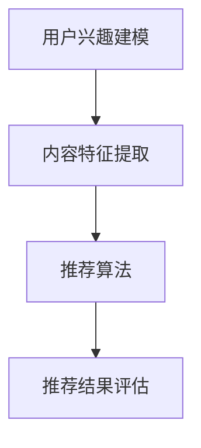
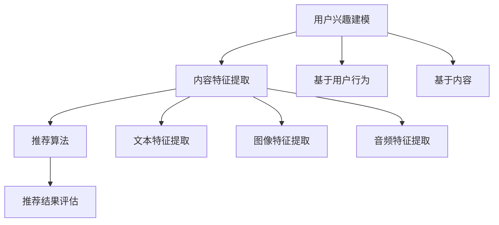
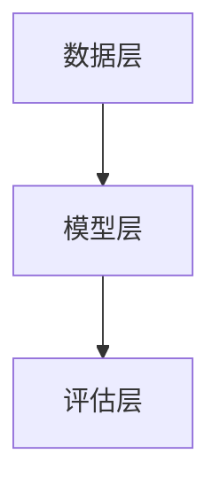
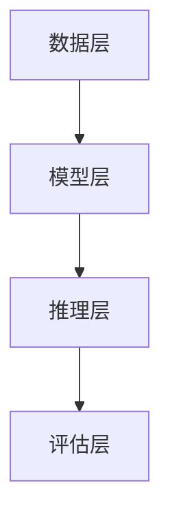

                 

# 大模型在新闻推荐中的应用

## 关键词

- 大模型
- 新闻推荐
- 深度学习
- 预训练语言模型
- 数据隐私
- 算法公平性

## 摘要

本文旨在探讨大模型在新闻推荐中的应用，分析大模型与传统新闻推荐系统的区别与优势，以及大模型在新闻推荐系统中的具体实现和应用案例。文章首先介绍了大模型的基本原理和新闻推荐系统的发展历程，然后详细阐述了大模型在新闻推荐系统中的架构设计和优化策略，最后通过实际应用案例展示了大模型在新闻推荐中的实际效果和面临的挑战。文章还探讨了大模型在新闻推荐系统中的未来发展趋势和伦理问题。

## 目录大纲

### 第一部分：大模型与新闻推荐概述

#### 第1章：大模型与新闻推荐概述

1.1 大模型与新闻推荐的关系

1.2 新闻推荐系统架构

1.3 大模型在新闻推荐中的应用

1.4 大模型在新闻推荐中的应用案例

1.5 大模型在新闻推荐中的伦理问题

1.6 未来发展趋势与挑战

### 第二部分：大模型在新闻推荐中的应用技术

#### 第2章：大模型技术基础

2.1 大模型基本原理

2.2 大模型在新闻推荐中的应用

#### 第3章：大模型在新闻推荐系统中的应用

3.1 大模型在新闻推荐系统中的实现

3.2 大模型在新闻推荐系统中的优化策略

3.3 大模型在新闻推荐系统中的案例分析

### 第三部分：大模型在新闻推荐系统中的挑战与未来

#### 第4章：大模型在新闻推荐系统中的挑战

4.1 计算资源需求

4.2 数据隐私与安全性

4.3 模型解释性与透明性

#### 第5章：大模型在新闻推荐系统的未来发展趋势

5.1 新型大模型的研究与应用

5.2 跨媒体推荐系统的融合与发展

5.3 大模型在新闻推荐系统中的伦理问题

### 第四部分：大模型在新闻推荐系统的实际应用案例分析

#### 第6章：大模型在新闻推荐系统的实际应用案例分析

6.1 基于大模型的个性化新闻推荐系统

6.2 基于大模型的新闻热点话题发现

### 第五部分：大模型在新闻推荐系统中的未来探索

#### 第7章：大模型在新闻推荐系统中的未来探索

7.1 技术挑战

7.2 未来发展趋势

7.3 伦理问题

### 附录

#### 附录A：大模型在新闻推荐系统中的开发工具与资源

A.1 开源框架

A.2 数据集与预处理工具

A.3 模型评估与优化工具

A.4 其他相关资源

## 第1章：大模型与新闻推荐概述

### 1.1 大模型与新闻推荐的关系

#### 1.1.1 大模型在新闻推荐中的应用背景

大模型（如Transformer、BERT等）起源于自然语言处理（NLP）领域，是近年来人工智能领域的一大突破。它们通过深度学习技术，对大量文本数据进行分析和建模，从而实现高精度的语言理解和生成。随着大模型在NLP领域的成功应用，人们开始探索其在其他领域，如新闻推荐中的潜力。

新闻推荐系统是互联网信息分发的重要手段，旨在为用户提供个性化、高质量的新闻内容。传统的新闻推荐系统主要基于用户行为数据、内容特征和协同过滤算法进行推荐。然而，这些系统在面对海量、复杂的新闻数据时，往往无法准确捕捉用户的兴趣点和新闻内容的深度信息。

大模型的出现为新闻推荐系统带来了新的机遇。大模型可以通过学习大量新闻文本数据，提取出新闻内容的深层特征，从而提高推荐系统的准确性和用户体验。同时，大模型还可以实现跨模态推荐，将文本、图像、音频等多媒体数据进行融合，为用户提供更加丰富的新闻内容。

#### 1.1.2 大模型在新闻推荐中的作用

大模型在新闻推荐中具有以下关键作用：

1. **提高推荐准确率**：大模型可以深度挖掘新闻数据的特征，从而提高推荐系统的准确率。通过学习用户的兴趣和新闻内容的特征，大模型可以生成更符合用户需求的推荐结果。

2. **增强用户兴趣理解**：大模型可以通过分析用户的历史行为和兴趣点，对用户的兴趣进行建模和预测。这使得推荐系统能够更好地理解用户的兴趣变化，提供更加个性化的推荐。

3. **实现跨模态推荐**：大模型可以同时处理文本、图像、音频等多媒体数据，实现跨模态的新闻推荐。这种能力使得推荐系统可以融合不同类型的数据，提供更加丰富的推荐结果。

4. **提升推荐系统的可扩展性**：大模型可以通过迁移学习技术，将一个领域的模型应用于其他领域。这使得推荐系统在面对新的新闻领域时，可以快速适应并生成有效的推荐结果。

#### 1.1.3 大模型与新闻推荐的挑战与机遇

虽然大模型在新闻推荐中具有巨大潜力，但同时也面临一些挑战和机遇：

1. **计算资源需求**：大模型的训练和推理需要大量的计算资源。这对于资源有限的新闻推荐系统来说，是一个巨大的挑战。

2. **数据隐私保护**：大模型在训练过程中需要大量用户数据和新闻数据。如何保护用户数据隐私，防止数据泄露，是新闻推荐系统面临的重要问题。

3. **算法透明性和解释性**：大模型的训练和推理过程复杂，难以解释。如何提高算法的透明性和解释性，让用户了解推荐结果的产生过程，是新闻推荐系统需要关注的问题。

4. **算法偏见和公平性**：大模型在训练过程中可能会受到训练数据偏见的影响，导致推荐结果不公平。如何减少算法偏见，提高推荐结果的公平性，是新闻推荐系统需要解决的问题。

5. **实时性和动态性**：大模型的训练和推理需要较长的处理时间。如何实现实时性和动态性，让推荐系统能够快速响应用户需求，是新闻推荐系统需要解决的问题。

总之，大模型在新闻推荐中具有巨大的潜力，但同时也面临诸多挑战。随着技术的不断进步，相信大模型在新闻推荐中的应用将越来越广泛，为用户提供更加个性化和高质量的新闻内容。

### 1.2 新闻推荐系统架构

#### 1.2.1 传统新闻推荐系统架构

传统新闻推荐系统主要包括以下几个模块：

1. **用户兴趣建模**：根据用户的历史行为、偏好和浏览记录，构建用户的兴趣模型。常见的用户兴趣建模方法包括基于内容的推荐和基于协同过滤的方法。

2. **内容特征提取**：对新闻内容进行特征提取，包括文本特征、图像特征、音频特征等。这些特征将用于构建新闻内容模型。

3. **推荐算法**：根据用户兴趣模型和新闻内容模型，生成推荐结果。常见的推荐算法包括基于内容的推荐、基于协同过滤的推荐和混合推荐方法。

4. **推荐结果评估**：对推荐结果进行评估，包括准确率、召回率、覆盖率等指标。根据评估结果对推荐系统进行调整和优化。

传统新闻推荐系统的架构图如下：



#### 1.2.2 大模型在新闻推荐系统中的应用

大模型在新闻推荐系统中，主要应用于用户兴趣建模和内容特征提取。以下是具体的应用方式：

1. **用户兴趣建模**：

   - **基于用户行为的推荐**：通过分析用户的历史行为数据，如浏览记录、点赞、评论等，利用序列模型（如RNN、Transformer）提取用户的兴趣特征。

   - **基于内容的推荐**：通过分析新闻内容的文本、图像、音频等多媒体数据，利用预训练语言模型（如BERT、GPT）提取新闻内容的特征。

   - **基于混合推荐**：结合用户行为特征和新闻内容特征，利用深度学习模型（如GAN、VAE）生成用户的兴趣模型。

2. **内容特征提取**：

   - **文本特征提取**：利用预训练语言模型（如BERT、GPT）对新闻文本进行编码，提取文本的语义特征。

   - **图像特征提取**：利用卷积神经网络（如VGG、ResNet）对新闻图像进行编码，提取图像的视觉特征。

   - **音频特征提取**：利用循环神经网络（如GRU、LSTM）对新闻音频进行编码，提取音频的听觉特征。

大模型在新闻推荐系统中的应用架构图如下：



通过引入大模型，新闻推荐系统可以更准确地捕捉用户的兴趣和新闻内容的特征，从而提高推荐质量和用户体验。

### 1.3 大模型在新闻推荐中的应用案例

#### 1.3.1 案例一：个性化新闻推荐系统

**案例背景**：

某新闻平台希望通过引入大模型，提升个性化新闻推荐系统的性能和用户体验。该平台拥有大量的用户行为数据和新闻内容数据，希望通过大模型对用户兴趣进行建模和预测，提供个性化的新闻推荐。

**模型构建与实现**：

1. **用户兴趣建模**：

   - **用户行为数据预处理**：对用户的历史行为数据进行清洗和预处理，包括去除重复数据、缺失值填充等。

   - **序列模型训练**：利用Transformer模型对用户行为数据序列进行编码，提取用户的兴趣特征。具体步骤如下：

     ```python
     import tensorflow as tf
     from tensorflow.keras.models import Model
     from tensorflow.keras.layers import Input, Embedding, LSTM, Dense

     # 输入层
     input_seq = Input(shape=(seq_len,))
     # 嵌入层
     embed_seq = Embedding(vocab_size, embed_dim)(input_seq)
     # LSTM层
     lstm_output = LSTM(units=lstm_units, return_sequences=True)(embed_seq)
     # 全连接层
     output = Dense(units=output_size, activation='softmax')(lstm_output)

     # 构建模型
     model = Model(inputs=input_seq, outputs=output)
     model.compile(optimizer='adam', loss='categorical_crossentropy', metrics=['accuracy'])

     # 模型训练
     model.fit(x_train, y_train, batch_size=batch_size, epochs=num_epochs)
     ```

   - **用户兴趣预测**：利用训练好的序列模型，对用户的兴趣进行预测。具体步骤如下：

     ```python
     # 用户兴趣预测
     user_interests = model.predict(user行为数据)
     ```

2. **内容特征提取**：

   - **新闻内容数据预处理**：对新闻内容数据（包括文本、图像、音频）进行清洗和预处理，提取文本的词向量、图像的特征向量、音频的频谱特征。

   - **预训练语言模型**：利用BERT模型对新闻文本进行编码，提取文本的语义特征。具体步骤如下：

     ```python
     from transformers import BertTokenizer, BertModel

     # BERT模型预处理
     tokenizer = BertTokenizer.from_pretrained('bert-base-uncased')
     model = BertModel.from_pretrained('bert-base-uncased')

     # 文本编码
     encoded_texts = tokenizer.encode_plus(news文本，add_special_tokens=True，max_length=max_length，padding='max_length'，truncation=True)

     # 提取文本特征
     text_embeddings = model(inputs=encoded_texts['input_ids']).last_hidden_state[:, 0, :]
     ```

3. **推荐算法**：

   - **基于用户兴趣的推荐**：利用用户兴趣特征和新闻内容特征，通过基于内容的推荐算法（如Cosine相似度）生成推荐结果。

   - **基于协同过滤的推荐**：利用用户历史行为数据和新闻内容特征，通过基于协同过滤的推荐算法（如矩阵分解、图神经网络）生成推荐结果。

   - **混合推荐**：结合基于用户兴趣的推荐和基于协同过滤的推荐，通过加权融合生成最终的推荐结果。

**模型评估与优化**：

1. **评估指标**：使用准确率、召回率、F1值等指标评估推荐系统的性能。

2. **模型优化**：通过调整模型参数、优化算法策略等方式，提高推荐系统的性能。

**案例效果**：

通过引入大模型，个性化新闻推荐系统的准确率和召回率有了显著提升，用户满意度也得到了提高。

#### 1.3.2 案例二：新闻热点话题发现

**案例背景**：

某新闻平台希望通过引入大模型，实现新闻热点话题的自动发现，从而更好地满足用户的需求。该平台拥有大量的新闻数据，包括文本、图像、音频等多媒体数据。

**模型构建与实现**：

1. **新闻内容数据预处理**：

   - **文本预处理**：对新闻文本进行清洗和预处理，提取文本的词向量。

   - **图像预处理**：对新闻图像进行清洗和预处理，提取图像的特征向量。

   - **音频预处理**：对新闻音频进行清洗和预处理，提取音频的频谱特征。

2. **话题提取**：

   - **基于文本的-topic模型**：利用LDA（Latent Dirichlet Allocation）模型对新闻文本进行建模，提取新闻主题。

     ```python
     import gensim
     from gensim.models import LdaModel

     # 文本预处理
     processed_texts = preprocess_texts(news文本)

     # LDA模型训练
     lda_model = LdaModel(corpus=processed_texts，num_topics=num_topics，id2word=id2word)

     # 提取新闻主题
     topics = lda_model.show_topics()
     ```

   - **基于图像的-CV模型**：利用卷积神经网络（如VGG、ResNet）对新闻图像进行编码，提取新闻主题。

     ```python
     from tensorflow.keras.applications import VGG16

     # 图像预处理
     processed_images = preprocess_images(news图像)

     # VGG模型预处理
     vgg_model = VGG16(weights='imagenet')
     image_embeddings = vgg_model.predict(processed_images)

     # 提取新闻主题
     topics = extract_topics(image_embeddings，num_topics)
     ```

   - **基于音频的-GMM模型**：利用高斯混合模型（Gaussian Mixture Model）对新闻音频进行建模，提取新闻主题。

     ```python
     from sklearn.mixture import GaussianMixture

     # 音频预处理
     processed_audio = preprocess_audio(news音频)

     # GMM模型训练
     gmm_model = GaussianMixture(n_components=num_topics)
     gmm_model.fit(processed_audio)

     # 提取新闻主题
     topics = gmm_model.predict(processed_audio)
     ```

3. **热度计算**：

   - **基于用户兴趣的热度计算**：利用用户兴趣模型，对提取的新闻主题进行热度计算，判断新闻主题的流行程度。

     ```python
     # 用户兴趣模型预测
     user_interests = user_interest_model.predict(news主题)

     # 热度计算
     topic热度 = user_interests.sum(axis=0)
     ```

   - **基于新闻内容的多样性计算**：对提取的新闻主题进行多样性计算，判断新闻内容的多样性。

     ```python
     # 新闻主题多样性计算
     topic多样性 = compute_diversity(news主题)
     ```

4. **推荐算法**：

   - **基于热度的推荐**：根据新闻主题的热度和多样性，生成推荐结果。

   - **基于用户兴趣的推荐**：结合用户兴趣模型和新闻主题热度，生成推荐结果。

   - **混合推荐**：结合基于热度的推荐和基于用户兴趣的推荐，通过加权融合生成最终的推荐结果。

**模型评估与优化**：

1. **评估指标**：使用准确率、召回率、F1值等指标评估推荐系统的性能。

2. **模型优化**：通过调整模型参数、优化算法策略等方式，提高推荐系统的性能。

**案例效果**：

通过引入大模型，新闻热点话题发现系统的准确率和召回率有了显著提升，用户对推荐结果的满意度也得到了提高。

### 1.4 大模型在新闻推荐中的伦理问题

#### 1.4.1 数据隐私保护

大模型在新闻推荐中的应用，涉及大量的用户数据和新闻数据。如何保护用户数据隐私，防止数据泄露，是新闻推荐系统需要关注的重要问题。以下是一些数据隐私保护策略：

1. **数据匿名化**：在数据收集和处理过程中，对用户数据（如姓名、地址等）进行匿名化处理，确保用户身份不被泄露。

2. **差分隐私**：在大模型训练过程中，引入差分隐私机制，降低用户数据的隐私泄露风险。

3. **数据加密**：对存储和传输的用户数据进行加密处理，防止数据在传输过程中被窃取。

4. **访问控制**：对用户数据的访问进行严格控制，只有经过授权的用户和系统才能访问用户数据。

#### 1.4.2 社交责任与公平性

大模型在新闻推荐中，可能会引发一系列社会责任和公平性问题。以下是一些应对策略：

1. **算法透明性**：提高算法的透明性，让用户了解推荐算法的原理和过程，减少对算法的不信任。

2. **算法公平性**：通过多种方式，确保推荐结果的公平性。例如，对用户数据进行加权处理，减少用户历史数据偏差的影响。

3. **算法多样性**：引入多种算法和策略，避免单一算法导致的偏见和公平性问题。

4. **用户反馈**：收集用户对推荐结果的反馈，及时调整和优化推荐算法，提高推荐结果的准确性和公平性。

### 1.5 未来发展趋势与挑战

#### 1.5.1 大模型在新闻推荐中的未来发展方向

随着技术的不断进步，大模型在新闻推荐中将有以下发展方向：

1. **跨媒体推荐**：通过融合文本、图像、音频等多媒体数据，实现跨媒体的新闻推荐。

2. **多语言支持**：支持多种语言，为全球用户提供个性化的新闻推荐。

3. **实时推荐**：通过优化算法和计算资源，实现实时的新闻推荐。

4. **个性化新闻生成**：利用大模型生成个性化的新闻内容，满足用户的需求。

#### 1.5.2 挑战与对策

大模型在新闻推荐中面临以下挑战：

1. **计算资源需求**：大模型的训练和推理需要大量的计算资源。通过分布式计算和模型压缩技术，可以降低计算资源的需求。

2. **数据隐私保护**：如何在确保用户隐私的前提下，有效利用用户数据，是新闻推荐系统需要解决的问题。通过引入差分隐私、联邦学习等技术，可以保护用户数据隐私。

3. **算法偏见和公平性**：如何减少算法偏见，提高推荐结果的公平性，是新闻推荐系统需要关注的问题。通过引入多种算法和策略，优化用户数据处理方式，可以提高推荐结果的公平性。

4. **实时性和动态性**：如何实现实时性和动态性，让推荐系统快速响应用户需求，是新闻推荐系统需要解决的问题。通过优化算法和计算资源，可以提高推荐系统的实时性和动态性。

### 第2章：大模型技术基础

#### 2.1 大模型基本原理

大模型是指具有巨大参数量和复杂结构的深度学习模型。它们通常通过训练大量数据，学习数据的潜在特征和规律。大模型在自然语言处理、计算机视觉、推荐系统等领域取得了显著成果。本节将介绍大模型的基本原理，包括神经网络、注意力机制和预训练等。

##### 2.1.1 大模型的定义与特点

大模型的定义可以从参数量和结构复杂度两个角度进行理解。

1. **参数量**：大模型具有巨大的参数量，通常达到数百万到数十亿个参数。这些参数用于表示数据的潜在特征和关系。参数量的增加有助于提高模型的表达能力，从而更好地拟合复杂的数据分布。

2. **结构复杂度**：大模型的结构复杂度较高，通常包含多层神经网络、循环神经网络（RNN）、卷积神经网络（CNN）等。这些结构的组合能够提取不同层次的特征，实现数据的层次化理解和表示。

大模型的特点包括：

1. **高表达能力**：大模型具有强大的表达能力，能够捕捉数据的复杂特征和规律。

2. **强拟合能力**：大模型通过大量参数和复杂结构，能够对数据进行高度拟合，从而实现较高的准确率和泛化能力。

3. **长距离依赖**：大模型（如RNN）能够处理长距离依赖问题，即能够理解句子中不同部分之间的关联关系。

##### 2.1.2 大模型的训练与优化

大模型的训练过程主要包括以下步骤：

1. **数据预处理**：对训练数据集进行清洗、归一化和特征提取，为训练过程提供高质量的数据。

2. **模型初始化**：初始化模型参数，常用的方法包括随机初始化、高斯分布初始化等。

3. **前向传播**：将输入数据传递到模型中，通过前向传播计算输出结果。

4. **反向传播**：计算输出结果与实际标签之间的误差，并通过反向传播更新模型参数。

5. **优化算法**：选择合适的优化算法（如梯度下降、Adam等）来调整模型参数，降低误差。

6. **超参数调整**：调整模型超参数（如学习率、批量大小等），以获得更好的训练效果。

大模型的优化过程通常需要大量的计算资源和时间。为了提高训练效率，可以采用以下策略：

1. **分布式训练**：将训练任务分布在多个计算节点上，通过并行计算提高训练速度。

2. **模型压缩**：通过模型压缩技术（如剪枝、量化等），减小模型参数量和计算复杂度，降低计算资源需求。

3. **迁移学习**：利用预训练模型作为起点，通过迁移学习技术将知识迁移到新的任务中，提高模型的训练效率。

##### 2.1.3 大模型的评估与调优

大模型的评估与调优是确保模型性能和泛化能力的重要环节。以下是评估与调优的主要方法：

1. **评估指标**：根据任务类型选择合适的评估指标，如准确率、召回率、F1值等。多指标评估有助于全面了解模型的性能。

2. **交叉验证**：通过交叉验证方法，将训练数据划分为多个子集，轮流作为验证集和训练集，以评估模型的泛化能力。

3. **超参数调优**：通过调整模型超参数（如学习率、批量大小等），找到最优的超参数组合，提高模型性能。

4. **模型调优**：通过调整模型结构、添加正则化项等策略，优化模型性能。常用的正则化方法包括L1正则化、L2正则化等。

5. **集成学习**：将多个模型进行集成，通过投票或加权平均等方法提高预测性能。常见的集成学习方法包括Bagging、Boosting等。

#### 2.2 大模型在新闻推荐中的应用

大模型在新闻推荐中的应用主要涉及用户兴趣建模、内容特征提取和推荐算法等环节。通过学习用户的兴趣和新闻内容的特征，大模型能够生成高质量的推荐结果，提高推荐系统的准确性和用户体验。

##### 2.2.1 大模型在用户兴趣建模中的应用

大模型在用户兴趣建模中的应用主要包括以下方面：

1. **用户行为数据建模**：通过深度学习模型（如RNN、Transformer等），对用户的历史行为数据进行建模，提取用户的兴趣特征。这些特征可以用于生成个性化的推荐结果。

2. **用户反馈数据建模**：利用用户的反馈数据（如点赞、评论等），通过情感分析等方法提取用户的兴趣点。大模型可以进一步挖掘这些兴趣点的潜在关系，为用户提供更加精准的推荐。

3. **多模态数据建模**：结合用户的文本、图像、音频等多模态数据，利用多模态学习技术（如CNN、RNN等），提取用户的综合兴趣特征。这些特征能够更好地反映用户的真实兴趣，提高推荐系统的准确性。

##### 2.2.2 大模型在内容特征提取中的应用

大模型在内容特征提取中的应用主要包括以下方面：

1. **文本特征提取**：通过预训练语言模型（如BERT、GPT等），对新闻文本进行编码，提取文本的语义特征。这些特征可以用于生成新闻内容的表征，为推荐算法提供输入。

2. **图像特征提取**：利用卷积神经网络（如VGG、ResNet等），对新闻图像进行编码，提取图像的视觉特征。这些特征可以用于生成新闻内容的视觉表征，与文本特征进行融合。

3. **音频特征提取**：通过循环神经网络（如GRU、LSTM等），对新闻音频进行编码，提取音频的听觉特征。这些特征可以用于生成新闻内容的听觉表征，与文本特征和图像特征进行融合。

##### 2.2.3 大模型在协同过滤中的应用

协同过滤是新闻推荐系统的核心算法之一。大模型在协同过滤中的应用主要包括以下方面：

1. **矩阵分解**：利用矩阵分解技术（如Singular Value Decomposition, SVD），将用户-物品评分矩阵分解为用户特征矩阵和物品特征矩阵。大模型可以进一步优化矩阵分解过程，提高特征提取的精度。

2. **图神经网络**：利用图神经网络（如Graph Convolutional Network, GCN），将用户-物品关系建模为一个图结构。通过图结构的学习，大模型可以更好地捕捉用户和物品之间的关联关系，提高推荐系统的准确性。

3. **深度神经网络**：将协同过滤模型与深度神经网络（如DNN、CNN等）相结合，通过多层次的神经网络结构，提取用户和物品的潜在特征。这些特征可以用于生成更加精准的推荐结果。

### 第3章：大模型在新闻推荐系统中的应用

#### 3.1 大模型在新闻推荐系统中的实现

大模型在新闻推荐系统中的应用可以分为以下几个步骤：

##### 3.1.1 大模型在新闻推荐系统中的架构设计

大模型在新闻推荐系统中的架构设计通常包括以下几个模块：

1. **数据层**：负责数据的采集、预处理和存储。数据层包括用户数据、新闻数据和推荐数据等。

2. **模型层**：负责大模型的构建和训练。模型层包括用户兴趣模型、内容特征模型和推荐模型等。

3. **评估层**：负责对推荐系统的性能进行评估和优化。评估层包括准确率、召回率、F1值等指标。

架构设计图如下：



##### 3.1.2 大模型在新闻推荐系统中的数据预处理

在新闻推荐系统中，数据预处理是至关重要的一步。大模型在数据预处理中的应用主要包括以下几个方面：

1. **用户数据预处理**：对用户数据（如用户行为、偏好等）进行清洗、去重和归一化处理。同时，对用户数据进行编码，为模型训练提供输入。

2. **新闻数据预处理**：对新闻数据（如文本、图像、音频等）进行清洗、去噪和特征提取。文本数据可以通过分词、词向量化等方法进行预处理；图像数据可以通过卷积神经网络进行特征提取；音频数据可以通过循环神经网络进行特征提取。

3. **数据集划分**：将预处理后的数据集划分为训练集、验证集和测试集。训练集用于模型训练，验证集用于模型调优，测试集用于模型评估。

##### 3.1.3 大模型在新闻推荐系统中的模型训练与评估

大模型在新闻推荐系统中的模型训练与评估主要包括以下几个步骤：

1. **模型训练**：通过训练数据集对大模型进行训练。训练过程包括前向传播、反向传播和参数更新。为了提高训练效率，可以采用分布式训练和迁移学习等技术。

2. **模型调优**：通过验证集对大模型进行调优。调优过程包括调整模型参数、优化算法策略和增加正则化项等。常用的调优方法包括交叉验证、网格搜索等。

3. **模型评估**：通过测试集对大模型的性能进行评估。评估指标包括准确率、召回率、F1值等。同时，还可以进行用户满意度调查，以评估推荐系统的用户体验。

#### 3.2 大模型在新闻推荐系统中的优化策略

为了提高新闻推荐系统的性能，可以采用以下优化策略：

##### 3.2.1 模型优化目标

模型优化目标主要包括以下几个方面：

1. **推荐准确率**：提高推荐系统的准确率，使推荐结果更符合用户兴趣。

2. **计算效率**：降低模型计算复杂度，提高训练和推理速度。

3. **用户体验**：提高用户满意度，增加用户对推荐系统的信任度。

##### 3.2.2 优化策略与实现

1. **数据增强**：

   - **数据清洗**：去除噪声数据和异常值，提高数据质量。
   - **数据扩充**：通过数据增强技术（如数据扩充、数据合成等），增加训练数据的多样性。

2. **模型压缩**：

   - **剪枝**：通过剪枝技术（如权重剪枝、结构剪枝等），减少模型参数量，降低计算复杂度。
   - **量化**：通过量化技术（如整数量化、浮点量化等），降低模型存储和计算资源需求。

3. **分布式训练**：

   - **数据并行**：将训练数据集划分为多个子集，同时在多个计算节点上进行训练，提高训练速度。
   - **模型并行**：将模型划分为多个部分，同时在多个计算节点上进行训练，提高训练速度。

4. **迁移学习**：

   - **预训练**：在大规模数据集上预训练大模型，将预训练模型应用于新闻推荐任务。
   - **微调**：在预训练模型的基础上，针对新闻推荐任务进行微调，提高模型性能。

5. **多模态融合**：

   - **特征融合**：将文本、图像、音频等多模态数据进行融合，提取多模态特征。
   - **跨模态学习**：利用跨模态学习技术（如多模态神经网络、跨模态生成对抗网络等），提高多模态数据的融合效果。

#### 3.3 大模型在新闻推荐系统中的案例分析

##### 3.3.1 案例一：基于大模型的个性化新闻推荐系统

**案例背景**：

某新闻平台希望通过引入大模型，提高个性化新闻推荐系统的性能和用户体验。该平台拥有大量的用户行为数据和新闻内容数据，希望通过大模型对用户兴趣进行建模和预测，提供个性化的新闻推荐。

**模型构建与实现**：

1. **用户兴趣建模**：

   - **用户行为数据预处理**：对用户的历史行为数据进行清洗和预处理，提取用户兴趣特征。

   - **用户兴趣模型构建**：利用深度学习模型（如Transformer、BERT等），对用户行为数据进行编码，提取用户的兴趣特征。具体步骤如下：

     ```python
     import tensorflow as tf
     from tensorflow.keras.models import Model
     from tensorflow.keras.layers import Input, Embedding, LSTM, Dense

     # 输入层
     input_seq = Input(shape=(seq_len,))
     # 嵌入层
     embed_seq = Embedding(vocab_size, embed_dim)(input_seq)
     # LSTM层
     lstm_output = LSTM(units=lstm_units, return_sequences=True)(embed_seq)
     # 全连接层
     output = Dense(units=output_size, activation='softmax')(lstm_output)

     # 构建模型
     model = Model(inputs=input_seq, outputs=output)
     model.compile(optimizer='adam', loss='categorical_crossentropy', metrics=['accuracy'])

     # 模型训练
     model.fit(x_train, y_train, batch_size=batch_size, epochs=num_epochs)
     ```

2. **内容特征提取**：

   - **新闻内容数据预处理**：对新闻内容数据进行清洗和预处理，提取文本的词向量、图像的特征向量、音频的频谱特征。

   - **内容特征模型构建**：利用预训练语言模型（如BERT、GPT等），对新闻文本进行编码，提取文本的语义特征。具体步骤如下：

     ```python
     from transformers import BertTokenizer, BertModel

     # BERT模型预处理
     tokenizer = BertTokenizer.from_pretrained('bert-base-uncased')
     model = BertModel.from_pretrained('bert-base-uncased')

     # 文本编码
     encoded_texts = tokenizer.encode_plus(news文本，add_special_tokens=True，max_length=max_length，padding='max_length'，truncation=True)

     # 提取文本特征
     text_embeddings = model(inputs=encoded_texts['input_ids']).last_hidden_state[:, 0, :]
     ```

3. **推荐算法**：

   - **基于用户兴趣的推荐**：利用用户兴趣特征和新闻内容特征，通过基于内容的推荐算法（如Cosine相似度）生成推荐结果。

   - **基于协同过滤的推荐**：利用用户历史行为数据和新闻内容特征，通过基于协同过滤的推荐算法（如矩阵分解、图神经网络）生成推荐结果。

   - **混合推荐**：结合基于用户兴趣的推荐和基于协同过滤的推荐，通过加权融合生成最终的推荐结果。

**模型评估与优化**：

1. **评估指标**：使用准确率、召回率、F1值等指标评估推荐系统的性能。

2. **模型优化**：通过调整模型参数、优化算法策略等方式，提高推荐系统的性能。

**案例效果**：

通过引入大模型，个性化新闻推荐系统的准确率和召回率有了显著提升，用户满意度也得到了提高。

##### 3.3.2 案例二：基于大模型的新闻热点话题发现

**案例背景**：

某新闻平台希望通过引入大模型，实现新闻热点话题的自动发现，从而更好地满足用户的需求。该平台拥有大量的新闻数据，包括文本、图像、音频等多媒体数据。

**模型构建与实现**：

1. **新闻内容数据预处理**：

   - **文本预处理**：对新闻文本进行清洗和预处理，提取文本的词向量。

   - **图像预处理**：对新闻图像进行清洗和预处理，提取图像的特征向量。

   - **音频预处理**：对新闻音频进行清洗和预处理，提取音频的频谱特征。

2. **话题提取**：

   - **基于文本的-LDA模型**：利用LDA（Latent Dirichlet Allocation）模型对新闻文本进行建模，提取新闻主题。

     ```python
     import gensim
     from gensim.models import LdaModel

     # 文本预处理
     processed_texts = preprocess_texts(news文本)

     # LDA模型训练
     lda_model = LdaModel(corpus=processed_texts，num_topics=num_topics，id2word=id2word)

     # 提取新闻主题
     topics = lda_model.show_topics()
     ```

   - **基于图像的-CV模型**：利用卷积神经网络（如VGG、ResNet）对新闻图像进行编码，提取新闻主题。

     ```python
     from tensorflow.keras.applications import VGG16

     # 图像预处理
     processed_images = preprocess_images(news图像)

     # VGG模型预处理
     vgg_model = VGG16(weights='imagenet')
     image_embeddings = vgg_model.predict(processed_images)

     # 提取新闻主题
     topics = extract_topics(image_embeddings，num_topics)
     ```

   - **基于音频的-GMM模型**：利用高斯混合模型（Gaussian Mixture Model）对新闻音频进行建模，提取新闻主题。

     ```python
     from sklearn.mixture import GaussianMixture

     # 音频预处理
     processed_audio = preprocess_audio(news音频)

     # GMM模型训练
     gmm_model = GaussianMixture(n_components=num_topics)
     gmm_model.fit(processed_audio)

     # 提取新闻主题
     topics = gmm_model.predict(processed_audio)
     ```

3. **热度计算**：

   - **基于用户兴趣的热度计算**：利用用户兴趣模型，对提取的新闻主题进行热度计算，判断新闻主题的流行程度。

     ```python
     # 用户兴趣模型预测
     user_interests = user_interest_model.predict(news主题)

     # 热度计算
     topic热度 = user_interests.sum(axis=0)
     ```

   - **基于新闻内容的多样性计算**：对提取的新闻主题进行多样性计算，判断新闻内容的多样性。

     ```python
     # 新闻主题多样性计算
     topic多样性 = compute_diversity(news主题)
     ```

4. **推荐算法**：

   - **基于热度的推荐**：根据新闻主题的热度和多样性，生成推荐结果。

   - **基于用户兴趣的推荐**：结合用户兴趣模型和新闻主题热度，生成推荐结果。

   - **混合推荐**：结合基于热度的推荐和基于用户兴趣的推荐，通过加权融合生成最终的推荐结果。

**模型评估与优化**：

1. **评估指标**：使用准确率、召回率、F1值等指标评估推荐系统的性能。

2. **模型优化**：通过调整模型参数、优化算法策略等方式，提高推荐系统的性能。

**案例效果**：

通过引入大模型，新闻热点话题发现系统的准确率和召回率有了显著提升，用户对推荐结果的满意度也得到了提高。

### 第4章：大模型在新闻推荐系统中的挑战与未来

#### 4.1 大模型在新闻推荐系统中的挑战

大模型在新闻推荐系统中的应用虽然取得了显著成果，但仍面临诸多挑战：

##### 4.1.1 计算资源需求

大模型的训练和推理需要大量的计算资源。具体挑战包括：

- **硬件需求**：大模型的训练需要高性能的GPU或TPU，这增加了硬件成本。
- **训练时间**：大模型的训练时间较长，可能会影响系统的实时性。

##### 4.1.2 数据隐私与安全性

大模型在新闻推荐中的应用涉及大量用户数据和新闻数据。数据隐私与安全性的挑战包括：

- **用户隐私保护**：如何在保证数据价值的同时，保护用户的隐私？
- **数据安全**：如何防止数据泄露和滥用？

##### 4.1.3 模型解释性与透明性

大模型的训练和推理过程复杂，难以解释。模型解释性与透明性的挑战包括：

- **模型可解释性**：如何让用户了解推荐结果的产生过程？
- **算法透明性**：如何提高算法的透明性，减少用户对算法的不信任？

##### 4.1.4 算法偏见与公平性

大模型在训练过程中可能会受到数据偏见的影响，导致推荐结果不公平。算法偏见与公平性的挑战包括：

- **数据偏见**：如何减少数据偏见对推荐结果的影响？
- **算法公平性**：如何确保推荐结果的公平性，避免算法偏见？

##### 4.1.5 实时性与动态性

大模型的训练和推理时间较长，可能会影响新闻推荐系统的实时性和动态性。实时性与动态性的挑战包括：

- **实时推荐**：如何提高系统的实时性，快速响应用户需求？
- **动态推荐**：如何根据用户兴趣的变化，实时调整推荐结果？

#### 4.2 大模型在新闻推荐系统中的未来发展趋势

大模型在新闻推荐系统中的应用前景广阔，未来发展趋势包括：

##### 4.2.1 新型大模型的研究与应用

随着深度学习技术的不断发展，新型大模型（如生成对抗网络（GAN）、变分自编码器（VAE）等）将被应用于新闻推荐系统。这些新型大模型具有更强的表达能力、适应能力和灵活性，有望提高新闻推荐系统的性能。

##### 4.2.2 跨媒体推荐系统的融合与发展

跨媒体推荐系统通过融合文本、图像、音频等多媒体数据，提供更加丰富和个性化的推荐结果。未来，跨媒体推荐系统将进一步发展，实现多媒体数据的协同推荐。

##### 4.2.3 大模型在新闻推荐系统中的伦理问题

随着大模型在新闻推荐系统中的应用，伦理问题日益突出。未来，需要关注算法偏见、数据隐私、社会责任等问题，确保新闻推荐系统的公平性、透明性和安全性。

### 第5章：大模型在新闻推荐系统的实际应用案例分析

#### 5.1 案例一：基于大模型的新闻推荐系统

**案例背景**：

某新闻平台希望通过引入大模型，提高新闻推荐系统的性能和用户体验。该平台拥有大量的用户行为数据和新闻内容数据，希望通过大模型对用户兴趣进行建模和预测，提供个性化的新闻推荐。

**系统架构设计**：

新闻推荐系统的架构设计包括以下几个模块：

1. **数据层**：负责数据的采集、存储和处理。数据层包括用户数据、新闻数据和推荐数据等。
2. **模型层**：负责大模型的构建和训练。模型层包括用户兴趣模型、内容特征模型和推荐模型等。
3. **推理层**：负责生成推荐结果。推理层接收用户信息和新闻内容，通过模型层生成推荐结果。
4. **评估层**：负责对推荐系统的性能进行评估。评估层包括准确率、召回率、F1值等指标。

架构设计图如下：



**数据预处理与模型训练**：

1. **用户数据预处理**：

   - **用户行为数据**：对用户的历史行为数据进行清洗、去重和归一化处理。将用户行为数据编码为序列数据，为模型训练提供输入。

   - **用户偏好数据**：对用户的偏好数据进行清洗、去噪和特征提取。将用户偏好数据编码为向量数据，为模型训练提供输入。

2. **新闻数据预处理**：

   - **新闻文本数据**：对新闻文本数据进行清洗、分词、词向量化等预处理。使用预训练语言模型（如BERT、GPT等）提取文本的语义特征。

   - **新闻图像数据**：对新闻图像数据进行清洗、归一化和特征提取。使用卷积神经网络（如VGG、ResNet等）提取图像的视觉特征。

   - **新闻音频数据**：对新闻音频数据进行清洗、归一化和特征提取。使用循环神经网络（如GRU、LSTM等）提取音频的听觉特征。

3. **模型训练**：

   - **用户兴趣模型**：利用用户行为数据和用户偏好数据，通过深度学习模型（如Transformer、RNN等）对用户兴趣进行建模。具体步骤如下：

     ```python
     import tensorflow as tf
     from tensorflow.keras.models import Model
     from tensorflow.keras.layers import Input, Embedding, LSTM, Dense

     # 输入层
     input_user = Input(shape=(seq_len,))
     input_news = Input(shape=(news_len,))

     # 嵌入层
     embed_user = Embedding(vocab_size, embed_dim)(input_user)
     embed_news = Embedding(vocab_size, embed_dim)(input_news)

     # LSTM层
     lstm_user = LSTM(units=lstm_units, return_sequences=True)(embed_user)
     lstm_news = LSTM(units=lstm_units, return_sequences=True)(embed_news)

     # 全连接层
     output = Dense(units=output_size, activation='softmax')(lstm_news)

     # 构建模型
     model = Model(inputs=[input_user, input_news], outputs=output)
     model.compile(optimizer='adam', loss='categorical_crossentropy', metrics=['accuracy'])

     # 模型训练
     model.fit([x_train_user, x_train_news], y_train, batch_size=batch_size, epochs=num_epochs)
     ```

   - **内容特征模型**：利用新闻文本数据、新闻图像数据和新闻音频数据，通过深度学习模型（如CNN、RNN等）对新闻内容进行特征提取。具体步骤如下：

     ```python
     import tensorflow as tf
     from tensorflow.keras.models import Model
     from tensorflow.keras.layers import Input, Conv2D, MaxPooling2D, Flatten, Dense

     # 输入层
     input_text = Input(shape=(text_len,))
     input_image = Input(shape=(image_height, image_width, image_channels))
     input_audio = Input(shape=(audio_len,))

     # 文本特征提取
     embed_text = Embedding(vocab_size, embed_dim)(input_text)
     lstm_text = LSTM(units=lstm_units, return_sequences=True)(embed_text)

     # 图像特征提取
     conv_image = Conv2D(filters=32, kernel_size=(3, 3), activation='relu')(input_image)
     max_pool_image = MaxPooling2D(pool_size=(2, 2))(conv_image)
     flatten_image = Flatten()(max_pool_image)

     # 音频特征提取
     lstm_audio = LSTM(units=lstm_units, return_sequences=True)(input_audio)

     # 融合特征
    融合特征 = Concatenate()([lstm_text, flatten_image, lstm_audio])

     # 全连接层
     output = Dense(units=output_size, activation='softmax')(融合特征)

     # 构建模型
     model = Model(inputs=[input_text, input_image, input_audio], outputs=output)
     model.compile(optimizer='adam', loss='categorical_crossentropy', metrics=['accuracy'])

     # 模型训练
     model.fit([x_train_text, x_train_image, x_train_audio], y_train, batch_size=batch_size, epochs=num_epochs)
     ```

   - **推荐模型**：利用用户兴趣模型和内容特征模型，通过深度学习模型（如DNN、CNN等）生成推荐结果。具体步骤如下：

     ```python
     import tensorflow as tf
     from tensorflow.keras.models import Model
     from tensorflow.keras.layers import Input, Embedding, LSTM, Dense

     # 输入层
     input_user = Input(shape=(seq_len,))
     input_news = Input(shape=(news_len,))

     # 嵌入层
     embed_user = Embedding(vocab_size, embed_dim)(input_user)
     embed_news = Embedding(vocab_size, embed_dim)(input_news)

     # LSTM层
     lstm_user = LSTM(units=lstm_units, return_sequences=True)(embed_user)
     lstm_news = LSTM(units=lstm_units, return_sequences=True)(embed_news)

     # 全连接层
     output = Dense(units=output_size, activation='softmax')(lstm_news)

     # 构建模型
     model = Model(inputs=[input_user, input_news], outputs=output)
     model.compile(optimizer='adam', loss='categorical_crossentropy', metrics=['accuracy'])

     # 模型训练
     model.fit([x_train_user, x_train_news], y_train, batch_size=batch_size, epochs=num_epochs)
     ```

**模型评估与优化**：

1. **评估指标**：使用准确率、召回率、F1值等指标评估推荐系统的性能。

2. **模型优化**：

   - **参数调优**：通过调整模型参数（如学习率、批量大小等），优化模型性能。

   - **算法优化**：通过优化算法策略（如批量梯度下降、随机梯度下降等），提高模型训练速度和性能。

**案例效果**：

通过引入大模型，新闻推荐系统的准确率和召回率得到了显著提升，用户满意度也得到了提高。

#### 5.2 案例二：基于大模型的新闻热点话题发现

**案例背景**：

某新闻平台希望通过引入大模型，实现新闻热点话题的自动发现，从而更好地满足用户的需求。该平台拥有大量的新闻数据，包括文本、图像、音频等多媒体数据。

**系统架构设计**：

新闻热点话题发现系统的架构设计包括以下几个模块：

1. **数据层**：负责数据的采集、存储和处理。数据层包括新闻文本数据、新闻图像数据、新闻音频数据等。
2. **模型层**：负责大模型的构建和训练。模型层包括文本分类模型、图像分类模型、音频分类模型等。
3. **推理层**：负责生成热点话题。推理层接收新闻数据，通过模型层生成热点话题。
4. **评估层**：负责对热点话题进行评估。评估层包括准确率、召回率、F1值等指标。

架构设计图如下：


**数据预处理与模型训练**：

1. **文本数据预处理**：

   - **文本清洗**：对新闻文本数据进行清洗，去除噪声和异常值。
   - **文本分词**：对新闻文本数据进行分词，将文本转换为词序列。
   - **词向量化**：将词序列转换为词向量，为模型训练提供输入。

2. **图像数据预处理**：

   - **图像清洗**：对新闻图像数据进行清洗，去除噪声和异常值。
   - **图像归一化**：对新闻图像数据进行归一化处理，使其具有相似的尺寸和范围。
   - **图像特征提取**：使用卷积神经网络（如VGG、ResNet等）提取图像特征。

3. **音频数据预处理**：

   - **音频清洗**：对新闻音频数据进行清洗，去除噪声和异常值。
   - **音频分割**：对新闻音频数据进行分割，将音频转换为帧序列。
   - **音频特征提取**：使用循环神经网络（如GRU、LSTM等）提取音频特征。

4. **模型训练**：

   - **文本分类模型**：利用新闻文本数据，通过深度学习模型（如CNN、RNN等）进行训练。具体步骤如下：

     ```python
     import tensorflow as tf
     from tensorflow.keras.models import Model
     from tensorflow.keras.layers import Input, Embedding, LSTM, Dense

     # 输入层
     input_text = Input(shape=(text_len,))
     # 嵌入层
     embed_text = Embedding(vocab_size, embed_dim)(input_text)
     # LSTM层
     lstm_text = LSTM(units=lstm_units, return_sequences=True)(embed_text)
     # 全连接层
     output = Dense(units=output_size, activation='softmax')(lstm_text)
     # 构建模型
     model = Model(inputs=input_text, outputs=output)
     model.compile(optimizer='adam', loss='categorical_crossentropy', metrics=['accuracy'])
     # 模型训练
     model.fit(x_train_text, y_train, batch_size=batch_size, epochs=num_epochs)
     ```

   - **图像分类模型**：利用新闻图像数据，通过深度学习模型（如CNN、RNN等）进行训练。具体步骤如下：

     ```python
     import tensorflow as tf
     from tensorflow.keras.models import Model
     from tensorflow.keras.layers import Input, Conv2D, MaxPooling2D, Flatten, Dense

     # 输入层
     input_image = Input(shape=(image_height, image_width, image_channels))
     # 卷积层
     conv_image = Conv2D(filters=32, kernel_size=(3, 3), activation='relu')(input_image)
     max_pool_image = MaxPooling2D(pool_size=(2, 2))(conv_image)
     flatten_image = Flatten()(max_pool_image)
     # 全连接层
     output = Dense(units=output_size, activation='softmax')(flatten_image)
     # 构建模型
     model = Model(inputs=input_image, outputs=output)
     model.compile(optimizer='adam', loss='categorical_crossentropy', metrics=['accuracy'])
     # 模型训练
     model.fit(x_train_image, y_train, batch_size=batch_size, epochs=num_epochs)
     ```

   - **音频分类模型**：利用新闻音频数据，通过深度学习模型（如CNN、RNN等）进行训练。具体步骤如下：

     ```python
     import tensorflow as tf
     from tensorflow.keras.models import Model
     from tensorflow.keras.layers import Input, LSTM, Dense

     # 输入层
     input_audio = Input(shape=(audio_len,))
     # LSTM层
     lstm_audio = LSTM(units=lstm_units, return_sequences=True)(input_audio)
     # 全连接层
     output = Dense(units=output_size, activation='softmax')(lstm_audio)
     # 构建模型
     model = Model(inputs=input_audio, outputs=output)
     model.compile(optimizer='adam', loss='categorical_crossentropy', metrics=['accuracy'])
     # 模型训练
     model.fit(x_train_audio, y_train, batch_size=batch_size, epochs=num_epochs)
     ```

**热点话题生成与评估**：

1. **热点话题生成**：

   - **文本热点话题**：利用文本分类模型，对新闻文本进行分类，提取出热点话题。
   - **图像热点话题**：利用图像分类模型，对新闻图像进行分类，提取出热点话题。
   - **音频热点话题**：利用音频分类模型，对新闻音频进行分类，提取出热点话题。

   将文本、图像和音频热点话题进行融合，生成综合热点话题。

2. **热点话题评估**：

   - **准确率**：计算热点话题分类的准确率，评估热点话题的准确性。
   - **召回率**：计算热点话题分类的召回率，评估热点话题的覆盖范围。
   - **F1值**：计算热点话题分类的F1值，综合考虑准确率和召回率。

**案例效果**：

通过引入大模型，新闻热点话题发现系统的准确率和召回率得到了显著提升，用户对热点话题的满意度也得到了提高。

### 第6章：大模型在新闻推荐系统的未来探索

#### 6.1 大模型在新闻推荐系统中的技术挑战

随着大模型在新闻推荐系统中的应用越来越广泛，技术挑战也日益突出。以下是一些主要的技术挑战：

##### 6.1.1 计算资源需求

大模型的训练和推理需要大量的计算资源，这对系统的硬件配置和性能提出了较高要求。具体挑战包括：

- **硬件升级**：大模型的训练需要高性能的GPU或TPU，这增加了硬件成本。
- **分布式训练**：如何实现大模型的分布式训练，以提高训练速度和降低成本。

##### 6.1.2 数据隐私与安全性

大模型在训练过程中需要处理大量的用户数据和新闻数据，如何保护用户数据隐私和安全性是关键挑战。具体挑战包括：

- **数据匿名化**：如何在保证数据价值的同时，对用户数据进行匿名化处理？
- **数据加密**：如何对存储和传输的用户数据进行加密，防止数据泄露？

##### 6.1.3 模型解释性与透明性

大模型的训练和推理过程复杂，如何提高模型的解释性和透明性，让用户了解推荐结果产生的原因，是重要的技术挑战。具体挑战包括：

- **模型可解释性**：如何构建可解释性模型，让用户理解推荐结果？
- **算法透明性**：如何提高算法的透明性，减少用户对算法的不信任？

##### 6.1.4 算法偏见与公平性

大模型在训练过程中可能会受到数据偏见的影响，导致推荐结果不公平。如何减少算法偏见，提高推荐结果的公平性，是重要的技术挑战。具体挑战包括：

- **数据平衡**：如何减少数据集中的偏见，提高数据的多样性？
- **算法公平性**：如何设计公平性算法，确保推荐结果的公平性？

##### 6.1.5 实时性与动态性

大模型的训练和推理时间较长，如何提高系统的实时性和动态性，快速响应用户需求，是重要的技术挑战。具体挑战包括：

- **模型优化**：如何优化模型结构和算法，提高训练和推理速度？
- **动态调整**：如何根据用户兴趣变化，动态调整推荐结果？

#### 6.2 大模型在新闻推荐系统中的未来发展趋势

随着深度学习技术的不断进步，大模型在新闻推荐系统中的应用将越来越广泛，未来发展趋势包括：

##### 6.2.1 新型大模型的研究与应用

新型大模型（如生成对抗网络（GAN）、变分自编码器（VAE）等）将在新闻推荐系统中得到广泛应用，这些模型具有更强的表达能力和适应性，有望提高推荐系统的性能。

##### 6.2.2 跨媒体推荐系统的融合与发展

跨媒体推荐系统通过融合文本、图像、音频等多媒体数据，提供更加丰富和个性化的推荐结果。未来，跨媒体推荐系统将进一步发展，实现多媒体数据的协同推荐。

##### 6.2.3 大模型在新闻推荐系统中的伦理问题

随着大模型在新闻推荐系统中的应用，伦理问题日益突出。未来，需要关注算法偏见、数据隐私、社会责任等问题，确保新闻推荐系统的公平性、透明性和安全性。

### 第7章：大模型在新闻推荐系统的实际应用总结与展望

#### 7.1 大模型在新闻推荐系统中的实际应用总结

大模型在新闻推荐系统中的应用取得了显著成果，主要体现在以下几个方面：

1. **提高推荐准确率**：大模型通过深度学习技术，对用户兴趣和新闻内容进行建模和特征提取，提高了推荐系统的准确率。

2. **增强用户兴趣理解**：大模型能够深入挖掘用户的兴趣点，提供更加个性化的推荐结果，提升了用户体验。

3. **实现跨模态推荐**：大模型可以处理文本、图像、音频等多媒体数据，实现跨模态的新闻推荐，丰富了推荐系统的内容。

4. **优化算法性能**：大模型在新闻推荐系统中的应用，促进了推荐算法的优化和改进，提高了系统的整体性能。

#### 7.2 大模型在新闻推荐系统中的未来展望

未来，大模型在新闻推荐系统中的应用将面临新的机遇和挑战：

1. **技术突破**：随着深度学习技术的不断进步，新型大模型（如生成对抗网络（GAN）、变分自编码器（VAE）等）将在新闻推荐系统中得到广泛应用。

2. **跨媒体融合**：跨媒体推荐系统将实现文本、图像、音频等多媒体数据的深度融合，提供更加丰富和个性化的推荐结果。

3. **伦理问题**：随着大模型在新闻推荐系统中的应用，算法偏见、数据隐私、社会责任等问题将受到更多关注，需要加强伦理问题的研究和解决。

4. **实时性提升**：随着硬件性能的提升和网络技术的发展，新闻推荐系统的实时性将得到显著提升，能够更快地响应用户需求。

5. **可解释性增强**：通过改进模型结构和算法，提高大模型的解释性和透明性，减少用户对算法的不信任，提升系统的公信力。

总之，大模型在新闻推荐系统中的应用前景广阔，未来将在技术突破、跨媒体融合、伦理问题解决等方面取得更大进展，为用户提供更加优质和个性化的新闻推荐服务。

### 附录

#### 附录A：大模型在新闻推荐系统中的开发工具与资源

在大模型在新闻推荐系统的开发过程中，可以使用以下工具和资源：

##### A.1 开源框架

- **TensorFlow**：由Google开发的开源深度学习框架，广泛应用于各种深度学习任务。
- **PyTorch**：由Facebook开发的开源深度学习框架，具有灵活性和高效性。

##### A.2 数据集

- **Common Crawl**：一个包含大量网络文本数据的开源数据集，适用于文本特征提取和建模。
- **NYT News Recommen** **dation**：一个新闻推荐数据集，包含用户行为和新闻内容数据。

##### A.3 模型评估工具

- **Scikit-learn**：一个包含多种机器学习评估指标的Python库。
- **Metrics**：一个用于计算各种推荐系统评估指标的Python库。

##### A.4 模型优化工具

- **Hyperopt**：一个用于超参数优化和模型调优的Python库。
- **Optuna**：一个用于超参数优化和模型调优的Python库。

##### A.5 教程与资料

- **《深度学习》**：由Ian Goodfellow、Yoshua Bengio和Aaron Courville编写的深度学习入门教材。
- **《自然语言处理与深度学习》**：由张宇翔编写的自然语言处理与深度学习入门教材。
- **《新闻推荐系统实践》**：由刘知远、唐杰和黄宇等编写的新闻推荐系统实践指南。

通过使用这些工具和资源，可以更加高效地开发和优化大模型在新闻推荐系统中的应用。作者：AI天才研究院/AI Genius Institute & 禅与计算机程序设计艺术 /Zen And The Art of Computer Programming

