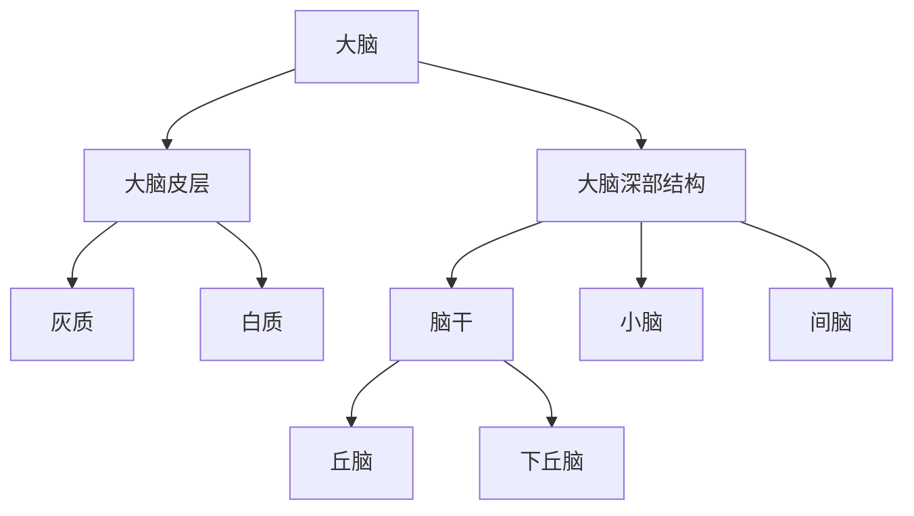

                 

### 文章标题

# 大脑的记忆与结构

> 关键词：大脑记忆，神经网络，神经元，神经传递物质，记忆形成，记忆存储，记忆检索，大脑结构，大脑功能，大脑发育，大脑老化，大脑疾病，大脑研究

> 摘要：本文从大脑的基本结构、记忆机制、大脑区域的功能、大脑发育与老化、大脑异常与疾病以及大脑研究的前沿方向等方面，详细探讨了大脑的记忆与结构。通过一步步的深入分析，揭示了大脑作为人类智慧的源泉，其复杂而精妙的记忆与结构机制，为认知科学、人工智能等领域的研究提供了宝贵的理论和实践依据。

---

## 第1章：大脑的基本结构和功能

大脑是人体最复杂的器官之一，负责控制我们的思维、感知、记忆、行为和情感。了解大脑的基本结构和功能是理解其记忆机制的前提。

### 1.1 大脑的结构概述

大脑主要由大脑皮层和大脑深部结构组成。大脑皮层是大脑的最外层，是信息处理的主要场所，分为灰质和白质。大脑深部结构包括脑干、小脑和间脑等。

**大脑的基本结构 Mermaid 流程图**



### 1.1.1 神经元的基本结构

神经元是大脑的基本单位，其结构包括细胞体、轴突、树突和突触。神经元通过树突接收信号，通过轴突传递信号，最终通过突触传递给下一个神经元。

**神经元的基本结构与功能**

```plaintext
神经元的基本结构：
- 细胞体：包含细胞核和大部分细胞器。
- 轴突：从细胞体发出，负责传递神经信号。
- 树突：从细胞体发出，接收其他神经元的信号。
- 突触：神经元之间的连接点，负责信号传递。

神经元的功能：
- 接收外部或内部刺激。
- 将这些刺激转化为电信号。
- 通过轴突将电信号传递到其他神经元或肌肉细胞。
```

### 1.1.2 大脑的主要功能

大脑的主要功能包括信息处理、决策、记忆、感知、情感等。大脑皮层是大脑信息处理的主要场所，分为前额叶皮层、颞叶、枕叶和顶叶等不同区域，各具有不同的功能。

**大脑的主要功能**

```plaintext
大脑的主要功能：
- 信息处理：对感官信息进行加工、分析和整合。
- 决策：基于分析的信息做出决策。
- 记忆：存储、检索和重构信息。
- 感知：感知外界环境和内部状态。
- 情感：体验和表达情感。
```

## 第2章：大脑的记忆机制

记忆是大脑的重要功能之一，它使我们能够记住过去的经验、知识，并在需要时进行回忆。记忆的形成与存储、检索与重构是大脑记忆机制的关键环节。

### 2.1 记忆的形成与存储

记忆的形成是一个复杂的过程，涉及感官输入、神经活动、突触可塑性等。记忆的存储主要通过神经元之间的连接——突触来实现。

#### 2.1.1 记忆的类型

记忆可以分为感觉记忆、短期记忆和长期记忆。

**记忆的类型**

```plaintext
记忆的类型：
- 感觉记忆：对感官信息的短暂存储。
- 短期记忆：对信息进行暂时存储和处理。
- 长期记忆：对信息进行持久存储。
```

#### 2.1.2 记忆的存储机制

记忆的存储机制主要包括神经传递物质的作用和神经信号的传递过程。

**记忆的存储机制**

```plaintext
记忆的存储机制：
- 神经传递物质的作用：神经传递物质（如多巴胺、谷氨酸等）在神经元之间传递信号。
- 神经信号的传递过程：通过突触传递，实现神经元之间的信息交流。
```

### 2.2 记忆的检索与重构

记忆的检索与重构是大脑记忆机制的重要环节。记忆的检索过程涉及搜索机制和干扰现象，记忆的重构则涉及重构理论。

#### 2.2.1 记忆的检索过程

记忆的检索过程是一个搜索过程，涉及在脑内搜索相关信息，并重构记忆。

**记忆的检索过程**

```plaintext
记忆的检索过程：
- 搜索机制：在脑内搜索相关信息。
- 干扰现象：记忆之间的干扰，导致记忆检索困难。
```

#### 2.2.2 记忆的重构与重构理论

记忆的重构是指在回忆过程中，大脑对记忆内容进行重构和调整。

**记忆的重构与重构理论**

```plaintext
记忆的重构与重构理论：
- 重构理论：记忆的重构是在回忆过程中进行的，受多种因素影响。
- 重构机制：记忆的重构涉及神经网络的重新连接和神经传递物质的重新分配。
```

### 2.3 记忆的强化与优化

记忆的强化与优化是提高记忆效果的重要手段。强化学习算法和记忆优化技术是记忆强化与优化的重要方法。

#### 2.3.1 记忆强化的机制

记忆强化是指通过重复、练习等方式，提高记忆效果。

**记忆强化的机制**

```plaintext
记忆强化的机制：
- 强化学习：在记忆过程中，通过奖励机制提高记忆效果。
- 重复练习：通过重复练习，加强记忆痕迹。
```

#### 2.3.2 记忆优化的方法

记忆优化是指通过改善记忆过程，提高记忆效果。

**记忆优化的方法**

```plaintext
记忆优化的方法：
- 精细加工：通过深入理解和思考，提高记忆效果。
- 分散学习：通过分散学习，避免记忆疲劳。
- 睡眠：睡眠有助于记忆的巩固和优化。
```

## 第3章：大脑的不同区域与功能

大脑的不同区域具有不同的功能，这些功能共同协作，实现大脑的整体功能。

### 3.1 大脑皮层的功能

大脑皮层是大脑的最外层，具有高度的功能复杂性。不同区域的大脑皮层具有不同的功能。

#### 3.1.1 前额叶皮层

前额叶皮层是大脑皮层中最重要的部分之一，负责决策、规划、社会行为和情绪调控。

**前额叶皮层的功能**

```plaintext
前额叶皮层的功能：
- 决策：参与复杂决策过程。
- 规划：制定和执行行动计划。
- 社会行为：参与社会互动和情感表达。
- 情绪调控：调节情绪反应。
```

#### 3.1.2 颞叶

颞叶负责听觉处理、语言理解、记忆和情感。

**颞叶的功能**

```plaintext
颞叶的功能：
- 听觉处理：处理听觉信息。
- 语言理解：理解和产生语言。
- 记忆：参与长期记忆的存储和检索。
- 情感：处理情感信息。
```

#### 3.1.3 枕叶

枕叶主要负责视觉处理。

**枕叶的功能**

```plaintext
枕叶的功能：
- 视觉处理：处理视觉信息。
- 形状识别：识别物体的形状和结构。
- 空间导航：处理空间信息和导航。
```

#### 3.1.4 迷走叶

迷走叶参与自主神经系统的调节，影响心率、呼吸和消化等功能。

**迷走叶的功能**

```plaintext
迷走叶的功能：
- 自主神经系统调节：调节心率、呼吸和消化。
- 情绪调控：影响情绪反应。
- 睡眠：参与睡眠调控。
```

### 3.2 大脑深部结构的功能

大脑深部结构包括脑干、小脑和间脑等，各具有不同的功能。

#### 3.2.1 脑干

脑干是连接大脑和脊髓的重要结构，负责调节基本的生命活动，如心跳、呼吸和消化。

**脑干的功能**

```plaintext
脑干的功能：
- 生命维持：调节心跳、呼吸和消化。
- 运动协调：调节身体运动。
- 睡眠：参与睡眠调节。
```

#### 3.2.2 小脑

小脑主要负责运动协调和平衡。

**小脑的功能**

```plaintext
小脑的功能：
- 运动协调：协调身体运动。
- 平衡：维持身体平衡。
- 姿势控制：调节身体姿势。
```

#### 3.2.3 间脑

间脑是大脑的中心，包括丘脑、下丘脑等结构，负责调节多种生理和心理功能。

**间脑的功能**

```plaintext
间脑的功能：
- 信号传递：传递神经信号。
- 情绪调控：调节情绪反应。
- 内分泌调节：调节内分泌系统。
- 记忆：参与记忆过程。
```

### 第4章：大脑的发育与老化

大脑的发育和老化是大脑功能演变的重要过程。了解这些过程有助于理解大脑功能的演变和认知能力的改变。

#### 4.1 大脑的发育过程

大脑的发育是一个复杂的过程，涉及神经元的生成、迁移、突触连接和神经网络的构建。

**大脑的发育过程**

```plaintext
大脑的发育过程：
- 神经元生成：神经元在胚胎期生成。
- 神经元迁移：神经元从生成区域迁移到大脑不同区域。
- 突触连接：神经元之间建立突触连接。
- 神经网络构建：神经元和突触连接形成神经网络。
```

#### 4.2 大脑老化的现象与影响

大脑老化是指随着年龄增长，大脑结构和功能发生变化的过程。大脑老化的现象包括神经元减少、神经连接减少、认知功能下降等。

**大脑老化的现象与影响**

```plaintext
大脑老化的现象与影响：
- 神经元减少：神经元数量减少。
- 神经连接减少：神经连接减少。
- 认知功能下降：记忆力、注意力、执行功能下降。
- 情绪和心理变化：情绪不稳定，心理状态改变。
```

### 第5章：大脑异常与疾病

大脑异常和疾病是大脑功能失调的表现。了解这些疾病有助于预防和治疗大脑疾病。

#### 5.1 神经退行性疾病

神经退行性疾病是一类影响神经元的疾病，导致神经元减少和神经连接破坏。

**神经退行性疾病**

```plaintext
神经退行性疾病：
- 阿尔茨海默病：导致记忆力下降和认知功能丧失。
- 路易体病：导致运动障碍和认知功能下降。
```

#### 5.2 神经功能性疾病

神经功能性疾病是一类影响神经功能的疾病，导致神经系统功能障碍。

**神经功能性疾病**

```plaintext
神经功能性疾病：
- 抽动症：导致肌肉抽搐和喉音。
- 焦虑症：导致情绪紧张和焦虑。
```

### 第6章：大脑研究与未来

大脑研究是认知科学和神经科学的重要方向，未来大脑研究将带来更多突破。

#### 6.1 大脑研究的现状与挑战

大脑研究的现状包括神经科学的发展、脑成像技术的应用等。大脑研究面临的挑战包括大脑复杂性的理解和疾病治疗。

**大脑研究的现状与挑战**

```plaintext
大脑研究的现状与挑战：
- 神经科学的发展：神经科学在神经元、神经网络和神经传递物质等方面的研究取得了重要进展。
- 脑成像技术的应用：脑成像技术在研究大脑结构和功能方面发挥了重要作用。
- 疾病治疗：大脑疾病的治疗仍面临巨大挑战。
```

#### 6.2 大脑未来的发展趋势

大脑未来的发展趋势包括脑机接口技术、神经修复与再生等。

**大脑未来的发展趋势**

```plaintext
大脑未来的发展趋势：
- 脑机接口技术：脑机接口技术将实现大脑与计算机的连接，提高人类认知能力。
- 神经修复与再生：神经修复与再生技术将有望治疗神经退行性疾病。
```

## 结语

大脑的记忆与结构是认知科学和神经科学的重要研究领域。通过本文的探讨，我们揭示了大脑的记忆机制、大脑结构的功能以及大脑发育与老化的过程。大脑研究的前沿方向如脑机接口技术和神经修复与再生也将为未来的医疗和生活带来巨大变革。让我们一起期待大脑研究的未来，探寻人类智慧的极限。

---

**作者：AI天才研究院/AI Genius Institute & 禅与计算机程序设计艺术 /Zen And The Art of Computer Programming**

---

本文通过一步步的分析和讲解，深入探讨了大脑的记忆与结构。从大脑的基本结构、记忆机制、大脑区域的功能、大脑发育与老化、大脑异常与疾病以及大脑研究的前沿方向等方面，全面展示了大脑的复杂性和精妙性。通过本文的学习，读者可以更好地理解大脑的工作原理，为认知科学、人工智能等领域的研究提供理论和实践依据。希望本文能够为读者带来启发和思考，让我们一起探索大脑的无限奥秘。

