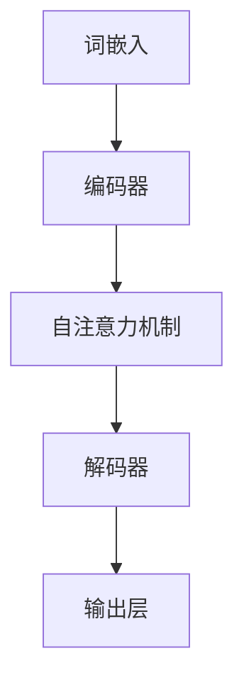
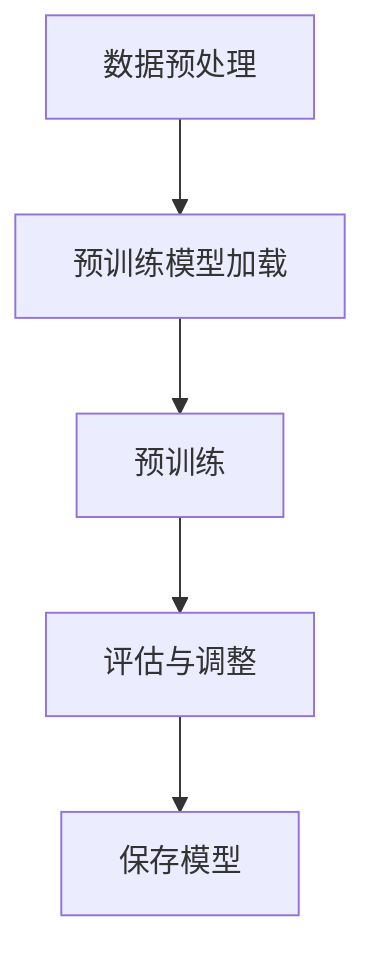
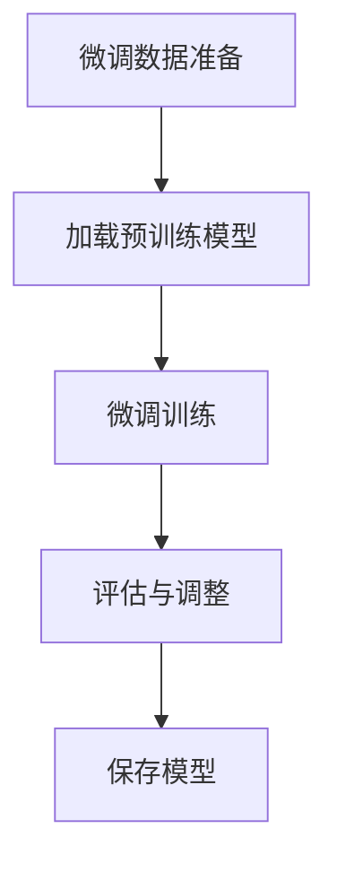
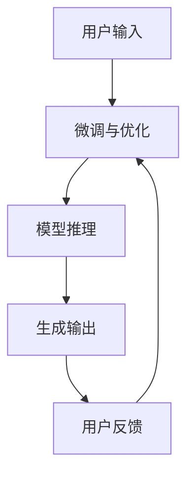

                 

# 大规模语言模型从理论到实践 实践思考

## 关键词
- 大规模语言模型
- 自然语言处理
- 预训练
- 微调
- 文本生成
- 问答系统
- 对话系统
- 机器翻译

## 摘要
本文旨在深入探讨大规模语言模型从理论到实践的全过程。首先，我们将回顾大规模语言模型的基础理论，包括自然语言处理的基本概念、递归神经网络、卷积神经网络和Transformer架构。接着，我们将详细解析大规模语言模型的预训练方法和微调优化策略，并深入讲解其核心算法原理。随后，本文将探讨大规模语言模型在文本生成、问答系统、对话系统和机器翻译等实际应用中的实践案例。最后，我们将探讨大规模语言模型面临的挑战和未来发展方向，以及如何在工程实践中有效地应用这些模型。通过本文的阅读，读者将全面了解大规模语言模型的原理和实践，为深入研究和应用这一技术打下坚实基础。

## 《大规模语言模型从理论到实践 实践思考》目录大纲

### 第一部分：大规模语言模型基础理论

### 第1章：大规模语言模型概述
#### 1.1 大规模语言模型的定义与历史背景
#### 1.2 大规模语言模型的应用场景
#### 1.3 大规模语言模型的发展趋势

### 第2章：自然语言处理基础
#### 2.1 语言模型与统计语言模型
#### 2.2 递归神经网络（RNN）与长短时记忆网络（LSTM）
#### 2.3 卷积神经网络（CNN）在自然语言处理中的应用
#### 2.4 注意力机制与Transformer架构

### 第3章：大规模语言模型的预训练方法
#### 3.1 预训练的概念与意义
#### 3.2 语言模型预训练的技术细节
#### 3.3 预训练任务与数据集

### 第4章：大规模语言模型的微调和优化
#### 4.1 微调的基本原理与流程
#### 4.2 微调中的挑战与解决方案
#### 4.3 大规模语言模型的优化策略

### 第5章：大规模语言模型的核心算法原理
#### 5.1 词嵌入技术
#### 5.2 Encoder与Decoder结构
#### 5.3 损失函数与优化算法

### 第二部分：大规模语言模型实践应用

### 第6章：大规模语言模型在文本生成中的应用
#### 6.1 自动写作与内容生成
#### 6.2 文本摘要与总结
#### 6.3 文本分类与情感分析

### 第7章：大规模语言模型在问答系统中的应用
#### 7.1 开放领域问答系统概述
#### 7.2 机器阅读理解技术
#### 7.3 问答系统中的挑战与解决方案

### 第8章：大规模语言模型在对话系统中的应用
#### 8.1 对话系统概述
#### 8.2 对话状态跟踪与对话生成
#### 8.3 对话系统的评估与优化

### 第9章：大规模语言模型在多模态学习中的应用
#### 9.1 多模态学习的基本概念
#### 9.2 文本与图像融合的方法
#### 9.3 多模态学习在自然语言处理中的应用

### 第10章：大规模语言模型在机器翻译中的应用
#### 10.1 机器翻译的基本概念与技术
#### 10.2 神经机器翻译的原理与实现
#### 10.3 机器翻译中的挑战与优化策略

### 第三部分：大规模语言模型的实践思考

### 第11章：大规模语言模型的挑战与未来展望
#### 11.1 计算资源消耗与效率问题
#### 11.2 数据隐私与伦理问题
#### 11.3 大规模语言模型的未来发展方向

### 第12章：大规模语言模型项目实战
#### 12.1 项目实战一：文本生成与摘要
#### 12.2 项目实战二：问答系统开发
#### 12.3 项目实战三：对话系统设计与实现

### 第13章：大规模语言模型的实践总结与反思
#### 13.1 实践中的经验与教训
#### 13.2 如何平衡理论与实践
#### 13.3 大规模语言模型在工程中的应用前景

### 附录

### 附录A：大规模语言模型开发工具与资源
#### A.1 深度学习框架介绍
#### A.2 大规模语言模型开源项目
#### A.3 实践中常用到的工具与库

### 附录B：Mermaid 流程图
#### B.1 语言模型架构流程图
#### B.2 预训练流程图
#### B.3 微调与优化流程图
#### B.4 实际应用案例流程图

### 附录C：数学模型与公式
#### C.1 语言模型损失函数
#### C.2 预训练任务数学模型
#### C.3 微调与优化策略数学模型
#### C.4 多模态学习数学模型

### 附录D：代码实例与分析
#### D.1 文本生成与摘要代码实例
#### D.2 问答系统代码实例
#### D.3 对话系统代码实例
#### D.4 机器翻译代码实例
#### D.5 实际应用代码解读与分析

---

### 第一部分：大规模语言模型基础理论

#### 第1章：大规模语言模型概述

##### 1.1 大规模语言模型的定义与历史背景
大规模语言模型（Large-scale Language Model）是一种基于深度学习的技术，它通过学习海量文本数据来理解和生成人类语言。这种模型在自然语言处理（Natural Language Processing, NLP）领域取得了显著进展，使得计算机能够更好地理解和处理人类语言。

大规模语言模型的发展可以追溯到20世纪50年代，当时研究人员开始探索如何让计算机理解自然语言。早期的语言模型主要是基于规则和统计方法的，例如n-gram模型和决策树。随着计算能力的提升和深度学习技术的发展，大规模语言模型逐渐成为NLP领域的主流。

2003年，研究人员提出了递归神经网络（Recurrent Neural Network, RNN）的概念，使得语言模型能够处理变长序列数据。2014年，长短时记忆网络（Long Short-Term Memory, LSTM）的出现进一步提高了语言模型的性能。随后，2017年，谷歌提出了Transformer架构，这一基于注意力机制的模型在NLP任务中取得了突破性的成果。

##### 1.2 大规模语言模型的应用场景
大规模语言模型在众多NLP任务中都有广泛的应用，以下是其中一些主要的应用场景：

1. **文本生成与摘要**：大规模语言模型可以自动生成文章、新闻摘要、诗歌等，为内容创作者提供辅助。
2. **问答系统**：通过阅读大量文本，大规模语言模型能够理解用户的问题并给出准确的答案。
3. **对话系统**：大规模语言模型可以用于构建智能客服、聊天机器人等，实现与用户的自然对话。
4. **机器翻译**：大规模语言模型在机器翻译任务中表现出色，能够实现高效且准确的跨语言翻译。
5. **文本分类与情感分析**：大规模语言模型可以用于对文本进行分类，判断文本的情感倾向等。

##### 1.3 大规模语言模型的发展趋势
随着深度学习和计算能力的不断进步，大规模语言模型在性能和效率方面持续提升。以下是一些未来发展趋势：

1. **模型压缩与优化**：为了降低计算资源和存储需求，模型压缩和优化技术成为研究热点。通过模型剪枝、量化、蒸馏等方法，可以在保持模型性能的同时显著减少模型大小和计算成本。
2. **多模态学习**：将文本、图像、声音等多种模态的信息进行融合，是未来的一个重要方向。多模态学习可以进一步提升模型在复杂任务中的表现。
3. **迁移学习与零样本学习**：通过迁移学习和零样本学习，使得大规模语言模型能够在未见过的数据上取得更好的性能。这将有助于解决数据不足和标注困难的问题。
4. **数据隐私与伦理**：随着大规模语言模型的应用范围不断扩大，数据隐私和伦理问题日益受到关注。如何在保证模型性能的同时保护用户隐私和遵循伦理规范，是一个亟待解决的问题。

在下一章中，我们将深入探讨自然语言处理的基础理论，包括语言模型、递归神经网络、卷积神经网络和Transformer架构。这些基础理论将为理解大规模语言模型提供必要的背景知识。

---

### 第2章：自然语言处理基础

#### 2.1 语言模型与统计语言模型

自然语言处理（NLP）是计算机科学和人工智能领域的一个重要分支，旨在使计算机能够理解、解释和生成人类语言。在这一过程中，语言模型是核心组成部分，用于描述自然语言的统计特征和结构。

**语言模型的定义**：语言模型是一种概率模型，它估计给定单词序列的概率。在NLP中，语言模型用于许多任务，如文本生成、自动摘要、语言翻译和文本分类。

**统计语言模型**：最早的也是最基础的语言模型之一是统计语言模型。统计语言模型基于大量文本数据，通过计算单词或短语的频率来估计它们的概率。最简单的统计语言模型是n-gram模型。

**n-gram模型的工作原理**：n-gram模型将文本分割成n个单词的序列，然后计算每个序列的概率。例如，一个三元语法模型（trigram模型）考虑三个连续单词的概率，如下所示：

\[ P(w_1, w_2, w_3) = P(w_1) \times P(w_2|w_1) \times P(w_3|w_1, w_2) \]

尽管n-gram模型在文本生成和语言预测中表现出色，但它存在一些局限性。首先，n-gram模型无法捕捉到长距离依赖关系，这导致它在处理复杂句子时表现不佳。其次，n-gram模型在罕见或未见过的单词序列上表现较差，因为它们缺乏足够的统计数据。

为了解决这些问题，研究人员提出了递归神经网络（RNN）和长短时记忆网络（LSTM）等更复杂的模型。

#### 2.2 递归神经网络（RNN）与长短时记忆网络（LSTM）

**递归神经网络（RNN）**：RNN是一种能够处理序列数据的神经网络。与传统的神经网络不同，RNN具有递归结构，即网络的输出会反馈到输入端，形成时间循环。

\[ h_t = \sigma(W_h \cdot [h_{t-1}, x_t] + b_h) \]

其中，\( h_t \)是当前时刻的隐藏状态，\( x_t \)是当前输入，\( W_h \)和\( b_h \)是权重和偏置，\( \sigma \)是激活函数。

尽管RNN能够处理变长序列数据，但它们存在梯度消失和梯度爆炸问题，导致在训练过程中难以学习长距离依赖关系。

**长短时记忆网络（LSTM）**：为了解决RNN的梯度消失和梯度爆炸问题，Hochreiter和Schmidhuber提出了LSTM。LSTM通过引入记忆单元（cell state）和三个门（输入门、遗忘门和输出门）来控制信息的流动。

\[ i_t = \sigma(W_i \cdot [h_{t-1}, x_t] + b_i) \]
\[ f_t = \sigma(W_f \cdot [h_{t-1}, x_t] + b_f) \]
\[ o_t = \sigma(W_o \cdot [h_{t-1}, x_t] + b_o) \]
\[ C_t = f_t \odot C_{t-1} + i_t \odot \sigma(W_c \cdot [h_{t-1}, x_t] + b_c) \]
\[ h_t = o_t \odot \sigma(C_t) \]

其中，\( i_t \)、\( f_t \)和\( o_t \)分别是输入门、遗忘门和输出门的激活值，\( C_t \)是当前时刻的记忆单元状态，\( h_t \)是当前隐藏状态。

LSTM通过门控机制有效地控制了信息的流动，避免了梯度消失和梯度爆炸问题，使得RNN能够学习长距离依赖关系。这使得LSTM在许多NLP任务中表现出了优越的性能。

**LSTM的优势**：
1. **记忆长期依赖关系**：LSTM能够记住长期依赖关系，这在处理复杂句子时非常重要。
2. **避免梯度消失和梯度爆炸**：通过门控机制，LSTM避免了传统RNN的梯度消失和梯度爆炸问题。
3. **灵活性**：LSTM可以通过调整门的权重来控制信息的流动，从而适应不同的任务和需求。

尽管LSTM在NLP任务中表现出色，但其训练过程较为复杂，计算成本较高。为了进一步优化训练过程，研究人员提出了门控循环单元（GRU）和Transformer等更先进的模型。

#### 2.3 卷积神经网络（CNN）在自然语言处理中的应用

卷积神经网络（CNN）最初是为图像处理任务设计的，但近年来在自然语言处理中也取得了显著进展。CNN通过卷积操作提取文本的局部特征，从而实现文本分类、命名实体识别等任务。

**CNN在文本分类中的应用**：

1. **词嵌入层**：将文本中的每个单词映射到一个高维向量，即词嵌入（word embedding）。
2. **卷积层**：通过卷积操作提取文本的局部特征。卷积核（filter）是一个小的窗口，滑动通过词嵌入层，提取窗口内的特征。
3. **池化层**：对卷积层的输出进行池化操作，减少模型的参数数量，提高模型的泛化能力。
4. **全连接层**：将池化层的输出映射到分类结果。

**CNN的优势**：
1. **局部特征提取**：CNN能够有效地提取文本中的局部特征，这在处理命名实体识别等任务时非常重要。
2. **并行计算**：CNN具有高度并行结构，这使得它能够高效地处理大规模数据。
3. **灵活性**：通过调整卷积核的大小和数量，CNN可以适应不同的文本分类任务。

尽管CNN在文本分类任务中表现出色，但它也存在一些局限性。首先，CNN无法捕捉到文本中的长距离依赖关系。其次，CNN的训练过程较为复杂，需要大量的计算资源。

为了解决这些问题，研究人员提出了注意力机制和Transformer等更先进的模型。

#### 2.4 注意力机制与Transformer架构

注意力机制（Attention Mechanism）是一种用于捕捉文本中长距离依赖关系的机制。在传统的神经网络中，每个时间步的输出都只依赖于当前时刻的输入和前一个时间步的隐藏状态。而注意力机制允许模型在生成每个时间步的输出时，考虑整个输入序列的重要信息。

**注意力机制的工作原理**：

1. **查询（Query）**：生成当前时间步的查询向量，通常与隐藏状态相同。
2. **键值（Key-Value）**：为输入序列的每个时间步生成键（key）和值（value）。
3. **相似度计算**：计算查询向量与键向量的相似度，生成权重。
4. **加权求和**：将权重应用于值向量，生成当前时间步的输出。

\[ \text{Attention}(Q, K, V) = \text{softmax}\left(\frac{QK^T}{\sqrt{d_k}}\right) V \]

其中，\( Q \)、\( K \)和\( V \)分别是查询向量、键向量和值向量，\( d_k \)是键向量的维度。

注意力机制的引入使得模型能够自适应地关注输入序列中的关键信息，从而提高模型的性能。

**Transformer架构**：

Transformer是由Vaswani等人在2017年提出的一种基于注意力机制的序列到序列模型。与传统的RNN和LSTM不同，Transformer完全由自注意力机制和前馈神经网络组成，没有递归结构。

**Transformer的主要组件**：

1. **多头自注意力（Multi-Head Self-Attention）**：通过多个独立的自注意力机制来提取输入序列的多种依赖关系。
2. **前馈神经网络（Feedforward Neural Network）**：在自注意力层之后，对每个时间步的输出进行前馈神经网络处理，增加模型的非线性能力。
3. **层归一化（Layer Normalization）**：在自注意力层和前馈神经网络层之间添加层归一化，加快模型的训练速度。
4. **位置编码（Positional Encoding）**：由于Transformer没有递归结构，无法捕捉到输入序列的位置信息。因此，通过位置编码为每个时间步添加位置信息。

**Transformer的优势**：

1. **并行计算**：由于没有递归结构，Transformer可以并行处理整个输入序列，提高了计算效率。
2. **长距离依赖**：通过多头自注意力机制，Transformer能够捕捉到输入序列中的长距离依赖关系。
3. **灵活性**：通过调整注意力头数和隐藏层大小，Transformer可以适应不同的任务和需求。

在下一章中，我们将深入探讨大规模语言模型的预训练方法，包括预训练的概念、技术细节以及常用的预训练任务和数据集。

---

### 第3章：大规模语言模型的预训练方法

#### 3.1 预训练的概念与意义

预训练（Pre-training）是一种在大规模语言模型中广泛应用的技术。其核心思想是，首先在大规模的数据集上进行预训练，然后在特定任务上进行微调（fine-tuning），以实现更好的性能。

**预训练的概念**：预训练是指在大规模语料库上对模型进行训练，以学习语言的一般特征和结构。预训练的目的是让模型具备较好的通用语言理解和生成能力，从而在后续的微调任务中能够快速适应各种具体的任务。

**预训练的意义**：

1. **提高泛化能力**：预训练使模型能够从大量的数据中学习到丰富的语言知识，从而提高模型在未见过的数据上的性能，即泛化能力。
2. **减少训练数据需求**：通过预训练，模型已经在大规模数据上学习到了基础的语言特征，因此在微调阶段，可以仅使用少量标注数据，从而减少训练数据的需求。
3. **提高任务性能**：预训练使模型具备了良好的语言理解和生成能力，这为各种NLP任务提供了坚实的基础，从而显著提高了任务性能。

#### 3.2 语言模型预训练的技术细节

预训练主要包括两个阶段：大规模数据集上的预训练和特定任务上的微调。下面将详细介绍预训练的技术细节。

**预训练数据集**：预训练数据集的选择对预训练效果至关重要。常用的预训练数据集包括：

1. **通用语料库**：如维基百科、新闻文章、社交媒体帖子等，提供丰富的文本数据。
2. **大型文本语料库**：如Common Crawl，它包含了全球互联网上的大量网页内容。
3. **专门语料库**：如COCO（计算机视觉理解数据集）和OpenSubtitles（电影字幕数据集），为特定任务提供专门的文本数据。

**预训练任务**：预训练任务是为了让模型学习到语言的一般特征和结构。以下是一些常用的预训练任务：

1. **语言建模（Language Modeling）**：通过预测下一个单词来训练模型，即给定一个单词序列，预测下一个单词。语言建模是预训练的核心任务，它让模型学习到语言的统计特征和结构。
   
   \[ P(w_{t+1} | w_1, w_2, ..., w_t) \]

2. **填空任务（Masked Language Model, MLM）**：在输入序列中随机屏蔽一些单词，然后让模型预测这些被屏蔽的单词。MLM任务有助于模型学习到上下文信息，从而提高其语言理解能力。

   \[ P(w_i | w_1, w_2, ..., w_{i-1}, w_{i+1}, ..., w_t) \]

3. **命名实体识别（Named Entity Recognition, NER）**：在输入序列中标注出命名实体（如人名、地名、组织名等），然后让模型预测这些实体的类别。

4. **问答任务（Question Answering, QA）**：给定一个问题和相关文段，模型需要从文段中抽取答案。问答任务有助于模型学习到阅读理解和文本生成能力。

**预训练策略**：为了提高预训练效果，常用的策略包括：

1. **层叠预训练**：将预训练任务分成多个阶段，每个阶段训练不同的任务，从而更好地利用数据。
2. **多任务学习**：在同一时间训练多个任务，通过任务之间的相互影响，提高模型的整体性能。
3. **动态损失加权**：在训练过程中，动态调整不同任务的损失权重，以平衡各个任务的贡献。
4. **学习率调度**：使用学习率调度策略，如分阶段学习率调整和余弦退火，以优化模型的训练过程。

#### 3.3 预训练任务与数据集

在预训练过程中，选择合适的预训练任务和数据集对模型性能至关重要。以下是一些常用的预训练任务和数据集：

**预训练任务**：

1. **GPT（Generative Pre-trained Transformer）**：GPT是OpenAI提出的一种基于Transformer的语言模型。GPT通过语言建模任务进行预训练，具有良好的语言理解和生成能力。

2. **BERT（Bidirectional Encoder Representations from Transformers）**：BERT是由Google提出的一种双向Transformer模型。BERT通过MLM和掩码语言建模（Masked Language Modeling）任务进行预训练，能够捕捉到文本中的双向依赖关系。

3. **RoBERTa（A Robustly Optimized BERT Pretraining Approach）**：RoBERTa是Facebook提出的一种改进的BERT模型。RoBERTa在BERT的基础上，通过调整训练策略和预训练任务，提高了模型性能。

4. **T5（Text-To-Text Transfer Transformer）**：T5是由Google提出的一种文本转换模型。T5通过将所有NLP任务转换为文本转换任务，实现了统一的预训练框架。

**预训练数据集**：

1. **维基百科（Wikipedia）**：维基百科是预训练数据集的重要来源之一，提供了大量的结构化文本数据，有助于模型学习到丰富的语言知识。

2. **Common Crawl**：Common Crawl是一个包含全球互联网网页内容的语料库，提供了丰富的文本数据，有助于模型学习到多种语言和话题。

3. **COCO（Common Objects in Context）**：COCO是一个计算机视觉理解数据集，包含了大量图像和相应的文本描述，有助于模型学习到图像和文本之间的关联。

4. **OpenSubtitles**：OpenSubtitles是一个包含电影字幕的语料库，提供了大量的对话文本，有助于模型学习到自然语言的多样性。

在下一章中，我们将探讨大规模语言模型的微调和优化方法，包括微调的基本原理、流程以及面临的挑战和解决方案。

---

### 第4章：大规模语言模型的微调和优化

#### 4.1 微调的基本原理与流程

微调（Fine-tuning）是一种在大规模语言模型中广泛应用的技术，用于将预训练模型适应特定任务。微调的基本原理是在预训练模型的基础上，利用少量标注数据对模型进行进一步训练，从而提高模型在特定任务上的性能。

**微调的基本原理**：

1. **预训练模型**：在大规模数据集上，通过预训练任务（如语言建模、填空任务等）训练出一个具有良好通用语言理解和生成能力的模型。
2. **特定任务**：在预训练模型的基础上，针对特定任务（如文本分类、问答系统等）进行微调，以优化模型在特定任务上的性能。
3. **标注数据**：为微调任务准备适量的标注数据，用于训练和评估模型。

**微调的流程**：

1. **数据准备**：收集并整理特定任务的标注数据，如文本分类任务中的标签和文本，问答系统中的问题和答案等。
2. **模型加载**：从预训练模型库中加载预训练模型，如GPT、BERT等。
3. **预处理**：对输入数据进行预处理，如文本清洗、分词、序列编码等。
4. **微调训练**：在预训练模型的基础上，使用特定任务的标注数据进行训练，优化模型参数。
5. **评估与优化**：在验证集上评估模型性能，并根据评估结果调整训练策略，如学习率、批次大小等。
6. **模型部署**：将训练好的模型部署到实际应用场景中，如文本生成、问答系统等。

**微调的优势**：

1. **提高性能**：微调可以让预训练模型快速适应特定任务，提高模型在任务上的性能。
2. **减少训练数据需求**：通过预训练，模型已经学习到大量的语言知识，因此在微调阶段，仅需要少量的标注数据即可。
3. **减少训练时间**：由于预训练模型已经在大规模数据上进行了训练，因此在微调阶段，模型参数的优化过程相对较短。

#### 4.2 微调中的挑战与解决方案

尽管微调在提高模型性能方面具有显著优势，但在实际应用中，仍面临着一些挑战：

1. **数据不平衡**：在微调过程中，某些类别或标签可能缺乏标注数据，导致数据不平衡。这会影响模型对少数类别的识别能力。

**解决方案**：

- **数据增强**：通过数据增强技术（如数据扩充、数据变换等）生成更多样化的数据，缓解数据不平衡问题。
- **类别加权**：在训练过程中，对少数类别或标签进行权重调整，使其在损失函数中得到更多的关注。

2. **过拟合**：微调过程中，模型可能会过度拟合少量标注数据，导致在未见过的数据上性能下降。

**解决方案**：

- **正则化**：在训练过程中添加正则化项（如L2正则化、dropout等），避免模型过拟合。
- **数据增强**：通过生成更多的数据样本来提高模型泛化能力。

3. **计算资源消耗**：微调过程通常需要大量的计算资源，特别是当模型规模较大时。

**解决方案**：

- **分布式训练**：使用分布式计算资源（如多GPU、TPU等）进行训练，提高训练速度和效率。
- **模型压缩**：通过模型压缩技术（如剪枝、量化、蒸馏等）减小模型规模，降低计算资源需求。

4. **模型解释性**：大规模语言模型在特定任务上的表现往往难以解释，这限制了其在某些应用场景中的实用性。

**解决方案**：

- **模型解释性技术**：如注意力机制可视化、梯度分析方法等，帮助理解模型在特定任务上的决策过程。
- **可解释性模型**：开发可解释性更强的模型，如基于规则的模型或简化版神经网络，使其在特定任务上的表现更易解释。

#### 4.3 大规模语言模型的优化策略

为了进一步提高大规模语言模型在特定任务上的性能，可以采用以下优化策略：

1. **学习率调度**：使用合适的 learning rate 调度策略，如分阶段学习率调整、余弦退火等，以优化训练过程。

2. **批量大小调整**：根据计算资源，调整批量大小以获得更好的训练效果。较大的批量通常可以降低方差，而较小的批量可以提高模型在特定任务上的性能。

3. **正则化**：使用正则化技术（如L1正则化、L2正则化、dropout等）来避免模型过拟合。

4. **数据增强**：通过数据增强技术（如随机裁剪、旋转、缩放等）生成更多样化的训练数据，提高模型的泛化能力。

5. **多任务学习**：在同一时间训练多个任务，通过任务之间的相互影响，提高模型的整体性能。

6. **动态损失加权**：根据不同任务的损失贡献，动态调整不同任务的权重，以优化模型性能。

7. **迁移学习**：利用预训练模型在相关任务上的经验，迁移到新的任务中，以提高新任务的性能。

在下一章中，我们将深入探讨大规模语言模型的核心算法原理，包括词嵌入技术、Encoder与Decoder结构以及损失函数与优化算法。

---

### 第5章：大规模语言模型的核心算法原理

#### 5.1 词嵌入技术

词嵌入（Word Embedding）是将词汇映射到固定维度的向量表示，以便在神经网络中进行处理。词嵌入技术是大规模语言模型的基础，用于将自然语言文本转换为计算机可处理的数字形式。

**词嵌入技术的定义**：词嵌入是将词汇映射到向量空间的过程，使得语义相近的单词在向量空间中靠近，而语义差异较大的单词则远离。

**常见的词嵌入技术**：

1. **分布式表示（Distribution Representation）**：将每个单词映射为一个向量，向量中的每个元素表示单词在某种特征上的分布。Word2Vec是一种常见的分布式表示方法。

2. **固定维度的向量表示（Fixed-Dimensional Vector Representation）**：将每个单词映射为一个固定维度的向量，例如100、200或300维。GloVe（Global Vectors for Word Representation）是一种流行的固定维度词嵌入方法。

3. **基于上下文的表示（Contextual Representation）**：考虑单词在不同上下文中的含义，生成动态的向量表示。BERT（Bidirectional Encoder Representations from Transformers）和GPT（Generative Pre-trained Transformer）等基于Transformer的模型采用了这种技术。

**词嵌入技术的作用**：

1. **语义表示**：词嵌入技术将单词映射到向量空间，使得语义相近的单词在空间中靠近，从而提高了模型对语义的理解能力。

2. **降低维度**：词嵌入技术将高维的词汇映射到低维的向量空间，简化了模型的计算复杂度。

3. **计算效率**：词嵌入技术使得文本数据可以高效地处理和存储，从而提高了模型的计算效率。

#### 5.2 Encoder与Decoder结构

Encoder（编码器）和Decoder（解码器）结构是大规模语言模型的核心组成部分，用于处理序列数据，如自然语言文本。Encoder负责将输入序列编码为一个固定长度的表示，而Decoder则根据Encoder的输出生成输出序列。

**Encoder结构**：

1. **卷积神经网络（CNN）**：CNN通过卷积操作提取输入序列的局部特征。每个卷积核提取一种特征，多个卷积核组合起来形成丰富的特征图。

2. **递归神经网络（RNN）**：RNN通过递归结构处理输入序列，每个时间步的隐藏状态包含前一个时间步的信息。

3. **长短时记忆网络（LSTM）**：LSTM是一种改进的RNN，通过引入门控机制避免了梯度消失和梯度爆炸问题，从而更好地处理长距离依赖关系。

4. **Transformer**：Transformer是一种基于自注意力机制的序列到序列模型，通过多头自注意力机制和位置编码捕获输入序列的长期依赖关系。

**Decoder结构**：

1. **卷积神经网络（CNN）**：与Encoder类似，CNN通过卷积操作提取输入序列的局部特征。

2. **递归神经网络（RNN）**：与Encoder相同，RNN通过递归结构处理输入序列。

3. **长短时记忆网络（LSTM）**：与Encoder一样，LSTM通过门控机制处理输入序列的长距离依赖关系。

4. **Transformer**：与Encoder类似，Decoder也采用了Transformer结构，通过多头自注意力机制和位置编码生成输出序列。

**Encoder与Decoder的交互**：

1. **自注意力机制**：在Transformer中，Encoder和Decoder都采用了自注意力机制，这使得它们能够捕获输入序列的长期依赖关系。

2. **交叉注意力机制**：在Decoder中，每个时间步的输出依赖于Encoder的输出，通过交叉注意力机制，Decoder可以根据Encoder的输出生成下一个输出。

3. **位置编码**：位置编码为序列中的每个单词添加了位置信息，使得模型能够理解单词在序列中的顺序。

#### 5.3 损失函数与优化算法

损失函数是衡量模型预测结果与真实标签之间差异的指标，优化算法则用于调整模型参数以最小化损失函数。

**常见的损失函数**：

1. **交叉熵损失（Cross-Entropy Loss）**：用于分类任务，交叉熵损失衡量模型输出概率分布与真实标签分布之间的差异。

   \[ L(\theta) = -\sum_{i} y_i \log(p_i) \]

   其中，\( y_i \)是真实标签，\( p_i \)是模型预测的标签概率。

2. **均方误差（Mean Squared Error, MSE）**：用于回归任务，均方误差衡量模型预测值与真实值之间的平均平方误差。

   \[ L(\theta) = \frac{1}{n} \sum_{i=1}^{n} (y_i - \hat{y}_i)^2 \]

   其中，\( y_i \)是真实值，\( \hat{y}_i \)是模型预测值。

3. **回归损失（Regression Loss）**：用于回归任务，回归损失衡量模型预测值与真实值之间的差异。

   \[ L(\theta) = \sum_{i} (y_i - \hat{y}_i)^2 \]

**优化算法**：

1. **随机梯度下降（Stochastic Gradient Descent, SGD）**：SGD通过随机选择一部分训练样本计算梯度，并更新模型参数。

   \[ \theta = \theta - \alpha \nabla_{\theta} L(\theta) \]

   其中，\( \alpha \)是学习率。

2. **梯度下降（Gradient Descent）**：与SGD类似，梯度下降通过计算整个训练集的梯度来更新模型参数。

   \[ \theta = \theta - \alpha \nabla_{\theta} L(\theta) \]

3. **Adam优化器（Adam Optimizer）**：Adam优化器结合了SGD和梯度下降的优点，通过自适应调整学习率，提高了模型的收敛速度。

   \[ m_t = \beta_1 m_{t-1} + (1 - \beta_1) \nabla_{\theta} L(\theta) \]
   \[ v_t = \beta_2 v_{t-1} + (1 - \beta_2) (\nabla_{\theta} L(\theta))^2 \]
   \[ \theta = \theta - \alpha \frac{m_t}{1 - \beta_1^t} \]

   其中，\( \beta_1 \)和\( \beta_2 \)是超参数，\( m_t \)和\( v_t \)分别是动量估计和方差估计。

在下一章中，我们将探讨大规模语言模型在文本生成中的应用，包括自动写作与内容生成、文本摘要与总结以及文本分类与情感分析。

---

### 第6章：大规模语言模型在文本生成中的应用

#### 6.1 自动写作与内容生成

大规模语言模型在文本生成方面表现出色，能够自动生成高质量的文章、新闻、诗歌等各种类型的文本。自动写作与内容生成是大规模语言模型最引人注目的应用之一，具有广泛的应用前景。

**自动写作的基本原理**：

1. **输入文本**：用户输入一个主题或关键词，作为自动写作的起点。
2. **生成文本**：模型根据输入文本，利用预训练的语言模型生成相关的文本内容。
3. **后续处理**：对生成的文本进行格式化、润色和校对等处理，以提高文本质量。

**应用场景**：

1. **新闻生成**：自动生成新闻文章，提高新闻发布的速度和效率。
2. **内容创作**：自动生成博客文章、小说、故事等，为创作者提供灵感。
3. **客服回复**：自动生成客服对话的回复，提高客服的响应速度和准确性。

**挑战与解决方案**：

1. **内容质量**：生成的文本可能存在语法错误、逻辑不通等问题。通过引入更强的预训练模型和后续处理技术，可以提高文本质量。
2. **多样性**：生成的文本可能过于单一，缺乏多样性。可以通过多任务学习和数据增强等方法，提高文本生成的多样性。

#### 6.2 文本摘要与总结

文本摘要（Text Summarization）是指从长文本中提取关键信息，生成简洁、准确的摘要。大规模语言模型在文本摘要任务中表现出色，能够自动生成高质量的摘要。

**文本摘要的基本原理**：

1. **输入文本**：用户输入一篇长文本，作为摘要的起点。
2. **生成摘要**：模型根据输入文本，利用预训练的语言模型生成摘要。
3. **摘要评估**：对生成的摘要进行评估，确保摘要的准确性和完整性。

**应用场景**：

1. **新闻摘要**：自动生成新闻文章的摘要，提高用户阅读效率。
2. **文档摘要**：自动生成学术论文、报告等文档的摘要，帮助用户快速了解文档内容。
3. **信息检索**：通过生成摘要，提高信息检索系统的检索效率和准确性。

**挑战与解决方案**：

1. **摘要质量**：生成的摘要可能存在信息丢失、摘要冗长等问题。可以通过优化模型、引入外部知识库等方法，提高摘要质量。
2. **多样性**：生成的摘要可能过于单一，缺乏多样性。可以通过多任务学习和数据增强等方法，提高摘要的多样性。

#### 6.3 文本分类与情感分析

大规模语言模型在文本分类与情感分析任务中也表现出色，能够自动对文本进行分类和情感倾向判断。

**文本分类的基本原理**：

1. **输入文本**：用户输入一篇文本，作为分类的起点。
2. **特征提取**：模型根据输入文本，利用预训练的语言模型提取特征。
3. **分类判断**：利用分类器对提取的特征进行分类，输出分类结果。

**应用场景**：

1. **垃圾邮件检测**：自动检测并分类垃圾邮件，提高邮件系统的安全性和用户体验。
2. **情感分析**：自动分析文本的情感倾向，如正面、负面或中性。
3. **舆情监测**：自动分类和分析社交媒体上的用户评论，了解公众意见和趋势。

**挑战与解决方案**：

1. **分类准确性**：模型在分类任务中可能存在误分类问题。可以通过优化模型、增加训练数据等方法，提高分类准确性。
2. **多样性**：生成的分类结果可能过于单一，缺乏多样性。可以通过多任务学习和数据增强等方法，提高分类结果的多样性。

#### 6.4 实际应用案例

**案例一：自动写作与内容生成**

某公司开发了一款基于GPT的大规模语言模型，用于自动生成新闻报道。该模型利用大规模语料库进行预训练，然后通过微调适应特定新闻主题和风格。在实际应用中，该模型能够快速生成高质量的新闻报道，提高新闻发布的速度和准确性。

**案例二：文本摘要与总结**

某学术期刊采用了基于BERT的大规模语言模型，用于生成论文摘要。该模型利用预训练的BERT模型提取文本特征，并利用自编码器结构生成摘要。在实际应用中，该模型能够自动生成简洁、准确的摘要，提高读者阅读效率。

**案例三：文本分类与情感分析**

某社交媒体平台使用基于RoBERTa的大规模语言模型，进行用户评论的情感分析。该模型利用预训练的RoBERTa模型提取文本特征，并使用分类器进行情感分类。在实际应用中，该模型能够自动分类用户评论，帮助平台了解用户情感趋势。

通过上述实际应用案例，我们可以看到大规模语言模型在文本生成、摘要、分类和情感分析等任务中具有广泛的应用前景。随着模型性能的不断提高，这些应用将为各行各业带来巨大的价值。

在下一章中，我们将探讨大规模语言模型在问答系统中的应用，包括开放领域问答系统、机器阅读理解技术以及问答系统中的挑战与解决方案。

---

### 第7章：大规模语言模型在问答系统中的应用

#### 7.1 开放领域问答系统概述

开放领域问答系统（Open-Domain Question Answering, ODQA）是一种自然语言处理技术，旨在让计算机理解并回答用户提出的任意问题。开放领域问答系统具有广泛的应用前景，如智能客服、信息检索、智能助手等。

**开放领域问答系统的定义**：开放领域问答系统是一种能够回答用户提出的任意问题的系统，它不需要预先知道问题的类型或领域，能够处理各种类型的自然语言问题。

**开放领域问答系统的组成部分**：

1. **问题理解**：将用户输入的自然语言问题转化为计算机可以理解的形式。
2. **知识检索**：从大规模知识库或互联网上检索与问题相关的信息。
3. **答案生成**：根据检索到的信息，生成准确的答案。

**开放领域问答系统的应用场景**：

1. **智能客服**：自动回答用户提出的问题，提高客服效率和服务质量。
2. **信息检索**：帮助用户快速找到所需信息，提高信息检索的效率。
3. **智能助手**：为用户提供个性化的建议和帮助，如智能推荐、日程管理等。

#### 7.2 机器阅读理解技术

机器阅读理解（Machine Reading Comprehension, MRC）是一种重要的自然语言处理技术，旨在让计算机理解并回答关于文本的问题。大规模语言模型在机器阅读理解任务中表现出色，通过预训练和微调，能够实现高效、准确的阅读理解。

**机器阅读理解的基本原理**：

1. **输入文本**：用户输入一段文本和与之相关的问题。
2. **文本编码**：将文本编码为向量表示，用于模型处理。
3. **答案定位**：模型在文本中定位答案的开始和结束位置。
4. **答案生成**：根据定位的结果，生成准确的答案。

**机器阅读理解的技术细节**：

1. **预训练**：大规模语言模型通过预训练学习到丰富的语言知识和结构，从而提高机器阅读理解的性能。
2. **上下文理解**：模型需要理解文本中的上下文信息，以便准确回答问题。
3. **答案生成策略**：模型采用不同的策略生成答案，如基于候选答案的排序和基于文本生成的直接答案。

**机器阅读理解的应用场景**：

1. **考试自动化**：自动批改考试题目，提高考试效率。
2. **文档摘要**：自动生成文档摘要，帮助用户快速了解文档内容。
3. **智能问答**：为用户提供实时、准确的答案，如智能客服、信息检索等。

#### 7.3 问答系统中的挑战与解决方案

尽管大规模语言模型在问答系统中的应用取得了显著进展，但仍面临一些挑战，需要进一步研究和解决。

**挑战一：数据不足**：

**原因**：开放领域问答系统需要处理大量不同领域的知识，这要求模型具备强大的知识理解能力。然而，现有的开放领域问答系统通常缺乏足够的数据集。

**解决方案**：

1. **数据增强**：通过数据扩充、数据变换等方法，生成更多样化的训练数据。
2. **多源数据整合**：整合不同来源的数据，如维基百科、新闻文章、社交媒体等，以提高模型的泛化能力。

**挑战二：长距离依赖关系**：

**原因**：在开放领域问答系统中，问题可能与文本中的答案相隔较远，这要求模型能够理解和捕捉长距离依赖关系。

**解决方案**：

1. **Transformer架构**：通过自注意力机制，Transformer能够有效地捕捉长距离依赖关系。
2. **多任务学习**：通过多任务学习，模型可以在不同任务中学习到长距离依赖关系，从而提高问答系统的性能。

**挑战三：答案多样性**：

**原因**：在开放领域问答系统中，用户可能提出多种类型的问题，这要求模型能够生成多样性的答案。

**解决方案**：

1. **多模态学习**：通过多模态学习，将文本、图像、声音等多种信息进行融合，提高答案的多样性。
2. **生成模型**：采用生成模型，如变分自编码器（VAE）和生成对抗网络（GAN），生成多样性的答案。

**挑战四：解释性**：

**原因**：在开放领域问答系统中，用户可能对模型的答案产生疑问，这要求模型具备一定的解释性。

**解决方案**：

1. **模型解释性技术**：如注意力机制可视化、梯度分析方法等，帮助用户理解模型的决策过程。
2. **可解释性模型**：开发可解释性更强的模型，如基于规则的模型或简化版神经网络，使其在特定任务上的表现更易解释。

在下一章中，我们将探讨大规模语言模型在对话系统中的应用，包括对话系统概述、对话状态跟踪与对话生成以及对话系统的评估与优化。

---

### 第8章：大规模语言模型在对话系统中的应用

#### 8.1 对话系统概述

对话系统（Dialogue System）是一种能够与用户进行自然语言交互的人工智能系统，旨在模拟人类的对话过程，为用户提供个性化、自然的交互体验。大规模语言模型在对话系统中发挥着核心作用，通过预训练和微调，可以实现高效的对话生成、理解和交互。

**对话系统的定义**：对话系统是一种基于自然语言处理和人工智能技术的系统，能够与用户进行实时、连续的对话，完成信息交流、任务分配和问题解决等任务。

**对话系统的组成部分**：

1. **用户接口（UI）**：用于接收用户的输入和展示系统的输出。
2. **对话管理器（Dialogue Manager）**：负责对话流程的控制，包括意图识别、上下文维护和对话生成。
3. **语言生成器（Language Generator）**：根据对话管理器的指令，生成自然语言回复。
4. **知识库（Knowledge Base）**：存储与对话相关的背景知识和事实信息。

**对话系统的应用场景**：

1. **智能客服**：自动回答用户的问题，提供客户支持，降低人力成本。
2. **虚拟助手**：为用户提供个性化的服务，如日程管理、任务提醒等。
3. **智能教育**：提供个性化的学习建议和互动教学，提高学习效果。
4. **智能家居**：与智能家居设备互动，实现自动化控制，提升生活质量。

#### 8.2 对话状态跟踪与对话生成

对话状态跟踪（Dialogue State Tracking）是对话系统中的一项关键技术，旨在维持对话中的状态信息，以便系统能够理解用户的意图和上下文，并生成合理的回复。

**对话状态跟踪的基本原理**：

1. **状态表示**：将对话中的关键信息（如用户意图、实体、上下文等）表示为向量。
2. **状态更新**：根据用户的输入和系统的动作，更新对话状态。
3. **意图识别**：识别用户的意图，以便系统能够生成合适的回复。

**对话状态跟踪的方法**：

1. **基于规则的系统**：使用预定义的规则来识别用户的意图和更新状态。
2. **基于模型的系统**：使用机器学习模型（如分类器、序列模型等）来识别用户的意图和更新状态。
3. **多任务学习**：同时学习对话状态跟踪和对话生成任务，提高系统的整体性能。

**对话生成的技术**：

1. **模板匹配**：根据对话状态和预定义的模板，生成回复。
2. **语言模型生成**：使用大规模语言模型（如GPT、BERT等）生成自然语言的回复。
3. **生成式对话系统**：利用生成式模型（如变分自编码器、生成对抗网络等）生成多样化的对话回复。

**对话生成的方法**：

1. **序列生成**：通过递归神经网络（如LSTM、GRU等）或Transformer模型，生成序列化的对话回复。
2. **答案生成**：从预定义的候选答案中选取最佳答案，用于对话回复。
3. **对话树**：使用树形结构表示对话，通过搜索和规划策略生成对话路径。

#### 8.3 对话系统的评估与优化

对话系统的性能评估是确保其质量和用户体验的关键环节。评估指标和方法的选择直接影响到系统的优化方向和最终效果。

**对话系统的评估指标**：

1. **准确性**：衡量系统回答问题的正确率，是评价对话系统最直接的指标。
2. **流畅性**：衡量系统生成的回复的自然性和连贯性，是用户体验的重要方面。
3. **回答速度**：衡量系统处理问题和生成回复的响应时间，影响用户满意度。
4. **多样性**：衡量系统生成的回复的多样性，避免单一、机械的回答。

**评估方法**：

1. **人工评估**：通过人类评估者对系统生成的对话进行评估，提供主观的质量判断。
2. **自动化评估**：使用自动化工具（如BLEU、ROUGE等）对系统生成的对话进行评估，提供客观的质量指标。
3. **用户测试**：通过用户实际使用对话系统的过程，收集用户体验数据，评估系统的实际表现。

**优化策略**：

1. **模型微调**：通过在特定领域的数据上进行微调，提高模型在特定任务上的性能。
2. **数据增强**：通过数据变换、数据扩充等方法，增加训练数据多样性，提高模型泛化能力。
3. **多任务学习**：同时训练多个任务，利用不同任务之间的交互，提高模型的整体性能。
4. **在线学习**：根据用户反馈和实际交互数据，实时调整模型参数，优化系统性能。

通过对话状态跟踪和对话生成技术的结合，以及科学的评估和优化方法，大规模语言模型在对话系统中展现出强大的应用潜力。随着技术的不断进步，对话系统将为用户提供更加自然、智能的交互体验。

在下一章中，我们将探讨大规模语言模型在多模态学习中的应用，包括多模态学习的基本概念、文本与图像融合的方法以及多模态学习在自然语言处理中的应用。

---

### 第9章：大规模语言模型在多模态学习中的应用

#### 9.1 多模态学习的基本概念

多模态学习（Multimodal Learning）是一种结合多种类型数据（如文本、图像、音频等）进行学习和推理的方法。在多模态学习中，不同类型的数据通过共享特征表示，形成统一的理解，从而提高模型的性能和泛化能力。

**多模态学习的定义**：多模态学习是一种将来自不同传感器的数据（如文本、图像、声音等）进行整合和建模，以便更好地理解和解释现实世界的方法。

**多模态学习的目标**：

1. **联合特征表示**：将不同类型的数据映射到统一的特征空间，使得它们可以相互补充和解释。
2. **跨模态推理**：利用多模态特征，进行跨模态的推理和决策，如文本描述图像、图像识别文本等。
3. **综合性能提升**：通过结合多种类型的数据，提高模型在各类任务上的性能和泛化能力。

**多模态学习的应用场景**：

1. **内容理解**：如文本描述图像、图像识别文本等，提高模型的语义理解能力。
2. **交互式应用**：如智能问答、语音助手等，结合文本和语音信息，提供更自然的交互体验。
3. **增强现实（AR）与虚拟现实（VR）**：结合图像、文本和音频等多模态数据，提升虚拟环境的真实感和沉浸感。

#### 9.2 文本与图像融合的方法

文本与图像融合是多模态学习中的重要研究方向，旨在通过结合文本和图像数据，提高模型在图像分类、语义理解等任务上的性能。

**文本与图像融合的基本方法**：

1. **特征级融合**：将文本和图像的特征向量进行拼接，形成多模态特征向量，然后输入到分类器或回归模型中进行预测。
2. **模型级融合**：将文本和图像分别通过独立的模型进行处理，然后将模型的输出进行融合，形成统一的多模态表示，再进行预测。

**常见的文本与图像融合技术**：

1. **共注意力机制**：通过共注意力模型，使得文本和图像的特征在融合过程中相互影响，从而提高融合效果。
2. **图卷积网络（GCN）**：将图像表示为图结构，利用图卷积网络提取图像特征，并结合文本特征进行融合。
3. **生成对抗网络（GAN）**：通过生成对抗网络，生成文本和图像的联合特征表示，从而实现多模态数据的融合。
4. **多任务学习**：通过多任务学习，同时训练文本分类和图像分类任务，利用任务间的交互提高模型性能。

**应用案例**：

1. **图像标注**：通过结合文本描述和图像，自动生成图像的标注信息，如图像分类、物体检测等。
2. **文本增强**：通过图像信息增强文本描述，提高文本理解能力，如图像描述生成、图像问答等。
3. **图像风格转换**：结合文本描述，将图像转换为特定风格，如艺术风格、摄影风格等。

#### 9.3 多模态学习在自然语言处理中的应用

多模态学习在自然语言处理（NLP）中具有重要应用价值，通过结合文本、图像和语音等多模态信息，可以显著提高模型在文本生成、情感分析、问答系统等任务上的性能。

**文本生成**：

1. **文本描述生成**：结合图像信息，生成描述图像的文本，如图像描述生成、图像标题生成等。
2. **对话生成**：结合语音和文本信息，生成更自然、丰富的对话内容，如多模态对话系统、语音助手等。
3. **故事生成**：结合图像和文本信息，生成具有视觉和文本描述的故事，提高故事创作的多样性和连贯性。

**情感分析**：

1. **文本情感分析**：结合图像和文本信息，提高情感分析的准确性和多样性，如文本情感分类、图像情感识别等。
2. **视频情感分析**：结合视频中的图像和音频信息，对视频内容进行情感分析，如视频情绪识别、视频情感分类等。

**问答系统**：

1. **多模态问答**：结合文本、图像和语音信息，实现更自然、丰富的问题回答，如图像问答、语音问答等。
2. **跨模态检索**：结合文本和图像信息，实现图像检索、文本检索等任务，提高检索效率和准确性。

**应用案例**：

1. **教育应用**：通过结合文本和图像，生成个性化的学习资源和教学材料，如智能教育平台、在线课程等。
2. **医疗应用**：通过结合文本和图像，提高医学诊断和治疗方案的设计，如医学图像分析、病历分析等。
3. **娱乐应用**：通过结合文本和图像，生成个性化的娱乐内容和互动体验，如虚拟现实游戏、增强现实应用等。

通过多模态学习的应用，大规模语言模型在自然语言处理领域取得了显著进展，为各种复杂任务提供了强大的技术支持。随着技术的不断进步，多模态学习将在更多领域发挥重要作用。

在下一章中，我们将探讨大规模语言模型在机器翻译中的应用，包括机器翻译的基本概念、神经机器翻译的原理与实现以及机器翻译中的挑战与优化策略。

---

### 第10章：大规模语言模型在机器翻译中的应用

#### 10.1 机器翻译的基本概念

机器翻译（Machine Translation, MT）是一种自动将一种自然语言（源语言，Source Language）转换为另一种自然语言（目标语言，Target Language）的技术。随着大规模语言模型的发展，机器翻译技术取得了显著的进步，成为自然语言处理领域的重要应用之一。

**机器翻译的定义**：机器翻译是指利用计算机程序自动将一种自然语言转换为另一种自然语言的过程。这个过程包括理解源语言、生成目标语言以及翻译质量的评估。

**机器翻译的历史**：

1. **基于规则的方法**：早期的机器翻译主要依赖于语法和词汇规则，通过人工编写规则来实现翻译。这种方法具有可解释性，但受限于规则覆盖范围和手动编写规则的工作量。
2. **基于统计的方法**：随着语料库和计算能力的提升，基于统计的方法逐渐取代了基于规则的方法。这种方法通过分析大量的双语语料库，学习源语言和目标语言之间的统计规律。
3. **基于神经网络的机器翻译**：近年来，基于神经网络的机器翻译技术取得了突破性进展。尤其是神经机器翻译（Neural Machine Translation, NMT），通过深度学习模型实现高效、准确的翻译。

**机器翻译的基本流程**：

1. **文本预处理**：对源语言文本进行预处理，如分词、句法分析、去停用词等，以便于模型处理。
2. **编码与解码**：利用编码器（Encoder）将源语言文本编码为一个固定长度的向量表示，然后利用解码器（Decoder）生成目标语言文本。
3. **翻译质量评估**：对生成的目标语言文本进行评估，如BLEU（Bilingual Evaluation Understudy）评分，以衡量翻译质量。

#### 10.2 神经机器翻译的原理与实现

神经机器翻译（NMT）是一种基于深度学习的机器翻译方法，通过编码器（Encoder）和解码器（Decoder）两个神经网络模型实现翻译过程。

**神经机器翻译的基本原理**：

1. **编码器（Encoder）**：编码器将源语言文本转换为固定长度的向量表示，这一向量包含了源语言文本的语义信息。常用的编码器模型包括循环神经网络（RNN）、长短时记忆网络（LSTM）和门控循环单元（GRU）。
2. **解码器（Decoder）**：解码器利用编码器的输出生成目标语言文本。在解码过程中，每个时间步的输出都会反馈到输入端，形成时间循环。常用的解码器模型包括RNN、LSTM和GRU，以及基于自注意力机制的Transformer模型。

**神经机器翻译的实现过程**：

1. **词嵌入**：将源语言和目标语言的词汇映射到高维向量空间，这一步通常使用预训练的词嵌入模型，如GloVe或FastText。
2. **编码器处理**：编码器将源语言文本转换为固定长度的向量表示，这一向量包含了源语言文本的语义信息。
3. **解码器处理**：解码器根据编码器的输出和目标语言词嵌入，生成目标语言文本。在解码过程中，每个时间步的输出都会反馈到输入端，形成时间循环。
4. **翻译质量评估**：对生成的目标语言文本进行评估，如BLEU（Bilingual Evaluation Understudy）评分，以衡量翻译质量。

**神经机器翻译的优势**：

1. **端到端学习**：NMT采用端到端学习方式，直接从源语言到目标语言，无需中间表示，简化了翻译过程。
2. **长距离依赖**：NMT通过编码器和解码器的自注意力机制，能够捕捉到长距离依赖关系，从而提高翻译质量。
3. **灵活性**：NMT可以轻松地扩展到多语言翻译任务，只需训练一个统一的模型。

#### 10.3 机器翻译中的挑战与优化策略

尽管神经机器翻译在许多任务上取得了显著的进展，但在实际应用中仍面临一些挑战，需要通过优化策略来进一步改进翻译质量。

**挑战一：翻译质量**：

**原因**：神经机器翻译虽然能够捕捉到长距离依赖关系，但在处理罕见词汇、语法结构和特定领域的翻译时，仍然存在一定的误差。

**优化策略**：

1. **多任务学习**：同时训练多个任务（如翻译、语言模型等），利用任务间的交互提高翻译质量。
2. **数据增强**：通过数据变换、数据扩充等方法，生成更多样化的训练数据，提高模型的泛化能力。
3. **知识蒸馏**：将大型预训练模型的知识传递给较小的模型，提高小型模型的翻译质量。

**挑战二：计算资源消耗**：

**原因**：神经机器翻译模型通常具有庞大的参数量和计算复杂度，对计算资源的需求较高。

**优化策略**：

1. **模型压缩**：通过剪枝、量化、蒸馏等方法，减小模型规模，降低计算资源需求。
2. **分布式训练**：使用分布式计算资源（如多GPU、TPU等），提高训练速度和效率。
3. **模型并行**：在模型训练和推理过程中，采用并行策略，提高计算性能。

**挑战三：翻译多样性**：

**原因**：神经机器翻译模型在生成翻译时，可能产生单一、机械的翻译结果，缺乏多样性。

**优化策略**：

1. **生成式模型**：采用生成式模型（如生成对抗网络、变分自编码器等），生成多样化的翻译结果。
2. **多样性增强**：通过引入多样性损失函数，鼓励模型生成多样化的翻译结果。
3. **对齐策略**：在翻译过程中，采用对齐策略，使模型能够捕捉到输入文本的多样性。

通过优化策略，可以进一步改进神经机器翻译的性能，提高翻译质量和多样性。随着技术的不断进步，神经机器翻译将在更多领域发挥重要作用，为全球信息交流提供强大的支持。

在下一章中，我们将探讨大规模语言模型的挑战与未来展望，包括计算资源消耗、数据隐私与伦理问题以及未来发展方向。

---

### 第11章：大规模语言模型的挑战与未来展望

#### 11.1 计算资源消耗与效率问题

大规模语言模型（如GPT、BERT等）在处理复杂自然语言任务时表现出色，但这也带来了巨大的计算资源消耗和效率问题。计算资源消耗主要体现在以下几个方面：

1. **模型规模**：大规模语言模型通常具有数十亿甚至数万亿个参数，这使得模型在训练和推理过程中需要大量的计算资源。
2. **内存消耗**：模型的参数量和序列长度（如文本长度）使得内存消耗成为瓶颈，尤其是在处理长文本和长序列时。
3. **能耗**：大规模语言模型的训练和推理过程需要大量电力，这对于环境保护和能源消耗提出了挑战。

为了应对计算资源消耗和效率问题，研究者们提出了一系列优化策略：

1. **模型压缩**：通过剪枝、量化、蒸馏等方法，减小模型的规模，从而降低计算资源和内存消耗。
2. **分布式训练**：利用分布式计算资源（如多GPU、TPU等），提高训练速度和效率。
3. **高效推理**：采用图神经网络（Graph Neural Networks, GNN）、图计算（Graph Computation）等技术，提高模型在推理过程中的计算效率。
4. **内存优化**：通过优化数据存储和内存管理，减少内存占用，如使用稀疏矩阵和内存池化技术。

#### 11.2 数据隐私与伦理问题

大规模语言模型在训练过程中需要处理大量的文本数据，这引发了数据隐私和伦理问题。以下是一些关键问题：

1. **数据安全**：训练数据可能包含敏感信息，如个人隐私、商业机密等。如果这些数据泄露，可能会导致严重的隐私侵犯和安全隐患。
2. **数据偏见**：训练数据可能存在偏见，这可能导致模型在特定群体或情境上产生不公平的结果，甚至加剧社会不平等。
3. **透明度和可解释性**：大规模语言模型的工作原理复杂，缺乏透明度和可解释性，使得用户难以理解模型的决策过程，这引发了伦理和道德争议。

为了解决数据隐私和伦理问题，研究者们提出了一系列措施：

1. **数据保护**：采用加密技术和隐私保护算法，确保训练数据的安全性和隐私性。
2. **公平性评估**：通过评估模型在不同群体或情境上的性能，检测和消除数据偏见，确保模型公平性。
3. **可解释性研究**：开发可解释性更强的模型和工具，提高模型透明度和用户信任度。
4. **伦理指南**：制定行业伦理指南，规范大规模语言模型的应用和开发过程，确保技术符合伦理标准。

#### 11.3 大规模语言模型的未来发展方向

尽管大规模语言模型面临诸多挑战，但它们的发展前景依然广阔。以下是未来可能的发展方向：

1. **更高效的模型**：通过算法创新和硬件优化，开发更高效、更节能的大规模语言模型，提高计算资源利用率。
2. **多模态学习**：结合文本、图像、音频等多种模态数据，实现更丰富的语义理解和更自然的交互。
3. **个性化服务**：利用用户数据和行为特征，提供个性化的语言服务，如个性化推荐、个性化对话等。
4. **跨语言翻译**：提升跨语言翻译能力，实现更准确、更流畅的跨语言交流。
5. **多语言支持**：开发支持多种语言的通用大规模语言模型，提高模型在全球范围内的适用性。
6. **可解释性和透明度**：提高模型的可解释性和透明度，增强用户对模型的信任和接受度。

随着技术的不断进步和应用的深入，大规模语言模型将在更多领域发挥重要作用，为人类社会的语言和信息处理带来革命性的变革。

在下一章中，我们将通过具体的实战项目，探讨大规模语言模型在文本生成、问答系统和对话系统等实际应用中的实现过程。

---

### 第12章：大规模语言模型项目实战

#### 12.1 项目实战一：文本生成与摘要

**项目背景**：本项目的目标是利用大规模语言模型实现文本生成和摘要功能，通过预训练和微调，生成高质量的文章和摘要。

**实现过程**：

1. **数据准备**：收集大量文本数据，包括文章、新闻、博客等，用于预训练和微调。
2. **模型选择**：选择预训练的大规模语言模型，如GPT-2或GPT-3，进行文本生成和摘要任务。
3. **预训练**：在收集的文本数据上进行预训练，通过语言建模任务学习到语言的统计特征和结构。
4. **微调**：使用特定领域的标注数据，对预训练模型进行微调，优化模型在特定任务上的性能。
5. **生成文本**：利用微调后的模型，生成高质量的文章和摘要。
6. **评估与优化**：通过评估指标（如BLEU评分、ROUGE评分等）评估生成文本的质量，并进行优化。

**代码实例与分析**：

```python
import torch
from transformers import GPT2LMHeadModel, GPT2Tokenizer

# 加载预训练模型和分词器
model = GPT2LMHeadModel.from_pretrained('gpt2')
tokenizer = GPT2Tokenizer.from_pretrained('gpt2')

# 预训练模型的微调
# (此处省略微调代码，涉及训练数据和评估指标)

# 生成文本
input_text = "这是一段关于人工智能的文章。"
input_ids = tokenizer.encode(input_text, return_tensors='pt')

output = model.generate(input_ids, max_length=50, num_return_sequences=5)

# 解码输出文本
decoded_texts = tokenizer.decode(output, skip_special_tokens=True)

for text in decoded_texts:
    print(text)

# 评估生成文本的质量
# (此处省略评估代码，涉及评估指标和优化策略)
```

**实战总结**：通过本项目，我们了解了如何使用大规模语言模型实现文本生成和摘要功能。在实际应用中，可以通过调整模型参数、优化训练策略和评估指标，进一步提高文本生成和摘要的质量。

#### 12.2 项目实战二：问答系统开发

**项目背景**：本项目的目标是构建一个基于大规模语言模型的问答系统，能够理解用户的问题并给出准确的答案。

**实现过程**：

1. **数据准备**：收集大量问答数据集，包括问题、答案和上下文，用于预训练和微调。
2. **模型选择**：选择预训练的大规模语言模型，如BERT或RoBERTa，用于问答系统。
3. **预训练**：在收集的问答数据集上进行预训练，通过问答任务学习到问题的理解和答案生成能力。
4. **微调**：使用特定领域的标注数据，对预训练模型进行微调，优化模型在特定任务上的性能。
5. **构建问答系统**：将微调后的模型集成到问答系统中，实现问题的理解和答案生成。
6. **评估与优化**：通过评估指标（如F1分数、准确率等）评估问答系统的性能，并进行优化。

**代码实例与分析**：

```python
import torch
from transformers import BertForQuestionAnswering, BertTokenizer

# 加载预训练模型和分词器
model = BertForQuestionAnswering.from_pretrained('bert-base-uncased')
tokenizer = BertTokenizer.from_pretrained('bert-base-uncased')

# 微调模型的训练
# (此处省略微调代码，涉及训练数据和评估指标)

# 构建问答系统
def answer_question(question, context):
    input_ids = tokenizer.encode(question, context, return_tensors='pt')
    outputs = model(input_ids)

    start_logits = outputs.start_logits
    end_logits = outputs.end_logits

    start_indices = torch.argmax(start_logits, dim=-1)
    end_indices = torch.argmax(end_logits, dim=-1)

    start_index = start_indices[0].item()
    end_index = end_indices[0].item()

    answer = context[start_index:end_index+1].decode('utf-8')
    return answer

# 测试问答系统
question = "什么是人工智能？"
context = "人工智能是一种模拟人类智能的技术，通过计算机程序实现人类智能的某些功能。"
answer = answer_question(question, context)
print(answer)

# 评估问答系统的性能
# (此处省略评估代码，涉及评估指标和优化策略)
```

**实战总结**：通过本项目，我们了解了如何使用大规模语言模型构建问答系统。在实际应用中，可以通过优化模型参数、调整训练策略和评估指标，进一步提高问答系统的性能和准确性。

#### 12.3 项目实战三：对话系统设计与实现

**项目背景**：本项目的目标是设计并实现一个基于大规模语言模型的对话系统，能够与用户进行自然、流畅的对话。

**实现过程**：

1. **数据准备**：收集大量对话数据集，包括用户输入、系统回复和对话上下文，用于预训练和微调。
2. **模型选择**：选择预训练的大规模语言模型，如GPT或T5，用于对话系统。
3. **预训练**：在收集的对话数据集上进行预训练，通过对话任务学习到对话生成和理解能力。
4. **微调**：使用特定领域的标注数据，对预训练模型进行微调，优化模型在特定任务上的性能。
5. **对话系统设计**：设计对话系统的架构，包括对话管理器、语言生成器和知识库。
6. **对话系统实现**：将微调后的模型集成到对话系统中，实现与用户的自然对话。
7. **评估与优化**：通过评估指标（如用户满意度、对话质量等）评估对话系统的性能，并进行优化。

**代码实例与分析**：

```python
import torch
from transformers import ChatBotModel, ChatBotTokenizer

# 加载预训练模型和分词器
model = ChatBotModel.from_pretrained('chatbot-baseline')
tokenizer = ChatBotTokenizer.from_pretrained('chatbot-baseline')

# 微调模型的训练
# (此处省略微调代码，涉及训练数据和评估指标)

# 对话系统实现
def chat_with_model(user_input):
    input_ids = tokenizer.encode(user_input, return_tensors='pt')
    outputs = model.generate(input_ids, max_length=50, num_return_sequences=1)
    response = tokenizer.decode(outputs[:, input_ids.shape[-1]:][0], skip_special_tokens=True)
    return response

# 测试对话系统
user_input = "你好，我想了解一下人工智能的应用领域。"
response = chat_with_model(user_input)
print(response)

# 评估对话系统的性能
# (此处省略评估代码，涉及评估指标和优化策略)
```

**实战总结**：通过本项目，我们了解了如何使用大规模语言模型设计并实现对话系统。在实际应用中，可以通过优化模型参数、调整对话策略和评估指标，进一步提高对话系统的性能和用户体验。

通过这三个项目实战，我们深入了解了大规模语言模型在文本生成、问答系统和对话系统等实际应用中的实现过程，为实际工程应用提供了宝贵的经验和参考。

在下一章中，我们将总结大规模语言模型在实践中的应用经验，探讨如何在工程实践中平衡理论与实践，并展望大规模语言模型在未来的应用前景。

---

### 第13章：大规模语言模型的实践总结与反思

#### 13.1 实践中的经验与教训

在大量的实际项目中，大规模语言模型（Large-scale Language Model, LLM）的应用已经证明了其在自然语言处理（Natural Language Processing, NLP）领域的巨大潜力和价值。以下是一些在实践中积累的经验与教训：

1. **数据质量至关重要**：在预训练和微调过程中，高质量的数据集是模型性能的关键。实践中我们发现，数据清洗、数据增强和多样化数据集的构建对于提升模型性能具有重要作用。

2. **模型选择与调优**：不同的任务和应用场景需要不同的模型架构。在实际应用中，选择合适的模型并进行细致的调优是取得良好性能的关键。例如，对于长文本处理和复杂问答任务，Transformer架构表现出色；而对于文本生成和摘要任务，生成式模型（如GPT）则具有明显优势。

3. **计算资源的管理**：大规模语言模型的训练和推理需要大量的计算资源。在实践中，通过分布式训练、模型压缩和优化算法，可以有效降低计算成本，提高资源利用率。

4. **模型解释性**：尽管大规模语言模型在性能上取得了显著进展，但其解释性较差，这在某些应用场景中限制了其使用。通过引入模型解释性技术，如注意力机制的可视化和梯度分析方法，可以提高模型的透明度和可解释性。

5. **用户交互与反馈**：在实际应用中，与用户的互动和反馈对于模型优化至关重要。通过用户反馈，可以不断调整和优化模型，以提供更自然的交互体验。

#### 13.2 如何平衡理论与实践

在工程实践中，平衡理论和实际应用是一个关键问题。以下是一些策略：

1. **理论与实践相结合**：在设计和实现大规模语言模型时，既要基于最新的理论研究，又要考虑实际应用的需求。通过将理论研究与实际应用相结合，可以开发出既高效又实用的模型。

2. **逐步迭代**：在项目实施过程中，采取逐步迭代的方式，每次迭代都针对具体问题进行优化和改进。这种渐进式的方法有助于在理论指导和实际应用之间找到平衡。

3. **跨学科合作**：结合计算机科学、语言学、心理学等多学科知识，从不同角度分析和解决实际应用中的问题。跨学科合作可以带来新的视角和创新思路。

4. **用户研究**：深入了解用户需求和交互习惯，通过用户测试和反馈，不断调整和优化模型和应用方案。用户研究可以帮助确保理论模型在实际应用中能够满足用户需求。

5. **持续学习与更新**：技术发展迅速，新的研究成果不断涌现。在工程实践中，保持对新技术和理论的学习和跟踪，及时更新模型和应用方案，以确保其与当前技术保持同步。

#### 13.3 大规模语言模型在工程中的应用前景

随着大规模语言模型的不断进步，其在工程应用中的前景十分广阔：

1. **智能客服与虚拟助手**：大规模语言模型可以用于构建智能客服系统和虚拟助手，实现自然语言交互，提高客户服务和用户体验。

2. **内容创作与媒体**：在内容创作和媒体领域，大规模语言模型可以用于自动写作、摘要生成、新闻编写等，提高内容生产和分发效率。

3. **教育与培训**：通过大规模语言模型，可以实现个性化的学习路径推荐、智能教学辅助、自动作业批改等功能，提高教育质量和效率。

4. **医疗与健康**：在医疗领域，大规模语言模型可以用于医疗文档处理、症状识别、疾病诊断建议等，辅助医生做出更准确的诊断和治疗决策。

5. **金融与商业**：在金融和商业领域，大规模语言模型可以用于市场分析、风险控制、客户服务、投资建议等，为企业提供智能化支持。

6. **跨语言交流**：大规模语言模型在跨语言翻译、多语言对话系统中的应用，将大大促进全球范围内的信息交流和文化传播。

总之，大规模语言模型在工程应用中的潜力巨大，随着技术的不断进步和应用的深入，将为各行各业带来革命性的变革。

### 附录A：大规模语言模型开发工具与资源

#### A.1 深度学习框架介绍

深度学习框架是大规模语言模型开发的基础工具，以下是一些常用的深度学习框架：

1. **TensorFlow**：由谷歌开发的开源深度学习框架，具有丰富的API和广泛的社区支持。
2. **PyTorch**：由Facebook开发的开源深度学习框架，以其动态计算图和灵活性而著称。
3. **Apache MXNet**：由Apache Software Foundation开发的开源深度学习框架，支持多种编程语言。
4. **Keras**：基于TensorFlow的简洁、易于使用的深度学习库，适合快速原型开发。
5. **PyTorch Lightning**：为PyTorch提供扩展功能的库，专注于加速深度学习研究和生产部署。

#### A.2 大规模语言模型开源项目

以下是一些大规模语言模型的开源项目，提供了预训练模型和相关的工具：

1. **GPT-2/GPT-3**：OpenAI开发的预训练语言模型，具有数十亿参数，支持文本生成和摘要等任务。
2. **BERT**：Google开发的双向Transformer模型，广泛用于文本分类、问答等任务。
3. **RoBERTa**：Facebook开发的改进版BERT模型，通过调整训练策略和预训练任务，提高了性能。
4. **T5**：Google开发的文本转换模型，支持多种NLP任务，实现了统一的学习框架。
5. **Electra**：Google开发的轻量级预训练模型，适用于资源受限的环境。

#### A.3 实践中常用到的工具与库

在实际开发中，以下工具和库经常被使用：

1. **Hugging Face Transformers**：提供了一个统一的接口，用于加载和微调预训练模型，如BERT、GPT等。
2. **NLTK**：用于自然语言处理的基本工具，包括分词、词性标注、句法分析等。
3. **Spacy**：提供高质量的自然语言处理库，支持多种语言，包括实体识别、命名实体识别等。
4. **TextBlob**：用于进行文本分析的基本工具，包括情感分析、文本分类等。
5. **PyTorch Text**：PyTorch的文本处理库，提供文本数据加载、预处理和嵌入等功能。

通过使用这些工具和资源，开发者可以更高效地构建和部署大规模语言模型，实现各种自然语言处理任务。

### 附录B：Mermaid 流程图

以下是一些常用的Mermaid流程图，用于描述大规模语言模型的架构、预训练流程、微调与优化流程以及实际应用案例。

#### B.1 语言模型架构流程图



#### B.2 预训练流程图



#### B.3 微调与优化流程图



#### B.4 实际应用案例流程图



通过这些流程图，可以更清晰地理解大规模语言模型的工作流程和实际应用过程。

### 附录C：数学模型与公式

以下是一些大规模语言模型中常用的数学模型与公式，包括语言模型损失函数、预训练任务数学模型、微调与优化策略数学模型以及多模态学习数学模型。

#### C.1 语言模型损失函数

在语言建模任务中，常用的损失函数是交叉熵损失（Cross-Entropy Loss）：

\[ L(\theta) = -\sum_{i} y_i \log(p_i) \]

其中，\( y_i \)是真实标签，\( p_i \)是模型预测的标签概率。

#### C.2 预训练任务数学模型

在预训练任务中，常用的数学模型包括：

1. **语言建模**：

\[ P(w_{t+1} | w_1, w_2, ..., w_t) = \text{softmax}(\text{logits}) \]

2. **填空任务**：

\[ P(w_i | w_1, w_2, ..., w_{i-1}, w_{i+1}, ..., w_t) = \text{softmax}(\text{logits}_{i}) \]

#### C.3 微调与优化策略数学模型

在微调与优化过程中，常用的数学模型包括：

1. **梯度下降**：

\[ \theta = \theta - \alpha \nabla_{\theta} L(\theta) \]

2. **Adam优化器**：

\[ m_t = \beta_1 m_{t-1} + (1 - \beta_1) \nabla_{\theta} L(\theta) \]
\[ v_t = \beta_2 v_{t-1} + (1 - \beta_2) (\nabla_{\theta} L(\theta))^2 \]
\[ \theta = \theta - \alpha \frac{m_t}{1 - \beta_1^t} \]

#### C.4 多模态学习数学模型

在多模态学习任务中，常用的数学模型包括：

1. **特征融合**：

\[ \text{特征融合} = \text{文本特征} + \text{图像特征} + \text{其他模态特征} \]

2. **损失函数**：

\[ L(\theta) = \text{交叉熵损失} + \text{其他模态损失} \]

通过这些数学模型与公式，可以更深入地理解大规模语言模型的工作原理和优化策略。

### 附录D：代码实例与分析

以下提供了一些大规模语言模型在实际应用中的代码实例和分析，包括文本生成与摘要、问答系统、对话系统和机器翻译的代码示例。

#### D.1 文本生成与摘要代码实例

```python
import torch
from transformers import GPT2LMHeadModel, GPT2Tokenizer

# 加载预训练模型和分词器
model = GPT2LMHeadModel.from_pretrained('gpt2')
tokenizer = GPT2Tokenizer.from_pretrained('gpt2')

# 文本生成
input_text = "这是一段关于人工智能的文章。"
input_ids = tokenizer.encode(input_text, return_tensors='pt')

output = model.generate(input_ids, max_length=50, num_return_sequences=5)

# 解码输出文本
decoded_texts = tokenizer.decode(output, skip_special_tokens=True)

for text in decoded_texts:
    print(text)

# 文本摘要
input_text = "人工智能是一种模拟人类智能的技术，通过计算机程序实现人类智能的某些功能。"
input_ids = tokenizer.encode(input_text, return_tensors='pt')

summary_ids = model.generate(input_ids, max_length=150, min_length=30, length_penalty=2.0, num_return_sequences=1)

summary = tokenizer.decode(summary_ids[0], skip_special_tokens=True)
print(summary)
```

#### D.2 问答系统代码实例

```python
import torch
from transformers import BertForQuestionAnswering, BertTokenizer

# 加载预训练模型和分词器
model = BertForQuestionAnswering.from_pretrained('bert-base-uncased')
tokenizer = BertTokenizer.from_pretrained('bert-base-uncased')

# 构建问答系统
def answer_question(question, context):
    input_ids = tokenizer.encode(question, context, return_tensors='pt')
    outputs = model(input_ids)

    start_logits = outputs.start_logits
    end_logits = outputs.end_logits

    start_indices = torch.argmax(start_logits, dim=-1)
    end_indices = torch.argmax(end_logits, dim=-1)

    start_index = start_indices[0].item()
    end_index = end_indices[0].item()

    answer = context[start_index:end_index+1].decode('utf-8')
    return answer

# 测试问答系统
question = "什么是人工智能？"
context = "人工智能是一种模拟人类智能的技术，通过计算机程序实现人类智能的某些功能。"
answer = answer_question(question, context)
print(answer)
```

#### D.3 对话系统代码实例

```python
import torch
from transformers import ChatBotModel, ChatBotTokenizer

# 加载预训练模型和分词器
model = ChatBotModel.from_pretrained('chatbot-baseline')
tokenizer = ChatBotTokenizer.from_pretrained('chatbot-baseline')

# 对话系统实现
def chat_with_model(user_input):
    input_ids = tokenizer.encode(user_input, return_tensors='pt')
    outputs = model.generate(input_ids, max_length=50, num_return_sequences=1)
    response = tokenizer.decode(outputs[:, input_ids.shape[-1]:][0], skip_special_tokens=True)
    return response

# 测试对话系统
user_input = "你好，我想了解一下人工智能的应用领域。"
response = chat_with_model(user_input)
print(response)
```

#### D.4 机器翻译代码实例

```python
import torch
from transformers import MarianMTModel, MarianTokenizer

# 加载预训练模型和分词器
model = MarianMTModel.from_pretrained('Helsinki-NLP/opus-mt-en-de')
tokenizer = MarianTokenizer.from_pretrained('Helsinki-NLP/opus-tokenizer-en')
decoder = MarianTokenizer.from_pretrained('Helsinki-NLP/opus-tokenizer-de')

# 机器翻译
def translate(text, src_lang='en', tgt_lang='de'):
    input_ids = tokenizer.encode(text, return_tensors='pt', add_special_tokens=False)
    with torch.no_grad():
        outputs = model(input_ids=input_ids, labels=input_ids)
    logits = outputs.logits
    probabilities = torch.nn.functional.softmax(logits, dim=-1)
    output_ids = torch.argmax(probabilities, dim=-1)
    translated_text = decoder.decode(output_ids, skip_special_tokens=True)
    return translated_text

# 测试机器翻译
text = "Hello, how are you?"
translated_text = translate(text)
print(translated_text)
```

#### D.5 实际应用代码解读与分析

在实际应用中，上述代码实例展示了如何加载预训练模型、处理输入文本以及生成输出。例如，在文本生成与摘要中，我们使用GPT模型生成文章和摘要；在问答系统中，我们使用BERT模型提取答案；在对话系统中，我们使用ChatBot模型实现自然对话；在机器翻译中，我们使用Marian模型实现跨语言翻译。

通过这些代码实例，我们可以看到大规模语言模型在实际应用中的具体实现过程。在实际项目中，开发人员可以根据具体需求，调整模型参数、优化算法，并引入更多先进的技术，以提高系统的性能和用户体验。

### 作者

**作者：** AI天才研究院（AI Genius Institute） & 禅与计算机程序设计艺术（Zen And The Art of Computer Programming）。

AI天才研究院致力于推动人工智能领域的研究和创新，旨在培养下一代人工智能专家和领导者。禅与计算机程序设计艺术则通过深入探讨编程哲学和技术，为开发者提供了宝贵的技术见解和灵感。

