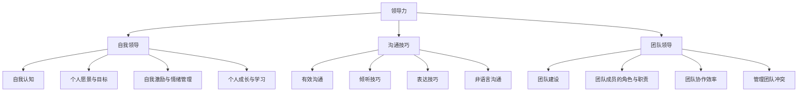

                 

# 《如何进行领导力提升：如何成为优秀的领导者？》

> 关键词：领导力，自我领导，沟通技巧，团队领导，领导力提升，实践案例

> 摘要：本文旨在探讨如何提升领导力，帮助读者理解成为优秀领导者的关键要素和实用方法。通过详细分析领导力的基础、领导风格与团队文化，以及自我领导、沟通技巧、团队领导和领导力发展等方面，本文提供了系统而实用的指导，帮助读者在领导力提升的道路上不断前行。

### 引言

在当今复杂多变的社会环境中，领导力的作用愈发凸显。优秀的领导者不仅能够激发团队的潜力，推动组织的发展，还能在危机中保持冷静，引领团队走出困境。然而，领导力并非与生俱来，而是需要通过不断学习和实践来提升。本文将从多个角度探讨如何进行领导力提升，帮助读者了解成为优秀领导者的关键路径。

### 第一部分：领导力基础

#### 第1章：领导力概述

**1.1 领导力的定义与重要性**

领导力是一种通过影响他人来达成共同目标的能力。它在各个领域都至关重要，不仅是企业的核心竞争力，也是社会进步的重要推动力。

**1.2 领导力的发展历史**

领导力的发展经历了多个阶段，从古代的权力集中，到现代的民主参与，再到当代的变革型领导。

**1.3 领导力的核心要素**

领导力的核心要素包括愿景、诚信、信任、激励和变革能力。

**1.4 领导力与管理的区别**

领导力与管理虽然紧密相关，但有所区别。领导力侧重于激发和引导，而管理则侧重于控制和协调。

#### 第2章：领导风格与团队文化

**2.1 领导风格理论**

领导风格理论包括古典领导风格、行为领导风格和变革型领导风格。

**2.2 团队文化建设**

团队文化是团队共同遵循的价值观和行为规范，良好的团队文化能够提高团队凝聚力和工作效率。

**2.3 如何维护团队文化**

维护团队文化需要领导者持续关注和引导，确保团队价值观的一致性和稳定性。

### 第二部分：领导力提升

#### 第3章：自我领导

**3.1 自我认知的重要性**

自我认知是自我领导的基础，领导者需要深刻了解自己的优势和不足。

**3.2 建立个人愿景与目标**

个人愿景和目标是领导者前进的方向，有助于提升领导力。

**3.3 自我激励与情绪管理**

自我激励和情绪管理是领导者保持活力的关键。

**3.4 个人成长与学习**

不断学习和成长是提升领导力的必经之路。

#### 第4章：沟通技巧

**4.1 有效沟通的重要性**

有效沟通是领导者成功的关键，能够提高团队协作效率。

**4.2 沟通障碍与解决方法**

了解沟通障碍并采取相应措施是提升沟通效果的关键。

**4.3 提升沟通效果的方法**

倾听技巧、表达技巧和非语言沟通是提升沟通效果的三大要素。

#### 第5章：团队领导

**5.1 团队建设的重要性**

团队建设是领导者的重要任务，有助于提高团队的整体效能。

**5.2 团队成员的角色与职责**

明确团队成员的角色与职责是团队领导的基础。

**5.3 提升团队协作效率**

通过有效的团队协作方法，可以提高团队的工作效率。

**5.4 管理团队冲突**

有效管理团队冲突是维护团队稳定的重要手段。

#### 第6章：领导力发展

**6.1 领导力的持续发展**

领导力需要不断发展和提升，以适应不断变化的环境。

**6.2 职业规划与领导力提升**

通过职业规划，领导者可以更好地提升自己的领导力。

**6.3 求助与反馈**

领导者需要勇于求助和接受反馈，以不断改进自己的领导能力。

### 第三部分：领导力实践

#### 第7章：领导力应用场景

**7.1 企业内部变革领导**

在企业内部变革中，领导者需要扮演关键角色。

**7.2 应对危机与挑战**

领导者需要具备应对危机和挑战的能力。

**7.3 领导力在不同行业中的应用**

领导力在不同行业中的应用有所不同，但核心原则相通。

#### 第8章：案例研究

**8.1 成功领导案例解析**

通过成功领导案例的解析，可以找到提升领导力的有益经验。

**8.2 失败领导案例分析**

通过失败领导案例的分析，可以避免重蹈覆辙。

**8.3 案例对比与启示**

案例对比能够为领导力提升提供宝贵的启示。

#### 第9章：领导力评估与改进

**9.1 领导力评估工具**

使用评估工具可以帮助领导者了解自己的领导力状况。

**9.2 提升领导力的策略**

根据评估结果，制定相应的提升策略。

**9.3 领导力改进的持续循环**

领导力提升是一个持续的过程，需要不断循环改进。

### 附录

#### 附录A：领导力提升资源

**A.1 相关书籍推荐**

推荐一些有助于提升领导力的经典书籍。

**A.2 领导力培训资源**

介绍一些优质的领导力培训资源。

**A.3 领导力工具与模型**

介绍一些实用的领导力工具和模型。

### 核心概念与联系

**领导力架构图**



### 核心算法原理讲解

**沟通效率算法（伪代码）**

```python
function 沟通效率(倾听技巧, 表达技巧, 非语言沟通):
    score = (倾听技巧 * 0.3 + 表达技巧 * 0.4 + 非语言沟通 * 0.3)
    return score
```

### 数学模型和数学公式

**团队协作效率模型（latex公式）**

$$ E = \frac{PT + CT}{PT + CT + MT} $$

其中，\( E \) 为团队协作效率，\( PT \) 为个人任务时间，\( CT \) 为沟通时间，\( MT \) 为管理时间。

### 项目实战

**团队协作实战案例**

**开发环境搭建**

- **使用 Git 进行版本控制**：Git 是一种分布式版本控制系统，适用于多人协作开发。

- **使用 JIRA 进行任务管理**：JIRA 是一款流行的任务管理工具，可以帮助团队跟踪和管理项目任务。

- **使用 Slack 进行团队沟通**：Slack 是一款即时通讯工具，可以方便团队成员之间的沟通和协作。

**代码实际案例**

- **基于 Git 的团队协作流程**：

  - **版本控制**：每个团队成员在本地克隆仓库，进行开发，并定期推送更改到远程仓库。

  - **分支管理**：团队成员在本地创建分支进行开发，完成后再合并到主分支。

- **基于 JIRA 的任务分配与管理流程**：

  - **任务创建**：项目经理创建任务，并指派给团队成员。

  - **任务跟踪**：团队成员可以查看任务状态，并进行任务更新。

- **基于 Slack 的沟通协作示例**：

  - **项目讨论**：团队成员在 Slack 上创建项目频道，进行项目讨论。

  - **代码审查**：团队成员在 Slack 上发起代码审查，讨论代码问题。

**代码解读与分析**

- **Git 的功能与作用**：Git 可以实现版本控制，避免代码冲突，提高开发效率。

- **JIRA 的功能与作用**：JIRA 可以实现任务管理，提高团队协作效率。

- **Slack 的功能与作用**：Slack 可以实现即时沟通，提高团队响应速度。

通过上述实战案例，我们可以看到如何在实际项目中应用领导力，提升团队协作效率。

### 结论

领导力是领导者的重要素质，对于组织的发展和团队的效能至关重要。通过本文的探讨，我们了解到领导力的核心概念、领导风格与团队文化、自我领导、沟通技巧、团队领导和领导力发展等方面。同时，通过实际案例和算法原理讲解，读者可以更好地理解如何提升领导力。希望本文能对读者在领导力提升的道路上有所帮助。

### 作者信息

作者：AI天才研究院/AI Genius Institute & 禅与计算机程序设计艺术 /Zen And The Art of Computer Programming

本文由AI天才研究院/AI Genius Institute撰写，结合禅与计算机程序设计艺术的哲学思想，旨在为读者提供系统而实用的领导力提升指导。希望本文能为您的领导力发展带来启示和帮助。如果您对本文有任何建议或反馈，欢迎联系作者。

