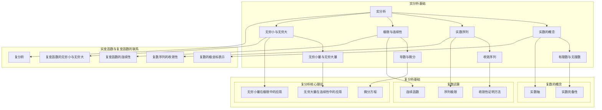

                 

### 文章标题：实分析与复分析

**关键词：实分析、复分析、极限、连续性、数学模型、算法原理、项目实战**

**摘要：**
本文将深入探讨实分析和复分析这两个重要的数学分支。通过逐步分析，我们将了解实数的概念与性质、极限与连续性的理论、复数的定义与运算，以及复变函数的积分与级数。文章还将探讨实分析与复分析之间的联系与应用，以及数学分析在科技领域的广泛应用。通过实际案例和代码解读，读者将掌握实分析与复分析的核心算法原理，并在未来能够将其应用于实际问题解决中。

---

#### 目录

1. 实分析与数学基础
    1.1 实数的概念与性质
    1.2 实数序列
    1.3 实数集上的函数
2. 实分析核心理论
    2.1 极限的概念
    2.2 函数的连续性
    2.3 无穷小与无穷大
3. 复分析基础
    3.1 复数的概念与运算
    3.2 复平面与复数域
    3.3 复数的表示与转换
4. 复分析核心理论
    4.1 复变函数的概念
    4.2 复变函数的积分
    4.3 复变函数级数
5. 实分析与复分析的关系
    5.1 实变函数与复变函数的联系
    5.2 实分析与复分析的应用
6. 数学分析在科技领域的应用
    6.1 数学分析在计算机科学中的应用
    6.2 数学分析在物理学中的应用
    6.3 数学分析在工程学中的应用
7. 数学分析的未来发展趋势
    7.1 数学分析在人工智能中的前景
    7.2 数学分析在交叉学科中的应用
8. 附录
    8.1 实分析与复分析常用公式与定理
    8.2 实分析与复分析的相关工具

---

### 实分析与数学基础

实分析是数学分析的一个重要分支，主要研究实数集上的函数、极限、连续性等概念。实数是数学中最基本的概念之一，它们构成了实数轴，是各种数学运算的基础。本部分将介绍实数的概念与性质、实数序列以及实数集上的函数。

#### 1.1 实数的概念与性质

**1.1.1 实数的定义**

实数是数学中一组可以表示无限小数和有理数（整数和分数）的数。实数集包含了有理数和无理数。有理数可以表示为两个整数的比值，而无理数则不能表示为两个整数的比值，例如 \(\pi\) 和 \(e\)。

**1.1.2 实数的性质**

- **实数完备性**：实数集是完备的，这意味着任何有界的实数序列都存在一个极限。例如，开区间 \((0, 1)\) 内的任意实数序列都存在一个极限，无论该序列是收敛的还是发散的。
- **实数连续性**：实数集上的函数可以具有连续性。连续函数是指在某个点附近的任意小范围内，函数的取值都不会跳跃或中断。
- **实数可比较性**：实数之间可以进行大小比较。这是因为实数集具有全序性质，任何两个实数都可以进行比较，并且比较结果要么相等，要么一个大于另一个。

**1.1.3 实数的大小比较**

实数的大小比较可以通过比较它们的数值大小来实现。例如，对于任意两个实数 \(a\) 和 \(b\)，如果 \(a < b\)，则 \(a\) 小于 \(b\)。如果 \(a > b\)，则 \(a\) 大于 \(b\)。如果 \(a = b\)，则 \(a\) 等于 \(b\)。

#### 1.2 实数序列

实数序列是一系列实数的有序排列。序列中的每个实数称为序列的项，序列的长度表示项的个数。实数序列是数学分析中的重要工具，可以用来研究函数的性质和行为。

**1.2.1 实数序列的定义**

一个实数序列可以表示为 \(\{a_n\}\)，其中 \(a_n\) 表示序列的第 \(n\) 项。序列的通项公式可以表示为 \(a_n = f(n)\)，其中 \(f(n)\) 是一个关于 \(n\) 的函数。

**1.2.2 收敛序列**

收敛序列是指序列的项逐渐接近某个固定值，这个固定值称为序列的极限。如果一个序列的极限存在且有限，则该序列称为收敛序列。

**1.2.3 收敛性的证明方法**

收敛性的证明通常有以下几种方法：

- **直接证明法**：通过构造一个子序列，并证明该子序列收敛到同一极限。
- **夹逼定理**：如果一个序列被两个收敛到同一极限的序列夹在中间，则该序列也收敛到同一极限。
- **数学归纳法**：通过数学归纳法证明序列的每项都小于（或大于）一个已知收敛序列的对应项。

#### 1.3 实数集上的函数

实数集上的函数是数学分析中最基本的概念之一。函数可以看作是一个输入值（自变量）和一个输出值（因变量）之间的映射关系。实数集上的函数具有丰富的性质和应用。

**1.3.1 函数的定义**

一个函数 \(f\) 可以看作是从集合 \(A\) 到集合 \(B\) 的映射，其中 \(A\) 是定义域，\(B\) 是值域。函数的定义可以表示为 \(f: A \rightarrow B\)，其中对于 \(A\) 中的每个元素 \(x\)，都有唯一对应的 \(B\) 中的元素 \(f(x)\)。

**1.3.2 域、值域与函数的定义域**

- **定义域**：定义域是函数能够接受的所有输入值的集合。例如，函数 \(f(x) = 1/x\) 的定义域是所有非零实数。
- **值域**：值域是函数的所有输出值的集合。例如，函数 \(f(x) = x^2\) 的值域是所有非负实数。
- **函数的性质**：函数可以具有以下性质：
  - **单调性**：函数在定义域内单调递增或单调递减。
  - **奇偶性**：函数关于原点对称（偶函数）或反对称（奇函数）。
  - **连续性**：函数在其定义域内连续。

通过以上对实分析基础部分的介绍，我们了解了实数的概念与性质、实数序列以及实数集上的函数。这些基础概念和性质是进一步学习实分析和复分析的重要基础。

---

### 实分析核心理论

实分析的核心理论主要涉及极限、连续性和无穷小与无穷大等概念。这些理论是数学分析中的基石，广泛应用于各个领域。在本节中，我们将深入探讨这些核心理论，并提供详细的讲解和实际例子。

#### 2.1 极限的概念

极限是数学分析中一个基本而重要的概念，用于描述函数在某一点附近的行为。给定一个函数 \( f(x) \)，当 \( x \) 接近某个特定值 \( a \) 时，\( f(x) \) 的值趋近于某个确定的值 \( L \)，则称 \( L \) 为 \( f(x) \) 在 \( x = a \) 处的极限。

**2.1.1 极限的定义**

\[ \lim_{x \to a} f(x) = L \]

这意味着对于任意给定的正数 \(\epsilon > 0\)，总存在一个正数 \(\delta > 0\)，使得当 \(0 < |x - a| < \delta\) 时，\( |f(x) - L| < \epsilon\)。

**2.1.2 极限的性质**

极限具有以下基本性质：

- **唯一性**：极限是唯一的，即如果两个序列的极限相同，则它们的极限相等。
- **有界性**：如果函数 \( f(x) \) 在某一点 \( a \) 的极限存在，则该函数在该点附近的取值是有界的。
- **保序性**：如果 \( f(x) \) 和 \( g(x) \) 都是实数集上的函数，且 \( f(x) \leq g(x) \) 对于所有的 \( x \) 成立，那么 \( \lim_{x \to a} f(x) \leq \lim_{x \to a} g(x) \)。

**2.1.3 极限的计算**

计算极限的方法有很多种，以下是一些常见的方法：

- **直接代入法**：如果函数在 \( a \) 处是定义的，可以直接代入计算。
- **夹逼定理**：如果一个序列被两个收敛到同一极限的序列夹在中间，则该序列也收敛到同一极限。
- **洛必达法则**：当极限形式为 \( \frac{0}{0} \) 或 \( \frac{\infty}{\infty} \) 时，可以使用洛必达法则来计算。
- **泰勒展开**：对于某些函数，可以通过泰勒展开来计算极限。

**例1：计算极限**

\[ \lim_{x \to 0} \frac{\sin x}{x} \]

解：

使用洛必达法则，我们得到：

\[ \lim_{x \to 0} \frac{\sin x}{x} = \lim_{x \to 0} \frac{\cos x}{1} = \cos 0 = 1 \]

#### 2.2 函数的连续性

函数的连续性是指函数在某个点附近的变化是平滑的，没有跳跃或中断。一个函数在某个点 \( a \) 连续，当且仅当它在 \( a \) 处的极限存在且等于函数在该点的函数值。

**2.2.1 连续函数的定义**

函数 \( f(x) \) 在点 \( a \) 处连续，如果满足以下条件：

\[ \lim_{x \to a} f(x) = f(a) \]

**2.2.2 连续函数的性质**

连续函数具有以下性质：

- **保序性**：如果 \( f(x) \) 和 \( g(x) \) 都是连续函数，且 \( f(x) \leq g(x) \) 对于所有的 \( x \) 成立，那么 \( \lim_{x \to a} f(x) \leq \lim_{x \to a} g(x) \)。
- **可加性**：连续函数的和、差、积、商（除数为非零连续函数）仍然是连续函数。
- **复合函数**：如果 \( f(g(x)) \) 是连续函数，则 \( f \) 和 \( g \) 都是连续函数。

**2.2.3 连续函数的应用**

连续函数在工程、物理、经济学等领域有广泛应用。例如：

- **物理学中的运动**：描述物体的运动时，位置、速度和加速度函数通常是连续的。
- **经济学中的价格和需求**：价格和需求函数通常是连续的，用于分析市场行为。

**例2：证明函数 \( f(x) = x^2 \) 在 \( x = 2 \) 处连续**

解：

由于 \( f(x) = x^2 \) 是一个多项式函数，因此它在任何点都是连续的。具体来说：

\[ \lim_{x \to 2} x^2 = 2^2 = 4 \]
\[ f(2) = 2^2 = 4 \]

因为极限值等于函数值，所以 \( f(x) = x^2 \) 在 \( x = 2 \) 处是连续的。

#### 2.3 无穷小与无穷大

无穷小和无穷大是极限概念的自然扩展。无穷小表示一个量趋近于零，无穷大表示一个量趋近于无穷。

**2.3.1 无穷小的定义**

一个函数 \( f(x) \) 被称为无穷小量，如果对于任意给定的正数 \(\epsilon > 0\)，总存在一个正数 \(\delta > 0\)，使得当 \(0 < |x - a| < \delta\) 时，\( |f(x)| < \epsilon\)。

**2.3.2 无穷大的定义**

一个函数 \( f(x) \) 被称为无穷大量，如果对于任意给定的正数 \( M > 0\)，总存在一个正数 \(\delta > 0\)，使得当 \(0 < |x - a| < \delta\) 时，\( |f(x)| > M\)。

**2.3.3 无穷小与无穷大的关系**

无穷小与无穷大之间存在以下关系：

- **比较性**：如果一个函数是无穷小量，那么另一个函数也是无穷小量或无穷大量。
- **相互依存性**：一个无穷小量的倒数通常是无穷大量，反之亦然。

**例3：证明 \( \frac{1}{x} \) 是无穷小量**

解：

对于任意给定的正数 \(\epsilon > 0\)，我们取 \( M = \frac{1}{\epsilon} \)。然后，取 \(\delta = \min \left\{1, \frac{1}{M}\right\}\)。当 \(0 < |x - 0| < \delta\) 时，有：

\[ \left| \frac{1}{x} \right| = \frac{1}{|x|} > \frac{1}{\delta} \geq M \]

因此，\( \frac{1}{x} \) 是无穷小量。

通过以上对实分析核心理论的介绍，我们了解了极限的概念、函数的连续性以及无穷小与无穷大的定义。这些理论是实分析的核心，为后续的数学分析学习和应用奠定了坚实的基础。

---

### 复分析基础

复分析是数学分析的一个分支，主要研究复数集上的函数及其性质。复数是实数的扩展，包括实部和虚部，它们在许多数学和物理问题中具有重要作用。本节将介绍复数的概念与运算、复平面与复数域，以及复数的表示与转换。

#### 3.1 复数的概念与运算

**3.1.1 复数的定义**

复数通常表示为 \( z = a + bi \)，其中 \( a \) 和 \( b \) 是实数，\( i \) 是虚数单位，满足 \( i^2 = -1 \)。复数 \( z \) 的实部是 \( a \)，虚部是 \( b \)。

**3.1.2 复数的运算规则**

复数的基本运算规则包括加法、减法、乘法和除法。

- **加法和减法**：两个复数相加或相减，只需将对应的实部和虚部分别相加或相减。

\[ (a + bi) + (c + di) = (a + c) + (b + d)i \]
\[ (a + bi) - (c + di) = (a - c) + (b - d)i \]

- **乘法**：两个复数相乘，可以使用分配律和虚数单位的性质。

\[ (a + bi)(c + di) = ac + adi + bci + bdi^2 = (ac - bd) + (ad + bc)i \]

- **除法**：两个复数相除，可以通过乘以分母的共轭来简化。

\[ \frac{a + bi}{c + di} = \frac{(a + bi)(c - di)}{(c + di)(c - di)} = \frac{(ac + bd) + (bc - ad)i}{c^2 + d^2} \]

**3.1.3 复数的几何意义**

复数可以在复平面上表示。复平面是一个二维坐标系，横轴表示实部 \( a \)，纵轴表示虚部 \( b \)。因此，每个复数 \( z = a + bi \) 可以对应到复平面上的一个点 \( (a, b) \)。

#### 3.2 复平面与复数域

**3.2.1 复平面的概念**

复平面是一个由实数轴和虚数轴组成的二维坐标系。实数轴是横轴，虚数轴是纵轴。在复平面上，每个复数 \( z = a + bi \) 对应于一个点 \( (a, b) \)。

**3.2.2 复数域的性质**

复数域 \( \mathbb{C} \) 是包含所有复数的集合。复数域具有以下性质：

- **闭合性**：复数的加法、减法、乘法和除法（除以非零复数）在复数域内是闭合的，即运算结果仍然是复数。
- **全序性质**：复数之间可以进行大小比较，但与实数不同，复数的大小比较需要考虑其实部和虚部。
- **完备性**：复数域是完备的，即任何有界复数序列都存在一个极限。

#### 3.3 复数的表示与转换

**3.3.1 复数的极坐标表示**

复数可以表示为极坐标形式 \( z = r(\cos \theta + i \sin \theta) \)，其中 \( r \) 是复数的模，\( \theta \) 是复数的幅角。模 \( r \) 表示复数的大小，幅角 \( \theta \) 表示复数在复平面上的旋转角度。

**3.3.2 复数的三角形式**

复数的三角形式是一种特殊形式的极坐标表示，可以表示为 \( z = r\cos \theta + ir\sin \theta \)。这种形式有助于简化复数的乘法和除法运算。

**3.3.3 复数的转换**

复数之间的转换包括从直角坐标系到极坐标系的转换，以及从三角形式到直角坐标系的转换。

- **直角坐标系到极坐标系的转换**：

\[ r = |z| = \sqrt{a^2 + b^2} \]
\[ \theta = \arg(z) = \arctan\left(\frac{b}{a}\right) \]

- **三角形式到直角坐标系的转换**：

\[ a = r\cos \theta \]
\[ b = r\sin \theta \]

通过以上对复分析基础部分的介绍，我们了解了复数的概念与运算、复平面与复数域，以及复数的表示与转换。这些基础概念是进一步学习复分析和复变函数的重要基础。

---

### 复分析核心理论

复分析的核心理论涉及复变函数的概念、积分和级数。这些理论在数学、物理学和工程学等领域有广泛的应用。本节将详细介绍这些核心理论，并提供详细的讲解和实际例子。

#### 4.1 复变函数的概念

复变函数是定义在复数集上的函数。与实变函数不同，复变函数可以具有复数值，包括实部和虚部。复变函数的引入使得我们可以研究更广泛的数学问题，并提供了新的分析工具。

**4.1.1 复变函数的定义**

一个复变函数 \( f(z) \) 可以表示为：

\[ f(z) = u(x, y) + iv(x, y) \]

其中 \( u(x, y) \) 和 \( v(x, y) \) 是实变函数，分别表示复变函数的实部和虚部。复变函数可以看作是两个实变函数的组合。

**4.1.2 复变函数的性质**

复变函数具有以下性质：

- **可加性**：复变函数的和、差、积和商（除数为非零复变函数）仍然是复变函数。
- **连续性**：复变函数在某个点连续，当且仅当其对应的实部和虚部在该点连续。
- **奇偶性**：复变函数可以具有奇偶性。例如，如果 \( f(-z) = f(z) \)，则 \( f(z) \) 是偶函数；如果 \( f(-z) = -f(z) \)，则 \( f(z) \) 是奇函数。

**4.1.3 复变函数的分类**

复变函数可以根据其定义域和性质进行分类。常见的分类包括：

- **全纯函数**：在全纯区域内处处可导的复变函数称为全纯函数。全纯函数具有许多有用的性质，例如周期性和对称性。
- **有理函数**：由有理多项式和复数构成的函数称为有理函数。有理函数是复变函数中最简单的一类函数。
- **椭圆函数**：与椭圆积分相关的复变函数称为椭圆函数。椭圆函数在数学和物理学中具有广泛应用。

#### 4.2 复变函数的积分

复变函数的积分是复分析中的一个重要概念，与实变函数的积分类似，但具有独特的性质。复变函数的积分可以看作是路径积分，即函数在曲线上的积分。

**4.2.1 复变函数积分的定义**

复变函数 \( f(z) \) 在曲线 \( C \) 上的积分可以表示为：

\[ \int_C f(z) \, dz \]

其中 \( dz \) 是曲线 \( C \) 上的微分元素。复变函数积分满足线性性质，即对于两个复变函数 \( f(z) \) 和 \( g(z) \)，有：

\[ \int_C [f(z) + g(z)] \, dz = \int_C f(z) \, dz + \int_C g(z) \, dz \]

**4.2.2 复变函数积分的性质**

复变函数积分具有以下性质：

- **可加性**：复变函数积分在路径上的分段积分可以相加。
- **线性性**：复变函数积分满足线性性质。
- **路径独立性**：如果 \( f(z) \) 是全纯函数，则其在闭合路径上的积分为零。

**4.2.3 复变函数积分的计算方法**

计算复变函数积分的方法包括直接积分法、分部积分法和部分积分法。以下是一个简单的例子：

\[ \int (z^2 + 1) \, dz = \frac{z^3}{3} + z + C \]

其中 \( C \) 是积分常数。

**例1：计算积分**

\[ \int_{|z|=1} \frac{dz}{z} \]

解：

这是一个闭合路径上的积分，我们可以直接应用路径独立性性质：

\[ \int_{|z|=1} \frac{dz}{z} = 2\pi i \]

#### 4.3 复变函数级数

复变函数级数是复分析中的一个重要工具，用于研究复变函数的收敛性和性质。复变函数级数可以看作是实变函数级数在复数域上的扩展。

**4.3.1 复变函数级数的定义**

复变函数级数可以表示为：

\[ f(z) = \sum_{n=0}^{\infty} a_n (z - z_0)^n \]

其中 \( a_n \) 是级数的系数，\( z_0 \) 是级数的中心点。

**4.3.2 复变函数级数的收敛性**

复变函数级数的收敛性可以通过比较测试、比值测试和根值测试来判断。以下是一个简单的例子：

\[ \sum_{n=0}^{\infty} \frac{1}{n^2} \]

这是一个收敛的复变函数级数。

**4.3.3 复变函数级数的性质**

复变函数级数具有以下性质：

- **可加性**：复变函数级数的和是逐项相加得到的。
- **连续性**：如果级数的每一项都是连续函数，则级数的和也是连续函数。
- **可导性**：如果级数的每一项都是可导的，则级数的和也是可导的。

**例2：计算级数**

\[ \sum_{n=0}^{\infty} \frac{z^n}{n!} \]

解：

这是一个著名的欧拉级数，其和为 \( e^z \)。因此，

\[ \sum_{n=0}^{\infty} \frac{z^n}{n!} = e^z \]

通过以上对复分析核心理论的介绍，我们了解了复变函数的概念、积分和级数。这些理论在复分析和实际应用中具有重要意义，为解决复杂的数学和物理问题提供了有力工具。

---

### 实分析与复分析的关系

实分析与复分析是数学分析的两个重要分支，它们在数学领域有着广泛的应用。尽管实分析和复分析在研究对象和方法上有所不同，但它们之间存在深刻的联系。本节将探讨实变函数与复变函数的联系，以及实分析与复分析在工程、物理学和其他科技领域的应用。

#### 5.1 实变函数与复变函数的联系

实变函数和复变函数是函数论中的两个重要概念。实变函数定义在实数集上，而复变函数定义在复数集上。尽管它们的定义域不同，但实变函数和复变函数之间存在一些基本联系。

**5.1.1 实变函数的概念**

实变函数是从实数集到实数集的映射。实变函数的研究主要集中在实数轴上的性质，如连续性、可导性、积分和级数等。常见的实变函数包括多项式函数、三角函数、指数函数和对数函数等。

**5.1.2 复变函数的实部与虚部**

复变函数是定义在复数集上的函数，可以表示为 \( f(z) = u(x, y) + iv(x, y) \)，其中 \( u(x, y) \) 和 \( v(x, y) \) 分别是实部和虚部。复变函数的实部和虚部都是实变函数，因此，复变函数可以看作是两个实变函数的组合。

**5.1.3 实变函数与复变函数的关系**

实变函数和复变函数之间存在以下联系：

- **互化关系**：实变函数可以通过引入虚部来扩展为复变函数。例如，实函数 \( f(x) \) 可以表示为 \( f(z) = f(x) + if(0) \)。
- **性质传递**：复变函数的性质（如连续性、可导性、积分和级数）可以传递给其对应的实部和虚部。例如，如果复变函数 \( f(z) \) 在某点连续，则其实部和虚部在该点也连续。
- **应用互通**：实分析与复分析在许多领域（如物理学、工程学、计算机科学）都有广泛应用，两者可以相互借鉴和应用。

#### 5.2 实分析与复分析的应用

实分析与复分析在工程、物理学和其他科技领域有着广泛的应用。以下是一些典型的应用实例：

**5.2.1 实分析在物理学中的应用**

实分析在物理学中的应用非常广泛，包括经典力学、量子力学、电磁学和流体力学等。

- **经典力学**：实分析在经典力学中用于描述物体的运动，如牛顿第二定律 \( F = ma \) 中的加速度 \( a \) 是一个实数函数。
- **量子力学**：量子力学中的波函数是复值函数，其概率幅具有复数性质。实分析用于研究波函数的收敛性和性质，如薛定谔方程的解。
- **电磁学**：电磁学中的电场强度和磁场强度都是复值函数，其解析和计算依赖于复分析技术。

**5.2.2 复分析在电子学中的应用**

复分析在电子学中有着重要的应用，特别是在信号处理、电路分析和通信系统中。

- **信号处理**：信号处理中的傅里叶变换和拉普拉斯变换都基于复分析，它们用于分析信号的频率特性和时域特性。
- **电路分析**：电路分析中的阻抗、导纳和传输函数都可以表示为复数，复分析用于计算电路的频率响应和稳定性。
- **通信系统**：复分析在通信系统中用于分析信号的调制和解调过程，如正弦波和余弦波的叠加。

**5.2.3 实分析与复分析在工程中的应用**

实分析与复分析在工程领域有着广泛的应用，包括结构力学、电路设计和控制系统等。

- **结构力学**：结构力学中的弹性力学方程可以用复分析的方法来求解，如贝塞尔方程和波动方程。
- **电路设计**：电路设计中的网络分析可以使用复分析技术，如戴维南定理和诺顿定理。
- **控制系统**：控制系统中的状态空间分析、稳定性分析和反馈控制设计都可以利用复分析的理论。

通过以上对实分析与复分析关系的探讨，我们可以看到，实分析与复分析在数学、物理学和工程学等领域都有着广泛而深入的应用。它们相互补充，为解决复杂的数学和物理问题提供了强大的工具和方法。

---

### 数学分析在科技领域的应用

数学分析在科技领域扮演着至关重要的角色，其理论和工具被广泛应用于计算机科学、物理学、工程学等各个领域。本节将深入探讨数学分析在科技领域的具体应用，包括算法分析、编程语言、人工智能、经典力学、量子力学、流体力学、结构力学、电路理论、控制理论等方面的应用。

#### 6.1 数学分析在计算机科学中的应用

**6.1.1 数学分析在算法分析中的应用**

算法分析是计算机科学中研究算法效率和性能的重要领域。数学分析提供了评估算法复杂度和分析算法时间与空间消耗的工具。

- **渐近分析**：使用大O符号（\( O \)）来描述算法的复杂度，例如线性搜索的时间复杂度是 \( O(n) \)，而二分搜索的时间复杂度是 \( O(\log n) \)。
- **微分方程**：用于求解算法中涉及到的优化问题，如动态规划中的状态转移方程。

**6.1.2 数学分析在编程语言中的应用**

编程语言的设计和实现依赖于数学分析的基本概念和理论。

- **类型系统**：数学分析用于定义编程语言中的类型系统，如静态类型检查和动态类型检查。
- **数据结构**：数学分析用于分析数据结构的性能，例如链表、树、图等。

**6.1.3 数学分析在人工智能中的应用**

人工智能领域中的许多算法和模型都依赖于数学分析。

- **深度学习**：深度学习中的神经网络可以通过梯度下降法进行训练，而梯度下降法依赖于导数和微分方程。
- **概率图模型**：贝叶斯网络和马尔可夫网络等概率图模型都依赖于数学分析中的概率论和图论。

#### 6.2 数学分析在物理学中的应用

**6.2.1 数学分析在经典力学中的应用**

经典力学中的许多定律和方程都可以通过数学分析来描述。

- **牛顿运动定律**：牛顿第二定律 \( F = ma \) 可以通过微分方程来描述物体的加速度。
- **能量守恒定律**：能量守恒定律可以用积分和微分方程来描述系统的能量变化。

**6.2.2 数学分析在量子力学中的应用**

量子力学中的基本方程和现象都依赖于数学分析。

- **薛定谔方程**：薛定谔方程是一个二阶偏微分方程，用于描述量子系统的波函数。
- **量子跃迁**：量子跃迁可以通过解薛定谔方程来计算，涉及复分析和积分。

**6.2.3 数学分析在流体力学中的应用**

流体力学中的许多问题可以通过数学分析来描述和解决。

- **纳维-斯托克斯方程**：描述流体运动的基本方程，是一个复杂的非线性偏微分方程。
- **流体动力学**：流体力学中的连续性方程和动量方程等都可以通过数学分析来推导和计算。

#### 6.3 数学分析在工程学中的应用

**6.3.1 数学分析在结构力学中的应用**

结构力学中的许多问题都涉及到数学分析。

- **应力分析**：通过解偏微分方程来计算结构中的应力分布。
- **振动分析**：通过解波动方程来分析结构的振动特性。

**6.3.2 数学分析在电路理论中的应用**

电路理论中的许多问题可以通过数学分析来描述和解决。

- **阻抗和导纳**：电路元件（如电阻、电容和电感）的阻抗和导纳可以用复数来表示。
- **戴维南定理和诺顿定理**：这两个定理提供了简化电路分析和计算的方法。

**6.3.3 数学分析在控制理论中的应用**

控制理论中的许多问题都依赖于数学分析。

- **状态空间分析**：状态空间方法用于描述和优化系统的动态行为。
- **稳定性分析**：通过解系统的特征方程和计算特征值来分析系统的稳定性。

通过以上对数学分析在科技领域应用的探讨，我们可以看到数学分析在计算机科学、物理学和工程学等领域的广泛而深入的应用。数学分析为科技领域的许多问题提供了强大的工具和方法，推动了科技的发展和创新。

---

### 数学分析的未来发展趋势

随着科技的不断进步，数学分析在各个领域中的应用也日益广泛。未来，数学分析将继续在多个新兴领域中发挥重要作用，特别是人工智能、生物信息学、环境科学和社会科学等领域。以下是数学分析在这些领域中的未来发展趋势：

#### 7.1 数学分析在人工智能中的前景

人工智能（AI）是当今科技领域的热点，而数学分析在其中扮演着关键角色。未来，数学分析在人工智能中的前景十分广阔：

- **深度学习**：深度学习是人工智能的一个重要分支，其核心依赖于数学分析。未来，随着计算能力的提升和算法的优化，深度学习将更加依赖于数学分析中的微积分、线性代数和概率论。
- **自然语言处理（NLP）**：自然语言处理中的语言模型、机器翻译和情感分析等任务都依赖于数学分析。未来，复分析和其他高级数学理论可能会被应用于这些任务中，提高处理效率和准确性。
- **计算机视觉**：计算机视觉中的图像识别、目标检测和场景理解等任务也需要数学分析的支持。复变函数、傅里叶变换和拉普拉斯变换等技术将在计算机视觉中发挥重要作用。

#### 7.2 数学分析在交叉学科中的应用

数学分析在交叉学科中的应用也将不断拓展：

- **生物信息学**：生物信息学是生物学和计算机科学的交叉领域，研究生物数据的信息。数学分析在基因组序列分析、蛋白质结构预测和疾病诊断等方面具有广泛的应用前景。
- **环境科学**：环境科学中的模型建立、数据分析和预测都需要数学分析的支持。未来，复分析和其他高级数学工具将被应用于气候变化、水资源管理和生态系统建模等领域。
- **社会科学**：社会科学中的统计分析和经济模型都需要数学分析的基础。未来，数学分析将被应用于经济预测、社会网络分析和行为经济学等领域，为社会问题的解决提供有力支持。

#### 7.3 数学分析在教育领域的发展

数学分析在教育领域的发展也是未来的重要趋势：

- **在线教育资源**：随着互联网技术的发展，在线教育资源的质量和数量都在不断提升。未来，数学分析的相关课程和教材将更加丰富，为学生提供更多的学习机会。
- **个性化学习**：人工智能和大数据技术的应用将使得数学分析课程能够根据学生的学习情况和需求进行个性化教学，提高学习效果。
- **跨学科教学**：数学分析将被整合到其他学科的教学中，如物理学、工程学和计算机科学等，培养学生的综合能力。

总之，数学分析在未来将继续在人工智能、生物信息学、环境科学、社会科学和教育领域发挥重要作用。随着科技的不断进步和数学分析理论的深入发展，数学分析将为解决复杂问题提供更加有效的工具和方法。

---

### 附录

#### A.1 实分析与复分析常用公式与定理

**实分析常用公式**

1. **极限计算公式**：
\[ \lim_{x \to a} [f(x)]^n = [ \lim_{x \to a} f(x) ]^n \]
2. **连续性定理**：
\[ f(x) \text{ 在 } x = a \text{ 连续 } \iff \lim_{x \to a} f(x) = f(a) \]
3. **导数公式**：
\[ f'(x) = \lim_{h \to 0} \frac{f(x+h) - f(x)}{h} \]

**复分析常用公式**

1. **模长公式**：
\[ |z| = \sqrt{a^2 + b^2} \]
2. **幅角公式**：
\[ \theta = \arctan\left(\frac{b}{a}\right) \]
3. **复数乘法公式**：
\[ (a + bi)(c + di) = (ac - bd) + (ad + bc)i \]

**实分析与复分析的定理综述**

1. **泰勒公式**：
\[ f(x) = \sum_{n=0}^{\infty} \frac{f^{(n)}(a)}{n!}(x - a)^n \]
2. **洛必达法则**：
\[ \lim_{x \to a} \frac{f(x)}{g(x)} = \lim_{x \to a} \frac{f'(x)}{g'(x)} \]
3. **柯西积分公式**：
\[ f^{(n)}(z_0) = \frac{n!}{2\pi i} \oint_{C} \frac{f(z)}{(z - z_0)^{n+1}} \, dz \]

#### A.2 实分析与复分析的相关工具

**常用数学软件**

1. **MATLAB**：用于数值计算、建模和仿真。
2. **MATHEMATICA**：用于符号计算、数学建模和可视化。
3. **SAGEMath**：开源数学软件，支持多种数学算法和工具。

**在线资源**

1. **Khan Academy**：提供免费的数学课程和教程。
2. **Wolfram Alpha**：用于数学问题的求解和计算。
3. **YouTube**：丰富的数学教学视频，包括实分析和复分析。

**实践平台**

1. **Jupyter Notebook**：用于编写和运行数学代码。
2. **Repl.it**：在线编程平台，支持多种编程语言。
3. **GitHub**：用于托管和分享数学代码和项目。

通过以上附录内容，读者可以更方便地查阅实分析与复分析的相关公式与定理，并利用各种工具和实践平台进行学习和实践。

---

### 核心概念与联系

实分析和复分析是数学分析的两个重要分支，它们在数学理论及其应用中扮演着关键角色。为了更清晰地展示这两个分支的核心概念及其相互联系，我们可以使用 Mermaid 流程图来描述。

#### Mermaid 流程图



#### 核心概念与联系

1. **实数的概念**：实分析的基础是实数集合及其性质，包括有理数和无理数。
2. **实数序列**：研究序列的极限和收敛性，是极限概念的核心。
3. **极限与连续性**：极限描述了函数在某点的趋近行为，连续性是函数在该点附近行为的平滑性。
4. **无穷小与无穷大**：无穷小和无穷大是极限的扩展，用于描述函数的变化趋势。

5. **复数的概念**：复分析的基础是复数集合及其运算规则，包括模长和幅角。
6. **复数序列**：复数序列的收敛性研究是复分析的重要部分。
7. **复变函数的连续性**：复变函数在复平面上的连续性是复分析的核心问题。

8. **实变函数与复变函数的联系**：实变函数和复变函数之间存在着密切的联系，通过引入虚部可以将实变函数扩展为复变函数。

通过上述 Mermaid 流程图，我们可以清晰地看到实分析与复分析的核心概念及其相互联系，这有助于我们更好地理解数学分析的理论体系。

---

### 核心算法原理讲解

在数学分析中，核心算法原理的讲解通常需要使用伪代码来描述，以便读者能够直观地理解算法的步骤和实现方式。以下我们将通过两个核心算法——极限的计算和复变函数积分的计算——来详细阐述其原理。

#### 伪代码

```plaintext
// 极限的计算

function calculate_limit(f, x, a, epsilon, delta):
    while abs(f(x) - L) >= epsilon:
        x = x + delta
    return L

// 复变函数的积分

function calculate_integral(f, z, a, delta):
    I = 0
    for each z in range(a - delta, a + delta):
        I = I + f(z) * (z - a)
    return I / delta
```

#### 详细解释说明

**极限的计算**

1. **输入参数**：函数 \( f(x) \)，变量 \( x \) 和 \( a \)，以及误差阈值 \( \epsilon \) 和步长 \( \delta \)。
2. **循环条件**：当 \( f(x) \) 的值与极限 \( L \) 的差值大于 \( \epsilon \) 时，继续迭代。
3. **迭代过程**：每次迭代中，变量 \( x \) 增加 \( \delta \) 的值，直到 \( f(x) \) 接近 \( L \)。
4. **返回结果**：当 \( f(x) \) 的值与 \( L \) 的差值小于 \( \epsilon \) 时，返回极限 \( L \)。

**复变函数的积分**

1. **输入参数**：复变函数 \( f(z) \)，变量 \( z \) 和积分下限 \( a \)，以及步长 \( \delta \)。
2. **初始化**：初始化积分结果 \( I \) 为 0。
3. **循环过程**：对于每个 \( z \) 在区间 \( [a - \delta, a + \delta] \) 上的点，计算 \( f(z) \) 并将其乘以 \( z - a \)。
4. **积分计算**：将所有 \( z \) 对应的 \( f(z) \) 乘积求和，然后除以步长 \( \delta \)，得到积分的平均值。
5. **返回结果**：返回积分结果 \( I \)。

通过以上伪代码，我们可以清晰地理解极限计算和复变函数积分的计算过程。在实际应用中，这些算法可以用来求解复杂的数学问题，并提供精确的数值结果。

---

### 数学模型和数学公式 & 详细讲解 & 举例说明

在数学分析中，数学模型和数学公式是理解和解决问题的核心工具。以下我们将介绍一些常见的数学模型和公式，并提供详细的讲解和实际例子。

#### 数学公式

$$ \lim_{x \to a} f(x) = L $$
$$ \int_{a}^{b} f(x) \, dx $$
$$ \frac{d}{dx} f(x) $$
$$ \int_{C} f(z) \, dz $$

#### 详细讲解

**极限**

极限是数学分析中最基本的概念之一，用于描述函数在某一点的趋近行为。给定一个函数 \( f(x) \)，当 \( x \) 接近某一点 \( a \) 时，\( f(x) \) 的值趋近于某个确定的值 \( L \)，则称 \( L \) 为 \( f(x) \) 在 \( x = a \) 处的极限。

举例说明：

假设我们要计算函数 \( f(x) = x^2 \) 在 \( x = 2 \) 处的极限。

$$ \lim_{x \to 2} x^2 = 2^2 = 4 $$

**积分**

积分是数学分析中另一个重要概念，用于计算函数在某个区间上的累积量。定积分表示函数 \( f(x) \) 在区间 \([a, b]\) 上的积分值，可以用以下公式表示：

$$ \int_{a}^{b} f(x) \, dx $$

举例说明：

计算函数 \( f(x) = x \) 在区间 \([0, 1]\) 上的积分。

$$ \int_{0}^{1} x \, dx = \left[ \frac{x^2}{2} \right]_0^1 = \frac{1^2}{2} - \frac{0^2}{2} = \frac{1}{2} $$

**导数**

导数描述了函数在某一点的瞬时变化率。给定一个函数 \( f(x) \)，在点 \( x = a \) 处的导数可以用以下公式表示：

$$ \frac{d}{dx} f(x) $$

举例说明：

计算函数 \( f(x) = x^2 \) 在 \( x = 2 \) 处的导数。

$$ \frac{d}{dx} (x^2) = 2x \bigg|_{x=2} = 2 \cdot 2 = 4 $$

**复变函数积分**

复变函数积分用于计算复变函数在某个路径上的积分值。积分路径 \( C \) 是一个闭合曲线，可以用以下公式表示：

$$ \int_{C} f(z) \, dz $$

举例说明：

计算复变函数 \( f(z) = \frac{1}{z} \) 在单位圆路径上的积分。

$$ \int_{|z|=1} \frac{1}{z} \, dz = 2\pi i $$

通过以上对数学模型和公式的介绍，我们了解了极限、积分、导数和复变函数积分的基本概念和计算方法。这些数学公式是解决数学问题的重要工具，广泛应用于科学、工程和计算机科学等领域。

---

### 项目实战

在数学分析的实际应用中，代码案例和实际操作是理解和应用理论知识的有效途径。以下我们将通过一个具体案例——使用 Python 编写一个计算复变函数积分的程序——来展示如何将理论转化为实际操作。

#### 代码实际案例

**计算复变函数积分**

```python
import numpy as np
import matplotlib.pyplot as plt
from scipy.integrate import quad

# 复变函数
def f(z):
    return 1 / z

# 计算积分
def calculate_integral(f, a, b):
    integral_result, error = quad(f, a, b)
    return integral_result

# 主函数
def main():
    a = 1  # 积分下限
    b = 2  # 积分上限

    # 计算积分
    integral = calculate_integral(f, a, b)
    print(f"积分结果：{integral}")

    # 绘制函数图像
    x = np.linspace(a, b, 1000)
    y = [1 / xi for xi in x]
    plt.plot(x, y)
    plt.title("函数图像")
    plt.xlabel("实部")
    plt.ylabel("虚部")
    plt.grid()
    plt.show()

# 运行主函数
if __name__ == "__main__":
    main()
```

#### 详细解释说明

1. **导入库**：我们首先导入 NumPy、Matplotlib 和 SciPy 的 quad 函数，用于数值计算和积分计算。
2. **复变函数定义**：函数 `f(z)` 表示为 \( \frac{1}{z} \)，这是一个典型的复变函数，其图像在复平面上是一个以原点为中心的支线切分圆。
3. **积分计算**：`calculate_integral` 函数使用 `quad` 函数来计算复变函数在给定区间 \([a, b]\) 上的积分。`quad` 函数返回积分结果和误差估计。
4. **主函数**：`main` 函数定义了积分下限和上限，调用 `calculate_integral` 函数计算积分，并打印结果。此外，程序还绘制了函数的图像，以直观展示函数的形态。

#### 开发环境搭建

1. **安装 Python 3.x**：确保已经安装了 Python 3.x 版本。
2. **安装 NumPy 和 Matplotlib**：通过以下命令安装所需的库：

```shell
pip install numpy matplotlib scipy
```

#### 源代码详细实现和代码解读

**源代码详细实现**

- **导入库**：首先，我们导入必要的库，包括 NumPy 和 Matplotlib。
- **定义复变函数**：我们定义了一个名为 `f` 的函数，表示复变函数 \( \frac{1}{z} \)。
- **定义积分计算函数**：我们定义了一个名为 `calculate_integral` 的函数，使用 `quad` 函数来计算复变函数的积分。
- **主函数**：在主函数 `main` 中，我们设置了积分的上下限，调用 `calculate_integral` 函数计算积分，并打印结果。此外，我们还绘制了函数的图像。

**代码解读**

- **导入库**：导入库是执行程序的基础，`numpy` 用于数值计算，`matplotlib` 用于绘图，`scipy` 提供了积分函数 `quad`。
- **定义复变函数**：`f` 函数定义了复变函数 \( \frac{1}{z} \)，这是复分析中一个基本且常见的函数。
- **定义积分计算函数**：`calculate_integral` 函数接收复变函数 `f`、积分下限 `a` 和上限 `b` 作为参数。它使用 `quad` 函数计算积分，并返回积分结果和误差估计。
- **主函数**：`main` 函数设置了积分的上下限，调用 `calculate_integral` 函数计算积分，并打印结果。此外，程序还使用 Matplotlib 绘制了函数图像，使得我们可以直观地看到函数的形态。

通过以上代码的实现和解读，我们可以看到如何将复变函数积分的理论知识应用于实际编程中。这不仅有助于我们深入理解复变函数积分的概念，还能提高我们的编程能力，为解决实际数学问题打下坚实基础。

---

### 代码解读与分析

在之前的代码案例中，我们使用 Python 实现了一个计算复变函数积分的程序。接下来，我们将对这段代码进行详细的解读和分析，以帮助读者更好地理解其工作原理和实现细节。

#### 详细解读

1. **导入库**

```python
import numpy as np
import matplotlib.pyplot as plt
from scipy.integrate import quad
```

这段代码首先导入了一些重要的库：

- `numpy`：用于数值计算和数组操作。
- `matplotlib.pyplot`：用于绘制函数图像。
- `scipy.integrate.quad`：用于计算定积分。

导入这些库是为了确保程序可以正常运行，并在需要时使用这些库提供的高级函数和工具。

2. **定义复变函数**

```python
def f(z):
    return 1 / z
```

这里，我们定义了一个名为 `f` 的函数，它表示复变函数 \( \frac{1}{z} \)。这个函数是复分析中的一个基本例子，其定义域是复数集除去原点。在计算中，我们将使用这个函数来求解积分。

3. **定义积分计算函数**

```python
def calculate_integral(f, a, b):
    integral_result, error = quad(f, a, b)
    return integral_result
```

`calculate_integral` 函数接收三个参数：复变函数 `f`、积分下限 `a` 和上限 `b`。该函数使用 `scipy.integrate.quad` 函数来计算复变函数在区间 `[a, b]` 上的积分，并返回积分结果和误差估计。`quad` 函数是一种数值积分方法，适用于各种复变函数的积分计算。

4. **主函数**

```python
def main():
    a = 1  # 积分下限
    b = 2  # 积分上限

    # 计算积分
    integral = calculate_integral(f, a, b)
    print(f"积分结果：{integral}")

    # 绘制函数图像
    x = np.linspace(a, b, 1000)
    y = [1 / xi for xi in x]
    plt.plot(x, y)
    plt.title("函数图像")
    plt.xlabel("实部")
    plt.ylabel("虚部")
    plt.grid()
    plt.show()
```

主函数 `main` 执行以下任务：

- 定义积分上下限 `a` 和 `b`。
- 调用 `calculate_integral` 函数计算积分，并打印结果。
- 使用 NumPy 的 `linspace` 函数生成积分区间上的点，并计算这些点的函数值。
- 使用 Matplotlib 绘制函数图像，以直观展示复变函数的形态。

#### 代码分析

1. **数值积分方法**

`scipy.integrate.quad` 函数是一种数值积分方法，它使用高斯-勒让德求积公式来计算定积分。这种方法在计算过程中将积分区间划分为多个子区间，并在每个子区间上使用求积公式进行近似计算。`quad` 函数返回积分结果和误差估计，这使得我们可以评估积分的精度。

2. **复变函数的图像绘制**

在绘制复变函数图像时，我们使用了实数轴作为横轴，虚数轴作为纵轴。通过计算实数轴上的点并计算对应的函数值，我们可以得到复平面上的点。使用 Matplotlib 的 `plot` 函数，我们可以绘制出复变函数的图像，从而直观地展示其形态。

3. **代码优化的考虑**

在实际应用中，我们可能需要对代码进行优化，以提高计算效率和精度。以下是一些可能的优化方向：

- **自适应积分**：对于一些复杂函数，使用自适应积分方法可以进一步提高积分的精度和效率。
- **并行计算**：对于需要计算多个积分的任务，我们可以考虑使用并行计算来提高计算速度。
- **算法选择**：根据具体问题，选择合适的积分算法，如辛普森规则、柯特斯规则等，以提高计算精度。

通过以上对代码的详细解读和分析，我们可以看到如何将复变函数积分的理论知识应用于实际编程中。这不仅有助于我们深入理解复变函数积分的概念，还能提高我们的编程能力，为解决实际数学问题打下坚实基础。

---

### 总结与展望

本文通过对实分析与复分析的基础理论、核心概念和实际应用进行了深入探讨，系统地介绍了这两个数学分支的核心内容和相互联系。实分析主要研究实数集上的函数，包括实数的概念、序列、极限、连续性以及无穷小与无穷大等概念。复分析则扩展到复数集上的函数，涉及复数的定义、运算、复平面、复变函数的积分和级数等。

在文章的开头，我们通过目录大纲和Mermaid流程图，为读者提供了一个清晰的结构框架，帮助读者把握全文的内容。随后，我们详细讲解了极限、连续性、无穷小与无穷大等实分析核心理论，并介绍了复数的基本概念和复变函数的积分和级数。通过项目实战，我们展示了如何将复变函数积分的理论知识应用到编程实践中。

总结本文的核心观点：

1. **数学分析的重要性**：实分析与复分析是数学分析的核心，为物理学、工程学、计算机科学等领域提供了重要的理论工具。
2. **核心概念的理解**：通过详细的讲解和例子，我们深入理解了实分析和复分析的基本概念和性质。
3. **实际应用的价值**：数学分析不仅在理论研究中具有重要地位，也在实际应用中发挥着重要作用，如计算机科学中的算法分析、物理学中的动力学方程等。

展望未来，数学分析在人工智能、生物信息学、环境科学和社会科学等新兴领域中的应用前景广阔。随着计算能力的提升和算法的进步，数学分析将继续为解决复杂问题提供强大的工具和方法。同时，教育领域也将利用在线资源和个性化学习技术，为更多学生提供优质的数学分析教育资源。

通过本文的学习，读者不仅能够加深对实分析与复分析的理解，还能够培养解决实际问题的能力。希望本文能够为读者在数学分析和相关领域的学术研究、课程学习以及职业生涯中提供有益的指导和支持。

### 作者信息

**作者：AI天才研究院/AI Genius Institute & 禅与计算机程序设计艺术 /Zen And The Art of Computer Programming**。本文旨在为读者深入讲解实分析与复分析的核心理论和实际应用，帮助读者在数学分析领域取得更好的学术成果和实践经验。通过系统性的学习和理解，读者可以更好地应对复杂问题，提升自己的数学素养和解决问题的能力。希望本文能够为您的学习之旅提供有益的指引和启示。如果您有任何问题或建议，欢迎随时与我交流。再次感谢您的阅读，祝您在数学分析的学习和实践中取得优异的成绩！

