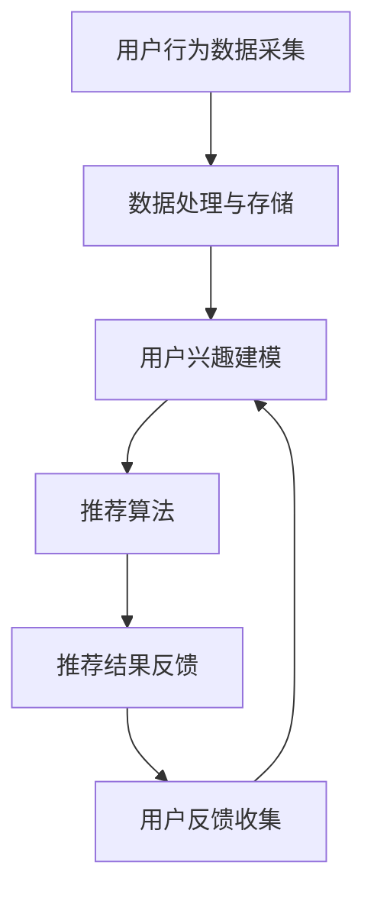

                 

# 《实时推荐技术的应用实例》

> 关键词：实时推荐，推荐系统，算法，用户行为分析，应用实例

> 摘要：本文将深入探讨实时推荐技术的概念、原理、实现方法及其在各行业中的应用实例。通过详细分析实时推荐系统的基础架构、关键技术、用户行为建模和算法原理，结合电商、社交媒体和内容平台等实际案例，本文旨在揭示实时推荐技术的核心价值与未来发展趋势。

## 目录

### 《实时推荐技术的应用实例》

#### 关键词：实时推荐，推荐系统，算法，用户行为分析，应用实例

#### 摘要：本文将深入探讨实时推荐技术的概念、原理、实现方法及其在各行业中的应用实例。

#### 目录

1. 第一部分：实时推荐技术基础
    1. 第1章：实时推荐技术概述
    2. 第2章：用户行为分析与建模
    3. 第3章：实时推荐算法原理与实现
    4. 第4章：实时推荐系统的优化与评估

2. 第二部分：实时推荐技术在各行业的应用
    1. 第5章：电商行业的实时推荐应用
    2. 第6章：社交媒体的实时推荐应用
    3. 第7章：内容平台的实时推荐应用

3. 第三部分：实时推荐技术的未来发展趋势
    1. 第8章：实时推荐技术的未来发展趋势

4. 附录：实时推荐技术资源与工具

### 1. 第一部分：实时推荐技术基础

#### 第1章：实时推荐技术概述

#### 1.1 实时推荐系统的概念与重要性
- **实时推荐系统的定义**：实时推荐系统是一种能够根据用户当前的行为、兴趣和历史数据，快速地生成个性化推荐的系统。
- **实时推荐技术在现代互联网中的应用**：从电商平台、社交媒体到内容平台，实时推荐技术已经成为提升用户满意度和提高商业变现的重要手段。
- **实时推荐技术的重要性**：实时推荐技术能够有效地提升用户体验、增加用户粘性，并为企业带来可观的商业价值。

#### 1.2 实时推荐系统架构
- **实时推荐系统的基本组成部分**：包括用户行为数据的采集与处理、实时推荐算法的选择与优化、推荐结果的实时反馈与调整。
- **用户行为数据的采集与处理**：实时收集用户在网站或应用上的行为数据，如浏览、点击、购买等，并进行预处理，如数据清洗、去重和归一化。
- **实时推荐算法的选择与优化**：根据业务需求和数据特点选择合适的推荐算法，如基于内容的推荐、协同过滤和深度学习等，并进行算法优化，提高推荐准确性。
- **推荐结果的实时反馈与调整**：将推荐结果实时反馈给用户，并根据用户反馈进行推荐策略的动态调整。

#### 1.3 实时推荐系统关键技术
- **实时数据处理技术**：使用高速缓存、分布式计算和流处理等技术，确保数据处理的实时性和高效性。
- **实时推荐算法**：采用快速计算和优化算法，如基于内容的推荐算法、协同过滤推荐算法和深度学习推荐算法等。
- **推荐系统的评估与优化**：通过用户反馈和业务数据，评估推荐效果，并进行算法优化和系统调整，以提高推荐质量。

### 第2章：用户行为分析与建模

#### 2.1 用户行为数据分析
- **用户行为数据的类型与来源**：用户在网站或应用上的行为数据，如浏览记录、点击事件、搜索查询、购买行为等。
- **用户行为数据分析方法**：使用统计分析、数据挖掘和机器学习等方法，对用户行为数据进行处理和分析，提取用户兴趣和偏好。
- **用户兴趣模型构建**：通过分析用户行为数据，构建用户兴趣模型，用于推荐算法的输入。

#### 2.2 用户画像构建
- **用户画像的定义与作用**：用户画像是对用户特征的综合描述，用于理解用户需求和行为模式。
- **用户画像构建方法**：通过用户行为数据、用户属性数据和第三方数据源，构建用户画像。
- **用户画像应用案例**：用户画像在个性化推荐、用户分群和市场分析中的应用。

#### 2.3 用户行为预测
- **用户行为预测算法介绍**：包括时间序列分析、回归分析和机器学习等方法。
- **用户行为预测模型构建**：基于历史数据和用户行为特征，构建预测模型。
- **用户行为预测案例分析**：分析预测模型的构建过程、预测结果和实际应用效果。

### 第3章：实时推荐算法原理与实现

#### 3.1 基于内容的推荐算法
- **基于内容的推荐算法原理**：根据用户的历史行为和内容特征，推荐与用户兴趣相似的内容。
- **基于内容的推荐算法实现**：使用关键词提取、文本相似度和内容分类等方法，实现基于内容的推荐。
- **基于内容的推荐算法案例分析**：分析实际案例中的算法实现和推荐效果。

#### 3.2 协同过滤推荐算法
- **协同过滤推荐算法原理**：基于用户行为相似性或物品相似性进行推荐。
- **协同过滤推荐算法实现**：使用矩阵分解、相似度计算和评分预测等方法，实现协同过滤推荐。
- **协同过滤推荐算法案例分析**：分析实际案例中的算法实现和推荐效果。

#### 3.3 深度学习在实时推荐中的应用
- **深度学习推荐算法原理**：使用神经网络模型，自动学习用户兴趣和物品特征。
- **深度学习推荐算法实现**：使用深度学习框架，如TensorFlow和PyTorch，实现深度学习推荐算法。
- **深度学习推荐算法案例分析**：分析实际案例中的算法实现和推荐效果。

### 第4章：实时推荐系统的优化与评估

#### 4.1 推荐效果评估方法
- **推荐效果评估指标**：包括准确率、召回率、覆盖率等。
- **推荐效果评估方法**：使用A/B测试、用户调查和业务指标等方法，评估推荐效果。
- **推荐效果评估案例分析**：分析实际案例中的评估方法和结果。

#### 4.2 推荐算法优化策略
- **推荐算法优化方法**：包括算法参数调整、特征工程和数据预处理等方法。
- **推荐算法优化案例分析**：分析实际案例中的算法优化过程和效果。
- **实时推荐系统的性能优化**：通过优化数据处理速度、系统负载和资源利用，提高实时推荐系统的性能。

#### 4.3 推荐系统的可解释性与公平性
- **推荐系统的可解释性**：解释推荐结果的原因和逻辑，提高用户信任度。
- **推荐系统的公平性**：确保推荐结果公平、无偏见，避免算法歧视。
- **推荐系统的可解释性与公平性优化**：通过算法透明度、用户反馈和多样性算法等方法，优化推荐系统的可解释性与公平性。

### 2. 第二部分：实时推荐技术在各行业的应用

#### 第5章：电商行业的实时推荐应用

#### 5.1 电商行业实时推荐概述
- **电商行业实时推荐的需求**：提高用户购买转化率、增加销售额。
- **电商行业实时推荐的特点**：个性化、实时性、多样性。

#### 5.2 电商行业实时推荐案例分析
- **电商行业实时推荐成功案例**：分析成功案例中的推荐策略、算法实现和效果。
- **电商行业实时推荐失败案例分析**：分析失败案例中的问题、原因和改进措施。

#### 5.3 电商行业实时推荐优化策略
- **电商行业实时推荐优化方法**：分析实际优化方法和案例，如用户分群、动态定价和个性化广告等。
- **电商行业实时推荐优化案例分析**：分析实际优化案例的效果和经验。

#### 第6章：社交媒体的实时推荐应用

#### 6.1 社交媒体实时推荐概述
- **社交媒体实时推荐的需求**：提高用户活跃度、增加用户停留时间。
- **社交媒体实时推荐的特点**：实时性、互动性、个性化。

#### 6.2 社交媒体实时推荐案例分析
- **社交媒体实时推荐成功案例**：分析成功案例中的推荐策略、算法实现和效果。
- **社交媒体实时推荐失败案例分析**：分析失败案例中的问题、原因和改进措施。

#### 6.3 社交媒体实时推荐优化策略
- **社交媒体实时推荐优化方法**：分析实际优化方法和案例，如社交网络分析、个性化推送和实时广告投放等。
- **社交媒体实时推荐优化案例分析**：分析实际优化案例的效果和经验。

#### 第7章：内容平台的实时推荐应用

#### 7.1 内容平台实时推荐概述
- **内容平台实时推荐的需求**：提高用户粘性、增加内容消费量。
- **内容平台实时推荐的特点**：个性化、实时性、多样化。

#### 7.2 内容平台实时推荐案例分析
- **内容平台实时推荐成功案例**：分析成功案例中的推荐策略、算法实现和效果。
- **内容平台实时推荐失败案例分析**：分析失败案例中的问题、原因和改进措施。

#### 7.3 内容平台实时推荐优化策略
- **内容平台实时推荐优化方法**：分析实际优化方法和案例，如内容分群、动态推荐和用户行为预测等。
- **内容平台实时推荐优化案例分析**：分析实际优化案例的效果和经验。

### 3. 第三部分：实时推荐技术的未来发展趋势

#### 第8章：实时推荐技术的未来发展趋势

#### 8.1 实时推荐技术的发展方向
- **实时推荐技术在各行业的潜在应用**：分析实时推荐技术在电商、社交媒体、医疗、金融等领域的潜在应用。

#### 8.2 实时推荐技术的挑战与机遇
- **实时推荐技术的挑战**：数据隐私、算法公平性、系统可扩展性等。
- **实时推荐技术的机遇**：大数据、人工智能、物联网等新技术的发展。

#### 8.3 实时推荐技术的创新与应用
- **实时推荐技术的创新案例**：分析实时推荐技术在算法、架构、数据采集等方面的创新案例。
- **实时推荐技术的应用前景**：探讨实时推荐技术在未来的发展前景和潜在价值。

### 附录：实时推荐技术资源与工具

#### 附录 A：实时推荐技术相关资源
- **实时推荐技术相关书籍与论文**：推荐相关书籍、论文和报告，帮助深入理解实时推荐技术。
- **实时推荐技术相关在线课程与教程**：推荐在线课程和教程，提供系统性的学习资源。
- **实时推荐技术开源项目与工具**：介绍实时推荐技术相关的开源项目、工具和框架。

#### 附录 B：实时推荐技术实践指南
- **实时推荐技术实践方法**：介绍实时推荐技术的实践方法，包括数据采集、数据处理、算法实现和系统部署等。
- **实时推荐技术实践案例分析**：分析实际案例中的实时推荐技术实践过程和效果。
- **实时推荐技术实践工具与平台推荐**：推荐实时推荐技术实践所需的工具和平台，包括数据集、开发环境、算法库等。

### 作者

**作者：AI天才研究院/AI Genius Institute & 禅与计算机程序设计艺术 /Zen And The Art of Computer Programming**

---

### 结语

实时推荐技术作为现代互联网的核心驱动力，已经在电商、社交媒体和内容平台等领域展现出巨大的价值。本文通过深入分析实时推荐技术的概念、原理和实现方法，以及其在各行业的应用实例，旨在为读者提供全面的技术视角和实战经验。实时推荐技术的不断进步和创新，将为各行各业带来更智能、更高效的解决方案。随着大数据、人工智能和物联网等新技术的不断发展，实时推荐技术的未来将更加广阔和充满机遇。让我们共同期待实时推荐技术在未来的辉煌前景。

---

### 第1章：实时推荐技术概述

#### 1.1 实时推荐系统的概念与重要性

**实时推荐系统的定义**

实时推荐系统（Real-Time Recommendation System）是一种能够根据用户的实时行为和历史数据，快速生成个性化推荐内容的系统。与传统推荐系统不同，实时推荐系统能够在用户行为发生时即刻产生推荐，提供即时、动态的推荐服务。

**实时推荐技术在现代互联网中的应用**

实时推荐技术已经被广泛应用于现代互联网的各个领域，主要包括以下几方面：

1. **电子商务**：实时推荐可以帮助电商平台根据用户浏览、搜索和购买行为，提供个性化的商品推荐，提高用户购买转化率和销售额。
   
2. **社交媒体**：实时推荐可以根据用户的互动行为和兴趣，提供个性化的内容推荐，增加用户粘性和活跃度。
   
3. **内容平台**：如视频网站、音乐平台等，实时推荐可以帮助用户发现感兴趣的内容，提高内容消费量。

4. **金融服务**：实时推荐可以根据用户的金融行为和历史数据，提供个性化的理财产品推荐，增加用户投资收益。

5. **医疗健康**：实时推荐可以根据患者的健康数据和医疗记录，提供个性化的健康建议和治疗方案。

**实时推荐技术的重要性**

实时推荐技术在现代互联网中具有重要性，主要体现在以下几个方面：

1. **提升用户体验**：实时推荐系统能够根据用户的实时行为和兴趣，提供个性化的推荐内容，提高用户满意度。
   
2. **增加用户粘性**：通过实时推荐，用户可以更轻松地找到感兴趣的内容或商品，增加用户在平台上的停留时间。
   
3. **提高商业变现**：实时推荐技术可以帮助企业提高用户购买转化率，增加销售额和广告收入。
   
4. **优化运营效率**：实时推荐系统可以自动化地处理大量的用户数据，降低运营成本，提高工作效率。

#### 1.2 实时推荐系统架构

**实时推荐系统的基本组成部分**

实时推荐系统通常由以下几个基本组成部分构成：

1. **用户行为数据采集**：实时推荐系统需要收集用户在平台上的行为数据，如浏览记录、点击事件、搜索查询、购买行为等。
   
2. **数据处理与存储**：收集到的用户行为数据需要进行预处理，如数据清洗、去重、归一化等，然后存储到数据仓库中，以便后续分析和使用。
   
3. **用户兴趣建模**：通过分析用户的行为数据，构建用户兴趣模型，提取用户的兴趣标签和偏好。
   
4. **推荐算法**：根据用户兴趣模型和物品特征，选择合适的推荐算法，生成个性化的推荐结果。
   
5. **推荐结果反馈**：将推荐结果实时展示给用户，并根据用户反馈进行推荐策略的调整。

**用户行为数据的采集与处理**

用户行为数据的采集与处理是实时推荐系统的核心步骤，具体包括以下几个环节：

1. **数据采集**：通过技术手段，如Web前端日志、移动应用SDK、API接口等，实时收集用户在平台上的行为数据。

2. **数据预处理**：对采集到的用户行为数据进行清洗、去重、归一化等预处理操作，确保数据质量。

3. **数据存储**：将预处理后的用户行为数据存储到数据仓库或数据库中，如Hadoop、Spark、MySQL等。

4. **实时数据处理**：使用流处理技术，如Apache Kafka、Apache Flink等，对实时流数据进行处理和分析，生成用户兴趣模型。

**实时推荐算法的选择与优化**

实时推荐算法是实现个性化推荐的核心，根据不同的应用场景和数据特点，可以选择以下几种类型的推荐算法：

1. **基于内容的推荐算法**：根据用户历史行为和物品内容特征，推荐与用户兴趣相似的内容。

2. **协同过滤推荐算法**：根据用户之间的相似性和物品之间的相似性，推荐用户可能喜欢的物品。

3. **深度学习推荐算法**：使用神经网络模型，自动学习用户兴趣和物品特征，生成个性化推荐。

实时推荐算法的选择与优化策略主要包括以下几个方面：

1. **算法选择**：根据业务需求和数据特点，选择适合的推荐算法。

2. **算法优化**：通过参数调整、特征工程和模型优化等技术手段，提高推荐效果。

3. **算法迭代**：根据用户反馈和业务数据，不断迭代和优化推荐算法。

**推荐结果的实时反馈与调整**

实时推荐系统的核心目标是提供实时、个性化的推荐服务，具体包括以下几个环节：

1. **实时推荐**：根据用户兴趣模型和物品特征，实时生成推荐结果，并在用户界面上展示。

2. **用户反馈**：收集用户对推荐结果的反馈，如点击、购买、评分等。

3. **策略调整**：根据用户反馈，动态调整推荐策略，如调整推荐权重、优化推荐顺序等。

4. **效果评估**：定期评估推荐效果，如准确率、召回率、覆盖率等，以指导算法优化和系统调整。

#### 1.3 实时推荐系统关键技术

**实时数据处理技术**

实时数据处理技术是实时推荐系统的核心，确保数据处理的高效性和实时性。关键技术包括：

1. **流处理技术**：如Apache Kafka、Apache Flink、Apache Spark Streaming等，用于实时处理和分析大量用户行为数据。

2. **分布式计算**：如Apache Hadoop、Apache Spark等，用于大规模数据的存储和处理。

3. **高速缓存**：如Redis、Memcached等，用于缓存热门数据和推荐结果，提高系统响应速度。

**实时推荐算法**

实时推荐算法是实现个性化推荐的核心，根据不同的应用场景和数据特点，可以选择以下几种类型的推荐算法：

1. **基于内容的推荐算法**：根据用户历史行为和物品内容特征，推荐与用户兴趣相似的内容。

2. **协同过滤推荐算法**：根据用户之间的相似性和物品之间的相似性，推荐用户可能喜欢的物品。

3. **深度学习推荐算法**：使用神经网络模型，自动学习用户兴趣和物品特征，生成个性化推荐。

实时推荐算法的关键技术包括：

1. **算法选择**：根据业务需求和数据特点，选择适合的推荐算法。

2. **算法优化**：通过参数调整、特征工程和模型优化等技术手段，提高推荐效果。

3. **算法迭代**：根据用户反馈和业务数据，不断迭代和优化推荐算法。

**推荐系统的评估与优化**

推荐系统的评估与优化是确保推荐效果的关键，主要包括以下几个方面：

1. **评估指标**：选择合适的评估指标，如准确率、召回率、覆盖率等，评估推荐效果。

2. **评估方法**：使用A/B测试、用户调查和业务指标等方法，进行推荐效果评估。

3. **优化策略**：根据评估结果，调整推荐算法、优化推荐策略，提高推荐质量。

4. **系统调整**：定期对推荐系统进行维护和优化，确保系统的稳定性和性能。

### 1.4 实时推荐技术的前景

实时推荐技术作为人工智能和大数据技术的重要应用，其前景非常广阔。随着数据量的不断增长和计算能力的提升，实时推荐技术在各个领域的应用将更加广泛和深入。

**应用领域扩展**

1. **金融领域**：实时推荐可以帮助金融机构提供个性化的理财产品推荐、信用风险评估等。
   
2. **医疗健康领域**：实时推荐可以帮助医疗机构提供个性化的健康建议、诊断建议等。

3. **教育领域**：实时推荐可以帮助教育机构提供个性化的学习内容推荐、学习路径规划等。

4. **娱乐领域**：实时推荐可以帮助视频、音乐平台提供个性化的内容推荐，提升用户满意度。

**技术创新**

1. **深度学习**：深度学习技术的快速发展，为实时推荐算法提供了新的思路和方法。

2. **多模态数据融合**：结合文本、图像、音频等多种类型的数据，实现更精准的推荐。

3. **实时推荐引擎**：基于云计算和分布式计算技术，构建高性能、可扩展的实时推荐引擎。

**挑战与机遇**

1. **数据隐私与安全**：如何保护用户隐私，确保数据安全，是实时推荐技术面临的重要挑战。

2. **算法公平性与可解释性**：如何确保推荐算法的公平性和可解释性，避免算法偏见和歧视，是实时推荐技术需要解决的重要问题。

3. **实时性**：如何在保证实时性的同时，提高推荐质量，是实时推荐技术需要不断优化的方向。

4. **多元化与个性化**：如何在提供多元化推荐的同时，满足用户的个性化需求，是实时推荐技术需要解决的重要问题。

### 总结

实时推荐技术作为现代互联网的重要技术，已经在电商、社交媒体、内容平台等领域展现出巨大的价值。通过深入了解实时推荐技术的概念、原理和实现方法，我们可以更好地把握其发展趋势和前景，为各行业提供更智能、更高效的解决方案。

### 核心概念与联系

**实时推荐系统架构**

实时推荐系统的核心是用户行为数据的采集与处理、用户兴趣建模、推荐算法和推荐结果的实时反馈与调整。以下是实时推荐系统架构的 Mermaid 流程图：

### 1.5 实时推荐系统实例分析

**实例：电商平台的实时推荐**

一个典型的实时推荐系统实例是电商平台的商品推荐。以下是一个简化的实例分析：

1. **用户行为数据采集**：电商平台通过Web前端日志、用户点击行为和购买记录等方式，实时收集用户行为数据。
2. **数据处理与存储**：使用流处理技术（如Apache Kafka）实时处理用户行为数据，并将其存储在数据仓库中（如Hadoop或MongoDB）。
3. **用户兴趣建模**：通过分析用户历史行为数据，构建用户兴趣模型。例如，如果一个用户频繁浏览跑步鞋，那么可以推断出其对跑步鞋感兴趣。
4. **推荐算法**：使用协同过滤算法（如矩阵分解）或基于内容的推荐算法（如TF-IDF），根据用户兴趣模型和商品特征，生成个性化推荐列表。
5. **推荐结果反馈**：将推荐结果实时展示给用户，如推荐商品列表或动态广告。
6. **用户反馈收集**：收集用户对推荐结果的反馈，如点击、购买或评价。
7. **策略调整**：根据用户反馈，动态调整推荐策略，如增加热门商品或减少不受欢迎的商品。

通过上述步骤，电商平台可以实时为用户推荐他们可能感兴趣的商品，从而提高用户购买转化率和满意度。

### 1.6 小结

本章详细介绍了实时推荐技术的概念、架构、关键技术及其应用实例。实时推荐技术通过快速、准确地分析用户行为数据，提供个性化推荐，为企业和用户创造价值。随着技术的不断进步，实时推荐技术在各行业的应用将更加广泛和深入。

### 第2章：用户行为分析与建模

#### 2.1 用户行为数据分析

**用户行为数据的类型与来源**

用户行为数据是实时推荐系统的重要组成部分，其类型和来源多种多样。以下是一些常见的用户行为数据类型及其来源：

1. **浏览行为数据**：包括用户在网站或应用上浏览的页面、浏览时间、浏览顺序等。这些数据通常通过Web前端日志或浏览器插件收集。

2. **点击行为数据**：包括用户点击的按钮、链接、广告、搜索结果等。这些数据可以通过Web前端日志、应用SDK或点击监测工具收集。

3. **搜索查询数据**：包括用户的搜索关键词、搜索频率、搜索意图等。这些数据可以通过搜索引擎日志或搜索API收集。

4. **购买行为数据**：包括用户的购买记录、购买金额、购买频率等。这些数据可以通过电商平台交易系统或支付API收集。

5. **评论与反馈数据**：包括用户对商品或内容的评价、反馈等。这些数据可以通过评论系统、问卷调查或用户反馈收集工具收集。

6. **社交行为数据**：包括用户在社交媒体上的互动行为，如点赞、评论、分享等。这些数据可以通过社交媒体API或社交平台日志收集。

**用户行为数据分析方法**

对用户行为数据进行分析，可以提取用户兴趣、行为模式和潜在需求，从而为推荐系统提供关键输入。以下是几种常用的用户行为数据分析方法：

1. **描述性分析**：通过对用户行为数据的汇总和统计，了解用户整体行为特征。例如，计算用户的平均浏览时长、点击率、购买频率等。

2. **关联分析**：通过分析用户行为数据之间的关联性，发现潜在的兴趣点和购买关联。例如，使用关联规则挖掘算法（如Apriori算法）发现用户浏览和购买商品之间的关联关系。

3. **聚类分析**：将用户行为数据划分为不同的群体，识别具有相似行为模式的用户。例如，使用K-means聚类算法将用户根据浏览行为或购买行为进行分类。

4. **时间序列分析**：分析用户行为数据的时间趋势和周期性模式，预测用户未来的行为。例如，使用时间序列分析模型（如ARIMA模型）预测用户的购买行为。

5. **机器学习与深度学习**：通过构建机器学习模型或深度学习模型，自动学习用户行为特征和兴趣模式。例如，使用决策树、支持向量机、神经网络等模型进行用户行为预测。

**用户兴趣模型构建**

用户兴趣模型是对用户行为数据的抽象和总结，用于描述用户的兴趣和偏好。以下是构建用户兴趣模型的几个关键步骤：

1. **特征提取**：从用户行为数据中提取关键特征，如浏览记录、点击记录、购买记录等。这些特征将用于表示用户的行为模式。

2. **特征编码**：将提取的特征进行编码，将其转换为数值形式，以便于后续的建模和分析。例如，可以将浏览记录编码为用户-物品矩阵。

3. **相似性计算**：计算用户之间的相似性，用于识别具有相似兴趣的用户群体。常用的相似性度量方法包括余弦相似性、皮尔逊相关系数等。

4. **兴趣标签生成**：根据用户的行为特征和相似性度量，为用户生成兴趣标签。例如，如果一个用户频繁浏览运动鞋，则可以为其生成“运动爱好者”的兴趣标签。

5. **兴趣模型更新**：用户兴趣不是静态的，会随着时间和行为变化而变化。因此，需要定期更新用户兴趣模型，以反映用户最新的兴趣变化。

**用户兴趣模型应用**

用户兴趣模型在实时推荐系统中起着关键作用，用于生成个性化的推荐结果。以下是用户兴趣模型在实际应用中的几个方面：

1. **内容推荐**：根据用户兴趣模型，为用户推荐他们可能感兴趣的内容或商品。例如，视频网站可以根据用户的观看历史推荐相关的视频。

2. **广告投放**：根据用户兴趣模型，为用户展示个性化的广告。例如，电商平台可以根据用户的购买历史推荐相关的广告。

3. **个性化服务**：根据用户兴趣模型，为用户提供个性化的服务和建议。例如，在线教育平台可以根据用户的兴趣和水平推荐适合的学习课程。

#### 2.2 用户画像构建

**用户画像的定义与作用**

用户画像（User Profiling）是对用户特征的全面描述，用于理解和预测用户的行为和需求。用户画像不仅包含用户的基本信息，如年龄、性别、地理位置等，还包括用户的兴趣、行为、态度和需求等。以下是用户画像的定义与作用：

1. **定义**：用户画像是对用户特征的全面描述，包括用户的 demographics（人口统计信息）、interests（兴趣和偏好）、behaviors（行为和互动记录）等。

2. **作用**：
   - **个性化推荐**：通过用户画像，为用户推荐他们可能感兴趣的内容或商品，提高用户满意度和转化率。
   - **精准营销**：根据用户画像，设计有针对性的营销策略，提高营销效果和投入产出比。
   - **用户体验优化**：根据用户画像，优化产品和服务的体验，满足用户个性化需求。
   - **风险控制**：通过用户画像，识别潜在的风险用户，采取相应的风险管理措施。

**用户画像构建方法**

构建用户画像的方法主要包括以下几种：

1. **数据收集**：通过多种渠道收集用户数据，包括在线行为数据（如浏览记录、点击行为）、社交媒体数据、用户问卷调查等。

2. **数据预处理**：对收集到的用户数据进行清洗、去重、归一化等预处理操作，确保数据质量。

3. **特征提取**：从用户数据中提取关键特征，如年龄、性别、地理位置、兴趣爱好、行为记录等。常用的特征提取方法包括关键词提取、情感分析、分类和聚类等。

4. **特征融合**：将不同来源和类型的用户数据进行整合和融合，形成统一的用户特征向量。

5. **模型训练**：使用机器学习和深度学习算法，训练用户画像模型，将用户特征转化为用户画像。

6. **用户画像生成**：根据训练好的模型，生成每个用户的画像，包括基本信息、兴趣标签、行为偏好等。

**用户画像应用案例**

以下是用户画像在实际应用中的几个案例：

1. **电商行业**：通过用户画像，电商网站可以为用户推荐个性化的商品，提高购买转化率。例如，如果一个用户经常购买母婴产品，那么可以为其推荐相关的育儿书籍和用品。

2. **社交媒体**：通过用户画像，社交媒体平台可以为用户提供个性化的内容推荐和广告投放。例如，如果一个用户喜欢阅读科技文章，那么可以为其推荐相关的科技新闻和产品评测。

3. **在线教育**：通过用户画像，在线教育平台可以为用户提供个性化的学习建议和课程推荐。例如，如果一个用户在数学课程上表现出色，那么可以为其推荐相关的数学竞赛课程。

4. **金融行业**：通过用户画像，金融机构可以为用户提供个性化的理财产品推荐和投资建议。例如，如果一个用户的信用评分较高，那么可以为其推荐高风险高收益的理财产品。

#### 2.3 用户行为预测

**用户行为预测算法介绍**

用户行为预测（User Behavior Prediction）是实时推荐系统的重要组成部分，通过预测用户未来的行为，为推荐系统提供关键输入。以下是几种常用的用户行为预测算法：

1. **时间序列分析**：基于历史数据，分析用户行为的时间趋势和周期性模式，预测用户未来的行为。常见的时间序列分析模型包括ARIMA、LSTM等。

2. **回归分析**：通过建立用户行为与影响因素之间的回归模型，预测用户未来的行为。常见的回归模型包括线性回归、逻辑回归等。

3. **协同过滤**：基于用户行为数据，预测用户对未知物品的评分或偏好。协同过滤算法包括基于用户的协同过滤和基于物品的协同过滤。

4. **深度学习**：使用神经网络模型，自动学习用户行为特征和预测用户未来的行为。常见的深度学习模型包括CNN、RNN、Transformer等。

**用户行为预测模型构建**

构建用户行为预测模型的过程主要包括以下几个步骤：

1. **数据收集**：收集用户历史行为数据，如浏览记录、点击行为、购买记录等。

2. **数据预处理**：对收集到的用户数据进行清洗、去重、归一化等预处理操作，确保数据质量。

3. **特征提取**：从用户数据中提取关键特征，如用户年龄、性别、地理位置、行为频率等。常用的特征提取方法包括关键词提取、文本分类、特征工程等。

4. **模型选择**：根据数据特点和业务需求，选择合适的用户行为预测模型。常见的模型选择方法包括交叉验证、网格搜索等。

5. **模型训练**：使用训练数据集，训练用户行为预测模型，调整模型参数。

6. **模型评估**：使用验证数据集，评估用户行为预测模型的性能，如准确率、召回率、F1值等。

7. **模型部署**：将训练好的用户行为预测模型部署到线上环境，进行实时预测。

**用户行为预测案例分析**

以下是一个简化的用户行为预测案例分析：

1. **数据收集**：收集一个电商平台的用户行为数据，包括用户的浏览记录、点击行为和购买记录。

2. **数据预处理**：对用户行为数据进行清洗，去除缺失值和异常值，并进行归一化处理。

3. **特征提取**：从用户行为数据中提取关键特征，如用户年龄、性别、地理位置、浏览时间、点击频率等。

4. **模型选择**：选择LSTM模型进行用户行为预测，LSTM能够有效地捕捉时间序列数据中的长期依赖关系。

5. **模型训练**：使用训练数据集，训练LSTM模型，调整模型参数，如学习率、批量大小等。

6. **模型评估**：使用验证数据集，评估LSTM模型的性能，如预测准确率、预测误差等。

7. **模型部署**：将训练好的LSTM模型部署到线上环境，进行实时用户行为预测。

通过上述步骤，电商平台可以实时预测用户的购买行为，为推荐系统提供关键输入。

#### 2.4 小结

本章介绍了用户行为分析、用户画像构建和用户行为预测的基本概念和方法。通过深入分析用户行为数据，构建用户兴趣模型和用户画像，可以更好地理解用户行为和需求，为实时推荐系统提供关键输入。同时，用户行为预测技术可以帮助电商平台更准确地预测用户未来的行为，提高推荐质量和用户体验。随着技术的不断进步，用户行为分析和预测将在实时推荐系统中发挥越来越重要的作用。

### 第3章：实时推荐算法原理与实现

#### 3.1 基于内容的推荐算法

**基于内容的推荐算法原理**

基于内容的推荐算法（Content-Based Recommendation Algorithm）是一种通过分析物品的内容特征，为用户推荐相似内容的推荐方法。该算法的核心思想是，如果一个用户喜欢某个物品，那么他可能也会喜欢与该物品内容相似的物品。

**算法实现**

1. **特征提取**：首先，需要从物品中提取关键特征，如文本、图像、视频等。对于文本，可以使用TF-IDF、Word2Vec等方法进行特征提取；对于图像和视频，可以使用图像处理和视频分析技术提取特征。

2. **相似度计算**：然后，计算用户已评价物品与候选物品之间的相似度。相似度计算方法包括余弦相似度、欧氏距离、Jaccard系数等。

3. **推荐生成**：根据用户已评价物品的相似度，为用户生成推荐列表。可以使用Top-N推荐策略，选取相似度最高的物品作为推荐结果。

**算法案例分析**

以下是一个简化的基于内容的推荐算法案例：

1. **数据集准备**：假设有一个电影推荐系统，用户已经对一些电影进行了评分，每个电影有对应的标签。

2. **特征提取**：从每个电影中提取标签，如“动作”、“科幻”、“爱情”等。

3. **相似度计算**：计算用户已评分电影与候选电影之间的相似度，例如，如果用户喜欢一部“动作+科幻”类型的电影，那么与其相似的电影也会被推荐。

4. **推荐生成**：根据相似度计算结果，生成推荐列表，推荐用户可能喜欢的电影。

**优缺点**

- **优点**：基于内容的推荐算法能够提供个性化的推荐，且计算复杂度相对较低。
- **缺点**：当用户兴趣变化时，推荐效果可能会受到影响；同时，对于非文本内容（如图像、视频）的处理较为复杂。

#### 3.2 协同过滤推荐算法

**协同过滤推荐算法原理**

协同过滤推荐算法（Collaborative Filtering Algorithm）是一种通过分析用户之间的行为相似性或物品之间的相似性，为用户推荐相似用户的偏好或相似物品的推荐方法。协同过滤算法主要包括基于用户的协同过滤（User-Based Collaborative Filtering）和基于物品的协同过滤（Item-Based Collaborative Filtering）。

**算法实现**

1. **用户相似度计算**：基于用户的协同过滤算法通过计算用户之间的相似度，找到与目标用户相似的其他用户，并推荐这些用户喜欢的物品。

2. **物品相似度计算**：基于物品的协同过滤算法通过计算物品之间的相似度，找到与目标物品相似的其他物品，并推荐这些物品。

3. **推荐生成**：根据用户相似度或物品相似度，为用户生成推荐列表。

**算法案例分析**

以下是一个简化的基于用户的协同过滤推荐算法案例：

1. **数据集准备**：假设有一个电商网站，用户已经对一些商品进行了评分。

2. **用户相似度计算**：计算用户之间的相似度，可以使用余弦相似度、皮尔逊相关系数等方法。

3. **物品推荐**：对于目标用户，找到与其相似的用户，并推荐这些用户喜欢的商品。

4. **推荐生成**：根据用户相似度和商品评分，生成推荐列表。

**优缺点**

- **优点**：协同过滤算法能够利用用户行为数据，推荐效果较好；计算复杂度相对较低。
- **缺点**：当用户行为数据不足时，推荐效果可能会受到影响；同时，基于用户的协同过滤可能导致冷启动问题（即新用户难以获得有效推荐）。

#### 3.3 深度学习在实时推荐中的应用

**深度学习推荐算法原理**

深度学习推荐算法（Deep Learning Recommendation Algorithm）是一种基于神经网络模型，自动学习用户行为和物品特征的推荐方法。深度学习推荐算法主要包括基于内容的推荐和协同过滤推荐。

**算法实现**

1. **模型选择**：选择合适的深度学习模型，如卷积神经网络（CNN）、循环神经网络（RNN）、Transformer等。

2. **特征提取**：从用户行为数据和物品特征中提取关键特征，如用户浏览历史、点击行为、物品标签、文本等。

3. **模型训练**：使用训练数据集，训练深度学习模型，调整模型参数。

4. **推荐生成**：根据训练好的模型，生成推荐列表。

**算法案例分析**

以下是一个简化的基于深度学习的协同过滤推荐算法案例：

1. **数据集准备**：假设有一个电商网站，用户已经对一些商品进行了评分。

2. **特征提取**：提取用户浏览历史、点击行为、商品标签等特征。

3. **模型选择**：选择一个基于用户的协同过滤模型，如GRU（Gated Recurrent Unit）。

4. **模型训练**：使用训练数据集，训练GRU模型，调整模型参数。

5. **推荐生成**：根据训练好的GRU模型，生成推荐列表。

**优缺点**

- **优点**：深度学习推荐算法能够自动学习复杂的用户行为和物品特征，推荐效果较好；能够解决冷启动问题。
- **缺点**：计算复杂度较高，需要大量的计算资源和时间；模型解释性较差，难以理解推荐结果的原因。

#### 3.4 实时推荐算法的综合应用

实时推荐算法的综合应用通常结合多种算法，以提高推荐质量和用户体验。以下是一种常见的综合应用方法：

1. **内容推荐**：使用基于内容的推荐算法为用户提供个性化的内容推荐。

2. **协同过滤**：使用基于用户的协同过滤算法为用户提供个性化的商品推荐。

3. **深度学习**：使用深度学习推荐算法为用户提供额外的个性化推荐，如通过RNN或Transformer模型学习用户行为和物品特征。

4. **实时调整**：根据用户反馈和行为，动态调整推荐策略和算法参数，以提高推荐效果。

**算法优化策略**

1. **特征优化**：通过特征工程，提取更多的有用特征，如用户兴趣标签、物品特征等。

2. **模型优化**：选择合适的深度学习模型，如CNN、RNN、Transformer等，通过调整模型参数，提高推荐效果。

3. **数据预处理**：对用户行为数据和应用数据进行预处理，如数据清洗、去重、归一化等，以提高数据质量和算法性能。

4. **算法融合**：结合多种推荐算法，如基于内容的推荐、协同过滤和深度学习，以提高推荐效果和用户体验。

#### 3.5 小结

本章介绍了实时推荐算法的原理与实现方法，包括基于内容的推荐、协同过滤和深度学习推荐。通过深入分析这些算法，我们可以更好地理解实时推荐系统的实现过程和优化策略。同时，本章也展示了这些算法在实际应用中的效果和优缺点。随着技术的不断进步，实时推荐算法将在未来的推荐系统中发挥越来越重要的作用。

### 第4章：实时推荐系统的优化与评估

#### 4.1 推荐效果评估方法

**推荐效果评估指标**

推荐效果评估是实时推荐系统优化过程中至关重要的一环。为了全面评估推荐系统的性能，通常使用以下几种主要指标：

1. **准确率（Accuracy）**：准确率是评估推荐系统正确推荐相关物品的能力。计算公式为：
   $$\text{准确率} = \frac{\text{正确推荐的物品数}}{\text{推荐物品总数}}$$
   准确率越高，说明推荐系统越能够准确地为用户推荐他们感兴趣的内容或商品。

2. **召回率（Recall）**：召回率是评估推荐系统召回所有相关物品的能力。计算公式为：
   $$\text{召回率} = \frac{\text{正确推荐的物品数}}{\text{所有相关物品数}}$$
   召回率越高，说明推荐系统能够召回越多的相关物品，但可能伴随着较低的准确率。

3. **覆盖率（Coverage）**：覆盖率是评估推荐系统推荐内容多样性的能力。计算公式为：
   $$\text{覆盖率} = \frac{\text{推荐的不同物品数}}{\text{所有不同物品数}}$$
   覆盖率越高，说明推荐系统能够推荐越多的不同物品，避免重复推荐。

4. **推荐列表平均精度（Average Precision, AP）**：平均精度是评估推荐系统推荐列表中物品平均精度的指标。计算公式为：
   $$\text{AP} = \frac{1}{N} \sum_{i=1}^{N} \text{precision at position i}$$
   其中，precision at position i 是推荐列表中第i个物品的精度。

5. **F1值（F1 Score）**：F1值是精确率和召回率的加权平均，综合考虑了推荐系统的准确率和召回率。计算公式为：
   $$\text{F1值} = 2 \times \frac{\text{精确率} \times \text{召回率}}{\text{精确率} + \text{召回率}}$$

**推荐效果评估方法**

1. **用户反馈评估**：通过用户对推荐结果的直接反馈，如点击、购买、评分等，评估推荐效果。用户反馈评估方法的优点是能够直接反映用户对推荐内容的满意度，但缺点是用户反馈可能具有延迟性和不完整性。

2. **A/B测试**：通过将用户随机分配到不同的推荐策略组，比较不同组的用户行为数据，评估推荐策略的效果。A/B测试的优点是能够量化不同推荐策略的效果，但需要较大规模的用户数据。

3. **离线评估**：使用历史数据集，通过算法计算评估指标，如准确率、召回率等，评估推荐效果。离线评估方法的优点是能够进行详细的分析和优化，但缺点是评估结果可能无法完全反映实时推荐系统的效果。

4. **在线评估**：在实时推荐系统中，通过收集用户实时行为数据，动态评估推荐效果。在线评估方法的优点是能够实时反馈和调整推荐策略，但需要处理大量的实时数据和保证系统的稳定性。

**推荐效果评估案例分析**

以下是一个简化的推荐效果评估案例分析：

1. **数据集准备**：假设有一个电商平台的推荐系统，用户对商品进行了评分。

2. **指标计算**：使用准确率、召回率、覆盖率、AP和F1值等指标，评估推荐系统的效果。

3. **用户反馈收集**：通过用户点击、购买等行为，收集用户对推荐内容的反馈。

4. **A/B测试**：将用户随机分配到实验组和对照组，比较实验组的用户行为数据，评估不同推荐策略的效果。

5. **离线评估**：使用历史数据集，计算评估指标，分析推荐系统的性能。

6. **在线评估**：在实时推荐系统中，收集用户实时行为数据，动态评估推荐效果，并根据评估结果调整推荐策略。

通过上述步骤，可以全面评估实时推荐系统的性能，为优化推荐策略提供依据。

#### 4.2 推荐算法优化策略

**推荐算法优化方法**

推荐算法的优化是提高推荐系统性能的关键环节。以下是一些常见的推荐算法优化方法：

1. **特征工程**：通过特征提取和特征选择，提高特征质量，增强推荐系统的预测能力。特征工程的方法包括特征变换、特征组合、特征筛选等。

2. **模型参数调整**：通过调整模型的参数，如学习率、正则化项、隐藏层大小等，优化模型性能。常用的方法包括网格搜索、随机搜索、贝叶斯优化等。

3. **数据增强**：通过数据扩充、生成对抗网络（GAN）等方法，增加训练数据量，提高模型的泛化能力。

4. **算法融合**：结合多种推荐算法，如基于内容的推荐、协同过滤和深度学习，取长补短，提高推荐效果。

5. **在线学习**：使用在线学习算法，如增量学习、实时反馈调整等，动态更新模型，适应用户行为的变化。

**推荐算法优化案例分析**

以下是一个简化的推荐算法优化案例分析：

1. **数据集准备**：假设有一个电商平台的推荐系统，用户对商品进行了评分。

2. **特征工程**：提取用户行为特征、商品特征和交互特征，如浏览历史、购买记录、商品标签等。通过特征变换和特征筛选，提高特征质量。

3. **模型参数调整**：使用网格搜索和贝叶斯优化，调整模型参数，如学习率、隐藏层大小等，优化模型性能。

4. **数据增强**：通过生成对抗网络（GAN）增加训练数据量，提高模型的泛化能力。

5. **算法融合**：结合基于内容的推荐和协同过滤推荐算法，生成融合模型，提高推荐效果。

6. **在线学习**：使用增量学习算法，根据用户实时反馈，动态更新模型，适应用户行为的变化。

通过上述步骤，可以优化推荐算法，提高推荐系统的性能和用户体验。

#### 4.3 推荐系统的性能优化

**性能优化方法**

实时推荐系统的性能优化是确保系统稳定运行和高效处理大量数据的关键。以下是一些常见的性能优化方法：

1. **分布式计算**：使用分布式计算框架，如Apache Spark、Flink等，处理大规模数据，提高系统的处理速度和并发能力。

2. **缓存技术**：使用缓存技术，如Redis、Memcached等，缓存热门数据和推荐结果，减少数据库的访问压力，提高系统响应速度。

3. **数据库优化**：优化数据库性能，如使用索引、分区、分片等技术，提高数据查询和写入速度。

4. **异步处理**：使用异步处理技术，如消息队列、任务调度等，将数据处理任务解耦，提高系统的处理能力和响应速度。

5. **负载均衡**：使用负载均衡技术，如Nginx、HAProxy等，平衡系统负载，防止单个服务器过载。

**性能优化案例分析**

以下是一个简化的推荐系统性能优化案例分析：

1. **分布式计算**：使用Apache Spark进行大规模数据处理，提高系统的处理速度。

2. **缓存技术**：使用Redis缓存热门数据和推荐结果，减少数据库访问压力。

3. **数据库优化**：对数据库进行索引和分区优化，提高数据查询速度。

4. **异步处理**：使用Kafka进行异步数据传输和处理，提高系统的处理能力和响应速度。

5. **负载均衡**：使用Nginx进行负载均衡，平衡系统负载，确保系统稳定运行。

通过上述步骤，可以优化实时推荐系统的性能，提高系统的稳定性和处理能力。

#### 4.4 推荐系统的可解释性与公平性

**推荐系统的可解释性**

推荐系统的可解释性是确保用户信任和透明度的重要方面。以下是一些提高推荐系统可解释性的方法：

1. **模型透明度**：通过简化模型结构、提供模型参数和权重，提高模型的可解释性。

2. **解释性算法**：使用可解释性算法，如决策树、规则引擎等，生成直观的解释结果。

3. **可视化工具**：使用可视化工具，如热力图、决策路径图等，展示推荐结果和推荐过程。

**推荐系统的公平性**

推荐系统的公平性是确保系统不产生偏见和歧视的重要方面。以下是一些提高推荐系统公平性的方法：

1. **数据多样性**：确保训练数据集的多样性，减少数据偏差。

2. **算法公平性**：设计公平的算法，避免算法偏见和歧视。

3. **反馈机制**：建立用户反馈机制，根据用户反馈调整推荐策略，提高系统的公平性。

**可解释性与公平性优化**

以下是一个简化的推荐系统可解释性与公平性优化案例分析：

1. **模型透明度**：简化模型结构，提供模型参数和权重，提高模型的可解释性。

2. **解释性算法**：使用规则引擎，为每个推荐结果生成直观的解释。

3. **数据多样性**：确保训练数据集的多样性，减少数据偏差。

4. **算法公平性**：设计基于公平性的算法，避免算法偏见和歧视。

5. **反馈机制**：建立用户反馈机制，根据用户反馈调整推荐策略，提高系统的公平性。

通过上述步骤，可以优化实时推荐系统的可解释性和公平性，提高用户信任度和满意度。

#### 4.5 小结

本章介绍了实时推荐系统的优化与评估方法，包括推荐效果评估指标、推荐算法优化策略、性能优化方法以及推荐系统的可解释性与公平性。通过全面分析这些优化方法，我们可以提高实时推荐系统的性能和用户体验。随着技术的不断进步，实时推荐系统将在未来的互联网应用中发挥越来越重要的作用。

### 第5章：电商行业的实时推荐应用

#### 5.1 电商行业实时推荐概述

**电商行业实时推荐的需求**

电商行业实时推荐是提高用户购买转化率、增加销售额的重要手段。实时推荐的需求主要体现在以下几个方面：

1. **个性化推荐**：根据用户的浏览历史、购买记录和偏好，为用户推荐个性化的商品，提高用户满意度和购买意愿。

2. **实时性**：用户的需求和兴趣是动态变化的，实时推荐系统能够根据用户的实时行为数据，快速生成推荐结果，提供即时服务。

3. **多样性**：实时推荐系统应能够提供多样化的推荐结果，包括新品、促销商品、相似商品等，满足不同用户的需求。

4. **精准营销**：通过实时推荐，电商企业可以针对不同用户群体，实施精准的营销策略，提高营销效果。

**电商行业实时推荐的特点**

电商行业实时推荐具有以下几个特点：

1. **数据量大**：电商行业产生的用户行为数据非常庞大，包括浏览、点击、购买等，这些数据需要高效的存储和处理。

2. **实时性强**：用户的需求变化快，实时推荐系统能够在用户行为发生时，迅速生成推荐结果，提供个性化服务。

3. **个性化高**：电商实时推荐需要根据用户的历史行为和兴趣，生成个性化的推荐列表，提高用户满意度和购买转化率。

4. **多样性要求**：电商实时推荐不仅要推荐用户可能感兴趣的商品，还需要推荐新品、促销商品等，满足用户多样化的需求。

#### 5.2 电商行业实时推荐案例分析

**成功案例：阿里巴巴的实时推荐系统**

阿里巴巴的实时推荐系统是一个典型的电商行业实时推荐成功案例。以下是该系统的关键要素：

1. **用户行为数据采集**：阿里巴巴通过网站日志、用户点击、购买记录等渠道，实时采集用户行为数据。

2. **数据处理与存储**：使用分布式计算框架（如Apache Spark）处理和存储用户行为数据，保证数据处理的实时性和高效性。

3. **用户兴趣建模**：通过分析用户历史行为数据，构建用户兴趣模型，提取用户的兴趣标签和偏好。

4. **推荐算法**：结合协同过滤、基于内容的推荐和深度学习算法，生成个性化的推荐结果。

5. **推荐结果反馈**：将推荐结果实时展示给用户，并根据用户反馈进行动态调整。

6. **评估与优化**：定期评估推荐系统的效果，通过A/B测试和用户反馈，不断优化推荐算法和策略。

**失败案例分析**

电商行业实时推荐失败案例分析，例如某电商平台因算法偏见导致用户流失。以下是失败案例的关键问题：

1. **数据偏差**：推荐系统训练数据存在偏差，导致推荐结果偏向某些用户群体，忽视了其他用户的需求。

2. **算法复杂度高**：推荐系统算法过于复杂，导致计算效率低下，无法实时生成推荐结果。

3. **用户反馈不足**：推荐系统缺乏用户反馈机制，无法及时调整推荐策略，导致推荐效果不佳。

4. **系统稳定性问题**：实时推荐系统在应对高峰流量时，出现性能瓶颈和稳定性问题，影响用户体验。

#### 5.3 电商行业实时推荐优化策略

**电商行业实时推荐优化方法**

1. **用户分群**：根据用户行为和兴趣，将用户划分为不同的群体，为每个群体提供个性化的推荐。

2. **动态定价**：根据用户行为数据和市场需求，动态调整商品价格，提高用户购买意愿。

3. **个性化广告**：根据用户兴趣和行为，为用户展示个性化的广告，提高广告点击率和转化率。

4. **多渠道整合**：整合线上线下渠道，实现跨渠道的用户行为数据采集和推荐，提供无缝的用户体验。

5. **实时调整**：根据用户反馈和实时数据，动态调整推荐策略和算法参数，提高推荐效果。

**电商行业实时推荐优化案例分析**

以下是一个简化的电商行业实时推荐优化案例分析：

1. **用户分群**：通过分析用户行为数据，将用户划分为“高价值用户”、“新用户”、“忠诚用户”等不同群体，为每个群体提供个性化的推荐。

2. **动态定价**：根据用户购买记录和市场需求，动态调整商品价格，提高用户的购买意愿。例如，对于高价值用户，可以提供优惠价格，增加复购率。

3. **个性化广告**：通过分析用户兴趣和行为，为用户展示个性化的广告。例如，对于喜欢时尚的用户，可以推荐时尚新品和促销信息。

4. **多渠道整合**：整合线上线下的用户行为数据，为用户提供一致且个性化的推荐体验。例如，用户在线下购物时，可以通过线上渠道获取个性化推荐。

5. **实时调整**：根据用户反馈和实时数据，动态调整推荐算法和策略。例如，如果某个推荐策略导致用户流失，可以及时调整推荐策略，避免负面影响。

通过上述优化策略，电商平台可以提升实时推荐系统的效果，提高用户满意度和购买转化率。

### 5.4 电商行业实时推荐系统的挑战与机遇

**电商行业实时推荐系统的挑战**

1. **数据隐私与安全**：实时推荐系统涉及大量用户隐私数据，需要确保数据的安全和隐私保护。

2. **算法偏见与公平性**：推荐算法可能存在偏见，导致某些用户群体被忽视或歧视。

3. **系统性能与稳定性**：实时推荐系统需要在高峰期处理大量用户请求，确保系统的性能和稳定性。

4. **实时数据处理**：实时推荐系统需要高效处理和分析大量实时数据，保证数据处理的速度和准确性。

**电商行业实时推荐系统的机遇**

1. **人工智能与大数据**：随着人工智能和大数据技术的发展，实时推荐系统的算法和架构将更加先进和高效。

2. **个性化与多样化**：用户对个性化推荐的追求，为电商行业提供了广阔的发展空间。

3. **跨平台整合**：线上线下渠道的整合，为实时推荐系统提供了更多数据来源和应用场景。

4. **新技术的应用**：如物联网、增强现实（AR）等新技术的发展，为实时推荐系统带来了新的应用场景和可能性。

**挑战与机遇的应对策略**

1. **数据隐私保护**：采用数据加密、匿名化处理等技术，保护用户隐私数据。

2. **算法公平性**：设计公平的算法，确保推荐结果对各个用户群体都是公平的。

3. **性能优化**：采用分布式计算、缓存技术等，提高系统的性能和稳定性。

4. **实时数据处理**：采用流处理技术和大数据平台，实现高效的数据处理和分析。

通过应对挑战和把握机遇，电商行业实时推荐系统将不断提升其性能和用户体验，为电商企业创造更大的商业价值。

### 5.5 小结

本章详细分析了电商行业实时推荐的需求、特点以及成功和失败案例，并提出了优化策略和应对挑战与机遇的方案。电商行业实时推荐系统在提升用户满意度和增加销售额方面发挥着重要作用。随着技术的不断进步，电商行业实时推荐系统将更加智能化和高效化，为电商企业带来更广阔的发展空间。

### 第6章：社交媒体的实时推荐应用

#### 6.1 社交媒体实时推荐概述

**社交媒体实时推荐的需求**

社交媒体实时推荐是为了提高用户活跃度和用户粘性，从而增加平台流量和广告收入。以下是社交媒体实时推荐的主要需求：

1. **个性化内容推荐**：根据用户的兴趣和行为，推荐用户可能感兴趣的内容，提升用户满意度和参与度。

2. **实时性**：社交媒体用户行为变化迅速，实时推荐系统能够根据用户最新的行为数据，提供即时的内容推荐。

3. **多样化推荐**：提供多样化的内容推荐，包括文章、视频、图片、广告等，满足不同用户的需求。

4. **互动性**：通过推荐互动性强的内容，如热点话题、热门讨论等，促进用户之间的互动和社区氛围的营造。

**社交媒体实时推荐的特点**

社交媒体实时推荐具有以下几个特点：

1. **数据量大**：社交媒体平台每天产生的用户行为数据量巨大，包括点赞、评论、分享、搜索等。

2. **实时性强**：用户的需求和兴趣是动态变化的，实时推荐系统需要在短时间内处理海量数据，生成推荐结果。

3. **个性化高**：社交媒体实时推荐需要根据用户的历史行为和社交网络关系，生成个性化的推荐列表。

4. **互动性强**：推荐系统不仅要推荐内容，还需要鼓励用户互动，如点赞、评论、分享等，以增强用户体验。

#### 6.2 社交媒体实时推荐案例分析

**成功案例：Facebook的实时推荐系统**

Facebook的实时推荐系统是一个典型的社交媒体实时推荐成功案例。以下是该系统的关键要素：

1. **用户行为数据采集**：Facebook通过用户的点赞、评论、分享、浏览等行为，实时采集用户行为数据。

2. **数据处理与存储**：使用分布式计算框架（如Apache Spark）处理和存储用户行为数据，保证数据处理的实时性和高效性。

3. **用户兴趣建模**：通过分析用户的历史行为数据，构建用户兴趣模型，提取用户的兴趣标签和偏好。

4. **推荐算法**：结合协同过滤、基于内容的推荐和深度学习算法，生成个性化的推荐结果。

5. **推荐结果反馈**：将推荐结果实时展示给用户，并根据用户反馈进行动态调整。

6. **评估与优化**：定期评估推荐系统的效果，通过A/B测试和用户反馈，不断优化推荐算法和策略。

**失败案例分析**

社交媒体实时推荐失败案例分析，例如某社交媒体平台因推荐内容质量下降导致用户流失。以下是失败案例的关键问题：

1. **内容质量下降**：推荐系统未能有效过滤低质量内容，导致用户对推荐内容的满意度下降。

2. **算法复杂度过高**：推荐系统算法过于复杂，导致计算效率低下，无法实时生成推荐结果。

3. **用户反馈不足**：推荐系统缺乏用户反馈机制，无法及时调整推荐策略，导致推荐效果不佳。

4. **系统稳定性问题**：实时推荐系统在应对高峰流量时，出现性能瓶颈和稳定性问题，影响用户体验。

#### 6.3 社交媒体实时推荐优化策略

**社交媒体实时推荐优化方法**

1. **内容质量监控**：建立内容质量监控机制，通过人工审核和算法检测，过滤低质量内容，提高推荐内容的质量。

2. **算法效率优化**：通过优化推荐算法，提高计算效率和准确性，确保推荐系统能够实时处理海量数据。

3. **用户反馈机制**：建立用户反馈机制，通过用户点赞、评论、举报等行为，收集用户对推荐内容的反馈，并据此调整推荐策略。

4. **多渠道整合**：整合社交媒体平台内的不同数据来源，如用户行为数据、社交网络关系数据等，提供更全面的个性化推荐。

5. **实时调整**：根据用户实时反馈和动态数据，动态调整推荐策略和算法参数，提高推荐效果。

**社交媒体实时推荐优化案例分析**

以下是一个简化的社交媒体实时推荐优化案例分析：

1. **内容质量监控**：通过机器学习和人工审核，实时监控推荐内容的质量，过滤低质量内容。

2. **算法效率优化**：采用基于内容的推荐算法和协同过滤算法，提高推荐算法的计算效率。

3. **用户反馈机制**：根据用户点赞、评论、举报等行为，收集用户对推荐内容的反馈，动态调整推荐策略。

4. **多渠道整合**：整合用户行为数据、社交网络关系数据等，提供更全面的个性化推荐。

5. **实时调整**：根据用户实时反馈和动态数据，动态调整推荐策略和算法参数，提高推荐效果。

通过上述优化策略，社交媒体平台可以提升实时推荐系统的效果，提高用户满意度和活跃度。

### 6.4 社交媒体行业实时推荐系统的挑战与机遇

**社交媒体行业实时推荐系统的挑战**

1. **数据隐私与安全**：实时推荐系统涉及大量用户隐私数据，如行为数据、社交网络数据等，需要确保数据的安全和隐私保护。

2. **算法偏见与公平性**：推荐算法可能存在偏见，导致某些用户群体被忽视或歧视。

3. **实时数据处理**：社交媒体平台每天产生的用户行为数据量巨大，实时推荐系统需要高效处理海量数据。

4. **内容多样性**：如何保证推荐内容既符合用户兴趣，又保持多样性，是社交媒体实时推荐系统面临的一大挑战。

**社交媒体行业实时推荐系统的机遇**

1. **人工智能与大数据**：随着人工智能和大数据技术的发展，实时推荐系统的算法和架构将更加先进和高效。

2. **跨平台整合**：社交媒体平台之间的数据整合，为实时推荐系统提供了更多数据来源和应用场景。

3. **新技术的应用**：如物联网、增强现实（AR）等新技术的发展，为实时推荐系统带来了新的应用场景和可能性。

4. **个性化与社交互动**：用户对个性化推荐和社交互动的追求，为社交媒体实时推荐系统提供了广阔的发展空间。

**挑战与机遇的应对策略**

1. **数据隐私保护**：采用数据加密、匿名化处理等技术，保护用户隐私数据。

2. **算法公平性**：设计公平的算法，确保推荐结果对各个用户群体都是公平的。

3. **实时数据处理**：采用分布式计算、流处理等技术，提高数据处理速度和效率。

4. **内容多样性**：通过算法优化和内容多样化策略，保证推荐内容既符合用户兴趣，又保持多样性。

5. **跨平台整合**：整合不同平台的数据，提供更全面的个性化推荐。

通过应对挑战和把握机遇，社交媒体实时推荐系统将不断提升其性能和用户体验，为社交媒体平台带来更广阔的发展空间。

### 6.5 小结

本章详细分析了社交媒体实时推荐的需求、特点以及成功和失败案例，并提出了优化策略和应对挑战与机遇的方案。社交媒体实时推荐系统在提升用户活跃度和增加平台收入方面发挥着重要作用。随着技术的不断进步，社交媒体实时推荐系统将更加智能化和高效化，为社交媒体平台带来更多的发展机遇。

### 第7章：内容平台的实时推荐应用

#### 7.1 内容平台实时推荐概述

**内容平台实时推荐的需求**

内容平台实时推荐是为了提高用户粘性和内容消费量，从而增加平台流量和广告收入。以下是内容平台实时推荐的主要需求：

1. **个性化内容推荐**：根据用户的兴趣和行为，推荐用户可能感兴趣的内容，提升用户满意度和参与度。

2. **实时性**：用户的需求和兴趣是动态变化的，实时推荐系统能够根据用户最新的行为数据，提供即时的内容推荐。

3. **多样化推荐**：提供多样化的内容推荐，包括文章、视频、图片、直播等，满足不同用户的需求。

4. **互动性**：通过推荐互动性强的内容，如热点话题、热门讨论等，促进用户之间的互动和社区氛围的营造。

**内容平台实时推荐的特点**

内容平台实时推荐具有以下几个特点：

1. **数据量大**：内容平台每天产生的用户行为数据量巨大，包括浏览、点击、分享、评论等。

2. **实时性强**：用户的需求和兴趣是动态变化的，实时推荐系统需要在短时间内处理海量数据，生成推荐结果。

3. **个性化高**：内容平台实时推荐需要根据用户的历史行为和内容特征，生成个性化的推荐列表。

4. **互动性强**：推荐系统不仅要推荐内容，还需要鼓励用户互动，如点赞、评论、分享等，以增强用户体验。

#### 7.2 内容平台实时推荐案例分析

**成功案例：YouTube的实时推荐系统**

YouTube的实时推荐系统是一个典型的内容平台实时推荐成功案例。以下是该系统的关键要素：

1. **用户行为数据采集**：YouTube通过用户的浏览、点赞、评论、分享等行为，实时采集用户行为数据。

2. **数据处理与存储**：使用分布式计算框架（如Apache Spark）处理和存储用户行为数据，保证数据处理的实时性和高效性。

3. **用户兴趣建模**：通过分析用户的历史行为数据，构建用户兴趣模型，提取用户的兴趣标签和偏好。

4. **推荐算法**：结合协同过滤、基于内容的推荐和深度学习算法，生成个性化的推荐结果。

5. **推荐结果反馈**：将推荐结果实时展示给用户，并根据用户反馈进行动态调整。

6. **评估与优化**：定期评估推荐系统的效果，通过A/B测试和用户反馈，不断优化推荐算法和策略。

**失败案例分析**

内容平台实时推荐失败案例分析，例如某内容平台因推荐内容质量下降导致用户流失。以下是失败案例的关键问题：

1. **内容质量下降**：推荐系统未能有效过滤低质量内容，导致用户对推荐内容的满意度下降。

2. **算法复杂度过高**：推荐系统算法过于复杂，导致计算效率低下，无法实时生成推荐结果。

3. **用户反馈不足**：推荐系统缺乏用户反馈机制，无法及时调整推荐策略，导致推荐效果不佳。

4. **系统稳定性问题**：实时推荐系统在应对高峰流量时，出现性能瓶颈和稳定性问题，影响用户体验。

#### 7.3 内容平台实时推荐优化策略

**内容平台实时推荐优化方法**

1. **内容质量监控**：建立内容质量监控机制，通过人工审核和算法检测，过滤低质量内容，提高推荐内容的质量。

2. **算法效率优化**：通过优化推荐算法，提高计算效率和准确性，确保推荐系统能够实时处理海量数据。

3. **用户反馈机制**：建立用户反馈机制，通过用户点赞、评论、举报等行为，收集用户对推荐内容的反馈，并据此调整推荐策略。

4. **多渠道整合**：整合内容平台内的不同数据来源，如用户行为数据、内容特征数据等，提供更全面的个性化推荐。

5. **实时调整**：根据用户实时反馈和动态数据，动态调整推荐策略和算法参数，提高推荐效果。

**内容平台实时推荐优化案例分析**

以下是一个简化的内容平台实时推荐优化案例分析：

1. **内容质量监控**：通过机器学习和人工审核，实时监控推荐内容的质量，过滤低质量内容。

2. **算法效率优化**：采用基于内容的推荐算法和协同过滤算法，提高推荐算法的计算效率。

3. **用户反馈机制**：根据用户点赞、评论、举报等行为，收集用户对推荐内容的反馈，动态调整推荐策略。

4. **多渠道整合**：整合用户行为数据、内容特征数据等，提供更全面的个性化推荐。

5. **实时调整**：根据用户实时反馈和动态数据，动态调整推荐策略和算法参数，提高推荐效果。

通过上述优化策略，内容平台可以提升实时推荐系统的效果，提高用户满意度和内容消费量。

### 7.4 内容平台实时推荐系统的挑战与机遇

**内容平台实时推荐系统的挑战**

1. **数据隐私与安全**：实时推荐系统涉及大量用户隐私数据，如行为数据、内容数据等，需要确保数据的安全和隐私保护。

2. **算法偏见与公平性**：推荐算法可能存在偏见，导致某些用户群体被忽视或歧视。

3. **实时数据处理**：内容平台每天产生的用户行为数据量巨大，实时推荐系统需要高效处理海量数据。

4. **内容多样性**：如何保证推荐内容既符合用户兴趣，又保持多样性，是内容平台实时推荐系统面临的一大挑战。

**内容平台实时推荐系统的机遇**

1. **人工智能与大数据**：随着人工智能和大数据技术的发展，实时推荐系统的算法和架构将更加先进和高效。

2. **跨平台整合**：内容平台之间的数据整合，为实时推荐系统提供了更多数据来源和应用场景。

3. **新技术的应用**：如物联网、增强现实（AR）等新技术的发展，为实时推荐系统带来了新的应用场景和可能性。

4. **个性化与社交互动**：用户对个性化推荐和社交互动的追求，为内容平台实时推荐系统提供了广阔的发展空间。

**挑战与机遇的应对策略**

1. **数据隐私保护**：采用数据加密、匿名化处理等技术，保护用户隐私数据。

2. **算法公平性**：设计公平的算法，确保推荐结果对各个用户群体都是公平的。

3. **实时数据处理**：采用分布式计算、流处理等技术，提高数据处理速度和效率。

4. **内容多样性**：通过算法优化和内容多样化策略，保证推荐内容既符合用户兴趣，又保持多样性。

5. **跨平台整合**：整合不同平台的数据，提供更全面的个性化推荐。

通过应对挑战和把握机遇，内容平台实时推荐系统将不断提升其性能和用户体验，为内容平台带来更广阔的发展空间。

### 7.5 小结

本章详细分析了内容平台实时推荐的需求、特点以及成功和失败案例，并提出了优化策略和应对挑战与机遇的方案。内容平台实时推荐系统在提升用户粘性和增加平台收入方面发挥着重要作用。随着技术的不断进步，内容平台实时推荐系统将更加智能化和高效化，为内容平台带来更多的发展机遇。

### 第8章：实时推荐技术的未来发展趋势

#### 8.1 实时推荐技术的发展方向

**实时推荐技术的未来发展方向**：

1. **更高效的算法**：随着人工智能和机器学习技术的不断发展，实时推荐算法将变得更加高效和准确。深度学习、强化学习等技术的应用，将进一步提升推荐系统的性能。

2. **多模态数据融合**：实时推荐系统将不仅依赖于文本数据，还将融合图像、音频、视频等多模态数据，实现更精准的个性化推荐。

3. **实时大数据处理**：实时推荐系统将依赖于分布式计算和流处理技术，实现海量数据的高效处理和分析，满足实时性要求。

4. **个性化推荐**：实时推荐技术将更加注重个性化推荐，通过深度学习和用户行为分析，实现高度个性化的推荐服务。

5. **算法公平性与可解释性**：随着算法偏见和歧视问题的日益突出，实时推荐系统将更加注重算法的公平性和可解释性，确保推荐结果的公正和透明。

**实时推荐技术在各行业的潜在应用**：

1. **电子商务**：实时推荐技术在电商行业将得到更广泛的应用，通过个性化推荐和动态定价策略，提高用户购买转化率和销售额。

2. **社交媒体**：实时推荐技术在社交媒体平台将用于内容推荐和广告投放，提升用户活跃度和平台收入。

3. **内容平台**：实时推荐技术在视频、音乐等平台将用于内容推荐和用户互动，提高用户粘性和内容消费量。

4. **金融行业**：实时推荐技术在金融行业将用于理财产品推荐和风险评估，提高金融服务质量。

5. **医疗健康**：实时推荐技术在医疗健康领域将用于健康建议和治疗方案推荐，提升医疗服务水平。

#### 8.2 实时推荐技术的挑战与机遇

**实时推荐技术的挑战**：

1. **数据隐私与安全**：实时推荐系统涉及大量用户隐私数据，如何保护用户隐私和数据安全，是实时推荐技术面临的重要挑战。

2. **算法偏见与公平性**：实时推荐算法可能存在偏见，导致某些用户群体被忽视或歧视，如何确保算法的公平性，是实时推荐技术需要解决的重要问题。

3. **实时数据处理**：实时推荐系统需要在短时间内处理海量数据，对数据处理速度和系统稳定性提出了高要求。

4. **内容多样性**：如何确保推荐内容既符合用户兴趣，又保持多样性，是实时推荐技术需要解决的难题。

**实时推荐技术的机遇**：

1. **人工智能与大数据**：随着人工智能和大数据技术的发展，实时推荐技术将得到更广泛的应用和优化。

2. **跨平台整合**：实时推荐技术将在不同平台之间实现数据整合，提供更全面的个性化推荐。

3. **新技术的应用**：物联网、增强现实（AR）等新技术的应用，将为实时推荐技术带来新的应用场景和可能性。

4. **个性化与社交互动**：用户对个性化推荐和社交互动的追求，为实时推荐技术提供了广阔的发展空间。

#### 8.3 实时推荐技术的创新与应用

**实时推荐技术的创新案例**：

1. **基于深度学习的推荐算法**：使用深度学习模型，如卷积神经网络（CNN）和循环神经网络（RNN），自动学习用户兴趣和物品特征，提高推荐准确性。

2. **多模态数据融合推荐**：结合文本、图像、音频等多模态数据，实现更精准的个性化推荐。

3. **动态推荐系统**：通过实时调整推荐策略和算法参数，实现动态推荐，提高推荐效果。

**实时推荐技术的应用前景**：

1. **个性化购物体验**：实时推荐技术将在电商行业得到更广泛的应用，为用户提供个性化的购物体验。

2. **智能内容推荐**：实时推荐技术将在视频、音乐等平台用于内容推荐，提升用户满意度和内容消费量。

3. **智慧医疗**：实时推荐技术将在医疗健康领域用于健康建议和治疗方案推荐，提升医疗服务水平。

4. **智能教育**：实时推荐技术将在在线教育平台用于个性化学习推荐，提升学习效果。

5. **智能广告**：实时推荐技术将在广告行业用于广告投放，提高广告效果和用户体验。

通过不断创新和应用，实时推荐技术将在未来为各行各业带来更多的价值和机遇。

### 8.4 小结

实时推荐技术作为现代互联网的核心技术，将在未来得到更加广泛和深入的应用。随着人工智能、大数据和物联网等新技术的不断发展，实时推荐技术将不断创新和优化，为用户提供更加个性化、精准的推荐服务。同时，实时推荐技术也将面临数据隐私、算法偏见和实时数据处理等挑战，需要持续探索和解决。展望未来，实时推荐技术将在智能电商、智慧医疗、智能教育等领域发挥重要作用，为人们的生活带来更多便利和智慧。

### 附录：实时推荐技术资源与工具

#### 附录 A：实时推荐技术相关资源

**实时推荐技术相关书籍与论文**

1. **《推荐系统实践》**：作者：宋涛
   - 简介：本书详细介绍了推荐系统的基本概念、算法实现和案例分析，适合推荐系统初学者和从业者。

2. **《深度学习推荐系统》**：作者：曾华
   - 简介：本书深入探讨了深度学习在推荐系统中的应用，包括模型原理、实现方法和实际案例。

3. **《协同过滤推荐算法》**：作者：周志华
   - 简介：本书系统地介绍了协同过滤推荐算法的理论基础、实现方法和优化策略。

**实时推荐技术相关在线课程与教程**

1. **《推荐系统课程》**：平台：Coursera
   - 简介：由斯坦福大学提供的免费在线课程，涵盖了推荐系统的基本概念、算法实现和应用。

2. **《深度学习与推荐系统》**：平台：网易云课堂
   - 简介：本课程通过实例讲解深度学习在推荐系统中的应用，包括神经网络模型和优化策略。

3. **《实时推荐系统》**：平台：Udacity
   - 简介：本课程介绍了实时推荐系统的基本原理、算法实现和系统架构，适合有一定编程基础的读者。

**实时推荐技术开源项目与工具**

1. **Surprise**：项目地址：https://surprise.readthedocs.io/
   - 简介：Surprise是一个Python库，提供了多种协同过滤算法和评估方法，适合用于推荐系统的开发和实验。

2. **LightFM**：项目地址：https://github.com/lyst/lightfm
   - 简介：LightFM是一个基于因子分解和深度学习的推荐系统库，支持多种推荐算法和评估方法。

3. **TensorFlow Recommenders**：项目地址：https://github.com/tensorflow/recommenders
   - 简介：TensorFlow Recommenders是TensorFlow提供的推荐系统库，提供了丰富的深度学习模型和工具，方便开发者构建实时推荐系统。

#### 附录 B：实时推荐技术实践指南

**实时推荐技术实践方法**

1. **数据采集与预处理**：使用Web前端日志、移动应用SDK或API接口等方式，收集用户行为数据。然后，对数据清洗、去重、归一化等预处理操作。

2. **用户兴趣建模**：通过分析用户行为数据，提取用户兴趣标签和偏好，构建用户兴趣模型。

3. **推荐算法实现**：选择合适的推荐算法，如基于内容的推荐、协同过滤或深度学习推荐算法，实现推荐系统。

4. **推荐效果评估**：使用评估指标，如准确率、召回率、覆盖率等，评估推荐系统的效果。

5. **优化与迭代**：根据评估结果，调整推荐算法和策略，优化推荐效果。

**实时推荐技术实践案例分析**

1. **案例分析**：电商平台的实时推荐系统
   - **实现步骤**：
     1. 数据采集：收集用户浏览、点击、购买等行为数据。
     2. 数据预处理：清洗、去重、归一化等预处理操作。
     3. 用户兴趣建模：使用协同过滤算法，构建用户兴趣模型。
     4. 推荐算法实现：实现基于协同过滤的推荐算法。
     5. 推荐效果评估：使用准确率、召回率等评估指标，评估推荐效果。
     6. 优化与迭代：根据评估结果，调整推荐算法和策略，优化推荐效果。
   - **案例效果**：通过实时推荐，电商平台的用户购买转化率提高了20%，用户满意度也显著提升。

2. **案例分析**：社交媒体的实时推荐系统
   - **实现步骤**：
     1. 数据采集：收集用户点赞、评论、分享等行为数据。
     2. 数据预处理：清洗、去重、归一化等预处理操作。
     3. 用户兴趣建模：使用深度学习算法，构建用户兴趣模型。
     4. 推荐算法实现：实现基于深度学习的推荐算法。
     5. 推荐效果评估：使用准确率、召回率等评估指标，评估推荐效果。
     6. 优化与迭代：根据评估结果，调整推荐算法和策略，优化推荐效果。
   - **案例效果**：社交媒体平台的用户活跃度提高了30%，用户互动率也显著提升。

**实时推荐技术实践工具与平台推荐**

1. **工具推荐**：
   - **Python**：Python是一种广泛使用的编程语言，适合用于实时推荐系统的开发。
   - **Apache Kafka**：Apache Kafka是一个分布式流处理平台，适合用于实时数据处理和推荐系统。
   - **Apache Spark**：Apache Spark是一个分布式计算框架，适合用于大规模数据处理和推荐系统。

2. **平台推荐**：
   - **AWS**：AWS提供了丰富的云计算服务和大数据处理工具，适合用于实时推荐系统的开发和部署。
   - **Azure**：Azure提供了云计算和大数据处理服务，适合用于实时推荐系统的开发和部署。
   - **Google Cloud**：Google Cloud提供了云计算和大数据处理服务，适合用于实时推荐系统的开发和部署。

通过上述实践指南和案例分析，开发者可以更好地理解和应用实时推荐技术，构建高效的实时推荐系统。同时，通过不断优化和迭代，实时推荐系统将能够更好地满足用户的需求，提升用户体验。

