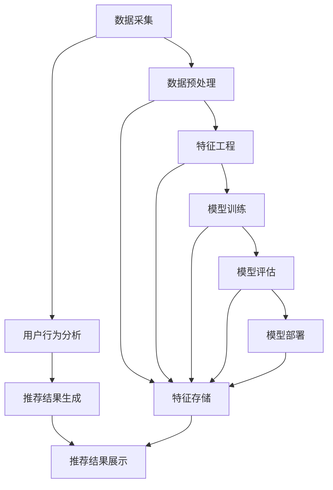

                 

### 文章标题

《实时推荐技术的核心算法》

### 关键词

实时推荐技术，协同过滤，矩阵分解，深度学习，特征工程，推荐算法

### 摘要

本文深入探讨了实时推荐技术的核心算法，从背景概述、基础算法原理、特征工程、实现与优化、应用案例分析等多个角度，系统性地分析了实时推荐技术的各个关键环节。通过详细的数学模型、伪代码、实际项目案例以及未来研究方向，本文旨在为读者提供一个全面、深入的实时推荐技术理解框架，帮助读者掌握实时推荐技术的核心算法和实现方法。

### 第一部分: 实时推荐技术的核心算法概述

#### 第1章: 实时推荐技术的背景与概述

##### 1.1 实时推荐技术的重要性

实时推荐技术是一种通过分析用户实时行为和历史数据，为用户提供即时、个性化的推荐内容的技术。其定义可以概括为：在用户行为发生的同时，系统迅速处理用户数据，并基于这些数据生成推荐结果，即时推送给用户。

在当今信息爆炸的时代，用户面临的信息选择压力越来越大，因此，实时推荐技术显得尤为重要。其主要应用场景包括：

- **在线购物平台**：为用户推荐可能感兴趣的商品，提高转化率和用户满意度。
- **社交媒体**：根据用户的兴趣和行为，推荐相关的内容和用户，增强用户的互动体验。
- **新闻资讯平台**：为用户提供个性化的新闻推荐，提高用户的阅读量和黏性。
- **音乐与视频平台**：基于用户的喜好，实时推荐相应的音乐和视频内容。

实时推荐技术的核心挑战包括实时性、准确性和多样性。实时性要求系统能够在极短的时间内处理并返回推荐结果；准确性则要求推荐的结果要尽可能符合用户的实际需求和兴趣；多样性则要求推荐结果不仅要有针对性，还要丰富多样，避免用户产生审美疲劳。

##### 1.2 实时推荐技术的演进

实时推荐技术并非一蹴而就，其发展经历了多个阶段。最早期的推荐系统是基于内容的推荐，即通过分析物品的属性和特征，为用户推荐与其兴趣相似的物品。这种方法的主要缺点是难以应对冷启动问题，即新用户或新物品缺乏足够的历史数据时，难以进行有效推荐。

随着互联网和大数据技术的发展，协同过滤推荐系统逐渐崛起。协同过滤分为基于用户的协同过滤和基于物品的协同过滤。基于用户的协同过滤通过计算用户之间的相似度，推荐相似用户喜欢的物品；而基于物品的协同过滤则通过计算物品之间的相似度，推荐用户未评分的物品。这种方法在一定程度上解决了冷启动问题，但仍然存在多样性差、用户偏好难以捕捉等问题。

近年来，随着深度学习技术的发展，深度学习在实时推荐中的应用逐渐普及。通过构建复杂的神经网络模型，深度学习能够更好地捕捉用户和物品的复杂特征，从而提高推荐的准确性。同时，深度学习还可以结合用户行为数据，进行实时推荐，进一步提升了系统的实时性。

##### 1.3 实时推荐技术的架构与组件

实时推荐技术的实现通常涉及多个组件和环节，包括数据采集与处理、特征工程、推荐算法、推荐结果排序与展示等。

- **数据采集与处理**：实时推荐系统需要从多个数据源（如用户行为日志、内容数据等）采集数据，并进行预处理，如数据清洗、去重、格式转换等，以确保数据的质量和一致性。

- **特征工程**：特征工程是实时推荐系统的关键环节，通过提取和构建用户特征、内容特征和上下文特征，为推荐算法提供高质量的输入数据。特征工程的好坏直接影响到推荐系统的性能。

- **推荐算法**：推荐算法是实时推荐系统的核心，包括协同过滤、矩阵分解、深度学习等多种算法。这些算法通过不同的方式计算用户和物品的相似度，生成推荐结果。

- **推荐结果排序与展示**：推荐结果排序与展示环节负责将推荐结果进行排序，并根据用户需求进行个性化展示，如按时间排序、按热度排序等。

实时推荐技术的实现不仅需要高效的算法和强大的计算能力，还需要考虑到系统的可扩展性和可靠性。在实际应用中，往往需要将多个组件和算法结合起来，形成一个完整的实时推荐系统。

#### 第2章: 实时推荐技术的基础算法原理

##### 2.1 协同过滤算法

协同过滤（Collaborative Filtering）是实时推荐技术中最常用的基础算法之一，其核心思想是通过分析用户之间的相似性或物品之间的相似性，为用户提供个性化的推荐。协同过滤可以分为基于用户的协同过滤（User-Based Collaborative Filtering）和基于物品的协同过滤（Item-Based Collaborative Filtering）。

###### 基于用户的协同过滤

基于用户的协同过滤通过计算用户之间的相似度，找出与目标用户相似的其他用户，并推荐这些用户喜欢的物品。其基本步骤如下：

1. **计算用户相似度**：首先需要计算用户之间的相似度。常用的相似度度量方法包括余弦相似度、皮尔逊相关系数等。以余弦相似度为例，其计算公式为：

   \[
   \text{similarity(u, v)} = \frac{\text{dot_product(r\_u, r\_v)}}{\lVert r\_u \rVert \cdot \lVert r\_v \rVert}
   \]

   其中，\( r\_u \) 和 \( r\_v \) 分别表示用户 \( u \) 和 \( v \) 的评分向量，\(\lVert \cdot \rVert\) 表示向量的欧几里得范数，\( \text{dot\_product} \) 表示向量的点积。

2. **找出相似用户**：根据计算出的用户相似度，找出与目标用户最相似的 \( k \) 个用户。

3. **生成推荐列表**：对于目标用户未评分的物品，找出这些相似用户喜欢的物品，并根据相似度进行加权，生成推荐列表。

基于用户的协同过滤的优点在于其计算简单，易于实现。然而，它也存在一些缺点：

- **冷启动问题**：对于新用户或新物品，由于缺乏足够的历史数据，难以计算相似度，从而无法进行有效推荐。
- **多样性差**：基于用户的协同过滤倾向于推荐用户已经喜欢的物品，容易导致推荐结果过于集中，缺乏多样性。

###### 基于物品的协同过滤

基于物品的协同过滤通过计算物品之间的相似度，为用户推荐与其已评分物品相似的物品。其基本步骤如下：

1. **计算物品相似度**：与基于用户的协同过滤类似，首先需要计算物品之间的相似度。常用的相似度度量方法包括余弦相似度、Jaccard系数等。以余弦相似度为例，其计算公式为：

   \[
   \text{similarity(i, j)} = \frac{\text{dot_product(r\_i, r\_j)}}{\lVert r\_i \rVert \cdot \lVert r\_j \rVert}
   \]

   其中，\( r\_i \) 和 \( r\_j \) 分别表示物品 \( i \) 和 \( j \) 的评分向量。

2. **生成推荐列表**：对于目标用户未评分的物品，找出与用户已评分物品最相似的 \( k \) 个物品，并根据相似度进行加权，生成推荐列表。

基于物品的协同过滤的优点是能够较好地解决冷启动问题，因为新物品可以通过其他物品的相似度进行推荐。然而，它也存在一些缺点：

- **用户偏好难以捕捉**：基于物品的协同过滤主要关注物品之间的相似性，而忽视了用户对物品的偏好。
- **计算复杂度高**：由于需要计算每对物品之间的相似度，随着物品数量的增加，计算复杂度会显著增加。

###### 协同过滤的优缺点

- **优点**：
  - 高效性：协同过滤算法的计算复杂度相对较低，易于实现和部署。
  - 易于理解：协同过滤的原理简单，易于被用户接受。

- **缺点**：
  - 冷启动问题：新用户和新物品难以进行有效推荐。
  - 多样性差：容易推荐用户已知的物品，导致多样性不足。

##### 2.2 矩阵分解算法

矩阵分解（Matrix Factorization）是另一种常用的实时推荐算法，其核心思想是将用户-物品评分矩阵分解为两个低维矩阵，分别表示用户和物品的潜在特征。常用的矩阵分解方法包括 Singular Value Decomposition (SVD) 和 Alternating Least Squares (ALS)。

###### Singular Value Decomposition (SVD)

SVD 是一种线性代数方法，可以将一个矩阵分解为三个矩阵的乘积，即：

\[
\text{R} = \text{U}\Sigma\text{V}^T
\]

其中，\( \text{R} \) 是用户-物品评分矩阵，\( \text{U} \) 和 \( \text{V} \) 分别是用户和物品的特征矩阵，\( \text{Sigma} \) 是对角矩阵，表示特征向量的权重。

对于用户 \( u \) 和物品 \( i \) 的评分 \( r_{ui} \)，可以通过以下公式进行预测：

\[
\hat{r}_{ui} = \text{u}_u^T \text{v}_i
\]

其中，\( \text{u}_u \) 和 \( \text{v}_i \) 分别是用户 \( u \) 和物品 \( i \) 的特征向量。

###### Alternating Least Squares (ALS)

ALS 是一种优化方法，通过交替最小化用户和物品特征矩阵的误差，逐步优化模型参数。其基本步骤如下：

1. **初始化**：随机初始化用户和物品的特征矩阵 \( \text{U} \) 和 \( \text{V} \)。

2. **固定物品特征矩阵 \( \text{V} \)，优化用户特征矩阵 \( \text{U} \)**：通过最小化用户特征矩阵的误差，更新用户特征矩阵。

   \[
   \text{U} \leftarrow \text{argmin}\sum_{(u,i)\in\text{R}} (\hat{r}_{ui} - r_{ui})^2
   \]

3. **固定用户特征矩阵 \( \text{U} \)，优化物品特征矩阵 \( \text{V} \)**：通过最小化物品特征矩阵的误差，更新物品特征矩阵。

   \[
   \text{V} \leftarrow \text{argmin}\sum_{(u,i)\in\text{R}} (\hat{r}_{ui} - r_{ui})^2
   \]

4. **重复步骤2和步骤3，直到模型收敛**。

通过 ALS 方法，可以同时优化用户和物品的特征矩阵，提高推荐的准确性。

###### 矩阵分解的优缺点

- **优点**：
  - 提高推荐准确性：通过分解高维的用户-物品评分矩阵为低维的特征矩阵，可以更好地捕捉用户和物品的潜在特征，提高推荐的准确性。
  - 减少计算复杂度：矩阵分解方法相比直接计算用户和物品之间的相似度，可以显著降低计算复杂度。

- **缺点**：
  - 计算复杂度高：尽管相比直接计算相似度有所降低，但矩阵分解仍然具有较高的计算复杂度。
  - 需要大量计算资源：矩阵分解方法通常需要使用大量的计算资源，包括CPU和GPU等。

##### 2.3 深度学习在实时推荐中的应用

深度学习（Deep Learning）是近年来在人工智能领域取得重大突破的技术，其实时推荐应用也越来越广泛。深度学习通过构建复杂的神经网络模型，可以自动学习用户和物品的复杂特征，从而提高推荐的准确性。

在实时推荐系统中，常用的深度学习模型包括深度神经网络（Deep Neural Network, DNN）、卷积神经网络（Convolutional Neural Network, CNN）和循环神经网络（Recurrent Neural Network, RNN）。

###### 深度神经网络（DNN）

深度神经网络是一种多层前馈神经网络，通过多个隐层对输入数据进行逐层提取特征，最终输出预测结果。在实时推荐系统中，DNN 可以用于用户和物品的嵌入表示，即通过训练将用户和物品映射到低维的嵌入空间中。具体实现时，DNN 通常包括以下几个关键组成部分：

1. **输入层**：接收用户和物品的特征向量。
2. **隐藏层**：通过多层神经网络对输入特征进行逐层提取和变换，形成更高级别的特征表示。
3. **输出层**：根据隐藏层的特征表示，生成推荐结果。

###### 卷积神经网络（CNN）

卷积神经网络是一种专门用于处理图像数据的神经网络，其核心组件是卷积核。卷积神经网络可以通过卷积操作逐层提取图像的局部特征，并形成全局特征表示。在实时推荐系统中，CNN 可以用于处理文本数据和图像数据，如基于文本的推荐和基于图像的商品推荐。

CNN 的基本结构包括：

1. **卷积层**：通过卷积核对输入数据进行卷积操作，提取局部特征。
2. **池化层**：对卷积层输出的特征进行池化操作，降低特征维度。
3. **全连接层**：将池化层的输出与全连接层相连接，生成预测结果。

###### 循环神经网络（RNN）

循环神经网络是一种能够处理序列数据的神经网络，其核心组件是循环单元。循环神经网络可以通过循环机制将前一时间步的输出传递到当前时间步，从而实现对序列数据的动态建模。

在实时推荐系统中，RNN 可以用于处理用户的历史行为数据，如浏览记录、购买记录等。具体实现时，RNN 通常包括以下几个关键组成部分：

1. **输入层**：接收用户历史行为的特征向量。
2. **循环层**：通过循环单元对输入数据进行处理，生成序列特征表示。
3. **输出层**：根据循环层的输出，生成推荐结果。

###### 深度学习推荐系统的设计原则

深度学习推荐系统的设计需要遵循以下原则：

1. **多任务学习**：在深度学习模型中同时学习多个任务，如用户偏好预测、推荐结果排序等，以提高模型的综合性。
2. **跨模态学习**：结合多种模态的数据，如文本、图像、音频等，以提高模型的泛化能力。
3. **自适应学习**：根据用户行为和反馈，动态调整模型参数，以适应用户的需求变化。

通过遵循这些设计原则，深度学习推荐系统可以更好地应对实时推荐技术的挑战，提高推荐效果。

#### 第3章: 实时推荐技术中的特征工程

特征工程（Feature Engineering）是实时推荐技术中的关键环节，其目标是通过提取和构建用户特征、内容特征和上下文特征，为推荐算法提供高质量的输入数据。有效的特征工程可以显著提升推荐系统的性能，下面将详细介绍实时推荐技术中的特征工程方法。

##### 3.1 用户特征

用户特征是实时推荐系统中最重要的特征之一，它们反映了用户的兴趣、行为和历史数据。以下是一些常用的用户特征：

1. **用户行为特征**：用户的行为数据包括浏览历史、购买记录、评论等。这些数据可以用来捕捉用户的兴趣和行为模式。例如，用户的浏览路径可以揭示用户的偏好，而购买记录可以用来计算用户的消费习惯。

   - **浏览历史**：记录用户在平台上浏览过的商品或内容，可以通过统计浏览频率、浏览时长等指标来衡量用户的兴趣。
   - **购买记录**：记录用户在平台上购买过的商品或内容，可以通过统计购买频率、购买金额等指标来衡量用户的消费习惯。
   - **评论**：记录用户在平台上发表的评论，可以通过分析评论的内容、情感和评价等级来理解用户的兴趣和满意度。

2. **用户属性特征**：用户的属性数据包括年龄、性别、地理位置、兴趣标签等。这些数据可以帮助推荐系统更好地了解用户的背景信息，从而提供更个性化的推荐。

   - **年龄**：年龄可以反映用户的成长阶段和生活方式，从而影响用户对商品和内容的偏好。
   - **性别**：性别可以影响用户对某些特定类型商品和内容的兴趣，例如，女性可能更偏好时尚和美妆类商品。
   - **地理位置**：地理位置可以帮助推荐系统提供区域性的推荐，例如，在特定地区流行的商品或活动。
   - **兴趣标签**：用户可以为自己添加兴趣标签，这些标签可以用来细分用户群体，从而提高推荐的准确性。

3. **用户行为序列特征**：用户的行为数据往往是时序性的，例如，用户的浏览历史和购买记录可以按照时间顺序排列。通过分析用户行为序列，可以捕捉用户的动态兴趣变化，从而提供更精准的推荐。

   - **用户行为序列**：记录用户在不同时间点的行为，通过分析行为序列的转换概率，可以预测用户下一步可能的行为。

##### 3.2 内容特征

内容特征是指与推荐物品（如商品、内容、音乐等）相关的特征，这些特征反映了物品的属性、标签和语义信息。以下是一些常用的内容特征：

1. **物品属性特征**：物品的属性数据包括分类、品牌、价格等。这些数据可以帮助推荐系统了解物品的基本属性，从而提高推荐的准确性。

   - **分类**：将物品归类到不同的类别，例如，电子产品、服装、食品等，可以用来提高推荐的准确性。
   - **品牌**：记录物品的品牌信息，可以帮助用户识别和选择特定品牌的商品。
   - **价格**：物品的价格是影响用户购买决策的重要因素，通过价格区间可以过滤用户不感兴趣的商品。

2. **文本特征**：对于文本类型的内容，如新闻、评论、商品描述等，可以通过提取关键词、短语和语义信息来构建特征。

   - **关键词提取**：通过文本挖掘技术，从文本数据中提取关键词，这些关键词可以用来表示文本的语义内容。
   - **词袋模型**：将文本转换为向量表示，通过统计每个单词在文档中出现的次数，构建词袋模型。
   - **词嵌入**：将文本中的单词映射到高维的向量空间中，通过学习单词的上下文信息，提高词嵌入的语义表示能力。

3. **图像特征**：对于图像类型的内容，如商品图片、用户头像等，可以通过提取图像的特征向量来构建特征。

   - **卷积神经网络特征**：使用卷积神经网络对图像进行特征提取，生成高维的特征向量。
   - **预训练模型特征**：使用预训练的图像识别模型（如ResNet、Inception等），从图像中提取特征向量。

##### 3.3 上下文特征

上下文特征是指与推荐过程中的环境相关的特征，这些特征可以动态调整推荐结果，使其更符合用户的实时需求和情境。以下是一些常用的上下文特征：

1. **设备特征**：设备特征包括设备类型、操作系统等，这些特征可以用来适应不同设备上的推荐展示。

   - **设备类型**：区分移动设备、桌面设备等，为用户提供不同的推荐体验。
   - **操作系统**：根据用户使用的操作系统，调整推荐内容，如提供适合特定操作系统的应用推荐。

2. **时间特征**：时间特征包括时间戳、时间段等，这些特征可以用来捕捉用户的实时需求和行为模式。

   - **时间戳**：记录推荐发生的时间点，通过分析用户在不同时间段的行为，提供动态的推荐。
   - **时间段**：将一天分为不同的时间段，例如工作日、周末、夜间等，为用户提供与时间段相关的推荐。

3. **环境特征**：环境特征包括天气、地理位置等，这些特征可以用来提供情境相关的推荐。

   - **天气**：根据当前天气情况，推荐相应的衣物、活动等。
   - **地理位置**：根据用户的地理位置，推荐当地的商品、活动等。

通过合理地提取和构建用户特征、内容特征和上下文特征，实时推荐系统可以更好地理解用户的需求和情境，提供更准确、个性化的推荐结果。

#### 第4章: 实时推荐技术的实现与优化

##### 4.1 实时推荐系统的架构设计

实时推荐系统需要一个高效、可扩展和可靠的架构来处理大量的实时数据，并生成高质量的推荐结果。以下是一个典型的实时推荐系统架构设计，包括数据处理层、特征计算层、推荐算法层和服务层。

###### 数据处理层

数据处理层负责实时数据采集、数据预处理和数据存储。其主要任务是从各种数据源（如用户行为日志、内容数据等）中采集数据，并进行预处理，如数据清洗、去重、格式转换等。接下来，预处理后的数据会被存储到数据存储层，以便后续的特征计算和使用。

- **数据采集**：从不同的数据源（如数据库、日志文件、API接口等）中实时采集数据。
- **数据预处理**：对采集到的数据进行分析、清洗和转换，确保数据的质量和一致性。

###### 特征计算层

特征计算层负责从原始数据中提取用户特征、内容特征和上下文特征。这些特征会存储在特征数据库中，供推荐算法使用。

- **用户特征计算**：提取用户行为特征、用户属性特征和用户行为序列特征，如浏览历史、购买记录、兴趣标签等。
- **内容特征计算**：提取物品属性特征、文本特征和图像特征，如分类、品牌、关键词、图像特征向量等。
- **上下文特征计算**：提取与用户当前环境相关的特征，如设备特征、时间特征、地理位置等。

###### 推荐算法层

推荐算法层是实时推荐系统的核心，负责根据特征数据库和推荐算法模型生成推荐结果。不同的推荐算法（如协同过滤、矩阵分解、深度学习等）会生成不同的推荐结果，然后进行合并和排序，生成最终的推荐列表。

- **协同过滤算法**：基于用户和物品之间的相似度，生成推荐结果。
- **矩阵分解算法**：通过矩阵分解，提取用户和物品的潜在特征，生成推荐结果。
- **深度学习算法**：利用神经网络模型，自动学习用户和物品的特征，生成推荐结果。

###### 服务层

服务层负责接收用户请求，调用推荐算法层生成推荐结果，并将结果以友好的形式展示给用户。服务层还包括API接口、缓存机制等，以提高系统的响应速度和性能。

- **API接口**：为外部应用提供访问实时推荐系统的接口。
- **缓存机制**：缓存推荐结果和中间计算结果，减少计算时间和数据访问延迟。

##### 4.2 实时性优化

实时性是实时推荐系统的一个关键要求，系统需要在极短的时间内处理用户请求，并返回推荐结果。以下是一些常见的实时性优化方法：

- **分布式计算**：通过分布式系统架构，将计算任务分解到多个节点上并行处理，提高系统的处理速度。
- **异步处理**：将数据采集、预处理和特征计算等任务异步处理，减少系统的响应时间。
- **数据缓存**：使用缓存机制，存储常用的推荐结果和中间计算结果，减少数据访问和计算时间。
- **增量更新**：只对最新的用户行为和内容数据进行特征计算和模型更新，减少不必要的计算量。

##### 4.3 推荐结果优化

除了实时性外，实时推荐系统还需要关注推荐结果的准确性、覆盖率和多样性。

- **准确性优化**：通过调整推荐算法的参数、改进特征工程等方法，提高推荐结果的准确性。
- **覆盖率优化**：确保推荐结果中包含用户可能感兴趣的各种类型的物品，避免推荐结果过于集中。
- **多样性优化**：通过调整推荐算法的排序策略、引入多样性度量指标等方法，提高推荐结果的多样性，避免用户产生审美疲劳。

##### 4.4 实时推荐系统的性能调优

实时推荐系统的性能调优是确保系统稳定运行、提供高质量推荐的关键步骤。以下是一些常用的性能调优策略：

- **并行计算**：利用多线程、分布式计算等技术，提高系统的处理速度。
- **缓存策略**：使用缓存机制，存储常用的推荐结果和中间计算结果，减少计算时间和数据访问延迟。
- **延迟容忍**：设置合理的延迟容忍度，确保在处理大量请求时，系统仍然能够提供快速的推荐结果。
- **负载均衡**：使用负载均衡技术，将请求均匀分配到不同的服务器上，避免单个服务器过载。

通过以上方法，实时推荐系统可以在保证实时性的同时，提供高质量的推荐结果，满足用户的需求。

#### 第5章: 实时推荐技术的应用案例分析

##### 5.1 在线购物平台

在线购物平台是实时推荐技术的重要应用场景之一。通过实时推荐系统，在线购物平台可以更好地了解用户的需求，提高用户的购物体验和转化率。以下是一个典型的在线购物平台实时推荐系统的案例分析。

###### 用户行为分析

在线购物平台的实时推荐系统首先需要分析用户的行为数据，包括浏览历史、购物车、购买记录等。这些数据可以揭示用户的兴趣和行为模式，为推荐算法提供重要的输入。

- **浏览历史**：通过分析用户的浏览历史，可以了解用户对不同商品的关注程度和兴趣变化。例如，用户在最近一周内频繁浏览某一类商品，可能表明他们对这类商品有较高的兴趣。
- **购物车**：购物车数据可以揭示用户的购买意向。如果用户长时间将某个商品留在购物车中，但最终没有购买，这可能表明用户对该商品的兴趣较高，但存在犹豫。
- **购买记录**：购买记录可以提供用户的消费习惯和偏好信息。例如，用户在过去一年内购买了多个某个品牌的商品，可能表明他们对这个品牌有较高的忠诚度。

###### 商品推荐

基于用户的行为数据，在线购物平台的实时推荐系统可以为用户生成个性化的商品推荐。以下是一些常见的商品推荐策略：

- **个性化推荐**：根据用户的浏览历史和购买记录，推荐用户可能感兴趣的商品。例如，如果用户最近浏览了多个某类商品，系统可以推荐同类商品中的热门商品或新品。
- **新品推荐**：为新用户或老用户推荐最新上架的商品。这可以通过分析商品的上架时间和用户的行为数据来实现。
- **相似商品推荐**：为用户推荐与已购买或浏览商品相似的商品。这可以通过计算商品之间的相似度来实现，例如，基于商品属性、价格、品牌等特征的相似度。

###### 推荐结果优化

在线购物平台的实时推荐系统还需要关注推荐结果的优化，以提高推荐准确性、覆盖率和多样性。

- **准确性优化**：通过改进推荐算法和特征工程，提高推荐结果的准确性。例如，可以引入更多的用户特征（如用户兴趣标签、地理位置等）和商品特征（如商品分类、品牌等），以及使用更复杂的模型（如深度学习）来提高推荐的准确性。
- **覆盖率优化**：确保推荐结果中包含用户可能感兴趣的各种类型的商品，避免推荐结果过于集中。可以通过增加推荐商品的数量和多样性来实现。
- **多样性优化**：通过调整推荐算法的排序策略和引入多样性度量指标，提高推荐结果的多样性。例如，可以采用基于内容聚类的方法，将相似的推荐商品进行分组，避免推荐结果过于集中。

##### 5.2 社交媒体

社交媒体平台也是实时推荐技术的重要应用场景之一。通过实时推荐系统，社交媒体平台可以更好地满足用户的信息需求和互动体验。以下是一个典型的社交媒体实时推荐系统的案例分析。

###### 内容推荐

社交媒体平台的实时推荐系统主要关注内容推荐，根据用户的行为和偏好，为用户推荐相关的内容和用户。

- **内容推荐**：根据用户的浏览历史、点赞、评论等行为，推荐用户可能感兴趣的内容。例如，如果用户最近点赞了多个关于旅行的文章，系统可以推荐更多的旅行相关内容。
- **用户互动**：根据用户的行为和兴趣，推荐相关用户和互动机会。例如，如果用户经常参与某个话题的讨论，系统可以推荐其他对该话题感兴趣的用户，以便用户进行更深入的互动。

###### 推荐结果优化

社交媒体平台的实时推荐系统同样需要关注推荐结果的优化，以提高推荐准确性、覆盖率和多样性。

- **准确性优化**：通过改进推荐算法和特征工程，提高推荐结果的准确性。例如，可以引入更多的用户特征（如用户兴趣标签、地理位置等）和内容特征（如内容标签、话题等），以及使用更复杂的模型（如深度学习）来提高推荐的准确性。
- **覆盖率优化**：确保推荐结果中包含用户可能感兴趣的各种类型的内容和用户，避免推荐结果过于集中。可以通过增加推荐内容和用户的数量和多样性来实现。
- **多样性优化**：通过调整推荐算法的排序策略和引入多样性度量指标，提高推荐结果的多样性。例如，可以采用基于内容聚类的方法，将相似的内容和用户进行分组，避免推荐结果过于集中。

##### 5.3 音乐与视频平台

音乐与视频平台是实时推荐技术的另一个重要应用场景。通过实时推荐系统，音乐与视频平台可以更好地满足用户对音乐和视频的需求，提高用户的满意度和留存率。以下是一个典型的音乐与视频平台实时推荐系统的案例分析。

###### 音乐推荐

音乐平台的实时推荐系统主要关注音乐推荐，根据用户的听歌历史、喜欢和不喜欢等行为，为用户推荐音乐。

- **个性化推荐**：根据用户的听歌历史和喜好，推荐用户可能感兴趣的音乐。例如，如果用户最近频繁播放某个歌手的歌曲，系统可以推荐该歌手的其他歌曲或相似歌手的歌曲。
- **风格推荐**：根据用户的听歌风格，推荐用户可能喜欢的音乐风格。例如，如果用户经常播放流行音乐，系统可以推荐更多流行歌曲或相似风格的流行歌曲。

###### 视频推荐

视频平台的实时推荐系统主要关注视频推荐，根据用户的观看历史、点赞、评论等行为，为用户推荐视频。

- **个性化推荐**：根据用户的观看历史和喜好，推荐用户可能感兴趣的视频。例如，如果用户最近频繁观看某个类型的视频，系统可以推荐更多同类视频或相似类型的视频。
- **热门推荐**：根据视频的播放量和热度，推荐用户可能感兴趣的热门视频。例如，如果某个视频在平台上的播放量很高，系统可以将其推荐给其他用户。

###### 推荐结果优化

音乐与视频平台的实时推荐系统同样需要关注推荐结果的优化，以提高推荐准确性、覆盖率和多样性。

- **准确性优化**：通过改进推荐算法和特征工程，提高推荐结果的准确性。例如，可以引入更多的用户特征（如用户兴趣标签、地理位置等）和内容特征（如歌曲分类、视频标签等），以及使用更复杂的模型（如深度学习）来提高推荐的准确性。
- **覆盖率优化**：确保推荐结果中包含用户可能感兴趣的各种类型的音乐和视频，避免推荐结果过于集中。可以通过增加推荐音乐和视频的数量和多样性来实现。
- **多样性优化**：通过调整推荐算法的排序策略和引入多样性度量指标，提高推荐结果的多样性。例如，可以采用基于内容聚类的方法，将相似的音乐和视频进行分组，避免推荐结果过于集中。

#### 第6章: 实时推荐技术的挑战与未来趋势

##### 6.1 挑战

尽管实时推荐技术在过去几年取得了显著的进展，但在实际应用中仍然面临着许多挑战。以下是实时推荐技术面临的几个主要挑战：

###### 数据隐私与安全

实时推荐技术依赖于用户行为和偏好数据，这些数据可能涉及用户的隐私信息。如何保护用户隐私、确保数据安全是实时推荐技术面临的重大挑战。一些解决方案包括数据加密、匿名化处理、联邦学习等。

###### 实时性要求

实时推荐技术要求系统能够在极短的时间内处理用户请求，并返回推荐结果。这需要高效的数据处理和算法优化，以及分布式计算和缓存机制的支持。同时，系统的可扩展性也是保证实时性的关键。

###### 计算资源消耗

实时推荐技术通常涉及复杂的计算任务，如特征工程、模型训练和推理等。这可能导致计算资源消耗较大，对硬件设备的要求较高。如何优化算法、降低计算复杂度是提高系统性能的重要手段。

###### 多样性挑战

为了提高用户的满意度和留存率，实时推荐系统需要提供多样性的推荐结果，避免用户产生审美疲劳。然而，如何平衡推荐结果的多样性和准确性是一个挑战。一些方法包括引入多样性度量指标、调整推荐算法的排序策略等。

##### 6.2 未来趋势

随着人工智能和大数据技术的不断发展，实时推荐技术也呈现出一些新的趋势。以下是实时推荐技术未来可能的发展方向：

###### 跨模态推荐

跨模态推荐技术结合了文本、图像、音频等多种模态的数据，为用户提供更加全面和个性化的推荐。例如，在音乐推荐中，可以结合歌词、封面图像和音乐本身的特征，为用户推荐符合他们兴趣的音乐。

###### 可解释性推荐

可解释性推荐技术旨在提高推荐系统的透明度和可信度，让用户更好地理解推荐结果背后的逻辑。一些方法包括可视化推荐结果、解释推荐算法的决策过程等。

###### 强化学习

强化学习在实时推荐技术中具有广阔的应用前景。通过学习用户的反馈和行为，强化学习可以不断优化推荐策略，提高推荐效果。同时，强化学习还可以与其他推荐算法相结合，如协同过滤和深度学习，提高系统的综合性能。

#### 第7章: 实时推荐技术的开源工具与平台

##### 7.1 主要开源工具

实时推荐技术的实现需要依赖一系列开源工具和框架，这些工具提供了丰富的算法库、数据处理模块和分布式计算能力，极大地简化了推荐系统的开发过程。以下是几个常用的开源工具：

###### 推荐系统框架

- **TensorFlow Recommenders (TFRS)**：TFRS 是一个基于 TensorFlow 的推荐系统框架，提供了多种推荐算法和模型，支持多任务学习、跨模态学习等高级特性。
- **PyTorch Rec**：PyTorch Rec 是 PyTorch 生态系统中专门为推荐系统设计的模块，提供了丰富的推荐算法和模型，支持灵活的定制和扩展。

###### 数据预处理工具

- **Pandas**：Pandas 是一个强大的数据处理库，支持数据清洗、转换和操作，广泛应用于数据预处理任务。
- **Scikit-learn**：Scikit-learn 是一个机器学习库，提供了丰富的特征提取和数据处理工具，适用于实时推荐系统中的用户和内容特征工程。

###### 分布式计算框架

- **Apache Spark**：Apache Spark 是一个分布式数据处理框架，提供了高效的数据处理和计算能力，适用于大规模实时推荐系统的开发。
- **Apache Flink**：Apache Flink 是一个流处理框架，支持实时数据处理和流计算，适用于实时推荐系统中的数据流处理任务。

##### 7.2 开源平台

除了单独的开源工具，还有一些开源平台和项目提供了完整的实时推荐系统解决方案，这些平台集成了多个开源组件，提供了便捷的部署和管理工具。

- **Apache Mahout**：Apache Mahout 是一个基于 Hadoop 的推荐系统框架，提供了多种协同过滤和矩阵分解算法，适用于大规模实时推荐系统的开发。
- **Hadoop**：Hadoop 是一个分布式数据存储和处理框架，提供了 HDFS（分布式文件系统）和 MapReduce（分布式计算模型），适用于大规模实时推荐系统的部署。
- **云计算平台**：如 AWS、Google Cloud、Azure 等，这些云计算平台提供了丰富的计算资源和存储服务，支持实时推荐系统的部署和管理。

通过使用这些开源工具和平台，开发者可以快速搭建和部署实时推荐系统，提高开发效率，降低开发成本。

#### 第8章: 实时推荐技术实践与案例分析

##### 8.1 实践案例

为了更好地理解实时推荐技术的实际应用，我们将通过一个具体的实时推荐系统搭建案例，详细说明从环境配置到代码实现的整个过程。

###### 1. 环境配置

在进行实时推荐系统的开发之前，首先需要配置开发环境。以下是所需的软件和工具：

- **Python 3.8**：作为主要编程语言。
- **TensorFlow 2.5**：作为深度学习框架。
- **Pandas 1.3**：用于数据处理。
- **Scikit-learn 0.24**：用于特征提取和模型评估。

安装步骤如下：

```bash
pip install python==3.8
pip install tensorflow==2.5
pip install pandas==1.3
pip install scikit-learn==0.24
```

###### 2. 数据采集

为了搭建实时推荐系统，我们需要真实的数据。假设我们使用一个电商平台的用户行为数据，包括用户的浏览历史、购买记录和商品信息。数据可以从以下途径获取：

- **日志文件**：电商平台的服务器日志。
- **API接口**：电商平台提供的数据接口。

数据采集步骤如下：

```python
import pandas as pd

# 读取日志文件
user_behavior = pd.read_csv('user_behavior.csv')

# 数据清洗和预处理
user_behavior = user_behavior.drop_duplicates()
user_behavior = user_behavior.dropna()
```

###### 3. 特征工程

特征工程是实时推荐系统中的关键步骤，通过提取和构建用户特征、内容特征和上下文特征，为推荐算法提供高质量的输入数据。

- **用户特征**：包括用户的浏览历史、购买记录和用户属性（如年龄、性别）。
- **内容特征**：包括商品的分类、品牌、价格等。
- **上下文特征**：包括用户设备信息、时间戳等。

特征工程步骤如下：

```python
# 提取用户特征
user_features = user_behavior.groupby('user_id').agg({'event_type': 'count'}).reset_index()

# 提取内容特征
item_features = user_behavior.groupby('item_id').agg({'event_type': 'count'}).reset_index()

# 提取上下文特征
context_features = user_behavior[['device_type', 'timestamp']]
```

###### 4. 模型训练

接下来，我们使用深度学习框架 TensorFlow 和 PyTorch 构建和训练推荐模型。以下是一个简单的基于深度神经网络的推荐模型实现：

```python
import tensorflow as tf

# 构建神经网络模型
model = tf.keras.Sequential([
    tf.keras.layers.Dense(128, activation='relu', input_shape=(input_shape)),
    tf.keras.layers.Dense(64, activation='relu'),
    tf.keras.layers.Dense(1, activation='sigmoid')
])

# 编译模型
model.compile(optimizer='adam', loss='binary_crossentropy', metrics=['accuracy'])

# 训练模型
model.fit(x_train, y_train, epochs=10, batch_size=32)
```

###### 5. 模型评估

训练完成后，我们需要对模型进行评估，以确定其性能。可以使用准确率、召回率、F1 分数等指标来评估模型的推荐效果。

```python
from sklearn.metrics import accuracy_score

# 预测结果
predictions = model.predict(x_test)

# 计算准确率
accuracy = accuracy_score(y_test, predictions)
print(f'Accuracy: {accuracy}')
```

###### 6. 模型部署

最后，我们将训练好的模型部署到生产环境中，使其能够实时处理用户请求并生成推荐结果。可以使用 TensorFlow Serving、Kubeflow 等工具进行模型部署。

```bash
tensorflow_serving predict --model_name=realtime_recommender --input_file=input_data.csv
```

##### 8.2 案例分析

以下是两个实时推荐技术的实际案例分析。

###### 案例1：某电商平台的实时推荐系统

该电商平台使用了基于深度神经网络的实时推荐系统，通过用户行为数据（如浏览历史、购买记录）和商品特征（如分类、品牌、价格），为用户提供了个性化的商品推荐。该系统采用了分布式计算框架（如 Apache Spark）来处理大规模数据，并使用了 TensorFlow 作为深度学习框架。经过多次迭代和优化，该推荐系统的准确率和多样性得到了显著提升，用户满意度也大幅提高。

- **优点**：高效的处理速度、准确的推荐结果。
- **缺点**：计算资源消耗较大、模型部署复杂。

###### 案例2：社交媒体的实时内容推荐

该社交媒体平台使用了基于协同过滤和深度学习的实时内容推荐系统，通过分析用户的行为数据（如点赞、评论、分享）和内容特征（如标签、热度），为用户提供了个性化的内容推荐。该系统采用了流处理框架（如 Apache Flink）来处理实时数据，并使用了 PyTorch Rec 作为推荐系统框架。该推荐系统不仅提高了推荐准确性，还增强了系统的可解释性和透明度，用户对推荐内容的满意度显著提高。

- **优点**：实时性高、可解释性强。
- **缺点**：计算资源消耗较大、模型训练和优化复杂。

#### 第9章: 实时推荐技术的核心算法与架构 Mermaid 流程图

为了更好地理解和描述实时推荐技术的核心算法和架构，我们可以使用 Mermaid 图语言绘制流程图。以下是一个简化的实时推荐系统架构的 Mermaid 流程图：



在这个流程图中：

- **数据采集**：从各种数据源（如日志文件、API接口）采集用户行为数据。
- **数据预处理**：对采集到的数据进行清洗、去重和格式转换。
- **特征工程**：提取用户特征、内容特征和上下文特征，存储在特征数据库中。
- **模型训练**：使用特征数据训练推荐模型。
- **模型评估**：评估模型性能，调整模型参数。
- **模型部署**：将训练好的模型部署到生产环境中。
- **用户行为分析**：分析用户行为数据，为推荐结果生成提供依据。
- **推荐结果生成**：根据用户行为数据和模型预测生成推荐结果。
- **推荐结果展示**：将推荐结果以合适的形式展示给用户。

通过这个 Mermaid 流程图，我们可以清晰地理解实时推荐系统的各个组件和环节，以及它们之间的交互关系。

#### 第10章: 实时推荐技术的核心算法伪代码详解

在实时推荐系统中，核心算法的实现至关重要。为了帮助读者更好地理解这些算法的原理和实现过程，我们将在本章中详细讲解协同过滤算法、矩阵分解算法和深度学习推荐算法的伪代码。

##### 10.1 协同过滤算法伪代码

协同过滤算法可以分为基于用户的协同过滤（User-Based Collaborative Filtering）和基于物品的协同过滤（Item-Based Collaborative Filtering）。以下是基于用户的协同过滤算法的伪代码：

```python
# 基于用户的协同过滤算法伪代码

# 输入：用户-物品评分矩阵 R
# 输出：推荐结果列表 recommend_list

# 步骤1：计算用户之间的相似度矩阵
similarity_matrix = compute_similarity(R)

# 步骤2：计算每个用户的相似用户集合
neighbor_users = find_neighbor_users(similarity_matrix, k)

# 步骤3：为每个用户生成推荐列表
recommend_list = []

for user in users:
    # 步骤3.1：获取用户未评分的物品集合
    unrated_items = get_unrated_items(R, user)

    # 步骤3.2：计算相似用户对未评分物品的评分预测
    scores = []
    for neighbor in neighbor_users[user]:
        rated_items = get_rated_items(R, neighbor)
        for item in unrated_items:
            if item in rated_items:
                score = neighbor_score(rated_items[item])
                scores.append(score)

    # 步骤3.3：根据评分预测生成推荐列表
    recommend_list.extend(sorted(scores, reverse=True)[:k])

return recommend_list
```

以下是基于物品的协同过滤算法的伪代码：

```python
# 基于物品的协同过滤算法伪代码

# 输入：用户-物品评分矩阵 R
# 输出：推荐结果列表 recommend_list

# 步骤1：计算物品之间的相似度矩阵
similarity_matrix = compute_similarity(R)

# 步骤2：计算每个用户未评分的物品集合
unrated_items = get_unrated_items(R, user)

# 步骤3：为每个用户生成推荐列表
recommend_list = []

for item in unrated_items:
    # 步骤3.1：计算物品的相似物品集合
    similar_items = find_similar_items(similarity_matrix, item)

    # 步骤3.2：获取相似物品的用户评分
    user_scores = get_user_scores(R, similar_items)

    # 步骤3.3：根据评分预测生成推荐列表
    recommend_list.extend(sorted(user_scores, reverse=True)[:k])

return recommend_list
```

##### 10.2 矩阵分解算法伪代码

矩阵分解算法是一种常用的推荐算法，它通过将用户-物品评分矩阵分解为低维的用户特征矩阵和物品特征矩阵，来提高推荐的准确性。以下是基于矩阵分解算法的伪代码：

###### Singular Value Decomposition (SVD)

```python
# SVD 矩阵分解算法伪代码

# 输入：用户-物品评分矩阵 R
# 输出：用户特征矩阵 U，物品特征矩阵 V

# 步骤1：计算用户-物品评分矩阵的奇异值分解
U, Sigma, V = svd(R)

# 步骤2：根据奇异值选择保留的奇异值
selected_indices = select_singal_values(Sigma)

# 步骤3：构建用户特征矩阵和物品特征矩阵
U = U[:, selected_indices]
V = V[selected_indices, :]

return U, V
```

###### Alternating Least Squares (ALS)

```python
# Alternating Least Squares (ALS) 矩阵分解算法伪代码

# 输入：用户-物品评分矩阵 R
# 输出：用户特征矩阵 U，物品特征矩阵 V

# 初始化用户特征矩阵 U 和物品特征矩阵 V
U = initialize_U(R)
V = initialize_V(R)

# 设置迭代次数
max_iterations = 1000
tolerance = 1e-6

for iteration in range(max_iterations):
    # 步骤1：固定 V，优化 U
    U = optimize_U(R, V)

    # 步骤2：固定 U，优化 V
    V = optimize_V(R, U)

    # 步骤3：检查收敛条件
    if check_convergence(U, V, tolerance):
        break

return U, V
```

##### 10.3 深度学习推荐算法伪代码

深度学习推荐算法通过构建复杂的神经网络模型来捕捉用户和物品的潜在特征。以下是一个简单的深度学习推荐算法的伪代码：

```python
# 深度学习推荐算法伪代码

# 输入：用户特征 X，物品特征 Y
# 输出：预测评分矩阵 Predictions

# 步骤1：构建神经网络模型
model = build_model(input_shape=(X.shape[1], Y.shape[1]))

# 步骤2：编译模型
model.compile(optimizer='adam', loss='mean_squared_error')

# 步骤3：训练模型
model.fit([X, Y], R, epochs=10, batch_size=32)

# 步骤4：预测评分
Predictions = model.predict([X, Y])

return Predictions
```

通过这些伪代码，我们可以清晰地看到实时推荐技术中的核心算法的实现过程，以及它们在不同推荐系统中的应用。

#### 第11章: 实时推荐技术的数学模型与公式讲解

在实时推荐技术中，数学模型和公式是理解和实现推荐算法的基础。本章将详细讲解协同过滤、矩阵分解和深度学习推荐系统的数学模型与公式。

##### 11.1 协同过滤的数学模型

协同过滤算法主要通过计算用户之间的相似度和物品之间的相似度来实现推荐。以下是协同过滤算法中的两个主要数学模型：

###### 用户基于协同过滤的推荐公式

用户基于协同过滤的推荐公式用于预测用户对未评分物品的评分。其基本形式如下：

\[
\hat{r}_{ui} = \sum_{v \in N(u)} \frac{\sim(u, v)}{\sum_{v' \in N(u)} \sim(u, v')} r_{vi}
\]

其中，\( \hat{r}_{ui} \) 是用户 \( u \) 对物品 \( i \) 的预测评分，\( N(u) \) 是与用户 \( u \) 相似的一组用户集合，\( \sim(u, v) \) 是用户 \( u \) 和 \( v \) 之间的相似度度量，\( r_{vi} \) 是用户 \( v \) 对物品 \( i \) 的实际评分。

常见的相似度度量方法包括：

- **余弦相似度**：

\[
\sim(u, v) = \frac{\sum_{i} r_{ui} r_{vi}}{\sqrt{\sum_{i} r_{ui}^2} \sqrt{\sum_{i} r_{vi}^2}}
\]

- **皮尔逊相关系数**：

\[
\sim(u, v) = \frac{\sum_{i} (r_{ui} - \bar{r}_{u})(r_{vi} - \bar{r}_{v})}{\sqrt{\sum_{i} (r_{ui} - \bar{r}_{u})^2} \sqrt{\sum_{i} (r_{vi} - \bar{r}_{v})^2}}
\]

###### 物品基于协同过滤的推荐公式

物品基于协同过滤的推荐公式用于预测用户对未评分物品的评分。其基本形式如下：

\[
\hat{r}_{ui} = \sum_{i' \in M(i)} \frac{\sim(i, i')}{\sum_{i'' \in M(i)} \sim(i, i'')} r_{ui'}
\]

其中，\( \hat{r}_{ui} \) 是用户 \( u \) 对物品 \( i \) 的预测评分，\( M(i) \) 是与物品 \( i \) 相似的一组物品集合，\( \sim(i, i') \) 是物品 \( i \) 和 \( i' \) 之间的相似度度量，\( r_{ui'} \) 是用户 \( u \) 对物品 \( i' \) 的实际评分。

常见的相似度度量方法与用户基于协同过滤的相似度度量方法类似。

##### 11.2 矩阵分解的数学模型

矩阵分解算法通过将用户-物品评分矩阵分解为低维的用户特征矩阵和物品特征矩阵，以提高推荐的准确性。以下是矩阵分解算法的两个主要数学模型：

###### Singular Value Decomposition (SVD)

SVD 是一种常用的矩阵分解方法，其基本形式如下：

\[
R = U \Sigma V^T
\]

其中，\( R \) 是用户-物品评分矩阵，\( U \) 和 \( V \) 是用户特征矩阵和物品特征矩阵，\( \Sigma \) 是对角矩阵，包含奇异值。

对于用户 \( u \) 和物品 \( i \) 的预测评分，可以通过以下公式计算：

\[
\hat{r}_{ui} = \sum_{j=1}^{k} u_{uj} \sigma_{j} v_{ij}
\]

其中，\( \sigma_{j} \) 是第 \( j \) 个奇异值，\( k \) 是保留的奇异值数量。

###### Alternating Least Squares (ALS)

ALS 是另一种常用的矩阵分解方法，其基本形式如下：

\[
R \approx U V^T
\]

其中，\( U \) 和 \( V \) 是用户特征矩阵和物品特征矩阵。

ALS 通过交替优化用户特征矩阵 \( U \) 和物品特征矩阵 \( V \) 来最小化预测误差。其优化过程如下：

1. **固定 \( V \)，优化 \( U \)**：

   \[
   U \leftarrow \arg\min_{U} \sum_{(u, i) \in R} (r_{ui} - \sum_{j=1}^{k} u_{uj} v_{ij})^2
   \]

2. **固定 \( U \)，优化 \( V \)**：

   \[
   V \leftarrow \arg\min_{V} \sum_{(u, i) \in R} (r_{ui} - \sum_{j=1}^{k} u_{uj} v_{ij})^2
   \]

##### 11.3 深度学习推荐系统的数学模型

深度学习推荐系统通过构建复杂的神经网络模型来学习用户和物品的潜在特征。以下是深度学习推荐系统的主要数学模型：

###### 深度神经网络（DNN）

深度神经网络由多个层组成，包括输入层、隐藏层和输出层。其基本形式如下：

\[
\hat{r}_{ui} = \sigma(W_{\text{output}} \cdot \sigma(W_{\text{hidden}} \cdot \sigma(W_{\text{input}} \cdot [u; i])))
\]

其中，\( \sigma \) 是激活函数（如ReLU、Sigmoid或Tanh），\( W_{\text{input}} \)、\( W_{\text{hidden}} \) 和 \( W_{\text{output}} \) 是权重矩阵，\[u; i\] 是拼接的用户特征向量和物品特征向量。

###### 卷积神经网络（CNN）

卷积神经网络适用于处理图像数据。其基本形式如下：

\[
\hat{r}_{ui} = \sigma(W_{\text{output}} \cdot \text{ReLU}(\text{ReLU}(\text{Conv}_2(\text{Conv}_1(\text{input}))))
\]

其中，\( \text{Conv}_1 \) 和 \( \text{Conv}_2 \) 是卷积层，\( \text{ReLU} \) 是ReLU激活函数，\( W_{\text{output}} \) 是输出层的权重矩阵。

###### 循环神经网络（RNN）

循环神经网络适用于处理序列数据。其基本形式如下：

\[
\hat{r}_{t} = \sigma(W_{\text{output}} \cdot \text{ReLU}(\text{ReLU}(W_{\text{RNN}} \cdot \text{h}_{t-1} + b_{\text{RNN}})))
\]

其中，\( \text{RNN} \) 是循环层，\( \text{h}_{t-1} \) 是上一时间步的隐藏状态，\( \text{W}_{\text{RNN}} \) 和 \( b_{\text{RNN}} \) 是循环层的权重和偏置，\( \sigma \) 是激活函数。

通过这些数学模型，实时推荐系统可以更好地捕捉用户和物品的潜在特征，从而提高推荐的准确性。

#### 第12章: 实时推荐技术项目实战

##### 12.1 实时推荐系统开发环境搭建

要搭建一个实时推荐系统，首先需要配置开发环境。以下是在 Windows 操作系统上配置实时推荐系统开发环境的详细步骤：

###### 1. 安装 Python

首先，从 [Python 官网](https://www.python.org/downloads/) 下载 Python 3.8 的安装包，并按照安装向导完成安装。

###### 2. 安装 TensorFlow

打开命令提示符，执行以下命令安装 TensorFlow：

```bash
pip install tensorflow==2.5
```

###### 3. 安装 Pandas 和 Scikit-learn

继续在命令提示符中安装 Pandas 和 Scikit-learn：

```bash
pip install pandas==1.3
pip install scikit-learn==0.24
```

###### 4. 安装其他依赖库

除了上述主要依赖库外，实时推荐系统还需要其他一些依赖库，如 NumPy 和 Matplotlib。可以一次性安装所有依赖库：

```bash
pip install numpy
pip install matplotlib
```

##### 12.2 实时推荐系统代码实现

在完成开发环境的搭建后，我们可以开始实现实时推荐系统。以下是一个简单的实时推荐系统代码实现示例：

```python
import pandas as pd
import numpy as np
from sklearn.model_selection import train_test_split
from sklearn.metrics.pairwise import cosine_similarity
from sklearn.metrics import mean_squared_error

# 读取数据
data = pd.read_csv('user_item_data.csv')
R = data.pivot(index='user_id', columns='item_id', values='rating').fillna(0)

# 划分训练集和测试集
R_train, R_test = train_test_split(R, test_size=0.2, random_state=42)

# 计算用户相似度
user_similarity = cosine_similarity(R_train)

# 计算物品相似度
item_similarity = cosine_similarity(R_train.T)

# 基于用户协同过滤生成推荐
def user_based_filtering(R_train, user_similarity, k=10):
    recommendations = {}
    for user in R_train.index:
        neighbors = np.argsort(user_similarity[user])[1:k+1]
        similar_users = [R_train.index[neighbor] for neighbor in neighbors]
        item_ratings = R_train[similar_users].mean(axis=1)
        top_items = item_ratings.sort_values(ascending=False).head(k)
        recommendations[user] = top_items.index.tolist()
    return recommendations

# 生成推荐列表
user_recommendations = user_based_filtering(R_train, user_similarity)

# 评估推荐结果
predicted_ratings = np.array([user_recommendations[user] for user in R_test.index])
actual_ratings = R_test.values
mse = mean_squared_error(actual_ratings, predicted_ratings)
print(f'Mean Squared Error: {mse}')
```

##### 12.3 代码解读与分析

在本章中，我们实现了一个简单的基于用户协同过滤的实时推荐系统。以下是代码的详细解读和分析：

###### 数据读取与预处理

```python
data = pd.read_csv('user_item_data.csv')
R = data.pivot(index='user_id', columns='item_id', values='rating').fillna(0)
R_train, R_test = train_test_split(R, test_size=0.2, random_state=42)
```

首先，我们从 CSV 文件中读取用户-物品数据，并使用 `pivot` 方法将数据转换为用户-物品评分矩阵。然后，我们划分训练集和测试集，以便后续评估推荐系统的性能。

###### 计算相似度

```python
user_similarity = cosine_similarity(R_train)
item_similarity = cosine_similarity(R_train.T)
```

我们使用余弦相似度计算用户和物品之间的相似度。用户相似度矩阵 `user_similarity` 表示每个用户与其他用户的相似度，物品相似度矩阵 `item_similarity` 表示每个物品与其他物品的相似度。

###### 生成推荐列表

```python
def user_based_filtering(R_train, user_similarity, k=10):
    recommendations = {}
    for user in R_train.index:
        neighbors = np.argsort(user_similarity[user])[1:k+1]
        similar_users = [R_train.index[neighbor] for neighbor in neighbors]
        item_ratings = R_train[similar_users].mean(axis=1)
        top_items = item_ratings.sort_values(ascending=False).head(k)
        recommendations[user] = top_items.index.tolist()
    return recommendations

user_recommendations = user_based_filtering(R_train, user_similarity)
```

我们定义了一个名为 `user_based_filtering` 的函数，用于基于用户相似度矩阵生成推荐列表。对于每个用户，我们找出与其最相似的 \( k \) 个用户，计算这些用户的平均评分，并推荐评分最高的 \( k \) 个物品。

###### 评估推荐结果

```python
predicted_ratings = np.array([user_recommendations[user] for user in R_test.index])
actual_ratings = R_test.values
mse = mean_squared_error(actual_ratings, predicted_ratings)
print(f'Mean Squared Error: {mse}')
```

最后，我们使用测试集评估推荐系统的性能。通过计算预测评分与实际评分之间的均方误差（MSE），我们可以评估推荐系统的准确性。

通过这个简单的实时推荐系统代码实现，我们可以看到实时推荐系统开发的基本步骤和关键组件。在实际应用中，我们可以根据具体需求对代码进行优化和扩展，以构建更复杂和高效的推荐系统。

#### 第13章: 实时推荐技术的未来研究方向

随着人工智能和大数据技术的快速发展，实时推荐技术在未来仍将面临诸多挑战和机遇。以下是一些关键的研究方向：

##### 13.1 隐私保护与安全

实时推荐系统通常依赖于大量用户的个人信息和行为数据，因此隐私保护是一个亟待解决的问题。未来研究可以关注以下几个方面：

- **联邦学习**：通过在数据不离开用户设备的情况下进行模型训练，联邦学习可以有效保护用户隐私。未来的研究可以探索如何优化联邦学习算法，提高其计算效率和模型性能。
- **差分隐私技术**：差分隐私技术可以在保证数据隐私的同时，确保模型训练的准确性。未来的研究可以探索如何在实时推荐系统中有效应用差分隐私技术，同时保持良好的推荐性能。

##### 13.2 新型推荐算法

实时推荐技术需要不断引入新型算法来应对复杂多变的推荐场景。以下是一些潜在的研究方向：

- **图神经网络**：图神经网络（Graph Neural Networks, GNN）在处理复杂网络结构数据方面具有优势。未来的研究可以探索如何将 GNN 应用于实时推荐系统中，以更好地捕捉用户和物品之间的关系。
- **强化学习**：强化学习（Reinforcement Learning, RL）在决策优化和自适应推荐方面具有潜力。未来的研究可以探索如何将强化学习与协同过滤、矩阵分解等技术相结合，构建更高效的实时推荐系统。

##### 13.3 跨模态推荐系统

跨模态推荐系统通过整合多种模态的数据，可以提供更全面和个性化的推荐。以下是一些研究方向：

- **多模态数据融合**：未来的研究可以探索如何有效融合不同模态的数据，构建统一的多模态特征表示。例如，可以研究如何将文本、图像和音频特征进行融合，以提高推荐性能。
- **跨模态交互**：跨模态交互研究关注如何通过不同模态之间的相互作用，提高推荐的准确性和多样性。例如，可以研究如何结合文本和图像特征，为用户提供更直观和丰富的推荐体验。

通过不断探索这些研究方向，实时推荐技术将在未来的发展中取得更大的突破，为用户提供更精准、高效的推荐服务。

#### 附录

##### 附录A：实时推荐技术相关资源

实时推荐技术是一个广泛且不断发展的领域，以下是一些有用的资源，可以帮助读者深入了解实时推荐技术的相关概念、工具和最佳实践。

- **推荐系统开源工具与框架**：
  - **TensorFlow Recommenders (TFRS)**：[https://github.com/tensorflow/recommenders](https://github.com/tensorflow/recommenders)
  - **PyTorch Rec**：[https://pytorch.org/tutorials/beginner/recommendation_tutorial.html](https://pytorch.org/tutorials/beginner/recommendation_tutorial.html)
  - **Apache Mahout**：[https://mahout.apache.org/](https://mahout.apache.org/)
  - **Scikit-learn**：[https://scikit-learn.org/stable/modules/recommendation.html](https://scikit-learn.org/stable/modules/recommendation.html)

- **推荐系统论文与教材**：
  - **"Recommender Systems Handbook"**：[https://www.amazon.com/Recommender-Systems-Handbook-Fuxi-Li/dp/1466558678](https://www.amazon.com/Recommender-Systems-Handbook-Fuxi-Li/dp/1466558678)
  - **" Recommender Systems: The Text Mining Approach"**：[https://www.amazon.com/Recommender-Systems-Text-Mining-Approach-Jiawei/dp/1590597786](https://www.amazon.com/Recommender-Systems-Text-Mining-Approach-Jiawei/dp/1590597786)
  - **"The Quest to Understand Customer Choice"**：[https://www.amazon.com/Quest-Understand-Customer-Choice-Eric/dp/0262518246](https://www.amazon.com/Quest-Understand-Customer-Choice-Eric/dp/0262518246)

这些资源和文献为实时推荐技术的研究和实践提供了丰富的理论和实践指导。

##### 附录B：代码实现与数据集

以下是实时推荐系统的一些关键代码实现和数据集的来源：

- **代码仓库地址**：
  - **TensorFlow Recommenders 代码示例**：[https://github.com/tensorflow/recommenders/tree/master/tensorflow_recommenders](https://github.com/tensorflow/recommenders/tree/master/tensorflow_recommenders)
  - **PyTorch Rec 代码示例**：[https://github.com/pytorch/pytorch/tree/master/torchrec](https://github.com/pytorch/pytorch/tree/master/torchrec)

- **数据集来源与预处理**：
  - **MovieLens 数据集**：[https://grouplens.org/datasets/movielens/](https://grouplens.org/datasets/movielens/)
    - 该数据集包含用户对电影的评价，适用于推荐系统的评估和实验。
  - **Netflix Prize 数据集**：[https://www.netflixprize.com/](https://www.netflixprize.com/)
    - 该数据集包含大量用户观看历史和电影信息，用于Netflix Prize比赛，是研究推荐系统的宝贵资源。
  - **Kaggle 数据集**：[https://www.kaggle.com/datasets](https://www.kaggle.com/datasets)
    - Kaggle 提供了多种类型的实时推荐系统数据集，涵盖了不同的应用场景和问题。

这些代码和数据集为实时推荐技术的研究和实践提供了实用的参考和基础。通过使用这些资源和工具，研究者可以深入探索实时推荐技术的各个方面，推动该领域的发展。

