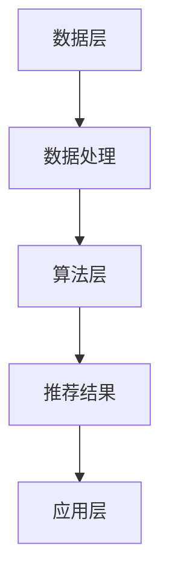
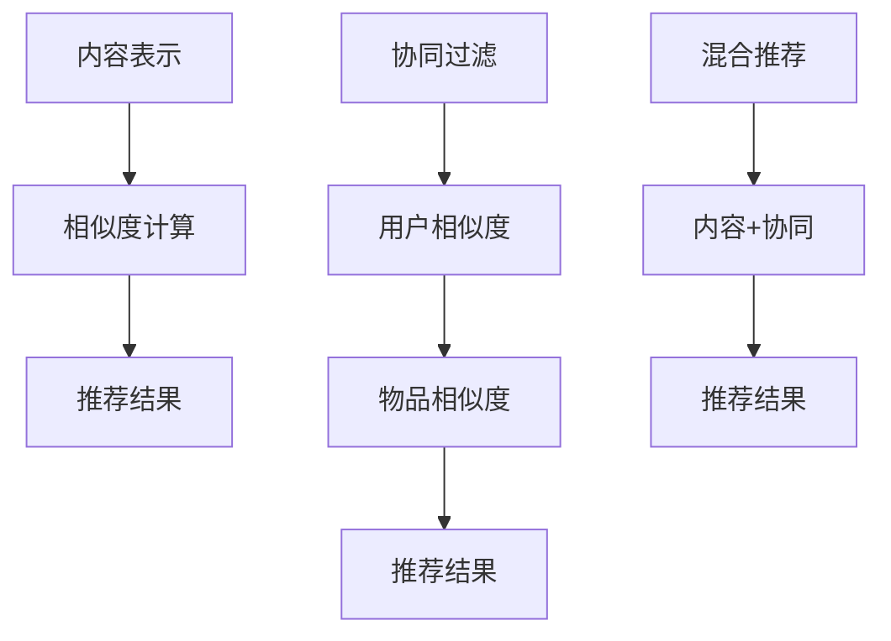
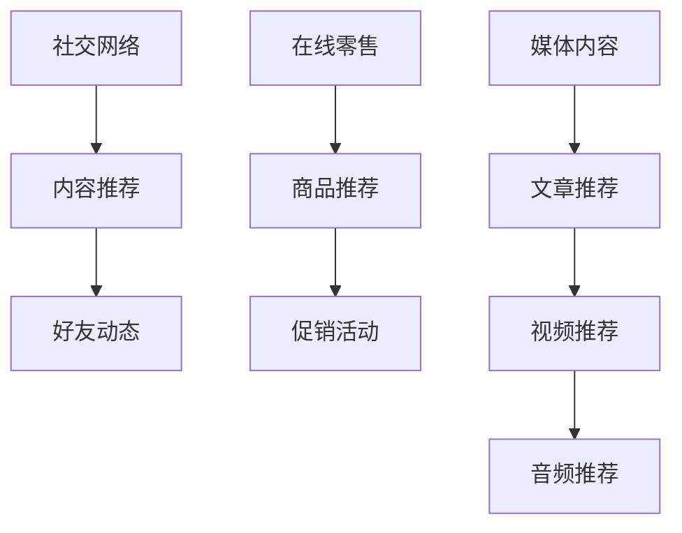

                 

# 《实时推荐系统的实现与优化》

## 关键词

- 实时推荐系统
- 数据处理
- 推荐算法
- 优化策略
- 应用场景
- 案例分析

## 摘要

本文旨在深入探讨实时推荐系统的实现与优化。随着互联网和大数据技术的迅猛发展，实时推荐系统在社交网络、在线零售和媒体内容等领域发挥着越来越重要的作用。本文首先介绍了实时推荐系统的基本概念、架构和发展历程，然后详细阐述了数据处理、推荐算法的设计与实现，以及实时推荐系统的优化策略。通过实际案例分析，本文展示了实时推荐系统在不同应用场景中的成功实践，并总结了开发工具与资源。文章旨在为读者提供一个全面、深入的实时推荐系统实现与优化指南。

## 第一部分：实时推荐系统的概述与基础

### 第1章：实时推荐系统概述

#### 1.1 实时推荐系统的定义与重要性

实时推荐系统是一种能够根据用户的历史行为和兴趣偏好，实时为用户推荐相关内容或商品的系统。其核心目标是提高用户体验，提升用户满意度和平台活跃度。实时推荐系统在社交网络、在线零售、媒体内容等多个领域具有重要应用价值。

首先，实时推荐系统能够根据用户的个性化需求，提供个性化的内容或商品推荐，从而提升用户体验。其次，实时推荐系统能够帮助平台挖掘用户潜在需求，促进用户增长和活跃度。最后，实时推荐系统有助于提升商业转化率，提高平台的经济效益。

#### 1.2 实时推荐系统的基本架构

实时推荐系统的基本架构包括数据层、算法层和应用层。数据层负责收集和存储用户行为数据、内容数据等；算法层负责对数据进行处理和分析，生成推荐结果；应用层则负责将推荐结果呈现给用户。

1. **数据层**：数据层是实时推荐系统的基础，主要负责收集和存储用户行为数据、内容数据等。用户行为数据包括用户浏览、搜索、购买等行为；内容数据包括商品、文章、视频等。

2. **算法层**：算法层是实时推荐系统的核心，负责对数据进行处理和分析，生成推荐结果。常见的推荐算法包括基于内容的推荐算法、协同过滤推荐算法和混合推荐算法等。

3. **应用层**：应用层负责将推荐结果呈现给用户。应用层通常包括网页、移动应用等，用户可以通过这些应用层与推荐系统进行交互。

#### 1.3 实时推荐系统的发展历程

实时推荐系统的发展历程可以分为以下几个阶段：

1. **早期阶段**：基于人工规则的推荐系统，推荐结果主要由人工设定，缺乏个性化和实时性。

2. **协同过滤阶段**：基于用户行为数据，通过计算用户之间的相似度来实现推荐。这一阶段推荐系统开始具备一定的个性化和实时性。

3. **基于内容的推荐阶段**：通过分析用户历史行为和内容特征，为用户推荐与其兴趣相关的内容。这一阶段推荐系统进一步提升了个性化和实时性。

4. **混合推荐阶段**：将协同过滤和基于内容的推荐相结合，通过多种算法共同作用，提高推荐系统的准确性和实时性。

5. **深度学习阶段**：利用深度学习技术，对大规模用户行为数据进行建模，实现更加精准和实时的推荐。

### 第2章：实时推荐系统的数据处理

#### 2.1 数据源收集与处理

实时推荐系统的数据处理始于数据源的收集。数据源主要包括用户行为数据、内容数据、外部数据等。

1. **用户行为数据**：用户行为数据包括用户的浏览、搜索、购买等行为。这些数据通常通过用户在平台上的操作记录获取。

2. **内容数据**：内容数据包括商品、文章、视频等。这些数据通常来源于平台内部或外部数据源。

3. **外部数据**：外部数据包括社交媒体数据、天气数据、经济数据等。这些数据可以补充和丰富推荐系统的数据来源。

收集到的数据需要进行处理和清洗，以确保数据的质量和准确性。

1. **数据预处理**：包括数据去重、数据格式转换、数据缺失值处理等。数据预处理是保证数据质量的重要步骤。

2. **特征工程**：通过提取和构建用户和内容的特征，为推荐算法提供有效的输入。特征工程是提升推荐系统性能的关键。

#### 2.2 数据清洗与预处理

数据清洗和预处理是实时推荐系统的数据处理的关键环节。以下是数据清洗和预处理的一些具体步骤：

1. **数据去重**：去除重复的数据，确保数据的唯一性。

2. **数据格式转换**：将不同格式的数据转换为统一的格式，便于后续处理。

3. **缺失值处理**：处理缺失值，可以采用填充、删除或插值等方法。

4. **异常值处理**：去除异常值，避免对推荐结果产生负面影响。

5. **特征提取**：根据用户行为和内容数据，提取出有效的特征，如用户兴趣特征、内容主题特征等。

#### 2.3 用户行为数据的分析

用户行为数据是实时推荐系统的重要输入。通过对用户行为数据进行分析，可以挖掘用户的兴趣偏好，为推荐算法提供依据。以下是用户行为数据分析的一些方法：

1. **频次分析**：统计用户在不同行为上的频次，如浏览次数、购买次数等。

2. **时长分析**：分析用户在平台上的停留时长、浏览时长等。

3. **点击率分析**：分析用户对不同推荐结果的点击率，了解用户对推荐内容的兴趣程度。

4. **转化率分析**：分析用户对推荐结果的转化率，如购买、注册等。

5. **序列分析**：分析用户行为的序列，如用户浏览、搜索、购买等行为的顺序。

通过对用户行为数据进行分析，可以深入了解用户的行为模式，为推荐算法提供有效的输入。

### 第一部分总结

本章对实时推荐系统的概述与基础进行了详细介绍。首先，介绍了实时推荐系统的定义、基本架构和发展历程。然后，阐述了实时推荐系统的数据处理方法，包括数据源收集与处理、数据清洗与预处理以及用户行为数据的分析。本章内容为后续章节的实时推荐算法设计与实现、优化策略和案例分析奠定了基础。

### Mermaid 流程图



## 第二部分：实时推荐算法设计与实现

### 第3章：基于内容的推荐算法

#### 3.1 内容表示与匹配

基于内容的推荐算法是一种根据用户兴趣和内容特征进行推荐的方法。其核心思想是，通过分析用户的历史行为和内容特征，将用户和内容进行匹配，从而生成推荐结果。

首先，需要对用户和内容进行表示。用户表示可以通过提取用户的行为特征、兴趣标签等进行。内容表示可以通过提取内容的主题、关键词等进行。常见的表示方法包括TF-IDF、词嵌入等。

然后，需要计算用户和内容之间的相似度。相似度计算方法包括余弦相似度、皮尔逊相关系数等。相似度计算结果用于生成推荐结果。

#### 3.2 评价指标与优化

基于内容的推荐算法的性能可以通过多种评价指标进行评估。常见的评价指标包括准确率、召回率、F1值等。

为了提升推荐算法的性能，可以采用以下优化方法：

1. **特征选择**：通过特征选择方法，选择对推荐结果影响较大的特征，提高推荐准确性。

2. **特征工程**：通过构建新的特征，丰富用户和内容的表示，提高推荐效果。

3. **模型优化**：采用先进的机器学习算法，如深度学习，对推荐模型进行优化。

4. **在线学习**：实时更新用户和内容特征，适应用户兴趣的变化，提高推荐实时性。

#### 3.3 基于内容的推荐算法实现

以下是一个基于内容的推荐算法的实现示例：

```python
import numpy as np
from sklearn.metrics.pairwise import cosine_similarity

# 用户表示
user_vector = np.array([1, 2, 3, 4, 5])

# 内容表示
content_vectors = [
    np.array([2, 3, 4, 5, 6]),
    np.array([3, 4, 5, 6, 7]),
    np.array([4, 5, 6, 7, 8])
]

# 计算相似度
similarities = cosine_similarity(user_vector, content_vectors)

# 生成推荐结果
recommendations = np.argmax(similarities)

print("推荐结果：", recommendations)
```

### 第4章：协同过滤推荐算法

#### 4.1 协同过滤的基本原理

协同过滤推荐算法是一种基于用户行为数据，通过计算用户之间的相似度来实现推荐的方法。其核心思想是，相似的用户会有相似的兴趣，因此可以通过相似用户的行为数据来预测未知用户的行为。

协同过滤算法可以分为基于用户的协同过滤算法和基于物品的协同过滤算法。

1. **基于用户的协同过滤算法**：通过计算用户之间的相似度，找到与目标用户最相似的邻居用户，然后根据邻居用户的行为数据生成推荐结果。

2. **基于物品的协同过滤算法**：通过计算物品之间的相似度，找到与目标物品最相似的其他物品，然后根据这些物品的评分数据生成推荐结果。

#### 4.2 用户与物品的相似性计算

用户与物品的相似性计算是协同过滤推荐算法的关键步骤。常见的相似性计算方法包括余弦相似度、皮尔逊相关系数等。

以下是一个基于用户的协同过滤算法的实现示例：

```python
import numpy as np
from sklearn.metrics.pairwise import cosine_similarity

# 用户评分矩阵
ratings = np.array([
    [1, 2, 3, 0, 0],
    [0, 1, 0, 2, 3],
    [0, 0, 1, 3, 4],
    [2, 0, 0, 1, 0],
    [3, 4, 0, 0, 2]
])

# 计算用户之间的相似度
user_similarity = cosine_similarity(ratings)

# 生成推荐结果
for i, user in enumerate(user_similarity):
    # 找到与当前用户最相似的邻居用户
    neighbors = np.argsort(user)[::-1]
    neighbors = neighbors[1:]  # 去除自己

    # 计算邻居用户的评分均值
    neighbor_ratings = ratings[neighbors]
    mean_ratings = np.mean(neighbor_ratings, axis=0)

    # 根据邻居用户的评分均值生成推荐结果
    recommendations = mean_ratings - ratings[i]
    print("用户{}的推荐结果：".format(i), recommendations)
```

### 第5章：混合推荐算法

#### 5.1 混合推荐的基本思路

混合推荐算法将多种推荐算法相结合，通过综合利用多种算法的优势，提高推荐系统的性能。常见的混合推荐算法包括基于内容的协同过滤混合推荐、基于模型的混合推荐等。

混合推荐算法的基本思路如下：

1. **选择基础算法**：根据应用场景和需求，选择合适的推荐算法作为基础算法。

2. **集成基础算法**：将多个基础算法集成，形成混合推荐模型。

3. **优化集成模型**：通过模型优化方法，如模型融合、参数调优等，提升混合推荐模型的性能。

#### 5.2 混合推荐算法的实现

以下是一个基于内容的协同过滤混合推荐算法的实现示例：

```python
import numpy as np
from sklearn.metrics.pairwise import cosine_similarity

# 用户评分矩阵
ratings = np.array([
    [1, 2, 3, 0, 0],
    [0, 1, 0, 2, 3],
    [0, 0, 1, 3, 4],
    [2, 0, 0, 1, 0],
    [3, 4, 0, 0, 2]
])

# 内容表示
content_vectors = [
    np.array([2, 3, 4, 5, 6]),
    np.array([3, 4, 5, 6, 7]),
    np.array([4, 5, 6, 7, 8])
]

# 计算用户之间的相似度
user_similarity = cosine_similarity(ratings)

# 计算内容之间的相似度
content_similarity = cosine_similarity(content_vectors)

# 生成推荐结果
for i, user in enumerate(user_similarity):
    # 找到与当前用户最相似的邻居用户
    neighbors = np.argsort(user)[::-1]
    neighbors = neighbors[1:]  # 去除自己

    # 计算邻居用户的评分均值
    neighbor_ratings = ratings[neighbors]
    mean_ratings = np.mean(neighbor_ratings, axis=0)

    # 计算邻居用户对内容的好评率
    content_ratings = ratings[neighbors]
    content_ratings[content_ratings == 0] = -1
    contentratings_sum = content_ratings.sum(axis=0)
    content_ratings_avg = contentratings_sum / (content_ratings_sum != 0)
    content_ratings_avg[content_ratings_avg == -1] = 0

    # 计算混合推荐结果
    recommendations = (mean_ratings + content_ratings_avg) / 2
    print("用户{}的推荐结果：".format(i), recommendations)
```

### 第6章：实时推荐系统的优化策略

#### 6.1 实时推荐系统的性能优化

实时推荐系统的性能优化是提升系统性能的重要手段。以下是一些常见的优化策略：

1. **数据优化**：通过数据预处理、数据压缩、数据缓存等方法，减少数据存储和传输的开销。

2. **算法优化**：通过优化推荐算法，提高计算效率和准确率。例如，采用并行计算、分布式计算等方法。

3. **系统优化**：通过优化系统架构、网络传输、负载均衡等方法，提高系统的稳定性和性能。

4. **缓存优化**：通过缓存技术，减少对数据库的访问次数，提高数据处理速度。

#### 6.2 推荐结果的可解释性优化

推荐结果的可解释性优化是提升用户信任度和满意度的关键。以下是一些常见的优化方法：

1. **推荐理由展示**：为每个推荐结果提供详细的推荐理由，如相似度计算结果、用户历史行为等。

2. **推荐排序优化**：通过调整推荐结果的排序规则，提高推荐结果的合理性和可解释性。

3. **用户反馈机制**：收集用户对推荐结果的反馈，根据反馈调整推荐策略，提高推荐结果的可解释性。

#### 6.3 冷启动问题的解决方法

冷启动问题是指在用户或物品信息不足的情况下，无法生成有效的推荐结果。以下是一些常见的解决方法：

1. **基于内容的推荐**：在用户或物品信息不足时，采用基于内容的推荐方法，通过分析用户或物品的属性特征生成推荐结果。

2. **用户模拟**：通过模拟用户行为，生成虚拟用户，为冷启动用户生成推荐结果。

3. **协同过滤算法**：在用户或物品信息不足时，采用协同过滤算法，通过计算用户或物品之间的相似度生成推荐结果。

4. **在线学习**：实时更新用户或物品的信息，为冷启动用户或物品生成推荐结果。

### 第二部分总结

本章详细介绍了实时推荐算法的设计与实现，包括基于内容的推荐算法、协同过滤推荐算法和混合推荐算法。首先，介绍了内容表示与匹配、相似性计算、评价指标与优化等内容表示与匹配方法。然后，阐述了协同过滤的基本原理、用户与物品的相似性计算方法。接着，讲解了混合推荐算法的基本思路和实现方法。本章内容为构建高效、实时的推荐系统提供了重要的理论基础和实践指导。

### Mermaid 流程图



## 第三部分：实时推荐系统的应用与案例分析

### 第7章：实时推荐系统的应用场景

#### 7.1 社交网络中的实时推荐

在社交网络中，实时推荐系统可以用于推荐用户感兴趣的内容、好友动态、话题等。以下是一些典型的应用场景：

1. **内容推荐**：根据用户的兴趣和行为，为用户推荐感兴趣的文章、视频、图片等。

2. **好友动态**：根据用户的社交关系，为用户推荐好友的最新动态。

3. **话题推荐**：根据用户的兴趣和社交网络的热门话题，为用户推荐相关话题。

#### 7.2 在线零售中的实时推荐

在线零售中的实时推荐系统可以用于推荐商品、促销活动等。以下是一些典型的应用场景：

1. **商品推荐**：根据用户的历史购买记录、浏览行为等，为用户推荐相关商品。

2. **促销活动**：根据用户的历史行为和购物车数据，为用户推荐相关促销活动。

3. **个性化营销**：根据用户的购物喜好和购物车数据，为用户推荐个性化营销方案。

#### 7.3 媒体内容推荐

在媒体内容推荐中，实时推荐系统可以用于推荐文章、视频、音频等。以下是一些典型的应用场景：

1. **文章推荐**：根据用户的阅读历史、兴趣标签等，为用户推荐相关文章。

2. **视频推荐**：根据用户的观看历史、视频标签等，为用户推荐相关视频。

3. **音频推荐**：根据用户的听歌记录、兴趣标签等，为用户推荐相关音频。

### 第8章：实时推荐系统的案例分析

#### 8.1 案例一：某社交平台的实时推荐系统

某社交平台通过实时推荐系统，为用户推荐感兴趣的内容和好友动态。以下是该推荐系统的实现过程：

1. **数据收集与处理**：平台收集用户的行为数据，如浏览、点赞、评论等。对数据进行清洗和预处理，提取用户和内容的特征。

2. **推荐算法设计**：采用基于内容的推荐算法和协同过滤算法相结合的方法。首先，通过内容特征为用户推荐感兴趣的内容；然后，通过协同过滤算法，为用户推荐与其兴趣相似的好友动态。

3. **推荐结果优化**：通过用户反馈和在线学习，不断优化推荐结果。同时，采用推荐理由展示和用户反馈机制，提升用户对推荐结果的可解释性和满意度。

#### 8.2 案例二：某电商平台的实时推荐系统

某电商平台通过实时推荐系统，为用户推荐相关商品和促销活动。以下是该推荐系统的实现过程：

1. **数据收集与处理**：平台收集用户的历史购买记录、浏览记录、购物车数据等。对数据进行清洗和预处理，提取用户和商品的属性特征。

2. **推荐算法设计**：采用基于内容的推荐算法和协同过滤算法相结合的方法。首先，通过商品特征为用户推荐感兴趣的商品；然后，通过协同过滤算法，为用户推荐相关的促销活动。

3. **推荐结果优化**：通过用户反馈和在线学习，不断优化推荐结果。同时，采用推荐理由展示和用户反馈机制，提升用户对推荐结果的可解释性和满意度。

#### 8.3 案例三：某媒体平台的实时推荐系统

某媒体平台通过实时推荐系统，为用户推荐相关文章、视频和音频。以下是该推荐系统的实现过程：

1. **数据收集与处理**：平台收集用户的阅读历史、观看历史、听歌记录等。对数据进行清洗和预处理，提取用户和内容的属性特征。

2. **推荐算法设计**：采用基于内容的推荐算法和协同过滤算法相结合的方法。首先，通过内容特征为用户推荐感兴趣的文章、视频和音频；然后，通过协同过滤算法，为用户推荐与其兴趣相似的其他内容。

3. **推荐结果优化**：通过用户反馈和在线学习，不断优化推荐结果。同时，采用推荐理由展示和用户反馈机制，提升用户对推荐结果的可解释性和满意度。

### 第三部分总结

本章介绍了实时推荐系统在不同应用场景中的实际案例，包括社交网络、在线零售和媒体内容等领域。通过案例分析和实践，展示了实时推荐系统的实现过程、推荐算法设计和优化策略。这些案例为读者提供了宝贵的实践经验和启示，有助于更好地理解和应用实时推荐系统。

### Mermaid 流�程图



### 附录

#### 附录A：实时推荐系统的开发工具与资源

**A.1 常用推荐算法库介绍**

1. **scikit-learn**：Python中的经典机器学习库，包含多种常见的推荐算法，如协同过滤、基于内容的推荐等。
2. **Surprise**：专门针对推荐系统的Python库，提供了多种协同过滤算法和评估指标。
3. **TensorFlow Recommenders**：TensorFlow官方推荐的推荐系统框架，提供了多种推荐算法和自动化机器学习功能。

**A.2 实时推荐系统的开源框架**

1. **TensorFlow**：基于Google的深度学习框架，可以用于构建大规模实时推荐系统。
2. **PyTorch**：另一个流行的深度学习框架，适用于实时推荐系统的开发和优化。
3. **Apache Mahout**：一个基于Hadoop的大规模机器学习库，包含多种推荐算法。

**A.3 数据处理与存储工具推荐**

1. **Apache Spark**：大数据处理框架，支持实时数据处理和流处理，适用于实时推荐系统的数据处理。
2. **Apache Kafka**：消息队列系统，用于实时数据传输和流处理，适用于实时推荐系统的数据传输。
3. **Redis**：高性能的内存数据库，适用于实时推荐系统的数据缓存和快速访问。

#### 附录B：实时推荐系统的相关数学公式与算法伪代码

**B.1 协同过滤算法的数学公式**

协同过滤算法的核心是计算用户之间的相似度，常用的相似度计算公式如下：

$$
sim(u_i, u_j) = \frac{\sum_{k \in R_{i,j}} r_{ik} r_{jk}}{\sqrt{\sum_{k \in R_{i,j}} r_{ik}^2 \sum_{k \in R_{i,j}} r_{jk}^2}}
$$

其中，$R_{i,j}$ 表示用户 $u_i$ 和用户 $u_j$ 的共同评分物品集合，$r_{ik}$ 和 $r_{jk}$ 分别表示用户 $u_i$ 和用户 $u_j$ 对物品 $k$ 的评分。

**B.2 基于内容的推荐算法的数学模型**

基于内容的推荐算法的核心是计算用户和物品之间的相似度，常用的相似度计算公式如下：

$$
sim(c_i, c_j) = \frac{1}{|T_i \cap T_j|}
$$

其中，$T_i$ 和 $T_j$ 分别表示物品 $c_i$ 和物品 $c_j$ 的特征集合，$|T_i \cap T_j|$ 表示 $T_i$ 和 $T_j$ 的交集大小。

**B.3 混合推荐算法的算法伪代码**

混合推荐算法通常将基于内容的推荐和协同过滤算法相结合，以下是一个简单的混合推荐算法的伪代码：

```
function hybrid_recommendation(user, items):
    content_similarity = calculate_content_similarity(user, items)
    collaborative_similarity = calculate_collaborative_similarity(user, items)

    content_score = calculate_content_score(user, items, content_similarity)
    collaborative_score = calculate_collaborative_score(user, items, collaborative_similarity)

    hybrid_score = (content_score + collaborative_score) / 2

    return items sorted by hybrid_score
```

在这个伪代码中，$calculate_content_similarity$ 和 $calculate_collaborative_similarity$ 分别表示计算内容和协同相似度的函数，$calculate_content_score$ 和 $calculate_collaborative_score$ 分别表示计算内容和协同评分的函数。

### 附录总结

附录部分提供了实时推荐系统的开发工具与资源，包括常用的推荐算法库、开源框架以及数据处理与存储工具。同时，还介绍了协同过滤算法、基于内容的推荐算法和混合推荐算法的数学公式与算法伪代码。附录内容为实时推荐系统的开发与实践提供了重要的技术参考。

