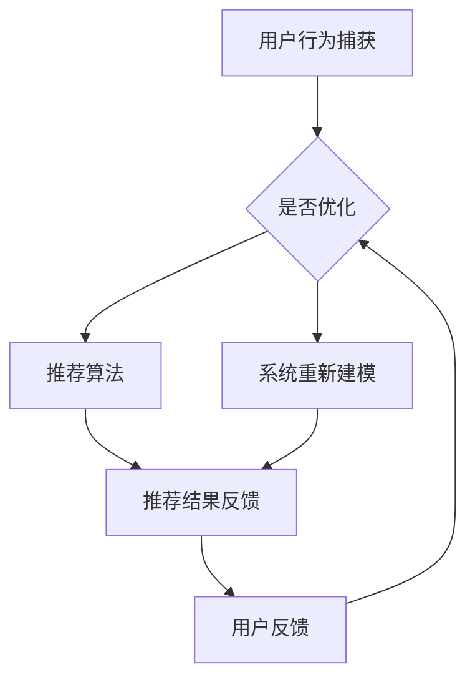

                 

# 实时推荐：AI如何抓住用户兴趣，提升购买转化率

> 关键词：实时推荐，用户兴趣建模，协同过滤，内容推荐，深度学习推荐，购买转化率

> 摘要：本文将深入探讨实时推荐系统在捕捉用户兴趣、提升购买转化率方面的应用。通过分析实时推荐系统的基础架构、核心算法和实现策略，我们将理解如何利用AI技术优化推荐系统，使其更加智能和高效。本文旨在为IT专业人士提供一套系统化的实时推荐系统实现和优化方案。

---

### 第一部分：实时推荐系统基础

#### 第1章：实时推荐系统概述

##### 1.1 实时推荐系统的重要性

**核心概念与联系**

实时推荐系统是一种动态的、自动化的推荐系统，它能够根据用户的实时行为和历史数据，迅速地生成个性化的推荐列表。实时推荐系统的重要性体现在以下几个方面：

- **提升用户体验**：通过提供个性化的内容，满足用户在特定时刻的需求，增强用户满意度。
- **增加购买转化率**：精确地推荐用户可能感兴趣的商品或服务，提高用户的购买意愿。
- **商业价值**：精准的广告投放和产品推荐，有助于企业降低营销成本，提高销售额。

**实时推荐**：实时推荐系统在处理用户请求时，能够在毫秒级别内返回推荐列表。其流程通常包括以下步骤：

1. 用户行为捕获：收集用户的历史行为数据。
2. 用户兴趣建模：基于用户行为数据，构建用户兴趣模型。
3. 推荐算法：利用用户兴趣模型，生成个性化的推荐列表。
4. 推荐结果反馈：将推荐结果展示给用户，并根据用户的反馈进行优化。

**兴趣捕获**：兴趣捕获是实时推荐系统的关键环节，它通过分析用户的行为数据（如浏览、搜索、购买记录等），提取用户的兴趣点。常用的兴趣捕获方法包括：

- **基于行为的协同过滤**：通过分析用户的行为模式，找到与其他用户相似的用户群体。
- **基于内容的推荐**：根据用户过去的行为数据，推断用户可能感兴趣的物品。
- **深度学习**：利用神经网络模型，从大量的用户行为数据中提取潜在的兴趣特征。

**推荐算法**：实时推荐系统主要采用的推荐算法有协同过滤、基于内容的推荐和深度学习推荐。

- **协同过滤**：基于用户之间的相似度进行推荐，常见的方法有用户基于的协同过滤和物品基于的协同过滤。
- **基于内容的推荐**：基于物品的属性特征和用户的历史行为数据，为用户推荐相似内容的物品。
- **深度学习推荐**：利用深度学习模型，从用户行为数据中提取高维的特征，实现更加精准的推荐。

##### 1.2 实时推荐系统的架构

**Mermaid 流程图**



实时推荐系统的架构设计需要考虑以下几个关键模块：

- **数据层**：负责数据的存储和管理，包括用户行为数据、物品属性数据等。
- **处理层**：负责数据清洗、处理和特征提取，为后续的推荐算法提供输入。
- **算法层**：实现各种推荐算法，如协同过滤、基于内容的推荐和深度学习推荐。
- **展示层**：将推荐结果以用户友好的形式展示给用户。

##### 1.3 实时推荐系统的主要挑战

**核心算法原理讲解**

实时推荐系统在实际应用中面临的主要挑战包括：

- **实时性**：实时推荐系统需要在短时间内处理大量用户请求，对算法的效率和性能提出了高要求。为提高实时性，可以采用以下策略：
  - **增量计算**：仅处理用户行为数据的变化部分，减少计算量。
  - **分布式计算**：利用分布式计算框架，如Hadoop、Spark，实现并行计算。
  - **缓存技术**：利用缓存技术，如Redis、Memcached，提高数据的读取速度。

- **多样性**：保证推荐结果的多样性，防止用户一直收到重复的推荐。为了实现多样性，可以采用以下策略：
  - **随机化**：在推荐列表中引入随机元素，提高多样性。
  - **上下文感知**：根据用户当前的行为和上下文信息，动态调整推荐策略。
  - **内容过滤**：对推荐内容进行筛选，去除重复性高的物品。

- **精确度**：提高推荐精度，使推荐结果更符合用户的实际需求。为了提高精确度，可以采用以下策略：
  - **用户兴趣建模**：利用深度学习等技术，从大量用户行为数据中提取潜在的兴趣特征。
  - **算法优化**：对推荐算法进行优化，如使用矩阵分解、基于模型的协同过滤等。
  - **数据清洗**：对用户行为数据进行清洗，去除噪声数据，提高数据质量。

#### 第2章：用户兴趣建模

##### 2.1 用户兴趣数据来源

**核心算法原理讲解**

用户兴趣建模是实时推荐系统的核心任务，其数据来源主要包括以下两个方面：

- **行为数据**：用户在系统中的行为数据，如浏览记录、搜索记录、购买记录等。这些数据可以通过用户操作日志、点击日志等途径获取。
- **内容数据**：用户生成的或系统提供的关于物品的内容数据，如文本描述、图片、视频等。这些数据可以帮助更好地理解用户对物品的兴趣点。

**行为数据**：

行为数据是用户兴趣建模的主要依据，通过对用户历史行为数据的分析，可以提取出用户的兴趣特征。常见的行为数据来源包括：

- **浏览记录**：用户在系统中的浏览行为，如浏览页面、停留时间等。
- **搜索记录**：用户在系统中的搜索行为，如搜索关键词、搜索结果等。
- **购买记录**：用户的购买行为，如购买商品、购买时间等。

**内容数据**：

内容数据提供了关于物品的详细信息，可以帮助更好地理解用户对物品的兴趣点。常见的内容数据来源包括：

- **文本描述**：商品或服务的文本描述，如商品名称、商品描述等。
- **图片**：商品或服务的图片，如商品图片、用户生成图片等。
- **视频**：商品或服务的视频，如商品演示视频、用户生成视频等。

##### 2.2 用户兴趣建模方法

**伪代码**

```python
# 用户兴趣建模方法
def user_interest_modeling(user_behavior_data, item_content_data):
    # 步骤1：数据预处理
    preprocessed_data = preprocess_data(user_behavior_data, item_content_data)
    
    # 步骤2：特征提取
    features = extract_features(preprocessed_data)
    
    # 步骤3：兴趣建模
    model = build_interest_model(features)
    
    # 步骤4：兴趣向量更新
    interest_vector = update_interest_vector(model, user_behavior_data)
    
    return interest_vector
```

用户兴趣建模的方法主要包括以下步骤：

- **数据预处理**：对用户行为数据和物品内容数据进行清洗、去噪、归一化等处理，为特征提取做好准备。
- **特征提取**：从用户行为数据和物品内容数据中提取有用的特征，如用户行为特征、物品属性特征等。
- **兴趣建模**：利用机器学习算法，如决策树、支持向量机、神经网络等，构建用户兴趣模型。
- **兴趣向量更新**：根据用户最新的行为数据，动态调整用户兴趣模型，实现兴趣向量的实时更新。

##### 2.3 用户兴趣更新与维护

**数学模型和数学公式**

用户兴趣建模是一个动态的过程，需要不断地根据用户的行为数据进行更新和调整。以下是用户兴趣向量的更新策略：

$$
\text{new\_interest\_vector} = (1 - \lambda) \cdot \text{current\_interest\_vector} + \lambda \cdot \text{behavior\_vector}
$$

其中：

- $\text{new\_interest\_vector}$：更新后的用户兴趣向量。
- $\text{current\_interest\_vector}$：当前的用户兴趣向量。
- $\text{behavior\_vector}$：用户最新的行为数据向量。
- $\lambda$：更新系数，用于平衡新旧兴趣向量的权重。

通过上述公式，可以实现对用户兴趣向量的动态调整，使其能够更好地反映用户的实时兴趣。

### 第二部分：实时推荐算法

#### 第3章：协同过滤推荐算法

##### 3.1 协同过滤算法原理

**伪代码**

```python
# 协同过滤算法原理
def collaborative_filtering(user_vector, item_vector):
    # 步骤1：计算相似度
    similarity = calculate_similarity(user_vector, item_vector)
    
    # 步骤2：预测评分
    predicted_rating = user_vector * item_vector / similarity
    
    return predicted_rating
```

协同过滤算法的核心思想是通过计算用户和物品之间的相似度，预测用户对物品的评分或兴趣度。具体步骤如下：

- **计算相似度**：根据用户和物品的特征向量，计算它们之间的相似度。常见的相似度计算方法包括余弦相似度、皮尔逊相关系数等。
- **预测评分**：利用用户和物品的相似度，预测用户对物品的评分。预测公式通常为用户和物品特征向量的点积除以相似度。

##### 3.2 基于模型的协同过滤算法

**核心算法原理讲解**

基于模型的协同过滤算法是在传统的基于相似度的协同过滤算法基础上，引入了机器学习模型，以提高推荐精度。常见的基于模型的协同过滤算法包括矩阵分解、隐语义模型等。

- **矩阵分解**：将用户和物品的特征表示为一个低维矩阵，通过矩阵分解得到用户和物品的隐含特征向量。预测公式为用户和物品隐含特征向量的点积。
- **隐语义模型**：通过构建一个隐含语义空间，将用户和物品映射到该空间中，计算它们在隐含语义空间中的距离，作为相似度进行推荐。

##### 3.3 优化与扩展

**数学模型和数学公式**

为了提高协同过滤算法的效率和精度，可以采用以下优化策略：

- **矩阵分解**：
  $$
  \text{User\_Low\_Dim} = \text{User} \cdot \text{U}
  $$
  $$
  \text{Item\_Low\_Dim} = \text{Item} \cdot \text{V}
  $$
  其中，$\text{User}$ 和 $\text{Item}$ 分别表示用户和物品的高维特征矩阵，$\text{U}$ 和 $\text{V}$ 分别表示用户和物品的隐含特征矩阵。

- **稀疏性**：通过引入稀疏矩阵，降低特征向量的维度，减少计算量。

- **正则化**：在优化目标函数中引入正则化项，防止过拟合，提高模型泛化能力。

#### 第4章：基于内容的推荐算法

##### 4.1 基于内容的推荐算法原理

**伪代码**

```python
# 基于内容的推荐算法原理
def content_based_recommending(user_vector, item_vectors):
    # 步骤1：计算内容相似度
    content_similarity = calculate_content_similarity(user_vector, item_vectors)
    
    # 步骤2：生成推荐列表
    recommendation_list = generate_recommendation_list(content_similarity)
    
    return recommendation_list
```

基于内容的推荐算法通过分析用户历史行为数据和物品的内容特征，为用户推荐相似内容的物品。具体步骤如下：

- **计算内容相似度**：根据用户和物品的特征向量，计算它们之间的内容相似度。常见的方法包括余弦相似度、词嵌入相似度等。
- **生成推荐列表**：根据内容相似度，为用户生成推荐列表。可以使用Top-N推荐方法，选择相似度最高的物品作为推荐结果。

##### 4.2 内容相似性计算

**数学模型和数学公式**

内容相似性计算是基于内容的推荐算法的核心，常用的方法包括：

- **余弦相似度**：
  $$
  \text{CosineSimilarity} = \frac{\text{dot\_product}}{\|\text{user\_vector}\| \|\text{item\_vector}\|}
  $$
  其中，$\text{dot\_product}$ 表示用户和物品特征向量的点积，$\|\text{user\_vector}\|$ 和 $\|\text{item\_vector}\|$ 分别表示用户和物品特征向量的模。

- **词嵌入相似度**：
  $$
  \text{Word2VecSimilarity} = \frac{\text{dot\_product}}{\|\text{user\_word\_embedding}\| \|\text{item\_word\_embedding}\|}
  $$
  其中，$\text{dot\_product}$ 表示用户和物品词嵌入向量的点积，$\|\text{user\_word\_embedding}\|$ 和 $\|\text{item\_word\_embedding}\|$ 分别表示用户和物品词嵌入向量的模。

##### 4.3 内容推荐优化

**数学模型和数学公式**

为了提高内容推荐算法的效率和精度，可以采用以下优化策略：

- **特征工程**：通过选择合适的特征和特征提取方法，提高特征表示的质量。
- **上下文感知**：利用用户的上下文信息，如时间、地点等，动态调整推荐策略。
- **协同过滤与内容的结合**：将协同过滤算法和内容推荐算法相结合，利用协同过滤算法的推荐结果作为内容推荐的特征输入，提高推荐质量。

#### 第5章：深度学习推荐算法

##### 5.1 深度学习推荐算法概述

**核心算法原理讲解**

深度学习推荐算法利用深度神经网络模型，从大量用户行为数据中提取高维的特征，实现更加精准的推荐。常见的深度学习推荐算法包括：

- **循环神经网络（RNN）**：适用于处理序列数据，如用户的行为序列。
- **长短期记忆网络（LSTM）**：在RNN的基础上，引入门控机制，解决长短期依赖问题。
- **图神经网络（GNN）**：适用于处理图结构数据，如社交网络、知识图谱等。

##### 5.2 深度学习推荐算法实现

**伪代码**

```python
# 深度学习推荐算法实现
def deep_learning_recommending(user_sequence, item_vectors):
    # 步骤1：输入序列编码
    encoded_sequence = encode_sequence(user_sequence)
    
    # 步骤2：计算特征表示
    feature_representation = calculate_feature_representation(encoded_sequence, item_vectors)
    
    # 步骤3：生成推荐列表
    recommendation_list = generate_recommendation_list(feature_representation)
    
    return recommendation_list
```

深度学习推荐算法的具体实现步骤如下：

- **输入序列编码**：将用户行为序列编码为向量表示，如使用Word2Vec、BERT等预训练模型进行编码。
- **计算特征表示**：利用编码后的用户序列和物品特征向量，通过深度神经网络模型计算特征表示。
- **生成推荐列表**：根据特征表示，为用户生成推荐列表。

##### 5.3 深度学习推荐算法优化

**数学模型和数学公式**

为了提高深度学习推荐算法的效率和精度，可以采用以下优化策略：

- **模型优化**：通过调整网络结构、激活函数、学习率等超参数，优化模型性能。
- **数据增强**：通过数据增强技术，如数据扩充、数据降噪等，提高模型的泛化能力。
- **正则化**：在训练过程中引入正则化项，防止过拟合，提高模型泛化能力。

### 第三部分：实时推荐系统实现

#### 第6章：实时推荐系统架构设计与开发

##### 6.1 实时推荐系统架构设计

**Mermaid 流程图**


实时推荐系统架构设计的关键模块包括：

- **数据层**：负责数据的存储和管理，包括用户行为数据、物品属性数据等。
- **处理层**：负责数据清洗、处理和特征提取，为后续的推荐算法提供输入。
- **算法层**：实现各种推荐算法，如协同过滤、基于内容的推荐和深度学习推荐。
- **展示层**：将推荐结果以用户友好的形式展示给用户。

##### 6.2 实时推荐系统开发环境搭建

**项目实战**

为了搭建实时推荐系统，需要安装以下开发环境和工具：

- **Python**：实时推荐系统的核心编程语言。
- **TensorFlow**：深度学习框架，用于实现深度学习推荐算法。
- **Keras**：基于TensorFlow的高层API，简化深度学习模型实现。
- **Hadoop**：分布式计算框架，用于处理大规模数据。
- **Spark**：大数据处理框架，用于数据清洗和特征提取。

具体安装步骤如下：

1. 安装Python和pip：
   ```
   pip install numpy scipy matplotlib pandas scikit-learn tensorflow keras
   ```

2. 安装Hadoop和Spark：
   ```
   sudo apt-get update
   sudo apt-get install hadoop-common hadoop-hdfs-namenode hadoop-hdfs-datanode hadoop-yarn hadoop-mapreduce
   sudo apt-get install spark-core spark-hadoop spark-python
   ```

3. 启动Hadoop和Spark：
   ```
   start-hadoop-daemon.sh start-all.sh
   spark-shell
   ```

##### 6.3 源代码实现与代码解读

**代码实际案例与详细解释说明**

以下是一个简单的实时推荐系统代码案例，包括用户兴趣建模和推荐算法实现：

```python
# 用户兴趣建模
from sklearn.feature_extraction.text import TfidfVectorizer
from sklearn.metrics.pairwise import cosine_similarity

def user_interest_modeling(user_behavior_data):
    # 步骤1：数据预处理
    preprocessed_data = preprocess_data(user_behavior_data)
    
    # 步骤2：特征提取
    vectorizer = TfidfVectorizer()
    user_interest_vector = vectorizer.fit_transform([preprocessed_data['description']])
    
    return user_interest_vector

# 推荐算法实现
def content_based_recommending(user_interest_vector, item_vectors):
    # 步骤1：计算内容相似度
    content_similarity = cosine_similarity(user_interest_vector, item_vectors)
    
    # 步骤2：生成推荐列表
    recommendation_list = generate_recommendation_list(content_similarity)
    
    return recommendation_list
```

**代码解读与分析**

1. **用户兴趣建模**：

   - **数据预处理**：对用户行为数据进行清洗和格式化，提取出用户的描述信息。
   - **特征提取**：使用TF-IDF向量器对用户描述信息进行特征提取，生成用户兴趣向量。

2. **推荐算法实现**：

   - **内容相似度计算**：使用余弦相似度计算用户兴趣向量与物品特征向量之间的相似度。
   - **生成推荐列表**：根据相似度分数，生成推荐列表，选择相似度最高的物品作为推荐结果。

#### 第7章：实时推荐系统评估与优化

##### 7.1 实时推荐系统评估指标

**数学模型和数学公式**

实时推荐系统的评估指标主要包括：

- **准确率（Accuracy）**：
  $$
  \text{Accuracy} = \frac{\text{预测正确数量}}{\text{总预测数量}}
  $$

- **召回率（Recall）**：
  $$
  \text{Recall} = \frac{\text{预测正确且实际感兴趣的物品数量}}{\text{实际感兴趣的物品数量}}
  $$

- **F1值（F1 Score）**：
  $$
  \text{F1 Score} = 2 \cdot \frac{\text{Precision} \cdot \text{Recall}}{\text{Precision} + \text{Recall}}
  $$

其中，Precision 表示预测正确的物品数量与预测物品总量的比例，Recall 表示实际感兴趣的物品数量与预测正确的物品数量的比例。

##### 7.2 实时推荐系统优化策略

**数学模型和数学公式**

为了提高实时推荐系统的性能，可以采用以下优化策略：

- **模型调整**：通过调整推荐算法的超参数，如学习率、隐藏层神经元数量等，优化模型性能。
- **数据清洗**：对用户行为数据和历史推荐数据进行清洗，去除噪声数据和异常值，提高数据质量。
- **特征工程**：通过选择合适的特征和特征提取方法，提高特征表示的质量。
- **上下文感知**：利用用户的上下文信息，如时间、地点等，动态调整推荐策略。

**模型调整**：

$$
\text{Learning\_Rate} = \frac{1}{\sqrt{\text{Epoch}}}
$$

其中，Learning Rate 表示学习率，Epoch 表示训练轮数。

**数据清洗**：

$$
\text{Cleaned\_Data} = \text{Original\_Data} \setminus \{\text{Noise}, \text{Anomalies}\}
$$

其中，Cleaned Data 表示清洗后的数据，Original Data 表示原始数据，Noise 表示噪声数据，Anomalies 表示异常值。

**特征工程**：

$$
\text{Features} = \text{ExtractFeatures}(\text{Data})
$$

其中，Features 表示提取后的特征，Data 表示原始数据。

**上下文感知**：

$$
\text{Recommendation\_Strategy} = \text{ContextualAdjustment}(\text{BaseRecommendationStrategy}, \text{Context})
$$

其中，Recommendation Strategy 表示动态调整后的推荐策略，Base Recommendation Strategy 表示基础推荐策略，Context 表示上下文信息。

##### 7.3 实时推荐系统案例分析

**代码解读与分析**

以下是一个简单的实时推荐系统案例分析，包括用户兴趣建模、推荐算法实现和性能评估：

```python
# 用户兴趣建模
def user_interest_modeling(user_behavior_data):
    # 步骤1：数据预处理
    preprocessed_data = preprocess_data(user_behavior_data)
    
    # 步骤2：特征提取
    vectorizer = TfidfVectorizer()
    user_interest_vector = vectorizer.fit_transform([preprocessed_data['description']])
    
    return user_interest_vector

# 推荐算法实现
def content_based_recommending(user_interest_vector, item_vectors, top_n=10):
    # 步骤1：计算内容相似度
    content_similarity = cosine_similarity(user_interest_vector, item_vectors)
    
    # 步骤2：生成推荐列表
    similarity_scores = zip(item_vectors.index, content_similarity[0])
    similarity_scores.sort(key=lambda x: x[1], reverse=True)
    recommendation_list = [item for item, _ in similarity_scores[:top_n]]
    
    return recommendation_list

# 性能评估
from sklearn.metrics import accuracy_score, recall_score, f1_score

def evaluate_recommender(user_interest_vector, item_vectors, ground_truth):
    recommendation_list = content_based_recommending(user_interest_vector, item_vectors)
    accuracy = accuracy_score(ground_truth, recommendation_list)
    recall = recall_score(ground_truth, recommendation_list)
    f1 = f1_score(ground_truth, recommendation_list)
    
    return accuracy, recall, f1
```

**代码解读与分析**

1. **用户兴趣建模**：

   - **数据预处理**：对用户行为数据进行清洗和格式化，提取出用户的描述信息。
   - **特征提取**：使用TF-IDF向量器对用户描述信息进行特征提取，生成用户兴趣向量。

2. **推荐算法实现**：

   - **内容相似度计算**：使用余弦相似度计算用户兴趣向量与物品特征向量之间的相似度。
   - **生成推荐列表**：根据相似度分数，生成推荐列表，选择相似度最高的物品作为推荐结果。

3. **性能评估**：

   - **准确率**、**召回率**和**F1值**：使用sklearn库中的评估指标，对推荐算法的性能进行评估。

**案例实战**

以下是一个实时推荐系统优化的实战案例，包括数据清洗、特征工程和模型调整：

```python
# 数据清洗
def clean_data(user_behavior_data):
    # 步骤1：去除噪声数据
    cleaned_data = user_behavior_data.dropna()
    
    # 步骤2：去除异常值
    cleaned_data = cleaned_data[(cleaned_data['rating'] > 0) & (cleaned_data['rating'] <= 5)]
    
    return cleaned_data

# 特征工程
def extract_features(data):
    # 步骤1：文本处理
    data['description'] = data['description'].apply(lambda x: preprocess_text(x))
    
    # 步骤2：词向量提取
    vectorizer = TfidfVectorizer()
    feature_matrix = vectorizer.fit_transform(data['description'])
    
    return feature_matrix

# 模型调整
def adjust_model(model, data, learning_rate=0.001, epochs=100):
    # 步骤1：训练模型
    model.fit(data['description'], data['rating'], learning_rate=learning_rate, epochs=epochs)
    
    # 步骤2：评估模型
    accuracy, recall, f1 = evaluate_recommender(model, data['description'], data['rating'])
    
    return model, accuracy, recall, f1
```

**代码解读与分析**

1. **数据清洗**：

   - **去除噪声数据**：去除缺失值和异常值，提高数据质量。
   - **去除异常值**：限制评分范围，去除极端值。

2. **特征工程**：

   - **文本处理**：对文本数据进行预处理，提高词向量提取质量。
   - **词向量提取**：使用TF-IDF向量器提取文本特征。

3. **模型调整**：

   - **训练模型**：使用训练数据训练模型，调整学习率和训练轮数。
   - **评估模型**：使用评估指标对模型性能进行评估。

### 附录

## 附录A：实时推荐系统开发工具与资源

**主流深度学习框架对比**

在实时推荐系统的开发过程中，选择合适的深度学习框架至关重要。以下是比较常见的几个深度学习框架：

- **TensorFlow**：由Google开发，具有丰富的API和广泛的应用场景，支持自定义模型和分布式训练。
- **PyTorch**：由Facebook开发，具有简洁的API和动态计算图，易于调试和优化。
- **Keras**：基于Theano和TensorFlow，提供高层API，简化深度学习模型实现。
- **MXNet**：由Apache开发，支持多种编程语言，具有高效的计算性能。

**其他工具和资源**

- **推荐系统开源项目**：如Surprise、LightFM等，提供了丰富的推荐算法实现。
- **相关论文与资料**：如《Item-based Collaborative Filtering Recommendation Algorithms》、《Deep Learning for Recommender Systems》等，提供了深度学习推荐算法的详细研究。
- **在线课程与教程**：如Coursera、Udacity等平台上的推荐系统课程，涵盖了实时推荐系统的理论知识和实践技巧。

### 总结

本文通过系统地分析实时推荐系统的核心概念、算法实现和优化策略，为读者提供了一套完整的实时推荐系统开发指南。通过深入理解实时推荐系统的原理和应用，读者可以更好地利用AI技术提升用户体验和购买转化率。在实际开发过程中，需要根据具体业务需求和技术环境，灵活调整推荐算法和优化策略，以实现最佳效果。

---

**作者：AI天才研究院/AI Genius Institute & 禅与计算机程序设计艺术 /Zen And The Art of Computer Programming**

