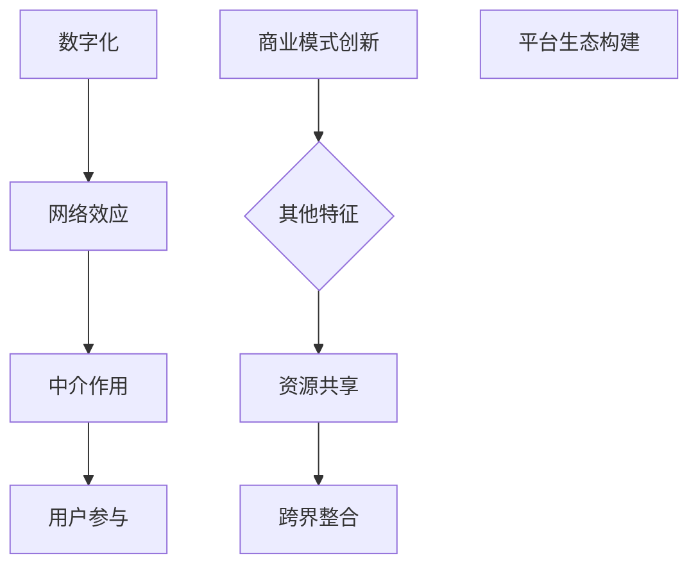
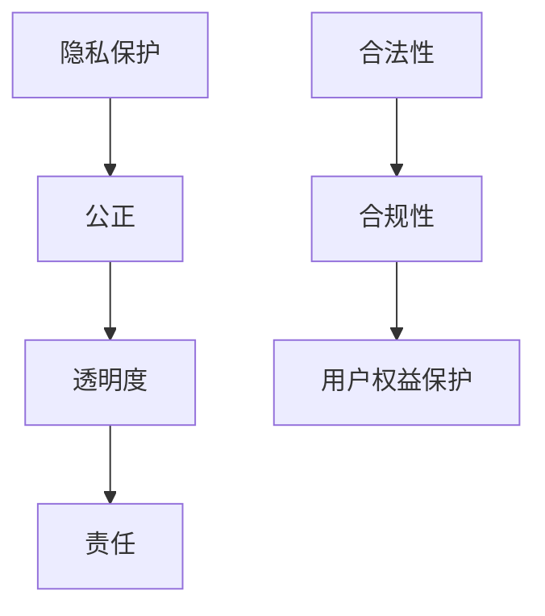
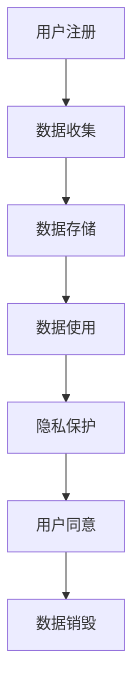
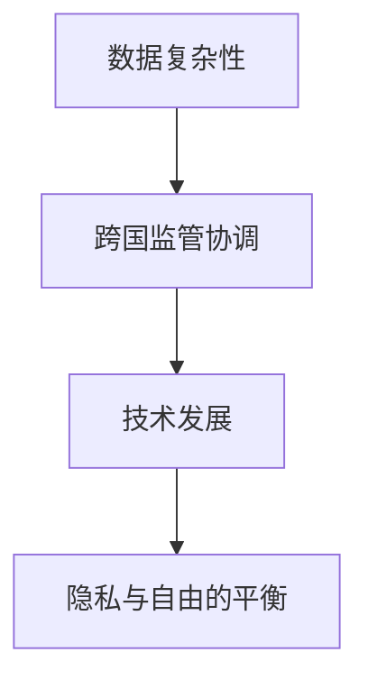
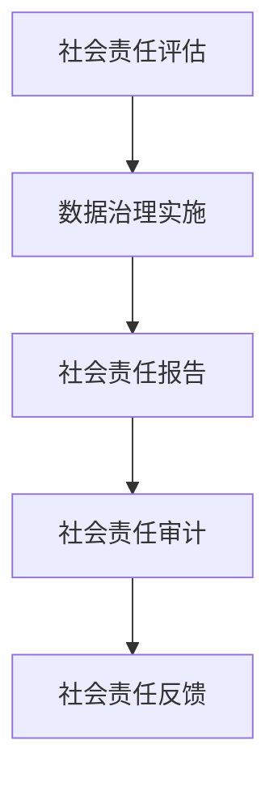

                 

### 文章标题：平台经济的数据伦理：如何平衡利益与责任？

#### 关键词：平台经济、数据伦理、利益平衡、社会责任

#### 摘要：
本文深入探讨了平台经济背景下数据伦理的重要性，分析了平台经济中的数据收集与隐私保护、数据滥用与监管、数据社会责任等问题。通过详细的理论分析、案例分析以及实践策略，本文提出了如何在平台经济中平衡利益与责任的解决方案，为平台企业提供了指导性的建议。

---

## 第一部分：平台经济的概述与数据伦理背景

### 第1章：平台经济的崛起与影响

#### 1.1 平台经济的定义与特征

平台经济是一种基于互联网和数字技术的商业模式，它通过搭建一个中间平台，连接供需双方，实现资源的高效配置和价值的最大化。平台经济的核心特征包括：

1. **数字化**：平台经济利用互联网和数字技术，实现了线上交易和服务的便捷性。
2. **网络效应**：平台的价值随着用户的增加而增加，形成强大的网络效应。
3. **中介作用**：平台作为中介，降低了交易成本，提高了交易效率。
4. **用户参与**：平台经济高度依赖用户生成的内容和反馈，用户的参与度直接影响平台的成功。

#### 1.2 平台经济的崛起及其全球影响力

平台经济在全球范围内迅速崛起，主要得益于以下几个因素：

1. **互联网普及**：互联网的普及为平台经济提供了广泛的用户基础和技术支持。
2. **移动设备的普及**：智能手机和移动设备的普及，使得用户可以随时随地访问平台服务。
3. **技术创新**：大数据、人工智能、区块链等技术的快速发展，为平台经济提供了更多的应用场景和可能性。
4. **商业模式的创新**：平台企业通过创新的商业模式，如共享经济、众筹等，吸引了大量的用户和资金。

平台经济的全球影响力体现在以下几个方面：

1. **改变传统商业模式**：平台经济颠覆了传统的商业模式，推动了商业模式的创新和升级。
2. **创造就业机会**：平台经济为人们提供了大量的就业机会，促进了就业市场的多元化。
3. **提升经济效率**：平台经济通过优化资源配置，提高了经济效率，促进了社会经济的发展。
4. **数据垄断**：平台经济巨头通过积累大量用户数据，形成了数据垄断，影响了市场竞争和用户权益。

#### 1.3 平台经济的双刃剑效应

平台经济具有显著的积极作用，但也存在一些负面效应，即“双刃剑效应”。这些负面效应主要包括：

1. **数据隐私泄露**：平台经济大量收集用户数据，容易导致数据隐私泄露，影响用户权益。
2. **数据滥用**：平台企业可能滥用用户数据，用于广告定向、市场操纵等不当目的。
3. **市场垄断**：平台经济巨头通过数据垄断和市场操纵，可能形成市场垄断，损害市场竞争。
4. **社会不公**：平台经济可能导致收入分配不均，加剧社会不公问题。

#### 1.4 平台经济的数据伦理问题

平台经济的数据伦理问题主要包括以下几个方面：

1. **数据隐私保护**：平台经济在数据收集、处理和存储过程中，如何保护用户隐私，防止数据泄露。
2. **数据透明度**：平台经济在数据使用过程中，如何确保数据透明，让用户了解其数据的使用情况和范围。
3. **数据社会责任**：平台经济在追求商业利益的同时，如何承担社会责任，维护社会公共利益。
4. **数据监管**：如何建立有效的数据监管机制，确保平台经济中的数据伦理问题得到有效解决。

### 第2章：数据伦理的基本概念

#### 2.1 数据伦理的定义与发展

数据伦理是指与数据收集、处理、存储和使用相关的伦理问题，涉及隐私、公正、透明等原则。数据伦理的发展可以追溯到以下几个方面：

1. **隐私权的兴起**：随着信息技术的发展，隐私权逐渐成为人们关注的重要问题，推动了数据伦理的兴起。
2. **个人信息保护法规**：如《通用数据保护条例》（GDPR）等法律法规的出台，为数据伦理提供了法律保障。
3. **数据社会责任的提出**：随着平台经济的发展，数据社会责任成为数据伦理研究的重要方向。

#### 2.2 数据伦理的核心原则

数据伦理的核心原则包括：

1. **隐私保护**：保护个人隐私，确保数据收集和使用过程中的合法性和合理性。
2. **公正**：确保数据处理过程的公正性，避免歧视和不公平现象。
3. **透明度**：确保数据使用的透明性，让用户了解其数据的使用情况和范围。
4. **责任**：平台企业和数据处理者应承担相应的责任，确保数据安全和合法使用。

#### 2.3 数据伦理与法律的关系

数据伦理与法律密切相关，数据伦理为法律提供了道德基础，而法律则为数据伦理提供了制度保障。具体关系如下：

1. **法律框架**：数据伦理原则通过法律框架得到具体实施，如《通用数据保护条例》（GDPR）。
2. **法律执行**：数据伦理原则的执行需要依靠法律手段，如数据隐私保护法律的执法和处罚。
3. **法律与伦理的互动**：法律与伦理相互影响，法律的制定和执行需要考虑数据伦理原则，而数据伦理的研究也为法律提供了理论支持。

#### 2.4 数据伦理的社会影响

数据伦理问题不仅涉及个人隐私和公正，还对社会产生了深远影响，具体包括：

1. **隐私权保护**：数据伦理确保个人隐私权得到尊重和保护，促进了社会公正。
2. **社会信任**：数据伦理的遵守可以增强社会信任，促进互联网经济的健康发展。
3. **数据滥用防范**：数据伦理原则有助于防范数据滥用，避免社会风险。
4. **社会问题解决**：数据伦理研究可以为解决社会问题提供理论支持，如贫困、歧视等。

## 第二部分：平台经济数据伦理问题分析

### 第3章：数据收集与隐私保护

#### 3.1 平台经济中的数据收集方式

平台经济中的数据收集方式多种多样，主要包括以下几种：

1. **用户注册信息**：平台用户在注册账号时，需要提供个人信息，如姓名、邮箱、电话等。
2. **行为数据**：平台通过用户在平台上的行为数据，如浏览记录、购买行为等，进行数据收集。
3. **地理位置数据**：平台通过GPS等技术获取用户地理位置信息，用于精准营销和用户服务。
4. **社交媒体数据**：平台通过用户在社交媒体上的活动数据，如点赞、评论等，进行数据收集。

#### 3.2 数据隐私保护的法律与政策

为了保护用户隐私，各国出台了一系列数据隐私保护的法律和政策，主要包括：

1. **国际法律**：如《通用数据保护条例》（GDPR）、《加州消费者隐私法案》（CCPA）等。
2. **国内法律**：如《网络安全法》、《个人信息保护法》（PIPL）等。
3. **行业规范**：如《互联网个人信息安全保护规范》、《云计算服务安全指南》等。

#### 3.3 平台经济中的隐私侵犯案例

平台经济中的隐私侵犯案例屡见不鲜，以下是一些典型的案例：

1. **Facebook数据泄露事件**：2018年，Facebook被曝出5000万用户数据被不当使用，引发全球关注。
2. **Uber数据泄露事件**：2016年，Uber被曝出多次数据泄露事件，涉及数百万用户。
3. **谷歌数据滥用事件**：2020年，谷歌被曝出在搜索引擎和广告业务中滥用用户数据。

#### 3.4 平台经济中的隐私保护技术

为了保护用户隐私，平台经济采用了多种隐私保护技术，主要包括：

1. **数据加密**：通过数据加密技术，确保用户数据在传输和存储过程中的安全性。
2. **匿名化**：通过匿名化技术，将用户数据脱敏，防止个人信息泄露。
3. **访问控制**：通过访问控制技术，确保只有授权用户可以访问特定数据。
4. **隐私计算**：通过隐私计算技术，实现数据在计算过程中的隐私保护。

### 第4章：数据滥用与监管

#### 4.1 平台经济中的数据滥用现象

平台经济中的数据滥用现象主要包括以下几个方面：

1. **广告定向**：平台企业通过用户数据，进行精准广告推送，可能导致用户隐私泄露。
2. **市场操纵**：平台企业通过用户数据，操纵市场，影响市场竞争。
3. **用户画像**：平台企业通过用户数据，建立用户画像，可能侵犯用户隐私权。
4. **数据出售**：平台企业可能将用户数据出售给第三方，用于非法目的。

#### 4.2 监管机构在平台经济中的角色

监管机构在平台经济中扮演着重要角色，主要包括以下几个方面：

1. **数据隐私保护**：监管机构负责制定和执行数据隐私保护法律法规，确保用户数据安全。
2. **市场监管**：监管机构负责维护市场秩序，打击数据滥用行为。
3. **社会监督**：监管机构通过社会监督，促进平台企业遵守数据伦理原则。

#### 4.3 平台经济数据监管的挑战

平台经济数据监管面临以下挑战：

1. **数据复杂性**：平台经济中的数据量大、类型多，监管难度较大。
2. **跨国监管**：平台企业涉及多个国家和地区，监管协调难度大。
3. **技术发展**：平台经济中的技术不断更新，监管技术也需要不断迭代。
4. **隐私与自由的平衡**：在保护用户隐私的同时，需要平衡用户自由和商业利益。

#### 4.4 数据监管的有效措施

为了有效监管平台经济数据，可以采取以下措施：

1. **立法完善**：完善数据隐私保护法律法规，提高违法成本。
2. **技术手段**：利用大数据、人工智能等新技术，提高监管效率和准确性。
3. **国际合作**：加强国际监管合作，共同应对跨国数据滥用问题。
4. **社会参与**：鼓励公众参与数据伦理讨论，提高数据伦理意识。

### 第5章：平台经济中的数据社会责任

#### 5.1 平台企业的社会责任

平台企业在平台经济中扮演着重要角色，其社会责任主要包括以下几个方面：

1. **数据隐私保护**：平台企业应采取有效措施，保护用户数据隐私。
2. **公平竞争**：平台企业应遵守公平竞争原则，维护市场秩序。
3. **社会责任报告**：平台企业应定期发布社会责任报告，公开透明地披露数据使用情况和伦理实践。
4. **用户权益保护**：平台企业应保护用户权益，及时解决用户问题。

#### 5.2 平台经济中的数据社会责任

平台经济中的数据社会责任主要包括以下几个方面：

1. **数据透明度**：平台企业应提高数据透明度，让用户了解其数据的使用情况和范围。
2. **数据安全**：平台企业应加强数据安全措施，防范数据泄露和滥用。
3. **社会责任投资**：平台企业应将社会责任投资（SRI）纳入战略规划，支持可持续发展项目。
4. **数据伦理培训**：平台企业应开展数据伦理培训，提高员工数据伦理意识。

#### 5.3 平台经济数据社会责任的案例研究

以下是一些平台经济数据社会责任的案例研究：

1. **Alibaba的数据社会责任**：阿里巴巴通过“数字乡村”项目，帮助农村地区发展数字经济，推动社会公平。
2. **Facebook的数据社会责任**：Facebook承诺增加对隐私保护技术的投资，并与监管机构合作，改进数据管理。
3. **Uber的数据社会责任**：Uber推出“安全驾驶”计划，通过技术手段提高司机和乘客的安全，降低交通事故风险。

#### 5.4 平台经济数据社会责任的未来展望

平台经济数据社会责任的未来展望包括以下几个方面：

1. **数据伦理法规的完善**：未来将出台更多数据伦理法规，规范平台企业的数据使用。
2. **数据伦理意识的提高**：社会公众和数据伦理意识将逐渐提高，平台企业将更加注重数据社会责任。
3. **技术创新**：大数据、人工智能等技术的不断发展，将为平台经济数据社会责任的实践提供更多可能性。
4. **全球合作**：国际社会将加强合作，共同应对平台经济数据社会责任的全球挑战。

## 第三部分：平衡利益与责任的实践

### 第6章：平台企业的数据治理

#### 6.1 数据治理的概念与原则

数据治理是指通过制定政策和流程，确保数据的质量、安全、合规和有效使用。数据治理的原则包括：

1. **数据质量**：确保数据准确、完整、一致和可用。
2. **数据安全**：保护数据免受未经授权的访问、篡改和泄露。
3. **数据合规**：遵守相关法律法规，确保数据处理的合法性和合规性。
4. **数据效率**：优化数据管理流程，提高数据使用效率。

#### 6.2 平台企业的数据治理框架

平台企业的数据治理框架包括以下几个方面：

1. **组织架构**：建立专门的数据治理团队，明确数据治理的职责和权限。
2. **政策制定**：制定数据治理政策，包括数据质量、数据安全、数据合规等方面。
3. **流程优化**：优化数据管理流程，确保数据从收集、存储、处理到销毁的全生命周期管理。
4. **技术支持**：利用大数据、人工智能等新技术，提高数据治理的效率和准确性。

#### 6.3 数据治理工具与实践

平台企业在数据治理过程中，可以采用以下工具和实践：

1. **数据质量管理工具**：如数据清洗、数据归一化、数据验证等工具，确保数据质量。
2. **数据安全工具**：如数据加密、访问控制、网络安全等工具，保护数据安全。
3. **数据合规工具**：如合规性检查、数据审计等工具，确保数据处理符合法规要求。
4. **数据治理实践**：如数据治理培训、数据治理审计、数据治理评估等实践，提高数据治理水平。

#### 6.4 平台企业数据治理案例分析

以下是一些平台企业数据治理的案例分析：

1. **阿里巴巴的数据治理**：阿里巴巴建立了全面的数据治理体系，包括数据质量管理、数据安全保护、数据合规性检查等方面。
2. **Facebook的数据治理**：Facebook通过建立数据治理委员会，制定数据治理政策，提高数据透明度和合规性。
3. **Uber的数据治理**：Uber建立了数据治理团队，制定数据治理流程，加强数据安全防护和合规性管理。

### 第7章：平台经济的利益与责任平衡策略

#### 7.1 平台经济的利益分析

平台经济的利益包括：

1. **商业利益**：平台企业通过平台服务获取利润，实现商业成功。
2. **用户利益**：平台服务为用户提供便利，提升用户生活质量。
3. **社会利益**：平台经济促进就业、提升经济效率，推动社会进步。

#### 7.2 平台经济的责任分析

平台经济的责任包括：

1. **数据隐私保护**：平台企业应保护用户数据隐私，防止数据泄露和滥用。
2. **社会责任**：平台企业应承担社会责任，维护社会公共利益。
3. **合规性**：平台企业应遵守相关法律法规，确保数据处理的合法性和合规性。

#### 7.3 利益与责任平衡的案例分析

以下是一些平台经济利益与责任平衡的案例分析：

1. **Airbnb的数据隐私保护**：Airbnb通过加强数据安全防护和用户隐私保护，实现商业利益与责任平衡。
2. **亚马逊的公平竞争**：亚马逊通过遵守公平竞争原则，维护市场秩序，实现商业利益与社会责任平衡。
3. **优步的用户权益保护**：优步通过保护用户权益和提升服务质量，实现商业利益与社会责任平衡。

#### 7.4 平衡利益与责任的策略与实践

平台企业可以采取以下策略与实践，平衡利益与责任：

1. **数据治理**：建立数据治理体系，确保数据质量、安全、合规和有效使用。
2. **透明度**：提高数据透明度，让用户了解数据的使用情况和范围。
3. **社会责任投资**：将社会责任投资纳入战略规划，支持可持续发展项目。
4. **合规性管理**：建立合规性管理体系，确保数据处理符合法律法规要求。
5. **用户参与**：鼓励用户参与数据伦理讨论，提高数据伦理意识。

### 第8章：平台经济数据伦理的未来

#### 8.1 平台经济数据伦理的发展趋势

平台经济数据伦理的发展趋势包括：

1. **数据隐私保护法规的完善**：未来将出台更多数据隐私保护法律法规，规范平台企业的数据使用。
2. **数据社会责任的重视**：平台企业将更加重视数据社会责任，推动可持续发展。
3. **技术创新**：大数据、人工智能等技术的不断发展，将为平台经济数据伦理提供更多解决方案。
4. **全球合作**：国际社会将加强合作，共同应对平台经济数据伦理的全球挑战。

#### 8.2 平台经济数据伦理的挑战与机遇

平台经济数据伦理面临的挑战包括：

1. **数据隐私保护难度大**：随着数据量的增加，数据隐私保护难度越来越大。
2. **数据滥用风险**：平台企业可能滥用用户数据，导致数据滥用风险。
3. **跨国监管协调难**：跨国监管协调难度大，可能导致监管空白和漏洞。

平台经济数据伦理的机遇包括：

1. **技术创新**：大数据、人工智能等技术的创新，为平台经济数据伦理提供更多解决方案。
2. **社会关注**：社会对平台经济数据伦理问题的关注增加，为解决数据伦理问题提供社会支持。
3. **法律法规完善**：法律法规的完善，为平台经济数据伦理提供法律保障。

#### 8.3 平台经济数据伦理的未来规范

平台经济数据伦理的未来规范包括：

1. **数据隐私保护**：建立全面的数据隐私保护体系，确保用户数据隐私。
2. **数据社会责任**：建立数据社会责任体系，推动平台企业可持续发展。
3. **合规性管理**：建立完善的合规性管理体系，确保数据处理符合法律法规要求。
4. **国际合作**：加强国际合作，共同应对平台经济数据伦理的全球挑战。

#### 8.4 平台经济数据伦理的教育与培训

平台经济数据伦理的教育与培训包括：

1. **数据伦理课程**：开设数据伦理课程，提高公众数据伦理意识。
2. **数据伦理培训**：为平台企业员工提供数据伦理培训，提高员工数据伦理素质。
3. **社会宣传**：通过媒体宣传、公益活动等，提高社会对平台经济数据伦理问题的关注。

## 附录

### 附录A：平台经济数据伦理相关法规与政策

#### A.1 国际法规与政策

1. **《通用数据保护条例》（GDPR）**：欧盟于2018年实施的严格数据保护法律，对个人数据的收集、处理和存储有详细规定。
2. **《加州消费者隐私法案》（CCPA）**：美国加州于2020年通过的隐私保护法律，赋予消费者对个人信息更多的控制权。
3. **《隐私盾牌框架》（Privacy Shield）**：欧盟与美国之间的一项数据传输协议，旨在确保跨大西洋数据传输的隐私保护。
4. **《数字贸易协定》（DTA）**：旨在规范数字贸易的国际协定，涉及数据流动、数据隐私、网络安全等多个方面。
5. **联合国数字合作高级别小组（UNGA-DCH）**：提出了一系列数字合作的原则，包括数据隐私、网络安全等。

#### A.2 国内法规与政策

1. **《网络安全法》**：中国于2017年实施的网络安全法律，涉及数据保护、网络安全等方面的规定。
2. **《个人信息保护法》（PIPL）**：中国于2021年实施的个人信息保护法律，对个人信息的收集、处理、存储和使用进行了详细规定。
3. **《互联网个人信息安全保护规范》**：中国互联网协会发布的行业标准，对个人信息保护提出了具体要求。
4. **《数据安全法》**：中国于2021年实施的数据安全法律，涉及数据收集、处理、存储、传输等环节的安全管理。

#### A.3 行业规范与标准

1. **《信息安全技术个人信息安全规范》**：国家标准化管理委员会发布的标准，对个人信息的保护提出了具体的技术和管理要求。
2. **《云计算服务安全指南》**：中国信息通信研究院发布的指南，为云计算服务提供了安全管理的最佳实践。
3. **《人工智能伦理规范》**：中国人工智能学会发布的规范，旨在引导人工智能行业的健康发展，保障人工智能的安全与伦理。
4. **《金融科技（FinTech）发展规划（2019-2021年）》**：中国人民银行等十部委发布的规划，涉及金融科技在数据安全和隐私保护方面的规范要求。
5. **《医疗机构网络安全管理办法》**：国家卫生健康委员会发布的办法，对医疗机构的数据安全和管理提出了要求。
6. **《教育信息化2.0行动计划》**：教育部发布的行动计划，涉及教育领域的数据安全和隐私保护。

### 附录B：平台经济数据伦理研究文献

#### B.1 核心文献综述

1. **《平台经济的崛起与挑战：数据伦理的视角》**：本文对平台经济的崛起及其带来的数据伦理挑战进行了深入分析。
2. **《数据伦理：从隐私保护到社会责任》**：本文探讨了数据伦理的概念和内涵，从隐私保护扩展到社会责任。
3. **《平台经济中的数据滥用与监管挑战》**：本文分析了平台经济中的数据滥用现象，探讨了监管机构的角色和挑战。

#### B.2 研究动态与趋势

1. **《平台经济数据伦理的国际对比研究》**：本文对比分析了不同国家和地区在平台经济数据伦理方面的法规和政策。
2. **《平台经济数据伦理的社会影响评估》**：本文通过社会调查和实证研究，评估了平台经济数据伦理问题对社会的影响。
3. **《平台经济数据伦理的跨学科研究》**：本文探讨了跨学科视角在平台经济数据伦理研究中的应用。

#### B.3 研究方法与工具

1. **《大数据分析方法在平台经济数据伦理研究中的应用》**：本文介绍了大数据分析方法在平台经济数据伦理研究中的具体应用。
2. **《案例分析法在平台经济数据伦理研究中的运用》**：本文探讨了案例分析法在平台经济数据伦理研究中的应用。
3. **《人工智能技术支持的数据伦理研究》**：本文探讨了人工智能技术在平台经济数据伦理研究中的应用。

### 附录C：平台经济数据伦理案例分析

#### C.1 案例介绍

1. **Facebook数据泄露事件**：2018年，Facebook被曝出5000万用户数据被不当使用，引发了全球范围内对平台经济数据伦理问题的广泛关注。
2. **Uber数据泄露事件**：2016年，Uber被曝出多次数据泄露事件，涉及数百万用户。
3. **谷歌数据滥用事件**：2020年，谷歌被曝出在搜索引擎和广告业务中滥用用户数据。

#### C.2 案例分析

1. **Facebook数据泄露事件**：该事件揭示了平台企业在数据收集和使用过程中的隐私保护问题。
2. **Uber数据泄露事件**：该事件揭示了平台企业在数据安全方面的漏洞。
3. **谷歌数据滥用事件**：该事件引发了公众对谷歌数据伦理问题的质疑。

#### C.3 案例启示

1. **加强数据隐私保护**：平台企业应加强数据隐私保护措施，遵守相关法律法规。
2. **提高数据安全意识**：平台企业应提高数据安全意识，加强员工培训。
3. **平衡利益与责任**：平台企业应在追求商业利益的同时，积极承担社会责任。

## 图表与公式

### 图1-1 平台经济的核心特征

### 图2-1 数据伦理的核心原则

### 图3-1 数据收集与隐私保护的流程图

### 图4-1 平台经济数据监管的挑战

### 图5-1 平台企业的数据社会责任流程图

### 公式1-1 数据隐私保护的成本-效益分析

$$
C-E = \frac{P \times (C_1 + C_2)}{E_1 + E_2}
$$

其中：
- \(C-E\) 为数据隐私保护的成本-效益比。
- \(P\) 为平台企业投入的数据隐私保护成本。
- \(C_1\) 和 \(C_2\) 分别为数据泄露带来的直接成本和间接成本。
- \(E_1\) 和 \(E_2\) 分别为数据泄露对用户和企业的影响程度。

### 附录C：平台经济数据伦理案例分析

#### C.1 案例介绍

**案例1：Facebook数据泄露事件**

- **时间线**：2018年3月，Facebook被曝出5000万用户数据被不当使用，包括个人联系信息和位置数据。
- **事件起因**：数据被第三方应用程序剑桥分析公司非法获取，用于政治营销和广告定位。
- **影响范围**：受影响用户遍布全球，引发公众对隐私保护的广泛关注。
- **后果**：Facebook面临多国监管机构的调查，股价下跌，公司声誉受损。

**案例2：Uber数据泄露事件**

- **时间线**：2016年，Uber首次曝出数据泄露事件，2017年进一步曝出多起数据泄露事件。
- **事件起因**：Uber内部员工和黑客多次非法访问用户数据，包括行程数据和支付信息。
- **影响范围**：受影响用户遍及全球，涉及数百万Uber乘客和司机。
- **后果**：Uber面临法律诉讼和监管机构的调查，高层管理人员辞职，公司加强数据安全措施。

**案例3：谷歌数据滥用事件**

- **时间线**：2020年，谷歌被曝出在搜索引擎和广告业务中滥用用户数据。
- **事件起因**：谷歌的搜索建议和广告定位功能基于用户个人数据，但这些数据被用于商业决策和广告定位，超出用户预期。
- **影响范围**：全球用户受到涉及，引发隐私保护和反垄断问题。
- **后果**：谷歌面临多国监管机构的调查，部分广告业务受到限制，公司承诺改进数据管理和隐私保护措施。

#### C.2 案例分析

**Facebook数据泄露事件**

- **隐私侵犯**：用户个人数据未经授权被第三方获取和利用，违反了数据隐私保护原则。
- **监管挑战**：事件引发多国监管机构的调查，Facebook面临法律和监管压力。
- **影响评估**：用户对隐私保护的担忧加剧，Facebook声誉受损，股价下跌。

**Uber数据泄露事件**

- **数据安全漏洞**：Uber内部员工和黑客多次非法访问用户数据，公司数据安全措施不足。
- **法律和道德责任**：Uber面临法律诉讼和道德质疑，需要承担法律责任和修复数据安全漏洞。
- **商业影响**：事件导致Uber股价波动，公司需要加强数据安全措施，提升用户信任。

**谷歌数据滥用事件**

- **用户数据滥用**：谷歌在广告业务中滥用用户数据，违反了用户隐私保护预期。
- **监管压力**：谷歌面临多国监管机构的调查，需要遵守相关法律和规定。
- **市场影响**：谷歌部分广告业务受到限制，公司需要改进数据管理和隐私保护措施。

#### C.3 案例启示

**Facebook数据泄露事件**

- **加强数据隐私保护**：平台企业应加强数据隐私保护措施，遵守相关法律法规，确保用户数据的合法、安全和合理使用。
- **数据使用透明度**：平台企业应提高数据使用透明度，明确数据收集、处理和使用的目的和范围，增强用户信任。
- **加强监管合作**：平台企业应与监管机构加强合作，及时报告和解决数据隐私问题，避免法律风险。

**Uber数据泄露事件**

- **数据安全防护**：平台企业应加强数据安全防护措施，防范内部员工和外部黑客的数据入侵。
- **员工培训**：平台企业应加强员工培训，提高数据安全意识，确保员工遵守数据保护规定。
- **用户权益保护**：平台企业应重视用户权益保护，建立用户投诉和处理机制，及时回应用户关切。

**谷歌数据滥用事件**

- **平衡商业利益与社会责任**：平台企业应在追求商业利益的同时，积极承担社会责任，确保数据使用符合伦理标准，维护社会公共利益。
- **用户隐私保护**：平台企业应加强对用户隐私的保护，制定明确的隐私政策，提高用户对隐私保护的认知。
- **透明度和问责机制**：平台企业应提高数据使用透明度，建立有效的问责机制，确保数据使用行为可追溯、可审计。

### C.4 案例启示总结

通过平台经济数据伦理案例分析，我们可以得出以下启示：

1. **加强数据隐私保护**：平台企业应严格遵守相关法律法规，采取有效措施保护用户数据隐私。
2. **数据安全防护**：平台企业应加强数据安全防护，防范数据泄露和滥用。
3. **用户权益保护**：平台企业应重视用户权益保护，建立用户投诉和处理机制。
4. **平衡商业利益与社会责任**：平台企业应在追求商业利益的同时，积极承担社会责任。
5. **数据使用透明度**：平台企业应提高数据使用透明度，增强用户信任。
6. **监管合作与问责机制**：平台企业应与监管机构加强合作，建立有效的问责机制。

这些启示为平台企业在数据伦理管理方面提供了重要参考，有助于构建一个更加安全、透明和负责任的数据生态。

