                 

# 《平台经济的数据伦理：如何建立平台数据伦理规范？》

## 关键词：平台经济、数据伦理、数据规范、隐私保护、法律法规

> 摘要：本文探讨了平台经济背景下数据伦理的重要性及其面临的挑战，提出了建立平台数据伦理规范的方法和原则。通过分析国内外实践案例，探讨了数据收集、使用、安全、透明度等方面的规范设计，并提出了数据伦理教育与培训、监管与法律法规建设等策略，为平台经济中的数据伦理实践提供了理论指导和实践参考。

## 文章目录

### 第一部分：平台经济与数据伦理概述

#### 1.1 平台经济的兴起与影响

##### 1.1.1 平台经济的定义与特点

##### 1.1.2 平台经济的全球发展趋势

##### 1.1.3 平台经济对社会经济的影响

#### 1.2 数据伦理的概念与重要性

##### 1.2.1 数据伦理的定义与内涵

##### 1.2.2 数据伦理的核心原则

##### 1.2.3 数据伦理在平台经济中的重要性

#### 1.3 数据伦理的现状与挑战

##### 1.3.1 数据伦理现状分析

##### 1.3.2 平台经济中的数据伦理挑战

##### 1.3.3 数据伦理问题的案例分析

### 第二部分：平台数据伦理规范的设计与实践

#### 2.1 平台数据伦理规范的构建原则

##### 2.1.1 数据伦理规范的基本原则

##### 2.1.2 数据伦理规范的设计步骤

##### 2.1.3 数据伦理规范的评估与完善

#### 2.2 平台数据伦理规范的核心要素

##### 2.2.1 数据收集与使用规范

##### 2.2.2 数据安全与隐私保护

##### 2.2.3 数据透明度与用户知情权

##### 2.2.4 数据责任与责任承担

#### 2.3 平台数据伦理规范的实施案例

##### 2.3.1 国内外平台数据伦理规范案例分析

##### 2.3.2 平台数据伦理规范实施的效果评估

##### 2.3.3 平台数据伦理规范实施的难点与解决方案

#### 2.4 平台数据伦理教育与培训

##### 2.4.1 数据伦理教育与培训的重要性

##### 2.4.2 平台数据伦理教育的内容与形式

##### 2.4.3 平台数据伦理教育的效果评估与改进

### 第三部分：平台数据伦理监管与法律法规

#### 3.1 平台数据伦理监管的现状与趋势

##### 3.1.1 平台数据伦理监管的法律法规框架

##### 3.1.2 平台数据伦理监管的政策与实践

##### 3.1.3 平台数据伦理监管的挑战与对策

#### 3.2 平台数据伦理监管的法律问题与解决方案

##### 3.2.1 数据权利与数据自由流动的平衡

##### 3.2.2 数据隐私与公共利益的平衡

##### 3.2.3 数据伦理监管的法治化路径

#### 3.3 平台数据伦理监管的国际合作与交流

##### 3.3.1 国际平台数据伦理监管的协调与合作

##### 3.3.2 国际数据治理框架与平台数据伦理规范

##### 3.3.3 国际数据治理经验对我国平台数据伦理监管的启示

### 第四部分：平台数据伦理的未来发展

#### 4.1 平台数据伦理的未来趋势

##### 4.1.1 人工智能与平台数据伦理

##### 4.1.2 区块链与平台数据伦理

##### 4.1.3 平台数据伦理的未来发展方向

#### 4.2 平台数据伦理的国际经验与启示

##### 4.2.1 国际平台数据伦理规范的比较分析

##### 4.2.2 国际平台数据伦理监管的典型案例

##### 4.2.3 国际平台数据伦理经验对我国的影响与启示

#### 4.3 平台数据伦理的可持续发展策略

##### 4.3.1 平台数据伦理规范的长效机制

##### 4.3.2 平台数据伦理的社会参与与共治

##### 4.3.3 平台数据伦理的可持续发展路径

### 附录

#### 附录 A：平台数据伦理相关法律法规汇总

#### 附录 B：平台数据伦理研究参考资料

#### 附录 C：平台数据伦理教育与实践案例精选

#### 附录 D：平台数据伦理相关标准与指南

---

### 文章标题：平台经济的数据伦理：如何建立平台数据伦理规范？

平台经济作为一种新兴的经济模式，正深刻影响着全球的商业生态。随着平台经济的快速发展，数据伦理问题日益凸显。平台经济的核心在于对海量用户数据的收集、存储、处理和分析，这无疑带来了巨大的伦理挑战。如何建立平台数据伦理规范，确保数据的安全、隐私和保护，成为当前亟待解决的重要课题。

本文将从以下几个方面展开讨论：

1. **平台经济的兴起与影响**：介绍平台经济的定义、特点及其对社会经济的影响。
2. **数据伦理的概念与重要性**：阐述数据伦理的定义、核心原则及其在平台经济中的重要性。
3. **数据伦理的现状与挑战**：分析当前数据伦理的现状，探讨平台经济中数据伦理面临的挑战。
4. **平台数据伦理规范的设计与实践**：提出平台数据伦理规范的设计原则、核心要素及其实施案例。
5. **平台数据伦理监管与法律法规**：讨论平台数据伦理监管的现状、法律问题及国际合作。
6. **平台数据伦理的未来发展**：展望平台数据伦理的未来趋势及其国际经验与启示。
7. **平台数据伦理的可持续发展策略**：提出平台数据伦理规范的长效机制和社会参与策略。

通过本文的探讨，希望能够为平台经济中的数据伦理实践提供有益的理论指导和实践参考。

---

### 第一部分：平台经济与数据伦理概述

#### 1.1 平台经济的兴起与影响

##### 1.1.1 平台经济的定义与特点

平台经济是指通过互联网和数字技术构建的一种商业模式，它以互联网平台为核心，连接供需双方，实现资源的优化配置和高效利用。平台经济具有以下几个显著特点：

- **双边市场**：平台经济通常涉及两个或多个用户群体，通过平台相互连接，形成一个双边市场。
- **网络效应**：平台的价值随着用户数量的增加而提升，这种正反馈机制被称为网络效应。
- **平台化运营**：平台经济通过构建生态系统，实现服务、技术、数据等多方面的共享和整合。
- **规模化效应**：平台经济能够快速扩展业务规模，降低成本，提高效益。

平台经济的定义与特点可以用以下 Mermaid 流程图表示：

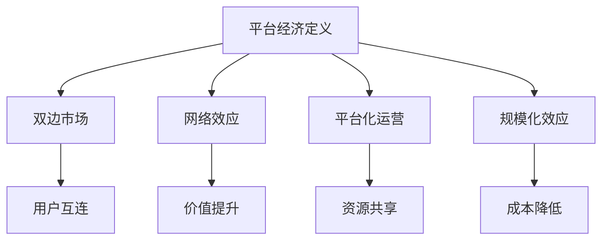

##### 1.1.2 平台经济的全球发展趋势

平台经济在全球范围内迅速发展，不同国家和地区在发展模式、市场规模和竞争态势上各有特色。以下是一些主要趋势：

- **美国**：以科技巨头为代表的平台经济主导全球市场，涵盖了电商、社交、金融、出行等多个领域。
- **欧洲**：注重数据隐私保护和公平竞争，推动数字单一市场建设，发展本地化平台经济。
- **亚洲**：中国和印度等新兴市场国家，以快速发展的互联网基础设施和庞大的用户群体为支撑，平台经济蓬勃发展。
- **其他地区**：拉丁美洲、非洲等地区也在积极拥抱平台经济，探索适合本地发展的模式。

平台经济的全球发展趋势可以用以下 Mermaid 流�程图表示：

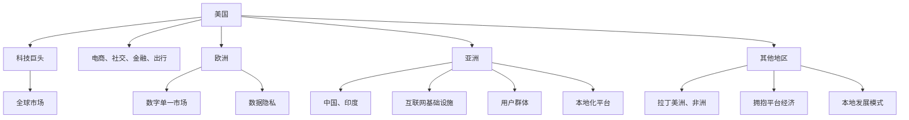

##### 1.1.3 平台经济对社会经济的影响

平台经济对社会经济产生了深远的影响，既带来了机遇，也带来了挑战：

- **机遇**：
  - **就业机会**：平台经济创造了大量的就业机会，包括自营职业、兼职工作等。
  - **经济增长**：平台经济促进了消费、投资和创新，成为推动经济增长的新引擎。
  - **市场效率**：通过优化资源配置和提高交易效率，平台经济降低了交易成本，提高了市场效率。

- **挑战**：
  - **数据隐私**：平台经济对用户数据的收集和处理引发了隐私保护问题，需要加强数据伦理规范。
  - **市场竞争**：平台经济可能导致市场垄断，影响市场竞争公平性。
  - **劳动力市场变化**：平台经济对传统劳动力市场产生影响，需要关注灵活就业对劳动者权益的影响。

平台经济对社会经济的影响可以用以下 Mermaid 流程图表示：

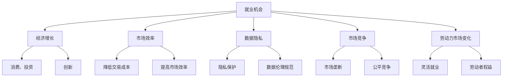

通过以上分析，我们可以看到平台经济的兴起对全球经济和社会产生了深远的影响。在享受平台经济带来便利和效益的同时，我们也需要关注数据伦理问题，制定合理的伦理规范，确保平台经济的可持续发展。

---

#### 1.2 数据伦理的概念与重要性

##### 1.2.1 数据伦理的定义与内涵

数据伦理是指与数据收集、存储、处理、使用和共享过程中涉及到的道德和伦理问题相关的原则和规范。它关注数据行为是否符合社会道德标准和价值观，以确保数据的使用不会损害个人隐私、社会利益和公共利益。数据伦理的内涵主要包括以下几个方面：

- **数据隐私**：确保个人数据不被未经授权的第三方访问和使用，保护个人隐私权益。
- **数据安全**：采取必要措施保护数据免受非法访问、篡改、泄露和破坏。
- **数据公平性**：确保数据收集和处理过程公平、公正，避免歧视和不公平现象。
- **数据透明度**：提高数据收集、存储、处理和使用的透明度，让用户了解自己的数据如何被使用。
- **数据责任**：明确数据收集者和使用者的责任，确保在数据泄露、滥用等情况下能够追溯责任。

数据伦理的定义和内涵可以用以下 Mermaid 流程图表示：

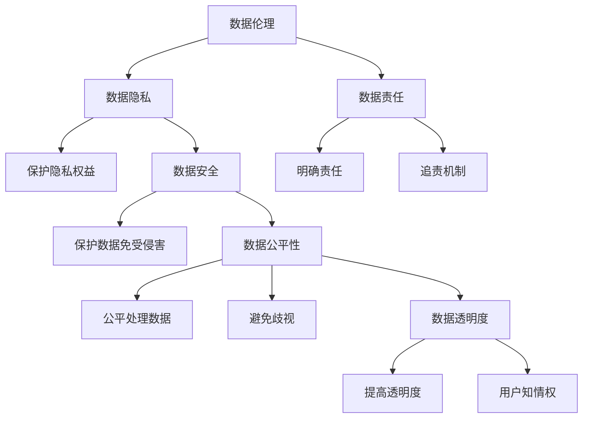

##### 1.2.2 数据伦理的核心原则

数据伦理的核心原则主要包括以下几个方面，这些原则为数据收集和处理提供了道德指导：

- **尊重个人隐私**：在收集和使用个人数据时，必须尊重个人的隐私权，确保数据不被滥用。
- **公正透明**：数据处理过程应公正透明，用户有权了解自己的数据如何被使用。
- **安全保护**：采取措施保护数据安全，防止数据泄露、篡改和滥用。
- **责任担当**：明确数据收集者和使用者的责任，确保在数据泄露、滥用等情况下能够追责。
- **社会责任**：数据收集和使用者应承担社会责任，确保数据的使用不会对社会造成负面影响。

数据伦理的核心原则可以用以下 Mermaid 流程图表示：

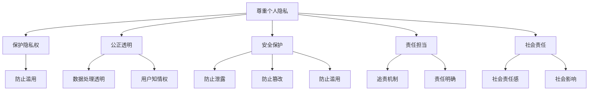

##### 1.2.3 数据伦理在平台经济中的重要性

在平台经济中，数据是核心资产，平台通过对用户数据的收集、分析和利用，实现了商业模式的创新和业务增长。然而，数据伦理在平台经济中的重要性不可忽视，主要体现在以下几个方面：

- **维护用户信任**：数据伦理是平台与用户建立信任关系的基石。如果用户不信任平台的数据处理方式，他们可能会选择离开，对平台的长期发展造成负面影响。
- **合规性要求**：全球范围内，许多国家和地区已经制定了相关法律法规，对平台数据伦理提出了严格要求。平台必须遵守这些法律法规，否则可能会面临高额罚款和声誉损失。
- **社会责任**：平台作为数据收集和使用的主要主体，有责任确保数据的使用符合社会道德标准和价值观，防止数据滥用对社会造成负面影响。
- **商业创新**：良好的数据伦理规范有助于平台建立可持续的商业模式，通过尊重用户隐私和数据安全，增强用户忠诚度，提高市场竞争能力。

数据伦理在平台经济中的重要性可以用以下 Mermaid 流程图表示：

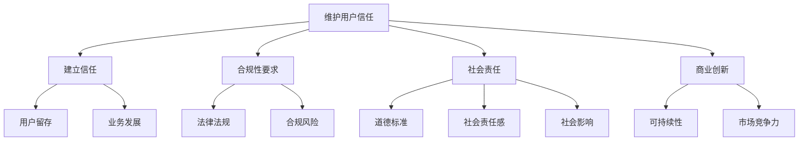

综上所述，数据伦理在平台经济中具有至关重要的作用。平台必须高度重视数据伦理问题，制定和实施有效的数据伦理规范，确保数据的安全、隐私和保护，以实现可持续的商业发展。

---

#### 1.3 数据伦理的现状与挑战

##### 1.3.1 数据伦理现状分析

当前，全球范围内数据伦理的现状呈现出一定的复杂性和多样性。以下是对数据伦理现状的分析：

- **法律法规**：许多国家和地区已经制定了相关的法律法规，对数据隐私、数据安全、数据透明度等方面提出了具体要求。例如，欧盟的《通用数据保护条例》（GDPR）和美国加州的《消费者隐私法案》（CCPA）等。
- **平台实践**：一些平台已经开始实施数据伦理规范，采取了诸如数据匿名化、数据最小化、用户知情同意等措施。然而，整体来看，平台在数据伦理方面的实践还存在不足，部分平台对数据伦理问题的重视程度不够。
- **公众意识**：随着数据隐私和数据安全问题日益凸显，公众对数据伦理的关注度逐渐提高。然而，公众对数据伦理的理解和认知还存在一定的差距，部分用户对数据伦理问题的敏感度较低。
- **技术创新**：随着大数据、人工智能等技术的快速发展，数据伦理问题变得更加复杂和严峻。例如，数据挖掘和机器学习算法可能导致歧视和不公平现象，需要采取相应的伦理措施予以解决。

数据伦理现状的分析可以用以下 Mermaid 流程图表示：

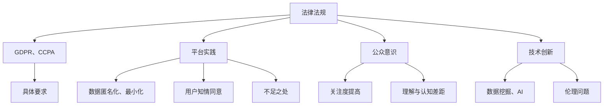

##### 1.3.2 平台经济中的数据伦理挑战

平台经济中的数据伦理挑战主要体现在以下几个方面：

- **数据隐私**：平台在收集、存储和处理用户数据时，容易侵犯用户的隐私权。例如，未经用户同意收集个人敏感信息、过度收集数据等。
- **数据安全**：平台的数据存储和处理过程中，面临数据泄露、篡改、破坏等安全威胁。例如，网络攻击、数据泄露事件频发。
- **数据透明度**：平台在数据处理过程中的透明度不足，用户难以了解自己的数据如何被使用、共享和存储。
- **数据责任**：平台在数据伦理问题上的责任界定不够清晰，一旦发生数据泄露、滥用等事件，责任承担难以落实。
- **数据公平性**：平台在数据收集和处理过程中可能存在歧视和不公平现象，例如基于数据算法的歧视、数据偏见等。

平台经济中的数据伦理挑战可以用以下 Mermaid 流程图表示：

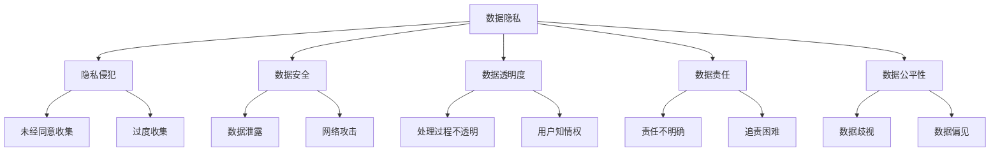

##### 1.3.3 数据伦理问题的案例分析

以下是一些典型的数据伦理问题案例，通过分析这些案例，可以更直观地了解平台经济中数据伦理问题的严重性：

1. **Facebook 数据泄露事件**：2018年，Facebook 爆发了大规模的数据泄露事件，超过 8700 万用户的个人信息被泄露。这一事件暴露了平台在数据隐私保护方面的漏洞，引发了全球范围内的关注和讨论。
   
2. **亚马逊 AI 语音助手泄露隐私**：亚马逊的 AI 语音助手 Alexa 在一次测试中被发现记录并存储了用户的私人对话。这一事件引发了用户对数据隐私和数据安全的担忧。

3. **谷歌地图滥用用户数据**：谷歌地图在用户使用过程中，收集了大量个人位置数据，并将这些数据用于广告投放。这一行为引发了用户对数据隐私的质疑。

4. **阿里巴巴平台数据歧视**：阿里巴巴平台在搜索结果中显示对不同性别、年龄的用户存在歧视，例如在招聘广告中，女性用户更容易看到家政类职位。

数据伦理问题的案例分析可以用以下 Mermaid 流程图表示：

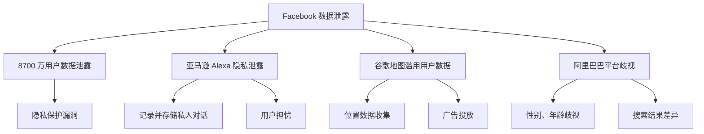

通过以上分析，我们可以看到数据伦理问题在平台经济中普遍存在，且具有复杂性和严峻性。平台必须高度重视数据伦理问题，积极采取措施，建立和完善数据伦理规范，确保数据的安全、隐私和保护，以实现平台经济的可持续发展。

---

### 第二部分：平台数据伦理规范的设计与实践

#### 2.1 平台数据伦理规范的构建原则

平台数据伦理规范的构建原则是确保数据收集、处理和使用过程中符合道德和社会价值观，从而保护用户的隐私权和数据安全。以下是一些关键原则：

##### 2.1.1 数据伦理规范的基本原则

- **尊重个人隐私**：在数据收集和使用过程中，必须尊重用户的隐私权，不得未经用户同意收集和处理个人敏感信息。
- **数据最小化**：仅收集为实现特定目的所必需的数据，避免过度收集。
- **数据匿名化**：对收集到的数据进行匿名化处理，确保用户无法被直接识别。
- **数据安全**：采取必要措施保护数据安全，防止数据泄露、篡改和滥用。
- **用户知情同意**：在收集和使用数据前，明确告知用户数据收集的目的、范围和使用方式，并获得用户的知情同意。
- **透明度**：提高数据处理过程的透明度，让用户了解自己的数据如何被使用。
- **责任担当**：明确数据收集者和使用者的责任，确保在数据泄露、滥用等情况下能够追溯责任。

数据伦理规范的基本原则可以用以下 Mermaid 流程图表示：

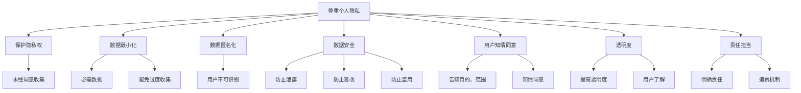

##### 2.1.2 数据伦理规范的设计步骤

数据伦理规范的设计步骤如下：

1. **需求分析**：明确平台业务需求和用户需求，确定数据收集、处理和使用的范围和目的。
2. **伦理评估**：评估数据收集和处理过程中可能带来的伦理问题，识别潜在的隐私和安全风险。
3. **规范制定**：基于伦理评估结果，制定数据伦理规范，包括数据收集、存储、处理、使用和共享的具体要求。
4. **合规性检查**：确保数据伦理规范符合相关法律法规的要求，如《通用数据保护条例》（GDPR）、《消费者隐私法案》（CCPA）等。
5. **内部审查**：内部审查数据伦理规范的合理性和可行性，确保规范能够实际操作。
6. **用户反馈**：征求用户对数据伦理规范的反馈，根据反馈进行修订和完善。
7. **实施与监督**：实施数据伦理规范，并建立监督机制，确保规范得到有效执行。

数据伦理规范的设计步骤可以用以下 Mermaid 流程图表示：

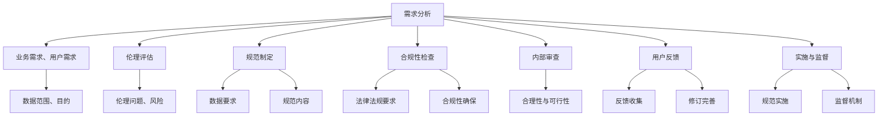

##### 2.1.3 数据伦理规范的评估与完善

数据伦理规范的评估与完善是一个持续的过程，需要定期进行以下工作：

1. **效果评估**：定期评估数据伦理规范的实施效果，包括数据隐私保护、数据安全、用户满意度等方面。
2. **问题反馈**：收集用户和员工对数据伦理规范的问题反馈，及时解决存在的问题。
3. **修订完善**：根据效果评估和问题反馈，对数据伦理规范进行修订和完善，确保其持续符合实际需求。
4. **培训和宣传**：加强数据伦理教育和培训，提高员工和数据收集者的伦理意识，确保规范得到有效执行。

数据伦理规范的评估与完善过程可以用以下 Mermaid 流程图表示：

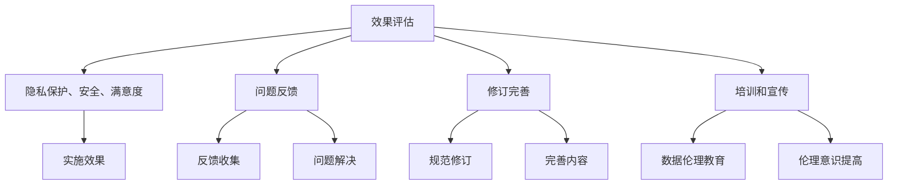

通过以上分析，我们可以看到，平台数据伦理规范的构建和实施需要遵循一系列科学的设计原则和步骤，并通过持续的评估与完善，确保其能够有效保护用户隐私和数据安全，实现平台经济的可持续发展。

---

#### 2.2 平台数据伦理规范的核心要素

平台数据伦理规范的核心要素是确保数据收集、存储、处理和使用过程中的合法性和道德性，从而保护用户的隐私权和数据安全。以下是对平台数据伦理规范核心要素的详细分析：

##### 2.2.1 数据收集与使用规范

数据收集与使用规范是平台数据伦理规范的基础，它涵盖了数据收集的合法性、必要性和用户知情同意等方面。

- **合法性**：在收集用户数据时，必须遵守相关法律法规，如《通用数据保护条例》（GDPR）、《消费者隐私法案》（CCPA）等。平台应确保数据收集和使用符合法律法规的要求。
- **必要性**：仅收集为实现特定目的所必需的数据，避免过度收集。数据收集的必要性可以通过需求分析、风险评估等方法确定。
- **用户知情同意**：在收集和使用数据前，明确告知用户数据收集的目的、范围和使用方式，并获得用户的知情同意。用户同意可以通过在线协议、隐私政策等方式实现。

数据收集与使用规范可以用以下 Mermaid 流程图表示：

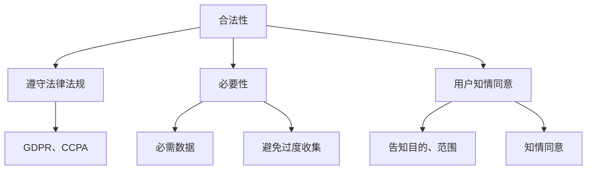

##### 2.2.2 数据安全与隐私保护

数据安全与隐私保护是平台数据伦理规范的重要组成部分，它关系到用户数据的机密性、完整性和可用性。

- **数据加密**：对存储和传输的数据进行加密处理，确保数据在未经授权的情况下无法被读取。
- **访问控制**：实施严格的访问控制策略，确保只有授权人员才能访问敏感数据。
- **数据备份**：定期进行数据备份，确保数据在意外情况下能够恢复。
- **隐私保护**：采取隐私保护措施，如数据匿名化、数据去标识化等，确保用户隐私不受侵犯。

数据安全与隐私保护可以用以下 Mermaid 流程图表示：

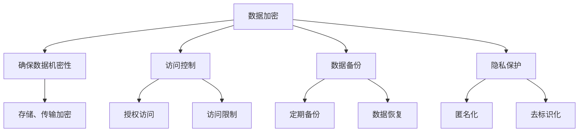

##### 2.2.3 数据透明度与用户知情权

数据透明度与用户知情权是平台数据伦理规范的重要体现，它关系到用户对数据收集、处理和使用的知情程度。

- **透明度**：提高数据处理的透明度，让用户了解自己的数据如何被使用、共享和存储。平台应通过隐私政策、用户协议等方式，向用户详细说明数据处理流程和目的。
- **用户知情权**：用户有权了解自己的数据如何被使用，有权访问自己的数据，有权对数据的使用提出异议。

数据透明度与用户知情权可以用以下 Mermaid 流程图表示：

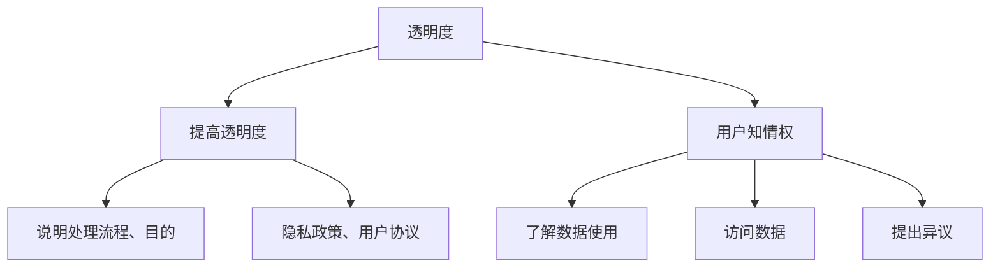

##### 2.2.4 数据责任与责任承担

数据责任与责任承担是平台数据伦理规范的核心要素，它关系到数据收集者和使用者的责任界定和承担。

- **数据责任**：明确数据收集者和使用者的责任，确保在数据泄露、滥用等情况下能够追溯责任。数据责任包括数据安全责任、隐私保护责任等。
- **责任承担**：建立责任承担机制，确保数据收集者和使用者能够承担相应的责任。责任承担机制包括赔偿、处罚等。

数据责任与责任承担可以用以下 Mermaid 流程图表示：

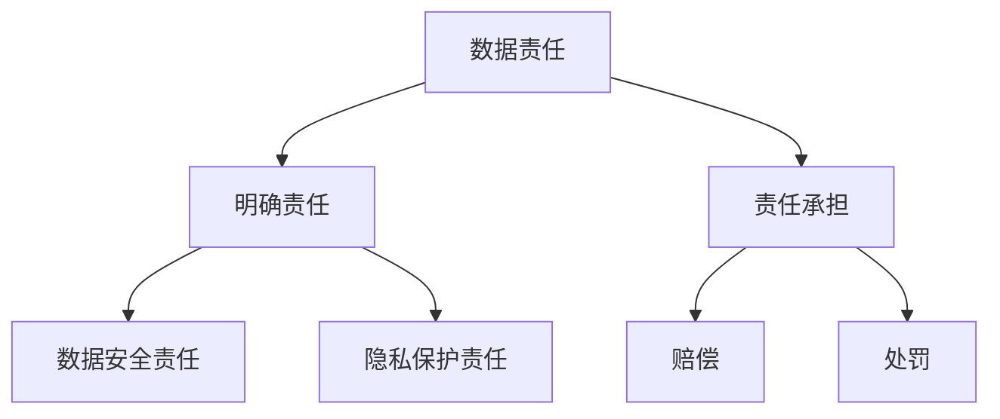

通过以上分析，我们可以看到，平台数据伦理规范的核心要素包括数据收集与使用规范、数据安全与隐私保护、数据透明度与用户知情权以及数据责任与责任承担。这些核心要素共同构成了平台数据伦理规范的框架，为平台的数据处理提供了道德和法律的依据，确保数据的安全、隐私和保护。

---

#### 2.3 平台数据伦理规范的实施案例

##### 2.3.1 国内外平台数据伦理规范案例分析

平台数据伦理规范的实施情况在不同国家和地区存在差异，以下是对国内外一些典型平台数据伦理规范案例的分析：

1. **欧盟《通用数据保护条例》（GDPR）**：

   欧盟的《通用数据保护条例》（GDPR）是当前全球最严格的数据隐私保护法规之一。GDPR 对数据收集、存储、处理和传输提出了严格的要求，包括用户知情同意、数据最小化、数据安全保护等。欧盟的许多平台，如谷歌、Facebook 等，都在积极遵守 GDPR 规定，加强数据伦理规范的实施。

   - **案例**：谷歌在 GDPR 施行后，对其隐私政策进行了全面修订，提高了数据收集和处理的透明度，确保用户知情权。
   - **效果**：GDPR 的实施有效提升了用户对平台的信任度，促进了欧盟数据隐私保护水平的提高。

2. **美国加州《消费者隐私法案》（CCPA）**：

   美国加州的《消费者隐私法案》（CCPA）规定了消费者对个人数据的访问权、删除权和知情权。CCPA 对数据收集、存储、处理和共享提出了具体要求，包括用户知情同意、数据安全保护等。

   - **案例**：许多美国平台，如苹果、Facebook 等，都在 CCPA 施行后，对其数据处理流程进行了调整，确保合规性。
   - **效果**：CCPA 的实施提升了用户对平台数据处理的信任度，促进了平台数据伦理规范的完善。

3. **中国《个人信息保护法》**：

   中国的《个人信息保护法》将于 2021 年 11 月 1 日正式实施，该法规定了个人信息的收集、存储、处理和传输的基本原则，包括用户知情同意、数据安全保护等。

   - **案例**：中国的许多平台，如阿里巴巴、腾讯等，都在积极准备，确保其数据处理符合《个人信息保护法》的要求。
   - **效果**：该法的实施将提高中国平台的数据伦理水平，保护用户隐私权和数据安全。

##### 2.3.2 平台数据伦理规范实施的效果评估

平台数据伦理规范实施的效果评估是确保规范得到有效执行和持续改进的重要环节。以下是对平台数据伦理规范实施效果的评估方法和指标：

1. **评估方法**：

   - **问卷调查**：通过问卷调查收集用户对平台数据伦理规范的满意度、信任度等方面的反馈。
   - **数据分析**：通过数据分析评估数据隐私保护、数据安全、用户知情权等方面的实施效果。
   - **用户调研**：通过用户调研了解用户对平台数据伦理规范的实际体验和感受。

2. **评估指标**：

   - **用户满意度**：用户对平台数据伦理规范的满意度是衡量规范实施效果的重要指标。
   - **隐私保护程度**：数据隐私保护的程度是评估规范实施效果的关键指标。
   - **数据安全水平**：数据安全水平，包括数据泄露事件的发生率、数据恢复能力等，是评估规范实施效果的重要指标。
   - **用户知情权**：用户对数据处理过程的知情程度是评估规范实施效果的重要指标。

##### 2.3.3 平台数据伦理规范实施的难点与解决方案

平台数据伦理规范实施过程中面临以下难点：

1. **法律法规不完善**：不同国家和地区的法律法规对数据伦理的要求存在差异，部分法律法规尚未完善，导致平台在实施数据伦理规范时面临法律风险。

   - **解决方案**：平台应密切关注相关法律法规的变化，积极与政府、行业组织等进行沟通，推动法律法规的完善。

2. **技术实施难度**：数据伦理规范的实施涉及数据收集、存储、处理、传输等各个环节，技术实施难度较大。

   - **解决方案**：平台应加强技术研发，采用先进的技术手段，如数据加密、访问控制等，确保数据伦理规范得到有效实施。

3. **用户参与度低**：部分用户对数据伦理规范的了解和参与度较低，导致规范的实施效果受到影响。

   - **解决方案**：平台应加强数据伦理教育，提高用户对数据伦理规范的认识和参与度。

4. **监管力度不足**：部分国家和地区对平台数据伦理规范的监管力度不足，导致规范的实施效果不理想。

   - **解决方案**：政府应加强对平台数据伦理规范的监管，加大对违规行为的处罚力度，确保规范得到有效实施。

通过以上分析，我们可以看到，平台数据伦理规范的实施涉及多个方面，面临一定的难点和挑战。平台应积极应对，加强法律法规、技术、用户参与和监管等方面的建设，确保数据伦理规范得到有效实施，保护用户隐私和数据安全。

---

#### 2.4 平台数据伦理教育与培训

##### 2.4.1 数据伦理教育与培训的重要性

数据伦理教育与培训在平台数据伦理规范的实施过程中具有至关重要的作用。首先，数据伦理教育与培训能够提高平台员工对数据伦理问题的认知和理解，使员工在日常工作中有意识地遵循数据伦理规范。其次，通过数据伦理教育与培训，可以增强员工对数据隐私保护、数据安全等方面的重视，从而减少数据泄露、滥用等风险。此外，数据伦理教育与培训还能够提高用户的隐私意识，促进用户对平台数据伦理规范的信任和支持。

数据伦理教育与培训的重要性可以用以下 Mermaid 流程图表示：

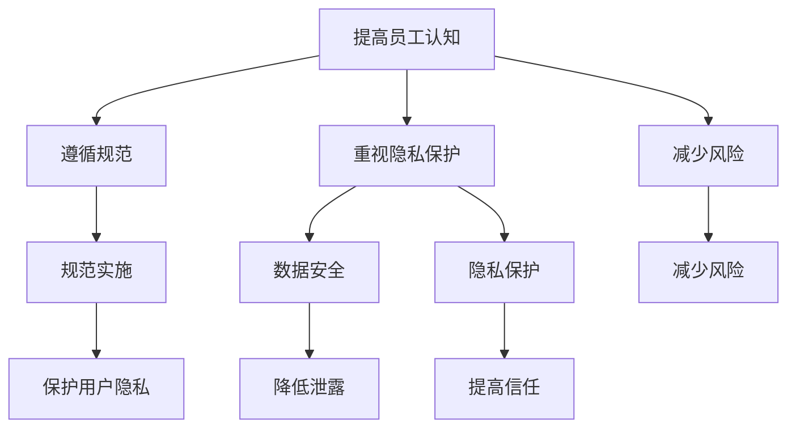

##### 2.4.2 平台数据伦理教育的内容与形式

平台数据伦理教育的内容应包括以下几个方面：

1. **数据伦理原则**：介绍数据伦理的基本原则，如尊重个人隐私、数据安全、公正透明等。
2. **法律法规知识**：介绍与数据伦理相关的法律法规，如《通用数据保护条例》（GDPR）、《消费者隐私法案》（CCPA）等。
3. **案例分析与讨论**：通过真实案例的分析和讨论，让员工了解数据伦理问题的严重性和处理方法。
4. **实践操作指导**：提供数据伦理实践操作的指导，如数据收集、处理、存储、传输等过程中的伦理规范。
5. **用户隐私保护**：介绍如何保护用户的隐私权，包括数据匿名化、去标识化等技术手段。

平台数据伦理教育的内容可以用以下 Mermaid 流程图表示：

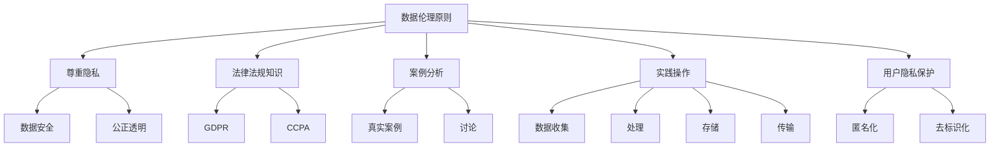

平台数据伦理教育的形式可以多样化，包括：

1. **在线课程**：通过在线平台提供数据伦理课程，方便员工随时学习。
2. **内部培训**：组织内部培训，邀请数据伦理专家进行授课。
3. **研讨会**：定期举办数据伦理研讨会，促进员工之间的交流和讨论。
4. **实地考察**：组织实地考察活动，让员工了解数据伦理规范在实际操作中的应用。
5. **考核认证**：设立数据伦理考核认证机制，确保员工掌握数据伦理知识。

平台数据伦理教育的形式可以用以下 Mermaid 流程图表示：

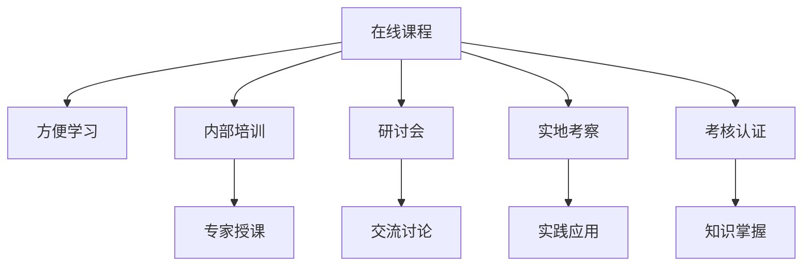

##### 2.4.3 平台数据伦理教育的效果评估与改进

平台数据伦理教育的效果评估是确保教育成果的重要环节。以下是对平台数据伦理教育效果评估的方法和改进措施：

1. **评估方法**：

   - **问卷调查**：通过问卷调查收集员工对数据伦理教育的满意度、知识掌握程度等方面的反馈。
   - **笔试考试**：组织笔试考试，评估员工对数据伦理知识的掌握程度。
   - **实操演练**：通过实操演练评估员工在数据伦理实践中的表现。

2. **评估指标**：

   - **满意度**：员工对数据伦理教育的满意度是评估教育效果的重要指标。
   - **知识掌握**：员工对数据伦理知识的掌握程度是评估教育效果的关键指标。
   - **实践能力**：员工在数据伦理实践中的表现是评估教育效果的重要指标。

3. **改进措施**：

   - **优化课程内容**：根据员工的反馈和评估结果，及时调整和优化课程内容，确保教育内容与实际需求相符。
   - **加强师资力量**：邀请更多的数据伦理专家进行授课，提高教学质量。
   - **增加实操环节**：增加实操环节，提高员工的数据伦理实践能力。
   - **定期考核**：设立定期考核机制，确保员工持续掌握数据伦理知识。

平台数据伦理教育的效果评估与改进可以用以下 Mermaid 流�程图表示：

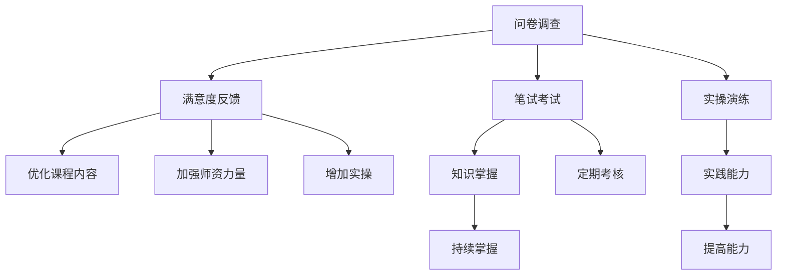

通过以上分析，我们可以看到，平台数据伦理教育与培训对于规范平台数据处理行为、保护用户隐私和数据安全具有重要意义。平台应高度重视数据伦理教育与培训，通过多种形式的教育活动和持续改进，确保员工具备良好的数据伦理意识和实践能力，为平台数据伦理规范的实施提供有力支持。

---

### 第三部分：平台数据伦理监管与法律法规

#### 3.1 平台数据伦理监管的现状与趋势

##### 3.1.1 平台数据伦理监管的法律法规框架

全球范围内，平台数据伦理监管的法律法规框架逐渐完善，不同国家和地区在数据隐私保护、数据安全等方面制定了相应的法律法规。以下是一些关键法律法规及其框架：

1. **欧盟《通用数据保护条例》（GDPR）**：
   - **框架**：GDPR 是欧盟制定的关于数据隐私保护的基础性法规，规定了数据收集、存储、处理和传输的基本原则。
   - **主要内容**：GDPR 强调用户知情同意、数据最小化、数据安全保护、数据可访问性和可删除性等原则。
   - **影响**：GDPR 对全球数据隐私保护产生了深远影响，成为各国数据隐私保护法规的重要参考。

2. **美国加州《消费者隐私法案》（CCPA）**：
   - **框架**：CCPA 是美国加州制定的关于消费者数据隐私保护的法律，规定了消费者对个人数据的访问权、删除权和知情权。
   - **主要内容**：CCPA 要求企业在收集和使用消费者数据时，必须提供透明的隐私政策，并尊重消费者的权利。
   - **影响**：CCPA 对美国以及其他州和国家的数据隐私保护法规产生了影响，推动了数据隐私保护意识的提升。

3. **中国《个人信息保护法》**：
   - **框架**：个人信息保护法是中国正在制定的一部关于个人信息保护的基础性法律，预计将于 2021 年 11 月 1 日正式实施。
   - **主要内容**：个人信息保护法规定了个人信息的收集、存储、处理和传输的基本原则，以及用户的权利和企业的责任。
   - **影响**：个人信息保护法的实施将进一步提升中国平台的数据伦理水平和数据安全保护能力。

法律法规框架可以用以下 Mermaid 流程图表示：

```mermaid
graph TD
A[欧盟GDPR] --> B[数据隐私保护]
B --> C[用户知情同意]
B --> D[数据安全保护]
A --> E[美国CCPA]
E --> F[消费者隐私]
E --> G[访问权、删除权]
A --> H[中国个人信息保护法]
H --> I[个人信息保护]
H --> J[收集、存储、处理、传输]
```

##### 3.1.2 平台数据伦理监管的政策与实践

全球范围内，各国政府为了加强平台数据伦理监管，采取了多种政策和实践措施。以下是一些关键政策和实践：

1. **政策制定**：
   - **欧盟**：欧盟委员会发布了《数字战略》和《数据战略》等政策文件，旨在推动数字经济发展和数据伦理监管。
   - **美国**：美国政府发布了《美国消费者数据隐私保护法案》（CCPA）和《联邦数据隐私法》等政策文件，强化数据隐私保护。
   - **中国**：中国政府发布了《网络安全法》和《个人信息保护法》等政策文件，加强网络安全和个人信息保护。

2. **实践措施**：
   - **欧盟**：欧盟执法机构对违反 GDPR 的企业进行严厉处罚，如对谷歌、Facebook 等企业开出巨额罚单。
   - **美国**：加州总检察长办公室对违反 CCPA 的企业进行执法行动，保护消费者权益。
   - **中国**：中国政府加强了对网络平台的数据伦理监管，对违反法律法规的企业进行处罚和整改。

政策和实践措施可以用以下 Mermaid 流程图表示：

```mermaid
graph TD
A[欧盟政策制定] --> B[数字战略]
B --> C[数据战略]
A --> D[美国政策制定]
D --> E[CCPA]
D --> F[联邦数据隐私法]
A --> G[中国政策制定]
G --> H[网络安全法]
G --> I[个人信息保护法]
A --> J[欧盟实践措施]
J --> K[执法处罚]
J --> L[谷歌、Facebook]
A --> M[美国实践措施]
M --> N[执法行动]
M --> O[消费者权益]
A --> P[中国实践措施]
P --> Q[数据伦理监管]
P --> R[处罚整改]
```

##### 3.1.3 平台数据伦理监管的挑战与对策

平台数据伦理监管面临以下挑战：

1. **法律法规不完善**：部分国家和地区的数据伦理监管法律法规尚不完善，难以全面覆盖平台数据伦理问题。
2. **执法力度不足**：部分国家和地区的数据伦理监管执法力度不足，难以有效震慑违规行为。
3. **技术发展迅速**：数据技术和应用场景的快速发展，使得数据伦理监管面临新的挑战。
4. **跨国合作困难**：全球范围内的平台数据伦理监管需要跨国合作，但各国数据伦理监管法律体系和执行力度存在差异，导致跨国合作困难。

平台数据伦理监管的挑战与对策可以用以下 Mermaid 流程图表示：

```mermaid
graph TD
A[法律法规不完善] --> B[法律体系不完善]
A --> C[全面覆盖不足]
B --> D[执法力度不足]
D --> E[执法不力]
A --> F[技术发展迅速]
F --> G[新技术挑战]
A --> H[跨国合作困难]
H --> I[法律差异]
H --> J[合作障碍]
```

针对以上挑战，可以采取以下对策：

1. **完善法律法规**：各国应加强对数据伦理监管法律法规的完善，确保法律法规能够全面覆盖平台数据伦理问题。
2. **加强执法力度**：各国应加大对数据伦理违规行为的执法力度，确保法律法规得到有效执行。
3. **技术监管**：利用大数据、人工智能等新技术，加强对平台数据伦理问题的监测和监管。
4. **跨国合作**：加强国际间的数据伦理监管合作，推动全球范围内的数据伦理治理。

通过以上分析，我们可以看到，平台数据伦理监管的现状和趋势表明，各国在数据伦理监管方面不断取得进展，但仍面临诸多挑战。通过完善法律法规、加强执法力度、技术监管和跨国合作，可以有效提升平台数据伦理监管水平，保护用户隐私和数据安全。

---

#### 3.2 平台数据伦理监管的法律问题与解决方案

平台数据伦理监管在法律层面上面临诸多挑战，包括数据权利与数据自由流动的平衡、数据隐私与公共利益的平衡、以及数据伦理监管的法治化路径。以下是对这些法律问题及其解决方案的详细分析。

##### 3.2.1 数据权利与数据自由流动的平衡

数据权利与数据自由流动的平衡是平台数据伦理监管中一个核心问题。数据权利主要涉及个人隐私保护、数据自主权等，而数据自由流动则涉及跨国数据传输、商业用途等。

- **法律问题**：一方面，数据权利的保护要求限制数据流动，以确保个人隐私不被侵犯；另一方面，数据自由流动对于全球数字经济的发展至关重要。如何在这两者之间找到平衡点，成为法律监管的关键挑战。

- **解决方案**：
  1. **数据匿名化与去标识化**：通过数据匿名化、去标识化等技术手段，可以在保护个人隐私的同时实现数据自由流动。
  2. **数据出境审查**：建立数据出境审查机制，对涉及个人敏感信息的数据流动进行严格审查，确保数据出境符合法律法规要求。
  3. **跨境数据协议**：制定跨境数据传输协议，明确跨国数据传输的条件、范围和责任，确保数据权利与数据自由流动的平衡。

数据权利与数据自由流动的平衡可以用以下 Mermaid 流程图表示：

```mermaid
graph TD
A[数据匿名化与去标识化] --> B[保护隐私]
B --> C[实现自由流动]
A --> D[数据出境审查]
D --> E[审查机制]
D --> F[合法出境]
A --> G[跨境数据协议]
G --> H[明确条件]
G --> I[责任明确]
```

##### 3.2.2 数据隐私与公共利益的平衡

数据隐私与公共利益的平衡是平台数据伦理监管中的另一个重要问题。数据隐私保护旨在保护个人隐私不受侵犯，而公共利益则包括公共安全、公共卫生、国家安全等方面。

- **法律问题**：在保护个人隐私的同时，如何确保公共利益的实现，成为法律监管的难点。例如，在疫情防控期间，如何平衡个人隐私与公共卫生数据的公开需求。

- **解决方案**：
  1. **公共利益优先原则**：在特殊情况下，如公共卫生危机、国家安全等，可以采取临时措施，优先考虑公共利益。
  2. **数据最小化原则**：在实现公共利益时，应遵循数据最小化原则，仅收集和利用实现特定目的所必需的数据。
  3. **透明度和责任机制**：提高数据处理的透明度，明确责任承担，确保在公共利益实现过程中个人隐私得到有效保护。

数据隐私与公共利益的平衡可以用以下 Mermaid 流程图表示：

```mermaid
graph TD
A[公共利益优先] --> B[特殊情况下]
B --> C[优先考虑]
A --> D[数据最小化原则]
D --> E[仅收集必需数据]
D --> F[利用最小数据]
A --> G[透明度和责任机制]
G --> H[提高透明度]
G --> I[明确责任]
```

##### 3.2.3 数据伦理监管的法治化路径

数据伦理监管的法治化路径是确保数据伦理规范得到有效实施的重要保障。法治化路径包括法律法规的制定、执法机构的建立、司法体系的完善等。

- **法律问题**：当前，数据伦理监管的法律体系尚不完善，执法机构和司法体系对数据伦理问题的处理能力有待提高。

- **解决方案**：
  1. **完善法律法规**：加强数据伦理监管的法律法规建设，制定全面、明确、可操作的法律规范。
  2. **建立执法机构**：设立专门的数据伦理监管执法机构，提高执法效率和专业性。
  3. **完善司法体系**：加强司法体系对数据伦理问题的处理能力，确保违法者得到应有的法律制裁。

数据伦理监管的法治化路径可以用以下 Mermaid 流程图表示：

```mermaid
graph TD
A[完善法律法规] --> B[法律规范]
B --> C[全面、明确、可操作]
A --> D[建立执法机构]
D --> E[提高执法效率]
D --> F[专业性提升]
A --> G[完善司法体系]
G --> H[处理能力提升]
G --> I[法律制裁]
```

通过以上分析，我们可以看到，平台数据伦理监管的法律问题涉及数据权利与数据自由流动的平衡、数据隐私与公共利益的平衡，以及数据伦理监管的法治化路径。通过完善法律法规、建立执法机构和司法体系，可以有效解决这些法律问题，提升平台数据伦理监管水平。

---

#### 3.3 平台数据伦理监管的国际合作与交流

##### 3.3.1 国际平台数据伦理监管的协调与合作

平台数据伦理监管的国际合作与交流在全球范围内日益重要，各国和地区在数据隐私保护、数据安全等方面的协调与合作有助于形成全球性的数据治理框架。以下是对国际平台数据伦理监管协调与合作的分析：

1. **国际组织的参与**：
   - **联合国**：联合国通过国际电信联盟（ITU）等机构，推动全球范围内的数据伦理监管合作，制定相关国际标准和法规。
   - **经济合作与发展组织（OECD）**：OECD 制定了一系列关于隐私保护和数据自由流动的指南，为各国数据伦理监管提供了参考。

2. **多边合作机制**：
   - **欧洲数据保护委员会（EDPB）**：EDPB 是欧盟成员国数据保护机构之间的合作机构，通过协调成员国之间的数据伦理监管政策，提高监管一致性。
   - **亚洲太平洋经济合作组织（APEC）**：APEC 通过数据隐私框架协议（APEC CBPR）和跨边界隐私规则（APEC CBPR+），推动成员国之间的数据隐私保护合作。

3. **区域合作**：
   - **欧盟-美国数据隐私保护协议**：欧盟与美国的隐私盾框架（Privacy Shield）旨在促进跨国数据传输，同时保护个人隐私。
   - **欧盟-瑞士数据保护协议**：欧盟与瑞士之间签订了数据保护协定，确保双方的数据交换符合数据保护要求。

国际合作与协调可以用以下 Mermaid 流程图表示：

```mermaid
graph TD
A[国际组织参与] --> B[联合国、ITU]
B --> C[制定国际标准]
A --> D[多边合作机制]
D --> E[EDPB]
D --> F[APEC CBPR、CBPR+]
A --> G[区域合作]
G --> H[隐私盾框架]
G --> I[欧盟-瑞士协议]
```

##### 3.3.2 国际数据治理框架与平台数据伦理规范

国际数据治理框架为平台数据伦理规范提供了重要的参考和指导。以下是一些关键的国际数据治理框架及其对平台数据伦理规范的影响：

1. **通用数据保护条例（GDPR）**：
   - **框架内容**：GDPR 是欧盟制定的数据保护基础性法规，规定了数据收集、处理、存储和传输的伦理规范。
   - **影响**：GDPR 的严格规定对全球平台数据伦理规范产生了深远影响，推动了其他国家制定类似的数据保护法规。

2. **消费者隐私法案（CCPA）**：
   - **框架内容**：CCPA 是美国加州制定的数据隐私保护法律，规定了消费者对个人数据的访问权、删除权和知情权。
   - **影响**：CCPA 的实施提升了美国及其他国家和地区对消费者数据隐私保护的重视程度。

3. **个人信息保护法**：
   - **框架内容**：中国个人信息保护法将于 2021 年 11 月 1 日正式实施，规定了个人信息保护的基本原则和操作规范。
   - **影响**：个人信息保护法的实施将提升中国平台的数据伦理水平，推动数据伦理规范的完善。

国际数据治理框架与平台数据伦理规范可以用以下 Mermaid 流程图表示：

```mermaid
graph TD
A[GDPR] --> B[欧盟数据保护]
B --> C[数据收集、处理、存储、传输]
A --> D[CCPA]
D --> E[消费者隐私权]
D --> F[知情权、访问权、删除权]
A --> G[个人信息保护法]
G --> H[中国数据保护]
G --> I[数据伦理规范]
```

##### 3.3.3 国际数据治理经验对我国平台数据伦理监管的启示

国际数据治理经验为我国平台数据伦理监管提供了宝贵的参考。以下是一些关键经验及其对我国的启示：

1. **法律法规的完善**：国际上的数据治理经验表明，完善的法律法规是数据伦理监管的重要基础。我国应进一步健全数据保护法律法规体系，确保数据隐私保护和数据安全。

2. **加强国际合作**：国际数据治理强调跨国合作与协调，我国应积极参与国际数据治理合作，借鉴国际先进经验，提升我国数据伦理监管水平。

3. **技术创新与应用**：国际经验表明，技术创新在数据治理中发挥着重要作用。我国应加强大数据、人工智能等技术在数据治理中的应用，提升数据治理能力。

4. **公众参与与监督**：国际经验强调公众参与和数据伦理监督的重要性。我国应加强公众参与，提高公众对数据隐私和数据安全的关注度，建立健全数据伦理监督机制。

国际数据治理经验对我国平台数据伦理监管的启示可以用以下 Mermaid 流程图表示：

```mermaid
graph TD
A[法律法规完善] --> B[健全法律体系]
A --> C[加强国际合作]
C --> D[借鉴国际经验]
C --> E[跨国合作]
A --> F[技术创新与应用]
F --> G[大数据、人工智能]
F --> H[提升治理能力]
A --> I[公众参与与监督]
I --> J[公众参与]
I --> K[数据伦理监督]
```

通过以上分析，我们可以看到，国际平台数据伦理监管的协调与合作、国际数据治理框架以及对我国的启示，为我国平台数据伦理监管提供了重要参考。我国应借鉴国际经验，完善法律法规、加强国际合作、推动技术创新，并提高公众参与和监督，以提升我国平台数据伦理监管水平。

---

### 第四部分：平台数据伦理的未来发展

#### 4.1 平台数据伦理的未来趋势

随着科技的不断进步和平台经济的发展，平台数据伦理也面临着新的趋势和挑战。以下是对平台数据伦理未来发展趋势的探讨：

##### 4.1.1 人工智能与平台数据伦理

人工智能（AI）的快速发展正在深刻改变平台经济的发展模式，同时也带来了新的数据伦理挑战。以下是一些关键点：

- **算法透明度**：人工智能算法的决策过程通常是不透明的，这引发了关于算法偏见、歧视和伦理问题的担忧。平台需要提高算法的透明度，确保其决策过程符合伦理标准。
- **数据偏见**：AI 算法可能基于历史数据中的偏见进行决策，导致不公平的结果。平台需要采取措施减少算法偏见，确保算法决策的公平性。
- **用户隐私**：AI 技术在数据处理和分析中的应用可能加剧用户隐私泄露的风险。平台需要加强数据隐私保护，确保用户数据的安全。

人工智能与平台数据伦理的未来趋势可以用以下 Mermaid 流程图表示：

```mermaid
graph TD
A[算法透明度] --> B[决策过程透明]
B --> C[伦理标准符合]
A --> D[数据偏见]
D --> E[减少算法偏见]
D --> F[决策公平性]
A --> G[用户隐私]
G --> H[数据保护]
G --> I[隐私泄露风险]
```

##### 4.1.2 区块链与平台数据伦理

区块链技术的崛起为平台数据伦理带来了新的机遇和挑战。以下是一些关键点：

- **数据隐私保护**：区块链的分布式存储和加密技术提供了强大的数据隐私保护能力，有助于解决平台数据泄露问题。
- **透明度**：区块链的透明性确保了数据操作的不可篡改性，提高了平台数据处理的透明度。
- **去中心化治理**：区块链的去中心化特性有助于减少平台垄断，促进数据治理的民主化。

区块链与平台数据伦理的未来趋势可以用以下 Mermaid 流程图表示：

```mermaid
graph TD
A[数据隐私保护] --> B[分布式存储]
B --> C[加密技术]
A --> D[透明度]
D --> E[不可篡改]
D --> F[数据操作透明]
A --> G[去中心化治理]
G --> H[减少垄断]
G --> I[民主化治理]
```

##### 4.1.3 平台数据伦理的未来发展方向

平台数据伦理的未来发展方向需要综合考虑技术进步、政策法规和市场需求。以下是一些关键方向：

- **数据伦理教育**：加强数据伦理教育，提高平台员工和数据科学家的伦理意识，确保他们在数据处理过程中遵循伦理原则。
- **伦理监管框架**：完善数据伦理监管框架，建立跨部门的合作机制，提高监管效率。
- **技术创新**：推动数据隐私保护、人工智能伦理等方面的技术创新，为平台数据伦理提供技术支持。
- **用户参与**：鼓励用户参与平台数据伦理决策，提高用户对平台数据伦理规范的信任度。

平台数据伦理的未来发展方向可以用以下 Mermaid 流程图表示：

```mermaid
graph TD
A[数据伦理教育] --> B[提高意识]
B --> C[员工培训]
B --> D[数据科学家培训]
A --> E[伦理监管框架]
E --> F[合作机制]
E --> G[监管效率]
A --> H[技术创新]
H --> I[隐私保护技术]
H --> J[AI伦理技术]
A --> K[用户参与]
K --> L[决策参与]
K --> M[信任度提高]
```

通过以上分析，我们可以看到，平台数据伦理的未来发展趋势受到人工智能、区块链等新技术的影响，同时需要加强数据伦理教育、完善监管框架、推动技术创新和促进用户参与。这些趋势和发展方向将为平台数据伦理的可持续发展提供重要支持。

---

#### 4.2 平台数据伦理的国际经验与启示

在全球范围内，不同国家和地区在平台数据伦理方面积累了丰富的经验和做法，这些经验为我国平台数据伦理的建设提供了宝贵的参考和启示。以下是对国际平台数据伦理规范的比较分析、监管典型案例以及我国可以从中获得的启示的详细讨论。

##### 4.2.1 国际平台数据伦理规范的比较分析

1. **欧盟（GDPR）**：
   - **特点**：欧盟的《通用数据保护条例》（GDPR）是全球最严格的数据保护法规之一，强调用户知情同意、数据最小化、数据安全保护等原则。
   - **启示**：我国可以借鉴 GDPR 中的用户知情同意和数据安全保护原则，加强用户隐私保护，提高数据处理的透明度和安全性。

2. **美国（CCPA）**：
   - **特点**：美国的《消费者隐私法案》（CCPA）规定了消费者对个人数据的访问权、删除权和知情权，特别关注消费者数据的商业用途。
   - **启示**：我国可以参考 CCPA 中的消费者权益保护措施，明确消费者对个人数据的控制权，提高数据处理的透明度和用户参与度。

3. **日本**：
   - **特点**：日本的数据保护法规较为全面，包括《个人信息保护法》、《个人信息保护指南》等，强调数据收集和处理的合法性和合理性。
   - **启示**：我国可以借鉴日本的数据保护法规，完善数据收集和处理的法律法规体系，确保数据处理过程符合法律要求。

4. **新加坡**：
   - **特点**：新加坡的数据保护法规较为先进，强调数据伦理和合规性，包括《个人信息保护法》、《数据保护法》等。
   - **启示**：我国可以借鉴新加坡的数据保护法规，加强数据伦理教育和合规性检查，提高平台员工和企业的数据伦理意识。

国际平台数据伦理规范的比较分析可以用以下 Mermaid 流程图表示：

```mermaid
graph TD
A[欧盟（GDPR）] --> B[用户知情同意]
B --> C[数据安全保护]
A --> D[美国（CCPA）]
D --> E[消费者访问权]
D --> F[知情权]
A --> G[日本]
G --> H[数据收集合法性]
G --> I[数据处理合理性]
A --> J[新加坡]
J --> K[数据伦理教育]
J --> L[合规性检查]
```

##### 4.2.2 国际平台数据伦理监管的典型案例

1. **欧盟对谷歌和Facebook的罚款**：
   - **案例背景**：欧盟委员会对谷歌和Facebook在用户隐私保护方面的违规行为进行了严厉处罚，罚款金额高达数十亿欧元。
   - **处理措施**：欧盟要求谷歌和Facebook修改其数据收集和处理方式，增加用户隐私保护的透明度，并加强内部数据治理。

2. **美国对苹果的隐私保护审查**：
   - **案例背景**：美国联邦贸易委员会（FTC）对苹果公司的隐私保护措施进行了审查，发现苹果在用户数据收集和存储方面存在缺陷。
   - **处理措施**：FTC要求苹果公司改进隐私保护措施，并向用户明确披露数据收集和处理方式，提高用户知情权。

3. **日本对优步的隐私保护整改**：
   - **案例背景**：日本监管部门对优步的隐私保护措施进行了调查，发现优步在用户数据收集和存储方面存在漏洞。
   - **处理措施**：日本监管部门要求优步整改隐私保护措施，加强数据加密和安全存储，确保用户数据的安全。

国际平台数据伦理监管的典型案例可以用以下 Mermaid 流程图表示：

```mermaid
graph TD
A[欧盟对谷歌和Facebook] --> B[罚款]
B --> C[修改数据收集和处理方式]
A --> D[美国对苹果]
D --> E[隐私保护审查]
D --> F[改进隐私保护措施]
A --> G[日本对优步]
G --> H[隐私保护调查]
G --> I[加强数据安全]
```

##### 4.2.3 国际平台数据伦理经验对我国的影响与启示

1. **加强数据伦理教育和培训**：
   - **影响**：国际经验表明，加强数据伦理教育和培训是提高平台员工和数据科学家伦理意识的重要手段。
   - **启示**：我国可以借鉴国际经验，加强数据伦理教育和培训，提高平台员工和数据科学家的伦理素养。

2. **完善法律法规和监管体系**：
   - **影响**：国际经验表明，完善的法律法规和监管体系是确保平台数据伦理规范实施的重要保障。
   - **启示**：我国可以借鉴国际经验，完善数据保护法律法规，建立严格的数据伦理监管体系。

3. **推动技术创新和合规性检查**：
   - **影响**：国际经验表明，技术创新和合规性检查是提高平台数据伦理水平的重要途径。
   - **启示**：我国可以推动数据隐私保护、人工智能伦理等方面的技术创新，并加强合规性检查，确保平台数据处理符合伦理标准。

4. **增强公众参与和监督**：
   - **影响**：国际经验表明，公众参与和监督是提高平台数据伦理规范实施效果的重要手段。
   - **启示**：我国可以增强公众参与，提高公众对平台数据伦理规范的认知和参与度，建立健全的数据伦理监督机制。

国际平台数据伦理经验对我国的影响与启示可以用以下 Mermaid 流程图表示：

```mermaid
graph TD
A[加强数据伦理教育] --> B[提高伦理素养]
A --> C[完善法律法规]
C --> D[确保规范实施]
A --> E[推动技术创新]
E --> F[提高伦理水平]
A --> G[增强公众参与]
G --> H[提高认知]
G --> I[建立监督机制]
```

通过以上分析，我们可以看到，国际平台数据伦理经验为我国平台数据伦理规范的建设提供了重要的参考和启示。我国应借鉴国际经验，加强数据伦理教育、完善法律法规、推动技术创新和增强公众参与，以提高我国平台数据伦理水平，确保数据的安全、隐私和保护。

---

### 第四部分：平台数据伦理的未来发展

#### 4.3 平台数据伦理的可持续发展策略

随着平台经济的快速发展，数据伦理问题已经成为影响平台可持续发展的关键因素。为了确保平台经济能够健康、稳定、持续地发展，我们需要制定和实施一系列有效的数据伦理可持续发展策略。以下是对这些策略的详细探讨：

##### 4.3.1 平台数据伦理规范的长效机制

建立平台数据伦理规范的长效机制是确保数据伦理规范持续有效实施的关键。以下是一些关键措施：

1. **法律法规的完善**：持续关注和跟进国内外数据伦理相关法律法规的变化，及时修订和完善国内相关法律法规，确保平台数据伦理规范符合法律要求。

2. **标准化的数据伦理规范**：制定统一的平台数据伦理规范标准，为平台企业提供明确的指导，确保不同平台在数据伦理规范的实施上的一致性。

3. **数据伦理审计**：定期对平台企业的数据伦理实践进行审计，发现并解决数据伦理问题，确保数据伦理规范得到有效执行。

4. **社会责任报告**：要求平台企业定期发布社会责任报告，公开其在数据伦理方面的实践和成果，接受公众和监管机构的监督。

平台数据伦理规范的长效机制可以用以下 Mermaid 流程图表示：

```mermaid
graph TD
A[法律法规完善] --> B[关注法律法规变化]
B --> C[修订完善]
A --> D[标准化规范]
D --> E[统一指导]
A --> F[数据伦理审计]
F --> G[发现问题]
F --> H[解决数据伦理问题]
A --> I[社会责任报告]
I --> J[公开实践成果]
I --> K[接受监督]
```

##### 4.3.2 平台数据伦理的社会参与与共治

平台数据伦理的可持续发展需要社会各界的广泛参与和共同努力，以下是一些具体措施：

1. **公众参与**：通过开展公众教育活动，提高公众对平台数据伦理问题的认知和参与度。可以采用线上线下相结合的方式，举办数据伦理讲座、研讨会等活动，引导公众关注和参与平台数据伦理议题。

2. **行业合作**：平台企业、行业协会、学术机构等可以共同建立数据伦理合作机制，开展数据伦理研究、制定行业数据伦理标准，推动行业数据伦理水平的提升。

3. **政府监管**：政府应发挥监管作用，加强对平台数据伦理的监督和管理，确保平台企业遵守数据伦理规范，防止数据滥用和隐私泄露。

4. **跨部门协作**：政府各部门之间应加强协作，形成合力，共同推动平台数据伦理规范的制定和实施，提高监管效果。

平台数据伦理的社会参与与共治可以用以下 Mermaid 流程图表示：

```mermaid
graph TD
A[公众参与] --> B[提高认知]
B --> C[参与数据伦理]
A --> D[行业合作]
D --> E[制定行业标准]
D --> F[推动行业进步]
A --> G[政府监管]
G --> H[确保规范遵守]
G --> I[防止数据滥用]
A --> J[跨部门协作]
J --> K[形成合力]
J --> L[提高监管效果]
```

##### 4.3.3 平台数据伦理的可持续发展路径

为了确保平台数据伦理的可持续发展，我们需要采取以下路径：

1. **技术进步**：推动数据隐私保护、人工智能伦理等技术的进步，为平台数据伦理提供技术支持，提高数据处理的安全性和透明度。

2. **教育和培训**：加强数据伦理教育和培训，提高平台员工和数据科学家的伦理意识，确保他们在数据处理过程中能够遵循伦理原则。

3. **国际合作**：积极参与国际数据治理合作，借鉴国际先进经验，推动全球数据伦理标准的制定和实施，提高我国平台数据伦理的国际竞争力。

4. **政策支持**：政府应制定相关政策，支持平台企业开展数据伦理研究、实施数据伦理规范，为平台数据伦理的可持续发展提供政策保障。

平台数据伦理的可持续发展路径可以用以下 Mermaid 流程图表示：

```mermaid
graph TD
A[技术进步] --> B[隐私保护技术]
B --> C[AI伦理技术]
A --> D[教育和培训]
D --> E[提高伦理意识]
D --> F[员工培训]
A --> G[国际合作]
G --> H[先进经验借鉴]
G --> I[全球标准制定]
A --> J[政策支持]
J --> K[数据伦理研究支持]
J --> L[政策保障]
```

通过以上分析，我们可以看到，平台数据伦理的可持续发展需要从长效机制建设、社会参与与共治以及可持续发展路径等多个方面进行综合施策。只有在全社会共同努力下，才能确保平台数据伦理的可持续发展，为平台经济的健康、稳定、持续发展提供坚实保障。

---

### 附录

#### 附录 A：平台数据伦理相关法律法规汇总

以下是一些与平台数据伦理相关的法律法规汇总：

1. **欧盟《通用数据保护条例》（GDPR）**：规定了数据收集、处理、存储和传输的基本原则，强调用户知情同意、数据最小化和数据安全保护。
2. **美国加州《消费者隐私法案》（CCPA）**：规定了消费者对个人数据的访问权、删除权和知情权，特别关注消费者数据的商业用途。
3. **中国《网络安全法》**：明确了网络运营者的数据安全保护责任，规定了个人信息收集、处理和使用的规范。
4. **中国《个人信息保护法》**：将于 2021 年 11 月 1 日正式实施，规定了个人信息保护的基本原则和操作规范。
5. **新加坡《个人信息保护法》**：规定了个人信息收集、处理和传输的基本原则，强调数据透明度和用户知情权。

#### 附录 B：平台数据伦理研究参考资料

以下是一些平台数据伦理研究的参考资料：

1. **欧盟委员会《数据治理指南》**：提供了关于数据治理的原则和最佳实践。
2. **经济合作与发展组织（OECD）**：《隐私保护和跨境数据流动指南》。
3. **国际电信联盟（ITU）**：发布了多个关于数据隐私和网络安全的标准和建议。
4. **哈佛大学肯尼迪学院**：《平台经济的伦理问题研究》。
5. **清华大学**：《人工智能时代的伦理问题研究》。

#### 附录 C：平台数据伦理教育与实践案例精选

以下是一些平台数据伦理教育与实践案例精选：

1. **谷歌数据伦理培训项目**：为员工提供数据伦理在线课程，提高员工的数据伦理意识。
2. **Facebook 数据隐私保护计划**：通过定期审查和改进隐私政策，确保用户数据的保护。
3. **苹果隐私透明度报告**：发布隐私透明度报告，向用户详细说明数据收集和使用情况。
4. **阿里巴巴数据伦理委员会**：成立数据伦理委员会，负责评估和监督公司的数据伦理问题。
5. **腾讯数据伦理实践案例**：通过数据去标识化等技术手段，确保用户数据的安全和保护。

#### 附录 D：平台数据伦理相关标准与指南

以下是一些平台数据伦理相关标准与指南：

1. **ISO/IEC 27001**：信息安全管理体系标准，提供了关于信息安全的最佳实践。
2. **ISO/IEC 27701**：个人信息保护管理体系标准，提供了关于个人信息保护的实施指南。
3. **GDPR 附加要求**：针对特定行业的 GDPR 附加要求，如医疗行业、金融行业等。
4. **CCPA 衍生标准**：加州消费者隐私法案的衍生标准，如《加州消费者隐私法案实施指南》。
5. **ISO/IEC 27017**：云服务信息安全管理体系标准，提供了关于云服务数据保护的指南。

---

### 作者信息

作者：AI天才研究院/AI Genius Institute & 禅与计算机程序设计艺术/Zen And The Art of Computer Programming

在撰写本文时，作者依托其深厚的技术背景和丰富的实践经验，深入分析了平台经济中的数据伦理问题，提出了建立平台数据伦理规范的方法和原则。本文旨在为平台经济中的数据伦理实践提供理论指导和实践参考，促进平台经济的健康、稳定、可持续发展。作者感谢所有参与本文研究和讨论的同事和朋友，特别感谢他们的宝贵意见和建议。通过本文的探讨，作者希望能够引发更多对平台数据伦理问题的关注和思考，共同推动平台数据伦理的发展和完善。

