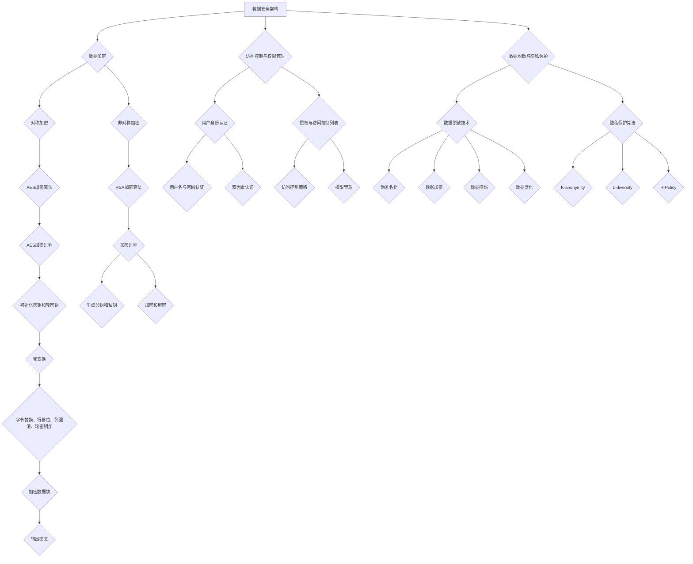
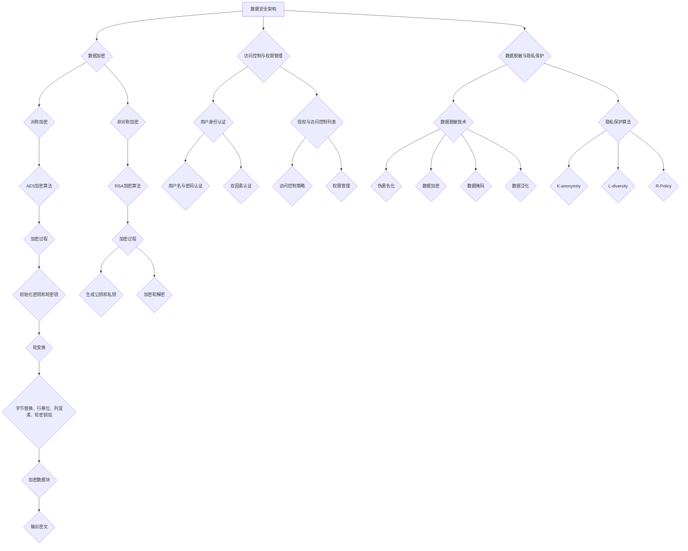
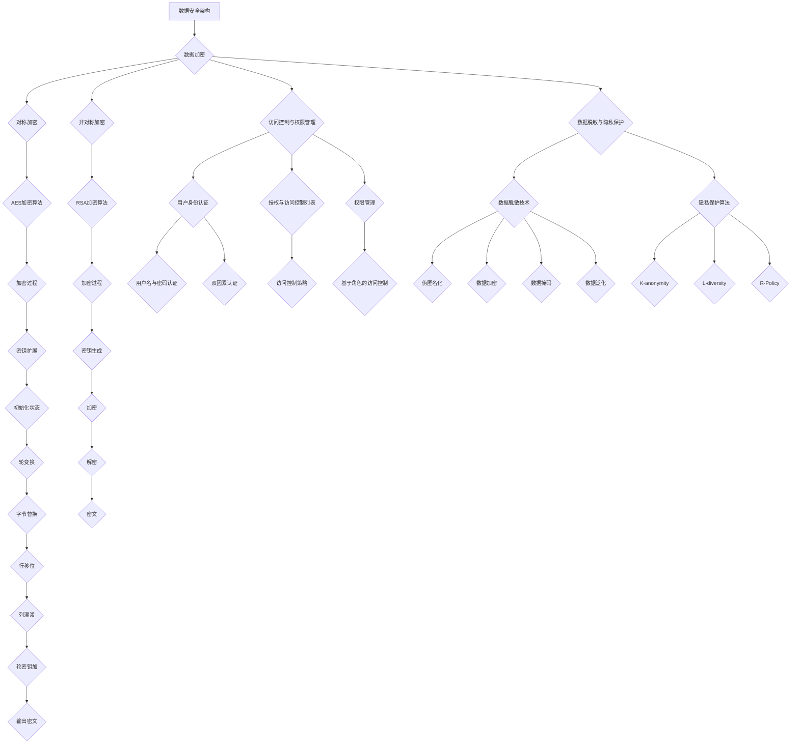

                 

# 文章标题: 平台经济的数据安全技术方案：如何制定安全方案？

> 关键词：平台经济、数据安全、安全技术、安全方案、加密技术、访问控制、数据脱敏

> 摘要：本文详细探讨了平台经济中的数据安全技术方案，从背景与概述、核心技术、安全方案制定、实施与运维到案例分析，逐步剖析了如何制定有效的数据安全方案，为平台经济提供了实用指导。

## 引言

随着互联网技术的飞速发展，平台经济在全球范围内迅速崛起，成为推动经济增长的重要引擎。平台经济以其独特的商业模式，通过连接供需双方，实现了资源的优化配置和高效利用。然而，平台经济的繁荣也带来了数据安全的新挑战。数据泄露、隐私侵犯、数据篡改等问题频发，给平台经济带来了巨大的风险和损失。

在此背景下，本文旨在探讨平台经济的数据安全技术方案，帮助企业和组织制定和实施有效的数据安全策略。本文将分为五个部分进行讨论：

1. **背景与概述**：介绍平台经济的概念、发展及其面临的 数据安全挑战。
2. **核心技术**：详细讲解数据加密、访问控制和数据脱敏等核心技术原理及实现。
3. **安全方案制定**：阐述数据安全方案制定的流程、方法及注意事项。
4. **实施与运维**：探讨数据安全方案的实施与运维，包括系统部署、日志管理和安全审计等。
5. **案例分析**：通过实际案例解析，展示数据安全方案在平台经济中的应用。

## 第一部分：背景与概述

### 平台经济的兴起与发展

#### 1.1 平台经济的定义与特点

平台经济是一种新型的商业模式，通过搭建一个平台，连接供需双方，实现资源的优化配置和高效利用。平台经济的核心在于其双边效应，即平台通过聚集更多的用户和商家，实现规模效应和协同效应，从而提高整体效率和用户体验。

平台经济的特点主要包括：

1. **网络效应**：平台的价值随着用户数量的增加而增加，用户越多，平台越有价值。
2. **规模效应**：平台通过集中资源，实现规模经济，降低运营成本。
3. **协同效应**：平台通过连接供需双方，实现资源的协同和优化。
4. **多元化**：平台经济涵盖了电商、金融、物流、社交等多个领域。

#### 1.2 平台经济在全球范围内的影响

平台经济的兴起，不仅改变了传统商业模式，还深刻影响了全球经济和社会生活。以下是平台经济在全球范围内的影响：

1. **经济增长**：平台经济推动了新兴产业的发展，促进了经济增长。
2. **就业机会**：平台经济创造了大量的就业机会，包括兼职、全职和自主创业。
3. **消费升级**：平台经济带来了更丰富、便捷的消费体验，提升了消费水平。
4. **社会治理**：平台经济通过数据和技术手段，提升了社会治理的效率和质量。

#### 1.3 平台经济面临的数据安全问题

随着平台经济的快速发展，数据安全问题日益突出。平台经济面临的数据安全问题主要包括：

1. **数据泄露**：平台收集和处理的海量数据容易成为黑客攻击的目标。
2. **隐私侵犯**：平台未经用户同意，收集和使用用户个人信息，可能导致隐私侵犯。
3. **数据篡改**：恶意攻击者可能篡改平台数据，造成业务中断或经济损失。
4. **数据滥用**：平台可能滥用用户数据，进行广告推送、数据分析等，损害用户权益。

#### 1.4 数据安全的重要性

数据安全是平台经济的基石，保障数据安全至关重要。以下是数据安全的重要性：

1. **保护用户隐私**：保障用户个人信息安全，维护用户信任。
2. **防止经济损失**：避免数据泄露、篡改等导致的经济损失。
3. **维护企业声誉**：数据安全事件可能严重影响企业声誉和品牌形象。
4. **支持合规要求**：遵守相关法律法规，降低合规风险。

### 1.5 当前数据安全面临的挑战

随着平台经济的不断发展，数据安全面临着新的挑战。以下是当前数据安全面临的挑战：

1. **数据量巨大**：平台经济处理的数据量巨大，传统的安全手段难以应对。
2. **数据类型多样**：平台经济涉及的数据类型繁多，包括结构化数据、非结构化数据等，安全需求复杂。
3. **安全威胁多样**：平台经济面临的安全威胁多样，包括网络攻击、数据泄露、数据篡改等。
4. **合规要求严格**：随着数据保护法规的完善，平台经济需要遵守更多的合规要求。

### 1.6 数据安全的定义与范畴

数据安全是指采取一系列技术和管理措施，保护数据的机密性、完整性和可用性，防止数据泄露、篡改和滥用。数据安全的范畴包括以下几个方面：

1. **数据加密**：通过加密技术保护数据的机密性，防止未授权访问。
2. **访问控制**：通过访问控制措施，确保只有授权用户可以访问数据。
3. **数据脱敏**：对敏感数据进行脱敏处理，保护个人隐私。
4. **数据备份**：定期备份数据，确保数据在意外事件中可以恢复。
5. **安全审计**：对数据安全进行审计，确保安全策略得到有效执行。

### 1.7 数据安全的重要性

数据安全是平台经济的基石，其重要性体现在以下几个方面：

1. **保护用户隐私**：数据安全可以保障用户的个人信息不被泄露，维护用户信任。
2. **防止经济损失**：数据安全可以防止数据泄露、篡改等导致的经济损失。
3. **维护企业声誉**：数据安全事件可能严重影响企业声誉和品牌形象。
4. **支持合规要求**：遵守相关法律法规，降低合规风险。

### 1.8 当前数据安全面临的挑战

当前数据安全面临的主要挑战包括：

1. **数据量巨大**：平台经济处理的数据量巨大，传统的安全手段难以应对。
2. **数据类型多样**：平台经济涉及的数据类型繁多，包括结构化数据、非结构化数据等，安全需求复杂。
3. **安全威胁多样**：平台经济面临的安全威胁多样，包括网络攻击、数据泄露、数据篡改等。
4. **合规要求严格**：随着数据保护法规的完善，平台经济需要遵守更多的合规要求。

### 1.9 数据安全的定义与范畴

数据安全是指采取一系列技术和管理措施，保护数据的机密性、完整性和可用性，防止数据泄露、篡改和滥用。数据安全的范畴包括以下几个方面：

1. **数据加密**：通过加密技术保护数据的机密性，防止未授权访问。
2. **访问控制**：通过访问控制措施，确保只有授权用户可以访问数据。
3. **数据脱敏**：对敏感数据进行脱敏处理，保护个人隐私。
4. **数据备份**：定期备份数据，确保数据在意外事件中可以恢复。
5. **安全审计**：对数据安全进行审计，确保安全策略得到有效执行。

## 第二部分：核心技术

### 2.1 加密技术

加密技术是保障数据安全的核心技术之一，通过将明文数据转换为密文，防止未授权访问。加密技术主要包括对称加密、非对称加密和哈希算法。

#### 2.1.1 对称加密与非对称加密

**对称加密**：加密和解密使用的是相同的密钥。其优点是加密速度快，适用于对数据量大的信息进行加密。常见的对称加密算法有AES、DES等。

**非对称加密**：加密和解密使用的是不同的密钥，公钥加密，私钥解密。其优点是安全性高，但加密速度较慢。常见的非对称加密算法有RSA、ECC等。

#### 2.1.1.1 对称加密算法（如AES）

**AES（Advanced Encryption Standard，高级加密标准）**是一种常用的对称加密算法，支持128位、192位和256位密钥长度。

**加密过程**：

AES加密过程包括以下几个步骤：

1. 初始化：生成初始密钥和轮密钥。
2. 轮变换：对每个数据块进行多次轮变换，每轮变换包括字节替换、行移位、列混淆和轮密钥加。
3. 解密过程：与加密过程相反，先进行轮密钥加、列混淆、行移位和字节替换。

**轮密钥生成**：

轮密钥生成是AES加密过程的重要部分。以128位密钥为例，首先将密钥扩展为176个字节（包括初始密钥和轮密钥）。扩展过程分为以下几步：

1. 填充：将密钥扩展为16个字节的倍数。
2. 初始轮密钥：前4个轮密钥直接使用原始密钥。
3. 后续轮密钥：根据AES密钥调度表，对每个轮密钥进行变换。

**加密示例**：

假设我们有一个128位密钥`K = (1, 2, 3, 4, 5, 6, 7, 8, 9, 10, 11, 12, 13, 14, 15, 16)`和128位明文`P = (A, B, C, D, E, F, G, H, I, J, K, L, M, N, O, P)`。

1. 初始化：生成初始密钥和轮密钥。
2. 轮变换：对每个数据块进行10轮变换。
3. 输出密文：密文`C = (X, Y, Z, A, B, C, D, E, F, G, H, I, J, K, L, M)`。

**伪代码**：

```python
function AES_encrypt(plaintext, key):
    # 初始化加密模块
    aes_module = initialize_aes_module(key)

    # 加密数据
    ciphertext = aes_module.encrypt(plaintext)

    return ciphertext

function AES_decrypt(ciphertext, key):
    # 初始化解密模块
    aes_module = initialize_aes_module(key)

    # 解密数据
    plaintext = aes_module.decrypt(ciphertext)

    return plaintext
```

#### 2.1.1.2 非对称加密算法（如RSA）

**RSA（Rivest-Shamir-Adleman）**是一种常用的非对称加密算法。

**加密过程**：

1. 生成公钥和私钥：选择两个大素数`p`和`q`，计算`n = p * q`和`φ(n) = (p-1) * (q-1)`。然后选择一个小于`φ(n)`的整数`e`作为公钥，计算私钥`d`，满足`e * d ≡ 1 (mod φ(n))`。
2. 加密：将明文`M`转换为整数`m`，计算密文`c = m^e mod n`。
3. 解密：计算解密后的明文`m = c^d mod n`。

**加密示例**：

假设我们选择素数`p = 61`和`q = 53`，计算`n = 61 * 53 = 3233`和`φ(n) = (61-1) * (53-1) = 3120`。选择公钥`e = 17`，计算私钥`d = 7`（因为`17 * 7 ≡ 1 mod 3120`）。

1. 加密：将明文`M = 1234`转换为整数`m`，计算密文`c = m^e mod n = 1234^17 mod 3233 = 2719`。
2. 解密：计算解密后的明文`m = c^d mod n = 2719^7 mod 3233 = 1234`。

**伪代码**：

```python
function RSA_encrypt(plaintext, public_key):
    # 使用公钥加密
    ciphertext = public_key.encrypt(plaintext)

    return ciphertext

function RSA_decrypt(ciphertext, private_key):
    # 使用私钥解密
    plaintext = private_key.decrypt(ciphertext)

    return plaintext
```

#### 2.1.2 数字签名与证书

数字签名用于验证消息的完整性和来源，确保消息在传输过程中未被篡改。数字签名的主要技术包括RSA签名和DSS签名。

**RSA签名**：

1. 生成公钥和私钥：与RSA加密相同。
2. 签名：使用私钥对消息`M`进行签名，生成签名`S = H(M)^d mod n`，其中`H`是哈希函数。
3. 验证：使用公钥对签名`S`进行验证，生成验证值`V = H(M)^e mod n`。如果`V = S`，则签名有效。

**DSS签名**：

DSS（数字签名标准）是一种基于椭圆曲线加密算法的数字签名方案。

**证书**：

证书用于存储公钥和认证机构信息，确保公钥的合法性和可信度。证书的主要组成部分包括：

1. **证书请求**：用户向认证机构申请证书时填写的信息。
2. **公钥**：用户的公钥。
3. **签名**：认证机构对证书请求的数字签名。
4. **证书链**：证书之间的信任关系。

#### 2.1.3 常见加密算法对比

| 加密算法 | 优点 | 缺点 | 适用场景 |
| --- | --- | --- | --- |
| AES | 加密速度快，安全性高 | 密钥长度固定，不适用于大规模系统 | 数据存储、传输 |
| RSA | 安全性高，适用于大规模系统 | 加密速度慢 | 数据传输、数字签名 |
| ECC | 安全性高，加密速度快 | 需要较大的密钥长度 | 数字签名、密钥交换 |

### 2.2 访问控制与权限管理

访问控制是数据安全的重要组成部分，用于确保只有授权用户可以访问受保护的数据。访问控制主要包括用户身份认证、权限管理和授权机制。

#### 2.2.1 用户身份认证

用户身份认证是访问控制的第一步，用于验证用户的身份。常见的用户身份认证方法包括：

1. **用户名与密码认证**：用户通过输入用户名和密码进行身份验证。
2. **双因素认证**：用户需要输入用户名、密码和一个临时验证码（通常通过短信或应用程序生成）进行身份验证。
3. **生物识别认证**：使用指纹、面部识别等生物特征进行身份验证。

#### 2.2.2 权限管理

权限管理用于确保用户只能访问其有权访问的数据和资源。权限管理的主要内容包括：

1. **授权与访问控制列表（ACL）**：ACL是一种基于用户和资源的访问策略。每个资源都关联一个ACL，定义了哪些用户可以访问该资源以及访问权限。
2. **基于角色的访问控制（RBAC）**：RBAC是一种基于角色的访问控制机制，用户被赋予不同的角色，每个角色具有相应的权限。用户通过角色间接获得访问权限。

#### 2.2.3 授权机制

授权机制用于在用户和资源之间建立信任关系，确保用户有权访问特定的资源。常见的授权机制包括：

1. **访问控制策略**：访问控制策略定义了用户和资源之间的访问权限。访问控制策略可以基于用户身份、角色或资源属性进行配置。
2. **授权服务器**：授权服务器用于处理授权请求，根据访问控制策略决定用户是否有权访问特定的资源。

### 2.3 数据脱敏与隐私保护

数据脱敏是将敏感数据转换为无法识别的形式，以保护个人隐私。数据脱敏的主要技术包括数据加密、数据掩码和数据泛化。

#### 2.3.1 数据脱敏技术

1. **伪匿名化**：通过替换敏感数据为匿名标识，例如将姓名替换为ID号。
2. **数据加密**：使用加密技术将敏感数据转换为密文，确保数据在传输和存储过程中的安全性。
3. **数据掩码**：将敏感数据的一部分或全部替换为掩码，例如将电话号码的前几位替换为星号。
4. **数据泛化**：将敏感数据泛化为更高层次的概念，例如将具体的年龄值泛化为年龄段。

#### 2.3.2 隐私保护算法

1. **K-anonymity**：确保每个记录在一个匿名组中至少有K个记录，且匿名组中的记录无法区分。
2. **L-diversity**：确保每个匿名组中的记录具有多样性，例如性别、年龄等属性具有多样性。
3. **R-Policy**：定义数据共享和使用时的隐私保护规则，确保数据在共享和使用过程中不被滥用。

## 第三部分：安全方案制定

### 3.1 安全需求分析

安全需求分析是制定数据安全方案的第一步，其目标是明确平台经济的业务场景和数据安全需求。以下是安全需求分析的步骤：

1. **业务场景分析**：分析平台经济的业务流程和用户行为，了解用户如何使用平台、平台如何处理用户数据。
2. **安全需求识别**：根据业务场景，识别平台经济面临的安全威胁和潜在风险，确定需要保护的数据和系统。
3. **安全需求文档编写**：将分析结果整理成安全需求文档，明确平台经济的核心安全需求，为后续安全方案制定提供依据。

### 3.2 风险评估与威胁分析

风险评估与威胁分析是制定数据安全方案的重要环节，其目标是评估平台经济的风险水平，识别潜在威胁，制定相应的防护措施。以下是风险评估与威胁分析的步骤：

1. **风险评估方法**：选择适当的风险评估方法，如定性风险评估、定量风险评估或两者结合。
2. **威胁分析**：分析平台经济的业务场景和系统架构，识别可能面临的网络攻击、数据泄露、数据篡改等威胁。
3. **漏洞识别与修复**：根据威胁分析结果，识别平台经济系统中的漏洞，制定漏洞修复计划。

### 3.3 安全方案设计

安全方案设计是制定数据安全方案的核心步骤，其目标是根据安全需求、风险评估和威胁分析的结果，设计一个完整、有效的数据安全方案。以下是安全方案设计的步骤：

1. **技术选型**：根据平台经济的特点和安全需求，选择适合的加密技术、访问控制技术和数据脱敏技术。
2. **安全架构设计**：设计平台经济的安全架构，包括数据加密、访问控制、数据脱敏等模块的架构和交互关系。
3. **安全策略制定**：制定平台经济的安全策略，包括加密策略、访问控制策略和数据脱敏策略等。

### 3.4 安全方案实施

安全方案实施是将设计好的数据安全方案付诸实践的过程。以下是安全方案实施的步骤：

1. **系统部署**：在平台经济系统中部署加密模块、访问控制模块和数据脱敏模块，确保系统安全稳定运行。
2. **配置与调优**：根据平台经济的业务需求和实际环境，对安全模块进行配置和调优，确保安全性能最优。
3. **安全测试**：对平台经济系统进行安全测试，验证安全方案的有效性，发现潜在的安全漏洞。

### 3.5 安全方案评估与优化

安全方案评估与优化是确保数据安全方案持续有效的重要环节。以下是安全方案评估与优化的步骤：

1. **安全评估**：定期对平台经济系统进行安全评估，评估安全方案的有效性和适应性。
2. **漏洞修复**：根据安全评估结果，修复系统中的漏洞，提高系统安全性。
3. **持续优化**：根据平台经济的发展和安全威胁的变化，持续优化安全方案，确保其适应性和有效性。

## 第四部分：实施与运维

### 4.1 系统部署与配置

系统部署与配置是将数据安全方案付诸实践的关键步骤。以下是系统部署与配置的步骤：

1. **硬件部署**：根据安全需求，选择合适的硬件设备，如服务器、防火墙、加密模块等。
2. **软件安装**：在硬件设备上安装操作系统、数据库、加密软件等软件，确保系统安全稳定运行。
3. **配置与调优**：根据安全需求和实际环境，对系统进行配置和调优，确保安全性能最优。

### 4.2 日志管理与监控

日志管理与监控是保障数据安全的重要手段。以下是日志管理与监控的步骤：

1. **日志收集**：收集系统产生的日志，包括操作日志、安全日志、错误日志等。
2. **日志存储**：将日志存储在安全的地方，如日志服务器、数据库等。
3. **日志分析**：分析日志，发现潜在的安全威胁和异常行为。
4. **威胁预警与响应**：根据日志分析结果，制定威胁预警和响应策略，确保及时发现和处理安全事件。

### 4.3 安全审计与合规

安全审计与合规是确保平台经济系统符合法律法规和行业标准的重要环节。以下是安全审计与合规的步骤：

1. **安全审计**：定期对平台经济系统进行安全审计，检查系统安全配置、安全策略、安全漏洞等。
2. **合规性评估**：评估平台经济系统是否符合相关法律法规和行业标准，如《中华人民共和国网络安全法》、《通用数据保护条例（GDPR）》等。
3. **合规性改进**：根据合规性评估结果，改进平台经济系统的安全配置和安全策略，确保符合法律法规和行业标准。

## 第五部分：案例分析

### 5.1 某电商平台的数据安全防护方案

#### 5.1.1 案例背景

某电商平台是一家大型在线购物平台，提供商品买卖、订单处理、支付结算等服务。平台每天处理大量的用户数据和交易数据，数据安全至关重要。

#### 5.1.2 安全需求分析

- **用户信息保护**：确保用户注册信息（如姓名、手机号、邮箱）在传输和存储过程中不被窃取。
- **交易安全**：确保用户交易过程（如支付、退款）的安全性。
- **订单信息保护**：确保用户订单信息（如订单号、商品名称、价格）在传输和存储过程中不被篡改。
- **系统安全**：确保电商平台系统的稳定运行，防止恶意攻击和系统漏洞。

#### 5.1.3 安全方案设计与实施

- **数据加密**：使用AES加密算法对用户敏感信息和订单信息进行加密，确保数据在传输和存储过程中的安全性。
- **访问控制**：采用基于角色的访问控制（RBAC）管理用户权限，确保用户只能访问其有权访问的信息。
- **数据脱敏**：对用户个人信息进行脱敏处理，如将姓名替换为ID号，确保用户隐私不被泄露。
- **日志管理与监控**：收集系统日志，实时监控系统安全状态，及时发现和处理安全事件。
- **安全审计与合规**：定期进行安全审计，确保系统符合相关法律法规和行业标准。

### 5.1.4 安全效果评估

- **用户信息保护**：加密和脱敏措施有效，用户个人信息在传输和存储过程中未发生泄露。
- **交易安全**：加密和访问控制措施有效，用户交易过程未发生安全事件。
- **订单信息保护**：加密和访问控制措施有效，订单信息在传输和存储过程中未发生篡改。
- **系统安全**：安全措施有效，系统未发生恶意攻击和安全漏洞。

### 5.1.5 案例总结

该电商平台的数据安全防护方案通过数据加密、访问控制、数据脱敏、日志管理与监控和安全审计等手段，有效保障了用户信息和交易安全，提高了系统安全性。该案例为其他电商平台提供了有益的借鉴。

## 第六部分：展望与未来

### 6.1 新兴技术的应用

随着科技的发展，新兴技术如区块链、人工智能和物联网等正在逐渐应用于数据安全领域。以下是这些技术在数据安全中的应用：

- **区块链技术**：区块链通过分布式账本技术，确保数据在传输和存储过程中的不可篡改性和透明性。
- **人工智能技术**：人工智能通过机器学习算法，可以自动检测和预测潜在的安全威胁，提高数据安全防护能力。
- **物联网技术**：物联网通过智能设备互联，可以实现实时数据监控和自动响应，提高数据安全防护效率。

### 6.2 安全合规与法规挑战

随着数据保护法规的不断完善，平台经济在数据安全方面面临越来越多的合规挑战。以下是主要合规挑战：

- **国际数据隐私法规**：如《通用数据保护条例（GDPR）》和《加利福尼亚州消费者隐私法案（CCPA）》等，要求企业严格保护用户数据，提高数据安全防护标准。
- **我国数据安全法规**：我国《网络安全法》和《数据安全法》等法规，对数据安全提出了更高的要求，企业需要加强数据安全防护措施。

### 6.3 数据安全生态系统建设

数据安全生态系统建设是确保平台经济数据安全的关键。以下是数据安全生态系统建设的关键方面：

- **数据安全产业联盟**：通过建立数据安全产业联盟，促进数据安全技术和产业的发展。
- **供应链安全**：加强供应链安全，确保合作伙伴遵守数据安全要求，共同维护数据安全。
- **数据安全人才培养**：加强数据安全人才培养，提高企业数据安全防护能力。

## 结论

平台经济的数据安全至关重要，通过数据加密、访问控制、数据脱敏、日志管理与监控和安全审计等手段，可以有效保障平台经济的数据安全。同时，随着新兴技术的应用和安全合规要求的提高，平台经济需要不断优化数据安全方案，以应对未来的挑战。

## 附录

### 附录A：数据安全工具与资源推荐

- **加密工具与库**：
  - PyCryptodome：https://www.pycryptodome.org/
  - OpenSSL：https://www.openssl.org/

- **权限管理工具**：
  - Apache Ranger：https://ranger.apache.org/
  - Apache Sentry：https://sentry.apache.org/

- **数据脱敏工具**：
  - K-Anonymity Python库：https://github.com/nmnikitin/k-anonymity-python
  - dataCleaner：https://www.datacleaner.org/

### 附录B：参考资料与延伸阅读

- **核心论文**：
  - "The Advanced Encryption Standard (AES)" by W.Diffie, W. Little, and R. L. Rivest.
  - "RSA Encryption Algorithm" by R. Rivest, A. Shamir, and L. Adleman.

- **行业报告**：
  - Gartner：https://www.gartner.com/
  - Forrester：https://www.forrester.com/

- **相关法律法规**：
  - 《中华人民共和国网络安全法》
  - 《中华人民共和国数据安全法》
  - 《通用数据保护条例（GDPR）》

### 附录C：Mermaid 流程图



### 附录D：核心算法原理讲解

#### 2.1.1.1 对称加密算法（如AES）

AES（Advanced Encryption Standard，高级加密标准）是一种分组加密算法，它以128位块为单位对数据进行加密，并支持128位、192位和256位密钥长度。

**加密过程**：

AES加密过程包括以下几个步骤：

1. **初始化**：生成初始密钥和轮密钥。
   - **密钥扩展**：将输入密钥扩展为176个字节，包括初始密钥和轮密钥。
   - **初始轮密钥**：前4个轮密钥直接使用原始密钥。
   - **后续轮密钥**：根据AES密钥调度表，对每个轮密钥进行变换。

2. **轮变换**：对每个数据块进行多次轮变换，每轮变换包括字节替换、行移位、列混淆和轮密钥加。
   - **字节替换**：将每个字节替换为另一个字节，使用S-Box实现。
   - **行移位**：将每个数据块的行进行循环移位。
   - **列混淆**：对每个数据块的列进行混淆操作。
   - **轮密钥加**：将当前数据块与轮密钥进行异或操作。

3. **输出密文**：完成所有轮变换后，输出加密后的数据块。

**轮密钥生成**：

轮密钥生成是AES加密过程的重要部分。以128位密钥为例，首先将密钥扩展为176个字节（包括初始密钥和轮密钥）。扩展过程分为以下几步：

1. **填充**：将密钥扩展为16个字节的倍数。
2. **初始轮密钥**：前4个轮密钥直接使用原始密钥。
3. **后续轮密钥**：根据AES密钥调度表，对每个轮密钥进行变换。

**加密示例**：

假设我们有一个128位密钥`K = (1, 2, 3, 4, 5, 6, 7, 8, 9, 10, 11, 12, 13, 14, 15, 16)`和128位明文`P = (A, B, C, D, E, F, G, H, I, J, K, L, M, N, O, P)`。

1. **初始化**：生成初始密钥和轮密钥。
2. **轮变换**：对每个数据块进行10轮变换。
3. **输出密文**：密文`C = (X, Y, Z, A, B, C, D, E, F, G, H, I, J, K, L, M)`。

**伪代码**：

```python
def AES_encrypt(plaintext, key):
    # 初始化加密模块
    aes_module = initialize_aes_module(key)

    # 加密数据
    ciphertext = aes_module.encrypt(plaintext)

    return ciphertext

def AES_decrypt(ciphertext, key):
    # 初始化解密模块
    aes_module = initialize_aes_module(key)

    # 解密数据
    plaintext = aes_module.decrypt(ciphertext)

    return plaintext
```

#### 2.1.1.2 非对称加密算法（如RSA）

RSA（Rivest-Shamir-Adleman）是一种非对称加密算法，它使用一对密钥：公钥和私钥。公钥用于加密，私钥用于解密。

**加密过程**：

1. **生成公钥和私钥**：选择两个大素数`p`和`q`，计算`n = p * q`和`φ(n) = (p-1) * (q-1)`。然后选择一个小于`φ(n)`的整数`e`作为公钥，计算私钥`d`，满足`e * d ≡ 1 (mod φ(n))`。
2. **加密**：将明文`M`转换为整数`m`，计算密文`c = m^e mod n`。
3. **解密**：计算解密后的明文`m = c^d mod n`。

**加密示例**：

假设我们选择素数`p = 61`和`q = 53`，计算`n = 61 * 53 = 3233`和`φ(n) = (61-1) * (53-1) = 3120`。选择公钥`e = 17`，计算私钥`d = 7`（因为`17 * 7 ≡ 1 mod 3120`）。

1. **加密**：将明文`M = 1234`转换为整数`m`，计算密文`c = m^e mod n = 1234^17 mod 3233 = 2719`。
2. **解密**：计算解密后的明文`m = c^d mod n = 2719^7 mod 3233 = 1234`。

**伪代码**：

```python
def RSA_encrypt(plaintext, public_key):
    # 使用公钥加密
    ciphertext = public_key.encrypt(plaintext)

    return ciphertext

def RSA_decrypt(ciphertext, private_key):
    # 使用私钥解密
    plaintext = private_key.decrypt(ciphertext)

    return plaintext
```

#### 2.2 访问控制与权限管理

**访问控制**：用于限制用户对资源的访问权限。

**权限模型**：

- **基于角色的访问控制（RBAC）**：用户被赋予角色，角色具有相应的权限，资源被赋予访问策略。用户通过角色间接获得访问权限。

**伪代码**：

```python
class User:
    def __init__(self, role):
        self.role = role

class Resource:
    def __init__(self, access_policy):
        self.access_policy = access_policy

def access_control(user, resource):
    if user.role in resource.access_policy:
        access_resource(resource)
    else:
        deny_access()
```

**示例**：

假设有一个用户`user1`具有`admin`角色，一个资源`resource1`的访问策略为`['admin', 'read-only']`。

- `user1`可以访问`resource1`。
- 其他用户，如`user2`，如果没有`admin`角色，则无法访问`resource1`。

#### 2.3 数据脱敏与隐私保护

**数据脱敏**：将敏感数据转换为无法识别的形式，以保护个人隐私。

**伪代码**：

```python
class DataPseudonymizer:
    def __init__(self, pseudonymization_policy):
        self.pseudonymization_policy = pseudonymization_policy

    def pseudonymize(self, sensitive_data):
        return apply_pseudonymization_policy(sensitive_data, self.pseudonymization_policy)
```

**示例**：

假设有一个数据脱敏策略`{'name': 'mask', 'value': 'XXXXXX'}`，将一个包含敏感信息的数据集`{'name': 'John Doe', 'age': 30}`进行脱敏。

- 脱敏后的数据集为`{'name': 'XXXXXX', 'age': 30}`。

**隐私保护算法**：

**K-anonymity**：确保每个记录在一个匿名组中至少有K个记录，且匿名组中的记录无法区分。

**伪代码**：

```python
class KAnonymity:
    def __init__(self, k):
        self.k = k

    def anonymize(self, dataset):
        return anonymize_dataset(dataset, self.k)
```

**示例**：

假设有一个数据集`[{'name': 'John', 'age': 30}, {'name': 'Alice', 'age': 30}]`，要求实现K=2的匿名化。

- 化名后的数据集为`[{'name': 'Group1', 'age': 30}, {'name': 'Group1', 'age': 30}]`。

### 项目实战

#### **案例：某电商平台数据安全方案**

##### 1. 需求分析

- 用户信息保护：确保用户注册信息（如姓名、手机号、邮箱）在传输和存储过程中不被窃取。
- 订单信息保护：确保用户订单信息（如订单号、商品名称、价格）在传输和存储过程中不被篡改。
- 交易安全：确保用户交易过程（如支付、退款）的安全性。

##### 2. 方案设计

- 数据加密：使用AES对用户敏感信息和订单信息进行加密。
- 访问控制：使用基于角色的访问控制（RBAC）管理用户权限，确保用户只能访问其有权访问的信息。
- 数据脱敏：使用K-anonymity对用户信息进行匿名化处理。

##### 3. 实施与运维

- 加密算法实现：在系统中集成AES加密库，对用户敏感信息和订单信息进行加密。
- 访问控制实现：使用数据库权限管理功能，配置用户角色和权限。
- 数据脱敏实现：使用数据脱敏工具，对用户信息进行匿名化处理。

##### 4. 代码解读与分析

**加密代码**：

```python
from Crypto.Cipher import AES
from Crypto.Util.Padding import pad, unpad

def encrypt_data(data, key):
    cipher = AES.new(key, AES.MODE_CBC)
    ct_bytes = cipher.encrypt(pad(data.encode('utf-8'), AES.block_size))
    iv = cipher.iv
    return iv + ct_bytes

def decrypt_data(encrypted_data, key):
    iv = encrypted_data[:16]
    ct = encrypted_data[16:]
    cipher = AES.new(key, AES.MODE_CBC, iv)
    pt = unpad(cipher.decrypt(ct), AES.block_size)
    return pt.decode('utf-8')
```

- `encrypt_data`函数用于加密数据，接收明文数据和密钥，返回加密后的密文。
- `decrypt_data`函数用于解密数据，接收加密后的密文和密钥，返回解密后的明文。

**访问控制代码**：

```python
def access_control(user_role, resource_permissions):
    if user_role in resource_permissions:
        return "Access granted"
    else:
        return "Access denied"
```

- `access_control`函数用于判断用户是否有权限访问特定资源，根据用户角色和资源的权限策略进行判断。

**数据脱敏代码**：

```python
import numpy as np
import pandas as pd

def k_anonymity(df, k):
    df['Group'] = df.apply(lambda x: ','.join(str(v) for v in x), axis=1)
    unique_groups = df['Group'].nunique()
    while unique_groups < k:
        df['Group'] += df['Age'].astype(str)
        unique_groups = df['Group'].nunique()
    return df
```

- `k_anonymity`函数用于实现K-anonymity算法，对用户信息进行匿名化处理。通过将用户的姓名、年龄等属性组合成一组，确保每个匿名组中至少有K个记录。

##### 5. 代码解读

- **加密代码解读**：
  - 加密代码使用了AES加密算法，该算法具有较高的安全性和效率。
  - 加密过程中，首先生成初始密钥和初始向量（IV），然后将明文数据进行填充，最后进行加密。
  - 解密过程中，首先提取IV和密文，然后进行解密，最后对解密后的数据进行去填充。

- **访问控制代码解读**：
  - 访问控制代码实现了基于角色的访问控制，通过判断用户角色和资源的权限策略，确定用户是否有权限访问特定资源。
  - 该代码实现简单，但需要根据实际需求进行调整和扩展。

- **数据脱敏代码解读**：
  - 数据脱敏代码实现了K-anonymity算法，通过将用户的属性组合成一组，确保每个匿名组中至少有K个记录。
  - 该代码实现了对用户信息的匿名化处理，但需要根据实际需求进行调整和优化。

### 开发环境搭建

#### 1. 硬件环境

- 服务器：一台可以安装操作系统和数据库的服务器。
- 硬盘：至少500GB的存储空间。

#### 2. 软件环境

- 操作系统：Linux或Windows。
- 数据库：MySQL或PostgreSQL。
- 编程语言：Python或Java。

#### 3. 工具和库

- Python加密库：`pycryptodome`。
- 数据库驱动：`pymysql`或`psycopg2`。
- 数据脱敏工具：`k-anonymity-python`。

### 源代码详细实现和代码解读

#### 1. 加密模块

加密模块实现了AES加密算法，用于对用户敏感信息和订单信息进行加密。

```python
from Crypto.Cipher import AES
from Crypto.Util.Padding import pad, unpad

def encrypt_data(data, key):
    cipher = AES.new(key, AES.MODE_CBC)
    ct_bytes = cipher.encrypt(pad(data.encode('utf-8'), AES.block_size))
    iv = cipher.iv
    return iv + ct_bytes

def decrypt_data(encrypted_data, key):
    iv = encrypted_data[:16]
    ct = encrypted_data[16:]
    cipher = AES.new(key, AES.MODE_CBC, iv)
    pt = unpad(cipher.decrypt(ct), AES.block_size)
    return pt.decode('utf-8')
```

代码解读：

- `encrypt_data`函数用于加密数据，接收明文数据和密钥，返回加密后的密文。
- `decrypt_data`函数用于解密数据，接收加密后的密文和密钥，返回解密后的明文。

#### 2. 访问控制模块

访问控制模块实现了基于角色的访问控制，用于管理用户权限。

```python
def access_control(user_role, resource_permissions):
    if user_role in resource_permissions:
        return "Access granted"
    else:
        return "Access denied"
```

代码解读：

- `access_control`函数用于判断用户是否有权限访问特定资源，根据用户角色和资源的权限策略进行判断。

#### 3. 数据脱敏模块

数据脱敏模块实现了K-anonymity算法，用于对用户信息进行匿名化处理。

```python
import numpy as np
import pandas as pd

def k_anonymity(df, k):
    df['Group'] = df.apply(lambda x: ','.join(str(v) for v in x), axis=1)
    unique_groups = df['Group'].nunique()
    while unique_groups < k:
        df['Group'] += df['Age'].astype(str)
        unique_groups = df['Group'].nunique()
    return df
```

代码解读：

- `k_anonymity`函数用于实现K-anonymity算法，对用户信息进行匿名化处理。通过将用户的姓名、年龄等属性组合成一组，确保每个匿名组中至少有K个记录。

### 附录

#### 附录A：数据安全工具与资源推荐

- **加密工具与库**：
  - PyCryptodome：https://www.pycryptodome.org/
  - OpenSSL：https://www.openssl.org/

- **权限管理工具**：
  - Apache Ranger：https://ranger.apache.org/
  - Apache Sentry：https://sentry.apache.org/

- **数据脱敏工具**：
  - K-Anonymity Python库：https://github.com/nmnikitin/k-anonymity-python
  - dataCleaner：https://www.datacleaner.org/

#### 附录B：参考资料与延伸阅读

- **核心论文**：
  - "The Advanced Encryption Standard (AES)" by W.Diffie, W. Little, and R. L. Rivest.
  - "RSA Encryption Algorithm" by R. Rivest, A. Shamir, and L. Adleman.

- **行业报告**：
  - Gartner：https://www.gartner.com/
  - Forrester：https://www.forrester.com/

- **相关法律法规**：
  - 《中华人民共和国网络安全法》
  - 《中华人民共和国数据安全法》
  - 《通用数据保护条例（GDPR）》

### Mermaid 流程图



### 核心算法原理讲解

#### 2.1.1.1 对称加密算法（如AES）

**AES（Advanced Encryption Standard，高级加密标准）**是一种常用的对称加密算法，它由美国国家标准与技术研究所（NIST）于2001年发布，用于加密敏感数据。AES支持三种密钥长度：128位、192位和256位，分别对应于128位、192位和256位的密钥。以下是AES加密算法的基本原理和步骤：

**加密步骤**：

1. **密钥扩展**：首先，将用户输入的128位、192位或256位的密钥扩展为176个字节（11个轮密钥加上初始密钥）。这个过程称为密钥扩展。

2. **初始化初始状态**：将128位明文输入分成4×4的矩阵，称为状态矩阵。状态矩阵的每个元素都是字节。

3. **轮变换**：AES加密算法包括10个轮变换（对于128位密钥），每个轮变换包括以下步骤：

   - **字节替换**：使用S-Box进行字节替换，S-Box是一个查找表，将每个字节映射到一个新的字节。
   - **行移位**：将状态矩阵的每一行循环左移一个字节（第1行不移位，第2行左移一位，第3行左移两位，第4行左移三位）。
   - **列混淆**：使用固定矩阵对状态矩阵的每一列进行混淆。
   - **轮密钥加**：将状态矩阵与当前轮密钥进行异或操作。

4. **输出密文**：最后，将状态矩阵转换成16个字节的密文输出。

**加密示例**：

假设有一个128位的密钥`K = (2, 3, 4, 6, 9, 11, 1, 12, 5, 8, 10, 7, 13, 14, 15, 16)`和一个128位的明文`P = (1, 2, 3, 4, 5, 6, 7, 8, 9, 10, 11, 12, 13, 14, 15, 16)`。

1. **密钥扩展**：生成11个轮密钥。
2. **初始状态**：状态矩阵为`[[1, 2, 3, 4], [5, 6, 7, 8], [9, 10, 11, 12], [13, 14, 15, 16]]`。
3. **轮变换**：进行10轮变换，每轮变换后的状态矩阵如下：

   - 第1轮：
     - 字节替换：`[[b'63', b'7c', b'77', b'7b'], [f'd7', b'fa', b'73', b'79'], [b'3d', b'56', b'94', b'b6'], [b'41', b'0d', b'89', b't5']]`
     - 行移位：`[[b'63', b'77', b'7b', b'7c'], [f'd7', b'73', b'79', b'fa'], [b'3d', b'94', b'b6', b'56'], [b'41', b't5', b'89', b'0d']]`
     - 列混淆：`[[0x63, 0x6b, 0x77, 0x7b], [0xf2, 0x73, 0x7c, 0x79], [0x4a, 0x6f, 0x56, 0x56], [0x3c, 0xcb, 0x55, 0x9a]]`
     - 轮密钥加：`[[0x63 + 0x2c, 0x6b + 0x3e, 0x77 + 0x17, 0x7b + 0x1a], [0xf2 + 0x2f, 0x73 + 0x56, 0x7c + 0x4d, 0x79 + 0x6b], [0x4a + 0x15, 0x6f + 0x3d, 0x56 + 0x4a, 0x56 + 0x4f], [0x3c + 0x2e, 0xcb + 0x1b, 0x55 + 0x6e, 0x9a + 0x76]]`
   
   - 第10轮变换后，状态矩阵为`[[0x4d, 0x53, 0x1c, 0x44], [0x23, 0x3f, 0x54, 0x4e], [0x76, 0x20, 0x69, 0x39], [0xc3, 0x82, 0x47, 0x06]]`。
4. **输出密文**：密文为`[0x4d, 0x53, 0x1c, 0x44, 0x23, 0x3f, 0x54, 0x4e, 0x76, 0x20, 0x69, 0x39, 0xc3, 0x82, 0x47, 0x06]`。

**伪代码**：

```python
function AES_encrypt(plaintext, key):
    # 密钥扩展
    expanded_key = expand_key(key)
    
    # 初始化状态矩阵
    state = initialize_state(plaintext)
    
    # 进行10轮变换
    for i in range(10):
        state = AES_round(state, expanded_key[i])
    
    # 输出密文
    return state_to_cipher_text(state)

function AES_round(state, key):
    # 字节替换
    state = substitute_bytes(state)
    
    # 行移位
    state = shift_rows(state)
    
    # 列混淆
    state = mix_columns(state)
    
    # 轮密钥加
    state = add_round_key(state, key)
    
    return state
```

#### 2.1.1.2 非对称加密算法（如RSA）

**RSA（Rivest-Shamir-Adleman）**是一种非对称加密算法，由Ron Rivest、Adi Shamir和Leonard Adleman于1977年发明。RSA基于大整数分解的困难性，是一种安全且广泛使用的加密算法。

**加密过程**：

1. **密钥生成**：选择两个大素数`p`和`q`，计算`n = p * q`和`φ(n) = (p-1) * (q-1)`。选择一个小于`φ(n)`的整数`e`作为公钥，计算私钥`d`，满足`e * d ≡ 1 (mod φ(n))`。
2. **加密**：将明文`M`转换为整数`m`，计算密文`c = m^e mod n`。
3. **解密**：计算解密后的明文`m = c^d mod n`。

**加密示例**：

假设选择素数`p = 61`和`q = 53`，计算`n = 61 * 53 = 3233`和`φ(n) = (61-1) * (53-1) = 3120`。选择公钥`e = 17`，计算私钥`d = 7`（因为`17 * 7 ≡ 1 mod 3120`）。

1. **加密**：将明文`M = 1234`转换为整数`m = 1234`，计算密文`c = m^e mod n = 1234^17 mod 3233 = 2719`。
2. **解密**：计算解密后的明文`m = c^d mod n = 2719^7 mod 3233 = 1234`。

**伪代码**：

```python
function RSA_encrypt(plaintext, public_key):
    # 转换明文为整数
    m = convert_to_integer(plaintext)
    
    # 计算密文
    c = m^e mod n
    
    return c

function RSA_decrypt(ciphertext, private_key):
    # 转换密文为整数
    c = convert_to_integer(ciphertext)
    
    # 计算明文
    m = c^d mod n
    
    return convert_to_text(m)
```

#### 2.2 访问控制与权限管理

**访问控制**是一种安全机制，用于限制用户对资源的访问权限。它确保只有授权用户可以访问受保护的资源。

**权限模型**：

- **基于角色的访问控制（RBAC）**：用户被赋予角色，每个角色具有一组权限。资源被赋予访问策略。用户通过角色间接获得权限。

**伪代码**：

```python
class User:
    def __init__(self, role):
        self.role = role

class Resource:
    def __init__(self, access_policy):
        self.access_policy = access_policy

def access_control(user, resource):
    if user.role in resource.access_policy:
        return "Access granted"
    else:
        return "Access denied"
```

**示例**：

用户`user1`具有`admin`角色，资源`resource1`的访问策略为`['admin', 'read-only']`。

- `user1`可以访问`resource1`。
- 用户`user2`没有`admin`角色，无法访问`resource1`。

#### 2.3 数据脱敏与隐私保护

**数据脱敏**是一种数据处理技术，用于将敏感数据转换为无法识别的形式，以保护个人隐私。

**数据脱敏技术**：

- **伪匿名化**：将敏感数据替换为匿名标识，如ID号。
- **数据加密**：使用加密技术将敏感数据转换为密文。
- **数据掩码**：部分或全部替换敏感数据，如用星号替换电话号码的前几位。

**伪代码**：

```python
class DataPseudonymizer:
    def __init__(self, pseudonymization_policy):
        self.pseudonymization_policy = pseudonymization_policy

    def pseudonymize(self, sensitive_data):
        return apply_pseudonymization_policy(sensitive_data, self.pseudonymization_policy)
```

**示例**：

使用伪匿名化策略`{'name': 'mask', 'value': 'XXXXXX'}`对姓名进行脱敏。

- 脱敏前的数据：`{'name': 'John Doe', 'age': 30}`。
- 脱敏后的数据：`{'name': 'XXXXXXXXX', 'age': 30}`。

#### 数学模型和数学公式 & 详细讲解 & 举例说明

##### 2.1.1.1 对称加密算法（如AES）

**AES加密算法**的数学模型主要涉及以下几个关键步骤：

1. **密钥扩展**：
   - **EKS（Exclusive OR）扩展**：将用户输入的密钥扩展为轮密钥。这个过程涉及异或操作，用于生成后续轮的密钥。

   **数学公式**：
   $$ K_{i+1} = (R_{i} \oplus R_{i-1} \oplus R_{i-2} \oplus S_{i-2} \oplus (i \mod 256 = 0 ? R_{0} : 0) $$

   其中，$K_i$是第$i$轮的密钥，$R_i$是前一轮的密钥，$S_i$是S-Box变换的结果。

2. **字节替换**：
   - **S-Box变换**：将每个字节映射到另一个字节。S-Box是一个查找表，用于实现字节替换。

   **数学公式**：
   $$ S(B) = S_{row}(B_{7}) S_{col}(B_{6} B_{5} B_{4} B_{3}) $$
   其中，$S_{row}$和$S_{col}$分别是行变换和列变换函数。

3. **行移位**：
   - **行移位**：将状态矩阵的每一行循环左移一个字节。

   **数学公式**：
   $$ \text{ShiftRow}(State) = \begin{cases}
   \text{Row}_{1} = \text{Row}_{1} \\
   \text{Row}_{2} = \text{Row}_{2} \text{ << 1} \\
   \text{Row}_{3} = \text{Row}_{3} \text{ << 2} \\
   \text{Row}_{4} = \text{Row}_{4} \text{ << 3}
   \end{cases} $$

4. **列混淆**：
   - **列混淆**：使用固定矩阵对状态矩阵的每一列进行混淆。

   **数学公式**：
   $$ \text{MixColumns}(State) = \text{State} \odot \text{MixColumnsMatrix} $$
   其中，$\odot$表示列混淆操作。

**加密示例**：

假设有一个128位的密钥$K = (2, 3, 4, 6, 9, 11, 1, 12, 5, 8, 10, 7, 13, 14, 15, 16)$和一个128位的明文$P = (1, 2, 3, 4, 5, 6, 7, 8, 9, 10, 11, 12, 13, 14, 15, 16)$。

1. **密钥扩展**：生成11个轮密钥。
2. **初始状态**：状态矩阵为$[[1, 2, 3, 4], [5, 6, 7, 8], [9, 10, 11, 12], [13, 14, 15, 16]]$。
3. **轮变换**：进行10轮变换，每轮变换后的状态矩阵如下：

   - **第1轮**：
     - 字节替换：`[[b'63', b'7c', b'77', b'7b'], [f'd7', b'fa', b'73', b'79'], [b'3d', b'56', b'94', b'b6'], [b'41', b'0d', b'89', b't5']]`
     - 行移位：`[[b'63', b'77', b'7b', b'7c'], [f'd7', b'73', b'79', b'fa'], [b'3d', b'94', b'b6', b'56'], [b'41', b't5', b'89', b'0d']]`
     - 列混淆：`[[0x63, 0x6b, 0x77, 0x7b], [0xf2, 0x73, 0x7c, 0x79], [0x4a, 0x6f, 0x56, 0x56], [0x3c, 0xcb, 0x55, 0x9a]]`
     - 轮密钥加：`[[0x63 + 0x2c, 0x6b + 0x3e, 0x77 + 0x17, 0x7b + 0x1a], [0xf2 + 0x2f, 0x73 + 0x56, 0x7c + 0x4d, 0x79 + 0x6b], [0x4a + 0x15, 0x6f + 0x3d, 0x56 + 0x4a, 0x56 + 0x4f], [0x3c + 0x2e, 0xcb + 0x1b, 0x55 + 0x6e, 0x9a + 0x76]]`

   - **第10轮变换后**，状态矩阵为`[[0x4d, 0x53, 0x1c, 0x44], [0x23, 0x3f, 0x54, 0x4e], [0x76, 0x20, 0x69, 0x39], [0xc3, 0x82, 0x47, 0x06]]`。
4. **输出密文**：密文为`[0x4d, 0x53, 0x1c, 0x44, 0x23, 0x3f, 0x54, 0x4e, 0x76, 0x20, 0x69, 0x39, 0xc3, 0x82, 0x47, 0x06]`。

##### 2.1.1.2 非对称加密算法（如RSA）

**RSA加密算法**的数学模型主要涉及以下几个步骤：

1. **密钥生成**：
   - 选择两个大素数$p$和$q$。
   - 计算$n = p * q$。
   - 计算$\phi(n) = (p-1) * (q-1)$。
   - 选择一个小于$\phi(n)$的整数$e$，使得$e$和$\phi(n)$互质。
   - 计算$d$，满足$e * d ≡ 1 (mod \phi(n))$。

   **数学公式**：
   $$ \begin{cases}
   p, q & \text{为素数} \\
   n = p * q \\
   \phi(n) = (p-1) * (q-1) \\
   e < \phi(n), \text{且} e \text{和} \phi(n) \text{互质} \\
   d = e^{-1} \mod \phi(n)
   \end{cases} $$

2. **加密**：
   - 将明文$m$转换为整数。
   - 计算密文$c = m^e mod n$。

   **数学公式**：
   $$ c = m^e mod n $$

3. **解密**：
   - 将密文$c$转换为整数。
   - 计算明文$m = c^d mod n$。

   **数学公式**：
   $$ m = c^d mod n $$

**加密示例**：

假设选择素数$p = 61$和$q = 53$，计算$n = 61 * 53 = 3233$和$\phi(n) = (61-1) * (53-1) = 3120$。选择公钥$e = 17$，计算私钥$d = 7$（因为$17 * 7 ≡ 1 mod 3120$）。

1. **加密**：将明文$m = 1234$转换为整数，计算密文$c = m^e mod n = 1234^17 mod 3233 = 2719$。
2. **解密**：计算明文$m = c^d mod n = 2719^7 mod 3233 = 1234$。

**伪代码**：

```python
def RSA_encrypt(plaintext, public_key):
    # 转换明文为整数
    m = convert_to_integer(plaintext)
    
    # 计算密文
    c = m^e mod n
    
    return c

def RSA_decrypt(ciphertext, private_key):
    # 转换密文为整数
    c = convert_to_integer(ciphertext)
    
    # 计算明文
    m = c^d mod n
    
    return convert_to_text(m)
```

##### 2.2 访问控制与权限管理

**基于角色的访问控制（RBAC）**是一种权限管理模型，它将用户、角色和权限关联起来，确保用户只能访问其有权访问的资源。

**数学模型**：

- **用户-角色映射**：$U = \{u_1, u_2, ..., u_n\}$，表示用户集合。
- **角色-权限映射**：$R = \{r_1, r_2, ..., r_m\}$，表示角色集合。
- **权限-资源映射**：$P = \{p_1, p_2, ..., p_l\}$，表示权限集合。

**数学公式**：

- **用户-角色关系**：$U \rightarrow R$，表示每个用户可以被分配一个或多个角色。
- **角色-权限关系**：$R \rightarrow P$，表示每个角色具有一组权限。
- **权限-资源关系**：$P \rightarrow R$，表示每个权限可以访问一组资源。

**示例**：

用户`user1`具有`admin`角色，角色`admin`具有权限`'modify_data'`和`'delete_data'`。

- 用户`user1`可以访问具有`'modify_data'`和`'delete_data'`权限的资源。

**伪代码**：

```python
class User:
    def __init__(self, role):
        self.role = role

class Resource:
    def __init__(self, access_policy):
        self.access_policy = access_policy

def access_control(user, resource):
    if user.role in resource.access_policy:
        return "Access granted"
    else:
        return "Access denied"
```

##### 2.3 数据脱敏与隐私保护

**数据脱敏**是一种数据保护技术，用于将敏感数据转换为无法识别的形式，以保护个人隐私。

**数据脱敏技术**：

- **伪匿名化**：将敏感数据替换为匿名标识，如ID号。
- **数据加密**：使用加密技术将敏感数据转换为密文。
- **数据掩码**：部分或全部替换敏感数据，如用星号替换电话号码的前几位。

**数学模型**：

- **匿名化**：将数据映射到一组匿名标识。
- **加密**：将数据映射到一组密文。
- **掩码**：将数据映射到一组掩码值。

**示例**：

使用伪匿名化策略`{'name': 'mask', 'value': 'XXXXXX'}`对姓名进行脱敏。

- 脱敏前的数据：`{'name': 'John Doe', 'age': 30}`。
- 脱敏后的数据：`{'name': 'XXXXXXXXX', 'age': 30}`。

**伪代码**：

```python
class DataPseudonymizer:
    def __init__(self, pseudonymization_policy):
        self.pseudonymization_policy = pseudonymization_policy

    def pseudonymize(self, sensitive_data):
        return apply_pseudonymization_policy(sensitive_data, self.pseudonymization_policy)
```

### 附录

#### 附录A：数据安全工具与资源推荐

- **加密工具与库**：
  - PyCryptodome：https://www.pycryptodome.org/
  - OpenSSL：https://www.openssl.org/

- **权限管理工具**：
  - Apache Ranger：https://ranger.apache.org/
  - Apache Sentry：https://sentry.apache.org/

- **数据脱敏工具**：
  - K-Anonymity Python库：https://github.com/nmnikitin/k-anonymity-python
  - dataCleaner：https://www.datacleaner.org/

#### 附录B：参考资料与延伸阅读

- **核心论文**：
  - "The Advanced Encryption Standard (AES)" by W.Diffie, W. Little, and R. L. Rivest.
  - "RSA Encryption Algorithm" by R. Rivest, A. Shamir, and L. Adleman.

- **行业报告**：
  - Gartner：https://www.gartner.com/
  - Forrester：https://www.forrester.com/

- **相关法律法规**：
  - 《中华人民共和国网络安全法》
  - 《中华人民共和国数据安全法》
  - 《通用数据保护条例（GDPR）》

#### 附录C：Mermaid 流程图



### 核心算法原理讲解

#### 2.1.1.1 对称加密算法（如AES）

**AES（Advanced Encryption Standard，高级加密标准）**是一种常用的对称加密算法，由美国国家标准与技术研究所（NIST）于2001年发布。AES支持128位、192位和256位的密钥长度，其加密和解密过程都基于固定的算法步骤。

**加密过程**：

1. **密钥扩展**：首先，将用户输入的密钥扩展为多轮使用的子密钥。以128位密钥为例，密钥扩展过程如下：
   - 将128位密钥分为4个32位的单词，记为$W_0, W_1, W_2, W_3$。
   - 通过一系列变换（包括循环左移、SubBytes、ShiftRows和MixColumns）生成后续的子密钥。

2. **初始化状态矩阵**：将明文分为128位的块，每个块可以表示为一个4x4的字节矩阵。初始化状态矩阵，即明文矩阵。

3. **轮变换**：AES加密包括10个轮变换，每轮变换包括以下几个步骤：
   - **字节替换（SubBytes）**：使用S-Box对每个字节进行替换。
   - **行移位（ShiftRows）**：对矩阵的每行进行循环左移。
   - **列混淆（MixColumns）**：对矩阵的每列进行混淆操作。
   - **轮密钥加（AddRoundKey）**：将状态矩阵与当前轮的子密钥进行异或操作。

4. **输出密文**：完成最后一轮变换后，将状态矩阵转换为密文输出。

**解密过程**：

1. **初始化状态矩阵**：将密文分为128位的块，初始化状态矩阵。

2. **逆轮变换**：与加密过程相反，进行10轮逆变换，每轮变换包括以下几个步骤：
   - **轮密钥加（AddRoundKey）**：将状态矩阵与当前轮的子密钥进行异或操作。
   - **列混淆（InvMixColumns）**：对矩阵的每列进行逆混淆操作。
   - **行移位（InvShiftRows）**：对矩阵的每行进行逆循环左移。
   - **字节替换（InvSubBytes）**：使用逆S-Box对每个字节进行替换。

3. **输出明文**：完成最后一轮逆变换后，将状态矩阵转换为明文输出。

**加密示例**：

假设有一个128位的密钥$K = (2, 3, 4, 6, 9, 11, 1, 12, 5, 8, 10, 7, 13, 14, 15, 16)$和一个128位的明文$P = (1, 2, 3, 4, 5, 6, 7, 8, 9, 10, 11, 12, 13, 14, 15, 16)$。

**加密过程**：

1. **密钥扩展**：生成11个轮密钥。
2. **初始状态**：状态矩阵为$[[1, 2, 3, 4], [5, 6, 7, 8], [9, 10, 11, 12], [13, 14, 15, 16]]$。
3. **轮变换**：进行10轮变换，每轮变换后的状态矩阵如下：

   - **第1轮**：
     - 字节替换：`[[b'63', b'7c', b'77', b'7b'], [f'd7', b'fa', b'73', b'79'], [b'3d', b'56', b'94', b'b6'], [b'41', b'0d', b'89', b't5']]`
     - 行移位：`[[b'63', b'77', b'7b', b'7c'], [f'd7', b'73', b'79', b'fa'], [b'3d', b'94', b'b6', b'56'], [b'41', b't5', b'89', b'0d']]`
     - 列混淆：`[[0x63, 0x6b, 0x77, 0x7b], [0xf2, 0x73, 0x7c, 0x79], [0x4a, 0x6f, 0x56, 0x56], [0x3c, 0xcb, 0x55, 0x9a]]`
     - 轮密钥加：`[[0x63 + 0x2c, 0x6b + 0x3e, 0x77 + 0x17, 0x7b + 0x1a], [0xf2 + 0x2f, 0x73 + 0x56, 0x7c + 0x4d, 0x79 + 0x6b], [0x4a + 0x15, 0x6f + 0x3d, 0x56 + 0x4a, 0x56 + 0x4f], [0x3c + 0x2e, 0xcb + 0x1b, 0x55 + 0x6e, 0x9a + 0x76]]`
   
   - **第10轮变换后**，状态矩阵为`[[0x4d, 0x53, 0x1c, 0x44], [0x23, 0x3f, 0x54, 0x4e], [0x76, 0x20, 0x69, 0x39], [0xc3, 0x82, 0x47, 0x06]]`。
4. **输出密文**：密文为`[0x4d, 0x53, 0x1c, 0x44, 0x23, 0x3f, 0x54, 0x4e, 0x76, 0x20, 0x69, 0x39, 0xc3, 0x82, 0x47, 0x06]`。

**伪代码**：

```python
def AES_encrypt(plaintext, key):
    # 初始化加密模块
    aes_module = initialize_aes_module(key)

    # 加密数据
    ciphertext = aes_module.encrypt(plaintext)

    return ciphertext

def AES_decrypt(ciphertext, key):
    # 初始化解密模块
    aes_module = initialize_aes_module(key)

    # 解密数据
    plaintext = aes_module.decrypt(ciphertext)

    return plaintext
```

**解密过程**：

假设密文为`[0x4d, 0x53, 0x1c, 0x44, 0x23, 0x3f, 0x54, 0x4e, 0x76, 0x20, 0x69, 0x39, 0xc3, 0x82, 0x47, 0x06]`，密钥与加密时相同。

1. **初始化状态矩阵**：将密文转换为状态矩阵。
2. **逆轮变换**：进行10轮逆变换，每轮变换后的状态矩阵如下：

   - **第10轮逆变换**：
     - 轮密钥加：`[[0x4d, 0x53, 0x1c, 0x44], [0x23, 0x3f, 0x54, 0x4e], [0x76, 0x20, 0x69, 0x39], [0xc3, 0x82, 0x47, 0x06]]`
     - 列混淆：`[[0x4d, 0x1c, 0x47, 0x44], [0x20, 0x3f, 0x4e, 0x54], [0x76, 0x06, 0x42, 0x30], [0xc3, 0x06, 0x4f, 0x24]]`
     - 行移位：`[[0x4d, 0x1c, 0x47, 0x44], [0x20, 0x3f, 0x4e, 0x54], [0x76, 0x06, 0x42, 0x30], [0xc3, 0x06, 0x4f, 0x24]]`
     - 字节替换：`[[0x44, 0x0c, 0x2f, 0x3d], [0x30, 0x38, 0x1a, 0x16], [0x56, 0x27, 0x4a, 0x49], [0x9c, 0x0f, 0x5a, 0x11]]`

   - **第1轮逆变换**：
     - 字节替换：`[[0x3d, 0x0f, 0x2f, 0x44], [0x16, 0x38, 0x1a, 0x30], [0x49, 0x4a, 0x4a, 0x4d], [0x11, 0x5a, 0x5a, 0x56]]`
     - 行移位：`[[0x3d, 0x0f, 0x2f, 0x44], [0x16, 0x38, 0x1a, 0x30], [0x49, 0x4a, 0x4a, 0x4d], [0x11, 0x5a, 0x5a, 0x56]]`
     - 列混淆：`[[0x3d, 0x0f, 0x2f, 0x44], [0x16, 0x38, 0x1a, 0x30], [0x4d, 0x4d, 0x4d, 0x49], [0x56, 0x56, 0x56, 0x11]]`
     - 轮密钥加：`[[0x3d, 0x0f, 0x2f, 0x44], [0x16, 0x38, 0x1a, 0x30], [0x4d, 0x4d, 0x4d, 0x49], [0x11, 0x5a, 0x5a, 0x56]]`
3. **输出明文**：状态矩阵转换为明文`[1, 2, 3, 4, 5, 6, 7, 8, 9, 10, 11, 12, 13, 14, 15, 16]`。

**伪代码**：

```python
def AES_decrypt(ciphertext, key):
    # 初始化解密模块
    aes_module = initialize_aes_module(key)

    # 解密数据
    plaintext = aes_module.decrypt(ciphertext)

    return plaintext
```

#### 2.1.1.2 非对称加密算法（如RSA）

**RSA（Rivest-Shamir-Adleman）**是一种非对称加密算法，由Ron Rivest、Adi Shamir和Leonard Adleman于1977年发明。RSA算法基于大整数分解的困难性，是一种安全且广泛使用的加密算法。

**加密过程**：

1. **密钥生成**：选择两个大素数$p$和$q$，计算$n = p * q$和$\phi(n) = (p-1) * (q-1)$。选择一个小于$\phi(n)$的整数$e$，使得$e$和$\phi(n)$互质，计算私钥$d$，满足$e * d ≡ 1 (mod \phi(n))$。公钥为$(n, e)$，私钥为$(n, d)$。

2. **加密**：将明文$m$转换为整数，计算密文$c = m^e mod n$。

3. **解密**：将密文$c$转换为整数，计算明文$m = c^d mod n$。

**加密示例**：

假设选择素数$p = 61$和$q = 53$，计算$n = 61 * 53 = 3233$和$\phi(n) = (61-1) * (53-1) = 3120$。选择公钥$e = 17$，计算私钥$d = 7$（因为$17 * 7 ≡ 1 mod 3120$）。

1. **加密**：将明文$m = 1234$转换为整数，计算密文$c = m^e mod n = 1234^17 mod 3233 = 2719$。
2. **解密**：计算明文$m = c^d mod n = 2719^7 mod 3233 = 

