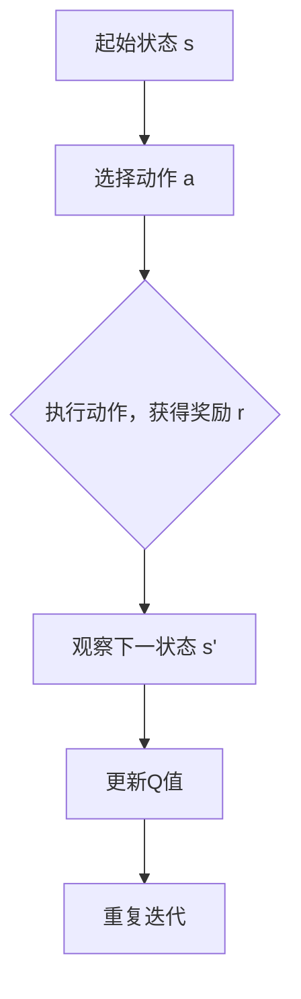
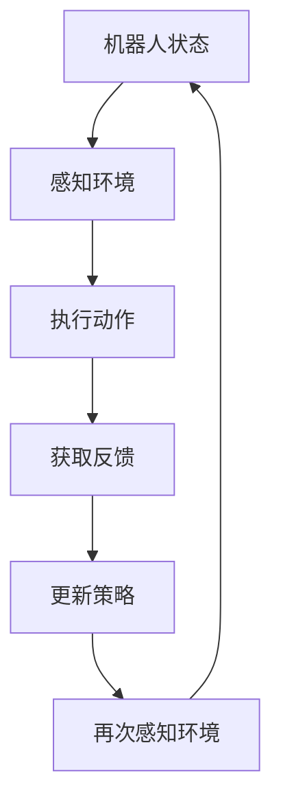

                 

### 《强化学习在机器人控制中的应用前景》

**关键词：强化学习，机器人控制，路径规划，抓取，感知，交互，复杂环境，多机器人系统**

**摘要：** 本文深入探讨了强化学习在机器人控制中的应用前景，从基础概念、核心算法到实际应用案例，全面解析了强化学习在机器人路径规划、抓取、感知和交互中的关键角色。本文还探讨了强化学习在复杂环境和多机器人系统中的应用，展望了其未来发展方向。

**目录**

**第一部分：强化学习基础**

## 第1章 强化学习概述

### 1.1 强化学习的定义

强化学习是一种通过试错来学习如何在特定环境中采取行动的机器学习范式。它通过奖励机制来指导学习过程，从而不断优化策略，实现长期目标。

### 1.2 强化学习的特点

- **奖励机制**：强化学习通过奖励信号来评价每个动作的效果，从而引导学习过程。
- **自适应**：强化学习能够根据环境变化自适应调整策略。
- **状态-动作值函数**：强化学习通过状态-动作值函数来评估每个状态下的最佳动作。

### 1.3 强化学习的基本原理

- **状态（State）**：描述机器人当前所处的环境。
- **动作（Action）**：机器人可以采取的行为。
- **奖励（Reward）**：对机器人行动的评价。
- **策略（Policy）**：机器人如何选择动作的规则。
- **价值函数（Value Function）**：预测在特定状态下执行特定策略的长期奖励。

### 1.4 强化学习的关键术语

- **Q值（Q-Value）**：在某个状态下采取某个动作的长期奖励预测。
- **策略（Policy）**：决定在特定状态下采取哪个动作的规则。
- **探索（Exploration）**：在不确定的情况下尝试新动作以获得更多信息。
- **利用（Utilization）**：根据已获得的奖励信号来选择最佳动作。

## 第2章 强化学习算法原理

### 2.1 Q-Learning算法

Q-Learning算法是一种通过更新状态-动作值函数来学习最佳动作选择的方法。其核心思想是通过试错来逐步优化Q值。

- **算法原理**：
  $$ Q(s, a) = Q(s, a) + \alpha [r + \gamma \max_{a'} Q(s', a') - Q(s, a)] $$
- **伪代码**：
  ```python
  for each episode:
      s = env.reset()
      while not done:
          a = choose_action(s, epsilon)
          s', r = env.step(a)
          Q[s, a] = Q[s, a] + alpha * (r + gamma * max(Q[s', a']) - Q[s, a])
          s = s'
          done = env.is_done()
  ```

### 2.2 Sarsa算法

Sarsa算法是一种同时更新当前状态和下一个状态的动作值的方法。

- **算法原理**：
  $$ Q(s, a) = Q(s, a) + \alpha [r + \gamma Q(s', a')] $$
- **伪代码**：
  ```python
  for each episode:
      s = env.reset()
      while not done:
          a = choose_action(s, epsilon)
          s', r = env.step(a)
          a' = choose_action(s', epsilon)
          Q[s, a] = Q[s, a] + alpha * (r + gamma * Q[s', a'] - Q[s, a])
          s = s'
          done = env.is_done()
  ```

### 2.3 Deep Q Network (DQN)算法

DQN算法使用深度神经网络来近似状态-动作值函数。

- **算法原理**：
  $$ Q(s, a) = \hat{Q}(s, a) $$
- **伪代码**：
  ```python
  for each episode:
      s = env.reset()
      while not done:
          a = choose_action(s, epsilon)
          s', r = env.step(a)
          target_Q[s', a] = r + gamma * max(target_Q[s'])
          Q[s, a] = (1 - learning_rate) * Q[s, a] + learning_rate * target_Q[s', a]
          s = s'
          done = env.is_done()
  ```

### 2.4 Policy Gradient算法

Policy Gradient算法直接优化策略，通过最大化期望奖励来更新策略。

- **算法原理**：
  $$ \nabla_{\theta} J(\pi(\theta)) = \nabla_{\theta} \sum_{s,a} \pi(a|s;\theta) \cdot r(s,a) $$
- **伪代码**：
  ```python
  for each episode:
      s = env.reset()
      while not done:
          a = policy.choose_action(s, \theta)
          s', r = env.step(a)
          loss = -r * log(policy(a|s; \theta))
          policy.update_params(loss)
          s = s'
          done = env.is_done()
  ```

### 2.5 Actor-Critic算法

Actor-Critic算法同时更新策略和价值函数，以提高学习效率。

- **算法原理**：
  $$ \nabla_{\theta} J(\pi(\theta)) = \nabla_{\theta} \sum_{s,a} \pi(a|s;\theta) \cdot r(s,a) $$
- **伪代码**：
  ```python
  for each episode:
      s = env.reset()
      while not done:
          a = actor.choose_action(s, policy)
          s', r = env.step(a)
          critic.update_value(s, a, r, s')
          actor.update_policy(s, a, r, s')
          s = s'
          done = env.is_done()
  ```

## 第3章 强化学习在机器人控制中的应用

### 3.1 机器人控制中的挑战

机器人控制面临的主要挑战包括动态环境、不确定性和长时间规划。

### 3.2 强化学习在机器人路径规划中的应用

强化学习可以通过试错方式来优化机器人在复杂环境中的路径规划。以下是一个简单的路径规划流程：



### 3.3 强化学习在机器人抓取中的应用

强化学习可以帮助机器人学习如何抓取不同形状和大小的物体。以下是一个抓取流程的简化表示：



### 3.4 强化学习在机器人感知中的应用

强化学习可以通过感知数据来优化机器人的行为，从而提高其响应速度和准确性。例如，可以使用强化学习来调整机器人的传感器配置，使其更好地适应环境变化。

### 3.5 强化学习在机器人交互中的应用

强化学习可以帮助机器人学习如何与人类或其他机器人有效交互。这包括理解人类意图、适应用户行为和提供合适的服务。

## 第4章 强化学习在机器人控制中的实现

### 4.1 强化学习算法的选择

在选择强化学习算法时，需要考虑问题的性质、环境和性能要求。以下是一些常见的算法选择：

- **Q-Learning**：适用于简单的环境，但不适用于复杂和不确定的环境。
- **Sarsa**：适用于需要同时考虑当前和未来奖励的任务。
- **DQN**：适用于具有高维状态空间和动作空间的问题。
- **Policy Gradient**：适用于需要直接优化策略的问题。
- **Actor-Critic**：适用于需要同时优化策略和价值函数的问题。

### 4.2 强化学习在机器人控制中的实现步骤

强化学习在机器人控制中的实现通常包括以下步骤：

1. **定义状态空间和动作空间**：根据问题的需求，定义机器人的状态和可执行动作。
2. **选择强化学习算法**：根据问题的特点和性能要求，选择合适的算法。
3. **构建环境和模型**：创建一个模拟环境，用于模拟机器人在真实环境中的行为。
4. **训练强化学习模型**：使用模拟环境训练强化学习模型，使其能够预测最佳动作。
5. **评估和优化模型**：评估模型在真实环境中的性能，并根据反馈进行优化。

### 4.3 机器人控制中的强化学习优化

为了提高强化学习在机器人控制中的性能，可以采用以下优化策略：

- **奖励设计**：设计合理的奖励机制，以激励机器人学习。
- **探索策略**：采用探索策略，使机器人能够从经验中学习。
- **模型更新**：定期更新模型，以适应环境变化。
- **多任务学习**：通过多任务学习，提高机器人的泛化能力。

## 第5章 强化学习在机器人控制中的性能评估

### 5.1 性能评估指标

在评估强化学习在机器人控制中的性能时，可以采用以下指标：

- **平均奖励**：衡量机器人完成任务的质量。
- **完成任务的时间**：衡量机器人完成任务的速度。
- **任务成功率**：衡量机器人完成任务的成功率。
- **稳定性**：衡量机器人在不同环境下的稳定性。

### 5.2 机器人控制任务中的性能评估

在机器人控制任务中，可以采用以下方法进行性能评估：

1. **离线评估**：使用历史数据对模型进行评估。
2. **在线评估**：在真实环境中实时评估模型的性能。
3. **对比实验**：与其他算法进行对比实验，评估其性能差异。

### 5.3 实验设计与数据分析

在实验设计中，需要考虑以下因素：

- **环境设置**：选择适合的问题环境。
- **算法选择**：选择合适的强化学习算法。
- **实验参数**：设置合适的探索策略、学习率和奖励函数。
- **数据分析**：使用统计方法对实验结果进行分析。

## 第6章 强化学习在机器人控制中的前沿应用

### 6.1 强化学习在复杂环境中的应用

复杂环境中的强化学习应用，如多机器人协同、动态环境适应和不确定决策，是当前研究的热点。

### 6.2 强化学习在多机器人系统中的应用

多机器人系统中的强化学习应用，如路径规划、资源分配和任务分配，可以提高系统的效率和灵活性。

### 6.3 强化学习在机器人与人类交互中的应用

机器人与人类交互中的强化学习应用，如社交机器人、智能家居和医疗辅助，可以提高机器人的交互能力和用户体验。

### 6.4 强化学习在机器人自主决策中的应用

机器人自主决策中的强化学习应用，如自主导航、任务规划和决策支持，可以提高机器人的自主性和智能性。

## 第7章 强化学习在机器人控制中的挑战与展望

### 7.1 强化学习在机器人控制中的挑战

强化学习在机器人控制中面临的挑战包括不确定性处理、长期规划、多机器人协同和人类交互等。

### 7.2 强化学习未来的发展方向

未来的强化学习发展方向包括更有效的算法、更灵活的策略、更强的鲁棒性和更广泛的应用场景。

### 7.3 强化学习在机器人控制中的应用前景

强化学习在机器人控制中的应用前景广阔，有望在未来实现更智能、更灵活和更自主的机器人系统。

## 附录

### 附录A：强化学习相关工具和资源

- **A.1 强化学习框架介绍**：介绍常见的强化学习框架，如OpenAI Gym、TensorFlow、PyTorch等。
- **A.2 强化学习实验环境搭建**：介绍如何搭建强化学习实验环境。
- **A.3 强化学习相关论文和书籍推荐**：推荐相关论文和书籍，以供进一步学习。

### 附录B：参考文献

- **B.1 强化学习经典论文**：介绍强化学习的经典论文。
- **B.2 机器人控制相关文献**：介绍强化学习在机器人控制中的应用文献。
- **B.3 学术会议和期刊**：介绍与强化学习相关的学术会议和期刊。

### 作者

**作者：AI天才研究院/AI Genius Institute & 禅与计算机程序设计艺术 /Zen And The Art of Computer Programming**

