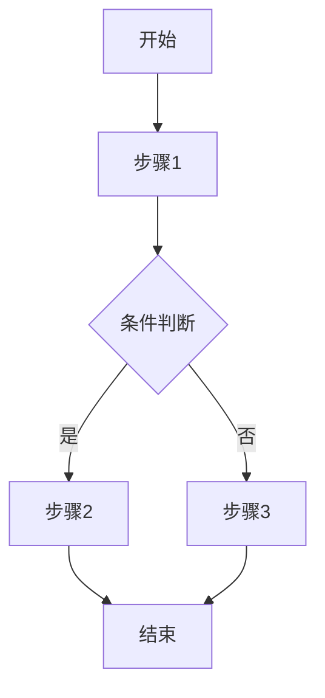

                 

## 《怎样善于总结和挖掘事物本质的能力》

### 关键词

- 总结能力
- 挖掘事物本质
- 结构化思维
- 深度思考
- 联想思维
- 技术工具
- 实践应用
- 案例分析

### 摘要

在快速变化的信息时代，善于总结和挖掘事物本质的能力变得尤为重要。本文旨在探讨如何提升这种能力，包括思维方法、技术工具和实际应用等多个方面。通过结构化思维、深度思考和联想思维等方法的介绍，结合具体案例的剖析，文章旨在帮助读者深入理解并掌握总结和挖掘事物本质的核心技巧，从而在个人成长和工作应用中取得更好的成效。

## 第1章 引言

### 1.1 书籍背景

在当今信息爆炸的时代，如何从海量信息中提取有价值的内容，并准确把握事物的本质，成为了一项关键能力。无论是个人学习、科研工作，还是商业决策，都需要这种能力。因此，本文旨在探讨如何通过系统的思维方法和工具，提升总结和挖掘事物本质的能力，帮助读者更好地应对复杂多变的现实环境。

### 1.2 书籍目标

本文的目标是：

1. 解析总结和挖掘事物本质的核心概念。
2. 介绍和阐述几种有效的思维方法，如结构化思维、深度思考和联想思维。
3. 介绍相关技术工具，如信息提取与分析工具、文本挖掘与自然语言处理技术。
4. 通过实际案例展示这些方法和技术在实际中的应用。
5. 为读者提供一套可操作的实践指南，帮助他们提升总结和挖掘事物本质的能力。

### 1.3 读者定位

本文适合以下读者群体：

- 对信息提取和深度分析有浓厚兴趣的科研人员。
- 希望提升工作效能和管理能力的职场人士。
- 从事教育和培训行业，希望提升教学效果的教育工作者。
- 对人工智能和自然语言处理技术有热情的程序员和开发者。
- 所有希望提升自身认知水平和思考能力的读者。

## 第2章 基础概念

### 2.1 总结与挖掘的本质

总结与挖掘事物本质的能力，是我们在面对复杂信息时，能够快速提取核心信息、把握事物本质的关键。总结，是对已有信息进行归纳、整理和提炼，以突出关键点，便于理解和记忆。而挖掘事物本质，则是通过深入分析和思考，寻找事物背后的规律和原理。

**定义：**

- **总结：** 对已知信息进行归纳、整理和提炼，以突出关键点，便于理解和记忆。
- **挖掘：** 深入分析事物，寻找其内在的规律、原理和本质。

**特点：**

- **高效性：** 通过总结和挖掘，可以在短时间内把握大量信息。
- **准确性：** 提升对事物本质的理解和把握，减少信息误解和偏差。
- **系统性：** 总结和挖掘的过程，可以帮助构建系统的知识体系。

### 2.2 事物本质的特征

事物本质具有以下特征：

- **稳定性：** 事物本质在不同情境下保持相对稳定，不易受外部因素干扰。
- **抽象性：** 事物本质是高度抽象的，往往无法直接观察到，需要通过深入分析才能揭示。
- **普遍性：** 事物本质具有普遍性，不仅适用于特定事物，也适用于其他类似事物。
- **关联性：** 事物本质之间存在着内在的联系和规律，通过挖掘本质，可以揭示这些关联性。

### 2.3 善于总结与挖掘的重要性

在信息爆炸的时代，善于总结和挖掘事物本质的能力显得尤为重要：

- **提高工作效率：** 通过总结和挖掘，可以快速提取关键信息，减少无效信息处理时间。
- **提升决策质量：** 准确把握事物本质，有助于做出更明智的决策。
- **增强创新能力：** 挖掘事物本质，有助于发现新问题和解决方案，推动创新。
- **优化知识管理：** 善于总结和挖掘，有助于构建系统的知识体系，提升知识管理水平。

## 第3章 思维方法

### 3.1 结构化思维

结构化思维是一种系统化、逻辑化的思考方式，它可以帮助我们将复杂的信息分解为更易理解和管理的小部分。结构化思维的核心是“先整体后局部”，即首先把握整体结构，然后逐步深入到各个局部，从而实现全面、深入的理解。

#### 3.1.1 结构化思维的原理

结构化思维的原理基于以下两个方面：

1. **层次分析法：** 将问题分解为多个层次，从宏观到微观，从整体到局部，逐步细化。
2. **关联性分析：** 通过分析各个部分之间的关联性，构建系统的整体结构。

#### 3.1.2 结构化思维的应用

结构化思维在多个领域都有广泛应用：

- **项目管理：** 通过结构化思维，可以将项目分解为多个任务，明确任务之间的依赖关系，从而更好地进行项目管理和协调。
- **知识管理：** 通过结构化思维，可以将知识体系分解为多个部分，构建系统的知识结构，便于知识的整理和传播。
- **问题解决：** 通过结构化思维，可以将复杂问题分解为多个子问题，逐一解决，从而找到全局性的解决方案。

### 3.2 深度思考

深度思考是一种深入探索问题本质的思考方式，它要求我们不仅仅停留在表面，而是要深入挖掘问题的内在逻辑和原理。深度思考的核心是“批判性思维”，即对已有的知识和观点进行审视和质疑。

#### 3.2.1 深度思考的方法

深度思考的方法包括：

1. **逻辑推理：** 通过逻辑推理，构建严密的思维链条，确保思考的严密性和逻辑性。
2. **数据验证：** 通过数据分析，验证思考的假设和结论，确保思考的准确性和可靠性。
3. **批判性思维：** 对已有的知识和观点进行审视和质疑，从而发现潜在的错误和不足。

#### 3.2.2 深度思考的技巧

深度思考的技巧包括：

1. **提问技巧：** 通过提问，引导思考深入问题的本质。
2. **假设与验证：** 通过假设和验证，确保思考的假设和结论是可靠的。
3. **反思与总结：** 通过反思和总结，不断提升深度思考的能力。

### 3.3 联想思维

联想思维是一种通过联想和类比，从一个事物推导出另一个事物的思考方式。它要求我们能够灵活地从一个问题联想到另一个相关的问题，从而实现创新和突破。

#### 3.3.1 联想思维的概念

联想思维的概念包括：

1. **横向联想：** 从一个事物联想到另一个与之相关的事物，从而发现新的关联和关系。
2. **纵向联想：** 从一个事物的过去、现在和未来进行联想，从而理解事物的发展规律。

#### 3.3.2 联想思维的实践

联想思维的实践包括：

1. **思维导图：** 通过绘制思维导图，将不同事物之间的关联和关系可视化，从而促进思考。
2. **类比推理：** 通过类比推理，从一个已知的事物推导出另一个未知的事物。
3. **跨界思考：** 通过跨界思考，将不同领域的知识进行整合，从而实现创新和突破。

## 第4章 技术工具

### 4.1 信息提取与分析工具

信息提取与分析工具是提升总结和挖掘事物本质能力的重要工具。这些工具可以帮助我们快速提取信息，并进行深度分析。

#### 4.1.1 信息提取工具

常见的用于信息提取的工具包括：

1. **自然语言处理（NLP）工具：** 如NLTK、spaCy等，这些工具可以提取文本中的关键词、句法结构等，帮助我们快速理解文本内容。
2. **数据挖掘工具：** 如Apache Mahout、Apache Flink等，这些工具可以用于大规模数据的分析和挖掘，帮助我们找到数据中的规律和模式。
3. **关键词提取工具：** 如jieba分词、TextRank等，这些工具可以用于提取文本中的关键词，帮助我们快速了解文本的核心内容。

#### 4.1.2 数据分析工具

常用的数据分析工具包括：

1. **统计分析工具：** 如Python的pandas、R等，这些工具可以用于数据的清洗、转换和分析，帮助我们提取数据中的有价值信息。
2. **可视化工具：** 如Matplotlib、Seaborn等，这些工具可以用于数据的可视化，帮助我们直观地理解数据。
3. **机器学习工具：** 如Scikit-learn、TensorFlow等，这些工具可以用于数据的建模和分析，帮助我们预测数据中的趋势和模式。

### 4.2 文本挖掘与自然语言处理

文本挖掘与自然语言处理（NLP）是提升总结和挖掘事物本质能力的重要技术手段。这些技术可以帮助我们理解和分析文本数据，从而提取有价值的信息。

#### 4.2.1 文本挖掘技术

文本挖掘技术包括：

1. **关键词提取：** 通过关键词提取，我们可以快速了解文本的核心内容。
2. **情感分析：** 通过情感分析，我们可以了解文本中表达的情感倾向。
3. **主题建模：** 通过主题建模，我们可以发现文本中的潜在主题和模式。
4. **实体识别：** 通过实体识别，我们可以识别文本中的关键实体，如人名、地名、机构名等。

#### 4.2.2 自然语言处理应用

自然语言处理技术在多个领域有广泛应用：

1. **搜索引擎：** 通过自然语言处理技术，搜索引擎可以更好地理解用户的查询意图，提供更精准的搜索结果。
2. **智能客服：** 通过自然语言处理技术，智能客服系统可以理解用户的问题，并给出合适的回答。
3. **文本摘要：** 通过文本挖掘和自然语言处理技术，我们可以自动生成文本摘要，帮助用户快速了解文本的核心内容。

## 第5章 实践应用

### 5.1 个人成长

#### 5.1.1 时间管理

时间管理是个人成长的重要一环，通过合理安排时间，我们可以更高效地完成任务，提升个人效能。以下是一些时间管理的方法和技巧：

1. **任务分解：** 将大任务分解为小任务，明确每个小任务的目标和时间要求。
2. **优先级排序：** 根据任务的紧急程度和重要性，对任务进行优先级排序。
3. **定时提醒：** 使用定时提醒工具，确保按时完成任务。
4. **专注工作：** 避免在工作时间处理无关事务，确保专注于当前任务。
5. **休息与调整：** 定期休息和调整，保持良好的身心状态，提高工作效率。

#### 5.1.2 学习方法

有效的学习方法可以大幅提升学习效果，以下是一些常用的学习方法：

1. **主动学习：** 通过主动思考和总结，将知识内化为自己的能力。
2. **分散学习：** 将学习时间分散，避免集中学习导致的疲劳和遗忘。
3. **联想记忆：** 通过联想和类比，将新知识与已有知识联系起来，增强记忆。
4. **实践应用：** 通过实践应用，将理论知识转化为实际能力。
5. **反馈与改进：** 通过反馈和反思，不断改进学习方法，提升学习效果。

### 5.2 工作应用

#### 5.2.1 团队协作

团队协作是工作中必不可少的一部分，以下是一些提升团队协作效率的方法：

1. **明确目标：** 确保团队成员明确团队的目标和任务，提高协作的针对性。
2. **沟通与协调：** 通过有效的沟通和协调，确保团队成员之间的信息畅通，减少误解和冲突。
3. **分工合作：** 根据团队成员的特长和技能，进行合理的分工，提高工作效率。
4. **定期反馈：** 定期进行团队反馈，了解团队成员的工作进展和问题，及时调整策略。
5. **信任与支持：** 建立信任，为团队成员提供支持和帮助，增强团队凝聚力。

#### 5.2.2 问题解决

在工作和生活中，问题无处不在。有效的问题解决能力可以大幅提升工作效能和生活质量。以下是一些问题解决的方法：

1. **分析问题：** 通过分析问题的原因和影响，明确问题的性质和程度。
2. **制定解决方案：** 根据问题的分析结果，制定具体的解决方案。
3. **实施解决方案：** 将解决方案转化为具体的行动，并确保执行到位。
4. **评估效果：** 对解决方案的实施效果进行评估，及时调整和改进。
5. **反思与总结：** 通过反思和总结，积累问题解决的经验和教训，提升问题解决能力。

## 第6章 案例分析

### 6.1 成功案例

#### 6.1.1 案例一：某公司通过数据挖掘提升销售额

某公司通过数据挖掘技术，对其客户数据进行了深入分析。通过分析客户购买历史、兴趣爱好等数据，该公司发现了一些潜在的销售机会。例如，对于经常购买特定产品的客户，公司针对性地推出促销活动，成功提升了销售额。这一案例展示了数据挖掘在提升销售额方面的应用。

#### 6.1.2 案例二：某大学通过深度学习提升教学质量

某大学利用深度学习技术，对学生的学习数据进行了分析。通过分析学生的学习行为、考试成绩等数据，该大学发现了一些影响教学质量的关键因素。例如，某些课程的教学方式可能需要改进，以适应学生的学习需求。这一案例展示了深度学习在提升教学质量方面的应用。

### 6.2 失败案例

#### 6.2.1 案例一：某公司盲目追求技术创新导致项目失败

某公司在技术研发过程中，盲目追求技术创新，忽视了市场需求和用户反馈。最终，该项目因产品不符合市场需求而失败。这一案例展示了在技术发展中，忽视市场需求和用户反馈可能导致失败。

#### 6.2.2 案例二：某企业缺乏有效的团队协作导致项目延误

某企业在项目实施过程中，缺乏有效的团队协作。团队成员之间的沟通不畅，导致项目进度延误，最终未能按时完成。这一案例展示了缺乏有效的团队协作可能导致项目失败。

## 第7章 总结与反思

### 7.1 学习总结

本文通过系统地介绍总结和挖掘事物本质的能力，包括思维方法、技术工具和实践应用等多个方面，旨在帮助读者提升这一关键能力。以下是本文的主要收获：

1. **理解总结与挖掘的本质：** 通过对总结和挖掘的定义和特点的阐述，读者可以更清晰地理解这一能力的核心。
2. **掌握思维方法：** 通过对结构化思维、深度思考和联想思维的介绍，读者可以学会如何运用这些方法来提升总结和挖掘的能力。
3. **了解技术工具：** 通过对信息提取与分析工具、文本挖掘与自然语言处理技术的介绍，读者可以了解如何利用技术手段来辅助总结和挖掘。
4. **实践应用：** 通过实际案例的剖析，读者可以看到总结和挖掘事物本质能力在实际中的应用，从而更好地理解和掌握这一能力。

### 7.1.1 遇到的问题

在撰写本文的过程中，也遇到了一些问题：

1. **内容深度与广度平衡：** 如何在保证内容深度的同时，兼顾内容的广度，是一个挑战。
2. **实际案例的选择：** 如何选择具有代表性的案例，以便更好地展示总结和挖掘事物本质能力在实际中的应用，是一个需要考虑的问题。
3. **技术细节的描述：** 在介绍技术工具时，如何平衡技术细节的描述和易于理解的程度，也是一个需要权衡的问题。

### 7.2 未来展望

在未来，本文可以进一步深化以下几个方面：

1. **案例研究：** 通过更多的案例研究，深入探讨总结和挖掘事物本质能力在不同领域的应用。
2. **技术演进：** 随着技术的不断演进，介绍和探讨最新的总结和挖掘技术，以及如何将这些新技术应用到实际中。
3. **方法优化：** 不断优化和更新总结和挖掘的方法，以适应快速变化的信息环境。
4. **跨学科研究：** 探讨总结和挖掘事物本质能力在跨学科领域的研究和应用，以推动这一领域的发展。

## 附录

### 附录 A 常用工具与资源

#### A.1 工具列表

- **自然语言处理工具：** NLTK、spaCy、Stanford NLP等。
- **数据分析工具：** Pandas、NumPy、Matplotlib等。
- **机器学习框架：** Scikit-learn、TensorFlow、PyTorch等。
- **项目管理工具：** Trello、Asana、Jira等。

#### A.2 资源链接

- **在线教程：** Coursera、edX、Udacity等在线教育平台。
- **技术博客：** Medium、Dev.to、AI Generated Stories等。
- **研究论文：** arXiv、IEEE Xplore、SpringerLink等。

### 附录 B Mermaid 流程图

#### B.1 Mermaid 简介

Mermaid 是一种基于文本的绘图工具，它可以用来绘制各种图表，如流程图、时序图、Gantt图等。它使用Markdown语法，使得绘制图表变得更加简单和直观。

#### B.2 Mermaid 使用实例

以下是一个简单的Mermaid流程图示例：



这个流程图描述了一个简单的流程，从开始到结束，包括条件判断和两个分支。通过这种方式，我们可以清晰地展示复杂的流程和逻辑。

### 附录 C 伪代码与数学公式

#### C.1 伪代码示例

以下是一个简单的伪代码示例，用于描述一个简单的数据处理过程：

```python
def process_data(data):
    """
    处理数据
    :param data: 数据集合
    :return: 处理后的数据
    """
    result = []
    for item in data:
        # 数据处理逻辑
        processed_item = item * 2
        result.append(processed_item)
    return result
```

#### C.2 数学公式示例

以下是一个数学公式示例，用于描述一个简单的线性回归模型：

$$
y = \beta_0 + \beta_1x
$$

其中，$y$ 是因变量，$x$ 是自变量，$\beta_0$ 和 $\beta_1$ 是模型的参数。

这些伪代码和数学公式示例，可以帮助读者更好地理解文章中的相关概念和算法。通过这些示例，读者可以更直观地看到如何使用伪代码和数学公式来描述和实现技术概念。这不仅有助于加深对概念的理解，也为实际编程和建模提供了参考。在未来的学习和实践中，读者可以结合这些示例，不断探索和尝试，提升自己的技术能力和逻辑思维。通过持续的努力和实践，读者可以逐渐掌握总结和挖掘事物本质的能力，从而在个人成长和职业发展中取得更好的成果。

