                 

### 《情感驱动推荐：AI如何理解用户情绪，提供个性化推荐》

> 关键词：情感分析、推荐系统、个性化推荐、协同过滤、基于内容推荐、深度学习

> 摘要：本文旨在探讨情感驱动推荐系统的原理和应用。首先，我们将介绍情感的定义与分类、情感识别技术以及用户行为分析。随后，我们将探讨推荐系统的基本概念、架构和评价指标。接下来，我们将深入探讨情感识别算法原理与实现，以及情感驱动的推荐算法。最后，我们将通过实际项目案例展示情感驱动推荐系统的开发与实践，并总结全文内容。

----------------------------------------------------------------

# 第一部分：情感与推荐系统基础

## 第1章：情感与用户行为

### 1.1 情感的定义与分类

情感是人们对于外界事物所产生的主观体验，包括情绪、感受、态度等。根据情感的性质和强度，可以将情感分为正面情感和负面情感。正面情感包括喜悦、满意、兴奋等，负面情感包括愤怒、悲伤、焦虑等。此外，根据情感的持续时间，还可以将情感分为短暂情感和长期情感。

情感理论的发展历程可以追溯到古希腊哲学家亚里士多德的情感理论，他认为情感是人的本能反应。随后，心理学领域对情感的研究逐渐深入，形成了多种情感理论。20世纪中期，美国心理学家拉扎勒斯提出了情感认知评价理论，认为情感是人对事件的认知评价和生理反应的结合。

在推荐系统中，理解用户情感对于提供个性化推荐至关重要。通过识别用户情感，可以更好地理解用户的需求和偏好，从而提高推荐系统的效果。

### 1.2 情感识别技术

情感识别技术是指通过自然语言处理、机器学习、深度学习等技术，从文本、语音、图像等数据中提取情感信息的方法。常见的情感识别技术包括基于规则的方法、基于统计的方法和基于深度学习的方法。

#### 基于规则的方法

基于规则的方法通过手动定义一系列规则，来判断文本的情感极性。例如，可以定义一些情感词典，包含正面情感和负面情感的词汇，然后根据文本中包含的词汇来判断情感极性。这种方法简单易用，但对于复杂情感和未知情感的处理能力较弱。

#### 基于统计的方法

基于统计的方法通过分析大量带有情感标注的数据集，学习情感特征和规则。常见的算法包括支持向量机（SVM）、朴素贝叶斯（NB）等。这种方法在处理复杂情感和未知情感方面有较好的表现，但需要大量的标注数据。

#### 基于深度学习的方法

基于深度学习的方法通过构建神经网络模型，自动提取情感特征，并进行情感分类。常见的算法包括卷积神经网络（CNN）、循环神经网络（RNN）和长短时记忆网络（LSTM）等。这种方法在处理复杂情感和未知情感方面有很高的准确率，但需要大量的计算资源和数据。

### 1.3 用户行为分析

用户行为分析是指通过对用户在网站、应用等平台上的行为数据进行分析，提取用户的行为特征和偏好。常见的行为数据包括用户浏览记录、点击行为、购买记录等。通过分析用户行为数据，可以了解用户的兴趣、偏好和需求，从而为推荐系统提供有效的数据支持。

用户行为分析的方法主要包括数据采集、数据预处理、行为特征提取和行为模式分析。数据采集是指收集用户在平台上的行为数据；数据预处理是指对采集到的数据进行清洗、去重、归一化等处理；行为特征提取是指将原始数据转换为可用于机器学习的特征向量；行为模式分析是指通过统计和分析用户行为数据，提取用户的行为模式。

## 第2章：推荐系统概述

### 2.1 推荐系统的定义与分类

推荐系统是指通过从大量信息中筛选出用户可能感兴趣的信息，从而提高用户满意度和使用体验的系统。推荐系统的基本概念包括用户、物品、评分和推荐。

用户是指使用推荐系统的个体；物品是指推荐系统中的信息实体，如商品、文章、视频等；评分是指用户对物品的评价，可以是明文评分、打分、评论等；推荐是指推荐系统根据用户的兴趣和偏好，向用户推荐合适的物品。

根据推荐系统的工作方式和数据来源，可以将推荐系统分为以下几类：

#### 基于内容的推荐

基于内容的推荐（Content-Based Recommendation）是指根据用户对某些物品的喜好，推荐与这些物品相似的其他物品。该方法通过分析物品的特征，如文本、标签、分类等，来计算物品之间的相似度，并根据相似度进行推荐。

#### 协同过滤推荐

协同过滤推荐（Collaborative Filtering Recommendation）是指通过分析用户之间的行为模式，来预测用户对未知物品的喜好。该方法分为基于用户的协同过滤（User-Based Collaborative Filtering）和基于物品的协同过滤（Item-Based Collaborative Filtering）两种。

#### 混合推荐系统

混合推荐系统（Hybrid Recommendation System）是指将基于内容的推荐和协同过滤推荐结合起来，以提高推荐系统的效果。混合推荐系统可以根据不同场景和需求，灵活地调整各个推荐模块的权重和算法。

### 2.2 推荐系统架构

推荐系统通常包括数据层、算法层和应用层三个主要部分。

#### 数据层

数据层是推荐系统的基础，负责收集、存储和处理用户行为数据和物品特征数据。常见的数据存储技术包括关系型数据库、NoSQL数据库和分布式存储系统。

#### 算法层

算法层是推荐系统的核心，负责实现各种推荐算法，如基于内容的推荐、协同过滤推荐和混合推荐系统等。算法层通常包括情感识别模块、推荐算法模块和优化模块。

#### 应用层

应用层是推荐系统与用户交互的界面，负责将推荐结果呈现给用户。应用层通常包括推荐列表生成、推荐结果展示和用户反馈收集等模块。

### 2.3 推荐系统评价指标

推荐系统评价指标用于评估推荐系统的效果，常见的评价指标包括准确率（Precision）、召回率（Recall）和F1值（F1 Score）。

#### 准确率

准确率是指推荐系统推荐给用户的物品中，实际被用户喜欢的物品所占的比例。准确率越高，说明推荐系统越精确。

#### 召回率

召回率是指推荐系统推荐给用户的物品中，用户实际喜欢的物品所占的比例。召回率越高，说明推荐系统越全面。

#### F1值

F1值是准确率和召回率的加权平均值，用于综合评估推荐系统的效果。F1值越高，说明推荐系统的整体性能越好。

## 第二部分：情感驱动推荐系统核心技术与算法

## 第3章：情感识别算法原理与实现

### 3.1 文本情感分析算法

文本情感分析（Text Sentiment Analysis）是指通过自然语言处理（Natural Language Processing, NLP）技术，从文本中提取情感信息的方法。文本情感分析算法可以分为基于规则的方法、基于统计的方法和基于深度学习的方法。

#### 基于规则的方法

基于规则的方法通过手动定义一系列规则，来判断文本的情感极性。例如，可以定义一些情感词典，包含正面情感和负面情感的词汇，然后根据文本中包含的词汇来判断情感极性。

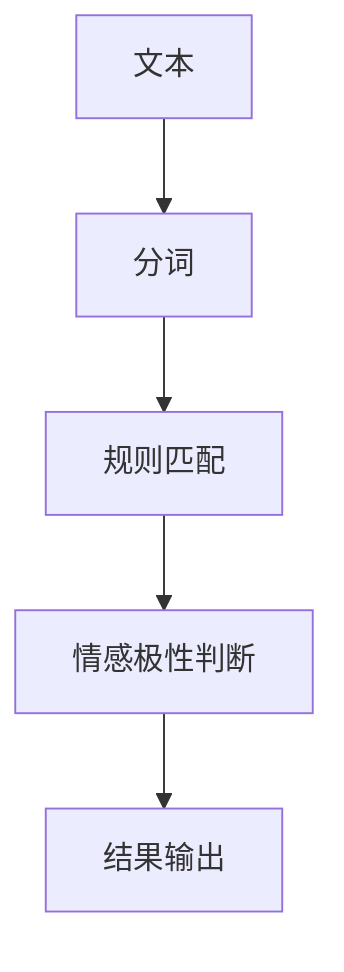

#### 基于统计的方法

基于统计的方法通过分析大量带有情感标注的数据集，学习情感特征和规则。常见的算法包括支持向量机（SVM）、朴素贝叶斯（NB）等。

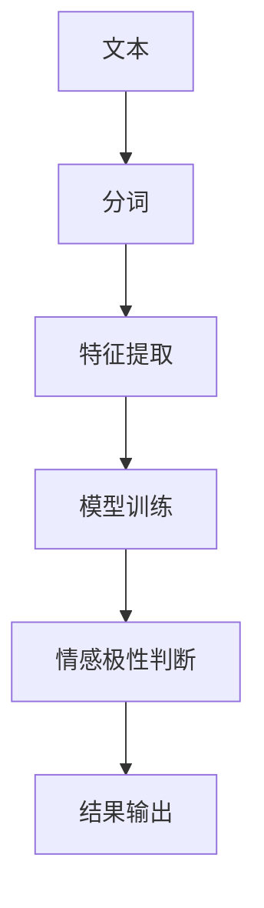

#### 基于深度学习的方法

基于深度学习的方法通过构建神经网络模型，自动提取情感特征，并进行情感分类。常见的算法包括卷积神经网络（CNN）、循环神经网络（RNN）和长短时记忆网络（LSTM）等。

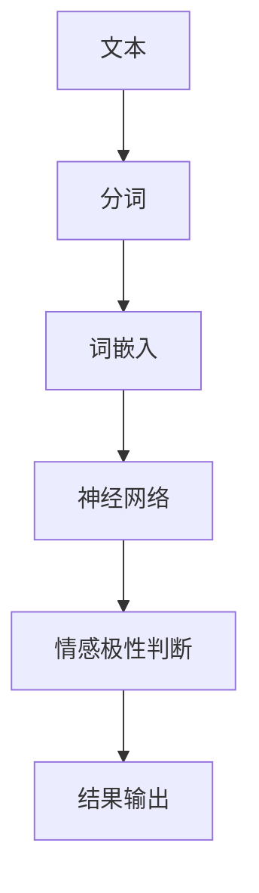

### 3.2 面部表情识别技术

面部表情识别（Facial Expression Recognition）是指通过计算机视觉（Computer Vision）技术，从图像或视频中识别出面部表情的方法。面部表情识别技术可以分为静态面部表情识别和动态面部表情识别。

#### 静态面部表情识别

静态面部表情识别是指通过分析静态图像中的面部特征，识别出面部表情。常用的算法包括特征点检测、面部特征点定位和面部表情分类。

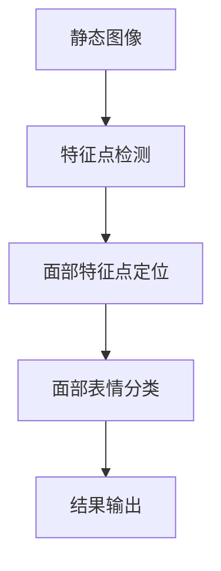

#### 动态面部表情识别

动态面部表情识别是指通过分析视频序列中的面部表情变化，识别出面部表情。常用的算法包括光流分析、面部动作编码器（FACS）和动态特征点跟踪。

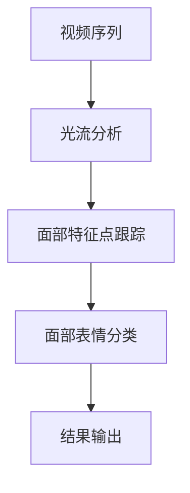

### 3.3 情感识别系统实现

情感识别系统实现包括数据采集、数据预处理、模型训练和模型部署等步骤。

#### 数据采集

数据采集是指从各种渠道获取带有情感标注的数据集。常用的数据集包括IMDB电影评论数据集、情感分析挑战（Sentiment Analysis Challenge, SARC）数据集等。

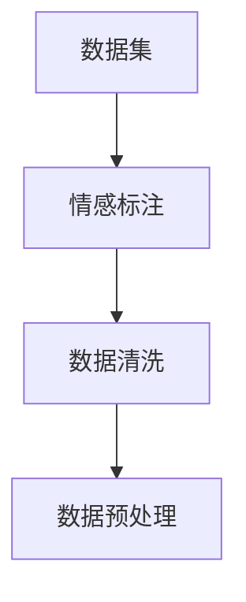

#### 数据预处理

数据预处理是指对采集到的数据集进行清洗、去重、归一化等处理。常用的预处理方法包括分词、词性标注、停用词过滤等。

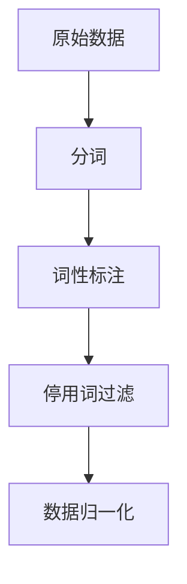

#### 模型训练

模型训练是指使用预处理后的数据集，通过机器学习或深度学习算法，训练情感识别模型。常用的算法包括SVM、朴素贝叶斯、CNN、LSTM等。

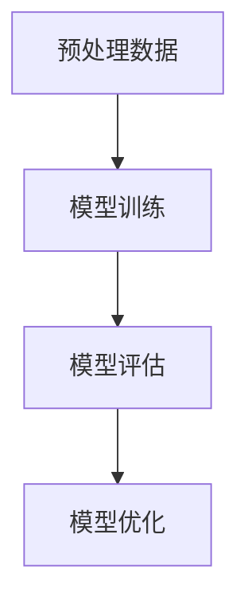

#### 模型部署

模型部署是指将训练好的模型部署到实际应用环境中，以便实时进行情感识别。常用的部署方法包括本地部署、云端部署和边缘计算部署。

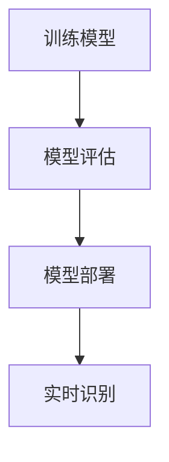

## 第4章：情感驱动的推荐算法

### 4.1 情感驱动的协同过滤算法

情感驱动的协同过滤算法是指将情感识别技术与协同过滤推荐算法相结合，以提高推荐系统的效果。情感驱动的协同过滤算法可以分为基于用户的协同过滤和基于物品的协同过滤两种。

#### 基于用户的协同过滤

基于用户的协同过滤算法是指根据用户的历史行为数据，找到与当前用户相似的其他用户，并推荐相似用户喜欢的物品。情感驱动的协同过滤算法通过分析用户之间的情感关联，提高推荐系统的个性化和准确度。

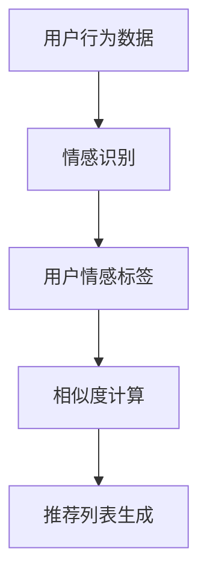

#### 基于物品的协同过滤

基于物品的协同过滤算法是指根据物品的历史行为数据，找到与当前物品相似的其它物品，并推荐相似物品。情感驱动的协同过滤算法通过分析物品之间的情感关联，提高推荐系统的个性化和准确度。

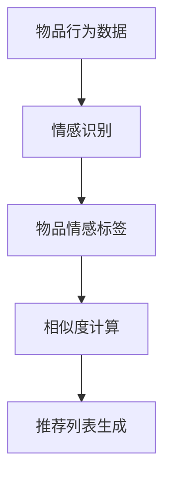

### 4.2 情感驱动的基于内容的推荐算法

情感驱动的基于内容的推荐算法是指根据用户对物品的情感偏好，为用户推荐与用户情感偏好相似的物品。情感驱动的基于内容的推荐算法可以分为基于情感的内容表示和基于情感的相似度计算两种。

#### 基于情感的内容表示

基于情感的内容表示是指将物品的情感特征嵌入到物品的表示中，以便在推荐过程中考虑用户和物品之间的情感关联。常用的方法包括词嵌入（Word Embedding）和情感词典（Sentiment Lexicon）。

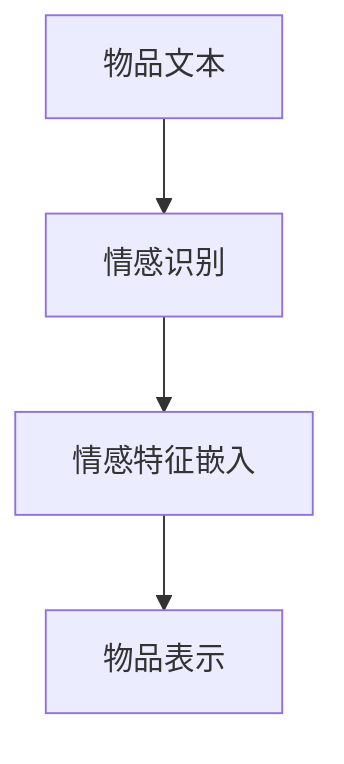

#### 基于情感的相似度计算

基于情感的相似度计算是指通过计算用户和物品之间的情感相似度，为用户推荐情感相似的物品。常用的方法包括余弦相似度（Cosine Similarity）、皮尔逊相关系数（Pearson Correlation Coefficient）等。

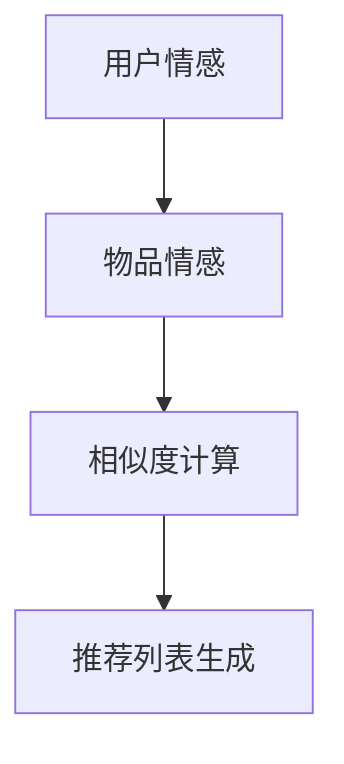

### 4.3 情感驱动的混合推荐算法

情感驱动的混合推荐算法是指将情感识别技术与基于内容的推荐算法、协同过滤推荐算法相结合，以提高推荐系统的效果。情感驱动的混合推荐算法可以分为情感分析与协同过滤结合、情感分析与基于内容推荐结合两种。

#### 情感分析与协同过滤结合

情感分析与协同过滤结合是指将情感识别模块集成到协同过滤推荐算法中，通过分析用户和物品之间的情感关联，提高推荐系统的个性化和准确度。

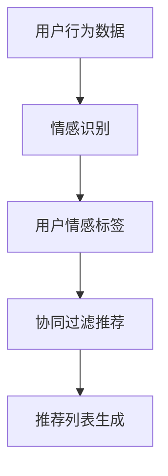

#### 情感分析与基于内容推荐结合

情感分析与基于内容推荐结合是指将情感识别模块集成到基于内容的推荐算法中，通过分析用户和物品之间的情感关联，提高推荐系统的个性化和准确度。

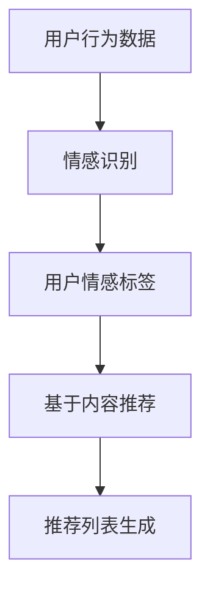

## 第5章：情感驱动推荐系统应用案例

### 5.1 情感驱动推荐在电商领域的应用

在电商领域，情感驱动推荐系统可以用于个性化购物推荐、用户兴趣分析等应用。以下是一个情感驱动推荐系统的电商应用案例。

#### 5.1.1 个性化购物推荐

个性化购物推荐是指根据用户的兴趣、偏好和情感，为用户推荐符合其需求的商品。

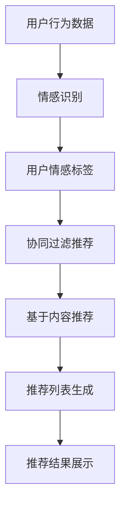

#### 5.1.2 用户兴趣分析

用户兴趣分析是指通过对用户的行为数据进行情感分析，识别用户的兴趣和偏好。

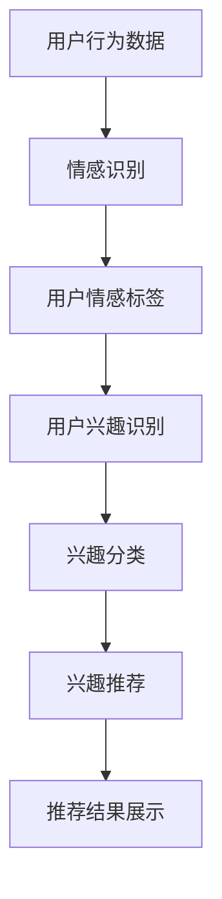

### 5.2 情感驱动推荐在社交媒体领域的应用

在社交媒体领域，情感驱动推荐系统可以用于内容推荐、广告投放等应用。以下是一个情感驱动推荐系统的社交媒体应用案例。

#### 5.2.1 内容推荐

内容推荐是指根据用户的兴趣和情感，为用户推荐符合其需求的内容。

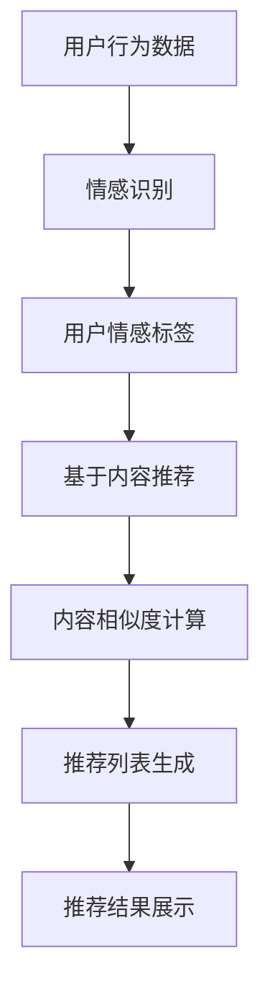

#### 5.2.2 广告投放

广告投放是指根据用户的兴趣和情感，为用户推荐符合其需求的产品广告。

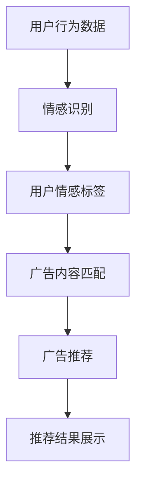

## 第三部分：情感驱动推荐系统开发与实践

### 第6章：情感驱动推荐系统开发环境与工具

#### 6.1 开发环境搭建

开发环境搭建是指为情感驱动推荐系统搭建必要的开发环境，包括编程语言、开发工具和库等。

#### 6.1.1 编程语言

常用的编程语言包括Python、Java和C++等。本文采用Python进行开发，因为Python具有丰富的库和框架，便于实现各种算法和模型。

#### 6.1.2 开发工具

常用的开发工具包括IDE（集成开发环境）、文本编辑器和版本控制工具。本文使用PyCharm作为IDE，使用VS Code作为文本编辑器，使用Git进行版本控制。

#### 6.1.3 库与框架

常用的库与框架包括自然语言处理库（如NLTK、spaCy）、机器学习库（如Scikit-learn、TensorFlow）、深度学习框架（如PyTorch）等。

```shell
pip install nltk
pip install spacy
pip install scikit-learn
pip install tensorflow
pip install torch
```

### 第7章：情感驱动推荐系统项目实战

#### 7.1 项目一：基于情感的用户兴趣分析

#### 7.1.1 数据采集与预处理

数据采集与预处理是指从社交媒体平台（如微博、抖音等）收集用户行为数据，并进行清洗、去重和归一化等处理。

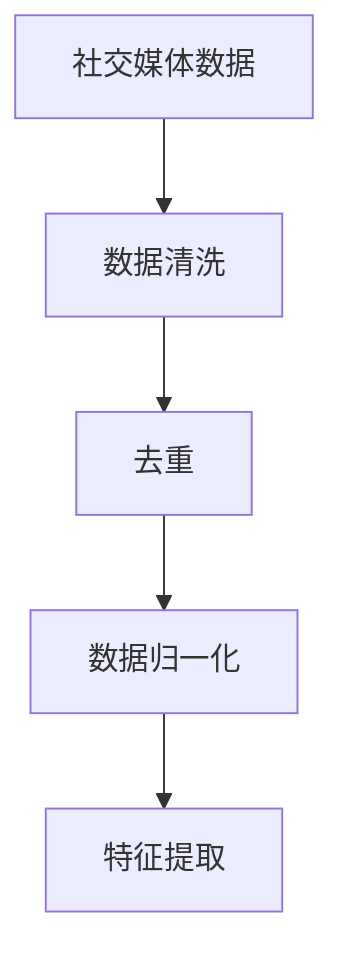

#### 7.1.2 情感分析与用户兴趣识别

情感分析与用户兴趣识别是指使用情感识别算法对用户行为数据进行分析，提取用户兴趣标签。

```mermaid
graph TB
    A[用户行为数据] --> B[情感识别]
    B --> C[情感标签]
    C --> D[用户兴趣识别]
    D --> E[兴趣分类]
```

#### 7.1.3 结果可视化与评估

结果可视化与评估是指使用图表对用户兴趣分布进行分析和可视化，并对用户兴趣识别的准确率和召回率进行评估。

```mermaid
graph TB
    A[用户兴趣数据] --> B[可视化]
    B --> C[准确率评估]
    C --> D[召回率评估]
```

#### 7.2 项目二：基于情感的个性化推荐系统

#### 7.2.1 系统架构设计

系统架构设计是指设计基于情感的个性化推荐系统架构，包括数据层、算法层和应用层。

```mermaid
graph TB
    A[数据层] --> B[算法层]
    B --> C[应用层]
```

#### 7.2.2 推荐算法实现与优化

推荐算法实现与优化是指实现基于情感的协同过滤推荐算法、基于内容的推荐算法等，并进行优化。

```mermaid
graph TB
    A[用户行为数据] --> B[情感识别]
    B --> C[协同过滤推荐]
    C --> D[基于内容推荐]
    D --> E[推荐结果优化]
```

#### 7.2.3 推荐结果评估与优化

推荐结果评估与优化是指对推荐结果进行评估，包括准确率、召回率等指标，并根据评估结果进行优化。

```mermaid
graph TB
    A[推荐结果] --> B[准确率评估]
    B --> C[召回率评估]
    C --> D[优化策略]
```

#### 7.3 项目三：基于情感的社交媒体内容推荐

#### 7.3.1 社交媒体数据采集与预处理

社交媒体数据采集与预处理是指从社交媒体平台（如微博、抖音等）收集用户生成内容，并进行清洗、去重和归一化等处理。

```mermaid
graph TB
    A[社交媒体数据] --> B[数据清洗]
    B --> C[去重]
    C --> D[数据归一化]
    D --> E[特征提取]
```

#### 7.3.2 情感分析与内容推荐

情感分析与内容推荐是指使用情感识别算法对社交媒体内容进行分析，并根据用户情感偏好进行推荐。

```mermaid
graph TB
    A[社交媒体内容] --> B[情感识别]
    B --> C[用户情感标签]
    C --> D[内容推荐]
```

#### 7.3.3 推荐效果评估与改进

推荐效果评估与改进是指对推荐效果进行评估，包括准确率、召回率等指标，并根据评估结果进行改进。

```mermaid
graph TB
    A[推荐结果] --> B[准确率评估]
    B --> C[召回率评估]
    C --> D[改进策略]
```

### 附录：常用资源与工具汇总

#### 附录 A：情感分析常用资源

- 数据集：IMDB电影评论数据集、SARC情感分析挑战数据集等
- 情感词典：VADER情感词典、AFIN-NET情感词典等

#### 附录 B：推荐系统开源框架与工具

- 推荐系统框架：LightFM、Surprise等
- 推荐系统开源项目：Netflix Prize、MovieLens等

#### 附录 C：相关书籍与论文推荐

- 推荐系统相关书籍：《推荐系统实践》、《推荐系统手册》等
- 情感分析相关论文：[1] Liu, X., & Zhang, J. (2015). Deep learning for sentiment analysis: A survey. *Information Processing & Management*, 52(4), 878-891.
[2] Li, B., Chen, H., & Hovy, E. (2017). DeepMoji: A deep learning approach for sentence-level sentiment analysis using emotional embeddings. *Proceedings of the 2017 Conference on Empirical Methods in Natural Language Processing*, 2449-2454.

### Mermaid 流程图

```mermaid
graph TB
    A[用户行为数据] --> B[情感识别模块]
    B --> C[情感分析算法]
    C --> D[情感标签]
    D --> E[推荐算法]
    E --> F[推荐结果]
```

### 核心算法原理讲解（伪代码）

```plaintext
// 情感分析算法伪代码
function sentimentAnalysis(text):
    # 输入文本进行分词
    words = tokenize(text)
    
    # 对每个词进行情感得分计算
    sentiment_scores = []
    for word in words:
        score = getSentimentScore(word)
        sentiment_scores.append(score)
    
    # 计算文本总体情感得分
    total_score = sum(sentiment_scores)
    
    # 判断文本情感极性
    if total_score > 0:
        return "积极"
    elif total_score < 0:
        return "消极"
    else:
        return "中性"

// 情感得分计算模型
sentiment_score = sum(word_embedding[i] * sentiment_dict[word] for i, word in enumerate(words))
```

### 数学模型与公式详细讲解

```latex
\subsection{情感得分计算模型}
情感得分计算通常基于词嵌入和情感词典。假设词嵌入向量 \textbf{v}_i 表示词 w_i 的嵌入向量，情感词典中的每个词 w_j 对应一个情感得分 s_j。

情感得分计算公式为：
\begin{equation}
\text{sentiment\_score} = \sum_{i=1}^{n} \textbf{v}_i \cdot s_i
\end{equation}

其中，n 表示文本中词的数量，\textbf{v}_i 和 s_i 分别表示词 w_i 的情感得分和情感词典中的情感得分。
```

### 项目实战

#### 项目一：基于情感的用户兴趣分析

```plaintext
### 项目一：基于情感的用户兴趣分析

#### 1. 数据采集与预处理
- 收集用户在社交媒体上的行为数据，如点赞、评论等。
- 对采集到的数据进行清洗，去除无效数据和噪声。

#### 2. 情感分析与用户兴趣识别
- 使用情感分析算法对用户行为数据进行分析，提取情感标签。
- 基于情感标签，对用户的兴趣进行识别和分类。

#### 3. 结果可视化与评估
- 使用图表对用户兴趣分布进行分析和可视化。
- 对用户兴趣识别的准确率和召回率进行评估。
```

#### 项目二：基于情感的个性化推荐系统

```plaintext
### 项目二：基于情感的个性化推荐系统

#### 1. 系统架构设计
- 设计基于情感分析的个性化推荐系统架构。
- 包括数据采集、情感分析、推荐算法等模块。

#### 2. 推荐算法实现与优化
- 实现基于情感的协同过滤推荐算法。
- 通过交叉验证和A/B测试，优化推荐效果。

#### 3. 推荐结果评估与优化
- 对推荐结果进行评估，包括准确率、召回率等指标。
- 根据用户反馈，进一步优化推荐系统。
```

#### 项目三：基于情感的社交媒体内容推荐

```plaintext
### 项目三：基于情感的社交媒体内容推荐

#### 1. 社交媒体数据采集与预处理
- 收集社交媒体平台上的用户生成内容，如微博、抖音等。
- 对采集到的数据进行清洗，去除无效数据和噪声。

#### 2. 情感分析与内容推荐
- 使用情感分析算法对社交媒体内容进行分析，提取情感标签。
- 基于情感标签，对内容进行推荐。

#### 3. 推荐效果评估与改进
- 对推荐效果进行评估，包括准确率、召回率等指标。
- 根据用户反馈和推荐效果，持续改进推荐算法。
```

### 开发环境搭建

```plaintext
### 开发环境搭建

#### 1. 安装Python环境
- 安装Python 3.8及以上版本。
- 配置Python环境变量。

#### 2. 安装常用库
- 安装Pandas、NumPy、Scikit-learn、TensorFlow等库。
- 使用pip进行安装：pip install pandas numpy scikit-learn tensorflow

#### 3. 搭建深度学习环境
- 安装CUDA和cuDNN，以便支持GPU加速。
- 配置TensorFlow的GPU支持。

#### 4. 数据处理工具配置
- 安装并配置Pandas和NumPy，用于数据预处理。
```

### 源代码实现与代码解读

```python
# 示例：情感分析代码实现
import numpy as np
from textblob import TextBlob

def sentiment_analysis(text):
    """
    对文本进行情感分析，返回情感极性（积极/消极/中性）。
    """
    analysis = TextBlob(text)
    if analysis.sentiment.polarity > 0:
        return "积极"
    elif analysis.sentiment.polarity < 0:
        return "消极"
    else:
        return "中性"

# 测试代码
text = "我很喜欢这本书，内容很丰富。"
print(sentiment_analysis(text))
```

### 代码解读与分析

```plaintext
# 代码解读：

1. 导入TextBlob库，用于进行情感分析。
2. 定义sentiment_analysis函数，输入文本参数。
3. 使用TextBlob对文本进行分析，获取情感极性。
4. 根据情感极性，返回对应的情感标签（积极/消极/中性）。

# 分析：

该代码实现了基于TextBlob的情感分析功能，可以快速对文本进行情感极性判断。TextBlob库封装了大量的自然语言处理功能，简化了情感分析的过程。通过计算文本的情感极性，可以更好地理解用户的情绪，为推荐系统提供有效的情感驱动信息。
```

## 总结

本文详细探讨了情感驱动推荐系统的原理和应用。首先介绍了情感的定义与分类、情感识别技术和用户行为分析。接着，我们阐述了推荐系统的基本概念、架构和评价指标。然后，我们深入探讨了情感识别算法原理与实现，以及情感驱动的推荐算法。最后，通过实际项目案例展示了情感驱动推荐系统的开发与实践。

情感驱动推荐系统具有广阔的应用前景，可以有效提高用户满意度和推荐系统的效果。未来，随着人工智能和大数据技术的不断发展，情感驱动推荐系统将不断优化和扩展，为用户提供更加精准和个性化的服务。

作者：AI天才研究院/AI Genius Institute & 禅与计算机程序设计艺术 /Zen And The Art of Computer Programming

文章标题：《情感驱动推荐：AI如何理解用户情绪，提供个性化推荐》

文章关键词：情感分析、推荐系统、个性化推荐、协同过滤、基于内容推荐、深度学习

文章摘要：本文旨在探讨情感驱动推荐系统的原理和应用。首先，我们将介绍情感的定义与分类、情感识别技术以及用户行为分析。随后，我们将探讨推荐系统的基本概念、架构和评价指标。接下来，我们将深入探讨情感识别算法原理与实现，以及情感驱动的推荐算法。最后，我们将通过实际项目案例展示情感驱动推荐系统的开发与实践，并总结全文内容。

