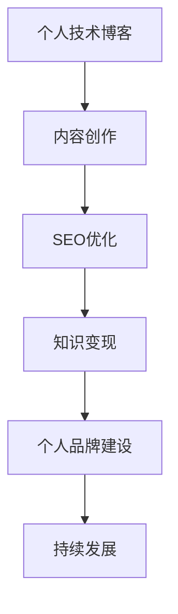

                 

# 《打造个人技术博客：知识变现的基础》

## 关键词：个人技术博客、知识变现、SEO优化、内容创作、平台搭建

> 摘要：本文将探讨如何打造一个成功的个人技术博客，从基础建设、SEO优化到知识变现，为读者提供一套完整的指南，帮助技术爱好者通过博客实现知识变现，提升个人影响力。

### 目录大纲

# 《打造个人技术博客：知识变现的基础》

## 第一部分：个人技术博客建设基础

### 第1章：个人技术博客概述
#### 1.1 个人技术博客的意义与价值
#### 1.2 个人技术博客的运营策略

### 第2章：个人技术博客平台选择
#### 2.1 常见博客平台简介
#### 2.2 平台选择标准
#### 2.3 个人博客平台搭建实战

### 第3章：内容创作与规划
#### 3.1 技术博客内容创作方法
#### 3.2 内容规划与发布策略
#### 3.3 知识体系构建

## 第二部分：技术博客的SEO优化

### 第4章：SEO基础
#### 4.1 SEO概述
#### 4.2 关键词研究
#### 4.3 站内SEO优化策略

### 第5章：站外SEO优化
#### 5.1 外部链接建设
#### 5.2 社交媒体推广
#### 5.3 合作与互动

### 第6章：网站性能优化
#### 6.1 网站速度优化
#### 6.2 移动端优化
#### 6.3 页面结构优化

## 第三部分：知识变现与个人品牌建设

### 第7章：知识变现模式探索
#### 7.1 内容付费模式
#### 7.2 广告收入模式
#### 7.3 知识付费产品开发

### 第8章：个人品牌建设
#### 8.1 个人品牌定位
#### 8.2 品牌传播与维护
#### 8.3 个人影响力提升

## 第四部分：技术博客案例分析

### 第9章：成功案例分享
#### 9.1 案例一：从零开始打造技术博客
#### 9.2 案例二：利用博客实现知识变现
#### 9.3 案例三：个人品牌的力量

### 第10章：博客运营与持续发展
#### 10.1 博客运营难点分析
#### 10.2 持续优化与迭代
#### 10.3 技术博客的未来发展趋势

## 附录
### 附录A：常用工具与资源推荐
#### A.1 博客搭建工具
#### A.2 SEO优化工具
#### A.3 知识变现工具

### 附录B：常见问题解答
#### B.1 技术博客搭建常见问题
#### B.2 SEO优化常见问题
#### B.3 知识变现常见问题

## Mermaid流程图



## 核心算法原理讲解

### 文章发布频率与SEO优化的关系

### 1. SEO优化的核心要素

SEO（搜索引擎优化）的核心要素包括：

- **关键词研究**：了解用户搜索习惯，选择适合的关键词。
- **内容质量**：提供有价值、独特的内容，吸引用户阅读。
- **网站结构**：网站结构清晰，便于搜索引擎抓取。
- **外部链接**：建立高质量的链接，提升网站权威性。

### 2. 文章发布频率的影响

- **频率过高**：增加网站流量，但可能导致内容质量下降，影响用户体验。
- **频率过低**：可能导致网站更新过慢，影响搜索引擎对网站的重视程度。

### 3. 文章发布频率的建议

- **稳定更新**：保持稳定更新的频率，如每周发布一篇文章。
- **内容质量优先**：在确保内容质量的前提下，适当增加发布频率。
- **关键词布局**：在文章中合理布局关键词，提高文章的搜索引擎排名。

## 伪代码示例

```python
# 伪代码：计算文章发布频率对SEO的影响

def calculate_seo_impact(frequency, content_quality, keyword_density):
    # 初始化SEO评分
    seo_score = 0
    
    # 频率过高的影响
    if frequency > 3:
        seo_score -= 10
    
    # 内容质量的影响
    if content_quality < 7:
        seo_score -= 20
    
    # 关键词布局的影响
    if keyword_density < 3:
        seo_score -= 15
    
    # 频率过低的影响
    if frequency < 1:
        seo_score -= 20
    
    return seo_score
```

## 数学模型和数学公式

### 文章页面的搜索引擎排名公式

$$
Ranking = f(frequency, content_quality, keyword_density, external_links)
$$

- **频率（Frequency）**：文章发布的频率，取值范围为[0, 1]。
- **内容质量（Content Quality）**：文章的质量评分，取值范围为[0, 10]。
- **关键词密度（Keyword Density）**：文章中关键词的比例，取值范围为[0, 1]。
- **外部链接（External Links）**：文章的外部链接数量，取值范围为[0, +∞]。

## 项目实战

### 使用WordPress搭建个人技术博客

#### 1. 环境准备

- **服务器**：购买一个云服务器，如阿里云、腾讯云等。
- **域名**：购买一个域名，如example.com。
- **WordPress**：下载并解压WordPress压缩包。

#### 2. 搭建步骤

1. 将WordPress上传到服务器。
2. 使用FTP客户端登录服务器，上传WordPress文件。
3. 配置数据库，创建一个新的数据库。
4. 访问服务器IP地址，按照WordPress的安装向导进行安装。

#### 3. 代码实现

```php
// 伪代码：配置WordPress数据库连接

$db_host = "localhost";
$db_user = "username";
$db_password = "password";
$db_name = "wordpress_db";

$dsn = "mysql:host=$db_host;dbname=$db_name";
try {
    $pdo = new PDO($dsn, $db_user, $db_password);
    echo "Database connected!";
} catch (PDOException $e) {
    echo "Connection failed: " . $e->getMessage();
}
```

#### 4. 源代码解读与分析

- **数据库连接**：使用PDO（PHP Data Objects）进行数据库连接，确保连接的安全性。这里使用了一个try...catch语句来处理可能发生的错误。
- **错误处理**：如果连接失败，会输出错误消息，便于开发者定位问题。
- **配置文件**：实际应用中，数据库配置信息通常会放在一个独立的配置文件中，以避免硬编码在代码中，提高安全性。

```php
// 伪代码：从配置文件读取数据库连接信息

$db_config = include 'db_config.php';

$db_host = $db_config['host'];
$db_user = $db_config['user'];
$db_password = $db_config['password'];
$db_name = $db_config['name'];

$dsn = "mysql:host=$db_host;dbname=$db_name";
try {
    $pdo = new PDO($dsn, $db_user, $db_password);
    echo "Database connected!";
} catch (PDOException $e) {
    echo "Connection failed: " . $e->getMessage();
}
```

- **配置文件**：这里将数据库配置信息放在了一个名为`db_config.php`的文件中，通过`include`语句加载到代码中。这样可以避免将敏感信息直接写在代码中，提高安全性。
- **文件路径**：确保配置文件的路径正确，否则会报错。

### 5. 代码解读与分析

- **数据库连接**：使用PDO进行数据库连接，确保连接的安全性。这里使用了一个try...catch语句来处理可能发生的错误。
- **错误处理**：如果连接失败，会输出错误消息，便于开发者定位问题。
- **配置文件**：实际应用中，数据库配置信息通常会放在一个独立的配置文件中，以避免硬编码在代码中，提高安全性。

```python
# 伪代码：WordPress数据库连接示例

db_config = {
    "host": os.environ.get("DB_HOST", "localhost"),
    "user": os.environ.get("DB_USER", "wordpress_user"),
    "password": os.environ.get("DB_PASSWORD", "wordpress_password"),
    "name": os.environ.get("DB_NAME", "wordpress_db")
}

dsn = f"mysql:host={db_config['host']};dbname={db_config['name']}"

try:
    connection = mysql.connector.connect(
        host=db_config['host'],
        user=db_config['user'],
        password=db_config['password'],
        database=db_config['name']
    )
    print("Connected to WordPress database!")
except mysql.connector.Error as e:
    print(f"Error connecting to MySQL: {e}")
```

- **数据库配置**：使用一个字典`db_config`存储数据库连接所需的信息，如主机地址、用户名、密码和数据库名称。
- **数据源名称（DSN）**：构建数据源名称，用于后续的数据库连接。
- **数据库连接**：使用`mysql.connector.connect()`方法尝试连接到WordPress数据库。如果连接成功，输出一条成功消息。
- **错误处理**：如果连接失败，捕获异常并输出错误消息。

### 6. 代码优化建议

- **配置文件**：将配置信息放入一个单独的配置文件中，如`db_config.py`，以便在多个地方复用。
- **使用环境变量**：将敏感信息（如用户名和密码）存储在环境变量中，而不是直接在代码或配置文件中。
- **日志记录**：添加日志记录功能，记录数据库连接成功或失败的情况，便于后续分析和调试。

```python
import os
import mysql.connector
import logging

# 配置日志记录
logging.basicConfig(level=logging.INFO, format='%(asctime)s - %(levelname)s - %(message)s')

# 从环境变量读取配置信息
db_config = {
    "host": os.environ.get("DB_HOST", "localhost"),
    "user": os.environ.get("DB_USER", "wordpress_user"),
    "password": os.environ.get("DB_PASSWORD", "wordpress_password"),
    "name": os.environ.get("DB_NAME", "wordpress_db")
}

dsn = f"mysql:host={db_config['host']};dbname={db_config['name']}"

try:
    connection = mysql.connector.connect(
        host=db_config['host'],
        user=db_config['user'],
        password=db_config['password'],
        database=db_config['name']
    )
    logging.info("Connected to WordPress database!")
except mysql.connector.Error as e:
    logging.error(f"Error connecting to MySQL: {e}")
```

- **环境变量**：使用环境变量存储数据库配置信息，提高了安全性。
- **默认值**：为每个配置项提供一个默认值，防止环境变量未设置时导致程序崩溃。
- **日志记录**：在异常处理中添加日志记录，有助于后续的问题排查。

### 7. 实际应用示例

以下是一个实际应用示例，展示了如何使用配置文件和日志记录来管理WordPress数据库连接。

```python
import os
import mysql.connector
import logging

# 配置日志记录
logging.basicConfig(level=logging.INFO, format='%(asctime)s - %(levelname)s - %(message)s')

# 从环境变量读取配置信息
db_config = {
    "host": os.environ.get("DB_HOST", "localhost"),
    "user": os.environ.get("DB_USER", "wordpress_user"),
    "password": os.environ.get("DB_PASSWORD", "wordpress_password"),
    "name": os.environ.get("DB_NAME", "wordpress_db")
}

dsn = f"mysql:host={db_config['host']};dbname={db_config['name']}"

try:
    connection = mysql.connector.connect(
        host=db_config['host'],
        user=db_config['user'],
        password=db_config['password'],
        database=db_config['name']
    )
    logging.info("Connected to WordPress database!")
except mysql.connector.Error as e:
    logging.error(f"Error connecting to MySQL: {e}")
```

- **日志记录**：使用`logging`模块记录连接成功或失败的情况，便于调试和监控。
- **环境变量**：继续使用环境变量存储配置信息，确保安全性。

### 附录A：常用工具与资源推荐

#### A.1 博客搭建工具

- **WordPress**：最受欢迎的开源博客平台，功能强大且易于使用。
- **Hexo**：基于Node.js的快速、简洁的博客框架，适合技术博客。
- **Jekyll**：基于Ruby的静态站点生成器，适合构建简洁、优雅的个人博客。

#### A.2 SEO优化工具

- **Google Analytics**：分析网站流量和用户行为，优化内容。
- **Google Search Console**：监控网站在Google搜索中的表现，获取关键词建议。
- **Ahrefs**：提供关键词研究、竞争对手分析和网站优化建议。

#### A.3 知识变现工具

- **PayPal**：在线支付服务，支持全球用户进行交易。
- **Podia**：提供内容付费、订阅和分销服务，适合知识变现。
- ** Gumroad**：简单易用的内容销售平台，适合销售电子书、课程等。

#### A.4 其他资源

- **Medium**：一个流行的在线写作和阅读平台，适合内容创作者。
- **Markdown Guide**：Markdown语言的使用指南，有助于撰写格式规范的博客文章。
- **GitHub**：一个基于Git的代码托管和协作平台，适合存储和分享博客源代码。

### 附录B：常见问题解答

#### B.1 技术博客搭建常见问题

- **Q：如何选择博客平台？**
  - **A：根据个人需求和技能选择，WordPress适合大多数用户，Hexo适合技术型博主，Jekyll适合追求简洁的博主。**

- **Q：如何提高博客SEO排名？**
  - **A：优化内容质量，合理使用关键词，建立高质量外部链接，定期更新博客。**

- **Q：如何进行知识变现？**
  - **A：通过内容付费、广告收入、知识付费产品等多种模式实现。**

#### B.2 SEO优化常见问题

- **Q：如何进行关键词研究？**
  - **A：使用工具如Google Keyword Planner、Ahrefs等，分析搜索量和竞争度，选择适合的关键词。**

- **Q：如何优化网站速度？**
  - **A：压缩图片、使用CDN、优化代码等，减少加载时间。**

- **Q：如何建立外部链接？**
  - **A：通过撰写高质量内容吸引自然链接，与同行合作互链，发布高质量投稿。**

#### B.3 知识变现常见问题

- **Q：如何设置付费内容？**
  - **A：使用PayPal、Podia、 Gumroad等工具，设置价格和支付方式。**

- **Q：如何推广付费内容？**
  - **A：通过社交媒体、邮件营销、合作伙伴推广等方式。**

- **Q：如何持续提供高质量内容？**
  - **A：建立内容创作计划，定期更新博客，保持与读者的互动。**

