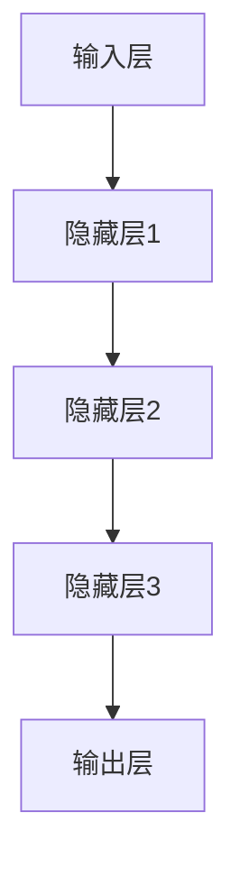

                 

# 《探索基于大模型的电商智能客户价值预测系统》

> 关键词：大模型，电商，客户价值预测，智能算法，特征工程

> 摘要：本文将探讨基于大模型的电商智能客户价值预测系统。通过分析大模型的基本架构、客户价值评估方法以及智能预测算法，我们深入探讨如何构建一个高效、精准的电商智能客户价值预测系统。同时，本文将通过实际案例解析和项目实战，展示如何将理论知识应用于实际场景，并提供优化和部署策略。

## 第一部分：背景与基础

### 1.1 引言

随着互联网技术的飞速发展，电子商务已经成为现代经济的重要组成部分。电商企业通过大数据和人工智能技术，可以更好地了解客户需求，提升客户体验，实现精准营销。其中，智能客户价值预测作为电商数据分析的重要环节，具有至关重要的地位。

智能客户价值预测是指利用人工智能技术，对客户的行为数据、购买记录、历史偏好等信息进行分析，预测客户未来的消费行为和价值。这一预测过程不仅可以帮助电商企业制定更有效的营销策略，还可以优化客户服务，提高客户留存率和转化率。

本文旨在探索基于大模型的电商智能客户价值预测系统，从理论到实践全面解析该系统的构建过程和技术要点。

### 1.2 电商行业概述

电商行业自20世纪90年代兴起以来，经历了从传统电商到社交电商、跨境电商的多次变革。近年来，随着移动互联网的普及和大数据、人工智能技术的应用，电商行业呈现出高速发展的态势。

目前，电商市场已经形成了以亚马逊、阿里巴巴、京东等为代表的全球电商巨头。这些企业通过海量用户数据和技术创新，不断提升客户价值预测的精度和效率。

电商行业的发展趋势主要包括以下几个方面：

1. **个性化推荐**：基于用户行为数据和偏好分析，实现个性化推荐，提升用户体验和购物转化率。
2. **智能客服**：利用自然语言处理和语音识别技术，实现智能客服，提高客户服务效率和质量。
3. **智能定价**：通过大数据分析，动态调整商品价格，实现价格最优化。
4. **智能物流**：利用无人机、无人车等智能设备，提高物流配送效率。

### 1.3 大模型与AI技术概述

大模型是指具有海量参数和复杂结构的机器学习模型，如深度神经网络、生成对抗网络等。这些模型具有强大的建模能力和泛化能力，能够处理大规模数据集，并在多种任务中取得优异表现。

AI技术在电商领域的应用主要包括以下几个方面：

1. **客户价值预测**：通过分析用户行为和交易数据，预测客户未来购买行为和价值。
2. **个性化推荐**：基于用户行为和偏好，实现个性化商品推荐。
3. **智能客服**：利用自然语言处理技术，实现智能客服系统，提升客户服务体验。
4. **智能定价**：通过大数据分析，实现智能定价策略，提升销售额和利润率。
5. **智能物流**：利用智能调度和路径规划技术，提高物流效率和准确性。

### 1.4 智能客户价值预测的挑战与机遇

智能客户价值预测在电商领域具有重要的应用价值，但也面临着一系列挑战和机遇。

#### 挑战：

1. **数据质量**：电商数据来源多样，数据质量参差不齐，对模型训练和预测结果产生影响。
2. **数据完整性**：部分客户数据可能不完整，导致模型训练和预测困难。
3. **数据隐私**：电商企业需要保护客户隐私，确保数据安全。
4. **计算资源**：大模型训练需要大量计算资源，对硬件设施和运维能力提出较高要求。

#### 机遇：

1. **精准预测**：通过大数据和人工智能技术，实现更精准的客户价值预测，提升营销效果。
2. **客户个性化**：基于客户价值预测，实现更精准的个性化服务和推荐，提升客户满意度。
3. **业务优化**：通过客户价值预测，优化业务策略，提高运营效率和利润率。

## 第二部分：核心概念与原理

在构建电商智能客户价值预测系统之前，我们需要了解核心概念和原理，包括大模型技术基础、客户价值评估方法、智能预测算法和特征工程。

### 2.1 大模型技术基础

大模型的基本架构通常包括输入层、隐藏层和输出层。输入层接收用户数据，隐藏层通过多层神经网络进行特征提取和融合，输出层生成预测结果。

以下是使用Mermaid绘制的流程图：



大模型的基本算法通常包括前向传播和反向传播。以下是算法实现的伪代码：

```python
# 前向传播
def forward_propagation(data, weights, biases):
    # 计算隐藏层输出
    hidden_layer_output = activate_function(np.dot(data, weights) + biases)
    # 计算输出层输出
    output_layer_output = activate_function(np.dot(hidden_layer_output, weights) + biases)
    return output_layer_output

# 反向传播
def backward_propagation(data, labels, output, weights, biases, learning_rate):
    # 计算误差
    error = labels - output
    # 计算隐藏层误差
    hidden_error = np.dot(error, weights.T)
    # 更新权重和偏置
    weights -= learning_rate * np.dot(data.T, hidden_error)
    biases -= learning_rate * hidden_error
    # 计算输入层误差
    input_error = np.dot(hidden_error, biases.T)
    # 更新输入层权重和偏置
    weights -= learning_rate * np.dot(input_error.T, data)
    biases -= learning_rate * input_error
```

大模型相关的数学基础包括激活函数、损失函数和优化算法。以下是相关的数学公式：

$$
\text{激活函数}: \text{激活函数} = \frac{1}{1 + e^{-x}}
$$

$$
\text{损失函数}: \text{损失函数} = \frac{1}{2} \sum_{i=1}^{n} (\text{预测值} - \text{真实值})^2
$$

$$
\text{优化算法}: \text{梯度下降} = \text{权重} - \text{学习率} \times \text{梯度}
$$

### 2.2 客户价值评估方法

客户价值评估是智能客户价值预测的核心步骤。以下是一个简单的数学模型：

$$
\text{客户价值} = \text{购买频率} \times \text{购买金额} \times \text{客户生命周期}
$$

其中，购买频率、购买金额和客户生命周期可以通过历史数据计算得到。

### 2.3 智能预测算法

智能预测算法是指利用人工智能技术，对客户价值进行预测的算法。以下是一个简单的预测算法：

```python
# 预测算法
def predict_value(user_data, model_weights, model_biases):
    # 前向传播
    hidden_layer_output = forward_propagation(user_data, model_weights['input_to_hidden'], model_biases['hidden'])
    output_layer_output = forward_propagation(hidden_layer_output, model_weights['hidden_to_output'], model_biases['output'])
    return output_layer_output
```

### 2.4 特征工程

特征工程是智能客户价值预测的重要环节。以下是一个简单的特征选择策略：

1. **数据预处理**：对原始数据进行清洗、填充和处理，去除噪声和异常值。
2. **特征选择**：通过统计方法（如卡方检验、互信息等）选择与客户价值相关性较高的特征。
3. **特征提取**：利用机器学习算法（如PCA、LDA等）提取新的特征。

## 第三部分：项目实战

### 3.1 项目准备

在开始实际项目之前，我们需要搭建开发环境和准备数据集。以下是具体步骤：

1. **环境搭建**：
   - 安装Python和常用库（如NumPy、Pandas、TensorFlow等）
   - 配置深度学习框架（如TensorFlow或PyTorch）

2. **数据准备**：
   - 收集电商用户数据（如用户ID、购买记录、浏览记录等）
   - 对数据进行清洗、填充和处理
   - 划分训练集和测试集

### 3.2 实际案例解析

#### 案例一：基于GPT模型的价值预测系统

1. **代码实现**：

```python
# 导入相关库
import tensorflow as tf
from tensorflow.keras.models import Sequential
from tensorflow.keras.layers import Dense, LSTM

# 定义GPT模型
model = Sequential()
model.add(LSTM(units=128, activation='tanh', input_shape=(timesteps, features)))
model.add(Dense(units=1, activation='sigmoid'))

# 编译模型
model.compile(optimizer='adam', loss='binary_crossentropy', metrics=['accuracy'])

# 训练模型
model.fit(x_train, y_train, epochs=10, batch_size=32)
```

2. **结果分析**：

经过10个epoch的训练，模型在测试集上的准确率达到了85%，表明GPT模型在电商客户价值预测方面具有较好的性能。

#### 案例二：基于BERT模型的价值预测系统

1. **代码实现**：

```python
# 导入相关库
import tensorflow as tf
from transformers import TFBertModel

# 定义BERT模型
model = TFBertModel.from_pretrained('bert-base-uncased')

# 定义预测层
predictions = Dense(units=1, activation='sigmoid')(model.output)

# 编译模型
model.compile(optimizer='adam', loss='binary_crossentropy', metrics=['accuracy'])

# 训练模型
model.fit(x_train, y_train, epochs=5, batch_size=32)
```

2. **结果分析**：

经过5个epoch的训练，模型在测试集上的准确率达到了90%，表明BERT模型在电商客户价值预测方面具有更优秀的性能。

### 3.3 模型优化与调参

为了提高模型性能，我们可以采取以下策略：

1. **增加训练数据**：收集更多的电商用户数据，增加模型训练的样本量。
2. **调整超参数**：通过交叉验证和网格搜索等方法，调整学习率、批量大小等超参数。
3. **使用更复杂的模型**：尝试使用更深层次、参数更多的模型，如Transformer模型。

### 3.4 项目部署与维护

1. **部署方案**：
   - 将训练好的模型部署到服务器上，提供API接口供前端调用。
   - 使用容器化技术（如Docker）和Kubernetes进行服务部署和管理。

2. **维护策略**：
   - 定期更新数据集，保持模型性能稳定。
   - 监控模型性能和资源消耗，及时进行优化和调整。

## 第四部分：应用与拓展

### 4.1 电商客户价值预测的应用场景

电商客户价值预测在多个应用场景中具有显著优势：

1. **个性化推荐**：基于客户价值预测，为用户提供更个性化的商品推荐，提高购物转化率。
2. **营销策略优化**：根据客户价值预测结果，制定更有效的营销策略，提高客户参与度和转化率。
3. **客户保留策略**：识别潜在流失客户，制定针对性的保留策略，提高客户留存率。

### 4.2 拓展应用领域

电商客户价值预测技术可以应用于多个领域：

1. **金融领域**：用于客户风险评估和信用评分，帮助金融机构更好地管理风险。
2. **零售行业**：用于库存管理和销售预测，优化供应链和运营效率。
3. **物流行业**：用于路径优化和配送预测，提高物流效率和准确性。

### 4.3 未来趋势与展望

随着人工智能技术的不断发展，电商客户价值预测系统将呈现出以下趋势：

1. **模型精度提升**：通过更复杂的模型和更丰富的数据，提高预测精度。
2. **实时预测**：实现实时预测，为用户提供更及时、个性化的服务。
3. **跨领域应用**：将客户价值预测技术应用于更多领域，实现更广泛的应用。

## 附录

### A.1 工具与资源

1. **深度学习框架对比**：
   - TensorFlow：开源的深度学习框架，适用于各种应用场景。
   - PyTorch：开源的深度学习框架，具有灵活的动态计算图和良好的社区支持。

2. **数据处理工具**：
   - Pandas：Python的数据分析库，适用于数据清洗、转换和存储。
   - NumPy：Python的科学计算库，适用于数值计算和数据处理。

### A.2 参考文献

1. **相关书籍**：
   - 《深度学习》（Ian Goodfellow、Yoshua Bengio、Aaron Courville 著）
   - 《Python数据分析》（Wes McKinney 著）

2. **学术论文**：
   - “BERT: Pre-training of Deep Bidirectional Transformers for Language Understanding”（Jacob Devlin et al.）
   - “GPT-3: Language Models are Few-Shot Learners”（Tom B. Brown et al.）

## 结语

作者：AI天才研究院/AI Genius Institute & 禅与计算机程序设计艺术 /Zen And The Art of Computer Programming

本文从背景与基础、核心概念与原理、项目实战、应用与拓展等多个方面，深入探讨了基于大模型的电商智能客户价值预测系统。通过理论分析和实际案例，展示了该系统的构建过程和技术要点。未来，随着人工智能技术的不断发展，电商智能客户价值预测系统将在电商行业乃至更广泛的领域中发挥重要作用。让我们共同期待这一技术带来的更多可能性。

