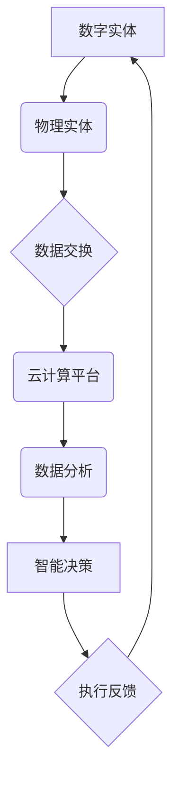

                 

### 文章标题：数字实体与物理实体的融合

> 关键词：数字实体，物理实体，融合，物联网，人工智能，智慧城市，智能制造

> 摘要：本文深入探讨了数字实体与物理实体的融合概念、技术基础、应用场景以及面临的挑战。通过详细的分析和实例讲解，揭示了数字实体与物理实体融合在现代社会中的重要性，以及如何通过物联网、人工智能等技术实现两者的深度融合，推动各行各业的创新发展。

----------------------------------------------------------------

### 目录大纲 - 《数字实体与物理实体的融合》

# 第一部分：引言与概述

## 第1章：数字实体与物理实体的融合概述

### 1.1 数字实体与物理实体的定义

### 1.2 融合的重要性

### 1.3 当前融合的发展趋势

## 第2章：数字化与物理世界的联系

### 2.1 数字化的起源与演变

### 2.2 物理世界的数字化需求

### 2.3 融合的必要性与机遇

# 第二部分：融合的技术基础

## 第3章：物联网（IoT）技术基础

### 3.1 IoT 的基本概念与架构

### 3.2 IoT 设备的类型与功能

### 3.3 IoT 数据的收集与处理

## 第4章：云计算与边缘计算

### 4.1 云计算的基本原理与应用

### 4.2 边缘计算的优势与挑战

### 4.3 云边缘协同机制

## 第5章：人工智能与机器学习

### 5.1 AI 的发展历程与核心技术

### 5.2 机器学习的理论基础

### 5.3 AI 在融合中的实际应用

# 第三部分：融合应用场景

## 第6章：智能制造

### 6.1 智能制造的概念与特点

### 6.2 工业物联网与智能工厂

### 6.3 智能制造的关键技术

## 第7章：智慧城市

### 7.1 智慧城市的概念与建设目标

### 7.2 物联网在城市管理中的应用

### 7.3 城市大数据分析与应用

## 第8章：智慧医疗

### 8.1 智慧医疗的现状与未来

### 8.2 物联网在医疗服务中的应用

### 8.3 AI 在智慧医疗中的突破

## 第9章：交通运输与物流

### 9.1 物联网在交通运输中的应用

### 9.2 自动驾驶技术的发展

### 9.3 智慧物流与供应链管理

# 第四部分：融合面临的问题与挑战

## 第10章：数据安全与隐私保护

### 10.1 融合环境下的数据安全风险

### 10.2 数据隐私保护法律法规

### 10.3 技术措施与解决方案

## 第11章：标准化与互操作性

### 11.1 融合标准的必要性

### 11.2 标准化组织与主要标准

### 11.3 互操作性的实现策略

## 第12章：融合的未来发展

### 12.1 融合技术的未来趋势

### 12.2 可持续发展的考虑

### 12.3 社会影响与伦理问题

# 附录

## 附录A：融合技术相关资源

### A.1 开源工具与平台

### A.2 学术研究论文与报告

### A.3 行业报告与市场分析

## 附录B：参考文献

### B.1 专著

### B.2 会议论文

### B.3 期刊论文

### Mermaid 流程图示例



### 核心算法原理讲解示例

#### 2.3.1 机器学习算法

```pseudo
Algorithm: Machine Learning Algorithm
Input: Data set, Features, Target
Output: Trained Model

1. Initialize model parameters
2. For each iteration:
   a. Split data set into training and validation sets
   b. Train model on training set
   c. Validate model on validation set
   d. Update model parameters based on validation performance
3. Repeat step 2 until convergence or maximum iterations reached
4. Test model on unseen data set
5. Evaluate model performance using metrics like accuracy, precision, recall, F1-score
```

### 数学模型与公式示例

#### 3.1.2 线性回归模型

$$
Y = \beta_0 + \beta_1 \cdot X + \epsilon
$$

其中，\(Y\) 是因变量，\(X\) 是自变量，\(\beta_0\) 和 \(\beta_1\) 是模型参数，\(\epsilon\) 是误差项。

### 项目实战示例

#### 第9章：交通运输与物流

##### 9.3 智慧物流与供应链管理

**项目背景：**某电商平台需要提升物流效率，降低成本，提高客户满意度。

**开发环境：**Python, Docker, Kubernetes, TensorFlow

**源代码实现：**

```python
# 伪代码：物流预测模型
import tensorflow as tf

# 模型参数
input_shape = (None, 10)  # 输入时间序列长度为10
hidden_units = 128
output_shape = 1  # 输出为一个预测值

# 模型构建
model = tf.keras.Sequential([
    tf.keras.layers.Dense(hidden_units, activation='relu', input_shape=input_shape),
    tf.keras.layers.Dense(output_shape)
])

# 模型编译
model.compile(optimizer='adam', loss='mse')

# 训练模型
model.fit(x_train, y_train, epochs=100, validation_data=(x_val, y_val))

# 预测物流需求
predictions = model.predict(x_test)

# 代码解读与分析
# ...（对代码的详细解释与分析）
```

**代码解读与分析：**以上代码展示了一个简单的物流需求预测模型，使用了 TensorFlow 框架构建了一个全连接神经网络。模型经过训练后，可以预测未来的物流需求，帮助电商平台优化库存和物流安排。代码的详细解读与分析将包括模型的架构、训练过程、预测结果解释等内容。

### 总结

数字实体与物理实体的融合是当今社会发展的一个重要趋势。通过物联网、人工智能、云计算等技术的应用，数字实体与物理实体之间的联系更加紧密，实现了信息的实时传递和智能处理。这一融合不仅提高了各行各业的效率，还带来了新的商业模式和用户体验。

在接下来的部分，我们将详细探讨数字实体与物理实体的定义、融合的重要性、技术基础、应用场景以及面临的挑战。通过深入分析，我们将揭示这一融合技术的本质，展望其未来的发展方向。希望本文能为您提供有价值的见解，助力您在数字实体与物理实体融合的领域取得突破。

