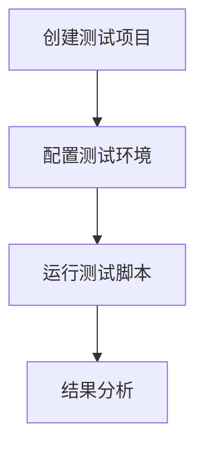
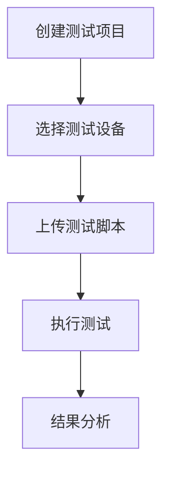
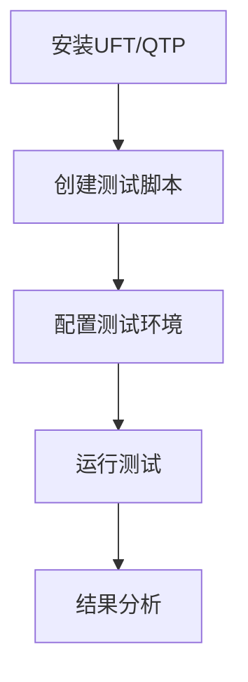
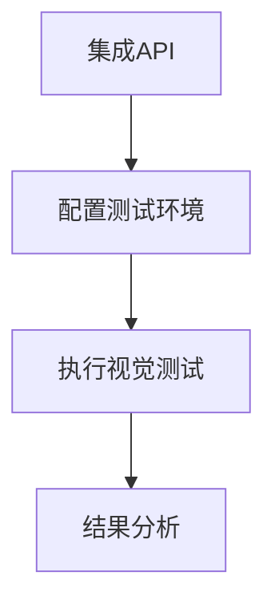

                 

# 数据集众测：众包模式重塑软件2.0测试

## 关键词
众包模式，数据集众测，软件测试，软件2.0，软件质量控制，众包测试工具，平台，案例分析，未来发展趋势

## 摘要
本文深入探讨了数据集众测这一新兴的众包模式在软件测试领域中的应用和重要性。首先，我们回顾了众包模式的起源与发展，探讨了其优势和挑战。接着，文章详细介绍了众包在软件测试中的应用，包括数据集的准备、测试任务的分配与执行、以及数据收集与质量评估。随后，我们介绍了众包测试中的常用工具与平台，并分析了数据集众测中面临的主要挑战及其应对策略。通过一系列案例，本文展示了数据集众测在实际项目中的应用效果。最后，文章展望了数据集众测的未来发展趋势，提出了实现其可持续发展的策略。

## 目录大纲设计

### 第一部分：众包模式概述

#### 第1章：众包模式的起源与发展
1.1 众包的定义
1.2 众包的发展历程
1.3 众包的优势与挑战

#### 第2章：众包在软件测试中的应用
2.1 众包测试的概念
2.2 众包测试的优势
2.3 众包测试的实践案例

#### 第3章：数据集众测的核心环节
3.1 数据集的准备
3.2 测试任务的分配与执行
3.3 数据收集与质量评估

#### 第4章：众包测试中的工具与平台
4.1 常见的众包测试工具
4.2 众包测试平台介绍
4.3 工具与平台的选择与使用

#### 第5章：众包测试中的挑战与应对
5.1 数据质量与可靠性问题
5.2 安全性与隐私保护
5.3 风险管理与质量控制

#### 第6章：数据集众测案例分析
6.1 案例一：某电商平台的众测实践
6.2 案例二：某金融软件的众测经验
6.3 案例三：某移动应用的众测效果

#### 第7章：数据集众测的未来发展趋势
7.1 众包测试技术的创新
7.2 众包测试在软件2.0中的应用前景
7.3 数据集众测的可持续发展策略

### 第二部分：数据集众测实践指南

#### 第8章：数据集众测项目规划
8.1 项目目标与需求分析
8.2 项目团队组建与分工
8.3 项目进度与风险管理

#### 第9章：数据集众测执行与监控
9.1 测试任务的执行
9.2 数据收集与质量监控
9.3 测试结果分析与反馈

#### 第10章：数据集众测报告与优化
10.1 测试报告编写
10.2 测试结果优化与迭代
10.3 众测经验总结与分享

#### 第11章：数据集众测实践案例分析
11.1 案例一：某物联网设备的众测实践
11.2 案例二：某智能家居软件的众测经验
11.3 案例三：某车联网平台的众测效果

#### 第12章：数据集众测的最佳实践
12.1 众测项目成功的关键因素
12.2 众测中的常见问题与解决方案
12.3 数据集众测的可持续发展之路

### 附录

#### 附录A：常用众包测试工具介绍
A.1 测试平台X的特点与使用方法
A.2 测试工具Y的优势与应用场景
A.3 其他常用测试工具简介

#### 附录B：数据集众测资源推荐
B.1 相关书籍推荐
B.2 在线课程与教程推荐
B.3 专业论坛与社群推荐

---

接下来，我们将分章节详细探讨数据集众测：众包模式重塑软件2.0测试的相关内容。每个章节都会通过逐步分析推理的方式，深入探讨其核心概念、原理、应用和实践。让我们开始这段深入的技术探讨之旅。

---

### 众包模式的起源与发展

#### 1.1 众包的定义

众包（Crowdsourcing）是一种通过互联网平台，将大规模的任务分配给分散的个体执行，以实现资源、知识和劳动力的共享和优化的模式。其核心理念是“集体智慧大于个体智慧”，通过众包，组织或个人能够利用广泛群体的力量，完成原本无法或难以依靠内部资源完成的任务。

#### 1.2 众包的发展历程

众包的概念最早可以追溯到2006年，由杰夫·豪在其同名书中首次提出。最初的众包主要应用于创意设计、科学研究等领域。随着时间的推移，众包模式逐渐扩展到包括软件开发、内容创作、市场研究、数据分析等更广泛的领域。

- **2000年代初期**：众包在创意设计领域兴起，如InnoCentive公司通过众包方式解决科学和工程问题。
- **2006年**：杰夫·豪出版《众包：创客的力量如何改变商业、世界和科学》，进一步推广了众包理念。
- **2010年代**：随着互联网技术的发展，众包逐渐应用于软件开发和测试领域，如GitHub、Topcoder等平台的出现。
- **2020年代**：随着人工智能和区块链技术的发展，众包模式在数据集众测、智能合约等领域得到了更广泛的应用。

#### 1.3 众包的优势与挑战

众包模式具有多方面的优势：

1. **成本效益**：通过众包，组织可以减少对内部资源和人员的需求，从而降低成本。
2. **创新性**：众包能够汇聚来自不同背景和领域的人才，促进创新和多样化的解决方案。
3. **质量保证**：广泛的参与者能够从不同的角度对任务进行审查和验证，提高结果的质量。
4. **快速迭代**：众包模式允许快速收集反馈，实现快速迭代和优化。

然而，众包模式也面临一些挑战：

1. **质量控制**：确保参与者的质量、任务的完成度和结果的准确性是一个重要问题。
2. **隐私保护**：在处理敏感数据时，如何保护参与者和数据的隐私是一个关键挑战。
3. **激励和公平性**：如何确保参与者的积极性和公平的回报分配是另一个需要考虑的问题。

在接下来的章节中，我们将进一步探讨众包模式在软件测试，尤其是数据集众测中的应用，以及其在软件2.0时代的重要性和潜力。

---

### 1.3 众包模式的优势与挑战

**优势**

**成本效益**：众包模式能够有效降低测试成本，通过利用广泛分散的参与者资源，组织可以避免大量的人力成本支出。具体来说，众包模式可以大大减少在人员培训、项目管理以及现场管理等方面的费用。

**创新性**：众包模式汇集了来自不同背景、不同专业领域的参与者，为测试任务带来了多样化的视角和创新的解决方案。这种多元化的参与不仅能够提高测试质量，还能够加速新技术的应用和创新。

**质量保证**：众包模式下的测试任务通常由多个参与者同时执行，从多个角度对软件进行测试，这有助于发现潜在的问题和漏洞。同时，众包模式允许快速反馈，测试结果可以立即被上传和共享，有助于快速迭代和优化。

**快速迭代**：众包模式能够迅速收集到大量反馈数据，使开发者能够快速响应和调整，实现快速迭代。这种高效的工作流程有助于缩短产品开发周期，提高市场响应速度。

**挑战**

**质量控制**：在众包模式下，参与者的背景和水平参差不齐，如何确保测试任务的质量和准确性是一个挑战。为了解决这个问题，需要建立严格的质量控制流程，包括测试标准的制定、参与者的筛选和反馈机制的完善。

**隐私保护**：在处理敏感数据时，隐私保护是一个关键问题。众包模式需要确保参与者的隐私和数据安全，避免数据泄露或滥用。这需要采取一系列数据加密、隐私保护措施，以及明确的数据使用协议。

**激励和公平性**：如何确保众包参与者的积极性和公平回报分配也是一个挑战。需要设计合理的激励机制，确保参与者能够获得合理的回报，同时保证整个测试过程的公平性。

**资源整合**：在众包模式下，如何有效地整合和管理来自不同参与者的资源和贡献，是一个复杂的问题。需要建立高效的沟通和协作机制，确保测试任务能够顺利执行。

在下一章节中，我们将探讨众包模式在软件测试中的应用，以及如何通过数据集众测提升软件的质量和可靠性。

---

### 第2章：众包在软件测试中的应用

#### 2.1 众包测试的概念

众包测试（Crowdsourced Testing）是指通过众包平台，将软件测试任务分配给广泛分散的参与者，以实现软件质量提升的过程。与传统的测试方法相比，众包测试利用了广泛的社会资源和集体智慧，不仅能够降低测试成本，还能够提高测试效率和测试质量。

众包测试的基本流程通常包括以下几个步骤：

1. **测试需求分析**：明确软件测试的目标和要求，包括功能测试、性能测试、兼容性测试等。
2. **测试任务分配**：将测试任务通过众包平台分配给合适的参与者，通常根据参与者的技能、经验和背景进行匹配。
3. **测试执行**：参与者根据分配的任务进行测试，并提交测试结果。
4. **数据收集与质量评估**：对提交的测试结果进行收集、整理和分析，评估测试质量和发现的问题。
5. **反馈与优化**：根据测试结果和反馈，对软件进行优化和迭代，以提高其质量和可靠性。

#### 2.2 众包测试的优势

**成本效益**：众包测试能够有效降低测试成本，通过利用广泛分散的参与者资源，组织可以避免大量的人力成本支出。具体来说，众包测试可以大大减少在人员培训、项目管理以及现场管理等方面的费用。

**多样性和覆盖率**：众包测试能够汇集来自不同背景和地域的参与者，从而提高测试的多样性和覆盖率。参与者可以在不同的操作系统、浏览器、设备和网络环境下进行测试，有助于发现更多潜在的问题和兼容性问题。

**快速反馈和迭代**：众包测试能够迅速收集到大量反馈数据，使开发者能够快速响应和调整，实现快速迭代。这种高效的工作流程有助于缩短产品开发周期，提高市场响应速度。

**质量保证**：众包测试通过多个参与者同时执行测试任务，从多个角度对软件进行测试，有助于提高测试质量和发现问题。同时，众包测试允许快速反馈，测试结果可以立即被上传和共享，有助于快速迭代和优化。

**社会参与和互动**：众包测试不仅有助于提高软件质量，还能够促进社会参与和互动。参与者通过参与测试任务，不仅能够提升自身的技能和经验，还能够对软件的发展和改进提出建设性的意见。

#### 2.3 众包测试的实践案例

**案例一：某电商平台的众测实践**

某知名电商平台在其新版本上线前，通过众包平台开展了为期两周的众测活动。平台发布了详细的测试需求和任务说明，吸引了数百名来自全球各地的测试参与者。参与者涵盖了不同的操作系统、浏览器和设备，从功能测试到性能测试，再到兼容性测试，全面覆盖了测试需求。

通过众包测试，平台成功发现了多个潜在的问题和漏洞，包括用户界面问题、性能瓶颈和兼容性问题。在收到测试反馈后，平台迅速进行了修复和优化，确保了新版本的稳定性和用户体验。

**案例二：某金融软件的众测经验**

某金融软件公司在其最新版本发布前，通过众包测试平台开展了为期一个月的众测活动。测试任务包括功能测试、性能测试、安全测试等多个方面，吸引了数十个国家的参与者。

通过众包测试，公司不仅发现了多个安全漏洞和性能瓶颈，还获得了来自不同地区和语言的反馈，帮助其优化用户体验和功能。测试结束后，公司对参与者进行了奖励，并对众测过程进行了总结和反思，为未来的众测活动提供了宝贵的经验。

**案例三：某移动应用的众测效果**

某移动应用开发团队在其新版本发布前，通过众包平台进行了为期两周的众测活动。测试任务主要集中在功能测试、性能测试和兼容性测试方面，吸引了数百名来自不同国家和地区的参与者。

众包测试帮助团队发现了多个功能问题和用户体验问题，同时优化了应用的性能和兼容性。测试结果还帮助团队调整了市场策略，提高了新版本的用户满意度。

通过以上实践案例，我们可以看到众包测试在提升软件质量和可靠性方面的重要性和有效性。众包测试不仅能够降低测试成本，提高测试效率和测试质量，还能够促进社会参与和互动，为软件发展和改进提供了有力的支持。

在下一章节中，我们将深入探讨数据集众测的核心环节，包括数据集的准备、测试任务的分配与执行，以及数据收集与质量评估。

---

### 2.1.1 数据集的准备

数据集的准备是数据集众测的关键环节，直接影响到后续测试任务的执行效果和测试结果的准确性。以下是数据集准备过程中需要考虑的关键步骤：

1. **数据清洗**：首先，需要确保数据集的质量。数据清洗包括处理缺失值、异常值和重复值，以及进行数据格式统一和数据规范化。这一步骤的目的是提高数据的一致性和可靠性，避免因为数据质量问题导致测试结果失真。

   **Mermaid流程图**：
   ```mermaid
   graph TD
   A[数据清洗] --> B[处理缺失值]
   B --> C[处理异常值]
   B --> D[处理重复值]
   B --> E[数据格式统一]
   B --> F[数据规范化]
   ```

2. **数据标注**：对于需要人工标注的数据集，如图像、文本和语音等，需要进行数据标注。数据标注的目的是为后续的测试任务提供正确的参考和标注，确保测试结果的准确性。标注过程通常需要专业的标注人员，并且需要确保标注的一致性和质量。

   **Mermaid流程图**：
   ```mermaid
   graph TD
   A[数据标注] --> B[图像标注]
   A --> C[文本标注]
   A --> D[语音标注]
   B --> E[标注一致性检查]
   C --> F[标注一致性检查]
   D --> G[标注一致性检查]
   ```

3. **数据划分**：将数据集划分为训练集、验证集和测试集。训练集用于训练模型，验证集用于调整模型参数和评估模型性能，测试集用于评估最终模型的性能。数据集的划分需要确保各部分数据具有代表性，避免数据偏斜。

   **Mermaid流程图**：
   ```mermaid
   graph TD
   A[数据划分] --> B[训练集]
   A --> C[验证集]
   A --> D[测试集]
   B --> E[数据预处理]
   C --> F[数据预处理]
   D --> G[数据预处理]
   ```

4. **数据备份与存储**：为了保证数据的安全性和可靠性，需要对数据进行备份，并选择合适的存储方案。数据备份可以采用分布式存储、云存储等方案，确保在数据丢失或损坏时能够快速恢复。

   **Mermaid流程图**：
   ```mermaid
   graph TD
   A[数据备份] --> B[分布式存储]
   A --> C[云存储]
   B --> D[数据恢复]
   C --> E[数据恢复]
   ```

**核心算法原理讲解**

数据清洗和数据标注是数据集准备的核心步骤，其算法原理如下：

1. **数据清洗**：
   - **缺失值处理**：使用均值填补、中位数填补或使用随机值填补等方法。
   - **异常值处理**：使用统计方法（如Z-Score、IQR等）检测并处理异常值。
   - **重复值处理**：使用去重算法（如哈希表）检测并去除重复值。
   - **数据格式统一**：使用数据转换工具（如pandas库）统一数据格式。

   **伪代码**：
   ```python
   def data_cleaning(data):
       # 缺失值处理
       data.fillna(method='mean', inplace=True)
       
       # 异常值处理
       z_scores = zscore(data)
       abs_z_scores = np.abs(z_scores)
       filtered_entries = (abs_z_scores < 3)
       data = data[filtered_entries]
       
       # 重复值处理
       data.drop_duplicates(inplace=True)
       
       # 数据格式统一
       data = data.astype(str)
       
       return data
   ```

2. **数据标注**：
   - **图像标注**：使用卷积神经网络（CNN）进行图像分类和标注。
   - **文本标注**：使用自然语言处理（NLP）技术进行文本分类和情感分析。
   - **语音标注**：使用深度学习模型（如RNN、CTC）进行语音识别和标注。

   **伪代码**：
   ```python
   def image_ANNOTATION(image):
       # 加载预训练的卷积神经网络模型
       model = load_model('cnn_model.h5')
       
       # 进行图像预处理
       preprocessed_image = preprocess_image(image)
       
       # 进行图像分类和标注
       prediction = model.predict(preprocessed_image)
       label = decode_prediction(prediction)
       
       return label
   
   def text_ANNOTATION(text):
       # 加载预训练的自然语言处理模型
       model = load_model('nlp_model.h5')
       
       # 进行文本预处理
       preprocessed_text = preprocess_text(text)
       
       # 进行文本分类和标注
       prediction = model.predict(preprocessed_text)
       label = decode_prediction(prediction)
       
       return label
   
   def voice_ANNOTATION(voice):
       # 加载预训练的深度学习模型
       model = load_model('voice_model.h5')
       
       # 进行语音预处理
       preprocessed_voice = preprocess_voice(voice)
       
       # 进行语音识别和标注
       transcription = model.transcribe(preprocessed_voice)
       
       return transcription
   ```

通过以上步骤，我们可以确保数据集的质量和可靠性，为后续的众测任务奠定坚实的基础。在下一章节中，我们将探讨测试任务的分配与执行过程，以及数据收集与质量评估的方法。

---

### 2.1.2 测试任务的分配与执行

在数据集众测中，测试任务的分配与执行是确保测试效果和质量的关键环节。以下是该环节的主要步骤和方法：

#### 测试任务的分配

1. **任务分解**：将整体测试任务分解为若干个具体的子任务，确保每个子任务具有明确的测试目标和可操作性。分解的任务应该涵盖各种测试类型，如功能测试、性能测试、兼容性测试等。

   **Mermaid流程图**：
   ```mermaid
   graph TD
   A[测试任务分解] --> B[功能测试]
   A --> C[性能测试]
   A --> D[兼容性测试]
   B --> E[子任务1]
   B --> F[子任务2]
   C --> G[子任务3]
   C --> H[子任务4]
   D --> I[子任务5]
   D --> J[子任务6]
   ```

2. **任务匹配**：根据参与者的技能、经验和设备特性，将适合的任务分配给对应的参与者。任务匹配的目的是确保每个参与者能够充分发挥其优势，同时避免因技能不匹配导致的任务完成度低或测试结果不准确。

   **伪代码**：
   ```python
   def match_tasks(participants, tasks):
       matched_tasks = {}
       for participant in participants:
           for task in tasks:
               if participant.skills.match(task.requirements):
                   matched_tasks[participant.id] = task
                   break
       return matched_tasks
   ```

3. **任务说明与培训**：向参与者提供详细的任务说明和操作指南，确保他们了解任务的目标、方法和要求。对于复杂或特殊的测试任务，还需要进行在线或离线的培训，帮助参与者熟悉测试工具和测试流程。

   **Mermaid流程图**：
   ```mermaid
   graph TD
   A[任务说明与培训] --> B[任务说明]
   A --> C[操作指南]
   A --> D[培训资料]
   ```

#### 测试任务的执行

1. **测试执行**：参与者根据分配的任务，使用指定的测试工具和平台进行测试。测试过程中，参与者需要记录详细的测试步骤、测试结果和发现的问题。

   **Mermaid流程图**：
   ```mermaid
   graph TD
   A[测试执行] --> B[测试工具使用]
   A --> C[测试步骤记录]
   A --> D[测试结果记录]
   ```

2. **实时反馈**：在测试执行过程中，参与者可以实时提交测试结果和反馈，测试管理平台可以自动收集和分析这些数据，帮助测试团队快速发现问题和进行优化。

   **伪代码**：
   ```python
   def submit_results(task_id, results):
       test_platform.submit(task_id, results)
   ```

3. **自动化测试**：对于可自动化的测试任务，可以使用自动化测试工具进行执行，提高测试效率和准确性。自动化测试工具可以与测试平台集成，实现测试任务的自动化分配和执行。

   **Mermaid流程图**：
   ```mermaid
   graph TD
   A[自动化测试] --> B[测试工具集成]
   A --> C[自动化执行]
   ```

#### 数据收集与质量评估

1. **数据收集**：测试结束后，测试管理平台将收集所有参与者的测试结果，包括测试步骤、测试数据、问题报告等。这些数据将被存储在数据库中，以供后续分析和评估。

   **伪代码**：
   ```python
   def collect_results():
       results = test_platform.collect_all_results()
       save_to_database(results)
   ```

2. **质量评估**：通过对收集到的测试结果进行分析，评估测试质量，包括测试覆盖率、问题发现率、测试效率等。质量评估可以帮助测试团队了解测试的有效性，发现潜在的改进点。

   **Mermaid流程图**：
   ```mermaid
   graph TD
   A[质量评估] --> B[测试覆盖率分析]
   A --> C[问题发现率分析]
   A --> D[测试效率分析]
   ```

3. **问题跟踪**：对于发现的测试问题，测试团队需要制定详细的跟踪计划，包括问题分类、优先级排序、修复方案等。通过问题跟踪，确保所有问题都能得到及时解决，提高软件的质量和稳定性。

   **伪代码**：
   ```python
   def track_issues(issues):
       issue_database.add_issues(issues)
       prioritize_issues(issues)
       assign_to_team_members(issues)
   ```

通过以上步骤，数据集众测的测试任务分配与执行过程能够得到有效管理，确保测试任务的顺利完成和测试结果的准确性。在下一章节中，我们将探讨众包测试中的工具与平台，以及如何选择和使用这些工具与平台。

---

### 第4章：众包测试中的工具与平台

#### 4.1 常见的众包测试工具

在众包测试中，选择合适的工具至关重要，这些工具能够帮助测试团队有效地管理和执行测试任务，提高测试效率和测试质量。以下是一些常见的众包测试工具：

1. **Sauce Labs**
   - **特点**：支持广泛的浏览器和操作系统，提供云端的自动化测试环境。
   - **使用方法**：用户可以在Sauce Labs的平台上创建测试项目，配置测试环境，并运行自动化测试脚本。
   - **应用场景**：适用于需要跨浏览器和跨平台测试的软件项目。

2. **BrowserStack**
   - **特点**：提供实时的远程浏览器测试环境，支持多种浏览器和操作系统。
   - **使用方法**：用户可以通过BrowserStack的Web界面创建测试项目，选择测试设备，并上传测试脚本。
   - **应用场景**：适用于移动应用和Web应用的兼容性测试。

3. **UFT/QTP**
   - **特点**：拥有强大的自动化测试功能，支持多种操作系统和应用程序。
   - **使用方法**：用户需要安装UFT/QTP软件，创建测试脚本，并运行测试。
   - **应用场景**：适用于复杂功能测试和回归测试。

4. **Applitools**
   - **特点**：提供视觉测试和验收测试，能够检测页面布局的差异。
   - **使用方法**：用户可以通过Applitools的API将测试集成到现有的测试流程中。
   - **应用场景**：适用于前端开发中的视觉测试。

#### 4.2 众包测试平台介绍

除了单独的测试工具，众包测试平台在协调和管理测试任务方面也发挥着重要作用。以下是一些流行的众包测试平台：

1. **TesterForge**
   - **特点**：提供众包测试服务，测试者可以参与任务并获得报酬。
   - **介绍**：TesterForge是一个全球性的测试者社区，企业可以在平台上发布测试任务，测试者可以自由参与并提交测试结果。
   - **应用场景**：适用于需要大量测试资源和多样化测试场景的项目。

2. **Testbirds**
   - **特点**：提供移动应用和Web应用的众包测试服务，支持多种设备类型。
   - **介绍**：Testbirds专注于移动应用的测试，提供包括功能测试、性能测试和安全测试等多种服务。
   - **应用场景**：适用于移动应用开发中的各种测试需求。

3. **UserTesting**
   - **特点**：提供真实用户的测试服务，通过视频记录用户的使用体验。
   - **介绍**：UserTesting允许企业通过众包的方式获取真实用户的反馈，从而优化产品的用户体验。
   - **应用场景**：适用于用户体验测试和用户行为分析。

#### 4.3 工具与平台的选择与使用

**选择标准**

1. **测试需求**：根据项目的测试需求，选择能够满足特定测试需求的工具或平台。例如，如果需要跨浏览器和跨平台测试，可以选择Sauce Labs或BrowserStack。

2. **成本**：考虑预算和成本因素，选择性价比高的工具或平台。开源工具和免费平台可能是预算有限的项目不错的选择。

3. **用户体验**：选择界面友好、易于使用的工具或平台，降低学习和使用成本。

4. **社区和支持**：选择具有活跃社区和良好技术支持的工具或平台，以便在遇到问题时能够及时获得帮助。

**使用方法**

1. **注册和配置**：首先，在选择的众包测试工具或平台上注册账号，并进行必要的配置，如设置测试项目、测试环境和测试脚本。

2. **任务发布与分配**：发布测试任务，并将任务分配给合适的测试者。确保任务描述清晰，提供详细的操作指南。

3. **监控与反馈**：监控测试任务的执行过程，收集测试结果和反馈。对发现的问题进行记录和跟踪，确保及时解决。

4. **数据分析和报告**：对收集到的测试数据进行分析，生成测试报告。报告应包括测试结果、问题总结和改进建议。

通过合理选择和使用众包测试工具与平台，企业能够更有效地进行软件测试，提高产品质量和市场竞争力。

---

### 4.1 常见的众包测试工具

**Sauce Labs**

- **特点**：支持广泛的浏览器和操作系统，提供云端的自动化测试环境。
- **使用方法**：用户可以在Sauce Labs的平台上创建测试项目，配置测试环境，并运行自动化测试脚本。
- **应用场景**：适用于需要跨浏览器和跨平台测试的软件项目。

**Mermaid流程图**：


**伪代码**：
```python
def create_test_project(platform, browser, version):
    test_project = platform.create_project(name=f"{platform}_{browser}_{version}")
    return test_project

def configure_environment(test_project, browser, version):
    test_env = test_project.configure_environment(browser, version)
    return test_env

def run_test_script(test_env, script_path):
    results = test_env.run_script(script_path)
    return results

def analyze_results(results):
    issues = extract_issues(results)
    report = generate_report(issues)
    return report
```

**BrowserStack**

- **特点**：提供实时的远程浏览器测试环境，支持多种浏览器和操作系统。
- **使用方法**：用户可以通过BrowserStack的Web界面创建测试项目，选择测试设备，并上传测试脚本。
- **应用场景**：适用于移动应用和Web应用的兼容性测试。

**Mermaid流程图**：


**伪代码**：
```python
def create_test_project():
    test_project = browserstack.create_project(name="兼容性测试项目")
    return test_project

def select_devices(test_project, devices):
    selected_devices = test_project.select_devices(devices)
    return selected_devices

def upload_test_script(test_project, script_path):
    test_script = test_project.upload_script(script_path)
    return test_script

def execute_tests(test_project, script):
    results = test_project.execute_tests(script)
    return results

def analyze_results(results):
    issues = extract_issues(results)
    report = generate_report(issues)
    return report
```

**UFT/QTP**

- **特点**：拥有强大的自动化测试功能，支持多种操作系统和应用程序。
- **使用方法**：用户需要安装UFT/QTP软件，创建测试脚本，并运行测试。
- **应用场景**：适用于复杂功能测试和回归测试。

**Mermaid流程图**：


**伪代码**：
```python
def install_uft():
    install_uft_software()

def create_test_script(test_case):
    script = qtp.create_test_script(test_case)
    return script

def configure_environment(script, environment):
    script.configure_environment(environment)
    return script

def run_tests(script):
    results = script.run_tests()
    return results

def analyze_results(results):
    issues = extract_issues(results)
    report = generate_report(issues)
    return report
```

**Applitools**

- **特点**：提供视觉测试和验收测试，能够检测页面布局的差异。
- **使用方法**：用户可以通过Applitools的API将测试集成到现有的测试流程中。
- **应用场景**：适用于前端开发中的视觉测试。

**Mermaid流程图**：


**伪代码**：
```python
def integrate_applitools_api():
    applitools.initiate_session()

def configure_test_session(session, target):
    session.set_target(target)
    return session

def execute_visual_tests(session, test_image):
    results = session.check_image(test_image)
    return results

def analyze_results(results):
    issues = extract_issues(results)
    report = generate_report(issues)
    return report
```

通过以上工具的详细介绍和示例，我们可以看到众包测试工具在软件测试中的应用广泛且功能强大。在实际操作中，根据具体需求和项目特点选择合适的工具，将能够显著提高测试效率和测试质量。在下一章节中，我们将探讨数据集众测中面临的主要挑战及其应对策略。

---

### 第5章：众包测试中的挑战与应对

#### 5.1 数据质量与可靠性问题

在众包测试中，数据质量和可靠性是一个关键挑战。由于参与者的背景和技能水平参差不齐，可能导致测试结果不一致、数据质量低下。以下是一些应对策略：

**数据质量控制方法**：

1. **标准化测试流程**：制定详细的测试标准和流程，确保所有参与者按照相同的方法和标准进行测试，减少数据偏差。

2. **参与者筛选与培训**：在选择参与者时，应进行严格的筛选，确保其具备必要的技能和经验。同时，提供全面的培训，提高参与者的测试能力。

3. **自动化工具辅助**：使用自动化工具和算法，对测试结果进行预处理和验证，提高数据的准确性和一致性。

**伪代码**：

```python
def standardize_testing流程():
    # 制定详细测试标准和流程
    standards = define_standards()
    return standards

def select_and_train_participants():
    # 筛选符合条件的参与者
    participants = filter_candidates()
    # 提供培训
    train_participants(participants)
    return participants

def automate_data_validation():
    # 使用自动化工具验证测试结果
    results = validate_data(automated_tools)
    return results
```

#### 5.2 安全性与隐私保护

在众包测试中，处理大量数据和用户信息时，确保安全性和隐私保护至关重要。以下是一些常见的应对策略：

**隐私保护方法**：

1. **数据加密**：对传输和存储的数据进行加密，防止数据泄露。

2. **访问控制**：实施严格的访问控制策略，确保只有授权人员可以访问敏感数据。

3. **隐私政策与协议**：制定明确的隐私政策和用户协议，告知参与者其数据如何被使用和保护。

**伪代码**：

```python
def encrypt_data(data):
    # 使用加密算法对数据进行加密
    encrypted_data = encrypt(data, key)
    return encrypted_data

def implement_access_control():
    # 实施访问控制策略
    access_control_list = define_acl()
    return access_control_list

def establish_privacy_policy():
    # 制定隐私政策和用户协议
    policy = define_privacy_policy()
    agreement = define_user_agreement()
    return policy, agreement
```

#### 5.3 风险管理与质量控制

在众包测试过程中，管理风险和控制质量是确保项目成功的关键。以下是一些常见的方法和策略：

**风险管理和质量控制方法**：

1. **风险评估与监控**：定期进行风险评估，识别潜在的风险因素，并建立监控机制，及时发现和解决问题。

2. **过程优化**：通过过程优化，提高测试流程的效率和效果，减少错误和偏差。

3. **质量保证与审核**：建立质量保证团队，对测试结果进行审核和验证，确保测试质量。

**伪代码**：

```python
def risk_assessment():
    # 进行风险评估
    risks = identify_risks()
    return risks

def monitor_and_track_risks():
    # 监控风险并跟踪进展
    risk_monitoring_system.record_risks(risks)
    return risk_monitoring_system

def process_optimization():
    # 优化测试流程
    optimized_process = optimize_processes(current_process)
    return optimized_process

def quality Assurance():
    # 进行质量保证与审核
    quality_issues = audit_tests()
    return quality_issues
```

通过实施上述策略，众包测试中的数据质量、安全性和质量控制问题可以得到有效解决，从而确保众包测试的顺利进行和测试结果的可靠性。

---

### 第6章：数据集众测案例分析

#### 6.1 案例一：某电商平台的众测实践

**背景**：

某知名电商平台在其新版本上线前，为了确保软件的质量和用户体验，决定采用数据集众测的模式进行全面的测试。电商平台发布了详细的测试需求，包括功能测试、性能测试和兼容性测试。

**测试过程**：

1. **数据集准备**：电商平台首先进行了数据清洗和数据标注，确保数据集的质量。数据集包括用户界面、功能模块、性能指标等多个方面。

2. **任务分配**：通过众包平台，将测试任务分配给全球各地的测试参与者。测试任务涵盖了各种操作系统、浏览器和设备，确保测试的全面性和多样性。

3. **测试执行**：参与者根据分配的任务，使用指定的测试工具进行测试，并提交测试结果。测试过程中，参与者可以实时反馈发现的问题。

4. **数据收集与质量评估**：测试平台自动收集所有参与者的测试结果，并进行整理和分析。测试团队对发现的问题进行分类和跟踪，确保及时解决。

**结果**：

通过数据集众测，电商平台成功发现了多个潜在的问题和漏洞，包括用户界面问题、性能瓶颈和兼容性问题。测试结束后，平台迅速进行了修复和优化，确保了新版本的稳定性和用户体验。

**经验总结**：

- **详细的需求分析**：明确测试需求和目标，有助于提高测试任务的执行效率和测试结果的准确性。
- **多样化的测试环境**：涵盖各种操作系统、浏览器和设备，有助于发现更多的兼容性问题。
- **实时反馈机制**：允许参与者实时提交问题和反馈，有助于快速发现和解决问题。
- **严格的质量控制**：确保测试任务的质量和结果的一致性，是数据集众测成功的关键。

#### 6.2 案例二：某金融软件的众测经验

**背景**：

某金融软件公司在其最新版本发布前，希望通过数据集众测来提高软件的质量和安全性。金融软件涉及大量的用户数据和交易，因此确保软件的安全性至关重要。

**测试过程**：

1. **数据集准备**：金融软件公司对数据集进行了严格的清洗和标注，确保数据的质量和安全性。数据集包括用户界面、功能模块、安全测试等多个方面。

2. **任务分配**：通过众包平台，将测试任务分配给具备金融领域知识和安全测试经验的参与者。测试任务包括功能测试、性能测试和安全测试。

3. **测试执行**：参与者使用指定的测试工具进行测试，并提交详细的测试报告。测试过程中，参与者需要特别注意安全性和隐私保护。

4. **数据收集与质量评估**：测试平台自动收集所有参与者的测试结果，并进行整理和分析。测试团队对发现的安全漏洞和性能问题进行了分类和跟踪，确保及时修复。

**结果**：

通过数据集众测，金融软件公司成功发现了多个安全漏洞和性能瓶颈，包括用户认证问题、数据加密问题和响应时间过长等问题。测试结束后，公司迅速进行了修复和优化，提高了软件的安全性和用户体验。

**经验总结**：

- **专业的参与者筛选**：选择具备金融领域知识和安全测试经验的参与者，有助于提高测试质量和发现问题。
- **严格的测试标准**：确保测试任务的执行严格符合安全测试的标准，有助于提高软件的安全性。
- **安全性和隐私保护**：在测试过程中，重视安全性和隐私保护，确保参与者和用户数据的安全。
- **详细的测试报告**：详细的测试报告有助于测试团队更好地理解问题和进行优化。

#### 6.3 案例三：某移动应用的众测效果

**背景**：

某移动应用开发团队在其新版本发布前，希望通过数据集众测来提高应用的稳定性和用户体验。移动应用涵盖了多种功能模块，需要在不同的设备和操作系统上进行全面的测试。

**测试过程**：

1. **数据集准备**：开发团队对数据集进行了详细的标注和划分，确保数据的质量和代表性。数据集包括用户界面、功能模块、性能测试等多个方面。

2. **任务分配**：通过众包平台，将测试任务分配给来自不同国家和地区的测试参与者。测试任务涵盖了多种操作系统、浏览器和设备，确保测试的全面性和多样性。

3. **测试执行**：参与者使用指定的测试工具进行测试，并提交详细的测试报告。测试过程中，参与者需要特别注意应用的稳定性和用户体验。

4. **数据收集与质量评估**：测试平台自动收集所有参与者的测试结果，并进行整理和分析。测试团队对发现的问题进行了分类和跟踪，确保及时解决。

**结果**：

通过数据集众测，移动应用开发团队成功发现了多个应用稳定性和用户体验问题，包括界面问题、响应速度问题和兼容性问题。测试结束后，团队迅速进行了修复和优化，提高了应用的稳定性和用户体验。

**经验总结**：

- **多样化的测试环境**：涵盖多种操作系统、浏览器和设备，有助于发现更多的兼容性和稳定性问题。
- **实时反馈机制**：允许参与者实时提交问题和反馈，有助于快速发现和解决问题。
- **用户体验优化**：通过用户反馈，优化界面设计和功能模块，提高用户体验。
- **持续迭代**：根据测试结果，持续进行迭代和优化，确保应用的稳定性和用户体验。

通过以上案例分析，我们可以看到数据集众测在实际项目中的应用效果显著。数据集众测不仅能够提高软件的质量和稳定性，还能够促进社会参与和互动，为软件的发展和改进提供了有力的支持。

---

### 7.1 众包测试技术的创新

在数据集众测领域，技术的不断创新推动了众包测试的进步，使得测试效率和质量不断提升。以下是一些前沿的技术创新：

1. **人工智能与机器学习**：人工智能和机器学习技术在众包测试中的应用日益广泛。例如，使用机器学习算法对测试结果进行自动分析和分类，提高问题识别的准确性。此外，AI还可以用于生成测试用例，自动化测试脚本的编写，以及预测潜在的问题。

   **示例算法**：
   ```python
   def generate_test_cases(data):
       model = train_model(data)
       test_cases = model.generate_cases()
       return test_cases

   def analyze_test_results(results):
       model = train_model(results)
       issues = model.analyze_results()
       return issues
   ```

2. **区块链技术**：区块链技术可以用于确保数据的安全性和可信度。通过区块链，测试结果和数据可以分布式存储，确保不会被篡改。此外，区块链还可以用于奖励机制的实现，确保参与者的权益。

   **示例算法**：
   ```python
   def store_test_results_on_blockchain(results):
       blockchain.add_data(results)
       return blockchain

   def verify_test_results(results):
       blockchain.verify_data(results)
       return blockchain
   ```

3. **自动化测试框架**：随着自动化测试技术的发展，越来越多的自动化测试框架被引入到众包测试中。例如，Selenium、Cypress和Jest等框架可以用于编写和执行自动化测试脚本，提高测试效率和覆盖率。

   **示例算法**：
   ```python
   def write_automated_test_script(functionality):
       script = generate_script(functionality)
       execute_script(script)
       return script

   def execute_tests(test_suite):
       test_results = run_suite(test_suite)
       return test_results
   ```

4. **云计算与容器化**：云计算和容器化技术的应用，使得测试环境的搭建和管理更加便捷。通过云平台，测试者可以轻松获取各种测试环境，容器化技术则确保了测试环境的隔离性和一致性。

   **示例算法**：
   ```python
   def provision_test_environment():
       environment = cloud_platform.create_environment()
       return environment

   def deploy_tests_to_environment(test_suite, environment):
       deploy_suite(test_suite, environment)
       return environment
   ```

通过以上技术的创新，众包测试不仅在效率和准确性方面取得了显著提升，还能够在更广泛的场景中得到应用，为软件质量和用户体验的提升提供了有力支持。

---

### 7.2 众包测试在软件2.0中的应用前景

随着软件2.0时代的到来，软件的复杂性和用户需求的多样性日益增加，传统的测试方法已经难以满足高质量和高效率的要求。众包测试以其独特的优势，正在成为软件2.0时代的重要技术手段。以下是众包测试在软件2.0中的应用前景：

1. **提高软件质量**：软件2.0时代，软件的功能和模块更加复杂，用户期望更高的质量和更稳定的体验。众包测试通过广泛的参与者，可以从不同的角度和设备上对软件进行全面的测试，发现更多的潜在问题，从而提高软件的整体质量。

2. **加快开发周期**：众包测试能够迅速收集到大量测试数据，使开发者能够快速迭代和优化软件。这种高效的工作流程有助于缩短产品开发周期，提高市场响应速度，使软件企业能够更快地满足市场需求。

3. **降低测试成本**：众包测试通过利用分散的参与者资源，减少了企业对内部资源和人员的需求，从而降低了测试成本。这种成本效益使得众包测试在资源有限的软件企业中具有更大的吸引力。

4. **促进创新与协作**：众包测试汇聚了来自不同背景和领域的参与者，促进了创新和协作。参与者不仅能够为软件测试贡献自己的智慧和经验，还能够通过互动和合作，共同推动软件的发展和改进。

5. **用户体验优化**：软件2.0时代，用户体验成为企业竞争的重要方面。众包测试通过收集用户的实际使用反馈，帮助开发者更好地理解用户需求和行为，从而优化用户体验，提高用户满意度。

6. **适应多样化场景**：随着物联网、移动应用和云计算的普及，软件的应用场景越来越多样化。众包测试能够适应不同的测试环境和需求，提供灵活的测试解决方案，满足不同类型软件的测试要求。

7. **可持续发展的测试模式**：众包测试不仅能够提高软件质量和降低成本，还能够促进社会参与和互动，形成可持续发展的测试模式。通过众包测试，企业不仅能够获取高质量的测试服务，还能够与社会各界建立良好的合作关系。

总的来说，众包测试在软件2.0时代具有广阔的应用前景和重要的战略价值。通过不断创新和优化，众包测试将为软件质量和用户体验的提升，以及企业竞争力的增强提供有力支持。

---

### 7.3 数据集众测的可持续发展策略

为了确保数据集众测的可持续发展，企业在实施过程中需要制定一系列策略，包括技术、管理和文化层面的措施。以下是实现数据集众测可持续发展的关键策略：

1. **建立稳定的合作伙伴关系**：企业与专业的众包平台和测试服务提供商建立长期合作关系，确保数据集众测的稳定性和连续性。通过合同和协议，明确双方的权利和义务，保障项目的顺利进行。

   **策略实施**：
   - **签订长期合作协议**：确保合作关系稳定，减少项目中断风险。
   - **定期评估与反馈**：定期评估合作伙伴的表现，及时调整合作策略。

2. **培养专业的众测团队**：企业需要培养一支专业的众测团队，负责数据集众测的规划、执行和管理。团队成员应具备丰富的测试经验和专业技能，能够有效地组织和协调众测活动。

   **策略实施**：
   - **内部培训与外部招聘**：结合内部培训和外部招聘，建立专业团队。
   - **知识共享与经验积累**：鼓励团队成员分享经验和最佳实践，提高整体能力。

3. **优化众测流程**：通过不断优化众测流程，提高测试效率和效果。包括测试任务的分配、执行、数据收集、分析和反馈等环节，确保每个步骤都能高效运行。

   **策略实施**：
   - **标准化流程**：制定统一的众测流程和标准，减少人为误差。
   - **自动化工具**：引入自动化工具和平台，提高流程的自动化和智能化。

4. **建立激励机制**：设计合理的激励机制，鼓励参与者积极参与数据集众测。激励机制应包括物质奖励、荣誉认证和社会认同等多个方面，确保参与者的积极性和忠诚度。

   **策略实施**：
   - **奖励计划**：根据参与者的贡献和表现，设置不同的奖励等级。
   - **荣誉体系**：建立荣誉体系，表彰优秀参与者，提高其社会地位和认可度。

5. **加强质量控制**：数据集众测的质量控制是确保测试结果准确性和可靠性的关键。企业需要建立严格的质量控制流程，包括测试任务的分配、执行、数据收集、分析和反馈等环节。

   **策略实施**：
   - **质量标准**：制定明确的质量标准，确保所有参与者都按照相同的标准进行测试。
   - **监督机制**：建立监督机制，对测试过程进行实时监控，确保测试质量。

6. **持续改进与优化**：通过持续改进和优化，不断提升数据集众测的技术水平和服务质量。企业应鼓励创新，不断引入新技术和新方法，以提高测试效率和测试效果。

   **策略实施**：
   - **技术更新**：定期更新测试工具和技术，保持技术的前沿性。
   - **经验总结**：定期总结众测经验，识别问题，提出改进方案。

通过实施上述策略，企业可以确保数据集众测的可持续发展，提高软件质量和用户体验，同时降低测试成本，提升市场竞争力。

---

### 第8章：数据集众测项目规划

#### 8.1 项目目标与需求分析

在启动数据集众测项目之前，明确项目目标与需求是至关重要的。以下是项目目标与需求分析的关键步骤和方法：

**1. 明确项目目标**：

项目目标的制定应基于企业的整体战略和发展规划，确保数据集众测能够为企业带来实际价值。具体步骤如下：

- **确定测试目的**：明确数据集众测的主要目标，如提高软件质量、优化用户体验、发现潜在漏洞等。
- **设定具体指标**：根据测试目的，设定可量化的指标，如缺陷密度、测试覆盖率、用户满意度等。
- **制定里程碑**：规划项目的关键里程碑，确保在项目过程中能够实时跟踪进度和效果。

**伪代码**：

```python
def define_project_goals():
    goals = {
        "test_quality": "提高软件质量",
        "user_experience": "优化用户体验",
        "defect_detection": "发现潜在漏洞"
    }
    metrics = {
        "defect_density": "每千行代码的缺陷数量",
        "test_coverage": "测试覆盖率",
        "user_satisfaction": "用户满意度"
    }
    milestones = ["测试计划制定", "测试任务发布", "测试结果分析", "问题修复与优化"]
    return goals, metrics, milestones
```

**2. 分析测试需求**：

测试需求的分析是确保数据集众测项目能够满足实际需求的关键。以下步骤有助于深入理解测试需求：

- **功能需求**：识别软件功能模块，明确每个功能的具体测试需求。
- **性能需求**：确定软件性能指标，如响应时间、并发用户数、负载能力等。
- **兼容性需求**：分析软件在不同操作系统、浏览器和设备上的兼容性要求。
- **安全需求**：识别软件的安全漏洞和潜在风险，制定相应的安全测试需求。

**伪代码**：

```python
def analyze_functional_requirements():
    functional_requirements = {
        "user_authentication": ["登录功能", "密码重置功能"],
        "shopping_cart": ["商品添加", "商品删除", "订单结算"],
        "payment_gateway": ["支付成功", "支付失败"]
    }
    return functional_requirements

def analyze_performance_requirements():
    performance_requirements = {
        "response_time": ["平均响应时间"],
        "concurrent_users": ["并发用户数"],
        "load_capacity": ["负载能力"]
    }
    return performance_requirements

def analyze_compatibility_requirements():
    compatibility_requirements = {
        "operating_systems": ["Windows", "macOS", "Linux"],
        "browsers": ["Chrome", "Firefox", "Safari", "Edge"],
        "devices": ["Desktop", "Mobile", "Tablet"]
    }
    return compatibility_requirements

def analyze_security_requirements():
    security_requirements = {
        "data_protection": ["数据加密"],
        "access_control": ["权限管理"],
        "vulnerability_detection": ["安全扫描"]
    }
    return security_requirements
```

**3. 确定资源与预算**：

在明确项目目标和测试需求后，需要评估所需资源和预算，确保项目能够顺利实施。以下步骤有助于资源与预算的确定：

- **人力资源**：确定项目团队成员，包括项目经理、测试工程师、技术支持等。
- **设备资源**：评估所需的硬件设备，如服务器、测试设备等。
- **预算分配**：根据项目规模和需求，合理分配预算，确保资金充足。

**伪代码**：

```python
def allocate_resources():
    team_members = ["project_manager", "test_engineers", "technical_support"]
    hardware_resources = ["servers", "test_devices"]
    budget_allocation = {
        "human_resources": 50000,
        "hardware_resources": 30000,
        "software_tools": 20000
    }
    return team_members, hardware_resources, budget_allocation
```

通过上述项目目标与需求分析的步骤和方法，企业可以明确数据集众测项目的方向和目标，确保项目能够有效实施，并为企业带来实际的价值。

---

### 8.2 项目团队组建与分工

在数据集众测项目中，团队的有效组建与分工是确保项目顺利进行和成功实施的关键。以下是项目团队组建与分工的具体步骤和策略：

**1. 明确团队角色与职责**

数据集众测项目团队通常包括以下核心角色：

- **项目经理**：负责整个项目的规划、执行和监控，确保项目按时、按质完成。项目经理需要具备项目管理和协调能力，能够与各方有效沟通。
- **测试经理**：负责测试策略的制定、测试计划的实施和测试结果的评估。测试经理需要具备丰富的测试经验和项目管理能力。
- **测试工程师**：负责具体的测试任务执行，包括测试用例的编写、执行和问题跟踪。测试工程师需要具备良好的编程技能和测试工具的使用能力。
- **数据分析员**：负责测试数据的收集、整理和分析，为项目提供数据支持和决策依据。数据分析员需要具备数据分析能力和统计分析工具的使用技能。
- **开发工程师**：负责对测试过程中发现的问题进行修复和优化，确保软件质量和功能的稳定性。开发工程师需要具备软件开发能力和问题定位能力。
- **用户代表**：负责提供用户反馈和需求，确保测试结果符合用户期望。用户代表可以是来自业务部门或直接用户，具备用户思维和用户体验分析能力。

**2. 团队成员选择与培训**

在组建团队时，应选择具备相关技能和经验的人员。以下是一些选择和培训策略：

- **技能与经验筛选**：根据项目需求，筛选具备相关技能和经验的人员，如编程技能、测试经验、数据分析能力等。
- **专业培训**：为团队成员提供专业培训，包括测试流程、测试工具、数据分析方法等，确保团队成员能够胜任各自的角色。
- **技能提升**：鼓励团队成员参加行业培训和研讨会，不断提升专业技能和知识。

**3. 团队分工与协作**

合理分工和有效协作是项目成功的关键。以下是一些分工和协作策略：

- **明确分工**：根据团队成员的技能和经验，明确各自的责任和任务，确保每个团队成员都清楚自己的职责。
- **协同工作**：建立高效的沟通和协作机制，如定期团队会议、在线协作工具等，确保团队成员之间的信息共享和协同工作。
- **任务跟踪与反馈**：使用项目管理工具，如JIRA、Trello等，对任务进行跟踪和管理，确保任务按时完成，并及时反馈问题和进展。

**4. 团队文化建设**

团队文化是团队凝聚力和工作效率的重要保障。以下是一些团队文化建设的策略：

- **共同目标**：建立团队共同目标，确保所有成员都朝着同一个方向努力。
- **鼓励创新**：鼓励团队成员提出新的想法和建议，促进团队创新和进步。
- **认可与激励**：对团队成员的成就和贡献进行认可和激励，提高团队成员的工作积极性和满意度。
- **团队活动**：组织团队建设活动，增强团队凝聚力和团队精神。

通过上述团队组建与分工策略，企业可以构建一个高效、协作和有凝聚力的团队，确保数据集众测项目能够顺利实施和成功完成。

---

### 8.3 项目进度与风险管理

在数据集众测项目中，确保项目按时完成和风险可控是项目管理的核心任务。以下是项目进度与风险管理的具体步骤和策略：

**1. 项目进度管理**

项目进度管理是确保项目按计划进行的关键。以下是项目进度管理的步骤：

- **制定项目计划**：根据项目目标和需求，制定详细的项目计划，包括项目范围、任务列表、时间表和资源分配。
- **分解任务**：将项目任务分解为可管理的子任务，确保每个子任务都有明确的目标和时间节点。
- **制定时间表**：根据任务分解，制定项目的时间表，明确每个任务的开始和结束时间。
- **监控进度**：定期监控项目进度，确保任务按时完成。可以使用项目管理工具，如JIRA、Trello等，对任务进行跟踪和管理。

**2. 进度监控与调整**

进度监控是确保项目按计划进行的重要手段。以下是进度监控与调整的策略：

- **定期检查**：定期检查项目进度，评估任务完成情况，及时发现潜在的问题和延迟。
- **及时沟通**：定期召开项目会议，团队成员可以汇报任务进展，讨论问题和解决方案。
- **调整计划**：根据进度监控的结果，及时调整项目计划，确保项目能够按计划完成。如果遇到重大延迟，需要重新评估资源分配和时间表。

**3. 风险管理**

风险管理是确保项目成功的关键。以下是风险管理的步骤：

- **识别风险**：在项目开始前，识别可能影响项目进度、成本和质量的风险。可以使用风险识别矩阵、专家评估等方法，系统性地识别风险。
- **评估风险**：对识别出的风险进行评估，确定风险的概率和影响程度。可以使用风险优先级矩阵等方法，对风险进行排序。
- **制定应对策略**：根据风险评估的结果，制定应对策略，包括风险规避、风险减轻、风险接受和风险转移等。
- **监控风险**：定期监控风险状态，评估应对策略的有效性。如果风险发生，需要及时调整应对策略，确保项目能够顺利推进。

**4. 风险监控与应对**

风险监控与应对是确保风险可控的关键。以下是风险监控与应对的策略：

- **定期评估**：定期评估项目中的风险，更新风险清单，确保风险信息的准确性。
- **实时监控**：使用实时监控工具，如风险仪表板、实时报告等，对风险进行实时监控。
- **快速应对**：如果发现风险发生，需要立即启动应对策略，采取有效的措施进行应对。同时，需要及时沟通，确保所有相关人员了解风险情况。
- **记录与总结**：对应对措施进行记录和总结，为未来的项目提供经验和教训。

通过以上项目进度与风险管理的策略，企业可以确保数据集众测项目能够按时完成，风险可控，从而实现项目的成功。

---

### 9.1 测试任务的执行

在数据集众测项目中，测试任务的执行是确保项目目标实现的关键环节。以下是测试任务执行的详细步骤和策略：

**1. 测试环境准备**

测试环境准备是确保测试任务顺利执行的基础。以下是测试环境准备的具体步骤：

- **硬件资源分配**：根据测试任务的需求，分配适当的硬件资源，如服务器、网络设备、存储设备等。
- **软件安装与配置**：安装和配置测试所需的软件工具和平台，如测试工具、数据库、Web服务器等。
- **网络设置**：配置网络环境，确保测试网络的安全性和稳定性。
- **环境测试**：对测试环境进行初步测试，确保所有组件正常运行，无配置错误。

**2. 测试用例编写**

测试用例编写是测试任务执行的重要环节。以下是测试用例编写的关键步骤：

- **需求分析**：分析项目需求和用户场景，明确测试目标和测试范围。
- **设计测试用例**：根据需求分析，设计测试用例，包括功能测试用例、性能测试用例、安全测试用例等。
- **测试用例文档**：编写详细的测试用例文档，包括用例描述、输入条件、输出结果、预期结果等。

**3. 测试执行**

测试执行是实际操作测试任务的过程。以下是测试执行的具体步骤：

- **分配任务**：根据测试用例，将测试任务分配给合适的测试人员。
- **执行测试**：测试人员按照测试用例进行测试，记录测试步骤、测试结果和发现的问题。
- **问题报告**：如果发现测试问题，测试人员需要及时记录并报告问题，包括问题描述、重现步骤、日志文件等。
- **测试数据收集**：将测试结果和数据收集起来，为后续分析和评估提供依据。

**4. 测试监控与反馈**

测试监控与反馈是确保测试任务顺利进行的重要手段。以下是测试监控与反馈的具体步骤：

- **实时监控**：使用测试管理工具和平台，实时监控测试执行情况，确保测试任务按计划进行。
- **问题跟踪**：对发现的问题进行跟踪和管理，确保所有问题都能得到及时解决。
- **反馈机制**：建立有效的反馈机制，测试人员可以将问题和建议反馈给开发团队，促进问题的解决和改进。

**5. 测试报告编写**

测试报告是总结测试结果和评估测试质量的重要文档。以下是测试报告编写的具体步骤：

- **数据整理**：整理测试数据，包括测试结果、问题报告、测试日志等。
- **结果分析**：对测试结果进行分析，评估测试覆盖率、问题发现率、测试效率等指标。
- **编写报告**：编写详细的测试报告，包括测试总结、问题列表、改进建议等。
- **报告审核与发布**：对测试报告进行审核和发布，确保报告的质量和完整性。

通过以上测试任务执行的步骤和策略，企业可以确保数据集众测项目能够高效、有序地进行，提高测试质量和软件可靠性。

---

### 9.1.2 数据收集与质量监控

数据收集与质量监控是数据集众测中的关键环节，其核心在于确保收集到的数据真实、完整且具有高可信度。以下是数据收集与质量监控的详细步骤和策略：

**1. 数据收集方法**

在数据收集过程中，需要确保数据的全面性和准确性。以下是几种常用的数据收集方法：

- **自动化数据收集**：使用自动化工具和脚本，从各个测试环境中自动收集测试结果。这种方法可以提高数据收集的效率，减少人为错误。
- **手动数据收集**：通过测试人员手动记录和提交测试结果。这种方法适用于需要详细描述的问题和特殊情况，但可能受到人为因素的影响。
- **多渠道数据收集**：结合自动化和手动收集方法，从多个渠道收集数据，确保数据的全面性和准确性。

**2. 数据质量评估指标**

为了评估数据质量，需要设定一系列指标，以下是一些常用的数据质量评估指标：

- **完整性**：数据是否完整，是否有缺失值。
- **准确性**：数据是否准确，是否符合预期。
- **一致性**：数据是否一致，是否有重复或矛盾的信息。
- **及时性**：数据是否及时收集，是否能反映当前情况。
- **可靠性**：数据来源是否可靠，是否受到外部因素的干扰。

**3. 数据质量监控方法**

在数据收集过程中，需要进行实时监控和评估，以确保数据质量。以下是几种常用的数据质量监控方法：

- **实时监控**：通过实时监控工具，对数据收集过程进行实时监控，及时发现和处理数据问题。
- **自动校验**：使用自动校验工具，对数据进行实时校验，确保数据的完整性和准确性。
- **人工审核**：定期对收集到的数据进行人工审核，检查数据的完整性和一致性。
- **数据分析**：使用数据分析方法，对数据进行分析，发现潜在的问题和异常。

**4. 数据质量管理策略**

为了确保数据质量，需要制定一系列数据质量管理策略。以下是几种常用的数据质量管理策略：

- **标准化流程**：制定统一的数据收集和处理流程，确保所有人员都按照相同的标准进行操作。
- **培训与指导**：对数据进行数据质量管理的培训和指导，提高参与者的数据意识和技能。
- **数据清洗**：定期对数据进行清洗，处理缺失值、异常值和重复值，提高数据的准确性。
- **数据备份与恢复**：建立数据备份和恢复机制，确保数据的安全性和可靠性。

通过以上数据收集与质量监控的方法和策略，企业可以确保数据集众测过程中收集到的数据真实、完整且具有高可信度，为后续的分析和评估提供可靠的基础。

---

### 9.1.3 测试结果分析与反馈

在数据集众测中，测试结果的准确分析和及时反馈是确保软件质量的关键环节。以下是测试结果分析与反馈的具体步骤和策略：

**1. 测试结果整理**

测试结果整理是分析测试数据的基础。以下是测试结果整理的关键步骤：

- **数据收集**：收集所有参与者的测试结果，包括功能测试、性能测试和安全测试等。
- **数据格式化**：将收集到的测试数据进行格式化处理，确保数据格式统一、可读性强。
- **数据清洗**：对测试数据中的缺失值、异常值和重复值进行清洗和处理，确保数据的准确性。

**2. 测试结果分析**

测试结果分析是发现潜在问题和优化软件的关键。以下是测试结果分析的关键步骤：

- **结果可视化**：使用图表和报告，将测试结果可视化，帮助团队成员更好地理解测试数据。
- **问题识别**：对测试结果进行分析，识别潜在的缺陷、性能瓶颈和安全漏洞。
- **问题分类**：将发现的问题进行分类，根据问题的严重性和优先级进行排序。
- **根因分析**：对严重的问题进行根因分析，找出问题的根本原因，制定修复方案。

**3. 反馈机制**

有效的反馈机制是确保测试结果得到及时响应和修复的关键。以下是反馈机制的关键步骤：

- **问题报告**：将发现的问题及时报告给相关团队，包括开发团队、测试团队和项目管理团队。
- **反馈沟通**：召开反馈会议，讨论测试结果和发现的问题，确保所有相关团队了解问题的情况。
- **问题跟踪**：使用项目管理工具，对发现的问题进行跟踪和管理，确保所有问题都能得到及时解决。
- **持续改进**：根据测试结果和反馈，对软件进行持续改进和优化，提高软件的质量和用户体验。

**4. 测试结果总结**

测试结果总结是对整个测试过程的总结和反思。以下是测试结果总结的关键步骤：

- **测试报告**：编写详细的测试报告，包括测试结果、发现的问题、改进建议和总结。
- **经验分享**：在团队内部进行经验分享，总结测试过程中的成功经验和教训。
- **反馈循环**：将测试结果和反馈纳入下一个迭代周期，确保测试过程不断优化和改进。

通过以上测试结果分析与反馈的步骤和策略，企业可以确保测试结果得到准确分析，问题得到及时解决，从而提高软件的质量和用户体验。

---

### 第10章：数据集众测报告与优化

#### 10.1 测试报告编写

测试报告是总结数据集众测结果和评估软件质量的重要文档。以下是编写测试报告的关键步骤和内容：

**1. 报告结构**

- **封面**：包含报告标题、版本号、发布日期等基本信息。
- **目录**：列出报告的章节和小节，便于快速定位内容。
- **引言**：简要介绍测试项目背景、目标和测试范围。
- **测试方法**：详细描述测试方法和测试过程，包括测试环境、测试工具和测试用例。
- **测试结果**：详细列出测试结果，包括功能测试、性能测试和安全测试等方面的数据。
- **问题总结**：总结测试过程中发现的问题，包括问题描述、重现步骤、影响范围等。
- **改进建议**：根据测试结果和问题分析，提出改进建议和优化方案。
- **结论**：总结测试结果，评估测试目标和质量，并提出后续改进方向。

**2. 编写指南**

- **客观性**：确保测试报告的内容客观、准确，避免主观臆断。
- **详尽性**：详细描述测试过程和结果，提供充分的证据和数据支持。
- **清晰性**：报告语言简洁明了，图表和表格清晰易懂，便于阅读和理解。
- **专业性**：报告内容应具备专业性和技术深度，能够为项目团队提供有价值的参考。

#### 10.2 测试结果优化与迭代

测试结果优化与迭代是数据集众测的重要环节，旨在通过分析和反馈，不断改进软件质量和用户体验。以下是优化与迭代的关键步骤：

**1. 问题分类和优先级排序**

- **分类**：根据问题的影响范围和严重程度，将问题分为不同类别，如功能问题、性能问题、安全问题等。
- **排序**：对问题进行优先级排序，确保重要和紧急的问题得到优先处理。

**2. 修复和优化**

- **修复**：针对发现的问题，开发团队进行修复，确保软件质量和功能稳定性。
- **优化**：根据测试结果和用户反馈，对软件进行优化，提高性能和用户体验。

**3. 重新测试**

- **回归测试**：在问题修复后，进行回归测试，确保修复的问题不会影响其他功能。
- **迭代测试**：根据优化方案，进行迭代测试，逐步完善软件功能和性能。

**4. 反馈机制**

- **持续反馈**：建立持续的反馈机制，及时收集用户反馈和测试结果，确保问题得到及时解决和优化。
- **改进方案**：根据反馈结果，制定改进方案，持续优化软件和测试流程。

#### 10.3 众测经验总结与分享

总结和分享数据集众测的经验，有助于提高团队的测试能力和项目管理水平。以下是总结与分享的关键步骤：

**1. 经验总结**

- **成功经验**：总结成功的测试经验和策略，如高效的测试方法、优秀的团队协作等。
- **挑战与应对**：总结在测试过程中遇到的挑战和应对策略，如质量控制、数据隐私保护等。
- **改进空间**：识别改进空间，提出具体的改进建议和措施。

**2. 分享与交流**

- **内部分享**：组织内部分享会议，团队成员交流测试经验和心得。
- **外部交流**：参加行业会议和研讨会，与其他企业和专家交流测试经验和最佳实践。
- **知识库建设**：建立知识库，记录和分享测试经验和最佳实践，供团队成员参考。

通过以上测试报告编写、测试结果优化与迭代，以及众测经验总结与分享的步骤和策略，企业可以不断提升数据集众测的效率和质量，为软件的持续改进和优化提供有力支持。

---

### 第11章：数据集众测实践案例分析

#### 11.1 案例一：某物联网设备的众测实践

**背景**：

某物联网设备制造商在发布新产品前，希望通过数据集众测来确保产品的稳定性和用户体验。产品涵盖了智能家居、安防监控和智能穿戴等多个应用场景，需要在多种环境下进行全面测试。

**测试过程**：

1. **数据集准备**：制造商对物联网设备的数据集进行了详细的标注，包括功能模块、性能指标和兼容性要求。数据集涵盖了各种使用场景和异常情况。

2. **任务分配**：通过众包平台，将测试任务分配给来自不同国家和地区的测试参与者。任务包括功能测试、性能测试和兼容性测试。

3. **测试执行**：参与者使用制造商提供的测试工具和平台，按照任务说明进行测试，并提交详细的测试报告。

4. **数据收集与质量评估**：测试平台自动收集所有参与者的测试结果，测试团队对结果进行分析，评估产品的稳定性和用户体验。

**结果**：

通过数据集众测，制造商发现了多个潜在的问题，包括设备在极端环境下的稳定性问题和不同操作系统下的兼容性问题。测试结束后，制造商迅速进行了修复和优化，确保了产品的稳定性和用户体验。

**经验总结**：

- **多样化的测试环境**：覆盖多种操作系统、设备和环境，有助于发现更多的兼容性问题。
- **实时反馈机制**：允许参与者实时提交问题和反馈，有助于快速发现和解决问题。
- **问题分类与跟踪**：对发现的问题进行分类和跟踪，确保所有问题都能得到及时解决。

#### 11.2 案例二：某智能家居软件的众测经验

**背景**：

某智能家居软件开发商在其新版本发布前，希望通过数据集众测来确保软件的质量和用户体验。软件涵盖了智能照明、智能安防和智能家电控制等多个功能模块，需要在不同的操作系统和设备上进行全面测试。

**测试过程**：

1. **数据集准备**：开发商对智能家居软件的数据集进行了详细的标注，包括功能模块、性能指标和安全要求。数据集涵盖了各种使用场景和极端情况。

2. **任务分配**：通过众包平台，将测试任务分配给来自不同背景的测试参与者。任务包括功能测试、性能测试、兼容性测试和安全测试。

3. **测试执行**：参与者使用提供的测试工具和平台进行测试，并提交详细的测试报告。

4. **数据收集与质量评估**：测试平台自动收集所有参与者的测试结果，测试团队对结果进行分析，评估软件的质量和安全性。

**结果**：

通过数据集众测，开发商发现了多个功能问题、性能瓶颈和安全性漏洞。测试结束后，开发商迅速进行了修复和优化，确保了软件的质量和安全性。

**经验总结**：

- **专业的参与者筛选**：选择具备智能家居软件测试经验的参与者，有助于提高测试质量和发现问题。
- **详细的测试报告**：详细的测试报告有助于测试团队更好地理解问题和进行优化。
- **安全性和隐私保护**：在测试过程中，重视安全性和隐私保护，确保参与者和用户数据的安全。

#### 11.3 案例三：某车联网平台的众测效果

**背景**：

某车联网平台开发公司在其新版本发布前，希望通过数据集众测来确保平台的稳定性和用户体验。车联网平台涵盖了车辆状态监控、导航和娱乐等功能模块，需要在多种网络环境和设备上进行全面测试。

**测试过程**：

1. **数据集准备**：开发公司对车联网平台的数据集进行了详细的标注，包括功能模块、性能指标和网络要求。数据集涵盖了各种使用场景和极端情况。

2. **任务分配**：通过众包平台，将测试任务分配给全球各地的测试参与者。任务包括功能测试、性能测试、兼容性测试和网络稳定性测试。

3. **测试执行**：参与者使用提供的测试工具和平台进行测试，并提交详细的测试报告。

4. **数据收集与质量评估**：测试平台自动收集所有参与者的测试结果，测试团队对结果进行分析，评估平台的稳定性和用户体验。

**结果**：

通过数据集众测，开发公司发现了多个性能瓶颈、兼容性问题和网络稳定性问题。测试结束后，开发公司迅速进行了修复和优化，确保了平台的稳定性和用户体验。

**经验总结**：

- **多样化的测试环境**：覆盖多种操作系统、设备和网络环境，有助于发现更多的兼容性和稳定性问题。
- **实时反馈机制**：允许参与者实时提交问题和反馈，有助于快速发现和解决问题。
- **持续迭代**：根据测试结果，持续进行迭代和优化，确保平台的稳定性和用户体验。

通过以上实践案例分析，我们可以看到数据集众测在实际项目中的应用效果显著。数据集众测不仅能够提高软件和平台的质量和稳定性，还能够促进社会参与和互动，为软件和平台的发展和改进提供了有力支持。

---

### 12.1 众测项目成功的关键因素

在数据集众测项目中，成功的关键因素是多方面的，涉及技术、管理和文化等多个层面。以下是实现数据集众测项目成功的几个关键因素：

**1. 清晰的项目目标和需求分析**

- **明确目标**：确保项目目标明确，符合企业的整体战略和发展规划。项目目标应具备可量化指标，便于评估项目效果。
- **需求分析**：深入分析项目需求，包括功能需求、性能需求、兼容性需求和安全需求，确保测试覆盖面全面。

**2. 优秀的项目团队和分工**

- **团队成员**：组建专业的测试团队，包括项目经理、测试工程师、开发工程师等，确保团队成员具备丰富的测试经验和专业技能。
- **明确分工**：明确团队成员的职责和任务，确保每个成员都清楚自己的工作内容和目标，提高团队协作效率。

**3. 高效的测试流程和工具**

- **标准化流程**：制定统一的测试流程和标准，确保所有团队成员都按照相同的标准进行测试，减少误差。
- **自动化工具**：引入自动化测试工具，提高测试效率和准确性，减少人工干预。

**4. 有效的数据收集与质量监控**

- **数据收集**：使用自动化工具和人工方式相结合，确保测试数据的全面性和准确性。
- **质量监控**：建立严格的数据质量监控机制，对收集到的数据进行实时监控和评估，确保数据质量。

**5. 透明的沟通和反馈机制**

- **沟通**：建立有效的沟通渠道，确保团队成员、测试者和开发团队之间能够及时沟通和交流，提高协作效率。
- **反馈机制**：建立反馈机制，及时收集和分析测试结果和用户反馈，确保问题能够得到快速响应和解决。

**6. 持续的优化与迭代**

- **持续优化**：根据测试结果和用户反馈，持续优化测试流程和软件功能，提高软件质量和用户体验。
- **迭代**：建立迭代机制，确保测试和开发过程能够持续改进，快速响应市场需求。

**7. 文化与团队建设**

- **团队文化**：营造积极向上的团队文化，鼓励创新和协作，提高团队凝聚力。
- **团队建设**：定期组织团队建设活动，增强团队之间的互信和合作。

通过上述关键因素的实施，企业可以确保数据集众测项目的高效、顺利和成功，为软件质量的提升和用户体验的优化提供有力支持。

---

### 12.2 众测中的常见问题与解决方案

在数据集众测过程中，企业可能会遇到一系列的问题和挑战，以下是其中一些常见的问题及相应的解决方案：

**1. 数据质量不佳**

**问题**：数据质量不高，包括数据缺失、数据不一致、数据不准确等，影响测试结果的可靠性。

**解决方案**：

- **数据清洗**：在数据收集之前，对数据进行清洗，处理缺失值、异常值和重复值，确保数据的一致性和完整性。
- **数据标准化**：制定统一的数据格式和标准，减少数据格式的差异，提高数据的一致性。
- **数据验证**：使用自动化工具和人工审核相结合，对数据进行实时验证，确保数据的准确性。

**2. 参与者质量不一**

**问题**：参与者背景和技能水平参差不齐，导致测试结果不一致，影响测试质量和效率。

**解决方案**：

- **筛选参与者**：在招募参与者时，进行严格的筛选，确保参与者具备必要的技能和经验。
- **培训**：对参与者进行专业培训，提高其测试技能和知识水平，确保其能够按照统一的标准进行测试。
- **评估机制**：建立评估机制，对参与者的测试结果进行评估，确保其质量和可靠性。

**3. 沟通协调困难**

**问题**：团队内部和团队之间沟通协调不足，导致信息传递不及时，影响项目的进度和质量。

**解决方案**：

- **建立沟通渠道**：使用项目管理工具和通信工具，建立高效的沟通渠道，确保信息能够及时传递。
- **定期会议**：定期召开项目会议，讨论项目进展、问题和解决方案，确保团队成员之间的信息同步。
- **文档记录**：建立文档记录机制，对项目中的重要决策、问题和解决方案进行记录，便于后续查阅和参考。

**4. 问题跟踪困难**

**问题**：测试过程中发现的问题无法及时跟踪和解决，影响测试效率和软件质量。

**解决方案**：

- **问题跟踪工具**：使用问题跟踪工具，如JIRA、Trello等，对发现的问题进行跟踪和管理，确保问题能够得到及时解决。
- **问题分类与优先级**：对发现的问题进行分类和优先级排序，确保重要和紧急的问题得到优先处理。
- **定期回顾**：定期回顾问题解决情况，总结经验教训，持续优化问题跟踪和管理流程。

**5. 预算和时间压力**

**问题**：预算和时间压力导致项目进度紧张，影响测试的全面性和深度。

**解决方案**：

- **预算管理**：合理分配预算，确保足够的资源用于数据集众测，避免因资源不足导致的测试不充分。
- **时间规划**：制定详细的项目时间表，合理分配时间，确保测试任务能够按时完成。
- **优先级排序**：根据项目目标和需求，对测试任务进行优先级排序，确保重要和紧急的任务得到优先处理。

通过上述解决方案的实施，企业可以有效地解决数据集众测过程中遇到的问题和挑战，提高测试质量和效率，确保项目的成功实施。

---

### 12.3 数据集众测的可持续发展之路

数据集众测作为一种新兴的测试模式，在提高软件质量和用户体验方面展示了显著的优势。为了确保数据集众测的可持续发展，企业需要在多个方面进行持续的努力和优化。

**1. 技术创新与升级**

技术创新是数据集众测可持续发展的重要驱动力。企业应不断引入新的测试工具、平台和技术，如人工智能、区块链和自动化测试框架等，以提升测试效率和准确性。同时，应关注前沿技术的研究和应用，确保数据集众测始终保持技术的前沿性和竞争力。

**2. 标准化与规范化**

标准化和规范化是确保数据集众测质量的关键。企业应制定统一的测试标准和流程，确保所有参与者和测试任务都按照相同的标准进行。通过建立完善的测试规范和操作手册，可以减少人为错误和偏差，提高测试的一致性和可靠性。

**3. 持续改进与优化**

数据集众测的可持续发展需要不断的改进和优化。企业应建立持续改进的机制，定期评估测试流程和结果，识别改进空间，并提出优化方案。通过持续优化，可以不断提高数据集众测的效率和效果，确保测试结果的可靠性和准确性。

**4. 培训与人才培养**

优秀的人才和专业的团队是数据集众测成功的关键。企业应加强对测试人员的培训，提高其技能和知识水平。同时，应重视人才培养，建立职业发展通道，激励员工持续学习和成长，以应对数据集众测领域的不断变化和挑战。

**5. 社会参与与协作**

数据集众测的可持续发展离不开社会各界的参与和协作。企业应积极与学术界、研究机构和专业测试社区建立合作关系，共同推动数据集众测技术的发展和应用。通过社会参与和协作，可以汇聚更多的智慧和资源，推动数据集众测的可持续发展。

**6. 激励机制与权益保障**

建立合理的激励机制和权益保障机制，是确保参与者积极性和持续性的关键。企业应设计多种激励机制，如物质奖励、荣誉认证和社会认同等，以激励参与者积极参与数据集众测。同时，应确保参与者的权益得到保障，增强其参与数据集众测的信心和动力。

通过在技术创新、标准化、持续改进、人才培养、社会参与和激励机制等方面的持续努力，企业可以确保数据集众测的可持续发展，为软件质量和用户体验的提升提供有力支持，同时推动数据集众测领域的健康发展。

---

## 附录A：常用众包测试工具介绍

### A.1 测试平台X的特点与使用方法

**特点**：测试平台X是一款功能强大的众包测试工具，支持多种操作系统、浏览器和设备，提供自动化的测试环境。该平台具有高效的数据收集和分析功能，能够实时监控测试进度和结果。

**使用方法**：

1. **注册与登录**：在平台官网注册账号，登录后可以创建测试项目。
2. **创建测试项目**：输入项目名称、测试目标和测试环境，创建测试项目。
3. **分配测试任务**：将测试任务分配给合适的测试者，确保其具备必要的技能和设备。
4. **执行测试**：测试者按照任务说明进行测试，并将测试结果提交到平台。
5. **数据收集与分析**：平台自动收集测试结果，提供详细的测试报告，帮助团队评估软件质量。

### A.2 测试工具Y的优势与应用场景

**优势**：测试工具Y具有出色的兼容性和灵活性，适用于多种应用场景，包括Web应用、移动应用和跨平台测试。该工具支持自动化测试，能够提高测试效率和准确性。

**应用场景**：

- **Web应用测试**：适用于各种Web应用的兼容性测试和功能测试。
- **移动应用测试**：适用于移动应用的自动化测试，包括iOS和Android平台。
- **跨平台测试**：适用于不同操作系统和设备的跨平台测试，确保软件的兼容性和稳定性。

### A.3 其他常用测试工具简介

1. **Selenium**：一款开源的自动化测试工具，支持多种浏览器和操作系统，适用于Web应用的自动化测试。
2. **Appium**：一款开源的移动应用测试工具，支持iOS和Android平台，能够进行自动化功能测试和兼容性测试。
3. **Cypress**：一款现代化的前端测试框架，提供简洁的API和强大的功能，适用于前端应用的自动化测试。
4. **Postman**：一款API测试工具，支持Web API的功能测试和性能测试，适用于后端服务的测试。

通过使用这些常用的众包测试工具，企业可以更加高效地完成数据集众测任务，提高软件质量和用户体验。

---

## 附录B：数据集众测资源推荐

### B.1 相关书籍推荐

1. **《众包：如何利用集体智慧创造价值》（Crowdsourcing: How and Why Companies Use the Wisdom of Customers to Improve Their Business）**
   - 作者：杰夫·豪（Jeff Howe）
   - 简介：该书详细介绍了众包的起源、发展和应用，为理解众包模式提供了全面的理论和实践指导。

2. **《软件测试的艺术》（The Art of Software Testing）**
   - 作者：Rex Black
   - 简介：该书系统地介绍了软件测试的理论和实践，包括测试方法、测试策略和测试工具，对于数据集众测具有很高的参考价值。

3. **《众测：如何利用大众的力量改进软件》（Crowdtesting: How to Use the Wisdom of the Crowd to Improve Software Quality）**
   - 作者：Domenico Tasini
   - 简介：该书专注于众测在软件测试中的应用，详细介绍了众测的模式、流程和技术，提供了丰富的实践案例和最佳实践。

### B.2 在线课程与教程推荐

1. **Coursera - Software Testing**
   - 简介：Coursera提供的软件测试课程，涵盖测试基础、测试策略和自动化测试等内容，适合初学者和有经验的测试工程师。

2. **edX - Software Testing and Quality Assurance**
   - 简介：edX提供的软件测试和质量保证课程，包括测试原理、测试流程、缺陷管理和自动化测试等内容，适合希望全面了解软件测试的学员。

3. **Udemy - Crowdsourced Testing - A Practical Guide**
   - 简介：Udemy提供的众测实践教程，详细介绍了众测的流程、工具和最佳实践，适合希望在实际项目中应用众测技术的开发者。

### B.3 专业论坛与社群推荐

1. **Software Testing Club**
   - 简介：Software Testing Club是一个专注于软件测试的在线社区，提供丰富的测试资源、论坛讨论和行业新闻，是测试工程师们交流和学习的好去处。

2. **ISTQB（国际软件测试资格认证协会）**
   - 简介：ISTQB提供软件测试的资格认证，其论坛和社群为测试专业人士提供了一个交流和分享的平台，是了解最新测试技术和趋势的重要渠道。

3. **TestGuild**
   - 简介：TestGuild是一个专注于软件测试和质量的在线社区，提供免费的教程、视频资源和在线研讨会，为测试工程师提供了丰富的学习资源。

通过阅读相关书籍、参与在线课程和加入专业论坛与社群，读者可以进一步深入了解数据集众测的理论和实践，提升自己的测试技能和知识水平。

