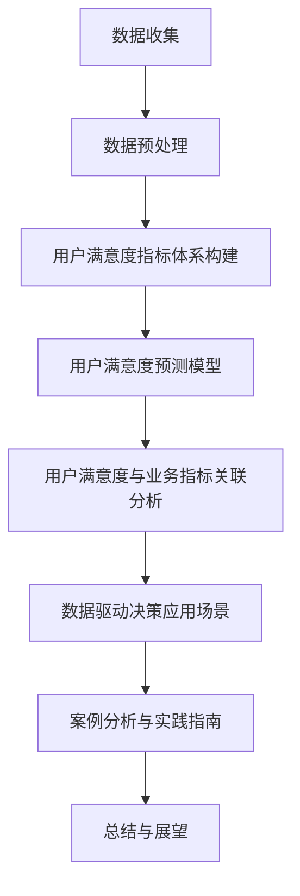

                 

### 文章标题

# 数据驱动决策的用户满意度

### 关键词

- 数据驱动决策
- 用户满意度
- 数据分析
- 预测模型
- 业务优化

### 摘要

本文旨在探讨数据驱动决策在提升用户满意度方面的应用。通过分析数据收集、处理、用户满意度指标体系构建、预测模型构建以及业务指标关联分析等内容，本文将展示如何利用数据驱动决策优化产品设计与市场营销策略，提高客户服务与支持水平，最终提升用户满意度。文章通过实际案例和代码解读，提供了完整的实践指南。

## 《数据驱动决策的用户满意度》目录大纲

### 第一部分：引言与概述

1. 数据驱动决策的基本概念
    1.1 数据驱动决策的定义
    1.2 数据驱动决策的重要性
    1.3 数据驱动决策与传统决策方法的比较

2. 用户满意度：核心指标与意义
    2.1 用户满意度的定义
    2.2 用户满意度的重要性
    2.3 用户满意度的度量方法

### 第二部分：数据收集与处理

1. 用户行为数据收集
    1.1 用户行为数据的来源
    1.2 用户行为数据的类型
    1.3 用户行为数据收集的方法

2. 数据预处理
    2.1 数据清洗
    2.2 数据集成
    2.3 数据转换

3. 数据存储与管理
    3.1 数据仓库的概念
    3.2 数据仓库的架构
    3.3 数据仓库的管理

### 第三部分：用户满意度分析与建模

1. 用户满意度指标体系构建
    1.1 指标体系设计原则
    1.2 指标体系构建流程
    1.3 指标体系案例分析

2. 用户满意度预测模型
    2.1 预测模型的选择
    2.2 预测模型的构建
    2.3 预测模型的评估与优化

3. 用户满意度与业务指标关联分析
    3.1 业务指标定义与选择
    3.2 用户满意度与业务指标关联分析
    3.3 业务优化策略制定

### 第四部分：数据驱动决策应用场景

1. 产品设计与优化
    1.1 用户行为数据分析
    1.2 产品功能优化
    1.3 产品迭代策略

2. 市场营销策略
    2.1 用户画像构建
    2.2 营销效果评估
    2.3 营销策略优化

3. 客户服务与支持
    3.1 客户满意度调查
    3.2 客户服务优化
    3.3 客户忠诚度提升策略

### 第五部分：案例分析与实践指南

1. 数据驱动决策案例分析
    1.1 案例一：产品设计与优化
    1.2 案例二：市场营销策略
    1.3 案例三：客户服务与支持

2. 实践指南
    2.1 数据收集与处理指南
    2.2 用户满意度分析建模指南
    2.3 数据驱动决策实施流程

### 附录

1. 附录 A：数据驱动决策工具与资源
    1.1 数据分析工具
    1.2 机器学习框架
    1.3 数据库与数据仓库

2. 附录 B：参考资料与扩展阅读
    2.1 数据分析相关书籍
    2.2 机器学习与深度学习教材
    2.3 用户满意度研究论文与报告
    2.4 数据驱动决策实践案例与经验分享
    2.5 相关期刊与会议

### Mermaid 流�程图：数据驱动决策流程



### 核心算法原理讲解：用户满意度预测模型

#### 3.2 用户满意度预测模型

#### 3.2.1 预测模型的选择

用户满意度预测通常采用机器学习算法，如回归分析、决策树、随机森林、支持向量机（SVM）和神经网络等。以下是几种常用的预测模型：

1. **线性回归**：线性回归模型简单且易于实现，适用于线性关系明显的数据。

   ```python
   # 线性回归伪代码
   def linear_regression(X, y):
       # 计算回归系数
       theta = (X.T @ X)^-1 @ (X.T @ y)
       # 预测
       predictions = X @ theta
       return predictions
   ```

2. **决策树**：决策树模型易于解释，可以处理非线性关系。

   ```python
   # 决策树伪代码
   def decision_tree(X, y, depth=0, max_depth=None):
       # 判断是否需要继续分割
       if should_split(X, y, depth, max_depth):
           # 分割数据
           left subtree = decision_tree(X[left], y[left], depth + 1)
           right subtree = decision_tree(X[right], y[right], depth + 1)
           return (left subtree, right subtree)
       # 得到叶子节点
       return predict_majority(y)
   ```

3. **随机森林**：随机森林是决策树的集成方法，可以降低过拟合并提高预测准确性。

   ```python
   # 随机森林伪代码
   def random_forest(X, y, n_estimators):
       for tree in range(n_estimators):
           # 生成随机分割
           X_random, y_random = generate_random_split(X, y)
           # 构建单棵决策树
           tree = decision_tree(X_random, y_random)
           # 集成预测
           predictions.append(tree.predict(X))
       return majority_vote(predictions)
   ```

#### 3.2.2 预测模型的构建

1. **数据准备**：首先，我们需要准备训练集和测试集，并进行数据预处理，如归一化、缺失值处理等。

   ```python
   # 数据准备伪代码
   X_train, X_test, y_train, y_test = train_test_split(X, y, test_size=0.2)
   X_train_normalized = normalize(X_train)
   X_test_normalized = normalize(X_test)
   ```

2. **模型训练**：接下来，使用训练集数据来训练预测模型。

   ```python
   # 模型训练伪代码
   model = linear_regression(X_train_normalized, y_train)
   ```

#### 3.2.3 预测模型的评估与优化

1. **模型评估**：使用测试集来评估模型的预测准确性。

   ```python
   # 模型评估伪代码
   accuracy = accuracy_score(y_test, model.predict(X_test_normalized))
   print(f"Model accuracy: {accuracy}")
   ```

2. **模型优化**：可以通过调整模型参数、增加特征工程等方式来优化模型。

   ```python
   # 模型优化伪代码
   best_accuracy = 0
   for param in parameter_space:
       model = linear_regression(X_train_normalized, y_train, **param)
       accuracy = accuracy_score(y_test, model.predict(X_test_normalized))
       if accuracy > best_accuracy:
           best_accuracy = accuracy
           best_params = param
   print(f"Best accuracy: {best_accuracy}, Best params: {best_params}")
   ```

#### 3.2.4 数学模型和数学公式

用户满意度预测模型可以使用以下数学公式：

##### 线性回归模型

$$
\text{y} = \text{wx} + \text{b}
$$

其中，y 是用户满意度评分，x 是特征向量，w 是权重向量，b 是偏置。

##### 决策树模型

决策树模型的内部节点可以用以下公式表示：

$$
\text{Gini}(\text{y}) = 1 - \sum_{i}\left(\frac{1}{n_i}\right)^2
$$

其中，n_i 是每个类别的样本数量。

##### 随机森林模型

随机森林模型的预测可以通过以下公式计算：

$$
\text{y} = \text{f}(\text{x}) = \sum_{t=1}^T \text{w}_t \text{h}(\text{x})
$$

其中，T 是森林中的树数量，w_t 是每棵树的权重，h(x) 是每棵树在特征 x 上的预测。

### 项目实战

#### 4.1 产品设计与优化

##### 4.1.1 用户行为数据分析

1. **数据收集**：使用日志收集工具，如 Google Analytics，收集用户在产品中的行为数据。

   ```python
   # 数据收集伪代码
   data = google_analytics.collect_data()
   ```

2. **数据预处理**：对收集到的数据进行清洗和转换。

   ```python
   # 数据预处理伪代码
   data = preprocess_data(data)
   ```

3. **特征工程**：提取与用户满意度相关的特征。

   ```python
   # 特征工程伪代码
   features = extract_features(data)
   ```

4. **用户满意度预测**：使用训练好的预测模型来预测用户满意度。

   ```python
   # 用户满意度预测伪代码
   predictions = model.predict(features)
   ```

##### 4.1.2 产品功能优化

1. **分析预测结果**：分析用户满意度的预测结果，识别潜在的问题和优化点。

   ```python
   # 分析预测结果伪代码
   analysis = analyze_predictions(predictions)
   ```

2. **功能迭代**：根据分析结果，对产品功能进行迭代和优化。

   ```python
   # 功能迭代伪代码
   product = iterate_product(analysis)
   ```

##### 4.1.3 产品迭代策略

1. **A/B测试**：实施A/B测试，对比不同版本的改进效果。

   ```python
   # A/B测试伪代码
   test = a_b_test(product_variant_a, product_variant_b)
   ```

2. **用户反馈收集**：收集用户反馈，持续优化产品。

   ```python
   # 用户反馈收集伪代码
   feedback = collect_user_feedback(product)
   ```

### 代码解读与分析

#### 5.2 实践指南

##### 5.2.1 数据收集与处理指南

1. **数据收集**：使用API或日志收集工具获取用户行为数据。

   ```python
   # 数据收集伪代码
   data = collect_user_behavior_data()
   ```

2. **数据预处理**：处理缺失值和异常值，进行数据清洗和转换。

   ```python
   # 数据预处理伪代码
   data = preprocess_data(data)
   ```

##### 5.2.2 用户满意度分析建模指南

1. **特征提取**：从数据中提取与用户满意度相关的特征。

   ```python
   # 特征提取伪代码
   features = extract_user_satisfaction_features(data)
   ```

2. **模型训练**：使用训练集数据训练预测模型。

   ```python
   # 模型训练伪代码
   model = train_user_satisfaction_model(features)
   ```

##### 5.2.3 数据驱动决策实施流程

1. **数据收集**：建立数据收集系统，确保数据的准确性和完整性。

   ```python
   # 数据收集系统伪代码
   data_collection_system = setup_data_collection_system()
   ```

2. **数据处理**：对收集到的数据进行预处理，为建模做准备。

   ```python
   # 数据处理伪代码
   processed_data = preprocess_data(data_collection_system)
   ```

3. **模型训练与评估**：使用预处理数据训练预测模型，并评估模型性能。

   ```python
   # 模型训练与评估伪代码
   model = train_and_evaluate_model(processed_data)
   ```

4. **决策实施**：根据模型预测结果，制定和实施数据驱动决策。

   ```python
   # 决策实施伪代码
   implement_decision_based_on_model_predictions(model)
   ```

5. **反馈与优化**：收集实施反馈，持续优化数据驱动决策流程。

   ```python
   # 反馈与优化伪代码
   optimize_data_driven_decision_process(feedback)
   ```

## 附录 A：数据驱动决策工具与资源

### A.1 数据分析工具

- **Python**：Python是一种广泛使用的编程语言，适用于数据分析、数据预处理和机器学习模型开发。

- **Pandas**：Pandas是一个Python库，用于数据清洗、数据转换和分析。

- **NumPy**：NumPy是一个Python库，用于数组计算和数值处理。

- **Matplotlib**：Matplotlib是一个Python库，用于数据可视化和图形绘制。

### A.2 机器学习框架

- **Scikit-learn**：Scikit-learn是一个Python库，提供了多种机器学习算法和工具。

- **TensorFlow**：TensorFlow是一个开源机器学习库，适用于大规模深度学习应用。

- **PyTorch**：PyTorch是一个开源深度学习库，具有灵活的动态计算图。

### A.3 数据库与数据仓库

- **MySQL**：MySQL是一个流行的关系型数据库，适用于数据存储和管理。

- **PostgreSQL**：PostgreSQL是一个高级开源关系型数据库，适用于复杂的数据库需求。

- **Hadoop**：Hadoop是一个分布式数据存储和处理平台，适用于大数据处理。

- **Snowflake**：Snowflake是一个云数据仓库，提供了强大的数据存储和分析能力。

### 附录 B：参考资料与扩展阅读

#### B.1 数据分析相关书籍

- **《Python数据分析基础教程：NumPy学习指南》** by ESRI
- **《数据科学入门》** by 林轩田
- **《深度学习》** by Ian Goodfellow、Yoshua Bengio 和 Aaron Courville
- **《Python数据分析》** by Wes McKinney

#### B.2 机器学习与深度学习教材

- **《机器学习》** by Tom M. Mitchell
- **《深度学习》** by Ian Goodfellow、Yoshua Bengio 和 Aaron Courville
- **《模式识别与机器学习》** by Christopher M. Bishop
- **《机器学习实战》** by Peter Harrington

#### B.3 用户满意度研究论文与报告

- **《User Experience Evaluation: Principles and Techniques for Systematic Evaluation of User Experience》** by Ulrik Gamborg
- **《Understanding Customer Satisfaction: Theory, Methods, and Applications》** by Dennis F. McQuarrie and Russell S. Winer
- **《User-Centered Design: Process and Techniques for Designing the User Experience》** by Brenda D. Dijck

#### B.4 数据驱动决策实践案例与经验分享

- **《Data-Driven Product Management》** by Benjamin Vigoda
- **《Using Data to Make Better Business Decisions》** by Bernard Marr
- **《How to Use Data Analytics to Improve Business Performance》** by Dilip S. Shah

#### B.5 相关期刊与会议

- **《Journal of Business Research》**
- **《International Journal of Market Research》**
- **《ACM Transactions on Computer-Human Interaction》**
- **《International Conference on Machine Learning》**
- **《NeurIPS: Conference on Neural Information Processing Systems》**

