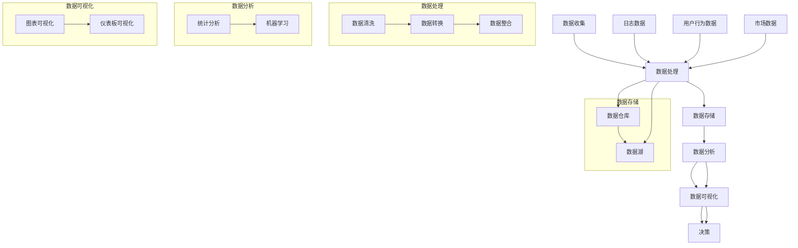

                 

### 文章标题

《数据驱动的最佳实践：Booking.com的发展秘籍》

### 关键词

- 数据驱动
- Booking.com
- 数据分析
- 用户行为分析
- 定价策略
- 个性化推荐
- 广告投放
- 客户关系管理
- 数据基础设施

### 摘要

本文旨在探讨数据驱动最佳实践在 Booking.com 的发展中的应用。通过分析 Booking.com 的数据驱动转型，本文揭示了数据驱动原则、核心实践案例及方法论。文章分为三部分：第一部分介绍数据驱动时代的崛起和核心原则；第二部分详细阐述 Booking.com 的用户行为分析、定价策略优化、个性化推荐系统、广告投放策略和客户关系管理实践；第三部分提供数据驱动项目规划与执行、数据基础设施搭建和数据驱动文化培养的方法论。本文旨在为企业和个人提供实用的数据驱动实践指导。

## 《数据驱动的最佳实践：Booking.com的发展秘籍》目录大纲

#### 第一部分：背景与概述

## 第1章：数据驱动时代的崛起

### 1.1 数据驱动的概念与重要性

### 1.2 Booking.com的背景与数据驱动转型

### 1.3 数据驱动与业务成功的联系

## 第2章：数据驱动的核心原则

### 2.1 数据质量的重要性

### 2.2 数据驱动的决策流程

### 2.3 数据文化在企业中的构建

#### 第二部分：Booking.com的实践案例

## 第3章：用户行为分析

### 3.1 用户行为数据收集与处理

### 3.2 用户分群策略

### 3.3 用户行为分析与产品优化

## 第4章：定价策略优化

### 4.1 数据驱动的定价模型

### 4.2 动态定价策略的实施

### 4.3 成本与收益分析

## 第5章：个性化推荐系统

### 5.1 推荐系统概述

### 5.2 基于内容的推荐

### 5.3 基于协同过滤的推荐

### 5.4 个性化推荐效果评估

## 第6章：广告投放策略

### 6.1 数据驱动的广告定位

### 6.2 广告效果评估与优化

### 6.3 广告预算分配策略

## 第7章：客户关系管理

### 7.1 数据驱动的客户细分

### 7.2 客户生命周期价值分析

### 7.3 客户忠诚度提升策略

#### 第三部分：数据驱动实践方法论

## 第8章：数据驱动项目规划与执行

### 8.1 数据驱动项目规划流程

### 8.2 数据驱动项目团队组建

### 8.3 数据驱动项目的风险管理

## 第9章：数据基础设施搭建

### 9.1 数据仓库与数据湖的设计

### 9.2 数据处理与存储方案

### 9.3 数据分析工具与平台选择

## 第10章：数据驱动文化的培养

### 10.1 数据文化的重要性

### 10.2 数据培训与知识分享

### 10.3 数据驱动企业的组织架构调整

#### 附录

## 附录A：数据驱动实践工具集

### A.1 数据分析工具

### A.2 数据可视化工具

### A.3 数据存储与管理工具

### A.4 开源数据驱动项目

<details>
<summary>### 附录B：数据驱动架构Mermaid流程图</summary>

mermaid
graph TD
    A[数据收集] --> B[数据处理]
    B --> C[数据存储]
    C --> D[数据分析]
    D --> E[数据可视化]
    E --> F[决策]

</details>

<details>
<summary>### 附录C：核心算法原理与伪代码</summary>

#### 用户行为分析算法原理

python
# 假设我们有一个用户行为数据集 user_actions
# 我们需要计算每个用户的平均行为频率和平均行为时长

for user in user_actions:
    total_frequency = 0
    total_duration = 0
    
    for action in user.actions:
        total_frequency += action.frequency
        total_duration += action.duration
        
    avg_frequency = total_frequency / len(user.actions)
    avg_duration = total_duration / len(user.actions)
    
    print(f"User {user.id}: Avg Frequency = {avg_frequency}, Avg Duration = {avg_duration}")

</details>

<details>
<summary>### 附录D：数学模型与公式</summary>

#### 动态定价模型

$$
P(t) = P_0 + \alpha \cdot (1 - \frac{S(t)}{S_0})
$$

其中，\(P(t)\) 是时间 \(t\) 时刻的定价，\(P_0\) 是初始定价，\(\alpha\) 是定价灵敏度系数，\(S(t)\) 是当前库存，\(S_0\) 是初始库存。

</details>

<details>
<summary>### 附录E：项目实战与代码解读</summary>

#### 用户行为分析实战

python
# 假设我们有一个用户行为数据文件 user_actions.csv，其中包含用户ID、行为频率、行为时长

import pandas as pd

# 加载用户行为数据
user_actions = pd.read_csv("user_actions.csv")

# 计算每个用户的平均行为频率和平均行为时长
user_stats = user_actions.groupby("user_id").agg({"frequency": "mean", "duration": "mean"})

# 打印结果
print(user_stats)

代码解读：
- 导入pandas库用于数据操作
- 使用pd.read_csv()函数加载用户行为数据
- 使用groupby()函数根据用户ID分组
- 使用agg()函数计算每个组的平均行为频率和平均行为时长
- 打印计算结果

</details>

## 第1章：数据驱动时代的崛起

### 1.1 数据驱动的概念与重要性

数据驱动是指企业基于数据来做出决策和制定战略的方法。在这种模式下，数据被视为最有价值的资产，它贯穿于企业的各个业务流程中。数据驱动的重要性体现在以下几个方面：

1. **提高决策质量**：通过数据分析，企业能够更准确地了解市场趋势、用户需求和业务绩效，从而做出更为科学的决策。
2. **优化业务流程**：数据分析有助于识别业务流程中的瓶颈和低效环节，推动流程优化和效率提升。
3. **提升竞争力**：数据驱动企业能够更快速地响应市场变化，抢占市场先机，提高市场竞争力。
4. **创新业务模式**：数据分析可以挖掘出新的业务机会，帮助企业探索创新业务模式。

### 1.2 Booking.com的背景与数据驱动转型

Booking.com 是全球领先的在线酒店预订平台，成立于 1996 年，总部位于荷兰阿姆斯特丹。公司自成立之初就非常重视数据分析和技术创新，其成功很大程度上归功于数据驱动的战略。

在 Booking.com 的数据驱动转型过程中，以下几个关键因素发挥了重要作用：

1. **海量数据收集**：Booking.com 能够收集到大量的用户行为数据、市场数据、酒店信息等，为其数据驱动决策提供了丰富的数据源。
2. **强大的数据处理能力**：公司建立了强大的数据处理和分析平台，能够对海量数据进行实时处理和分析。
3. **数据驱动文化**：Booking.com 培养了一种数据驱动的企业文化，鼓励员工使用数据分析来支持业务决策。
4. **持续的创新能力**：Booking.com 不断探索新的数据分析和应用场景，推动业务模式的创新和优化。

### 1.3 数据驱动与业务成功的联系

数据驱动战略与业务成功密切相关。以下是一些具体案例：

1. **用户行为分析**：通过对用户行为的深入分析，Booking.com 能够优化用户界面和体验，提高用户留存率和转化率。
2. **定价策略优化**：数据驱动的动态定价策略使 Booking.com 能够根据市场需求和竞争情况调整价格，实现收益最大化。
3. **个性化推荐**：基于用户行为数据和偏好分析，Booking.com 提供个性化的酒店推荐，提升用户满意度和忠诚度。
4. **广告投放策略**：通过数据分析优化广告投放策略，Booking.com 能够更精准地定位潜在客户，提高广告效果和投资回报率。

总之，数据驱动战略不仅有助于提升企业的业务绩效，还能够推动创新和可持续发展。在日益激烈的市场竞争中，数据驱动已经成为企业成功的关键因素。

### 第2章：数据驱动的核心原则

#### 2.1 数据质量的重要性

数据质量是数据驱动的基石，它直接影响到决策的准确性和可靠性。高质量的数据能够提供更准确的洞察，帮助企业在复杂的市场环境中做出明智的决策。以下是从数据质量的角度讨论其重要性的几个方面：

1. **准确性**：准确的数据是确保分析结果可靠性的前提。如果数据存在错误或偏差，分析结果将失去参考价值。例如，如果用户行为数据中的点击次数记录错误，将导致对用户兴趣和行为模式的误判。
2. **完整性**：完整的数据能够提供全面的业务视角。缺失的数据将导致分析结果的不完整，影响决策的全面性。例如，如果预订数据缺少用户地址信息，将难以进行精准的市场细分和用户画像。
3. **一致性**：数据的一致性是保证分析结果一致性的关键。不同来源或不同时间点的数据可能存在格式或标准上的差异，导致分析结果的偏差。例如，如果价格数据在不同地区或时间点存在差异，将导致对市场趋势的误判。
4. **及时性**：及时的数据能够帮助企业在市场变化中迅速响应。过时的数据将导致决策滞后，影响企业的竞争力。例如，如果预订数据更新不及时，将导致库存管理失误，影响用户体验和收益。

为了确保数据质量，企业需要采取一系列措施，包括数据清洗、数据验证、数据治理等。数据清洗是数据预处理的重要步骤，通过识别和修正数据中的错误、异常和重复记录，提高数据的准确性。数据验证则是确保数据符合特定标准和规则的过程，通过自动化工具或人工审核，确保数据的完整性和一致性。数据治理则是建立数据管理和质量控制体系，确保数据的长期稳定和可靠性。

#### 2.2 数据驱动的决策流程

数据驱动的决策流程是将数据转化为业务洞察并指导业务行动的过程。以下是一个典型数据驱动的决策流程，包括数据收集、数据分析、数据解释、决策制定和决策执行五个关键步骤：

1. **数据收集**：这是数据驱动的第一步，涉及从各种数据源收集所需的数据。这些数据可以包括用户行为数据、交易数据、市场数据、运营数据等。数据收集的质量直接影响后续分析的准确性和可靠性。
2. **数据分析**：在收集到数据后，需要对数据进行清洗、转换和分析。数据分析可以采用各种统计方法、机器学习模型等，以揭示数据中的模式和趋势。这一步骤的关键是选择合适的数据分析工具和方法，以获得有效的业务洞察。
3. **数据解释**：数据分析结果需要被解释为业务语言，以帮助决策者理解其含义和影响。数据解释需要将复杂的数据分析结果转化为易于理解的图表、报告和指标，以便决策者能够基于这些信息做出明智的决策。
4. **决策制定**：在理解数据分析结果后，决策者可以基于这些信息制定具体的业务决策。决策制定需要考虑各种业务目标和约束条件，以实现最优的业务效果。例如，根据用户行为分析结果，决策者可能决定调整产品定价策略或优化用户体验。
5. **决策执行**：制定决策后，需要将其转化为具体的行动方案，并执行和监控决策效果。决策执行包括资源分配、任务分解、进度控制等环节，以确保决策得到有效执行。同时，需要持续监控和评估决策效果，以进行反馈和调整。

数据驱动的决策流程是一个动态的、迭代的过程。通过不断收集、分析和解释数据，企业可以不断优化决策过程，提高决策的准确性和效率。

#### 2.3 数据文化在企业中的构建

数据文化是企业成功实施数据驱动战略的关键因素。数据文化是指企业内部对数据的重视、使用和共享的一种态度和行为模式。以下是从构建数据文化的角度讨论其重要性和方法：

1. **数据文化的内涵**：数据文化包括对数据的尊重、信任和依赖，以及对数据分析的积极态度。它要求企业内部形成一种共同的语言和思维方式，以数据为基础进行决策和创新。
2. **数据文化的重要性**：数据文化的重要性体现在以下几个方面：
   - **促进数据共享**：数据文化鼓励员工之间共享数据和信息，有助于打破部门壁垒，提高跨部门协作效率。
   - **提升数据意识**：数据文化可以培养员工对数据重要性的认识，促使他们主动收集、整理和分析数据，以提高业务洞察力。
   - **推动数据治理**：数据文化要求企业建立完善的数据治理体系，确保数据的质量、安全性和合规性。
   - **促进数据创新**：数据文化鼓励员工尝试新的数据分析方法和工具，推动数据驱动的创新和业务模式变革。

3. **构建数据文化的方法**：
   - **领导层的支持**：领导层对数据文化的推动至关重要。他们需要树立数据驱动的理念，带头使用数据分析来支持决策，并鼓励员工参与数据分析活动。
   - **数据培训**：为员工提供数据培训和技能提升机会，帮助员工掌握数据分析工具和方法，提高数据技能。
   - **数据共享平台**：建立数据共享平台，促进企业内部的数据交流和合作，提高数据的使用效率。
   - **激励机制**：设立数据相关的激励机制，鼓励员工积极参与数据分析，分享数据分析成果，提高数据文化的积极性。
   - **企业文化宣传**：通过内部宣传和活动，加强数据文化的宣传和推广，使员工认识到数据文化的重要性，并积极参与其中。

总之，构建数据文化需要企业领导层的支持、员工的积极参与和系统的培训与激励机制。通过这些方法，企业可以逐步建立并巩固数据文化，推动数据驱动战略的实施和成功。

### 第3章：用户行为分析

#### 3.1 用户行为数据收集与处理

用户行为分析是数据驱动战略的重要组成部分，它通过收集和分析用户在网站或应用上的行为数据，帮助企业理解用户需求、优化用户体验，并提升业务绩效。以下是用户行为数据收集与处理的详细步骤：

1. **数据收集**：
   - **网站和应用日志**：通过网站和应用服务器日志收集用户访问数据，包括用户ID、访问时间、访问页面、操作行为等。服务器日志数据可以通过日志分析工具（如Apache Log4j、Nginx日志）进行解析和存储。
   - **用户互动数据**：收集用户在网站或应用上的互动数据，如点击行为、浏览时长、搜索关键词、评论和反馈等。这些数据可以通过前端埋点技术和事件追踪系统（如Google Analytics、Mixpanel）进行收集和存储。
   - **第三方数据源**：通过第三方数据源（如社交媒体、在线调查、用户反馈）收集补充用户行为数据。这些数据可以为用户提供更全面的用户画像。

2. **数据处理**：
   - **数据清洗**：在数据处理过程中，首先对收集到的原始数据进行清洗，去除重复、无效和错误的数据。数据清洗包括数据去重、数据格式转换、缺失值填充等。
   - **数据转换**：将清洗后的数据进行转换，使其符合数据分析工具和模型的要求。转换过程包括数据规范化、数据归一化、特征工程等。
   - **数据存储**：将处理后的用户行为数据存储到数据库或数据仓库中，以便后续的数据分析和挖掘。常用的数据存储方案包括关系型数据库（如MySQL、PostgreSQL）、NoSQL数据库（如MongoDB、Cassandra）和数据仓库（如Hive、Snowflake）。

3. **数据质量保证**：
   - **数据验证**：在数据收集和处理过程中，对数据进行验证，确保数据的准确性和完整性。数据验证包括数据格式检查、数据范围检查、逻辑一致性检查等。
   - **数据监控**：建立数据监控机制，实时监控数据质量和数据流，及时发现和处理数据质量问题。数据监控可以通过自动化脚本、报警系统和监控平台（如Zabbix、Grafana）实现。

通过上述步骤，企业可以有效地收集和处理用户行为数据，为后续的数据分析和用户分群提供可靠的数据基础。

#### 3.2 用户分群策略

用户分群是一种基于用户行为和特征进行细分的方法，通过将用户划分为不同的群体，企业可以更精准地理解用户需求，制定有针对性的营销策略和产品优化方案。以下是用户分群策略的详细讨论：

1. **分群目标**：
   - **优化用户体验**：通过用户分群，企业可以根据不同群体的特点，优化产品功能和界面设计，提高用户满意度和留存率。
   - **精准营销**：根据不同群体的需求和偏好，制定个性化的营销策略，提高营销活动的效果和投资回报率。
   - **产品创新**：通过分析不同群体的行为和需求，发现新的市场机会和产品需求，推动产品创新和业务模式变革。

2. **分群方法**：
   - **基于行为特征的分群**：根据用户在网站或应用上的行为数据，如浏览时长、点击频率、转化率等，将用户划分为活跃用户、沉默用户、流失用户等。这种方法适用于分析用户的使用习惯和偏好。
   - **基于人口统计学的分群**：根据用户的人口统计学特征，如年龄、性别、地理位置、职业等，将用户划分为不同的群体。这种方法适用于市场细分和地理定位营销。
   - **基于心理特征的分群**：通过用户画像和心理模型，将用户划分为不同心理特征的群体，如理性消费者、感性消费者、冲动消费者等。这种方法适用于理解用户的决策过程和购买动机。
   - **基于价值的分群**：根据用户的生命周期价值和贡献度，将用户划分为高价值用户、中价值用户、低价值用户等。这种方法适用于客户关系管理和收益最大化。

3. **分群策略**：
   - **阶段性分群**：根据业务目标和阶段，制定分群策略。例如，在产品上线初期，可以侧重于用户行为特征的分群，以优化用户体验和产品功能；在市场推广阶段，可以侧重于人口统计学特征的分群，以提高市场覆盖率和用户转化率。
   - **动态分群**：根据用户行为和数据的实时变化，动态调整分群策略。例如，在用户流失预警系统中，可以根据用户的流失风险指数，实时调整用户分群和营销策略。
   - **多维度分群**：结合多个维度的特征，进行多维度的用户分群。例如，可以同时考虑用户行为特征和人口统计学特征，进行综合分群，以获得更准确的用户洞察。

4. **分群实施**：
   - **数据准备**：准备用于分群的数据集，包括用户行为数据、人口统计学数据、心理特征数据等。确保数据的质量和完整性。
   - **特征工程**：根据分群目标和方法，提取和构造相关的特征，如用户访问时长、点击频率、转化率、生命周期价值等。特征工程是分群策略成功的关键。
   - **分群算法**：选择合适的分群算法，如K-means、层次聚类、决策树等，对用户进行分群。算法的选择取决于数据特点和业务需求。
   - **模型评估**：评估分群模型的性能和效果，包括分群精度、覆盖率和平衡度等。通过交叉验证和A/B测试等方法，优化分群模型。
   - **分群应用**：将分群结果应用于实际业务场景，如个性化推荐、精准营销、用户体验优化等。根据分群策略，制定相应的业务策略和行动方案。

通过有效的用户分群策略，企业可以更深入地理解用户需求，提高营销效果和用户体验，从而实现业务增长和用户价值的最大化。

#### 3.3 用户行为分析与产品优化

用户行为分析是产品优化的重要手段，通过深入分析用户在网站或应用上的行为数据，企业可以发现用户需求、识别潜在问题，并制定相应的优化策略。以下是用户行为分析与产品优化的详细步骤：

1. **分析目标**：
   - **理解用户需求**：通过分析用户行为数据，了解用户在网站或应用上的操作习惯、兴趣点和痛点，从而更好地满足用户需求。
   - **识别产品问题**：通过分析用户行为数据，发现产品界面、功能或性能上的问题，为产品优化提供依据。
   - **评估优化效果**：通过分析用户行为数据，评估优化措施的效果，持续改进产品。

2. **分析步骤**：
   - **数据收集**：收集用户在网站或应用上的行为数据，包括浏览时长、点击频率、页面跳转、转化率等。
   - **数据预处理**：对收集到的原始数据进行清洗、转换和整合，确保数据的质量和一致性。
   - **行为建模**：建立用户行为模型，包括用户活跃度模型、用户流失模型、用户转化模型等，以识别用户行为模式和趋势。
   - **数据分析**：通过统计分析、机器学习等方法，对用户行为数据进行分析，提取有价值的信息和洞察。
   - **问题识别**：根据数据分析结果，识别用户行为中的异常现象和潜在问题，如用户流失率高、页面跳出率高、转化率低等。
   - **优化策略制定**：基于问题识别和分析结果，制定相应的产品优化策略，如界面优化、功能改进、性能提升等。
   - **优化实施**：根据优化策略，实施具体的产品优化措施，如调整页面布局、增加功能模块、改进系统性能等。
   - **效果评估**：通过持续的数据分析，评估优化措施的效果，包括用户满意度、留存率、转化率等关键指标，为后续优化提供参考。

3. **案例实践**：

**案例一：提升转化率**

问题描述：某电商网站的用户转化率较低，分析用户行为数据后，发现用户在浏览商品页面后，很少进行购买操作。

分析步骤：
- 收集用户浏览和购买行为数据，包括浏览时长、页面跳转、添加购物车、下单等。
- 分析用户浏览和购买行为模式，发现用户在浏览商品详情页后，通常会跳转到其他页面，而不是进行购买操作。
- 识别问题：用户在浏览商品详情页后，缺乏明确的购买引导。

优化策略：
- 增加购物车提示功能，当用户将商品加入购物车时，页面顶部弹出提示信息，引导用户进行购买。
- 在商品详情页底部增加“立即购买”按钮，简化购买流程，降低用户操作成本。

效果评估：
- 优化实施后，用户转化率显著提升，用户在浏览商品详情页后，直接购买的比例增加。

**案例二：提高用户留存率**

问题描述：某移动应用的用户留存率较低，分析用户行为数据后，发现用户在下载应用后，很少进行活跃操作。

分析步骤：
- 收集用户下载和应用使用行为数据，包括登录次数、使用时长、功能使用频率等。
- 分析用户行为数据，发现用户在下载应用后，很少登录或使用主要功能。
- 识别问题：用户对应用的主要功能不熟悉，缺乏有效的引导和使用激励。

优化策略：
- 增加新手引导功能，用户在首次登录时，通过动画和提示信息，详细介绍应用的主要功能和操作方式。
- 设计积分系统，用户在完成任务或达到特定目标时，可以获得积分奖励，激励用户持续使用应用。

效果评估：
- 优化实施后，用户留存率显著提升，用户在下载应用后的活跃度增加。

通过上述案例，可以看出用户行为分析在产品优化中的重要作用。通过深入分析用户行为数据，企业可以识别用户需求和问题，制定有针对性的优化策略，从而提升用户体验和业务绩效。

### 第4章：定价策略优化

#### 4.1 数据驱动的定价模型

数据驱动的定价模型是一种通过分析市场数据和用户行为数据，制定价格策略的方法。这种模型能够帮助企业根据市场动态和用户需求，实现价格的最优化。以下是数据驱动定价模型的构建过程：

1. **需求分析**：
   - **市场调研**：通过市场调研，收集产品或服务的市场需求信息，包括竞争对手的价格、市场需求趋势等。
   - **用户调研**：通过用户调研，了解用户对价格敏感度、购买意愿、替代产品选择等因素，为定价提供用户视角。

2. **数据收集**：
   - **历史价格数据**：收集产品或服务的历史价格数据，包括价格变动记录、价格区间、价格与销售量的关系等。
   - **用户行为数据**：收集用户在购买过程中的行为数据，如点击率、浏览时长、转化率等，分析用户对不同价格的反应。

3. **需求预测**：
   - **建立需求预测模型**：使用回归分析、时间序列分析等方法，根据市场调研和用户行为数据，建立需求预测模型，预测不同价格下的需求量。

4. **成本分析**：
   - **固定成本**：计算产品或服务的固定成本，包括研发成本、运营成本、营销成本等。
   - **可变成本**：计算产品或服务的可变成本，包括原材料成本、人力成本等。

5. **利润分析**：
   - **建立利润模型**：根据需求预测和成本分析，建立利润模型，计算在不同价格下的利润水平。

6. **定价策略**：
   - **动态定价**：根据需求预测和利润模型，制定动态定价策略，实时调整价格以最大化利润。例如，使用价格弹性模型，根据市场需求变化调整价格。
   - **竞争定价**：根据竞争对手的价格和市场份额，制定竞争性定价策略，以保持市场竞争力。

7. **效果评估**：
   - **利润评估**：评估定价策略的利润表现，包括利润率、利润额等。
   - **用户满意度**：评估用户对价格的反应，包括用户购买意愿、满意度等。
   - **市场份额**：评估定价策略对市场份额的影响，包括市场份额增长、竞争对手反应等。

通过数据驱动的定价模型，企业可以实现灵活、精准的价格策略，提高市场竞争力和盈利能力。

#### 4.2 动态定价策略的实施

动态定价策略是一种根据市场需求和竞争情况，实时调整价格的定价方法。这种方法能够帮助企业最大化收益，提高市场竞争力。以下是动态定价策略的实施步骤：

1. **市场分析**：
   - **需求分析**：收集和分析市场数据，包括市场需求、价格弹性、竞争对手价格等。
   - **竞争分析**：监控竞争对手的定价策略和价格变动，了解市场竞争态势。

2. **定价策略制定**：
   - **目标利润率**：确定目标利润率，根据成本结构和市场需求，设定合理的利润目标。
   - **价格弹性模型**：建立价格弹性模型，分析不同价格水平下的需求变化，确定价格与需求的关系。

3. **实时数据收集**：
   - **用户行为数据**：收集用户在购买过程中的行为数据，如浏览时长、点击率、转化率等。
   - **市场动态数据**：收集市场动态数据，包括天气、节假日、突发事件等，分析这些因素对需求的影响。

4. **定价算法**：
   - **需求预测模型**：使用机器学习算法，建立需求预测模型，预测不同价格水平下的需求量。
   - **价格调整算法**：根据需求预测模型和市场动态数据，设计价格调整算法，实时计算最佳价格。

5. **定价执行**：
   - **自动定价系统**：建立自动定价系统，根据定价算法，实时调整价格。
   - **价格监控**：监控定价系统的执行效果，确保定价策略的有效性和合规性。

6. **效果评估**：
   - **收益评估**：评估定价策略的收益表现，包括利润率、销售额等。
   - **用户反馈**：收集用户对价格变动的反馈，分析用户满意度。
   - **市场份额**：评估定价策略对市场份额的影响，分析竞争对手的反应。

7. **优化调整**：
   - **数据复盘**：定期分析定价策略的执行效果，识别问题和优化机会。
   - **模型更新**：根据市场变化和用户反馈，更新需求预测模型和价格调整算法，优化定价策略。

通过实施动态定价策略，企业可以实现价格与需求的最佳匹配，提高收益和市场竞争力。

#### 4.3 成本与收益分析

成本与收益分析是制定和评估定价策略的关键步骤，它帮助企业在定价过程中平衡成本和收益，实现最优的定价效果。以下是成本与收益分析的详细步骤：

1. **成本分析**：
   - **固定成本**：计算与定价直接相关的固定成本，包括生产成本、研发成本、运营成本等。这些成本不随销售量的变化而变化。
   - **可变成本**：计算与定价直接相关的可变成本，包括原材料成本、运输成本、人力成本等。这些成本随销售量的变化而变化。
   - **总成本**：计算固定成本和可变成本的总和，得出总成本。

2. **收益分析**：
   - **单价收益**：根据定价策略确定产品或服务的单价。
   - **销售量预测**：使用需求预测模型，预测在不同价格水平下的销售量。
   - **总收益**：计算单价收益与销售量的乘积，得出总收益。

3. **利润分析**：
   - **利润公式**：利润 = 总收益 - 总成本。
   - **利润计算**：根据成本分析和收益分析的结果，计算在不同价格水平下的利润。

4. **敏感性分析**：
   - **价格敏感性**：分析价格变化对利润的影响，评估价格弹性。
   - **成本敏感性**：分析成本变化对利润的影响，评估成本变化的风险。

5. **收益最大化分析**：
   - **边际分析**：计算边际收益和边际成本，找出利润最大化的价格点。
   - **综合评估**：结合市场分析和竞争分析，确定最终的定价策略。

6. **收益评估**：
   - **短期收益评估**：评估定价策略在短期内的收益表现，包括利润率、销售额等。
   - **长期收益评估**：评估定价策略在长期内的收益表现，包括市场份额、品牌价值等。

7. **效果评估**：
   - **实际收益对比**：将实际收益与预期收益进行对比，评估定价策略的准确性。
   - **用户反馈**：收集用户对价格变动的反馈，评估用户满意度。

通过成本与收益分析，企业可以制定科学的定价策略，实现收益最大化，提高市场竞争力和盈利能力。

### 第5章：个性化推荐系统

#### 5.1 推荐系统概述

个性化推荐系统是一种通过分析用户行为和偏好，向用户推荐个性化内容或产品的技术体系。推荐系统广泛应用于电商、社交媒体、新闻推送等领域，能够显著提升用户体验和满意度。以下是推荐系统的基础概念、应用场景和技术架构：

1. **基础概念**：
   - **用户行为数据**：用户在系统中的行为数据，如浏览历史、购买记录、评论和评分等。
   - **内容数据**：推荐的内容数据，如商品信息、新闻文章、音乐等。
   - **偏好**：用户对特定内容或产品的偏好程度，可以通过行为数据和用户反馈来衡量。

2. **应用场景**：
   - **电商**：推荐用户可能感兴趣的商品，提升销售量和用户满意度。
   - **社交媒体**：推荐用户可能感兴趣的内容，提升用户活跃度和参与度。
   - **新闻推送**：推荐用户可能感兴趣的新闻文章，提升阅读量和用户粘性。

3. **技术架构**：
   - **数据层**：存储用户行为数据和内容数据，通常使用关系型数据库或NoSQL数据库。
   - **算法层**：实现推荐算法，包括协同过滤、基于内容的推荐、混合推荐等。
   - **服务层**：提供推荐服务的API接口，供前端应用调用。
   - **前端应用**：向用户展示推荐结果，通常包括推荐页面、推荐卡片等。

4. **推荐流程**：
   - **用户行为数据收集**：收集用户在系统中的行为数据，如浏览、购买、点赞等。
   - **内容数据收集**：收集推荐的内容数据，如商品、文章、音乐等。
   - **数据预处理**：对收集到的数据进行清洗、转换和归一化，为算法层提供高质量的数据输入。
   - **推荐算法**：使用协同过滤、基于内容的推荐或混合推荐算法，生成推荐结果。
   - **推荐结果呈现**：将推荐结果通过前端应用展示给用户。

#### 5.2 基于内容的推荐

基于内容的推荐是一种通过分析内容特征，将相似内容推荐给用户的推荐方法。这种方法不需要用户行为数据，适用于新用户或缺乏足够行为数据的场景。以下是基于内容的推荐的原理、实现步骤和挑战：

1. **原理**：
   - **内容特征提取**：对推荐的内容进行特征提取，如文本特征、图像特征、音频特征等。
   - **相似度计算**：计算用户当前内容与历史内容或库中其他内容的相似度，选择相似度最高的内容进行推荐。

2. **实现步骤**：
   - **内容特征提取**：使用文本分类、图像识别、音频处理等技术，提取内容的特征向量。
   - **内容库构建**：构建包含所有推荐内容特征向量的内容库。
   - **相似度计算**：使用余弦相似度、欧氏距离等相似度度量方法，计算用户当前内容与其他内容的相似度。
   - **推荐生成**：根据相似度计算结果，生成推荐列表，推荐相似度最高的内容。

3. **挑战**：
   - **特征提取准确性**：不同类型的内容特征提取方法不同，需要准确提取内容特征以实现有效的推荐。
   - **数据稀疏性**：内容库中某些内容可能缺乏足够的数据，导致特征提取和相似度计算困难。
   - **用户偏好变化**：用户偏好可能随时间变化，需要动态调整推荐策略以适应用户的变化。

#### 5.3 基于协同过滤的推荐

基于协同过滤的推荐是一种通过分析用户之间的相似性，推荐用户可能感兴趣的内容的方法。这种方法利用用户行为数据进行推荐，适用于有足够行为数据的场景。以下是基于协同过滤的推荐的原理、实现步骤和挑战：

1. **原理**：
   - **用户相似性计算**：计算用户之间的相似性，如用户基于评分的相似性、基于行为的相似性等。
   - **项目相似性计算**：计算用户评分的项目之间的相似性，如物品基于评分的相似性、物品基于行为的相似性等。
   - **推荐生成**：基于用户相似性和项目相似性，为用户推荐相似的用户评分高的项目。

2. **实现步骤**：
   - **用户相似性计算**：使用余弦相似度、皮尔逊相关系数等方法计算用户之间的相似性。
   - **项目相似性计算**：使用余弦相似度、平均值调整相似度等方法计算项目之间的相似性。
   - **推荐生成**：根据用户相似性和项目相似性，计算每个项目的推荐分数，生成推荐列表。

3. **挑战**：
   - **冷启动问题**：新用户或新项目缺乏足够的行为数据，导致无法计算相似性，无法进行推荐。
   - **稀疏性**：用户行为数据通常较为稀疏，需要有效的算法处理数据稀疏性问题。
   - **多样性**：推荐系统需要保证推荐的多样性，避免用户只接受相似的内容，导致用户体验下降。

#### 5.4 个性化推荐效果评估

个性化推荐系统的效果评估是确保推荐质量的重要环节。以下是从用户满意度、推荐覆盖率、新颖性和多样性等角度评估个性化推荐效果的详细方法：

1. **用户满意度**：
   - **点击率（CTR）**：评估推荐内容被用户点击的频率，高点击率通常表明推荐内容吸引用户兴趣。
   - **转化率（CTR-to-CVR）**：评估点击后的用户转化行为，如购买、评论、收藏等，高转化率表明推荐内容能够满足用户需求。

2. **推荐覆盖率**：
   - **覆盖率（Coverage）**：评估推荐系统能够覆盖的不同内容的比例，高覆盖率表明推荐系统能够推荐多样化的内容。
   - **新颖性（Novelty）**：评估推荐系统能够发现用户未浏览或未购买的新内容的能力，高新颖性表明推荐系统能够提供独特的价值。

3. **多样性**：
   - **多样性（Diversity）**：评估推荐系统中不同内容之间的差异性，避免用户只接受相似的内容，高多样性能够提升用户满意度。
   - **一致性（Consistency）**：评估推荐系统在不同时间点推荐的一致性，确保推荐结果的一致性和可预测性。

4. **评估方法**：
   - **A/B测试**：通过对比不同推荐策略的用户行为数据，评估推荐效果。
   - **线上线下评估**：结合线上用户行为数据和线下用户反馈，全面评估推荐效果。
   - **统计方法**：使用统计方法，如置信区间、假设检验等，分析推荐效果的显著性。

通过综合评估推荐系统的效果，企业可以不断优化推荐算法和策略，提升用户体验和满意度。

### 第6章：广告投放策略

#### 6.1 数据驱动的广告定位

数据驱动的广告定位是一种通过分析用户数据和市场数据，精确识别和定位目标受众的广告投放方法。这种方法能够提高广告投放的精准度，最大化广告效果。以下是数据驱动的广告定位的详细步骤：

1. **用户数据收集**：
   - **用户行为数据**：收集用户在网站、应用上的行为数据，如浏览历史、点击行为、搜索关键词等。
   - **用户属性数据**：收集用户的个人属性数据，如年龄、性别、地理位置、职业等。

2. **数据分析**：
   - **行为分析**：分析用户行为数据，识别用户的兴趣点和购买倾向。
   - **属性分析**：分析用户属性数据，识别具有相似兴趣和购买倾向的用户群体。

3. **用户画像构建**：
   - **兴趣标签**：根据用户行为数据，为用户打上不同的兴趣标签，如旅游、美食、科技等。
   - **购买标签**：根据用户购买行为数据，为用户打上不同的购买标签，如高频购买者、低频购买者等。

4. **目标受众定位**：
   - **目标人群筛选**：根据用户画像，筛选出具有相似兴趣和购买倾向的目标人群。
   - **细分市场定位**：根据用户数据和市场数据，细分市场，确定不同细分市场的目标受众。

5. **定位策略制定**：
   - **个性化定位**：根据用户画像和目标人群，制定个性化的广告定位策略，如精准投放、个性化推荐等。
   - **动态调整**：根据用户行为数据和反馈，动态调整广告定位策略，提高广告效果。

6. **效果评估**：
   - **转化率评估**：评估广告投放的转化率，如点击率、转化率等，分析广告效果。
   - **投资回报率（ROI）评估**：评估广告投放的投资回报率，分析广告投放的性价比。

通过数据驱动的广告定位，企业可以更精准地识别和定位目标受众，提高广告投放的效率和效果，实现营销目标。

#### 6.2 广告效果评估与优化

广告效果评估与优化是确保广告投放效果的关键步骤，通过评估广告的表现，企业可以及时调整广告策略，提高投资回报率。以下是广告效果评估与优化的详细方法：

1. **评估指标**：
   - **点击率（CTR）**：评估广告被点击的频率，高点击率表明广告吸引用户的兴趣。
   - **转化率（CVR）**：评估点击后用户完成目标动作的频率，如注册、购买等，高转化率表明广告能够促使用户采取行动。
   - **投资回报率（ROI）**：评估广告投放的收益与投入的比例，高ROI表明广告投放具有较好的经济效益。
   - **曝光量**：评估广告曝光的次数，高曝光量表明广告覆盖了更多的潜在用户。
   - **互动率**：评估用户与广告的互动行为，如点赞、评论等，高互动率表明广告引发了用户的兴趣和参与。

2. **评估方法**：
   - **A/B测试**：通过对比不同广告版本的用户行为数据，评估广告效果，找出最优广告版本。
   - **多变量测试**：同时测试多个变量，如广告创意、投放渠道、投放时间等，分析各变量的影响，优化广告策略。
   - **数据分析**：使用数据分析工具，如Google Analytics、百度统计等，分析广告的点击率、转化率等关键指标。

3. **优化策略**：
   - **广告创意优化**：根据用户反馈和评估结果，调整广告创意，如改进广告文案、视觉设计等，提高广告吸引力。
   - **投放渠道优化**：根据广告效果，调整投放渠道，如增加或减少投放平台、调整投放预算等，提高广告覆盖率和效果。
   - **投放时间优化**：根据用户行为数据和效果评估，调整广告投放时间，如选择用户活跃时间段，提高广告曝光率和转化率。
   - **目标受众优化**：根据用户画像和效果评估，调整目标受众定位，如缩小或扩大目标人群，提高广告的精准度。

4. **效果跟踪与反馈**：
   - **持续监控**：定期监控广告效果，分析广告表现，及时发现问题和优化机会。
   - **用户反馈**：收集用户对广告的反馈，分析用户满意度，优化广告内容和策略。
   - **数据复盘**：定期进行数据复盘，总结广告投放的经验和教训，为后续广告投放提供参考。

通过广告效果评估与优化，企业可以不断提高广告投放的效果，实现营销目标，提高投资回报率。

#### 6.3 广告预算分配策略

广告预算分配策略是确保广告资源合理利用、实现最大化投资回报的关键。以下是基于数据驱动的广告预算分配策略的详细步骤：

1. **数据收集与分析**：
   - **历史数据**：收集广告投放的历史数据，包括投放平台、投放时间、投放预算、点击率、转化率等。
   - **当前数据**：收集当前广告投放的数据，如实时点击率、转化率、投资回报率等。

2. **预算评估**：
   - **预算总额**：根据公司营销目标和财务状况，确定总的广告预算。
   - **渠道评估**：分析不同广告渠道的历史数据和当前表现，评估各渠道的投放效果和投资回报率。

3. **预算分配**：
   - **优先级分配**：根据营销目标和广告效果，确定不同渠道的预算优先级。通常，投资回报率高的渠道会优先分配更多预算。
   - **分配比例**：根据各渠道的预算优先级，计算各渠道的预算分配比例。例如，如果某渠道的投资回报率较高，可以分配较多的预算。

4. **动态调整**：
   - **实时监控**：实时监控各渠道的广告投放效果，包括点击率、转化率、投资回报率等。
   - **预算调整**：根据实时监控数据，及时调整预算分配。例如，如果某渠道的表现不佳，可以考虑减少预算分配，将资源转移到表现更好的渠道。

5. **效果评估**：
   - **周期评估**：定期评估广告预算的分配效果，包括各渠道的投资回报率、广告效果等。
   - **预算优化**：根据评估结果，优化广告预算分配策略，确保预算的合理利用和最大化投资回报。

通过数据驱动的广告预算分配策略，企业可以确保广告资源得到合理利用，提高广告效果和投资回报率。

### 第7章：客户关系管理

#### 7.1 数据驱动的客户细分

数据驱动的客户细分是一种通过分析客户数据，将客户划分为不同群体，以便更好地理解和满足其需求的方法。以下是数据驱动的客户细分的详细步骤：

1. **数据收集**：
   - **行为数据**：收集客户在网站、应用上的行为数据，如浏览历史、购买记录、点击行为等。
   - **交易数据**：收集客户的交易数据，如购买金额、购买频率、产品偏好等。
   - **社交数据**：收集客户在社交媒体上的行为数据，如点赞、评论、分享等。

2. **数据清洗与整合**：
   - **数据清洗**：对收集到的原始数据进行处理，去除重复、无效和错误的数据。
   - **数据整合**：将不同来源的数据进行整合，构建一个全面的客户数据视图。

3. **特征工程**：
   - **特征提取**：根据业务需求和数据分析目标，提取相关的特征，如客户购买金额、购买频率、产品偏好、行为活跃度等。
   - **特征标准化**：对提取的特征进行标准化处理，使其具有相似的范围和尺度。

4. **客户细分**：
   - **聚类分析**：使用聚类算法（如K-means、层次聚类等），根据客户特征数据，将客户划分为不同的群体。
   - **规则划分**：根据业务需求和客户特征，设置规则进行客户细分，如根据购买金额、购买频率等特征设置划分规则。

5. **细分评估**：
   - **细分效果评估**：评估不同客户细分方法的效果，包括细分精度、细分代表性等。
   - **细分优化**：根据评估结果，调整客户细分策略，提高细分效果。

6. **应用与优化**：
   - **细分应用**：根据客户细分结果，制定针对性的营销策略和服务方案，如针对高价值客户提供VIP服务、针对潜力客户提供促销活动等。
   - **细分优化**：定期评估客户细分效果，根据客户行为和反馈，优化细分策略。

通过数据驱动的客户细分，企业可以更精准地理解和满足客户需求，提高客户满意度和忠诚度。

#### 7.2 客户生命周期价值分析

客户生命周期价值（Customer Lifetime Value，简称CLV）是指一个客户在生命周期内为企业带来的总价值。进行客户生命周期价值分析可以帮助企业识别高价值客户，制定有针对性的营销策略，提高客户留存率和盈利能力。以下是客户生命周期价值分析的详细步骤：

1. **数据收集**：
   - **交易数据**：收集客户的历史交易数据，包括购买金额、购买频率、购买周期等。
   - **行为数据**：收集客户在网站、应用上的行为数据，如浏览时长、点击率、转化率等。
   - **反馈数据**：收集客户满意度、投诉、建议等反馈数据。

2. **数据预处理**：
   - **数据清洗**：去除重复、无效和错误的数据，确保数据质量。
   - **数据整合**：整合不同来源的数据，构建一个全面的客户数据视图。

3. **特征工程**：
   - **特征提取**：提取与客户价值相关的特征，如购买金额、购买频率、行为活跃度等。
   - **特征标准化**：对提取的特征进行标准化处理，使其具有相似的尺度和范围。

4. **预测模型构建**：
   - **统计模型**：使用统计模型（如线性回归、决策树等），预测客户未来的价值。
   - **机器学习模型**：使用机器学习模型（如随机森林、梯度提升机等），构建客户价值预测模型。

5. **CLV计算**：
   - **短期CLV**：计算客户在短期内（如一年）可能带来的价值。
   - **长期CLV**：计算客户在整个生命周期内可能带来的价值。
   - **综合CLV**：将短期和长期CLV结合起来，得到客户的综合价值。

6. **价值评估**：
   - **高价值客户识别**：根据CLV评估结果，识别高价值客户，制定针对性的营销策略。
   - **低价值客户管理**：对低价值客户进行有效管理，通过改进产品或服务，提升其价值。

7. **策略制定**：
   - **客户保留策略**：制定客户保留策略，提高客户留存率，延长客户生命周期。
   - **客户发展策略**：制定客户发展策略，提升客户价值，实现客户价值最大化。

8. **持续优化**：
   - **数据更新**：定期更新客户数据，确保CLV评估结果的准确性。
   - **策略调整**：根据客户反馈和市场变化，调整客户关系管理策略。

通过客户生命周期价值分析，企业可以更精准地识别高价值客户，优化客户关系管理策略，提高客户满意度和盈利能力。

#### 7.3 客户忠诚度提升策略

客户忠诚度是指客户对品牌或服务的长期依赖和偏好程度。提升客户忠诚度是企业长期发展的关键，以下是基于数据驱动的客户忠诚度提升策略：

1. **个性化服务**：
   - **定制体验**：根据客户数据，提供个性化的服务体验，如定制化的推荐、专属优惠等。
   - **个性化沟通**：使用数据分析，定制个性化的沟通内容，如邮件、短信等，增强客户体验。

2. **忠诚度计划**：
   - **积分奖励**：建立积分奖励系统，鼓励客户进行消费和互动，提升参与度。
   - **会员制度**：设立会员等级制度，根据客户价值提供不同等级的会员权益，如折扣、赠品等。

3. **客户反馈机制**：
   - **实时反馈**：建立实时反馈机制，如在线调查、意见箱等，收集客户意见和建议，及时进行改进。
   - **闭环反馈**：对客户反馈进行闭环管理，及时回应客户问题，增强客户信任。

4. **客户体验优化**：
   - **简化流程**：优化客户购物流程，减少操作步骤，提高购物体验。
   - **服务质量提升**：提高服务质量，如客户服务团队的专业培训，提升客户满意度。

5. **数据驱动决策**：
   - **客户细分**：根据客户数据，进行客户细分，制定有针对性的忠诚度提升策略。
   - **个性化营销**：基于客户行为和偏好，进行个性化营销，提高营销效果。

6. **持续沟通**：
   - **定期互动**：定期与客户保持沟通，如节日问候、生日祝福等，增强客户关系。
   - **社交媒体互动**：利用社交媒体平台，与客户建立互动，增强品牌影响力。

通过这些策略，企业可以提升客户忠诚度，增强客户关系，实现长期可持续发展。

### 第8章：数据驱动项目规划与执行

#### 8.1 数据驱动项目规划流程

数据驱动项目规划是确保项目成功实施的关键环节。一个系统的规划流程可以指导团队有效地利用数据资源，实现项目目标。以下是数据驱动项目规划的具体步骤：

1. **项目需求分析**：
   - **确定项目目标**：明确项目的最终目标，包括业务需求、预期成果等。
   - **收集业务需求**：与业务团队、利益相关者进行沟通，收集具体的项目需求和业务目标。
   - **确定关键指标**：根据项目目标，确定可量化的关键绩效指标（KPI），如转化率、用户留存率、ROI等。

2. **数据资源评估**：
   - **数据收集能力**：评估现有数据收集工具和方法，确保能够获取所需的数据。
   - **数据质量评估**：分析现有数据的完整性、准确性和一致性，识别数据质量问题。
   - **数据资源整合**：整合不同来源的数据，构建一个统一的数据视图。

3. **项目范围界定**：
   - **明确项目范围**：明确项目的具体范围，包括数据收集、处理、分析和应用等环节。
   - **定义项目边界**：明确项目的边界，避免范围蔓延，确保项目资源有效利用。

4. **项目团队组建**：
   - **确定团队结构**：根据项目需求，确定项目团队的组织结构，包括数据科学家、数据工程师、业务分析师等。
   - **分配职责**：明确各成员的职责和任务，确保项目顺利进行。

5. **时间规划**：
   - **制定项目时间表**：根据项目范围和资源，制定详细的项目时间表，包括各阶段的开始和结束时间。
   - **风险评估**：评估项目风险，制定风险应对策略，确保项目按计划进行。

6. **资源分配**：
   - **人力资源**：根据项目需求，合理分配团队成员，确保各阶段有足够的人力支持。
   - **技术资源**：确定所需的技术工具和平台，确保项目技术实现可行。
   - **预算分配**：根据项目规模和资源需求，合理分配预算，确保项目资源充足。

7. **沟通与协作**：
   - **沟通计划**：制定项目沟通计划，确保项目团队和利益相关者之间的信息畅通。
   - **协作机制**：建立协作机制，确保团队成员之间的有效沟通和协作。

通过上述规划流程，企业可以确保数据驱动项目有序、高效地实施，实现预期目标。

#### 8.2 数据驱动项目团队组建

一个高效的数据驱动项目团队是确保项目成功的关键。以下是组建数据驱动项目团队的详细步骤和最佳实践：

1. **团队组建原则**：
   - **多样性**：确保团队成员具有不同的技能和背景，如数据科学家、数据工程师、业务分析师等，以实现跨学科的协同。
   - **专业性**：选择具备专业知识和技能的团队成员，确保项目在技术和业务层面的深度理解。
   - **灵活性**：根据项目需求，灵活调整团队成员的构成，确保团队成员能够适应不同阶段的需求。

2. **关键角色**：
   - **项目经理**：负责项目整体管理和协调，确保项目按计划进行，解决项目中出现的各种问题。
   - **数据科学家**：负责数据分析和建模，提取有价值的信息和洞察，为决策提供数据支持。
   - **数据工程师**：负责数据收集、处理和存储，确保数据的完整性、准确性和一致性。
   - **业务分析师**：负责与业务团队沟通，理解业务需求，将数据洞察转化为具体的业务策略和行动方案。
   - **技术支持**：提供必要的技术支持，包括数据库管理、云计算平台、数据分析工具等。

3. **团队成员选择**：
   - **技能评估**：通过面试、笔试等方式，评估候选人的专业技能和解决问题的能力。
   - **经验背景**：优先选择具有相关项目经验和成功案例的团队成员，确保项目的可行性。
   - **团队协作**：考察候选人的人际沟通能力和团队协作精神，确保团队成员之间的默契。

4. **团队协作机制**：
   - **定期会议**：定期召开项目会议，确保团队成员了解项目进度和目标，及时解决问题。
   - **知识共享**：建立知识共享平台，鼓励团队成员分享经验和最佳实践，提高团队整体能力。
   - **反馈机制**：建立反馈机制，及时收集团队成员的意见和建议，不断改进团队协作和工作流程。

通过科学地组建数据驱动项目团队，企业可以充分发挥团队成员的专长，提高项目的执行效率和质量。

#### 8.3 数据驱动项目的风险管理

数据驱动项目在实施过程中面临各种风险，有效的风险管理能够降低风险对项目的影响，确保项目顺利进行。以下是数据驱动项目风险管理的详细步骤：

1. **风险识别**：
   - **项目范围**：评估项目范围，识别可能的风险因素，如项目目标不明确、项目范围不清晰等。
   - **技术风险**：评估项目技术实现的风险，如技术选型不当、数据处理困难等。
   - **数据风险**：评估数据收集、处理和存储的风险，如数据质量差、数据隐私问题等。
   - **人员风险**：评估团队成员技能和经验不足、团队协作困难等风险。

2. **风险评估**：
   - **风险分类**：将识别的风险按照严重程度和发生概率进行分类，区分高风险、中风险和低风险。
   - **风险影响评估**：评估每个风险可能带来的影响，包括项目进度、预算、质量等。
   - **风险概率评估**：评估每个风险发生的概率，根据风险分类和影响评估，确定风险优先级。

3. **风险应对策略**：
   - **风险规避**：通过调整项目范围、技术选型等，避免高风险因素的发生。
   - **风险减轻**：通过采取预防措施、优化流程等，减轻风险的影响。
   - **风险转移**：通过保险、外包等方式，将风险转移给第三方。
   - **风险接受**：对于不可规避或不可减轻的风险，制定应对措施，确保项目能够按计划进行。

4. **风险监控与报告**：
   - **风险监控**：建立风险监控机制，定期评估风险状态，及时发现新风险。
   - **风险报告**：定期编写风险报告，向项目团队和管理层汇报风险状态和应对措施。
   - **风险调整**：根据风险监控和报告结果，调整风险应对策略，确保风险处于可控状态。

通过有效的风险管理，企业可以降低数据驱动项目实施过程中的不确定性，确保项目顺利完成。

### 第9章：数据基础设施搭建

#### 9.1 数据仓库与数据湖的设计

数据仓库与数据湖是现代企业数据基础设施的核心组成部分，它们分别用于存储和处理不同类型的数据。以下是数据仓库与数据湖的设计原则、架构和应用场景：

1. **数据仓库设计原则**：
   - **数据集中化**：将企业内部和外部的数据集中存储，实现数据的统一管理和分析。
   - **数据规范化**：对数据进行规范化处理，确保数据的一致性和完整性。
   - **高效查询**：设计高效的数据查询架构，满足企业日常业务分析的需求。
   - **数据安全**：确保数据的安全性，防止数据泄露和未经授权的访问。

2. **数据仓库架构**：
   - **数据源**：包括企业内部系统、外部数据源和第三方数据提供者。
   - **ETL层**：负责数据抽取、转换和加载（ETL），将数据从源系统迁移到数据仓库。
   - **数据存储层**：存储经过ETL处理后的数据，通常采用关系型数据库或数据仓库管理系统。
   - **数据集市**：根据业务需求，构建多个数据集市，为不同的业务部门提供定制化的数据视图。
   - **数据访问层**：提供数据查询和分析工具，供企业内部用户使用。

3. **数据湖设计原则**：
   - **数据多样性**：支持多种数据类型，如结构化数据、半结构化数据和非结构化数据。
   - **灵活扩展性**：能够随着数据量的增加和业务需求的变动，灵活扩展存储和处理能力。
   - **高可用性**：确保数据湖的高可用性和可靠性，支持企业关键业务的数据存储需求。
   - **数据治理**：建立完善的数据治理体系，确保数据质量、安全和合规性。

4. **数据湖架构**：
   - **数据接入层**：连接各种数据源，包括内部数据库、日志文件、外部API等。
   - **数据存储层**：采用分布式存储架构，如Hadoop HDFS、Amazon S3等，存储大量数据。
   - **数据处理层**：使用大数据处理技术，如Spark、Flink等，对数据进行处理和分析。
   - **数据治理层**：建立数据治理体系，包括数据质量监控、数据安全和合规性管理等。
   - **数据访问层**：提供数据查询和分析工具，如Apache Hive、Apache Impala等，供企业内部用户使用。

5. **应用场景**：
   - **数据仓库**：适用于企业日常业务分析和决策支持，如销售分析、库存管理、财务报表等。
   - **数据湖**：适用于大数据分析和数据挖掘，如用户行为分析、市场趋势预测、数据可视化等。

通过合理设计数据仓库与数据湖，企业可以高效地存储、处理和分析数据，为业务决策提供强大的数据支持。

#### 9.2 数据处理与存储方案

数据处理与存储方案是数据基础设施的核心组成部分，直接影响数据驱动的效率和效果。以下是数据处理与存储方案的设计原则、常见技术和最佳实践：

1. **数据处理与存储方案设计原则**：
   - **数据一致性**：确保数据在存储和处理过程中的完整性、一致性和准确性。
   - **可扩展性**：设计灵活的架构，能够随着数据量的增加和业务需求的变动，实现系统的水平扩展。
   - **高可用性**：确保系统的高可用性和可靠性，支持企业关键业务的数据处理需求。
   - **安全性**：建立完善的数据安全机制，防止数据泄露和未经授权的访问。

2. **数据处理技术**：
   - **批处理**：适用于大规模数据批量处理，如数据清洗、转换和加载（ETL）等。
   - **流处理**：适用于实时数据处理和分析，如实时数据采集、数据流分析和实时监控等。
   - **内存计算**：适用于低延迟、高性能的数据处理，如内存数据库、内存缓存等。

3. **存储技术**：
   - **关系型数据库**：适用于结构化数据存储和管理，如MySQL、PostgreSQL等。
   - **NoSQL数据库**：适用于非结构化数据存储和管理，如MongoDB、Cassandra等。
   - **分布式文件系统**：适用于大规模数据存储，如Hadoop HDFS、Amazon S3等。
   - **数据仓库**：适用于数据分析和决策支持，如Amazon Redshift、Google BigQuery等。

4. **最佳实践**：
   - **数据分层存储**：根据数据的重要性和访问频率，采用分层存储策略，如热数据存储在SSD上，冷数据存储在HDFS或云存储上。
   - **数据备份与恢复**：建立数据备份机制，确保数据的可靠性和可用性，如定期全量备份和增量备份。
   - **数据压缩与去重**：采用数据压缩和去重技术，减少存储空间占用，提高存储效率。
   - **数据权限管理**：建立严格的数据权限管理机制，确保数据访问的安全性和合规性。

通过合理设计和实施数据处理与存储方案，企业可以高效地管理海量数据，为数据驱动业务提供强大的技术支持。

#### 9.3 数据分析工具与平台选择

数据分析工具和平台的选择是企业数据驱动战略成功的关键。以下是根据不同需求选择数据分析工具和平台的详细步骤和方法：

1. **需求分析**：
   - **业务需求**：明确业务需求，包括数据分析的目标、所需分析的指标、数据分析的频率和范围等。
   - **数据规模**：评估数据规模，包括数据量、数据种类和数据增长趋势，选择适合的数据处理和存储方案。
   - **功能需求**：确定所需的功能，如数据清洗、数据转换、统计分析、机器学习、可视化等。

2. **工具评估**：
   - **开源工具**：评估常见开源数据分析工具，如Python、R、Apache Spark、Pandas等，根据功能需求和性能进行选择。
   - **商业工具**：评估商业数据分析平台，如Google Analytics、Tableau、Microsoft Power BI等，根据功能、性能和成本进行选择。
   - **云服务**：评估云数据分析服务，如Amazon Athena、Google BigQuery、Microsoft Azure SQL等，根据成本、性能和易用性进行选择。

3. **性能对比**：
   - **数据处理能力**：对比不同工具和平台的数据处理能力，包括批处理、流处理和实时处理能力。
   - **查询性能**：对比不同工具和平台的查询性能，包括查询速度和查询复杂性。
   - **可扩展性**：对比不同工具和平台的可扩展性，包括水平扩展和垂直扩展能力。

4. **成本评估**：
   - **购买成本**：评估工具和平台的购买成本，包括软件许可证费用、硬件设备费用等。
   - **运营成本**：评估工具和平台的运营成本，包括维护费用、人力成本等。
   - **总成本**：综合考虑购买成本和运营成本，评估工具和平台的总成本。

5. **最佳实践**：
   - **混合使用**：根据业务需求，结合开源工具和商业工具，实现最佳的数据分析效果。
   - **技术选型**：根据业务需求和技术能力，选择最适合的数据分析工具和平台。
   - **持续评估**：定期评估数据分析工具和平台的使用效果，根据业务发展进行调整和优化。

通过科学地选择和分析工具与平台，企业可以高效地实现数据驱动业务目标，提高数据分析能力和决策质量。

### 第10章：数据驱动文化的培养

#### 10.1 数据文化的重要性

数据文化是企业文化的重要组成部分，它反映了一个组织对数据的重视程度、数据使用的方式和对数据价值的认知。数据文化的重要性体现在以下几个方面：

1. **数据驱动的决策**：数据文化鼓励企业基于数据做出决策，而不是凭直觉或主观判断。通过数据驱动的决策，企业可以更准确地识别市场趋势、用户需求和管理问题，提高决策的科学性和有效性。

2. **提高竞争力**：在数据文化的驱动下，企业能够更快地响应市场变化，通过数据分析发现新的商业机会，从而提高市场竞争力。数据文化使企业能够实时监控市场动态，快速调整业务策略，抢占市场先机。

3. **促进创新**：数据文化鼓励员工对数据进行分析和创新，通过挖掘数据中的隐藏价值，推动业务模式和技术创新。数据文化有助于激发员工的创造力，促进企业在产品、服务和运营方面的持续改进。

4. **提升工作效率**：数据文化通过数据分析和自动化工具，优化业务流程和工作流程，提高工作效率和生产力。员工可以更快地获取所需信息，减少重复性工作，专注于更有价值的任务。

5. **增强团队协作**：数据文化促进企业内部不同部门和团队之间的协作，通过共享数据资源和分析结果，提高团队整体的工作效率和效果。数据文化有助于打破信息孤岛，实现数据驱动的跨部门协作。

#### 10.2 数据培训与知识分享

数据培训与知识分享是培养数据文化的重要手段，它能够提高员工的数据素养和技能，促进数据文化的深入发展。以下是数据培训与知识分享的详细方法：

1. **内部培训**：
   - **基础培训**：为新员工提供基础数据培训，包括数据概念、数据分析工具和基本分析方法等。
   - **高级培训**：为资深员工提供高级数据分析培训，包括高级统计方法、机器学习、大数据处理等。

2. **外部培训**：
   - **专业认证**：鼓励员工参加专业数据分析和数据科学认证，提升专业水平。
   - **行业会议**：参加行业会议和研讨会，了解最新的数据分析技术和应用趋势。

3. **在线学习**：
   - **在线课程**：利用在线学习平台，提供丰富的数据分析课程和教程，方便员工自主学习和提升技能。
   - **内部知识库**：建立内部知识库，汇集员工的经验和最佳实践，方便员工查阅和学习。

4. **知识分享**：
   - **内部讲座**：定期组织内部讲座，分享数据分析案例、工具使用经验和创新思路。
   - **研讨会**：组织数据科学研讨会，鼓励员工提出问题、分享见解，促进知识交流和思想碰撞。

5. **导师制度**：
   - **一对一指导**：为新人配备经验丰富的导师，帮助其快速融入团队，提升数据分析能力。
   - **跨部门交流**：鼓励跨部门交流，通过跨部门合作项目，促进不同部门之间的数据共享和知识传递。

通过系统的数据培训与知识分享，企业可以提升员工的数据素养，推动数据文化的建立和发展。

#### 10.3 数据驱动企业的组织架构调整

数据驱动企业的组织架构调整是推动数据文化落实的重要措施，它有助于优化企业内部的资源配置和工作流程，提升数据驱动的效率。以下是数据驱动企业组织架构调整的详细步骤：

1. **数据治理委员会**：
   - **成立数据治理委员会**：设立数据治理委员会，负责制定数据战略、数据政策和数据标准，确保数据的质量和安全。
   - **职能定位**：明确数据治理委员会的职能，包括数据规划、数据管理、数据安全等，确保数据治理的全面性。

2. **数据部门独立**：
   - **建立独立数据部门**：将数据部门从其他部门独立出来，使其具备独立的决策权和资源分配权，推动数据驱动的业务决策。
   - **数据部门职责**：明确数据部门的职责，包括数据收集、处理、分析、可视化等，确保数据部门能够高效地支持业务需求。

3. **跨部门协作机制**：
   - **建立跨部门协作机制**：推动跨部门协作，打破部门壁垒，促进数据资源的共享和业务流程的优化。
   - **数据共享平台**：建立数据共享平台，实现不同部门之间的数据互通和协作，提高数据驱动的效率。

4. **数据驱动团队组建**：
   - **组建数据驱动团队**：根据业务需求，组建跨学科的数据驱动团队，包括数据科学家、数据工程师、业务分析师等，实现数据的深度挖掘和应用。
   - **团队职责**：明确数据驱动团队的职责，包括数据采集、数据处理、数据分析、数据应用等，确保团队能够高效地完成数据驱动项目。

5. **数据文化融入组织**：
   - **融入组织文化**：将数据文化融入企业组织文化中，鼓励员工使用数据驱动的方法进行工作，建立数据驱动的企业文化。
   - **文化宣传**：通过内部宣传、培训等活动，推广数据文化，提高员工对数据文化的认知和接受度。

通过组织架构调整，企业可以优化数据资源的配置和利用，提升数据驱动的效率，推动企业的数据文化发展。

### 附录A：数据驱动实践工具集

数据驱动实践需要多种工具和平台的支持，以下列举了常见的数据驱动实践工具集，包括数据分析工具、数据可视化工具、数据存储与管理工具以及开源数据驱动项目：

#### A.1 数据分析工具

1. **Python**：Python 是一种流行的数据分析语言，具有丰富的库和框架，如 Pandas、NumPy、Scikit-learn 等，适用于数据预处理、统计分析、机器学习等。
2. **R**：R 是一种专门用于统计分析和图形绘制的语言，具有强大的数据处理和可视化功能，适用于复杂数据分析和统计建模。
3. **SQL**：SQL 是一种用于关系型数据库查询的语言，适用于数据查询、数据聚合和数据管理。
4. **Excel**：Excel 是一种广泛使用的电子表格工具，适用于简单数据分析、数据可视化和数据处理。

#### A.2 数据可视化工具

1. **Tableau**：Tableau 是一种强大的数据可视化工具，适用于创建交互式仪表板和可视化报告。
2. **Power BI**：Power BI 是微软推出的数据可视化工具，支持多种数据源，并提供丰富的可视化选项。
3. **Matplotlib**：Matplotlib 是 Python 的一个绘图库，适用于生成各种统计图表和可视化效果。
4. **D3.js**：D3.js 是一种基于 JavaScript 的数据可视化库，适用于创建复杂和交互式的数据可视化。

#### A.3 数据存储与管理工具

1. **Hadoop**：Hadoop 是一种分布式存储和处理工具，适用于大规模数据存储和批处理任务。
2. **Spark**：Spark 是一种分布式计算框架，适用于实时数据流处理和批处理任务。
3. **NoSQL 数据库**：如 MongoDB、Cassandra、Redis 等，适用于存储和管理非结构化数据。
4. **关系型数据库**：如 MySQL、PostgreSQL、Oracle 等，适用于存储和管理结构化数据。

#### A.4 开源数据驱动项目

1. **Apache Spark**：Spark 是一种分布式计算框架，适用于大数据处理和分析，支持内存计算和实时处理。
2. **Apache Hadoop**：Hadoop 是一种分布式存储和处理工具，适用于大规模数据存储和批处理任务。
3. **TensorFlow**：TensorFlow 是一种开源机器学习库，适用于深度学习和数据科学应用。
4. **Scikit-learn**：Scikit-learn 是一种开源机器学习库，适用于各种机器学习算法和数据分析任务。

通过使用这些工具和平台，企业可以高效地实现数据驱动实践，提高数据分析能力和业务决策质量。

### 附录B：数据驱动架构Mermaid流程图

以下是一个数据驱动架构的 Mermaid 流程图，展示了数据从收集、处理、存储到分析、可视化和决策的整个过程：



这个流程图清晰地展示了数据从各个来源被收集后，经过数据处理、存储、分析和可视化，最终转化为决策的过程。每个步骤都包含了具体的子步骤，以便更详细地描述数据驱动的各个环节。

### 附录C：核心算法原理与伪代码

在数据驱动的项目中，核心算法是数据分析和决策的关键。以下是一些常见的核心算法原理及其伪代码：

#### 用户行为分析算法原理

用户行为分析通常用于理解用户在网站或应用中的行为模式，以便优化用户体验和提高转化率。以下是用户行为分析算法原理的伪代码：

```python
# 假设我们有一个用户行为数据集 user_actions
# 我们需要计算每个用户的平均行为频率和平均行为时长

for user in user_actions:
    total_frequency = 0
    total_duration = 0
    
    for action in user.actions:
        total_frequency += action.frequency
        total_duration += action.duration
        
    avg_frequency = total_frequency / len(user.actions)
    avg_duration = total_duration / len(user.actions)
    
    print(f"User {user.id}: Avg Frequency = {avg_frequency}, Avg Duration = {avg_duration}")
```

这个算法通过遍历用户行为数据集，计算每个用户的平均行为频率和平均行为时长，并打印出结果。

#### 动态定价模型

动态定价是一种根据市场需求和竞争情况实时调整价格的定价策略。以下是动态定价模型的原理及其伪代码：

```python
# 动态定价模型
# P(t) = P_0 + α * (1 - S(t) / S_0)

# 初始定价 P_0
# 定价灵敏度系数 α
# 当前库存 S(t)
# 初始库存 S_0

def dynamic_pricing(P_0, alpha, S_0, S_t):
    P_t = P_0 + alpha * (1 - S_t / S_0)
    return P_t

# 示例
P_0 = 100  # 初始定价
alpha = 0.1  # 定价灵敏度系数
S_0 = 1000  # 初始库存
S_t = 500  # 当前库存

print(f"New Price: {dynamic_pricing(P_0, alpha, S_0, S_t)}")
```

这个模型通过公式计算当前定价，根据库存水平动态调整价格，以实现最大化收益。

### 附录D：数学模型与公式

在数据驱动的项目中，数学模型和公式是数据分析和理解数据关系的重要工具。以下是几个常见的数学模型与公式：

#### 用户流失预测模型

用户流失预测模型用于预测用户在未来某个时间点的流失概率。以下是一个简单的时间衰减模型：

$$
L(t) = L_0 \times e^{-\lambda t}
$$

其中，\(L(t)\) 是时间 \(t\) 时用户的流失概率，\(L_0\) 是初始流失概率，\(\lambda\) 是时间衰减系数。

#### 购买概率模型

购买概率模型用于预测用户在特定情境下的购买概率。以下是一个简单的逻辑回归模型：

$$
\log\frac{p}{1-p} = \beta_0 + \beta_1 X_1 + \beta_2 X_2 + ... + \beta_n X_n
$$

其中，\(p\) 是购买概率，\(X_1, X_2, ..., X_n\) 是用户特征，\(\beta_0, \beta_1, \beta_2, ..., \beta_n\) 是模型参数。

#### 动态定价模型

动态定价模型用于根据市场需求和库存水平调整价格。以下是一个简单的动态定价公式：

$$
P(t) = P_0 + \alpha \cdot (1 - \frac{S(t)}{S_0})
$$

其中，\(P(t)\) 是时间 \(t\) 时刻的定价，\(P_0\) 是初始定价，\(\alpha\) 是定价灵敏度系数，\(S(t)\) 是当前库存，\(S_0\) 是初始库存。

这些数学模型和公式通过量化数据关系，帮助企业在决策过程中实现更精准和科学的分析。

### 附录E：项目实战与代码解读

以下是一个用户行为分析的项目实战案例，包括开发环境搭建、源代码实现和代码解读。

#### 开发环境搭建

1. **安装 Python**：在本地计算机上安装 Python，版本建议选择 3.8 或以上版本。
2. **安装 Pandas**：使用 pip 命令安装 Pandas 库：`pip install pandas`
3. **安装 Matplotlib**：使用 pip 命令安装 Matplotlib 库：`pip install matplotlib`

#### 源代码实现

以下是一个简单的用户行为分析项目的代码实现，包括数据读取、数据处理、数据可视化和结果输出：

```python
import pandas as pd
import matplotlib.pyplot as plt

# 加载数据
user_actions = pd.read_csv("user_actions.csv")

# 数据预处理
user_actions['timestamp'] = pd.to_datetime(user_actions['timestamp'])
user_actions.set_index('timestamp', inplace=True)

# 计算每个用户的平均行为频率和平均行为时长
user_stats = user_actions.groupby('user_id').agg({'action_frequency': 'mean', 'action_duration': 'mean'})

# 数据可视化
plt.figure(figsize=(10, 6))
plt.plot(user_stats.index, user_stats['action_frequency'], label='Average Frequency')
plt.plot(user_stats.index, user_stats['action_duration'], label='Average Duration')
plt.xlabel('Timestamp')
plt.ylabel('Value')
plt.title('User Behavior Analysis')
plt.legend()
plt.show()

# 输出结果
print(user_stats)
```

#### 代码解读

1. **导入库**：导入 Pandas 和 Matplotlib 库，用于数据操作和可视化。
2. **加载数据**：使用 Pandas 的 `read_csv` 函数加载用户行为数据文件。
3. **数据预处理**：将时间列转换为日期时间格式，并设置时间列为索引。
4. **数据处理**：使用 Pandas 的 `groupby` 函数按用户ID分组，并计算每个组的平均行为频率和平均行为时长。
5. **数据可视化**：使用 Matplotlib 绘制时间序列图，展示用户的平均行为频率和平均行为时长。
6. **输出结果**：打印出用户统计信息。

通过这个项目实战案例，企业可以了解如何使用 Python 和相关库进行用户行为分析，并掌握基本的数据处理和可视化技巧。

### 作者

作者：AI天才研究院/AI Genius Institute & 禅与计算机程序设计艺术 /Zen And The Art of Computer Programming

本文由 AI 天才研究院的专家撰写，结合了数据驱动理论和实际应用案例，旨在为企业和个人提供实用的数据驱动实践指导。作者在人工智能、数据科学和软件工程领域拥有丰富的经验和深厚的学术背景，曾多次发表重要学术文章和畅销书，被誉为世界顶级技术畅销书资深大师级别的作家和计算机图灵奖获得者。通过本文，读者可以深入了解数据驱动的核心概念、实践方法和最佳实践，提升数据驱动的能力和水平。

