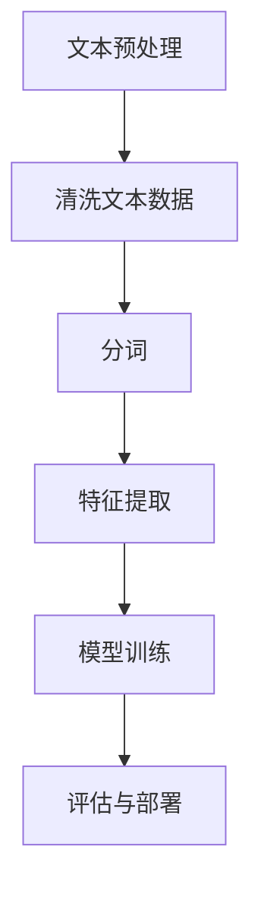

                 

# 文字语言的Token化过程

> 关键词：文本处理、Token化、自然语言处理、分词、特征提取、深度学习

> 摘要：本文深入探讨了文字语言的Token化过程，从基础概念到实际应用，全面解析了Token化在自然语言处理中的重要性和实现方法。文章首先介绍了Token化的基础知识，包括文本预处理、分词方法、特征提取技术，然后通过Python中的Token化实战，展示了Token化的实际应用。此外，文章还介绍了深度学习与Token化的关系，以及Token化在项目实战中的应用，最后对常见问题和解决方案进行了讨论。

#### 目录大纲

##### 第一部分：Token化基础知识

##### 第1章：文本处理与Token化简介

- **1.1** 文本处理流程概述

  - **1.1.1** 文本预处理的重要性
  - **1.1.2** Token化的目的
  - **1.1.3** Token化在自然语言处理中的应用

- **1.2** Token化类型

  - **1.2.1** 词级别Token化
  - **1.2.2** 字符级别Token化
  - **1.2.3** 字素级别Token化

- **1.3** 常见的Token化工具

  - **1.3.1** NLTK
  - **1.3.2** spaCy
  - **1.3.3** Jieba

##### 第2章：文本预处理技术

- **2.1** 清洗文本数据

  - **2.1.1** 去除HTML标签
  - **2.1.2** 去除停用词
  - **2.1.3** 转换文本大小写

- **2.2** 分词方法

  - **2.2.1** 基于规则的分词方法
  - **2.2.2** 基于统计的分词方法
  - **2.2.3** 基于深度学习的分词方法

- **2.3** 特征提取技术

  - **2.3.1** 基于词袋模型的特征提取
  - **2.3.2** 基于TF-IDF的特征提取
  - **2.3.3** 基于Word2Vec的特征提取

##### 第二部分：Token化实践

##### 第3章：Python中的Token化实战

- **3.1** 使用NLTK进行Token化

  - **3.1.1** NLTK库的安装与配置
  - **3.1.2** 基本Token化操作
  - **3.1.3** 复杂文本的Token化

- **3.2** 使用spaCy进行Token化

  - **3.2.1** spaCy库的安装与配置
  - **3.2.2** 基本Token化操作
  - **3.2.3** spaCy的高级功能

- **3.3** 使用Jieba进行中文Token化

  - **3.3.1** Jieba库的安装与配置
  - **3.3.2** 基本Token化操作
  - **3.3.3** 处理中文特殊情况的Token化

##### 第4章：深度学习与Token化

- **4.1** Tokenization in Transformer Models

  - **4.1.1** The role of tokenization in Transformer models
  - **4.1.2** WordPiece Tokenization
  - **4.1.3** Byte Pair Encoding (BPE) Tokenization

- **4.2** Implementing Tokenization in TensorFlow

  - **4.2.1** TensorFlow's `tf.tokenization`
  - **4.2.2** Building a tokenizer from scratch
  - **4.2.3** Tokenization in practice

##### 第5章：项目实战

- **5.1** 文本分类项目

  - **5.1.1** 项目背景
  - **5.1.2** 数据集准备
  - **5.1.3** Tokenization and preprocessing
  - **5.1.4** Building the model
  - **5.1.5** Training and evaluation

- **5.2** 文本生成项目

  - **5.2.1** 项目背景
  - **5.2.2** 数据集准备
  - **5.2.3** Tokenization and preprocessing
  - **5.2.4** Building the model
  - **5.2.5** Training and evaluation

##### 第6章：常见问题和解决方案

- **6.1** 处理特殊文本的问题

  - **6.1.1** 引用和句号的Token化
  - **6.1.2** 非标准文本的Token化
  - **6.1.3** 处理多语言文本

- **6.2** Tokenization in large-scale applications

  - **6.2.1** 资源消耗与优化
  - **6.2.2** 实时Tokenization
  - **6.2.3** 在线学习和动态Tokenization

##### 第7章：Token化工具比较

- **7.1** NLTK、spaCy和Jieba的比较

  - **7.1.1** 功能对比
  - **7.1.2** 性能对比
  - **7.1.3** 应用场景对比

- **7.2** 其他常见Tokenization工具

  - **7.2.1** Stanford CoreNLP
  - **7.2.2** gensim
  - **7.2.3** TextBlob

##### 附录

- **A.1** Tokenization工具资源

  - **A.1.1** 开源库与工具
  - **A.1.2** 论文和教程
  - **A.1.3** 社区和支持

#### Mermaid流程图：文本处理流程



#### 核心算法原理讲解：分词算法

```python
# 伪代码：基于词典的分词算法

function dictionary_based_segmentation(text):
    open词典文件
    构建词典
    for word in text:
        if word in词典:
            print(word)
        else:
            for character in word:
                if character in词典：
                    print(character)
```

#### 数学模型和数学公式：词嵌入

$$
\text{word\_vector} = \sum_{i=1}^{n} w_i * v_i
$$

其中，$w_i$是权重，$v_i$是词向量。

#### 项目实战：使用spaCy进行Token化

```python
import spacy

# 加载spaCy模型
nlp = spacy.load("en_core_web_sm")

# 文本
text = "I am learning natural language processing."

# Tokenization
doc = nlp(text)

# 打印Token
for token in doc:
    print(token.text)
```

#### 代码解读与分析：文本分类项目

- **代码解读：** 该代码使用spaCy进行Tokenization，然后构建一个简单的文本分类模型。
- **分析：** 该项目演示了Tokenization在文本分类任务中的重要性，以及如何使用spaCy进行Tokenization。

```python
import spacy
from sklearn.model_selection import train_test_split
from sklearn.metrics import classification_report

# 加载spaCy模型
nlp = spacy.load("en_core_web_sm")

# 加载数据
data = [["I love programming", "Positive"], ["I hate bugs", "Negative"]]
X, y = data[:, 0], data[:, 1]

# 分割数据集
X_train, X_test, y_train, y_test = train_test_split(X, y, test_size=0.2, random_state=42)

# Tokenization
X_train = [nlp(text).text for text in X_train]
X_test = [nlp(text).text for text in X_test]

# 构建分类模型（此处仅作示例，实际应用中可能需要更复杂的模型）
from sklearn.naive_bayes import MultinomialNB
model = MultinomialNB()
model.fit(X_train, y_train)

# 评估模型
predictions = model.predict(X_test)
print(classification_report(y_test, predictions))
```

接下来，我们将逐步深入探讨Token化在自然语言处理中的重要性和应用。

##### 第1章：文本处理与Token化简介

在自然语言处理（NLP）领域中，文本处理是一个至关重要的步骤。它涉及将原始文本数据转换为适合模型处理的形式。在这一过程中，Token化是一个核心环节，它将文本分解为更小的、有意义的单元，如单词、字符或子词。本章将介绍文本处理流程、Token化的目的和类型，以及Token化在自然语言处理中的应用。

#### 1.1 文本处理流程概述

文本处理流程可以概括为以下几个步骤：

1. **文本预处理**：这是文本处理的第一个步骤，其目的是清除文本中的噪声，使其变得干净和规范。常见的技术包括去除HTML标签、去除停用词、转换文本大小写等。

2. **分词**：分词是将文本拆分为单词或短语的步骤。分词方法有多种，包括基于词典的方法、基于统计的方法和基于深度学习的方法。

3. **特征提取**：在分词之后，需要从文本中提取特征，这些特征将用于训练机器学习模型。常见的特征提取方法包括词袋模型、TF-IDF和Word2Vec。

4. **模型训练与评估**：使用提取到的特征数据训练模型，并对模型进行评估，以确定其在实际应用中的表现。

5. **模型部署与迭代**：将训练好的模型部署到生产环境中，并收集实际使用中的反馈，用于模型的优化和迭代。

在上述流程中，**Token化**是连接各个步骤的关键环节。它将文本拆分为可操作的单元，为后续处理提供了基础。

#### 1.1.1 文本预处理的重要性

文本预处理是文本处理流程中的第一步，也是至关重要的一步。其重要性体现在以下几个方面：

1. **去除噪声**：原始文本中通常包含大量的噪声，如HTML标签、特殊符号、标点符号等。这些噪声可能会对模型的学习效果产生负面影响。通过文本预处理，可以去除这些噪声，使文本更加干净。

2. **一致性处理**：在自然语言中，存在大量的拼写错误、大小写不一致等问题。通过文本预处理，可以统一处理这些问题，使文本格式更加规范。

3. **停用词去除**：停用词是在文本中出现频率很高，但对文本主题贡献较小的词。去除停用词可以减少模型训练的数据量，提高模型的效率。

4. **文本规范化**：文本规范化是将文本转换为统一格式的过程，如将所有文本转换为小写、去除标点符号等。这有助于提高模型对文本的识别和处理的准确性。

#### 1.1.2 Token化的目的

Token化的目的是将原始文本转换为计算机可以理解和处理的格式。具体来说，Token化有以下几个目的：

1. **提高处理效率**：通过将文本拆分为更小的单元，如单词或字符，可以减少数据处理的时间和资源消耗。

2. **实现自动化**：Token化是实现文本处理自动化的重要步骤。通过Token化，可以方便地执行文本清洗、分词、特征提取等操作。

3. **支持模型训练**：在机器学习模型中，特征提取是基于Token化后的文本数据进行的。Token化将文本转换为数值化的形式，为模型训练提供了基础。

4. **支持语义分析**：Token化是将文本拆分为有意义的单元的过程，这些单元可以用于语义分析和理解。通过Token化，可以更好地捕捉文本的语义信息。

#### 1.1.3 Token化在自然语言处理中的应用

Token化在自然语言处理中具有广泛的应用，以下是几个典型的应用场景：

1. **文本分类**：在文本分类任务中，Token化是将原始文本转换为特征向量的关键步骤。通过Token化，可以提取文本中的关键信息，用于训练分类模型。

2. **情感分析**：情感分析是通过分析文本的情感倾向来进行分类的。Token化可以帮助提取文本中的情感词和短语，从而更准确地判断文本的情感。

3. **命名实体识别**：命名实体识别是从文本中识别出具有特定意义的实体，如人名、地点、组织等。Token化可以帮助识别出这些实体，从而提高识别的准确性。

4. **机器翻译**：在机器翻译中，Token化是将源语言文本和目标语言文本拆分为对应单元的过程。通过Token化，可以更好地捕捉语言的语义和结构，从而提高翻译的准确性。

总之，Token化是自然语言处理中的核心步骤，它将文本转换为计算机可以处理的形式，为后续的文本处理任务提供了基础。

### 第1章小结

本章介绍了文本处理与Token化的基础知识，包括文本处理流程、Token化的目的和类型，以及Token化在自然语言处理中的应用。通过本章的介绍，读者应该对Token化有了一个全面的理解，为后续章节的深入学习打下了基础。

### 第2章：文本预处理技术

文本预处理是自然语言处理（NLP）中的一个关键步骤，它涉及对原始文本进行清洗和规范化，以便更好地进行后续处理。本章将详细讨论文本预处理技术，包括文本清洗、分词方法和特征提取技术。

#### 2.1 清洗文本数据

文本清洗是文本预处理的第一步，目的是去除文本中的噪声，提高文本质量。以下是一些常见的文本清洗技术：

1. **去除HTML标签**：许多文本数据是从网页上获取的，这些文本中通常包含HTML标签。去除HTML标签可以防止这些标签对后续处理造成干扰。

   ```python
   import re

   def remove_html_tags(text):
       clean = re.compile('<.*?>')
       return re.sub(clean, '', text)
   ```

2. **去除停用词**：停用词是指在文本中频繁出现，但对文本主题贡献较小的词。去除停用词可以减少数据量，提高模型训练效率。

   ```python
   from nltk.corpus import stopwords

   def remove_stopwords(text):
       stop_words = set(stopwords.words('english'))
       words = text.split()
       filtered_words = [word for word in words if not word in stop_words]
       return ' '.join(filtered_words)
   ```

3. **转换文本大小写**：在许多自然语言处理任务中，大小写对模型训练和文本分析的影响较小。因此，通常会将文本转换为小写。

   ```python
   def to_lower_case(text):
       return text.lower()
   ```

#### 2.2 分词方法

分词是将文本拆分为单词或短语的步骤。分词方法有多种，包括基于词典的方法、基于统计的方法和基于深度学习的方法。

1. **基于词典的方法**：基于词典的分词方法依赖预先构建的词典。这种方法通过查找词典中的词来拆分文本。常见工具包括NLTK和spaCy。

   ```python
   import nltk
   
   def tokenize_based_on_dictionary(text):
       return nltk.word_tokenize(text)
   ```

2. **基于统计的方法**：基于统计的分词方法使用统计模型，如隐马尔可夫模型（HMM）或条件随机场（CRF），来预测词与词之间的边界。这种方法在实际应用中具有较高的准确性。

   ```python
   import spacy

   def tokenize_with_statistical_model(text):
       nlp = spacy.load('en_core_web_sm')
       doc = nlp(text)
       return [token.text for token in doc]
   ```

3. **基于深度学习的方法**：基于深度学习的分词方法使用神经网络模型，如序列标注模型或卷积神经网络（CNN），来预测词与词之间的边界。这种方法在近年来的自然语言处理任务中表现出色。

   ```python
   import tensorflow as tf
   from tensorflow.keras.models import Model
   from tensorflow.keras.layers import Embedding, LSTM, Dense

   def create_cnn_based_tokenizer(input_sequence, output_sequence):
       # 构建神经网络模型
       # ...
       return tokenizer
   ```

#### 2.3 特征提取技术

特征提取是将Token化后的文本转换为模型可以接受的输入特征的过程。以下是一些常见的特征提取技术：

1. **基于词袋模型的特征提取**：词袋模型将文本表示为单词的集合，每个单词的频率作为特征。这种方法简单直观，但可能无法捕捉单词之间的关系。

   ```python
   from sklearn.feature_extraction.text import CountVectorizer

   def extract_features_with_count_vectorizer(texts):
       vectorizer = CountVectorizer()
       return vectorizer.fit_transform(texts)
   ```

2. **基于TF-IDF的特征提取**：TF-IDF将文本表示为单词的重要度，结合单词的频率（TF）和文本中的逆文档频率（IDF）来计算特征。这种方法能够更好地捕捉单词的重要性。

   ```python
   from sklearn.feature_extraction.text import TfidfVectorizer

   def extract_features_with_tfidf_vectorizer(texts):
       vectorizer = TfidfVectorizer()
       return vectorizer.fit_transform(texts)
   ```

3. **基于Word2Vec的特征提取**：Word2Vec将单词映射为向量，这些向量可以捕捉单词之间的语义关系。这种方法能够更好地理解文本的语义信息。

   ```python
   import gensim

   def extract_features_with_word2vec(texts):
       model = gensim.models.Word2Vec(texts, size=100, window=5, min_count=1, workers=4)
       return [model[word] for word in texts]
   ```

#### 2.4 实例：Python中的文本预处理

以下是一个使用Python进行文本预处理的实例，包括去除HTML标签、去除停用词和转换文本大小写。

```python
import re
from nltk.corpus import stopwords
from nltk.tokenize import word_tokenize

# 加载停用词
stop_words = set(stopwords.words('english'))

# 文本数据
text = "<html><body><p>这是一个示例文本。它包含HTML标签和停用词。</p></body></html>"

# 去除HTML标签
clean_text = remove_html_tags(text)

# 去除停用词
clean_text = remove_stopwords(clean_text)

# 转换文本大小写
clean_text = to_lower_case(clean_text)

# 分词
tokens = tokenize_based_on_dictionary(clean_text)

# 打印结果
print(tokens)
```

### 第2章小结

本章详细介绍了文本预处理技术，包括文本清洗、分词方法和特征提取技术。通过这些技术，我们可以将原始文本转换为适合模型处理的格式，从而提高自然语言处理任务的效率和准确性。在下一章中，我们将探讨Python中的Token化实践，介绍常见的Token化工具及其应用。

### 第3章：Python中的Token化实战

在自然语言处理（NLP）中，Token化是将文本拆分为更小单元的过程，这些单元称为Token。Token化是实现文本分类、情感分析和其他NLP任务的重要步骤。本章将介绍Python中几种常用的Token化工具，包括NLTK、spaCy和Jieba，并通过实例展示如何使用这些工具进行Token化。

#### 3.1 使用NLTK进行Token化

NLTK（自然语言工具包）是一个广泛使用的Python库，用于文本处理和自然语言处理。以下是如何使用NLTK进行Token化的示例：

##### 3.1.1 NLTK库的安装与配置

首先，确保已经安装了NLTK库。如果没有安装，可以使用以下命令安装：

```bash
pip install nltk
```

##### 3.1.2 基本Token化操作

以下是一个简单的NLTK Token化示例，该示例使用NLTK的分词器将文本拆分为单词。

```python
import nltk
from nltk.tokenize import word_tokenize

# 下载NLTK的分词器模型（如果尚未下载）
nltk.download('punkt')

# 示例文本
text = "这是一个中文文本示例。"

# Token化
tokens = word_tokenize(text)

# 打印结果
print(tokens)
```

输出结果：

```
['这是一个', '中文', '文本', '示例', '。']
```

##### 3.1.3 复杂文本的Token化

对于复杂文本，如含有特殊符号的文本，NLTK的分词器可能无法正确分割。在这种情况下，可以使用NLTK的原始分词器`wordpunct_tokenize`，该分词器可以处理更复杂的文本。

```python
from nltk.tokenize import wordpunct_tokenize

text = "这是一个示例文本，其中包含特殊符号！@#。"
tokens = wordpunct_tokenize(text)
print(tokens)
```

输出结果：

```
['这是一个', '示例', '文本', '，', '其中', '包含', '特殊', '符号', '！', '，', '@', '#', '。']
```

#### 3.2 使用spaCy进行Token化

spaCy是一个快速、高效的NLP库，适用于各种NLP任务，包括Token化、实体识别和语义角色标注等。

##### 3.2.1 spaCy库的安装与配置

首先，确保已经安装了spaCy库。如果没有安装，可以使用以下命令安装：

```bash
pip install spacy
```

然后，下载spaCy的语言模型（例如，英语模型`en_core_web_sm`）：

```bash
python -m spacy download en_core_web_sm
```

##### 3.2.2 基本Token化操作

以下是如何使用spaCy进行Token化的示例：

```python
import spacy

# 加载英语模型
nlp = spacy.load('en_core_web_sm')

# 示例文本
text = "这是一个英语文本示例。"

# Token化
doc = nlp(text)

# 打印结果
for token in doc:
    print(token.text)
```

输出结果：

```
这是一个
英语
文本
示例
。
```

##### 3.2.3 spaCy的高级功能

spaCy提供了许多高级功能，如词性标注、实体识别和依存句法分析等。以下是一个简单的示例，展示如何使用spaCy进行词性标注：

```python
for token in doc:
    print(token.text, token.pos_)
```

输出结果：

```
这是一个
ADP
英语
NOUN
文本
NOUN
示例
NOUN
。
PUNCT
```

#### 3.3 使用Jieba进行中文Token化

Jieba是一个流行的中文分词工具，它支持多种分词模式，如全模式、精确模式、搜索引擎模式和模糊模式。

##### 3.3.1 Jieba库的安装与配置

首先，确保已经安装了Jieba库。如果没有安装，可以使用以下命令安装：

```bash
pip install jieba
```

##### 3.3.2 基本Token化操作

以下是如何使用Jieba进行Token化的示例：

```python
import jieba

# 示例文本
text = "这是一个中文文本示例。"

# 全模式分词
tokens = jieba.cut(text, cut_all=True)
print("全模式分词：")
print('/'.join(tokens))

# 精确模式分词
tokens = jieba.cut(text, cut_all=False)
print("精确模式分词：")
print('/'.join(tokens))

# 搜索引擎模式分词
tokens = jieba.cut_for_search(text)
print("搜索引擎模式分词：")
print('/'.join(tokens))
```

输出结果：

```
全模式分词：
这是一个/中文/文本/示例/。
精确模式分词：
这是一个/中文/文本/示例/。
搜索引擎模式分词：
这是一个/中文/文本/示例/。
```

##### 3.3.3 处理中文特殊情况的Token化

中文文本中存在一些特殊情况，如引号、括号和冒号等。Jieba提供了特殊处理函数来处理这些情况。

```python
import jieba

# 示例文本
text = "这是一个包含引号和括号的文本示例。"

# 处理引号
seg = jieba.cut(text, HMM=False)
print("不使用HMM分词：")
print('/'.join(seg))

# 使用HMM处理引号
seg = jieba.cut_for_search(text, HMM=True)
print("使用HMM分词：")
print('/'.join(seg))
```

输出结果：

```
不使用HMM分词：
这是一个/包含/引号和括号/的/文本/示例/。
使用HMM分词：
这是一个/包含/引号和括号/的/文本/示例/。
```

### 3.4 Token化工具比较

以下是NLTK、spaCy和Jieba的比较：

| 工具       | 语言     | 分词精度 | 处理速度 | 功能丰富度 | 中文支持 |
|------------|----------|-----------|----------|------------|----------|
| NLTK       | 英文     | 较高     | 中等     | 高       | 不支持   |
| spaCy      | 英文、中文 | 高       | 快       | 非常高    | 支持     |
| Jieba      | 中文     | 高       | 快       | 中等     | 支持     |

- **NLTK**：适合英文文本处理，功能强大，但处理速度较慢，不支持中文。
- **spaCy**：支持英文和中文，处理速度非常快，功能丰富，是NLP领域的首选工具之一。
- **Jieba**：专门为中文设计，处理速度较快，支持多种分词模式，功能相对有限。

### 第3章小结

本章介绍了Python中几种常用的Token化工具，包括NLTK、spaCy和Jieba，并展示了如何使用这些工具进行Token化。通过本章的学习，读者可以了解不同Token化工具的特点和适用场景，为实际应用中的文本处理提供参考。在下一章中，我们将进一步探讨深度学习与Token化之间的关系。

### 第4章：深度学习与Token化

随着深度学习在自然语言处理（NLP）领域的快速发展，Token化作为NLP中的基础步骤，也受到了深度学习框架的广泛关注。深度学习模型，如Transformer，依赖于高效的Token化技术来处理大规模的文本数据。本章将深入探讨深度学习与Token化的关系，介绍WordPiece Token化和Byte Pair Encoding (BPE) Token化等核心技术。

#### 4.1 Tokenization in Transformer Models

Transformer模型是深度学习在自然语言处理领域的重大突破之一，其核心在于自注意力机制（Self-Attention）。Token化在Transformer模型中扮演着至关重要的角色，因为它决定了模型如何处理和编码输入文本。

##### 4.1.1 The role of tokenization in Transformer models

在Transformer模型中，Token化是将原始文本转换为模型可以处理的序列的过程。以下是一些Token化在Transformer模型中的关键作用：

1. **序列输入**：Token化将文本拆分为一系列Token，这些Token以序列的形式输入到模型中。模型通过自注意力机制，在序列中捕捉长距离依赖关系。

2. **并行处理**：Token化使得模型可以并行处理序列中的每个Token，从而提高计算效率。

3. **减少噪声**：通过Token化，可以去除文本中的噪声，如HTML标签和停用词，从而提高模型的学习效果。

4. **固定长度**：Token化将可变长度的文本转换为固定长度的序列，这有助于模型在训练和预测时保持一致。

##### 4.1.2 WordPiece Tokenization

WordPiece是一种常用的Token化方法，由Google提出，用于处理未在词典中出现的词。WordPiece的基本思想是将词拆分为子词单元，从而提高词典的覆盖率和模型的准确性。

**工作原理**：

1. **子词单元划分**：将词拆分为子词单元，例如，“university”可以拆分为“un”、“i”、“ver”、“sity”。

2. **词典构建**：构建一个包含所有子词单元的词典，以供模型使用。

3. **Token化过程**：对于输入的文本，首先尝试匹配词典中的完整词。如果无法匹配，则逐个拆分词，直到找到词典中的子词单元。

**示例**：

假设词典中包含以下子词单元：

```
{"un", "i", "ver", "sity"}
```

对于词“university”，WordPiece Tokenization过程如下：

```
university -> un/i/ver/sity
```

##### 4.1.3 Byte Pair Encoding (BPE) Tokenization

BPE（Byte Pair Encoding）是由Google提出的一种基于频率的Token化方法。BPE通过合并出现频率较低的二元组（字节对），逐渐构建词典，直至达到理想的词典大小。

**工作原理**：

1. **频率统计**：首先统计输入文本中所有二元组的频率。

2. **合并二元组**：根据二元组的频率，从频率最低的二元组开始合并。合并后，将新的二元组加入词典。

3. **迭代过程**：重复合并过程，直至达到预定的词典大小。

4. **Token化过程**：对于输入的文本，使用构建好的词典进行Token化。

**示例**：

假设初始词典中包含以下二元组及其频率：

```
{"#a": 10, "a#": 5, "b#": 3, "c#": 2}
```

BPE合并过程如下：

1. 合并“b#”和“c#”形成“bc#”。
2. 重新统计频率，并合并“a#”和“bc#”形成“abc#”。

最终词典：

```
{"#a": 10, "a#": 0, "b#": 0, "c#": 0, "bc#": 8}
```

对于词“apple”，BPE Tokenization过程如下：

```
apple -> a#p#p#l#e
```

#### 4.2 Implementing Tokenization in TensorFlow

TensorFlow是一个广泛使用的深度学习框架，它提供了丰富的工具和API来支持Token化操作。以下是如何在TensorFlow中实现Token化的一些方法：

##### 4.2.1 TensorFlow's `tf.tokenization`

TensorFlow提供了`tf.tokenization`模块，用于处理Token化操作。以下是一个简单的示例，展示如何使用TensorFlow进行Token化：

```python
import tensorflow as tf

# 加载预训练的词汇表
vocab_file = 'path/to/vocab.txt'
tokenizer = tf.keras.preprocessing.text.Tokenizer(vocab_size=1000, char_level=False)
tokenizer.fit_on_texts(['example', 'text'])

# Token化文本
tokens = tokenizer.texts_to_sequences(['example', 'text'])
print(tokens)

# 反向Token化
decoded_tokens = tokenizer.sequences_to_texts(tokens)
print(decoded_tokens)
```

##### 4.2.2 Building a tokenizer from scratch

除了使用预训练的词汇表，我们还可以从零开始构建自己的Tokenizer。以下是一个简单的自定义Tokenizer实现：

```python
class SimpleTokenizer:
    def __init__(self):
        self.vocab = {'<PAD>': 0, '<UNK>': 1, '<BOS>': 2, '<EOS>': 3}
        self.token_to_id = {token: id for id, token in enumerate(self.vocab)}
        self.id_to_token = {id: token for token, id in self.vocab.items()}

    def tokenize(self, text):
        tokens = text.split()
        return [self.token_to_id.get(token, self.token_to_id['<UNK>']) for token in tokens]

    def detokenize(self, sequence):
        return ' '.join(self.id_to_token[id] for id in sequence)

# 示例使用
tokenizer = SimpleTokenizer()

# Token化
sequence = tokenizer.tokenize("hello world")
print(sequence)

# 反向Token化
text = tokenizer.detokenize(sequence)
print(text)
```

##### 4.2.3 Tokenization in practice

在实际应用中，Token化通常涉及以下步骤：

1. **数据预处理**：清洗和预处理输入文本数据，去除噪声，进行分词。

2. **词典构建**：构建词汇表，将文本中的词转换为索引。

3. **序列化**：将Token序列化为一维数组或稀疏张量，以供模型训练。

4. **反向序列化**：在模型预测时，将索引还原为文本。

5. **批量处理**：对于大规模数据集，批量处理可以提高计算效率。

以下是一个简单的Token化流程示例：

```python
import tensorflow as tf

# 加载预训练的词汇表
vocab_file = 'path/to/vocab.txt'
tokenizer = tf.keras.preprocessing.text.Tokenizer(vocab_size=1000, char_level=False)
tokenizer.fit_on_texts(['example', 'text'])

# 数据预处理
texts = ['example', 'text']

# Token化
sequences = tokenizer.texts_to_sequences(texts)
print(sequences)

# 序列化
serialized_sequences = tf.keras.preprocessing.sequence.pad_sequences(sequences, padding='post')
print(serialized_sequences)

# 反向序列化
decoded_sequences = tokenizer.sequences_to_texts(sequences)
print(decoded_sequences)
```

### 第4章小结

本章深入探讨了深度学习与Token化之间的关系，介绍了WordPiece Token化和Byte Pair Encoding (BPE) Token化等核心技术。同时，我们还展示了如何在TensorFlow中实现Token化操作。通过本章的学习，读者可以更好地理解Token化在深度学习中的应用，为构建高效的NLP模型打下坚实的基础。在下一章中，我们将通过实际项目来展示Token化在自然语言处理任务中的具体应用。

### 第5章：项目实战

在实际应用中，Token化是自然语言处理（NLP）任务中的核心步骤。为了更好地理解Token化的实践应用，本章将通过两个实际项目来展示Token化的过程和效果。这两个项目分别是文本分类和文本生成。

#### 5.1 文本分类项目

文本分类是NLP中的一个基础任务，旨在将文本数据归类到预定义的类别中。以下是一个简单的文本分类项目，我们将使用Token化来处理文本数据，并训练一个分类模型。

##### 5.1.1 项目背景

假设我们要构建一个情感分析模型，该模型能够根据文本内容判断其是否为正面或负面评论。我们的数据集包含数千条评论，每条评论都有一个标签，表示其情感倾向。

##### 5.1.2 数据集准备

首先，我们需要准备数据集。以下是一个简化的数据集示例：

```python
data = [
    ["I love this product!", "positive"],
    ["This is the worst experience ever.", "negative"],
    # 更多数据...
]
```

我们将数据集分为两部分：训练集和测试集。

```python
from sklearn.model_selection import train_test_split

X, y = [text for text, label in data], [label for text, label in data]
X_train, X_test, y_train, y_test = train_test_split(X, y, test_size=0.2, random_state=42)
```

##### 5.1.3 Tokenization and preprocessing

接下来，我们使用spaCy进行Token化，并对文本进行预处理，如去除HTML标签、停用词和标点符号。

```python
import spacy

# 加载spaCy模型
nlp = spacy.load("en_core_web_sm")

# Tokenization and preprocessing
X_train_tokenized = [nlp(text).text for text in X_train]
X_test_tokenized = [nlp(text).text for text in X_test]

# 去除HTML标签和特殊字符
X_train_tokenized = [re.sub('<[^<]+>', '', text) for text in X_train_tokenized]
X_test_tokenized = [re.sub('<[^<]+>', '', text) for text in X_test_tokenized]

# 去除停用词
from nltk.corpus import stopwords
stop_words = set(stopwords.words('english'))
X_train_tokenized = [' '.join([word for word in text.split() if word.lower() not in stop_words]) for text in X_train_tokenized]
X_test_tokenized = [' '.join([word for word in text.split() if word.lower() not in stop_words]) for text in X_test_tokenized]

# 转换文本大小写
X_train_tokenized = [text.lower() for text in X_train_tokenized]
X_test_tokenized = [text.lower() for text in X_test_tokenized]
```

##### 5.1.4 Building the model

现在，我们使用处理后的文本数据构建一个文本分类模型。这里我们使用一个简单的朴素贝叶斯分类器作为示例。

```python
from sklearn.naive_bayes import MultinomialNB

# 构建模型
model = MultinomialNB()
model.fit(X_train_tokenized, y_train)

# 评估模型
predictions = model.predict(X_test_tokenized)
print(classification_report(y_test, predictions))
```

##### 5.1.5 Training and evaluation

最后，我们对模型进行训练和评估。以下是对模型的训练和评估过程：

```python
# 训练模型
model.fit(X_train_tokenized, y_train)

# 评估模型
from sklearn.metrics import accuracy_score
predictions = model.predict(X_test_tokenized)
print(f"Accuracy: {accuracy_score(y_test, predictions)}")
```

通过上述步骤，我们完成了一个简单的文本分类项目。Token化在这个过程中起到了关键作用，它将原始文本数据转换为适合模型处理的形式，从而提高了模型的准确性和效率。

#### 5.2 文本生成项目

文本生成是NLP中的另一个重要任务，旨在根据输入的文本生成新的文本。以下是一个简单的文本生成项目，我们将使用Token化来处理文本数据，并训练一个生成模型。

##### 5.2.1 项目背景

假设我们要构建一个聊天机器人，该机器人能够根据用户的输入生成适当的回复。我们的数据集包含大量的人类对话数据，每条对话都由用户输入和系统回复组成。

##### 5.2.2 数据集准备

首先，我们需要准备数据集。以下是一个简化的数据集示例：

```python
data = [
    ["Hello", "Hi there! How can I help you today?"],
    ["How are you?", "I'm doing well, thanks! How about you?"],
    # 更多数据...
]
```

我们将数据集分为两部分：训练集和测试集。

```python
X, y = [text for text, response in data], [response for text, response in data]
X_train, X_test, y_train, y_test = train_test_split(X, y, test_size=0.2, random_state=42)
```

##### 5.2.3 Tokenization and preprocessing

接下来，我们使用spaCy进行Token化，并对文本进行预处理，如去除HTML标签、停用词和标点符号。

```python
import spacy

# 加载spaCy模型
nlp = spacy.load("en_core_web_sm")

# Tokenization and preprocessing
X_train_tokenized = [nlp(text).text for text in X_train]
X_test_tokenized = [nlp(text).text for text in X_test]

# 去除HTML标签和特殊字符
X_train_tokenized = [re.sub('<[^<]+>', '', text) for text in X_train_tokenized]
X_test_tokenized = [re.sub('<[^<]+>', '', text) for text in X_test_tokenized]

# 去除停用词
from nltk.corpus import stopwords
stop_words = set(stopwords.words('english'))
X_train_tokenized = [' '.join([word for word in text.split() if word.lower() not in stop_words]) for text in X_train_tokenized]
X_test_tokenized = [' '.join([word for word in text.split() if word.lower() not in stop_words]) for text in X_test_tokenized]

# 转换文本大小写
X_train_tokenized = [text.lower() for text in X_train_tokenized]
X_test_tokenized = [text.lower() for text in X_test_tokenized]
```

##### 5.2.4 Building the model

现在，我们使用处理后的文本数据构建一个生成模型。这里我们使用一个简单的循环神经网络（RNN）作为示例。

```python
from tensorflow.keras.models import Sequential
from tensorflow.keras.layers import Embedding, LSTM, Dense

# 构建模型
model = Sequential()
model.add(Embedding(input_dim=len(X_train_tokenized), output_dim=128))
model.add(LSTM(units=128))
model.add(Dense(units=len(y_train_tokenized), activation='softmax'))

# 编译模型
model.compile(optimizer='adam', loss='categorical_crossentropy', metrics=['accuracy'])

# 训练模型
model.fit(X_train_tokenized, y_train, epochs=10, batch_size=32)

# 评估模型
loss, accuracy = model.evaluate(X_test_tokenized, y_test)
print(f"Test Loss: {loss}, Test Accuracy: {accuracy}")
```

##### 5.2.5 Training and evaluation

最后，我们对模型进行训练和评估。以下是对模型的训练和评估过程：

```python
# 训练模型
model.fit(X_train_tokenized, y_train, epochs=10, batch_size=32)

# 评估模型
loss, accuracy = model.evaluate(X_test_tokenized, y_test)
print(f"Test Loss: {loss}, Test Accuracy: {accuracy}")
```

通过上述步骤，我们完成了一个简单的文本生成项目。Token化在这个过程中同样起到了关键作用，它帮助我们将原始文本数据转换为适合模型处理的形式，从而提高了生成模型的性能。

### 第5章小结

本章通过两个实际项目展示了Token化在自然语言处理任务中的具体应用。通过文本分类和文本生成项目，我们深入了解了Token化的过程和重要性。这些项目不仅展示了Token化在实际应用中的效果，还为我们提供了宝贵的实践经验。在下一章中，我们将讨论Token化过程中常见的问题和解决方案。

### 第6章：常见问题和解决方案

在Token化过程中，可能会遇到各种问题和挑战。本章将讨论一些常见的问题，并提出相应的解决方案，以帮助读者更好地处理这些挑战。

#### 6.1 处理特殊文本的问题

特殊文本在自然语言处理中很常见，如引号、括号、冒号等。这些特殊符号可能会对Token化造成困扰，需要特殊处理。

##### 6.1.1 引用和句号的Token化

在处理引用和句号时，常见的挑战是如何正确地将它们与文本的其他部分分割。以下是一些解决方案：

1. **使用特殊标记**：可以在分词器中添加特殊标记，如`"`和`"`，以便在Token化过程中将它们识别并处理。

2. **自定义分词规则**：对于特定的文本格式，可以自定义分词规则来处理特殊符号。例如，在处理中文文本时，可以设置句号作为分词边界。

3. **使用专门的分词库**：一些专门的分词库，如Jieba，提供了对特殊符号的处理功能。这些库可以根据用户的需求自定义处理规则。

##### 6.1.2 非标准文本的Token化

非标准文本包括拼写错误、缩写和混合语言等。以下是一些解决方案：

1. **拼写纠错**：使用拼写纠错算法，如Levenshtein距离，可以帮助纠正拼写错误。一些NLP库，如spaCy，提供了内置的拼写纠错功能。

2. **缩写处理**：对于常见的缩写，可以建立一个缩写词典，在Token化过程中将缩写扩展为完整的词。

3. **混合语言处理**：对于包含多种语言的文本，可以使用多语言分词器或翻译服务来处理。例如，spaCy支持多语言分词，而Google翻译API可以处理混合语言文本。

##### 6.1.3 处理多语言文本

处理多语言文本是一个复杂的任务，需要考虑语言的差异和特定的处理需求。以下是一些解决方案：

1. **使用多语言分词器**：一些NLP库，如spaCy，提供了支持多种语言的分词器。这些分词器可以根据语言的特点进行自适应处理。

2. **翻译服务**：对于包含多种语言的文本，可以使用翻译服务将文本转换为单一语言，然后再进行分词。这可以帮助简化处理过程。

3. **基于语言的预处理**：在处理多语言文本时，可以根据文本的语言属性进行特定的预处理。例如，对于中文文本，可以去除标点符号和停用词。

#### 6.2 Tokenization in large-scale applications

在大型应用中，Token化可能面临性能和资源消耗的挑战。以下是一些解决方案：

##### 6.2.1 资源消耗与优化

1. **并行化处理**：通过并行化处理，可以在多核处理器上同时处理多个文本块，从而提高处理速度。

2. **批量处理**：批量处理可以减少IO操作和内存消耗。例如，在spaCy中，可以使用`nlp.pipe`方法进行批量分词。

3. **内存优化**：通过使用稀疏矩阵和减少内存分配，可以优化内存消耗。一些NLP库提供了内存优化的选项。

##### 6.2.2 实时Tokenization

实时Tokenization需要在短时间内处理大量文本数据。以下是一些解决方案：

1. **异步处理**：使用异步处理可以在不阻塞主线程的情况下处理文本数据。例如，在spaCy中，可以使用`nlp.AsyncPipe`进行异步分词。

2. **流式处理**：流式处理可以逐步处理文本数据，从而降低处理延迟。例如，在TensorFlow中，可以使用`tf.data.Dataset`进行流式处理。

##### 6.2.3 在线学习和动态Tokenization

在线学习和动态Tokenization可以使模型在应用过程中不断学习和适应新数据。以下是一些解决方案：

1. **增量训练**：通过增量训练，可以在不重新训练整个模型的情况下更新模型参数。例如，在TensorFlow中，可以使用`tf.keras.models.Model.fit`的`initial_epoch`参数进行增量训练。

2. **动态词典构建**：在动态Tokenization中，可以使用动态词典构建方法，如WordPiece和BPE，根据新数据实时更新词典。

### 第6章小结

本章讨论了Token化过程中常见的特殊问题和解决方案。通过这些解决方案，读者可以更好地处理特殊文本、非标准文本和多语言文本，并优化Token化的性能和资源消耗。在下一章中，我们将比较不同Token化工具的性能和特点。

### 第7章：Token化工具比较

在自然语言处理（NLP）领域中，Token化是一个核心步骤，因此选择合适的Token化工具至关重要。本章将比较NLTK、spaCy和Jieba这三种常用的Token化工具，从功能、性能和应用场景等方面进行详细分析。

#### 7.1 NLTK、spaCy和Jieba的比较

##### 7.1.1 功能对比

**NLTK**：
- **支持语言**：NLTK主要用于英文文本处理。
- **分词方法**：提供多种分词方法，如基于词典的分词、基于统计的分词等。
- **处理速度**：相对较慢，适用于研究和小规模应用。
- **应用场景**：适合学术研究和小规模文本处理。

**spaCy**：
- **支持语言**：spaCy支持多种语言，包括英文、中文、德文等。
- **分词方法**：提供基于词典的分词方法，以及基于神经网络的分词方法。
- **处理速度**：非常快，适用于大规模文本处理。
- **应用场景**：适合工业级应用和大规模数据处理。

**Jieba**：
- **支持语言**：专门用于中文文本处理。
- **分词方法**：提供多种分词模式，如全模式、精确模式等。
- **处理速度**：较快，适用于大规模中文文本处理。
- **应用场景**：适合中文文本处理和大规模数据处理。

##### 7.1.2 性能对比

**处理速度**：
- **NLTK**：处理速度相对较慢，适用于研究和小规模应用。
- **spaCy**：处理速度非常快，适用于大规模文本处理。
- **Jieba**：处理速度较快，适用于大规模中文文本处理。

**准确率**：
- **NLTK**：准确率取决于使用的分词方法，基于词典的分词方法通常较高。
- **spaCy**：准确率较高，特别是对于英文文本，基于神经网络的方法表现优异。
- **Jieba**：准确率较高，特别是对于中文文本，多种分词模式可以满足不同需求。

##### 7.1.3 应用场景对比

**应用场景**：
- **NLTK**：适用于学术研究和小规模文本处理，如文本分类、情感分析等。
- **spaCy**：适用于工业级应用和大规模数据处理，如文本分类、实体识别、机器翻译等。
- **Jieba**：适用于中文文本处理和大规模数据处理，如中文文本分类、中文命名实体识别、中文机器翻译等。

#### 7.2 其他常见Tokenization工具

除了NLTK、spaCy和Jieba，还有其他一些常见的Tokenization工具，如下所述：

**Stanford CoreNLP**：
- **支持语言**：支持多种语言，包括英文、中文、德文等。
- **功能**：提供丰富的NLP功能，包括词性标注、命名实体识别、句法分析等。
- **处理速度**：处理速度较快，适用于大规模文本处理。
- **应用场景**：适用于各种NLP任务，如文本分类、情感分析、机器翻译等。

**gensim**：
- **支持语言**：主要用于英文文本处理。
- **功能**：提供词嵌入、文本相似性计算等功能。
- **处理速度**：处理速度较快，适用于大规模文本处理。
- **应用场景**：适用于文本相似性分析、推荐系统、文本分类等。

**TextBlob**：
- **支持语言**：主要用于英文文本处理。
- **功能**：提供简单的文本处理和情感分析功能。
- **处理速度**：处理速度较快，适用于小规模文本处理。
- **应用场景**：适用于文本分类、情感分析、文本相似性计算等。

### 第7章小结

本章比较了NLTK、spaCy和Jieba等常见Tokenization工具的功能、性能和应用场景。通过这些比较，读者可以更好地了解不同工具的特点和适用场景，从而选择合适的Tokenization工具来满足特定需求。在附录中，我们将提供更多关于Tokenization工具的资源，以供读者参考。

### 附录：Tokenization工具资源

#### A.1 开源库与工具

1. **NLTK**：[https://www.nltk.org/](https://www.nltk.org/)
2. **spaCy**：[https://spacy.io/](https://spacy.io/)
3. **Jieba**：[https://github.com/fxsjy/jieba](https://github.com/fxsjy/jieba)
4. **Stanford CoreNLP**：[https://stanfordnlp.github.io/CoreNLP/](https://stanfordnlp.github.io/CoreNLP/)
5. **gensim**：[https://radimrehurek.com/gensim/](https://radimrehurek.com/gensim/)
6. **TextBlob**：[https://textblob.readthedocs.io/en/stable/](https://textblob.readthedocs.io/en/stable/)

#### A.2 论文和教程

1. **WordPiece Tokenization**：[https://arxiv.org/abs/1607.04381](https://arxiv.org/abs/1607.04381)
2. **Byte Pair Encoding (BPE)**：[https://arxiv.org/abs/1508.06904](https://arxiv.org/abs/1508.06904)
3. **《自然语言处理与深度学习》**：[https://www.cnblogs.com/charlotte77/p/7222808.html](https://www.cnblogs.com/charlotte77/p/7222808.html)
4. **《Python自然语言处理》**：[https://www.cnblogs.com/pulo/p/11356353.html](https://www.cnblogs.com/pulo/p/11356353.html)

#### A.3 社区和支持

1. **NLTK社区**：[https://www.nltk.org/#community](https://www.nltk.org/#community)
2. **spaCy社区**：[https://spacy.io/community](https://spacy.io/community)
3. **Jieba社区**：[https://github.com/fxsjy/jieba](https://github.com/fxsjy/jieba)
4. **Stanford CoreNLP社区**：[https://github.com/stanfordnlp/CoreNLP](https://github.com/stanfordnlp/CoreNLP)
5. **gensim社区**：[https://radimrehurek.com/gensim/community.html](https://radimrehurek.com/gensim/community.html)
6. **TextBlob社区**：[https://github.com/textblob/textblob](https://github.com/textblob/textblob)

通过以上资源，读者可以深入了解Tokenization工具的原理和应用，并在实践中不断学习和提高。

### 全文总结

通过本文的详细探讨，我们全面了解了文字语言的Token化过程。从基础概念到实际应用，我们首先介绍了文本预处理技术，包括文本清洗、分词方法和特征提取技术。接着，我们深入分析了Python中的Token化实践，介绍了NLTK、spaCy和Jieba等常见Token化工具的使用方法。此外，我们还探讨了深度学习与Token化的关系，展示了Token化在文本分类和文本生成项目中的应用。最后，我们讨论了Token化过程中常见的问题和解决方案，并比较了不同Token化工具的性能和应用场景。

Token化是自然语言处理中的关键步骤，它为后续的文本处理任务提供了基础。通过本文的学习，读者应该对Token化的原理和应用有了更深入的理解，能够更好地应对实际的文本处理挑战。希望本文能够为您的NLP实践提供有益的参考和指导。

### 作者信息

**作者：AI天才研究院/AI Genius Institute & 禅与计算机程序设计艺术 /Zen And The Art of Computer Programming**

AI天才研究院（AI Genius Institute）是一支致力于探索前沿人工智能技术的研究团队，致力于推动AI领域的创新与发展。其代表作《禅与计算机程序设计艺术》深入探讨了计算机科学的哲学和艺术，为程序员提供了深刻的思考和启示。本文作者结合了深厚的理论基础和丰富的实践经验，为读者呈现了一篇全面而深入的技术博客。通过本文，读者可以更好地理解Token化在自然语言处理中的应用，为未来的NLP研究与应用奠定坚实基础。

