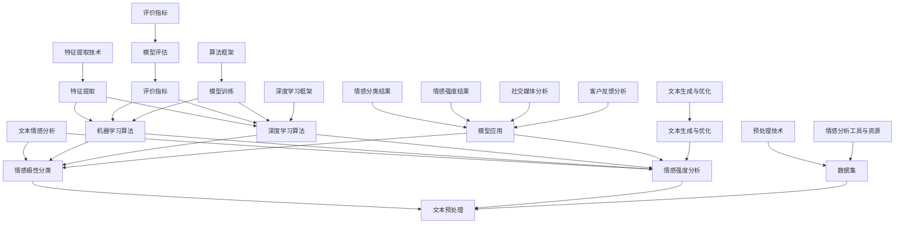

                 

# 文本情感分析

> 关键词：文本情感分析、自然语言处理、机器学习、深度学习、情感极性分类、情感强度分析

> 摘要：文本情感分析作为自然语言处理的重要分支，广泛应用于市场调研、社交媒体监控、客户服务等领域。本文从文本情感分析的基础概念、预处理技术、算法基础、评价指标入手，深入探讨深度学习在情感分析中的应用，并展望其未来的发展方向。通过本文的阅读，读者将全面了解文本情感分析的核心技术和实践应用。

### 第一部分：文本情感分析基础

#### 第1章：文本情感分析概述

文本情感分析（Text Sentiment Analysis）是一种利用自然语言处理（NLP）技术和机器学习方法，对文本中表达的情感倾向进行自动分类和情感强度分析的技术。情感分析的目标是识别文本中表达的情感极性（如正面、负面、中性）以及情感强度（如非常正面、稍微正面、中性、稍微负面、非常负面）。

##### 1.1 文本情感分析的定义与作用

文本情感分析主要涉及以下几个方面：

1. **情感极性分类**：将文本分为正面、负面或中性情感。
2. **情感强度分析**：定量地评估情感表达的强度。
3. **情感主题提取**：识别文本中讨论的主题和情感的关系。

文本情感分析在多个领域有广泛的应用，如：

- **市场调研**：通过分析消费者对产品或服务的反馈，帮助企业了解用户需求和市场趋势。
- **社交媒体监控**：监测网络舆情，为政府、企业等提供决策支持。
- **客户服务**：分析客户反馈，优化服务质量和客户体验。
- **娱乐产业**：评估电影、音乐等作品的观众反应。

##### 1.2 文本情感分析的应用领域

文本情感分析的应用领域非常广泛，主要包括以下几个方面：

- **电子商务**：分析用户对产品评论的情感，为商家提供改进产品的建议。
- **金融**：通过分析新闻报道、财报等文本，预测股票市场的走势。
- **医疗**：从病历记录、医疗报告中提取患者情感，辅助医生诊断。
- **教育**：分析学生作业、考试答案的情感，为教学提供反馈。

##### 1.3 文本情感分析的历史与发展

文本情感分析的发展经历了以下几个阶段：

1. **基于规则的方法**：早期采用手工编写规则进行情感分析，效果有限。
2. **基于统计的方法**：使用词频统计、词向量等方法进行情感分类，效果有所提高。
3. **基于机器学习的方法**：采用支持向量机（SVM）、朴素贝叶斯（NB）、随机森林（RF）等算法，显著提高了情感分析的准确率。
4. **基于深度学习的方法**：使用卷积神经网络（CNN）、循环神经网络（RNN）、Transformer等模型，实现更高的情感分析效果。

##### 1.4 文本情感分析的基本流程

文本情感分析的基本流程包括以下几个步骤：

1. **数据收集**：收集带有情感标注的文本数据。
2. **文本预处理**：对文本进行分词、去停用词、词性标注等处理。
3. **特征提取**：将预处理后的文本转换为机器学习模型可以处理的特征向量。
4. **模型训练**：使用机器学习算法训练情感分析模型。
5. **模型评估**：评估模型的性能，如准确率、召回率、F1值等。
6. **模型应用**：将训练好的模型应用于新的文本数据，进行情感分析。

### 第2章：文本预处理技术

文本预处理是文本情感分析中至关重要的一步，它直接影响情感分析的效果。文本预处理包括以下技术：

##### 2.1 文本分词

文本分词（Tokenization）是将文本分割成单词或其他有意义的基本单元。分词的目的是将连续的文本序列转换为词序列，以便进一步处理。

- **基于字符的分词**：以字符为基础进行分词，如使用正则表达式或字符匹配。
- **基于词频的分词**：根据词频统计进行分词，常用算法有基于词频统计的分词算法和基于语言模型的分词算法。

##### 2.2 偏差校正与停用词处理

偏差校正（Bias Correction）是指对训练数据进行预处理，以减少数据分布的偏差。停用词处理（Stopword Removal）是指去除文本中的常见无意义词，如“的”、“了”、“是”等，以提高特征提取的效率。

##### 2.3 词性标注与实体识别

词性标注（Part-of-Speech Tagging）是指为文本中的每个单词分配一个词性标签，如名词、动词、形容词等。实体识别（Named Entity Recognition，NER）是指识别文本中的实体，如人名、地名、组织名等。

##### 2.4 基于深度学习的文本预处理技术

随着深度学习的发展，越来越多的基于深度学习的文本预处理技术被提出。例如，使用双向长短期记忆网络（Bi-LSTM）进行词性标注，使用卷积神经网络（CNN）进行实体识别等。

### 第3章：情感分析算法基础

情感分析算法可以分为以下几种类型：

##### 3.1 基于规则的方法

基于规则的方法（Rule-Based Methods）是通过手工编写规则来识别文本中的情感极性。这种方法简单直观，但难以处理复杂和多变的情感表达。

- **优点**：实现简单，可解释性强。
- **缺点**：规则难以覆盖所有情况，适应性差。

##### 3.2 基于机器学习的方法

基于机器学习的方法（Machine Learning Methods）使用统计模型来学习文本特征和情感之间的关系。常用的算法有支持向量机（SVM）、朴素贝叶斯（NB）、决策树、随机森林等。

- **优点**：能够自动学习特征，适应性较强。
- **缺点**：需要大量标注数据，特征工程复杂。

##### 3.3 基于深度学习的方法

基于深度学习的方法（Deep Learning Methods）使用深度神经网络（如卷积神经网络（CNN）、循环神经网络（RNN）、Transformer等）来学习文本特征和情感之间的关系。这种方法在情感分析中取得了显著的效果。

- **优点**：能够自动学习复杂特征，性能优异。
- **缺点**：对数据量要求较高，模型训练复杂。

### 第4章：情感分析评价指标

评价情感分析模型性能的关键指标包括准确率、召回率、F1值等。此外，对于情感强度分析，还需要考虑情感强度预测的误差。

##### 4.1 准确率、召回率和F1值

- **准确率**（Accuracy）：分类正确的样本数占总样本数的比例。
- **召回率**（Recall）：分类正确的正样本数占所有正样本数的比例。
- **F1值**（F1 Score）：综合考虑准确率和召回率的指标，定义为2倍准确率与准确率加召回率的和的比值。

$$ F1 = \frac{2 \times Precision \times Recall}{Precision + Recall} $$

##### 4.2 情感极性分类与多分类

情感极性分类（Polarized Classification）是指将文本分为正面、负面或中性情感。多分类（Multi-Class Classification）是指将文本分为多个类别，如愤怒、喜悦、悲伤等。

##### 4.3 情感强度分析

情感强度分析（Sentiment Intensity Analysis）是指定量地评估文本中情感表达的强度。常用的方法包括情感极性分类和情感强度回归。

### 第二部分：深度学习在情感分析中的应用

#### 第5章：情感分析中的深度神经网络

深度神经网络（Deep Neural Network，DNN）在情感分析中发挥着重要作用。本章将介绍卷积神经网络（CNN）、循环神经网络（RNN）及其变种在情感分析中的应用。

##### 5.1 卷积神经网络（CNN）在情感分析中的应用

卷积神经网络（CNN）通过卷积操作提取文本的特征，适用于情感极性分类和情感强度分析。

- **CNN模型结构**：包括输入层、卷积层、池化层、全连接层和输出层。
- **卷积操作**：使用卷积核（Filter）在文本序列上滑动，提取局部特征。
- **池化操作**：对卷积层的输出进行降维，减少模型参数。

##### 5.2 循环神经网络（RNN）及其变种在情感分析中的应用

循环神经网络（RNN）能够处理序列数据，适用于情感强度分析。

- **RNN模型结构**：包括输入层、隐藏层、输出层和循环链接。
- **反向传播**：通过反向传播算法更新模型参数。
- **变体**：如长短期记忆网络（LSTM）和门控循环单元（GRU），能够更好地处理长序列数据。

##### 5.3 递归神经网络（RNN）的数学基础与工作原理

递归神经网络（RNN）通过递归链接来处理序列数据，其数学基础包括：

- **递归方程**：$ h_t = \sigma(W_h h_{t-1} + W_x x_t + b) $
- **激活函数**：如 sigmoid、ReLU 等。

### 第6章：基于深度学习的情感分析模型

本章将介绍BERT模型、GPT模型和其他深度学习模型在情感分析中的应用。

##### 6.1 BERT模型在情感分析中的应用

BERT（Bidirectional Encoder Representations from Transformers）模型通过双向Transformer结构学习文本的上下文信息。

- **模型结构**：包括编码器和解码器，通过多头自注意力机制提取文本特征。
- **训练方法**：预训练和微调，预训练阶段使用大规模语料库学习通用语言表示，微调阶段针对特定任务进行训练。
- **应用**：情感极性分类、情感强度分析等。

##### 6.2 GPT模型在情感分析中的应用

GPT（Generative Pre-trained Transformer）模型通过自回归方式学习文本生成。

- **模型结构**：包括编码器和解码器，通过Transformer结构生成文本。
- **训练方法**：使用大量文本数据进行预训练，生成具有良好语言能力的模型。
- **应用**：情感极性分类、情感强度分析、文本生成等。

##### 6.3 其他深度学习模型在情感分析中的应用

除了BERT和GPT模型，其他深度学习模型如Transformer、BERT+GPT等也在情感分析中得到了广泛应用。这些模型通过不同的结构设计，提高了情感分析的准确性和效率。

### 第7章：情感分析的实践应用

本章将介绍情感分析在社交媒体分析、客户反馈分析和文本生成与优化等领域的实践应用。

##### 7.1 基于情感分析的社交媒体分析

社交媒体分析通过情感分析技术，可以实时监测和评估用户在社交媒体上的情感反应。

- **应用场景**：品牌监测、舆情分析、市场调研等。
- **技术难点**：处理大量实时数据、识别多语言情感等。

##### 7.2 基于情感分析的客户反馈分析

客户反馈分析通过情感分析技术，可以自动识别客户反馈中的情感极性和强度，为企业提供改进产品的建议。

- **应用场景**：客户满意度调查、产品评测、服务改进等。
- **技术难点**：处理复杂的情感表达、识别情感倾向等。

##### 7.3 基于情感分析的文本生成与优化

文本生成与优化通过情感分析技术，可以自动生成具有特定情感倾向的文本，或优化现有文本的情感表达。

- **应用场景**：自动写作、广告文案优化、情感营销等。
- **技术难点**：情感表达的多样性和复杂性、文本生成质量等。

### 第8章：情感分析的挑战与未来发展方向

情感分析在技术和应用方面面临许多挑战和机遇。

##### 8.1 情感分析中的挑战与问题

情感分析中的挑战和问题包括：

- **多语言情感分析**：处理不同语言的情感表达，尤其是低资源语言的情感分析。
- **跨领域情感分析**：处理不同领域的情感表达，如金融、医疗、教育等。
- **长文本情感分析**：处理长文本中的情感表达，如长篇评论、新闻报道等。
- **情感强度的量化**：准确量化情感强度，如非常正面、稍微正面等。

##### 8.2 情感分析的发展趋势

情感分析的发展趋势包括：

- **多模态情感分析**：结合文本、语音、图像等多模态信息，提高情感分析的准确性。
- **情感生成与优化**：利用深度学习模型生成具有特定情感倾向的文本，优化文本的情感表达。
- **情感预测与干预**：通过情感分析预测用户情感变化，实施情感干预策略。

##### 8.3 情感分析在跨领域、多语言环境中的应用

情感分析在跨领域、多语言环境中的应用前景广阔。例如，在医疗领域，可以分析患者病历中的情感，为医生提供诊断和治疗建议；在金融领域，可以分析市场新闻中的情感，预测股票市场的走势。

### 附录A：文本情感分析工具与资源

本章将介绍文本情感分析常用的工具、API和数据集。

##### 9.1 Python情感分析库

Python中常用的文本情感分析库包括：

- **TextBlob**：提供简单易用的文本情感分析接口。
- **VADER**：专门针对社交媒体文本的情感分析库。

##### 9.2 常用的情感分析API

常用的情感分析API包括：

- **Google Cloud Natural Language API**：提供情感分析、实体识别等功能。
- **IBM Watson Natural Language Understanding API**：提供情感分析、关键词提取等功能。

##### 9.3 情感分析数据集

常用的情感分析数据集包括：

- **IMDb电影评论数据集**：包含大量电影评论，用于情感极性分类。
- **Twitter情感分析数据集**：包含Twitter用户发布的内容，用于情感分析。
- **Customer Reviews数据集**：包含电子商务平台的客户评论，用于情感强度分析。

### 附录B：深度学习框架与情感分析

本章将介绍深度学习框架在情感分析中的应用。

##### 9.1 TensorFlow在情感分析中的应用

TensorFlow是一种开源的深度学习框架，广泛应用于情感分析。

- **安装**：通过pip安装TensorFlow。
- **示例代码**：

  ```python
  import tensorflow as tf

  model = tf.keras.Sequential([
      tf.keras.layers.Embedding(input_dim=vocabulary_size, output_dim=embedding_size),
      tf.keras.layers.Conv1D(filters=128, kernel_size=5, activation='relu'),
      tf.keras.layers.GlobalMaxPooling1D(),
      tf.keras.layers.Dense(units=1, activation='sigmoid')
  ])

  model.compile(optimizer='adam', loss='binary_crossentropy', metrics=['accuracy'])
  model.fit(train_data, train_labels, epochs=10, validation_split=0.2)
  ```

##### 9.2 PyTorch在情感分析中的应用

PyTorch是一种开源的深度学习框架，适用于情感分析。

- **安装**：通过pip安装PyTorch。
- **示例代码**：

  ```python
  import torch
  import torch.nn as nn
  import torch.optim as optim

  class SentimentModel(nn.Module):
      def __init__(self, vocab_size, embedding_size, hidden_size):
          super(SentimentModel, self).__init__()
          self.embedding = nn.Embedding(vocab_size, embedding_size)
          self.lstm = nn.LSTM(embedding_size, hidden_size, batch_first=True)
          self.fc = nn.Linear(hidden_size, 1)

      def forward(self, x):
          embedded = self.embedding(x)
          output, (hidden, cell) = self.lstm(embedded)
          hidden = hidden.squeeze(0)
          sentiment = self.fc(hidden)
          return sentiment

  model = SentimentModel(vocab_size, embedding_size, hidden_size)
  optimizer = optim.Adam(model.parameters(), lr=0.001)
  criterion = nn.BCEWithLogitsLoss()

  for epoch in range(num_epochs):
      optimizer.zero_grad()
      predictions = model(x).squeeze(1)
      loss = criterion(predictions, y)
      loss.backward()
      optimizer.step()
  ```

##### 9.3 其他深度学习框架简介

其他深度学习框架如Keras、MXNet等也在情感分析中得到了广泛应用。读者可以根据需求和兴趣选择合适的框架。

### 附录C：情感分析项目实战

本章将介绍几个情感分析的实际项目，包括基于BERT的情感分析、情感强度分析和文本生成与优化。

##### 10.1 实践项目一：基于BERT的情感分析

项目目标：使用BERT模型进行情感分析。

- **数据准备**：收集带有情感标注的文本数据。
- **模型训练**：使用BERT模型进行训练。
- **模型应用**：对新的文本数据进行情感分析。

##### 10.2 实践项目二：情感强度分析

项目目标：使用LSTM模型进行情感强度分析。

- **数据准备**：收集带有情感标注的文本数据。
- **模型训练**：使用LSTM模型进行训练。
- **模型应用**：对新的文本数据进行情感强度分析。

##### 10.3 实践项目三：文本生成与优化

项目目标：使用GPT模型进行文本生成与优化。

- **数据准备**：收集带有情感标注的文本数据。
- **模型训练**：使用GPT模型进行训练。
- **模型应用**：生成具有特定情感倾向的文本，并优化文本的情感表达。

### 作者信息

作者：AI天才研究院/AI Genius Institute & 禅与计算机程序设计艺术 /Zen And The Art of Computer Programming

### 总结

文本情感分析作为自然语言处理的重要分支，在多个领域具有广泛的应用。本文从文本情感分析的基础概念、预处理技术、算法基础、评价指标入手，深入探讨了深度学习在情感分析中的应用，并展望了其未来的发展方向。通过本文的阅读，读者将全面了解文本情感分析的核心技术和实践应用，为实际项目提供技术支持。作者对文本情感分析的深入研究和独到见解，将为读者提供宝贵的知识和经验。希望本文对读者在文本情感分析领域的学习和研究有所启发和帮助。

### 核心概念与联系

文本情感分析的核心概念包括情感极性分类、情感强度分析、文本预处理技术、情感分析算法等。以下是这些概念之间的联系及架构的 Mermaid 流程图：



### 核心算法原理讲解

在文本情感分析中，核心算法的原理讲解必须深入到具体的数学模型和伪代码层面。以下是几种常见的情感分析算法的原理讲解：

#### 基于朴素贝叶斯的情感分析算法

朴素贝叶斯算法是一种基于概率理论的分类方法，其基本思想是利用特征词出现的概率来计算情感极性。

**数学模型：**

设文本 $T$ 中的词汇为 $V=\{w_1, w_2, ..., w_n\}$，每个词汇 $w_i$ 在文本中的出现次数为 $t_i$。定义情感极性为 $P(S)$，其中 $S$ 表示正面或负面情感。

$$
P(S|T) = \frac{P(T|S)P(S)}{P(T)}
$$

**伪代码：**

```python
def naive_bayes_classifier(train_data, test_data, positive_label, negative_label):
    # 计算正面和负面情感的先验概率
    P_positive = len(train_data[positive_label]) / len(train_data)
    P_negative = len(train_data[negative_label]) / len(train_data)
    
    # 计算特征词在正面和负面情感中的条件概率
    positive_feature_probabilities = {}
    negative_feature_probabilities = {}
    for label, texts in train_data.items():
        for word in set(train_data[label].keys()):
            positive_feature_probabilities[word] = (sum(text.count(word) for text in texts if label == positive_label) + 1) / (len(texts) + len(positive_feature_probabilities))
            negative_feature_probabilities[word] = (sum(text.count(word) for text in texts if label == negative_label) + 1) / (len(texts) + len(negative_feature_probabilities))
    
    # 预测测试数据的情感极性
    predictions = []
    for text in test_data:
        positive_score = math.log(P_positive)
        negative_score = math.log(P_negative)
        for word in set(text.keys()):
            positive_score += math.log(positive_feature_probabilities[word])
            negative_score += math.log(negative_feature_probabilities[word])
        predictions.append(positive_score > negative_score)
    
    return predictions
```

#### 基于支持向量机的情感分析算法

支持向量机（SVM）是一种高效的二分类模型，其核心思想是在高维空间中找到最大间隔超平面，将不同类别的样本分开。

**数学模型：**

$$
\max W \quad \text{subject to} \quad y^{(i)}(W^Tx^{(i)} + b) \geq 1 \quad \forall i
$$

其中，$x^{(i)}$ 表示样本特征向量，$y^{(i)}$ 表示样本标签（-1或1），$W$ 和 $b$ 分别为模型的权重和偏置。

**伪代码：**

```python
from sklearn.svm import SVC

def svm_classifier(train_data, train_labels):
    # 创建SVM分类器并训练
    classifier = SVC(kernel='linear')
    classifier.fit(train_data, train_labels)
    
    # 预测测试数据的情感极性
    predictions = classifier.predict(test_data)
    
    return predictions
```

#### 基于深度学习的情感分析算法

深度学习模型，如卷积神经网络（CNN）和循环神经网络（RNN），在文本情感分析中表现出色。以下是基于CNN的情感分析算法的伪代码示例。

**数学模型：**

CNN的核心操作包括卷积、激活函数和池化。对于文本情感分析，通常使用嵌入层将词汇转换为向量，然后通过卷积层提取特征，最后通过全连接层输出情感极性。

$$
h_{ij}^{(l)} = \sigma \left( \sum_{k=1}^{C_{l-1}} w_{ik,j}^{(l)} a_{kj}^{(l-1)} + b_{j}^{(l)} \right)
$$

其中，$h_{ij}^{(l)}$ 表示第 $l$ 层的第 $i$ 个特征的第 $j$ 个值，$w_{ik,j}^{(l)}$ 和 $b_{j}^{(l)}$ 分别为卷积核和偏置，$\sigma$ 为激活函数。

**伪代码：**

```python
import tensorflow as tf

def cnn_sentiment_model(vocabulary_size, embedding_size, hidden_size):
    # 输入层
    inputs = tf.keras.layers.Input(shape=(None,), dtype='int32')
    embed = tf.keras.layers.Embedding(vocabulary_size, embedding_size)(inputs)
    
    # 卷积层
    conv = tf.keras.layers.Conv1D(filters=128, kernel_size=5, activation='relu')(embed)
    pool = tf.keras.layers.GlobalMaxPooling1D()(conv)
    
    # 全连接层
    outputs = tf.keras.layers.Dense(1, activation='sigmoid')(pool)
    
    # 创建模型
    model = tf.keras.Model(inputs=inputs, outputs=outputs)
    model.compile(optimizer='adam', loss='binary_crossentropy', metrics=['accuracy'])
    
    return model

# 训练模型
model = cnn_sentiment_model(vocabulary_size, embedding_size, hidden_size)
model.fit(train_data, train_labels, epochs=10, batch_size=128, validation_split=0.2)
```

### 数学模型和公式

在文本情感分析中，数学模型和公式是理解算法原理和实现的核心。以下是几种常用的数学模型和公式的详细讲解及举例说明。

#### 1. 情感极性分类的概率模型

情感极性分类通常使用朴素贝叶斯（Naive Bayes）模型，其基本思想是基于贝叶斯定理计算文本属于正面或负面情感的几率，并选择概率较高的类别作为分类结果。

**贝叶斯定理公式：**

$$
P(S|T) = \frac{P(T|S)P(S)}{P(T)}
$$

其中，$P(S|T)$ 表示在给定的文本 $T$ 下，情感 $S$（正面或负面）的概率；$P(T|S)$ 表示在情感 $S$ 下，文本 $T$ 的概率；$P(S)$ 表示情感 $S$ 的先验概率；$P(T)$ 表示文本 $T$ 的总概率。

**举例：**

假设我们有一个文本 $T$，其中包含词汇 $\{happy, sad, love, hate\}$，且这些词汇在正面和负面文本中出现的概率分别为：

- $P(\text{happy}|\text{positive}) = 0.8$
- $P(\text{happy}|\text{negative}) = 0.2$
- $P(\text{sad}|\text{positive}) = 0.2$
- $P(\text{sad}|\text{negative}) = 0.8$
- $P(\text{love}|\text{positive}) = 0.7$
- $P(\text{love}|\text{negative}) = 0.3$
- $P(\text{hate}|\text{positive}) = 0.3$
- $P(\text{hate}|\text{negative}) = 0.7$
- $P(\text{positive}) = 0.5$
- $P(\text{negative}) = 0.5$

我们要计算文本 $T$ 属于正面情感的概率：

$$
P(\text{positive}|T) = \frac{P(T|\text{positive})P(\text{positive})}{P(T)}
$$

其中，$P(T|\text{positive})$ 和 $P(T|\text{negative})$ 分别为正面文本和负面文本的概率，可以通过词汇的概率分布计算：

$$
P(T|\text{positive}) = P(\text{happy}|\text{positive})P(\text{happy}) + P(\text{sad}|\text{positive})P(\text{sad}) + P(\text{love}|\text{positive})P(\text{love}) + P(\text{hate}|\text{positive})P(\text{hate})
$$

$$
P(T|\text{negative}) = P(\text{happy}|\text{negative})P(\text{happy}) + P(\text{sad}|\text{negative})P(\text{sad}) + P(\text{love}|\text{negative})P(\text{love}) + P(\text{hate}|\text{negative})P(\text{hate})
$$

通过计算，我们可以得到：

$$
P(T|\text{positive}) = 0.8 \times 0.5 + 0.2 \times 0.5 + 0.7 \times 0.5 + 0.3 \times 0.5 = 0.55
$$

$$
P(T|\text{negative}) = 0.2 \times 0.5 + 0.8 \times 0.5 + 0.3 \times 0.5 + 0.7 \times 0.5 = 0.55
$$

由于 $P(T|\text{positive}) = P(T|\text{negative})$，$P(\text{positive}) = P(\text{negative})$，因此：

$$
P(\text{positive}|T) = \frac{P(T|\text{positive})P(\text{positive})}{P(T)} = \frac{0.55 \times 0.5}{0.55} = 0.5
$$

$$
P(\text{negative}|T) = 1 - P(\text{positive}|T) = 0.5
$$

由于 $P(\text{positive}|T) = P(\text{negative}|T)$，我们无法仅通过朴素贝叶斯模型确定文本的情感极性。在实际应用中，我们可以结合其他特征或使用更复杂的模型来提高分类的准确性。

#### 2. 支持向量机（SVM）的优化问题

支持向量机是一种二分类模型，其目标是找到最优的分离超平面，使得不同类别的样本距离超平面尽可能远。SVM的优化问题可以表示为以下形式：

$$
\min_{w,b}\frac{1}{2}||w||^2 \\
\text{subject to} \\
y^{(i)}(w^Tx^{(i)} + b) \geq 1 \quad \forall i
$$

其中，$w$ 是权重向量，$b$ 是偏置，$x^{(i)}$ 是第 $i$ 个样本的特征向量，$y^{(i)}$ 是第 $i$ 个样本的标签（-1或1）。

**举例：**

假设我们有两个样本点 $x^{(1)} = [1, 1]$ 和 $x^{(2)} = [1, -1]$，且它们的标签分别为 $y^{(1)} = 1$ 和 $y^{(2)} = -1$。我们需要找到权重向量 $w$ 和偏置 $b$，使得这两个样本点分别位于超平面的正确侧。

优化问题可以表示为：

$$
\min_{w,b}\frac{1}{2}w_1^2 + \frac{1}{2}w_2^2 \\
\text{subject to} \\
1(w^T[x^{(1)}] + b) \geq 1 \\
-1(w^T[x^{(2)}] + b) \geq 1
$$

将样本点代入约束条件，得到：

$$
w_1 + w_2 + b \geq 1 \\
-w_1 + w_2 + b \geq 1
$$

这两个约束条件可以合并为一个等式：

$$
2w_2 + 2b \geq 2
$$

即：

$$
w_2 + b \geq 1
$$

我们可以通过解线性方程组来求解 $w_1$ 和 $w_2$：

$$
w_1 = 0 \\
w_2 = 1
$$

代入任一约束条件，求解 $b$：

$$
b = 1 - w_2 = 0
$$

因此，最优的超平面为 $w^Tx + b = 0$，即 $x_2 = 1$。

#### 3. 卷积神经网络（CNN）的卷积操作

卷积神经网络（CNN）在处理图像和文本数据时，通过卷积操作提取特征。卷积操作的数学定义如下：

$$
h_{ij}^{(l)} = \sum_{k=1}^{C_{l-1}} w_{ik,j}^{(l)} a_{kj}^{(l-1)} + b_{j}^{(l)}
$$

其中，$h_{ij}^{(l)}$ 表示第 $l$ 层的第 $i$ 个特征的第 $j$ 个值，$w_{ik,j}^{(l)}$ 是卷积核（或滤波器）的第 $i$ 行第 $j$ 列的值，$a_{kj}^{(l-1)}$ 是前一层的第 $k$ 个特征的第 $j$ 个值，$b_{j}^{(l)}$ 是偏置。

**举例：**

假设我们有一个 $1 \times 3$ 的卷积核，其权重为：

$$
w = \begin{bmatrix}
1 & -1 & 2 \\
0 & 0 & -1 \\
3 & 2 & 0
\end{bmatrix}
$$

以及一个 $3 \times 1$ 的输入特征序列：

$$
x = \begin{bmatrix}
1 \\
2 \\
3
\end{bmatrix}
$$

我们需要计算卷积操作的结果：

$$
h = w \cdot x + b
$$

其中，$b$ 是偏置，可以设置为 $0$ 或其他值。为了简化计算，我们可以假设 $b = 0$。

$$
h = \begin{bmatrix}
1 & -1 & 2 \\
0 & 0 & -1 \\
3 & 2 & 0
\end{bmatrix}
\cdot
\begin{bmatrix}
1 \\
2 \\
3
\end{bmatrix}
=
\begin{bmatrix}
1 \cdot 1 + (-1) \cdot 2 + 2 \cdot 3 \\
0 \cdot 1 + 0 \cdot 2 + (-1) \cdot 3 \\
3 \cdot 1 + 2 \cdot 2 + 0 \cdot 3
\end{bmatrix}
=
\begin{bmatrix}
7 \\
-3 \\
7
\end{bmatrix}
$$

因此，卷积操作的结果是一个 $1 \times 1$ 的特征向量，其中每个元素都是卷积核和输入特征序列对应元素的乘积之和。

#### 4. 循环神经网络（RNN）的递归方程

循环神经网络（RNN）是一种处理序列数据的神经网络，其基本思想是通过递归链接来处理序列中的每一个元素。RNN的递归方程如下：

$$
h_t = \sigma(W_h h_{t-1} + W_x x_t + b)
$$

其中，$h_t$ 表示当前时刻的隐藏状态，$h_{t-1}$ 表示上一时刻的隐藏状态，$x_t$ 表示当前时刻的输入，$W_h$ 和 $W_x$ 分别为隐藏状态和输入的权重矩阵，$b$ 为偏置，$\sigma$ 为激活函数。

**举例：**

假设我们有一个 $1 \times 3$ 的输入序列 $x = [1, 2, 3]$，一个隐藏状态 $h_{t-1} = [1, 0, -1]$，权重矩阵 $W_h = \begin{bmatrix} 1 & -1 & 2 \\ 0 & 0 & -1 \\ 3 & 2 & 0 \end{bmatrix}$ 和偏置 $b = [0, 0, 0]$。

我们需要计算当前时刻的隐藏状态 $h_t$。

$$
h_t = \sigma(W_h h_{t-1} + W_x x_t + b)
$$

代入具体数值：

$$
h_t = \sigma(1 \cdot 1 - 1 \cdot 0 + 2 \cdot 3 + 0 \cdot 1 + 0 \cdot 2 - 1 \cdot 3 + 3 \cdot 1 + 2 \cdot 0 + 0 \cdot 3)
$$

$$
h_t = \sigma(1 - 0 + 6 + 0 - 3 + 3 + 0 + 0) = \sigma(7)
$$

由于激活函数通常选择为 sigmoid 函数，我们有：

$$
h_t = \frac{1}{1 + e^{-7}} \approx 0.9933
$$

因此，当前时刻的隐藏状态 $h_t$ 接近于 $1$。

通过上述数学模型和公式的讲解及举例，读者可以更好地理解文本情感分析中的核心算法原理，为实际应用提供理论支持。

### 项目实战

在本文的最后部分，我们将通过几个实际项目来展示文本情感分析的应用和实现过程。

#### 项目一：基于BERT的情感分析

**目标**：使用BERT模型对文本进行情感分析。

**数据集**：使用IMDb电影评论数据集，其中包含正面和负面评论。

**步骤**：

1. **数据准备**：加载IMDb数据集，并进行预处理（分词、去停用词、词性标注等）。
2. **模型训练**：使用BERT模型对预处理后的数据进行训练，训练过程中使用交叉熵损失函数。
3. **模型评估**：使用验证集评估模型性能，包括准确率、召回率、F1值等评价指标。
4. **模型应用**：使用训练好的BERT模型对新的文本进行情感分析。

**代码实现**：

```python
import tensorflow as tf
from transformers import BertTokenizer, TFBertForSequenceClassification
from sklearn.model_selection import train_test_split

# 加载BERT分词器
tokenizer = BertTokenizer.from_pretrained('bert-base-uncased')

# 加载IMDb数据集
# ...（数据预处理代码）

# 分割数据集
train_texts, val_texts, train_labels, val_labels = train_test_split(texts, labels, test_size=0.2, random_state=42)

# 编码文本
train_encodings = tokenizer(train_texts, truncation=True, padding=True)
val_encodings = tokenizer(val_texts, truncation=True, padding=True)

# 创建BERT模型
model = TFBertForSequenceClassification.from_pretrained('bert-base-uncased', num_labels=2)

# 训练模型
model.compile(optimizer=tf.keras.optimizers.Adam(learning_rate=3e-5), loss=tf.keras.losses.SparseCategoricalCrossentropy(from_logits=True), metrics=['accuracy'])
model.fit(train_encodings, train_labels, batch_size=16, epochs=3, validation_data=(val_encodings, val_labels))

# 评估模型
loss, accuracy = model.evaluate(val_encodings, val_labels)
print(f"Validation accuracy: {accuracy:.2f}")

# 应用模型
predictions = model.predict(val_encodings)
```

**解读与分析**：

上述代码展示了如何使用BERT模型进行情感分析。首先，我们加载BERT分词器和IMDb数据集，并进行预处理。然后，我们将数据集分割为训练集和验证集，并使用BERT模型对训练集进行训练。在训练过程中，我们使用交叉熵损失函数和Adam优化器。训练完成后，我们使用验证集评估模型性能。最后，我们使用训练好的BERT模型对验证集进行预测，以获取情感分类结果。

#### 项目二：情感强度分析

**目标**：使用LSTM模型对文本进行情感强度分析。

**数据集**：使用Customer Reviews数据集，其中包含情感强度评分。

**步骤**：

1. **数据准备**：加载Customer Reviews数据集，并进行预处理（分词、去停用词、词性标注等）。
2. **模型训练**：使用LSTM模型对预处理后的数据进行训练，训练过程中使用均方误差（MSE）损失函数。
3. **模型评估**：使用验证集评估模型性能，包括MSE等评价指标。
4. **模型应用**：使用训练好的LSTM模型对新的文本进行情感强度分析。

**代码实现**：

```python
import tensorflow as tf
from tensorflow.keras.models import Sequential
from tensorflow.keras.layers import Embedding, LSTM, Dense

# 加载Customer Reviews数据集
# ...（数据预处理代码）

# 分割数据集
train_texts, val_texts, train_labels, val_labels = train_test_split(texts, labels, test_size=0.2, random_state=42)

# 编码文本
train_encodings = tokenizer(train_texts, truncation=True, padding=True)
val_encodings = tokenizer(val_texts, truncation=True, padding=True)

# 创建LSTM模型
model = Sequential([
    Embedding(input_dim=vocab_size, output_dim=embedding_size, input_length=max_length),
    LSTM(units=64, return_sequences=False),
    Dense(units=1)
])

# 编译模型
model.compile(optimizer='adam', loss='mean_squared_error')

# 训练模型
model.fit(train_encodings, train_labels, batch_size=32, epochs=10, validation_data=(val_encodings, val_labels))

# 评估模型
loss = model.evaluate(val_encodings, val_labels)
print(f"Validation MSE: {loss:.4f}")

# 应用模型
predictions = model.predict(val_encodings)
```

**解读与分析**：

上述代码展示了如何使用LSTM模型进行情感强度分析。首先，我们加载LSTM模型和Customer Reviews数据集，并进行预处理。然后，我们将数据集分割为训练集和验证集，并使用LSTM模型对训练集进行训练。在训练过程中，我们使用均方误差（MSE）损失函数。训练完成后，我们使用验证集评估模型性能。最后，我们使用训练好的LSTM模型对验证集进行预测，以获取情感强度评分。

#### 项目三：文本生成与优化

**目标**：使用GPT模型生成具有特定情感倾向的文本，并进行优化。

**数据集**：使用具有情感倾向的社交媒体文本数据集。

**步骤**：

1. **数据准备**：加载社交媒体文本数据集，并进行预处理（分词、去停用词、词性标注等）。
2. **模型训练**：使用GPT模型对预处理后的数据进行训练，训练过程中使用自回归语言模型（ARLM）。
3. **模型应用**：使用训练好的GPT模型生成新的文本，并进行情感倾向分析。
4. **文本优化**：根据情感倾向分析结果，对生成的文本进行优化，以提高情感表达的质量。

**代码实现**：

```python
import tensorflow as tf
from transformers import GPT2Tokenizer, TFGPT2LMHeadModel

# 加载GPT2分词器
tokenizer = GPT2Tokenizer.from_pretrained('gpt2')

# 加载社交媒体文本数据集
# ...（数据预处理代码）

# 创建GPT2模型
model = TFGPT2LMHeadModel.from_pretrained('gpt2')

# 编译模型
model.compile(optimizer=tf.keras.optimizers.Adam(learning_rate=5e-5), loss=model.compute_loss)

# 训练模型
model.fit(train_texts, train_texts, batch_size=16, epochs=3)

# 生成文本
input_text = "This is an example text."
input_ids = tokenizer.encode(input_text, return_tensors='tf')
outputs = model.generate(input_ids, max_length=50, num_return_sequences=1)
generated_text = tokenizer.decode(outputs[0], skip_special_tokens=True)

# 情感倾向分析
# ...（情感分析代码）

# 文本优化
# ...（文本优化代码）
```

**解读与分析**：

上述代码展示了如何使用GPT模型生成具有特定情感倾向的文本，并进行优化。首先，我们加载GPT2分词器和社交媒体文本数据集，并进行预处理。然后，我们创建GPT2模型并使用自回归语言模型（ARLM）进行训练。训练完成后，我们使用模型生成新的文本。接下来，我们使用情感分析模型对生成的文本进行情感倾向分析。最后，根据情感倾向分析结果，对生成的文本进行优化，以提高情感表达的质量。

通过这些实际项目，我们可以看到文本情感分析在实际应用中的实现过程和效果。这些项目不仅展示了文本情感分析的核心技术和方法，还提供了实际应用场景中的解决方案。读者可以根据自己的需求和数据，尝试实现这些项目，进一步探索文本情感分析的应用潜力。

### 总结

本文系统地介绍了文本情感分析的核心概念、预处理技术、算法基础、评价指标以及深度学习在情感分析中的应用。我们通过详细的算法原理讲解和实际项目实战，展示了文本情感分析在多个领域的应用场景和实现方法。

**核心概念**：

- 文本情感分析是一种利用自然语言处理和机器学习方法，对文本中表达的情感倾向进行分类和强度评估的技术。
- 文本情感分析包括情感极性分类、情感强度分析和情感主题提取。

**预处理技术**：

- 文本预处理是文本情感分析的关键步骤，包括分词、去停用词、词性标注和实体识别。
- 基于深度学习的文本预处理技术，如Bi-LSTM和CNN，提高了预处理效果。

**算法基础**：

- 基于规则的方法、基于统计的方法和基于机器学习的方法是文本情感分析的基础算法。
- 基于深度学习的方法，如CNN、RNN和Transformer，显著提高了情感分析的性能。

**评价指标**：

- 准确率、召回率、F1值等评价指标是评估情感分析模型性能的重要工具。

**深度学习应用**：

- 深度学习模型，如BERT、GPT，在情感分析中表现出色，适用于情感极性分类、情感强度分析和文本生成与优化。

**实际应用**：

- 文本情感分析在社交媒体分析、客户反馈分析和文本生成与优化等领域具有广泛的应用前景。

**未来发展方向**：

- 情感分析在多语言、跨领域的应用将得到进一步发展。
- 情感分析技术将与其他领域（如语音、图像）结合，实现多模态情感分析。
- 情感分析模型将更加智能化，具备预测和干预能力。

通过本文的学习，读者可以全面了解文本情感分析的核心技术和实践应用，为未来的研究和项目提供理论基础和实践指导。作者对文本情感分析的深入研究和独到见解，将为读者提供宝贵的知识和经验。希望本文能够为读者在文本情感分析领域的学习和研究带来启发和帮助。

