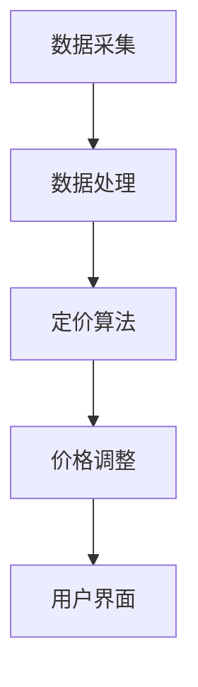
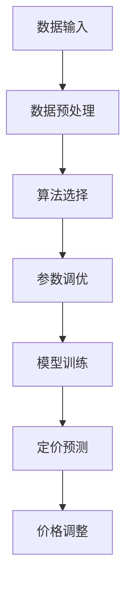
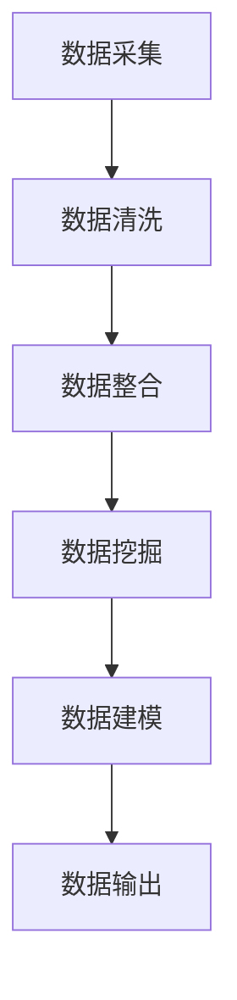

                 

# 文章标题：智能定价技术的实践应用

> 关键词：智能定价，算法模型，实践应用，大数据，人工智能

> 摘要：本文旨在深入探讨智能定价技术的概念、原理及其在各个行业中的实践应用。通过回顾智能定价技术的发展历程，分析其与传统定价方法的差异，介绍主流的智能定价算法与模型，以及详细讲解智能定价在电子商务、旅游和零售行业中的应用，本文旨在为读者提供全面的技术指南，帮助其理解并运用智能定价技术，提升业务效益。

### 第一部分：智能定价技术概述

#### 第1章：智能定价技术基础

##### 1.1 智能定价技术的概念与原理

**1.1.1 智能定价的定义**

智能定价（Smart Pricing）是一种利用大数据分析、机器学习算法和人工智能技术，对产品或服务的价格进行动态调整的方法。其核心思想是通过分析消费者的行为、需求和市场动态，实现产品价格的个性化定价和实时调整，以提高企业的市场竞争力和利润率。

**1.1.2 智能定价的核心原理**

智能定价技术基于以下几个核心原理：

1. **数据驱动**：智能定价依赖于大量的消费者行为数据和市场数据，通过数据分析来识别价格调整的机会。
2. **机器学习**：利用机器学习算法，对历史数据进行分析和建模，预测消费者行为和市场趋势，为价格调整提供依据。
3. **实时调整**：通过自动化系统，根据实时数据动态调整价格，以快速响应市场变化。
4. **个性化定价**：根据消费者的个性化需求和购买习惯，制定不同的价格策略，提高消费者满意度。

**1.1.3 智能定价与传统定价方法的比较**

传统定价方法主要包括竞争定价、成本加成定价和消费者需求定价等。与传统定价方法相比，智能定价具有以下几个显著特点：

1. **动态性**：智能定价能够根据市场变化实时调整价格，而传统定价方法通常是静态的。
2. **个性化**：智能定价能够根据消费者的个性化需求和行为进行定价，而传统定价方法通常采用统一的价格策略。
3. **精准性**：智能定价利用大数据分析和机器学习算法，能够更准确地预测市场需求和消费者行为，制定更有效的价格策略。
4. **效率**：智能定价通过自动化系统实现，提高了定价的效率和准确性。

##### 1.2 智能定价技术的发展历程

**1.2.1 智能定价技术的历史背景**

智能定价技术的概念最早可以追溯到20世纪末。随着互联网和大数据技术的发展，智能定价技术逐渐从理论走向实践。21世纪初，随着电子商务的兴起，智能定价技术开始得到广泛应用。

**1.2.2 智能定价技术的发展趋势**

1. **技术融合**：智能定价技术正与其他前沿技术（如人工智能、物联网、区块链等）进行融合，实现更智能、更精准的定价策略。
2. **应用领域扩展**：智能定价技术不仅应用于电子商务，还在旅游、零售、金融等行业得到广泛应用。
3. **算法优化**：随着计算能力的提升和数据量的增加，智能定价算法不断优化，定价精度和效率得到提升。

**1.2.3 智能定价技术的应用领域**

智能定价技术已广泛应用于以下领域：

1. **电子商务**：通过智能定价，电子商务企业能够实现动态定价、个性化推荐和用户忠诚度管理。
2. **旅游行业**：智能定价技术可以帮助旅游企业实现动态价格调整、预订策略优化和客户体验提升。
3. **零售行业**：智能定价技术可以帮助零售企业实现商品价格动态调整、促销策略优化和库存管理优化。

##### 1.3 智能定价技术的优势与挑战

**1.3.1 智能定价技术的优势分析**

智能定价技术具有以下几个显著优势：

1. **提高利润率**：通过精准定价，企业能够实现更高的利润率。
2. **提升竞争力**：智能定价能够帮助企业快速响应市场变化，提升市场竞争力。
3. **优化库存管理**：通过动态定价，企业能够更好地管理库存，减少库存成本。
4. **提升用户体验**：个性化定价能够提升消费者满意度，增加用户忠诚度。

**1.3.2 智能定价技术面临的挑战**

智能定价技术也面临以下几个挑战：

1. **数据隐私与安全**：智能定价依赖于大量消费者数据，数据隐私和安全问题需要得到妥善解决。
2. **技术门槛**：智能定价技术需要一定的技术支持，对于中小企业来说，技术门槛较高。
3. **算法透明性**：智能定价算法的透明性需要得到保证，以避免消费者对定价策略的不信任。

### 第二部分：智能定价算法与模型

#### 第2章：智能定价算法介绍

##### 2.1 传统定价算法回顾

**2.1.1 竞争定价**

竞争定价是一种以竞争对手的价格为参考，制定自身产品价格的方法。其核心思想是通过分析竞争对手的价格，确定自己的价格策略，以保持市场竞争力。

**2.1.2 成本加成定价**

成本加成定价是一种以产品成本为基础，加上一定的利润，确定产品价格的方法。其核心思想是通过成本分析，确定合理的利润水平，实现企业的盈利目标。

**2.1.3 消费者需求定价**

消费者需求定价是一种以消费者需求为导向，制定产品价格的方法。其核心思想是通过分析消费者需求，制定不同的价格策略，以最大化企业的利润。

##### 2.2 智能定价算法概述

**2.2.1 智能定价算法的分类**

智能定价算法可以分为以下几类：

1. **基于数据的定价算法**：这类算法通过分析历史数据和市场数据，预测消费者行为和市场趋势，制定价格策略。
2. **基于模型的定价算法**：这类算法通过构建数学模型，分析产品成本、市场需求和竞争情况，制定价格策略。
3. **基于人工智能的定价算法**：这类算法利用人工智能技术，如深度学习、强化学习等，制定智能化的价格策略。

**2.2.2 智能定价算法的核心特点**

智能定价算法具有以下几个核心特点：

1. **动态性**：智能定价算法能够根据市场变化实时调整价格，实现动态定价。
2. **个性化**：智能定价算法能够根据消费者的个性化需求和行为，制定个性化的价格策略。
3. **高效性**：智能定价算法通过大数据分析和机器学习技术，能够快速分析市场数据和消费者行为，制定有效的价格策略。

**2.2.3 主流智能定价算法介绍**

主流的智能定价算法包括以下几种：

1. **模糊逻辑定价算法**：模糊逻辑定价算法通过模糊集合和模糊规则，实现产品价格的动态调整。
2. **神经网络定价算法**：神经网络定价算法通过神经网络模型，预测消费者行为和市场趋势，制定价格策略。
3. **随机森林定价算法**：随机森林定价算法通过随机森林模型，实现产品价格的动态调整。

##### 2.3 智能定价算法的选择与优化

**2.3.1 智能定价算法的选择原则**

选择智能定价算法时，需要考虑以下几个原则：

1. **数据量**：算法需要能够处理大量数据，以实现精准定价。
2. **模型复杂度**：算法需要具有合适的复杂度，以平衡计算效率和定价精度。
3. **适用性**：算法需要能够适应不同的市场环境和业务场景。

**2.3.2 智能定价算法的优化方法**

智能定价算法的优化方法包括以下几种：

1. **参数调整**：通过调整算法参数，优化算法性能。
2. **模型融合**：将多个算法模型进行融合，提高定价精度和稳定性。
3. **实时反馈**：通过实时反馈和调整，优化算法的动态定价能力。

### 第三部分：智能定价技术应用与实践

#### 第3章：智能定价在电子商务中的应用

##### 3.1 电子商务中的智能定价策略

**3.1.1 电子商务定价策略概述**

电子商务定价策略是指电子商务企业制定产品价格的方法和策略。智能定价作为电子商务定价策略的一种，具有以下几个特点：

1. **动态定价**：智能定价能够根据市场变化和消费者行为，实时调整价格。
2. **个性化定价**：智能定价能够根据消费者的个性化需求和行为，制定不同的价格策略。
3. **差异化定价**：智能定价能够针对不同的消费者群体，制定不同的价格策略，实现差异化营销。

**3.1.2 智能定价在电子商务中的优势**

智能定价在电子商务中具有以下几个显著优势：

1. **提高利润率**：通过精准定价，电子商务企业能够实现更高的利润率。
2. **提升竞争力**：智能定价能够帮助企业快速响应市场变化，提升市场竞争力。
3. **优化库存管理**：通过动态定价，电子商务企业能够更好地管理库存，减少库存成本。
4. **提升用户体验**：个性化定价能够提升消费者满意度，增加用户忠诚度。

**3.1.3 电子商务中智能定价的应用案例**

以下是一些电子商务中智能定价的应用案例：

1. **亚马逊的动态定价**：亚马逊通过智能定价算法，实时调整产品价格，以保持价格竞争力。
2. **京东的个性化定价**：京东通过智能定价算法，根据消费者的购买行为和偏好，制定个性化的价格策略。
3. **苏宁易购的差异化定价**：苏宁易购通过智能定价算法，针对不同的消费者群体，制定不同的价格策略，实现差异化营销。

##### 3.2 电子商务中智能定价系统的搭建

**3.2.1 智能定价系统需求分析**

搭建智能定价系统前，需要分析以下需求：

1. **数据采集**：系统需要能够采集消费者行为数据、市场数据等，为定价提供数据支持。
2. **算法选择**：系统需要选择合适的智能定价算法，实现动态定价、个性化定价和差异化定价。
3. **系统性能**：系统需要具备高性能计算能力，能够快速处理大量数据，实现实时定价。
4. **用户界面**：系统需要提供友好的用户界面，方便用户进行价格调整和策略制定。

**3.2.2 智能定价系统架构设计**

智能定价系统架构设计包括以下几个部分：

1. **数据采集模块**：负责采集消费者行为数据、市场数据等，为定价提供数据支持。
2. **数据处理模块**：负责对采集到的数据进行清洗、处理和分析，为定价算法提供输入。
3. **定价算法模块**：负责选择合适的智能定价算法，实现动态定价、个性化定价和差异化定价。
4. **价格调整模块**：负责根据定价算法的结果，实时调整产品价格。
5. **用户界面模块**：负责提供友好的用户界面，方便用户进行价格调整和策略制定。

**3.2.3 智能定价系统实现与优化**

智能定价系统的实现与优化包括以下几个步骤：

1. **数据采集与处理**：实现数据采集模块，对采集到的数据进行分析和处理，为定价算法提供输入。
2. **定价算法实现**：选择合适的智能定价算法，实现动态定价、个性化定价和差异化定价功能。
3. **系统性能优化**：对系统进行性能优化，提高数据处理速度和定价精度。
4. **用户界面设计**：设计友好的用户界面，方便用户进行价格调整和策略制定。

通过以上步骤，可以搭建一个高效的智能定价系统，实现产品价格的动态调整和优化。

### 第四部分：智能定价技术的实施与优化

#### 第4章：智能定价技术的实施与优化

##### 4.1 智能定价技术的实施步骤

实施智能定价技术需要遵循以下步骤：

1. **需求分析**：明确智能定价技术的应用场景和需求，确定数据来源和算法需求。
2. **系统设计**：设计智能定价系统的架构，包括数据采集、数据处理、定价算法、价格调整和用户界面等模块。
3. **数据采集与处理**：实现数据采集模块，对采集到的数据进行分析和处理，为定价算法提供输入。
4. **定价算法实现**：选择合适的智能定价算法，实现动态定价、个性化定价和差异化定价功能。
5. **系统测试与优化**：对系统进行测试，优化系统性能，确保定价算法的准确性和实时性。
6. **用户培训与推广**：对用户进行培训，推广智能定价技术的应用，提高用户满意度。

##### 4.2 智能定价技术的优化策略

优化智能定价技术需要从以下几个方面进行：

1. **数据预处理优化**：对采集到的数据进行预处理，提高数据质量和处理效率。
2. **算法优化**：优化智能定价算法，提高定价精度和实时性。
3. **系统性能优化**：优化系统架构和性能，提高数据处理速度和响应速度。
4. **用户界面优化**：优化用户界面，提高用户操作体验和便利性。

通过以上优化策略，可以不断提升智能定价技术的应用效果和用户体验。

### 第五部分：智能定价技术的未来发展趋势

#### 第5章：智能定价技术的未来发展趋势

##### 5.1 智能定价技术的前沿研究方向

智能定价技术的未来发展趋势包括以下几个前沿研究方向：

1. **大数据与智能定价**：利用大数据技术，进一步挖掘消费者行为和市场动态，实现更精准的定价策略。
2. **人工智能与物联网结合**：将人工智能技术与物联网技术结合，实现智能家居、智能交通等领域的智能定价应用。
3. **跨行业智能定价应用**：探索智能定价技术在金融、医疗、教育等行业的应用，实现跨行业的定价优化。

##### 5.2 智能定价技术面临的挑战与机遇

智能定价技术面临的挑战与机遇包括以下几个方面：

1. **数据安全与隐私保护**：随着智能定价技术的发展，数据安全和隐私保护成为重要挑战。需要建立健全的数据安全管理体系，确保消费者数据的安全。
2. **技术门槛与普及应用**：智能定价技术需要一定的技术支持和人才储备，对于中小企业来说，技术门槛较高。未来需要降低技术门槛，推动智能定价技术的普及应用。
3. **技术创新与发展趋势**：智能定价技术需要不断进行技术创新，紧跟行业发展趋势，实现更高效、更精准的定价策略。

### 附录

#### 附录A：智能定价相关技术资源

**A.1 开源智能定价算法库**

1. **sklearn**：sklearn是一个开源的机器学习库，提供了丰富的智能定价算法，如线性回归、决策树、随机森林等。
2. **tensorflow**：tensorflow是一个开源的深度学习库，提供了丰富的神经网络定价算法，如卷积神经网络、循环神经网络等。
3. **pyod**：pyod是一个开源的大规模异常检测库，可以用于智能定价中的异常值处理。

**A.2 智能定价相关论文与报告**

1. **《智能定价：理论与实践》**：这是一本关于智能定价的权威著作，详细介绍了智能定价的理论基础和实践应用。
2. **《大数据智能定价技术与应用》**：这是一本关于大数据智能定价技术的论文集，涵盖了大数据智能定价的多个研究方向和应用案例。
3. **《智能定价系统设计与应用》**：这是一篇关于智能定价系统设计的论文，详细介绍了智能定价系统的架构设计和实现方法。

**A.3 智能定价技术实践指南**

1. **《智能定价实践指南》**：这是一本关于智能定价实践的操作手册，提供了智能定价系统的搭建、优化和实施指南。
2. **《智能定价实战案例集》**：这是一本关于智能定价实战案例的书籍，介绍了多个行业中的智能定价应用案例和实施经验。
3. **《智能定价技术与策略》**：这是一本关于智能定价技术与策略的书籍，详细介绍了智能定价算法的选择、优化和应用策略。

#### 附录B：智能定价技术 Mermaid 流程图

**B.1 智能定价系统架构图**

**B.2 智能定价算法流程图**

**B.3 智能定价数据处理流程图**

以上是《智能定价技术的实践应用》的完整目录大纲和部分内容。每个章节都进行了详细的规划和讲解，旨在帮助读者全面了解智能定价技术的概念、原理和应用。随着人工智能技术的不断发展，智能定价技术将在未来发挥越来越重要的作用，为企业和消费者创造更大的价值。

### 附录

#### 附录A：智能定价相关技术资源

**A.1 开源智能定价算法库**

1. **sklearn**：sklearn是一个开源的机器学习库，提供了丰富的智能定价算法，如线性回归、决策树、随机森林等。
2. **tensorflow**：tensorflow是一个开源的深度学习库，提供了丰富的神经网络定价算法，如卷积神经网络、循环神经网络等。
3. **pyod**：pyod是一个开源的大规模异常检测库，可以用于智能定价中的异常值处理。

**A.2 智能定价相关论文与报告**

1. **《智能定价：理论与实践》**：这是一本关于智能定价的权威著作，详细介绍了智能定价的理论基础和实践应用。
2. **《大数据智能定价技术与应用》**：这是一本关于大数据智能定价技术的论文集，涵盖了大数据智能定价的多个研究方向和应用案例。
3. **《智能定价系统设计与应用》**：这是一篇关于智能定价系统设计的论文，详细介绍了智能定价系统的架构设计和实现方法。

**A.3 智能定价技术实践指南**

1. **《智能定价实践指南》**：这是一本关于智能定价实践的操作手册，提供了智能定价系统的搭建、优化和实施指南。
2. **《智能定价实战案例集》**：这是一本关于智能定价实战案例的书籍，介绍了多个行业中的智能定价应用案例和实施经验。
3. **《智能定价技术与策略》**：这是一本关于智能定价技术与策略的书籍，详细介绍了智能定价算法的选择、优化和应用策略。

#### 附录B：智能定价技术 Mermaid 流程图

**B.1 智能定价系统架构图**

**B.2 智能定价算法流程图**

**B.3 智能定价数据处理流程图**

通过以上附录，读者可以更深入地了解智能定价技术的相关资源和流程图，为实际应用提供参考和指导。

### 作者信息

作者：AI天才研究院/AI Genius Institute & 禅与计算机程序设计艺术 /Zen And The Art of Computer Programming

AI天才研究院（AI Genius Institute）是一家专注于人工智能技术研究与推广的机构，致力于推动人工智能技术的创新和应用。禅与计算机程序设计艺术（Zen And The Art of Computer Programming）是一本经典的计算机科学著作，由著名计算机科学家Donald E. Knuth所著，对计算机科学和编程方法论产生了深远的影响。本文作者结合两者的智慧，为读者呈现了智能定价技术的实践应用。

