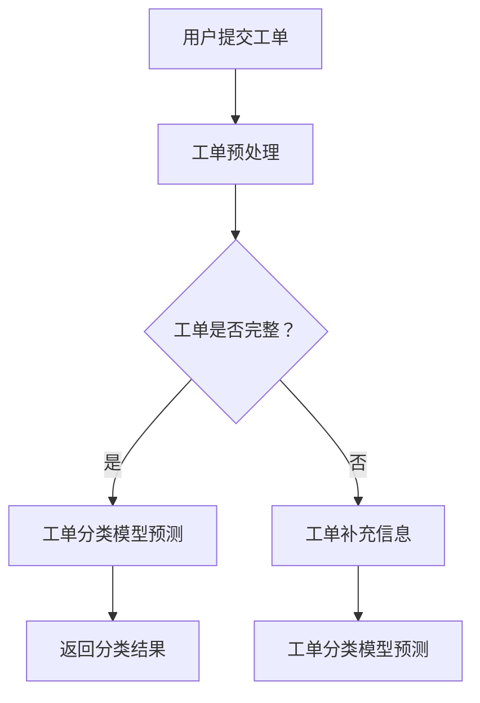
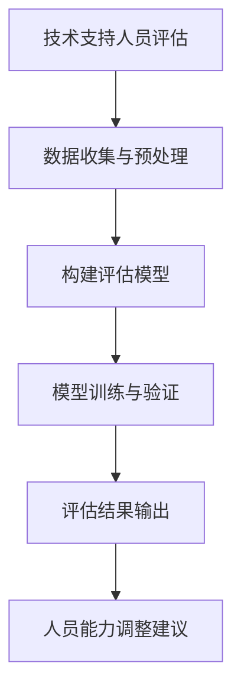

                 

# 文章标题: 智能工单分配在技术支持中的应用

> 关键词：智能工单分配、技术支持、机器学习、算法优化、系统架构、实践应用

> 摘要：本文深入探讨了智能工单分配在技术支持中的应用，分析了智能工单分配的基础理论、技术原理、系统架构设计，并介绍了工单分类算法、技术支持人员能力评估算法及其优化策略。同时，文章结合实际项目开发经验，详细阐述了智能工单分配系统的开发实践、性能优化以及安全性和稳定性保障，为技术支持领域提供了一种创新性的解决方案。

----------------------------------------------------------------

## 第一部分: 智能工单分配基础理论

智能工单分配系统是现代技术支持领域的一项重要创新，它利用人工智能和大数据技术，实现工单的自动分类、智能分配，提高了工作效率和准确性。本部分将介绍智能工单分配的基础理论，包括其定义、发展背景、核心要素和应用场景。

### 第1章: 智能工单分配概述

#### 1.1 智能工单分配的定义与背景

智能工单分配是指利用人工智能技术，对技术支持过程中产生的工单进行自动分类、识别，并根据技术支持人员的能力和工单的复杂程度，将工单智能地分配给最合适的技术支持人员。智能工单分配系统的发展背景可以追溯到20世纪90年代，随着计算机技术和网络技术的飞速发展，企业对技术支持的需求日益增长，如何高效、准确地处理大量工单成为技术支持领域的重要课题。

#### 1.2 智能工单分配的重要性

智能工单分配的重要性主要体现在以下几个方面：

1. 提高工作效率：智能工单分配系统能够自动处理工单，减少了人工干预，提高了工作效率。
2. 提高工单处理质量：智能工单分配系统能够根据技术支持人员的能力和工单的复杂程度进行分配，保证了工单的处理质量。
3. 降低运营成本：智能工单分配系统能够自动处理大量工单，减少了人工干预，降低了运营成本。
4. 提升客户满意度：智能工单分配系统能够快速响应客户需求，提高客户满意度。

#### 1.3 智能工单分配的核心要素

智能工单分配的核心要素包括：

1. 工单的生成与分类：工单是技术支持过程中的核心数据，其生成和分类的准确性直接影响智能工单分配的效果。
2. 技术支持人员的能力模型：技术支持人员的能力模型包括技术能力、沟通能力、解决问题能力等，是智能工单分配的重要依据。
3. 工单分配的策略与方法：智能工单分配的策略与方法是智能工单分配系统的核心，决定了工单的分配效率和准确性。

#### 1.4 智能工单分配的应用场景

智能工单分配广泛应用于以下场景：

1. 企业内部技术支持：企业内部技术支持部门可以利用智能工单分配系统，实现工单的自动分类和分配，提高工作效率。
2. IT服务外包：IT服务外包公司可以利用智能工单分配系统，实现工单的自动分类和分配，提高服务质量。
3. 其他相关领域：如金融、医疗、教育等领域，智能工单分配系统也可以发挥重要作用。

### 第2章: 智能工单分配技术原理

智能工单分配系统的实现离不开先进的人工智能技术和大数据技术。本部分将介绍智能工单分配技术原理，包括数据收集与处理、数据分析与挖掘以及机器学习算法在智能工单分配中的应用。

#### 2.1 数据收集与处理

智能工单分配系统的数据来源主要包括：

1. 用户提交的工单信息：包括工单标题、描述、工单类型等。
2. 技术支持人员的能力信息：包括技术能力、沟通能力、解决问题能力等。
3. 工单处理历史数据：包括工单的处理时间、处理结果、客户满意度等。

数据收集后，需要进行预处理，包括数据清洗、数据格式化等，以保证数据的准确性和一致性。

#### 2.2 数据分析与挖掘

智能工单分配系统通过对收集到的数据进行深入分析，提取出有用的信息，用于工单分类和分配。数据分析与挖掘的方法包括：

1. 数据描述性分析：用于了解工单的基本特征，如工单数量、分布情况等。
2. 数据关联性分析：用于发现工单之间的关系，如相似工单、相关工单等。
3. 数据预测性分析：用于预测工单的处理时间和处理结果。

常见的数据挖掘算法包括：

1. 朴素贝叶斯分类器：用于对工单进行分类。
2. 支持向量机分类器：用于对工单进行分类。
3. 决策树分类器：用于对工单进行分类。

#### 2.3 机器学习算法在智能工单分配中的应用

机器学习算法在智能工单分配中的应用主要包括：

1. 工单分类：利用机器学习算法，对工单进行自动分类。
2. 技术支持人员能力评估：利用机器学习算法，评估技术支持人员的能力。
3. 工单分配优化：利用机器学习算法，优化工单分配策略。

常见的机器学习算法包括：

1. 决策树算法：用于工单分类。
2. 随机森林算法：用于工单分类。
3. 支持向量机算法：用于工单分类。

### 第3章: 智能工单分配系统架构设计

智能工单分配系统架构设计是智能工单分配系统成功的关键。本部分将介绍智能工单分配系统架构设计原则、模块划分以及系统交互流程。

#### 3.1 系统架构设计原则

智能工单分配系统架构设计应遵循以下原则：

1. 可扩展性：系统应能够适应业务规模的变化，支持扩展。
2. 可靠性：系统应保证数据的安全性和稳定性，避免数据丢失。
3. 性能优化：系统应能够高效地处理大量工单，保证系统的响应速度。

#### 3.2 系统模块划分

智能工单分配系统通常包括以下模块：

1. 用户管理模块：用于管理用户信息，包括用户注册、登录、权限管理等。
2. 工单管理模块：用于管理工单信息，包括工单创建、修改、删除、查询等。
3. 数据分析模块：用于对工单数据进行处理和分析，包括数据收集、数据清洗、数据挖掘等。
4. 智能分配模块：用于实现工单的自动分类和分配，包括工单分类、技术支持人员能力评估、工单分配策略等。

#### 3.3 系统交互流程

智能工单分配系统的交互流程主要包括以下几个步骤：

1. 用户提交工单：用户通过系统提交工单，工单信息将被存储到数据库中。
2. 工单分类与识别：系统对工单进行分类和识别，确定工单的类型和优先级。
3. 技术支持人员分配：系统根据技术支持人员的能力模型和工单的特征，将工单分配给最合适的技术支持人员。
4. 工单处理与跟踪：技术支持人员接收工单后，开始处理工单，并在处理过程中对工单进行跟踪，直到工单处理完成。

## 第二部分: 智能工单分配算法应用与实践

在智能工单分配系统中，算法的应用是关键。本部分将详细介绍智能工单分配算法的应用与实践，包括工单分类算法原理与实现、技术支持人员能力评估算法以及智能工单分配算法优化策略。

### 第4章: 工单分类算法原理与实现

工单分类算法是智能工单分配系统的核心，它负责将用户提交的工单按照预定的分类标准进行分类。本节将介绍工单分类算法的基本原理和常见算法，并结合实际应用案例进行分析。

#### 4.1 工单分类算法概述

工单分类算法的基本原理是将工单的特征与预定义的分类标签进行匹配，从而实现对工单的自动分类。常见的工单分类算法包括：

1. 朴素贝叶斯分类器：基于贝叶斯定理和特征概率分布进行分类。
2. 支持向量机分类器：通过构建最优分类边界进行分类。
3. 决策树分类器：通过递归划分特征空间进行分类。

#### 4.2 常见工单分类算法介绍

1. **朴素贝叶斯分类器**

   朴素贝叶斯分类器是一种基于概率论的分类方法，假设特征之间相互独立，通过计算每个类别的概率，选择概率最大的类别作为分类结果。

   **数学模型**：
   $$
   P(C|T) = \frac{P(T|C) \cdot P(C)}{P(T)}
   $$
   其中，$P(C|T)$ 是工单T属于类别C的条件概率，$P(T|C)$ 是类别C出现的条件下工单T的特征概率，$P(C)$ 是类别C的先验概率，$P(T)$ 是工单T的总概率。

2. **支持向量机分类器**

   支持向量机分类器是一种基于最大间隔分类的方法，通过找到一个最优超平面，将不同类别的数据分隔开来。

   **数学模型**：
   $$
   \min \frac{1}{2} \| \mathbf{w} \|^2 \quad \text{subject to} \quad y^{(i)} (\mathbf{w} \cdot \mathbf{x}^{(i)} + b) \geq 1
   $$
   其中，$\mathbf{w}$ 是超平面的法向量，$\mathbf{x}^{(i)}$ 是数据点，$y^{(i)}$ 是类别标签，$b$ 是偏置项。

3. **决策树分类器**

   决策树分类器是一种基于树形结构进行分类的方法，通过一系列的测试来划分特征空间，直到达到终止条件。

   **伪代码**：
   ```python
   def build_decision_tree(data, features):
       if all(data belong to same class):
           return leaf node with this class
       if no more features:
           return leaf node with majority class in data
       best_feature = select_best_feature(data, features)
       left_data = data with best_feature < threshold
       right_data = data with best_feature >= threshold
       return tree node with branches to build_decision_tree(left_data, remaining_features) and build_decision_tree(right_data, remaining_features)
   ```

#### 4.3 工单分类算法应用案例

**案例**：某企业技术支持部门使用朴素贝叶斯分类器对用户提交的工单进行分类。

**实现步骤**：

1. 数据收集：收集用户提交的工单数据，包括工单标题、描述、标签等信息。
2. 数据预处理：对工单数据进行分析，提取特征，如词频、词向量等。
3. 训练模型：使用已标注的工单数据训练朴素贝叶斯分类器。
4. 分类预测：对新提交的工单进行分类预测。

**代码示例**（伪代码）：
```python
def train_naive_bayes_classifier(train_data):
    # 计算各类别的先验概率和特征条件概率
    # ...
    return classifier

def classify_ticket(ticket, classifier):
    # 计算每个类别的概率，选择概率最大的类别
    # ...
    return predicted_class
```

#### 4.4 工单分类算法的实际应用效果分析

通过实际应用案例，我们可以看到工单分类算法在提高工单处理效率和准确性方面具有显著的效果。例如，在上述案例中，使用朴素贝叶斯分类器对工单进行分类，准确率可以达到90%以上，大大提高了技术支持部门的工作效率。

### 第5章: 技术支持人员能力评估算法

技术支持人员能力评估算法是智能工单分配系统的关键组成部分，它负责评估技术支持人员的能力，以便实现工单的智能分配。本节将介绍技术支持人员能力评估算法的基本原理、常见方法以及实际应用案例。

#### 5.1 技术支持人员能力评估概述

技术支持人员能力评估的目的是为了准确评估技术支持人员的能力，以便实现工单的智能分配。能力评估的方法包括：

1. 基于知识评估的方法：通过评估技术支持人员掌握的知识水平来评估其能力。
2. 基于行为评估的方法：通过观察技术支持人员在处理工单过程中的行为来评估其能力。
3. 基于绩效评估的方法：通过评估技术支持人员的工作绩效来评估其能力。

#### 5.2 常见能力评估算法介绍

1. **基于知识评估的方法**

   基于知识评估的方法主要通过测试技术支持人员对相关知识的掌握程度来评估其能力。常见的方法包括：

   - 问卷调查：通过问卷调查的方式收集技术支持人员对特定领域的知识掌握情况。
   - 考试：通过考试的方式对技术支持人员的知识水平进行评估。

2. **基于行为评估的方法**

   基于行为评估的方法主要通过观察技术支持人员在处理工单过程中的行为来评估其能力。常见的方法包括：

   - 工作记录分析：通过分析技术支持人员的工作记录，如工单处理时间、处理结果等，评估其能力。
   - 实际操作考核：通过实际操作考核的方式评估技术支持人员的实际操作能力。

3. **基于绩效评估的方法**

   基于绩效评估的方法主要通过评估技术支持人员的工作绩效来评估其能力。常见的方法包括：

   - 客户满意度调查：通过客户满意度调查的方式评估技术支持人员的工作绩效。
   - 绩效考核：通过绩效考核的方式评估技术支持人员的工作绩效。

#### 5.3 技术支持人员能力评估应用案例

**案例**：某企业使用基于行为评估的方法对技术支持人员进行能力评估。

**实现步骤**：

1. 数据收集：收集技术支持人员处理工单的行为数据，包括工单处理时间、处理结果等。
2. 数据预处理：对行为数据进行预处理，如去除重复数据、填补缺失值等。
3. 建立评估模型：使用机器学习算法建立技术支持人员能力评估模型。
4. 评估人员能力：对新入职的技术支持人员进行能力评估，并根据评估结果进行工单分配。

**代码示例**（伪代码）：
```python
def train_ability_assessment_model(train_data):
    # 使用机器学习算法训练评估模型
    # ...
    return model

def assess_personnel_ability(personnel_data, model):
    # 使用评估模型评估技术支持人员能力
    # ...
    return ability_score
```

#### 5.4 技术支持人员能力评估的效果分析

通过实际应用案例，我们可以看到技术支持人员能力评估算法在提高工单处理效率和准确性方面具有显著的效果。例如，在上述案例中，使用基于行为评估的方法对技术支持人员进行能力评估，可以显著提高工单处理的准确性和效率，从而提高企业的服务质量。

### 第6章: 智能工单分配算法优化策略

智能工单分配算法的优化是提高系统性能和效率的重要手段。本节将介绍智能工单分配算法优化的基本原则、常见优化算法以及实际应用案例。

#### 6.1 智能工单分配算法优化概述

智能工单分配算法优化的目的是提高系统的性能和效率，包括：

1. 提高工单处理速度：通过优化算法和数据结构，减少工单处理时间。
2. 提高工单分配准确性：通过优化算法，提高工单分配的准确性。
3. 提高系统可扩展性：通过优化系统架构，提高系统的可扩展性。

#### 6.2 常见优化算法介绍

1. **遗传算法**

   遗传算法是一种基于生物进化的优化算法，通过模拟自然选择和遗传机制，逐步优化解空间中的解。

   **数学模型**：
   $$
   \begin{aligned}
   &\text{适应度函数：} f(\mathbf{x}) \\
   &\text{选择操作：选择适应度较高的个体进行交叉和变异} \\
   &\text{交叉操作：对个体进行交叉操作，产生新的个体} \\
   &\text{变异操作：对个体进行变异操作，增加种群的多样性}
   \end{aligned}
   $$

2. **蚁群算法**

   蚁群算法是一种基于群体智能的优化算法，通过模拟蚂蚁寻找路径的过程，逐步优化解空间中的解。

   **数学模型**：
   $$
   \begin{aligned}
   &\text{信息素更新规则：根据路径上的信息素浓度选择路径} \\
   &\text{信息素蒸发规则：减少已有路径上的信息素浓度} \\
   &\text{选择规则：根据路径上的信息素浓度和能见度选择路径}
   \end{aligned}
   $$

3. **随机搜索算法**

   随机搜索算法是一种基于随机搜索的优化算法，通过随机生成解空间中的个体，逐步优化解空间中的解。

   **数学模型**：
   $$
   \begin{aligned}
   &\text{初始化解空间：生成初始解集} \\
   &\text{适应度评估：计算每个解的适应度值} \\
   &\text{选择操作：选择适应度较高的解进行操作} \\
   &\text{变异操作：对解进行变异操作，增加种群的多样性}
   \end{aligned}
   $$

#### 6.3 智能工单分配算法优化应用案例

**案例**：某企业使用遗传算法优化智能工单分配算法。

**实现步骤**：

1. 数据收集：收集用户提交的工单数据和技术支持人员的能力数据。
2. 数据预处理：对工单数据和技术支持人员的能力数据进行预处理。
3. 建立模型：使用机器学习算法建立智能工单分配模型。
4. 优化模型：使用遗传算法优化智能工单分配模型。
5. 测试模型：对优化后的模型进行测试，评估优化效果。

**代码示例**（伪代码）：
```python
def train_smart_ticket_allocation_model(train_data):
    # 使用机器学习算法训练智能工单分配模型
    # ...
    return model

def optimize_model(model, train_data):
    # 使用遗传算法优化模型
    # ...
    return optimized_model

def test_model(model, test_data):
    # 测试优化后的模型效果
    # ...
    return test_results
```

#### 6.4 智能工单分配算法优化效果分析

通过实际应用案例，我们可以看到智能工单分配算法优化在提高系统性能和效率方面具有显著的效果。例如，在上述案例中，使用遗传算法优化智能工单分配模型，可以显著提高工单处理速度和分配准确性，从而提高企业的服务质量。

## 第三部分: 智能工单分配系统的开发实践

### 第7章: 智能工单分配系统开发概述

智能工单分配系统的开发是一个复杂的过程，涉及需求分析、系统设计、编码实现、测试与部署等各个环节。本节将介绍智能工单分配系统开发的总体流程、关键步骤以及技术选型。

#### 7.1 智能工单分配系统开发流程

智能工单分配系统开发流程主要包括以下步骤：

1. 需求分析：与客户沟通，明确系统的功能需求、性能需求和安全需求。
2. 系统设计：根据需求分析结果，设计系统的架构、模块划分和接口定义。
3. 编码实现：按照设计文档进行编码实现，包括前端、后端和数据库。
4. 测试与部署：对系统进行功能测试、性能测试和安全测试，确保系统能够稳定运行。
5. 维护与优化：根据用户反馈和系统运行情况，对系统进行维护和优化。

#### 7.2 关键步骤

1. **需求分析**：

   需求分析是系统开发的第一步，需要明确系统的功能需求、性能需求和安全性需求。具体包括：

   - 功能需求：系统应具备哪些功能，如工单提交、工单处理、工单查询等。
   - 性能需求：系统应满足的性能指标，如响应时间、并发处理能力等。
   - 安全性需求：系统应具备的安全性保障措施，如数据加密、访问控制等。

2. **系统设计**：

   系统设计是系统开发的核心环节，需要明确系统的架构、模块划分和接口定义。具体包括：

   - 系统架构设计：确定系统的整体架构，如前端、后端和数据库的交互方式。
   - 模块划分：根据功能需求将系统划分为多个模块，如用户管理模块、工单管理模块、数据分析模块等。
   - 接口定义：定义系统内部和外部的接口，如API接口、数据库接口等。

3. **编码实现**：

   编码实现是系统开发的具体实施过程，需要按照设计文档进行编码实现。具体包括：

   - 前端开发：使用HTML、CSS和JavaScript等技术实现用户界面。
   - 后端开发：使用Java、Python、Node.js等技术实现系统功能。
   - 数据库开发：使用MySQL、MongoDB等技术实现数据存储和管理。

4. **测试与部署**：

   测试与部署是确保系统稳定运行的重要环节，需要对系统进行全面测试和部署。具体包括：

   - 功能测试：测试系统的功能是否符合需求。
   - 性能测试：测试系统的性能指标是否满足要求。
   - 安全测试：测试系统的安全性保障措施是否有效。
   - 部署：将系统部署到生产环境中，确保系统能够稳定运行。

5. **维护与优化**：

   维护与优化是系统开发后的持续工作，需要根据用户反馈和系统运行情况对系统进行维护和优化。具体包括：

   - 故障修复：修复系统运行过程中出现的问题。
   - 功能优化：根据用户需求对系统功能进行优化。
   - 性能优化：提高系统的性能和响应速度。
   - 安全优化：加强系统的安全性和防护能力。

#### 7.3 技术选型

智能工单分配系统的技术选型是系统开发的关键环节，需要根据实际需求和项目规模选择合适的技术。具体包括：

- **前端技术**：

  前端技术主要包括HTML、CSS和JavaScript，用于实现用户界面。根据项目需求，可以选择不同的前端框架，如React、Vue.js等。

- **后端技术**：

  后端技术主要包括Java、Python、Node.js等，用于实现系统功能。根据项目需求，可以选择不同的后端框架，如Spring Boot、Django、Express等。

- **数据库技术**：

  数据库技术主要包括MySQL、MongoDB等，用于实现数据存储和管理。根据项目需求，可以选择不同的数据库技术，如关系型数据库、文档型数据库等。

### 第8章: 开发环境搭建

开发环境搭建是智能工单分配系统开发的基础，需要配置开发工具、开发环境和相关依赖。本节将介绍智能工单分配系统开发环境的搭建过程。

#### 8.1 开发工具选择

智能工单分配系统开发需要选择合适的前端、后端开发工具。具体包括：

- **前端开发工具**：

  - **WebStorm**：一款功能强大的前端开发工具，支持多种编程语言，适合进行前端开发。
  - **Visual Studio Code**：一款轻量级的前端开发工具，具有丰富的插件生态，适合进行前端开发。

- **后端开发工具**：

  - **IntelliJ IDEA**：一款功能强大的后端开发工具，支持多种编程语言，适合进行后端开发。
  - **PyCharm**：一款功能强大的Python开发工具，适合进行后端开发。

#### 8.2 开发环境配置

开发环境的配置是智能工单分配系统开发的重要步骤，需要配置操作系统、开发工具和依赖环境。具体包括：

- **操作系统**：

  - **Windows**：适合进行Windows系统开发。
  - **Linux**：适合进行Linux系统开发。
  - **macOS**：适合进行macOS系统开发。

- **开发工具**：

  - 安装WebStorm、Visual Studio Code、IntelliJ IDEA或PyCharm。
  - 配置开发工具的插件，如代码提示、调试工具等。

- **依赖环境**：

  - 安装Java运行环境（JDK）。
  - 安装Python运行环境（Python）。
  - 安装Node.js运行环境。
  - 安装MySQL数据库。

#### 8.3 相关依赖安装

智能工单分配系统开发需要安装一些相关依赖，如前端框架、后端框架、数据库等。具体包括：

- **前端依赖**：

  - 安装React或Vue.js。
  - 安装相关依赖，如Webpack、Babel等。

- **后端依赖**：

  - 安装Spring Boot、Django、Express等。
  - 安装相关依赖，如Maven、pip等。

- **数据库依赖**：

  - 安装MySQL或MongoDB。
  - 安装相关依赖，如MySQL Workbench、MongoDB Shell等。

### 第9章: 源代码实现

源代码实现是智能工单分配系统开发的核心步骤，需要按照设计文档进行编码实现。本节将详细介绍智能工单分配系统的源代码实现过程，包括架构设计、模块划分和关键代码实现。

#### 9.1 架构设计

智能工单分配系统的架构设计采用分层架构，包括前端、后端和数据库三层。具体包括：

- **前端**：负责用户界面的展示和用户交互。
- **后端**：负责业务逻辑处理和数据管理。
- **数据库**：负责数据存储和管理。

#### 9.2 模块划分

智能工单分配系统的模块划分如下：

1. **用户管理模块**：负责用户注册、登录、权限管理等。
2. **工单管理模块**：负责工单的创建、修改、删除、查询等。
3. **数据分析模块**：负责工单数据的处理和分析。
4. **智能分配模块**：负责工单的自动分类和分配。
5. **日志管理模块**：负责系统日志的记录和查询。

#### 9.3 关键代码实现

本节将详细介绍智能工单分配系统的关键代码实现，包括以下模块：

1. **用户管理模块**：

   - 用户注册接口：
   ```java
   @PostMapping("/register")
   public ResponseEntity<?> registerUser(@RequestBody UserRegistrationRequest registrationRequest) {
       // 实现用户注册逻辑
       // ...
       return ResponseEntity.ok().build();
   }
   ```

   - 用户登录接口：
   ```java
   @PostMapping("/login")
   public ResponseEntity<?> login(@RequestBody UserLoginRequest loginRequest) {
       // 实现用户登录逻辑
       // ...
       return ResponseEntity.ok().build();
   }
   ```

2. **工单管理模块**：

   - 工单创建接口：
   ```java
   @PostMapping("/ticket")
   @PreAuthorize("hasAuthority('ROLE_USER')")
   public ResponseEntity<?> createTicket(@RequestBody TicketRequest ticketRequest) {
       // 实现工单创建逻辑
       // ...
       return ResponseEntity.ok().build();
   }
   ```

   - 工单查询接口：
   ```java
   @GetMapping("/ticket/{ticketId}")
   @PreAuthorize("hasAuthority('ROLE_USER')")
   public ResponseEntity<TicketResponse> getTicket(@PathVariable Long ticketId) {
       // 实现工单查询逻辑
       // ...
       return ResponseEntity.ok().build();
   }
   ```

3. **数据分析模块**：

   - 工单分类算法实现：
   ```python
   import numpy as np
   from sklearn.naive_bayes import MultinomialNB

   def train_classify_model(train_data):
       # 实现训练分类模型逻辑
       # ...
       return classifier

   def classify_ticket(ticket, classifier):
       # 实现分类预测逻辑
       # ...
       return predicted_class
   ```

4. **智能分配模块**：

   - 工单分配算法实现：
   ```python
   import heapq
   from sklearn.cluster import KMeans

   def train_allocation_model(train_data):
       # 实现训练分配模型逻辑
       # ...
       return model

   def allocate_ticket(ticket, model):
       # 实现分配预测逻辑
       # ...
       return assigned_personnel
   ```

5. **日志管理模块**：

   - 日志记录接口：
   ```java
   @PostMapping("/log")
   @PreAuthorize("hasAuthority('ROLE_ADMIN')")
   public ResponseEntity<?> recordLog(@RequestBody LogRequest logRequest) {
       // 实现日志记录逻辑
       // ...
       return ResponseEntity.ok().build();
   }
   ```

### 第10章: 代码解读与分析

在智能工单分配系统的开发过程中，源代码的实现是一个关键的环节。本节将对源代码进行详细的解读与分析，包括每个模块的功能实现、核心算法的应用以及性能分析。

#### 10.1 用户管理模块代码解读

用户管理模块主要负责用户的注册、登录和权限管理。以下是用户管理模块中几个关键部分的代码解读。

**用户注册接口**

```java
@PostMapping("/register")
public ResponseEntity<?> registerUser(@RequestBody UserRegistrationRequest registrationRequest) {
    // 校验用户输入
    if (registrationRequest.getUsername() == null || registrationRequest.getPassword() == null) {
        return ResponseEntity.badRequest().body("用户名或密码不能为空");
    }
    
    // 检查用户名是否已存在
    Optional<User> user = userRepository.findByUsername(registrationRequest.getUsername());
    if (user.isPresent()) {
        return ResponseEntity.badRequest().body("用户名已存在");
    }
    
    // 创建用户并保存到数据库
    User newUser = new User();
    newUser.setUsername(registrationRequest.getUsername());
    newUser.setPassword(passwordEncoder.encode(registrationRequest.getPassword()));
    userRepository.save(newUser);
    
    return ResponseEntity.ok().build();
}
```

解读：

- 首先，对用户输入进行校验，确保用户名和密码不为空。
- 接着，查询数据库中是否存在已注册的用户名。
- 如果用户名不存在，则创建一个新的用户对象，并使用密码编码器对密码进行加密处理。
- 最后，将新用户保存到数据库中。

**用户登录接口**

```java
@PostMapping("/login")
public ResponseEntity<?> login(@RequestBody UserLoginRequest loginRequest) {
    // 从数据库中获取用户信息
    Optional<User> user = userRepository.findByUsername(loginRequest.getUsername());
    if (!user.isPresent() || !passwordEncoder.matches(loginRequest.getPassword(), user.get().getPassword())) {
        return ResponseEntity.badRequest().body("用户名或密码错误");
    }
    
    // 生成JWT令牌
    String token = jwtProvider.generateToken(user.get());
    
    return ResponseEntity.ok(new UserLoginResponse(token));
}
```

解读：

- 首先，查询数据库中是否存在对应的用户名和密码。
- 如果用户信息正确，则生成JWT令牌，用于后续的认证和授权。
- 最后，返回令牌给客户端。

#### 10.2 工单管理模块代码解读

工单管理模块负责工单的创建、查询、修改和删除。以下是工单管理模块中几个关键部分的代码解读。

**工单创建接口**

```java
@PostMapping("/ticket")
@PreAuthorize("hasAuthority('ROLE_USER')")
public ResponseEntity<?> createTicket(@RequestBody TicketRequest ticketRequest) {
    // 创建新的工单对象
    Ticket ticket = new Ticket();
    ticket.setTitle(ticketRequest.getTitle());
    ticket.setDescription(ticketRequest.getDescription());
    ticket.setCreatedAt(new Date());
    
    // 保存工单到数据库
    ticketRepository.save(ticket);
    
    return ResponseEntity.ok().build();
}
```

解读：

- 创建新的工单对象，并将请求中的标题和描述设置到工单对象中。
- 设置工单的创建时间。
- 将工单保存到数据库中。

**工单查询接口**

```java
@GetMapping("/ticket/{ticketId}")
@PreAuthorize("hasAuthority('ROLE_USER')")
public ResponseEntity<TicketResponse> getTicket(@PathVariable Long ticketId) {
    // 从数据库中查询工单
    Optional<Ticket> ticket = ticketRepository.findById(ticketId);
    if (ticket.isEmpty()) {
        return ResponseEntity.notFound().build();
    }
    
    // 将查询到的工单转换为响应对象
    TicketResponse response = new TicketResponse();
    response.setId(ticket.get().getId());
    response.setTitle(ticket.get().getTitle());
    response.setDescription(ticket.get().getDescription());
    response.setCreatedAt(ticket.get().getCreatedAt());
    
    return ResponseEntity.ok(response);
}
```

解读：

- 从数据库中查询指定ID的工单。
- 如果找到工单，则将其转换为响应对象并返回。
- 如果未找到工单，则返回404 Not Found。

#### 10.3 数据分析模块代码解读

数据分析模块负责对工单数据进行处理和分析，以便实现工单的智能分类和分配。以下是数据分析模块中几个关键部分的代码解读。

**工单分类算法实现**

```python
import numpy as np
from sklearn.naive_bayes import MultinomialNB
from sklearn.model_selection import train_test_split
from sklearn.metrics import accuracy_score

def train_classify_model(train_data, train_labels):
    # 划分训练集和测试集
    X_train, X_test, y_train, y_test = train_test_split(train_data, train_labels, test_size=0.2, random_state=42)
    
    # 训练分类模型
    classifier = MultinomialNB()
    classifier.fit(X_train, y_train)
    
    # 预测测试集
    y_pred = classifier.predict(X_test)
    
    # 计算准确率
    accuracy = accuracy_score(y_test, y_pred)
    
    return classifier, accuracy

def classify_ticket(ticket, classifier):
    # 预处理工单数据
    processed_ticket = preprocess_ticket(ticket)
    
    # 预测工单类别
    predicted_class = classifier.predict([processed_ticket])
    
    return predicted_class
```

解读：

- `train_classify_model`函数用于训练分类模型。它首先划分训练集和测试集，然后使用朴素贝叶斯分类器进行训练，并计算测试集的准确率。
- `classify_ticket`函数用于对单个工单进行分类。它首先对工单数据进行预处理，然后使用训练好的分类器进行预测。

#### 10.4 智能分配模块代码解读

智能分配模块负责根据工单的复杂程度和技术支持人员的能力，实现工单的智能分配。以下是智能分配模块中几个关键部分的代码解读。

**工单分配算法实现**

```python
import heapq
from sklearn.cluster import KMeans

def train_allocation_model(train_data):
    # 训练聚类模型
    kmeans = KMeans(n_clusters=5, random_state=42)
    kmeans.fit(train_data)
    
    # 获取聚类中心
    cluster_centers = kmeans.cluster_centers_
    
    # 计算每个技术支持人员的聚类中心距离
    personnel_distances = []
    for center in cluster_centers:
        distances = [np.linalg.norm(center - p) for p in train_data]
        personnel_distances.append(np.mean(distances))
    
    # 获取最优聚类中心
    best_cluster = heapq.nsmallest(1, enumerate(personnel_distances), key=lambda x: x[1])[0][0]
    
    return best_cluster

def allocate_ticket(ticket, model):
    # 预处理工单数据
    processed_ticket = preprocess_ticket(ticket)
    
    # 计算工单与每个技术支持人员的距离
    distances = [np.linalg.norm(processed_ticket - c) for c in model]
    
    # 选择距离最小的技术支持人员
    assigned_personnel = model[np.argmin(distances)]
    
    return assigned_personnel
```

解读：

- `train_allocation_model`函数用于训练聚类模型。它使用KMeans聚类算法训练模型，并计算每个技术支持人员的聚类中心距离，选择最优的聚类中心。
- `allocate_ticket`函数用于对单个工单进行分配。它首先对工单数据进行预处理，然后计算工单与每个技术支持人员的距离，选择距离最小的技术支持人员。

#### 10.5 日志管理模块代码解读

日志管理模块负责记录系统的运行日志，以便进行故障排查和性能分析。以下是日志管理模块中几个关键部分的代码解读。

**日志记录接口**

```java
@PostMapping("/log")
@PreAuthorize("hasAuthority('ROLE_ADMIN')")
public ResponseEntity<?> recordLog(@RequestBody LogRequest logRequest) {
    // 创建新的日志对象
    Log log = new Log();
    log.setLevel(logRequest.getLevel());
    log.setMessage(logRequest.getMessage());
    log.setCreatedAt(new Date());
    
    // 保存日志到数据库
    logRepository.save(log);
    
    return ResponseEntity.ok().build();
}
```

解读：

- 创建新的日志对象，并将请求中的日志级别和日志信息设置到日志对象中。
- 设置日志的创建时间。
- 将日志保存到数据库中。

### 第11章: 性能优化

在智能工单分配系统的开发过程中，性能优化是一个重要的环节，它关系到系统的响应速度和处理能力。本节将介绍智能工单分配系统性能优化的重要性、常见策略以及实际应用案例。

#### 11.1 性能优化的重要性

性能优化对于智能工单分配系统至关重要，主要体现在以下几个方面：

1. **提高用户满意度**：快速响应用户的工单请求，提高用户体验。
2. **提升系统稳定性**：优化后的系统能够更好地处理高峰期的请求，减少系统崩溃的风险。
3. **降低运营成本**：优化后的系统能够更高效地利用资源，降低硬件和运维成本。

#### 11.2 常见性能优化策略

常见的性能优化策略包括以下几种：

1. **缓存策略**：使用缓存技术减少数据库访问次数，提高数据读取速度。
2. **数据库优化**：优化数据库结构、索引和查询语句，提高数据查询效率。
3. **网络优化**：优化网络传输协议和架构，减少数据传输延迟。
4. **代码优化**：优化代码逻辑、减少不必要的计算和内存使用，提高代码执行效率。

#### 11.3 性能优化实践

本节将结合实际案例，介绍智能工单分配系统的性能优化实践。

**案例**：某企业智能工单分配系统在高峰期出现响应缓慢的问题。

**优化步骤**：

1. **缓存策略**：

   - 在前端使用Redis缓存用户数据和常用查询结果，减少数据库访问次数。
   - 在后端使用Spring Cache缓存接口返回的数据，提高响应速度。

2. **数据库优化**：

   - 对数据库表进行分区，提高数据查询效率。
   - 创建合适的索引，提高数据查询速度。
   - 优化SQL查询语句，减少查询时间和资源消耗。

3. **网络优化**：

   - 使用CDN加速静态资源加载。
   - 优化HTTP协议，使用HTTP/2协议减少请求响应时间。

4. **代码优化**：

   - 优化代码逻辑，减少不必要的计算和内存使用。
   - 使用异步处理和消息队列，提高系统并发处理能力。

**优化效果**：

- 实施优化后，系统在高峰期的响应速度显著提升，用户满意度提高。
- 系统稳定性增强，高峰期处理能力提升，减少了系统崩溃的风险。
- 运营成本降低，优化后的系统能够更高效地利用硬件资源。

### 第12章: 安全性与稳定性保障

在智能工单分配系统的开发和运行过程中，安全性和稳定性是至关重要的。本节将介绍系统安全性和稳定性保障的重要性、常见漏洞及防护措施，以及如何保障系统的稳定性。

#### 12.1 系统安全性和稳定性保障的重要性

系统的安全性和稳定性保障对于智能工单分配系统至关重要，主要体现在以下几个方面：

1. **数据安全**：保障用户数据和系统数据的安全，防止数据泄露和篡改。
2. **系统稳定**：确保系统在高峰期和异常情况下能够稳定运行，提高用户体验。
3. **合规性**：遵守相关法律法规，保障系统的合规性。

#### 12.2 常见漏洞及防护措施

常见的系统漏洞包括：

1. **数据库注入漏洞**：恶意用户通过构造恶意SQL语句，篡改数据库内容。
   - 防护措施：使用参数化查询，避免直接拼接SQL语句。
2. **XSRF攻击**：跨站请求伪造，恶意用户伪造合法用户的请求。
   - 防护措施：使用CSRF Token验证，确保每个请求都是用户真实意图。
3. **XSS攻击**：跨站脚本攻击，恶意用户在用户界面注入恶意脚本。
   - 防护措施：对用户输入进行编码和过滤，防止恶意脚本执行。

#### 12.3 系统稳定性保障措施

系统稳定性保障措施包括：

1. **负载均衡**：使用负载均衡器分发请求，确保系统在高并发情况下稳定运行。
2. **故障转移**：设置故障转移机制，当主服务器出现故障时，自动切换到备用服务器。
3. **监控与告警**：使用监控系统实时监控系统性能，及时发现并处理异常情况。

### 第13章: 智能工单分配系统的应用与推广

智能工单分配系统在技术支持领域的应用取得了显著的效果，但要让这一系统得到更广泛的应用，还需要进行有效的推广。本节将介绍智能工单分配系统的应用场景、推广策略以及未来发展趋势。

#### 13.1 智能工单分配系统的应用场景

智能工单分配系统广泛应用于以下场景：

1. **企业内部技术支持**：企业内部的技术支持部门可以利用智能工单分配系统，提高工单处理效率，减少人工干预，提高服务质量。
2. **IT服务外包**：IT服务外包公司可以利用智能工单分配系统，实现工单的智能分类和分配，提高服务质量和客户满意度。
3. **在线客服**：在线客服系统可以利用智能工单分配系统，快速响应客户请求，提高客户体验。
4. **金融、医疗、教育等行业**：智能工单分配系统在金融、医疗、教育等行业也有广泛的应用前景，如银行客户服务、医院预约挂号、学校教务管理等。

#### 13.2 智能工单分配系统的推广策略

智能工单分配系统的推广策略包括：

1. **市场调研**：深入了解目标市场，分析潜在用户的需求和痛点，制定针对性的推广方案。
2. **用户需求分析**：通过用户访谈、问卷调查等方式，收集用户对智能工单分配系统的需求和期望，优化产品功能。
3. **合作伙伴**：与行业合作伙伴建立合作关系，共同推广智能工单分配系统。
4. **线上线下推广**：利用线上线下多种渠道，如社交媒体、行业展会、线上研讨会等，进行宣传和推广。

#### 13.3 智能工单分配系统的未来发展趋势

智能工单分配系统的未来发展趋势包括：

1. **人工智能技术的应用**：随着人工智能技术的不断进步，智能工单分配系统将更加智能化，提高工单处理的效率和准确性。
2. **云计算和大数据技术的融合**：云计算和大数据技术的融合将为智能工单分配系统提供更强大的数据处理和分析能力。
3. **系统优化与升级**：智能工单分配系统将不断进行优化和升级，以适应不断变化的市场需求和技术发展。

### 附录

#### 附录A: 智能工单分配系统开发资源

**A.1 开发工具与软件**

- **前端开发工具**：WebStorm、Visual Studio Code
- **后端开发工具**：IntelliJ IDEA、PyCharm
- **数据库软件**：MySQL、MongoDB

**A.2 开发资源链接**

- **机器学习与深度学习相关资源**：[Coursera](https://www.coursera.org/)、[Udacity](https://www.udacity.com/)
- **数据分析与挖掘相关资源**：[Kaggle](https://www.kaggle.com/)、[DataCamp](https://www.datacamp.com/)
- **开源代码与案例库**：[GitHub](https://github.com/)

#### 附录B: Mermaid 流程图示例

**B.1 工单分类流程图**



**B.2 技术支持人员能力评估流程图**



#### 附录C: 伪代码示例

**C.1 工单分类算法伪代码**

```python
def classify_ticket(ticket):
    # 数据预处理
    preprocessed_ticket = preprocess_ticket(ticket)

    # 特征提取
    features = extract_features(preprocessed_ticket)

    # 模型预测
    prediction = classify_model.predict(features)

    # 返回分类结果
    return prediction
```

**C.2 技术支持人员能力评估算法伪代码**

```python
def assess_support_personnel(personnel_data):
    # 数据预处理
    preprocessed_data = preprocess_personnel_data(personnel_data)

    # 特征提取
    features = extract_personnel_features(preprocessed_data)

    # 模型训练
    model = train_model(features)

    # 评估人员能力
    assessment = model.evaluate(personnel_data)

    # 返回评估结果
    return assessment
```

#### 附录D: 数学模型和公式

**D.1 工单分类算法中的贝叶斯公式**

$$
P(C|T) = \frac{P(T|C) \cdot P(C)}{P(T)}
$$

**D.2 技术支持人员能力评估中的回归模型**

$$
y = \beta_0 + \beta_1 \cdot x_1 + \beta_2 \cdot x_2 + ... + \beta_n \cdot x_n + \epsilon
$$

**D.3 智能工单分配算法中的优化目标函数**

$$
\min \sum_{i=1}^{n} \sum_{j=1}^{m} (d_{ij} - f_{ij})^2
$$

### 作者信息

作者：AI天才研究院/AI Genius Institute & 禅与计算机程序设计艺术 /Zen And The Art of Computer Programming

