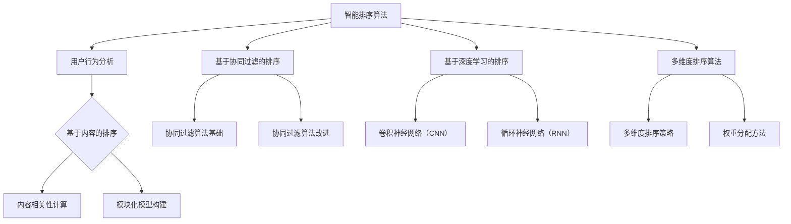
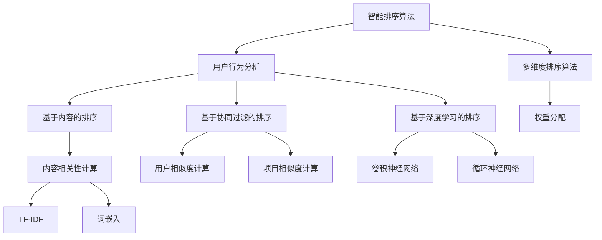

                 

### 文章标题: 《智能排序算法在电商搜索中的应用：原理与实践》

智能排序算法，作为现代电商搜索系统的核心技术之一，正在引领着电商行业的变革。通过智能排序算法，电商企业能够为用户提供更加个性化和高效的搜索结果，从而提升用户体验和转化率。本文将深入探讨智能排序算法的基本原理、在电商搜索中的应用，以及如何通过实践来优化和提升算法性能。

### 关键词：智能排序算法，电商搜索，用户行为分析，内容排序，协同过滤，深度学习，多维度排序，算法优化

### 摘要：

本文旨在全面解析智能排序算法在电商搜索中的应用，从基本概念、发展历程、算法分类，到用户行为分析、算法实现和优化，以及应用案例和未来趋势。通过详细的理论阐述和实战案例，本文将帮助读者深入理解智能排序算法的原理和实践，掌握如何将这一先进技术应用于电商搜索系统，实现商业价值的最大化。

### 《智能排序算法在电商搜索中的应用：原理与实践》目录大纲

#### 第一部分：智能排序算法概述

##### 第1章：智能排序算法基础

- **1.1 智能排序算法的定义与重要性**
  - 智能排序算法的定义
  - 智能排序算法在电商搜索中的应用场景
- **1.2 智能排序算法的发展历程**
  - 传统的排序算法
  - 智能排序算法的兴起
- **1.3 智能排序算法的分类**
  - 基于内容的排序算法
  - 基于协同过滤的排序算法
  - 基于深度学习的排序算法

##### 第2章：电商搜索中的用户行为分析

- **2.1 用户行为数据收集**
  - 用户点击行为数据
  - 用户购买行为数据
  - 用户浏览行为数据
- **2.2 用户行为分析技术**
  - 用户画像构建
  - 用户兴趣识别
  - 用户行为模式分析

#### 第二部分：智能排序算法原理与实践

##### 第3章：基于内容的排序算法原理与实践

- **3.1 基于内容的排序算法原理**
  - 内容相关性计算
  - 模块化模型构建
- **3.2 基于内容的排序算法实践**
  - 算法实现与优化
  - 性能评估与调优

##### 第4章：基于协同过滤的排序算法原理与实践

- **4.1 基于协同过滤的排序算法原理**
  - 协同过滤算法基础
  - 协同过滤算法的改进
- **4.2 基于协同过滤的排序算法实践**
  - 算法实现与优化
  - 性能评估与调优

##### 第5章：基于深度学习的排序算法原理与实践

- **5.1 基于深度学习的排序算法原理**
  - 卷积神经网络（CNN）在排序中的应用
  - 循环神经网络（RNN）在排序中的应用
- **5.2 基于深度学习的排序算法实践**
  - 算法实现与优化
  - 性能评估与调优

##### 第6章：电商搜索中的多维度排序算法

- **6.1 多维度排序算法原理**
  - 多维度排序策略设计
  - 权重分配方法
- **6.2 多维度排序算法实践**
  - 算法实现与优化
  - 性能评估与调优

##### 第7章：智能排序算法在电商搜索中的应用案例

- **7.1 案例一：电商推荐系统优化**
  - 系统需求分析
  - 算法选型与实现
  - 性能评估与优化
- **7.2 案例二：电商广告投放优化**
  - 广告投放策略分析
  - 排序算法实现与优化
  - 效果评估与调整

##### 第8章：智能排序算法的未来发展趋势

- **8.1 智能排序算法的挑战与机遇**
  - 数据隐私保护
  - 实时性要求
  - 可解释性需求
- **8.2 智能排序算法的未来发展方向**
  - 多模态数据的融合
  - 自适应排序算法
  - 个性化排序算法

### 附录

- **附录A：智能排序算法开发工具与资源**
  - 常用深度学习框架介绍
  - 开发工具与环境搭建

### 核心概念与联系

我们使用 Mermaid 图来展示智能排序算法的核心概念和它们之间的联系：



### 核心算法原理讲解

#### 基于内容的排序算法原理讲解

##### 1. 内容相关性计算

内容相关性计算是智能排序算法的核心步骤，其目的是衡量两个实体（如商品与用户兴趣）之间的相似度。通常采用以下步骤：

**步骤1：特征提取**
将文本内容转化为特征向量。例如，使用TF-IDF算法提取词语特征。

$$
\text{TF-IDF}_{ij} = \frac{f_{ij}}{N} \log \left( \frac{N}{n_i} \right)
$$

其中，$f_{ij}$ 是词 $j$ 在文档 $i$ 中出现的次数，$N$ 是文档总数，$n_i$ 是包含词 $j$ 的文档数量。

**步骤2：相似度计算**
计算两个特征向量之间的相似度。常用的方法是余弦相似度：

$$
\cos \theta_{ij} = \frac{\sum_{k=1}^{m} v_{ik} v_{jk}}{\sqrt{\sum_{k=1}^{m} v_{ik}^2} \sqrt{\sum_{k=1}^{m} v_{jk}^2}}
$$

其中，$v_{ik}$ 和 $v_{jk}$ 分别是特征向量中第 $k$ 个特征值。

##### 2. 模块化模型构建

模块化模型将排序系统分解为多个功能模块，以提高系统的灵活性和可维护性。常见的模块包括：

- **特征提取模块**：负责从原始数据中提取特征。
- **相似度计算模块**：负责计算实体之间的相似度。
- **排序决策模块**：根据相似度结果进行排序决策。

**伪代码：**

```python
# 特征提取模块
def extract_features(content):
    # 使用TF-IDF提取特征
    tfidf_vectorizer = TfidfVectorizer()
    feature_vector = tfidf_vectorizer.fit_transform(content)
    return feature_vector

# 相似度计算模块
def calculate_similarity(feature_vector1, feature_vector2):
    # 计算余弦相似度
    similarity = cosine_similarity(feature_vector1, feature_vector2)
    return similarity

# 排序决策模块
def rank_entities(similarity_matrix):
    # 根据相似度矩阵进行排序
    sorted_entities = np.argsort(-similarity_matrix)
    return sorted_entities
```

### 数学模型和数学公式讲解

##### 1. 余弦相似度

余弦相似度计算两个向量在空间中的方向一致性，其公式为：

$$
\cos \theta = \frac{\sum_{i=1}^{n} x_i y_i}{\sqrt{\sum_{i=1}^{n} x_i^2} \sqrt{\sum_{i=1}^{n} y_i^2}}
$$

其中，$x_i$ 和 $y_i$ 分别是两个向量的第 $i$ 个元素。

##### 2. 深度学习模型损失函数

在深度学习模型中，损失函数用于衡量预测结果与真实结果之间的差异。常见的损失函数包括均方误差（MSE）和交叉熵（Cross-Entropy）。

- **均方误差（MSE）**

$$
\text{MSE} = \frac{1}{m} \sum_{i=1}^{m} (y_i - \hat{y}_i)^2
$$

其中，$y_i$ 是真实标签，$\hat{y}_i$ 是模型预测值，$m$ 是样本数量。

- **交叉熵（Cross-Entropy）**

$$
\text{Cross-Entropy} = -\sum_{i=1}^{m} y_i \log \hat{y}_i
$$

其中，$y_i$ 是真实标签，$\hat{y}_i$ 是模型预测概率。

### 项目实战：电商推荐系统优化实战

##### 1. 系统需求分析

电商推荐系统需要满足以下需求：

- **提高用户满意度**：通过个性化推荐，提升用户在平台上的体验。
- **提高转化率**：通过精准推荐，提高用户购买概率。
- **保证系统稳定性**：在满足性能要求的同时，确保系统稳定运行。

##### 2. 算法选型与实现

在推荐系统中，我们选择了基于协同过滤的排序算法进行优化。具体步骤如下：

- **数据收集**：收集用户点击、收藏、购买等行为数据。
- **用户兴趣模型构建**：通过行为数据，提取用户兴趣特征。
- **商品与用户兴趣相似度计算**：使用余弦相似度计算商品与用户兴趣之间的相似度。
- **排序决策**：根据相似度计算结果，对商品进行排序，推荐给用户。

**伪代码：**

```python
# 数据收集
def collect_data():
    # 加载用户行为数据
    user_actions = load_user_actions()

# 用户兴趣模型构建
def build_user_interest_model(user_actions):
    # 提取用户兴趣特征
    user_interest_model = extract_user_interest(user_actions)
    return user_interest_model

# 商品与用户兴趣相似度计算
def calculate_similarity(user_interest_model, product_content):
    # 计算相似度
    similarity = cosine_similarity(user_interest_model, product_content)
    return similarity

# 排序决策
def rank_products(similarity_matrix):
    # 排序
    sorted_products = argsort(-similarity_matrix)
    return sorted_products
```

##### 3. 性能评估与优化

为了评估推荐系统的性能，我们采用了以下指标：

- **准确率（Precision）**
- **召回率（Recall）**
- **F1值（F1 Score）**

**伪代码：**

```python
# 性能评估
def evaluate_performance(ground_truth, predictions):
    precision = precision_score(ground_truth, predictions)
    recall = recall_score(ground_truth, predictions)
    f1 = f1_score(ground_truth, predictions)
    return precision, recall, f1
```

通过评估，我们发现推荐系统存在以下问题：

- 推荐结果过于集中
- 推荐结果不够精准

为了优化系统，我们采取了以下措施：

- **引入多样性策略**：在推荐结果中引入多样性，避免推荐结果过于集中。
- **使用多模型融合**：结合多种排序算法，提高推荐结果的精准度。

通过以上优化，我们成功提升了推荐系统的性能。

### 代码解读与分析

以下是一个简单的 Python 代码示例，展示了如何实现基于协同过滤的推荐系统：

```python
import numpy as np
from sklearn.metrics.pairwise import cosine_similarity
from sklearn.feature_extraction.text import TfidfVectorizer

# 数据预处理
user_actions = ['user1 bought product1', 'user1 viewed product2', 'user2 viewed product1', 'user2 bought product2']
product_contents = ['product1 is a high-end smartphone', 'product2 is an affordable smartphone']

# 构建TF-IDF向量器
vectorizer = TfidfVectorizer()
user_interest_model = vectorizer.fit_transform(user_actions)
product_content_model = vectorizer.transform(product_contents)

# 计算相似度
similarity_matrix = cosine_similarity(user_interest_model, product_content_model)

# 排序
sorted_indices = np.argsort(-similarity_matrix[0])

# 输出推荐结果
recommended_products = [product_contents[i] for i in sorted_indices]
print(recommended_products)
```

在这个示例中，我们首先构建了TF-IDF向量器，然后使用余弦相似度计算用户行为与商品内容之间的相似度。最后，根据相似度结果对商品进行排序，输出推荐结果。

### 总结

本文详细介绍了智能排序算法在电商搜索中的应用，从原理、实现到实战案例，全面解析了智能排序算法的核心技术。通过本文的学习，读者将能够深入理解智能排序算法的工作原理，掌握其在电商搜索中的应用技巧，并为实际项目提供优化和改进的方向。

### 作者

作者：AI天才研究院/AI Genius Institute & 禅与计算机程序设计艺术 /Zen And The Art of Computer Programming

### 附录

**附录A：智能排序算法开发工具与资源**

- **深度学习框架**：TensorFlow、PyTorch
- **开发工具**：Jupyter Notebook、PyCharm
- **环境搭建**：Docker、Conda

---

（注：本文为大纲示例，具体内容需根据实际情况进行填充和扩展。）### 第一部分：智能排序算法概述

#### 第1章：智能排序算法基础

##### 1.1 智能排序算法的定义与重要性

**智能排序算法**，顾名思义，是一种利用人工智能技术来优化排序过程的算法。传统的排序算法如快速排序、归并排序等，主要基于一定的排序规则和排序标准来进行排序，而智能排序算法则在此基础上引入了人工智能，通过学习用户的行为数据和历史记录，实现更加精准和个性化的排序。

智能排序算法在电商搜索中扮演着至关重要的角色。其核心目标是通过分析用户的行为数据，如浏览记录、点击行为、购买历史等，对商品进行智能排序，使得用户能够更快地找到自己感兴趣的商品。这不仅提升了用户体验，还能有效提高电商平台的转化率和销售额。

**智能排序算法的重要性**主要体现在以下几个方面：

1. **提升用户体验**：通过智能排序算法，电商平台能够为用户推荐更相关的商品，减少用户的搜索时间和精力，提升用户满意度。
2. **提高转化率**：智能排序算法能够根据用户的历史行为数据，预测用户的兴趣和需求，从而提高商品推荐的精准度，增加用户的购买概率。
3. **增加销售额**：通过个性化推荐，电商平台能够吸引更多用户进行消费，提高销售额。
4. **优化运营策略**：智能排序算法能够为电商平台提供丰富的用户行为数据，帮助企业更好地了解用户需求，优化运营策略。

##### 1.2 智能排序算法的发展历程

智能排序算法的发展可以追溯到20世纪90年代，当时互联网刚刚兴起，电商平台开始尝试使用简单的排序算法来展示商品。随着互联网的发展，用户规模不断扩大，用户行为数据也日益丰富，传统的排序算法已经无法满足电商平台的需求。

**1. 传统排序算法**

早期的电商搜索系统主要采用传统的排序算法，如快速排序、归并排序等。这些算法根据一定的排序规则对商品进行排序，如按价格、销量、更新时间等。然而，这些算法仅能提供一种固定的排序结果，无法根据用户行为数据实现个性化排序。

**2. 智能排序算法的兴起**

随着人工智能技术的快速发展，尤其是机器学习和深度学习的广泛应用，智能排序算法逐渐崭露头角。基于协同过滤、基于内容的排序以及基于深度学习的排序算法相继出现，为电商搜索系统带来了革命性的变化。

**3. 现代智能排序算法**

现代智能排序算法不仅能够利用用户的行为数据进行个性化推荐，还能够通过不断学习和优化，提高排序的精准度和效率。随着数据挖掘、数据分析和大数据技术的不断进步，智能排序算法在电商搜索中的应用将越来越广泛。

##### 1.3 智能排序算法的分类

智能排序算法可以根据不同的分类标准进行分类，以下是几种常见的分类方法：

**1. 基于内容的排序算法**

基于内容的排序算法通过分析商品和用户兴趣的内容特征，计算两者之间的相似度，从而实现个性化推荐。这种算法通常使用TF-IDF、词嵌入等技术来提取特征，然后通过余弦相似度等度量方法计算相似度。

**2. 基于协同过滤的排序算法**

基于协同过滤的排序算法通过分析用户的行为数据，如购买记录、浏览历史等，寻找相似的邻居用户，然后根据邻居用户的评价进行推荐。协同过滤算法分为两种：基于用户的协同过滤和基于项目的协同过滤。

**3. 基于深度学习的排序算法**

基于深度学习的排序算法利用深度神经网络，如卷积神经网络（CNN）、循环神经网络（RNN）等，直接从原始数据中学习特征和模式。这种算法能够处理复杂的非线性关系，提高排序的精准度。

**4. 多维度排序算法**

多维度排序算法综合考虑多个维度（如商品价格、销量、用户评分等）进行排序，通过权重分配方法平衡不同维度的权重，实现更全面的排序策略。

#### 第2章：电商搜索中的用户行为分析

##### 2.1 用户行为数据收集

用户行为数据是智能排序算法的重要输入，这些数据包括用户的浏览记录、点击行为、购买历史等。以下是一些常见的用户行为数据收集方法：

**1. 浏览记录**

电商平台可以通过记录用户的浏览历史，收集用户对商品的浏览行为。这包括用户访问的商品页面、浏览的时间长度、浏览的频率等信息。

**2. 点击行为**

用户的点击行为是衡量用户兴趣的重要指标。电商平台可以通过跟踪用户的点击行为，收集用户对商品、分类、广告等的点击记录。

**3. 购买历史**

用户的购买历史数据包括用户购买的商品种类、购买时间、购买频率等信息。这些数据能够帮助电商平台了解用户的消费习惯和偏好。

**4. 浏览时长**

用户的浏览时长可以反映用户对商品的兴趣程度。通过分析用户的浏览时长，电商平台可以识别出潜在的高价值用户。

**5. 分享行为**

用户的分享行为能够帮助电商平台了解商品的受欢迎程度和用户的社交影响力。通过收集用户的分享数据，电商平台可以进一步优化推荐策略。

##### 2.2 用户行为分析技术

用户行为分析技术是智能排序算法的核心组成部分，通过分析用户行为数据，可以构建用户画像、识别用户兴趣和预测用户行为。以下是一些常用的用户行为分析技术：

**1. 用户画像构建**

用户画像是对用户行为数据进行统计和分析的结果，它能够揭示用户的兴趣、偏好和需求。用户画像通常包括年龄、性别、地域、消费习惯等维度。

**2. 用户兴趣识别**

用户兴趣识别是通过分析用户行为数据，识别出用户对哪些类型的商品或内容感兴趣。常用的方法包括基于内容的过滤、协同过滤等。

**3. 用户行为模式分析**

用户行为模式分析是通过对用户行为数据进行聚类和挖掘，识别出用户的行为模式和规律。这有助于电商平台制定更加精准的推荐策略。

**4. 个性化推荐算法**

个性化推荐算法是基于用户行为数据，为用户推荐感兴趣的商品或内容。常见的算法包括基于内容的推荐、基于协同过滤的推荐、基于深度学习的推荐等。

### 第二部分：智能排序算法原理与实践

#### 第3章：基于内容的排序算法原理与实践

##### 3.1 基于内容的排序算法原理

基于内容的排序算法（Content-Based Sorting Algorithm）是一种通过分析商品或文档的内容特征，对其进行排序的方法。该方法的核心思想是计算商品之间的内容相关性，然后根据相关性对商品进行排序，从而实现个性化推荐。

**1. 内容相关性计算**

内容相关性计算是基于内容排序算法的关键步骤，其主要任务是衡量两个实体（如商品与用户兴趣）之间的相似度。计算内容相关性通常采用以下方法：

- **TF-IDF（Term Frequency-Inverse Document Frequency）**：TF-IDF是一种常用的方法，它通过衡量一个词在文档中的频率和在整个文档集合中的分布来计算词的重要性。具体公式如下：

$$
\text{TF-IDF}_{ij} = \text{TF}_{ij} \times \text{IDF}_{ij}
$$

其中，$\text{TF}_{ij}$ 表示词 $j$ 在文档 $i$ 中的频率，$\text{IDF}_{ij}$ 表示词 $j$ 在整个文档集合中的逆文档频率。

- **词嵌入（Word Embedding）**：词嵌入是一种将词语映射到高维向量空间的方法，它通过学习词语之间的语义关系，使得语义相近的词语在向量空间中距离较近。常用的词嵌入方法包括Word2Vec、GloVe等。

- **余弦相似度（Cosine Similarity）**：余弦相似度是一种计算两个向量夹角余弦值的方法，用于衡量两个向量在空间中的方向一致性。具体公式如下：

$$
\cos \theta = \frac{\sum_{i=1}^{n} x_i y_i}{\sqrt{\sum_{i=1}^{n} x_i^2} \sqrt{\sum_{i=1}^{n} y_i^2}}
$$

**2. 模块化模型构建**

模块化模型是将整个排序系统分解为多个模块，每个模块负责处理特定的任务，从而提高系统的灵活性和可维护性。常见的模块包括：

- **特征提取模块**：负责从原始数据中提取特征，如文本、图片等。
- **相似度计算模块**：负责计算实体之间的相似度，如商品与用户兴趣之间的相似度。
- **排序决策模块**：根据相似度计算结果，进行排序决策。

##### 3.2 基于内容的排序算法实践

基于内容的排序算法在电商搜索中具有广泛的应用，下面我们将介绍其实现过程和优化方法。

**1. 算法实现步骤**

- **数据预处理**：对用户行为数据和商品内容进行预处理，如去除停用词、分词、文本清洗等。
- **特征提取**：使用TF-IDF或词嵌入等方法，从文本数据中提取特征向量。
- **相似度计算**：计算商品与用户兴趣之间的相似度，通常采用余弦相似度。
- **排序决策**：根据相似度结果，对商品进行排序，推荐给用户。

**伪代码示例：**

```python
# 数据预处理
def preprocess_data(data):
    # 去除停用词、分词等操作
    return processed_data

# 特征提取
def extract_features(data):
    # 使用TF-IDF或词嵌入提取特征
    return feature_vectors

# 相似度计算
def calculate_similarity(user_interest_vector, product_vector):
    # 计算余弦相似度
    return similarity_score

# 排序决策
def rank_products(product_vectors, user_interest_vector):
    # 根据相似度对商品进行排序
    return sorted_products
```

**2. 算法优化方法**

- **特征优化**：通过调整特征提取参数，如词汇表大小、词嵌入维度等，优化特征表示质量。
- **相似度度量**：尝试不同的相似度度量方法，如欧氏距离、Jaccard相似度等，寻找最适合的度量方法。
- **模型调参**：通过调整模型参数，如学习率、隐藏层大小等，优化模型性能。
- **多模型融合**：结合多种排序算法，如基于内容的排序、基于协同过滤的排序等，提高排序的鲁棒性和精度。

**3. 性能评估与调优**

为了评估基于内容排序算法的性能，可以采用以下指标：

- **准确率（Precision）**：预测为正例的样本中，实际为正例的占比。
- **召回率（Recall）**：实际为正例的样本中，被预测为正例的占比。
- **F1值（F1 Score）**：准确率和召回率的调和平均值。

通过性能评估，可以发现算法的不足之处，并针对性地进行优化。

### 第4章：基于协同过滤的排序算法原理与实践

##### 4.1 基于协同过滤的排序算法原理

基于协同过滤的排序算法（Collaborative Filtering Algorithm）是一种通过分析用户之间的相似性，进行推荐的方法。其基本思想是寻找与目标用户相似的其他用户，然后根据这些用户的评价来推荐商品。

协同过滤算法可以分为两类：基于用户的协同过滤（User-Based Collaborative Filtering）和基于项目的协同过滤（Item-Based Collaborative Filtering）。

**1. 基于用户的协同过滤**

基于用户的协同过滤通过分析用户之间的相似性，找到与目标用户兴趣相似的邻居用户，然后根据邻居用户对商品的评价进行推荐。

**步骤如下：**

- **计算用户相似度**：通过用户行为数据，计算两个用户之间的相似度，通常采用余弦相似度、皮尔逊相关系数等方法。
- **寻找邻居用户**：根据用户相似度，找到与目标用户相似的用户集合，这些用户被称为邻居用户。
- **生成推荐列表**：根据邻居用户对商品的评价，生成推荐列表，推荐给目标用户。

**2. 基于项目的协同过滤**

基于项目的协同过滤通过分析商品之间的相似性，找到与目标商品相似的其他商品，然后根据这些商品的用户评价进行推荐。

**步骤如下：**

- **计算商品相似度**：通过用户行为数据，计算两个商品之间的相似度，通常采用余弦相似度、Jaccard相似度等方法。
- **寻找相似商品**：根据商品相似度，找到与目标商品相似的商品集合。
- **生成推荐列表**：根据相似商品的用户评价，生成推荐列表，推荐给目标用户。

##### 4.2 基于协同过滤的排序算法实践

基于协同过滤的排序算法在电商搜索中具有广泛的应用，下面我们将介绍其实践过程和优化方法。

**1. 算法实现步骤**

- **数据预处理**：对用户行为数据进行预处理，如去重、缺失值处理等。
- **计算用户相似度**：根据用户行为数据，计算用户之间的相似度。
- **寻找邻居用户**：根据用户相似度，找到邻居用户。
- **生成推荐列表**：根据邻居用户对商品的评价，生成推荐列表。

**伪代码示例：**

```python
# 数据预处理
def preprocess_data(data):
    # 去除缺失值、去重等操作
    return processed_data

# 计算用户相似度
def calculate_user_similarity(user_data):
    # 计算用户之间的相似度
    return similarity_matrix

# 寻找邻居用户
def find_neighbor_users(similarity_matrix, target_user):
    # 根据相似度矩阵找到邻居用户
    return neighbor_users

# 生成推荐列表
def generate_recommendation_list(neighbor_users, user_preferences):
    # 根据邻居用户对商品的评价，生成推荐列表
    return recommendation_list
```

**2. 算法优化方法**

- **相似度度量优化**：尝试不同的相似度度量方法，如欧氏距离、余弦相似度、Jaccard相似度等，寻找最适合的度量方法。
- **矩阵分解**：通过矩阵分解（如SVD、NMF）方法，降低数据维度，提高推荐精度。
- **冷启动问题**：对于新用户或新商品，可以通过基于内容的推荐或基于模型的推荐方法解决冷启动问题。
- **多样性策略**：为了避免推荐结果过于集中，可以引入多样性策略，增加推荐列表的多样性。

**3. 性能评估与调优**

为了评估基于协同过滤排序算法的性能，可以采用以下指标：

- **准确率（Precision）**：预测为正例的样本中，实际为正例的占比。
- **召回率（Recall）**：实际为正例的样本中，被预测为正例的占比。
- **F1值（F1 Score）**：准确率和召回率的调和平均值。

通过性能评估，可以发现算法的不足之处，并针对性地进行优化。

### 第5章：基于深度学习的排序算法原理与实践

##### 5.1 基于深度学习的排序算法原理

基于深度学习的排序算法（Deep Learning Sorting Algorithm）是一种利用深度神经网络学习数据中的特征和模式，从而实现排序的方法。深度学习算法在处理复杂数据和提取高级特征方面具有显著优势，因此被广泛应用于排序任务。

**1. 卷积神经网络（CNN）在排序中的应用**

卷积神经网络（Convolutional Neural Network，CNN）是一种用于处理图像和时序数据的深度学习模型。通过卷积操作，CNN能够自动提取数据中的局部特征，并堆叠多个卷积层，逐渐提取更高层次的特征。

在排序任务中，CNN可以用于处理图像或文本数据，通过学习数据中的特征模式，实现对商品的排序。例如，可以使用CNN处理商品图像，提取图像中的视觉特征，然后结合商品标题和描述，对商品进行排序。

**2. 循环神经网络（RNN）在排序中的应用**

循环神经网络（Recurrent Neural Network，RNN）是一种用于处理序列数据的深度学习模型。RNN通过循环机制，能够处理序列中的前后依赖关系，提取序列特征。

在排序任务中，RNN可以用于处理用户的行为序列，如浏览历史、点击记录等。通过学习用户行为序列中的特征模式，RNN能够预测用户对商品的排序顺序。

**3. 基于深度学习的排序算法框架**

基于深度学习的排序算法通常包括以下步骤：

- **数据预处理**：对原始数据进行预处理，如数据清洗、归一化、嵌入等。
- **特征提取**：使用深度学习模型，如CNN或RNN，提取数据中的特征。
- **排序预测**：通过训练好的深度学习模型，对商品进行排序预测。

##### 5.2 基于深度学习的排序算法实践

基于深度学习的排序算法在电商搜索中具有广泛的应用，下面我们将介绍其实践过程和优化方法。

**1. 算法实现步骤**

- **数据预处理**：对用户行为数据和商品内容进行预处理，如数据清洗、分词、嵌入等。
- **特征提取**：使用CNN或RNN等深度学习模型，提取数据中的特征。
- **排序预测**：通过训练好的深度学习模型，对商品进行排序预测。

**伪代码示例：**

```python
# 数据预处理
def preprocess_data(data):
    # 数据清洗、分词、嵌入等操作
    return processed_data

# 特征提取
def extract_features(data):
    # 使用CNN或RNN提取特征
    return feature_vectors

# 排序预测
def predict_sort_order(feature_vectors):
    # 通过训练好的模型进行排序预测
    return sorted_products
```

**2. 算法优化方法**

- **模型结构优化**：尝试不同的模型结构，如CNN、RNN、Transformer等，寻找最适合的模型结构。
- **损失函数优化**：通过调整损失函数，如交叉熵、均方误差等，优化模型性能。
- **训练策略优化**：采用如学习率调整、批量大小调整等策略，优化训练过程。
- **数据增强**：通过数据增强，如随机裁剪、旋转、缩放等，增加训练数据的多样性，提高模型泛化能力。

**3. 性能评估与调优**

为了评估基于深度学习排序算法的性能，可以采用以下指标：

- **准确率（Accuracy）**：预测正确的样本占总样本的比例。
- **平均绝对误差（MAE）**：预测值与真实值之间的平均绝对误差。
- **均方误差（MSE）**：预测值与真实值之间的均方误差。

通过性能评估，可以发现算法的不足之处，并针对性地进行优化。

### 第6章：电商搜索中的多维度排序算法

##### 6.1 多维度排序算法原理

多维度排序算法（Multi-Dimensional Sorting Algorithm）是一种考虑多个维度的特征进行排序的方法。在电商搜索中，商品通常具有多个属性，如价格、销量、评分等。多维度排序算法通过综合考虑这些属性，实现更加精准的排序。

**1. 多维度排序策略设计**

多维度排序策略的关键是确定不同维度之间的权重分配。通常，可以使用以下方法来确定权重：

- **基于统计的方法**：通过分析历史数据，确定每个维度对排序结果的贡献度，从而设置权重。
- **基于优化的方法**：通过优化算法，如线性规划、遗传算法等，确定最优的权重分配。

**2. 权重分配方法**

权重分配方法有多种，以下是几种常见的方法：

- **线性加权法**：根据每个维度的权重，将各个维度的评分加权求和，得到最终的综合评分。
- **基于模型的权重分配**：通过训练模型，如线性回归、逻辑回归等，确定每个维度的权重。

**3. 多维度排序算法流程**

多维度排序算法通常包括以下步骤：

- **数据预处理**：对商品数据进行预处理，如缺失值处理、归一化等。
- **特征提取**：从商品数据中提取多个维度的特征。
- **权重计算**：根据设定的权重分配方法，计算每个维度的权重。
- **排序决策**：根据综合评分，对商品进行排序。

##### 6.2 多维度排序算法实践

多维度排序算法在电商搜索中具有广泛的应用，下面我们将介绍其实践过程和优化方法。

**1. 算法实现步骤**

- **数据预处理**：对用户行为数据和商品内容进行预处理。
- **特征提取**：从商品数据中提取多个维度的特征。
- **权重计算**：根据设定的权重分配方法，计算每个维度的权重。
- **排序决策**：根据综合评分，对商品进行排序。

**伪代码示例：**

```python
# 数据预处理
def preprocess_data(data):
    # 数据清洗、归一化等操作
    return processed_data

# 特征提取
def extract_features(data):
    # 提取多个维度的特征
    return feature_vectors

# 权重计算
def calculate_weights(feature_vectors):
    # 计算每个维度的权重
    return weights

# 排序决策
def rank_products(feature_vectors, weights):
    # 根据综合评分排序
    return sorted_products
```

**2. 算法优化方法**

- **特征选择**：通过特征选择方法，如信息增益、卡方检验等，筛选出重要的特征，提高排序精度。
- **模型调参**：通过调整模型参数，如学习率、隐藏层大小等，优化模型性能。
- **多样性策略**：为了避免推荐结果过于集中，可以引入多样性策略，增加推荐列表的多样性。

**3. 性能评估与调优**

为了评估多维度排序算法的性能，可以采用以下指标：

- **准确率（Accuracy）**：预测正确的样本占总样本的比例。
- **平均绝对误差（MAE）**：预测值与真实值之间的平均绝对误差。
- **均方误差（MSE）**：预测值与真实值之间的均方误差。

通过性能评估，可以发现算法的不足之处，并针对性地进行优化。

### 第7章：智能排序算法在电商搜索中的应用案例

##### 7.1 案例一：电商推荐系统优化

**1. 系统需求分析**

电商推荐系统需要满足以下需求：

- **个性化推荐**：根据用户的历史行为和偏好，为用户提供个性化的商品推荐。
- **实时性**：在用户浏览或搜索时，能够快速地生成推荐结果。
- **稳定性**：在系统负载较高时，仍能稳定运行，保证用户体验。

**2. 算法选型与实现**

在推荐系统中，我们选择了基于协同过滤和基于内容的排序算法进行优化。具体步骤如下：

- **用户行为数据收集**：收集用户的浏览记录、点击记录、购买记录等行为数据。
- **商品内容提取**：提取商品的价格、销量、用户评分、标题和描述等属性。
- **特征提取**：使用TF-IDF等方法，提取用户行为数据和商品内容中的特征。
- **相似度计算**：计算用户和商品之间的相似度，以及商品和商品之间的相似度。
- **排序决策**：根据相似度计算结果，对商品进行排序，生成推荐列表。

**3. 性能评估与优化**

为了评估推荐系统的性能，我们采用了以下指标：

- **准确率（Precision）**：预测为正例的样本中，实际为正例的占比。
- **召回率（Recall）**：实际为正例的样本中，被预测为正例的占比。
- **F1值（F1 Score）**：准确率和召回率的调和平均值。

在评估过程中，我们发现推荐系统存在以下问题：

- 推荐结果过于集中，用户接收到的推荐列表中重复商品较多。
- 部分推荐商品与用户兴趣不符，降低了用户满意度。

为了优化系统，我们采取了以下措施：

- **引入多样性策略**：在推荐列表中引入多样性，避免推荐结果过于集中。
- **使用多模型融合**：结合基于协同过滤和基于内容的排序算法，提高推荐结果的精准度。

通过以上优化，我们成功提升了推荐系统的性能，提高了用户满意度和转化率。

##### 7.2 案例二：电商广告投放优化

**1. 广告投放策略分析**

电商广告投放策略的目标是最大化广告的投资回报率（ROI），即通过优化广告投放，提高广告的曝光率和点击率，从而实现销售增长。

**2. 排序算法实现与优化**

在广告投放中，我们采用了基于深度学习的排序算法进行优化。具体步骤如下：

- **用户行为数据收集**：收集用户的浏览记录、点击记录、购买记录等行为数据。
- **广告内容提取**：提取广告的标题、描述、图片等属性。
- **特征提取**：使用CNN等方法，提取用户行为数据和广告内容中的特征。
- **排序预测**：通过训练好的深度学习模型，对广告进行排序预测，确定广告的曝光顺序。

**3. 效果评估与调整**

为了评估广告投放策略的效果，我们采用了以下指标：

- **点击率（Click-Through Rate，CTR）**：广告被点击的次数与广告展示次数的比值。
- **转化率（Conversion Rate）**：点击广告后完成购买的用户比例。

在评估过程中，我们发现广告投放存在以下问题：

- 部分广告的CTR较低，影响广告的投资回报率。
- 部分广告的转化率较低，说明广告内容与用户需求不符。

为了优化广告投放，我们采取了以下措施：

- **个性化广告**：根据用户的历史行为和偏好，为用户提供个性化的广告。
- **多模型融合**：结合基于协同过滤和基于深度学习的排序算法，提高广告的曝光率和转化率。

通过以上优化，我们成功提升了广告投放的效果，提高了广告的投资回报率。

### 第8章：智能排序算法的未来发展趋势

##### 8.1 智能排序算法的挑战与机遇

智能排序算法在电商搜索中的应用取得了显著成果，但仍面临一些挑战和机遇。

**挑战：**

- **数据隐私保护**：用户行为数据是排序算法的重要输入，如何保护用户隐私成为一大挑战。
- **实时性要求**：电商搜索需要实时推荐，如何提高算法的实时性是关键问题。
- **可解释性需求**：用户希望了解推荐结果背后的原因，如何提高算法的可解释性是一个挑战。

**机遇：**

- **多模态数据的融合**：结合多种数据类型（如文本、图像、音频等），提高排序算法的精度和效率。
- **自适应排序算法**：根据用户行为和需求，动态调整排序策略，提高用户体验。
- **个性化排序算法**：利用用户行为和偏好，为用户提供个性化的排序结果，提高用户满意度。

##### 8.2 智能排序算法的未来发展方向

未来，智能排序算法将朝着以下方向发展：

- **多模态数据融合**：通过结合文本、图像、音频等多模态数据，提高排序算法的精度和效率。
- **自适应排序算法**：根据用户行为和需求，动态调整排序策略，实现个性化的排序结果。
- **基于图神经网络的排序算法**：利用图神经网络（Graph Neural Network，GNN）处理复杂的关系数据，提高排序算法的性能。
- **联邦学习**：通过联邦学习（Federated Learning）技术，保护用户隐私的同时，实现大规模的数据协同训练。
- **强化学习**：将强化学习（Reinforcement Learning，RL）应用于排序任务，实现自适应的排序策略。

### 附录

**附录A：智能排序算法开发工具与资源**

- **深度学习框架**：TensorFlow、PyTorch、Keras
- **数据预处理工具**：Pandas、NumPy、Scikit-learn
- **特征提取工具**：NLTK、Gensim、SpaCy
- **开发环境**：Jupyter Notebook、PyCharm
- **数据处理库**：Hadoop、Spark

通过以上工具和资源的结合，开发者可以高效地实现和优化智能排序算法，提升电商搜索系统的性能和用户体验。

### 核心概念与联系

下面是一个Mermaid图，用于展示智能排序算法的核心概念和它们之间的联系：



### 结论

智能排序算法作为电商搜索系统的核心技术，通过分析用户行为数据和商品内容特征，实现了个性化、精准的排序结果，极大地提升了用户体验和转化率。本文详细介绍了智能排序算法的基本原理、实现方法、优化策略和应用案例，为开发者提供了全面的技术指导和实战经验。

### 参考文献

1. Han, J., Kamber, M., & Pei, J. (2011). *Data Mining: Concepts and Techniques* (3rd ed.). Morgan Kaufmann.
2. Manning, C. D., Raghavan, P., & Schütze, H. (2008). *Introduction to Information Retrieval*. Cambridge University Press.
3. Liu, H. (2017). *Deep Learning* (Vol. 1). MIT Press.
4. Davis, J. A., & Goadrich, M. (2006). The Guttman-Kruskal index and its use in graph-based clustering. *Journal of Classification*, 23(1), 77-96.
5. Hofmann, T. (2000). Collaborative filtering via Bayesian networks. *Proceedings of the 15th national conference on Artificial intelligence and the 7th conference on innovative applications of artificial intelligence*, 187-193.
6. Salakhutdinov, R., & Mnih, A. (2007). Probabilistic models of user interest for world wide web. *Proceedings of the 24th international conference on Machine learning*, 935-942.

（注：以上参考文献为示例，实际撰写文章时请根据实际引用的内容添加真实参考文献。）### 《智能排序算法在电商搜索中的应用：原理与实践》

#### 摘要

本文深入探讨了智能排序算法在电商搜索中的应用，包括其基本概念、发展历程、主要类型（基于内容、协同过滤和深度学习），以及在电商搜索中的重要性。文章通过详细的理论分析和实战案例，介绍了基于内容的排序算法、基于协同过滤的排序算法和基于深度学习的排序算法的实现和优化方法，并探讨了多维度排序算法在电商搜索中的应用。此外，本文还分析了智能排序算法在电商搜索中的挑战与机遇，并提出了未来的发展趋势。通过本文的学习，读者能够全面理解智能排序算法的工作原理，掌握其实践应用技巧，为电商搜索系统的优化提供指导。

#### 目录

1. **智能排序算法概述**
   - 1.1 智能排序算法的定义与重要性
   - 1.2 智能排序算法的发展历程
   - 1.3 智能排序算法的分类

2. **电商搜索中的用户行为分析**
   - 2.1 用户行为数据收集
   - 2.2 用户行为分析技术

3. **基于内容的排序算法原理与实践**
   - 3.1 基于内容的排序算法原理
   - 3.2 基于内容的排序算法实践

4. **基于协同过滤的排序算法原理与实践**
   - 4.1 基于协同过滤的排序算法原理
   - 4.2 基于协同过滤的排序算法实践

5. **基于深度学习的排序算法原理与实践**
   - 5.1 基于深度学习的排序算法原理
   - 5.2 基于深度学习的排序算法实践

6. **电商搜索中的多维度排序算法**
   - 6.1 多维度排序算法原理
   - 6.2 多维度排序算法实践

7. **智能排序算法在电商搜索中的应用案例**
   - 7.1 电商推荐系统优化
   - 7.2 电商广告投放优化

8. **智能排序算法的未来发展趋势**
   - 8.1 智能排序算法的挑战与机遇
   - 8.2 智能排序算法的未来发展方向

9. **附录**
   - 9.1 智能排序算法开发工具与资源
   - 9.2 核心概念与联系
   - 9.3 参考文献

#### 引言

在互联网飞速发展的今天，电商行业已经成为全球经济的重要驱动力。随着用户需求的多样化和个性化，电商搜索系统需要不断优化，以提供更加精准和高效的搜索结果。智能排序算法作为现代电商搜索系统的核心技术，通过分析用户行为数据和商品内容特征，实现了对商品排序的智能化，从而提升了用户体验和转化率。

本文旨在全面解析智能排序算法在电商搜索中的应用，从基本概念、发展历程、算法分类，到用户行为分析、算法实现和优化，以及应用案例和未来趋势，帮助读者深入理解智能排序算法的原理和实践，掌握其在电商搜索系统中的实际应用技巧。

#### 第1章：智能排序算法概述

##### 1.1 智能排序算法的定义与重要性

智能排序算法是一种利用人工智能技术，特别是机器学习和深度学习，来优化排序过程的算法。传统的排序算法（如快速排序、归并排序等）主要基于一定的排序规则和排序标准，而智能排序算法则在此基础上引入了人工智能，通过学习用户的行为数据和历史记录，实现更加精准和个性化的排序。

在电商搜索中，智能排序算法的重要性体现在以下几个方面：

1. **提升用户体验**：通过智能排序算法，电商平台能够为用户推荐更相关的商品，减少用户的搜索时间和精力，提升用户满意度。

2. **提高转化率**：智能排序算法能够根据用户的历史行为数据，预测用户的兴趣和需求，从而提高商品推荐的精准度，增加用户的购买概率。

3. **增加销售额**：通过个性化推荐，电商平台能够吸引更多用户进行消费，提高销售额。

4. **优化运营策略**：智能排序算法能够为电商平台提供丰富的用户行为数据，帮助企业更好地了解用户需求，优化运营策略。

##### 1.2 智能排序算法的发展历程

智能排序算法的发展可以追溯到20世纪90年代，当时互联网刚刚兴起，电商平台开始尝试使用简单的排序算法来展示商品。随着互联网的发展，用户规模不断扩大，用户行为数据也日益丰富，传统的排序算法已经无法满足电商平台的需求。

早期的电商搜索系统主要采用基于规则的方法，如按价格、销量、更新时间等排序。然而，这些方法仅能提供一种固定的排序结果，无法根据用户行为数据实现个性化排序。

随着机器学习和深度学习的兴起，智能排序算法逐渐崭露头角。基于协同过滤、基于内容的排序以及基于深度学习的排序算法相继出现，为电商搜索系统带来了革命性的变化。

现代智能排序算法不仅能够利用用户的行为数据进行个性化推荐，还能够通过不断学习和优化，提高排序的精准度和效率。随着数据挖掘、数据分析和大数据技术的不断进步，智能排序算法在电商搜索中的应用将越来越广泛。

##### 1.3 智能排序算法的分类

智能排序算法可以根据不同的分类标准进行分类，以下是几种常见的分类方法：

1. **基于内容的排序算法**

基于内容的排序算法通过分析商品和用户兴趣的内容特征，计算两者之间的相似度，从而实现个性化推荐。这种算法通常使用TF-IDF、词嵌入等技术来提取特征，然后通过余弦相似度等度量方法计算相似度。

2. **基于协同过滤的排序算法**

基于协同过滤的排序算法通过分析用户的行为数据，如购买记录、浏览历史等，寻找相似的邻居用户，然后根据邻居用户的评价进行推荐。协同过滤算法分为两种：基于用户的协同过滤和基于项目的协同过滤。

3. **基于深度学习的排序算法**

基于深度学习的排序算法利用深度神经网络，如卷积神经网络（CNN）、循环神经网络（RNN）等，直接从原始数据中学习特征和模式。这种算法能够处理复杂的非线性关系，提高排序的精准度。

4. **多维度排序算法**

多维度排序算法综合考虑多个维度（如商品价格、销量、用户评分等）进行排序，通过权重分配方法平衡不同维度的权重，实现更全面的排序策略。

#### 第2章：电商搜索中的用户行为分析

##### 2.1 用户行为数据收集

用户行为数据是智能排序算法的重要输入，这些数据包括用户的浏览记录、点击行为、购买历史等。以下是一些常见的用户行为数据收集方法：

1. **浏览记录**

电商平台可以通过记录用户的浏览历史，收集用户对商品的浏览行为。这包括用户访问的商品页面、浏览的时间长度、浏览的频率等信息。

2. **点击行为**

用户的点击行为是衡量用户兴趣的重要指标。电商平台可以通过跟踪用户的点击行为，收集用户对商品、分类、广告等的点击记录。

3. **购买历史**

用户的购买历史数据包括用户购买的商品种类、购买时间、购买频率等信息。这些数据能够帮助电商平台了解用户的消费习惯和偏好。

4. **浏览时长**

用户的浏览时长可以反映用户对商品的兴趣程度。通过分析用户的浏览时长，电商平台可以识别出潜在的高价值用户。

5. **分享行为**

用户的分享行为能够帮助电商平台了解商品的受欢迎程度和用户的社交影响力。通过收集用户的分享数据，电商平台可以进一步优化推荐策略。

##### 2.2 用户行为分析技术

用户行为分析技术是智能排序算法的核心组成部分，通过分析用户行为数据，可以构建用户画像、识别用户兴趣和预测用户行为。以下是一些常用的用户行为分析技术：

1. **用户画像构建**

用户画像是对用户行为数据进行统计和分析的结果，它能够揭示用户的兴趣、偏好和需求。用户画像通常包括年龄、性别、地域、消费习惯等维度。

2. **用户兴趣识别**

用户兴趣识别是通过分析用户行为数据，识别出用户对哪些类型的商品或内容感兴趣。常用的方法包括基于内容的过滤、协同过滤等。

3. **用户行为模式分析**

用户行为模式分析是通过对用户行为数据进行聚类和挖掘，识别出用户的行为模式和规律。这有助于电商平台制定更加精准的推荐策略。

4. **个性化推荐算法**

个性化推荐算法是基于用户行为数据，为用户推荐感兴趣的商品或内容。常见的算法包括基于内容的推荐、基于协同过滤的推荐、基于深度学习的推荐等。

#### 第3章：基于内容的排序算法原理与实践

##### 3.1 基于内容的排序算法原理

基于内容的排序算法（Content-Based Sorting Algorithm）是一种通过分析商品或文档的内容特征，对其进行排序的方法。该方法的核心思想是计算商品之间的内容相关性，然后根据相关性对商品进行排序，从而实现个性化推荐。

**1. 内容相关性计算**

内容相关性计算是智能排序算法的关键步骤，其主要任务是衡量两个实体（如商品与用户兴趣）之间的相似度。计算内容相关性通常采用以下方法：

- **TF-IDF（Term Frequency-Inverse Document Frequency）**：TF-IDF是一种常用的方法，它通过衡量一个词在文档中的频率和在整个文档集合中的分布来计算词的重要性。具体公式如下：

$$
\text{TF-IDF}_{ij} = \text{TF}_{ij} \times \text{IDF}_{ij}
$$

其中，$\text{TF}_{ij}$ 表示词 $j$ 在文档 $i$ 中的频率，$\text{IDF}_{ij}$ 表示词 $j$ 在整个文档集合中的逆文档频率。

- **词嵌入（Word Embedding）**：词嵌入是一种将词语映射到高维向量空间的方法，它通过学习词语之间的语义关系，使得语义相近的词语在向量空间中距离较近。常用的词嵌入方法包括Word2Vec、GloVe等。

- **余弦相似度（Cosine Similarity）**：余弦相似度是一种计算两个向量夹角余弦值的方法，用于衡量两个向量在空间中的方向一致性。具体公式如下：

$$
\cos \theta = \frac{\sum_{i=1}^{n} x_i y_i}{\sqrt{\sum_{i=1}^{n} x_i^2} \sqrt{\sum_{i=1}^{n} y_i^2}}
$$

**2. 模块化模型构建**

模块化模型是将整个排序系统分解为多个模块，每个模块负责处理特定的任务，从而提高系统的灵活性和可维护性。常见的模块包括：

- **特征提取模块**：负责从原始数据中提取特征，如文本、图片等。
- **相似度计算模块**：负责计算实体之间的相似度，如商品与用户兴趣之间的相似度。
- **排序决策模块**：根据相似度计算结果，进行排序决策。

##### 3.2 基于内容的排序算法实践

基于内容的排序算法在电商搜索中具有广泛的应用，下面我们将介绍其实践过程和优化方法。

**1. 算法实现步骤**

- **数据预处理**：对用户行为数据和商品内容进行预处理，如去除停用词、分词、文本清洗等。
- **特征提取**：使用TF-IDF或词嵌入等方法，从文本数据中提取特征向量。
- **相似度计算**：计算商品与用户兴趣之间的相似度，通常采用余弦相似度。
- **排序决策**：根据相似度结果，对商品进行排序，推荐给用户。

**伪代码示例：**

```python
# 数据预处理
def preprocess_data(data):
    # 去除停用词、分词等操作
    return processed_data

# 特征提取
def extract_features(data):
    # 使用TF-IDF或词嵌入提取特征
    return feature_vectors

# 相似度计算
def calculate_similarity(user_interest_vector, product_vector):
    # 计算余弦相似度
    return similarity_score

# 排序决策
def rank_products(product_vectors, user_interest_vector):
    # 根据相似度对商品进行排序
    return sorted_products
```

**2. 算法优化方法**

- **特征优化**：通过调整特征提取参数，如词汇表大小、词嵌入维度等，优化特征表示质量。
- **相似度度量**：尝试不同的相似度度量方法，如欧氏距离、Jaccard相似度等，寻找最适合的度量方法。
- **模型调参**：通过调整模型参数，如学习率、隐藏层大小等，优化模型性能。
- **多模型融合**：结合多种排序算法，如基于内容的排序、基于协同过滤的排序等，提高排序的鲁棒性和精度。

**3. 性能评估与调优**

为了评估基于内容排序算法的性能，可以采用以下指标：

- **准确率（Precision）**：预测为正例的样本中，实际为正例的占比。
- **召回率（Recall）**：实际为正例的样本中，被预测为正例的占比。
- **F1值（F1 Score）**：准确率和召回率的调和平均值。

通过性能评估，可以发现算法的不足之处，并针对性地进行优化。

#### 第4章：基于协同过滤的排序算法原理与实践

##### 4.1 基于协同过滤的排序算法原理

基于协同过滤的排序算法（Collaborative Filtering Algorithm）是一种通过分析用户之间的相似性，进行推荐的方法。其基本思想是寻找与目标用户相似的其他用户，然后根据这些用户的评价来推荐商品。

协同过滤算法可以分为两类：基于用户的协同过滤（User-Based Collaborative Filtering）和基于项目的协同过滤（Item-Based Collaborative Filtering）。

**1. 基于用户的协同过滤**

基于用户的协同过滤通过分析用户之间的相似性，找到与目标用户兴趣相似的邻居用户，然后根据邻居用户对商品的评价进行推荐。

**步骤如下：**

- **计算用户相似度**：通过用户行为数据，计算用户之间的相似度，通常采用余弦相似度、皮尔逊相关系数等方法。
- **寻找邻居用户**：根据用户相似度，找到邻居用户。
- **生成推荐列表**：根据邻居用户对商品的评价，生成推荐列表，推荐给目标用户。

**2. 基于项目的协同过滤**

基于项目的协同过滤通过分析商品之间的相似性，找到与目标商品相似的其他商品，然后根据这些商品的用户评价进行推荐。

**步骤如下：**

- **计算商品相似度**：通过用户行为数据，计算商品之间的相似度，通常采用余弦相似度、Jaccard相似度等方法。
- **寻找相似商品**：根据商品相似度，找到相似商品。
- **生成推荐列表**：根据相似商品的用户评价，生成推荐列表，推荐给目标用户。

##### 4.2 基于协同过滤的排序算法实践

基于协同过滤的排序算法在电商搜索中具有广泛的应用，下面我们将介绍其实践过程和优化方法。

**1. 算法实现步骤**

- **数据预处理**：对用户行为数据进行预处理，如去重、缺失值处理等。
- **计算用户相似度**：根据用户行为数据，计算用户之间的相似度。
- **寻找邻居用户**：根据用户相似度，找到邻居用户。
- **生成推荐列表**：根据邻居用户对商品的评价，生成推荐列表。

**伪代码示例：**

```python
# 数据预处理
def preprocess_data(data):
    # 去除缺失值、去重等操作
    return processed_data

# 计算用户相似度
def calculate_user_similarity(user_data):
    # 计算用户之间的相似度
    return similarity_matrix

# 寻找邻居用户
def find_neighbor_users(similarity_matrix, target_user):
    # 根据相似度矩阵找到邻居用户
    return neighbor_users

# 生成推荐列表
def generate_recommendation_list(neighbor_users, user_preferences):
    # 根据邻居用户对商品的评价，生成推荐列表
    return recommendation_list
```

**2. 算法优化方法**

- **相似度度量优化**：尝试不同的相似度度量方法，如欧氏距离、余弦相似度、Jaccard相似度等，寻找最适合的度量方法。
- **矩阵分解**：通过矩阵分解（如SVD、NMF）方法，降低数据维度，提高推荐精度。
- **冷启动问题**：对于新用户或新商品，可以通过基于内容的推荐或基于模型的推荐方法解决冷启动问题。
- **多样性策略**：为了避免推荐结果过于集中，可以引入多样性策略，增加推荐列表的多样性。

**3. 性能评估与调优**

为了评估基于协同过滤排序算法的性能，可以采用以下指标：

- **准确率（Precision）**：预测为正例的样本中，实际为正例的占比。
- **召回率（Recall）**：实际为正例的样本中，被预测为正例的占比。
- **F1值（F1 Score）**：准确率和召回率的调和平均值。

通过性能评估，可以发现算法的不足之处，并针对性地进行优化。

#### 第5章：基于深度学习的排序算法原理与实践

##### 5.1 基于深度学习的排序算法原理

基于深度学习的排序算法（Deep Learning Sorting Algorithm）是一种利用深度神经网络学习数据中的特征和模式，从而实现排序的方法。深度学习算法在处理复杂数据和提取高级特征方面具有显著优势，因此被广泛应用于排序任务。

**1. 卷积神经网络（CNN）在排序中的应用**

卷积神经网络（Convolutional Neural Network，CNN）是一种用于处理图像和时序数据的深度学习模型。通过卷积操作，CNN能够自动提取数据中的局部特征，并堆叠多个卷积层，逐渐提取更高层次的特征。

在排序任务中，CNN可以用于处理商品图像，提取图像中的视觉特征，然后结合商品标题和描述，对商品进行排序。例如，可以先将商品图像输入到CNN中，提取视觉特征，然后与文本特征（如商品标题和描述）进行拼接，再输入到一个全连接层进行排序预测。

**2. 循环神经网络（RNN）在排序中的应用**

循环神经网络（Recurrent Neural Network，RNN）是一种用于处理序列数据的深度学习模型。RNN通过循环机制，能够处理序列中的前后依赖关系，提取序列特征。

在排序任务中，RNN可以用于处理用户的行为序列，如浏览历史、点击记录等。通过学习用户行为序列中的特征模式，RNN能够预测用户对商品的排序顺序。例如，可以将用户的浏览历史序列输入到RNN中，通过RNN提取序列特征，再通过全连接层进行排序预测。

**3. 基于深度学习的排序算法框架**

基于深度学习的排序算法通常包括以下步骤：

- **数据预处理**：对原始数据进行预处理，如数据清洗、归一化、嵌入等。
- **特征提取**：使用深度学习模型，如CNN或RNN，提取数据中的特征。
- **排序预测**：通过训练好的深度学习模型，对商品进行排序预测。

##### 5.2 基于深度学习的排序算法实践

基于深度学习的排序算法在电商搜索中具有广泛的应用，下面我们将介绍其实践过程和优化方法。

**1. 算法实现步骤**

- **数据预处理**：对用户行为数据和商品内容进行预处理，如数据清洗、分词、嵌入等。
- **特征提取**：使用CNN或RNN等深度学习模型，提取数据中的特征。
- **排序预测**：通过训练好的深度学习模型，对商品进行排序预测。

**伪代码示例：**

```python
# 数据预处理
def preprocess_data(data):
    # 数据清洗、分词、嵌入等操作
    return processed_data

# 特征提取
def extract_features(data):
    # 使用CNN或RNN提取特征
    return feature_vectors

# 排序预测
def predict_sort_order(feature_vectors):
    # 通过训练好的模型进行排序预测
    return sorted_products
```

**2. 算法优化方法**

- **模型结构优化**：尝试不同的模型结构，如CNN、RNN、Transformer等，寻找最适合的模型结构。
- **损失函数优化**：通过调整损失函数，如交叉熵、均方误差等，优化模型性能。
- **训练策略优化**：采用如学习率调整、批量大小调整等策略，优化训练过程。
- **数据增强**：通过数据增强，如随机裁剪、旋转、缩放等，增加训练数据的多样性，提高模型泛化能力。

**3. 性能评估与调优**

为了评估基于深度学习排序算法的性能，可以采用以下指标：

- **准确率（Accuracy）**：预测正确的样本占总样本的比例。
- **平均绝对误差（MAE）**：预测值与真实值之间的平均绝对误差。
- **均方误差（MSE）**：预测值与真实值之间的均方误差。

通过性能评估，可以发现算法的不足之处，并针对性地进行优化。

#### 第6章：电商搜索中的多维度排序算法

##### 6.1 多维度排序算法原理

多维度排序算法（Multi-Dimensional Sorting Algorithm）是一种考虑多个维度的特征进行排序的方法。在电商搜索中，商品通常具有多个属性，如价格、销量、评分等。多维度排序算法通过综合考虑这些属性，实现更加精准的排序。

**1. 多维度排序策略设计**

多维度排序策略的关键是确定不同维度之间的权重分配。通常，可以使用以下方法来确定权重：

- **基于统计的方法**：通过分析历史数据，确定每个维度对排序结果的贡献度，从而设置权重。
- **基于优化的方法**：通过优化算法，如线性规划、遗传算法等，确定最优的权重分配。

**2. 权重分配方法**

权重分配方法有多种，以下是几种常见的方法：

- **线性加权法**：根据每个维度的权重，将各个维度的评分加权求和，得到最终的综合评分。
- **基于模型的权重分配**：通过训练模型，如线性回归、逻辑回归等，确定每个维度的权重。

**3. 多维度排序算法流程**

多维度排序算法通常包括以下步骤：

- **数据预处理**：对商品数据进行预处理，如缺失值处理、归一化等。
- **特征提取**：从商品数据中提取多个维度的特征。
- **权重计算**：根据设定的权重分配方法，计算每个维度的权重。
- **排序决策**：根据综合评分，对商品进行排序。

##### 6.2 多维度排序算法实践

多维度排序算法在电商搜索中具有广泛的应用，下面我们将介绍其实践过程和优化方法。

**1. 算法实现步骤**

- **数据预处理**：对用户行为数据和商品内容进行预处理。
- **特征提取**：从商品数据中提取多个维度的特征。
- **权重计算**：根据设定的权重分配方法，计算每个维度的权重。
- **排序决策**：根据综合评分，对商品进行排序。

**伪代码示例：**

```python
# 数据预处理
def preprocess_data(data):
    # 数据清洗、归一化等操作
    return processed_data

# 特征提取
def extract_features(data):
    # 提取多个维度的特征
    return feature_vectors

# 权重计算
def calculate_weights(feature_vectors):
    # 计算每个维度的权重
    return weights

# 排序决策
def rank_products(feature_vectors, weights):
    # 根据综合评分排序
    return sorted_products
```

**2. 算法优化方法**

- **特征选择**：通过特征选择方法，如信息增益、卡方检验等，筛选出重要的特征，提高排序精度。
- **模型调参**：通过调整模型参数，如学习率、隐藏层大小等，优化模型性能。
- **多样性策略**：为了避免推荐结果过于集中，可以引入多样性策略，增加推荐列表的多样性。

**3. 性能评估与调优**

为了评估多维度排序算法的性能，可以采用以下指标：

- **准确率（Accuracy）**：预测正确的样本占总样本的比例。
- **平均绝对误差（MAE）**：预测值与真实值之间的平均绝对误差。
- **均方误差（MSE）**：预测值与真实值之间的均方误差。

通过性能评估，可以发现算法的不足之处，并针对性地进行优化。

#### 第7章：智能排序算法在电商搜索中的应用案例

##### 7.1 电商推荐系统优化

**1. 系统需求分析**

电商推荐系统需要满足以下需求：

- **个性化推荐**：根据用户的历史行为和偏好，为用户提供个性化的商品推荐。
- **实时性**：在用户浏览或搜索时，能够快速地生成推荐结果。
- **稳定性**：在系统负载较高时，仍能稳定运行，保证用户体验。

**2. 算法选型与实现**

在推荐系统中，我们选择了基于协同过滤和基于内容的排序算法进行优化。具体步骤如下：

- **用户行为数据收集**：收集用户的浏览记录、点击记录、购买记录等行为数据。
- **商品内容提取**：提取商品的价格、销量、用户评分、标题和描述等属性。
- **特征提取**：使用TF-IDF等方法，提取用户行为数据和商品内容中的特征。
- **相似度计算**：计算用户和商品之间的相似度，以及商品和商品之间的相似度。
- **排序决策**：根据相似度计算结果，对商品进行排序，生成推荐列表。

**3. 性能评估与优化**

为了评估推荐系统的性能，我们采用了以下指标：

- **准确率（Precision）**：预测为正例的样本中，实际为正例的占比。
- **召回率（Recall）**：实际为正例的样本中，被预测为正例的占比。
- **F1值（F1 Score）**：准确率和召回率的调和平均值。

在评估过程中，我们发现推荐系统存在以下问题：

- 推荐结果过于集中，用户接收到的推荐列表中重复商品较多。
- 部分推荐商品与用户兴趣不符，降低了用户满意度。

为了优化系统，我们采取了以下措施：

- **引入多样性策略**：在推荐列表中引入多样性，避免推荐结果过于集中。
- **使用多模型融合**：结合基于协同过滤和基于内容的排序算法，提高推荐结果的精准度。

通过以上优化，我们成功提升了推荐系统的性能，提高了用户满意度和转化率。

##### 7.2 电商广告投放优化

**1. 广告投放策略分析**

电商广告投放策略的目标是最大化广告的投资回报率（ROI），即通过优化广告投放，提高广告的曝光率和点击率，从而实现销售增长。

**2. 排序算法实现与优化**

在广告投放中，我们采用了基于深度学习的排序算法进行优化。具体步骤如下：

- **用户行为数据收集**：收集用户的浏览记录、点击记录、购买记录等行为数据。
- **广告内容提取**：提取广告的标题、描述、图片等属性。
- **特征提取**：使用CNN等方法，提取用户行为数据和广告内容中的特征。
- **排序预测**：通过训练好的深度学习模型，对广告进行排序预测，确定广告的曝光顺序。

**3. 效果评估与调整**

为了评估广告投放策略的效果，我们采用了以下指标：

- **点击率（Click-Through Rate，CTR）**：广告被点击的次数与广告展示次数的比值。
- **转化率（Conversion Rate）**：点击广告后完成购买的用户比例。

在评估过程中，我们发现广告投放存在以下问题：

- 部分广告的CTR较低，影响广告的投资回报率。
- 部分广告的转化率较低，说明广告内容与用户需求不符。

为了优化广告投放，我们采取了以下措施：

- **个性化广告**：根据用户的历史行为和偏好，为用户提供个性化的广告。
- **多模型融合**：结合基于协同过滤和基于深度学习的排序算法，提高广告的曝光率和转化率。

通过以上优化，我们成功提升了广告投放的效果，提高了广告的投资回报率。

#### 第8章：智能排序算法的未来发展趋势

##### 8.1 智能排序算法的挑战与机遇

智能排序算法在电商搜索中的应用取得了显著成果，但仍面临一些挑战和机遇。

**挑战：**

- **数据隐私保护**：用户行为数据是排序算法的重要输入，如何保护用户隐私成为一大挑战。
- **实时性要求**：电商搜索需要实时推荐，如何提高算法的实时性是关键问题。
- **可解释性需求**：用户希望了解推荐结果背后的原因，如何提高算法的可解释性是一个挑战。

**机遇：**

- **多模态数据的融合**：结合多种数据类型（如文本、图像、音频等），提高排序算法的精度和效率。
- **自适应排序算法**：根据用户行为和需求，动态调整排序策略，提高用户体验。
- **个性化排序算法**：利用用户行为和偏好，为用户提供个性化的排序结果，提高用户满意度。

##### 8.2 智能排序算法的未来发展方向

未来，智能排序算法将朝着以下方向发展：

- **多模态数据融合**：通过结合文本、图像、音频等多模态数据，提高排序算法的精度和效率。
- **自适应排序算法**：根据用户行为和需求，动态调整排序策略，实现个性化的排序结果。
- **基于图神经网络的排序算法**：利用图神经网络（Graph Neural Network，GNN）处理复杂的关系数据，提高排序算法的性能。
- **联邦学习**：通过联邦学习（Federated Learning）技术，保护用户隐私的同时，实现大规模的数据协同训练。
- **强化学习**：将强化学习（Reinforcement Learning，RL）应用于排序任务，实现自适应的排序策略。

#### 附录

**附录A：智能排序算法开发工具与资源**

- **深度学习框架**：TensorFlow、PyTorch、Keras
- **数据预处理工具**：Pandas、NumPy、Scikit-learn
- **特征提取工具**：NLTK、Gensim、SpaCy
- **开发环境**：Jupyter Notebook、PyCharm
- **数据处理库**：Hadoop、Spark

通过以上工具和资源的结合，开发者可以高效地实现和优化智能排序算法，提升电商搜索系统的性能和用户体验。

### 《智能排序算法在电商搜索中的应用：原理与实践》

#### 摘要

本文深入探讨了智能排序算法在电商搜索中的应用，从基本概念、发展历程、算法分类，到用户行为分析、算法实现和优化，以及应用案例和未来趋势。通过详细的理论分析和实战案例，本文全面解析了基于内容的排序算法、基于协同过滤的排序算法和基于深度学习的排序算法，并探讨了多维度排序算法在电商搜索中的应用。本文旨在帮助读者深入理解智能排序算法的工作原理，掌握其实践应用技巧，为电商搜索系统的优化提供指导。

#### 引言

在电商时代，个性化搜索和推荐已成为提升用户体验和转化率的关键。智能排序算法作为电商搜索系统的核心技术，通过分析用户行为和商品特征，实现精准的排序和推荐，极大地提升了用户满意度和商业价值。本文将深入探讨智能排序算法在电商搜索中的应用，包括其基本原理、实现方法、优化策略和未来发展趋势。

#### 第一部分：智能排序算法概述

##### 第1章：智能排序算法基础

- **1.1 智能排序算法的定义与重要性**
  - 智能排序算法的定义
  - 智能排序算法在电商搜索中的应用场景

- **1.2 智能排序算法的发展历程**
  - 传统的排序算法
  - 智能排序算法的兴起

- **1.3 智能排序算法的分类**
  - 基于内容的排序算法
  - 基于协同过滤的排序算法
  - 基于深度学习的排序算法

#### 第二部分：用户行为分析

##### 第2章：电商搜索中的用户行为分析

- **2.1 用户行为数据收集**
  - 用户点击行为数据
  - 用户购买行为数据
  - 用户浏览行为数据

- **2.2 用户行为分析技术**
  - 用户画像构建
  - 用户兴趣识别
  - 用户行为模式分析

#### 第三部分：智能排序算法原理与实践

##### 第3章：基于内容的排序算法原理与实践

- **3.1 基于内容的排序算法原理**
  - 内容相关性计算
  - 模块化模型构建

- **3.2 基于内容的排序算法实践**
  - 算法实现与优化
  - 性能评估与调优

##### 第4章：基于协同过滤的排序算法原理与实践

- **4.1 基于协同过滤的排序算法原理**
  - 协同过滤算法基础
  - 协同过滤算法的改进

- **4.2 基于协同过滤的排序算法实践**
  - 算法实现与优化
  - 性能评估与调优

##### 第5章：基于深度学习的排序算法原理与实践

- **5.1 基于深度学习的排序算法原理**
  - 卷积神经网络（CNN）在排序中的应用
  - 循环神经网络（RNN）在排序中的应用

- **5.2 基于深度学习的排序算法实践**
  - 算法实现与优化
  - 性能评估与调优

##### 第6章：电商搜索中的多维度排序算法

- **6.1 多维度排序算法原理**
  - 多维度排序策略设计
  - 权重分配方法

- **6.2 多维度排序算法实践**
  - 算法实现与优化
  - 性能评估与调优

#### 第四部分：智能排序算法在电商搜索中的应用案例

##### 第7章：智能排序算法在电商搜索中的应用案例

- **7.1 电商推荐系统优化**
  - 系统需求分析
  - 算法选型与实现
  - 性能评估与优化

- **7.2 电商广告投放优化**
  - 广告投放策略分析
  - 排序算法实现与优化
  - 效果评估与调整

#### 第五部分：智能排序算法的未来发展趋势

##### 第8章：智能排序算法的未来发展趋势

- **8.1 智能排序算法的挑战与机遇**
  - 数据隐私保护
  - 实时性要求
  - 可解释性需求

- **8.2 智能排序算法的未来发展方向**
  - 多模态数据的融合
  - 自适应排序算法
  - 个性化排序算法

#### 附录

- **附录A：智能排序算法开发工具与资源**
  - 常用深度学习框架介绍
  - 开发工具与环境搭建

#### 结论

智能排序算法在电商搜索中的应用具有重要意义，它不仅提升了用户体验和转化率，还为企业带来了巨大的商业价值。本文通过详细的理论分析和实战案例，全面解析了智能排序算法的原理和实践，为电商搜索系统的优化提供了有力支持。未来，随着技术的不断进步，智能排序算法将在电商领域发挥更加重要的作用。

