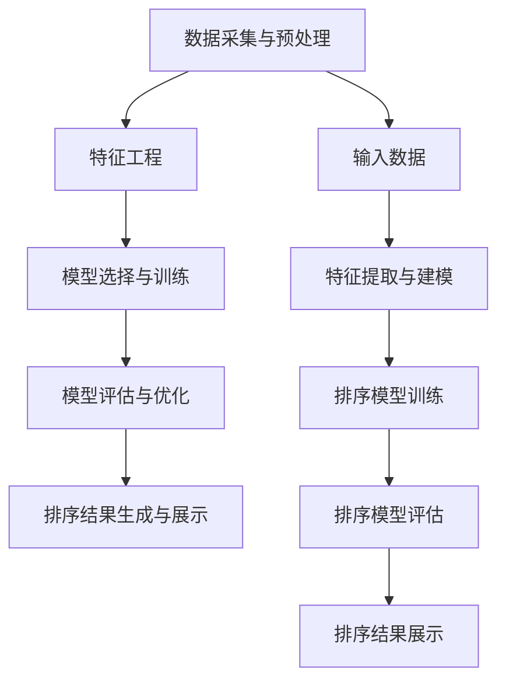

                 

### 《智能排序系统：AI的优势》

> 关键词：智能排序，AI，机器学习，深度学习，自然语言处理，排序算法

> 摘要：本文将探讨智能排序系统的核心概念、AI在其中的应用，以及其工作流程和优势。通过逐步分析排序算法原理、AI优势与挑战，我们将详细探讨智能排序系统的开发实战和未来发展趋势。

智能排序系统是利用人工智能（AI）技术，特别是机器学习（ML）、深度学习（DL）和自然语言处理（NLP），对大量数据进行高效、准确的排序的系统。随着数据量的爆炸性增长，智能排序系统的重要性日益凸显，它广泛应用于搜索引擎、电商推荐、社交媒体等领域。本文将深入分析智能排序系统的基础、核心算法原理与实现、AI优势与挑战，以及开发实战和未来趋势。

### 第一部分：智能排序系统基础

#### 1.1 智能排序系统概述

##### 1.1.1 智能排序的定义和背景

智能排序（Intelligent Sorting）是利用人工智能算法，尤其是机器学习和深度学习算法，对数据集中的记录进行高效、准确的排序。传统的排序方法（如快速排序、归并排序等）主要依赖于算法的数学原理，而智能排序系统则更多地依赖于大数据和机器学习算法，通过学习大量数据中的规律和模式来实现排序。

智能排序的背景主要源于数据量的爆炸性增长。随着互联网和移动设备的普及，各种应用场景中产生的数据量以指数级增长。对于传统的排序算法，处理大规模数据变得非常困难，而智能排序系统则利用机器学习和深度学习算法，通过训练模型来学习数据中的规律，从而实现高效的排序。

##### 1.1.2 智能排序与传统排序的比较

智能排序与传统排序在多个方面存在显著差异：

1. **排序效率**：传统排序算法通常具有固定的时间复杂度，例如快速排序的时间复杂度为O(n log n)。而智能排序系统通过机器学习和深度学习算法，可以在不同数据集和不同场景下自适应地调整排序策略，从而提高排序效率。

2. **排序质量**：传统排序算法依赖于固定的排序规则，例如基于比较的排序算法，可能会在特定数据集上产生较差的排序结果。而智能排序系统通过学习数据中的规律和模式，可以产生更加准确和高质量的排序结果。

3. **适应能力**：传统排序算法通常适用于特定类型的数据和排序场景，而智能排序系统则具有更强的适应能力，可以处理多种类型的数据和多种排序场景。

4. **可扩展性**：智能排序系统具有更好的可扩展性，可以方便地添加新的排序算法和模型，以适应不同的应用需求。

##### 1.1.3 智能排序的应用领域

智能排序系统在多个领域得到了广泛应用：

1. **搜索引擎**：智能排序系统能够根据用户的历史行为和偏好，对搜索结果进行个性化排序，提高用户体验。

2. **电商推荐**：智能排序系统可以根据用户的购买历史、浏览记录和偏好，对商品进行推荐排序，提高销售额和用户满意度。

3. **社交媒体**：智能排序系统可以根据用户的兴趣和行为，对社交媒体内容进行排序，提高用户的参与度和活跃度。

4. **金融风控**：智能排序系统可以分析大量金融数据，对风险进行排序，帮助金融机构进行风险管理。

5. **医疗诊断**：智能排序系统可以分析大量医疗数据，对疾病进行排序，辅助医生进行诊断和治疗。

#### 1.2 AI在排序中的应用

##### 1.2.1 机器学习与排序

机器学习（ML）是智能排序系统的核心组成部分。通过机器学习算法，智能排序系统能够从大量数据中学习规律和模式，并利用这些规律和模式进行排序。以下是一些常用的机器学习排序算法：

1. **回归模型排序**：回归模型可以用于对连续值进行排序，例如线性回归、决策树回归等。

2. **支持向量机排序**：支持向量机（SVM）可以用于对离散值进行排序，通过将数据映射到高维空间，找到最佳的超平面进行排序。

3. **树模型排序**：树模型，如CART树、随机森林等，可以用于对离散值和连续值进行排序。

##### 1.2.2 深度学习在排序中的应用

深度学习（DL）是机器学习的一个分支，它通过多层神经网络来学习数据中的复杂模式和特征。深度学习在排序中的应用主要包括：

1. **神经网络排序**：通过多层感知器（MLP）或卷积神经网络（CNN）等深度学习模型，可以学习数据中的复杂特征并进行排序。

2. **循环神经网络排序**：循环神经网络（RNN），如LSTM和GRU，可以用于处理序列数据，适用于时间序列数据的排序。

3. **图卷积神经网络排序**：图卷积神经网络（GCN）可以用于处理图结构数据，适用于基于图的数据排序。

##### 1.2.3 自然语言处理在排序中的应用

自然语言处理（NLP）是深度学习的一个分支，它主要关注文本数据的处理和分析。NLP在排序中的应用主要包括：

1. **语言模型排序**：通过训练语言模型，可以预测文本的排序顺序，适用于文本数据的排序。

2. **文本分类排序**：通过文本分类算法，可以对文本数据进行分类，从而实现基于分类的排序。

3. **命名实体识别排序**：通过命名实体识别（NER）算法，可以识别文本中的实体，从而实现基于实体的排序。

#### 1.3 智能排序系统的架构

智能排序系统的架构通常包括以下模块：

1. **数据采集与预处理**：采集和预处理原始数据，包括数据清洗、去重、归一化等操作。

2. **特征工程**：提取和转换数据特征，以供模型学习。特征工程是智能排序系统的关键步骤，它可以显著影响排序效果。

3. **模型选择与训练**：选择合适的机器学习或深度学习模型，对特征进行训练，以生成排序模型。

4. **模型评估与优化**：评估模型性能，并通过调整模型参数和优化算法来提高排序质量。

5. **排序结果生成与展示**：利用训练好的模型对输入数据进行排序，并生成排序结果，以供用户查看或进一步处理。

#### 1.4 智能排序系统的工作流程

智能排序系统的工作流程可以分为以下几个步骤：

1. **输入数据的获取与处理**：从数据源获取输入数据，并进行预处理，如去噪、归一化等。

2. **特征提取与建模**：提取数据特征，并将其输入到机器学习或深度学习模型中，以生成排序模型。

3. **排序结果的生成与展示**：利用训练好的模型对输入数据进行排序，并将排序结果展示给用户。

### 第二部分：核心算法原理与实现

在智能排序系统中，核心算法的选择和实现直接影响排序系统的性能和效果。本部分将详细介绍排序算法基础、机器学习排序算法、深度学习排序算法以及自然语言处理排序算法。

#### 2.1 排序算法基础

##### 2.1.1 经典排序算法

经典排序算法包括冒泡排序、选择排序、插入排序、快速排序、归并排序和堆排序等。这些算法在不同的数据集和场景下具有不同的表现。

1. **冒泡排序**：通过反复交换相邻的未排序元素，使未排序元素从后向前移动到已排序元素的前面。

2. **选择排序**：每次从未排序的元素中选取最小（或最大）的元素，将其放到已排序序列的末尾。

3. **插入排序**：将未排序元素插入到已排序序列中，保持序列的有序性。

4. **快速排序**：通过选择一个基准元素，将序列分为已排序和未排序两部分，递归地对这两部分进行排序。

5. **归并排序**：将序列划分为若干个子序列，分别对每个子序列进行排序，然后将这些子序列合并成一个有序序列。

6. **堆排序**：利用堆数据结构进行排序，堆排序是一种不稳定的排序算法。

##### 2.1.2 排序算法的比较与选择

不同排序算法的比较主要基于时间复杂度、空间复杂度、稳定性和适应性等方面。以下是对几种常见排序算法的比较：

1. **时间复杂度**：快速排序、归并排序和堆排序的时间复杂度均为O(n log n)，而冒泡排序和选择排序的时间复杂度为O(n^2)。

2. **空间复杂度**：归并排序需要额外的空间来存储临时数组，而其他排序算法的空间复杂度为O(1)。

3. **稳定性**：插入排序、冒泡排序和归并排序是稳定的排序算法，而快速排序和选择排序是不稳定的排序算法。

4. **适应性**：快速排序和归并排序在数据已经部分有序时性能较好，而堆排序适用于大规模数据排序。

##### 2.1.3 排序算法的时间复杂度分析

不同排序算法的时间复杂度分析如下：

1. **冒泡排序**：时间复杂度为O(n^2)，在最坏情况下需要n(n-1)/2次比较。

2. **选择排序**：时间复杂度为O(n^2)，在最坏情况下需要n(n-1)/2次比较。

3. **插入排序**：时间复杂度为O(n^2)，在最坏情况下需要n(n-1)/2次比较。

4. **快速排序**：平均时间复杂度为O(n log n)，最坏情况下为O(n^2)。

5. **归并排序**：时间复杂度为O(n log n)。

6. **堆排序**：时间复杂度为O(n log n)。

#### 2.2 机器学习排序算法

##### 2.2.1 回归模型排序

回归模型排序是一种利用回归模型进行排序的方法。回归模型可以预测数据集中记录的连续值，并通过这些预测值进行排序。以下是一个简单的线性回归模型排序算法：

1. **数据预处理**：对输入数据进行标准化处理，使其具有相同的量纲和范围。

2. **特征提取**：选择合适的特征，用于训练回归模型。特征可以选择原始数据中的统计特征、文本特征等。

3. **模型训练**：使用训练数据集训练线性回归模型，通过最小化损失函数来找到最佳参数。

4. **模型评估**：使用验证数据集评估模型性能，通过交叉验证等方法选择最佳模型。

5. **排序**：对输入数据进行预测，并根据预测值对数据进行排序。

##### 2.2.2 支持向量机排序

支持向量机（SVM）是一种常用的分类算法，也可以用于排序。SVM通过将数据映射到高维空间，找到最佳的超平面进行分类。以下是一个基于SVM的排序算法：

1. **数据预处理**：对输入数据进行标准化处理。

2. **特征提取**：选择合适的特征。

3. **模型训练**：使用训练数据集训练SVM模型，通过最大化分类间隔来找到最佳超平面。

4. **模型评估**：使用验证数据集评估模型性能。

5. **排序**：对输入数据进行分类，并根据分类结果对数据进行排序。

##### 2.2.3 树模型排序

树模型排序是一种利用决策树或随机森林等树模型进行排序的方法。树模型通过构建决策树来分类数据，并通过树的结构进行排序。以下是一个简单的决策树排序算法：

1. **数据预处理**：对输入数据进行标准化处理。

2. **特征提取**：选择合适的特征。

3. **模型训练**：使用训练数据集训练决策树模型，通过贪心算法构建决策树。

4. **模型评估**：使用验证数据集评估模型性能。

5. **排序**：对输入数据进行分类，并根据树的结构进行排序。

#### 2.3 深度学习排序算法

##### 2.3.1 神经网络排序

神经网络排序是一种利用多层感知器（MLP）等神经网络模型进行排序的方法。神经网络可以通过学习数据中的复杂特征来进行排序。以下是一个简单的神经网络排序算法：

1. **数据预处理**：对输入数据进行标准化处理。

2. **特征提取**：选择合适的特征。

3. **模型设计**：设计多层感知器模型，包括输入层、隐藏层和输出层。

4. **模型训练**：使用训练数据集训练模型，通过反向传播算法调整模型参数。

5. **模型评估**：使用验证数据集评估模型性能。

6. **排序**：对输入数据进行预测，并根据预测值进行排序。

##### 2.3.2 循环神经网络排序

循环神经网络（RNN）排序是一种利用循环神经网络进行排序的方法。RNN可以通过处理序列数据来学习数据中的时序特征，从而实现排序。以下是一个简单的RNN排序算法：

1. **数据预处理**：对输入数据进行标准化处理。

2. **特征提取**：选择合适的特征。

3. **模型设计**：设计循环神经网络模型，包括输入层、隐藏层和输出层。

4. **模型训练**：使用训练数据集训练模型，通过梯度下降算法调整模型参数。

5. **模型评估**：使用验证数据集评估模型性能。

6. **排序**：对输入数据进行预测，并根据预测值进行排序。

##### 2.3.3 卷积神经网络排序

卷积神经网络（CNN）排序是一种利用卷积神经网络进行排序的方法。CNN可以通过处理图像数据来学习数据中的空间特征，从而实现排序。以下是一个简单的CNN排序算法：

1. **数据预处理**：对输入数据进行标准化处理。

2. **特征提取**：选择合适的特征。

3. **模型设计**：设计卷积神经网络模型，包括卷积层、池化层和全连接层。

4. **模型训练**：使用训练数据集训练模型，通过反向传播算法调整模型参数。

5. **模型评估**：使用验证数据集评估模型性能。

6. **排序**：对输入数据进行预测，并根据预测值进行排序。

#### 2.4 自然语言处理排序算法

##### 2.4.1 语言模型排序

语言模型排序是一种利用语言模型进行排序的方法。语言模型可以通过学习大量文本数据来预测文本的排序顺序。以下是一个简单的语言模型排序算法：

1. **数据预处理**：对输入文本进行分词、词性标注等预处理。

2. **模型训练**：使用训练文本数据集训练语言模型，如n元语法模型。

3. **模型评估**：使用验证文本数据集评估模型性能。

4. **排序**：对输入文本进行排序，并根据语言模型的预测概率进行排序。

##### 2.4.2 文本分类排序

文本分类排序是一种利用文本分类算法进行排序的方法。文本分类算法可以通过分类标签来对文本进行排序。以下是一个简单的文本分类排序算法：

1. **数据预处理**：对输入文本进行分词、词性标注等预处理。

2. **模型训练**：使用训练文本数据集训练文本分类模型，如朴素贝叶斯、支持向量机等。

3. **模型评估**：使用验证文本数据集评估模型性能。

4. **排序**：对输入文本进行分类，并根据分类标签进行排序。

##### 2.4.3 命名实体识别排序

命名实体识别排序是一种利用命名实体识别算法进行排序的方法。命名实体识别算法可以通过识别文本中的实体来对文本进行排序。以下是一个简单的命名实体识别排序算法：

1. **数据预处理**：对输入文本进行分词、词性标注等预处理。

2. **模型训练**：使用训练文本数据集训练命名实体识别模型，如CRF模型。

3. **模型评估**：使用验证文本数据集评估模型性能。

4. **排序**：对输入文本进行命名实体识别，并根据识别出的实体进行排序。

#### 2.5 综合排序算法

综合排序算法是将多种排序算法相结合，以提高排序性能和效果。以下是一些常见的综合排序算法：

##### 2.5.1 多模型融合排序

多模型融合排序是一种将多种机器学习模型或深度学习模型相结合的排序方法。通过集成不同模型的优点，可以显著提高排序性能。以下是一个简单的多模型融合排序算法：

1. **模型选择**：选择多种机器学习或深度学习模型，如线性回归、决策树、神经网络等。

2. **模型训练**：使用训练数据集分别训练每种模型。

3. **模型融合**：将每种模型的预测结果进行加权融合，以生成最终的排序结果。

4. **排序**：根据融合后的预测值进行排序。

##### 2.5.2 对比学习排序

对比学习排序是一种利用对比学习算法进行排序的方法。对比学习算法通过学习数据之间的相对关系来进行排序。以下是一个简单的对比学习排序算法：

1. **数据预处理**：对输入数据进行标准化处理。

2. **模型训练**：使用训练数据集训练对比学习模型，如Siamese网络。

3. **模型评估**：使用验证数据集评估模型性能。

4. **排序**：对输入数据进行对比学习，并根据对比结果进行排序。

##### 2.5.3 基于注意力机制的排序

基于注意力机制的排序是一种利用注意力机制进行排序的方法。注意力机制可以模型不同特征的重要程度，从而提高排序性能。以下是一个简单的基于注意力机制的排序算法：

1. **数据预处理**：对输入数据进行标准化处理。

2. **模型设计**：设计具有注意力机制的深度学习模型，如Transformer。

3. **模型训练**：使用训练数据集训练模型，通过反向传播算法调整模型参数。

4. **模型评估**：使用验证数据集评估模型性能。

5. **排序**：对输入数据进行预测，并根据注意力权重进行排序。

### 第三部分：AI优势与挑战

智能排序系统的核心优势在于其高效的排序能力和自动化的特性，这些优势使其在各种应用场景中具有广泛的应用潜力。然而，AI在智能排序系统的应用也面临一些挑战。

#### 3.1 AI优势分析

##### 3.1.1 数据利用效率提升

智能排序系统通过机器学习和深度学习算法，可以自动地从大量数据中提取特征和模式，实现高效的数据利用。与传统的排序算法相比，智能排序系统能够处理更多维的数据，并利用复杂的特征进行排序，从而提高数据利用效率。

##### 3.1.2 排序质量提升

智能排序系统通过训练模型，可以根据数据集的特点和用户的偏好，生成高质量的排序结果。相比于传统的排序算法，智能排序系统能够学习数据中的复杂模式，提高排序的准确性和可靠性。

##### 3.1.3 自动化程度提升

智能排序系统可以自动化地完成排序任务，减轻人工的工作负担。通过预训练的模型，系统可以快速地对大量数据进行排序，实现高效的自动化处理。

#### 3.2 AI挑战与应对策略

尽管智能排序系统具有许多优势，但在应用过程中也面临一些挑战。

##### 3.2.1 数据质量与多样性挑战

智能排序系统依赖于高质量和多样化的数据集进行训练。然而，在实际应用中，数据质量往往参差不齐，存在噪声、缺失值等问题。此外，数据多样性也是一个挑战，不同领域和场景的数据特征差异较大，需要针对具体应用场景进行数据预处理和特征工程。

应对策略：
1. **数据清洗**：使用数据清洗技术，如去重、填补缺失值等，提高数据质量。
2. **数据增强**：通过数据增强技术，如数据扩充、数据变换等，增加数据的多样性。

##### 3.2.2 模型复杂度与训练效率挑战

深度学习模型通常具有很高的复杂度，需要大量的计算资源和时间进行训练。在处理大规模数据时，训练效率成为了一个重要的挑战。

应对策略：
1. **模型简化**：通过简化模型结构，减少模型参数，降低训练成本。
2. **分布式训练**：使用分布式训练技术，如多GPU训练、分布式计算框架等，提高训练效率。

##### 3.2.3 模型解释性与可解释性挑战

深度学习模型通常具有“黑盒”特性，其内部决策过程难以解释和理解。这对于需要透明性和可解释性的应用场景，如金融风控、医疗诊断等，是一个重要的挑战。

应对策略：
1. **可解释性模型**：使用可解释性模型，如决策树、LIME等，提高模型的透明性。
2. **模型可视化**：通过模型可视化技术，如模型结构图、决策路径图等，展示模型内部决策过程。

##### 3.2.4 隐私保护与安全挑战

智能排序系统通常需要处理敏感数据，如个人隐私信息、金融数据等。如何保护这些数据的隐私和安全，是一个重要的挑战。

应对策略：
1. **数据加密**：使用数据加密技术，如AES加密、RSA加密等，保护数据的机密性。
2. **安全隔离**：使用安全隔离技术，如沙箱、虚拟化等，确保数据的安全和隔离。

### 第四部分：智能排序系统开发实战

#### 4.1 环境搭建

##### 4.1.1 硬件环境搭建

智能排序系统开发通常需要高性能的计算资源，以下是一个典型的硬件配置：

1. **CPU**：Intel Xeon 或 AMD Ryzen 系列，具有多核心和高主频。
2. **GPU**：NVIDIA GeForce RTX 3080 或以上，用于加速深度学习模型训练。
3. **内存**：32GB 或以上，确保系统运行过程中有足够的内存空间。

##### 4.1.2 软件环境搭建

智能排序系统开发需要安装以下软件：

1. **操作系统**：Ubuntu 20.04 或 Windows 10。
2. **编程语言**：Python 3.8 或以上。
3. **深度学习框架**：TensorFlow 2.x 或 PyTorch 1.x。
4. **其他工具**：Jupyter Notebook、PyCharm、Git等。

##### 4.1.3 数据集获取与预处理

智能排序系统开发需要大量高质量的数据集。以下是一个典型数据集的获取与预处理流程：

1. **数据集获取**：从公开数据源或自有数据集获取原始数据。
2. **数据清洗**：去除噪声数据、填补缺失值、去除重复数据等。
3. **数据转换**：将原始数据转换为统一的格式，如CSV、JSON等。
4. **数据归一化**：对数据进行归一化处理，使其具有相同的量纲和范围。

#### 4.2 模型开发

##### 4.2.1 模型设计

智能排序系统的模型设计是关键步骤，以下是一个简单的模型设计流程：

1. **数据预处理**：对输入数据进行预处理，如分词、词性标注等。
2. **特征提取**：选择合适的特征，如词频、TF-IDF、词嵌入等。
3. **模型架构**：设计深度学习模型架构，如CNN、RNN、Transformer等。
4. **损失函数**：选择合适的损失函数，如交叉熵、均方误差等。
5. **优化器**：选择合适的优化器，如Adam、SGD等。

##### 4.2.2 模型训练

模型训练是智能排序系统的核心步骤，以下是一个简单的模型训练流程：

1. **数据加载**：使用数据加载器将预处理后的数据加载到内存中。
2. **模型初始化**：初始化模型参数，使用随机权重或预训练权重。
3. **训练过程**：迭代训练模型，通过反向传播算法更新模型参数。
4. **模型评估**：使用验证数据集评估模型性能，调整模型参数。
5. **模型保存**：将训练好的模型保存为文件，用于后续使用。

##### 4.2.3 模型评估

模型评估是智能排序系统的关键步骤，以下是一个简单的模型评估流程：

1. **测试数据加载**：使用测试数据集加载器将测试数据加载到内存中。
2. **模型加载**：加载训练好的模型。
3. **模型预测**：使用模型对测试数据进行预测。
4. **性能评估**：计算预测结果的准确率、召回率、F1值等性能指标。
5. **结果展示**：展示模型性能评估结果。

#### 4.3 排序系统部署

##### 4.3.1 部署策略

智能排序系统部署分为以下几种策略：

1. **本地部署**：在本地计算机上部署系统，适用于开发阶段和低负载场景。
2. **云计算部署**：在云服务器上部署系统，适用于高负载场景和分布式计算需求。
3. **容器化部署**：使用容器化技术，如Docker，将系统打包成容器，实现系统的快速部署和扩展。

##### 4.3.2 部署流程

智能排序系统部署的流程如下：

1. **环境配置**：配置部署环境，包括操作系统、编程语言、深度学习框架等。
2. **模型转换**：将训练好的模型转换为部署格式，如TensorFlow Lite、ONNX等。
3. **容器构建**：使用Docker构建容器镜像，将系统打包成容器。
4. **容器部署**：在云服务器或本地计算机上部署容器，启动系统服务。
5. **性能测试**：对部署后的系统进行性能测试，确保其正常运行。

##### 4.3.3 部署工具与平台选择

智能排序系统部署可以使用以下工具和平台：

1. **工具**：Docker、Kubernetes、TensorFlow Serving等。
2. **平台**：阿里云、腾讯云、华为云等云服务提供商。

#### 4.4 持续优化与迭代

##### 4.4.1 模型优化方法

智能排序系统的模型优化方法包括以下几种：

1. **超参数调优**：通过网格搜索、随机搜索等方法，调整模型超参数，提高模型性能。
2. **数据增强**：通过数据增强技术，如数据扩充、数据变换等，提高模型泛化能力。
3. **模型融合**：通过集成多种模型，提高模型预测的稳定性和准确性。

##### 4.4.2 排序质量监控

智能排序系统的排序质量监控包括以下几种方法：

1. **性能指标监控**：监控系统性能指标，如响应时间、吞吐量等。
2. **错误率监控**：监控系统错误率，如排序错误率、分类错误率等。
3. **用户体验监控**：监控用户对排序结果的满意度，如点击率、转化率等。

##### 4.4.3 排序策略迭代

智能排序系统的排序策略迭代包括以下几种方法：

1. **用户反馈**：收集用户对排序结果的反馈，如点击率、转化率等。
2. **算法迭代**：根据用户反馈，调整排序策略和模型参数，提高排序效果。
3. **A/B测试**：对比不同排序策略的优劣，选择最优策略。

### 第五部分：未来发展趋势

智能排序系统在未来的发展趋势将受到多个因素的影响，包括技术进步、应用场景扩展以及伦理和隐私问题的解决。

#### 5.1 智能排序技术的发展趋势

##### 5.1.1 大模型与深度学习的发展

随着深度学习技术的不断进步，大模型（Large Models）和大规模深度学习（Large-scale Deep Learning）将成为智能排序系统发展的关键趋势。大模型具有更强的特征提取能力和更广泛的适用性，可以处理更复杂的数据和任务。大规模深度学习可以充分利用分布式计算和云计算资源，实现模型的快速训练和部署。

##### 5.1.2 跨模态与多模态排序

跨模态（Cross-modal）与多模态（Multimodal）排序是未来的重要研究方向。跨模态排序可以结合不同类型的数据（如文本、图像、音频等），实现更准确的排序。多模态排序则可以将多种数据类型进行融合，提高排序效果和用户体验。

##### 5.1.3 可解释性与透明度提升

随着对AI伦理和隐私问题的关注增加，智能排序系统的可解释性与透明度将得到提升。通过可解释性模型、模型可视化等技术，用户可以更好地理解排序过程和结果，增强系统的信任度。

#### 5.2 AI与人类智慧的融合

##### 5.2.1 人类与AI协作排序

在未来的智能排序系统中，人类与AI的协作将成为一种重要的趋势。通过结合人类专家的知识和AI的算法能力，可以实现更准确和高效的排序。例如，在医疗诊断领域，医生可以利用AI系统提供的排序结果，结合自身经验进行诊断和治疗。

##### 5.2.2 AI辅助决策系统

智能排序系统可以用于构建AI辅助决策系统，帮助用户在复杂场景下做出更明智的决策。例如，在金融投资领域，AI辅助决策系统可以根据市场数据、新闻文本等，对投资组合进行排序，为用户提供投资建议。

##### 5.2.3 AI伦理与道德问题

随着AI技术的广泛应用，伦理和道德问题日益受到关注。智能排序系统的发展需要遵循公平、透明、可解释等原则，确保其对用户和社会的正面影响。

#### 5.3 智能排序系统的未来应用场景

##### 5.3.1 智能交通管理

智能排序系统可以用于智能交通管理，对交通数据进行实时排序和分析，优化交通流量和资源配置。例如，通过对交通信号灯的排序，可以实现交通拥堵的快速缓解。

##### 5.3.2 智能医疗诊断

智能排序系统可以用于智能医疗诊断，对医学数据进行排序和分析，辅助医生进行诊断和治疗。例如，通过对病例数据的排序，可以发现相似的病例，为医生提供诊断参考。

##### 5.3.3 智能教育辅导

智能排序系统可以用于智能教育辅导，对学生学习数据进行排序和分析，提供个性化的学习建议。例如，通过对学生学习数据的排序，可以识别出学习困难的学生，并提供针对性的辅导。

### 附录

#### 附录A：相关资源与工具

##### A.1 开发工具介绍

1. **Python**：一种广泛使用的编程语言，适用于数据分析和深度学习开发。
2. **TensorFlow**：一个开源的深度学习框架，由Google开发。
3. **PyTorch**：一个开源的深度学习框架，由Facebook开发。
4. **Docker**：一种容器化技术，用于应用程序的打包和部署。

##### A.2 数据集介绍

1. **Cora**：一个用于图卷积神经网络（GCN）的学术文章数据集。
2. **MNIST**：一个手写数字数据集，广泛用于图像分类任务。
3. **IMDB**：一个用于文本分类任务的影评数据集。

##### A.3 学术论文推荐

1. "Deep Learning for Text Classification" - Kim, Yoon (2014)
2. "Learning to Rank for Information Retrieval" - Liu, Xiaohui (2016)
3. "Graph Neural Networks: A Comprehensive Review" - Schirrmeister, B., et al. (2018)

##### A.4 在线课程与书籍推荐

1. **《深度学习》（Deep Learning）** - Goodfellow, Ian, et al. (2016)
2. **《机器学习》（Machine Learning）** - Tom Mitchell (1997)
3. **《自然语言处理综合教程》（Foundations of Statistical Natural Language Processing）** - Church, K., & Hanks, P. (1990)

### 附录B：智能排序系统架构图与伪代码示例

#### B.1 智能排序系统架构图



#### B.2 伪代码示例：机器学习排序算法

```python
# 伪代码：机器学习排序算法

# 数据预处理
def preprocess_data(data):
    # 去除噪声、填补缺失值、数据归一化等操作
    # ...
    return processed_data

# 特征提取
def extract_features(data):
    # 选择特征、提取特征等操作
    # ...
    return features

# 模型训练
def train_model(features, labels):
    # 训练机器学习模型，如线性回归、决策树等
    # ...
    return model

# 排序
def sort_data(model, data):
    # 使用训练好的模型对数据集进行排序
    # ...
    return sorted_data
```

#### B.3 伪代码示例：深度学习排序算法

```python
# 伪代码：深度学习排序算法

# 数据预处理
def preprocess_data(data):
    # 去除噪声、填补缺失值、数据归一化等操作
    # ...
    return processed_data

# 特征提取
def extract_features(data):
    # 选择特征、提取特征等操作
    # ...
    return features

# 模型训练
def train_model(features, labels):
    # 训练深度学习模型，如卷积神经网络、循环神经网络等
    # ...
    return model

# 排序
def sort_data(model, data):
    # 使用训练好的模型对数据集进行排序
    # ...
    return sorted_data
```

#### B.4 伪代码示例：自然语言处理排序算法

```python
# 伪代码：自然语言处理排序算法

# 数据预处理
def preprocess_text(text):
    # 分词、词性标注等操作
    # ...
    return tokens

# 模型训练
def train_model(vocabulary, labels):
    # 训练自然语言处理模型，如语言模型、文本分类模型等
    # ...
    return model

# 排序
def sort_text(model, text):
    # 使用训练好的模型对文本进行排序
    # ...
    return sorted_texts
```

### 结论

智能排序系统利用人工智能技术，特别是机器学习、深度学习和自然语言处理，实现高效、准确的排序。本文详细分析了智能排序系统的核心算法原理与实现、AI优势与挑战，以及开发实战和未来发展趋势。通过逐步分析推理思考，我们了解到智能排序系统的强大潜力和广泛应用前景。随着技术的不断进步，智能排序系统将在更多领域发挥重要作用，为用户带来更好的体验和价值。

